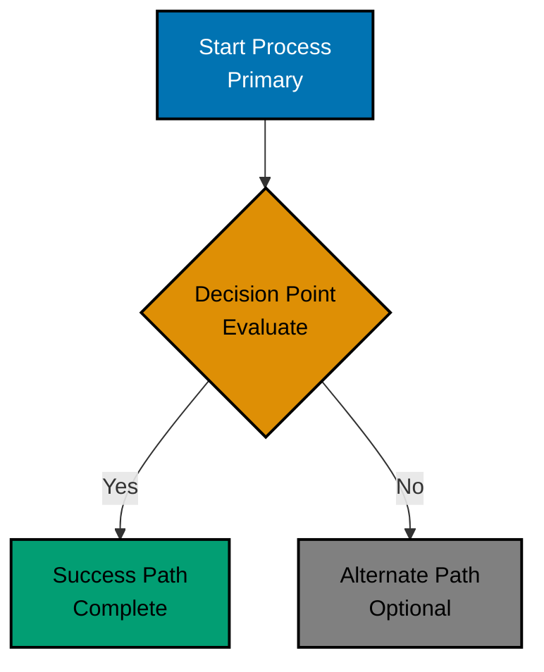

# Accessible Diagrams — Mermaid Best Practices

## Standard Mermaid Template with Accessibility

Use this as a starting point for all Mermaid diagrams:



## Essential Mermaid Rules

1. **Always include palette comment** - First line documents colors used
2. **Use classDef with accessible hex codes** - REQUIRED for accessibility, including a palette
   `classDef default` in every flowchart, graph, class, ER, and requirement diagram
3. **Include black borders** - `stroke:#000000` for shape definition
4. **Use white text on dark fills** - `color:#FFFFFF` for readability
5. **Use black text on light fills** - `color:#000000` when needed
6. **2px stroke width** - `stroke-width:2px` for visibility
7. **Provide descriptive labels** - Never use color-only identification
8. **Prefer vertical orientation** - `graph TD` (top-down) for mobile viewing
9. **Use different shapes** - Rectangles, diamonds, circles for differentiation
10. **Escape special characters** - Parentheses, brackets, braces in node text

## Mermaid Comment Syntax (CRITICAL)

**CORRECT** - Use double-percent for comments:

```text
%% This is a comment
%% Color palette: Blue #0173B2, Orange #DE8F05
```

**WRONG** - Do NOT use this syntax (causes syntax errors):

```text
%%{ This breaks rendering }%%
```

## Escaping Special Characters in Mermaid

**CRITICAL**: Escape special characters in node text AND edge labels to prevent syntax errors:

| Character | Entity Code | Example Usage              |
| --------- | ----------- | -------------------------- |
| `(`       | `#40;`      | `A[Function#40;param#41;]` |
| `)`       | `#41;`      | Same as above              |
| `[`       | `#91;`      | `B[Array#91;index#93;]`    |
| `]`       | `#93;`      | Same as above              |
| `{`       | `#123;`     | `C[Object#123;key#125;]`   |
| `}`       | `#125;`     | Same as above              |
| `<`       | `#60;`      | `D[Generic#60;T#62;]`      |
| `>`       | `#62;`      | Same as above              |

**Edge labels also need escaping:**

```text
A -->|Function#40;param#41;| B
```

**Avoid literal quotes** - Remove or use descriptive text instead:

- ❌ `F[let x = "hello"]` - Breaks rendering
- ✅ `F[let x = hello]` - Works correctly
- ✅ `F[Variable Assignment]` - Descriptive alternative
