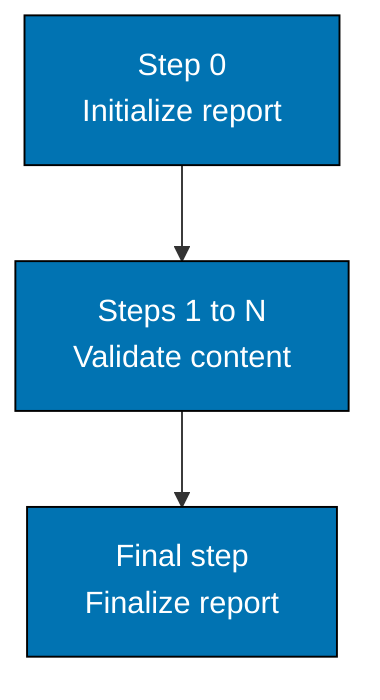

# Maker-Checker-Fixer — Checker Workflow: 5-Step Process

Checker agents follow a consistent 5-step workflow:



The validation steps between the first and the last are domain-specific.

## Step 0: Initialize Report File

**CRITICAL FIRST STEP - Execute before any validation begins.** The exact UUID-generation, chain-tracking,
UTC+7 timestamp, filename pattern, and initial-header commands are defined in the
[repo-generating-validation-reports skill](../../repo-generating-validation-reports/SKILL.md#core-knowledge) —
that skill is the single source of truth for report initialization; do not re-derive it here.
Initializing early (before validation begins) matters because it: creates the file before validation
begins (survives context compaction), enables progressive writing (append findings as discovered),
provides an audit trail even if validation is interrupted, and keeps the file readable throughout
execution.

## Steps 1-N: Validate Content (Domain-Specific)

**Pattern**: Each checker has domain-specific validation steps, but all follow progressive writing.

**Common Validation Step Structure**:

```markdown
### Step {N}: {Validation Type}

**Objective**: {What this step validates}

**Process**:

1. {Discovery action - e.g., "Find all markdown files"}
2. {Extraction action - e.g., "Extract code blocks"}
3. {Validation action - e.g., "Verify against standards"}
4. **Write findings immediately** (progressive writing)

**Success Criteria**: {How to know step completed}

**On Failure**: {Error handling}
```

**Progressive Writing Requirements**:

- Write each finding to report file immediately after discovery
- Don't buffer findings in memory
- Use append mode for file writes
- Include all finding details (file, line, criticality, issue, recommendation)

**Finding Format**:

```markdown
### Finding {N}: {Title}

**File**: path/to/file.md
**Line**: {line-number} (if applicable)
**Criticality**: {CRITICAL/HIGH/MEDIUM/LOW}
**Category**: {category-name}

**Issue**: {Description of what's wrong}

**Recommendation**: {How to fix it}

---
```

**Common Validation Steps by Checker Type**:

**Content Quality Checkers** (docs, readme, tutorial):

1. Step 1: Discovery - Find files to validate
2. Step 2: Structure - Check heading hierarchy, frontmatter
3. Step 3: Content Quality - Verify active voice, accessibility, formatting
4. Step 4: Standards Compliance - Check against conventions
5. Step 5: Cross-References - Validate internal links

**Factual Accuracy Checkers** (docs, facts):

1. Step 1: Discovery - Find files with verifiable claims
2. Step 2: Extraction - Extract commands, versions, code examples
3. Step 3: Verification - Check claims against authoritative sources (WebSearch/WebFetch)
4. Step 4: Classification - Mark as [Verified]/[Error]/[Outdated]/[Unverified]
5. Step 5: Confidence Assessment - Assign confidence levels

**Link Checkers** (link-general, link-specific):

1. Step 1: Discovery - Find all markdown files
2. Step 2: Extraction - Extract internal and external links
3. Step 3: Internal Validation - Check internal references exist
4. Step 4: External Validation - Check external URLs accessible
5. Step 5: Cache Management - Update link cache

**Structure Checkers** (structure, navigation):

1. Step 1: Discovery - Find folder structure
2. Step 2: Organization - Validate folder patterns
3. Step 3: Weights - Check weight ordering system
4. Step 4: Navigation - Verify prev/next links
5. Step 5: Completeness - Check for missing files
