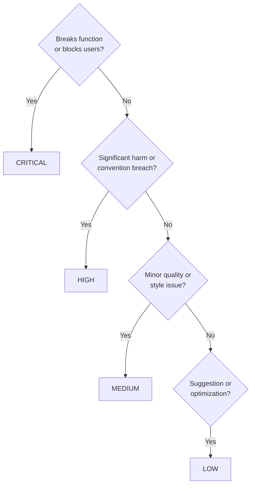

# Criticality-Confidence — Checker Agent Responsibilities

## Categorizing Findings by Criticality

**Decision tree**:



Ask the questions in order and stop at the first yes:

1. Does it break functionality or block users? Then it is CRITICAL.
2. Does it cause significant quality degradation or violate documented conventions? Then it is HIGH.
3. Is it a minor quality issue or style inconsistency? Then it is MEDIUM.
4. Is it a suggestion, optimization, or future consideration? Then it is LOW.

## Standardized Report Format

**Report header**:

```markdown
# [Agent Name] Audit Report

**Audit ID**: {uuid-chain}\_\_{timestamp}
**Scope**: {scope-description}
**Files Checked**: N files
**Audit Start**: YYYY-MM-DDTHH:MM:SS+07:00
**Audit End**: YYYY-MM-DDTHH:MM:SS+07:00

---

## Executive Summary

- 🔴 **CRITICAL Issues**: X (must fix before publication)
- 🟠 **HIGH Issues**: Y (should fix before publication)
- 🟡 **MEDIUM Issues**: Z (improve when time permits)
- 🟢 **LOW Issues**: W (optional enhancements)

**Total Issues**: X + Y + Z + W = TOTAL

**Overall Status**: [PASS | PASS WITH WARNINGS | FAIL]

---
```

**Issue sections**:

````markdown
## 🔴 CRITICAL Issues (Must Fix)

**Count**: X issues found

---

### 1. [Issue Title]

**File**: `path/to/file.md:line`
**Criticality**: CRITICAL - [Why critical]
**Category**: [Category name]

**Finding**: [What's wrong]
**Impact**: [What breaks if not fixed]
**Recommendation**: [How to fix]

**Example**:

```yaml
# Current (broken)
[show broken state]

# Expected (fixed)
[show fixed state]
```
````

**Confidence**: [Will be assessed by fixer]

---

## Dual-Label Pattern

**Five agents require BOTH verification/status AND criticality**:

- `docs-checker` - [Verified]/[Error]/[Outdated]/[Unverified] + criticality
- `docs-tutorial-checker` - Verification labels + criticality
- `apps-ayokoding-www-facts-checker` - Verification labels + criticality
- `docs-link-checker` - [OK]/[BROKEN]/[REDIRECT] + criticality
- `apps-ayokoding-www-link-checker` - Status labels + criticality

**Format**:

```markdown
### 1. [Verification] - Issue Title

**File**: `path/to/file.md:line`
**Verification**: [Error] - [Reason for verification status]
**Criticality**: CRITICAL - [Reason for criticality level]
**Category**: [Category name]

**Finding**: [Description]
**Impact**: [Consequences]
**Recommendation**: [Fix]
**Verification Source**: [URL]

**Confidence**: [Will be assessed by fixer]
```

**Why dual labels?**

- **Verification** describes FACTUAL STATE ([Verified], [Error], etc.)
- **Criticality** describes URGENCY/IMPORTANCE (CRITICAL, HIGH, etc.)
- Both provide complementary information
