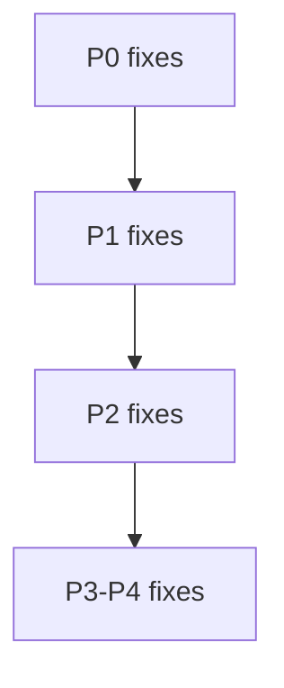

# Criticality-Confidence — Priority Matrix

## Decision Matrix

| Criticality     | HIGH Confidence                                  | MEDIUM Confidence               | FALSE_POSITIVE                                    |
| --------------- | ------------------------------------------------ | ------------------------------- | ------------------------------------------------- |
| 🔴 **CRITICAL** | **P0** - Auto-fix immediately (block deployment) | **P1** - URGENT manual review   | Report with CRITICAL context (fix urgently)       |
| 🟠 **HIGH**     | **P1** - Auto-fix after P0                       | **P2** - Standard manual review | Report with HIGH context (fix soon)               |
| 🟡 **MEDIUM**   | **P2** - Auto-fix after P1 (user approval)       | **P3** - Optional review        | Report with MEDIUM context (note for improvement) |
| 🟢 **LOW**      | **P3** - Batch fixes (user decides when)         | **P4** - Suggestions only       | Report with LOW context (informational)           |

## Priority Levels Explained

- **P0** (Blocker): MUST fix before any publication/deployment
- **P1** (Urgent): SHOULD fix before publication, can proceed with approval
- **P2** (Normal): Fix in current cycle when convenient
- **P3** (Low): Fix in future cycle or batch operation
- **P4** (Optional): Suggestion only, no action required

## Execution Order for Fixers

Fixer agents MUST process findings in strict priority order:

- P0, CRITICAL + HIGH: auto-fix, and block if the fix fails.
- P1, HIGH + HIGH or CRITICAL + MEDIUM: auto-fix HIGH + HIGH, and flag CRITICAL + MEDIUM.
- P2, MEDIUM + HIGH or HIGH + MEDIUM: auto-fix MEDIUM + HIGH if approved, and flag HIGH + MEDIUM.
- P3-P4, LOW priority: include in the summary only.
