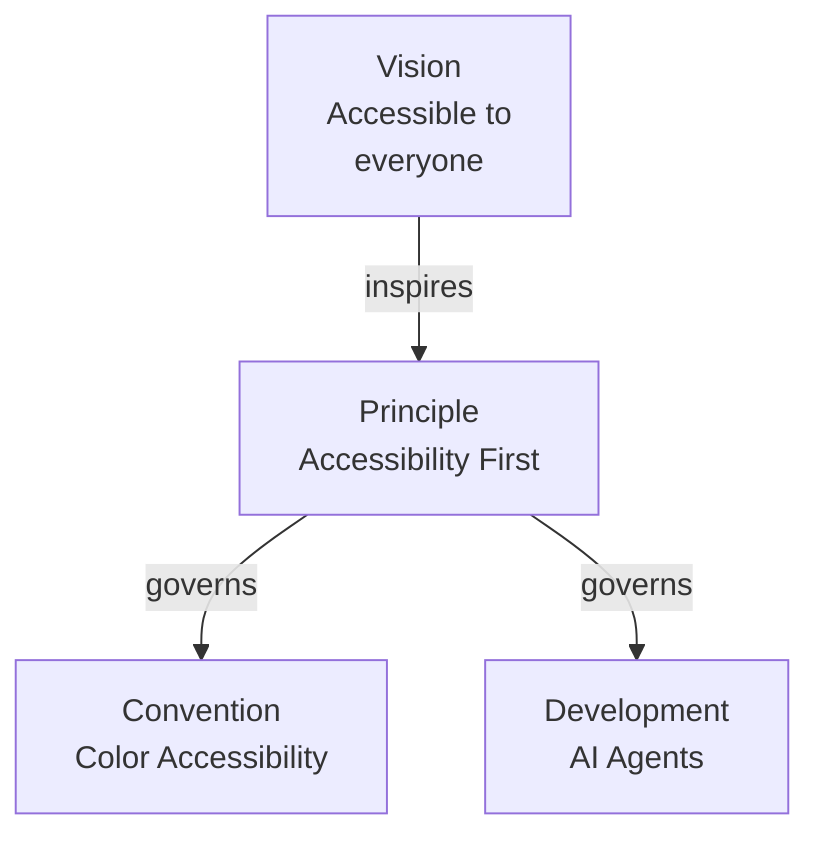

# Repository Architecture — Layers 0-2: Vision, Principles, Conventions

## Layer 0: Vision (WHY WE EXIST)

**Purpose**: Foundational purpose - WHY the project exists and WHAT change we seek.

**Location**: `repo-governance/vision/`

**Key Document**: [Vision - Open Sharia Enterprise](../../../../repo-governance/vision/open-sharia-enterprise.md)

**Core Vision**:

- Democratize Shariah-compliant enterprise
- Make Islamic finance accessible to everyone
- Open-source halal solutions anyone can use

**Characteristics**:

- Immutable foundational purpose
- Changes extremely rarely
- All other layers serve this vision

## Layer 1: Principles (WHY - Values)

**Purpose**: Foundational values that govern all conventions and development practices.

**Location**: `repo-governance/principles/`

**Key Document**: [Core Principles Index](../../../../repo-governance/principles/README.md)

**Principles** (abbreviated):

1. Deliberate Problem-Solving
2. Root Cause Orientation
3. Simplicity Over Complexity
4. Accessibility First
5. Documentation First
6. No Time Estimates
7. Progressive Disclosure
8. Automation Over Manual
9. Explicit Over Implicit
10. Immutability Over Mutability
11. Pure Functions Over Side Effects
12. Reproducibility First

**Requirements**:

- Each principle MUST include "Vision Supported" section
- Stable, rarely change
- Govern both L2 (Conventions) and L3 (Development)

**Example Traceability**:

The development example is the AI Agents Convention: agent colors use the accessible palette.

## Layer 2: Conventions (WHAT - Documentation Rules)

**Purpose**: Documentation standards implementing core principles. Defines WHAT rules for writing, organizing, formatting documentation.

**Location**: `repo-governance/conventions/`

**Key Document**: [Conventions Index](../../../../repo-governance/conventions/README.md)

**Scope**:

- docs/ directory (all markdown)
- ayokoding-web (Next.js), ose-web (Next.js)
- plans/ directory
- README files

**Example Conventions**:

- File Naming Convention
- Linking Convention
- Color Accessibility Convention
- Content Quality Principles
- Diátaxis Framework

**Requirements**:

- Each convention MUST include "Principles Implemented/Respected" section
- Implemented by AI agents (Layer 4)
- Changes more frequently than principles
