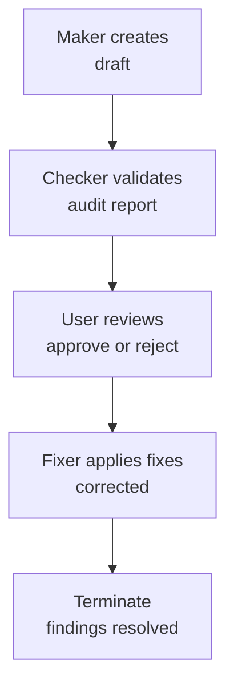

# Repository Architecture — Layers 3-5: Development, AI Agents, Workflows

## Layer 3: Development (HOW - Software Practices)

**Purpose**: Software practices implementing core principles. Defines HOW we develop, test, deploy software.

**Location**: `repo-governance/development/`

**Key Document**: [Development Index](../../../../repo-governance/development/README.md)

**Scope**:

- Source code (JS, TS, future: Java, Kotlin, Python)
- Next.js 16 web applications (ayokoding-web, ose-web)
- Build systems and tooling
- AI agents (.claude/agents/ primary, .opencode/agents/ auto-generated secondary)
- Git workflows

**Example Practices**:

- Trunk Based Development
- Code Quality Convention (git hooks)
- AI Agents Convention
- Maker-Checker-Fixer Pattern
- Implementation Workflow

**Requirements**:

- Each practice MUST include BOTH "Principles Implemented/Respected" AND "Conventions Implemented/Respected" sections
- Implemented by AI agents and automation
- Changes more frequently than conventions

## Layer 4: AI Agents (WHO - Executors)

**Purpose**: Automated implementers enforcing conventions and development practices.

**Location**: `.claude/agents/` (primary; `.opencode/agents/` is auto-generated secondary)

**Key Document**: [Agents Index](../../../agents/README.md)

**Agent Families**:

- **Makers** (Blue) - Create/update content
- **Checkers** (Green) - Validate quality
- **Fixers** (Purple/Yellow) - Apply validated fixes
- **Navigation** - Manage structure
- **Operations** - Deploy and manage

**Characteristics**:

- Each agent enforces specific conventions/practices
- Atomic - one clear responsibility
- Frontmatter: name, description, tools, model, color

**Example Traceability**:

```
Convention: Color Accessibility
    ↓ implemented by
Agent: docs-checker (validates colors)
Agent: docs-fixer (applies corrections)
```

## Layer 5: Workflows (WHEN - Multi-Step Processes)

**Purpose**: Orchestrated multi-step processes that compose agents, procedures, and/or other workflows.

**Location**: `repo-governance/workflows/`

**Key Document**: [Workflows Index](../../../../repo-governance/workflows/README.md)

**Workflow Families**:

- Maker-Checker-Fixer (content quality)
- Check-Fix (iterative validation)
- Plan-Execute-Validate (planning)

**Characteristics**:

- Define sequences (sequential/parallel/conditional)
- Manage state between steps
- Include human approval checkpoints
- Clear termination criteria

**Example**:


