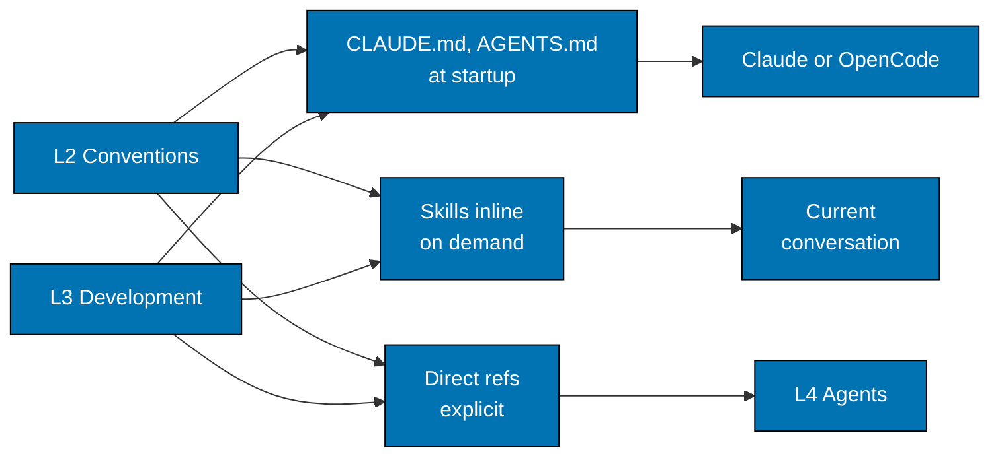
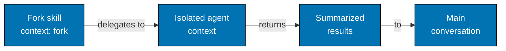

# Repository Architecture — Traceability Example and Where Skills Fit

## Complete Traceability Example

### Color Accessibility (Vision → Agents)

**L0 - Vision**: Democratize Islamic enterprise → accessible to everyone

**L1 - Principle**: Accessibility First

- Vision supported: Accessible tools enable global participation
- Key value: Universal access from start

**L2 - Convention**: Color Accessibility Convention

- Implements: Accessibility First
- Rule: Verified color-blind friendly palette
- WCAG AA compliance required

**L3 - Development**: AI Agents Convention

- Respects: Color Accessibility Convention
- Practice: Agent colors use accessible palette
- Implementation: Frontmatter `color` field limited

**L4 - Agents**:

- docs-checker - Validates diagram colors
- docs-fixer - Applies color corrections
- agent-maker - Validates agent frontmatter colors

**L5 - Workflow**: Maker-Checker-Fixer

- Orchestrates: maker → checker → fixer
- Ensures: All diagrams use accessible colors

## Where Skills Fit in the Architecture

**IMPORTANT**: Skills are **delivery infrastructure**, NOT a governance layer.

Skills sit alongside CLAUDE.md, AGENTS.md and direct references as delivery mechanisms, operating in two distinct modes:

### Inline Skills (Knowledge Delivery)

**Default behaviour** - Progressive knowledge injection:

**Characteristics**:

- Progressive disclosure (name/description → full content on-demand)
- Inject convention/development knowledge into current conversation
- Enable knowledge composition (multiple skills work together)
- Serve agents but don't govern them

### Fork Skills (Task Delegation)

**Delegation behaviour** with `context: fork`:

**Characteristics**:

- Spawn isolated subagent contexts for focused work
- Delegate specialized tasks (research, analysis, exploration)
- Act as lightweight orchestrators
- Return results to main conversation
- Still service relationship (not governance)

**Key insight**: Skills SERVE agents through two modes:

- **Inline skills** - Deliver knowledge from L2/L3 to current conversation
- **Fork skills** - Delegate tasks to agents in isolated contexts
- Neither mode governs agents (service relationship, not governance)

**Governance test**:

- Conventions → Agents: Yes (agents MUST follow conventions)
- Development → Agents: Yes (agents MUST follow practices)
- Skills (inline) → Agents: **No** (inject knowledge, serve agents)
- Skills (fork) → Agents: **No** (delegate tasks, serve agents)
