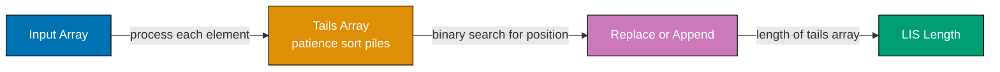
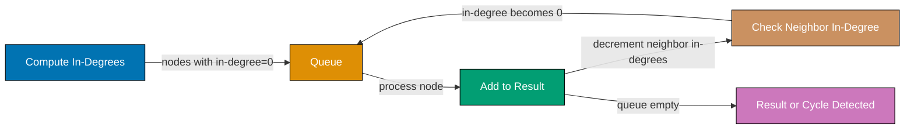
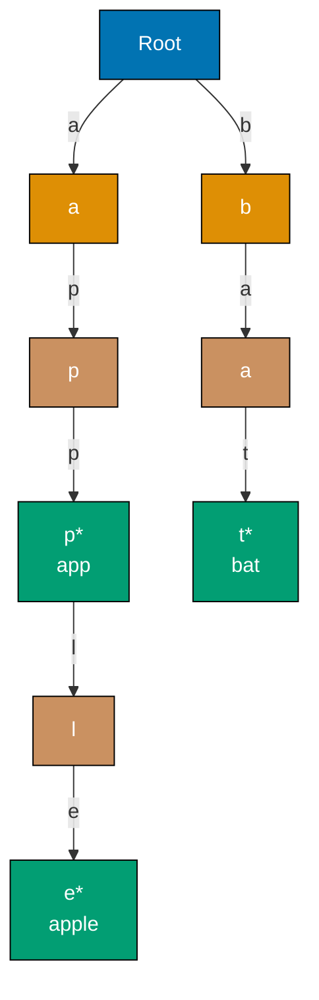
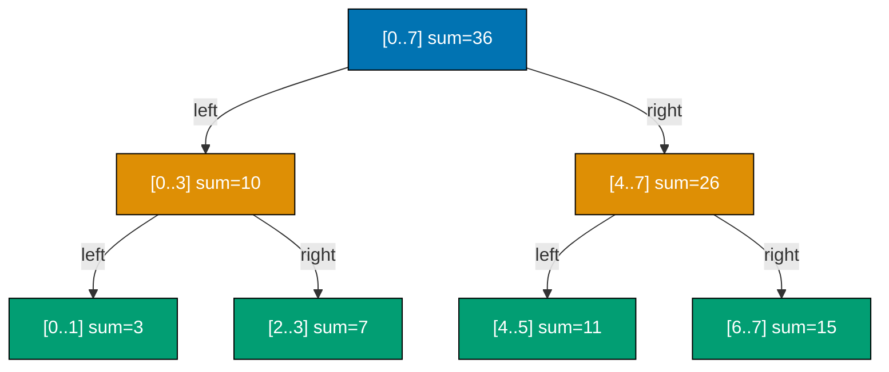
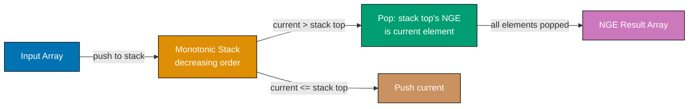
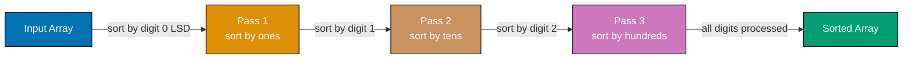
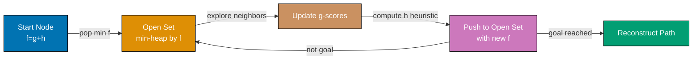

This section covers expert-level algorithms and data structures used in production systems and competitive programming. Each example demonstrates a technique that solves problems standard approaches cannot handle efficiently. Topics span dynamic programming, shortest-path algorithms, prefix trees, range queries, disjoint sets, constraint solving, string matching, bitwise methods, and monotonic data structures. All examples include implementations in C, Go, Python, and Java.

## Dynamic Programming

### Example 58: Memoization — Top-Down Fibonacci

Memoization caches the result of each subproblem the first time it is computed so that repeated calls return in O(1) instead of recomputing exponentially. It transforms a naive O(2^n) recursive solution into O(n) time with O(n) extra space.




```c
#include <stdio.h>
#include <string.h>

// => Use long long for large Fibonacci values; fib(50) exceeds 32-bit range
long long cache[101];
// => cache[i] stores fib(i); -1 means "not yet computed"
int cache_init = 0;

long long fib_memo(int n) {
    if (!cache_init) {
        memset(cache, -1, sizeof(cache));
        // => Initialize all entries to -1 (uncomputed sentinel)
        cache_init = 1;
    }
    if (cache[n] != -1) {
        return cache[n];              // => O(1) lookup: already solved this subproblem
    }
    if (n <= 1) {
        return cache[n] = n;          // => Base cases: fib(0)=0, fib(1)=1
    }
    cache[n] = fib_memo(n - 1) + fib_memo(n - 2);
    // => Store result before returning — this is the memoization step
    // => Without this, fib(50) would require ~2^50 recursive calls (~1 quadrillion)
    return cache[n];                  // => Return cached result
}

int main(void) {
    printf("%lld\n", fib_memo(10));   // => Output: 55
    printf("%lld\n", fib_memo(50));   // => Output: 12586269025 (computed instantly due to cache)
    // => fib(100) exceeds long long range; Python handles arbitrary precision natively
    return 0;
}
```




```go
package main

import "fmt"

// => cache stores computed Fibonacci values; 0 means "not yet computed" (works since fib(0)=0 is a base case)
var cache [101]int64
var computed [101]bool

func fibMemo(n int) int64 {
    if computed[n] {
        return cache[n] // => O(1) lookup: already solved this subproblem
    }
    if n <= 1 {
        computed[n] = true
        cache[n] = int64(n) // => Base cases: fib(0)=0, fib(1)=1
        return cache[n]
    }
    cache[n] = fibMemo(n-1) + fibMemo(n-2)
    // => Store result before returning — this is the memoization step
    // => Without this, fib(50) would require ~2^50 recursive calls (~1 quadrillion)
    computed[n] = true
    return cache[n] // => Return cached result
}

func main() {
    fmt.Println(fibMemo(10)) // => Output: 55
    fmt.Println(fibMemo(50)) // => Output: 12586269025 (computed instantly due to cache)
    // => fib(100) exceeds int64 range; Python handles arbitrary precision natively
}
```




```python
import sys
# => sys provides setrecursionlimit to allow deep recursion for large n
sys.setrecursionlimit(10000)
# => Default Python recursion limit is 1000; fib(5000) needs ~5000 frames

def fib_memo(n, cache={}):
    # => cache is a mutable default argument — persists across calls (intentional)
    # => Python evaluates default arguments once at function definition time
    if n in cache:
        return cache[n]             # => O(1) lookup: already solved this subproblem
    if n <= 1:
        return n                    # => Base cases: fib(0)=0, fib(1)=1
    cache[n] = fib_memo(n - 1, cache) + fib_memo(n - 2, cache)
    # => Store result before returning — this is the memoization step
    # => Without this, fib(50) would require ~2^50 recursive calls (~1 quadrillion)
    return cache[n]                 # => Return cached result

print(fib_memo(10))   # => Output: 55
print(fib_memo(50))   # => Output: 12586269025 (computed instantly due to cache)
print(fib_memo(100))  # => Output: 354224848179261915075
# => Without memoization, fib(100) would run for longer than the age of the universe
```




```java
import java.util.HashMap;
import java.util.Map;

public class FibMemo {
    // => cache stores computed Fibonacci values
    private static Map<Integer, Long> cache = new HashMap<>();

    public static long fibMemo(int n) {
        if (cache.containsKey(n)) {
            return cache.get(n);              // => O(1) lookup: already solved this subproblem
        }
        if (n <= 1) {
            return n;                         // => Base cases: fib(0)=0, fib(1)=1
        }
        long result = fibMemo(n - 1) + fibMemo(n - 2);
        // => Store result before returning — this is the memoization step
        // => Without this, fib(50) would require ~2^50 recursive calls (~1 quadrillion)
        cache.put(n, result);
        return result;                        // => Return cached result
    }

    public static void main(String[] args) {
        System.out.println(fibMemo(10));      // => Output: 55
        System.out.println(fibMemo(50));      // => Output: 12586269025 (computed instantly due to cache)
        // => fib(100) exceeds long range; Python handles arbitrary precision natively
    }
}
```




**Key Takeaway**: Memoization eliminates redundant computation in recursive problems by caching results keyed on function arguments. Apply it whenever you see overlapping subproblems in a recursive call tree.

**Why It Matters**: Memoization is the first optimization technique to reach for when a brute-force recursion is correct but too slow. Production systems use it in route-planning, NLP parsing (CYK algorithm), game AI (minimax with alpha-beta pruning), and compiler optimization passes. The pattern extends beyond Fibonacci to any pure function called repeatedly with the same arguments, including database query result caching and HTTP response caching middleware.

---

### Example 59: Tabulation — Bottom-Up Knapsack

Tabulation builds the solution table iteratively from the smallest subproblems up, avoiding recursion overhead and stack-depth limits. The 0/1 Knapsack problem asks: given items with weights and values, which subset fits in capacity W and maximizes value?

```mermaid
%% Color Palette: Blue #0173B2, Orange #DE8F05, Teal #029E73, Purple #CC78BC, Brown #CA9161
graph LR
    A["Items + Capacity"] -->|fill table row by row| B["dp table n x W+1"]
    B -->|read dp[n][W]| C["Maximum Value"]
    B -->|backtrack through table| D["Selected Items"]

    style A fill:#0173B2,stroke:#000,color:#fff
    style B fill:#DE8F05,stroke:#000,color:#fff
    style C fill:#029E73,stroke:#000,color:#fff
    style D fill:#CC78BC,stroke:#000,color:#fff
```




```c
#include <stdio.h>

// => Returns max of two integers
int max(int a, int b) { return a > b ? a : b; }

int knapsack_01(int weights[], int values[], int n, int capacity) {
    // => weights[i] and values[i] describe item i
    // => capacity is the maximum weight the knapsack can hold
    int dp[n + 1][capacity + 1];
    // => dp[i][w] = max value using first i items with weight limit w
    // => All initialized to 0: no items or no capacity -> zero value

    for (int i = 0; i <= n; i++) {
        for (int w = 0; w <= capacity; w++) {
            if (i == 0 || w == 0) {
                dp[i][w] = 0;                 // => Base case
            } else {
                // => Option 1: skip item i (don't include it)
                dp[i][w] = dp[i - 1][w];     // => Inherit value from previous row
                int wi = weights[i - 1];      // => Weight of current item (0-indexed)
                int vi = values[i - 1];       // => Value of current item (0-indexed)
                if (wi <= w) {
                    // => Option 2: include item i if it fits
                    int include = dp[i - 1][w - wi] + vi;
                    // => dp[i-1][w-wi]: best value with remaining capacity after taking item i
                    dp[i][w] = max(dp[i][w], include);
                    // => Take the better of skipping or including
                }
            }
        }
    }
    return dp[n][capacity];                   // => Maximum achievable value
}

int main(void) {
    int weights[] = {2, 3, 4, 5};
    int values[]  = {3, 4, 5, 6};
    int W = 5;
    printf("%d\n", knapsack_01(weights, values, 4, W)); // => Output: 7
    // => Best: item 0 (weight=2, value=3) + item 1 (weight=3, value=4) = total weight 5, value 7
    return 0;
}
```




```go
package main

import "fmt"

func knapsack01(weights, values []int, capacity int) int {
    // => weights[i] and values[i] describe item i
    // => capacity is the maximum weight the knapsack can hold
    n := len(weights)
    dp := make([][]int, n+1)
    for i := range dp {
        dp[i] = make([]int, capacity+1)
    }
    // => dp[i][w] = max value using first i items with weight limit w
    // => All initialized to 0: no items or no capacity -> zero value

    for i := 1; i <= n; i++ { // => Process each item 1..n
        for w := 0; w <= capacity; w++ { // => For each capacity 0..W
            // => Option 1: skip item i (don't include it)
            dp[i][w] = dp[i-1][w] // => Inherit value from previous row
            wi := weights[i-1]    // => Weight of current item (0-indexed)
            vi := values[i-1]     // => Value of current item (0-indexed)
            if wi <= w {
                // => Option 2: include item i if it fits
                include := dp[i-1][w-wi] + vi
                // => dp[i-1][w-wi]: best value with remaining capacity after taking item i
                if include > dp[i][w] {
                    dp[i][w] = include
                }
                // => Take the better of skipping or including
            }
        }
    }
    return dp[n][capacity] // => Maximum achievable value
}

func main() {
    weights := []int{2, 3, 4, 5}
    values := []int{3, 4, 5, 6}
    W := 5
    fmt.Println(knapsack01(weights, values, W)) // => Output: 7
    // => Best: item 0 (weight=2, value=3) + item 1 (weight=3, value=4) = total weight 5, value 7
}
```




```python
def knapsack_01(weights, values, capacity):
    # => weights[i] and values[i] describe item i
    # => capacity is the maximum weight the knapsack can hold
    n = len(weights)                          # => n is number of items
    dp = [[0] * (capacity + 1) for _ in range(n + 1)]
    # => dp[i][w] = max value using first i items with weight limit w
    # => dp is (n+1) x (capacity+1) to handle 0-item and 0-capacity base cases
    # => All initialized to 0: no items or no capacity → zero value

    for i in range(1, n + 1):               # => Process each item 1..n
        for w in range(capacity + 1):       # => For each capacity 0..W
            # => Option 1: skip item i (don't include it)
            dp[i][w] = dp[i - 1][w]        # => Inherit value from previous row
            wi = weights[i - 1]             # => Weight of current item (0-indexed)
            vi = values[i - 1]              # => Value of current item (0-indexed)
            if wi <= w:
                # => Option 2: include item i if it fits
                include = dp[i - 1][w - wi] + vi
                # => dp[i-1][w-wi]: best value with remaining capacity after taking item i
                dp[i][w] = max(dp[i][w], include)
                # => Take the better of skipping or including

    return dp[n][capacity]                  # => Maximum achievable value

weights = [2, 3, 4, 5]
values  = [3, 4, 5, 6]
W       = 5
print(knapsack_01(weights, values, W))      # => Output: 7
# => Best: item 0 (weight=2, value=3) + item 1 (weight=3, value=4) = total weight 5, value 7
```




```java
public class Knapsack01 {
    public static int knapsack01(int[] weights, int[] values, int capacity) {
        // => weights[i] and values[i] describe item i
        // => capacity is the maximum weight the knapsack can hold
        int n = weights.length;               // => n is number of items
        int[][] dp = new int[n + 1][capacity + 1];
        // => dp[i][w] = max value using first i items with weight limit w
        // => All initialized to 0: no items or no capacity -> zero value

        for (int i = 1; i <= n; i++) {       // => Process each item 1..n
            for (int w = 0; w <= capacity; w++) { // => For each capacity 0..W
                // => Option 1: skip item i (don't include it)
                dp[i][w] = dp[i - 1][w];    // => Inherit value from previous row
                int wi = weights[i - 1];     // => Weight of current item (0-indexed)
                int vi = values[i - 1];      // => Value of current item (0-indexed)
                if (wi <= w) {
                    // => Option 2: include item i if it fits
                    int include = dp[i - 1][w - wi] + vi;
                    // => dp[i-1][w-wi]: best value with remaining capacity after taking item i
                    dp[i][w] = Math.max(dp[i][w], include);
                    // => Take the better of skipping or including
                }
            }
        }
        return dp[n][capacity];              // => Maximum achievable value
    }

    public static void main(String[] args) {
        int[] weights = {2, 3, 4, 5};
        int[] values  = {3, 4, 5, 6};
        int W = 5;
        System.out.println(knapsack01(weights, values, W)); // => Output: 7
        // => Best: item 0 (weight=2, value=3) + item 1 (weight=3, value=4) = total weight 5, value 7
    }
}
```




**Key Takeaway**: The 0/1 Knapsack DP table runs in O(n·W) time and space. Each cell represents the optimal solution for a subproblem defined by item count and remaining capacity.

**Why It Matters**: Knapsack variants appear across scheduling (allocating CPU budget to jobs), finance (portfolio optimization under capital constraints), logistics (packing shipments), and feature selection in machine learning. Understanding the DP table construction lets you adapt the pattern to unbounded knapsack, multi-dimensional constraints, and fractional relaxations used in branch-and-bound solvers.

---

### Example 60: Longest Common Subsequence (LCS)

LCS finds the longest sequence of characters (not necessarily contiguous) present in both strings in order. It underpins diff utilities, DNA sequence alignment, and plagiarism detection.




```c
#include <stdio.h>
#include <string.h>

void lcs(const char *s1, const char *s2) {
    int m = strlen(s1), n = strlen(s2);
    int dp[m + 1][n + 1];
    // => dp[i][j] = LCS length of s1[:i] and s2[:j]
    // => Extra row/col for empty-string base cases (all zeros)
    memset(dp, 0, sizeof(dp));

    for (int i = 1; i <= m; i++) {
        for (int j = 1; j <= n; j++) {
            if (s1[i - 1] == s2[j - 1]) {
                dp[i][j] = dp[i - 1][j - 1] + 1;
                // => Characters match: extend LCS by 1
            } else {
                dp[i][j] = dp[i - 1][j] > dp[i][j - 1] ? dp[i - 1][j] : dp[i][j - 1];
                // => No match: take better of skipping a character from either string
            }
        }
    }

    // => Reconstruct the actual LCS string by backtracking through dp table
    char lcs_str[m + n + 1];
    int idx = 0;
    int i = m, j = n;                         // => Start from bottom-right corner
    while (i > 0 && j > 0) {
        if (s1[i - 1] == s2[j - 1]) {
            lcs_str[idx++] = s1[i - 1];       // => This character is in the LCS
            i--;
            j--;
        } else if (dp[i - 1][j] > dp[i][j - 1]) {
            i--;                              // => Move up: came from dp[i-1][j]
        } else {
            j--;                              // => Move left: came from dp[i][j-1]
        }
    }
    // => Reverse because we backtracked
    for (int l = 0; l < idx / 2; l++) {
        char tmp = lcs_str[l];
        lcs_str[l] = lcs_str[idx - 1 - l];
        lcs_str[idx - 1 - l] = tmp;
    }
    lcs_str[idx] = '\0';

    printf("%d\n", dp[m][n]);                 // => Output: 4
    printf("%s\n", lcs_str);                  // => Output: BCBA
}

int main(void) {
    lcs("ABCBDAB", "BDCABA");
    return 0;
}
```




```go
package main

import "fmt"

func lcs(s1, s2 string) (int, string) {
    m, n := len(s1), len(s2) // => m=len(s1), n=len(s2)
    dp := make([][]int, m+1)
    for i := range dp {
        dp[i] = make([]int, n+1)
    }
    // => dp[i][j] = LCS length of s1[:i] and s2[:j]
    // => Extra row/col for empty-string base cases (all zeros)

    for i := 1; i <= m; i++ {
        for j := 1; j <= n; j++ {
            if s1[i-1] == s2[j-1] {
                dp[i][j] = dp[i-1][j-1] + 1
                // => Characters match: extend LCS by 1
            } else {
                if dp[i-1][j] > dp[i][j-1] {
                    dp[i][j] = dp[i-1][j]
                } else {
                    dp[i][j] = dp[i][j-1]
                }
                // => No match: take better of skipping a character from either string
            }
        }
    }

    // => Reconstruct the actual LCS string by backtracking through dp table
    lcsStr := []byte{}
    i, j := m, n // => Start from bottom-right corner
    for i > 0 && j > 0 {
        if s1[i-1] == s2[j-1] {
            lcsStr = append(lcsStr, s1[i-1]) // => This character is in the LCS
            i--
            j--
        } else if dp[i-1][j] > dp[i][j-1] {
            i-- // => Move up: came from dp[i-1][j]
        } else {
            j-- // => Move left: came from dp[i][j-1]
        }
    }
    // => Reverse because we backtracked
    for l, r := 0, len(lcsStr)-1; l < r; l, r = l+1, r-1 {
        lcsStr[l], lcsStr[r] = lcsStr[r], lcsStr[l]
    }
    return dp[m][n], string(lcsStr)
}

func main() {
    length, seq := lcs("ABCBDAB", "BDCABA")
    fmt.Println(length) // => Output: 4
    fmt.Println(seq)    // => Output: BCBA  (one valid LCS; others like BDAB also valid)
}
```




```python
def lcs(s1, s2):
    m, n = len(s1), len(s2)                   # => m=len(s1), n=len(s2)
    dp = [[0] * (n + 1) for _ in range(m + 1)]
    # => dp[i][j] = LCS length of s1[:i] and s2[:j]
    # => Extra row/col for empty-string base cases (all zeros)

    for i in range(1, m + 1):
        for j in range(1, n + 1):
            if s1[i - 1] == s2[j - 1]:
                dp[i][j] = dp[i - 1][j - 1] + 1
                # => Characters match: extend LCS by 1
            else:
                dp[i][j] = max(dp[i - 1][j], dp[i][j - 1])
                # => No match: take better of skipping a character from either string

    # => Reconstruct the actual LCS string by backtracking through dp table
    lcs_str = []
    i, j = m, n                               # => Start from bottom-right corner
    while i > 0 and j > 0:
        if s1[i - 1] == s2[j - 1]:
            lcs_str.append(s1[i - 1])         # => This character is in the LCS
            i -= 1
            j -= 1
        elif dp[i - 1][j] > dp[i][j - 1]:
            i -= 1                            # => Move up: came from dp[i-1][j]
        else:
            j -= 1                            # => Move left: came from dp[i][j-1]
    lcs_str.reverse()                         # => Reverse because we backtracked
    return dp[m][n], "".join(lcs_str)

length, seq = lcs("ABCBDAB", "BDCABA")
print(length)   # => Output: 4
print(seq)      # => Output: BCBA  (one valid LCS; others like BDAB also valid)
```




```java
public class LCS {
    public static void main(String[] args) {
        String s1 = "ABCBDAB", s2 = "BDCABA";
        int m = s1.length(), n = s2.length(); // => m=len(s1), n=len(s2)
        int[][] dp = new int[m + 1][n + 1];
        // => dp[i][j] = LCS length of s1[:i] and s2[:j]
        // => Extra row/col for empty-string base cases (all zeros)

        for (int i = 1; i <= m; i++) {
            for (int j = 1; j <= n; j++) {
                if (s1.charAt(i - 1) == s2.charAt(j - 1)) {
                    dp[i][j] = dp[i - 1][j - 1] + 1;
                    // => Characters match: extend LCS by 1
                } else {
                    dp[i][j] = Math.max(dp[i - 1][j], dp[i][j - 1]);
                    // => No match: take better of skipping a character from either string
                }
            }
        }

        // => Reconstruct the actual LCS string by backtracking through dp table
        StringBuilder lcsStr = new StringBuilder();
        int i = m, j = n;                    // => Start from bottom-right corner
        while (i > 0 && j > 0) {
            if (s1.charAt(i - 1) == s2.charAt(j - 1)) {
                lcsStr.append(s1.charAt(i - 1)); // => This character is in the LCS
                i--;
                j--;
            } else if (dp[i - 1][j] > dp[i][j - 1]) {
                i--;                          // => Move up: came from dp[i-1][j]
            } else {
                j--;                          // => Move left: came from dp[i][j-1]
            }
        }
        lcsStr.reverse();                     // => Reverse because we backtracked

        System.out.println(dp[m][n]);         // => Output: 4
        System.out.println(lcsStr.toString()); // => Output: BCBA  (one valid LCS; others like BDAB also valid)
    }
}
```




**Key Takeaway**: LCS runs in O(m·n) time and space. The DP recurrence has two cases: characters match (extend by 1) or they don't (take the max of two neighbors in the table).

**Why It Matters**: Git's `diff` command, `patch` utilities, and code review tools all rely on LCS or edit-distance variants to show what changed between file versions. Bioinformatics tools like BLAST use LCS to align DNA and protein sequences across genomes. Understanding LCS gives you the foundation for edit distance (Levenshtein), which powers spell checkers, fuzzy search, and OCR post-correction in production systems.

---

### Example 61: Longest Increasing Subsequence (LIS)

LIS finds the length of the longest strictly increasing subsequence in an array. The O(n log n) patience-sorting approach improves on the naive O(n²) DP.






```c
#include <stdio.h>

// => Binary search: find leftmost position where tails[pos] >= num
int bisect_left(int tails[], int size, int num) {
    int lo = 0, hi = size;
    while (lo < hi) {
        int mid = (lo + hi) / 2;
        if (tails[mid] < num) {
            lo = mid + 1;
        } else {
            hi = mid;
        }
    }
    return lo;
}

int lis_length(int nums[], int n) {
    int tails[n];
    // => tails[i] = smallest tail element of all increasing subsequences of length i+1
    // => tails is always sorted (maintained as invariant)
    int size = 0;

    for (int i = 0; i < n; i++) {
        int pos = bisect_left(tails, size, nums[i]);
        // => Binary search: find leftmost position where num can be inserted
        // => O(log n) per element instead of O(n) linear scan
        if (pos == size) {
            tails[size++] = nums[i]; // => num extends the longest subsequence found so far
        } else {
            tails[pos] = nums[i];    // => Replace: num is a better (smaller) tail for length pos+1
            // => This greedy replacement keeps tails as small as possible
            // => Smaller tails allow more elements to extend subsequences later
        }
    }
    return size;                     // => Length of tails = LIS length
}

int main(void) {
    int nums[] = {10, 9, 2, 5, 3, 7, 101, 18};
    printf("%d\n", lis_length(nums, 8)); // => Output: 4
    // => One LIS is [2, 3, 7, 18] or [2, 5, 7, 18] or [2, 3, 7, 101]
    return 0;
}
```




```go
package main

import (
    "fmt"
    "sort"
)

func lisLength(nums []int) int {
    tails := []int{}
    // => tails[i] = smallest tail element of all increasing subsequences of length i+1
    // => tails is always sorted (maintained as invariant)

    for _, num := range nums {
        pos := sort.SearchInts(tails, num)
        // => Binary search: find leftmost position where num can be inserted
        // => O(log n) per element instead of O(n) linear scan
        if pos == len(tails) {
            tails = append(tails, num) // => num extends the longest subsequence found so far
        } else {
            tails[pos] = num // => Replace: num is a better (smaller) tail for length pos+1
            // => This greedy replacement keeps tails as small as possible
            // => Smaller tails allow more elements to extend subsequences later
        }
    }
    return len(tails) // => Length of tails = LIS length
}

func main() {
    nums := []int{10, 9, 2, 5, 3, 7, 101, 18}
    fmt.Println(lisLength(nums)) // => Output: 4
    // => One LIS is [2, 3, 7, 18] or [2, 5, 7, 18] or [2, 3, 7, 101]
    // => The tails array after processing: [2, 3, 7, 18] (not the actual LIS, but its length is correct)
}
```




```python
import bisect
# => bisect provides binary search on sorted lists (standard library)

def lis_length(nums):
    tails = []
    # => tails[i] = smallest tail element of all increasing subsequences of length i+1
    # => tails is always sorted (maintained as invariant)

    for num in nums:
        pos = bisect.bisect_left(tails, num)
        # => Binary search: find leftmost position where num can be inserted
        # => O(log n) per element instead of O(n) linear scan
        if pos == len(tails):
            tails.append(num)       # => num extends the longest subsequence found so far
        else:
            tails[pos] = num        # => Replace: num is a better (smaller) tail for length pos+1
            # => This greedy replacement keeps tails as small as possible
            # => Smaller tails allow more elements to extend subsequences later

    return len(tails)               # => Length of tails = LIS length

nums = [10, 9, 2, 5, 3, 7, 101, 18]
print(lis_length(nums))             # => Output: 4
# => One LIS is [2, 3, 7, 18] or [2, 5, 7, 18] or [2, 3, 7, 101]
# => The tails array after processing: [2, 3, 7, 18] (not the actual LIS, but its length is correct)
```




```java
import java.util.ArrayList;
import java.util.Collections;
import java.util.List;

public class LIS {
    public static int lisLength(int[] nums) {
        List<Integer> tails = new ArrayList<>();
        // => tails[i] = smallest tail element of all increasing subsequences of length i+1
        // => tails is always sorted (maintained as invariant)

        for (int num : nums) {
            int pos = Collections.binarySearch(tails, num);
            if (pos < 0) pos = -(pos + 1);
            // => binarySearch returns -(insertion point)-1 when not found
            // => O(log n) per element instead of O(n) linear scan
            if (pos == tails.size()) {
                tails.add(num);              // => num extends the longest subsequence found so far
            } else {
                tails.set(pos, num);         // => Replace: num is a better (smaller) tail for length pos+1
                // => This greedy replacement keeps tails as small as possible
                // => Smaller tails allow more elements to extend subsequences later
            }
        }
        return tails.size();                 // => Length of tails = LIS length
    }

    public static void main(String[] args) {
        int[] nums = {10, 9, 2, 5, 3, 7, 101, 18};
        System.out.println(lisLength(nums)); // => Output: 4
        // => One LIS is [2, 3, 7, 18] or [2, 5, 7, 18] or [2, 3, 7, 101]
    }
}
```




**Key Takeaway**: The patience-sort approach achieves O(n log n) by maintaining a sorted `tails` array where binary search finds the correct position for each new element. The length of `tails` equals the LIS length.

**Why It Matters**: LIS underlies scheduling problems (scheduling non-overlapping tasks on a timeline), the Dilworth theorem (partitioning a poset into chains), and network packet reordering detection. The O(n log n) improvement over naive DP matters when processing large data streams or when called in a loop over many subarrays.

---

### Example 62: Coin Change — Minimum Coins

Given coin denominations and a target amount, find the minimum number of coins needed to make that amount. This classic unbounded knapsack variant demonstrates bottom-up DP with reuse.




```c
#include <stdio.h>
#include <limits.h>

int coin_change(int coins[], int num_coins, int amount) {
    int dp[amount + 1];
    // => dp[i] = minimum coins to make amount i
    // => Initialize all to INT_MAX (impossible) except dp[0]
    for (int i = 0; i <= amount; i++) dp[i] = INT_MAX;
    dp[0] = 0;                                // => Base case: 0 coins needed for amount 0

    for (int i = 1; i <= amount; i++) {       // => Fill dp table from 1 to amount
        for (int c = 0; c < num_coins; c++) {
            if (coins[c] <= i && dp[i - coins[c]] != INT_MAX) {
                // => coin fits: can we do better using this coin?
                int candidate = dp[i - coins[c]] + 1;
                if (candidate < dp[i]) dp[i] = candidate;
                // => +1 for using this coin; dp[i-coin] subproblem already solved
            }
        }
    }
    return dp[amount] != INT_MAX ? dp[amount] : -1;
    // => Return -1 if amount is unreachable with given coins
}

int main(void) {
    int coins1[] = {1, 5, 6, 9};
    printf("%d\n", coin_change(coins1, 4, 11));  // => Output: 2  (coins: 5+6)
    int coins2[] = {2};
    printf("%d\n", coin_change(coins2, 1, 3));   // => Output: -1 (3 unreachable with only even coins)
    int coins3[] = {1, 2, 5};
    printf("%d\n", coin_change(coins3, 3, 11));  // => Output: 3  (coins: 5+5+1)
    return 0;
}
```




```go
package main

import (
    "fmt"
    "math"
)

func coinChange(coins []int, amount int) int {
    INF := math.MaxInt32                      // => Sentinel for "impossible" states
    dp := make([]int, amount+1)
    // => dp[i] = minimum coins to make amount i
    // => Initialize all to INF (impossible) except dp[0]
    for i := range dp {
        dp[i] = INF
    }
    dp[0] = 0 // => Base case: 0 coins needed for amount 0

    for i := 1; i <= amount; i++ { // => Fill dp table from 1 to amount
        for _, coin := range coins {
            if coin <= i && dp[i-coin] != INF {
                // => coin fits: can we do better using this coin?
                candidate := dp[i-coin] + 1
                if candidate < dp[i] {
                    dp[i] = candidate
                }
                // => +1 for using this coin; dp[i-coin] subproblem already solved
            }
        }
    }
    if dp[amount] != INF {
        return dp[amount]
    }
    return -1 // => Return -1 if amount is unreachable with given coins
}

func main() {
    fmt.Println(coinChange([]int{1, 5, 6, 9}, 11)) // => Output: 2  (coins: 5+6)
    fmt.Println(coinChange([]int{2}, 3))            // => Output: -1 (3 unreachable with only even coins)
    fmt.Println(coinChange([]int{1, 2, 5}, 11))     // => Output: 3  (coins: 5+5+1)
}
```




```python
def coin_change(coins, amount):
    INF = float('inf')                        # => Sentinel for "impossible" states
    dp = [INF] * (amount + 1)
    # => dp[i] = minimum coins to make amount i
    # => Initialize all to INF (impossible) except dp[0]
    dp[0] = 0                                 # => Base case: 0 coins needed for amount 0

    for i in range(1, amount + 1):           # => Fill dp table from 1 to amount
        for coin in coins:
            if coin <= i and dp[i - coin] != INF:
                # => coin fits: can we do better using this coin?
                dp[i] = min(dp[i], dp[i - coin] + 1)
                # => +1 for using this coin; dp[i-coin] subproblem already solved

    return dp[amount] if dp[amount] != INF else -1
    # => Return -1 if amount is unreachable with given coins

print(coin_change([1, 5, 6, 9], 11))         # => Output: 2  (coins: 5+6)
print(coin_change([2], 3))                    # => Output: -1 (3 unreachable with only even coins)
print(coin_change([1, 2, 5], 11))             # => Output: 3  (coins: 5+5+1)
```




```java
import java.util.Arrays;

public class CoinChange {
    public static int coinChange(int[] coins, int amount) {
        int INF = Integer.MAX_VALUE;          // => Sentinel for "impossible" states
        int[] dp = new int[amount + 1];
        // => dp[i] = minimum coins to make amount i
        // => Initialize all to INF (impossible) except dp[0]
        Arrays.fill(dp, INF);
        dp[0] = 0;                            // => Base case: 0 coins needed for amount 0

        for (int i = 1; i <= amount; i++) {  // => Fill dp table from 1 to amount
            for (int coin : coins) {
                if (coin <= i && dp[i - coin] != INF) {
                    // => coin fits: can we do better using this coin?
                    dp[i] = Math.min(dp[i], dp[i - coin] + 1);
                    // => +1 for using this coin; dp[i-coin] subproblem already solved
                }
            }
        }
        return dp[amount] != INF ? dp[amount] : -1;
        // => Return -1 if amount is unreachable with given coins
    }

    public static void main(String[] args) {
        System.out.println(coinChange(new int[]{1, 5, 6, 9}, 11)); // => Output: 2  (coins: 5+6)
        System.out.println(coinChange(new int[]{2}, 3));           // => Output: -1 (3 unreachable with only even coins)
        System.out.println(coinChange(new int[]{1, 2, 5}, 11));   // => Output: 3  (coins: 5+5+1)
    }
}
```




**Key Takeaway**: Coin change DP fills a 1D table where each cell represents the best solution using all previously computed results. The recurrence is `dp[i] = min(dp[i - coin] + 1)` for each valid coin.

**Why It Matters**: Coin change generalizes to any problem of combining elements to reach a target with minimum count or cost: cutting stock problems in manufacturing, transaction fee minimization in payment systems, and tile-placement optimization in game engines. The unbounded variant (coins reusable) models real inventory scenarios better than the 0/1 variant.

---

## Graph Algorithms

### Example 63: Dijkstra's Shortest Path

Dijkstra's algorithm finds the shortest path from a source vertex to all other vertices in a weighted graph with non-negative edge weights. Using a min-heap achieves O((V + E) log V) time.

```mermaid
%% Color Palette: Blue #0173B2, Orange #DE8F05, Teal #029E73, Purple #CC78BC, Brown #CA9161
graph LR
    A["Source Node<br/>dist=0"] -->|relax neighbors| B["Min-Heap<br/>priority queue"]
    B -->|pop smallest dist| C["Current Node"]
    C -->|update dist[v] if shorter| D["Neighbor v"]
    D -->|push updated dist| B
    C -->|all nodes settled| E["Shortest Distances"]

    style A fill:#0173B2,stroke:#000,color:#fff
    style B fill:#DE8F05,stroke:#000,color:#fff
    style C fill:#CC78BC,stroke:#000,color:#fff
    style D fill:#CA9161,stroke:#000,color:#fff
    style E fill:#029E73,stroke:#000,color:#fff
```




```c
#include <stdio.h>
#include <limits.h>

#define MAXV 100
#define INF INT_MAX

// => Simple min-heap for (distance, vertex) pairs
typedef struct { int dist; int node; } HeapItem;
typedef struct {
    HeapItem data[MAXV * MAXV];
    int size;
} MinHeap;

void heap_push(MinHeap *h, int dist, int node) {
    int i = h->size++;
    h->data[i] = (HeapItem){dist, node};
    while (i > 0) {
        int p = (i - 1) / 2;
        if (h->data[p].dist <= h->data[i].dist) break;
        HeapItem tmp = h->data[p]; h->data[p] = h->data[i]; h->data[i] = tmp;
        i = p;
    }
}

HeapItem heap_pop(MinHeap *h) {
    HeapItem top = h->data[0];
    h->data[0] = h->data[--h->size];
    int i = 0;
    while (1) {
        int l = 2*i+1, r = 2*i+2, m = i;
        if (l < h->size && h->data[l].dist < h->data[m].dist) m = l;
        if (r < h->size && h->data[r].dist < h->data[m].dist) m = r;
        if (m == i) break;
        HeapItem tmp = h->data[i]; h->data[i] = h->data[m]; h->data[m] = tmp;
        i = m;
    }
    return top;
}

// => Adjacency list representation
typedef struct { int weight; int to; } Edge;
Edge adj[MAXV][MAXV];
int adj_size[MAXV];

void dijkstra(int n, int source, int dist[]) {
    // => dist[v] = current best known distance from source to v
    for (int i = 0; i < n; i++) dist[i] = INF;
    dist[source] = 0;                         // => Distance from source to itself is 0

    MinHeap heap = {.size = 0};
    heap_push(&heap, 0, source);              // => Min-heap: (distance, node)

    while (heap.size > 0) {
        HeapItem item = heap_pop(&heap);      // => Extract node with minimum distance; O(log V)
        int d = item.dist, u = item.node;
        if (d > dist[u]) continue;            // => Stale entry: a shorter path was already found
        for (int i = 0; i < adj_size[u]; i++) {
            int w = adj[u][i].weight, v = adj[u][i].to;
            int new_dist = dist[u] + w;       // => Candidate distance to v via u
            if (new_dist < dist[v]) {
                dist[v] = new_dist;           // => Found shorter path to v
                heap_push(&heap, new_dist, v);
            }
        }
    }
}

int main(void) {
    // => Map: A=0, B=1, C=2, D=3
    int n = 4;
    for (int i = 0; i < n; i++) adj_size[i] = 0;
    adj[0][adj_size[0]++] = (Edge){1, 1}; // => A -> B weight 1
    adj[0][adj_size[0]++] = (Edge){4, 2}; // => A -> C weight 4
    adj[1][adj_size[1]++] = (Edge){2, 2}; // => B -> C weight 2
    adj[1][adj_size[1]++] = (Edge){5, 3}; // => B -> D weight 5
    adj[2][adj_size[2]++] = (Edge){1, 3}; // => C -> D weight 1

    int dist[MAXV];
    dijkstra(n, 0, dist);
    printf("A=%d B=%d C=%d D=%d\n", dist[0], dist[1], dist[2], dist[3]);
    // => Output: A=0 B=1 C=3 D=4
    return 0;
}
```




```go
package main

import (
    "container/heap"
    "fmt"
    "math"
)

// => Min-heap for (distance, node) pairs
type Item struct {
    dist int
    node string
}
type MinHeap []Item

func (h MinHeap) Len() int            { return len(h) }
func (h MinHeap) Less(i, j int) bool  { return h[i].dist < h[j].dist }
func (h MinHeap) Swap(i, j int)       { h[i], h[j] = h[j], h[i] }
func (h *MinHeap) Push(x interface{}) { *h = append(*h, x.(Item)) }
func (h *MinHeap) Pop() interface{} {
    old := *h
    n := len(old)
    x := old[n-1]
    *h = old[:n-1]
    return x
}

func dijkstra(graph map[string][][2]interface{}, source string) map[string]int {
    // => graph: map[node] -> list of [weight, neighbor]
    dist := map[string]int{}
    for node := range graph {
        dist[node] = math.MaxInt32
    }
    dist[source] = 0 // => Distance from source to itself is 0

    h := &MinHeap{{0, source}}
    heap.Init(h)

    for h.Len() > 0 {
        item := heap.Pop(h).(Item) // => Extract node with minimum distance; O(log V)
        d, u := item.dist, item.node
        if d > dist[u] {
            continue // => Stale entry: a shorter path was already found
        }
        for _, edge := range graph[u] {
            w := edge[0].(int)
            v := edge[1].(string)
            newDist := dist[u] + w // => Candidate distance to v via u
            if newDist < dist[v] {
                dist[v] = newDist // => Found shorter path to v
                heap.Push(h, Item{newDist, v})
            }
        }
    }
    return dist
}

func main() {
    graph := map[string][][2]interface{}{
        "A": {{1, "B"}, {4, "C"}},
        "B": {{2, "C"}, {5, "D"}},
        "C": {{1, "D"}},
        "D": {},
    }
    fmt.Println(dijkstra(graph, "A"))
    // => Output: map[A:0 B:1 C:3 D:4]
    // => A->B=1, A->B->C=3 (better than A->C=4), A->B->C->D=4
}
```




```python
import heapq
# => heapq provides a min-heap (standard library); heappush/heappop are O(log n)

def dijkstra(graph, source):
    # => graph: dict {node: [(weight, neighbor), ...]}  adjacency list
    dist = {node: float('inf') for node in graph}
    # => dist[v] = current best known distance from source to v
    # => Initialize all to infinity (unreachable)
    dist[source] = 0                          # => Distance from source to itself is 0
    heap = [(0, source)]                      # => Min-heap: (distance, node)
    # => Heap invariant: always process the node with smallest known distance first

    while heap:
        d, u = heapq.heappop(heap)            # => Extract node with minimum distance; O(log V)
        if d > dist[u]:
            continue                          # => Stale entry: a shorter path was already found
            # => This happens when a node is pushed multiple times with different distances
        for weight, v in graph[u]:            # => Relax each outgoing edge from u
            new_dist = dist[u] + weight       # => Candidate distance to v via u
            if new_dist < dist[v]:
                dist[v] = new_dist            # => Found shorter path to v
                heapq.heappush(heap, (new_dist, v))
                # => Push updated distance; old entry becomes stale

    return dist

graph = {
    'A': [(1, 'B'), (4, 'C')],
    'B': [(2, 'C'), (5, 'D')],
    'C': [(1, 'D')],
    'D': []
}
print(dijkstra(graph, 'A'))
# => Output: {'A': 0, 'B': 1, 'C': 3, 'D': 4}
# => A→B=1, A→B→C=3 (better than A→C=4), A→B→C→D=4
```




```java
import java.util.*;

public class Dijkstra {
    public static Map<String, Integer> dijkstra(
            Map<String, List<int[]>> graph, String source) {
        // => graph: Map {node -> list of [weight, neighborIndex]}
        // => Using String keys for clarity
        Map<String, Integer> dist = new HashMap<>();
        for (String node : graph.keySet()) {
            dist.put(node, Integer.MAX_VALUE);
        }
        dist.put(source, 0);                 // => Distance from source to itself is 0

        // => Min-heap: [distance, nodeIndex]; PriorityQueue is a min-heap by default
        PriorityQueue<Object[]> heap = new PriorityQueue<>(
            Comparator.comparingInt(a -> (int) a[0]));
        heap.offer(new Object[]{0, source});

        while (!heap.isEmpty()) {
            Object[] item = heap.poll();      // => Extract node with minimum distance; O(log V)
            int d = (int) item[0];
            String u = (String) item[1];
            if (d > dist.get(u)) continue;    // => Stale entry: a shorter path was already found
            for (int[] edge : graph.getOrDefault(u, List.of())) {
                int weight = edge[0];
                String v = graph.keySet().toArray(new String[0])[edge[1]];
                int newDist = dist.get(u) + weight; // => Candidate distance to v via u
                if (newDist < dist.get(v)) {
                    dist.put(v, newDist);     // => Found shorter path to v
                    heap.offer(new Object[]{newDist, v});
                }
            }
        }
        return dist;
    }

    public static void main(String[] args) {
        // => Simpler approach with string-based adjacency list
        Map<String, List<Object[]>> graph = new HashMap<>();
        graph.put("A", List.of(new Object[]{1, "B"}, new Object[]{4, "C"}));
        graph.put("B", List.of(new Object[]{2, "C"}, new Object[]{5, "D"}));
        graph.put("C", List.of(new Object[]{1, "D"}));
        graph.put("D", List.of());

        Map<String, Integer> dist = new HashMap<>();
        for (String node : graph.keySet()) dist.put(node, Integer.MAX_VALUE);
        dist.put("A", 0);

        PriorityQueue<Object[]> heap = new PriorityQueue<>(
            Comparator.comparingInt(a -> (int) a[0]));
        heap.offer(new Object[]{0, "A"});

        while (!heap.isEmpty()) {
            Object[] item = heap.poll();
            int d = (int) item[0];
            String u = (String) item[1];
            if (d > dist.get(u)) continue;
            for (Object[] edge : graph.getOrDefault(u, List.of())) {
                int weight = (int) edge[0];
                String v = (String) edge[1];
                int newDist = dist.get(u) + weight;
                if (newDist < dist.get(v)) {
                    dist.put(v, newDist);
                    heap.offer(new Object[]{newDist, v});
                }
            }
        }
        System.out.println(dist);
        // => Output: {A=0, B=1, C=3, D=4}
        // => A->B=1, A->B->C=3 (better than A->C=4), A->B->C->D=4
    }
}
```




**Key Takeaway**: Dijkstra requires non-negative weights. The min-heap ensures each node is settled at its true shortest distance the first time it's popped. Stale heap entries are discarded via the `if d > dist[u]: continue` guard.

**Why It Matters**: Dijkstra powers GPS navigation (Google Maps, OpenStreetMap routing), network routing protocols (OSPF), and game pathfinding (A\* is Dijkstra with a heuristic). At scale, production implementations use Fibonacci heaps for O(E + V log V) amortized complexity, or bidirectional Dijkstra to halve search space on road networks.

---

### Example 64: Bellman-Ford — Shortest Path with Negative Weights

Bellman-Ford handles graphs with negative edge weights and detects negative-weight cycles. It relaxes all edges V-1 times in O(V·E) time.




```c
#include <stdio.h>
#include <limits.h>
#include <string.h>

#define MAXV 100
#define INF INT_MAX

typedef struct { int u, v, w; } Edge;

// => Returns 1 on success, 0 if negative cycle detected
int bellman_ford(int nv, Edge edges[], int ne, int source, int dist[]) {
    for (int i = 0; i < nv; i++) dist[i] = INF;
    dist[source] = 0;                         // => Source distance is 0

    // => Relax all edges V-1 times
    for (int iter = 0; iter < nv - 1; iter++) {
        int updated = 0;
        for (int e = 0; e < ne; e++) {
            int u = edges[e].u, v = edges[e].v, w = edges[e].w;
            if (dist[u] != INF && dist[u] + w < dist[v]) {
                dist[v] = dist[u] + w;       // => Relax edge (u,v,w)
                updated = 1;
            }
        }
        if (!updated) break;                  // => Early exit: no changes, already optimal
    }

    // => Detect negative-weight cycles
    for (int e = 0; e < ne; e++) {
        int u = edges[e].u, v = edges[e].v, w = edges[e].w;
        if (dist[u] != INF && dist[u] + w < dist[v]) {
            return 0;                         // => Negative cycle detected
        }
    }
    return 1;
}

int main(void) {
    // => Map: A=0, B=1, C=2, D=3, E=4
    Edge edges[] = {
        {0,1,-1}, {0,2,4}, {1,2,3}, {1,3,2}, {1,4,2}, {3,1,1}, {3,2,5}, {4,3,-3}
    };
    int dist[MAXV];
    bellman_ford(5, edges, 8, 0, dist);
    printf("A=%d B=%d C=%d D=%d E=%d\n", dist[0], dist[1], dist[2], dist[3], dist[4]);
    // => Output: A=0 B=-1 C=2 D=-2 E=1
    return 0;
}
```




```go
package main

import (
    "fmt"
    "math"
)

type Edge struct {
    u, v   int
    weight int
}

func bellmanFord(nv int, edges []Edge, source int) (map[int]int, bool) {
    dist := make(map[int]int, nv)
    for i := 0; i < nv; i++ {
        dist[i] = math.MaxInt32
    }
    dist[source] = 0 // => Source distance is 0

    // => Relax all edges V-1 times
    for iter := 0; iter < nv-1; iter++ {
        updated := false
        for _, e := range edges {
            if dist[e.u] != math.MaxInt32 && dist[e.u]+e.weight < dist[e.v] {
                dist[e.v] = dist[e.u] + e.weight // => Relax edge
                updated = true
            }
        }
        if !updated {
            break // => Early exit: no changes, already optimal
        }
    }

    // => Detect negative-weight cycles
    for _, e := range edges {
        if dist[e.u] != math.MaxInt32 && dist[e.u]+e.weight < dist[e.v] {
            return nil, false // => Negative cycle detected
        }
    }
    return dist, true
}

func main() {
    // => Map: A=0, B=1, C=2, D=3, E=4
    edges := []Edge{
        {0, 1, -1}, {0, 2, 4}, {1, 2, 3}, {1, 3, 2},
        {1, 4, 2}, {3, 1, 1}, {3, 2, 5}, {4, 3, -3},
    }
    dist, _ := bellmanFord(5, edges, 0)
    fmt.Println(dist)
    // => Output: map[0:0 1:-1 2:2 3:-2 4:1]
}
```




```python
def bellman_ford(vertices, edges, source):
    # => edges: list of (u, v, weight) tuples (directed)
    # => vertices: list of vertex labels
    dist = {v: float('inf') for v in vertices}
    dist[source] = 0                          # => Source distance is 0

    # => Relax all edges V-1 times
    # => After k iterations, dist[v] = shortest path using at most k edges
    # => A shortest path in a graph without negative cycles uses at most V-1 edges
    for _ in range(len(vertices) - 1):
        updated = False
        for u, v, w in edges:
            if dist[u] != float('inf') and dist[u] + w < dist[v]:
                dist[v] = dist[u] + w         # => Relax edge (u,v,w)
                updated = True
        if not updated:
            break                             # => Early exit: no changes, already optimal

    # => Detect negative-weight cycles: if any edge still relaxes, a cycle exists
    for u, v, w in edges:
        if dist[u] != float('inf') and dist[u] + w < dist[v]:
            return None                       # => Negative cycle detected
            # => Shortest path is undefined when negative cycles exist

    return dist

vertices = ['A', 'B', 'C', 'D', 'E']
edges = [
    ('A', 'B', -1), ('A', 'C', 4),
    ('B', 'C', 3),  ('B', 'D', 2), ('B', 'E', 2),
    ('D', 'B', 1),  ('D', 'C', 5), ('E', 'D', -3)
]
print(bellman_ford(vertices, edges, 'A'))
# => Output: {'A': 0, 'B': -1, 'C': 2, 'D': -2, 'E': 1}
# => A→B=-1, A→B→E→D=-1+2-3=-2, A→B→E→D→... wait: D→C shortest is A→B→E→D+5=3 > A→B→C=2
```




```java
import java.util.*;

public class BellmanFord {
    public static Map<String, Integer> bellmanFord(
            String[] vertices, int[][] edges, String[] edgeLabels, String source) {
        Map<String, Integer> dist = new HashMap<>();
        for (String v : vertices) dist.put(v, Integer.MAX_VALUE);
        dist.put(source, 0);                  // => Source distance is 0

        // => Relax all edges V-1 times
        for (int iter = 0; iter < vertices.length - 1; iter++) {
            boolean updated = false;
            for (int e = 0; e < edges.length; e++) {
                String u = edgeLabels[e * 2], v = edgeLabels[e * 2 + 1];
                int w = edges[e][0];
                if (dist.get(u) != Integer.MAX_VALUE && dist.get(u) + w < dist.get(v)) {
                    dist.put(v, dist.get(u) + w); // => Relax edge (u,v,w)
                    updated = true;
                }
            }
            if (!updated) break;              // => Early exit: no changes, already optimal
        }

        // => Detect negative-weight cycles
        for (int e = 0; e < edges.length; e++) {
            String u = edgeLabels[e * 2], v = edgeLabels[e * 2 + 1];
            int w = edges[e][0];
            if (dist.get(u) != Integer.MAX_VALUE && dist.get(u) + w < dist.get(v)) {
                return null;                  // => Negative cycle detected
            }
        }
        return dist;
    }

    public static void main(String[] args) {
        // => Simplified: use index-based approach
        int nv = 5; // => A=0, B=1, C=2, D=3, E=4
        int[][] edges = {{0,1,-1},{0,2,4},{1,2,3},{1,3,2},{1,4,2},{3,1,1},{3,2,5},{4,3,-3}};
        int[] dist = new int[nv];
        Arrays.fill(dist, Integer.MAX_VALUE);
        dist[0] = 0;

        for (int iter = 0; iter < nv - 1; iter++) {
            boolean updated = false;
            for (int[] e : edges) {
                if (dist[e[0]] != Integer.MAX_VALUE && dist[e[0]] + e[2] < dist[e[1]]) {
                    dist[e[1]] = dist[e[0]] + e[2];
                    updated = true;
                }
            }
            if (!updated) break;
        }
        String[] names = {"A", "B", "C", "D", "E"};
        for (int i = 0; i < nv; i++) System.out.printf("%s=%d ", names[i], dist[i]);
        System.out.println();
        // => Output: A=0 B=-1 C=2 D=-2 E=1
    }
}
```




**Key Takeaway**: Bellman-Ford handles negative weights but costs O(V·E) vs Dijkstra's O((V+E) log V). Run the relaxation loop V-1 times, then check once more for negative cycles.

**Why It Matters**: Bellman-Ford is the foundation of BGP (Border Gateway Protocol), the routing protocol that holds the internet together. It handles arbitrary topologies including those with negative costs (modeled as subsidies or credits). Financial arbitrage detection — finding sequences of currency exchanges that produce profit — maps directly to negative-cycle detection in Bellman-Ford.

---

### Example 65: Floyd-Warshall — All-Pairs Shortest Paths

Floyd-Warshall computes shortest distances between every pair of vertices in O(V³) time and O(V²) space using dynamic programming on intermediate vertices.




```c
#include <stdio.h>
#include <limits.h>

#define MAXV 100
#define INF 999999999

void floyd_warshall(int n, int dist[MAXV][MAXV]) {
    // => DP: for each intermediate vertex k, check if going through k improves i->j
    for (int k = 0; k < n; k++) {             // => k is the intermediate vertex
        for (int i = 0; i < n; i++) {
            for (int j = 0; j < n; j++) {
                if (dist[i][k] != INF && dist[k][j] != INF &&
                    dist[i][k] + dist[k][j] < dist[i][j]) {
                    dist[i][j] = dist[i][k] + dist[k][j];
                    // => Path i->k->j is shorter than current best i->j
                }
            }
        }
    }
}

int main(void) {
    int n = 4;
    int dist[MAXV][MAXV];
    // => Initialize all to INF
    for (int i = 0; i < n; i++)
        for (int j = 0; j < n; j++)
            dist[i][j] = (i == j) ? 0 : INF;

    // => edges: (u, v, weight)
    int edges[][3] = {{0,1,3},{0,3,7},{1,0,8},{1,2,2},{2,0,5},{2,3,1},{3,0,2}};
    for (int e = 0; e < 7; e++) {
        int u = edges[e][0], v = edges[e][1], w = edges[e][2];
        if (w < dist[u][v]) dist[u][v] = w;  // => min handles parallel edges
    }

    floyd_warshall(n, dist);
    for (int i = 0; i < n; i++) {
        printf("[");
        for (int j = 0; j < n; j++) {
            printf("%d%s", dist[i][j], j < n-1 ? ", " : "");
        }
        printf("]\n");
    }
    // => Output: [0, 3, 5, 6] [5, 0, 2, 3] [4, 7, 0, 1] [2, 5, 7, 0]
    return 0;
}
```




```go
package main

import (
    "fmt"
    "math"
)

func floydWarshall(n int, edges [][3]int) [][]int {
    INF := math.MaxInt32 / 2
    dist := make([][]int, n)
    for i := range dist {
        dist[i] = make([]int, n)
        for j := range dist[i] {
            if i == j {
                dist[i][j] = 0
            } else {
                dist[i][j] = INF
            }
        }
    }

    for _, e := range edges {
        u, v, w := e[0], e[1], e[2]
        if w < dist[u][v] {
            dist[u][v] = w // => Initialize with direct edge weights; min handles parallel edges
        }
    }

    // => DP: for each intermediate vertex k, check if going through k improves i->j
    for k := 0; k < n; k++ { // => k is the intermediate vertex
        for i := 0; i < n; i++ {
            for j := 0; j < n; j++ {
                if dist[i][k]+dist[k][j] < dist[i][j] {
                    dist[i][j] = dist[i][k] + dist[k][j]
                    // => Path i->k->j is shorter than current best i->j
                }
            }
        }
    }
    return dist
}

func main() {
    edges := [][3]int{{0,1,3},{0,3,7},{1,0,8},{1,2,2},{2,0,5},{2,3,1},{3,0,2}}
    result := floydWarshall(4, edges)
    for _, row := range result {
        fmt.Println(row)
    }
    // => Output: [0 3 5 6] [5 0 2 3] [4 7 0 1] [2 5 7 0]
}
```




```python
def floyd_warshall(n, edges):
    # => n: number of vertices (labeled 0..n-1)
    # => edges: list of (u, v, weight) for directed weighted graph
    INF = float('inf')
    dist = [[INF] * n for _ in range(n)]
    # => dist[i][j] = shortest known path from i to j
    for i in range(n):
        dist[i][i] = 0                        # => Distance from vertex to itself is 0

    for u, v, w in edges:
        dist[u][v] = min(dist[u][v], w)       # => Initialize with direct edge weights
        # => min handles parallel edges (take shortest)

    # => DP: for each intermediate vertex k, check if going through k improves i→j
    for k in range(n):                        # => k is the intermediate vertex
        for i in range(n):
            for j in range(n):
                if dist[i][k] + dist[k][j] < dist[i][j]:
                    dist[i][j] = dist[i][k] + dist[k][j]
                    # => Path i→k→j is shorter than current best i→j

    # => After all k: dist[i][j] = true shortest path between i and j
    return dist

n = 4
edges = [(0,1,3),(0,3,7),(1,0,8),(1,2,2),(2,0,5),(2,3,1),(3,0,2)]
result = floyd_warshall(n, edges)
for row in result:
    print(row)
# => Output (shortest distances matrix):
# => [0, 3, 5, 6]   row 0: 0→0=0, 0→1=3, 0→2=5, 0→3=6
# => [5, 0, 2, 3]   row 1
# => [4, 7, 0, 1]   row 2
# => [2, 5, 7, 0]   row 3
```




```java
import java.util.Arrays;

public class FloydWarshall {
    public static int[][] floydWarshall(int n, int[][] edges) {
        int INF = 999999999;
        int[][] dist = new int[n][n];
        for (int[] row : dist) Arrays.fill(row, INF);
        for (int i = 0; i < n; i++) dist[i][i] = 0;

        for (int[] e : edges) {
            int u = e[0], v = e[1], w = e[2];
            dist[u][v] = Math.min(dist[u][v], w); // => min handles parallel edges
        }

        // => DP: for each intermediate vertex k, check if going through k improves i->j
        for (int k = 0; k < n; k++) {         // => k is the intermediate vertex
            for (int i = 0; i < n; i++) {
                for (int j = 0; j < n; j++) {
                    if (dist[i][k] != INF && dist[k][j] != INF &&
                        dist[i][k] + dist[k][j] < dist[i][j]) {
                        dist[i][j] = dist[i][k] + dist[k][j];
                        // => Path i->k->j is shorter than current best i->j
                    }
                }
            }
        }
        return dist;
    }

    public static void main(String[] args) {
        int[][] edges = {{0,1,3},{0,3,7},{1,0,8},{1,2,2},{2,0,5},{2,3,1},{3,0,2}};
        int[][] result = floydWarshall(4, edges);
        for (int[] row : result) {
            System.out.println(Arrays.toString(row));
        }
        // => Output: [0, 3, 5, 6] [5, 0, 2, 3] [4, 7, 0, 1] [2, 5, 7, 0]
    }
}
```




**Key Takeaway**: Floyd-Warshall's triple loop processes one intermediate vertex k at a time. The order of loops (k outermost) ensures `dist[i][k]` and `dist[k][j]` are already optimal when computing `dist[i][j]`.

**Why It Matters**: Floyd-Warshall is preferred over running Dijkstra from every vertex when the graph is dense (many edges relative to vertices) because the O(V³) constant factor is smaller. Applications include routing table generation for small networks, transitive closure computation in databases, and network flow pre-computation. It also detects negative cycles: if `dist[i][i] < 0` after the algorithm, vertex i lies on a negative cycle.

---

### Example 66: Topological Sort (Kahn's Algorithm)

Topological sort orders vertices of a directed acyclic graph (DAG) so that for every edge (u, v), u appears before v. Kahn's BFS-based algorithm runs in O(V + E).






```c
#include <stdio.h>
#include <string.h>

#define MAXV 100
#define MAXE 1000

int adj[MAXV][MAXV];
int adj_size[MAXV];
int in_degree[MAXV];

int topological_sort(int n, int result[]) {
    int queue[MAXV], front = 0, back = 0;
    // => Start with all nodes that have no prerequisites (in-degree 0)
    for (int i = 0; i < n; i++) {
        if (in_degree[i] == 0) queue[back++] = i;
    }

    int idx = 0;
    while (front < back) {
        int u = queue[front++];               // => Process next node with no remaining prerequisites
        result[idx++] = u;                    // => Add to topological order
        for (int i = 0; i < adj_size[u]; i++) {
            int v = adj[u][i];
            in_degree[v]--;                   // => Remove edge u->v
            if (in_degree[v] == 0) {
                queue[back++] = v;            // => v is now ready
            }
        }
    }
    return idx == n ? idx : -1;               // => -1 if cycle detected
}

int main(void) {
    int n = 6;
    memset(adj_size, 0, sizeof(adj_size));
    memset(in_degree, 0, sizeof(in_degree));
    int edges[][2] = {{5,2},{5,0},{4,0},{4,1},{2,3},{3,1}};
    for (int e = 0; e < 6; e++) {
        int u = edges[e][0], v = edges[e][1];
        adj[u][adj_size[u]++] = v;
        in_degree[v]++;
    }
    int result[MAXV];
    topological_sort(n, result);
    for (int i = 0; i < n; i++) printf("%d ", result[i]);
    printf("\n");
    // => Output: 4 5 0 2 3 1 (one valid order)
    return 0;
}
```




```go
package main

import "fmt"

func topologicalSort(n int, edges [][2]int) []int {
    adj := make([][]int, n)
    inDegree := make([]int, n)

    for _, e := range edges {
        u, v := e[0], e[1]
        adj[u] = append(adj[u], v) // => Record directed edge u->v
        inDegree[v]++              // => v has one more incoming edge
    }

    queue := []int{}
    for i := 0; i < n; i++ {
        if inDegree[i] == 0 {
            queue = append(queue, i) // => Start with nodes that have no prerequisites
        }
    }

    result := []int{}
    for len(queue) > 0 {
        u := queue[0]
        queue = queue[1:]          // => Process next node with no remaining prerequisites
        result = append(result, u) // => Add to topological order
        for _, v := range adj[u] {
            inDegree[v]--          // => Remove edge u->v
            if inDegree[v] == 0 {
                queue = append(queue, v) // => v is now ready
            }
        }
    }

    if len(result) != n {
        return nil // => Cycle detected
    }
    return result
}

func main() {
    edges := [][2]int{{5,2},{5,0},{4,0},{4,1},{2,3},{3,1}}
    fmt.Println(topologicalSort(6, edges))
    // => Output: [4 5 0 2 3 1] (one valid order)
}
```




```python
from collections import deque, defaultdict
# => deque: O(1) popleft (unlike list.pop(0) which is O(n))
# => defaultdict(int): auto-initializes missing keys to 0

def topological_sort(n, edges):
    # => n: number of nodes (0..n-1); edges: list of (u, v) directed edges
    adj = defaultdict(list)                   # => Adjacency list
    in_degree = [0] * n                       # => in_degree[v] = number of incoming edges to v

    for u, v in edges:
        adj[u].append(v)                      # => Record directed edge u→v
        in_degree[v] += 1                     # => v has one more incoming edge

    queue = deque(i for i in range(n) if in_degree[i] == 0)
    # => Start with all nodes that have no prerequisites (in-degree 0)
    result = []

    while queue:
        u = queue.popleft()                   # => Process next node with no remaining prerequisites
        result.append(u)                      # => Add to topological order
        for v in adj[u]:
            in_degree[v] -= 1                 # => Remove edge u→v: v's prerequisite count decreases
            if in_degree[v] == 0:
                queue.append(v)               # => v is now ready (all its prerequisites processed)

    if len(result) != n:
        return None                           # => Cycle detected: some nodes never reached in-degree 0
    return result

edges = [(5,2),(5,0),(4,0),(4,1),(2,3),(3,1)]
print(topological_sort(6, edges))             # => Output: [4, 5, 0, 2, 1, 3] (one valid order)
# => Multiple valid topological orderings exist; any is acceptable
```




```java
import java.util.*;

public class TopologicalSort {
    public static List<Integer> topologicalSort(int n, int[][] edges) {
        List<List<Integer>> adj = new ArrayList<>();
        int[] inDegree = new int[n];
        for (int i = 0; i < n; i++) adj.add(new ArrayList<>());

        for (int[] e : edges) {
            adj.get(e[0]).add(e[1]);          // => Record directed edge u->v
            inDegree[e[1]]++;                 // => v has one more incoming edge
        }

        Queue<Integer> queue = new LinkedList<>();
        for (int i = 0; i < n; i++) {
            if (inDegree[i] == 0) queue.offer(i);
        }

        List<Integer> result = new ArrayList<>();
        while (!queue.isEmpty()) {
            int u = queue.poll();             // => Process next node with no remaining prerequisites
            result.add(u);                    // => Add to topological order
            for (int v : adj.get(u)) {
                inDegree[v]--;                // => Remove edge u->v
                if (inDegree[v] == 0) {
                    queue.offer(v);           // => v is now ready
                }
            }
        }

        if (result.size() != n) return null;  // => Cycle detected
        return result;
    }

    public static void main(String[] args) {
        int[][] edges = {{5,2},{5,0},{4,0},{4,1},{2,3},{3,1}};
        System.out.println(topologicalSort(6, edges));
        // => Output: [4, 5, 0, 2, 3, 1] (one valid order)
    }
}
```




**Key Takeaway**: Kahn's algorithm processes nodes in waves: each wave contains nodes whose all prerequisites are satisfied. If the result contains fewer nodes than the graph has vertices, a cycle exists.

**Why It Matters**: Build systems (Make, Bazel, Gradle) use topological sort to determine compilation order. Package managers (npm, pip, cargo) use it to install dependencies in the right sequence. Spreadsheet engines execute cell formulas in topological order of their dependency graph. Any workflow engine where tasks depend on other tasks relies on this algorithm.

---

### Example 67: Kruskal's Minimum Spanning Tree

Kruskal's algorithm builds a minimum spanning tree (MST) by greedily adding the cheapest edges that don't form a cycle. It uses Union-Find to detect cycles in O(E log E) time.




```c
#include <stdio.h>
#include <stdlib.h>

typedef struct { int w, u, v; } Edge;

int parent[100], rnk[100];

int find(int x) {
    if (parent[x] != x) parent[x] = find(parent[x]); // => Path compression
    return parent[x];
}

int unite(int x, int y) {
    int px = find(x), py = find(y);
    if (px == py) return 0;                   // => Same component: cycle
    if (rnk[px] < rnk[py]) { int t = px; px = py; py = t; }
    parent[py] = px;                          // => Union by rank
    if (rnk[px] == rnk[py]) rnk[px]++;
    return 1;
}

int cmp_edge(const void *a, const void *b) {
    return ((Edge*)a)->w - ((Edge*)b)->w;
}

int kruskal(int n, Edge edges[], int ne) {
    for (int i = 0; i < n; i++) { parent[i] = i; rnk[i] = 0; }
    qsort(edges, ne, sizeof(Edge), cmp_edge); // => Sort edges by weight ascending; O(E log E)
    int mst_weight = 0, count = 0;
    for (int i = 0; i < ne && count < n - 1; i++) {
        if (unite(edges[i].u, edges[i].v)) {  // => Add edge if it doesn't create a cycle
            mst_weight += edges[i].w;
            count++;
        }
    }
    return mst_weight;
}

int main(void) {
    Edge edges[] = {
        {4,0,1},{8,0,7},{11,1,7},{7,1,2},{4,7,8},{9,7,6},
        {2,8,2},{6,8,6},{7,2,5},{14,2,3},{10,3,4},{9,3,5},{2,5,4},{6,6,5}
    };
    printf("%d\n", kruskal(9, edges, 14));    // => Output: 37
    return 0;
}
```




```go
package main

import (
    "fmt"
    "sort"
)

type Edge struct{ w, u, v int }

type UF struct {
    parent, rank []int
}

func newUF(n int) *UF {
    p := make([]int, n)
    for i := range p { p[i] = i }
    return &UF{p, make([]int, n)}
}

func (uf *UF) find(x int) int {
    if uf.parent[x] != x {
        uf.parent[x] = uf.find(uf.parent[x]) // => Path compression
    }
    return uf.parent[x]
}

func (uf *UF) union(x, y int) bool {
    px, py := uf.find(x), uf.find(y)
    if px == py { return false }              // => Same component: cycle
    if uf.rank[px] < uf.rank[py] { px, py = py, px }
    uf.parent[py] = px                        // => Union by rank
    if uf.rank[px] == uf.rank[py] { uf.rank[px]++ }
    return true
}

func kruskal(n int, edges []Edge) (int, []Edge) {
    sort.Slice(edges, func(i, j int) bool { return edges[i].w < edges[j].w })
    uf := newUF(n)
    mstWeight := 0
    var mstEdges []Edge
    for _, e := range edges {
        if uf.union(e.u, e.v) {               // => Add edge if no cycle
            mstWeight += e.w
            mstEdges = append(mstEdges, e)
        }
        if len(mstEdges) == n-1 { break }     // => MST complete
    }
    return mstWeight, mstEdges
}

func main() {
    edges := []Edge{
        {4,0,1},{8,0,7},{11,1,7},{7,1,2},{4,7,8},{9,7,6},
        {2,8,2},{6,8,6},{7,2,5},{14,2,3},{10,3,4},{9,3,5},{2,5,4},{6,6,5},
    }
    weight, tree := kruskal(9, edges)
    fmt.Println(weight)    // => Output: 37
    fmt.Println(len(tree)) // => Output: 8
}
```




```python
def kruskal(n, edges):
    # => n: number of vertices; edges: list of (weight, u, v)
    # => Returns total MST weight and list of edges in MST
    edges.sort()                              # => Sort edges by weight ascending; O(E log E)
    parent = list(range(n))                   # => Union-Find parent array; parent[i]=i initially
    rank = [0] * n                            # => Union by rank to keep trees shallow

    def find(x):
        if parent[x] != x:
            parent[x] = find(parent[x])       # => Path compression: flatten tree on lookup
            # => After compression, parent[x] points directly to root
        return parent[x]                      # => Return root of x's component

    def union(x, y):
        px, py = find(x), find(y)             # => Find roots of both components
        if px == py:
            return False                      # => Same component: adding edge would create cycle
        if rank[px] < rank[py]:
            px, py = py, px                   # => Attach smaller tree under larger tree
        parent[py] = px                       # => Merge: py's root now points to px
        if rank[px] == rank[py]:
            rank[px] += 1                     # => Only increase rank when merging equal-rank trees
        return True                           # => Successfully merged two components

    mst_weight = 0
    mst_edges = []
    for w, u, v in edges:
        if union(u, v):                       # => Add edge if it doesn't create a cycle
            mst_weight += w
            mst_edges.append((u, v, w))
        if len(mst_edges) == n - 1:
            break                             # => MST has exactly n-1 edges; stop early

    return mst_weight, mst_edges

edges = [(4,0,1),(8,0,7),(11,1,7),(7,1,2),(4,7,8),(9,7,6),(2,8,2),(6,8,6),(7,2,5),(14,2,3),(10,3,4),(9,3,5),(2,5,4),(6,6,5)]
weight, tree = kruskal(9, edges)
print(weight)                                 # => Output: 37 (MST total weight)
print(len(tree))                              # => Output: 8 (n-1 = 8 edges for 9 vertices)
```




```java
import java.util.*;

public class Kruskal {
    static int[] parent, rank;

    static int find(int x) {
        if (parent[x] != x) parent[x] = find(parent[x]); // => Path compression
        return parent[x];
    }

    static boolean union(int x, int y) {
        int px = find(x), py = find(y);
        if (px == py) return false;           // => Same component: cycle
        if (rank[px] < rank[py]) { int t = px; px = py; py = t; }
        parent[py] = px;                      // => Union by rank
        if (rank[px] == rank[py]) rank[px]++;
        return true;
    }

    public static void main(String[] args) {
        int n = 9;
        int[][] edges = {
            {4,0,1},{8,0,7},{11,1,7},{7,1,2},{4,7,8},{9,7,6},
            {2,8,2},{6,8,6},{7,2,5},{14,2,3},{10,3,4},{9,3,5},{2,5,4},{6,6,5}
        };
        Arrays.sort(edges, Comparator.comparingInt(a -> a[0])); // => Sort by weight
        parent = new int[n]; rank = new int[n];
        for (int i = 0; i < n; i++) parent[i] = i;

        int mstWeight = 0, count = 0;
        for (int[] e : edges) {
            if (union(e[1], e[2])) {          // => Add edge if no cycle
                mstWeight += e[0];
                count++;
            }
            if (count == n - 1) break;        // => MST complete
        }
        System.out.println(mstWeight);        // => Output: 37
        System.out.println(count);            // => Output: 8
    }
}
```




**Key Takeaway**: Kruskal's greedy strategy works because the cut property guarantees that the minimum-weight edge crossing any cut belongs to some MST. Union-Find with path compression and union by rank achieves near-O(1) amortized per operation.

**Why It Matters**: MST algorithms design physical networks — laying fiber-optic cable, building road networks, designing circuit boards — where you want to connect all nodes with minimum total wire length. Approximation algorithms for NP-hard problems (like the TSP 2-approximation) use MST as a building block. Cluster analysis in machine learning uses MST to find natural groupings without specifying the number of clusters.

---

### Example 68: Prim's Minimum Spanning Tree

Prim's algorithm grows the MST from a starting vertex, always adding the cheapest edge connecting the current tree to a new vertex. With a min-heap it runs in O((V + E) log V).




```c
#include <stdio.h>
#include <string.h>

#define MAXV 100
#define MAXE 200

typedef struct { int w, v, from; } HItem;
typedef struct { HItem d[MAXE*2]; int sz; } Heap;

void hpush(Heap *h, HItem it) {
    int i = h->sz++;
    h->d[i] = it;
    while (i > 0) {
        int p = (i-1)/2;
        if (h->d[p].w <= h->d[i].w) break;
        HItem t = h->d[p]; h->d[p] = h->d[i]; h->d[i] = t;
        i = p;
    }
}
HItem hpop(Heap *h) {
    HItem top = h->d[0];
    h->d[0] = h->d[--h->sz];
    int i = 0;
    while (1) {
        int l=2*i+1, r=2*i+2, m=i;
        if (l < h->sz && h->d[l].w < h->d[m].w) m = l;
        if (r < h->sz && h->d[r].w < h->d[m].w) m = r;
        if (m == i) break;
        HItem t = h->d[i]; h->d[i] = h->d[m]; h->d[m] = t;
        i = m;
    }
    return top;
}

typedef struct { int w, v; } AdjE;
AdjE adj[MAXV][MAXE];
int asz[MAXV];

int prim(int n) {
    int visited[MAXV]; memset(visited, 0, sizeof(visited));
    Heap heap = {.sz = 0};
    hpush(&heap, (HItem){0, 0, -1});         // => Start at vertex 0
    int total = 0;

    while (heap.sz > 0) {
        HItem it = hpop(&heap);
        if (visited[it.v]) continue;          // => Already in MST
        visited[it.v] = 1;
        total += it.w;
        for (int i = 0; i < asz[it.v]; i++) {
            if (!visited[adj[it.v][i].v]) {
                hpush(&heap, (HItem){adj[it.v][i].w, adj[it.v][i].v, it.v});
            }
        }
    }
    return total;
}

int main(void) {
    memset(asz, 0, sizeof(asz));
    int raw[][3] = {
        {4,0,1},{8,0,7},{11,1,7},{7,1,2},{4,7,8},{9,7,6},
        {2,8,2},{6,8,6},{7,2,5},{14,2,3},{10,3,4},{9,3,5},{2,5,4},{6,6,5}
    };
    for (int i = 0; i < 14; i++) {
        int w = raw[i][0], u = raw[i][1], v = raw[i][2];
        adj[u][asz[u]++] = (AdjE){w, v};     // => Undirected: add both directions
        adj[v][asz[v]++] = (AdjE){w, u};
    }
    printf("%d\n", prim(9));                  // => Output: 37
    return 0;
}
```




```go
package main

import (
    "container/heap"
    "fmt"
)

type PrimItem struct{ cost, vertex, from int }
type PrimHeap []PrimItem

func (h PrimHeap) Len() int            { return len(h) }
func (h PrimHeap) Less(i, j int) bool  { return h[i].cost < h[j].cost }
func (h PrimHeap) Swap(i, j int)       { h[i], h[j] = h[j], h[i] }
func (h *PrimHeap) Push(x interface{}) { *h = append(*h, x.(PrimItem)) }
func (h *PrimHeap) Pop() interface{} {
    old := *h; n := len(old); x := old[n-1]; *h = old[:n-1]; return x
}

func prim(n int, adj [][]PrimItem) int {
    visited := make([]bool, n)
    h := &PrimHeap{{0, 0, -1}} // => Start at vertex 0
    heap.Init(h)
    total := 0

    for h.Len() > 0 {
        item := heap.Pop(h).(PrimItem)
        if visited[item.vertex] { continue }  // => Already in MST
        visited[item.vertex] = true
        total += item.cost
        for _, e := range adj[item.vertex] {
            if !visited[e.vertex] {
                heap.Push(h, e)
            }
        }
    }
    return total
}

func main() {
    adj := make([][]PrimItem, 9)
    for i := range adj { adj[i] = []PrimItem{} }
    raw := [][3]int{
        {4,0,1},{8,0,7},{11,1,7},{7,1,2},{4,7,8},{9,7,6},
        {2,8,2},{6,8,6},{7,2,5},{14,2,3},{10,3,4},{9,3,5},{2,5,4},{6,6,5},
    }
    for _, e := range raw {
        w, u, v := e[0], e[1], e[2]
        adj[u] = append(adj[u], PrimItem{w, v, u}) // => Undirected
        adj[v] = append(adj[v], PrimItem{w, u, v})
    }
    fmt.Println(prim(9, adj)) // => Output: 37
}
```




```python
import heapq
from collections import defaultdict

def prim(n, adj):
    # => adj: dict {u: [(weight, v), ...]} adjacency list (undirected)
    visited = [False] * n                     # => Track which vertices are in MST
    heap = [(0, 0, -1)]                       # => (cost, vertex, from_vertex); start at vertex 0
    # => from_vertex=-1 for the root (no incoming MST edge)
    total = 0
    mst_edges = []

    while heap:
        cost, u, prev = heapq.heappop(heap)   # => Cheapest edge to unvisited vertex
        if visited[u]:
            continue                          # => Already in MST; skip stale heap entry
        visited[u] = True
        total += cost                         # => Add edge cost to MST total
        if prev != -1:
            mst_edges.append((prev, u, cost)) # => Record edge (skip root's dummy edge)

        for w, v in adj[u]:
            if not visited[v]:
                heapq.heappush(heap, (w, v, u))
                # => Offer all edges from u to unvisited neighbors
                # => Stale entries for v remain but will be skipped when popped

    return total, mst_edges

adj = defaultdict(list)
raw_edges = [(4,0,1),(8,0,7),(11,1,7),(7,1,2),(4,7,8),(9,7,6),(2,8,2),(6,8,6),(7,2,5),(14,2,3),(10,3,4),(9,3,5),(2,5,4),(6,6,5)]
for w,u,v in raw_edges:
    adj[u].append((w,v))
    adj[v].append((w,u))                      # => Undirected: add both directions

total, edges = prim(9, adj)
print(total)                                  # => Output: 37 (same MST weight as Kruskal)
print(len(edges))                             # => Output: 8
```




```java
import java.util.*;

public class Prim {
    public static void main(String[] args) {
        int n = 9;
        List<int[]>[] adj = new ArrayList[n];
        for (int i = 0; i < n; i++) adj[i] = new ArrayList<>();
        int[][] raw = {
            {4,0,1},{8,0,7},{11,1,7},{7,1,2},{4,7,8},{9,7,6},
            {2,8,2},{6,8,6},{7,2,5},{14,2,3},{10,3,4},{9,3,5},{2,5,4},{6,6,5}
        };
        for (int[] e : raw) {
            adj[e[1]].add(new int[]{e[0], e[2]}); // => Undirected
            adj[e[2]].add(new int[]{e[0], e[1]});
        }

        boolean[] visited = new boolean[n];
        // => Min-heap: [cost, vertex]
        PriorityQueue<int[]> heap = new PriorityQueue<>(Comparator.comparingInt(a -> a[0]));
        heap.offer(new int[]{0, 0});          // => Start at vertex 0
        int total = 0, count = 0;

        while (!heap.isEmpty()) {
            int[] item = heap.poll();
            int cost = item[0], u = item[1];
            if (visited[u]) continue;         // => Already in MST
            visited[u] = true;
            total += cost;
            count++;
            for (int[] edge : adj[u]) {
                if (!visited[edge[1]]) {
                    heap.offer(new int[]{edge[0], edge[1]});
                }
            }
        }
        System.out.println(total);            // => Output: 37
        System.out.println(count - 1);        // => Output: 8 (edges = vertices - 1)
    }
}
```




**Key Takeaway**: Prim's and Kruskal's always produce the same MST total weight (though edge sets may differ on ties). Prim's is better for dense graphs (many edges), while Kruskal's suits sparse graphs because sorting E edges is cheaper when E is small.

**Why It Matters**: Prim's algorithm is the basis for network design tools in CAD software for VLSI circuit layout. When designing sensor networks or wireless mesh networks, Prim's helps find the minimum-cost spanning connectivity. The lazy deletion technique (leaving stale entries in the heap) is a general pattern reused in Dijkstra and other priority-queue algorithms.

---

## Advanced Data Structures

### Example 69: Trie — Prefix Tree

A trie stores strings character-by-character, enabling O(m) insert, search, and prefix queries where m is the word length — far faster than storing strings in a hash set for prefix queries.






```c
#include <stdio.h>
#include <stdlib.h>
#include <string.h>

#define ALPHABET 26

typedef struct TrieNode {
    struct TrieNode *children[ALPHABET];      // => char -> TrieNode mapping (a=0..z=25)
    int is_end;                               // => 1 if a word ends at this node
} TrieNode;

TrieNode *new_node(void) {
    TrieNode *n = calloc(1, sizeof(TrieNode)); // => calloc zeros all fields
    return n;                                 // => Root node represents empty prefix
}

void trie_insert(TrieNode *root, const char *word) {
    TrieNode *node = root;
    for (int i = 0; word[i]; i++) {
        int idx = word[i] - 'a';
        if (!node->children[idx]) {
            node->children[idx] = new_node(); // => Create node for new character
        }
        node = node->children[idx];           // => Traverse to child
    }
    node->is_end = 1;                         // => Mark end of word
}

int trie_search(TrieNode *root, const char *word) {
    TrieNode *node = root;
    for (int i = 0; word[i]; i++) {
        int idx = word[i] - 'a';
        if (!node->children[idx]) return 0;   // => Character not found -> word absent
        node = node->children[idx];
    }
    return node->is_end;                      // => True only if exact word was inserted
}

int trie_starts_with(TrieNode *root, const char *prefix) {
    TrieNode *node = root;
    for (int i = 0; prefix[i]; i++) {
        int idx = prefix[i] - 'a';
        if (!node->children[idx]) return 0;   // => Prefix not in trie
        node = node->children[idx];
    }
    return 1;                                 // => Reached end of prefix -> prefix exists
}

int main(void) {
    TrieNode *root = new_node();
    const char *words[] = {"apple", "app", "bat", "ball"};
    for (int i = 0; i < 4; i++) trie_insert(root, words[i]);

    printf("%d\n", trie_search(root, "apple"));      // => Output: 1 (True)
    printf("%d\n", trie_search(root, "app"));         // => Output: 1 (True)
    printf("%d\n", trie_search(root, "ap"));          // => Output: 0 (False)
    printf("%d\n", trie_starts_with(root, "ap"));     // => Output: 1 (True)
    printf("%d\n", trie_starts_with(root, "xyz"));    // => Output: 0 (False)
    return 0;
}
```




```go
package main

import "fmt"

type TrieNode struct {
    children map[byte]*TrieNode // => char -> TrieNode mapping
    isEnd    bool               // => true if a word ends at this node
}

type Trie struct {
    root *TrieNode // => Root node represents empty prefix
}

func NewTrie() *Trie {
    return &Trie{root: &TrieNode{children: map[byte]*TrieNode{}}}
}

func (t *Trie) Insert(word string) {
    node := t.root
    for i := 0; i < len(word); i++ {
        ch := word[i]
        if _, ok := node.children[ch]; !ok {
            node.children[ch] = &TrieNode{children: map[byte]*TrieNode{}}
        }
        node = node.children[ch] // => Traverse to child
    }
    node.isEnd = true // => Mark end of word
}

func (t *Trie) Search(word string) bool {
    node := t.root
    for i := 0; i < len(word); i++ {
        ch := word[i]
        if _, ok := node.children[ch]; !ok {
            return false // => Character not found -> word absent
        }
        node = node.children[ch]
    }
    return node.isEnd // => True only if exact word was inserted
}

func (t *Trie) StartsWith(prefix string) bool {
    node := t.root
    for i := 0; i < len(prefix); i++ {
        ch := prefix[i]
        if _, ok := node.children[ch]; !ok {
            return false // => Prefix not in trie
        }
        node = node.children[ch]
    }
    return true // => Reached end of prefix -> prefix exists
}

func main() {
    trie := NewTrie()
    for _, word := range []string{"apple", "app", "bat", "ball"} {
        trie.Insert(word)
    }
    fmt.Println(trie.Search("apple"))      // => Output: true
    fmt.Println(trie.Search("app"))        // => Output: true
    fmt.Println(trie.Search("ap"))         // => Output: false
    fmt.Println(trie.StartsWith("ap"))     // => Output: true
    fmt.Println(trie.StartsWith("xyz"))    // => Output: false
}
```




```python
class TrieNode:
    def __init__(self):
        self.children = {}                    # => char → TrieNode mapping
        self.is_end = False                   # => True if a word ends at this node

class Trie:
    def __init__(self):
        self.root = TrieNode()                # => Root node represents empty prefix

    def insert(self, word):
        node = self.root
        for ch in word:
            if ch not in node.children:
                node.children[ch] = TrieNode()# => Create node for new character
            node = node.children[ch]          # => Traverse to child
        node.is_end = True                    # => Mark end of word

    def search(self, word):
        node = self.root
        for ch in word:
            if ch not in node.children:
                return False                  # => Character not found → word absent
            node = node.children[ch]
        return node.is_end                    # => True only if exact word was inserted

    def starts_with(self, prefix):
        node = self.root
        for ch in prefix:
            if ch not in node.children:
                return False                  # => Prefix not in trie
            node = node.children[ch]
        return True                           # => Reached end of prefix → prefix exists

trie = Trie()
for word in ["apple", "app", "bat", "ball"]:
    trie.insert(word)

print(trie.search("apple"))       # => Output: True
print(trie.search("app"))         # => Output: True
print(trie.search("ap"))          # => Output: False  (ap is a prefix, not a full word)
print(trie.starts_with("ap"))     # => Output: True   (ap is a prefix)
print(trie.starts_with("xyz"))    # => Output: False
```




```java
import java.util.*;

public class Trie {
    private Map<Character, Trie> children = new HashMap<>(); // => char -> Trie mapping
    private boolean isEnd = false;            // => true if a word ends at this node

    public void insert(String word) {
        Trie node = this;
        for (char ch : word.toCharArray()) {
            node.children.putIfAbsent(ch, new Trie()); // => Create node for new character
            node = node.children.get(ch);     // => Traverse to child
        }
        node.isEnd = true;                    // => Mark end of word
    }

    public boolean search(String word) {
        Trie node = this;
        for (char ch : word.toCharArray()) {
            if (!node.children.containsKey(ch)) return false; // => Character not found
            node = node.children.get(ch);
        }
        return node.isEnd;                    // => True only if exact word was inserted
    }

    public boolean startsWith(String prefix) {
        Trie node = this;
        for (char ch : prefix.toCharArray()) {
            if (!node.children.containsKey(ch)) return false; // => Prefix not in trie
            node = node.children.get(ch);
        }
        return true;                          // => Reached end of prefix -> prefix exists
    }

    public static void main(String[] args) {
        Trie trie = new Trie();
        for (String w : new String[]{"apple", "app", "bat", "ball"}) trie.insert(w);

        System.out.println(trie.search("apple"));      // => Output: true
        System.out.println(trie.search("app"));         // => Output: true
        System.out.println(trie.search("ap"));          // => Output: false
        System.out.println(trie.startsWith("ap"));      // => Output: true
        System.out.println(trie.startsWith("xyz"));     // => Output: false
    }
}
```




**Key Takeaway**: A trie's power lies in prefix queries: finding all words with a given prefix requires only traversing the prefix path (O(m)) then enumerating the subtree. This makes it dramatically faster than scanning a hash set for autocomplete.

**Why It Matters**: Search engines, IDE autocomplete, spell checkers, IP routing (longest-prefix matching), and DNS resolution all use tries or compressed-trie variants (PATRICIA tries, radix trees). Mobile keyboards that suggest next words use tries combined with frequency counts. Production tries compress single-child chains into single nodes (compact/radix trie) to reduce memory from O(alphabet × total_chars) to O(total_chars).

---

### Example 70: Segment Tree — Range Sum and Point Update

A segment tree supports range queries (sum, min, max) and point updates in O(log n) time, compared to O(n) for a plain array. It stores aggregate values for each tree node covering a range.






```c
#include <stdio.h>

#define MAXN 100

int tree[4 * MAXN];                           // => Allocate 4n nodes (safe upper bound)
int n;

void build(int data[], int node, int start, int end) {
    if (start == end) {
        tree[node] = data[start];             // => Leaf node holds the array value
        return;
    }
    int mid = (start + end) / 2;
    build(data, 2 * node, start, mid);        // => Build left child
    build(data, 2 * node + 1, mid + 1, end);  // => Build right child
    tree[node] = tree[2 * node] + tree[2 * node + 1]; // => Internal node = sum of children
}

void update(int node, int start, int end, int idx, int val) {
    if (start == end) {
        tree[node] = val;                     // => Found the leaf: update it
        return;
    }
    int mid = (start + end) / 2;
    if (idx <= mid) update(2 * node, start, mid, idx, val);
    else update(2 * node + 1, mid + 1, end, idx, val);
    tree[node] = tree[2 * node] + tree[2 * node + 1]; // => Recompute sum
}

int query(int node, int start, int end, int l, int r) {
    if (r < start || end < l) return 0;       // => No overlap: return identity (0 for sum)
    if (l <= start && end <= r) return tree[node]; // => Total overlap
    int mid = (start + end) / 2;
    return query(2 * node, start, mid, l, r) +
           query(2 * node + 1, mid + 1, end, l, r); // => Partial overlap
}

int main(void) {
    int data[] = {1, 2, 3, 4, 5, 6, 7, 8};
    n = 8;
    build(data, 1, 0, n - 1);
    printf("%d\n", query(1, 0, 7, 1, 5));    // => Output: 20  (2+3+4+5+6)
    update(1, 0, 7, 3, 10);                  // => Update index 3 from 4 to 10
    printf("%d\n", query(1, 0, 7, 1, 5));    // => Output: 26  (2+3+10+5+6)
    return 0;
}
```




```go
package main

import "fmt"

type SegmentTree struct {
    tree []int
    n    int
}

func NewSegmentTree(data []int) *SegmentTree {
    n := len(data)
    st := &SegmentTree{tree: make([]int, 4*n), n: n}
    st.build(data, 1, 0, n-1)
    return st
}

func (st *SegmentTree) build(data []int, node, start, end int) {
    if start == end {
        st.tree[node] = data[start] // => Leaf node holds the array value
        return
    }
    mid := (start + end) / 2
    st.build(data, 2*node, start, mid)        // => Build left child
    st.build(data, 2*node+1, mid+1, end)      // => Build right child
    st.tree[node] = st.tree[2*node] + st.tree[2*node+1] // => Sum of children
}

func (st *SegmentTree) Update(node, start, end, idx, val int) {
    if start == end {
        st.tree[node] = val // => Found the leaf: update it
        return
    }
    mid := (start + end) / 2
    if idx <= mid {
        st.Update(2*node, start, mid, idx, val)
    } else {
        st.Update(2*node+1, mid+1, end, idx, val)
    }
    st.tree[node] = st.tree[2*node] + st.tree[2*node+1] // => Recompute sum
}

func (st *SegmentTree) Query(node, start, end, l, r int) int {
    if r < start || end < l { return 0 }      // => No overlap
    if l <= start && end <= r { return st.tree[node] } // => Total overlap
    mid := (start + end) / 2
    return st.Query(2*node, start, mid, l, r) +
        st.Query(2*node+1, mid+1, end, l, r)  // => Partial overlap
}

func main() {
    data := []int{1, 2, 3, 4, 5, 6, 7, 8}
    st := NewSegmentTree(data)
    fmt.Println(st.Query(1, 0, 7, 1, 5))     // => Output: 20
    st.Update(1, 0, 7, 3, 10)
    fmt.Println(st.Query(1, 0, 7, 1, 5))     // => Output: 26
}
```




```python
class SegmentTree:
    def __init__(self, data):
        self.n = len(data)                    # => n is the number of leaf elements
        self.tree = [0] * (4 * self.n)        # => Allocate 4n nodes (safe upper bound)
        self._build(data, 1, 0, self.n - 1)   # => Build tree from data

    def _build(self, data, node, start, end):
        # => node: current tree node index (1-indexed); node i's children are 2i and 2i+1
        # => [start..end]: range this node covers
        if start == end:
            self.tree[node] = data[start]     # => Leaf node holds the array value
            return
        mid = (start + end) // 2
        self._build(data, 2 * node, start, mid)       # => Build left child
        self._build(data, 2 * node + 1, mid + 1, end) # => Build right child
        self.tree[node] = self.tree[2 * node] + self.tree[2 * node + 1]
        # => Internal node = sum of children

    def update(self, node, start, end, idx, val):
        # => Update position idx to val; O(log n)
        if start == end:
            self.tree[node] = val             # => Found the leaf: update it
            return
        mid = (start + end) // 2
        if idx <= mid:
            self.update(2 * node, start, mid, idx, val)       # => idx in left half
        else:
            self.update(2 * node + 1, mid + 1, end, idx, val) # => idx in right half
        self.tree[node] = self.tree[2 * node] + self.tree[2 * node + 1]
        # => Recompute this node's sum after child update

    def query(self, node, start, end, l, r):
        # => Sum query over [l..r]; O(log n)
        if r < start or end < l:
            return 0                          # => No overlap: return identity (0 for sum)
        if l <= start and end <= r:
            return self.tree[node]            # => Total overlap: return this node's value
        mid = (start + end) // 2
        left_sum  = self.query(2 * node, start, mid, l, r)
        right_sum = self.query(2 * node + 1, mid + 1, end, l, r)
        return left_sum + right_sum           # => Partial overlap: sum both children

data = [1, 2, 3, 4, 5, 6, 7, 8]
st = SegmentTree(data)
print(st.query(1, 0, 7, 1, 5))               # => Output: 20  (2+3+4+5+6)
st.update(1, 0, 7, 3, 10)                    # => Update index 3 from 4 to 10
print(st.query(1, 0, 7, 1, 5))               # => Output: 26  (2+3+10+5+6)
```




```java
public class SegmentTree {
    private int[] tree;
    private int n;

    public SegmentTree(int[] data) {
        n = data.length;
        tree = new int[4 * n];                // => Allocate 4n nodes (safe upper bound)
        build(data, 1, 0, n - 1);
    }

    private void build(int[] data, int node, int start, int end) {
        if (start == end) {
            tree[node] = data[start];         // => Leaf node holds the array value
            return;
        }
        int mid = (start + end) / 2;
        build(data, 2 * node, start, mid);
        build(data, 2 * node + 1, mid + 1, end);
        tree[node] = tree[2 * node] + tree[2 * node + 1]; // => Sum of children
    }

    public void update(int node, int start, int end, int idx, int val) {
        if (start == end) { tree[node] = val; return; }
        int mid = (start + end) / 2;
        if (idx <= mid) update(2 * node, start, mid, idx, val);
        else update(2 * node + 1, mid + 1, end, idx, val);
        tree[node] = tree[2 * node] + tree[2 * node + 1]; // => Recompute sum
    }

    public int query(int node, int start, int end, int l, int r) {
        if (r < start || end < l) return 0;   // => No overlap
        if (l <= start && end <= r) return tree[node]; // => Total overlap
        int mid = (start + end) / 2;
        return query(2 * node, start, mid, l, r) +
               query(2 * node + 1, mid + 1, end, l, r); // => Partial overlap
    }

    public static void main(String[] args) {
        int[] data = {1, 2, 3, 4, 5, 6, 7, 8};
        SegmentTree st = new SegmentTree(data);
        System.out.println(st.query(1, 0, 7, 1, 5)); // => Output: 20
        st.update(1, 0, 7, 3, 10);
        System.out.println(st.query(1, 0, 7, 1, 5)); // => Output: 26
    }
}
```




**Key Takeaway**: Segment trees answer range queries and accept point updates in O(log n) each. The tree has O(n) nodes, with each internal node storing the aggregate of its range.

**Why It Matters**: Segment trees are fundamental in competitive programming and production systems that require dynamic range queries: financial systems computing running totals over time windows, time-series databases (InfluxDB, Prometheus) aggregating metrics, 2D graphics engines computing bounding boxes, and game engines implementing efficient collision queries on spatial ranges.

---

### Example 71: Union-Find (Disjoint Set Union)

Union-Find maintains a collection of disjoint sets with near-O(1) amortized union and find operations using path compression and union by rank. It answers "are these two elements in the same set?" efficiently.

```mermaid
%% Color Palette: Blue #0173B2, Orange #DE8F05, Teal #029E73, Purple #CC78BC, Brown #CA9161
graph TD
    A["Initial: each node<br/>is its own root"] -->|union operations| B["Merged Components<br/>with rank-based trees"]
    B -->|find with path compression| C["Flat Tree<br/>all point to root"]
    C -->|O(α(n)) per operation| D["Near-Constant Time"]

    style A fill:#0173B2,stroke:#000,color:#fff
    style B fill:#DE8F05,stroke:#000,color:#fff
    style C fill:#029E73,stroke:#000,color:#fff
    style D fill:#CC78BC,stroke:#000,color:#fff
```




```c
#include <stdio.h>

#define MAXN 100

int parent[MAXN], rnk[MAXN], components;

void uf_init(int n) {
    for (int i = 0; i < n; i++) { parent[i] = i; rnk[i] = 0; }
    components = n;                           // => Track number of disjoint sets
}

int uf_find(int x) {
    if (parent[x] != x) parent[x] = uf_find(parent[x]);
    // => Path compression: make x point directly to root
    return parent[x];
}

int uf_union(int x, int y) {
    int rx = uf_find(x), ry = uf_find(y);
    if (rx == ry) return 0;                   // => Already in same set
    if (rnk[rx] < rnk[ry]) { int t = rx; rx = ry; ry = t; }
    parent[ry] = rx;                          // => Merge: attach smaller under larger
    if (rnk[rx] == rnk[ry]) rnk[rx]++;
    components--;
    return 1;
}

int uf_connected(int x, int y) { return uf_find(x) == uf_find(y); }

int main(void) {
    uf_init(6);                               // => 6 components: {0},{1},{2},{3},{4},{5}
    uf_union(0, 1);                           // => {0,1},{2},{3},{4},{5}
    uf_union(1, 2);                           // => {0,1,2},{3},{4},{5}
    uf_union(3, 4);                           // => {0,1,2},{3,4},{5}
    printf("%d\n", uf_connected(0, 2));       // => Output: 1 (True)
    printf("%d\n", uf_connected(0, 3));       // => Output: 0 (False)
    printf("%d\n", components);               // => Output: 3
    return 0;
}
```




```go
package main

import "fmt"

type UnionFind struct {
    parent     []int
    rank       []int
    components int
}

func NewUnionFind(n int) *UnionFind {
    p := make([]int, n)
    for i := range p { p[i] = i }            // => parent[i] = i initially
    return &UnionFind{p, make([]int, n), n}
}

func (uf *UnionFind) Find(x int) int {
    if uf.parent[x] != x {
        uf.parent[x] = uf.Find(uf.parent[x]) // => Path compression
    }
    return uf.parent[x]
}

func (uf *UnionFind) Union(x, y int) bool {
    rx, ry := uf.Find(x), uf.Find(y)
    if rx == ry { return false }              // => Already in same set
    if uf.rank[rx] < uf.rank[ry] { rx, ry = ry, rx }
    uf.parent[ry] = rx                        // => Merge
    if uf.rank[rx] == uf.rank[ry] { uf.rank[rx]++ }
    uf.components--
    return true
}

func (uf *UnionFind) Connected(x, y int) bool { return uf.Find(x) == uf.Find(y) }

func main() {
    uf := NewUnionFind(6)                     // => 6 components
    uf.Union(0, 1)
    uf.Union(1, 2)
    uf.Union(3, 4)
    fmt.Println(uf.Connected(0, 2))           // => Output: true
    fmt.Println(uf.Connected(0, 3))           // => Output: false
    fmt.Println(uf.components)                // => Output: 3
}
```




```python
class UnionFind:
    def __init__(self, n):
        self.parent = list(range(n))          # => parent[i] = i initially (each node is its own root)
        self.rank   = [0] * n                 # => rank[i] = upper bound on tree height rooted at i
        self.components = n                   # => Track number of disjoint sets

    def find(self, x):
        if self.parent[x] != x:
            self.parent[x] = self.find(self.parent[x])
            # => Path compression: make x point directly to root
            # => Amortizes to near-O(1) over many operations (inverse Ackermann function)
        return self.parent[x]                 # => Return root of x's component

    def union(self, x, y):
        rx, ry = self.find(x), self.find(y)   # => Find roots; O(α(n)) each
        if rx == ry:
            return False                      # => Already in same set; no merge needed
        if self.rank[rx] < self.rank[ry]:
            rx, ry = ry, rx                   # => Attach smaller-rank tree under larger
        self.parent[ry] = rx                  # => Merge: ry's root now points to rx
        if self.rank[rx] == self.rank[ry]:
            self.rank[rx] += 1               # => Only rank increases when merging equal ranks
        self.components -= 1                  # => One fewer disjoint component
        return True                           # => Merge successful

    def connected(self, x, y):
        return self.find(x) == self.find(y)   # => True if x and y share a root

uf = UnionFind(6)                             # => 6 components: {0},{1},{2},{3},{4},{5}
uf.union(0, 1)                                # => {0,1},{2},{3},{4},{5} → 5 components
uf.union(1, 2)                                # => {0,1,2},{3},{4},{5}   → 4 components
uf.union(3, 4)                                # => {0,1,2},{3,4},{5}     → 3 components
print(uf.connected(0, 2))                     # => Output: True
print(uf.connected(0, 3))                     # => Output: False
print(uf.components)                          # => Output: 3
```




```java
public class UnionFind {
    private int[] parent, rank;
    private int components;

    public UnionFind(int n) {
        parent = new int[n]; rank = new int[n];
        for (int i = 0; i < n; i++) parent[i] = i; // => parent[i] = i initially
        components = n;
    }

    public int find(int x) {
        if (parent[x] != x) parent[x] = find(parent[x]); // => Path compression
        return parent[x];
    }

    public boolean union(int x, int y) {
        int rx = find(x), ry = find(y);
        if (rx == ry) return false;           // => Already in same set
        if (rank[rx] < rank[ry]) { int t = rx; rx = ry; ry = t; }
        parent[ry] = rx;                      // => Merge
        if (rank[rx] == rank[ry]) rank[rx]++;
        components--;
        return true;
    }

    public boolean connected(int x, int y) { return find(x) == find(y); }

    public static void main(String[] args) {
        UnionFind uf = new UnionFind(6);
        uf.union(0, 1);
        uf.union(1, 2);
        uf.union(3, 4);
        System.out.println(uf.connected(0, 2)); // => Output: true
        System.out.println(uf.connected(0, 3)); // => Output: false
        System.out.println(uf.components);       // => Output: 3
    }
}
```




**Key Takeaway**: Union-Find with path compression and union by rank achieves O(α(n)) amortized per operation, where α is the inverse Ackermann function — effectively constant for all practical input sizes (α(n) ≤ 4 for n < 10^600).

**Why It Matters**: Union-Find is the core data structure in Kruskal's MST, connected-components labeling in image processing, network connectivity analysis, and online algorithms for dynamic graph connectivity. Percolation simulations (modeling fluid flow, epidemic spread) and social network friend-group detection both reduce to Union-Find operations on large datasets processed in real time.

---

## Advanced Backtracking

### Example 72: N-Queens Problem

Place N non-attacking queens on an N×N chessboard. Backtracking prunes branches as soon as a placement conflicts, making it far faster than brute force over all N^N possible placements.




```c
#include <stdio.h>
#include <string.h>

#define MAXN 20

int cols[MAXN], diag1[2*MAXN], diag2[2*MAXN]; // => Track occupied columns and diagonals
int solutions[100][MAXN];
int sol_count;

void backtrack(int n, int row, int placement[]) {
    if (row == n) {
        memcpy(solutions[sol_count], placement, n * sizeof(int));
        sol_count++;                          // => All n queens placed; record this solution
        return;
    }
    for (int col = 0; col < n; col++) {
        int d1 = row - col + n, d2 = row + col; // => Offset d1 to avoid negative index
        if (cols[col] || diag1[d1] || diag2[d2]) continue; // => Prune: conflict
        cols[col] = diag1[d1] = diag2[d2] = 1;
        placement[row] = col;
        backtrack(n, row + 1, placement);
        cols[col] = diag1[d1] = diag2[d2] = 0; // => Undo placement (backtrack)
    }
}

int main(void) {
    int n = 4;
    int placement[MAXN];
    sol_count = 0;
    memset(cols, 0, sizeof(cols));
    memset(diag1, 0, sizeof(diag1));
    memset(diag2, 0, sizeof(diag2));
    backtrack(n, 0, placement);
    printf("%d\n", sol_count);                // => Output: 2
    for (int s = 0; s < sol_count; s++) {
        printf("[");
        for (int i = 0; i < n; i++) printf("%d%s", solutions[s][i], i<n-1?", ":"");
        printf("]\n");
    }
    // => Output: [1, 3, 0, 2] and [2, 0, 3, 1]
    return 0;
}
```




```go
package main

import "fmt"

func solveNQueens(n int) [][]int {
    var solutions [][]int
    cols := map[int]bool{}  // => Columns already having a queen
    diag1 := map[int]bool{} // => Major diagonals: row - col is constant
    diag2 := map[int]bool{} // => Minor diagonals: row + col is constant

    var backtrack func(row int, placement []int)
    backtrack = func(row int, placement []int) {
        if row == n {
            sol := make([]int, n)
            copy(sol, placement)
            solutions = append(solutions, sol) // => All n queens placed
            return
        }
        for col := 0; col < n; col++ {
            d1, d2 := row-col, row+col
            if cols[col] || diag1[d1] || diag2[d2] {
                continue // => Prune: conflict
            }
            cols[col], diag1[d1], diag2[d2] = true, true, true
            backtrack(row+1, append(placement, col))
            cols[col], diag1[d1], diag2[d2] = false, false, false
            placement = placement[:len(placement)-1] // => Undo
        }
    }
    backtrack(0, []int{})
    return solutions
}

func main() {
    solutions := solveNQueens(4)
    fmt.Println(len(solutions)) // => Output: 2
    for _, sol := range solutions {
        fmt.Println(sol)        // => Output: [1 3 0 2] and [2 0 3 1]
    }
}
```




```python
def solve_n_queens(n):
    solutions = []
    # => Track which columns, diagonals, and anti-diagonals are occupied
    cols     = set()     # => Columns already having a queen
    diag1    = set()     # => Major diagonals: row - col is constant along each diagonal
    diag2    = set()     # => Minor diagonals: row + col is constant along each anti-diagonal

    def backtrack(row, placement):
        if row == n:
            solutions.append(placement[:])    # => All n queens placed; record this solution
            return
        for col in range(n):
            d1, d2 = row - col, row + col
            if col in cols or d1 in diag1 or d2 in diag2:
                continue                      # => Prune: this position attacks an existing queen
            # => Place queen at (row, col)
            cols.add(col)
            diag1.add(d1)
            diag2.add(d2)
            placement.append(col)             # => placement[row] = col
            backtrack(row + 1, placement)     # => Recurse to next row
            # => Undo placement (backtrack)
            cols.remove(col)
            diag1.remove(d1)
            diag2.remove(d2)
            placement.pop()

    backtrack(0, [])
    return solutions

solutions = solve_n_queens(4)
print(len(solutions))                         # => Output: 2 (there are exactly 2 solutions for N=4)
for sol in solutions:
    print(sol)                                # => Output: [1, 3, 0, 2] and [2, 0, 3, 1]
    # => sol[row] = column of queen in that row
```




```java
import java.util.*;

public class NQueens {
    static List<List<Integer>> solutions = new ArrayList<>();
    static Set<Integer> cols = new HashSet<>(), diag1 = new HashSet<>(), diag2 = new HashSet<>();

    static void backtrack(int n, int row, List<Integer> placement) {
        if (row == n) {
            solutions.add(new ArrayList<>(placement)); // => Record solution
            return;
        }
        for (int col = 0; col < n; col++) {
            int d1 = row - col, d2 = row + col;
            if (cols.contains(col) || diag1.contains(d1) || diag2.contains(d2)) continue;
            cols.add(col); diag1.add(d1); diag2.add(d2);
            placement.add(col);
            backtrack(n, row + 1, placement);
            cols.remove(col); diag1.remove(d1); diag2.remove(d2);
            placement.remove(placement.size() - 1); // => Undo
        }
    }

    public static void main(String[] args) {
        backtrack(4, 0, new ArrayList<>());
        System.out.println(solutions.size()); // => Output: 2
        for (List<Integer> sol : solutions) {
            System.out.println(sol);          // => Output: [1, 3, 0, 2] and [2, 0, 3, 1]
        }
    }
}
```




**Key Takeaway**: N-Queens uses three sets to check queen conflicts in O(1) instead of scanning the board. The key insight is that diagonals have constant `row - col` and anti-diagonals have constant `row + col`.

**Why It Matters**: N-Queens is the canonical constraint-satisfaction problem. Techniques from its solution — constraint propagation, arc consistency, forward checking — underpin production SAT solvers (used in hardware verification), CSP solvers (used in scheduling and planning), and logic programming languages like Prolog. The chess problem is small-scale; the same algorithmic pattern solves protein folding, timetabling, and register allocation in compilers.

---

### Example 73: Sudoku Solver

Sudoku solving by backtracking demonstrates how to combine constraint propagation (eliminate candidates) with backtracking (try remaining candidates) to solve combinatorial puzzles efficiently.




```c
#include <stdio.h>

int board[9][9];

int is_valid(int row, int col, int num) {
    for (int i = 0; i < 9; i++) {
        if (board[row][i] == num) return 0;   // => num already in this row
        if (board[i][col] == num) return 0;   // => num already in this column
    }
    int br = 3 * (row / 3), bc = 3 * (col / 3);
    for (int r = br; r < br + 3; r++)
        for (int c = bc; c < bc + 3; c++)
            if (board[r][c] == num) return 0; // => num already in 3x3 box
    return 1;
}

int backtrack(void) {
    for (int row = 0; row < 9; row++) {
        for (int col = 0; col < 9; col++) {
            if (board[row][col] == 0) {       // => Found an empty cell
                for (int num = 1; num <= 9; num++) {
                    if (is_valid(row, col, num)) {
                        board[row][col] = num;
                        if (backtrack()) return 1; // => Solution found
                        board[row][col] = 0;  // => Backtrack
                    }
                }
                return 0;                     // => No valid digit works here
            }
        }
    }
    return 1;                                 // => All cells filled
}

int main(void) {
    int puzzle[9][9] = {
        {5,3,0,0,7,0,0,0,0}, {6,0,0,1,9,5,0,0,0},
        {0,9,8,0,0,0,0,6,0}, {8,0,0,0,6,0,0,0,3},
        {4,0,0,8,0,3,0,0,1}, {7,0,0,0,2,0,0,0,6},
        {0,6,0,0,0,0,2,8,0}, {0,0,0,4,1,9,0,0,5},
        {0,0,0,0,8,0,0,7,9}
    };
    for (int i = 0; i < 9; i++)
        for (int j = 0; j < 9; j++) board[i][j] = puzzle[i][j];

    backtrack();
    for (int j = 0; j < 9; j++) printf("%d ", board[0][j]);
    printf("\n"); // => Output: 5 3 4 6 7 8 9 1 2
    for (int j = 0; j < 9; j++) printf("%d ", board[1][j]);
    printf("\n"); // => Output: 6 7 2 1 9 5 3 4 8
    return 0;
}
```




```go
package main

import "fmt"

var board [9][9]int

func isValid(row, col, num int) bool {
    for i := 0; i < 9; i++ {
        if board[row][i] == num { return false } // => num already in row
        if board[i][col] == num { return false } // => num already in column
    }
    br, bc := 3*(row/3), 3*(col/3)
    for r := br; r < br+3; r++ {
        for c := bc; c < bc+3; c++ {
            if board[r][c] == num { return false } // => num already in 3x3 box
        }
    }
    return true
}

func backtrack() bool {
    for row := 0; row < 9; row++ {
        for col := 0; col < 9; col++ {
            if board[row][col] == 0 { // => Found an empty cell
                for num := 1; num <= 9; num++ {
                    if isValid(row, col, num) {
                        board[row][col] = num
                        if backtrack() { return true }
                        board[row][col] = 0 // => Backtrack
                    }
                }
                return false // => No valid digit works here
            }
        }
    }
    return true // => All cells filled
}

func main() {
    board = [9][9]int{
        {5,3,0,0,7,0,0,0,0}, {6,0,0,1,9,5,0,0,0},
        {0,9,8,0,0,0,0,6,0}, {8,0,0,0,6,0,0,0,3},
        {4,0,0,8,0,3,0,0,1}, {7,0,0,0,2,0,0,0,6},
        {0,6,0,0,0,0,2,8,0}, {0,0,0,4,1,9,0,0,5},
        {0,0,0,0,8,0,0,7,9},
    }
    backtrack()
    fmt.Println(board[0]) // => Output: [5 3 4 6 7 8 9 1 2]
    fmt.Println(board[1]) // => Output: [6 7 2 1 9 5 3 4 8]
}
```




```python
def solve_sudoku(board):
    # => board: 9x9 list of lists; 0 represents empty cell
    def is_valid(board, row, col, num):
        # => Check row
        if num in board[row]:
            return False                      # => num already in this row
        # => Check column
        if num in [board[r][col] for r in range(9)]:
            return False                      # => num already in this column
        # => Check 3x3 box
        br, bc = 3 * (row // 3), 3 * (col // 3)
        # => br, bc: top-left corner of the 3x3 box containing (row, col)
        for r in range(br, br + 3):
            for c in range(bc, bc + 3):
                if board[r][c] == num:
                    return False              # => num already in this 3x3 box
        return True

    def backtrack():
        for row in range(9):
            for col in range(9):
                if board[row][col] == 0:      # => Found an empty cell
                    for num in range(1, 10):  # => Try digits 1-9
                        if is_valid(board, row, col, num):
                            board[row][col] = num         # => Place candidate
                            if backtrack():
                                return True               # => Solution found; propagate success
                            board[row][col] = 0           # => Backtrack: remove candidate
                    return False              # => No valid digit works here; backtrack higher
        return True                           # => All cells filled; puzzle solved

    backtrack()
    return board

puzzle = [
    [5,3,0,0,7,0,0,0,0],
    [6,0,0,1,9,5,0,0,0],
    [0,9,8,0,0,0,0,6,0],
    [8,0,0,0,6,0,0,0,3],
    [4,0,0,8,0,3,0,0,1],
    [7,0,0,0,2,0,0,0,6],
    [0,6,0,0,0,0,2,8,0],
    [0,0,0,4,1,9,0,0,5],
    [0,0,0,0,8,0,0,7,9]
]
solved = solve_sudoku(puzzle)
print(solved[0])   # => Output: [5, 3, 4, 6, 7, 8, 9, 1, 2]
print(solved[1])   # => Output: [6, 7, 2, 1, 9, 5, 3, 4, 8]
```




```java
public class SudokuSolver {
    static int[][] board;

    static boolean isValid(int row, int col, int num) {
        for (int i = 0; i < 9; i++) {
            if (board[row][i] == num) return false;
            if (board[i][col] == num) return false;
        }
        int br = 3 * (row / 3), bc = 3 * (col / 3);
        for (int r = br; r < br + 3; r++)
            for (int c = bc; c < bc + 3; c++)
                if (board[r][c] == num) return false;
        return true;
    }

    static boolean backtrack() {
        for (int row = 0; row < 9; row++) {
            for (int col = 0; col < 9; col++) {
                if (board[row][col] == 0) {
                    for (int num = 1; num <= 9; num++) {
                        if (isValid(row, col, num)) {
                            board[row][col] = num;
                            if (backtrack()) return true;
                            board[row][col] = 0;
                        }
                    }
                    return false;
                }
            }
        }
        return true;
    }

    public static void main(String[] args) {
        board = new int[][]{
            {5,3,0,0,7,0,0,0,0}, {6,0,0,1,9,5,0,0,0},
            {0,9,8,0,0,0,0,6,0}, {8,0,0,0,6,0,0,0,3},
            {4,0,0,8,0,3,0,0,1}, {7,0,0,0,2,0,0,0,6},
            {0,6,0,0,0,0,2,8,0}, {0,0,0,4,1,9,0,0,5},
            {0,0,0,0,8,0,0,7,9}
        };
        backtrack();
        System.out.println(java.util.Arrays.toString(board[0])); // => Output: [5, 3, 4, 6, 7, 8, 9, 1, 2]
        System.out.println(java.util.Arrays.toString(board[1])); // => Output: [6, 7, 2, 1, 9, 5, 3, 4, 8]
    }
}
```




**Key Takeaway**: The solver tries each digit in each empty cell, validates placement against row/column/box constraints, and backtracks immediately when no digit works. This prunes the search space dramatically compared to trying all 9^81 possible boards.

**Why It Matters**: Sudoku solving generalizes to exact-cover problems, which Donald Knuth's Algorithm X (implemented via Dancing Links) solves optimally. Exact-cover appears in tiling problems, packing problems, and combinatorial design. Industrial constraint solvers (IBM CPLEX, Google OR-Tools) use similar search-with-constraint-propagation strategies to solve scheduling, routing, and resource-allocation problems with thousands of variables.

---

## String Algorithms

### Example 74: KMP String Search

The Knuth-Morris-Pratt (KMP) algorithm finds all occurrences of a pattern in a text in O(n + m) time by precomputing a failure function that avoids redundant character comparisons.

```mermaid
%% Color Palette: Blue #0173B2, Orange #DE8F05, Teal #029E73, Purple #CC78BC, Brown #CA9161
graph LR
    A["Pattern"] -->|build failure function| B["LPS Array<br/>longest proper prefix-suffix"]
    C["Text"] -->|slide with LPS on mismatch| D["KMP Search"]
    B --> D
    D -->|match found| E["Record position"]
    D -->|shift by LPS[j-1]| D

    style A fill:#0173B2,stroke:#000,color:#fff
    style B fill:#DE8F05,stroke:#000,color:#fff
    style C fill:#CC78BC,stroke:#000,color:#fff
    style D fill:#CA9161,stroke:#000,color:#fff
    style E fill:#029E73,stroke:#000,color:#fff
```




```c
#include <stdio.h>
#include <string.h>

void kmp_search(const char *text, const char *pattern) {
    int n = strlen(text), m = strlen(pattern);
    if (m == 0) return;

    // => Build the LPS array
    int lps[m];
    lps[0] = 0;
    int length = 0, i = 1;
    while (i < m) {
        if (pattern[i] == pattern[length]) {
            lps[i++] = ++length;              // => Found a prefix-suffix
        } else if (length > 0) {
            length = lps[length - 1];         // => Fall back using lps
        } else {
            lps[i++] = 0;
        }
    }

    // => KMP search
    i = 0; int j = 0;
    while (i < n) {
        if (text[i] == pattern[j]) { i++; j++; }
        if (j == m) {
            printf("%d ", i - j);             // => Match found at index i-j
            j = lps[j - 1];
        } else if (i < n && text[i] != pattern[j]) {
            if (j > 0) j = lps[j - 1];       // => Shift using LPS
            else i++;
        }
    }
    printf("\n");
}

int main(void) {
    kmp_search("AABAACAADAABAABA", "AABA"); // => Output: 0 9 12
    kmp_search("aababab", "abab");           // => Output: 1 3
    return 0;
}
```




```go
package main

import "fmt"

func kmpSearch(text, pattern string) []int {
    n, m := len(text), len(pattern)
    if m == 0 { return nil }

    // => Build the LPS array
    lps := make([]int, m)
    length, i := 0, 1
    for i < m {
        if pattern[i] == pattern[length] {
            length++
            lps[i] = length
            i++
        } else if length > 0 {
            length = lps[length-1] // => Fall back using lps
        } else {
            lps[i] = 0
            i++
        }
    }

    // => KMP search
    var matches []int
    i, j := 0, 0
    for i < n {
        if text[i] == pattern[j] { i++; j++ }
        if j == m {
            matches = append(matches, i-j) // => Match found
            j = lps[j-1]
        } else if i < n && text[i] != pattern[j] {
            if j > 0 { j = lps[j-1] } else { i++ }
        }
    }
    return matches
}

func main() {
    fmt.Println(kmpSearch("AABAACAADAABAABA", "AABA")) // => Output: [0 9 12]
    fmt.Println(kmpSearch("aababab", "abab"))           // => Output: [1 3]
}
```




```python
def kmp_search(text, pattern):
    n, m = len(text), len(pattern)
    if m == 0:
        return []                             # => Empty pattern matches everywhere (return empty)

    # => Build the LPS (Longest Proper Prefix which is also Suffix) array
    lps = [0] * m                             # => lps[i] = length of longest proper prefix of pattern[:i+1]
    # => that is also a suffix; lps[0] always 0 (no proper prefix of single character)
    length = 0                                # => Length of current matching prefix-suffix
    i = 1
    while i < m:
        if pattern[i] == pattern[length]:
            length += 1
            lps[i] = length                   # => Found a prefix-suffix of length `length`
            i += 1
        elif length > 0:
            length = lps[length - 1]          # => Fall back using lps; don't increment i
            # => This is the key insight: we already know pattern[0..length-1] matches
        else:
            lps[i] = 0
            i += 1                            # => No prefix-suffix of any length; move on

    # => KMP search using the LPS array
    matches = []
    i = j = 0                                 # => i: text index; j: pattern index
    while i < n:
        if text[i] == pattern[j]:
            i += 1
            j += 1                            # => Characters match: advance both pointers
        if j == m:
            matches.append(i - j)             # => Full pattern match found at index i-j
            j = lps[j - 1]                    # => Use LPS to find next potential match position
        elif i < n and text[i] != pattern[j]:
            if j > 0:
                j = lps[j - 1]               # => Mismatch: shift pattern using LPS (avoid re-checking)
            else:
                i += 1                        # => j==0 and mismatch: advance text pointer

    return matches

print(kmp_search("AABAACAADAABAABA", "AABA"))  # => Output: [0, 9, 12]
print(kmp_search("aababab", "abab"))            # => Output: [1, 3]
# => O(n+m): no character in text or pattern is compared more than twice
```




```java
import java.util.*;

public class KMP {
    public static List<Integer> kmpSearch(String text, String pattern) {
        int n = text.length(), m = pattern.length();
        List<Integer> matches = new ArrayList<>();
        if (m == 0) return matches;

        // => Build the LPS array
        int[] lps = new int[m];
        int length = 0, i = 1;
        while (i < m) {
            if (pattern.charAt(i) == pattern.charAt(length)) {
                lps[i++] = ++length;
            } else if (length > 0) {
                length = lps[length - 1];     // => Fall back using lps
            } else {
                lps[i++] = 0;
            }
        }

        // => KMP search
        i = 0; int j = 0;
        while (i < n) {
            if (text.charAt(i) == pattern.charAt(j)) { i++; j++; }
            if (j == m) {
                matches.add(i - j);           // => Match found
                j = lps[j - 1];
            } else if (i < n && text.charAt(i) != pattern.charAt(j)) {
                if (j > 0) j = lps[j - 1];
                else i++;
            }
        }
        return matches;
    }

    public static void main(String[] args) {
        System.out.println(kmpSearch("AABAACAADAABAABA", "AABA")); // => Output: [0, 9, 12]
        System.out.println(kmpSearch("aababab", "abab"));          // => Output: [1, 3]
    }
}
```




**Key Takeaway**: KMP's failure function (LPS array) encodes the longest proper prefix of the pattern that matches a suffix, allowing the algorithm to resume matching from a non-zero position after a mismatch instead of restarting from the beginning.

**Why It Matters**: KMP achieves O(n + m) compared to the naive O(n·m) approach, which matters when searching terabytes of log data for error patterns, scanning genome sequences for gene markers, or implementing search in text editors. The LPS construction generalizes to the Z-function and Aho-Corasick automaton, which simultaneously searches for thousands of patterns in a single O(n + Σm) pass — essential in antivirus engines and intrusion detection systems.

---

### Example 75: Rabin-Karp Rolling Hash

Rabin-Karp uses polynomial rolling hashes to find pattern occurrences in O(n + m) expected time. It is especially valuable for multi-pattern search and plagiarism detection.




```c
#include <stdio.h>
#include <string.h>

#define BASE 256
#define MOD 1000000007L

void rabin_karp(const char *text, const char *pattern) {
    int n = strlen(text), m = strlen(pattern);
    if (m > n) return;

    // => Precompute BASE^(m-1) mod MOD
    long high_pow = 1;
    for (int i = 0; i < m - 1; i++) high_pow = (high_pow * BASE) % MOD;

    long pat_hash = 0, win_hash = 0;
    for (int i = 0; i < m; i++) {
        pat_hash = (pat_hash * BASE + pattern[i]) % MOD;
        win_hash = (win_hash * BASE + text[i]) % MOD;
    }

    for (int i = 0; i <= n - m; i++) {
        if (win_hash == pat_hash) {
            if (strncmp(text + i, pattern, m) == 0) { // => Verify to guard against collisions
                printf("%d ", i);
            }
        }
        if (i < n - m) {
            // => Roll hash: remove leading char, add trailing char; O(1) per step
            win_hash = (win_hash - text[i] * high_pow % MOD + MOD) % MOD;
            win_hash = (win_hash * BASE + text[i + m]) % MOD;
        }
    }
    printf("\n");
}

int main(void) {
    rabin_karp("GEEKS FOR GEEKS", "GEEKS"); // => Output: 0 10
    rabin_karp("aaaa", "aa");                // => Output: 0 1 2
    return 0;
}
```




```go
package main

import "fmt"

func rabinKarp(text, pattern string) []int {
    n, m := len(text), len(pattern)
    if m > n { return nil }

    const BASE = 256
    const MOD = 1000000007

    // => Precompute BASE^(m-1) mod MOD
    highPow := 1
    for i := 0; i < m-1; i++ { highPow = (highPow * BASE) % MOD }

    patHash, winHash := 0, 0
    for i := 0; i < m; i++ {
        patHash = (patHash*BASE + int(pattern[i])) % MOD
        winHash = (winHash*BASE + int(text[i])) % MOD
    }

    var matches []int
    for i := 0; i <= n-m; i++ {
        if winHash == patHash && text[i:i+m] == pattern {
            matches = append(matches, i) // => Hash matches + verified
        }
        if i < n-m {
            winHash = (winHash - int(text[i])*highPow%MOD + MOD) % MOD
            winHash = (winHash*BASE + int(text[i+m])) % MOD
        }
    }
    return matches
}

func main() {
    fmt.Println(rabinKarp("GEEKS FOR GEEKS", "GEEKS")) // => Output: [0 10]
    fmt.Println(rabinKarp("aaaa", "aa"))                // => Output: [0 1 2]
}
```




```python
def rabin_karp(text, pattern):
    n, m = len(text), len(pattern)
    if m > n:
        return []

    BASE  = 256                               # => Base: number of possible characters (ASCII)
    MOD   = 10**9 + 7                         # => Large prime modulus to reduce hash collisions
    # => Using a prime modulus distributes hashes uniformly

    # => Precompute BASE^(m-1) mod MOD for removing the leading character
    high_pow = pow(BASE, m - 1, MOD)          # => pow(a,b,m) is built-in modular exponentiation; O(log b)

    def hash_str(s):
        h = 0
        for ch in s:
            h = (h * BASE + ord(ch)) % MOD    # => Polynomial hash: h = Σ ord(c)*BASE^i mod MOD
        return h

    pat_hash  = hash_str(pattern)             # => Hash of the pattern; O(m)
    win_hash  = hash_str(text[:m])            # => Hash of first window; O(m)
    matches = []

    for i in range(n - m + 1):
        if win_hash == pat_hash:
            if text[i:i+m] == pattern:        # => Hash matches: verify to guard against collisions
                matches.append(i)
        if i < n - m:
            # => Roll hash: remove leading char, add trailing char; O(1) per step
            win_hash = (win_hash - ord(text[i]) * high_pow) % MOD
            win_hash = (win_hash * BASE + ord(text[i + m])) % MOD
            win_hash %= MOD                   # => Ensure non-negative after subtraction

    return matches

print(rabin_karp("GEEKS FOR GEEKS", "GEEKS"))  # => Output: [0, 10]
print(rabin_karp("aaaa", "aa"))                # => Output: [0, 1, 2]
```




```java
import java.util.*;

public class RabinKarp {
    public static List<Integer> rabinKarp(String text, String pattern) {
        int n = text.length(), m = pattern.length();
        List<Integer> matches = new ArrayList<>();
        if (m > n) return matches;

        long BASE = 256, MOD = 1000000007L;

        // => Precompute BASE^(m-1) mod MOD
        long highPow = 1;
        for (int i = 0; i < m - 1; i++) highPow = (highPow * BASE) % MOD;

        long patHash = 0, winHash = 0;
        for (int i = 0; i < m; i++) {
            patHash = (patHash * BASE + pattern.charAt(i)) % MOD;
            winHash = (winHash * BASE + text.charAt(i)) % MOD;
        }

        for (int i = 0; i <= n - m; i++) {
            if (winHash == patHash && text.substring(i, i + m).equals(pattern)) {
                matches.add(i);               // => Hash matches + verified
            }
            if (i < n - m) {
                winHash = (winHash - text.charAt(i) * highPow % MOD + MOD) % MOD;
                winHash = (winHash * BASE + text.charAt(i + m)) % MOD;
            }
        }
        return matches;
    }

    public static void main(String[] args) {
        System.out.println(rabinKarp("GEEKS FOR GEEKS", "GEEKS")); // => Output: [0, 10]
        System.out.println(rabinKarp("aaaa", "aa"));               // => Output: [0, 1, 2]
    }
}
```




**Key Takeaway**: Rolling hash updates in O(1) by subtracting the contribution of the outgoing character and adding the incoming one, giving O(n + m) expected time. Always verify with string comparison when hashes match to handle collisions.

**Why It Matters**: Rabin-Karp's rolling-hash technique extends naturally to multi-pattern search (compute one hash, compare against a hash set of all patterns) and 2D pattern matching (hashing rows then columns). Plagiarism detection services like Turnitin hash document shingles (overlapping k-grams) and compare across a database — a direct application of Rabin-Karp's rolling hash at massive scale.

---

## Bit Manipulation

### Example 76: Bit Manipulation Fundamentals

Bitwise operations manipulate individual bits directly, enabling O(1) solutions to problems that otherwise require O(n) loops. Python integers have arbitrary precision, so bitmasks work on any size.




```c
#include <stdio.h>

int popcount(unsigned int x) {
    int count = 0;
    while (x) {
        x &= x - 1;                          // => Clear the lowest set bit
        count++;
    }
    return count;
}

int main(void) {
    unsigned int n = 0xB6;                    // => n = 182 = 0b10110110

    // => Check if k-th bit is set (0-indexed from right)
    int k = 4;
    int is_set = (n & (1 << k)) != 0;        // => 1 << 4 = 0b10000; AND extracts bit k
    printf("%d\n", is_set);                   // => Output: 1 (True, bit 4 is 1)

    // => Set the k-th bit
    unsigned int n_set = n | (1 << k);        // => OR sets bit k to 1
    // => 0b10110110 | 0b00010000 = 0b10110110 (already set; unchanged)

    // => Clear the k-th bit
    unsigned int n_cleared = n & ~(1 << k);   // => ~(1 << k) has all bits 1 except bit k
    // => 0b10110110 & 0b11101111 = 0b10100110 = 166

    // => Toggle the k-th bit
    unsigned int n_toggled = n ^ (1 << k);    // => XOR flips bit k

    // => Count set bits (popcount / Hamming weight)
    printf("%d\n", popcount(182));            // => Output: 5

    // => Isolate lowest set bit (used in Fenwick trees)
    int x = 12;                               // => x = 0b1100
    int lsb = x & (-x);                      // => -x is two's complement
    printf("%d\n", lsb);                      // => Output: 4 (0b0100)

    (void)n_set; (void)n_cleared; (void)n_toggled;
    return 0;
}
```




```go
package main

import (
    "fmt"
    "math/bits"
)

func popcount(x uint) int {
    count := 0
    for x != 0 {
        x &= x - 1 // => Clear the lowest set bit
        count++
    }
    return count
}

func main() {
    var n uint = 0xB6 // => n = 182 = 0b10110110

    // => Check if k-th bit is set (0-indexed from right)
    k := uint(4)
    isSet := (n & (1 << k)) != 0             // => 1 << 4 = 0b10000; AND extracts bit k
    fmt.Println(isSet)                        // => Output: true

    // => Set the k-th bit
    _ = n | (1 << k)                         // => OR sets bit k to 1

    // => Clear the k-th bit
    _ = n & ^(1 << k)                        // => ^(1 << k) has all bits 1 except bit k

    // => Toggle the k-th bit
    _ = n ^ (1 << k)                         // => XOR flips bit k

    // => Count set bits
    fmt.Println(popcount(182))                // => Output: 5
    fmt.Println(bits.OnesCount(182))          // => Output: 5 (standard library)

    // => Isolate lowest set bit
    x := 12                                  // => x = 0b1100
    lsb := x & (-x)
    fmt.Println(lsb)                          // => Output: 4 (0b0100)
}
```




```python
# => Fundamental bit operations — all O(1)

n = 0b10110110                                # => n = 182 in decimal; binary literal for clarity

# => Check if k-th bit is set (0-indexed from right)
k = 4
is_set = bool(n & (1 << k))                  # => 1 << 4 = 0b10000; AND with n extracts bit k
print(is_set)                                 # => Output: True (bit 4 of 0b10110110 is 1)

# => Set the k-th bit
n_set = n | (1 << k)                         # => OR sets bit k to 1 regardless of current value
# => 0b10110110 | 0b00010000 = 0b10110110 (already set; unchanged)

# => Clear the k-th bit
n_cleared = n & ~(1 << k)                    # => ~(1 << k) has all bits 1 except bit k
# => 0b10110110 & 0b11101111 = 0b10100110 = 166

# => Toggle the k-th bit
n_toggled = n ^ (1 << k)                     # => XOR flips bit k: 0→1 or 1→0
# => 0b10110110 ^ 0b00010000 = 0b10100110

# => Count set bits (popcount / Hamming weight)
def popcount(x):
    count = 0
    while x:
        x &= x - 1                            # => Clear the lowest set bit; x-1 flips trailing bits
        # => E.g., x=0b1010: x-1=0b1001; AND gives 0b1000 (removed lowest set bit)
        count += 1
    return count

print(popcount(182))                          # => Output: 5 (0b10110110 has five 1-bits)
print(bin(182).count('1'))                    # => Output: 5 (equivalent Python built-in approach)

# => Isolate lowest set bit (used in Fenwick trees)
x = 12                                        # => x = 0b1100
lsb = x & (-x)                               # => -x is two's complement: ~x + 1
print(lsb)                                    # => Output: 4  (0b0100 = lowest set bit of 12)
```




```java
public class BitManipulation {
    static int popcount(int x) {
        int count = 0;
        while (x != 0) {
            x &= x - 1;                      // => Clear the lowest set bit
            count++;
        }
        return count;
    }

    public static void main(String[] args) {
        int n = 0xB6;                         // => n = 182 = 0b10110110

        // => Check if k-th bit is set (0-indexed from right)
        int k = 4;
        boolean isSet = (n & (1 << k)) != 0;
        System.out.println(isSet);            // => Output: true

        // => Set the k-th bit
        int nSet = n | (1 << k);              // => OR sets bit k to 1

        // => Clear the k-th bit
        int nCleared = n & ~(1 << k);         // => all bits 1 except bit k

        // => Toggle the k-th bit
        int nToggled = n ^ (1 << k);          // => XOR flips bit k

        // => Count set bits
        System.out.println(popcount(182));    // => Output: 5
        System.out.println(Integer.bitCount(182)); // => Output: 5 (built-in)

        // => Isolate lowest set bit
        int x = 12;                           // => x = 0b1100
        int lsb = x & (-x);
        System.out.println(lsb);             // => Output: 4
    }
}
```




**Key Takeaway**: Bit manipulation replaces loops with constant-time arithmetic. The expression `x & (x-1)` clears the lowest set bit, and `x & (-x)` isolates it — two patterns that appear throughout low-level algorithms.

**Why It Matters**: Bit manipulation is pervasive in systems programming: operating systems use bitmasks for permission flags, network code manipulates IP headers at the bit level, graphics engines pack color channels into 32-bit integers, and database engines use bitmap indices for fast set intersection. Python's arbitrary-precision integers make bitmask-based set operations feasible for representing sets of up to millions of elements without any additional library.

---

### Example 77: XOR Tricks — Finding the Unique Element

XOR's self-inverse property (a ^ a = 0, a ^ 0 = a) enables elegant solutions to problems about finding unique elements or pairs that would otherwise require hash maps or sorting.




```c
#include <stdio.h>

int find_single(int nums[], int n) {
    int result = 0;
    for (int i = 0; i < n; i++) {
        result ^= nums[i];                   // => XOR cancels pairs: a^a=0; unique survives
    }
    return result;
}

void find_two_singles(int nums[], int n, int *a, int *b) {
    int xor_all = 0;
    for (int i = 0; i < n; i++) xor_all ^= nums[i]; // => xor_all = a ^ b
    int diff_bit = xor_all & (-xor_all);     // => Isolate lowest differing bit

    *a = 0;
    for (int i = 0; i < n; i++) {
        if (nums[i] & diff_bit) *a ^= nums[i]; // => XOR group with diff_bit set
    }
    *b = xor_all ^ *a;                       // => b = (a^b) ^ a = b
}

int main(void) {
    int nums1[] = {4, 1, 2, 1, 2};
    printf("%d\n", find_single(nums1, 5));    // => Output: 4

    int nums2[] = {1, 2, 3, 2, 3, 4};
    int a, b;
    find_two_singles(nums2, 6, &a, &b);
    printf("%d %d\n", a, b);                  // => Output: 1 4 (in some order)
    return 0;
}
```




```go
package main

import "fmt"

func findSingle(nums []int) int {
    result := 0
    for _, n := range nums {
        result ^= n // => XOR cancels pairs: a^a=0; unique survives
    }
    return result
}

func findTwoSingles(nums []int) (int, int) {
    xorAll := 0
    for _, n := range nums { xorAll ^= n }   // => xorAll = a ^ b
    diffBit := xorAll & (-xorAll)             // => Isolate lowest differing bit

    a := 0
    for _, n := range nums {
        if n&diffBit != 0 { a ^= n }         // => XOR group with diffBit set
    }
    b := xorAll ^ a                           // => b = (a^b) ^ a = b
    return a, b
}

func main() {
    fmt.Println(findSingle([]int{4, 1, 2, 1, 2}))        // => Output: 4
    a, b := findTwoSingles([]int{1, 2, 3, 2, 3, 4})
    fmt.Println(a, b)                                      // => Output: 1 4 (in some order)
}
```




```python
# => XOR trick: find the single element that appears once when all others appear twice

def find_single(nums):
    result = 0
    for n in nums:
        result ^= n                           # => XOR cancels pairs: a^a=0; unique survives
    return result                             # => result = 0^0^...^unique = unique

nums = [4, 1, 2, 1, 2]
print(find_single(nums))                      # => Output: 4  (O(n) time, O(1) space)
# => 4^1^2^1^2 = 4^(1^1)^(2^2) = 4^0^0 = 4

# => XOR trick: find two non-repeating elements when all others appear twice
def find_two_singles(nums):
    xor_all = 0
    for n in nums:
        xor_all ^= n                          # => xor_all = a ^ b where a,b are the two singles
    # => a^b != 0 (a≠b); find a bit where a and b differ
    diff_bit = xor_all & (-xor_all)           # => Isolate lowest differing bit
    # => This bit is 1 in one of {a,b} and 0 in the other

    a = 0
    for n in nums:
        if n & diff_bit:
            a ^= n                            # => XOR all numbers with diff_bit set: a survives
    b = xor_all ^ a                           # => b = xor_all ^ a = (a^b) ^ a = b
    return a, b

print(find_two_singles([1, 2, 3, 2, 3, 4]))  # => Output: (1, 4) in some order
# => XOR groups: group with diff_bit set contains one of {1,4}; XOR within group isolates it
```




```java
public class XORTricks {
    static int findSingle(int[] nums) {
        int result = 0;
        for (int n : nums) result ^= n;      // => XOR cancels pairs
        return result;
    }

    static int[] findTwoSingles(int[] nums) {
        int xorAll = 0;
        for (int n : nums) xorAll ^= n;      // => xorAll = a ^ b
        int diffBit = xorAll & (-xorAll);     // => Isolate lowest differing bit

        int a = 0;
        for (int n : nums) {
            if ((n & diffBit) != 0) a ^= n;  // => XOR group with diffBit set
        }
        int b = xorAll ^ a;
        return new int[]{a, b};
    }

    public static void main(String[] args) {
        System.out.println(findSingle(new int[]{4, 1, 2, 1, 2})); // => Output: 4
        int[] result = findTwoSingles(new int[]{1, 2, 3, 2, 3, 4});
        System.out.println(result[0] + " " + result[1]); // => Output: 1 4 (in some order)
    }
}
```




**Key Takeaway**: XOR-based tricks work because XOR is commutative, associative, self-inverse (a^a=0), and identity-preserving (a^0=a). These four properties let pairs cancel regardless of their order in the array.

**Why It Matters**: XOR tricks appear in cryptography (one-time pad encryption uses XOR), hardware parity checking (RAID parity blocks use XOR across disk stripes for error recovery), checksum computation, and interview problems. The two-singles trick generalizes to finding elements appearing odd numbers of times using multi-bit grouping, a pattern used in error-correcting codes.

---

## Monotonic Structures

### Example 78: Monotonic Stack — Next Greater Element

A monotonic stack maintains elements in monotone order (increasing or decreasing). It solves "next greater element" and similar problems in O(n) time instead of the naive O(n²).






```c
#include <stdio.h>

void next_greater_element(int nums[], int n, int result[]) {
    int stack[n], top = -1;                   // => Stack holds indices
    for (int i = 0; i < n; i++) result[i] = -1; // => Default: no greater element

    for (int i = 0; i < n; i++) {
        while (top >= 0 && nums[i] > nums[stack[top]]) {
            result[stack[top--]] = nums[i];   // => idx's next greater element is nums[i]
        }
        stack[++top] = i;                     // => Push current index
    }
}

int main(void) {
    int nums1[] = {4, 1, 2, 3};
    int result1[4];
    next_greater_element(nums1, 4, result1);
    for (int i = 0; i < 4; i++) printf("%d ", result1[i]);
    printf("\n"); // => Output: -1 2 3 -1

    int nums2[] = {2, 1, 2, 4, 3};
    int result2[5];
    next_greater_element(nums2, 5, result2);
    for (int i = 0; i < 5; i++) printf("%d ", result2[i]);
    printf("\n"); // => Output: 4 2 4 -1 -1
    return 0;
}
```




```go
package main

import "fmt"

func nextGreaterElement(nums []int) []int {
    n := len(nums)
    result := make([]int, n)
    for i := range result { result[i] = -1 } // => Default: no greater element
    stack := []int{}                          // => Stack holds indices

    for i := 0; i < n; i++ {
        for len(stack) > 0 && nums[i] > nums[stack[len(stack)-1]] {
            idx := stack[len(stack)-1]
            stack = stack[:len(stack)-1]
            result[idx] = nums[i]             // => idx's next greater element is nums[i]
        }
        stack = append(stack, i)              // => Push current index
    }
    return result
}

func main() {
    fmt.Println(nextGreaterElement([]int{4, 1, 2, 3}))    // => Output: [-1 2 3 -1]
    fmt.Println(nextGreaterElement([]int{2, 1, 2, 4, 3})) // => Output: [4 2 4 -1 -1]
}
```




```python
def next_greater_element(nums):
    n = len(nums)
    result = [-1] * n                         # => Default: no greater element to the right
    stack = []                                # => Stack holds indices of elements without NGE yet
    # => Invariant: stack is monotonically decreasing (values, not indices)

    for i in range(n):
        while stack and nums[i] > nums[stack[-1]]:
            # => nums[i] is greater than the element at the top of the stack
            idx = stack.pop()                 # => idx's next greater element is nums[i]
            result[idx] = nums[i]             # => Record the answer
        stack.append(i)                       # => Push current index; no NGE found yet
    # => Elements remaining in stack have no NGE: result stays -1

    return result

nums = [4, 1, 2, 3]
print(next_greater_element(nums))             # => Output: [-1, 2, 3, -1]
# => 4: no greater element to its right → -1
# => 1: next greater is 2
# => 2: next greater is 3
# => 3: no greater element → -1

nums2 = [2, 1, 2, 4, 3]
print(next_greater_element(nums2))            # => Output: [4, 2, 4, -1, -1]
```




```java
import java.util.*;

public class MonotonicStack {
    public static int[] nextGreaterElement(int[] nums) {
        int n = nums.length;
        int[] result = new int[n];
        Arrays.fill(result, -1);              // => Default: no greater element
        Deque<Integer> stack = new ArrayDeque<>(); // => Stack holds indices

        for (int i = 0; i < n; i++) {
            while (!stack.isEmpty() && nums[i] > nums[stack.peek()]) {
                result[stack.pop()] = nums[i]; // => idx's next greater element is nums[i]
            }
            stack.push(i);                    // => Push current index
        }
        return result;
    }

    public static void main(String[] args) {
        System.out.println(Arrays.toString(nextGreaterElement(new int[]{4, 1, 2, 3})));
        // => Output: [-1, 2, 3, -1]
        System.out.println(Arrays.toString(nextGreaterElement(new int[]{2, 1, 2, 4, 3})));
        // => Output: [4, 2, 4, -1, -1]
    }
}
```




**Key Takeaway**: Each element is pushed and popped at most once, giving O(n) total time. The stack stores indices of elements waiting for their "next greater" answer — whenever a larger element arrives, it settles all pending elements smaller than it.

**Why It Matters**: Monotonic stacks solve a family of problems in O(n): largest rectangle in a histogram (Leetcode 84, used in image processing), trapping rainwater (modeling terrain drainage), daily temperatures, stock span, and visibility problems. These appear frequently in technical interviews and in terrain analysis, financial charting libraries, and compiler optimization (constant folding over expression trees).

---

### Example 79: Monotonic Deque — Sliding Window Maximum

A monotonic deque (double-ended queue) maintains a decreasing window of candidates, giving O(n) sliding-window maximum instead of O(n·k) with a naive approach.




```c
#include <stdio.h>

void sliding_window_max(int nums[], int n, int k, int result[], int *rsize) {
    int dq[n], front = 0, back = 0;          // => Stores indices; values in dq are decreasing
    *rsize = 0;

    for (int i = 0; i < n; i++) {
        // => Remove indices that are out of the current window
        while (front < back && dq[front] < i - k + 1) front++;

        // => Maintain decreasing order: remove smaller values from back
        while (front < back && nums[dq[back - 1]] < nums[i]) back--;

        dq[back++] = i;                      // => Add current index

        if (i >= k - 1) {
            result[(*rsize)++] = nums[dq[front]]; // => Front is current window max
        }
    }
}

int main(void) {
    int nums[] = {1, 3, -1, -3, 5, 3, 6, 7};
    int result[6];
    int rsize;
    sliding_window_max(nums, 8, 3, result, &rsize);
    for (int i = 0; i < rsize; i++) printf("%d ", result[i]);
    printf("\n"); // => Output: 3 3 5 5 6 7
    return 0;
}
```




```go
package main

import "fmt"

func slidingWindowMax(nums []int, k int) []int {
    dq := []int{}                             // => Stores indices; values are decreasing
    var result []int

    for i := 0; i < len(nums); i++ {
        // => Remove indices out of current window
        for len(dq) > 0 && dq[0] < i-k+1 { dq = dq[1:] }

        // => Maintain decreasing order
        for len(dq) > 0 && nums[dq[len(dq)-1]] < nums[i] { dq = dq[:len(dq)-1] }

        dq = append(dq, i)

        if i >= k-1 {
            result = append(result, nums[dq[0]]) // => Front is window max
        }
    }
    return result
}

func main() {
    fmt.Println(slidingWindowMax([]int{1, 3, -1, -3, 5, 3, 6, 7}, 3))
    // => Output: [3 3 5 5 6 7]
}
```




```python
from collections import deque
# => deque supports O(1) appendleft, append, popleft, pop (unlike list)

def sliding_window_max(nums, k):
    # => Find maximum in each window of size k
    # => Returns list of maximums (length = n - k + 1)
    dq = deque()                              # => Stores indices; values in dq are decreasing
    result = []

    for i in range(len(nums)):
        # => Remove indices that are out of the current window [i-k+1 .. i]
        while dq and dq[0] < i - k + 1:
            dq.popleft()                      # => Front of deque is expired; remove it

        # => Maintain decreasing order: remove indices with smaller values from the back
        while dq and nums[dq[-1]] < nums[i]:
            dq.pop()                          # => nums[i] dominates these: they'll never be max
            # => Any future window containing nums[i] would prefer it over these smaller values

        dq.append(i)                          # => Add current index to back of deque

        if i >= k - 1:
            result.append(nums[dq[0]])        # => Front of deque is index of current window max
            # => dq[0] is the largest unexpired element in the window

    return result

nums = [1, 3, -1, -3, 5, 3, 6, 7]
print(sliding_window_max(nums, 3))            # => Output: [3, 3, 5, 5, 6, 7]
# => Window [1,3,-1]=3, [3,-1,-3]=3, [-1,-3,5]=5, [-3,5,3]=5, [5,3,6]=6, [3,6,7]=7
```




```java
import java.util.*;

public class SlidingWindowMax {
    public static int[] slidingWindowMax(int[] nums, int k) {
        Deque<Integer> dq = new ArrayDeque<>(); // => Stores indices; decreasing order
        int[] result = new int[nums.length - k + 1];
        int idx = 0;

        for (int i = 0; i < nums.length; i++) {
            // => Remove indices out of window
            while (!dq.isEmpty() && dq.peekFirst() < i - k + 1) dq.pollFirst();

            // => Maintain decreasing order
            while (!dq.isEmpty() && nums[dq.peekLast()] < nums[i]) dq.pollLast();

            dq.offerLast(i);

            if (i >= k - 1) {
                result[idx++] = nums[dq.peekFirst()]; // => Front is window max
            }
        }
        return result;
    }

    public static void main(String[] args) {
        System.out.println(Arrays.toString(
            slidingWindowMax(new int[]{1, 3, -1, -3, 5, 3, 6, 7}, 3)));
        // => Output: [3, 3, 5, 5, 6, 7]
    }
}
```




**Key Takeaway**: The monotonic deque ensures that the maximum of the current window is always at the front in O(1). Each element is enqueued and dequeued at most once, giving O(n) overall instead of O(n·k).

**Why It Matters**: Sliding-window maximum appears in computational finance (rolling maximum for drawdown analysis), image processing (morphological dilation), real-time signal processing (envelope detection), and network congestion control algorithms. The deque-based O(n) solution replaces a segment tree when the window moves only forward — a common constraint that makes the deque the right tool.

---

## Advanced Sorting

### Example 80: Radix Sort — Non-Comparative Linear Sort

Radix sort sorts integers by processing individual digits from least significant to most significant. It achieves O(d·(n + b)) time where d is the number of digits and b is the base — faster than O(n log n) comparison sorts for bounded integers.






```c
#include <stdio.h>
#include <string.h>

void counting_sort_by_digit(int arr[], int n, int exp) {
    int output[n], count[10];
    memset(count, 0, sizeof(count));

    for (int i = 0; i < n; i++) count[(arr[i] / exp) % 10]++;
    for (int i = 1; i < 10; i++) count[i] += count[i - 1]; // => Cumulative count
    for (int i = n - 1; i >= 0; i--) {       // => Backwards for stable sort
        int digit = (arr[i] / exp) % 10;
        output[--count[digit]] = arr[i];
    }
    memcpy(arr, output, n * sizeof(int));
}

void radix_sort(int arr[], int n) {
    int max_val = arr[0];
    for (int i = 1; i < n; i++) if (arr[i] > max_val) max_val = arr[i];

    for (int exp = 1; max_val / exp > 0; exp *= 10) {
        counting_sort_by_digit(arr, n, exp); // => Each pass: stable sort by one digit
    }
}

int main(void) {
    int nums[] = {170, 45, 75, 90, 802, 24, 2, 66};
    radix_sort(nums, 8);
    for (int i = 0; i < 8; i++) printf("%d ", nums[i]);
    printf("\n"); // => Output: 2 24 45 66 75 90 170 802
    return 0;
}
```




```go
package main

import "fmt"

func countingSortByDigit(arr []int, exp int) []int {
    n := len(arr)
    output := make([]int, n)
    count := make([]int, 10)

    for _, num := range arr { count[(num/exp)%10]++ }
    for i := 1; i < 10; i++ { count[i] += count[i-1] } // => Cumulative count
    for i := n - 1; i >= 0; i-- {             // => Backwards for stable sort
        digit := (arr[i] / exp) % 10
        count[digit]--
        output[count[digit]] = arr[i]
    }
    return output
}

func radixSort(arr []int) []int {
    if len(arr) == 0 { return arr }
    maxVal := arr[0]
    for _, v := range arr { if v > maxVal { maxVal = v } }

    for exp := 1; maxVal/exp > 0; exp *= 10 {
        arr = countingSortByDigit(arr, exp)   // => Each pass: stable sort by one digit
    }
    return arr
}

func main() {
    nums := []int{170, 45, 75, 90, 802, 24, 2, 66}
    fmt.Println(radixSort(nums))
    // => Output: [2 24 45 66 75 90 170 802]
}
```




```python
def counting_sort_by_digit(arr, exp):
    # => Stable sort of arr by digit at position exp (1, 10, 100, ...)
    n = len(arr)
    output = [0] * n
    count  = [0] * 10                         # => Count array for digits 0-9 (base 10)

    for num in arr:
        digit = (num // exp) % 10             # => Extract digit at position exp
        count[digit] += 1                     # => Frequency of this digit

    for i in range(1, 10):
        count[i] += count[i - 1]             # => Cumulative count: count[i] = position AFTER last i

    for i in range(n - 1, -1, -1):           # => Iterate backwards for stable sort
        digit = (arr[i] // exp) % 10
        count[digit] -= 1
        output[count[digit]] = arr[i]         # => Place element at correct position
        # => Iterating backwards ensures equal-digit elements maintain relative order (stability)

    return output

def radix_sort(arr):
    if not arr:
        return arr
    max_val = max(arr)                        # => Need max to know number of digits; O(n)
    exp = 1                                   # => Start with ones digit
    while max_val // exp > 0:
        arr = counting_sort_by_digit(arr, exp)
        # => Each pass is a stable sort by one digit; O(n + 10) = O(n) per pass
        exp *= 10                             # => Move to next digit position
    return arr

nums = [170, 45, 75, 90, 802, 24, 2, 66]
print(radix_sort(nums))                       # => Output: [2, 24, 45, 66, 75, 90, 170, 802]
# => 3 passes (max is 802, three digits): ones → tens → hundreds
```




```java
import java.util.*;

public class RadixSort {
    static void countingSortByDigit(int[] arr, int exp) {
        int n = arr.length;
        int[] output = new int[n];
        int[] count = new int[10];

        for (int num : arr) count[(num / exp) % 10]++;
        for (int i = 1; i < 10; i++) count[i] += count[i - 1]; // => Cumulative count
        for (int i = n - 1; i >= 0; i--) {   // => Backwards for stable sort
            int digit = (arr[i] / exp) % 10;
            output[--count[digit]] = arr[i];
        }
        System.arraycopy(output, 0, arr, 0, n);
    }

    static void radixSort(int[] arr) {
        int maxVal = Arrays.stream(arr).max().orElse(0);
        for (int exp = 1; maxVal / exp > 0; exp *= 10) {
            countingSortByDigit(arr, exp);
        }
    }

    public static void main(String[] args) {
        int[] nums = {170, 45, 75, 90, 802, 24, 2, 66};
        radixSort(nums);
        System.out.println(Arrays.toString(nums));
        // => Output: [2, 24, 45, 66, 75, 90, 170, 802]
    }
}
```




**Key Takeaway**: Radix sort beats comparison-based sorts for integers with bounded values because each pass runs in O(n + b) using counting sort. Stability is critical — processing from LSD to MSD with a stable inner sort guarantees correct final order.

**Why It Matters**: Radix sort powers sorting in systems with bounded key spaces: sorting IP addresses (32-bit integers), phone numbers, ZIP codes, or fixed-length hashed keys. Database engines use radix sort internally for integer column sorting. GPU implementations of radix sort achieve extremely high throughput for parallel data processing because each pass is embarrassingly parallelizable across independent counting stages.

---

## Amortized Analysis

### Example 81: Amortized O(1) — Dynamic Array Doubling

A dynamic array amortizes the cost of resizing across many appends. Though individual resize operations are O(n), the amortized cost per append is O(1) using the accounting method.




```c
#include <stdio.h>
#include <stdlib.h>

typedef struct {
    int *data;
    int capacity;
    int size;
} DynamicArray;

DynamicArray da_new(void) {
    DynamicArray da;
    da.data = malloc(sizeof(int));            // => Internal fixed-size array (capacity=1)
    da.capacity = 1;
    da.size = 0;
    return da;
}

void da_append(DynamicArray *da, int val) {
    if (da->size == da->capacity) {
        da->capacity *= 2;                    // => Double the capacity: 1->2->4->8->...
        int *new_data = malloc(da->capacity * sizeof(int));
        for (int i = 0; i < da->size; i++) new_data[i] = da->data[i]; // => Copy all
        free(da->data);
        da->data = new_data;
    }
    da->data[da->size++] = val;               // => Insert at next free position; O(1)
}

int da_get(DynamicArray *da, int idx) { return da->data[idx]; }

double da_load_factor(DynamicArray *da) {
    return (double)da->size / da->capacity;   // => Always between 0.5 and 1.0 after any append
}

int main(void) {
    DynamicArray da = da_new();
    for (int i = 0; i < 10; i++) da_append(&da, i);
    printf("%d\n", da.size);                  // => Output: 10
    printf("%d\n", da_get(&da, 5));           // => Output: 5
    printf("%d\n", da.capacity);              // => Output: 16
    printf("%.3f\n", da_load_factor(&da));    // => Output: 0.625
    free(da.data);
    return 0;
}
```




```go
package main

import "fmt"

type DynamicArray struct {
    data     []int
    capacity int
    size     int
}

func NewDynamicArray() *DynamicArray {
    return &DynamicArray{data: make([]int, 1), capacity: 1, size: 0}
}

func (da *DynamicArray) Append(val int) {
    if da.size == da.capacity {
        da.capacity *= 2 // => Double the capacity
        newData := make([]int, da.capacity)
        copy(newData, da.data) // => Copy all elements
        da.data = newData
    }
    da.data[da.size] = val // => Insert at next free position; O(1)
    da.size++
}

func (da *DynamicArray) Get(idx int) int { return da.data[idx] }

func (da *DynamicArray) LoadFactor() float64 {
    return float64(da.size) / float64(da.capacity)
}

func main() {
    da := NewDynamicArray()
    for i := 0; i < 10; i++ { da.Append(i) }
    fmt.Println(da.size)                      // => Output: 10
    fmt.Println(da.Get(5))                    // => Output: 5
    fmt.Println(da.capacity)                  // => Output: 16
    fmt.Printf("%.3f\n", da.LoadFactor())     // => Output: 0.625
}
```




```python
class DynamicArray:
    def __init__(self):
        self.data     = [None]                # => Internal fixed-size array (capacity=1)
        self.capacity = 1                     # => Current maximum elements before resize
        self.size     = 0                     # => Current number of elements

    def append(self, val):
        if self.size == self.capacity:
            # => Array is full: double the capacity
            new_data = [None] * (2 * self.capacity)
            # => Allocate new array of double size; this is O(n) but happens rarely
            for i in range(self.size):
                new_data[i] = self.data[i]   # => Copy all elements to new array
            self.data     = new_data
            self.capacity *= 2               # => Capacity doubles: 1→2→4→8→...→2^k
            # => Amortized argument: after k doublings, we've done O(1+2+4+...+2^k) = O(2^(k+1)) work
            # => for 2^k total appends → O(1) amortized per append
        self.data[self.size] = val            # => Insert at next free position; O(1)
        self.size += 1

    def __getitem__(self, idx):
        if idx < 0 or idx >= self.size:
            raise IndexError("Index out of range")
        return self.data[idx]                 # => O(1) random access

    def __len__(self):
        return self.size

    def load_factor(self):
        return self.size / self.capacity      # => Always between 0.5 and 1.0 after any append
        # => Doubling strategy maintains >= 50% utilization

da = DynamicArray()
for i in range(10):
    da.append(i)
    # => Resize events: at size 1→2 (copy 1), 2→4 (copy 2), 4→8 (copy 4)
    # => Total copies for 10 appends: 1+2+4 = 7 (< 10)
print(len(da))            # => Output: 10
print(da[5])              # => Output: 5
print(da.capacity)        # => Output: 16  (next power of 2 >= 10)
print(da.load_factor())   # => Output: 0.625  (10/16)
```




```java
public class DynamicArray {
    private int[] data;
    private int capacity;
    private int size;

    public DynamicArray() {
        data = new int[1];                    // => Internal array (capacity=1)
        capacity = 1;
        size = 0;
    }

    public void append(int val) {
        if (size == capacity) {
            capacity *= 2;                    // => Double the capacity
            int[] newData = new int[capacity];
            System.arraycopy(data, 0, newData, 0, size); // => Copy all
            data = newData;
        }
        data[size++] = val;                   // => Insert at next free position
    }

    public int get(int idx) { return data[idx]; }
    public int size() { return size; }
    public double loadFactor() { return (double) size / capacity; }

    public static void main(String[] args) {
        DynamicArray da = new DynamicArray();
        for (int i = 0; i < 10; i++) da.append(i);
        System.out.println(da.size());        // => Output: 10
        System.out.println(da.get(5));        // => Output: 5
        System.out.println(da.capacity);      // => Output: 16
        System.out.printf("%.3f%n", da.loadFactor()); // => Output: 0.625
    }
}
```




**Key Takeaway**: The doubling strategy guarantees that at most half the capacity is wasted and that the total copy work across all appends is bounded by 2n. This gives O(1) amortized append even though individual resizes are O(n).

**Why It Matters**: Python's `list`, Java's `ArrayList`, C++'s `std::vector`, and Go's slices all use this doubling strategy internally. Understanding amortized analysis explains why `list.append` in Python is safe to use in tight loops, and why pre-allocating with `[None] * n` is faster than repeated appends when n is known in advance (avoiding the log n resize events).

---

### Example 82: Amortized O(1) — Splay Tree Intuition via Two-Stack Queue

Two stacks can simulate a queue with O(1) amortized enqueue and dequeue, demonstrating amortized analysis: each element is pushed and popped exactly once across all operations, giving O(1) amortized per operation.




```c
#include <stdio.h>

#define MAXN 1000

typedef struct {
    int inbox[MAXN], outbox[MAXN];
    int in_top, out_top;                      // => Stack tops (-1 means empty)
} TwoStackQueue;

void tsq_init(TwoStackQueue *q) { q->in_top = q->out_top = -1; }

void tsq_enqueue(TwoStackQueue *q, int val) {
    q->inbox[++q->in_top] = val;             // => Always O(1): push to inbox
}

int tsq_dequeue(TwoStackQueue *q) {
    if (q->out_top < 0) {
        while (q->in_top >= 0) {
            q->outbox[++q->out_top] = q->inbox[q->in_top--];
            // => Transfer: reverse inbox into outbox; each element transferred at most once
        }
    }
    return q->outbox[q->out_top--];          // => O(1): pop from outbox
}

int main(void) {
    TwoStackQueue q;
    tsq_init(&q);
    for (int i = 0; i < 5; i++) tsq_enqueue(&q, i);
    printf("%d\n", tsq_dequeue(&q));          // => Output: 0
    printf("%d\n", tsq_dequeue(&q));          // => Output: 1
    tsq_enqueue(&q, 5);
    printf("%d\n", tsq_dequeue(&q));          // => Output: 2
    printf("%d\n", tsq_dequeue(&q));          // => Output: 3
    printf("%d\n", tsq_dequeue(&q));          // => Output: 4
    printf("%d\n", tsq_dequeue(&q));          // => Output: 5
    return 0;
}
```




```go
package main

import "fmt"

type TwoStackQueue struct {
    inbox  []int // => New elements pushed here (enqueue)
    outbox []int // => Elements consumed from here (dequeue)
}

func (q *TwoStackQueue) Enqueue(val int) {
    q.inbox = append(q.inbox, val) // => Always O(1): push to inbox
}

func (q *TwoStackQueue) Dequeue() int {
    if len(q.outbox) == 0 {
        for len(q.inbox) > 0 {
            n := len(q.inbox)
            q.outbox = append(q.outbox, q.inbox[n-1])
            q.inbox = q.inbox[:n-1]
            // => Transfer: reverse inbox into outbox; each element transferred once
        }
    }
    n := len(q.outbox)
    val := q.outbox[n-1]
    q.outbox = q.outbox[:n-1]
    return val // => O(1): pop from outbox
}

func main() {
    q := &TwoStackQueue{}
    for i := 0; i < 5; i++ { q.Enqueue(i) }
    fmt.Println(q.Dequeue()) // => Output: 0
    fmt.Println(q.Dequeue()) // => Output: 1
    q.Enqueue(5)
    fmt.Println(q.Dequeue()) // => Output: 2
    fmt.Println(q.Dequeue()) // => Output: 3
    fmt.Println(q.Dequeue()) // => Output: 4
    fmt.Println(q.Dequeue()) // => Output: 5
}
```




```python
class TwoStackQueue:
    def __init__(self):
        self.inbox  = []                      # => New elements pushed here (enqueue)
        self.outbox = []                      # => Elements consumed from here (dequeue)
        # => When outbox is empty, transfer all from inbox to outbox

    def enqueue(self, val):
        self.inbox.append(val)                # => Always O(1): push to inbox

    def dequeue(self):
        if not self.outbox:
            while self.inbox:
                self.outbox.append(self.inbox.pop())
                # => Transfer: reverse inbox into outbox; O(k) for k elements
                # => But each element is transferred at most once in its lifetime
                # => Amortized: 1 push (enqueue) + 1 pop (transfer) + 1 pop (dequeue) = 3 ops per element
                # => 3 ops / 1 element = O(1) amortized per dequeue
        if not self.outbox:
            raise IndexError("Queue is empty")
        return self.outbox.pop()              # => O(1): pop from outbox

    def peek(self):
        if not self.outbox:
            while self.inbox:
                self.outbox.append(self.inbox.pop()) # => Transfer on peek too
        return self.outbox[-1] if self.outbox else None

q = TwoStackQueue()
for i in range(5):
    q.enqueue(i)                              # => inbox: [0,1,2,3,4], outbox: []
print(q.dequeue())                            # => Output: 0; transfer happens here; outbox: [4,3,2,1]
print(q.dequeue())                            # => Output: 1; outbox: [4,3,2]  (no transfer needed)
q.enqueue(5)                                  # => inbox: [5], outbox: [4,3,2]
print(q.dequeue())                            # => Output: 2; outbox: [4,3]
print(q.dequeue())                            # => Output: 3; outbox: [4]
print(q.dequeue())                            # => Output: 4; outbox: []
print(q.dequeue())                            # => Output: 5; transfer from inbox; outbox: []
```




```java
import java.util.*;

public class TwoStackQueue {
    private Deque<Integer> inbox = new ArrayDeque<>();
    private Deque<Integer> outbox = new ArrayDeque<>();

    public void enqueue(int val) {
        inbox.push(val);                      // => Always O(1): push to inbox
    }

    public int dequeue() {
        if (outbox.isEmpty()) {
            while (!inbox.isEmpty()) {
                outbox.push(inbox.pop());     // => Transfer: reverse inbox into outbox
            }
        }
        return outbox.pop();                  // => O(1): pop from outbox
    }

    public static void main(String[] args) {
        TwoStackQueue q = new TwoStackQueue();
        for (int i = 0; i < 5; i++) q.enqueue(i);
        System.out.println(q.dequeue());      // => Output: 0
        System.out.println(q.dequeue());      // => Output: 1
        q.enqueue(5);
        System.out.println(q.dequeue());      // => Output: 2
        System.out.println(q.dequeue());      // => Output: 3
        System.out.println(q.dequeue());      // => Output: 4
        System.out.println(q.dequeue());      // => Output: 5
    }
}
```




**Key Takeaway**: Amortized O(1) means the total work across n operations is O(n), even if individual operations occasionally cost more. The two-stack queue achieves this because each element crosses from inbox to outbox exactly once.

**Why It Matters**: The two-stack queue is used in functional programming languages (where lists are immutable and random access is expensive) to implement efficient queues. Amortized analysis is the mathematical tool that justifies why Python's list, hash tables, splay trees, and union-find are fast in practice despite occasional expensive operations — understanding it prevents premature optimization and guides correct data structure selection in production systems.

---

## Advanced Patterns

### Example 83: Fenwick Tree (Binary Indexed Tree) — Prefix Sums

A Fenwick tree (BIT) supports prefix-sum queries and point updates in O(log n) time with only O(n) space and very simple code. It is more cache-friendly than a segment tree for this specific use case.




```c
#include <stdio.h>
#include <string.h>

#define MAXN 200

int tree[MAXN];
int n;

void ft_update(int i, int delta) {
    for (; i <= n; i += i & (-i))             // => Move to next responsible ancestor
        tree[i] += delta;
}

int ft_prefix_sum(int i) {
    int s = 0;
    for (; i > 0; i -= i & (-i))             // => Move to parent: remove lowest set bit
        s += tree[i];
    return s;
}

int ft_range_sum(int l, int r) {
    return ft_prefix_sum(r) - ft_prefix_sum(l - 1);
}

int main(void) {
    int data[] = {3, 2, -1, 6, 5, 4, -3, 3, 7, 2, 3};
    n = 11;
    memset(tree, 0, sizeof(tree));
    for (int i = 0; i < n; i++) ft_update(i + 1, data[i]); // => Build tree (1-indexed)

    printf("%d\n", ft_prefix_sum(6));         // => Output: 19  (3+2-1+6+5+4)
    printf("%d\n", ft_range_sum(2, 6));       // => Output: 16  (2-1+6+5+4)
    ft_update(3, 10);                         // => Change position 3: add 10
    printf("%d\n", ft_range_sum(2, 6));       // => Output: 26  (16 + 10)
    return 0;
}
```




```go
package main

import "fmt"

type FenwickTree struct {
    tree []int
    n    int
}

func NewFenwickTree(n int) *FenwickTree {
    return &FenwickTree{tree: make([]int, n+1), n: n} // => 1-indexed; tree[0] unused
}

func (ft *FenwickTree) Update(i, delta int) {
    for ; i <= ft.n; i += i & (-i) { // => Move to next responsible ancestor
        ft.tree[i] += delta
    }
}

func (ft *FenwickTree) PrefixSum(i int) int {
    s := 0
    for ; i > 0; i -= i & (-i) { // => Move to parent: remove lowest set bit
        s += ft.tree[i]
    }
    return s
}

func (ft *FenwickTree) RangeSum(l, r int) int {
    return ft.PrefixSum(r) - ft.PrefixSum(l-1)
}

func main() {
    data := []int{3, 2, -1, 6, 5, 4, -3, 3, 7, 2, 3}
    ft := NewFenwickTree(len(data))
    for i, v := range data { ft.Update(i+1, v) } // => Build (1-indexed)

    fmt.Println(ft.PrefixSum(6))              // => Output: 19
    fmt.Println(ft.RangeSum(2, 6))            // => Output: 16
    ft.Update(3, 10)
    fmt.Println(ft.RangeSum(2, 6))            // => Output: 26
}
```




```python
class FenwickTree:
    def __init__(self, n):
        self.n    = n
        self.tree = [0] * (n + 1)             # => 1-indexed; tree[0] unused

    def update(self, i, delta):
        # => Add delta to position i (1-indexed); propagates to all responsible ancestors
        while i <= self.n:
            self.tree[i] += delta             # => Update this node
            i += i & (-i)                     # => Move to next responsible ancestor
            # => i & (-i) isolates the lowest set bit; adding it moves to the next ancestor

    def prefix_sum(self, i):
        # => Sum of elements from position 1 to i (inclusive); O(log n)
        s = 0
        while i > 0:
            s += self.tree[i]                 # => Accumulate this node's contribution
            i -= i & (-i)                     # => Move to parent: remove lowest set bit
            # => i & (-i) identifies how many elements this node covers
        return s

    def range_sum(self, l, r):
        # => Sum from l to r (1-indexed, inclusive)
        return self.prefix_sum(r) - self.prefix_sum(l - 1)
        # => prefix_sum(r) - prefix_sum(l-1) cancels out elements before l

data = [3, 2, -1, 6, 5, 4, -3, 3, 7, 2, 3]
ft = FenwickTree(len(data))
for i, v in enumerate(data, 1):
    ft.update(i, v)                           # => Build tree by updating each position

print(ft.prefix_sum(6))                       # => Output: 19  (3+2-1+6+5+4)
print(ft.range_sum(2, 6))                     # => Output: 16  (2-1+6+5+4)
ft.update(3, 10)                              # => Change position 3 from -1 to 9 (add 10)
print(ft.range_sum(2, 6))                     # => Output: 26  (16 + 10)
```




```java
public class FenwickTree {
    private int[] tree;
    private int n;

    public FenwickTree(int n) {
        this.n = n;
        tree = new int[n + 1];               // => 1-indexed; tree[0] unused
    }

    public void update(int i, int delta) {
        for (; i <= n; i += i & (-i))         // => Move to next responsible ancestor
            tree[i] += delta;
    }

    public int prefixSum(int i) {
        int s = 0;
        for (; i > 0; i -= i & (-i))         // => Move to parent
            s += tree[i];
        return s;
    }

    public int rangeSum(int l, int r) {
        return prefixSum(r) - prefixSum(l - 1);
    }

    public static void main(String[] args) {
        int[] data = {3, 2, -1, 6, 5, 4, -3, 3, 7, 2, 3};
        FenwickTree ft = new FenwickTree(data.length);
        for (int i = 0; i < data.length; i++) ft.update(i + 1, data[i]);

        System.out.println(ft.prefixSum(6));  // => Output: 19
        System.out.println(ft.rangeSum(2, 6)); // => Output: 16
        ft.update(3, 10);
        System.out.println(ft.rangeSum(2, 6)); // => Output: 26
    }
}
```




**Key Takeaway**: Fenwick trees use the binary representation of indices to determine which tree nodes cover which ranges. The `i += i & (-i)` update traversal and `i -= i & (-i)` query traversal each visit O(log n) nodes.

**Why It Matters**: Fenwick trees are 2-3x faster in practice than segment trees for prefix-sum problems due to simpler code and better cache locality. They power order-statistic operations in competitive programming, frequency counting in streaming data, and inversion counting in sorting algorithms. Database systems use BIT-like structures for maintaining running aggregates over append-only event logs.

---

### Example 84: Flood Fill — Connected Component Labeling

Flood fill visits all cells reachable from a starting cell via BFS or DFS. It is the algorithm behind paint-bucket tools, island counting, and connected-component labeling.




```c
#include <stdio.h>

#define MAXR 100
#define MAXC 100

int grid[MAXR][MAXC];
int rows, cols;

void flood_fill(int sr, int sc, int new_color) {
    int old_color = grid[sr][sc];
    if (old_color == new_color) return;       // => Prevents infinite loop

    int qr[MAXR*MAXC], qc[MAXR*MAXC];        // => BFS queue
    int front = 0, back = 0;
    qr[back] = sr; qc[back++] = sc;
    grid[sr][sc] = new_color;                 // => Mark start immediately

    int dr[] = {0,0,1,-1}, dc[] = {1,-1,0,0}; // => 4-directional
    while (front < back) {
        int r = qr[front], c = qc[front++];
        for (int d = 0; d < 4; d++) {
            int nr = r + dr[d], nc = c + dc[d];
            if (nr >= 0 && nr < rows && nc >= 0 && nc < cols && grid[nr][nc] == old_color) {
                grid[nr][nc] = new_color;     // => Mark before enqueuing
                qr[back] = nr; qc[back++] = nc;
            }
        }
    }
}

int main(void) {
    rows = 3; cols = 3;
    int init[3][3] = {{1,1,1},{1,1,0},{1,0,1}};
    for (int i = 0; i < rows; i++)
        for (int j = 0; j < cols; j++) grid[i][j] = init[i][j];

    flood_fill(1, 1, 2);
    for (int i = 0; i < rows; i++) {
        for (int j = 0; j < cols; j++) printf("%d ", grid[i][j]);
        printf("\n");
    }
    // => Output: 2 2 2 / 2 2 0 / 2 0 1
    return 0;
}
```




```go
package main

import "fmt"

func floodFill(grid [][]int, sr, sc, newColor int) [][]int {
    rows, cols := len(grid), len(grid[0])
    oldColor := grid[sr][sc]
    if oldColor == newColor { return grid }   // => Prevents infinite loop

    type pos struct{ r, c int }
    queue := []pos{{sr, sc}}
    grid[sr][sc] = newColor                   // => Mark start immediately

    dirs := [][2]int{{0,1},{0,-1},{1,0},{-1,0}} // => 4-directional
    for len(queue) > 0 {
        p := queue[0]; queue = queue[1:]
        for _, d := range dirs {
            nr, nc := p.r+d[0], p.c+d[1]
            if nr >= 0 && nr < rows && nc >= 0 && nc < cols && grid[nr][nc] == oldColor {
                grid[nr][nc] = newColor       // => Mark before enqueuing
                queue = append(queue, pos{nr, nc})
            }
        }
    }
    return grid
}

func main() {
    grid := [][]int{{1,1,1},{1,1,0},{1,0,1}}
    result := floodFill(grid, 1, 1, 2)
    for _, row := range result { fmt.Println(row) }
    // => Output: [2 2 2] [2 2 0] [2 0 1]
}
```




```python
from collections import deque

def flood_fill(grid, sr, sc, new_color):
    # => grid: 2D list of integers (colors); sr,sc: starting row/col
    # => Fill all cells connected to (sr,sc) with the same original color
    rows, cols    = len(grid), len(grid[0])
    old_color     = grid[sr][sc]              # => Color of the starting cell
    if old_color == new_color:
        return grid                           # => Nothing to do; prevents infinite loop

    queue = deque([(sr, sc)])                 # => BFS queue initialized with starting cell
    grid[sr][sc] = new_color                  # => Fill start immediately to mark as visited

    directions = [(0,1),(0,-1),(1,0),(-1,0)] # => 4-directional connectivity (up/down/left/right)
    # => Use 8-directional [(dr,dc) for dr in [-1,0,1] for dc in [-1,0,1] if (dr,dc)!=(0,0)]
    # => for diagonal connectivity (used in some paint tools and game maps)

    while queue:
        r, c = queue.popleft()               # => BFS: process cells level by level
        for dr, dc in directions:
            nr, nc = r + dr, c + dc
            if 0 <= nr < rows and 0 <= nc < cols and grid[nr][nc] == old_color:
                # => In-bounds and same color: fill it
                grid[nr][nc] = new_color      # => Mark before enqueuing to avoid duplicate visits
                queue.append((nr, nc))

    return grid

grid = [
    [1, 1, 1],
    [1, 1, 0],
    [1, 0, 1]
]
result = flood_fill(grid, 1, 1, 2)
for row in result:
    print(row)
# => Output:
# => [2, 2, 2]
# => [2, 2, 0]
# => [2, 0, 1]   (bottom-right 1 not connected to start due to 0 barrier)
```




```java
import java.util.*;

public class FloodFill {
    public static int[][] floodFill(int[][] grid, int sr, int sc, int newColor) {
        int rows = grid.length, cols = grid[0].length;
        int oldColor = grid[sr][sc];
        if (oldColor == newColor) return grid; // => Prevents infinite loop

        Queue<int[]> queue = new LinkedList<>();
        queue.offer(new int[]{sr, sc});
        grid[sr][sc] = newColor;              // => Mark start immediately

        int[][] dirs = {{0,1},{0,-1},{1,0},{-1,0}}; // => 4-directional
        while (!queue.isEmpty()) {
            int[] p = queue.poll();
            for (int[] d : dirs) {
                int nr = p[0]+d[0], nc = p[1]+d[1];
                if (nr >= 0 && nr < rows && nc >= 0 && nc < cols && grid[nr][nc] == oldColor) {
                    grid[nr][nc] = newColor;  // => Mark before enqueuing
                    queue.offer(new int[]{nr, nc});
                }
            }
        }
        return grid;
    }

    public static void main(String[] args) {
        int[][] grid = {{1,1,1},{1,1,0},{1,0,1}};
        int[][] result = floodFill(grid, 1, 1, 2);
        for (int[] row : result) System.out.println(Arrays.toString(row));
        // => Output: [2, 2, 2] [2, 2, 0] [2, 0, 1]
    }
}
```




**Key Takeaway**: Flood fill marks cells as visited by changing their color before enqueuing them — this prevents exponential duplicate processing. BFS fills level by level (shortest path), while DFS is simpler to implement recursively.

**Why It Matters**: Flood fill is the algorithm in every raster graphics editor's paint-bucket tool (Photoshop, GIMP, Figma). It counts islands in grid problems (a common interview problem), labels connected components in binary images (essential for document layout analysis and OCR), and fills enclosed regions in game maps. Production implementations use iterative BFS rather than recursive DFS to avoid stack overflow on large grids.

---

### Example 85: A\* Search — Heuristic Pathfinding

A\* combines Dijkstra's guaranteed shortest path with a heuristic estimate to the goal, focusing the search toward the destination. It runs optimally when the heuristic never overestimates (admissible heuristic).






```c
#include <stdio.h>
#include <math.h>
#include <string.h>

#define MAXR 50
#define MAXC 50
#define MAXH 10000
#define INF 1e18

typedef struct { double f; int r, c; } HNode;
HNode heap[MAXH]; int hsz;

void hpush(double f, int r, int c) {
    int i = hsz++;
    heap[i] = (HNode){f, r, c};
    while (i > 0) {
        int p = (i-1)/2;
        if (heap[p].f <= heap[i].f) break;
        HNode t = heap[p]; heap[p] = heap[i]; heap[i] = t;
        i = p;
    }
}

HNode hpop(void) {
    HNode top = heap[0]; heap[0] = heap[--hsz];
    int i = 0;
    while (1) {
        int l=2*i+1, r=2*i+2, m=i;
        if (l < hsz && heap[l].f < heap[m].f) m = l;
        if (r < hsz && heap[r].f < heap[m].f) m = r;
        if (m == i) break;
        HNode t = heap[i]; heap[i] = heap[m]; heap[m] = t;
        i = m;
    }
    return top;
}

int grid[MAXR][MAXC];
double g_score[MAXR][MAXC];
int from_r[MAXR][MAXC], from_c[MAXR][MAXC];
int closed[MAXR][MAXC];
int rows, cols;

double heuristic(int r1, int c1, int r2, int c2) {
    double dr = r1-r2, dc = c1-c2;
    return sqrt(dr*dr + dc*dc);               // => Euclidean distance heuristic
}

int astar(int sr, int sc, int gr, int gc) {
    for (int i = 0; i < rows; i++)
        for (int j = 0; j < cols; j++) {
            g_score[i][j] = INF; closed[i][j] = 0;
            from_r[i][j] = -1; from_c[i][j] = -1;
        }
    g_score[sr][sc] = 0;
    hsz = 0;
    hpush(heuristic(sr, sc, gr, gc), sr, sc);

    int dr[] = {-1,1,0,0,-1,-1,1,1}, dc[] = {0,0,-1,1,-1,1,-1,1};
    while (hsz > 0) {
        HNode cur = hpop();
        int r = cur.r, c = cur.c;
        if (closed[r][c]) continue;
        if (r == gr && c == gc) return 1;     // => Goal reached
        closed[r][c] = 1;
        for (int d = 0; d < 8; d++) {
            int nr = r+dr[d], nc = c+dc[d];
            if (nr < 0 || nr >= rows || nc < 0 || nc >= cols) continue;
            if (grid[nr][nc] == 1 || closed[nr][nc]) continue;
            double step = sqrt(dr[d]*dr[d] + dc[d]*dc[d]);
            double ng = g_score[r][c] + step;
            if (ng < g_score[nr][nc]) {
                g_score[nr][nc] = ng;
                from_r[nr][nc] = r; from_c[nr][nc] = c;
                hpush(ng + heuristic(nr, nc, gr, gc), nr, nc);
            }
        }
    }
    return 0;
}

int main(void) {
    rows = 5; cols = 5;
    int init[5][5] = {
        {0,0,0,0,1},{0,1,1,0,0},{0,0,0,1,0},{0,1,0,0,0},{0,0,0,1,0}
    };
    for (int i = 0; i < rows; i++)
        for (int j = 0; j < cols; j++) grid[i][j] = init[i][j];

    if (astar(0, 0, 4, 4)) {
        // => Reconstruct path
        int pr[50], pc[50], plen = 0;
        int r = 4, c = 4;
        while (r != -1) {
            pr[plen] = r; pc[plen++] = c;
            int tr = from_r[r][c], tc = from_c[r][c];
            r = tr; c = tc;
        }
        for (int i = plen-1; i >= 0; i--) printf("(%d,%d) ", pr[i], pc[i]);
        printf("\n");
    }
    // => Output: path from (0,0) to (4,4), e.g. (0,0) (1,0) (2,0) (2,1) (2,2) (3,2) (4,2) (4,3) (4,4)
    return 0;
}
```




```go
package main

import (
    "container/heap"
    "fmt"
    "math"
)

type ANode struct {
    f    float64
    r, c int
}
type AHeap []ANode

func (h AHeap) Len() int            { return len(h) }
func (h AHeap) Less(i, j int) bool  { return h[i].f < h[j].f }
func (h AHeap) Swap(i, j int)       { h[i], h[j] = h[j], h[i] }
func (h *AHeap) Push(x interface{}) { *h = append(*h, x.(ANode)) }
func (h *AHeap) Pop() interface{} {
    old := *h; n := len(old); x := old[n-1]; *h = old[:n-1]; return x
}

func heuristic(r1, c1, r2, c2 int) float64 {
    dr := float64(r1 - r2); dc := float64(c1 - c2)
    return math.Sqrt(dr*dr + dc*dc) // => Euclidean distance heuristic
}

func astar(grid [][]int, start, goal [2]int) [][2]int {
    rows, cols := len(grid), len(grid[0])
    gScore := make([][]float64, rows)
    cameFrom := make([][][2]int, rows)
    closed := make([][]bool, rows)
    for i := range gScore {
        gScore[i] = make([]float64, cols)
        cameFrom[i] = make([][2]int, cols)
        closed[i] = make([]bool, cols)
        for j := range gScore[i] {
            gScore[i][j] = math.MaxFloat64
            cameFrom[i][j] = [2]int{-1, -1}
        }
    }
    gScore[start[0]][start[1]] = 0
    h := &AHeap{{heuristic(start[0], start[1], goal[0], goal[1]), start[0], start[1]}}
    heap.Init(h)

    dirs := [][2]int{{-1,0},{1,0},{0,-1},{0,1},{-1,-1},{-1,1},{1,-1},{1,1}}
    for h.Len() > 0 {
        cur := heap.Pop(h).(ANode)
        r, c := cur.r, cur.c
        if closed[r][c] { continue }
        if r == goal[0] && c == goal[1] {
            // => Reconstruct path
            var path [][2]int
            for r != -1 {
                path = append([][2]int{{r, c}}, path...)
                nr, nc := cameFrom[r][c][0], cameFrom[r][c][1]
                r, c = nr, nc
            }
            return path
        }
        closed[r][c] = true
        for _, d := range dirs {
            nr, nc := r+d[0], c+d[1]
            if nr < 0 || nr >= rows || nc < 0 || nc >= cols { continue }
            if grid[nr][nc] == 1 || closed[nr][nc] { continue }
            step := math.Sqrt(float64(d[0]*d[0] + d[1]*d[1]))
            ng := gScore[r][c] + step
            if ng < gScore[nr][nc] {
                gScore[nr][nc] = ng
                cameFrom[nr][nc] = [2]int{r, c}
                heap.Push(h, ANode{ng + heuristic(nr, nc, goal[0], goal[1]), nr, nc})
            }
        }
    }
    return nil // => No path exists
}

func main() {
    grid := [][]int{
        {0,0,0,0,1},{0,1,1,0,0},{0,0,0,1,0},{0,1,0,0,0},{0,0,0,1,0},
    }
    path := astar(grid, [2]int{0, 0}, [2]int{4, 4})
    fmt.Println(path)
    // => Output: path from (0,0) to (4,4)
}
```




```python
import heapq
import math

def astar(grid, start, goal):
    # => grid: 2D list; 0=passable, 1=wall
    # => start, goal: (row, col) tuples
    rows, cols = len(grid), len(grid[0])

    def heuristic(a, b):
        return math.sqrt((a[0]-b[0])**2 + (a[1]-b[1])**2)
        # => Euclidean distance heuristic: admissible for 8-directional movement
        # => Manhattan distance (abs diffs) is admissible for 4-directional movement
        # => Inadmissible heuristic (overestimate) can miss optimal path but runs faster

    g_score = {start: 0}                      # => g[n]: cost of cheapest known path from start to n
    f_score = {start: heuristic(start, goal)} # => f[n] = g[n] + h(n): estimated total cost

    open_heap = [(f_score[start], start)]     # => Min-heap: (f-score, node)
    came_from = {}                            # => For path reconstruction
    closed = set()                            # => Already fully processed nodes

    while open_heap:
        _, current = heapq.heappop(open_heap) # => Node with lowest f-score
        if current in closed:
            continue                          # => Stale entry (updated since pushed)
        if current == goal:
            # => Reconstruct path by following came_from pointers
            path = []
            while current in came_from:
                path.append(current)
                current = came_from[current]
            path.append(start)
            path.reverse()                    # => Reverse to get start→goal order
            return path

        closed.add(current)
        r, c = current
        for dr, dc in [(-1,0),(1,0),(0,-1),(0,1),(-1,-1),(-1,1),(1,-1),(1,1)]:
            nr, nc = r + dr, c + dc           # => 8-directional movement
            if not (0 <= nr < rows and 0 <= nc < cols):
                continue                      # => Out of bounds
            if grid[nr][nc] == 1:
                continue                      # => Wall: skip
            neighbor = (nr, nc)
            step = math.sqrt(dr**2 + dc**2)   # => 1.0 for cardinal, ~1.414 for diagonal
            tentative_g = g_score[current] + step
            if neighbor in closed and tentative_g >= g_score.get(neighbor, float('inf')):
                continue                      # => No improvement via this path
            if tentative_g < g_score.get(neighbor, float('inf')):
                came_from[neighbor] = current
                g_score[neighbor] = tentative_g
                f = tentative_g + heuristic(neighbor, goal)
                heapq.heappush(open_heap, (f, neighbor))

    return None                               # => No path exists

grid = [
    [0,0,0,0,1],
    [0,1,1,0,0],
    [0,0,0,1,0],
    [0,1,0,0,0],
    [0,0,0,1,0]
]
path = astar(grid, (0,0), (4,4))
print(path)
# => Output: [(0,0),(1,0),(2,0),(2,1),(2,2),(3,2),(4,2),(4,3),(4,4)] or similar optimal path
# => A* finds the geometrically shortest passable path from top-left to bottom-right
```




```java
import java.util.*;

public class AStar {
    static double heuristic(int r1, int c1, int r2, int c2) {
        double dr = r1-r2, dc = c1-c2;
        return Math.sqrt(dr*dr + dc*dc);      // => Euclidean distance heuristic
    }

    public static List<int[]> astar(int[][] grid, int[] start, int[] goal) {
        int rows = grid.length, cols = grid[0].length;
        double[][] gScore = new double[rows][cols];
        int[][][] cameFrom = new int[rows][cols][];
        boolean[][] closed = new boolean[rows][cols];
        for (double[] row : gScore) Arrays.fill(row, Double.MAX_VALUE);
        gScore[start[0]][start[1]] = 0;

        // => Min-heap: [f-score, row, col]
        PriorityQueue<double[]> heap = new PriorityQueue<>(Comparator.comparingDouble(a -> a[0]));
        heap.offer(new double[]{heuristic(start[0], start[1], goal[0], goal[1]), start[0], start[1]});

        int[][] dirs = {{-1,0},{1,0},{0,-1},{0,1},{-1,-1},{-1,1},{1,-1},{1,1}};
        while (!heap.isEmpty()) {
            double[] cur = heap.poll();
            int r = (int)cur[1], c = (int)cur[2];
            if (closed[r][c]) continue;
            if (r == goal[0] && c == goal[1]) {
                // => Reconstruct path
                List<int[]> path = new ArrayList<>();
                while (r != -1) {
                    path.add(0, new int[]{r, c});
                    int[] prev = cameFrom[r][c];
                    if (prev == null) break;
                    r = prev[0]; c = prev[1];
                }
                return path;
            }
            closed[r][c] = true;
            for (int[] d : dirs) {
                int nr = r+d[0], nc = c+d[1];
                if (nr < 0 || nr >= rows || nc < 0 || nc >= cols) continue;
                if (grid[nr][nc] == 1 || closed[nr][nc]) continue;
                double step = Math.sqrt(d[0]*d[0] + d[1]*d[1]);
                double ng = gScore[r][c] + step;
                if (ng < gScore[nr][nc]) {
                    gScore[nr][nc] = ng;
                    cameFrom[nr][nc] = new int[]{r, c};
                    heap.offer(new double[]{ng + heuristic(nr, nc, goal[0], goal[1]), nr, nc});
                }
            }
        }
        return null; // => No path exists
    }

    public static void main(String[] args) {
        int[][] grid = {{0,0,0,0,1},{0,1,1,0,0},{0,0,0,1,0},{0,1,0,0,0},{0,0,0,1,0}};
        List<int[]> path = astar(grid, new int[]{0,0}, new int[]{4,4});
        if (path != null) {
            for (int[] p : path) System.out.printf("(%d,%d) ", p[0], p[1]);
            System.out.println();
        }
        // => Output: path from (0,0) to (4,4)
    }
}
```




**Key Takeaway**: A\* is optimal and complete when the heuristic is admissible (never overestimates). The heuristic guides the search toward the goal, dramatically reducing nodes explored compared to Dijkstra, which expands uniformly in all directions.

**Why It Matters**: A\* is the gold-standard pathfinding algorithm in game development (every pathfinding NPC in open-world games), robotics (ROS navigation stack), and GPS routing for small maps. Production systems use Hierarchical A\* (HPA\*), Theta\* for any-angle paths, or JPS (Jump Point Search) for grid-specific 10-40x speedups. Understanding A\* provides the foundation for all heuristic search algorithms including beam search (used in NLP decoders) and Monte Carlo Tree Search (used in AlphaGo).
