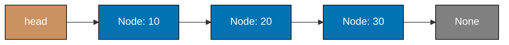
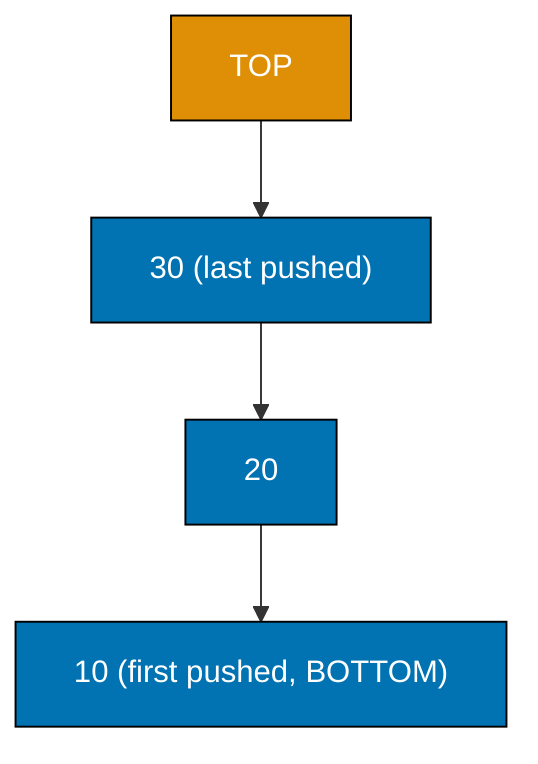
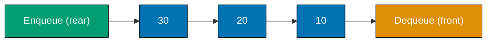
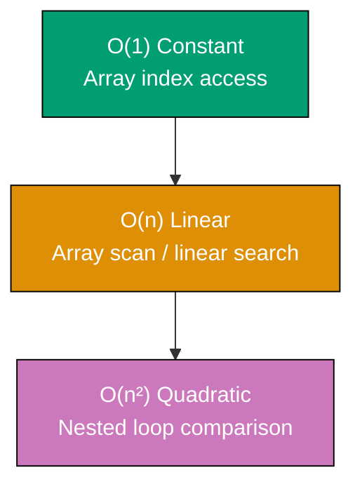
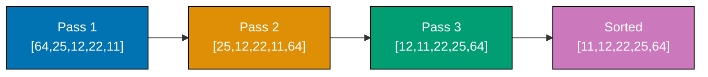
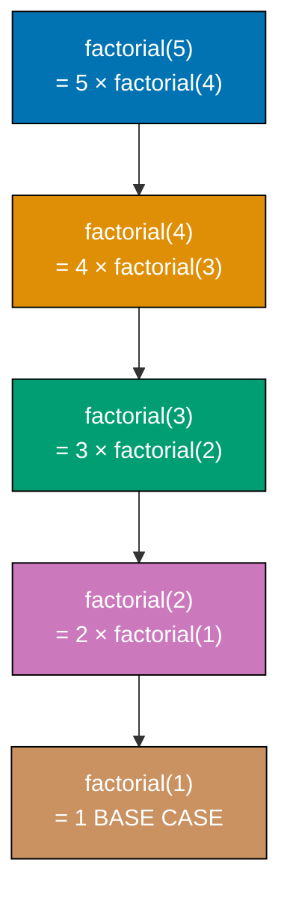

This tutorial covers foundational data structures and algorithms through 28 heavily annotated Python examples. Each example is self-contained and runnable. Coverage spans arrays, linked lists, stacks, queues, deques, basic sorting algorithms, linear search, basic recursion, and Big-O basics — building the mental models every software engineer needs.

## Arrays and Lists

### Example 1: Creating and Accessing Arrays

Arrays (Python lists) store elements in contiguous memory locations with zero-based indexing. Accessing any element by index is O(1) — the engine jumps directly to the memory address without scanning.

```python
# Example 1: Creating and Accessing Arrays

# Create a list (Python's dynamic array) with five integers
numbers = [10, 20, 30, 40, 50]
# => numbers stores [10, 20, 30, 40, 50]
# => Internally, Python allocates contiguous memory for these values

# Access elements by zero-based index
first = numbers[0]
# => first is 10 — index 0 is the leftmost element
# => Access is O(1): the CPU computes address = base + (index * element_size)

last = numbers[-1]
# => last is 50 — negative index -1 wraps to the final element
# => Equivalent to numbers[len(numbers) - 1]

middle = numbers[2]
# => middle is 30 — direct jump to index 2, no scanning needed

print(first, last, middle)
# => Output: 10 50 30

# Read the length of the array
length = len(numbers)
# => length is 5 — Python tracks size internally, so len() is O(1)

print(length)
# => Output: 5
```

**Key Takeaway:** Array indexing is O(1) because the CPU computes the memory address directly. Negative indices count from the end.

**Why It Matters:** In production, most data pipelines start with arrays. Knowing that indexing is O(1) while scanning is O(n) shapes every decision about when to use index-based lookups versus iteration. Python's list is a dynamic array that underpins lists, stacks, and many queue implementations throughout the standard library.

---

### Example 2: Modifying Arrays — Append, Insert, and Delete

Dynamic arrays grow automatically when you append. Insert and delete at arbitrary positions cost O(n) because Python must shift elements to maintain contiguous ordering.

```python
# Example 2: Modifying Arrays — Append, Insert, and Delete

fruits = ["apple", "banana", "cherry"]
# => fruits is ["apple", "banana", "cherry"]
# => len(fruits) is 3

# Append adds to the end — amortized O(1)
fruits.append("date")
# => fruits is ["apple", "banana", "cherry", "date"]
# => Python over-allocates memory so most appends avoid reallocation
# => Only occasional O(n) copy when capacity is exceeded

print(fruits)
# => Output: ['apple', 'banana', 'cherry', 'date']

# Insert at index 1 — O(n) because elements shift right
fruits.insert(1, "avocado")
# => "avocado" goes to index 1
# => "banana", "cherry", "date" each shift one position right
# => fruits is ["apple", "avocado", "banana", "cherry", "date"]

print(fruits)
# => Output: ['apple', 'avocado', 'banana', 'cherry', 'date']

# Remove by value — O(n) scan + O(n) shift
fruits.remove("banana")
# => Python scans left-to-right until "banana" is found
# => Remaining elements shift left to fill the gap
# => fruits is ["apple", "avocado", "cherry", "date"]

print(fruits)
# => Output: ['apple', 'avocado', 'cherry', 'date']

# Pop from the end — O(1), no shifting needed
popped = fruits.pop()
# => popped is "date" — the last element
# => fruits is ["apple", "avocado", "cherry"]

print(popped, fruits)
# => Output: date ['apple', 'avocado', 'cherry']

# Pop from an arbitrary index — O(n) due to shifting
removed = fruits.pop(0)
# => removed is "apple" — index 0 removed
# => "avocado" and "cherry" shift left
# => fruits is ["avocado", "cherry"]

print(removed, fruits)
# => Output: apple ['avocado', 'cherry']
```

**Key Takeaway:** Append and end-pop are O(1). Insert, remove, and pop at arbitrary positions are O(n) due to element shifting.

**Why It Matters:** Production code that inserts or deletes frequently at the beginning or middle of a large list pays O(n) per operation. Recognizing this cost early drives engineers toward deques, linked lists, or index-based compaction strategies before performance degradation occurs in production.

---

### Example 3: Array Slicing

Slicing creates a new list containing a contiguous subrange. The syntax `list[start:stop:step]` follows the half-open interval convention — `stop` is excluded.

```python
# Example 3: Array Slicing

data = [0, 1, 2, 3, 4, 5, 6, 7, 8, 9]
# => data holds integers 0 through 9 inclusive

# Basic slice: indices 2 through 4 (stop index 5 is excluded)
subset = data[2:5]
# => subset is [2, 3, 4]
# => Python copies those elements into a NEW list — O(k) where k is slice length
# => Original data is unchanged

print(subset)
# => Output: [2, 3, 4]

# Omitting start defaults to 0
head = data[:4]
# => head is [0, 1, 2, 3] — first four elements

print(head)
# => Output: [0, 1, 2, 3]

# Omitting stop defaults to end of list
tail = data[7:]
# => tail is [7, 8, 9] — last three elements

print(tail)
# => Output: [7, 8, 9]

# Step parameter: every other element
evens = data[::2]
# => Step 2 selects indices 0, 2, 4, 6, 8
# => evens is [0, 2, 4, 6, 8]

print(evens)
# => Output: [0, 2, 4, 6, 8]

# Reverse a list with step -1
reversed_data = data[::-1]
# => Step -1 traverses right-to-left
# => reversed_data is [9, 8, 7, 6, 5, 4, 3, 2, 1, 0]

print(reversed_data)
# => Output: [9, 8, 7, 6, 5, 4, 3, 2, 1, 0]
```

**Key Takeaway:** Slicing returns a shallow copy; changes to the slice do not affect the original. The slice operation is O(k) where k is the number of elements copied.

**Why It Matters:** Slicing underpins data preprocessing, windowed computations, and batch splitting. Understanding that it creates a new object (not a view) prevents subtle bugs when engineers mutate slices expecting to modify the original data.

---

### Example 4: Iterating Over Arrays

Python provides multiple iteration patterns. Choose the one that best communicates intent: `for x in list` for values, `enumerate` for index-value pairs, and `range(len(...))` only when index arithmetic is unavoidable.

```python
# Example 4: Iterating Over Arrays

temperatures = [22.1, 18.5, 30.0, 25.3, 19.8]
# => five daily temperature readings in Celsius

# Pattern 1: value-only iteration (most Pythonic)
print("Temperatures:")
for temp in temperatures:
    # => Each iteration: temp takes the next value in sequence
    print(f"  {temp}°C")
    # => Output: 22.1°C, 18.5°C, 30.0°C, 25.3°C, 19.8°C (one per line)

# Pattern 2: index + value with enumerate
print("Indexed:")
for i, temp in enumerate(temperatures):
    # => enumerate yields (index, value) tuples: (0,22.1), (1,18.5), ...
    print(f"  Day {i}: {temp}°C")
    # => Output: Day 0: 22.1°C, Day 1: 18.5°C, ...

# Pattern 3: building a transformed list with list comprehension
celsius = [22.1, 18.5, 30.0]
# => three Celsius values

fahrenheit = [(c * 9/5) + 32 for c in celsius]
# => List comprehension applies formula to every element
# => (22.1*9/5)+32 = 71.78, (18.5*9/5)+32 = 65.3, (30.0*9/5)+32 = 86.0
# => fahrenheit is [71.78, 65.3, 86.0]

print(fahrenheit)
# => Output: [71.78, 65.3, 86.0]

# Pattern 4: accumulate a running total
total = 0
for temp in temperatures:
    # => Add each temperature to the running sum
    total += temp
    # => After each iteration: 22.1, 40.6, 70.6, 95.9, 115.7

average = total / len(temperatures)
# => average is 115.7 / 5 = 23.14

print(f"Average: {average:.2f}°C")
# => Output: Average: 23.14°C
```

**Key Takeaway:** Use `for x in list` when you need values, `enumerate` when you need both index and value, and list comprehensions to build transformed copies.

**Why It Matters:** Clear iteration patterns signal intent to reviewers and reduce bugs. Choosing list comprehensions over manual accumulation also keeps logic concise and often runs faster due to Python's internal optimizations, which matters when processing large datasets in data pipelines or analytics services.

---

### Example 5: Two-Dimensional Arrays

A 2D array is a list of lists. Row access is O(1); cell access `grid[row][col]` is two consecutive O(1) lookups. Nested loops visit every cell in O(rows × cols) time.

```python
# Example 5: Two-Dimensional Arrays

# Create a 3x3 grid representing a tic-tac-toe board
board = [
    ["X", "O", "X"],   # => Row 0
    ["O", "X", "O"],   # => Row 1
    ["X", "O", "X"],   # => Row 2
]
# => board is a list of 3 lists, each with 3 string elements

# Access a single cell: row 1, column 2
cell = board[1][2]
# => board[1] retrieves ["O", "X", "O"] — O(1)
# => board[1][2] retrieves "O" from that row — second O(1)
# => cell is "O"

print(cell)
# => Output: O

# Modify a cell
board[0][1] = "X"
# => board[0] is now ["X", "X", "X"] — row 0 updated
# => board is now:
#    [["X", "X", "X"], ["O", "X", "O"], ["X", "O", "X"]]

# Iterate over all rows and columns
print("Full board:")
for row_index, row in enumerate(board):
    # => enumerate gives (0, row0), (1, row1), (2, row2)
    for col_index, cell_value in enumerate(row):
        # => Inner enumerate gives column index and cell value
        print(f"  [{row_index}][{col_index}] = {cell_value}")
        # => Prints every cell's coordinates and value

# Create a 4x4 zero matrix using list comprehension
matrix = [[0] * 4 for _ in range(4)]
# => [[0] * 4 creates a fresh list [0,0,0,0] each iteration
# => IMPORTANT: do NOT use [[0]*4]*4 — that reuses the same inner list
# => matrix is [[0,0,0,0],[0,0,0,0],[0,0,0,0],[0,0,0,0]]

matrix[2][3] = 99
# => Only row 2, column 3 changes to 99
# => matrix[2] is now [0, 0, 0, 99]

print(matrix[2])
# => Output: [0, 0, 0, 99]
```

**Key Takeaway:** Use `[[val] * cols for _ in range(rows)]` to create 2D arrays — not `[[val] * cols] * rows`, which creates aliased rows sharing the same list object.

**Why It Matters:** 2D arrays model matrices, game boards, images (pixel grids), and adjacency matrices for graphs. The aliasing pitfall with `* rows` is one of the most common subtle bugs in Python; understanding memory layout prevents hours of debugging.

---

## Linked Lists

### Example 6: Singly Linked List — Structure and Traversal

A singly linked list stores elements in nodes, each holding a value and a pointer to the next node. Traversal is O(n); there is no direct index access.



```python
# Example 6: Singly Linked List — Structure and Traversal

class Node:
    """A single element in a singly linked list."""
    def __init__(self, value):
        # => value holds the data for this node
        self.value = value
        # => next points to the following Node, or None if this is the tail
        self.next = None

class SinglyLinkedList:
    """A singly linked list with head pointer."""
    def __init__(self):
        # => head is None for an empty list
        self.head = None

    def append(self, value):
        """Add a new node at the end of the list — O(n)."""
        new_node = Node(value)
        # => Allocate a new Node with the given value

        if self.head is None:
            # => Empty list: new node becomes the head
            self.head = new_node
            return

        current = self.head
        # => Start at head, walk to the last node
        while current.next is not None:
            # => Keep moving until we find a node whose next is None
            current = current.next
        current.next = new_node
        # => Attach the new node as the tail's successor

    def traverse(self):
        """Return all values as a Python list — O(n)."""
        result = []
        current = self.head
        # => Begin at head; current will walk each node in turn
        while current is not None:
            result.append(current.value)
            # => Collect the value before advancing
            current = current.next
            # => Move to the next node; stops when current becomes None
        return result

# Build a list: 10 -> 20 -> 30
linked = SinglyLinkedList()
linked.append(10)   # => head -> Node(10) -> None
linked.append(20)   # => head -> Node(10) -> Node(20) -> None
linked.append(30)   # => head -> Node(10) -> Node(20) -> Node(30) -> None

print(linked.traverse())
# => Output: [10, 20, 30]
```

**Key Takeaway:** Linked list traversal is O(n) because every access starts from the head and follows pointers. There is no O(1) index jump like arrays provide.

**Why It Matters:** Linked lists appear in OS kernels (process scheduling queues), browser history navigation, and undo/redo chains. Understanding pointer-chasing costs drives decisions about when O(n) traversal is acceptable versus when an array's O(1) random access is worth the memory allocation overhead.

---

### Example 7: Singly Linked List — Prepend and Search

Prepend (inserting at the head) is O(1) because only the head pointer needs updating. Search is O(n) because we must walk nodes sequentially.

```python
# Example 7: Singly Linked List — Prepend and Search

class Node:
    def __init__(self, value):
        self.value = value   # => data payload for this node
        self.next = None     # => pointer to next node; None = tail

class SinglyLinkedList:
    def __init__(self):
        self.head = None     # => empty list has no head

    def prepend(self, value):
        """Insert a new node before the current head — O(1)."""
        new_node = Node(value)
        # => Create the new node first

        new_node.next = self.head
        # => New node points to the old head (even if head is None)

        self.head = new_node
        # => Update head to the new node — single pointer update, O(1)

    def search(self, target):
        """Return True if target exists in the list — O(n)."""
        current = self.head
        # => Start at head; must walk every node in worst case

        while current is not None:
            if current.value == target:
                # => Found a match — return immediately
                return True
            current = current.next
            # => Advance to next node
        return False
        # => Exhausted list without finding target

    def traverse(self):
        result, current = [], self.head
        while current:
            result.append(current.value)
            current = current.next
        return result

# Build list by prepending: each new element goes to the front
ll = SinglyLinkedList()
ll.prepend(30)   # => head -> Node(30) -> None
ll.prepend(20)   # => head -> Node(20) -> Node(30) -> None
ll.prepend(10)   # => head -> Node(10) -> Node(20) -> Node(30) -> None

print(ll.traverse())
# => Output: [10, 20, 30] — prepended in reverse order, reads correctly

print(ll.search(20))
# => Walk: 10 (no), 20 (yes!) — returns True after 2 steps
# => Output: True

print(ll.search(99))
# => Walk: 10, 20, 30, None — exhausted — returns False
# => Output: False
```

**Key Takeaway:** Prepend is O(1) because only the head pointer changes. Search is O(n) because there is no shortcut — every node must be checked in worst case.

**Why It Matters:** Prepend-heavy workloads (log prepending, newest-first feeds) use linked lists to avoid the O(n) shifting that arrays require. Search inefficiency motivates adding hash maps alongside linked lists for O(1) lookup — the pattern used in Python's `OrderedDict` and LRU cache implementations.

---

### Example 8: Singly Linked List — Delete a Node

Deleting a node by value requires finding its predecessor so we can re-link around it. Special handling is needed when the target is the head node.

```python
# Example 8: Singly Linked List — Delete a Node

class Node:
    def __init__(self, value):
        self.value = value
        self.next = None

class SinglyLinkedList:
    def __init__(self):
        self.head = None

    def append(self, value):
        new_node = Node(value)
        if not self.head:
            self.head = new_node
            return
        cur = self.head
        while cur.next:
            cur = cur.next
        cur.next = new_node

    def delete(self, target):
        """Remove the first node with value == target — O(n)."""
        if self.head is None:
            # => Empty list: nothing to delete
            return

        if self.head.value == target:
            # => Target is the head node — special case
            self.head = self.head.next
            # => Advance head one step; old head is now unreferenced (GC collects it)
            return

        prev = self.head
        current = self.head.next
        # => prev trails one step behind current so we can re-link

        while current is not None:
            if current.value == target:
                # => Found the node to remove
                prev.next = current.next
                # => prev now points past current to current's successor
                # => current is now unreferenced — garbage collected
                return
            prev = current
            current = current.next
            # => Both pointers advance together, maintaining the one-step gap

    def traverse(self):
        result, cur = [], self.head
        while cur:
            result.append(cur.value)
            cur = cur.next
        return result

ll = SinglyLinkedList()
for v in [10, 20, 30, 40]:
    ll.append(v)
# => ll: 10 -> 20 -> 30 -> 40 -> None

ll.delete(20)
# => prev=Node(10), current=Node(20) — match found
# => Node(10).next = Node(30) — re-links around the deleted node
# => ll: 10 -> 30 -> 40 -> None

print(ll.traverse())
# => Output: [10, 30, 40]

ll.delete(10)
# => Head is target — head becomes Node(30)
# => ll: 30 -> 40 -> None

print(ll.traverse())
# => Output: [30, 40]
```

**Key Takeaway:** Deletion requires a trailing pointer (`prev`) to re-link around the removed node. Head deletion is a special case requiring direct head-pointer update.

**Why It Matters:** The trailing-pointer pattern appears throughout linked list operations (reverse, cycle detection, nth-from-end). Mastering it here prepares engineers for LeetCode-style interview problems and production systems where efficient in-place list manipulation reduces memory allocation overhead.

---

## Stacks

### Example 9: Stack Using a List — Push and Pop

A stack enforces Last-In First-Out (LIFO) access. Python lists implement stacks efficiently: `append` pushes to the top (O(1)) and `pop` removes from the top (O(1)).



```python
# Example 9: Stack Using a List — Push and Pop

class Stack:
    """LIFO stack backed by a Python list."""
    def __init__(self):
        self._data = []
        # => _data is the underlying list; end of list = top of stack

    def push(self, item):
        """Add item to the top — O(1) amortized."""
        self._data.append(item)
        # => append adds to the end of the list, which is the stack's top

    def pop(self):
        """Remove and return the top item — O(1)."""
        if self.is_empty():
            raise IndexError("pop from empty stack")
            # => Guard prevents popping an empty stack (undefined behavior)
        return self._data.pop()
        # => list.pop() removes and returns the last element — O(1)

    def peek(self):
        """Return the top item without removing it — O(1)."""
        if self.is_empty():
            raise IndexError("peek at empty stack")
        return self._data[-1]
        # => Index -1 accesses the last element without modifying the list

    def is_empty(self):
        """Return True if the stack has no elements."""
        return len(self._data) == 0
        # => len() is O(1) for Python lists

    def size(self):
        """Return number of elements."""
        return len(self._data)

stack = Stack()
stack.push(10)   # => _data is [10]
stack.push(20)   # => _data is [10, 20]
stack.push(30)   # => _data is [10, 20, 30] — 30 is top

print(stack.peek())  # => Output: 30 (top, not removed)
print(stack.size())  # => Output: 3

top = stack.pop()   # => top is 30; _data is [10, 20]
print(top)          # => Output: 30

top = stack.pop()   # => top is 20; _data is [10]
print(stack.peek()) # => Output: 10

print(stack.is_empty())  # => Output: False
```

**Key Takeaway:** Push and pop at the list's end are O(1). Never pop from the front of a list (O(n)) when implementing a stack.

**Why It Matters:** Stacks power function call frames, undo/redo in editors, expression evaluation, and backtracking algorithms (DFS). Python's own call stack is a stack. Implementing one correctly demonstrates understanding of LIFO semantics, which interviews frequently probe through balanced-parentheses and next-greater-element problems.

---

### Example 10: Stack Application — Balanced Parentheses

Checking whether parentheses, brackets, and braces are balanced is a classic stack application. Every opening symbol pushes to the stack; every closing symbol must match the top.

```python
# Example 10: Stack Application — Balanced Parentheses

def is_balanced(expression):
    """
    Return True if every opening symbol has a matching closing symbol
    in the correct nesting order — O(n) time, O(n) space.
    """
    stack = []
    # => Stack accumulates unmatched opening symbols

    # Map each closing symbol to its expected opening symbol
    matching = {')': '(', ']': '[', '}': '{'}
    # => When we see ')', the stack top must be '('

    for char in expression:
        # => Process each character left-to-right
        if char in '([{':
            stack.append(char)
            # => Opening symbol: push onto stack, wait for matching close
        elif char in ')]}':
            # => Closing symbol encountered
            if not stack:
                # => No unmatched opening — structure is broken
                return False
            if stack[-1] != matching[char]:
                # => Top of stack doesn't match this closing symbol
                # => Example: "[)" — top is '[' but we need ')'
                return False
            stack.pop()
            # => Matched pair — remove the opening symbol from stack

    return len(stack) == 0
    # => If stack is empty, every opening symbol was matched
    # => Remaining symbols = unmatched openings = unbalanced

# Test cases
print(is_balanced("({[]})"))
# => '(' pushed, '{' pushed, '[' pushed
# => ']' matches '[' — pop; '}' matches '{' — pop; ')' matches '(' — pop
# => Stack empty: Output: True

print(is_balanced("([)]"))
# => '(' pushed, '[' pushed
# => ')' closing: top is '[', matching[')'] is '(' — mismatch!
# => Output: False

print(is_balanced("{[}"))
# => '{' pushed, '[' pushed
# => '}' closing: top is '[', matching['}'] is '{' — mismatch!
# => Output: False

print(is_balanced(""))
# => No characters processed; stack is empty — Output: True
```

**Key Takeaway:** The stack's LIFO property naturally enforces correct nesting: the most recently opened symbol must close before any earlier one.

**Why It Matters:** This exact algorithm runs inside code editors (syntax highlighting), compilers (parse tree construction), and JSON/XML validators. Interviewers use it to probe whether candidates understand LIFO semantics and can handle edge cases (empty stack before pop, leftover elements at end).

---

### Example 11: Stack Application — Reverse a String

Stacks reverse sequences naturally — push all characters, then pop them all. The first character pushed is the last popped.

```python
# Example 11: Stack Application — Reverse a String

def reverse_string(text):
    """
    Reverse a string using a stack — O(n) time, O(n) space.
    This illustrates LIFO reversal; Python's text[::-1] is faster in practice.
    """
    stack = []
    # => Stack will hold individual characters

    for char in text:
        # => Push every character left-to-right
        stack.append(char)
        # => After "hello": stack is ['h','e','l','l','o']
        # => 'o' is the top

    reversed_chars = []
    while stack:
        # => Pop until stack is empty — LIFO reverses the order
        reversed_chars.append(stack.pop())
        # => First pop: 'o', second: 'l', third: 'l', fourth: 'e', fifth: 'h'

    return "".join(reversed_chars)
    # => Join the reversed characters into a single string

print(reverse_string("hello"))
# => Push: h,e,l,l,o — Pop: o,l,l,e,h
# => Output: olleh

print(reverse_string("Python"))
# => Push: P,y,t,h,o,n — Pop: n,o,h,t,y,P
# => Output: nohtyP

print(reverse_string(""))
# => Empty string: no pushes, no pops — Output: (empty string)

print(reverse_string("a"))
# => Push: a — Pop: a — Output: a (single char reverses to itself)
```

**Key Takeaway:** Pushing a sequence then popping it yields the sequence in reverse — LIFO is inherently a reversal mechanism.

**Why It Matters:** This pattern appears in palindrome checking, undo-chain traversal, and recursive call unwinding. While Python's slice syntax is faster for strings, the explicit stack model builds intuition for why recursive algorithms automatically reverse order when unwinding — a key insight for understanding depth-first search, backtracking, and postorder tree traversal.

---

## Queues

### Example 12: Queue Using collections.deque — Enqueue and Dequeue

A queue enforces First-In First-Out (FIFO) access. `collections.deque` provides O(1) append on the right and O(1) popleft — the correct implementation for production queues.



```python
# Example 12: Queue Using collections.deque — Enqueue and Dequeue

from collections import deque
# => deque (double-ended queue) is backed by a doubly-linked list of fixed blocks
# => Both append (right) and popleft (left) are O(1) — unlike list.pop(0) which is O(n)

class Queue:
    """FIFO queue backed by collections.deque."""
    def __init__(self):
        self._data = deque()
        # => _data is empty; rear is right end, front is left end

    def enqueue(self, item):
        """Add item to the rear — O(1)."""
        self._data.append(item)
        # => append adds to the right (rear of queue)

    def dequeue(self):
        """Remove and return the front item — O(1)."""
        if self.is_empty():
            raise IndexError("dequeue from empty queue")
        return self._data.popleft()
        # => popleft removes from the left (front of queue) — O(1)
        # => Using list.pop(0) here would be O(n) — a common performance mistake

    def peek(self):
        """Return the front item without removing — O(1)."""
        if self.is_empty():
            raise IndexError("peek at empty queue")
        return self._data[0]
        # => Index 0 is the front (left) of the deque

    def is_empty(self):
        return len(self._data) == 0

    def size(self):
        return len(self._data)

q = Queue()
q.enqueue("first")    # => _data: deque(['first'])
q.enqueue("second")   # => _data: deque(['first', 'second'])
q.enqueue("third")    # => _data: deque(['first', 'second', 'third'])

print(q.peek())       # => Output: first (front, not removed)
print(q.size())       # => Output: 3

item = q.dequeue()    # => Removes 'first'; _data: deque(['second', 'third'])
print(item)           # => Output: first

item = q.dequeue()    # => Removes 'second'; _data: deque(['third'])
print(item)           # => Output: second

print(q.is_empty())   # => Output: False (one element remains)
```

**Key Takeaway:** Always use `collections.deque` for queues, not a plain list with `pop(0)`. The deque's O(1) popleft versus the list's O(n) pop(0) makes a critical performance difference at scale.

**Why It Matters:** Queues model task schedulers, print spoolers, BFS graph traversal, and producer-consumer pipelines. Using `list.pop(0)` in a queue serving millions of requests per day would cause O(n) degradation for every dequeue — the deque avoids this entirely with its doubly-linked block structure.

---

### Example 13: Queue Application — First-Come First-Served Simulation

A simple simulation where customers arrive in order and are served one at a time demonstrates queue semantics in a real-world context.

```python
# Example 13: Queue Application — First-Come First-Served Simulation

from collections import deque
# => deque for O(1) enqueue and dequeue

def simulate_service(customers):
    """
    Simulate a single-server queue.
    Returns the order in which customers are served — O(n).
    """
    queue = deque(customers)
    # => Initialize queue with all customers in arrival order
    # => Front of deque = next customer to serve

    served_order = []
    # => Track the service sequence for verification

    while queue:
        # => Continue until all customers have been served
        current_customer = queue.popleft()
        # => Dequeue the customer who waited longest (FIFO)
        # => popleft is O(1) on deque

        served_order.append(current_customer)
        # => Record that this customer was served

        print(f"  Serving: {current_customer}")
        # => In a real system, this is where processing logic would go

    return served_order
    # => Returns the complete service order

# Customers arrive in this order
arriving_customers = ["Alice", "Bob", "Charlie", "Diana", "Eve"]
# => Alice arrived first and will be served first (FIFO)

print("Service order:")
result = simulate_service(arriving_customers)
# => Alice served first, then Bob, then Charlie, then Diana, then Eve

print(f"\nFinal order: {result}")
# => Output: Final order: ['Alice', 'Bob', 'Charlie', 'Diana', 'Eve']
# => FIFO preserved: arrival order = service order
```

**Key Takeaway:** A queue guarantees fairness — every item is processed in the exact order it arrived. No item is skipped or reordered.

**Why It Matters:** FIFO queues underpin message brokers (RabbitMQ, Kafka consumer groups), operating system CPU schedulers, and HTTP request handling in web servers. Understanding FIFO semantics prevents bugs where developers accidentally use stacks (LIFO) when they need fair, ordered processing.

---

## Deques

### Example 14: Deque — Double-Ended Operations

A deque (double-ended queue) supports O(1) push and pop at both ends. Python's `collections.deque` implements this with a doubly-linked list of memory blocks.

```python
# Example 14: Deque — Double-Ended Operations

from collections import deque
# => collections.deque: O(1) for appendleft, append, popleft, pop

dq = deque()
# => dq is empty; visualize as: [] with left and right ends accessible

# Add to the right end (like a normal queue enqueue)
dq.append(10)    # => dq: deque([10])
dq.append(20)    # => dq: deque([10, 20])
dq.append(30)    # => dq: deque([10, 20, 30])

# Add to the left end (O(1) — impossible efficiently with a plain list)
dq.appendleft(5)
# => dq: deque([5, 10, 20, 30])
# => list.insert(0, 5) would be O(n); deque.appendleft is O(1)

dq.appendleft(1)
# => dq: deque([1, 5, 10, 20, 30])

print(dq)
# => Output: deque([1, 5, 10, 20, 30])

# Remove from the right end
right = dq.pop()
# => right is 30; dq: deque([1, 5, 10, 20])
print(right)
# => Output: 30

# Remove from the left end
left = dq.popleft()
# => left is 1; dq: deque([5, 10, 20])
print(left)
# => Output: 1

print(dq)
# => Output: deque([5, 10, 20])

# Bounded deque: maxlen evicts oldest element on overflow
window = deque(maxlen=3)
# => window will hold at most 3 elements
# => When full, appending right evicts from left (and vice versa)

for val in [1, 2, 3, 4, 5]:
    window.append(val)
    # => 1: [1], 2: [1,2], 3: [1,2,3]
    # => 4: maxlen=3, so [2,3,4] — 1 evicted from left
    # => 5: [3,4,5] — 2 evicted from left

print(window)
# => Output: deque([3, 4, 5], maxlen=3) — sliding window of last 3 values
```

**Key Takeaway:** `deque` with `maxlen` implements a sliding window automatically — new elements push old ones out without any manual deletion code.

**Why It Matters:** Sliding window problems (moving average, recent N events, rate limiting) are common in real-time systems and data streams. The `maxlen` deque eliminates manual eviction logic and reduces bugs. Interview problems on sliding window maximum and minimum also map directly to deque operations.

---

### Example 15: Deque Application — Palindrome Check

A palindrome reads the same forwards and backwards. A deque lets us compare the front and back characters simultaneously by popping from both ends.

```python
# Example 15: Deque Application — Palindrome Check

from collections import deque
# => deque for O(1) popleft and pop

def is_palindrome(text):
    """
    Check whether text is a palindrome (case-insensitive, ignores spaces)
    using a deque — O(n) time, O(n) space.
    """
    # Normalize: lowercase, remove spaces
    cleaned = text.lower().replace(" ", "")
    # => "Race Car" -> "racecar"
    # => "A man a plan a canal Panama" -> "amanaplanacanalpanama"

    dq = deque(cleaned)
    # => Each character in cleaned becomes an element in the deque

    while len(dq) > 1:
        # => Stop when 0 or 1 character remains (single char is always palindrome)
        left_char = dq.popleft()
        # => Remove the leftmost character — O(1)
        right_char = dq.pop()
        # => Remove the rightmost character — O(1)
        if left_char != right_char:
            # => Mismatch found — not a palindrome
            return False

    return True
    # => All pairs matched — text is a palindrome

print(is_palindrome("racecar"))
# => d,e,q: r-a-c-e-c-a-r → compare r==r (pop), a==a (pop), c==c (pop), center='e' →True
# => Output: True

print(is_palindrome("hello"))
# => h vs o — mismatch immediately
# => Output: False

print(is_palindrome("A man a plan a canal Panama"))
# => Cleaned: "amanaplanacanalpanama"
# => All outer pairs match — Output: True

print(is_palindrome("a"))
# => Single character — loop never executes — Output: True

print(is_palindrome("ab"))
# => a vs b — mismatch — Output: False
```

**Key Takeaway:** Simultaneous O(1) access to both ends makes the deque ideal for bidirectional comparison problems without array index arithmetic.

**Why It Matters:** Palindrome checking is a foundational interview question, but the deque pattern generalizes to any problem requiring simultaneous front-back processing: two-pointer comparisons on linked lists, verifying mirror-image structures, and bidirectional BFS meeting-in-the-middle optimizations.

---

## Linear Search

### Example 16: Linear Search — Unsorted Array

Linear search scans every element from left to right until the target is found or the array is exhausted. Time complexity is O(n) worst case.

```python
# Example 16: Linear Search — Unsorted Array

def linear_search(arr, target):
    """
    Search for target in arr, returning its index or -1 if not found.
    Time: O(n) — must examine every element in the worst case.
    Space: O(1) — no extra data structures needed.
    """
    for i in range(len(arr)):
        # => i iterates from 0 to len(arr)-1
        if arr[i] == target:
            # => Found the target at index i
            return i
            # => Return immediately — no need to scan further
    return -1
    # => Scanned every element without finding target

data = [64, 25, 12, 22, 11]
# => Unsorted array — binary search cannot be used here

print(linear_search(data, 22))
# => Checks: 64 (no), 25 (no), 12 (no), 22 (yes!) — found at index 3
# => Output: 3

print(linear_search(data, 99))
# => Checks all 5 elements without finding 99 — worst case O(n)
# => Output: -1

# Linear search works on any sequence type, including strings
words = ["apple", "mango", "banana", "cherry"]
print(linear_search(words, "banana"))
# => Checks "apple" (no), "mango" (no), "banana" (yes!) — index 2
# => Output: 2

# Using Python's built-in (equivalent result)
try:
    idx = data.index(22)
    # => list.index() also performs linear search — O(n)
    print(f"Built-in index: {idx}")
    # => Output: Built-in index: 3
except ValueError:
    print("Not found")
```

**Key Takeaway:** Linear search is the only option for unsorted data. It is O(n) in worst and average case, and O(1) best case (first element matches).

**Why It Matters:** Most real-world data is unsorted or arrives dynamically. Linear search is the fallback when no sorted index or hash map is available. Understanding its O(n) cost motivates building indexes (sorted structures, hash maps) for frequently queried fields — a core database design principle.

---

### Example 17: Linear Search — Finding All Occurrences

Rather than stopping at the first match, collecting all matching indices requires scanning the entire array. This is still O(n) but returns a list of positions.

```python
# Example 17: Linear Search — Finding All Occurrences

def find_all(arr, target):
    """
    Return a list of all indices where target appears — O(n).
    Unlike find-first, this always scans the entire array.
    """
    indices = []
    # => Accumulate all matching positions

    for i, value in enumerate(arr):
        # => enumerate yields (index, value) pairs
        if value == target:
            # => Another occurrence found
            indices.append(i)
            # => Add index to results; do NOT break — keep scanning

    return indices
    # => Empty list if target not present; list of indices otherwise

scores = [85, 92, 78, 92, 65, 92, 88]
# => The value 92 appears at indices 1, 3, and 5

positions = find_all(scores, 92)
print(positions)
# => Scans all 7 elements; matches at index 1, 3, 5
# => Output: [1, 3, 5]

# No occurrences
positions = find_all(scores, 100)
print(positions)
# => Scans all 7 elements; no matches found
# => Output: []

# Single occurrence
positions = find_all(scores, 65)
print(positions)
# => Match at index 4; continues scanning (no more matches)
# => Output: [4]

# Count occurrences using the result
count = len(find_all(scores, 92))
print(f"92 appears {count} times")
# => Output: 92 appears 3 times
```

**Key Takeaway:** Finding all occurrences always costs O(n) because the entire array must be scanned regardless of where matches are found.

**Why It Matters:** Collecting all occurrences appears in log analysis (find all error lines), database full-table scans (no index on column), and text search. The performance cost motivates inverted indexes (used by search engines and databases) that map values to their positions for O(1) lookup instead of O(n) scanning.

---

## Big-O Basics

### Example 18: Big-O — O(1), O(n), and O(n²) in Practice

Big-O notation classifies how an algorithm's running time grows as input size n increases. These three complexities are the foundation of algorithmic analysis.



```python
# Example 18: Big-O — O(1), O(n), and O(n²) in Practice

# -----------------------------------------------------------
# O(1) — Constant time: work does not grow with input size
# -----------------------------------------------------------
def get_first(arr):
    """Always exactly one operation regardless of array length."""
    return arr[0]
    # => Index access: single memory read — O(1)
    # => get_first([1]) and get_first([1..1000000]) take the same time

# -----------------------------------------------------------
# O(n) — Linear time: work grows proportionally with input size
# -----------------------------------------------------------
def find_max(arr):
    """Scan entire array to find the maximum — O(n)."""
    maximum = arr[0]
    # => Start with first element as the current maximum
    for item in arr:
        # => Visit every element — n comparisons for n elements
        if item > maximum:
            maximum = item
    return maximum
    # => Double the input size → double the work

# -----------------------------------------------------------
# O(n²) — Quadratic: work grows as square of input size
# -----------------------------------------------------------
def find_duplicates(arr):
    """
    Check every pair for duplicates using nested loops — O(n²).
    Returns a list of (i, j) pairs where arr[i] == arr[j] and i < j.
    """
    duplicates = []
    for i in range(len(arr)):
        # => Outer loop: n iterations
        for j in range(i + 1, len(arr)):
            # => Inner loop: up to n-1, n-2, ... 1 iterations
            # => Total pairs: n*(n-1)/2 — grows as n² asymptotically
            if arr[i] == arr[j]:
                duplicates.append((i, j))
    return duplicates

data = [3, 1, 4, 1, 5, 9, 2, 6, 5]
# => n = 9 elements

print(get_first(data))
# => Output: 3 — one operation, always O(1)

print(find_max(data))
# => Output: 9 — scanned all 9 elements, O(n)

dups = find_duplicates(data)
# => Compares 9*8/2 = 36 pairs; finds (1,3)→value 1, (4,8)→value 5
print(dups)
# => Output: [(1, 3), (4, 8)]

# Growth demonstration: n=100 → O(n²) does 10,000 operations; n=1000 → 1,000,000
```

**Key Takeaway:** O(1) is ideal, O(n) is acceptable for most tasks, and O(n²) becomes painful for large n. A 1000-element input means 1 operation (O(1)), 1,000 operations (O(n)), or 1,000,000 operations (O(n²)).

**Why It Matters:** Understanding these three complexity classes is the foundation of every performance conversation in software engineering. Code reviews, architecture decisions, and system capacity planning all hinge on recognizing O(1) vs O(n) vs O(n²) patterns. The nested-loop duplicate-finder above becomes impractical at n=100,000 — a hash set reduces it to O(n).

---

## Basic Sorting Algorithms

### Example 19: Bubble Sort

Bubble sort repeatedly compares adjacent elements and swaps them if they are out of order. Large elements "bubble up" to the end. Time complexity is O(n²) average and worst case, O(n) best case (already sorted with early termination).



```python
# Example 19: Bubble Sort

def bubble_sort(arr):
    """
    Sort a list in-place using bubble sort — O(n²) average, O(n) best.
    Best case with early termination: already-sorted input does only one pass.
    """
    n = len(arr)
    # => n is the total number of elements to sort

    for i in range(n):
        # => i counts completed passes; after pass i, the last i elements are sorted
        swapped = False
        # => Track whether any swap occurred in this pass

        for j in range(0, n - i - 1):
            # => Inner loop: compare adjacent pairs, shrinking range each pass
            # => n-i-1 because the last i positions are already sorted
            if arr[j] > arr[j + 1]:
                # => Out-of-order pair found: swap them
                arr[j], arr[j + 1] = arr[j + 1], arr[j]
                # => Python tuple swap — no temporary variable needed
                swapped = True
                # => Mark that we did work this pass

        if not swapped:
            # => No swaps means the array is fully sorted — exit early
            # => This optimization gives O(n) best case for sorted input
            break

    return arr

data = [64, 25, 12, 22, 11]
# => Unsorted array — we want [11, 12, 22, 25, 64]

result = bubble_sort(data)
print(result)
# => Pass 1: [25,12,22,11,64] — 64 settled at end
# => Pass 2: [12,11,22,25,64] — 25 settled
# => Pass 3: [11,12,22,25,64] — 12 settled, no more swaps next pass
# => Output: [11, 12, 22, 25, 64]

# Already sorted — early termination kicks in
sorted_data = [1, 2, 3, 4, 5]
result2 = bubble_sort(sorted_data)
print(result2)
# => Pass 1: no swaps — swapped stays False — break immediately
# => Only ONE pass over n elements: O(n) for this case
# => Output: [1, 2, 3, 4, 5]
```

**Key Takeaway:** Bubble sort is the simplest sorting algorithm but rarely used in production due to O(n²) average complexity. The `swapped` flag optimization saves time on nearly-sorted data.

**Why It Matters:** Bubble sort teaches the fundamental sorting intuition: repeated passes progressively "settle" elements into place. While production code uses Python's built-in Timsort (O(n log n)), understanding bubble sort builds the mental model for why comparison-based sorting has lower bounds and motivates learning better algorithms.

---

### Example 20: Selection Sort

Selection sort repeatedly finds the minimum element in the unsorted portion and swaps it to the front. Unlike bubble sort, it makes at most n-1 swaps — useful when swapping is expensive. Time complexity is always O(n²).

```python
# Example 20: Selection Sort

def selection_sort(arr):
    """
    Sort a list in-place by repeatedly selecting the minimum — O(n²).
    Number of swaps is O(n) — optimal for write-expensive storage (e.g., flash memory).
    """
    n = len(arr)
    # => Outer loop runs n-1 times (last element auto-places)

    for i in range(n - 1):
        # => Positions 0..i-1 are already sorted
        # => Find the minimum of arr[i..n-1] and put it at position i

        min_idx = i
        # => Assume current position i holds the minimum initially

        for j in range(i + 1, n):
            # => Scan the unsorted portion for a smaller element
            if arr[j] < arr[min_idx]:
                min_idx = j
                # => Found a new minimum; record its index

        if min_idx != i:
            # => Minimum is not already in place — swap it to position i
            arr[i], arr[min_idx] = arr[min_idx], arr[i]
            # => One swap per outer iteration at most — total swaps ≤ n-1

    return arr

data = [64, 25, 12, 22, 11]
# => We want [11, 12, 22, 25, 64]

result = selection_sort(data)
print(result)
# => i=0: min of [64,25,12,22,11] is 11 at idx 4 → swap 64 and 11 → [11,25,12,22,64]
# => i=1: min of [25,12,22,64] is 12 at idx 2 → swap 25 and 12 → [11,12,25,22,64]
# => i=2: min of [25,22,64] is 22 at idx 3 → swap 25 and 22 → [11,12,22,25,64]
# => i=3: min of [25,64] is 25 at idx 3 → already in place, no swap
# => Output: [11, 12, 22, 25, 64]

# Compare with bubble sort: bubble sort does many swaps per pass
# Selection sort does at most 1 swap per pass — 4 swaps total for n=5
```

**Key Takeaway:** Selection sort minimizes the number of swaps to O(n), making it preferable over bubble sort when write operations are costly (e.g., writing to slow flash storage).

**Why It Matters:** Selection sort's O(n) write characteristic appears in embedded systems and EEPROM wear-leveling where each write reduces component lifespan. Understanding which metric (comparisons vs swaps vs memory) to minimize for a given hardware context is the kind of practical algorithmic reasoning that separates senior engineers from junior developers.

---

### Example 21: Insertion Sort

Insertion sort builds a sorted portion from left to right, inserting each new element into its correct position. It is efficient for small arrays and nearly-sorted data, with O(n) best case and O(n²) worst case.

```python
# Example 21: Insertion Sort

def insertion_sort(arr):
    """
    Sort a list in-place using insertion sort — O(n²) worst, O(n) best.
    Efficient for small arrays (< 20 elements) and nearly-sorted data.
    Python's Timsort uses insertion sort for runs of length < 64.
    """
    for i in range(1, len(arr)):
        # => Consider arr[0..i-1] already sorted; insert arr[i] into that sorted region
        key = arr[i]
        # => key is the element we want to insert into the sorted left portion

        j = i - 1
        # => j starts at the last element of the sorted portion
        # => We will shift elements right until we find key's correct slot

        while j >= 0 and arr[j] > key:
            # => Shift element one position to the right
            arr[j + 1] = arr[j]
            # => This makes room for key
            j -= 1
            # => Move left through the sorted portion

        arr[j + 1] = key
        # => Place key in its correct sorted position
        # => j+1 is the first position where arr[j] <= key (or j == -1)

    return arr

data = [12, 11, 13, 5, 6]
# => We want [5, 6, 11, 12, 13]

result = insertion_sort(data)
print(result)
# => i=1: key=11 — shift 12 right → [12,12,13,5,6] → insert 11 at 0 → [11,12,13,5,6]
# => i=2: key=13 — 12 < 13, no shift needed → [11,12,13,5,6]
# => i=3: key=5  — shift 13,12,11 right → insert 5 at 0 → [5,11,12,13,6]
# => i=4: key=6  — shift 13,12,11 right, 5 < 6 stop → [5,6,11,12,13]
# => Output: [5, 6, 11, 12, 13]

# Nearly sorted — insertion sort shines here
nearly_sorted = [1, 2, 3, 5, 4]
result2 = insertion_sort(nearly_sorted)
print(result2)
# => Only one element (4) is out of place — minimal shifting needed
# => Very close to O(n) performance for this input
# => Output: [1, 2, 3, 4, 5]
```

**Key Takeaway:** Insertion sort is optimal for nearly-sorted arrays and small n. Python's own Timsort uses insertion sort internally for short subarrays, validating its practical utility.

**Why It Matters:** Real-world data is often nearly sorted (log files with timestamps, live feeds arriving almost in order). Insertion sort's adaptive nature — O(n) for nearly-sorted input — makes it faster than quicksort or mergesort in these conditions. Recognizing input characteristics and choosing accordingly is the hallmark of experienced algorithm selection.

---

### Example 22: Comparing Sorting Algorithms

Seeing all three sorting algorithms process the same input side-by-side reinforces their behavioral differences and helps build intuition for choosing the right one.

```python
# Example 22: Comparing Sorting Algorithms

import time
# => time module for measuring elapsed time

def bubble_sort(arr):
    """Bubble sort — O(n²), many swaps."""
    arr = arr[:]             # => Work on a copy; leave original unchanged
    n = len(arr)
    for i in range(n):
        swapped = False
        for j in range(0, n - i - 1):
            if arr[j] > arr[j + 1]:
                arr[j], arr[j + 1] = arr[j + 1], arr[j]
                swapped = True
        if not swapped:
            break
    return arr

def selection_sort(arr):
    """Selection sort — O(n²), at most n swaps."""
    arr = arr[:]             # => Work on a copy
    n = len(arr)
    for i in range(n - 1):
        min_idx = i
        for j in range(i + 1, n):
            if arr[j] < arr[min_idx]:
                min_idx = j
        if min_idx != i:
            arr[i], arr[min_idx] = arr[min_idx], arr[i]
    return arr

def insertion_sort(arr):
    """Insertion sort — O(n²) worst, O(n) best."""
    arr = arr[:]             # => Work on a copy
    for i in range(1, len(arr)):
        key = arr[i]
        j = i - 1
        while j >= 0 and arr[j] > key:
            arr[j + 1] = arr[j]
            j -= 1
        arr[j + 1] = key
    return arr

test_data = [64, 34, 25, 12, 22, 11, 90]
# => Same input for all three algorithms

algorithms = [
    ("Bubble Sort",    bubble_sort),
    ("Selection Sort", selection_sort),
    ("Insertion Sort", insertion_sort),
]

for name, sort_fn in algorithms:
    # => Apply each algorithm to the same test data
    result = sort_fn(test_data)
    # => All three should produce the same sorted output

    print(f"{name}: {result}")
    # => Bubble Sort:    [11, 12, 22, 25, 34, 64, 90]
    # => Selection Sort: [11, 12, 22, 25, 34, 64, 90]
    # => Insertion Sort: [11, 12, 22, 25, 34, 64, 90]

print("\nAll three produce identical sorted output.")
print("Choice depends on: input characteristics, swap cost, memory constraints.")
# => Bubble: simple, good for nearly-sorted with early termination
# => Selection: minimizes swaps — good for write-expensive storage
# => Insertion: best for small n and nearly-sorted data (used in Timsort)
```

**Key Takeaway:** All three algorithms produce correct sorted output; they differ in number of comparisons, swaps, and best-case behavior — not in correctness.

**Why It Matters:** Algorithm selection is a practical engineering skill. Picking bubble sort for a large unsorted array in a hot path is a real performance bug. Understanding when each algorithm excels prevents premature optimization and avoids the opposite mistake: using an overly complex algorithm for a 10-element array that insertion sort would sort faster.

---

## Basic Recursion

### Example 23: Factorial — Recursive vs Iterative

Factorial n! = n × (n-1) × ... × 1 is the canonical recursion example. Every recursive solution has a base case (n ≤ 1) and a recursive case (n × factorial(n-1)).



```python
# Example 23: Factorial — Recursive vs Iterative

def factorial_recursive(n):
    """
    Compute n! recursively — O(n) time, O(n) space (call stack depth).
    Base case: n <= 1 returns 1 immediately.
    Recursive case: n * factorial(n-1) builds the answer on the way back.
    """
    if n <= 1:
        # => Base case: factorial(0) = 1, factorial(1) = 1 by definition
        # => Without a base case, recursion never stops — stack overflow
        return 1
    return n * factorial_recursive(n - 1)
    # => Recursive case: defer to factorial(n-1), multiply by n when returning
    # => factorial(5) waits for factorial(4), which waits for factorial(3), etc.

def factorial_iterative(n):
    """
    Compute n! iteratively — O(n) time, O(1) space (no call stack growth).
    Preferred in production: no stack overflow risk for large n.
    """
    result = 1
    # => Accumulate the product starting from 1
    for i in range(2, n + 1):
        # => Multiply by 2, 3, 4, ..., n in sequence
        result *= i
        # => result grows: 1, 2, 6, 24, 120 for n=5
    return result

print(factorial_recursive(5))
# => 5→4→3→2→1(base)→returns 1→2*1=2→3*2=6→4*6=24→5*24=120
# => Output: 120

print(factorial_iterative(5))
# => 1*2=2, 2*3=6, 6*4=24, 24*5=120
# => Output: 120

print(factorial_recursive(0))
# => Base case hit immediately — Output: 1

# Python's recursion limit is ~1000 by default
# factorial_recursive(2000) would raise RecursionError
# factorial_iterative(2000) works fine — no stack depth issue
print(factorial_iterative(10))
# => 3628800 — Output: 3628800
```

**Key Takeaway:** Every recursive function needs a base case (stops recursion) and a recursive case (reduces the problem). Iterative versions save stack space and avoid Python's recursion limit.

**Why It Matters:** Recursion is foundational to tree/graph traversal, divide-and-conquer algorithms (merge sort, quicksort), and parsing nested structures. Python's default 1000-frame recursion limit means production code for deep recursion must use iteration or explicit stacks. Understanding the call stack depth cost drives when to prefer tail-call-optimized loops.

---

### Example 24: Fibonacci — Naive Recursion and Memoization

Naive Fibonacci recursion recomputes the same values exponentially. Memoization caches results, reducing complexity from O(2^n) to O(n).

```python
# Example 24: Fibonacci — Naive Recursion and Memoization

# -------------------------------------------
# Naive recursion — O(2^n) exponential time
# -------------------------------------------
def fib_naive(n):
    """
    Compute the nth Fibonacci number naively — exponential O(2^n).
    fib(5) recomputes fib(3) twice, fib(2) three times, fib(1) five times.
    """
    if n <= 1:
        # => Base cases: fib(0)=0, fib(1)=1
        return n
    return fib_naive(n - 1) + fib_naive(n - 2)
    # => Two recursive calls — binary tree of calls, O(2^n) total work

# -------------------------------------------
# Memoized recursion — O(n) time, O(n) space
# -------------------------------------------
def fib_memo(n, cache=None):
    """
    Compute nth Fibonacci with memoization — O(n) time, O(n) space.
    Each unique n is computed exactly once; result stored in cache dict.
    """
    if cache is None:
        cache = {}
        # => Create cache dictionary on first call only

    if n in cache:
        return cache[n]
        # => Cache hit: return stored result without re-computing — O(1)

    if n <= 1:
        return n
        # => Base cases: no caching needed

    result = fib_memo(n - 1, cache) + fib_memo(n - 2, cache)
    # => Compute result from sub-problems (each computed only once)

    cache[n] = result
    # => Store result before returning to avoid future recomputation

    return result

for i in range(8):
    print(f"fib({i}) = {fib_naive(i)}")
    # => fib(0)=0, fib(1)=1, fib(2)=1, fib(3)=2, fib(4)=3, fib(5)=5, fib(6)=8, fib(7)=13

print("\nMemoized (same results, much faster for large n):")
for i in range(8):
    print(f"fib_memo({i}) = {fib_memo(i)}")
    # => Same values; dramatically faster because each fib(k) computed once

# fib_naive(35) takes seconds; fib_memo(35) is near-instant
print(f"\nfib_memo(35) = {fib_memo(35)}")
# => Output: fib_memo(35) = 9227465
```

**Key Takeaway:** Memoization transforms overlapping-subproblem recursion from exponential to linear by caching each unique result. This is the foundation of dynamic programming.

**Why It Matters:** The naive-to-memoized Fibonacci transformation illustrates the core dynamic programming insight: overlapping subproblems computed repeatedly without caching turn linear-looking code into exponential execution. This pattern appears in route optimization, resource scheduling, and sequence alignment in bioinformatics — all production DP problems.

---

### Example 25: Recursive Sum and Binary Search (Recursive)

Applying recursion to a sorted array with binary search demonstrates divide-and-conquer: split the problem in half each time, reducing O(n) to O(log n).

```python
# Example 25: Recursive Sum and Binary Search (Recursive)

def recursive_sum(arr):
    """
    Sum all elements recursively — O(n) time, O(n) stack space.
    Base case: empty array sums to 0.
    Recursive case: first element plus sum of the rest.
    """
    if len(arr) == 0:
        # => Base case: empty array, contribution is 0
        return 0
    return arr[0] + recursive_sum(arr[1:])
    # => arr[1:] creates a new slice — this is O(n²) total due to slicing
    # => Shown for concept clarity; iterative sum is better in production

def binary_search_recursive(arr, target, low, high):
    """
    Search sorted arr[low..high] for target — O(log n).
    Divides the search space in half with each recursive call.
    """
    if low > high:
        # => Search space exhausted — target not in array
        return -1

    mid = (low + high) // 2
    # => Integer division gives the middle index
    # => Avoids overflow: prefer (low + high)//2 over (low+high)>>1 for clarity

    if arr[mid] == target:
        # => Found the target at the midpoint
        return mid
    elif arr[mid] < target:
        # => Target is in the right half — discard left half and midpoint
        return binary_search_recursive(arr, target, mid + 1, high)
        # => Search space halved: [mid+1 .. high]
    else:
        # => Target is in the left half — discard right half and midpoint
        return binary_search_recursive(arr, target, low, mid - 1)
        # => Search space halved: [low .. mid-1]

# Recursive sum example
numbers = [1, 2, 3, 4, 5]
print(recursive_sum(numbers))
# => 1 + sum([2,3,4,5]) → 1 + 2 + sum([3,4,5]) → ... → 1+2+3+4+5 = 15
# => Output: 15

# Recursive binary search example
sorted_arr = [2, 5, 8, 12, 16, 23, 38, 56, 72, 91]
# => 10 elements, sorted in ascending order

idx = binary_search_recursive(sorted_arr, 23, 0, len(sorted_arr) - 1)
print(idx)
# => Call 1: mid=4, arr[4]=16 < 23 → search [5..9]
# => Call 2: mid=7, arr[7]=56 > 23 → search [5..6]
# => Call 3: mid=5, arr[5]=23 == 23 → return 5
# => Output: 5 (index of 23)

idx = binary_search_recursive(sorted_arr, 99, 0, len(sorted_arr) - 1)
print(idx)
# => 99 > all elements, search space eventually becomes empty: low > high
# => Output: -1
```

**Key Takeaway:** Binary search's O(log n) comes from halving the search space each call. Ten doublings of input size add only one extra call — a massive efficiency gain over linear search.

**Why It Matters:** Binary search appears everywhere sorted data exists: database index lookups, Git bisect for bug hunting, binary search on the answer space in optimization problems. Understanding the recursive structure builds intuition for divide-and-conquer algorithms like merge sort and quicksort that achieve O(n log n) by applying the same halving idea.

---

## Stacks and Recursion Connection

### Example 26: Simulating Recursion with an Explicit Stack

Every recursive function implicitly uses the call stack. Converting recursion to an explicit stack demonstrates this equivalence and removes Python's recursion depth limit.

```python
# Example 26: Simulating Recursion with an Explicit Stack

def factorial_explicit_stack(n):
    """
    Compute n! using an explicit stack instead of call stack recursion.
    Demonstrates that recursion and stack-based iteration are equivalent.
    O(n) time, O(n) space — same as recursive, but no system stack limit.
    """
    if n <= 1:
        return 1
        # => Base case: same as recursive version

    stack = []
    # => stack simulates the call frames the OS would allocate

    # Phase 1: "push" all values from n down to 2 (unwinding phase)
    current = n
    while current > 1:
        stack.append(current)
        # => Each push corresponds to one pending recursive call
        # => stack after loop: [n, n-1, n-2, ..., 2]
        current -= 1

    # Phase 2: "pop" and multiply (returning phase)
    result = 1
    # => Start with the base case value
    while stack:
        result *= stack.pop()
        # => Multiply in reverse push order: 2, 3, 4, ..., n
        # => Mirrors the return-and-multiply of the recursive version

    return result

print(factorial_explicit_stack(5))
# => Push phase: stack = [5, 4, 3, 2]
# => Pop phase: 1*2=2, 2*3=6, 6*4=24, 24*5=120
# => Output: 120

print(factorial_explicit_stack(10))
# => Output: 3628800

# Works for very large n without hitting Python's recursion limit
print(factorial_explicit_stack(500))
# => Would raise RecursionError with recursive version at default limit
# => Explicit stack handles it fine — just a list growing in heap memory
# => Output: (a very large integer — 1135 digits for 500!)
```

**Key Takeaway:** Recursion and explicit stacks are equivalent mechanisms — recursion uses the CPU call stack implicitly while the explicit version uses a heap-allocated list. Choosing between them is a space and recursion-limit trade-off.

**Why It Matters:** Python's default recursion limit (~1000) is a practical concern. Production parsers, tree traversals on deep trees, and DFS on large graphs require explicit stacks. Converting a naturally recursive algorithm to iterative form is a common interview ask and a necessary skill for writing production-grade graph traversal code.

---

## Searching and Sorting Together

### Example 27: Linear Search on Structured Data

Real data is rarely flat integers. Linear search on a list of dictionaries (records) demonstrates how to apply the same O(n) scan to structured objects using a key function.

```python
# Example 27: Linear Search on Structured Data

def search_by_field(records, field, value):
    """
    Find the first record where record[field] == value — O(n).
    Works on any list of dictionaries regardless of field type.
    Returns the matching record or None if not found.
    """
    for record in records:
        # => Iterate over every record in sequence
        if record.get(field) == value:
            # => dict.get(field) returns None if field missing — safe for partial records
            return record
            # => Return the first full matching record object

    return None
    # => No record matched — return None (consistent with Python conventions)

def search_all_by_field(records, field, value):
    """
    Find ALL records where record[field] == value — O(n).
    Always scans the entire list regardless of where matches appear.
    """
    return [r for r in records if r.get(field) == value]
    # => List comprehension collects every match in a single pass

# Sample product catalog
products = [
    {"id": 1, "name": "Laptop",     "category": "Electronics", "price": 999},
    {"id": 2, "name": "Desk Chair", "category": "Furniture",   "price": 299},
    {"id": 3, "name": "Monitor",    "category": "Electronics", "price": 349},
    {"id": 4, "name": "Keyboard",   "category": "Electronics", "price": 79},
    {"id": 5, "name": "Bookshelf",  "category": "Furniture",   "price": 149},
]

# Search for a product by name
result = search_by_field(products, "name", "Monitor")
print(result)
# => Scans: Laptop (no), Desk Chair (no), Monitor (yes!) — returns full record
# => Output: {'id': 3, 'name': 'Monitor', 'category': 'Electronics', 'price': 349}

# Search by ID
result = search_by_field(products, "id", 4)
print(result)
# => Output: {'id': 4, 'name': 'Keyboard', 'category': 'Electronics', 'price': 79}

# Find all records in a category
electronics = search_all_by_field(products, "category", "Electronics")
print(f"Electronics count: {len(electronics)}")
# => Scans all 5 records; matches ids 1, 3, 4
# => Output: Electronics count: 3

# Not found
result = search_by_field(products, "name", "Phone")
print(result)
# => Scans all 5 records — no match — Output: None
```

**Key Takeaway:** Linear search applies equally to any sequence of records. The `record.get(field)` pattern handles missing keys gracefully without exceptions.

**Why It Matters:** This exact pattern runs in thousands of production systems: searching config lists, matching event records, filtering API responses before indexing. Understanding that O(n) linear search on a 1,000-record in-memory list is acceptable (microseconds) while the same scan on a 50-million-row database table is catastrophic drives when to add an index.

---

### Example 28: Sorting Structured Data with a Key Function

Python's built-in `sorted()` accepts a `key` argument — a function that extracts the comparison value. This separates the sorting algorithm from the data structure, enabling O(n log n) sorting on any structured data.

```python
# Example 28: Sorting Structured Data with a Key Function

# Sample employee records
employees = [
    {"name": "Alice",   "age": 30, "salary": 85000, "department": "Engineering"},
    {"name": "Bob",     "age": 25, "salary": 72000, "department": "Marketing"},
    {"name": "Charlie", "age": 35, "salary": 95000, "department": "Engineering"},
    {"name": "Diana",   "age": 28, "salary": 78000, "department": "Marketing"},
    {"name": "Eve",     "age": 32, "salary": 91000, "department": "Engineering"},
]

# Sort by age ascending — key extracts the comparison field
by_age = sorted(employees, key=lambda e: e["age"])
# => sorted() uses Timsort — O(n log n) stable sort
# => key=lambda e: e["age"] extracts age for each comparison
# => "stable" means employees with equal ages keep their original relative order

print("Sorted by age:")
for emp in by_age:
    print(f"  {emp['name']}: {emp['age']}")
    # => Bob:25, Diana:28, Alice:30, Eve:32, Charlie:35

# Sort by salary descending — reverse=True flips the order
by_salary_desc = sorted(employees, key=lambda e: e["salary"], reverse=True)
# => Highest salary first

print("\nSorted by salary (highest first):")
for emp in by_salary_desc:
    print(f"  {emp['name']}: ${emp['salary']:,}")
    # => Charlie:$95,000, Eve:$91,000, Alice:$85,000, Diana:$78,000, Bob:$72,000

# Multi-key sort: department first, then salary descending within each department
by_dept_then_salary = sorted(
    employees,
    key=lambda e: (e["department"], -e["salary"])
    # => Tuple comparison: sort by department string first
    # => Within same department, sort by negative salary (descending)
)

print("\nSorted by department, then salary desc:")
for emp in by_dept_then_salary:
    print(f"  {emp['department']}: {emp['name']} ${emp['salary']:,}")
    # => Engineering: Charlie $95,000
    # => Engineering: Eve $91,000
    # => Engineering: Alice $85,000
    # => Marketing: Diana $78,000
    # => Marketing: Bob $72,000

# sorted() returns a NEW list; original employees is unchanged
print(f"\nOriginal first employee: {employees[0]['name']}")
# => Output: Alice — original order preserved
```

**Key Takeaway:** Python's `sorted()` with a `key` function sorts any structured data in O(n log n) using Timsort. The `key` function avoids writing a custom comparator for every data shape.

**Why It Matters:** Sorting structured records appears in every reporting dashboard, API response ordering, and data pipeline. The `key` function pattern is idiomatic Python and generalizes to any field. Understanding that `sorted()` returns a new list (non-destructive) while `.sort()` mutates in place prevents subtle data corruption bugs in pipelines that share list references across multiple processing stages.
