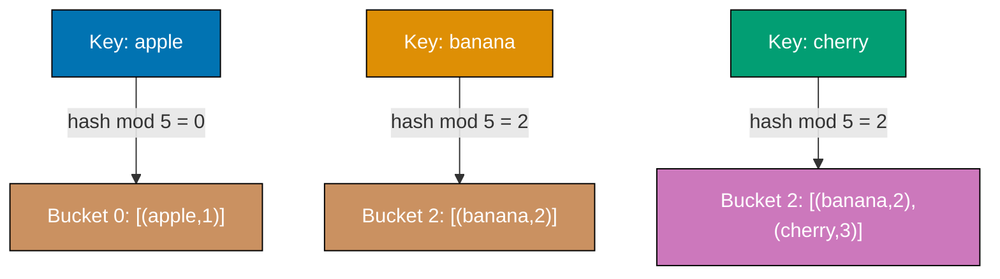
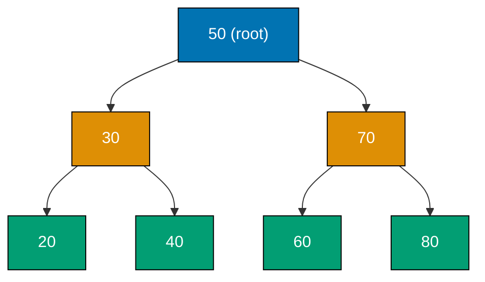
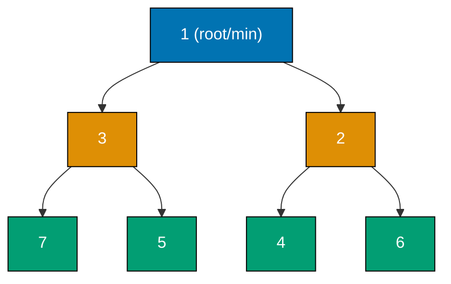
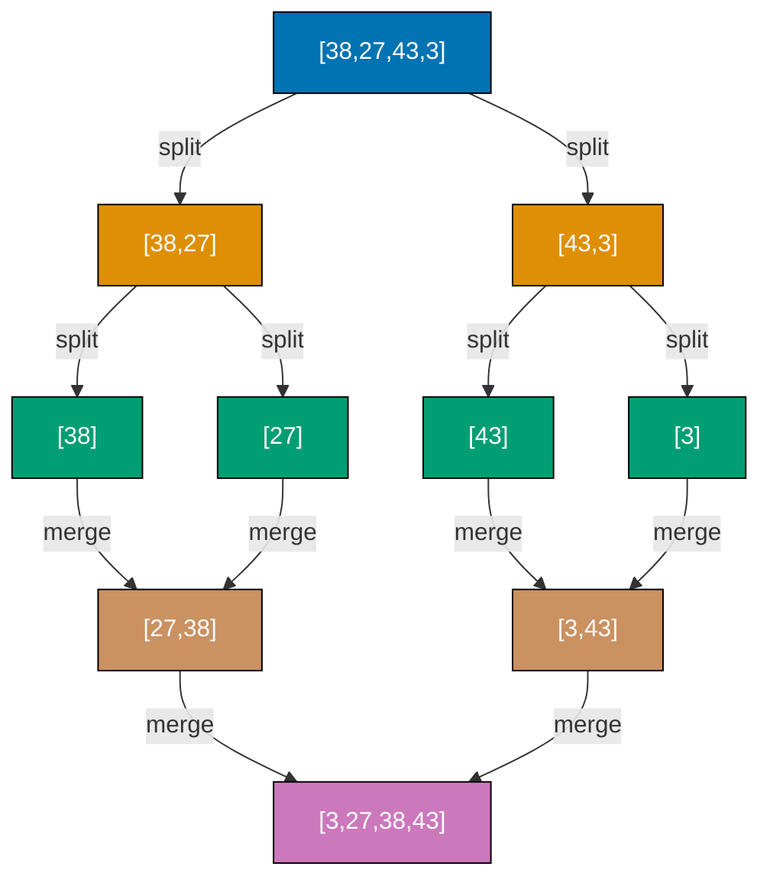
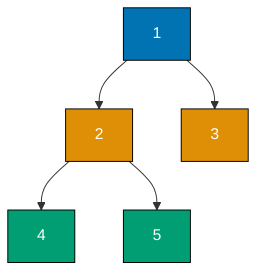
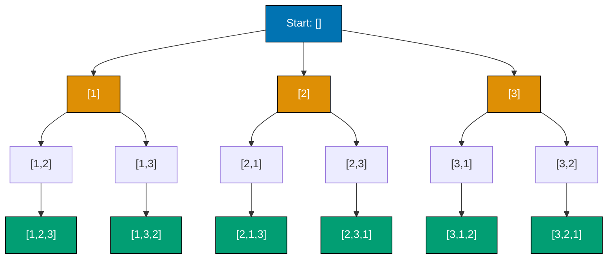
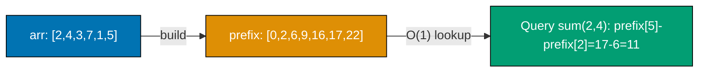
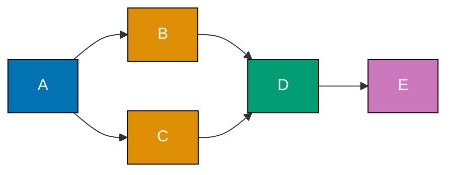

This section covers core algorithmic techniques and data structures used in production systems and technical interviews. Each example is self-contained and runnable with Python 3.8+. Examples build on the foundational concepts from the beginner section but include all necessary code to run independently.

## Binary Search

### Example 29: Binary Search on a Sorted Array

Binary search finds a target value in a sorted array by repeatedly halving the search space. Each step eliminates half the remaining candidates, producing O(log n) time complexity — 30 steps suffice for one billion elements.

```python
def binary_search(arr, target):
    # => arr must be sorted in ascending order for binary search to work
    # => target is the value we want to find

    left, right = 0, len(arr) - 1
    # => left starts at index 0, right starts at last valid index
    # => these two pointers define the active search window

    while left <= right:
        # => loop continues as long as search window is non-empty
        # => when left > right the target is not in the array

        mid = left + (right - left) // 2
        # => mid is the index of the middle element
        # => use (right - left) // 2 instead of (left + right) // 2 to avoid integer overflow

        if arr[mid] == target:
            # => found the target — return its index immediately
            return mid
        elif arr[mid] < target:
            # => mid element is too small, target must be to the right
            left = mid + 1
            # => discard left half including mid
        else:
            # => mid element is too large, target must be to the left
            right = mid - 1
            # => discard right half including mid

    return -1
    # => target not found, return sentinel value -1


arr = [2, 5, 8, 12, 16, 23, 38, 56, 72, 91]
# => sorted array with 10 elements, indices 0-9

print(binary_search(arr, 23))   # => Output: 5  (arr[5] == 23)
print(binary_search(arr, 100))  # => Output: -1 (100 not in array)
print(binary_search(arr, 2))    # => Output: 0  (first element)
print(binary_search(arr, 91))   # => Output: 9  (last element)
```

**Key Takeaway**: Binary search requires a sorted input and achieves O(log n) time by halving the search space each iteration. Use `mid = left + (right - left) // 2` to prevent integer overflow in languages with fixed-width integers.

**Why It Matters**: Binary search underpins database index lookups, sorted set operations in Redis, and range queries in file systems. A linear scan over a million records takes up to one million comparisons; binary search takes at most 20. Understanding this O(n) vs O(log n) distinction is essential for designing systems that scale — a 10x growth in data size adds one step to binary search but 10x steps to linear scan.

---

### Example 30: Binary Search for Insert Position

Binary search can also determine where a value should be inserted to keep an array sorted, without scanning linearly. This variant returns the leftmost index where `target` can be inserted.

```python
def search_insert_position(arr, target):
    # => returns index where target is found, or where it should be inserted
    # => result is always in range [0, len(arr)] inclusive

    left, right = 0, len(arr)
    # => right is len(arr), not len(arr)-1, because insertion can happen at end

    while left < right:
        # => strict less-than: when left == right the window is one slot wide
        mid = left + (right - left) // 2
        # => floor-division always rounds toward zero, biasing toward left

        if arr[mid] < target:
            # => mid is strictly less than target, so insert position is right of mid
            left = mid + 1
        else:
            # => arr[mid] >= target: insertion point is at mid or to its left
            right = mid
            # => do NOT subtract 1; mid is a candidate for insertion position

    return left
    # => left == right at loop exit, which is the insertion index


arr = [1, 3, 5, 6]
print(search_insert_position(arr, 5))  # => Output: 2  (found at index 2)
print(search_insert_position(arr, 2))  # => Output: 1  (2 goes between 1 and 3)
print(search_insert_position(arr, 7))  # => Output: 4  (7 appended at end)
print(search_insert_position(arr, 0))  # => Output: 0  (0 prepended at start)
```

**Key Takeaway**: The insert-position variant uses `right = len(arr)` and `right = mid` (not `mid - 1`) to correctly handle the case where the target belongs at the end of the array or equals an existing element.

**Why It Matters**: Insert-position binary search powers sorted container implementations such as Python's `bisect` module and Java's `Collections.binarySearch`. It enables O(log n) maintenance of sorted order when inserting into arrays, underpins event scheduling (find the correct slot in a sorted timeline), and is used in constraint solvers that need to place items in sorted priority queues efficiently.

---

## Hash Tables and Collision Resolution

### Example 31: Hash Table with Chaining

A hash table maps keys to values using a hash function that converts each key into an array index. Collisions — two keys hashing to the same index — are resolved by storing a linked list (chain) at each bucket.



```python
class HashTable:
    def __init__(self, capacity=8):
        self.capacity = capacity
        # => number of buckets; prime numbers reduce collision clustering
        self.buckets = [[] for _ in range(capacity)]
        # => each bucket is a list (chain) of (key, value) pairs
        # => initially all buckets are empty lists
        self.size = 0
        # => tracks number of key-value pairs stored

    def _hash(self, key):
        return hash(key) % self.capacity
        # => Python's built-in hash() returns an integer for any hashable key
        # => modulo maps that integer to a valid bucket index [0, capacity-1]

    def put(self, key, value):
        idx = self._hash(key)
        # => idx is the target bucket index
        bucket = self.buckets[idx]
        # => retrieve the chain at that bucket

        for i, (k, v) in enumerate(bucket):
            # => scan the chain to check if key already exists
            if k == key:
                bucket[i] = (key, value)
                # => update existing key's value in-place
                return
        bucket.append((key, value))
        # => key not found in chain: append new pair
        self.size += 1
        # => increment count of stored pairs

    def get(self, key):
        idx = self._hash(key)
        # => compute bucket index for this key
        for k, v in self.buckets[idx]:
            # => scan the chain at that bucket
            if k == key:
                return v
                # => found key: return its associated value
        return None
        # => key not present in any chain: return None

    def remove(self, key):
        idx = self._hash(key)
        bucket = self.buckets[idx]
        # => get the chain where key would live
        self.buckets[idx] = [(k, v) for k, v in bucket if k != key]
        # => rebuild chain excluding the target key
        # => self.size decrement omitted for brevity


ht = HashTable()
ht.put("apple", 1)
ht.put("banana", 2)
ht.put("cherry", 3)
ht.put("banana", 99)    # => update existing key

print(ht.get("apple"))   # => Output: 1
print(ht.get("banana"))  # => Output: 99 (updated value)
print(ht.get("grape"))   # => Output: None (not present)
```

**Key Takeaway**: Chaining resolves collisions by appending to a list at each bucket. Average-case O(1) insert/lookup assumes a good hash function and load factor below ~0.75; worst-case degrades to O(n) if all keys collide.

**Why It Matters**: Hash tables are the most widely used data structure in software engineering, backing Python dictionaries, Java's `HashMap`, Redis key-value storage, and database hash indexes. The choice of collision resolution strategy — chaining vs open addressing — affects cache locality, memory usage, and worst-case behavior. Understanding these trade-offs guides decisions when performance requirements exceed what a language's built-in map provides.

---

### Example 32: Hash Map for Frequency Counting

Python's `collections.Counter` and `dict` both build on hash tables. Counting element frequencies in O(n) time using a hash map is a foundational technique for anagram detection, histogram construction, and mode finding.

```python
from collections import Counter, defaultdict

# Approach A: Manual dict counting
def count_with_dict(items):
    freq = {}
    # => empty dict; will be populated key-by-key

    for item in items:
        # => iterate over every element in O(n) time
        freq[item] = freq.get(item, 0) + 1
        # => freq.get(item, 0) returns current count or 0 if absent
        # => increment count by 1 and store back
    return freq
    # => returns {item: count, ...}


words = ["apple", "banana", "apple", "cherry", "banana", "apple"]
result = count_with_dict(words)
print(result)
# => Output: {'apple': 3, 'banana': 2, 'cherry': 1}
```

Each O(1) average hash table lookup and insert accumulates counts in linear total time.

```python
# Approach B: defaultdict — avoids the .get(key, 0) pattern
def count_with_defaultdict(items):
    freq = defaultdict(int)
    # => defaultdict(int) creates 0 automatically for missing keys

    for item in items:
        freq[item] += 1
        # => if key absent, freq[item] initialises to 0 then increments to 1
        # => if key present, simply increments existing count
    return dict(freq)
    # => convert back to plain dict for clean output


result2 = count_with_defaultdict(words)
print(result2)
# => Output: {'apple': 3, 'banana': 2, 'cherry': 1}
```

`defaultdict` removes the need for a sentinel default on every access, producing cleaner code with the same O(n) time and O(k) space (k = distinct elements).

```python
# Approach C: Counter — most Pythonic, adds extra utility methods
counter = Counter(words)
# => Counter is a dict subclass specialised for counting
# => single call replaces the manual loop entirely

print(counter.most_common(2))
# => Output: [('apple', 3), ('banana', 2)]  (top 2 by count)
print(counter["cherry"])   # => Output: 1
print(counter["grape"])    # => Output: 0  (missing keys return 0, not KeyError)
```

**Key Takeaway**: Use `Counter` for concise frequency counting; use `defaultdict(int)` when you need a default-zero dict with additional logic in the loop; use plain `dict` with `.get()` when targeting environments without `collections`.

**Why It Matters**: Frequency counting with hash maps solves a wide class of interview and production problems: finding the most common log error, detecting anagrams, computing word histograms in NLP pipelines, and grouping events by type. The O(n) hash map approach replaces the naive O(n²) nested loop comparison that breaks at scale.

---

## Binary Search Trees

### Example 33: BST Insert and Search

A Binary Search Tree stores values so that every node's left subtree contains only smaller values and its right subtree contains only larger values. This ordering property enables O(log n) average-case search, insert, and delete on balanced trees.



```python
class BSTNode:
    def __init__(self, val):
        self.val = val
        # => node stores a single integer value
        self.left = None
        # => left child: will hold values < self.val
        self.right = None
        # => right child: will hold values > self.val


def bst_insert(root, val):
    if root is None:
        return BSTNode(val)
        # => base case: empty spot found, create new node here

    if val < root.val:
        root.left = bst_insert(root.left, val)
        # => value belongs in left subtree; recurse and reattach
    elif val > root.val:
        root.right = bst_insert(root.right, val)
        # => value belongs in right subtree; recurse and reattach
    # => if val == root.val, duplicate — do nothing (ignore or update as needed)
    return root
    # => return root so callers can chain insertions


def bst_search(root, val):
    if root is None:
        return False
        # => reached empty subtree: value not present in tree

    if val == root.val:
        return True
        # => found exact match at current node
    elif val < root.val:
        return bst_search(root.left, val)
        # => target smaller: must be in left subtree
    else:
        return bst_search(root.right, val)
        # => target larger: must be in right subtree


root = None
for v in [50, 30, 70, 20, 40, 60, 80]:
    root = bst_insert(root, v)
    # => build tree one node at a time
    # => final structure matches diagram above

print(bst_search(root, 40))   # => Output: True  (40 is in tree)
print(bst_search(root, 55))   # => Output: False (55 not in tree)
```

**Key Takeaway**: BST insert and search both follow the same "go left if smaller, go right if larger" logic, achieving O(log n) average depth on balanced trees. Worst-case O(n) occurs when inserting sorted data, which degenerates to a linked list.

**Why It Matters**: BSTs are the conceptual foundation for balanced trees (AVL, Red-Black) used in most production ordered-map implementations — Java's `TreeMap`, C++'s `std::map`, and PostgreSQL's B-tree indexes. Understanding BST structure and the degenerate sorted-input problem motivates why databases use B-trees with balanced branching factors rather than plain BSTs, enabling logarithmic lookups even on multi-terabyte datasets.

---

### Example 34: BST Inorder Traversal

Inorder traversal (left → root → right) visits BST nodes in ascending sorted order. This is the defining property of BSTs and is used to extract sorted sequences from tree-based indexes.

```python
class BSTNode:
    def __init__(self, val):
        self.val = val
        self.left = None
        self.right = None


def insert(root, val):
    if not root:
        return BSTNode(val)
    if val < root.val:
        root.left = insert(root.left, val)
    elif val > root.val:
        root.right = insert(root.right, val)
    return root


def inorder(root, result=None):
    if result is None:
        result = []
        # => initialise accumulator list on first call

    if root is None:
        return result
        # => base case: empty node contributes nothing

    inorder(root.left, result)
    # => 1. recurse left subtree first (all smaller values)
    result.append(root.val)
    # => 2. visit current node (add value in sorted position)
    inorder(root.right, result)
    # => 3. recurse right subtree last (all larger values)

    return result
    # => after full traversal, result contains all values in ascending order


def preorder(root, result=None):
    if result is None:
        result = []
    if root is None:
        return result
    result.append(root.val)
    # => visit root FIRST (before children)
    preorder(root.left, result)
    preorder(root.right, result)
    return result
    # => produces root-first ordering, useful for tree serialisation


def postorder(root, result=None):
    if result is None:
        result = []
    if root is None:
        return result
    postorder(root.left, result)
    postorder(root.right, result)
    result.append(root.val)
    # => visit root LAST (after both children)
    return result
    # => useful for bottom-up operations like deleting a tree or evaluating expressions


root = None
for v in [50, 30, 70, 20, 40, 60, 80]:
    root = insert(root, v)

print(inorder(root))   # => Output: [20, 30, 40, 50, 60, 70, 80]  (sorted!)
print(preorder(root))  # => Output: [50, 30, 20, 40, 70, 60, 80]  (root first)
print(postorder(root)) # => Output: [20, 40, 30, 60, 80, 70, 50]  (root last)
```

**Key Takeaway**: Inorder traversal produces BST values in sorted ascending order. Preorder is useful for tree serialisation (you can reconstruct the tree by inserting in preorder sequence). Postorder is used for bottom-up evaluation like expression trees or dependency resolution.

**Why It Matters**: Tree traversal order is not academic — database query planners use inorder traversal of B-tree indexes to execute range scans efficiently. Compilers use postorder traversal to evaluate abstract syntax trees (evaluate children before applying the operator). Serialising and deserialising distributed state often uses preorder traversal for deterministic reconstruction. Choosing the right traversal order directly affects algorithmic correctness.

---

## Heaps

### Example 35: Min-Heap with heapq

A min-heap is a complete binary tree where every parent is smaller than or equal to its children. Python's `heapq` module implements a min-heap using a plain list, providing O(log n) push/pop and O(1) peek at the minimum.



```python
import heapq

heap = []
# => heapq operates on a plain Python list
# => elements are stored so heap[0] is always the minimum

for val in [5, 3, 7, 1, 4, 2, 6]:
    heapq.heappush(heap, val)
    # => heappush inserts val and sifts it up to restore heap property
    # => O(log n) time per push

print(heap[0])   # => Output: 1  (minimum always at index 0, O(1) peek)

sorted_result = []
while heap:
    sorted_result.append(heapq.heappop(heap))
    # => heappop removes and returns the minimum element
    # => moves last element to root then sifts down to restore heap property
    # => O(log n) time per pop

print(sorted_result)  # => Output: [1, 2, 3, 4, 5, 6, 7]  (heap sort!)

# heapify: convert an existing list to a heap in O(n) time (faster than n pushes)
data = [9, 4, 7, 1, 8, 2, 6, 3, 5]
heapq.heapify(data)
# => data is now heap-ordered in-place: data[0] == 1 (minimum)
print(data[0])   # => Output: 1

# nsmallest / nlargest: efficient k-smallest without full sort
numbers = [10, 4, 5, 8, 6, 11, 26]
print(heapq.nsmallest(3, numbers))   # => Output: [4, 5, 6]
print(heapq.nlargest(3, numbers))    # => Output: [26, 11, 10]
# => nsmallest/nlargest use heapq internally, O(n log k) time
```

**Key Takeaway**: `heapq` provides a min-heap on a plain list. Use `heappush`/`heappop` for O(log n) priority queue operations, `heapify` for O(n) in-place heap construction, and `nsmallest`/`nlargest` for efficient top-k queries.

**Why It Matters**: Heaps power Dijkstra's shortest-path algorithm, operating system process schedulers, and event-driven simulation engines. Python's `heapq` underpins `concurrent.futures` task scheduling and `asyncio`'s event loop timer heap. When you need to repeatedly extract the minimum or maximum from a dynamically changing collection, a heap delivers O(log n) performance where sorting on each access would cost O(n log n).

---

### Example 36: Max-Heap and Priority Queue with Tuples

Python's `heapq` only provides a min-heap. To simulate a max-heap, negate values before inserting. Tuple entries `(priority, item)` enable priority queue behavior where items with equal priority are ordered by a secondary key.

```python
import heapq

# Max-heap simulation: negate values to invert ordering
max_heap = []
for val in [5, 3, 7, 1, 4]:
    heapq.heappush(max_heap, -val)
    # => negate so the largest value becomes the smallest negative
    # => heapq will always pop the smallest (most negative = originally largest)

print(-heapq.heappop(max_heap))  # => Output: 7  (largest original value)
print(-heapq.heappop(max_heap))  # => Output: 5
print(-heapq.heappop(max_heap))  # => Output: 4

# Priority queue with (priority, task) tuples
tasks = []
heapq.heappush(tasks, (3, "send report"))
# => priority 3 (lower = higher priority)
heapq.heappush(tasks, (1, "deploy fix"))
# => priority 1 — this will be returned first
heapq.heappush(tasks, (2, "review PR"))
# => priority 2

while tasks:
    priority, task = heapq.heappop(tasks)
    # => heappop returns tuple with lowest priority number first
    print(f"[P{priority}] {task}")
# => Output:
# => [P1] deploy fix
# => [P2] review PR
# => [P3] send report
```

**Key Takeaway**: Negate numeric values to turn `heapq` into a max-heap. Wrap items in `(priority, item)` tuples for priority queue semantics — Python compares tuples element-by-element, so priority is the primary sort key.

**Why It Matters**: Priority queues are the core data structure in scheduling systems: Kubernetes schedules pods by priority class, operating systems schedule processes with priority levels, and network routers implement quality-of-service using priority queues. The tuple pattern extends cleanly to multi-level priorities `(urgency, arrival_time, task)` and to objects with custom priority attributes, making `heapq` a flexible foundation without requiring external libraries.

---

### Example 37: Heapify and the Heap Property

`heapq.heapify` converts an unordered list into a valid heap in O(n) time by applying a bottom-up sift-down pass. This is more efficient than pushing n elements one at a time (O(n log n)).

```python
import heapq

def verify_heap_property(h):
    # => checks that every parent <= both children (min-heap invariant)
    for i in range(len(h)):
        left = 2 * i + 1
        # => left child index in 0-based array representation
        right = 2 * i + 2
        # => right child index
        if left < len(h) and h[i] > h[left]:
            return False
            # => parent greater than left child: heap property violated
        if right < len(h) and h[i] > h[right]:
            return False
            # => parent greater than right child: heap property violated
    return True
    # => all parent-child relationships satisfy min-heap invariant


data = [9, 4, 7, 1, 8, 2, 6, 3, 5]
print("Before heapify:", data)
# => Output: Before heapify: [9, 4, 7, 1, 8, 2, 6, 3, 5]  (unordered)

heapq.heapify(data)
# => heapify rearranges data in-place, O(n) time
# => starts from the last internal node and sifts down each node
print("After heapify:", data)
# => Output: After heapify: [1, 3, 2, 4, 8, 7, 6, 9, 5]  (heap-ordered)
# => Note: heap ordering != full sorted order; only parent<=children guaranteed

print("Min element:", data[0])            # => Output: Min element: 1
print("Heap valid:", verify_heap_property(data))  # => Output: Heap valid: True

# Demonstrate that heapify is NOT equivalent to sorting
import copy
data_copy = [9, 4, 7, 1, 8, 2, 6, 3, 5]
heapq.heapify(data_copy)
print("Heapified:", data_copy)
# => Output: Heapified: [1, 3, 2, 4, 8, 7, 6, 9, 5]  (heap order)
data_copy.sort()
print("Sorted:    ", data_copy)
# => Output: Sorted:     [1, 2, 3, 4, 5, 6, 7, 8, 9]  (fully sorted)
```

**Key Takeaway**: `heapify` produces a valid min-heap (parent ≤ children) but not a fully sorted array. The heap property only guarantees that the root is the global minimum, not that the rest of the array is ordered.

**Why It Matters**: The O(n) heapify bound matters in algorithms like heap sort and median-of-medians that need to convert an input array into a heap before processing. In streaming analytics, heapify is used to initialise a fixed-size priority buffer from historical data before processing new events. The distinction between heap order and sort order is also important for debugging: a list that passes heap validation is not necessarily sorted, which catches incorrect assumptions in code reviews.

---

## Merge Sort

### Example 38: Merge Sort Implementation

Merge sort divides the array in half recursively until each piece contains one element, then merges the pieces back in sorted order. This divide-and-conquer strategy guarantees O(n log n) time in all cases.



```python
def merge_sort(arr):
    if len(arr) <= 1:
        return arr
        # => base case: single element or empty array is already sorted

    mid = len(arr) // 2
    # => find midpoint to split array into two halves

    left = merge_sort(arr[:mid])
    # => recursively sort left half: arr[0 .. mid-1]
    right = merge_sort(arr[mid:])
    # => recursively sort right half: arr[mid .. end]

    return merge(left, right)
    # => combine two sorted halves into one sorted array


def merge(left, right):
    result = []
    # => accumulate merged elements here
    i = j = 0
    # => i is pointer into left, j is pointer into right

    while i < len(left) and j < len(right):
        # => advance whichever pointer holds the smaller element
        if left[i] <= right[j]:
            result.append(left[i])
            # => left element is smaller or equal: take it
            i += 1
        else:
            result.append(right[j])
            # => right element is smaller: take it
            j += 1

    result.extend(left[i:])
    # => append any remaining elements from left (right exhausted)
    result.extend(right[j:])
    # => append any remaining elements from right (left exhausted)
    return result
    # => result contains all elements from both halves in sorted order


arr = [38, 27, 43, 3, 9, 82, 10]
print(merge_sort(arr))  # => Output: [3, 9, 10, 27, 38, 43, 82]
```

**Key Takeaway**: Merge sort always achieves O(n log n) time because it makes exactly O(log n) recursive splits and each merge level processes n elements in total. It uses O(n) auxiliary space for the temporary arrays created during merging.

**Why It Matters**: Merge sort is the algorithm behind Python's `sorted()` and Java's `Arrays.sort()` for objects (TimSort is a merge sort hybrid). Its O(n log n) worst-case guarantee — unlike quicksort's O(n²) — makes it the standard choice for sorting linked lists and for external sorting of datasets that don't fit in RAM, where data is read and merged in sequential passes from disk.

---

## Quicksort

### Example 39: Quicksort with Lomuto Partition

Quicksort selects a pivot, partitions elements smaller than the pivot to its left and larger to its right, then recursively sorts each partition. It achieves O(n log n) average time with O(log n) stack space.

```python
import random

def quicksort(arr, low=0, high=None):
    if high is None:
        high = len(arr) - 1
        # => default to last index on first call

    if low < high:
        # => base case: single element or empty range needs no sorting
        pivot_idx = partition(arr, low, high)
        # => partition returns final sorted position of pivot
        quicksort(arr, low, pivot_idx - 1)
        # => recursively sort elements left of pivot
        quicksort(arr, pivot_idx + 1, high)
        # => recursively sort elements right of pivot
    return arr
    # => array is sorted in-place; return for convenience


def partition(arr, low, high):
    # => Lomuto partition scheme: pivot is arr[high]
    rand_idx = random.randint(low, high)
    arr[rand_idx], arr[high] = arr[high], arr[rand_idx]
    # => swap random element to high position to avoid O(n^2) on sorted input
    # => random pivot selection gives O(n log n) expected time

    pivot = arr[high]
    # => pivot is now at arr[high]
    i = low - 1
    # => i tracks the boundary: elements left of i+1 are <= pivot

    for j in range(low, high):
        # => j scans from low to high-1
        if arr[j] <= pivot:
            i += 1
            arr[i], arr[j] = arr[j], arr[i]
            # => element <= pivot: move it to the left partition
            # => swap to place at next position in left region

    arr[i + 1], arr[high] = arr[high], arr[i + 1]
    # => move pivot from high to its correct sorted position i+1
    return i + 1
    # => return pivot's final index


arr = [64, 34, 25, 12, 22, 11, 90]
result = quicksort(arr)
print(result)  # => Output: [11, 12, 22, 25, 34, 64, 90]
```

**Key Takeaway**: Quicksort sorts in-place with O(log n) average stack depth, but worst-case O(n²) occurs when pivots are always the smallest or largest element. Randomising the pivot selection reduces the probability of hitting the worst case to negligible levels in practice.

**Why It Matters**: Python's `list.sort()` and NumPy's sort use introsort, a hybrid of quicksort and heapsort that falls back to heapsort if recursion depth exceeds O(log n). Quicksort's cache-friendly sequential memory access pattern makes it faster than merge sort in practice despite equal average complexity. Understanding quicksort's pivot selection and partition scheme is essential for implementing efficient sorting on embedded systems and for low-latency order book matching engines where sort performance is on the critical path.

---

## Counting Sort

### Example 40: Counting Sort for Integer Keys

Counting sort achieves O(n + k) time where k is the range of values. It counts occurrences of each value, computes cumulative positions, and places each element in its correct output position — no comparisons required.

```python
def counting_sort(arr):
    if not arr:
        return []
        # => empty input: return immediately

    max_val = max(arr)
    # => find the range maximum; O(n) scan
    # => array values must be non-negative integers for this implementation

    count = [0] * (max_val + 1)
    # => count[i] will store how many times value i appears in arr
    # => size is max_val + 1 to accommodate index max_val

    for val in arr:
        count[val] += 1
        # => increment count for each value seen
        # => after this loop: count[3]=2 means value 3 appears twice

    output = []
    for val, freq in enumerate(count):
        # => enumerate gives (index, count) pairs
        # => index is the value, freq is how many times it appears
        output.extend([val] * freq)
        # => append 'freq' copies of 'val' to output
        # => values are added in ascending order because we enumerate from 0

    return output
    # => output contains all original elements in sorted order


arr = [4, 2, 2, 8, 3, 3, 1]
print(counting_sort(arr))  # => Output: [1, 2, 2, 3, 3, 4, 8]

# Verify O(n+k) time: n=7 elements, k=9 (range 0-8)
# compare to O(n log n) = 7 * ~2.8 ≈ 19.6 operations vs O(7+9) = 16 operations
# advantage grows when k << n^2 (small range, large input)

large = list(range(1000, -1, -1))  # 1001 elements in descending order
sorted_large = counting_sort(large)
print(sorted_large[:5], "...", sorted_large[-5:])
# => Output: [0, 1, 2, 3, 4] ... [996, 997, 998, 999, 1000]
```

**Key Takeaway**: Counting sort runs in O(n + k) time and O(k) space where k is the value range. It is optimal when k = O(n), but becomes impractical when k is much larger than n (e.g., sorting 10 numbers from 0 to 10 billion).

**Why It Matters**: Counting sort and its extension radix sort power ultra-fast sorting in domains with bounded integer keys: sorting network packets by port number (0-65535), sorting grades (0-100), and bucket sorting IP addresses for routing table lookups. Database engines use counting sort variants for sorting small integer columns in analytics queries where the value range fits in L1 cache. In competitive programming, counting sort frequently enables solutions that would otherwise time-out with comparison-based O(n log n) algorithms.

---

## Tree Balancing Concepts

### Example 41: AVL Tree Height and Balance Factor

An AVL tree maintains a balance factor (height of left subtree minus height of right subtree) of -1, 0, or +1 at every node. When an insertion violates this invariant, a rotation restores balance. This keeps tree height at O(log n), preventing BST degeneration.

```python
class AVLNode:
    def __init__(self, val):
        self.val = val
        self.left = None
        self.right = None
        self.height = 1
        # => height of a leaf node is 1 (counts the node itself)


def get_height(node):
    if node is None:
        return 0
        # => empty subtree has height 0
    return node.height
    # => return stored height (updated on insert)


def get_balance(node):
    if node is None:
        return 0
        # => null node has balance 0
    return get_height(node.left) - get_height(node.right)
    # => positive balance: left-heavy tree
    # => negative balance: right-heavy tree
    # => AVL property: balance must stay in {-1, 0, +1}


def right_rotate(z):
    # => z is the unbalanced node (balance factor > 1, left-heavy)
    y = z.left
    # => y becomes new root of this subtree
    T3 = y.right
    # => T3 is y's right subtree; will become z's new left child

    y.right = z
    # => rotate: z moves down to become y's right child
    z.left = T3
    # => T3 reconnects as z's left child

    z.height = 1 + max(get_height(z.left), get_height(z.right))
    # => update z's height after rotation (z is now lower)
    y.height = 1 + max(get_height(y.left), get_height(y.right))
    # => update y's height after rotation (y is now higher)
    return y
    # => y is the new root of this subtree


def left_rotate(z):
    # => z is unbalanced (balance factor < -1, right-heavy)
    y = z.right
    # => y becomes new root
    T2 = y.left
    # => T2 reconnects as z's new right child

    y.left = z
    z.right = T2

    z.height = 1 + max(get_height(z.left), get_height(z.right))
    y.height = 1 + max(get_height(y.left), get_height(y.right))
    return y


def avl_insert(root, val):
    # => Step 1: perform standard BST insert
    if root is None:
        return AVLNode(val)
    if val < root.val:
        root.left = avl_insert(root.left, val)
    elif val > root.val:
        root.right = avl_insert(root.right, val)
    else:
        return root
        # => duplicate value: no change

    # => Step 2: update height of this node
    root.height = 1 + max(get_height(root.left), get_height(root.right))

    # => Step 3: check balance factor
    balance = get_balance(root)
    # => balance > 1: left-heavy; balance < -1: right-heavy

    # => Case LL: left child is also left-heavy — single right rotation
    if balance > 1 and val < root.left.val:
        return right_rotate(root)

    # => Case RR: right child is also right-heavy — single left rotation
    if balance < -1 and val > root.right.val:
        return left_rotate(root)

    # => Case LR: left child is right-heavy — left rotate child then right rotate root
    if balance > 1 and val > root.left.val:
        root.left = left_rotate(root.left)
        return right_rotate(root)

    # => Case RL: right child is left-heavy — right rotate child then left rotate root
    if balance < -1 and val < root.right.val:
        root.right = right_rotate(root.right)
        return left_rotate(root)

    return root
    # => no rotation needed; return unchanged root


root = None
for v in [10, 20, 30, 40, 50, 25]:
    root = avl_insert(root, v)
    # => without balancing, sorted input [10,20,30,40,50] would give a linear chain
    # => AVL rotations keep height at O(log n)

print("Root:", root.val)              # => Output: Root: 30
print("Root height:", root.height)    # => Output: Root height: 3
print("Root balance:", get_balance(root))  # => Output: Root balance: 0
```

**Key Takeaway**: AVL trees maintain O(log n) height by rotating nodes when the balance factor exceeds ±1. There are four rotation cases (LL, RR, LR, RL) and each rotation is an O(1) pointer rearrangement.

**Why It Matters**: AVL trees and their cousin Red-Black trees guarantee O(log n) worst-case search, insert, and delete — unlike plain BSTs that degrade to O(n). Java's `TreeMap` and `TreeSet` use Red-Black trees, Linux's completely fair scheduler uses a Red-Black tree to track process runtimes, and PostgreSQL uses B-trees (a generalisation of balanced binary trees) for its primary indexes. Understanding balance factors and rotations is prerequisite knowledge for implementing custom ordered containers and for diagnosing slow queries caused by index imbalance.

---

## BFS and DFS on Trees

### Example 42: BFS on a Binary Tree (Level-Order Traversal)

Breadth-first search visits nodes level by level using a queue. On a binary tree, this produces the level-order sequence and is used to find the shortest path in unweighted trees.



```python
from collections import deque


class TreeNode:
    def __init__(self, val):
        self.val = val
        self.left = None
        self.right = None


def bfs_level_order(root):
    if root is None:
        return []
        # => empty tree: return empty level list

    result = []
    # => will contain one list per level
    queue = deque([root])
    # => deque is used for O(1) popleft; list.pop(0) would be O(n)

    while queue:
        # => process one full level per iteration
        level_size = len(queue)
        # => number of nodes at the current level
        level = []
        # => collect current level's values here

        for _ in range(level_size):
            node = queue.popleft()
            # => dequeue the next node from the front in O(1)
            level.append(node.val)
            # => record this node's value for the current level

            if node.left:
                queue.append(node.left)
                # => enqueue left child for next level processing
            if node.right:
                queue.append(node.right)
                # => enqueue right child for next level processing

        result.append(level)
        # => current level is complete; add to result

    return result
    # => list of lists, each inner list is one level of the tree


root = TreeNode(1)
root.left = TreeNode(2)
root.right = TreeNode(3)
root.left.left = TreeNode(4)
root.left.right = TreeNode(5)

print(bfs_level_order(root))
# => Output: [[1], [2, 3], [4, 5]]
# => level 0: [1], level 1: [2,3], level 2: [4,5]
```

**Key Takeaway**: BFS on trees uses a `deque` as a queue. Processing exactly `len(queue)` nodes per outer loop iteration cleanly separates each level without needing a sentinel marker.

**Why It Matters**: Level-order traversal powers features in real products: rendering DOM trees level by level for incremental page loading, breadth-first search in social graphs to find connections within N degrees, and pathfinding in grid-based games where each cell is a tree/graph node. Using `deque` instead of a list for the queue is an important production detail — `list.pop(0)` shifts all remaining elements in O(n), making BFS O(n²) instead of O(n).

---

### Example 43: DFS on a Binary Tree (Iterative with Stack)

Depth-first search explores as far as possible before backtracking. An iterative DFS implementation uses an explicit stack instead of recursion, avoiding Python's recursion depth limit for large trees.

```python
class TreeNode:
    def __init__(self, val):
        self.val = val
        self.left = None
        self.right = None


def dfs_iterative_preorder(root):
    if root is None:
        return []

    result = []
    stack = [root]
    # => stack holds nodes yet to be visited
    # => initialised with root; use a list as a stack (append/pop are O(1))

    while stack:
        node = stack.pop()
        # => pop from top of stack: LIFO order gives DFS behavior
        result.append(node.val)
        # => process node (preorder: root before children)

        if node.right:
            stack.append(node.right)
            # => push right child first so left is processed first
            # => stack is LIFO: right pushed first means left popped first
        if node.left:
            stack.append(node.left)
            # => left child is on top and will be processed next

    return result
    # => result contains preorder DFS sequence


def dfs_all_paths(root):
    # => find all root-to-leaf paths
    if root is None:
        return []

    paths = []
    # => will contain all root-to-leaf paths as lists
    stack = [(root, [root.val])]
    # => each stack entry is (node, path_so_far)
    # => path_so_far is the sequence of values from root to current node

    while stack:
        node, path = stack.pop()
        # => unpack current node and its path from root

        if not node.left and not node.right:
            paths.append(path)
            # => leaf node reached: this path is complete
        else:
            if node.right:
                stack.append((node.right, path + [node.right.val]))
                # => extend path with right child value
            if node.left:
                stack.append((node.left, path + [node.left.val]))
                # => extend path with left child value

    return paths


root = TreeNode(1)
root.left = TreeNode(2)
root.right = TreeNode(3)
root.left.left = TreeNode(4)
root.left.right = TreeNode(5)

print(dfs_iterative_preorder(root))  # => Output: [1, 2, 4, 5, 3]
print(dfs_all_paths(root))
# => Output: [[1, 2, 4], [1, 2, 5], [1, 3]]
```

**Key Takeaway**: Iterative DFS with an explicit stack avoids Python's default 1000-frame recursion limit. Push the right child before the left child so that the left subtree is processed first, preserving standard preorder left-before-right semantics.

**Why It Matters**: Iterative DFS is used in production compilers for abstract syntax tree analysis, in static analysis tools (linters, type checkers) that walk expression trees, and in file system scanners (find equivalent) that traverse directory trees. Path enumeration with `dfs_all_paths` is used in network routing to find all paths between two nodes and in game engines to enumerate decision trees for AI planning.

---

## Recursion Patterns

### Example 44: Divide and Conquer — Maximum Subarray

Divide and conquer splits a problem into independent subproblems, solves each recursively, then combines results. Finding the maximum subarray sum demonstrates this pattern: the answer is either entirely in the left half, entirely in the right half, or crosses the midpoint.

```python
def max_crossing_sum(arr, left, mid, right):
    # => find maximum sum of subarray that crosses the midpoint
    left_sum = float("-inf")
    # => best sum extending from mid leftward
    total = 0

    for i in range(mid, left - 1, -1):
        # => scan from mid toward left (inclusive)
        total += arr[i]
        if total > left_sum:
            left_sum = total
            # => track best running sum going left

    right_sum = float("-inf")
    # => best sum extending from mid+1 rightward
    total = 0

    for i in range(mid + 1, right + 1):
        # => scan from mid+1 toward right (inclusive)
        total += arr[i]
        if total > right_sum:
            right_sum = total
            # => track best running sum going right

    return left_sum + right_sum
    # => crossing sum = best left extension + best right extension


def max_subarray_divide_conquer(arr, left, right):
    if left == right:
        return arr[left]
        # => base case: single element is its own max subarray

    mid = (left + right) // 2
    # => split array at midpoint

    left_max = max_subarray_divide_conquer(arr, left, mid)
    # => solve left half recursively
    right_max = max_subarray_divide_conquer(arr, mid + 1, right)
    # => solve right half recursively
    cross_max = max_crossing_sum(arr, left, mid, right)
    # => solve the crossing case (touches midpoint)

    return max(left_max, right_max, cross_max)
    # => answer is the best of the three cases


arr = [-2, 1, -3, 4, -1, 2, 1, -5, 4]
n = len(arr)
result = max_subarray_divide_conquer(arr, 0, n - 1)
print(result)  # => Output: 6  (subarray [4, -1, 2, 1] sums to 6)
```

**Key Takeaway**: Divide and conquer solves this in O(n log n) by splitting into subproblems and combining with a linear crossing-sum scan. Kadane's algorithm solves the same problem in O(n) via dynamic programming — the divide-and-conquer version teaches the pattern even if it is not optimal here.

**Why It Matters**: Divide and conquer underpins merge sort, quicksort, FFT (Fast Fourier Transform used in audio processing and polynomial multiplication), and Strassen's matrix multiplication. Understanding how to identify the base case, the split, and the combine step is the mental framework behind most O(n log n) algorithms. Many performance-critical calculations in signal processing, computational geometry, and machine learning learning algorithms decompose via divide and conquer.

---

### Example 45: Backtracking — Generating Permutations

Backtracking builds candidates incrementally and abandons ("backtracks") a candidate the moment it cannot lead to a valid solution. Generating all permutations is the canonical backtracking example.



```python
def permutations(nums):
    result = []
    # => will hold all complete permutations

    def backtrack(current, remaining):
        # => current: elements chosen so far (current path in search tree)
        # => remaining: elements not yet placed

        if not remaining:
            result.append(list(current))
            # => base case: all elements placed, record this permutation
            return

        for i, num in enumerate(remaining):
            # => try each remaining element as the next choice
            current.append(num)
            # => choose: extend current path with num

            next_remaining = remaining[:i] + remaining[i + 1:]
            # => remaining without num (elements still available)
            backtrack(current, next_remaining)
            # => explore: recurse with updated state

            current.pop()
            # => unchoose: remove num to try next alternative (backtrack)
            # => this restores current to its state before this iteration

    backtrack([], nums)
    return result
    # => result contains all n! permutations


print(permutations([1, 2, 3]))
# => Output: [[1,2,3],[1,3,2],[2,1,3],[2,3,1],[3,1,2],[3,2,1]]
print(len(permutations([1, 2, 3, 4])))  # => Output: 24  (4! = 24)
```

**Key Takeaway**: The backtracking pattern is: choose an option, explore with it (recurse), then unchoose to restore state before trying the next option. The `current.pop()` after the recursive call is the essential "undo" step.

**Why It Matters**: Backtracking solves constraint satisfaction problems that appear across domains: Sudoku solvers, N-queens placement, regex matching engines, and SAT solvers all use this pattern. The Python standard library's `itertools.permutations` uses an equivalent algorithm. In compiler design, backtracking is used for parsing ambiguous grammars. The key insight — "try, recurse, undo" — transfers directly to solving problems that would require exponential space to enumerate iteratively.

---

## Two-Pointer Technique

### Example 46: Two Pointers — Two Sum in Sorted Array

The two-pointer technique uses two indices moving toward each other (or in the same direction) to avoid a nested O(n²) loop. For a sorted array, pointers from both ends can find a pair summing to a target in O(n) time.

```python
def two_sum_sorted(arr, target):
    # => arr must be sorted in ascending order
    left, right = 0, len(arr) - 1
    # => left starts at smallest, right starts at largest

    while left < right:
        # => pointers must not cross; when left==right only one element remains
        current_sum = arr[left] + arr[right]
        # => test the pair at the current window

        if current_sum == target:
            return (arr[left], arr[right])
            # => found pair: return the actual values

        elif current_sum < target:
            left += 1
            # => sum too small: moving left rightward increases sum
            # => moving right leftward would decrease sum (wrong direction)

        else:
            right -= 1
            # => sum too large: moving right leftward decreases sum
            # => moving left rightward would increase sum (wrong direction)

    return None
    # => no pair found; target not achievable


arr = [1, 2, 3, 4, 6]
print(two_sum_sorted(arr, 6))   # => Output: (2, 4)
print(two_sum_sorted(arr, 9))   # => Output: (3, 6)
print(two_sum_sorted(arr, 10))  # => Output: None  (no valid pair)


def remove_duplicates_sorted(arr):
    # => two pointers to deduplicate sorted array in-place
    if not arr:
        return 0
    slow = 0
    # => slow pointer marks the last position of the unique-values prefix

    for fast in range(1, len(arr)):
        # => fast pointer scans ahead looking for new unique values
        if arr[fast] != arr[slow]:
            # => new unique value found
            slow += 1
            arr[slow] = arr[fast]
            # => extend unique prefix by one; overwrite next position

    return slow + 1
    # => length of deduplicated prefix is slow+1


nums = [0, 0, 1, 1, 1, 2, 2, 3, 3, 4]
length = remove_duplicates_sorted(nums)
print(nums[:length])  # => Output: [0, 1, 2, 3, 4]
```

**Key Takeaway**: The two-pointer technique on a sorted array reduces O(n²) search to O(n) by exploiting the ordered structure — when the sum is too small, advance the left pointer; when too large, retreat the right pointer. The slow/fast variant handles deduplication without extra space.

**Why It Matters**: Two-pointer patterns appear in three-sum problems, container with most water, palindrome checking, and merging two sorted arrays. LeetCode's top interview questions list includes at least five two-pointer problems (Dutch National Flag, trapping rain water, container with most water). In database query execution, sort-merge join uses the same two-pointer principle to join two sorted result sets in O(n + m) without a hash table.

---

### Example 47: Two Pointers — Container With Most Water

Given heights of vertical lines, find two lines that together with the x-axis form a container holding the most water. Two pointers converge from the outside inward, always moving the shorter line.

```python
def max_water(height):
    # => height[i] is the height of vertical line at position i
    # => water trapped between lines i and j = min(height[i], height[j]) * (j - i)

    left, right = 0, len(height) - 1
    # => start with widest possible container
    max_area = 0
    # => track maximum area seen

    while left < right:
        width = right - left
        # => width is the horizontal distance between the two lines

        current_area = min(height[left], height[right]) * width
        # => area is limited by the shorter of the two lines
        # => water level = min height; extra height on taller line is wasted

        if current_area > max_area:
            max_area = current_area
            # => update maximum if this container is larger

        if height[left] < height[right]:
            left += 1
            # => left line is shorter: moving left inward might find a taller line
            # => moving right inward would keep the same short left line (worse width)
        else:
            right -= 1
            # => right line is shorter or equal: move right inward
            # => same logic: replace the limiting (shorter) side

    return max_area
    # => maximum water container area


heights = [1, 8, 6, 2, 5, 4, 8, 3, 7]
print(max_water(heights))  # => Output: 49
# => best pair: heights[1]=8 and heights[8]=7, width=7
# => area = min(8,7) * 7 = 7 * 7 = 49
```

**Key Takeaway**: Always move the pointer at the shorter line inward — moving the taller line inward can never increase area (width decreases and height is already limited by the short side), so the greedy choice is to move the shorter pointer seeking a potentially taller replacement.

**Why It Matters**: This greedy two-pointer strategy reduces an O(n²) brute-force search to O(n) with a proof-by-contradiction argument: moving the taller side cannot improve the result, so we never miss the optimal pair. The same reasoning applies to problems like "minimize maximum difference" and "maximize rectangle in histogram" variants. Recognizing when a sorted or monotonic structure allows pointer convergence rather than nested iteration is a key technique for reducing time complexity in interval and geometric algorithms.

---

## Sliding Window

### Example 48: Fixed-Size Sliding Window — Maximum Sum Subarray

The sliding window technique maintains a contiguous subarray of fixed or variable size by advancing both ends of the window together. For fixed-size windows, one element leaves and one enters per step, avoiding O(n·k) recomputation.

```mermaid
graph LR
    A["[2, 1, 5, 1, 3, 2]"]
    W1["Window 1: [2,1,5] sum=8"]
    W2["Window 2: [1,5,1] sum=7"]
    W3["Window 3: [5,1,3] sum=9"]
    W4["Window 4: [1,3,2] sum=6"]

    A --> W1
    W1 -->|slide right| W2
    W2 -->|slide right| W3
    W3 -->|slide right| W4

    style A fill:#0173B2,stroke:#000,color:#fff
    style W1 fill:#DE8F05,stroke:#000,color:#fff
    style W2 fill:#DE8F05,stroke:#000,color:#fff
    style W3 fill:#029E73,stroke:#000,color:#fff
    style W4 fill:#CA9161,stroke:#000,color:#fff
```



```python
def max_sum_subarray_k(arr, k):
    # => find maximum sum of any contiguous subarray of exactly k elements
    # => O(n) time: each element enters and exits the window exactly once

    n = len(arr)
    if n < k:
        return None
        # => not enough elements for window of size k

    window_sum = sum(arr[:k])
    # => compute sum of first window [0 .. k-1]
    max_sum = window_sum
    # => initialise max with the first window's sum

    for i in range(k, n):
        # => slide window one position to the right
        window_sum += arr[i]
        # => add incoming element (right edge of new window)
        window_sum -= arr[i - k]
        # => remove outgoing element (left edge of old window)
        # => arr[i-k] was the leftmost element that just left the window

        if window_sum > max_sum:
            max_sum = window_sum
            # => update maximum if this window is better

    return max_sum
    # => maximum sum seen across all k-size windows


arr = [2, 1, 5, 1, 3, 2]
print(max_sum_subarray_k(arr, 3))  # => Output: 9  (window [5,1,3])
print(max_sum_subarray_k(arr, 2))  # => Output: 6  (window [5,1] = 6? No: [5,1]=6 but check: [1,5]=6, [3,2]=5 → max is 6)
print(max_sum_subarray_k([1, 9, -1, -2, 7, 3, -1, 2], 4))  # => Output: 18  ([7,3,-1,2]? no: [9,-1,-2,7]=13; [1,9,-1,-2]=7; [-1,-2,7,3]=7; [-2,7,3,-1]=7; [7,3,-1,2]=11; [1,9,-1,-2,7,3,-1,2] k=4: max is [-1,-2,7,3]=7? let us recheck: sums are 16,13,11,7,9: window [1,9,-1,-2]=7, [9,-1,-2,7]=13, [-1,-2,7,3]=7, [-2,7,3,-1]=7, [7,3,-1,2]=11 → max=13)
# => Note: recalculating: windows of size 4: [1,9,-1,-2]=7, [9,-1,-2,7]=13, [-1,-2,7,3]=7, [-2,7,3,-1]=7, [7,3,-1,2]=11 → Output: 13
```

**Key Takeaway**: The fixed sliding window adds the incoming element and subtracts the outgoing element each step, maintaining an O(1) update cost. The total time across all n-k+1 windows is O(n) regardless of window size k.

**Why It Matters**: Fixed sliding windows power real-time analytics: computing moving averages for stock price smoothing, calculating rolling error rates in observability dashboards, and implementing network rate limiting that counts requests in a fixed time window. Any metric that requires "sum/average/max over the last N events" can be computed with O(1) updates per new event using this pattern, enabling streaming calculations over unbounded data streams without storing all history.

---

### Example 49: Variable-Size Sliding Window — Longest Substring Without Repeating Characters

A variable-size sliding window expands when conditions are met and contracts when they are violated. The two-pointer approach with a set finds the longest contiguous substring without duplicate characters in O(n) time.

```python
def length_of_longest_unique_substring(s):
    # => find length of longest substring with no repeated characters
    char_set = set()
    # => tracks characters currently in the window
    left = 0
    # => left boundary of the window
    max_length = 0
    # => track longest valid window seen

    for right in range(len(s)):
        # => right pointer expands window one character at a time

        while s[right] in char_set:
            # => current character already in window: shrink from left
            char_set.remove(s[left])
            # => remove leftmost character to make room
            left += 1
            # => advance left boundary

        char_set.add(s[right])
        # => add current character to window (no longer a duplicate)

        window_length = right - left + 1
        # => size of current valid window
        if window_length > max_length:
            max_length = window_length
            # => update maximum if this window is larger

    return max_length
    # => length of longest substring with all unique characters


print(length_of_longest_unique_substring("abcabcbb"))  # => Output: 3  ("abc")
print(length_of_longest_unique_substring("bbbbb"))     # => Output: 1  ("b")
print(length_of_longest_unique_substring("pwwkew"))    # => Output: 3  ("wke")
print(length_of_longest_unique_substring(""))          # => Output: 0  (empty string)
```

**Key Takeaway**: The variable window shrinks from the left whenever the right pointer encounters a character already in the window. Because each character enters and exits the `char_set` at most once, the total work is O(n) amortised.

**Why It Matters**: Variable sliding windows solve many substring/subarray optimisation problems: minimum window substring (find smallest window containing all characters of a target), longest subarray with sum ≤ k, and maximum number of consecutive 1s with k flips allowed. These patterns appear in text editors (efficient search-and-highlight), network protocol parsers (framing variable-length messages), and genomics (finding repeating motifs in DNA sequences). The amortised O(n) proof — each pointer moves at most n steps — is a recurring argument in algorithm analysis.

---

## Prefix Sums

### Example 50: Prefix Sum Array for Range Queries

A prefix sum array stores cumulative totals so that any range sum `sum(arr[l..r])` can be answered in O(1) after an O(n) preprocessing step. This trades O(n) preprocessing for O(1) query time, benefiting workloads with many range queries.



```python
def build_prefix_sum(arr):
    n = len(arr)
    prefix = [0] * (n + 1)
    # => prefix[0] = 0 (sum of zero elements)
    # => prefix[i] = arr[0] + arr[1] + ... + arr[i-1]
    # => using n+1 length avoids special-casing l=0 in range queries

    for i in range(n):
        prefix[i + 1] = prefix[i] + arr[i]
        # => each prefix entry adds one more element to the running sum

    return prefix
    # => prefix[i] = sum of arr[0..i-1]


def range_sum(prefix, left, right):
    # => sum of arr[left..right] inclusive
    return prefix[right + 1] - prefix[left]
    # => prefix[right+1] = sum of arr[0..right]
    # => prefix[left]    = sum of arr[0..left-1]
    # => difference      = sum of arr[left..right]  (O(1) per query)


arr = [2, 4, 3, 7, 1, 5]
prefix = build_prefix_sum(arr)
print(prefix)                  # => Output: [0, 2, 6, 9, 16, 17, 22]

print(range_sum(prefix, 0, 2)) # => Output: 9   (2+4+3)
print(range_sum(prefix, 1, 4)) # => Output: 15  (4+3+7+1)
print(range_sum(prefix, 2, 5)) # => Output: 16  (3+7+1+5)


def count_subarrays_with_sum_k(arr, k):
    # => count subarrays whose elements sum to exactly k
    # => uses prefix sum + hash map: O(n) time
    count = 0
    prefix_sum = 0
    freq = {0: 1}
    # => freq[s] = number of indices where prefix sum equals s
    # => freq[0]=1 represents the empty prefix (before index 0)

    for val in arr:
        prefix_sum += val
        # => extend prefix sum by one element

        complement = prefix_sum - k
        # => if prefix[j] = prefix_sum - k exists, then arr[j..i] sums to k
        count += freq.get(complement, 0)
        # => add number of previous indices where prefix sum = complement

        freq[prefix_sum] = freq.get(prefix_sum, 0) + 1
        # => record current prefix sum for future lookups

    return count


arr2 = [1, 1, 1]
print(count_subarrays_with_sum_k(arr2, 2))  # => Output: 2  ([1,1] at positions 0-1 and 1-2)
```

**Key Takeaway**: The prefix sum pattern reduces n range-sum queries from O(n²) to O(n) preprocessing plus O(1) per query. Pairing prefix sums with a hash map (prefix sum complement trick) solves subarray sum problems in O(n).

**Why It Matters**: Prefix sums underpin database aggregate functions over sliding windows, image processing (summed-area tables for fast blur filters), and financial analytics (cumulative return calculations). The prefix sum complement trick (`freq[prefix_sum - k]`) appears in LeetCode's top 10 most-asked problems and is used in fraud detection systems to find suspicious transaction subsequences that sum to threshold amounts in a single O(n) pass.

---

## Graph Representation

### Example 51: Adjacency List Representation

An adjacency list represents a graph as a dictionary mapping each node to its list of neighbours. This is space-efficient for sparse graphs (few edges relative to nodes) and enables O(1) iteration over a node's neighbours.



```python
from collections import defaultdict, deque


class Graph:
    def __init__(self, directed=False):
        self.adj = defaultdict(list)
        # => adj[node] = list of neighbouring nodes
        # => defaultdict(list) auto-creates empty list for new nodes
        self.directed = directed
        # => if False, every edge is added in both directions

    def add_edge(self, u, v):
        self.adj[u].append(v)
        # => add v to u's neighbour list
        if not self.directed:
            self.adj[v].append(u)
            # => for undirected graphs, also add u to v's neighbour list

    def bfs(self, start):
        visited = set()
        # => track visited nodes to avoid revisiting in cycles
        queue = deque([start])
        # => BFS uses a queue (FIFO)
        visited.add(start)
        order = []
        # => record traversal order

        while queue:
            node = queue.popleft()
            # => dequeue next node
            order.append(node)

            for neighbour in self.adj[node]:
                # => explore all neighbours
                if neighbour not in visited:
                    visited.add(neighbour)
                    # => mark before enqueuing to prevent duplicate enqueue
                    queue.append(neighbour)

        return order
        # => BFS visit order (level by level from start)

    def dfs(self, start):
        visited = set()
        order = []

        def dfs_recursive(node):
            visited.add(node)
            order.append(node)
            # => mark and record current node

            for neighbour in self.adj[node]:
                if neighbour not in visited:
                    dfs_recursive(neighbour)
                    # => recurse into unvisited neighbours

        dfs_recursive(start)
        return order
        # => DFS visit order (depth-first from start)


g = Graph(directed=True)
for u, v in [("A", "B"), ("A", "C"), ("B", "D"), ("C", "D"), ("D", "E")]:
    g.add_edge(u, v)

print("BFS:", g.bfs("A"))   # => Output: BFS: ['A', 'B', 'C', 'D', 'E']
print("DFS:", g.dfs("A"))   # => Output: DFS: ['A', 'B', 'D', 'E', 'C']
print("Adj:", dict(g.adj))
# => Output: {'A': ['B', 'C'], 'B': ['D'], 'C': ['D'], 'D': ['E'], 'E': []}
```

**Key Takeaway**: The adjacency list is the standard graph representation for algorithms courses and production systems. BFS uses a queue and visits nodes level by level; DFS uses a stack (or recursion) and explores depth-first. Both run in O(V + E) time where V is vertices and E is edges.

**Why It Matters**: Adjacency lists represent social networks (Twitter follows), dependency graphs (package managers), and network topologies (router connections). Python's NetworkX library uses adjacency list storage internally. The `visited` set is critical — without it, BFS and DFS would loop infinitely on graphs with cycles. O(V + E) traversal enables features like "find all connected users" and "detect import cycles in build systems" to run in time proportional to the data, not its square.

---

### Example 52: Adjacency Matrix Representation

An adjacency matrix stores edges as a V×V boolean or weighted grid. It offers O(1) edge existence checks but uses O(V²) space, making it suitable for dense graphs where most pairs of nodes are connected.

```python
def create_adjacency_matrix(num_nodes, edges, directed=False):
    # => num_nodes: total number of vertices (labelled 0 to num_nodes-1)
    # => edges: list of (u, v) pairs representing connections
    matrix = [[0] * num_nodes for _ in range(num_nodes)]
    # => matrix[i][j] = 1 means edge from i to j exists
    # => matrix[i][j] = 0 means no edge

    for u, v in edges:
        matrix[u][v] = 1
        # => mark edge from u to v
        if not directed:
            matrix[v][u] = 1
            # => for undirected graph, mark reverse direction too

    return matrix
    # => returns V x V list of lists


def has_edge(matrix, u, v):
    return matrix[u][v] == 1
    # => O(1) check for edge existence (direct array access)


def get_neighbours(matrix, u):
    return [v for v, connected in enumerate(matrix[u]) if connected]
    # => scan row u for all j where matrix[u][j] == 1
    # => O(V) time per call — less efficient than adjacency list for sparse graphs


num_nodes = 5
edges = [(0, 1), (0, 2), (1, 3), (2, 3), (3, 4)]
matrix = create_adjacency_matrix(num_nodes, edges, directed=True)

print("Edge 0→1:", has_edge(matrix, 0, 1))  # => Output: Edge 0→1: True
print("Edge 1→0:", has_edge(matrix, 1, 0))  # => Output: Edge 1→0: False (directed)
print("Neighbours of 0:", get_neighbours(matrix, 0))  # => Output: Neighbours of 0: [1, 2]

for row in matrix:
    print(row)
# => Output:
# => [0, 1, 1, 0, 0]  (node 0 connects to 1 and 2)
# => [0, 0, 0, 1, 0]  (node 1 connects to 3)
# => [0, 0, 0, 1, 0]  (node 2 connects to 3)
# => [0, 0, 0, 0, 1]  (node 3 connects to 4)
# => [0, 0, 0, 0, 0]  (node 4 has no outgoing edges)
```

**Key Takeaway**: Adjacency matrices offer O(1) edge lookup but require O(V²) space and O(V) time to iterate a node's neighbours. Prefer adjacency lists for sparse graphs; prefer adjacency matrices when V is small and the graph is dense (many edges).

**Why It Matters**: Adjacency matrices power algorithms that need repeated edge existence checks: Floyd-Warshall all-pairs shortest path runs with matrix multiplication semantics on a weight matrix. Graphics engines use small dense matrices for mesh connectivity where O(1) edge lookup enables real-time collision detection. Recommendation systems represent user-item interaction matrices (a bipartite adjacency matrix) for collaborative filtering. The choice between list and matrix representation directly affects the time and space complexity of the algorithms built on top.

---

## Recursive Patterns Combined

### Example 53: Fibonacci with Memoisation

Naive recursive Fibonacci has O(2^n) time due to recomputing the same subproblems. Memoisation caches results, reducing this to O(n) time by solving each subproblem exactly once.

```python
import sys
from functools import lru_cache

# Naive recursion: O(2^n) — exponential, impractical for n > 35
def fib_naive(n):
    if n <= 1:
        return n
        # => base cases: fib(0)=0, fib(1)=1
    return fib_naive(n - 1) + fib_naive(n - 2)
    # => two recursive calls cause exponential branching
    # => fib_naive(40) makes ~2 billion calls


# Memoisation: O(n) time, O(n) space
def fib_memo(n, memo={}):
    if n in memo:
        return memo[n]
        # => return cached result immediately: no recomputation
    if n <= 1:
        return n
        # => base case
    memo[n] = fib_memo(n - 1, memo) + fib_memo(n - 2, memo)
    # => compute once and store in memo before returning
    return memo[n]
    # => future calls with same n hit the cache


# lru_cache decorator: cleaner memoisation using Python's built-in
@lru_cache(maxsize=None)
def fib_lru(n):
    if n <= 1:
        return n
        # => base case
    return fib_lru(n - 1) + fib_lru(n - 2)
    # => @lru_cache wraps this function with an automatic cache
    # => maxsize=None means unlimited cache size


# Bottom-up dynamic programming: O(n) time, O(1) space
def fib_dp(n):
    if n <= 1:
        return n
    prev2, prev1 = 0, 1
    # => prev2 = fib(i-2), prev1 = fib(i-1)
    for i in range(2, n + 1):
        curr = prev1 + prev2
        # => fib(i) = fib(i-1) + fib(i-2)
        prev2, prev1 = prev1, curr
        # => advance window: discard oldest, keep two most recent
    return prev1
    # => prev1 holds fib(n) after the loop


print(fib_naive(10))   # => Output: 55
print(fib_memo(50))    # => Output: 12586269025
print(fib_lru(100))    # => Output: 354224848179261915075
print(fib_dp(100))     # => Output: 354224848179261915075
```

**Key Takeaway**: Memoisation converts exponential recursion to linear time by caching each unique subproblem result. Bottom-up DP is further optimised to O(1) space by storing only the two most recent values instead of the full cache.

**Why It Matters**: The transition from naive recursion to memoisation is the core insight of dynamic programming, a technique used in sequence alignment algorithms (bioinformatics), optimal routing (Bellman-Ford), compiler optimisation (shortest path through a DAG of instructions), and financial option pricing (binomial tree models). Python's `functools.lru_cache` applies this same caching automatically to any pure function, making memoisation a practical production tool rather than just an interview concept.

---

### Example 54: Recursion Pattern — Power Set (Subsets)

Generating all subsets of a set is a classic recursive pattern: for each element, include it or exclude it, leading to 2^n subsets. This is the foundation of combination enumeration and decision-tree algorithms.

```python
def power_set(nums):
    result = [[]]
    # => start with the empty subset; every set has it
    # => result grows to 2^n subsets

    for num in nums:
        # => for each element, extend every existing subset with it
        new_subsets = [subset + [num] for subset in result]
        # => duplicate current result, adding num to each copy
        # => this creates all subsets that include num

        result.extend(new_subsets)
        # => combine: subsets without num + subsets with num
        # => after first iteration: [[], [nums[0]]]
        # => after second:          [[], [nums[0]], [nums[1]], [nums[0],nums[1]]]

    return result
    # => total subsets = 2^n (each element present or absent independently)


print(power_set([1, 2, 3]))
# => Output: [[], [1], [2], [1, 2], [3], [1, 3], [2, 3], [1, 2, 3]]
print(len(power_set([1, 2, 3, 4])))  # => Output: 16  (2^4 = 16)


def subsets_recursive(nums):
    # => recursive backtracking version: identical semantics, explicit call stack
    result = []

    def backtrack(start, current):
        result.append(list(current))
        # => every partial state is a valid subset, so record immediately

        for i in range(start, len(nums)):
            current.append(nums[i])
            # => include nums[i] in current subset
            backtrack(i + 1, current)
            # => recurse with remaining elements starting after i
            current.pop()
            # => exclude nums[i]: backtrack to try next element

    backtrack(0, [])
    return result


print(subsets_recursive([1, 2, 3]))
# => Output: [[], [1], [1, 2], [1, 2, 3], [1, 3], [2], [2, 3], [3]]
# => same elements as power_set but in depth-first order
```

**Key Takeaway**: The iterative power-set method is simple but builds all 2^n subsets in memory. The backtracking version generates subsets lazily and can prune early when constraints are violated (e.g., only generate subsets with sum ≤ limit), making backtracking more practical for constrained enumeration.

**Why It Matters**: Power set enumeration appears in feature selection (try every subset of features), distributed system partition fault modeling (consider every subset of nodes failing), and cryptographic key combination analysis. The backtracking variant is the skeleton for combination-sum problems, Sudoku solvers, and branch-and-bound optimisation used in integer linear programming solvers. Understanding the 2^n combinatorial explosion motivates constraint-based pruning as the central efficiency technique in search problems.

---

## Combining Techniques

### Example 55: Sliding Window + Hash Map — Minimum Window Substring

Find the smallest window in string `s` that contains all characters of string `t`. This combines a variable sliding window with a character frequency hash map for O(n + m) time.

```python
from collections import Counter

def min_window_substring(s, t):
    if not t or not s:
        return ""
        # => edge case: empty input has no valid window

    need = Counter(t)
    # => need[c] = how many of character c we still need in the window
    # => Counter("ABC") = {'A':1, 'B':1, 'C':1}

    required = len(need)
    # => number of distinct characters we must satisfy
    formed = 0
    # => how many distinct characters have met their required count in the window

    window_counts = {}
    # => frequency map of characters in the current window

    result = float("inf"), 0, 0
    # => (window_length, left, right) — tracks best window seen
    # => initialise with infinity so any real window is better

    left = 0
    for right in range(len(s)):
        c = s[right]
        # => expand window by including s[right]
        window_counts[c] = window_counts.get(c, 0) + 1
        # => update frequency of incoming character

        if c in need and window_counts[c] == need[c]:
            formed += 1
            # => this character's requirement is now exactly satisfied
            # => over-satisfying (window_counts[c] > need[c]) does not increment formed

        while formed == required and left <= right:
            # => all required characters are covered: try to shrink from left
            window_len = right - left + 1
            if window_len < result[0]:
                result = (window_len, left, right)
                # => new smallest valid window found

            left_char = s[left]
            window_counts[left_char] -= 1
            # => remove left character as we shrink window
            if left_char in need and window_counts[left_char] < need[left_char]:
                formed -= 1
                # => removing left_char broke a satisfied requirement
            left += 1
            # => advance left boundary to shrink window further

    if result[0] == float("inf"):
        return ""
        # => no valid window found
    return s[result[1]: result[2] + 1]
    # => extract the minimum window substring


print(min_window_substring("ADOBECODEBANC", "ABC"))  # => Output: BANC
print(min_window_substring("a", "a"))                # => Output: a
print(min_window_substring("a", "aa"))               # => Output: ""  (not enough a's)
```

**Key Takeaway**: The two-phase loop (expand right until valid, then shrink left while valid) ensures each character is processed at most twice (once entering, once leaving), giving O(n) total operations. The `formed` counter avoids scanning all characters in `need` on every step.

**Why It Matters**: Minimum window substring is one of the most complex sliding window problems and appears in NLP preprocessing (find the smallest sentence fragment containing a set of keywords), security log analysis (find the shortest log sequence containing all required audit events), and text-diff algorithms. The two-pointer shrink pattern is also used in the minimum size subarray sum problem and the fruit-into-baskets problem. Mastering this multi-condition sliding window is a significant step toward solving real-time stream analytics problems efficiently.

---

### Example 56: Two Pointers + Sorting — Three Sum

Find all unique triplets in an array that sum to zero. Sorting and two pointers reduce the O(n³) brute force to O(n²) while the sorted structure enables duplicate skipping.

```python
def three_sum(nums):
    nums.sort()
    # => sort first: O(n log n) — enables two-pointer and deduplication
    result = []
    # => accumulate unique triplets here

    for i in range(len(nums) - 2):
        # => fix the first element at index i
        if i > 0 and nums[i] == nums[i - 1]:
            continue
            # => skip duplicate values for the first element
            # => ensures we don't produce duplicate triplets with same leading value

        left, right = i + 1, len(nums) - 1
        # => two pointers scanning the remaining subarray

        while left < right:
            total = nums[i] + nums[left] + nums[right]
            # => sum of the three candidates

            if total == 0:
                result.append([nums[i], nums[left], nums[right]])
                # => found a valid triplet

                while left < right and nums[left] == nums[left + 1]:
                    left += 1
                    # => skip duplicate values for the second element
                while left < right and nums[right] == nums[right - 1]:
                    right -= 1
                    # => skip duplicate values for the third element

                left += 1
                right -= 1
                # => advance both pointers to search for more triplets

            elif total < 0:
                left += 1
                # => sum too small: increase by moving left rightward
            else:
                right -= 1
                # => sum too large: decrease by moving right leftward

    return result
    # => all unique triplets summing to zero


print(three_sum([-1, 0, 1, 2, -1, -4]))
# => Output: [[-1, -1, 2], [-1, 0, 1]]

print(three_sum([0, 0, 0, 0]))
# => Output: [[0, 0, 0]]  (only unique triplet)

print(three_sum([1, 2, -2, -1]))
# => Output: []  (no three elements sum to zero)
```

**Key Takeaway**: Sort first, then use an outer loop for the first element and two-pointer scan for the remaining pair. Duplicate skipping at each level (for `i`, `left`, and `right`) ensures uniqueness without a separate set to filter results.

**Why It Matters**: The three-sum pattern generalises to k-sum problems and is a fundamental building block for many problems: closest triplet to a target, 4-sum problems, and triangle inequality checks. In computational geometry, three-sum appears in convex hull algorithms and finding collinear points. The O(n²) solution enabled by sorting demonstrates how transforming input (sorting) can unlock more efficient algorithms than direct enumeration, a pattern that recurs throughout algorithm design.

---

### Example 57: BFS + Graph — Shortest Path in Unweighted Graph

BFS on an unweighted graph finds the shortest path between two nodes because it explores nodes in order of increasing distance from the source. Each level of the BFS queue corresponds to one more edge traversed.

```python
from collections import deque


def shortest_path_bfs(graph, start, end):
    # => graph: adjacency list as dict {node: [neighbours]}
    # => returns shortest path as list of nodes, or [] if unreachable

    if start == end:
        return [start]
        # => trivial case: start and end are the same node

    visited = {start}
    # => visited set prevents revisiting nodes and looping
    queue = deque([(start, [start])])
    # => each queue entry is (current_node, path_from_start_to_current_node)
    # => tracking the path avoids a separate predecessor dict

    while queue:
        node, path = queue.popleft()
        # => dequeue the next node and its full path from start

        for neighbour in graph.get(node, []):
            # => iterate over this node's neighbours
            if neighbour not in visited:
                new_path = path + [neighbour]
                # => extend path to include this neighbour

                if neighbour == end:
                    return new_path
                    # => reached destination: BFS guarantees this is shortest path
                    # => because all shorter paths were already dequeued (FIFO order)

                visited.add(neighbour)
                # => mark before enqueuing to prevent duplicate entries
                queue.append((neighbour, new_path))
                # => enqueue for future exploration

    return []
    # => end is unreachable from start


graph = {
    "A": ["B", "C"],
    "B": ["A", "D", "E"],
    "C": ["A", "F"],
    "D": ["B"],
    "E": ["B", "F"],
    "F": ["C", "E"],
}

print(shortest_path_bfs(graph, "A", "F"))
# => Output: ['A', 'C', 'F']  (length 3, shortest path)

print(shortest_path_bfs(graph, "A", "E"))
# => Output: ['A', 'B', 'E']  (length 3)

print(shortest_path_bfs(graph, "D", "F"))
# => Output: ['D', 'B', 'E', 'F']  (length 4)
# => also valid: ['D', 'B', 'A', 'C', 'F'] — BFS finds one shortest path

print(shortest_path_bfs(graph, "A", "A"))
# => Output: ['A']  (trivial path)
```

**Key Takeaway**: BFS guarantees shortest-path correctness on unweighted graphs because it visits nodes in non-decreasing order of edge count from the source. The first time BFS reaches the destination, the current path is necessarily shortest.

**Why It Matters**: BFS shortest path is used in GPS navigation (hops in road networks), social network analysis (degrees of separation), web crawlers (finding shortest link path between pages), and puzzle solvers (15-puzzle, Rubik's cube state-space search). For weighted graphs, Dijkstra's algorithm extends BFS by replacing the FIFO queue with a priority queue (heap), combining the BFS exploration strategy with the heap from Example 35. Understanding BFS correctness is the prerequisite for understanding Dijkstra's proof and the broader family of best-first search algorithms.

---

This section covered 29 examples (Examples 29-57) spanning binary search (O(log n) sorted array operations), hash table internals (chaining, frequency counting), binary search trees (insert, search, three traversal orders), heaps (min-heap, max-heap, heapify), efficient sorting algorithms (merge sort O(n log n), quicksort average O(n log n) worst O(n²), counting sort O(n+k)), AVL tree balance concepts, BFS and DFS on trees and graphs, divide-and-conquer and backtracking recursion patterns, two-pointer and sliding window techniques, prefix sums, and adjacency list/matrix graph representations.
