This section covers advanced software architecture patterns for distributed systems, microservices,
resilience, and expert-level architectural decisions. Examples 58-85 assume familiarity with
foundational and intermediate architecture concepts covered earlier in this series.

## Decomposition and Service Design

### Example 58: Microservices Decomposition by Business Capability

Decomposing a monolith into microservices by business capability aligns service boundaries with
organizational units and business domains. Each capability — such as Orders, Inventory, or
Billing — becomes an independently deployable service with its own data store, reducing inter-team
coupling and enabling autonomous delivery.

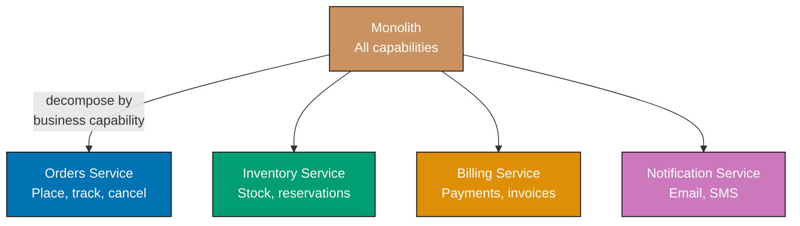

**Python — domain boundaries modelled as service interfaces:**

```python
from dataclasses import dataclass
from typing import Protocol, Optional
import uuid

# => Domain value objects — immutable identifiers used across service calls
@dataclass(frozen=True)
class OrderId:
    value: str = ""

    @staticmethod
    def new() -> "OrderId":
        return OrderId(value=str(uuid.uuid4()))  # => Generates UUID-backed stable id
        # => Immutable after creation — cannot be changed by accident

@dataclass(frozen=True)
class ProductId:
    value: str = ""  # => Ties inventory SKU to an order line

# => Protocol defines the Orders service contract — implementable by real service or stub
class OrdersService(Protocol):
    def place_order(self, product_id: ProductId, qty: int) -> OrderId: ...
    # => Returns OrderId so callers need not know internal order structure
    def cancel_order(self, order_id: OrderId) -> bool: ...

# => Inventory service protocol — independent of Orders
class InventoryService(Protocol):
    def reserve(self, product_id: ProductId, qty: int) -> bool: ...
    # => Returns True when stock was successfully reserved
    # => Returns False (not exception) for insufficient stock — expected business outcome
    def release(self, product_id: ProductId, qty: int) -> None: ...

# => Concrete in-process implementation used in tests and local development
class InMemoryOrdersService:
    def __init__(self) -> None:
        self._orders: dict[str, dict] = {}  # => order_id -> order dict

    def place_order(self, product_id: ProductId, qty: int) -> OrderId:
        oid = OrderId.new()  # => Generates fresh id per call
        self._orders[oid.value] = {"product_id": product_id.value, "qty": qty, "status": "PLACED"}
        # => Stores minimal order state; real impl persists to DB
        return oid  # => Returns id so caller can reference the order later

    def cancel_order(self, order_id: OrderId) -> bool:
        order = self._orders.get(order_id.value)
        if order is None:
            return False  # => Order not found — idempotent cancel is fine
        order["status"] = "CANCELLED"  # => Mutates in-place; real impl issues UPDATE
        return True

# => Usage: each service is swapped independently without touching the other
svc = InMemoryOrdersService()
pid = ProductId(value="SKU-001")
oid = svc.place_order(pid, qty=3)  # => Returns OrderId("some-uuid")
print(oid.value)                    # => Output: <uuid string>
print(svc.cancel_order(oid))        # => Output: True
```

**Key Takeaway:** Decompose by business capability using Protocol types (or interfaces) to enforce
service boundaries in code, making each capability independently replaceable.

**Why It Matters:** Business-capability decomposition aligns service ownership with Conway's Law —
the team owning "Orders" controls its full stack without coordinating schema changes with the
"Inventory" team. Netflix, Amazon, and Uber organise services this way because autonomous teams
ship faster. Misaligned decomposition (e.g., by technical tier) creates distributed monoliths where
every feature requires cross-team merges, eliminating the delivery speed advantage of microservices.

---

### Example 59: Strangler Fig Pattern

The Strangler Fig pattern migrates a monolith incrementally by routing traffic through a proxy that
gradually redirects requests to new microservices as they are built, leaving untouched paths on the
legacy system. The monolith is "strangled" until all routes are migrated and it can be retired.

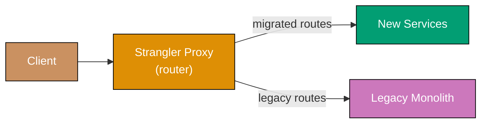

**Python — routing proxy with feature-flag-controlled migration:**

```python
from typing import Callable, Any

# => Route registry maps URL prefixes to handler callables
RouteHandler = Callable[[str, dict], dict]

class StranglerProxy:
    def __init__(self) -> None:
        # => new_routes: paths already migrated to new services
        self._new_routes: dict[str, RouteHandler] = {}
        # => legacy_handler: single catch-all for unmigrated paths
        self._legacy_handler: Optional[RouteHandler] = None

    def register_new(self, prefix: str, handler: RouteHandler) -> None:
        self._new_routes[prefix] = handler
        # => Called once per migrated service; order of registration does not matter

    def set_legacy(self, handler: RouteHandler) -> None:
        self._legacy_handler = handler  # => Legacy system becomes the fallback

    def route(self, path: str, payload: dict) -> dict:
        for prefix, handler in self._new_routes.items():
            if path.startswith(prefix):
                return handler(path, payload)  # => New service handles this path
                # => Return immediately — no fallthrough to legacy
        # => No migrated handler found; delegate to legacy monolith
        if self._legacy_handler:
            return self._legacy_handler(path, payload)  # => Legacy still serves uncharted paths
        raise ValueError(f"No handler for path: {path}")  # => Should not happen in production

# => Simulated new Orders service (already migrated)
def new_orders_handler(path: str, payload: dict) -> dict:
    return {"source": "new_service", "path": path, "data": payload}
    # => New service responds; monolith not involved

# => Simulated legacy monolith (catch-all)
def legacy_handler(path: str, payload: dict) -> dict:
    return {"source": "legacy_monolith", "path": path, "data": payload}

proxy = StranglerProxy()
proxy.set_legacy(legacy_handler)
proxy.register_new("/api/orders", new_orders_handler)  # => Orders migrated

print(proxy.route("/api/orders/123", {"action": "get"}))
# => Output: {'source': 'new_service', 'path': '/api/orders/123', 'data': {'action': 'get'}}
print(proxy.route("/api/products/abc", {"action": "list"}))
# => Output: {'source': 'legacy_monolith', 'path': '/api/products/abc', 'data': {'action': 'list'}}
```

**Key Takeaway:** The Strangler Fig pattern allows zero-downtime incremental migration by routing
at the proxy level; each migrated route is an isolated, low-risk step.

**Why It Matters:** Big-bang rewrites fail at a high rate because they require running two systems
simultaneously, training all users at once, and accepting rollback as all-or-nothing. The Strangler
Fig pattern, used by Amazon's migration from monolith to services and documented by Martin Fowler,
allows teams to migrate one route at a time, roll back individual services, and retire the legacy
system only after every path is covered — dramatically reducing migration risk.

---

## Distributed Coordination

### Example 60: Saga Orchestration

Saga orchestration uses a central orchestrator that issues commands to participants and reacts to
their replies, making the saga's flow explicit and observable. When any step fails, the orchestrator
drives compensating transactions in reverse order to restore consistency across services.

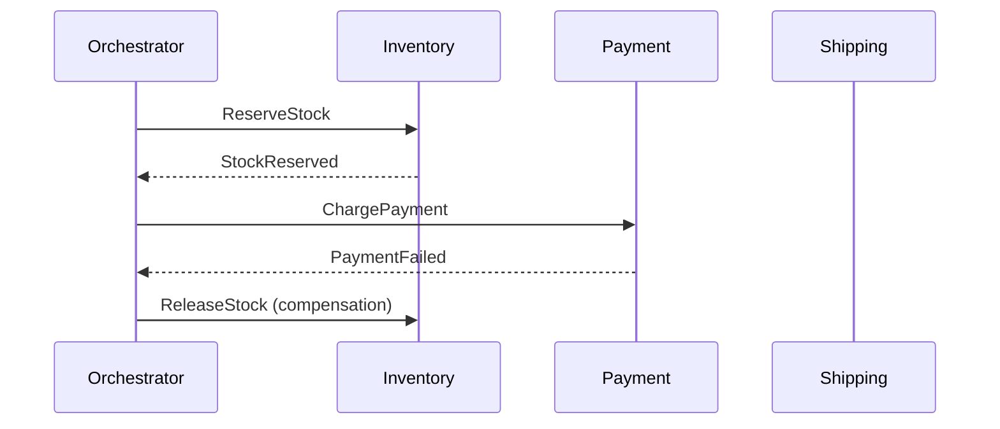

**Python — explicit orchestrator with compensation logic:**

```python
from dataclasses import dataclass, field
from typing import List, Tuple

# => Step encapsulates a forward action and its compensating action
@dataclass
class SagaStep:
    name: str
    execute: Callable[[], bool]    # => Returns True on success, False on failure
    compensate: Callable[[], None]  # => Undoes the execute action

class SagaOrchestrator:
    def __init__(self, steps: List[SagaStep]) -> None:
        self._steps = steps  # => Steps executed in list order

    def run(self) -> bool:
        completed: List[SagaStep] = []  # => Tracks successful steps for compensation
        for step in self._steps:
            success = step.execute()  # => Drive the participant
            if success:
                completed.append(step)  # => Remember for rollback if later step fails
            else:
                # => Step failed — compensate in reverse order (LIFO)
                for done_step in reversed(completed):
                    done_step.compensate()  # => Each compensation is idempotent by design
                return False  # => Saga failed; system is back to consistent state
        return True  # => All steps succeeded; saga complete

# => Simulated participants with in-memory state
_stock_reserved = False
_payment_charged = False

def reserve_stock() -> bool:
    global _stock_reserved
    _stock_reserved = True  # => Reserve 1 unit of SKU-001
    print("Stock reserved")  # => Output: Stock reserved
    return True

def release_stock() -> None:
    global _stock_reserved
    _stock_reserved = False  # => Compensation: return reserved unit to inventory
    print("Stock released (compensation)")  # => Output: Stock released (compensation)

def charge_payment() -> bool:
    print("Payment failed")   # => Output: Payment failed
    return False               # => Simulate payment processor rejection

def refund_payment() -> None:
    print("Payment refunded (compensation)")  # => Would issue refund if charge had succeeded

steps = [
    SagaStep("reserve", reserve_stock, release_stock),
    SagaStep("payment", charge_payment, refund_payment),
]
result = SagaOrchestrator(steps).run()
print(f"Saga succeeded: {result}")  # => Output: Saga succeeded: False
print(f"Stock released: {not _stock_reserved}")  # => Output: Stock released: True
```

**Key Takeaway:** Orchestration keeps saga logic in one place; the orchestrator compensates
completed steps when any forward step fails, maintaining distributed consistency.

**Why It Matters:** Distributed transactions using 2PC are impractical in microservices because they
require all participants to lock resources simultaneously, reducing availability. Sagas replace locks
with compensating transactions, enabling each service to commit locally. Orchestration (vs.
choreography) is preferred when saga complexity grows beyond 3-4 steps, because the flow is
visible in a single class rather than scattered across event handlers — critical for debugging
production incidents where understanding what happened in what order is essential.

---

### Example 61: Saga Choreography

Saga choreography removes the central orchestrator; instead, each service reacts to domain events
and emits new events to trigger the next step. Services are decoupled because no service calls
another directly, but the saga's flow is implicit across multiple event handlers.

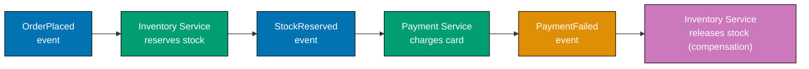

**Python — event bus with participant listeners:**

```python
from collections import defaultdict
from typing import Dict, List

# => Minimal in-process event bus — models a message broker (Kafka, RabbitMQ)
class EventBus:
    def __init__(self) -> None:
        self._handlers: Dict[str, List[Callable]] = defaultdict(list)
        # => Maps event_type -> list of subscriber callables

    def subscribe(self, event_type: str, handler: Callable) -> None:
        self._handlers[event_type].append(handler)  # => Register listener

    def publish(self, event_type: str, payload: dict) -> None:
        for h in self._handlers[event_type]:
            h(payload)  # => Synchronous here; real bus is async (Kafka consumer group)

bus = EventBus()
_stock_held = False  # => Shared mutable state simulating DB

# => Inventory service listens for OrderPlaced and PaymentFailed
def on_order_placed(event: dict) -> None:
    global _stock_held
    _stock_held = True  # => Reserve stock optimistically
    print(f"Inventory: reserved stock for order {event['order_id']}")
    bus.publish("StockReserved", {"order_id": event["order_id"]})
    # => Emits next event; Payment service will react without Inventory knowing

def on_payment_failed(event: dict) -> None:
    global _stock_held
    _stock_held = False  # => Compensation: release stock
    print(f"Inventory: released stock for order {event['order_id']} (compensation)")

# => Payment service listens for StockReserved
def on_stock_reserved(event: dict) -> None:
    print(f"Payment: charging for order {event['order_id']}")
    # => Simulate payment failure
    bus.publish("PaymentFailed", {"order_id": event["order_id"]})
    # => Payment service does NOT call Inventory — it emits an event instead

bus.subscribe("OrderPlaced", on_order_placed)
bus.subscribe("StockReserved", on_stock_reserved)
bus.subscribe("PaymentFailed", on_payment_failed)

bus.publish("OrderPlaced", {"order_id": "ORD-42"})
# => Output: Inventory: reserved stock for order ORD-42
# => Output: Payment: charging for order ORD-42
# => Output: Inventory: released stock for order ORD-42 (compensation)
print(f"Stock held after failure: {_stock_held}")  # => Output: Stock held after failure: False
```

**Key Takeaway:** Choreography achieves loose coupling through events, but requires careful event
schema design because the saga flow is distributed across multiple handlers.

**Why It Matters:** Choreography eliminates the orchestrator as a single point of failure and a
coordination bottleneck, making each service independently deployable without versioning the
orchestrator. However, tracing a saga through event logs is harder than reading a single orchestrator
class. Teams at Uber and Shopify choose choreography for high-throughput flows (millions of events
per second) and orchestration when business rules require centralized audit trails or frequent
changes to saga logic.

---

## API Design

### Example 62: API Versioning Strategies

API versioning prevents breaking changes from disrupting existing consumers when a service evolves
its contract. The three dominant strategies — URI path versioning, Accept header versioning, and
query-parameter versioning — make different trade-offs between cacheability, client simplicity, and
routing ease.

**URI path versioning (most common, most cacheable):**

```python
from http.server import BaseHTTPRequestHandler
import json

# => Route map keyed by (method, path) — path includes version prefix
ROUTES = {
    ("GET", "/v1/users"): lambda: {"version": 1, "users": ["alice"]},
    # => v1 contract: flat list of usernames
    ("GET", "/v2/users"): lambda: {"version": 2, "users": [{"name": "alice", "email": "alice@example.com"}]},
    # => v2 contract: richer objects with email field added
}

def dispatch(method: str, path: str) -> dict:
    handler = ROUTES.get((method, path))
    if handler is None:
        return {"error": "Not found"}  # => 404 equivalent
    return handler()  # => Execute matched route

print(dispatch("GET", "/v1/users"))
# => Output: {'version': 1, 'users': ['alice']}
print(dispatch("GET", "/v2/users"))
# => Output: {'version': 2, 'users': [{'name': 'alice', 'email': 'alice@example.com'}]}
```

URI versioning: CDN caches `/v1/users` and `/v2/users` independently; path is visible in logs and
browser history; old clients never break when a new version is added.

**Accept header versioning (REST-purist, less cacheable):**

```python
# => Version is negotiated through the Accept header, keeping URLs clean
def dispatch_header(method: str, path: str, accept: str) -> dict:
    # => Parse version from Accept: application/vnd.myapi.v2+json
    version = "v1"  # => Default version if header absent or unversioned
    if "v2" in accept:
        version = "v2"  # => Client explicitly requested v2

    if path == "/users":
        if version == "v2":
            return {"version": 2, "users": [{"name": "alice", "email": "alice@example.com"}]}
        return {"version": 1, "users": ["alice"]}
        # => Same URL, different response shape based on negotiated version
    return {"error": "Not found"}

print(dispatch_header("GET", "/users", "application/json"))
# => Output: {'version': 1, 'users': ['alice']}
print(dispatch_header("GET", "/users", "application/vnd.myapi.v2+json"))
# => Output: {'version': 2, 'users': [{'name': 'alice', 'email': 'alice@example.com'}]}
```

Header versioning: same URL makes REST purists happy; however, CDNs cannot cache different versions
of `/users` by default — requires `Vary: Accept` header which many CDNs handle poorly.

**Key Takeaway:** Use URI path versioning for public APIs where CDN cacheability and operational
simplicity outweigh URL aesthetics; use header versioning for internal APIs with strict semantic
versioning requirements.

**Why It Matters:** Breaking API changes without a versioning strategy are among the leading causes
of production incidents when microservices are upgraded. Stripe, GitHub, and Twilio all use URI path
versioning because it is explicit in logs, debuggable in browsers, and cache-friendly — benefits that
outweigh the "impurity" of embedding version in the URL. Choosing the wrong strategy early forces a
painful migration later when consumer count is large.

---

### Example 63: Backend for Frontend (BFF) Pattern

The Backend for Frontend pattern creates a dedicated aggregation layer for each client type —
mobile, web, and third-party — each shaped to that client's data requirements. BFFs eliminate
over-fetching, reduce round trips, and prevent a single general-purpose API from being designed
around the least-common denominator of all clients.

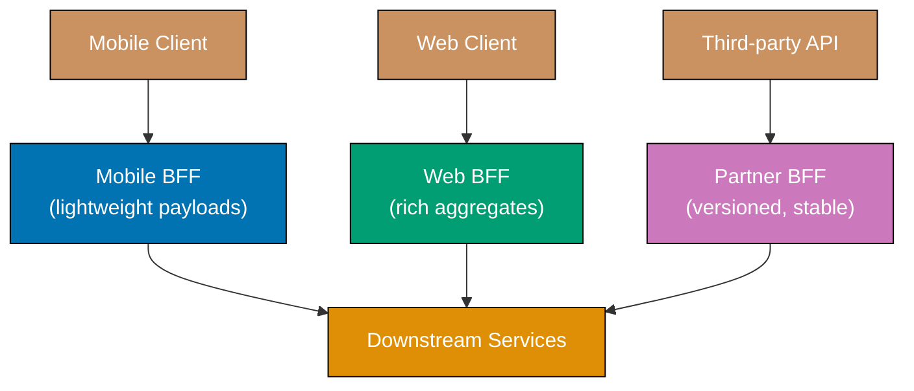

**Python — separate BFF handlers aggregating downstream data:**

```python
from dataclasses import dataclass
from typing import Optional

# => Downstream service responses (shared by all BFFs)
def get_user_profile(user_id: str) -> dict:
    return {"id": user_id, "name": "Alice", "email": "alice@example.com", "preferences": {"theme": "dark"}}
    # => Full profile — downstream owns all fields

def get_user_orders(user_id: str) -> list:
    return [{"id": "ORD-1", "total": 99.99, "status": "shipped"}, {"id": "ORD-2", "total": 14.50, "status": "pending"}]
    # => Full order list — may be large

# => Mobile BFF: strips unnecessary fields to reduce bandwidth for cellular connections
def mobile_bff_get_dashboard(user_id: str) -> dict:
    profile = get_user_profile(user_id)
    orders = get_user_orders(user_id)
    return {
        "name": profile["name"],           # => Only name; no email or preferences
        "pending_orders": sum(1 for o in orders if o["status"] == "pending"),
        # => Aggregates count server-side — mobile displays one number, not a list
    }

# => Web BFF: returns richer aggregate with full order list and preferences
def web_bff_get_dashboard(user_id: str) -> dict:
    profile = get_user_profile(user_id)
    orders = get_user_orders(user_id)
    return {
        "profile": profile,           # => Full profile including email and preferences
        "orders": orders,             # => Full order objects — web renders a table
        "order_count": len(orders),   # => Pre-computed convenience field
    }

print(mobile_bff_get_dashboard("u1"))
# => Output: {'name': 'Alice', 'pending_orders': 1}
print(web_bff_get_dashboard("u1"))
# => Output: {'profile': {...}, 'orders': [...], 'order_count': 2}
```

**Key Takeaway:** Each BFF owns its own aggregation logic so client teams can evolve their API
without negotiating with teams serving other clients.

**Why It Matters:** A single general-purpose API must satisfy every client's needs simultaneously,
leading to bloated responses, API design by committee, and tight release coupling between mobile
and web teams. Netflix popularised BFFs for this reason: their mobile team needed lightweight
playback payloads while the web team needed rich metadata pages. BFFs give each client team
autonomy while downstream services remain focused on their domain.

---

## Resilience Patterns

### Example 64: Circuit Breaker with Fallback

A circuit breaker monitors failure rates on calls to an external dependency and trips open when
failures exceed a threshold, stopping further calls and returning a fallback immediately. After a
timeout, it enters a half-open state to probe whether the dependency has recovered.

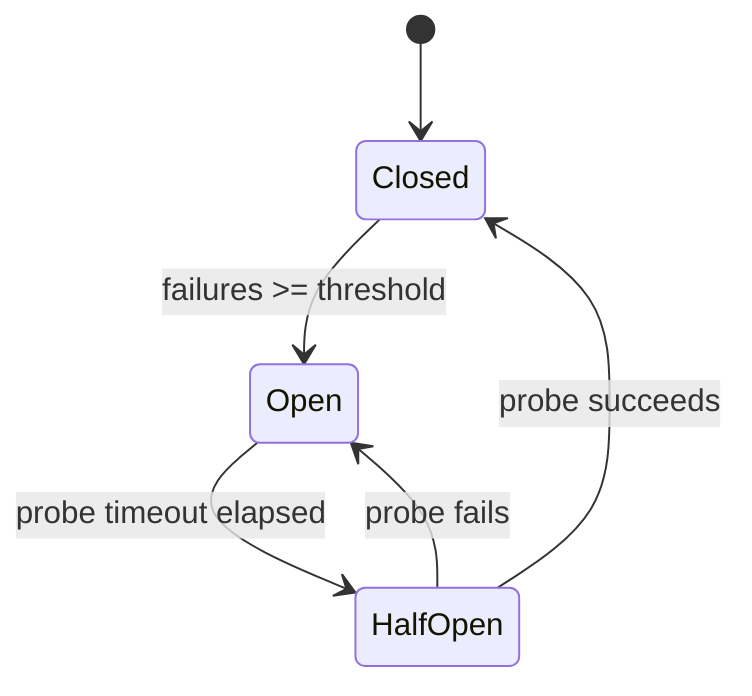

**Python — circuit breaker with state machine and fallback:**

```python
import time
from enum import Enum, auto

class CBState(Enum):
    CLOSED = auto()    # => Normal operation — calls pass through
    OPEN = auto()      # => Tripped — calls rejected immediately without hitting dependency
    HALF_OPEN = auto() # => Probing — one trial call allowed through

class CircuitBreaker:
    def __init__(self, failure_threshold: int = 3, probe_timeout: float = 2.0) -> None:
        self._threshold = failure_threshold   # => Trip after this many consecutive failures
        self._probe_timeout = probe_timeout   # => Seconds before attempting probe
        self._state = CBState.CLOSED          # => Starts closed (allowing calls)
        self._failures = 0                    # => Consecutive failure counter
        self._opened_at: Optional[float] = None  # => Timestamp when tripped open

    def call(self, func: Callable[[], str], fallback: Callable[[], str]) -> str:
        if self._state == CBState.OPEN:
            elapsed = time.monotonic() - (self._opened_at or 0)
            if elapsed >= self._probe_timeout:
                self._state = CBState.HALF_OPEN  # => Allow one probe attempt
                print("Circuit: half-open (probing)")
            else:
                return fallback()  # => Still open — return cached/degraded response
                # => Fast-fail: no timeout penalty; dependency gets breathing room

        try:
            result = func()           # => Attempt the real call
            self._on_success()        # => Reset failure count on success
            return result
        except Exception:
            self._on_failure()        # => Increment failure count; may trip breaker
            return fallback()         # => Return degraded response instead of propagating error

    def _on_success(self) -> None:
        self._failures = 0            # => Reset streak on success
        self._state = CBState.CLOSED  # => Close breaker (works for HALF_OPEN probe too)

    def _on_failure(self) -> None:
        self._failures += 1           # => Increment consecutive failure count
        if self._failures >= self._threshold:
            self._state = CBState.OPEN     # => Trip breaker open
            self._opened_at = time.monotonic()  # => Record when breaker opened for timeout
            print(f"Circuit: tripped OPEN after {self._failures} failures")

# => Simulate a flaky downstream service
_call_count = 0

def flaky_service() -> str:
    global _call_count
    _call_count += 1
    if _call_count <= 3:
        raise ConnectionError("service down")  # => First 3 calls fail
    return "fresh data"  # => Recovers on 4th call

def fallback() -> str:
    return "cached data"  # => Stale but acceptable degraded response

cb = CircuitBreaker(failure_threshold=3, probe_timeout=0.0)
for i in range(6):
    result = cb.call(flaky_service, fallback)
    print(f"Call {i+1}: {result}")
# => Output: Call 1: cached data  (failure 1)
# => Output: Call 2: cached data  (failure 2)
# => Output: Circuit: tripped OPEN after 3 failures
# => Output: Call 3: cached data  (failure 3, tripped)
# => Output: Circuit: half-open (probing)
# => Output: Call 4: fresh data   (probe succeeds, breaker closes)
# => Output: Call 5: fresh data
# => Output: Call 6: fresh data
```

**Key Takeaway:** Circuit breakers prevent cascading failures by fast-failing requests when a
dependency is unhealthy, giving it time to recover while callers receive fallback responses.

**Why It Matters:** Without circuit breakers, a slow or failing downstream service causes thread
pools to fill with waiting requests, blocking the entire caller — the cascade failure pattern that
brought down Twitter's original monolith in the "fail whale" era. Netflix's Hystrix library
popularised circuit breakers, and their Chaos Engineering team demonstrated that properly
configured breakers allow the platform to shed load during incidents without full outages. Today
Resilience4j (Java) and `circuitbreaker` packages in Python/Go embed this pattern as production
standard.

---

### Example 65: Bulkhead Pattern

The bulkhead pattern isolates failures within one pool of resources so they do not exhaust shared
resources needed by other operations. By separating thread pools (or semaphores) for different
dependency calls, a slow third-party service starves only its own pool, not the entire application.

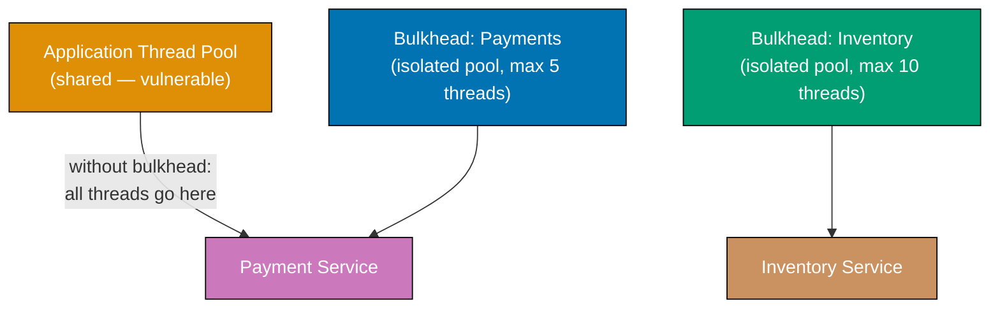

**Python — semaphore-based bulkheads per dependency:**

```python
import threading
from contextlib import contextmanager

class Bulkhead:
    def __init__(self, name: str, max_concurrent: int) -> None:
        self._name = name
        self._semaphore = threading.Semaphore(max_concurrent)
        # => Semaphore limits simultaneous calls to max_concurrent
        self._rejected = 0  # => Count of calls rejected due to full pool

    @contextmanager
    def acquire(self):
        acquired = self._semaphore.acquire(blocking=False)
        # => Non-blocking: returns False immediately if pool full (no waiting)
        if not acquired:
            self._rejected += 1
            raise RuntimeError(f"Bulkhead '{self._name}' full — call rejected")
            # => Fail fast: caller gets immediate error; dependency not contacted
        try:
            yield  # => Caller executes inside this context; slot is held
        finally:
            self._semaphore.release()  # => Always return slot to pool

    @property
    def rejected_count(self) -> int:
        return self._rejected  # => Expose for metrics dashboard

# => Two separate bulkheads — slow Payments cannot affect Inventory
payments_bulkhead = Bulkhead("payments", max_concurrent=2)
inventory_bulkhead = Bulkhead("inventory", max_concurrent=5)

def call_payment_service(order_id: str) -> str:
    with payments_bulkhead.acquire():
        # => Simulated slow payment call (would be actual I/O in production)
        return f"payment_ok:{order_id}"  # => Returns result under bulkhead protection

def call_inventory_service(sku: str) -> str:
    with inventory_bulkhead.acquire():
        return f"stock_ok:{sku}"  # => Inventory pool is independent of payments pool

# => Demonstrate isolation: fill payments bulkhead, inventory still works
slots = []
try:
    slots.append(payments_bulkhead._semaphore.acquire(blocking=False))  # => Occupy slot 1
    slots.append(payments_bulkhead._semaphore.acquire(blocking=False))  # => Occupy slot 2
    call_payment_service("ORD-1")  # => Should raise: pool full
except RuntimeError as e:
    print(e)  # => Output: Bulkhead 'payments' full — call rejected

print(call_inventory_service("SKU-1"))  # => Output: stock_ok:SKU-1 (unaffected)

for s in slots:
    if s:
        payments_bulkhead._semaphore.release()  # => Clean up test slots
```

**Key Takeaway:** Assign separate resource pools (semaphores or thread pools) to each downstream
dependency so one slow service can only exhaust its own pool, not the shared application pool.

**Why It Matters:** The bulkhead pattern is named after ship compartments that prevent flooding
from spreading. In services, a payment processor slowdown that fills a shared thread pool starves
inventory checks and health endpoints — a total service outage caused by a partial dependency
failure. Netflix's Hystrix and Resilience4j's `Bulkhead` module enforce this isolation in
production, allowing services to degrade gracefully (payments fail, site keeps working) rather than
failing completely.

---

### Example 66: Retry with Exponential Backoff and Jitter

Retrying transient failures is essential in distributed systems, but naive fixed-interval retries
cause thundering herds when many clients retry simultaneously. Exponential backoff with jitter
spreads retries over time, reducing collision probability and letting overloaded services recover.

```python
import random
import time

def exponential_backoff(attempt: int, base: float = 0.1, cap: float = 30.0) -> float:
    # => Exponential growth: base * 2^attempt gives 0.1, 0.2, 0.4, 0.8, 1.6 ...
    delay = min(base * (2 ** attempt), cap)
    # => Cap prevents indefinitely long waits (e.g., never more than 30s)
    jitter = delay * random.uniform(0, 0.5)
    # => Add up to 50% random jitter so concurrent clients do not all retry at T+0.4s
    return delay + jitter  # => Final delay varies per client even for same attempt number

def retry(func: Callable[[], str], max_attempts: int = 5) -> Optional[str]:
    last_error: Optional[Exception] = None
    for attempt in range(max_attempts):
        try:
            return func()  # => Attempt the operation
        except Exception as e:
            last_error = e
            if attempt == max_attempts - 1:
                break  # => Last attempt; do not sleep before giving up
            delay = exponential_backoff(attempt)
            print(f"Attempt {attempt + 1} failed: {e}. Retrying in {delay:.2f}s")
            time.sleep(delay)  # => Wait before next attempt; duration increases each time
    raise RuntimeError(f"All {max_attempts} attempts failed: {last_error}") from last_error

# => Simulate service that fails twice then succeeds
_attempt_count = 0

def unstable_call() -> str:
    global _attempt_count
    _attempt_count += 1
    if _attempt_count < 3:
        raise ConnectionError(f"timeout on attempt {_attempt_count}")
        # => First two calls fail with transient error
    return "success"  # => Third call succeeds

# => Demonstrate: retry recovers from transient failures automatically
result = retry(unstable_call, max_attempts=5)
print(f"Result: {result}")  # => Output: Result: success  (after 2 retried failures)
```

**Key Takeaway:** Use exponential backoff to avoid retry storms, and add jitter to spread load
across time when many clients retry the same failing service concurrently.

**Why It Matters:** AWS documented that naive fixed-interval retries caused cascading failures
during EC2 availability events when thousands of services retried simultaneously, amplifying load
on already-stressed infrastructure. Exponential backoff with jitter — the "Full Jitter" algorithm
published by the AWS Architecture Blog — reduces collision probability by up to 94% compared to
fixed intervals, enabling overloaded services to shed excess load and recover within seconds instead
of minutes.

---

## Observability Patterns

### Example 67: Distributed Tracing Architecture

Distributed tracing tracks a request as it propagates through multiple services by injecting a
trace ID into every outbound call. Each service creates a child span attached to the parent trace,
enabling engineers to reconstruct the full request timeline across service boundaries.

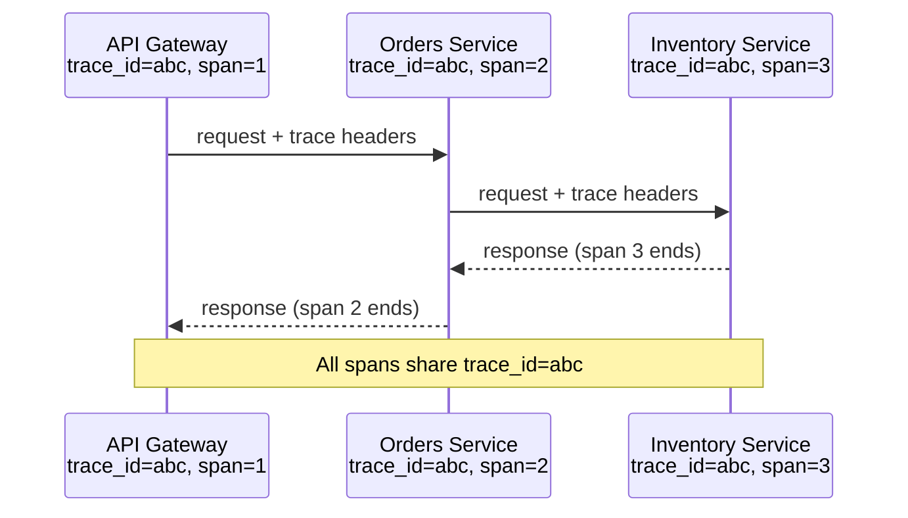

**Python — trace context propagation across service calls:**

```python
import uuid
import time
from dataclasses import dataclass, field
from typing import List, Optional

@dataclass
class Span:
    trace_id: str           # => Same for all spans in a single request
    span_id: str            # => Unique per operation
    parent_span_id: Optional[str]  # => Links child to parent in trace tree
    operation: str
    start_time: float = field(default_factory=time.monotonic)
    end_time: Optional[float] = None

    def finish(self) -> None:
        self.end_time = time.monotonic()  # => Records operation duration
        duration_ms = (self.end_time - self.start_time) * 1000
        print(f"[TRACE] trace={self.trace_id} span={self.span_id} parent={self.parent_span_id} "
              f"op={self.operation} duration={duration_ms:.1f}ms")
        # => In production this is sent to Jaeger, Zipkin, or Datadog — not stdout

class Tracer:
    def __init__(self, service_name: str) -> None:
        self._service = service_name

    def start_span(self, operation: str, trace_id: Optional[str] = None,
                   parent_span_id: Optional[str] = None) -> Span:
        return Span(
            trace_id=trace_id or str(uuid.uuid4()),  # => Generate root trace_id if absent
            span_id=str(uuid.uuid4())[:8],            # => New span id per operation
            parent_span_id=parent_span_id,
            operation=f"{self._service}:{operation}",
        )

# => Simulate three services each creating their own spans under the same trace
gateway_tracer = Tracer("api-gateway")
orders_tracer = Tracer("orders-svc")
inventory_tracer = Tracer("inventory-svc")

# => Root span started by API Gateway
root_span = gateway_tracer.start_span("handle_request")
trace_id = root_span.trace_id  # => Propagate this trace_id downstream

# => Orders service creates child span with gateway's trace_id
orders_span = orders_tracer.start_span("place_order", trace_id=trace_id, parent_span_id=root_span.span_id)

# => Inventory service creates grandchild span
inv_span = inventory_tracer.start_span("reserve_stock", trace_id=trace_id, parent_span_id=orders_span.span_id)
inv_span.finish()      # => Inventory finishes first (innermost call)

orders_span.finish()   # => Orders finishes after Inventory returns
root_span.finish()     # => Gateway finishes last
# => All three spans share the same trace_id — reconstruction tool links them into a tree
```

**Key Takeaway:** Propagate `trace_id` in every outbound request header (W3C `traceparent`) so
that all spans generated by a single user request share the same root identifier.

**Why It Matters:** Without distributed tracing, debugging latency in a chain of ten microservices
requires correlating timestamps across ten separate log files — a manual task that takes hours.
Tracing tools like Jaeger, Zipkin, and Datadog APM reduce this to a single flame graph, enabling
engineers to identify which service or database query caused a P99 latency spike in minutes.
Uber reduced mean-time-to-diagnosis for distributed incidents by 60% after adopting Jaeger, which
became a CNCF graduated project based on wide industry adoption.

---

## Deployment Patterns

### Example 68: Sidecar Pattern

The sidecar pattern deploys a secondary container alongside the primary application container in
the same pod or VM, sharing the same network namespace. The sidecar handles cross-cutting concerns
— TLS termination, logging, metrics scraping, service discovery — so the application code remains
free of infrastructure concerns.

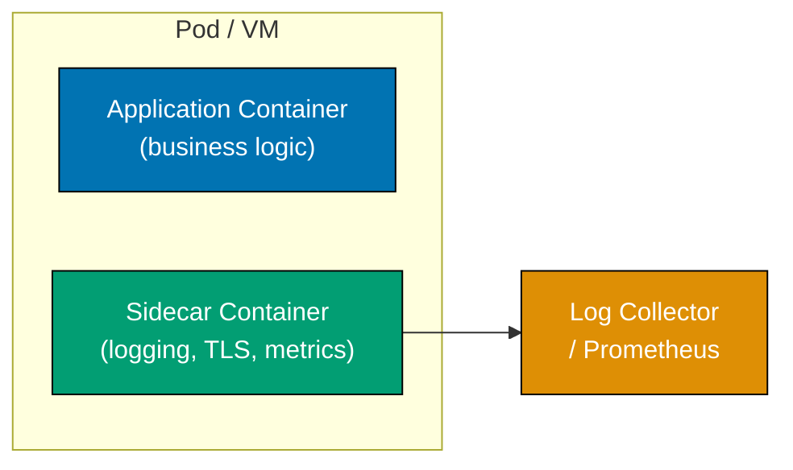

**Python — sidecar modelled as a request-intercepting proxy:**

```python
from typing import Callable
import time

# => SidecarProxy wraps the application handler, adding cross-cutting concerns
class SidecarProxy:
    def __init__(self, app_handler: Callable[[dict], dict]) -> None:
        self._app = app_handler  # => The real application logic — knows nothing about TLS/metrics

    def handle(self, request: dict) -> dict:
        start = time.monotonic()

        # => Sidecar concern 1: enforce mutual TLS certificate validation
        if not request.get("mtls_verified"):
            return {"error": "TLS handshake failed", "status": 401}
            # => App never sees unauthenticated request — sidecar blocks it first

        # => Sidecar concern 2: inject request metadata (trace id, request id)
        request["request_id"] = "req-" + str(int(start * 1000) % 10000)
        # => App can use request_id in logs without implementing header parsing itself

        response = self._app(request)  # => Delegate to application logic

        # => Sidecar concern 3: emit metrics (latency, status code) to Prometheus
        duration_ms = (time.monotonic() - start) * 1000
        print(f"[SIDECAR] method={request.get('method')} path={request.get('path')} "
              f"status={response.get('status', 200)} duration={duration_ms:.1f}ms")
        # => Application code never calls a metrics client; sidecar owns all instrumentation

        return response

# => Application handler: pure business logic, no infrastructure code
def order_app(request: dict) -> dict:
    return {"status": 200, "data": f"Order {request.get('order_id', 'unknown')} retrieved"}
    # => No TLS code, no metrics calls, no log formatting — sidecar owns all of that

proxy = SidecarProxy(order_app)

# => Blocked request (no TLS)
print(proxy.handle({"method": "GET", "path": "/orders/1", "order_id": "1", "mtls_verified": False}))
# => Output: {'error': 'TLS handshake failed', 'status': 401}

# => Allowed request (TLS verified)
print(proxy.handle({"method": "GET", "path": "/orders/1", "order_id": "1", "mtls_verified": True}))
# => Output: [SIDECAR] method=GET path=/orders/1 status=200 duration=...ms
# => Output: {'status': 200, 'data': 'Order 1 retrieved'}
```

**Key Takeaway:** Sidecars let application developers focus on business logic while a separate
deployable unit evolves independently to handle observability, security, and traffic management.

**Why It Matters:** Kubernetes service mesh implementations (Istio, Linkerd) use the sidecar
pattern to inject Envoy proxies alongside every pod transparently — the application team deploys
business code unchanged, while the platform team rotates TLS certificates, controls traffic splits,
and collects distributed traces through the sidecar. This separation allows infrastructure upgrades
without coordinating with hundreds of application teams, enabling companies like Google to roll
out mTLS cluster-wide without modifying a single application.

---

### Example 69: Ambassador Pattern

The ambassador pattern places a proxy between an application and a remote service to handle
concerns specific to that client's relationship with the service: protocol translation, retry
policy, credential injection, and connection pooling. Unlike the sidecar (which handles all
outbound traffic), an ambassador is purpose-built for one specific remote.

```python
import functools
import time
from typing import Optional

# => Ambassador encapsulates all complexity of calling the Database service
class DatabaseAmbassador:
    def __init__(self, dsn: str, max_retries: int = 3, timeout: float = 5.0) -> None:
        self._dsn = dsn            # => Real ambassador would hold connection pool here
        self._max_retries = max_retries
        self._timeout = timeout
        self._call_count = 0       # => Metrics; ambassador reports to monitoring system

    def query(self, sql: str, params: tuple = ()) -> list:
        # => Ambassador retries transient DB errors transparently — app never sees them
        for attempt in range(self._max_retries):
            try:
                return self._execute(sql, params)  # => Real call through connection pool
            except ConnectionError as e:
                if attempt == self._max_retries - 1:
                    raise  # => Exhausted retries; propagate to application
                wait = 0.1 * (2 ** attempt)  # => Backoff between retries
                time.sleep(wait)
        return []  # => Unreachable; silences type checker

    def _execute(self, sql: str, params: tuple) -> list:
        self._call_count += 1
        # => In production: use psycopg2/asyncpg connection from pool, apply timeout
        if self._call_count == 1:
            raise ConnectionError("transient connection loss")
            # => Simulate flaky first call — ambassador's retry hides this from app
        return [{"id": 1, "name": "Alice"}, {"id": 2, "name": "Bob"}]
        # => Returns result as plain list — app sees clean interface

# => Application code calls ambassador; knows nothing about retries, pool, DSN
db = DatabaseAmbassador(dsn="postgresql://localhost/mydb")
rows = db.query("SELECT id, name FROM users WHERE active = %s", (True,))
print(rows)
# => Output: [{'id': 1, 'name': 'Alice'}, {'id': 2, 'name': 'Bob'}]
# => (First call failed internally; ambassador retried transparently)
print(f"Total calls made (including retries): {db._call_count}")
# => Output: Total calls made (including retries): 2
```

**Key Takeaway:** The ambassador externalises connection management, retry logic, and credential
handling from application code, keeping business logic free of infrastructure concerns.

**Why It Matters:** Without an ambassador, retry logic, connection pool configuration, and timeout
handling are duplicated across every service that calls the same downstream. When the retry policy
needs changing (e.g., after a database upgrade changes failure characteristics), a single ambassador
change affects all consumers. Envoy proxy — used as ambassador by Lyft, Google, and Netflix — shows
this pattern at scale: a single proxy configuration update changes connection pool behaviour for
hundreds of microservices without code deployment.

---

## Event-Driven Architecture

### Example 70: Event Sourcing Implementation

Event sourcing stores state as an append-only sequence of domain events rather than as current
mutable state. The current state is derived by replaying events. This enables complete audit trails,
temporal queries ("what was the account balance at 3 PM yesterday?"), and event-driven integration.

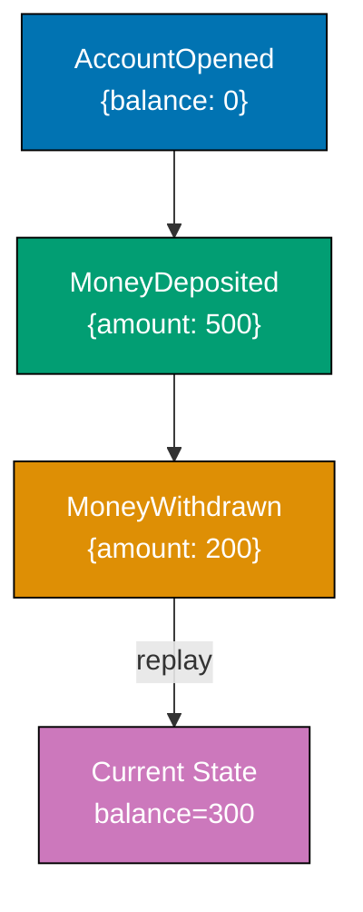

**Python — append-only event store with state projection:**

```python
from dataclasses import dataclass, field
from typing import List, Any
import json

@dataclass
class DomainEvent:
    event_type: str   # => e.g. "AccountOpened", "MoneyDeposited"
    payload: dict     # => Event data specific to event_type

class EventStore:
    def __init__(self) -> None:
        self._events: List[DomainEvent] = []
        # => Append-only; events are never modified or deleted after appending
        # => In production: stored as rows in a DB with sequence numbers, or in EventStoreDB

    def append(self, event: DomainEvent) -> None:
        self._events.append(event)  # => Append; never update existing events

    def get_events(self) -> List[DomainEvent]:
        return list(self._events)   # => Return copy; callers cannot mutate the store

class BankAccount:
    def __init__(self) -> None:
        self.balance: float = 0.0  # => Derived state; recomputed by replay, never stored directly
        self.account_id: str = ""

    @classmethod
    def replay(cls, events: List[DomainEvent]) -> "BankAccount":
        account = cls()
        for event in events:
            account._apply(event)  # => Apply each event in order to rebuild current state
        return account  # => Returns account in the state it was after all events

    def _apply(self, event: DomainEvent) -> None:
        if event.event_type == "AccountOpened":
            self.account_id = event.payload["account_id"]
            self.balance = 0.0         # => Initial balance always 0 at opening
        elif event.event_type == "MoneyDeposited":
            self.balance += event.payload["amount"]  # => Increase balance by deposit amount
        elif event.event_type == "MoneyWithdrawn":
            self.balance -= event.payload["amount"]  # => Decrease balance by withdrawal amount

# => Simulation: three events recorded over the account's lifetime
store = EventStore()
store.append(DomainEvent("AccountOpened", {"account_id": "ACC-001"}))
store.append(DomainEvent("MoneyDeposited", {"amount": 500.0}))
store.append(DomainEvent("MoneyWithdrawn", {"amount": 200.0}))

# => Replay all events to get current state
account = BankAccount.replay(store.get_events())
print(f"Account: {account.account_id}, Balance: {account.balance}")
# => Output: Account: ACC-001, Balance: 300.0

# => Temporal query: what was the balance after only the first two events?
account_at_t2 = BankAccount.replay(store.get_events()[:2])
print(f"Balance after deposit only: {account_at_t2.balance}")
# => Output: Balance after deposit only: 500.0
```

**Key Takeaway:** Store domain events as the source of truth; derive read-state by replaying events
so the full history is preserved for audit, debugging, and temporal queries.

**Why It Matters:** Traditional CRUD databases overwrite state on every update, losing historical
information. Financial services (banks, trading platforms), healthcare systems, and compliance-heavy
domains require complete audit trails mandated by regulations such as GDPR, SOX, and PCI DSS.
Event sourcing satisfies these requirements by design: every state transition is recorded with its
cause. CQRS (Command Query Responsibility Segregation) pairs naturally with event sourcing because
read models can be rebuilt from events when requirements change, without migrating data.

---

## Structural Patterns

### Example 71: Modular Monolith

A modular monolith deploys as a single process but enforces strict module boundaries in code,
preventing cross-module dependencies at the wrong level of abstraction. Each module owns its domain
model, service layer, and repository — but shares the process and database, making local calls
cheap and distributed tracing unnecessary.

```python
from typing import Protocol

# ============================================================
# Module: Orders — owns its own model and service interface
# ============================================================
# => Module boundary enforced by convention: Orders does not import from Billing internals
@dataclass
class Order:
    order_id: str
    customer_id: str
    total: float

class OrderRepository(Protocol):
    def save(self, order: Order) -> None: ...
    def find(self, order_id: str) -> Optional[Order]: ...

class OrderService:
    def __init__(self, repo: OrderRepository) -> None:
        self._repo = repo  # => Injected; module owns the interface, not the implementation

    def place(self, customer_id: str, total: float) -> Order:
        order = Order(order_id=str(uuid.uuid4())[:8], customer_id=customer_id, total=total)
        self._repo.save(order)  # => Persists via injected repo
        return order  # => Returns domain object; other modules receive this via service, not direct DB query

# ============================================================
# Module: Billing — separate domain, communicates via Order domain object only
# ============================================================
# => Billing imports Order (a shared kernel value object) but NOT OrderRepository
@dataclass
class Invoice:
    invoice_id: str
    order_id: str
    amount: float
    paid: bool = False

class BillingService:
    def __init__(self) -> None:
        self._invoices: dict[str, Invoice] = {}

    def issue_invoice(self, order: Order) -> Invoice:
        inv = Invoice(invoice_id=str(uuid.uuid4())[:8], order_id=order.order_id, amount=order.total)
        self._invoices[inv.invoice_id] = inv  # => Billing owns its own storage
        return inv  # => Returns Billing's own Invoice domain object, not Orders' model

# ============================================================
# Composition Root — wires modules together at startup
# ============================================================
class InMemoryOrderRepo:
    def __init__(self) -> None:
        self._store: dict[str, Order] = {}

    def save(self, order: Order) -> None:
        self._store[order.order_id] = order  # => In-memory store; prod uses SQLAlchemy

    def find(self, order_id: str) -> Optional[Order]:
        return self._store.get(order_id)  # => Returns None if not found

order_svc = OrderService(InMemoryOrderRepo())
billing_svc = BillingService()

order = order_svc.place("cust-1", total=149.99)  # => Creates and persists order
invoice = billing_svc.issue_invoice(order)         # => Billing receives Order domain object
print(f"Order: {order.order_id}, Invoice: {invoice.invoice_id}, Amount: {invoice.amount}")
# => Output: Order: <id>, Invoice: <id>, Amount: 149.99
```

**Key Takeaway:** Enforce module boundaries through Protocols and dependency injection rather than
package-access modifiers, making the modular monolith easier to later split into services if needed.

**Why It Matters:** Microservices introduce distributed systems complexity (network failures, data
consistency, distributed tracing) that many teams are not ready for. A modular monolith provides
the domain boundary discipline of microservices while retaining the operational simplicity of a
single deployable unit. Stack Overflow runs on a modular monolith and handles millions of daily
requests; Shopify migrated from a tangled monolith to a modular monolith before selectively
extracting services, avoiding the distributed systems complexity until it was genuinely needed.

---

### Example 72: Vertical Slice Architecture

Vertical slice architecture organises code by feature rather than by technical layer (Controller,
Service, Repository). Each slice contains all layers needed for that feature in one cohesive unit,
reducing cross-slice coupling and making it easy to find, understand, and change a complete feature.

```python
from dataclasses import dataclass
from typing import Optional

# ============================================================
# Slice: Place Order — all layers for this feature in one place
# ============================================================
# => Request object: input contract for this slice
@dataclass
class PlaceOrderRequest:
    customer_id: str
    product_id: str
    quantity: int

# => Response object: output contract for this slice
@dataclass
class PlaceOrderResponse:
    order_id: str
    status: str
    total: float

# => Handler: contains all logic for this slice (no shared service layer)
class PlaceOrderHandler:
    def __init__(self, price_per_unit: float = 10.0) -> None:
        self._price = price_per_unit   # => In prod: injected repository + price service
        self._orders: list = []

    def handle(self, request: PlaceOrderRequest) -> PlaceOrderResponse:
        total = self._price * request.quantity  # => Business rule: total = price * qty
        order_id = f"ORD-{len(self._orders) + 1:04d}"  # => Simple sequential id for demo
        self._orders.append({"id": order_id, "customer": request.customer_id, "total": total})
        # => Persists order (would use Unit of Work in production)
        return PlaceOrderResponse(order_id=order_id, status="placed", total=total)
        # => Returns slice-specific response; no generic response envelope needed

# ============================================================
# Slice: Get Order — separate slice, no shared repository dependency
# ============================================================
@dataclass
class GetOrderRequest:
    order_id: str

@dataclass
class GetOrderResponse:
    order_id: str
    total: Optional[float]
    found: bool

class GetOrderHandler:
    def __init__(self, placed_orders: list) -> None:
        self._orders = placed_orders  # => Shared reference to same in-memory list for demo
        # => In prod: separate read-side repository (CQRS read model)

    def handle(self, request: GetOrderRequest) -> GetOrderResponse:
        order = next((o for o in self._orders if o["id"] == request.order_id), None)
        # => Linear scan for demo; prod uses indexed DB query
        if order is None:
            return GetOrderResponse(order_id=request.order_id, total=None, found=False)
        return GetOrderResponse(order_id=order["id"], total=order["total"], found=True)

# => Usage: each slice is invoked independently
place_handler = PlaceOrderHandler(price_per_unit=12.50)
resp = place_handler.handle(PlaceOrderRequest(customer_id="C1", product_id="P1", quantity=4))
print(resp)  # => Output: PlaceOrderResponse(order_id='ORD-0001', status='placed', total=50.0)

get_handler = GetOrderHandler(place_handler._orders)
get_resp = get_handler.handle(GetOrderRequest(order_id="ORD-0001"))
print(get_resp)  # => Output: GetOrderResponse(order_id='ORD-0001', total=50.0, found=True)
```

**Key Takeaway:** One feature, one folder, all layers — a developer should be able to read a
single file to understand, change, and test a feature end to end.

**Why It Matters:** Traditional layered architecture (Controller/Service/Repository) scatters a
feature across three folders, requiring developers to navigate multiple files to understand one
user story. Jimmy Bogard's vertical slice architecture — popularised through MediatR in .NET and
adopted in Python projects via FastAPI CQRS patterns — collocates request, handler, and response,
reducing cognitive load. Microsoft's eShopOnContainers and many enterprise teams report 40-50%
faster feature onboarding after switching from horizontal layers to vertical slices.

---

### Example 73: Shared Kernel

The Shared Kernel is a bounded context pattern where two related domains share a small, deliberately
chosen subset of their domain model — typically value objects and domain events — without sharing
full application or infrastructure code. Both teams must agree on changes to the kernel.

```python
# ============================================================
# shared_kernel.py — the agreed-upon shared subset
# ============================================================
# => Only value objects and domain events go in the shared kernel
# => Never: repositories, services, application logic, database schemas
@dataclass(frozen=True)
class Money:
    amount: float
    currency: str  # => ISO 4217 currency code e.g. "USD"

    def __add__(self, other: "Money") -> "Money":
        if self.currency != other.currency:
            raise ValueError(f"Cannot add {self.currency} and {other.currency}")
        return Money(amount=self.amount + other.amount, currency=self.currency)
        # => Returns new Money; immutable — amount and currency cannot change after creation

    def __str__(self) -> str:
        return f"{self.currency} {self.amount:.2f}"  # => e.g. "USD 99.50"

@dataclass(frozen=True)
class OrderId:
    value: str  # => Shared identifier type; both Orders and Billing reference the same type

# ============================================================
# orders_domain.py — uses shared kernel types
# ============================================================
@dataclass
class OrderLine:
    product_id: str
    price: Money   # => Money from shared kernel — no conversion needed between domains
    qty: int

    @property
    def subtotal(self) -> Money:
        return Money(amount=self.price.amount * self.qty, currency=self.price.currency)
        # => Uses shared kernel Money; result is also a shared kernel type

# ============================================================
# billing_domain.py — uses the same shared kernel types independently
# ============================================================
@dataclass
class Invoice:
    order_id: OrderId  # => Shared kernel OrderId — consistent across both domains
    total: Money       # => Same Money type; no translation layer needed between domains

    def is_overdue(self, days_outstanding: int) -> bool:
        return days_outstanding > 30  # => Billing's own rule; not in shared kernel

# => Usage: both domains speak the same Money and OrderId language
line = OrderLine(product_id="P1", price=Money(10.0, "USD"), qty=3)
invoice = Invoice(order_id=OrderId("ORD-42"), total=line.subtotal)
print(f"Invoice total: {invoice.total}")          # => Output: Invoice total: USD 30.00
print(f"Overdue (35 days): {invoice.is_overdue(35)}")  # => Output: Overdue (35 days): True
```

**Key Takeaway:** Keep the shared kernel minimal — value objects and events only — and require
both teams to agree on changes through a formal RFC or PR review, treating the kernel as a public API.

**Why It Matters:** Without a shared kernel, teams independently define `Money` — one with
`Decimal`, one with `float` — leading to precision mismatches and bugs when billing calculates
differently from orders. Domain-Driven Design's Shared Kernel pattern establishes a formal contract
between bounded contexts, preventing the implicit coupling that occurs when teams copy-paste shared
types. Eric Evans documented this pattern after observing that teams with clear, small shared
kernels resolve inter-team conflicts faster and have fewer integration-layer bugs.

---

## Design Patterns at Architecture Scale

### Example 74: Specification Pattern

The specification pattern encapsulates a business rule as a composable object with a single
`is_satisfied_by(candidate)` method. Specifications compose via `and_`, `or_`, and `not_`,
enabling complex business rules to be expressed as readable, testable combinations.

```python
from abc import ABC, abstractmethod
from dataclasses import dataclass
from typing import TypeVar, Generic

T = TypeVar("T")

class Specification(ABC, Generic[T]):
    @abstractmethod
    def is_satisfied_by(self, candidate: T) -> bool:
        ...  # => Subclasses implement the specific predicate

    def and_(self, other: "Specification[T]") -> "AndSpecification[T]":
        return AndSpecification(self, other)  # => Composes two specs with AND logic

    def or_(self, other: "Specification[T]") -> "OrSpecification[T]":
        return OrSpecification(self, other)   # => Composes two specs with OR logic

    def not_(self) -> "NotSpecification[T]":
        return NotSpecification(self)         # => Negates this specification

class AndSpecification(Specification[T]):
    def __init__(self, a: Specification[T], b: Specification[T]) -> None:
        self._a, self._b = a, b  # => Holds references to both specs

    def is_satisfied_by(self, candidate: T) -> bool:
        return self._a.is_satisfied_by(candidate) and self._b.is_satisfied_by(candidate)
        # => Both specs must be satisfied; short-circuits if first is False

class OrSpecification(Specification[T]):
    def __init__(self, a: Specification[T], b: Specification[T]) -> None:
        self._a, self._b = a, b

    def is_satisfied_by(self, candidate: T) -> bool:
        return self._a.is_satisfied_by(candidate) or self._b.is_satisfied_by(candidate)
        # => Either spec satisfied is sufficient

class NotSpecification(Specification[T]):
    def __init__(self, spec: Specification[T]) -> None:
        self._spec = spec  # => Wraps the spec to negate

    def is_satisfied_by(self, candidate: T) -> bool:
        return not self._spec.is_satisfied_by(candidate)  # => Inverts wrapped spec result

# => Domain: Order eligibility for discount
@dataclass
class Order:
    total: float
    customer_tier: str  # => "gold", "silver", "bronze"
    item_count: int

class HighValueOrder(Specification[Order]):
    def is_satisfied_by(self, o: Order) -> bool:
        return o.total >= 100.0  # => Orders over $100 qualify as high-value

class GoldCustomer(Specification[Order]):
    def is_satisfied_by(self, o: Order) -> bool:
        return o.customer_tier == "gold"  # => Only gold-tier customers

class BulkOrder(Specification[Order]):
    def is_satisfied_by(self, o: Order) -> bool:
        return o.item_count >= 10  # => 10+ items qualify as bulk

# => Business rule: eligible for discount if gold customer OR (high value AND bulk)
discount_eligible = GoldCustomer().or_(HighValueOrder().and_(BulkOrder()))

o1 = Order(total=150.0, customer_tier="gold", item_count=3)
o2 = Order(total=150.0, customer_tier="silver", item_count=12)
o3 = Order(total=50.0, customer_tier="bronze", item_count=5)

print(discount_eligible.is_satisfied_by(o1))  # => Output: True (gold customer)
print(discount_eligible.is_satisfied_by(o2))  # => Output: True (high value AND bulk)
print(discount_eligible.is_satisfied_by(o3))  # => Output: False (none of the criteria met)
```

**Key Takeaway:** Express business rules as composable specification objects so rules can be
independently tested, combined, and reused without scattering `if` statements across the codebase.

**Why It Matters:** Discount eligibility, loan approval criteria, fraud detection rules, and
compliance checks are business rules that change frequently and involve multiple conditions.
Encoding them as `if` chains in service methods makes rules impossible to find, test independently,
or reuse. The Specification pattern from Eric Evans' DDD textbook externalises these rules as
first-class objects, enabling business analysts to read specification class names like sentences
(`GoldCustomer().and_(BulkOrder())`) and developers to unit test each rule in isolation.

---

### Example 75: Chain of Responsibility

The chain of responsibility pattern passes a request through a linked sequence of handlers, where
each handler either processes the request or forwards it to the next handler in the chain. In
architecture this maps to middleware pipelines, request validation chains, and plugin systems.

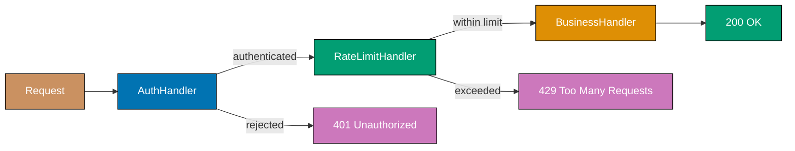

**Python — typed middleware chain with early termination:**

```python
from __future__ import annotations
from dataclasses import dataclass
from typing import Optional

@dataclass
class HttpRequest:
    path: str
    api_key: Optional[str]
    caller_id: str

@dataclass
class HttpResponse:
    status: int
    body: str

Handler = Callable[[HttpRequest], HttpResponse]

class MiddlewareChain:
    def __init__(self) -> None:
        self._middlewares: list[Callable[[HttpRequest, Handler], HttpResponse]] = []
        # => Each middleware receives request AND a next callable to forward to

    def use(self, middleware: Callable[[HttpRequest, Handler], HttpResponse]) -> "MiddlewareChain":
        self._middlewares.append(middleware)
        return self  # => Returns self for fluent builder API

    def build(self, final_handler: Handler) -> Handler:
        handler = final_handler  # => Start building chain from the end (innermost handler)
        for mw in reversed(self._middlewares):
            captured = handler  # => Capture in closure to avoid late-binding issue
            handler = lambda req, h=captured, m=mw: m(req, h)
            # => Wrap each middleware around the current chain; innermost runs last
        return handler  # => Returns outermost handler which drives the entire chain

# => Auth middleware: rejects requests without valid API key
VALID_KEYS = {"key-abc", "key-xyz"}  # => Simplified key store; prod uses DB/cache

def auth_middleware(req: HttpRequest, next_handler: Handler) -> HttpResponse:
    if req.api_key not in VALID_KEYS:
        return HttpResponse(status=401, body="Unauthorized")
        # => Chain terminates here; next_handler never called for invalid keys
    return next_handler(req)  # => Valid key: pass to next middleware in chain

# => Rate limit middleware: allows up to 2 calls per caller_id (simplified)
_call_counts: dict[str, int] = {}

def rate_limit_middleware(req: HttpRequest, next_handler: Handler) -> HttpResponse:
    _call_counts[req.caller_id] = _call_counts.get(req.caller_id, 0) + 1
    if _call_counts[req.caller_id] > 2:
        return HttpResponse(status=429, body="Too Many Requests")
        # => Chain terminates; auth already passed but rate limit blocks further
    return next_handler(req)  # => Within limit: continue to business handler

# => Final business handler
def order_handler(req: HttpRequest) -> HttpResponse:
    return HttpResponse(status=200, body=f"Orders for {req.caller_id}")

chain = MiddlewareChain().use(auth_middleware).use(rate_limit_middleware).build(order_handler)

print(chain(HttpRequest("/orders", None, "caller-1")))
# => Output: HttpResponse(status=401, body='Unauthorized')
print(chain(HttpRequest("/orders", "key-abc", "caller-1")))
# => Output: HttpResponse(status=200, body='Orders for caller-1')
print(chain(HttpRequest("/orders", "key-abc", "caller-1")))
# => Output: HttpResponse(status=200, body='Orders for caller-1')
print(chain(HttpRequest("/orders", "key-abc", "caller-1")))
# => Output: HttpResponse(status=429, body='Too Many Requests')
```

**Key Takeaway:** Build middleware chains with clear early-termination semantics so each handler has
one responsibility and can be inserted, removed, or reordered independently.

**Why It Matters:** Web frameworks (Express.js, FastAPI, Django, ASP.NET Core) are built on chain
of responsibility middleware stacks because adding cross-cutting concerns (authentication, CORS,
compression, caching) as separate middlewares is far safer than embedding them in business handlers.
Adding a new security control is a one-line middleware registration, not a cross-cutting change to
every endpoint. AWS API Gateway, Kong, and Nginx implement the same pattern at the infrastructure
level for the same reason.

---

### Example 76: Visitor Pattern in Architecture

The visitor pattern separates algorithms from the objects they operate on by defining a visitor
class per algorithm. Each domain object accepts a visitor and calls the appropriate visit method,
enabling new operations to be added without modifying domain classes — valuable when adding
reporting, serialisation, or transformation rules to a stable object hierarchy.

```python
from __future__ import annotations
from abc import ABC, abstractmethod
from dataclasses import dataclass
from typing import List

# ============================================================
# Stable domain hierarchy — these classes do NOT change when new ops are added
# ============================================================
class Component(ABC):
    @abstractmethod
    def accept(self, visitor: "ComponentVisitor") -> None: ...

@dataclass
class Service(Component):
    name: str
    replicas: int
    cpu_millicores: int  # => e.g. 500 = 0.5 CPU cores

    def accept(self, visitor: "ComponentVisitor") -> None:
        visitor.visit_service(self)  # => Dispatches to correct visit_* method via double dispatch

@dataclass
class Database(Component):
    name: str
    storage_gb: int
    multi_az: bool  # => Multi-AZ deployment for high availability

    def accept(self, visitor: "ComponentVisitor") -> None:
        visitor.visit_database(self)  # => Database-specific visit method

@dataclass
class Architecture:
    components: List[Component]

    def accept(self, visitor: "ComponentVisitor") -> None:
        visitor.visit_architecture(self)
        for c in self.components:
            c.accept(visitor)  # => Each component dispatches to its own visit method

# ============================================================
# Visitor interface — new operations implement this without touching domain classes
# ============================================================
class ComponentVisitor(ABC):
    @abstractmethod
    def visit_service(self, svc: Service) -> None: ...
    @abstractmethod
    def visit_database(self, db: Database) -> None: ...
    @abstractmethod
    def visit_architecture(self, arch: Architecture) -> None: ...

# ============================================================
# Concrete visitor 1: Cost estimation — new operation, no domain changes
# ============================================================
class CostEstimator(ComponentVisitor):
    def __init__(self) -> None:
        self.total_monthly_usd: float = 0.0

    def visit_architecture(self, arch: Architecture) -> None:
        print(f"Estimating cost for {len(arch.components)} components")

    def visit_service(self, svc: Service) -> None:
        cost = svc.replicas * (svc.cpu_millicores / 1000) * 30 * 0.05
        # => $0.05 per vCPU per hour, 30 days; simplified cloud pricing model
        self.total_monthly_usd += cost
        print(f"  Service {svc.name}: ${cost:.2f}/month")

    def visit_database(self, db: Database) -> None:
        cost = db.storage_gb * 0.10 * (2 if db.multi_az else 1)
        # => $0.10 per GB/month, doubled for multi-AZ redundancy
        self.total_monthly_usd += cost
        print(f"  Database {db.name}: ${cost:.2f}/month")

# ============================================================
# Concrete visitor 2: Compliance check — another new operation, still no domain changes
# ============================================================
class ComplianceChecker(ComponentVisitor):
    def __init__(self) -> None:
        self.violations: List[str] = []

    def visit_architecture(self, arch: Architecture) -> None:
        pass  # => No architecture-level compliance rules in this example

    def visit_service(self, svc: Service) -> None:
        if svc.replicas < 2:
            self.violations.append(f"Service '{svc.name}' has only {svc.replicas} replica (min 2 for HA)")
            # => Single replica violates high-availability requirement

    def visit_database(self, db: Database) -> None:
        if not db.multi_az:
            self.violations.append(f"Database '{db.name}' is not multi-AZ (compliance requirement)")
            # => Single-AZ database violates disaster-recovery policy

arch = Architecture(components=[
    Service("orders-api", replicas=3, cpu_millicores=500),
    Service("worker", replicas=1, cpu_millicores=1000),  # => Only 1 replica — will fail compliance
    Database("orders-db", storage_gb=100, multi_az=True),
    Database("cache-db", storage_gb=20, multi_az=False),  # => Not multi-AZ — will fail compliance
])

cost_visitor = CostEstimator()
arch.accept(cost_visitor)
print(f"Total: ${cost_visitor.total_monthly_usd:.2f}/month")
# => Output: Estimating cost for 4 components
# => Output:   Service orders-api: $2.25/month
# => Output:   Service worker: $1.50/month
# => Output:   Database orders-db: $20.00/month
# => Output:   Database cache-db: $2.00/month
# => Output: Total: $25.75/month

compliance = ComplianceChecker()
arch.accept(compliance)
print(f"Violations: {compliance.violations}")
# => Output: Violations: ["Service 'worker' has only 1 replica...", "Database 'cache-db' is not multi-AZ..."]
```

**Key Takeaway:** Use the visitor pattern when you need to add operations to a stable class hierarchy
without modifying the classes themselves — especially valuable for architecture tools that analyse,
transform, or validate object graphs.

**Why It Matters:** Architecture tooling (cost estimators, compliance checkers, diagram generators,
security scanners) must traverse the same infrastructure object graph with different algorithms.
Without visitor, each tool either subclasses domain objects or adds methods directly, creating
maintenance coupling. The visitor pattern — used in AWS CDK, Terraform's internal AST traversal,
and compiler front ends — cleanly separates the object hierarchy (what the architecture IS) from
operations (what tools DO to the architecture), enabling teams to add new analysis passes without
touching core infrastructure models.

---

## Advanced Resilience and Scalability

### Example 77: Database per Service Pattern

The database-per-service pattern assigns each microservice an exclusive database it fully controls,
preventing schema coupling and enabling independent scaling and technology selection. Cross-service
data access uses APIs — never direct database joins — ensuring services remain independently
deployable.

```python
from dataclasses import dataclass, field
from typing import Optional, List
import uuid

# ============================================================
# Orders Service — owns orders_db, knows nothing about users_db schema
# ============================================================
@dataclass
class OrderRecord:
    order_id: str
    customer_id: str   # => Foreign reference stored as opaque ID, not a DB join key
    total: float       # => Orders DB: only order data; no customer name or email stored here

class OrdersDatabase:
    def __init__(self) -> None:
        self._rows: dict[str, OrderRecord] = {}
        # => Orders service's exclusive database; no other service can query this directly

    def insert(self, record: OrderRecord) -> None:
        self._rows[record.order_id] = record  # => Persists order; only Orders service writes here

    def find_by_customer(self, customer_id: str) -> List[OrderRecord]:
        return [r for r in self._rows.values() if r.customer_id == customer_id]
        # => Orders service's own read model — no JOIN to customer table

# ============================================================
# Customers Service — owns customers_db, never touches orders_db
# ============================================================
@dataclass
class CustomerRecord:
    customer_id: str
    name: str
    email: str

class CustomersDatabase:
    def __init__(self) -> None:
        self._rows: dict[str, CustomerRecord] = {}

    def insert(self, record: CustomerRecord) -> None:
        self._rows[record.customer_id] = record

    def find(self, customer_id: str) -> Optional[CustomerRecord]:
        return self._rows.get(customer_id)  # => Returns None if customer not found

# ============================================================
# API Aggregation Layer — composes data from both services via API calls, not DB joins
# ============================================================
class OrderWithCustomerDTO:
    def __init__(self, order: OrderRecord, customer: Optional[CustomerRecord]) -> None:
        self.order_id = order.order_id
        self.total = order.total
        # => Customer name fetched via API; denormalised at the aggregation layer
        self.customer_name = customer.name if customer else "Unknown"
        self.customer_email = customer.email if customer else "N/A"

def get_orders_with_customer_details(
    customer_id: str,
    orders_db: OrdersDatabase,
    customers_db: CustomersDatabase,
) -> List[OrderWithCustomerDTO]:
    orders = orders_db.find_by_customer(customer_id)   # => Call Orders service API
    customer = customers_db.find(customer_id)           # => Call Customers service API
    # => Aggregation done here (BFF or API gateway layer), not via cross-service DB join
    return [OrderWithCustomerDTO(o, customer) for o in orders]

# => Simulation
orders_db = OrdersDatabase()
customers_db = CustomersDatabase()

cust_id = "CUST-1"
customers_db.insert(CustomerRecord(customer_id=cust_id, name="Alice", email="alice@example.com"))
orders_db.insert(OrderRecord(order_id="ORD-1", customer_id=cust_id, total=99.99))
orders_db.insert(OrderRecord(order_id="ORD-2", customer_id=cust_id, total=49.50))

results = get_orders_with_customer_details(cust_id, orders_db, customers_db)
for r in results:
    print(f"Order {r.order_id}: ${r.total} — Customer: {r.customer_name} ({r.customer_email})")
# => Output: Order ORD-1: $99.99 — Customer: Alice (alice@example.com)
# => Output: Order ORD-2: $49.5 — Customer: Alice (alice@example.com)
```

**Key Takeaway:** Each service's database is a private implementation detail; all cross-service
data access must go through APIs so services remain independently deployable and scalable.

**Why It Matters:** Shared databases are the most common reason microservices fail to deliver on
their independence promise: a schema change by the Orders team breaks the Billing service's
queries at runtime. Amazon's two-pizza team rule explicitly forbids cross-service database access
for this reason. Database-per-service enables independent scaling (Orders at 100 replicas, Billing
at 5) and technology selection (Orders on PostgreSQL, Recommendations on DynamoDB) — impossible
with a shared schema.

---

### Example 78: Feature Toggle Architecture

Feature toggles (feature flags) allow code for new features to be deployed to production but remain
inactive for most users, enabling trunk-based development, A/B testing, canary releases, and
kill-switch controls without re-deploying. The toggle system decouples deployment from release.

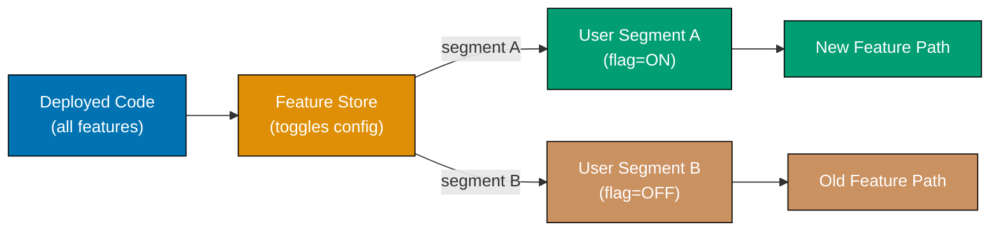

**Python — toggle store with user-segment targeting:**

```python
from dataclasses import dataclass, field
from typing import Optional, Set
import hashlib

@dataclass
class Toggle:
    name: str
    enabled: bool                       # => Global on/off switch
    rollout_percentage: int = 100       # => Percentage of users who see new feature (0-100)
    allowed_user_ids: Set[str] = field(default_factory=set)
    # => Allowlist: specific users always see the feature regardless of rollout percentage

class FeatureStore:
    def __init__(self) -> None:
        self._toggles: dict[str, Toggle] = {}

    def register(self, toggle: Toggle) -> None:
        self._toggles[toggle.name] = toggle  # => Register toggle at startup from config file

    def is_enabled(self, name: str, user_id: str) -> bool:
        toggle = self._toggles.get(name)
        if toggle is None or not toggle.enabled:
            return False  # => Unknown or globally disabled toggle returns False

        if user_id in toggle.allowed_user_ids:
            return True  # => User in explicit allowlist — always enabled regardless of rollout %

        # => Deterministic rollout: hash user_id so same user always gets same decision
        user_bucket = int(hashlib.md5(f"{name}:{user_id}".encode()).hexdigest(), 16) % 100
        # => Produces 0-99; if bucket < rollout_percentage then user is in rollout cohort
        return user_bucket < toggle.rollout_percentage

store = FeatureStore()
store.register(Toggle(name="new_checkout", enabled=True, rollout_percentage=20,
                       allowed_user_ids={"beta-tester-1"}))
# => new_checkout: 20% gradual rollout + explicit beta tester allowlist

# => Beta tester always gets new feature
print(store.is_enabled("new_checkout", "beta-tester-1"))  # => Output: True

# => Regular users: deterministic based on user_id hash (20% will get True)
results = [store.is_enabled("new_checkout", f"user-{i}") for i in range(10)]
enabled_count = sum(results)
print(f"Enabled for {enabled_count}/10 sample users (target ~20%)")
# => Output: Enabled for ~2/10 sample users (target ~20%)

# => Kill switch: disable globally without redeploying
store._toggles["new_checkout"].enabled = False
print(store.is_enabled("new_checkout", "beta-tester-1"))  # => Output: False (kill switch)
```

**Key Takeaway:** Use deterministic hash-based bucketing so the same user always gets the same
feature decision, preventing inconsistent UX where a user sees the new feature on one page reload
but not another.

**Why It Matters:** Feature toggles enable trunk-based development at Facebook scale, where thousands
of engineers commit to a single branch daily. Rather than maintaining long-lived feature branches
that create merge conflicts, engineers deploy dark code (toggled off) continuously and activate
features through the toggle system. Netflix's Unleash and Facebook's Gatekeeper show that toggle
infrastructure reduces deployment risk to near zero: a bad feature can be disabled with a config
change in seconds, without the 10-30 minute pipeline cycle of a revert-and-redeploy.

---

### Example 79: Service Mesh Architecture

A service mesh adds a transparent infrastructure layer to handle service-to-service communication
concerns — mutual TLS, traffic shaping, retries, circuit breaking, and telemetry — without changing
application code. Each service gets a sidecar proxy (typically Envoy) that intercepts all network
traffic.

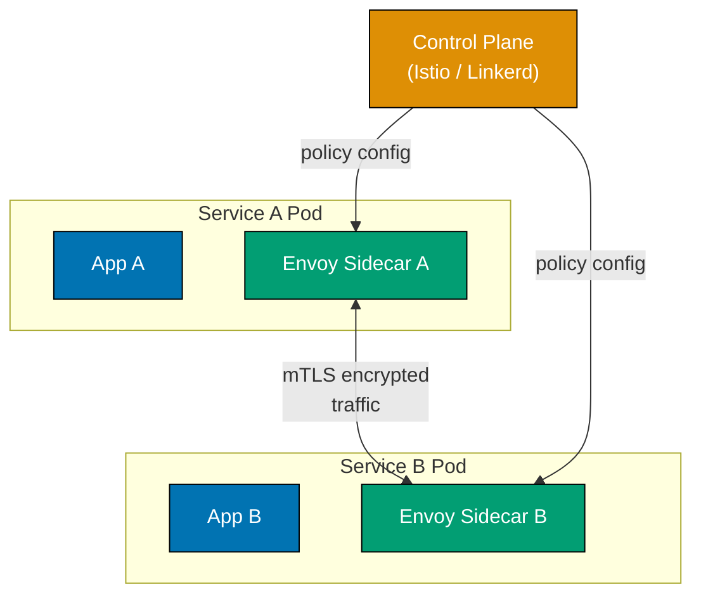

**Python — simulated mesh proxy intercepting calls between services:**

```python
from typing import Callable
import hashlib

# => MeshProxy simulates what Envoy does as a sidecar proxy
class MeshProxy:
    def __init__(self, service_name: str) -> None:
        self._service = service_name
        self._tls_enabled = True    # => mTLS enforced by mesh control plane
        self._retry_limit = 3       # => Retry policy injected by control plane; app knows nothing
        self._telemetry: list = []  # => All calls recorded for Prometheus/Jaeger export

    def call(self, target: str, func: Callable[[], str]) -> str:
        # => Step 1: enforce mutual TLS — control plane has configured certificates
        if not self._tls_enabled:
            raise PermissionError("mTLS required by mesh policy")

        last_err: Optional[Exception] = None
        for attempt in range(self._retry_limit):
            try:
                result = func()  # => Actual inter-service call (to target's proxy, then app)
                self._record(target, attempt + 1, "success")
                # => Telemetry recorded by proxy; application code has zero instrumentation
                return result
            except Exception as e:
                last_err = e
                self._record(target, attempt + 1, "error")

        raise RuntimeError(f"Mesh exhausted retries to {target}: {last_err}") from last_err

    def _record(self, target: str, attempt: int, outcome: str) -> None:
        self._telemetry.append({"from": self._service, "to": target, "attempt": attempt, "outcome": outcome})
        # => In production: metrics exported to Prometheus; traces to Jaeger/Zipkin

# => Service A and Service B each have their own sidecar proxy
proxy_a = MeshProxy("orders-svc")
proxy_b = MeshProxy("inventory-svc")

# => Simulate inventory service that fails once then succeeds
_inv_calls = 0
def inventory_check() -> str:
    global _inv_calls
    _inv_calls += 1
    if _inv_calls == 1:
        raise ConnectionError("transient network error")  # => First call fails
    return "in_stock"  # => Second call succeeds; proxy retried transparently

# => Orders service calls Inventory through the mesh — no retry code in Orders
result = proxy_a.call("inventory-svc", inventory_check)
print(f"Inventory response: {result}")  # => Output: Inventory response: in_stock
print(f"Telemetry: {proxy_a._telemetry}")
# => Output: Telemetry: [{'from': 'orders-svc', 'to': 'inventory-svc', 'attempt': 1, 'outcome': 'error'},
#                        {'from': 'orders-svc', 'to': 'inventory-svc', 'attempt': 2, 'outcome': 'success'}]
```

**Key Takeaway:** Service mesh moves cross-cutting network concerns (retries, mTLS, tracing) to the
infrastructure proxy layer so application developers write only business logic.

**Why It Matters:** Before service meshes, every team independently implemented retry logic,
circuit breaking, and TLS in each language and service — 50 teams meant 50 different retry
implementations with different bugs. Google, Lyft, and IBM co-created Envoy and Istio to solve
this at scale: a single control plane pushes consistent policies to all sidecars simultaneously.
Airbnb's adoption of a service mesh reduced their mTLS rollout from an estimated 2 years of
application-level changes to 6 weeks of infrastructure configuration.

---

### Example 80: Interpreter Pattern for Configuration DSL

The interpreter pattern defines a grammar for a language and an interpreter that evaluates sentences
in that language. In architecture it enables policy engines, query filters, rule evaluators, and
configuration DSLs where business logic is expressed in a structured mini-language rather than
hardcoded conditionals.

```python
from abc import ABC, abstractmethod
from dataclasses import dataclass
from typing import Dict, Any

# => Abstract expression interface — all nodes in the AST implement this
class Expression(ABC):
    @abstractmethod
    def interpret(self, context: Dict[str, Any]) -> bool: ...
    # => context: dictionary of variables (e.g., {"user.tier": "gold", "order.total": 150.0})

# ============================================================
# Terminal expressions — leaves of the expression tree
# ============================================================
@dataclass
class GreaterThan(Expression):
    variable: str   # => Key to look up in context
    threshold: float

    def interpret(self, context: Dict[str, Any]) -> bool:
        value = context.get(self.variable, 0)
        return float(value) > self.threshold  # => True if context variable exceeds threshold
        # => Enables rules like order.total > 100 without hardcoded Python conditionals

@dataclass
class Equals(Expression):
    variable: str
    value: Any

    def interpret(self, context: Dict[str, Any]) -> bool:
        return context.get(self.variable) == self.value  # => Equality check against context value

# ============================================================
# Non-terminal expressions — composite nodes
# ============================================================
@dataclass
class AndExpression(Expression):
    left: Expression
    right: Expression

    def interpret(self, context: Dict[str, Any]) -> bool:
        return self.left.interpret(context) and self.right.interpret(context)
        # => Evaluates both sub-expressions; short-circuits if left is False

@dataclass
class OrExpression(Expression):
    left: Expression
    right: Expression

    def interpret(self, context: Dict[str, Any]) -> bool:
        return self.left.interpret(context) or self.right.interpret(context)
        # => Either sub-expression being True is sufficient

# ============================================================
# DSL usage: discount eligibility expressed as a composable expression tree
# ============================================================
# => Rule: discount eligible IF (tier == gold) OR (total > 100 AND tier == silver)
discount_rule: Expression = OrExpression(
    left=Equals("user.tier", "gold"),  # => Gold users always get discount
    right=AndExpression(
        left=GreaterThan("order.total", 100.0),   # => Large order
        right=Equals("user.tier", "silver"),       # => Silver tier
    ),
)

ctx_gold = {"user.tier": "gold", "order.total": 30.0}
ctx_silver_large = {"user.tier": "silver", "order.total": 150.0}
ctx_bronze = {"user.tier": "bronze", "order.total": 200.0}

print(discount_rule.interpret(ctx_gold))          # => Output: True  (gold, any total)
print(discount_rule.interpret(ctx_silver_large))  # => Output: True  (silver + >100)
print(discount_rule.interpret(ctx_bronze))        # => Output: False (bronze, not in rule)
```

**Key Takeaway:** Build expression trees using composable terminal and non-terminal expression
objects so business rules can be loaded from config, stored in databases, and evaluated without
redeployment.

**Why It Matters:** Hardcoded business rules require a code change and deployment for every
adjustment — unacceptable for pricing, fraud detection, or feature entitlement that business teams
change weekly. Retail banks use interpreter-based policy engines to update loan eligibility criteria
same-day without a development cycle. AWS IAM policy evaluation, Kubernetes admission webhooks, and
Open Policy Agent all implement the interpreter pattern to evaluate externally defined rules against
infrastructure context, proving this pattern's applicability at production scale.

---

## Expert-Level Synthesis

### Example 81: CQRS (Command Query Responsibility Segregation)

CQRS separates the model used for state-changing commands from the model used for read queries,
enabling each side to be optimised independently. The write model enforces business rules and domain
invariants; the read model (or multiple read models) is denormalised for fast query performance.

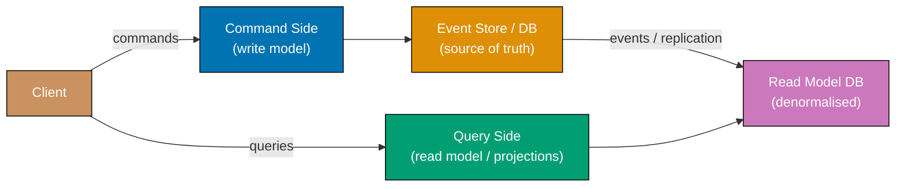

**Python — separated command handler and query handler with projection:**

```python
from dataclasses import dataclass, field
from typing import List, Optional

# ============================================================
# Write side: command model with domain invariants
# ============================================================
@dataclass
class CreateProductCommand:
    product_id: str
    name: str
    price: float
    stock: int

@dataclass
class Product:
    product_id: str
    name: str
    price: float
    stock: int
    events: List[dict] = field(default_factory=list)  # => Domain events produced by command

class ProductCommandHandler:
    def __init__(self) -> None:
        self._write_store: dict[str, Product] = {}
        # => Write model: normalised, enforces invariants; not used for queries

    def handle_create(self, cmd: CreateProductCommand) -> Product:
        if cmd.price <= 0:
            raise ValueError("Price must be positive")  # => Invariant enforced on write side
        if cmd.stock < 0:
            raise ValueError("Stock cannot be negative")
        product = Product(product_id=cmd.product_id, name=cmd.name, price=cmd.price, stock=cmd.stock)
        product.events.append({"type": "ProductCreated", "payload": {"id": cmd.product_id, "name": cmd.name, "price": cmd.price}})
        # => Event emitted; will be consumed by read-side projection
        self._write_store[cmd.product_id] = product
        return product

# ============================================================
# Read side: denormalised projection optimised for list queries
# ============================================================
@dataclass
class ProductSummary:
    product_id: str
    display_name: str   # => "Name ($price)" — pre-formatted for UI consumption
    in_stock: bool      # => Derived boolean; read model owns this transformation

class ProductProjection:
    def __init__(self) -> None:
        self._read_store: dict[str, ProductSummary] = {}
        # => Read model: denormalised, fast to query; rebuilt from events if stale

    def on_product_created(self, event: dict) -> None:
        p = event["payload"]
        summary = ProductSummary(
            product_id=p["id"],
            display_name=f"{p['name']} (${p['price']:.2f})",  # => Pre-formatted for display
            in_stock=True,  # => Derived from stock > 0; read model owns this computation
        )
        self._read_store[p["id"]] = summary  # => Projection materialised into read store

    def query_all(self) -> List[ProductSummary]:
        return list(self._read_store.values())  # => Fast read; no joins, no business logic

# => Wire command and query sides via event propagation
cmd_handler = ProductCommandHandler()
projection = ProductProjection()

product = cmd_handler.handle_create(CreateProductCommand("P1", "Widget", price=9.99, stock=100))
for event in product.events:
    projection.on_product_created(event)  # => Read side consumes events from write side

summaries = projection.query_all()
for s in summaries:
    print(f"{s.product_id}: {s.display_name}, in_stock={s.in_stock}")
# => Output: P1: Widget ($9.99), in_stock=True
```

**Key Takeaway:** Separate command handlers (enforce invariants, emit events) from query handlers
(consume projections, optimised for reads) so each side can scale and evolve independently.

**Why It Matters:** Relational databases optimised for write consistency (with locks, transactions,
and normalisation) perform poorly for complex read queries that aggregate data across many tables.
CQRS solves this by maintaining separate read models — projected, denormalised, perhaps stored in
Elasticsearch or Redis — that answer queries in microseconds without table scans. Stack Overflow,
event-sourcing the entire Q&A platform, and trading systems at exchanges like NYSE use CQRS to
achieve sub-millisecond query latency while maintaining write consistency through normalised command models.

---

### Example 82: Outbox Pattern for Reliable Event Publishing

The outbox pattern solves the dual-write problem: how to atomically persist a database record and
publish an event to a message broker. By writing the event to an outbox table in the same database
transaction as the business record, then polling and publishing the outbox asynchronously, exactly-
once semantics are achievable within a single service.

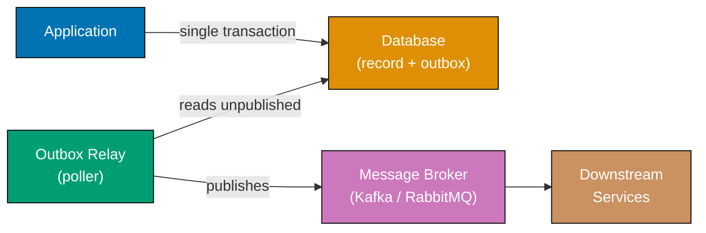

**Python — atomic outbox write with relay publishing:**

```python
from dataclasses import dataclass
import uuid
import time

@dataclass
class OutboxEntry:
    entry_id: str
    event_type: str
    payload: dict
    published: bool = False  # => False until relay successfully delivers to broker
    created_at: float = 0.0

class Database:
    def __init__(self) -> None:
        self._orders: dict[str, dict] = {}
        self._outbox: list[OutboxEntry] = []  # => Outbox lives in same DB as orders

    def save_order_with_event(self, order_id: str, total: float, event_type: str, event_payload: dict) -> None:
        # => ATOMIC: both writes succeed or both fail — no partial state possible
        self._orders[order_id] = {"order_id": order_id, "total": total}
        # => Persist business record
        entry = OutboxEntry(
            entry_id=str(uuid.uuid4())[:8],
            event_type=event_type,
            payload=event_payload,
            created_at=time.monotonic(),
        )
        self._outbox.append(entry)
        # => Persist event to outbox in same transaction; broker NOT called here
        print(f"DB: saved order {order_id} + outbox entry {entry.entry_id} (atomic)")

    def get_unpublished(self) -> list[OutboxEntry]:
        return [e for e in self._outbox if not e.published]
        # => Relay queries for undelivered events; safe to call after partial failures

    def mark_published(self, entry_id: str) -> None:
        for e in self._outbox:
            if e.entry_id == entry_id:
                e.published = True  # => Idempotency: mark before or after broker ack
                return

class OutboxRelay:
    def __init__(self, db: Database) -> None:
        self._db = db

    def publish_pending(self, broker_publish: Callable[[str, dict], None]) -> None:
        for entry in self._db.get_unpublished():
            broker_publish(entry.event_type, entry.payload)
            # => Publish to broker (Kafka, SQS, etc.); may be retried on failure
            self._db.mark_published(entry.entry_id)
            # => Only mark published after broker confirms receipt (at-least-once delivery)
            print(f"Relay: published {entry.event_type} (entry {entry.entry_id})")

# => Simulated Kafka publish (stdout in demo)
def mock_broker(event_type: str, payload: dict) -> None:
    print(f"Broker: received {event_type} — {payload}")

db = Database()
relay = OutboxRelay(db)

db.save_order_with_event("ORD-99", 199.99, "OrderPlaced", {"order_id": "ORD-99", "total": 199.99})
# => Output: DB: saved order ORD-99 + outbox entry <id> (atomic)

relay.publish_pending(mock_broker)
# => Output: Broker: received OrderPlaced — {'order_id': 'ORD-99', 'total': 199.99}
# => Output: Relay: published OrderPlaced (entry <id>)

print(f"Unpublished after relay: {len(db.get_unpublished())}")
# => Output: Unpublished after relay: 0
```

**Key Takeaway:** Write business data and the outbox event in a single database transaction, then
relay the outbox asynchronously to the broker so the event is never lost even if the broker is
temporarily unavailable.

**Why It Matters:** The naive dual-write — save to DB then publish to Kafka — has a gap: if the
service crashes between the two writes, the event is lost and downstream services never see the
order placed. The outbox pattern is the standard solution, used by Debezium's CDC (Change Data
Capture) connector which reads the outbox table directly from the database's binary log and
publishes to Kafka — eliminating the relay polling latency entirely. Financial systems, logistics
platforms, and any domain requiring event reliability adopt the outbox pattern as foundational
infrastructure.

---

### Example 83: Anti-Corruption Layer

The anti-corruption layer (ACL) is a translation boundary that prevents a downstream model's
concepts from leaking into an upstream domain. The ACL translates between two bounded contexts'
vocabularies, protecting the upstream domain from being corrupted by legacy or third-party models.

```python
from dataclasses import dataclass
from typing import Optional

# ============================================================
# Legacy CRM system model — uses its own vocabulary (customer as "account")
# ============================================================
@dataclass
class LegacyCrmAccount:
    acct_num: str        # => CRM calls customers "accounts" with account numbers
    full_name: str
    email_addr: str      # => CRM field names differ from our domain model
    status_code: int     # => 1=active, 2=suspended, 3=closed — integer codes, not enums
    credit_limit: str    # => CRM stores as string "1500.00" — type mismatch!

# ============================================================
# Our domain model — uses domain language, correct types
# ============================================================
@dataclass
class Customer:
    customer_id: str     # => Our domain uses "customer", not "account"
    name: str            # => Simplified field name
    email: str
    active: bool         # => Boolean — not integer status codes
    credit_limit: float  # => Correct type — not string

# ============================================================
# Anti-Corruption Layer — translates without letting CRM vocabulary into our domain
# ============================================================
class CrmAntiCorruptionLayer:
    _STATUS_ACTIVE = 1  # => ACL owns knowledge of CRM status codes; domain never sees integers

    def translate_account(self, crm_account: LegacyCrmAccount) -> Customer:
        return Customer(
            customer_id=crm_account.acct_num,  # => Map CRM's "acct_num" to our "customer_id"
            name=crm_account.full_name,         # => Rename: full_name -> name
            email=crm_account.email_addr,       # => Rename: email_addr -> email
            active=(crm_account.status_code == self._STATUS_ACTIVE),
            # => Translate integer status code to domain boolean; CRM leak stops here
            credit_limit=float(crm_account.credit_limit),
            # => Convert CRM's string "1500.00" to float; type mismatch resolved in ACL
        )

    def translate_to_crm(self, customer: Customer) -> LegacyCrmAccount:
        return LegacyCrmAccount(
            acct_num=customer.customer_id,
            full_name=customer.name,
            email_addr=customer.email,
            status_code=self._STATUS_ACTIVE if customer.active else 2,
            # => Reverse translation: boolean -> integer code; our domain never stores this
            credit_limit=f"{customer.credit_limit:.2f}",  # => Float -> string for CRM
        )

# => Usage: domain code works only with Customer; ACL handles all CRM translation
acl = CrmAntiCorruptionLayer()

crm_data = LegacyCrmAccount("ACC-001", "Alice Smith", "alice@crm.com", 1, "2500.00")
customer = acl.translate_account(crm_data)
print(f"Customer: {customer.name}, active={customer.active}, credit={customer.credit_limit}")
# => Output: Customer: Alice Smith, active=True, credit=2500.0

# => Round-trip: translate back for CRM update API call
crm_output = acl.translate_to_crm(customer)
print(f"CRM output: acct={crm_output.acct_num}, status={crm_output.status_code}, credit={crm_output.credit_limit}")
# => Output: CRM output: acct=ACC-001, status=1, credit=2500.00
```

**Key Takeaway:** The ACL is the boundary where foreign vocabulary and types stop; everything
inside the boundary uses clean domain language and correct types without compromise.

**Why It Matters:** Without an ACL, integrating a legacy CRM causes its integer status codes,
misspelled field names, and wrong types to propagate into the domain model — creating unmaintainable
translation logic scattered across the codebase. Eric Evans identified the ACL as critical to
maintaining domain purity during integration; teams that skip it spend disproportionate effort
on "translation debt" — conditional mapping code duplicated wherever the legacy system's data
is used. Rebuilding a messy integration with a proper ACL is one of the highest-ROI refactorings
in enterprise systems.

---

### Example 84: Ports and Adapters (Hexagonal Architecture)

The hexagonal architecture (Ports and Adapters) places the domain model at the centre, surrounded
by ports (interfaces) through which the domain communicates with the outside world. Adapters
implement those ports for specific technologies (HTTP, databases, message queues), keeping the
domain completely free of infrastructure dependencies.

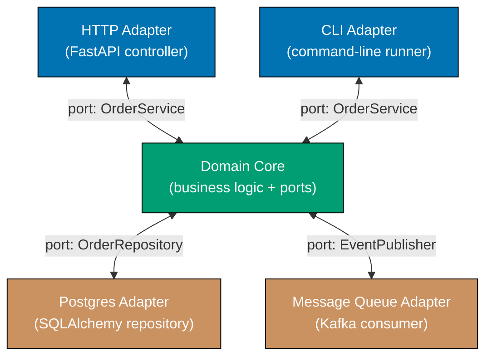

**Python — domain with ports; in-memory adapters for testing:**

```python
from abc import ABC, abstractmethod
from dataclasses import dataclass
from typing import Optional, List
import uuid

# ============================================================
# Ports — domain-owned interfaces
# ============================================================
class OrderRepository(ABC):   # => Driven port: domain drives this to store/retrieve
    @abstractmethod
    def save(self, order: "Order") -> None: ...
    @abstractmethod
    def find(self, order_id: str) -> Optional["Order"]: ...

class EventPublisher(ABC):    # => Driven port: domain drives this to publish events
    @abstractmethod
    def publish(self, event_type: str, payload: dict) -> None: ...

# ============================================================
# Domain core — depends only on ports, never on adapters
# ============================================================
@dataclass
class Order:
    order_id: str
    customer_id: str
    total: float
    status: str = "pending"

class OrderService:  # => Primary port entry point (driving port)
    def __init__(self, repo: OrderRepository, publisher: EventPublisher) -> None:
        self._repo = repo          # => Injected at startup; domain does not know which adapter
        self._publisher = publisher

    def place_order(self, customer_id: str, total: float) -> Order:
        order = Order(order_id=str(uuid.uuid4())[:8], customer_id=customer_id, total=total)
        self._repo.save(order)     # => Domain drives the repository port; not SQLAlchemy directly
        self._publisher.publish("OrderPlaced", {"order_id": order.order_id, "total": total})
        # => Domain drives the event port; not Kafka directly
        return order

# ============================================================
# Adapters — implement ports for specific technologies
# ============================================================
class InMemoryOrderRepository(OrderRepository):
    def __init__(self) -> None:
        self._store: dict[str, Order] = {}  # => In-memory store; swap for SQLAlchemy in production

    def save(self, order: Order) -> None:
        self._store[order.order_id] = order  # => Stores in dict; no SQL, no connection pool

    def find(self, order_id: str) -> Optional[Order]:
        return self._store.get(order_id)  # => Returns None if not found

class LoggingEventPublisher(EventPublisher):
    def __init__(self) -> None:
        self.published: List[dict] = []  # => Records published events for test assertions

    def publish(self, event_type: str, payload: dict) -> None:
        self.published.append({"event_type": event_type, "payload": payload})
        # => Logs event; swap for KafkaProducer adapter in production

# => Compose domain with adapters — done once at application startup
repo = InMemoryOrderRepository()
publisher = LoggingEventPublisher()
service = OrderService(repo, publisher)  # => Domain receives adapters via constructor injection

order = service.place_order("CUST-1", total=75.50)
print(f"Order placed: {order.order_id}, total={order.total}")
# => Output: Order placed: <id>, total=75.5

print(f"Events published: {publisher.published}")
# => Output: Events published: [{'event_type': 'OrderPlaced', 'payload': {'order_id': '<id>', 'total': 75.5}}]
```

**Key Takeaway:** Domain logic is testable in complete isolation using in-memory adapters; swapping
to real infrastructure adapters requires zero domain code changes — only composition root changes.

**Why It Matters:** Traditional layered architectures let infrastructure details leak into the
domain (JPA annotations in entity classes, Kafka types in service methods), making domains
impossible to test without spinning up databases. Hexagonal architecture, adopted by teams at
Spotify, ThoughtWorks, and in Alistair Cockburn's original 2005 formulation, enables fast unit
tests of all business logic using in-memory adapters, reducing test suite time from 10+ minutes
(integration tests with real DB) to seconds — critical for a high-frequency CI/CD pipeline.

---

### Example 85: Reactive Architecture with Backpressure

Reactive architecture processes streams of data asynchronously using non-blocking I/O, with
backpressure mechanisms that signal upstream producers to slow down when downstream consumers
cannot keep up, preventing out-of-memory crashes from unbounded queues.

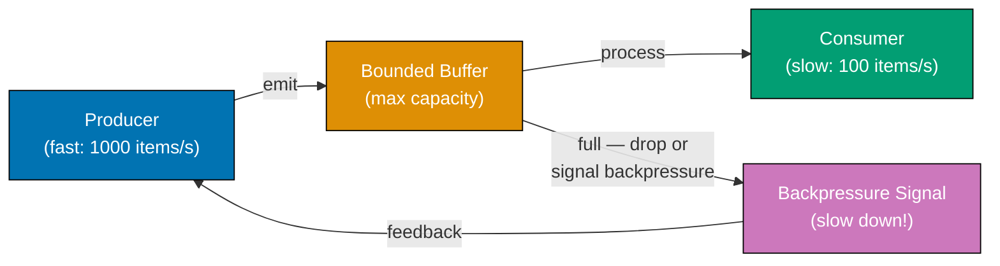

**Python — bounded queue with backpressure signalling:**

```python
import queue
import threading
import time
from typing import Callable, Optional

class BackpressureQueue:
    def __init__(self, max_size: int) -> None:
        self._q: queue.Queue = queue.Queue(maxsize=max_size)
        # => Bounded queue: blocks or drops when full — prevents unbounded memory growth
        self.dropped = 0    # => Count of items dropped due to backpressure
        self.processed = 0  # => Count of items successfully processed

    def produce(self, item: int, timeout: float = 0.0) -> bool:
        try:
            self._q.put(item, block=True, timeout=timeout)
            # => Block for up to `timeout` seconds; raises Full if still full after timeout
            return True   # => Item accepted into queue
        except queue.Full:
            self.dropped += 1  # => Apply backpressure: drop item and signal to producer
            return False       # => Producer should slow down or apply own backpressure logic

    def consume_one(self, processor: Callable[[int], None], timeout: float = 0.1) -> bool:
        try:
            item = self._q.get(block=True, timeout=timeout)
            # => Block until item available or timeout
            processor(item)  # => Process the item (could be I/O, computation, etc.)
            self._q.task_done()
            self.processed += 1
            return True  # => Successfully processed one item
        except queue.Empty:
            return False  # => No items available within timeout — consumer is caught up

# => Simulate producer faster than consumer (common in data pipelines)
bq = BackpressureQueue(max_size=10)  # => Small buffer to demonstrate backpressure quickly

_processed_items = []

def slow_consumer(item: int) -> None:
    time.sleep(0.005)  # => Consumer takes 5ms per item (~200/s)
    _processed_items.append(item)

# => Producer tries to emit 50 items immediately (faster than consumer can drain)
produced = 0
for i in range(50):
    accepted = bq.produce(i, timeout=0.001)  # => Wait max 1ms before dropping
    if accepted:
        produced += 1
    # => Some items dropped when queue full — backpressure applied

# => Drain remaining items with consumer
while bq._q.qsize() > 0:
    bq.consume_one(slow_consumer)

print(f"Produced: {produced}, Dropped (backpressure): {bq.dropped}, Processed: {bq.processed}")
# => Output: Produced: ~10-20, Dropped (backpressure): ~30-40, Processed: ~10-20
# => (Exact numbers vary; queue fills quickly when producer is much faster)
print(f"Queue never exceeded max_size=10: {bq._q.maxsize == 10}")
# => Output: Queue never exceeded max_size=10: True
```

**Key Takeaway:** Use bounded queues with explicit drop-or-block semantics as the backpressure
mechanism; never allow unbounded queuing, which defers the OOM crash rather than preventing it.

**Why It Matters:** Reactive Streams — standardised in the Reactive Streams specification (RxJava,
Project Reactor, Akka Streams, Python's asyncio) — emerged because event-driven systems with
unbounded queues inevitably crash under load: the queue fills memory until the process is killed.
Twitter's real-time timeline processing, Netflix's Zuul 2, and LinkedIn's Samza stream processing
all implement backpressure to handle traffic spikes of 10x normal load without OOM crashes. Systems
that lack backpressure require over-provisioning by the spike ratio — expensive and wasteful compared
to a properly backpressured reactive pipeline.
