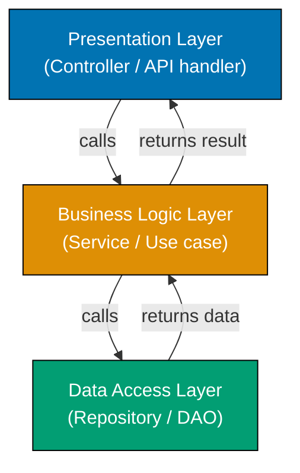
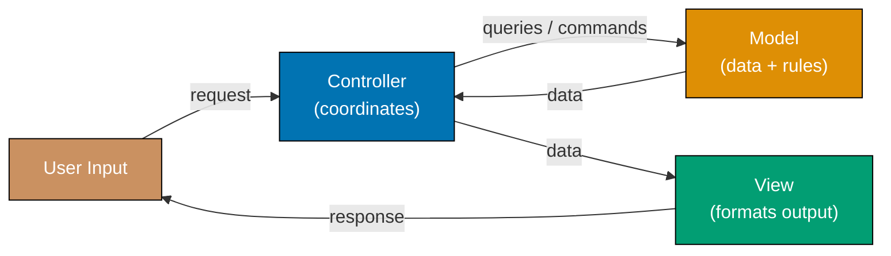
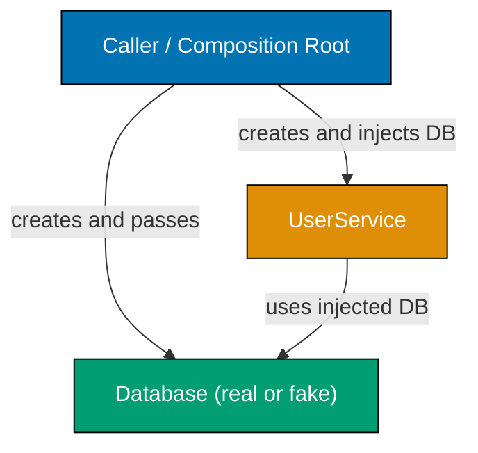
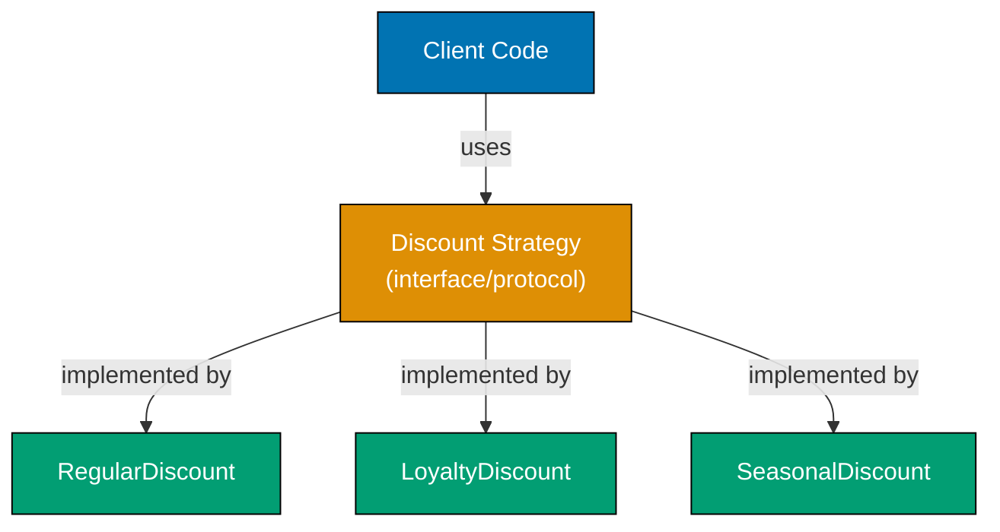
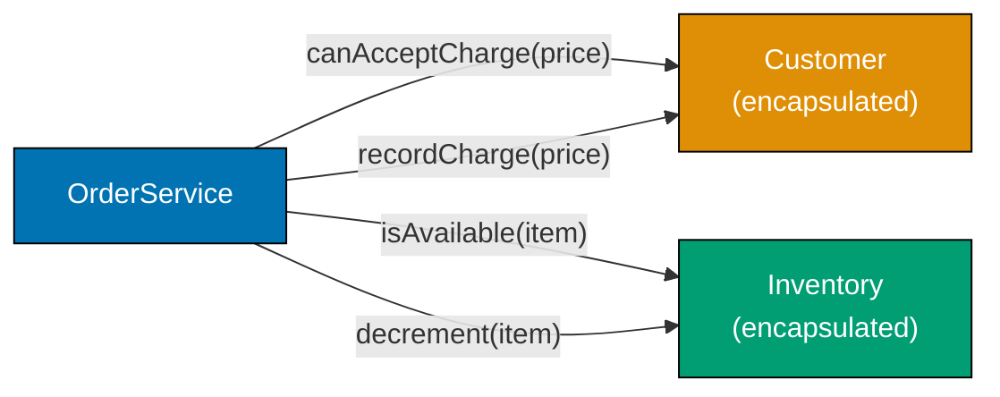
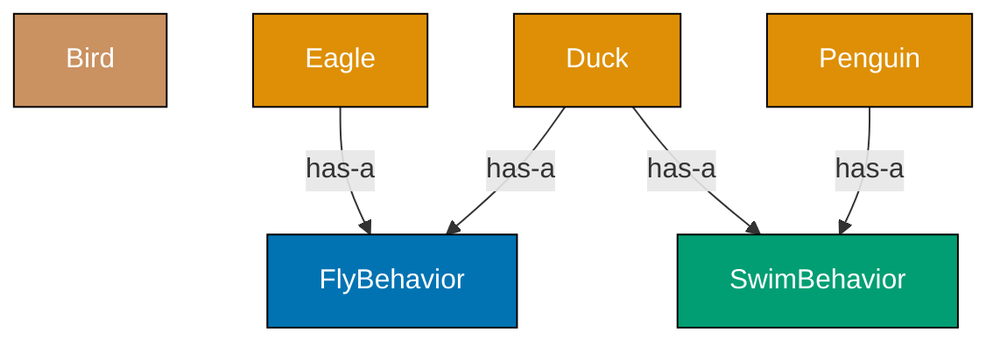
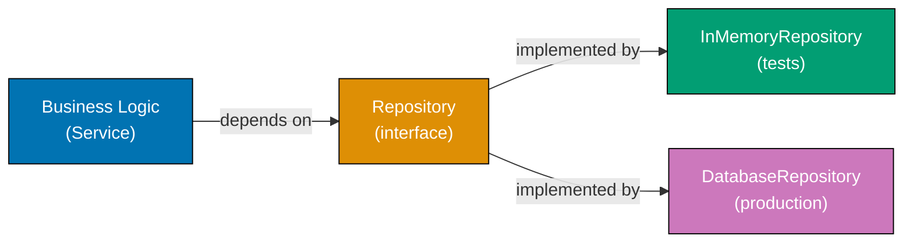
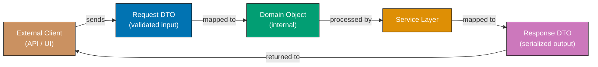
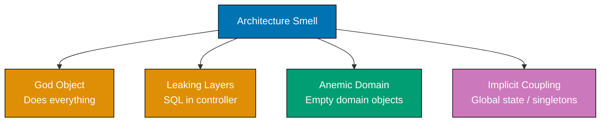

This beginner level covers Examples 1-28, reaching approximately 0-35% of software architecture fundamentals. Each example demonstrates a core architectural concept using Python or TypeScript with self-contained, runnable code. These examples target developers who already know at least one language and want to rapidly build architectural instincts through working code.

## Separation of Concerns

### Example 1: No Separation vs. Clear Separation

Separation of concerns means grouping code by responsibility so that each module handles exactly one aspect of the system. When multiple responsibilities mix in one function, changing any part risks breaking the others.

**Tightly coupled approach (no separation):**

```python
# => This function handles THREE distinct responsibilities at once:
# => 1. Data access (reading from a dict)
# => 2. Business logic (computing discount)
# => 3. Presentation (formatting a string for display)
def get_user_discount_message(user_id: int) -> str:
    # => user_db simulates a database lookup — data access concern
    user_db = {1: {"name": "Alice", "purchases": 12}}
    user = user_db.get(user_id)          # => user is {"name": "Alice", "purchases": 12}
    # => Business rule embedded directly here — hard to change independently
    if user and user["purchases"] > 10:
        discount = 0.15                  # => discount is 0.15 (15%)
    else:
        discount = 0.05                  # => discount is 0.05 (5%)
    # => Presentation formatted inline — impossible to reuse discount logic elsewhere
    return f"Hello {user['name']}, your discount is {discount * 100:.0f}%"
    # => Output: "Hello Alice, your discount is 15%"
```

Mixing all three responsibilities means any change — a new discount rule, a different greeting format, or a different data source — requires editing the same function.

**Separated approach (three distinct layers):**

```python
# => DATA ACCESS — only knows how to retrieve users
def find_user(user_id: int) -> dict | None:
    user_db = {1: {"name": "Alice", "purchases": 12}}
    return user_db.get(user_id)          # => returns dict or None

# => BUSINESS LOGIC — only knows discount rules, not storage or display
def calculate_discount(purchases: int) -> float:
    if purchases > 10:
        return 0.15                      # => 15% for loyal customers (>10 purchases)
    return 0.05                          # => 5% default discount

# => PRESENTATION — only knows how to format, not how to compute or fetch
def format_discount_message(name: str, discount: float) -> str:
    return f"Hello {name}, your discount is {discount * 100:.0f}%"
    # => Output: "Hello Alice, your discount is 15%"

# => ORCHESTRATION — thin coordinator that wires the three layers together
def get_user_discount_message(user_id: int) -> str:
    user = find_user(user_id)            # => delegates data access
    discount = calculate_discount(user["purchases"])  # => delegates business rule
    return format_discount_message(user["name"], discount)  # => delegates formatting
```

Each function now has one reason to change: swap the database without touching the discount rule, change the discount formula without touching the message format.

**Key Takeaway:** Separate each distinct responsibility into its own function or module. A function should have exactly one reason to change.

**Why It Matters:** In production systems, business rules change far more often than data storage technology, and display formats change more often than both. When these concerns are mixed, a simple business rule change forces a full regression test of the display layer. Netflix, Stripe, and other high-velocity engineering teams build their systems so each layer evolves independently, enabling hundreds of safe deployments per day.

---

### Example 2: Single Responsibility Principle

The Single Responsibility Principle (SRP) states that a class or module should have one and only one reason to change. Violating SRP creates fragile code where an unrelated change breaks a seemingly unrelated feature.

**Violating SRP — one class does too much:**

```typescript
// => UserManager handles user data AND email sending AND password logic
// => This class has THREE reasons to change: user schema, email templates, auth rules
class UserManager {
  private users: Map<number, { name: string; email: string }> = new Map();
  // => users stores id → { name, email }

  addUser(id: number, name: string, email: string): void {
    this.users.set(id, { name, email }); // => stores user under id key
  }

  // => EMAIL CONCERN embedded in user class — mixing responsibilities
  sendWelcomeEmail(userId: number): void {
    const user = this.users.get(userId); // => retrieves user or undefined
    if (user) {
      console.log(`Sending email to ${user.email}: Welcome, ${user.name}!`);
      // => Output: Sending email to alice@example.com: Welcome, Alice!
    }
  }

  // => PASSWORD CONCERN also embedded — a third responsibility
  resetPassword(userId: number): string {
    const newPassword = Math.random().toString(36).slice(2, 10);
    // => newPassword is a random 8-char string like "k3m9p2ax"
    console.log(`Password reset for user ${userId}: ${newPassword}`);
    return newPassword; // => returns the new password string
  }
}
```

**Applying SRP — one class, one responsibility:**

```typescript
// => RESPONSIBILITY 1: User data management only
class UserRepository {
  private users: Map<number, { name: string; email: string }> = new Map();

  add(id: number, name: string, email: string): void {
    this.users.set(id, { name, email }); // => stores user record
  }

  get(id: number): { name: string; email: string } | undefined {
    return this.users.get(id); // => returns user or undefined
  }
}

// => RESPONSIBILITY 2: Email notifications only
class EmailService {
  sendWelcome(name: string, email: string): void {
    console.log(`Sending email to ${email}: Welcome, ${name}!`);
    // => Output: Sending email to alice@example.com: Welcome, Alice!
  }
}

// => RESPONSIBILITY 3: Password management only
class PasswordService {
  reset(userId: number): string {
    const newPassword = Math.random().toString(36).slice(2, 10);
    // => newPassword is a random 8-char string
    console.log(`Password reset for user ${userId}: ${newPassword}`);
    return newPassword; // => returns the generated password
  }
}
```

**Key Takeaway:** Each class should have exactly one reason to change. When you add email template logic, only `EmailService` changes. When you change password policy, only `PasswordService` changes.

**Why It Matters:** SRP is the foundational principle behind microservices: each service owns one business capability. Amazon's transition from monolith to service-oriented architecture succeeded by applying SRP at the service level. Teams that own single-responsibility services deploy independently, reducing the coordination overhead that kills engineering velocity at scale.

---

## Layered Architecture

### Example 3: Three-Layer Architecture

A layered architecture organizes code into a presentation layer (handles user interaction), a business logic layer (enforces rules), and a data access layer (manages persistence). Layers only communicate downward — presentation calls business logic, business logic calls data access, never the reverse.



```python
# ============================================================
# DATA ACCESS LAYER — only knows about storage
# ============================================================
class ProductRepository:
    def __init__(self) -> None:
        # => in-memory store simulating a database table
        self._products = {
            1: {"id": 1, "name": "Laptop", "price": 1200.0, "stock": 5},
            2: {"id": 2, "name": "Mouse",  "price": 25.0,  "stock": 0},
        }

    def find_by_id(self, product_id: int) -> dict | None:
        return self._products.get(product_id)
        # => returns product dict or None if not found

# ============================================================
# BUSINESS LOGIC LAYER — only knows about rules
# ============================================================
class ProductService:
    def __init__(self, repo: "ProductRepository") -> None:
        self._repo = repo                # => stores repository reference (dependency injection)

    def get_available_product(self, product_id: int) -> dict:
        product = self._repo.find_by_id(product_id)
        # => delegates data retrieval to the repository
        if product is None:
            raise ValueError(f"Product {product_id} not found")
            # => raises ValueError — presentation layer will catch this
        if product["stock"] == 0:
            raise ValueError(f"Product '{product['name']}' is out of stock")
            # => business rule: zero stock means unavailable
        return product                   # => returns valid product dict

# ============================================================
# PRESENTATION LAYER — only knows about formatting responses
# ============================================================
def handle_get_product(product_id: int) -> str:
    repo = ProductRepository()           # => creates data layer
    service = ProductService(repo)       # => creates business layer, injects repo
    try:
        product = service.get_available_product(product_id)
        # => delegates all business logic to service
        return f"Available: {product['name']} at ${product['price']:.2f}"
        # => Output (id=1): "Available: Laptop at $1200.00"
    except ValueError as e:
        return f"Error: {e}"
        # => Output (id=2): "Error: Product 'Mouse' is out of stock"

print(handle_get_product(1))  # => Available: Laptop at $1200.00
print(handle_get_product(2))  # => Error: Product 'Mouse' is out of stock
```

**Key Takeaway:** Each layer communicates only with the layer directly below it. Presentation never touches the database; data access never formats strings for users.

**Why It Matters:** Layered architecture is the default starting pattern for most enterprise systems (Spring MVC, Django, Rails all enforce it). It enables parallel development — a frontend team can build against an agreed service API while a backend team implements the business rules — and makes testing each layer independently straightforward.

---

### Example 4: Presentation Layer Isolation

The presentation layer should translate raw input into domain calls and translate domain results into output format. It should contain no business logic and no data access code.

```typescript
// => DATA LAYER — retrieves raw records
const orderDb: Record<number, { id: number; total: number; status: string }> = {
  101: { id: 101, total: 299.99, status: "shipped" },
  102: { id: 102, total: 49.0, status: "pending" },
};

function findOrder(id: number): { id: number; total: number; status: string } | null {
  return orderDb[id] ?? null; // => returns order record or null
}

// => BUSINESS LAYER — applies domain rules
function isOrderEligibleForCancellation(order: { total: number; status: string }): boolean {
  return order.status === "pending" && order.total < 500;
  // => true only when pending AND total below cancellation threshold
}

// => PRESENTATION LAYER — translates, never decides
function handleCancelRequest(orderId: number): string {
  const order = findOrder(orderId); // => fetches from data layer
  if (!order) {
    return `Order ${orderId} not found`; // => presentation transforms null to message
  }
  const eligible = isOrderEligibleForCancellation(order);
  // => business logic evaluated in business layer, result consumed here
  if (eligible) {
    return `Order ${orderId} cancelled successfully`;
    // => Output (id=102): "Order 102 cancelled successfully"
  }
  return `Order ${orderId} cannot be cancelled (status: ${order.status})`;
  // => Output (id=101): "Order 101 cannot be cancelled (status: shipped)"
}

console.log(handleCancelRequest(101)); // => Order 101 cannot be cancelled (status: shipped)
console.log(handleCancelRequest(102)); // => Order 102 cancelled successfully
console.log(handleCancelRequest(999)); // => Order 999 not found
```

**Key Takeaway:** The presentation layer transforms but never decides. All decisions live in the business layer where they can be tested without a UI or HTTP context.

**Why It Matters:** Teams that keep business logic out of controllers can test their entire rule set with fast in-memory unit tests. When the presentation layer grows (mobile app, CLI tool, REST API), the business layer requires zero modification, which is exactly what allows organizations like Shopify to serve multiple client types from a single codebase.

---

## MVC Pattern

### Example 5: Model-View-Controller Basics

MVC separates a program into a Model (data and rules), a View (formatting output), and a Controller (coordinating input and response). The Controller receives input, asks the Model to process it, then passes results to the View for display.



```python
# ============================================================
# MODEL — data container + business validation
# ============================================================
class TodoModel:
    def __init__(self) -> None:
        self._items: list[dict] = []     # => internal list of todo dicts
        self._next_id = 1                # => auto-incrementing id counter

    def add(self, title: str) -> dict:
        item = {"id": self._next_id, "title": title, "done": False}
        # => item is {"id": 1, "title": "Buy milk", "done": False}
        self._items.append(item)         # => appended to internal list
        self._next_id += 1               # => next_id is now 2
        return item                      # => returns the created item

    def get_all(self) -> list[dict]:
        return list(self._items)         # => returns shallow copy to prevent mutation

    def complete(self, item_id: int) -> bool:
        for item in self._items:
            if item["id"] == item_id:
                item["done"] = True      # => marks item as completed
                return True              # => returns True = success
        return False                     # => returns False = item not found

# ============================================================
# VIEW — formats data for display, no logic
# ============================================================
class TodoView:
    def render_list(self, items: list[dict]) -> str:
        if not items:
            return "No todos yet."       # => Output when empty list
        lines = []
        for item in items:
            status = "✓" if item["done"] else "○"
            # => status is "✓" for done items, "○" for pending
            lines.append(f"[{status}] {item['id']}. {item['title']}")
        return "\n".join(lines)          # => joined with newlines

    def render_created(self, item: dict) -> str:
        return f"Created todo #{item['id']}: {item['title']}"
        # => Output: "Created todo #1: Buy milk"

# ============================================================
# CONTROLLER — coordinates model and view
# ============================================================
class TodoController:
    def __init__(self, model: TodoModel, view: TodoView) -> None:
        self._model = model              # => stores model reference
        self._view = view                # => stores view reference

    def create(self, title: str) -> str:
        item = self._model.add(title)    # => delegates creation to model
        return self._view.render_created(item)  # => delegates formatting to view

    def list_all(self) -> str:
        items = self._model.get_all()    # => fetches all items from model
        return self._view.render_list(items)    # => delegates rendering to view

    def done(self, item_id: int) -> str:
        success = self._model.complete(item_id)  # => delegates completion to model
        if success:
            return f"Todo #{item_id} marked as done"
        return f"Todo #{item_id} not found"

# => Wire the MVC triad together
model = TodoModel()
view = TodoView()
controller = TodoController(model, view)

print(controller.create("Buy milk"))    # => Created todo #1: Buy milk
print(controller.create("Write tests")) # => Created todo #2: Write tests
print(controller.done(1))               # => Todo #1 marked as done
print(controller.list_all())
# => [✓] 1. Buy milk
# => [○] 2. Write tests
```

**Key Takeaway:** The Controller handles input and coordinates. The Model owns data and rules. The View formats output. None of these three should reach into the others' domain.

**Why It Matters:** MVC is the backbone of virtually every web framework (Rails, Django, Laravel, Spring MVC, ASP.NET). Understanding the pure form of MVC lets you debug framework issues quickly and extend frameworks correctly without fighting the intended structure.

---

### Example 6: Model Encapsulates Validation

The Model is responsible for enforcing its own invariants. If validation logic leaks into controllers or views, the same rule must be duplicated everywhere the data is modified, creating drift over time.

```typescript
// => MODEL with self-contained validation — the model is the single source of truth
class BankAccount {
  private balance: number; // => private: external code cannot bypass validation
  private readonly minimumBalance = 0; // => business rule: no overdrafts

  constructor(initialBalance: number) {
    if (initialBalance < 0) {
      throw new Error("Initial balance cannot be negative");
      // => enforced at construction time, not by the caller
    }
    this.balance = initialBalance; // => balance is initialBalance (e.g., 100)
  }

  deposit(amount: number): void {
    if (amount <= 0) {
      throw new Error("Deposit amount must be positive");
      // => model rejects invalid inputs without controller involvement
    }
    this.balance += amount; // => balance increases by amount
  }

  withdraw(amount: number): void {
    if (amount <= 0) {
      throw new Error("Withdrawal amount must be positive");
    }
    if (this.balance - amount < this.minimumBalance) {
      throw new Error(`Insufficient funds: balance is ${this.balance}`);
      // => business rule enforced in model, not leaked to controller
    }
    this.balance -= amount; // => balance decreases by amount
  }

  getBalance(): number {
    return this.balance; // => read-only access to private state
  }
}

// => CONTROLLER — delegates entirely to model, no duplicate validation
function handleWithdraw(account: BankAccount, amount: number): string {
  try {
    account.withdraw(amount); // => model enforces all rules
    return `Withdrawal successful. Balance: $${account.getBalance()}`;
    // => Output: "Withdrawal successful. Balance: $50"
  } catch (e) {
    return `Withdrawal failed: ${(e as Error).message}`;
    // => Output: "Withdrawal failed: Insufficient funds: balance is 50"
  }
}

const account = new BankAccount(100); // => account.balance is 100
console.log(handleWithdraw(account, 50)); // => Withdrawal successful. Balance: $50
console.log(handleWithdraw(account, 200)); // => Withdrawal failed: Insufficient funds: balance is 50
```

**Key Takeaway:** Models that enforce their own invariants are impossible to put into invalid states, regardless of which controller or API endpoint calls them.

**Why It Matters:** Domain model integrity is the first line of defense against data corruption in production. When the model does not enforce its own rules, invariants get enforced inconsistently across controllers, background jobs, and admin scripts — eventually leading to database records that violate business rules, which are notoriously expensive to clean up.

---

## Dependency Injection

### Example 7: Manual Dependency Injection

Dependency injection means passing dependencies into an object rather than creating them inside it. The object declares what it needs; the caller decides what to provide. This makes the object testable and reusable across different contexts.



**Without dependency injection (hard to test):**

```python
# => UserService creates its own database connection — cannot be tested without real DB
class HardcodedUserService:
    def __init__(self) -> None:
        # => hardcoded dependency: impossible to substitute a fake in tests
        self._db = {"data": {1: "Alice", 2: "Bob"}}

    def get_name(self, user_id: int) -> str | None:
        return self._db["data"].get(user_id)  # => returns name or None
```

**With dependency injection (easy to test with any backend):**

```python
# => PROTOCOL defines what UserService needs from storage
from typing import Protocol

class UserStore(Protocol):
    def fetch(self, user_id: int) -> str | None: ...
    # => any object with fetch(int) -> str | None satisfies this protocol

# => REAL implementation for production
class DictUserStore:
    def __init__(self) -> None:
        self._data = {1: "Alice", 2: "Bob"}  # => simulates a real DB

    def fetch(self, user_id: int) -> str | None:
        return self._data.get(user_id)       # => returns name or None

# => FAKE implementation for tests — no DB required
class FakeUserStore:
    def fetch(self, user_id: int) -> str | None:
        return "TestUser"                    # => always returns a fixed value for testing

# => SERVICE accepts any UserStore — decoupled from specific implementation
class UserService:
    def __init__(self, store: UserStore) -> None:
        self._store = store                  # => stores injected dependency

    def greet(self, user_id: int) -> str:
        name = self._store.fetch(user_id)    # => delegates to whatever store was injected
        if name is None:
            return f"User {user_id} not found"
        return f"Hello, {name}!"             # => Output: "Hello, Alice!"

# => PRODUCTION: inject real store
service = UserService(DictUserStore())
print(service.greet(1))   # => Hello, Alice!
print(service.greet(99))  # => User 99 not found

# => TEST: inject fake store — no database needed
test_service = UserService(FakeUserStore())
print(test_service.greet(1))   # => Hello, TestUser!
```

**Key Takeaway:** Inject dependencies from the outside rather than creating them inside. The service only knows the interface it needs, not which implementation provides it.

**Why It Matters:** Dependency injection is the foundation of testable architectures. Google's Guice and Java's Spring DI container both exist to automate what this example does manually. Applications built with DI reach 90%+ test coverage more easily because every dependency can be substituted with a fast in-memory fake.

---

### Example 8: Constructor Injection vs. Method Injection

There are two common styles of dependency injection: constructor injection (dependencies passed when the object is created) and method injection (dependencies passed per-call). Constructor injection is the default for stable dependencies; method injection suits per-request context like loggers or user sessions.

```typescript
// => CONSTRUCTOR INJECTION — dependency lives for the object's lifetime
// => Use when: dependency is always required and does not change per call
class OrderProcessor {
  private paymentGateway: { charge: (amount: number) => boolean };
  // => paymentGateway is stored for the lifetime of OrderProcessor

  constructor(paymentGateway: { charge: (amount: number) => boolean }) {
    this.paymentGateway = paymentGateway; // => injected at construction time
  }

  processOrder(orderId: number, amount: number): string {
    const success = this.paymentGateway.charge(amount);
    // => uses the injected gateway — no knowledge of which gateway is used
    return success ? `Order ${orderId} paid ($${amount})` : `Order ${orderId} payment failed`;
  }
}

// => METHOD INJECTION — dependency passed per call
// => Use when: dependency varies per request (e.g., per-user logger, per-request context)
class AuditLogger {
  log(
    message: string,
    output: { write: (msg: string) => void }, // => injected per call
  ): void {
    output.write(`[AUDIT] ${message}`);
    // => output can be console, file, database — determined by caller
  }
}

// => USAGE: wire concrete implementations at the composition root
const fakeGateway = { charge: (amount: number) => amount < 1000 };
// => fakeGateway returns true for amounts < 1000 (simulates approval limit)

const processor = new OrderProcessor(fakeGateway);
console.log(processor.processOrder(1, 500)); // => Order 1 paid ($500)
console.log(processor.processOrder(2, 1500)); // => Order 2 payment failed

const logger = new AuditLogger();
logger.log("User login", { write: (msg) => console.log(msg) });
// => Output: [AUDIT] User login
logger.log("File export", { write: (msg) => console.log(`>> ${msg}`) });
// => Output: >> [AUDIT] File export
```

**Key Takeaway:** Prefer constructor injection for required, stable dependencies. Use method injection when the dependency varies per invocation.

**Why It Matters:** Constructor injection makes dependencies explicit and visible in the object's contract, eliminating invisible global state. Method injection powers extensible APIs like Express middleware and Python decorators, enabling plug-in architectures where behavior can be augmented without modifying the core class.

---

## Interface Segregation

### Example 9: Interface Segregation Principle

The Interface Segregation Principle says that classes should not be forced to implement methods they do not use. A fat interface forces every implementor to carry unused methods. Split fat interfaces into focused ones, and implementors pick only what they need.

**Fat interface — forces implementors to define methods they do not need:**

```typescript
// => FAT interface: all implementors must provide ALL four methods
interface EmployeeOperations {
  calculateSalary(): number; // => relevant for paid employees
  clockIn(): void; // => relevant for hourly workers
  generateReport(): string; // => relevant for managers
  requestLeave(days: number): void; // => relevant for all employees
}

// => CONTRACTOR only needs salary calculation, yet must implement everything
class Contractor implements EmployeeOperations {
  calculateSalary(): number {
    return 500;
  } // => useful
  clockIn(): void {
    /* not applicable */
  } // => forced but meaningless
  generateReport(): string {
    return "";
  } // => forced but meaningless
  requestLeave(days: number): void {} // => forced but meaningless
}
```

**Segregated interfaces — each implementor picks only what applies:**

```typescript
// => FOCUSED interfaces: each covers one capability
interface Payable {
  calculateSalary(): number; // => pay calculation
}

interface Trackable {
  clockIn(): void; // => time tracking
}

interface Reportable {
  generateReport(): string; // => reporting
}

interface LeaveEligible {
  requestLeave(days: number): void; // => leave management
}

// => CONTRACTOR: only salary matters, no forced empty methods
class SegregatedContractor implements Payable {
  calculateSalary(): number {
    return 500; // => flat daily rate
  }
}

// => FULL_TIME EMPLOYEE: salary + time tracking + leave
class FullTimeEmployee implements Payable, Trackable, LeaveEligible {
  private hoursWorked = 0; // => tracks hours for this period

  calculateSalary(): number {
    return this.hoursWorked * 25; // => $25/hour
  }

  clockIn(): void {
    this.hoursWorked += 8; // => adds one full work day
  }

  requestLeave(days: number): void {
    console.log(`Leave requested: ${days} day(s)`);
    // => Output: Leave requested: 5 day(s)
  }
}

// => MANAGER: salary + reporting
class Manager implements Payable, Reportable {
  calculateSalary(): number {
    return 8000;
  } // => fixed monthly salary

  generateReport(): string {
    return "Team performance: on track"; // => manager-specific report
  }
}

const contractor = new SegregatedContractor();
console.log(contractor.calculateSalary()); // => 500

const emp = new FullTimeEmployee();
emp.clockIn();
console.log(emp.calculateSalary()); // => 200 (8 hours * $25)
```

**Key Takeaway:** Split interfaces by cohesive capability, not by the most complex implementor. Implementors import only the interfaces they genuinely fulfill.

**Why It Matters:** Interface segregation is why TypeScript's structural typing enables clean plugin architectures and why Java's standard library separated `Readable`, `Writable`, `Closeable`, and `Flushable`. Applications that ignore ISP accumulate "empty method" implementations that silently succeed or throw `UnsupportedOperationException`, creating subtle production bugs.

---

## Open/Closed Principle

### Example 10: Open for Extension, Closed for Modification

The Open/Closed Principle states that a class should be open for extension (new behaviors can be added) but closed for modification (existing code does not change when behavior is added). Achieving this typically involves polymorphism or strategy objects.



**Closed approach — requires modifying existing code for every new discount:**

```python
# => VIOLATION: adding a new discount type requires editing this function
def calculate_discount(price: float, discount_type: str) -> float:
    if discount_type == "regular":
        return price * 0.10              # => 10% off
    elif discount_type == "loyalty":
        return price * 0.20              # => 20% off for loyal customers
    # => Every new discount type requires adding another elif here
    # => This is the "open for modification" anti-pattern
    return 0.0
```

**Open/Closed approach — extend by adding new classes, never editing existing ones:**

```python
from abc import ABC, abstractmethod

# => ABSTRACT BASE — defines the contract, never changes
class DiscountStrategy(ABC):
    @abstractmethod
    def calculate(self, price: float) -> float: ...
    # => all strategies must implement calculate(price) -> float

# => CONCRETE STRATEGIES — add new ones without touching existing code
class RegularDiscount(DiscountStrategy):
    def calculate(self, price: float) -> float:
        return price * 0.10              # => 10% discount

class LoyaltyDiscount(DiscountStrategy):
    def calculate(self, price: float) -> float:
        return price * 0.20              # => 20% discount for loyal customers

# => EXTENSION: new discount type — existing code is UNTOUCHED
class SeasonalDiscount(DiscountStrategy):
    def calculate(self, price: float) -> float:
        return price * 0.30              # => 30% seasonal sale discount

# => CLIENT: depends on the abstract base, not concrete classes
class PriceCalculator:
    def __init__(self, strategy: DiscountStrategy) -> None:
        self._strategy = strategy        # => stores injected strategy

    def final_price(self, price: float) -> float:
        discount = self._strategy.calculate(price)
        # => delegates discount computation to injected strategy
        return price - discount          # => price minus discount amount

calc = PriceCalculator(RegularDiscount())
print(calc.final_price(100.0))   # => 90.0 (100 - 10)

calc2 = PriceCalculator(SeasonalDiscount())
print(calc2.final_price(100.0))  # => 70.0 (100 - 30)
```

**Key Takeaway:** Depend on abstractions and inject concrete strategies from outside. Adding new behavior means writing a new class, not modifying existing ones.

**Why It Matters:** The Open/Closed Principle is why payment providers like Stripe expose a pluggable system: you add a new payment method by implementing an interface, not by editing their core billing engine. Applications that violate OCP accumulate feature flags and nested conditionals that make every new feature a regression risk.

---

## Liskov Substitution Principle

### Example 11: Subtypes Must Be Substitutable

The Liskov Substitution Principle (LSP) says that any subclass instance must be usable wherever its parent class is expected, without breaking the program. A subclass that overrides a method to throw an exception or weaken behavior violates LSP.

**LSP violation — subclass breaks the contract:**

```typescript
// => BASE CLASS: Rectangle assumes independent width and height
class Rectangle {
  protected width: number;
  protected height: number;

  constructor(width: number, height: number) {
    this.width = width; // => width is set independently
    this.height = height; // => height is set independently
  }

  setWidth(w: number): void {
    this.width = w;
  } // => changes only width
  setHeight(h: number): void {
    this.height = h;
  } // => changes only height
  area(): number {
    return this.width * this.height;
  }
}

// => SQUARE forces both dimensions equal — violates LSP
class Square extends Rectangle {
  setWidth(w: number): void {
    this.width = w; // => changes width
    this.height = w; // => ALSO changes height — breaks Rectangle's contract
  }
  setHeight(h: number): void {
    this.height = h; // => changes height
    this.width = h; // => ALSO changes width — breaks Rectangle's contract
  }
}

// => CALLER written for Rectangle — breaks silently when given Square
function testRectangle(r: Rectangle): void {
  r.setWidth(5);
  r.setHeight(3);
  // => For a Rectangle: area should be 5 * 3 = 15
  // => For a Square:    area is 3 * 3 = 9 — unexpected behavior!
  console.log(`Area: ${r.area()}`);
}

testRectangle(new Rectangle(1, 1)); // => Area: 15 (correct)
testRectangle(new Square(1, 1)); // => Area: 9  (violates LSP)
```

**LSP-compliant design — use a shared interface, not inheritance:**

```typescript
// => SHAPE interface: defines area() contract without assuming dimension independence
interface Shape {
  area(): number;
}

// => RECTANGLE: independent width and height
class ProperRectangle implements Shape {
  constructor(
    private width: number,
    private height: number,
  ) {}
  area(): number {
    return this.width * this.height;
  } // => width * height
}

// => SQUARE: single side length, no inherited width/height confusion
class ProperSquare implements Shape {
  constructor(private side: number) {}
  area(): number {
    return this.side * this.side;
  } // => side * side
}

// => CALLER: works for any Shape — LSP satisfied
function printArea(shape: Shape): void {
  console.log(`Area: ${shape.area()}`);
}

printArea(new ProperRectangle(5, 3)); // => Area: 15
printArea(new ProperSquare(4)); // => Area: 16
```

**Key Takeaway:** Prefer interface composition over inheritance when subclass behavior diverges from parent behavior. Subtypes must honor the behavioral contract of the type they replace.

**Why It Matters:** LSP violations create runtime surprises that escape static analysis. The classic Rectangle/Square problem appears in real codebases as `ReadOnlyList extends ArrayList` where `add()` throws `UnsupportedOperationException`. These bugs surface in production rather than compilation, making them disproportionately expensive to diagnose.

---

## DRY, KISS, and YAGNI

### Example 12: DRY — Don't Repeat Yourself

DRY (Don't Repeat Yourself) means every piece of knowledge should have a single authoritative representation. Duplication is not just about copying code — it's about having the same decision expressed in multiple places.

**Violation — business rule duplicated in three places:**

```python
# => VIOLATION: the "active user" rule is duplicated in every function
# => If the rule changes (e.g., add email_verified check), all three must be updated

def send_notification(user: dict) -> None:
    if user["active"] and user["age"] >= 18:    # => rule duplicated here
        print(f"Notifying {user['name']}")

def generate_report(user: dict) -> None:
    if user["active"] and user["age"] >= 18:    # => same rule repeated
        print(f"Report for {user['name']}")

def allow_purchase(user: dict) -> bool:
    if user["active"] and user["age"] >= 18:    # => rule duplicated a third time
        return True
    return False
```

**DRY — single authoritative location for the rule:**

```python
# => SINGLE SOURCE OF TRUTH: rule defined once
def is_eligible_user(user: dict) -> bool:
    return user["active"] and user["age"] >= 18
    # => returns True only if active AND adult
    # => changing this rule updates all three callers automatically

def send_notification(user: dict) -> None:
    if is_eligible_user(user):           # => delegates to single rule
        print(f"Notifying {user['name']}")
        # => Output: Notifying Alice

def generate_report(user: dict) -> None:
    if is_eligible_user(user):           # => same single rule
        print(f"Report for {user['name']}")

def allow_purchase(user: dict) -> bool:
    return is_eligible_user(user)        # => single rule, no duplication

user = {"name": "Alice", "active": True, "age": 25}
send_notification(user)   # => Notifying Alice
print(allow_purchase(user))  # => True
```

**Key Takeaway:** Extract repeated decisions into named functions or constants. Code duplication is a symptom of knowledge duplication — fix the knowledge location, not just the syntax.

**Why It Matters:** The most costly bugs in production are consistency bugs where the same rule was updated in two places but not the third. DRY violations are the primary driver of those failures. Amazon's famous "two-pizza team" service model enforces DRY at the organizational level: each business rule is owned by exactly one team and one service.

---

### Example 13: KISS — Keep It Simple, Stupid

KISS means preferring the simplest design that satisfies the requirements. Complexity is a cost that must be justified by demonstrable benefit. Over-engineered solutions are harder to debug, test, and hand off.

**Over-engineered — excessive abstraction for a simple task:**

```typescript
// => OVER-ENGINEERED: factory + strategy + builder for a simple greeting
interface GreetingStrategy {
  greet(name: string): string;
}

class FormalGreetingStrategy implements GreetingStrategy {
  greet(name: string): string {
    return `Good day, ${name}.`;
  }
}

class GreetingFactory {
  static create(type: string): GreetingStrategy {
    if (type === "formal") return new FormalGreetingStrategy();
    throw new Error(`Unknown greeting type: ${type}`);
  }
}

class GreetingBuilder {
  private type = "formal";
  withType(type: string): this {
    this.type = type;
    return this;
  }
  build(): GreetingStrategy {
    return GreetingFactory.create(this.type);
  }
}

// => Usage: 5 classes to print "Good day, Alice."
const greeting = new GreetingBuilder().withType("formal").build().greet("Alice");
console.log(greeting); // => Good day, Alice.
```

**KISS — simplest solution that works:**

```typescript
// => SIMPLE: one function, zero ceremony, achieves the same result
function greet(name: string): string {
  return `Good day, ${name}.`;
  // => Output: Good day, Alice.
}

console.log(greet("Alice")); // => Good day, Alice.
// => If greeting types are needed later, add them then (YAGNI)
```

**Key Takeaway:** Add abstractions only when complexity is demonstrated, not anticipated. The second solution is easier to read, debug, test, extend, and hand off.

**Why It Matters:** Premature abstraction is one of the top causes of architectural debt in growing codebases. Kent Beck's Extreme Programming research found that over-engineered systems took 2-4x longer to modify than simple ones, even when the modification aligned with the intended abstraction. Build the simplest thing, then refactor when a pattern genuinely emerges.

---

### Example 14: YAGNI — You Aren't Gonna Need It

YAGNI means do not add functionality until it is actually needed. Speculative features add code complexity without delivering current value, and they are often built for a requirement that never arrives in the form anticipated.

```python
# => YAGNI VIOLATION: speculative features not required by any current use case

class UserProfile:
    def __init__(self, name: str, email: str) -> None:
        self.name = name                 # => required
        self.email = email               # => required

        # => SPECULATIVE: no current feature requires these fields
        self.theme = "light"             # => "might need dark mode someday"
        self.preferred_language = "en"   # => "maybe we'll go international"
        self.newsletter_frequency = "weekly"  # => "for a newsletter we haven't built"
        self.ai_recommendations = True   # => "for an AI feature in the roadmap"

    # => SPECULATIVE: no current caller uses this
    def export_to_xml(self) -> str:
        return f"<user><name>{self.name}</name></user>"

    # => SPECULATIVE: no current caller needs analytics integration
    def track_engagement(self, event: str) -> None:
        print(f"[Analytics] {self.name}: {event}")


# => YAGNI COMPLIANT: only what the application actually needs right now
class SimpleUserProfile:
    def __init__(self, name: str, email: str) -> None:
        self.name = name                 # => required today
        self.email = email               # => required today
        # => No speculative fields — add when a feature actually needs them

    def display_name(self) -> str:
        return self.name                 # => required today for display
        # => Output: "Alice"

user = SimpleUserProfile("Alice", "alice@example.com")
print(user.display_name())  # => Alice
# => Add export_to_xml() when an export feature is actually built
# => Add theme when a dark mode feature is actually shipped
```

**Key Takeaway:** Ship only what the current sprint requires. Code that is never executed in production still costs maintenance, testing, and cognitive load.

**Why It Matters:** YAGNI reduces the "inventory" of unvalidated code. Lean manufacturing teaches that inventory is waste — software inventory (unshipped features, speculative abstractions) follows the same economics. Spotify's feature teams operate under the principle that 80% of their speculative features never get used as imagined; building them upfront wastes 80% of the effort expended.

---

## Coupling and Cohesion

### Example 15: High Coupling — The Problem

Coupling measures how much one module depends on the internals of another. High coupling means a change in one module forces changes in others, making the system brittle and hard to evolve.

```python
# => HIGH COUPLING: OrderService reaches into the internals of Customer and Inventory

class Customer:
    def __init__(self, name: str, credit_limit: float) -> None:
        self.name = name
        self.credit_limit = credit_limit  # => internal field exposed directly
        self.outstanding_balance = 0.0    # => another internal field exposed

class Inventory:
    def __init__(self) -> None:
        self.items: dict[str, int] = {"Laptop": 5}  # => internal dict exposed

# => OrderService KNOWS about Customer's internals AND Inventory's internals
class TightlyCoupledOrderService:
    def place_order(
        self, customer: Customer, inventory: Inventory, item: str, price: float
    ) -> str:
        # => directly accesses customer's internal fields — tight coupling
        if customer.outstanding_balance + price > customer.credit_limit:
            return "Credit limit exceeded"

        # => directly accesses inventory's internal dict — tight coupling
        if inventory.items.get(item, 0) <= 0:
            return f"{item} is out of stock"

        # => mutates customer's internal state directly
        customer.outstanding_balance += price
        # => mutates inventory's internal dict directly
        inventory.items[item] -= 1
        return f"Order placed: {item} for {customer.name}"
        # => Output: "Order placed: Laptop for Alice"

customer = Customer("Alice", 2000.0)
inventory = Inventory()
service = TightlyCoupledOrderService()
print(service.place_order(customer, inventory, "Laptop", 1200.0))
# => Order placed: Laptop for Alice
# => If Customer renames credit_limit to available_credit, OrderService breaks
# => If Inventory changes items to a database call, OrderService breaks
```

**Key Takeaway:** When one module directly reads or mutates another module's internal fields, every internal change cascades as a breaking change throughout the codebase.

**Why It Matters:** High coupling is the primary reason legacy migrations fail. Systems where modules directly manipulate each other's internals cannot be changed one component at a time — every change is a big-bang rewrite. The cost of decoupling grows exponentially with system size, which is why architectural standards exist: coupling is far cheaper to prevent than to remediate.

---

### Example 16: Low Coupling Through Encapsulation

Reducing coupling means modules communicate through stable public interfaces, not through internal fields. When internal representation changes, the public interface remains stable and callers are unaffected.



```python
# => ENCAPSULATED Customer — hides internals behind stable methods
class EncapsulatedCustomer:
    def __init__(self, name: str, credit_limit: float) -> None:
        self._name = name
        self._credit_limit = credit_limit
        self._balance = 0.0              # => private: external code cannot touch directly

    @property
    def name(self) -> str:
        return self._name                # => read-only access to name

    def can_accept_charge(self, amount: float) -> bool:
        return self._balance + amount <= self._credit_limit
        # => hides the credit logic — callers don't know the formula

    def record_charge(self, amount: float) -> None:
        self._balance += amount          # => only method that mutates balance
        # => internal representation could change (e.g., add interest) without affecting callers

# => ENCAPSULATED Inventory — hides the backing data structure
class EncapsulatedInventory:
    def __init__(self) -> None:
        self._stock: dict[str, int] = {"Laptop": 5}  # => private backing dict

    def is_available(self, item: str) -> bool:
        return self._stock.get(item, 0) > 0
        # => hides how stock is stored — could be a database call

    def decrement(self, item: str) -> None:
        if self._stock.get(item, 0) > 0:
            self._stock[item] -= 1       # => only method that mutates stock

# => LOOSELY COUPLED OrderService — talks to interfaces only
class LooselyCoupldeOrderService:
    def place_order(
        self,
        customer: EncapsulatedCustomer,
        inventory: EncapsulatedInventory,
        item: str,
        price: float,
    ) -> str:
        if not customer.can_accept_charge(price):
            return "Credit limit exceeded"  # => no internal field access
        if not inventory.is_available(item):
            return f"{item} is out of stock"
        customer.record_charge(price)    # => delegates mutation to owner
        inventory.decrement(item)        # => delegates mutation to owner
        return f"Order placed: {item} for {customer.name}"
        # => Output: "Order placed: Laptop for Alice"

customer = EncapsulatedCustomer("Alice", 2000.0)
inventory = EncapsulatedInventory()
service = LooselyCoupldeOrderService()
print(service.place_order(customer, inventory, "Laptop", 1200.0))
# => Order placed: Laptop for Alice
# => Renaming _credit_limit to _available_credit has ZERO impact on OrderService
```

**Key Takeaway:** Define stable public methods that express what the object can do, not what it contains. Callers depend on behavior, not representation.

**Why It Matters:** Encapsulation is what makes refactoring safe. When the internal representation of an object changes — migrating from a dict to a database row, for example — only that class changes. Martin Fowler's refactoring research shows that systems with high encapsulation maintain a stable change cost over time, while tightly coupled systems see change cost grow superlinearly.

---

### Example 17: Cohesion — Grouping Related Behavior

Cohesion measures how related the responsibilities within a module are. High cohesion means everything in a class belongs together; low cohesion means the class mixes unrelated concerns.

```typescript
// => LOW COHESION: MixedUtilities handles three completely unrelated domains
class MixedUtilities {
  // => string manipulation
  formatTitle(title: string): string {
    return title.toUpperCase(); // => "hello" → "HELLO"
  }

  // => financial calculation — unrelated to strings
  calculateTax(price: number, rate: number): number {
    return price * rate; // => 100 * 0.1 = 10
  }

  // => date manipulation — unrelated to both of the above
  getDayOfWeek(date: Date): string {
    return date.toLocaleDateString("en-US", { weekday: "long" });
    // => "Monday", "Tuesday", etc.
  }
}
```

```typescript
// => HIGH COHESION: each class groups only related behavior
// => REASON: when formatTitle changes, it does not affect tax or date logic

class StringFormatter {
  // => All methods relate to text formatting
  formatTitle(title: string): string {
    return title.toUpperCase(); // => "hello" → "HELLO"
  }

  truncate(text: string, maxLength: number): string {
    return text.length > maxLength ? text.slice(0, maxLength) + "…" : text;
    // => "Hello World" with maxLength=5 → "Hello…"
  }
}

class TaxCalculator {
  // => All methods relate to tax computation
  calculate(price: number, rate: number): number {
    return price * rate; // => 100 * 0.1 = 10.0
  }

  calculateWithCap(price: number, rate: number, cap: number): number {
    const tax = price * rate; // => 100 * 0.15 = 15
    return Math.min(tax, cap); // => min(15, 10) = 10 — capped
  }
}

class DateHelper {
  // => All methods relate to date operations
  getDayOfWeek(date: Date): string {
    return date.toLocaleDateString("en-US", { weekday: "long" });
    // => "Monday" or "Tuesday" etc.
  }

  isWeekend(date: Date): boolean {
    const day = date.getDay(); // => 0=Sunday, 6=Saturday
    return day === 0 || day === 6; // => true on weekends
  }
}

const fmt = new StringFormatter();
console.log(fmt.formatTitle("hello world")); // => HELLO WORLD

const tax = new TaxCalculator();
console.log(tax.calculate(200, 0.1)); // => 20
```

**Key Takeaway:** Group code by what it does, not by convenience. A class with high cohesion has one clear job, making it easy to name, test, and locate.

**Why It Matters:** Low-cohesion classes like `Utils.java` or `helpers.ts` grow without bound in large codebases, becoming catchalls that nobody wants to modify but everybody is afraid to split. High cohesion enables true modularity: each module can evolve, be tested, and be replaced independently. It is the micro-scale version of the microservices philosophy.

---

## Encapsulation

### Example 18: Encapsulation with Private State

Encapsulation means bundling data and the methods that operate on it, then hiding the data behind a controlled interface. External code interacts through methods, never through direct field access.

```python
# => POOR ENCAPSULATION: mutable public fields invite inconsistent state
class PoorTemperature:
    def __init__(self, celsius: float) -> None:
        self.celsius = celsius           # => public: anyone can set this to -999
        self.fahrenheit = celsius * 9/5 + 32  # => computed at init only
        # => Problem: if caller sets celsius = 50 later, fahrenheit stays stale

poor = PoorTemperature(100)
print(poor.celsius)    # => 100
print(poor.fahrenheit) # => 212.0
poor.celsius = 50      # => direct mutation — fahrenheit is now stale!
print(poor.fahrenheit) # => 212.0 (wrong! should be 122.0)
```

**Encapsulated — state changes only through controlled methods:**

```python
class Temperature:
    def __init__(self, celsius: float) -> None:
        self._validate(celsius)          # => validates at construction time
        self._celsius = celsius          # => private: external code cannot set directly

    @staticmethod
    def _validate(celsius: float) -> None:
        if celsius < -273.15:
            raise ValueError(f"Temperature below absolute zero: {celsius}")
            # => physics constraint enforced by the class

    @property
    def celsius(self) -> float:
        return self._celsius             # => read-only property

    @property
    def fahrenheit(self) -> float:
        return self._celsius * 9 / 5 + 32
        # => always computed from _celsius — never stale
        # => celsius=100 → fahrenheit=212.0

    @property
    def kelvin(self) -> float:
        return self._celsius + 273.15    # => always derived from single source of truth

    def to_celsius(self, value: float) -> "Temperature":
        return Temperature(value)        # => returns NEW instance — immutable pattern

t = Temperature(100)
print(t.celsius)    # => 100
print(t.fahrenheit) # => 212.0
print(t.kelvin)     # => 373.15
# => t._celsius = 50  ← would raise AttributeError — cannot bypass encapsulation
```

**Key Takeaway:** Hide mutable state behind methods. Derived values should always be computed from a single source of truth rather than cached in parallel fields.

**Why It Matters:** Every public field in a class is a potential consistency bug. NASA's Mars Climate Orbiter was lost in 1999 partly due to data without encapsulated unit enforcement — a temperature or distance without controlled access. Systems where state changes are controlled and validated at the class boundary make such invariant violations impossible.

---

## Composition Over Inheritance

### Example 19: Preferring Composition

Composition over inheritance means building complex behavior by combining simple, focused objects rather than by building deep inheritance trees. Inheritance creates rigid hierarchies; composition creates flexible assemblies.



**Inheritance approach — rigid hierarchy:**

```python
# => INHERITANCE: rigid "is-a" hierarchy that breaks when adding Penguin
class Bird:
    def fly(self) -> str:
        return "Flying"                  # => default fly behavior

class Duck(Bird):
    def quack(self) -> str:
        return "Quack"

class Penguin(Bird):
    def fly(self) -> str:
        raise NotImplementedError("Penguins cannot fly")
        # => Penguin is-a Bird, but must break the Bird contract
        # => This is an LSP violation — any code using Bird.fly() breaks for Penguin
```

**Composition approach — flexible assembly:**

```python
# => BEHAVIOR PROTOCOLS — define what behaviors exist
from typing import Protocol

class FlyBehavior(Protocol):
    def fly(self) -> str: ...

class SwimBehavior(Protocol):
    def swim(self) -> str: ...

# => CONCRETE BEHAVIORS — small, focused, reusable
class CanFly:
    def fly(self) -> str:
        return "Flapping wings"          # => standard flying behavior

class CannotFly:
    def fly(self) -> str:
        return "Cannot fly"              # => used by non-flying birds

class CanSwim:
    def swim(self) -> str:
        return "Swimming"                # => used by aquatic birds

# => COMPOSED BIRDS — each bird assembles the behaviors it actually has
class Eagle:
    def __init__(self) -> None:
        self._fly = CanFly()             # => eagles can fly

    def fly(self) -> str:
        return self._fly.fly()           # => delegates to behavior object
        # => Output: "Flapping wings"

class Duck:
    def __init__(self) -> None:
        self._fly = CanFly()             # => ducks can fly
        self._swim = CanSwim()           # => and swim

    def fly(self) -> str:
        return self._fly.fly()           # => Output: "Flapping wings"

    def swim(self) -> str:
        return self._swim.swim()         # => Output: "Swimming"

class Penguin:
    def __init__(self) -> None:
        self._fly = CannotFly()          # => penguins use the "cannot fly" behavior
        self._swim = CanSwim()           # => but they can swim

    def fly(self) -> str:
        return self._fly.fly()           # => Output: "Cannot fly"

    def swim(self) -> str:
        return self._swim.swim()         # => Output: "Swimming"

duck = Duck()
print(duck.fly())   # => Flapping wings
print(duck.swim())  # => Swimming

penguin = Penguin()
print(penguin.fly())  # => Cannot fly (no exception thrown)
```

**Key Takeaway:** Model "has-a" relationships with composition and "is-a" relationships with interfaces. Composition lets you mix and match behaviors without inheriting unwanted methods.

**Why It Matters:** Deep inheritance hierarchies are a primary driver of architectural rigidity. The Gang of Four design patterns book's most cited advice is "favor object composition over class inheritance." Go's type system uses composition exclusively (no class inheritance), enabling the flexibility that makes Go code so maintainable at scale.

---

### Example 20: Mixin vs. Composition

Python supports mixins as a way to share behavior across unrelated classes. Understanding when to use a mixin (shallow, optional capability) versus composition (required, configurable behavior) is a foundational architectural decision.

**Mixin approach — reuses capability without inheritance chain:**

```python
# => MIXIN: adds serialization capability to any class that includes it
class JsonSerializableMixin:
    def to_json(self) -> str:
        import json
        # => converts __dict__ to JSON string
        return json.dumps(self.__dict__)
        # => Output for User: '{"name": "Alice", "email": "alice@example.com"}'

class TimestampMixin:
    def __init__(self) -> None:
        import time
        self.created_at = time.time()    # => records creation timestamp (Unix epoch)

# => COMPOSITION: Product uses both mixins, gains both capabilities
class Product(JsonSerializableMixin, TimestampMixin):
    def __init__(self, name: str, price: float) -> None:
        super().__init__()               # => calls TimestampMixin.__init__ via MRO
        self.name = name
        self.price = price

product = Product("Laptop", 1200.0)
print(product.to_json())
# => {"name": "Laptop", "price": 1200.0, "created_at": 1711234567.89}
# => to_json and created_at come from mixins — Product class has zero duplication
```

**Composition as explicit dependency:**

```python
import json, time

# => EXPLICIT COMPOSITION: behaviors are injected, not inherited
class Serializer:
    def serialize(self, data: dict) -> str:
        return json.dumps(data)          # => converts dict to JSON string

class Clock:
    def now(self) -> float:
        return time.time()               # => returns current Unix timestamp

class Order:
    def __init__(self, order_id: int, amount: float,
                 serializer: Serializer, clock: Clock) -> None:
        self._id = order_id
        self._amount = amount
        self._serializer = serializer    # => injected behavior
        self._clock = clock              # => injected behavior
        self._created_at = clock.now()   # => records creation time via injected clock

    def to_json(self) -> str:
        return self._serializer.serialize({
            "id": self._id,
            "amount": self._amount,
            "created_at": self._created_at,
        })
        # => Output: '{"id": 1, "amount": 99.9, "created_at": 1711234567.89}'

order = Order(1, 99.9, Serializer(), Clock())
print(order.to_json())  # => '{"id": 1, "amount": 99.9, "created_at": ...}'
# => In tests: inject FakeClock that returns a fixed timestamp — fully deterministic
```

**Key Takeaway:** Use mixins for optional, non-configurable capabilities shared across unrelated classes. Use explicit composition when the behavior needs to be swapped, tested, or configured.

**Why It Matters:** Mixin abuse creates the "mixin hell" antipattern where the method resolution order becomes impossible to reason about and unit tests require instantiating the full mixin chain. Django's class-based views famously suffer from this. Explicit composition avoids MRO confusion and enables clean dependency injection.

---

## Repository Pattern

### Example 21: Repository Pattern Basics

The Repository pattern abstracts the data access layer behind a collection-like interface. The rest of the application treats data access as if it were querying an in-memory collection, regardless of whether the underlying store is a database, file, or external API.



```python
from abc import ABC, abstractmethod

# => REPOSITORY INTERFACE — defines the contract; no storage details
class ProductRepository(ABC):
    @abstractmethod
    def find_by_id(self, product_id: int) -> dict | None: ...

    @abstractmethod
    def save(self, product: dict) -> None: ...

    @abstractmethod
    def find_all(self) -> list[dict]: ...

# => IN-MEMORY IMPLEMENTATION — for tests and fast prototyping
class InMemoryProductRepository(ProductRepository):
    def __init__(self) -> None:
        self._store: dict[int, dict] = {}  # => in-memory dict as backing store

    def find_by_id(self, product_id: int) -> dict | None:
        return self._store.get(product_id)   # => returns dict or None

    def save(self, product: dict) -> None:
        self._store[product["id"]] = product  # => upsert by id key

    def find_all(self) -> list[dict]:
        return list(self._store.values())     # => returns all products

# => SERVICE — uses only the repository interface, not any concrete implementation
class ProductService:
    def __init__(self, repo: ProductRepository) -> None:
        self._repo = repo                     # => injected repository

    def add_product(self, product_id: int, name: str, price: float) -> dict:
        product = {"id": product_id, "name": name, "price": price}
        self._repo.save(product)              # => delegates persistence to repository
        return product

    def get_product(self, product_id: int) -> dict | None:
        return self._repo.find_by_id(product_id)
        # => delegates retrieval to repository; business layer never knows about storage

# => USAGE: inject the in-memory repo for this demo
repo = InMemoryProductRepository()
service = ProductService(repo)

p = service.add_product(1, "Laptop", 1200.0)
print(p)                             # => {"id": 1, "name": "Laptop", "price": 1200.0}
print(service.get_product(1))        # => {"id": 1, "name": "Laptop", "price": 1200.0}
print(service.get_product(99))       # => None
```

**Key Takeaway:** Define a collection-like interface for persistence and inject the implementation. The business layer never imports a database driver.

**Why It Matters:** The repository pattern is the reason Django ORM, Rails ActiveRecord, and Spring Data JPA can be swapped for test doubles in unit tests. Applications built with explicit repository interfaces reach high test coverage without requiring a live database, dramatically reducing CI build times and increasing test reliability.

---

### Example 22: Repository with Query Methods

Real repositories go beyond simple CRUD. They expose domain-meaningful query methods that express business questions as named methods rather than raw queries embedded in business logic.

```typescript
// => DOMAIN-SPECIFIC REPOSITORY — queries named for business intent
interface OrderRepository {
  save(order: { id: number; customerId: number; total: number; status: string }): void;
  findById(id: number): { id: number; customerId: number; total: number; status: string } | null;
  findByCustomerId(customerId: number): Array<{ id: number; customerId: number; total: number; status: string }>;
  // => named for business question: "which orders belong to this customer?"
  findPendingAbove(threshold: number): Array<{ id: number; customerId: number; total: number; status: string }>;
  // => named for business question: "which pending orders exceed this threshold?"
}

// => IN-MEMORY IMPLEMENTATION — satisfies all query methods without a database
class InMemoryOrderRepository implements OrderRepository {
  private orders: Map<number, { id: number; customerId: number; total: number; status: string }> = new Map();

  save(order: { id: number; customerId: number; total: number; status: string }): void {
    this.orders.set(order.id, order); // => upsert by id
  }

  findById(id: number) {
    return this.orders.get(id) ?? null; // => returns order or null
  }

  findByCustomerId(customerId: number) {
    return [...this.orders.values()].filter((o) => o.customerId === customerId);
    // => filters all orders where customerId matches
  }

  findPendingAbove(threshold: number) {
    return [...this.orders.values()].filter((o) => o.status === "pending" && o.total > threshold);
    // => keeps only pending orders with total above threshold
  }
}

// => USAGE: business service uses named queries — reads like a business document
const repo = new InMemoryOrderRepository();
repo.save({ id: 1, customerId: 10, total: 150, status: "pending" });
repo.save({ id: 2, customerId: 10, total: 800, status: "pending" });
repo.save({ id: 3, customerId: 20, total: 200, status: "shipped" });

console.log(repo.findByCustomerId(10).length); // => 2 (orders 1 and 2)
console.log(repo.findPendingAbove(500).length); // => 1 (only order 2: 800 > 500)
```

**Key Takeaway:** Repository methods should read as business questions. Avoid exposing generic `query(sql)` methods; every query method should have a domain-meaningful name.

**Why It Matters:** Named query methods make the repository the living documentation of data access patterns. When a developer reads `findPendingAbove(threshold)`, they understand the business intent immediately. Generic `query(sql)` leaks persistence technology into the service layer and makes it impossible to swap storage backends without rewriting business logic.

---

## Service Layer Pattern

### Example 23: Service Layer Coordinates Use Cases

The Service Layer pattern centralizes application use cases in dedicated service classes. A use case (like "place an order") typically involves multiple domain objects and repositories. The service coordinates them without embedding that coordination logic in controllers or domain objects.

```python
# ============================================================
# DOMAIN OBJECTS
# ============================================================
class Customer:
    def __init__(self, customer_id: int, credit: float) -> None:
        self.id = customer_id
        self._credit = credit

    def can_afford(self, amount: float) -> bool:
        return self._credit >= amount    # => true if credit covers amount

    def deduct(self, amount: float) -> None:
        self._credit -= amount           # => reduces available credit

class Product:
    def __init__(self, product_id: int, name: str, price: float, stock: int) -> None:
        self.id = product_id
        self.name = name
        self.price = price
        self._stock = stock

    def is_available(self) -> bool:
        return self._stock > 0           # => true when stock is positive

    def reserve(self) -> None:
        self._stock -= 1                 # => decrements stock by one

# ============================================================
# SERVICE LAYER — orchestrates the "place order" use case
# ============================================================
class OrderService:
    def __init__(
        self,
        customers: dict[int, Customer],
        products: dict[int, Product],
    ) -> None:
        self._customers = customers      # => in-memory stores (would be repos in production)
        self._products = products

    def place_order(self, customer_id: int, product_id: int) -> str:
        # => STEP 1: retrieve both domain objects
        customer = self._customers.get(customer_id)
        product = self._products.get(product_id)

        if customer is None or product is None:
            return "Customer or product not found"
            # => guard: exit early if either entity is missing

        # => STEP 2: apply business rules via domain object methods
        if not product.is_available():
            return f"'{product.name}' is out of stock"

        if not customer.can_afford(product.price):
            return f"Insufficient credit for '{product.name}' (${product.price:.2f})"

        # => STEP 3: execute the state changes
        product.reserve()                # => decrements stock
        customer.deduct(product.price)   # => deducts credit
        return f"Order placed: {product.name} for customer {customer_id}"
        # => Output: "Order placed: Laptop for customer 1"

customers = {1: Customer(1, 2000.0), 2: Customer(2, 100.0)}
products  = {10: Product(10, "Laptop", 1200.0, 2), 11: Product(11, "Headphones", 150.0, 0)}

service = OrderService(customers, products)
print(service.place_order(1, 10))   # => Order placed: Laptop for customer 1
print(service.place_order(2, 10))   # => Insufficient credit for 'Laptop' ($1200.00)
print(service.place_order(1, 11))   # => 'Headphones' is out of stock
```

**Key Takeaway:** The service layer owns the sequence of steps for a use case. Domain objects own their own rules. Neither should cross into the other's territory.

**Why It Matters:** Without a service layer, use case logic scatters into controllers, domain objects, and scripts — creating duplicate sequences with subtle differences that diverge over time. Martin Fowler identifies the service layer as a key pattern in enterprise applications because it creates a clear API that the presentation layer (web, CLI, background jobs) can all call uniformly.

---

### Example 24: Service Layer with Error Handling

A mature service layer handles errors explicitly, returning structured results rather than leaking exceptions to the presentation layer. This makes error handling consistent across all callers (web controller, CLI, background job).

```typescript
// => RESULT TYPE: represents success or failure without exceptions
type Result<T> = { success: true; data: T } | { success: false; error: string };
// => callers must handle both cases — no hidden exception paths

// => DOMAIN
const inventory: Record<string, number> = { Widget: 10, Gadget: 0 };

// => SERVICE with explicit Result return type
class InventoryService {
  reserve(item: string, quantity: number): Result<{ item: string; reserved: number }> {
    const stock = inventory[item];

    if (stock === undefined) {
      return { success: false, error: `Item '${item}' does not exist` };
      // => explicit failure: item not in catalog
    }

    if (stock < quantity) {
      return {
        success: false,
        error: `Insufficient stock for '${item}': have ${stock}, requested ${quantity}`,
      };
      // => explicit failure: not enough stock
    }

    inventory[item] -= quantity; // => decrements stock
    return {
      success: true,
      data: { item, reserved: quantity },
      // => explicit success with data payload
    };
  }
}

// => CONTROLLER: handles Result without try/catch — error path is always visible
function handleReserve(item: string, quantity: number): string {
  const service = new InventoryService();
  const result = service.reserve(item, quantity);
  // => result is either { success: true, data: ... } or { success: false, error: ... }

  if (result.success) {
    return `Reserved ${result.data.reserved}x ${result.data.item}`;
    // => Output: "Reserved 3x Widget"
  }
  return `Reservation failed: ${result.error}`;
  // => Output: "Reservation failed: Insufficient stock for 'Gadget': have 0, requested 1"
}

console.log(handleReserve("Widget", 3)); // => Reserved 3x Widget
console.log(handleReserve("Gadget", 1)); // => Reservation failed: Insufficient stock ...
console.log(handleReserve("Unknown", 1)); // => Reservation failed: Item 'Unknown' does not exist
```

**Key Takeaway:** Returning Result types forces callers to handle both success and failure paths. Unhandled errors become a compile-time concern rather than a production incident.

**Why It Matters:** Rust's `Result<T, E>` and Go's multi-return `(value, error)` are language-level enforcement of this pattern because production systems show that unhandled exceptions in service layers are the top cause of unexpected downtime. TypeScript's discriminated unions bring the same discipline without requiring a new language.

---

## DTO Pattern

### Example 25: Data Transfer Objects

A Data Transfer Object (DTO) is a simple container for carrying data between layers or across service boundaries. DTOs have no business logic — they are pure data carriers. Using DTOs decouples the internal domain model from the external representation.



```python
from dataclasses import dataclass

# => REQUEST DTO — represents data coming IN from the external world
@dataclass
class CreateUserRequest:
    name: str                            # => raw string from HTTP request body
    email: str                           # => raw string from HTTP request body
    # => no domain logic: just carries data across the boundary

# => RESPONSE DTO — represents data going OUT to the external world
@dataclass
class UserResponse:
    user_id: int                         # => safe to expose externally
    name: str
    email: str
    # => notably MISSING: password_hash, internal_flags, audit_trail
    # => DTOs shape what external clients can see

# => DOMAIN OBJECT — internal representation with full context
@dataclass
class User:
    user_id: int
    name: str
    email: str
    password_hash: str                   # => internal only — never in DTO
    is_admin: bool = False               # => internal only — never in DTO

# => SERVICE — maps between DTOs and domain objects
class UserService:
    def __init__(self) -> None:
        self._users: dict[int, User] = {}
        self._next_id = 1

    def create_user(self, request: CreateUserRequest) -> UserResponse:
        # => MAP: DTO → Domain Object
        user = User(
            user_id=self._next_id,
            name=request.name,           # => copied from DTO
            email=request.email,         # => copied from DTO
            password_hash="hashed_secret",  # => generated internally, NOT in DTO
        )
        self._users[self._next_id] = user
        self._next_id += 1

        # => MAP: Domain Object → Response DTO
        return UserResponse(
            user_id=user.user_id,
            name=user.name,
            email=user.email,
            # => password_hash and is_admin intentionally EXCLUDED from response
        )

service = UserService()
request = CreateUserRequest(name="Alice", email="alice@example.com")
response = service.create_user(request)
print(response)
# => UserResponse(user_id=1, name='Alice', email='alice@example.com')
# => password_hash is NOT in the response — protected by DTO boundary
```

**Key Takeaway:** DTOs are the shape of data at a boundary — they protect internal domain structure from external exposure and decouple serialization from business logic.

**Why It Matters:** Every major data breach involving accidental field exposure (password hashes returned in API responses, admin flags visible to users) is a failure to use DTOs. The DTO pattern makes it structurally impossible to accidentally expose internal fields — you must explicitly copy each field you intend to share.

---

### Example 26: DTO Validation

DTOs are also the right place to validate external input before it enters the domain layer. Centralizing validation in the DTO prevents invalid data from reaching business logic.

```typescript
// => REQUEST DTO with built-in validation
class CreateProductRequest {
  readonly name: string;
  readonly price: number;
  readonly stock: number;

  constructor(data: { name: unknown; price: unknown; stock: unknown }) {
    // => validate name
    if (typeof data.name !== "string" || data.name.trim().length === 0) {
      throw new Error("name must be a non-empty string");
      // => invalid name rejected at DTO boundary
    }
    // => validate price
    if (typeof data.price !== "number" || data.price <= 0) {
      throw new Error("price must be a positive number");
      // => negative prices rejected at DTO boundary
    }
    // => validate stock
    if (typeof data.stock !== "number" || data.stock < 0 || !Number.isInteger(data.stock)) {
      throw new Error("stock must be a non-negative integer");
      // => fractional or negative stock rejected at DTO boundary
    }

    this.name = data.name.trim(); // => normalized: leading/trailing spaces removed
    this.price = data.price; // => valid positive price
    this.stock = data.stock; // => valid non-negative integer
  }
}

// => SERVICE receives only validated DTOs — no re-validation needed
function createProduct(rawInput: { name: unknown; price: unknown; stock: unknown }): string {
  try {
    const request = new CreateProductRequest(rawInput);
    // => if constructor succeeds, all fields are guaranteed valid
    return `Product created: ${request.name} at $${request.price} (stock: ${request.stock})`;
    // => Output: "Product created: Widget at $9.99 (stock: 100)"
  } catch (e) {
    return `Validation failed: ${(e as Error).message}`;
    // => Output: "Validation failed: price must be a positive number"
  }
}

console.log(createProduct({ name: "Widget", price: 9.99, stock: 100 }));
// => Product created: Widget at $9.99 (stock: 100)
console.log(createProduct({ name: "", price: 9.99, stock: 100 }));
// => Validation failed: name must be a non-empty string
console.log(createProduct({ name: "Widget", price: -5, stock: 100 }));
// => Validation failed: price must be a positive number
```

**Key Takeaway:** Validate external input in the DTO constructor so that a successfully constructed DTO is guaranteed valid. Business logic should never need to re-validate the same fields.

**Why It Matters:** Validation scattered across controllers, services, and domain objects produces inconsistent enforcement — the same field passes validation on one API endpoint but not another. Libraries like Zod (TypeScript), Pydantic (Python), and Bean Validation (Java) codify this pattern: parse/validate at the boundary, trust internally. This prevents an entire class of injection and data corruption attacks.

---

## Putting It All Together

### Example 27: Small Layered Application

This example combines the patterns introduced in Examples 1-26 into a minimal but realistic layered application: a product catalog with separation of concerns, repository, service, and DTO layers all working together.

```python
from dataclasses import dataclass
from abc import ABC, abstractmethod

# ============================================================
# DTOs — data shapes at the boundary
# ============================================================
@dataclass
class AddProductRequest:
    name: str
    price: float
    # => input DTO: carries validated data from caller to service

@dataclass
class ProductSummary:
    product_id: int
    name: str
    price: float
    # => output DTO: carries safe data from service to caller

# ============================================================
# DOMAIN — internal representation
# ============================================================
@dataclass
class Product:
    product_id: int
    name: str
    price: float
    is_featured: bool = False
    # => internal flag — intentionally absent from ProductSummary DTO

# ============================================================
# REPOSITORY — data access abstraction
# ============================================================
class ProductRepo(ABC):
    @abstractmethod
    def save(self, product: Product) -> None: ...
    @abstractmethod
    def find_all(self) -> list[Product]: ...

class InMemoryProductRepo(ProductRepo):
    def __init__(self) -> None:
        self._data: dict[int, Product] = {}  # => in-memory backing store
        self._counter = 1

    def save(self, product: Product) -> None:
        self._data[product.product_id] = product  # => upsert

    def find_all(self) -> list[Product]:
        return list(self._data.values())          # => returns all products

    def next_id(self) -> int:
        id_ = self._counter
        self._counter += 1                        # => auto-increment
        return id_

# ============================================================
# SERVICE — coordinates use cases
# ============================================================
class ProductCatalogService:
    def __init__(self, repo: InMemoryProductRepo) -> None:
        self._repo = repo                         # => injected repository

    def add(self, request: AddProductRequest) -> ProductSummary:
        if request.price <= 0:
            raise ValueError("Price must be positive")
            # => business rule: no free or negative-priced products
        product = Product(
            product_id=self._repo.next_id(),
            name=request.name,
            price=request.price,
            is_featured=False,                    # => defaults; caller cannot set this
        )
        self._repo.save(product)                  # => delegates persistence to repo
        return ProductSummary(                    # => maps domain → output DTO
            product_id=product.product_id,
            name=product.name,
            price=product.price,
        )

    def list_all(self) -> list[ProductSummary]:
        products = self._repo.find_all()          # => fetches from repo
        return [
            ProductSummary(p.product_id, p.name, p.price)
            for p in products
            # => maps each domain object to output DTO; is_featured excluded
        ]

# ============================================================
# PRESENTATION — wires and calls
# ============================================================
repo = InMemoryProductRepo()
service = ProductCatalogService(repo)

s1 = service.add(AddProductRequest("Laptop", 1200.0))
s2 = service.add(AddProductRequest("Mouse", 25.0))
# => s1 is ProductSummary(product_id=1, name='Laptop', price=1200.0)
# => s2 is ProductSummary(product_id=2, name='Mouse', price=25.0)

for summary in service.list_all():
    print(f"  {summary.product_id}. {summary.name}: ${summary.price:.2f}")
# => 1. Laptop: $1200.00
# => 2. Mouse: $25.00
```

**Key Takeaway:** Each layer has a clear job: DTOs carry data at boundaries, the domain holds rules, the repository manages storage, and the service coordinates use cases. The presentation layer does nothing but wire and call.

**Why It Matters:** This four-layer structure is the default architecture taught in enterprise engineering onboarding at companies like Google, Microsoft, and ThoughtWorks because it reliably scales from a two-person project to a hundred-engineer system. Each layer can be replaced, tested, and scaled independently — a database can be swapped, a new presentation layer added, and business rules changed without cascading rewrites.

---

### Example 28: Recognizing Architecture Smells

Architecture smells are patterns in code structure that signal design problems. Recognizing them early prevents costly refactoring later. These are the most common smells that violate the principles covered in Examples 1-27.



**Smell 1: God Object — one class knows everything:**

```python
# => GOD OBJECT: one class handles users, orders, payments, and reports
# => Signs: class has >10 methods across unrelated domains
class ApplicationManager:
    def create_user(self, name: str) -> None: ...   # => user concern
    def place_order(self, user_id: int) -> None: ... # => order concern
    def charge_card(self, amount: float) -> None: ...# => payment concern
    def generate_monthly_report(self) -> str: ...    # => reporting concern
    # => Every new feature goes here — grows without bound
    # => Fix: split into UserService, OrderService, PaymentService, ReportService
```

**Smell 2: Layer leakage — SQL in the controller:**

```python
# => LAYER LEAK: HTTP handler directly queries a database
# => Controller should never see SQL or database connections
import sqlite3

def handle_get_user(user_id: int) -> dict:
    conn = sqlite3.connect("app.db")         # => data access in presentation layer
    cursor = conn.execute(
        "SELECT id, name FROM users WHERE id = ?", (user_id,)
    )
    row = cursor.fetchone()
    # => Fix: extract to UserRepository.find_by_id() and call from service
    return {"id": row[0], "name": row[1]} if row else {}
```

**Smell 3: Anemic domain — domain objects with no behavior:**

```python
# => ANEMIC DOMAIN: Order is just a data bag — all logic is in the service
@dataclass
class AnemicOrder:
    id: int
    total: float
    status: str
    # => No methods, no rules — just fields
    # => All business logic forced into OrderService, making it a God Object

# => FIX: move behavior INTO the domain object where it belongs
@dataclass
class RichOrder:
    id: int
    total: float
    status: str

    def can_cancel(self) -> bool:
        return self.status == "pending"      # => business rule lives with the data
        # => OrderService calls order.can_cancel() instead of repeating the rule
```

**Smell 4: Implicit coupling via global state:**

```python
# => GLOBAL STATE: any module can read or write this — invisible coupling
_current_user: dict | None = None           # => global mutable state

def login(user: dict) -> None:
    global _current_user
    _current_user = user                    # => mutates shared global

def get_current_user() -> dict | None:
    return _current_user                    # => any function can read this anytime

# => Fix: pass user as a parameter or inject a session object
# => Global state makes execution order matter invisibly — a major testing and concurrency hazard
```

**Key Takeaway:** God objects, layer leakage, anemic domains, and global state are the four most common beginner architecture smells. Recognizing them early is as important as knowing the correct patterns.

**Why It Matters:** Architecture smells compound silently: a god object at 500 lines becomes unmaintainable at 5,000. LinkedIn's 2011 production outage was partly caused by a single massive `Member` object that every team edited simultaneously, causing deployment conflicts and data inconsistencies. The patterns in Examples 1-27 exist precisely to prevent these smells from taking root.
