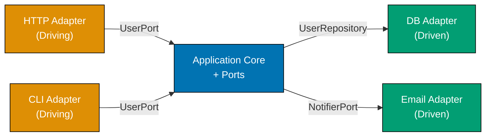
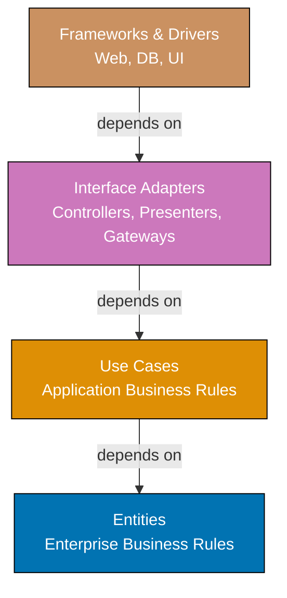
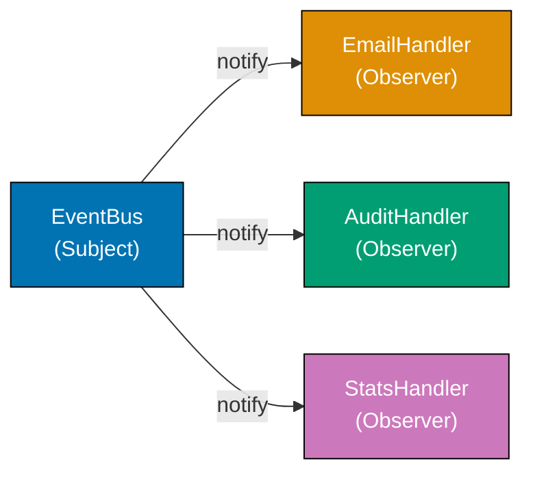
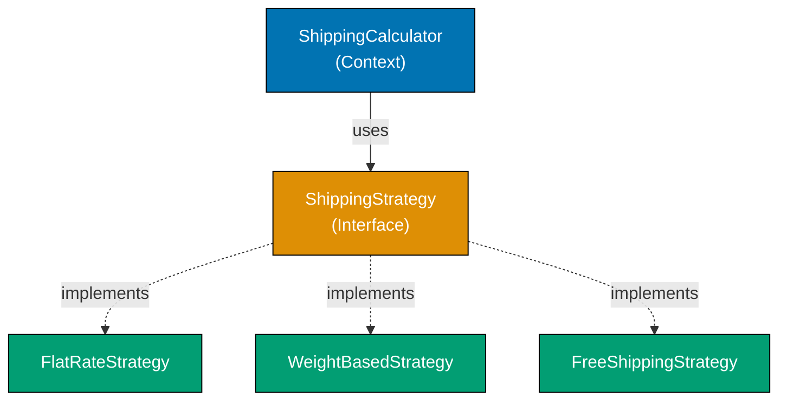
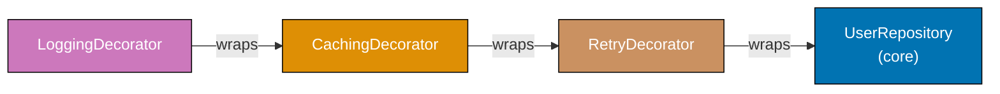
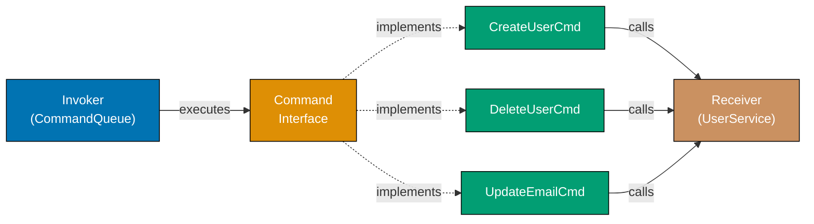
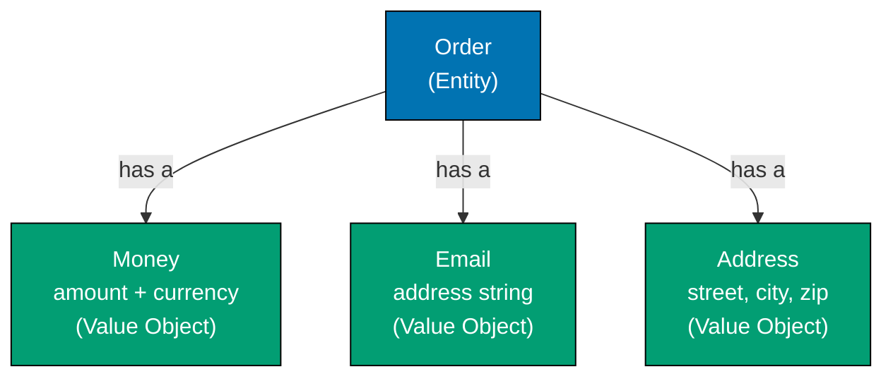
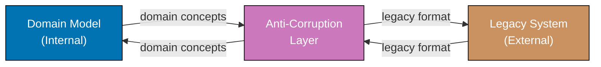
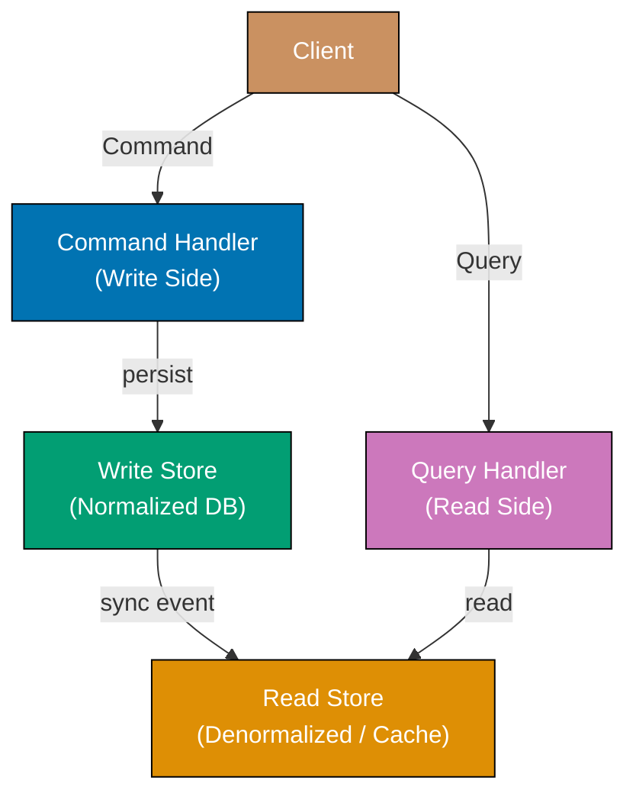
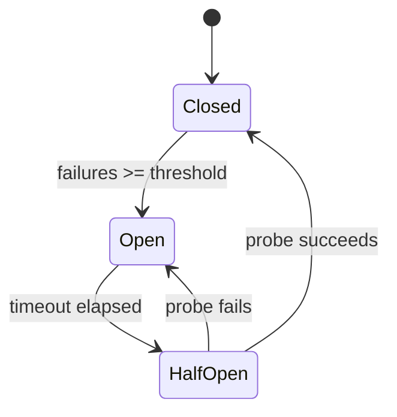

Examples 29-57 cover intermediate software architecture concepts (40-75% coverage). These examples build on foundational patterns and introduce composite architectural styles, enterprise patterns, and domain-driven design building blocks. Each example is self-contained and uses Python or TypeScript.

## Hexagonal Architecture and Clean Architecture

### Example 29: Hexagonal Architecture — Ports and Adapters

Hexagonal architecture (also called Ports and Adapters) separates the application core from external systems by defining explicit ports (interfaces) and adapters (implementations). The application core knows nothing about databases, HTTP, or messaging — it only communicates through port interfaces. This inversion allows you to swap infrastructure without touching business logic.



```python
from abc import ABC, abstractmethod
from dataclasses import dataclass

# => PORT: defines what the application NEEDS from storage
# => The core depends on this abstraction, never on a real DB class
class UserRepository(ABC):
    @abstractmethod
    def save(self, user: "User") -> None: ...  # => persistence contract
    @abstractmethod
    def find_by_id(self, user_id: str) -> "User | None": ...  # => retrieval contract

# => PORT: defines what the application NEEDS from notifications
class NotifierPort(ABC):
    @abstractmethod
    def send_welcome(self, email: str) -> None: ...  # => notification contract

@dataclass
class User:
    id: str          # => domain entity — pure data, no infrastructure knowledge
    email: str       # => entity carries meaning, not DB row details
    name: str        # => owned by the application core

# => APPLICATION SERVICE: orchestrates domain logic using ports only
# => It never imports sqlite3, smtplib, or requests — only port interfaces
class UserService:
    def __init__(self, repo: UserRepository, notifier: NotifierPort) -> None:
        self._repo = repo          # => injected port — could be DB or in-memory
        self._notifier = notifier  # => injected port — could be email or SMS

    def register(self, user_id: str, email: str, name: str) -> User:
        user = User(id=user_id, email=email, name=name)  # => create domain object
        self._repo.save(user)                             # => persist via port
        self._notifier.send_welcome(email)                # => notify via port
        return user                                       # => return domain object, not DTO

# => ADAPTER (driven): concrete implementation of UserRepository port
# => Lives in infrastructure layer — swappable without changing UserService
class InMemoryUserRepository(UserRepository):
    def __init__(self) -> None:
        self._store: dict[str, User] = {}  # => in-memory store for tests/demos

    def save(self, user: User) -> None:
        self._store[user.id] = user   # => stores by ID

    def find_by_id(self, user_id: str) -> User | None:
        return self._store.get(user_id)  # => returns None if not found

# => ADAPTER (driven): concrete implementation of NotifierPort
class ConsoleNotifier(NotifierPort):
    def send_welcome(self, email: str) -> None:
        print(f"Welcome email sent to {email}")  # => simulates email send

# => ADAPTER (driving): CLI adapter calls the application core via UserService
# => Real apps might have an HTTP adapter alongside this CLI adapter
def cli_register(service: UserService, user_id: str, email: str, name: str) -> None:
    user = service.register(user_id, email, name)  # => delegates to core
    print(f"Registered: {user.name}")               # => adapter formats output

# wire up adapters
repo = InMemoryUserRepository()      # => swap to SqlUserRepository in production
notifier = ConsoleNotifier()         # => swap to SmtpNotifier in production
service = UserService(repo, notifier)  # => core receives ports via DI

cli_register(service, "u1", "alice@example.com", "Alice")
# => Output: Welcome email sent to alice@example.com
# => Output: Registered: Alice

found = repo.find_by_id("u1")
print(found.email)  # => Output: alice@example.com
```

**Key Takeaway**: Ports are interfaces owned by the application core; adapters are infrastructure implementations owned by outer layers. This boundary makes the core independently testable and infrastructure-swappable.

**Why It Matters**: Hexagonal architecture is the foundation behind major frameworks like Spring (ports as interfaces, adapters as repositories/controllers) and is used at companies like Netflix for service isolation. Teams that adopt this pattern report 40-60% faster test cycles because the core runs entirely with in-memory adapters — no database, no network, no flakiness. The architecture also makes cloud migration straightforward: swap one adapter, not the entire codebase.

---

### Example 30: Clean Architecture — Layer Separation with Dependency Rule

Clean Architecture organizes code into concentric rings (Entities → Use Cases → Interface Adapters → Frameworks). The dependency rule states that source code dependencies can only point inward — outer rings depend on inner rings, never the reverse. This keeps business rules free of framework and UI concerns.



```typescript
// ENTITIES LAYER — enterprise business rules, no imports from outer layers
// => Entity encapsulates core business rules independent of any framework
class Order {
  constructor(
    public readonly id: string, // => entity identity
    public readonly items: OrderItem[], // => domain data
    public readonly customerId: string, // => relationship by ID, not object reference
  ) {}

  // => business rule lives here, not in the use case or controller
  get total(): number {
    return this.items.reduce((sum, item) => sum + item.price * item.qty, 0);
    // => sum starts at 0, accumulates price * qty for each item
  }
}

interface OrderItem {
  productId: string; // => value by identity, not by object
  price: number; // => snapshot price at order time
  qty: number; // => quantity ordered
}

// USE CASES LAYER — application business rules, depends only on entities
// => Use case interface defines the input/output contract
interface PlaceOrderUseCase {
  execute(customerId: string, items: OrderItem[]): Promise<Order>;
  // => Promise because use cases may coordinate async work
}

// => Repository interface belongs to use cases layer (dependency inversion)
// => Use case defines what it needs; infrastructure provides the implementation
interface OrderRepository {
  save(order: Order): Promise<void>; // => persistence abstraction
}

// => Use case implementation — pure business orchestration, no HTTP/DB code
class PlaceOrderInteractor implements PlaceOrderUseCase {
  constructor(private readonly repo: OrderRepository) {}
  // => repo injected, satisfies dependency inversion

  async execute(customerId: string, items: OrderItem[]): Promise<Order> {
    const id = `ord-${Date.now()}`; // => generate order ID
    const order = new Order(id, items, customerId); // => create entity
    await this.repo.save(order); // => persist via repository port
    return order; // => return entity, not DB row
  }
}

// INTERFACE ADAPTERS LAYER — converts data between use cases and frameworks
// => Controller translates HTTP request into use case input
class OrderController {
  constructor(private readonly useCase: PlaceOrderUseCase) {}
  // => depends on use case interface, not concrete class

  async handleRequest(body: { customerId: string; items: OrderItem[] }): Promise<{ orderId: string; total: number }> {
    const order = await this.useCase.execute(body.customerId, body.items);
    // => invoke use case with domain-shaped input
    return { orderId: order.id, total: order.total };
    // => presenter maps entity to HTTP-shaped output
  }
}

// FRAMEWORKS LAYER — in-memory adapter (stands in for a real DB adapter)
class InMemoryOrderRepo implements OrderRepository {
  private store = new Map<string, Order>(); // => storage detail hidden from use cases

  async save(order: Order): Promise<void> {
    this.store.set(order.id, order); // => concrete persistence
  }
}

// wire layers together (this wiring itself lives in the frameworks layer)
const repo = new InMemoryOrderRepo(); // => outer layer provides implementation
const interactor = new PlaceOrderInteractor(repo); // => use case receives repo
const controller = new OrderController(interactor); // => adapter receives use case

const result = await controller.handleRequest({
  customerId: "c1",
  items: [{ productId: "p1", price: 10, qty: 2 }],
});
console.log(result); // => Output: { orderId: "ord-...", total: 20 }
```

**Key Takeaway**: The dependency rule is the single most important rule in Clean Architecture — outer layers depend on inner layers, never the reverse. Enforce it by ensuring entities and use cases have zero imports from controllers or databases.

**Why It Matters**: Clean Architecture is the architecture behind many long-lived enterprise systems because it preserves the ability to change frameworks and databases independently of business logic. Uncle Bob's research across decades of software projects found that systems that violate the dependency rule accumulate coupling debt exponentially — a minor database change cascades into use case rewrites. Teams adopting Clean Architecture report business logic surviving 2-3 major framework migrations intact.

---

### Example 31: Onion Architecture — Domain at the Center

Onion Architecture is a variant of Clean Architecture where the domain model sits at the very center, surrounded by domain services, then application services, then infrastructure. Unlike layered architecture, every layer depends only on layers closer to the center, and infrastructure is always the outermost layer.

```python
from abc import ABC, abstractmethod
from dataclasses import dataclass, field
from typing import Protocol

# => DOMAIN MODEL (innermost ring) — pure business objects, zero dependencies
@dataclass
class Money:
    amount: float   # => value in currency units
    currency: str   # => ISO 4217 code, e.g., "USD"

    def add(self, other: "Money") -> "Money":
        if self.currency != other.currency:
            raise ValueError("Currency mismatch")   # => domain rule enforced here
        return Money(self.amount + other.amount, self.currency)
        # => returns new Money (immutable pattern)

@dataclass
class Product:
    id: str          # => identity
    name: str        # => display name
    price: Money     # => price is a domain concept, not a float

# => DOMAIN SERVICES (second ring) — stateless operations on domain objects
# => Domain services operate on domain entities; they have no infrastructure calls
class PricingService:
    def apply_discount(self, price: Money, discount_pct: float) -> Money:
        discounted = price.amount * (1 - discount_pct / 100)
        # => computes discounted amount
        return Money(round(discounted, 2), price.currency)
        # => preserves currency, rounds to cents

# => APPLICATION SERVICES (third ring) — orchestrates domain + domain services
# => Depends on domain model and domain services; not on infrastructure
class ProductCatalogService:
    def __init__(self, pricer: PricingService) -> None:
        self._pricer = pricer  # => domain service injected

    def get_discounted_price(self, product: Product, discount_pct: float) -> Money:
        return self._pricer.apply_discount(product.price, discount_pct)
        # => application logic: which domain service to call and when

# => REPOSITORY PORT (third ring, owned by application) — infrastructure contract
# => Defined here so infrastructure depends inward on this interface
class ProductRepository(Protocol):
    def find(self, product_id: str) -> Product | None: ...  # => contract

# => INFRASTRUCTURE (outermost ring) — implements repository port
class InMemoryProductRepository:
    def __init__(self) -> None:
        self._data: dict[str, Product] = {}  # => in-memory store

    def find(self, product_id: str) -> Product | None:
        return self._data.get(product_id)    # => concrete retrieval

    def add(self, product: Product) -> None:
        self._data[product.id] = product     # => concrete persistence

# demo wiring — infrastructure created last, domain created first
repo = InMemoryProductRepository()
repo.add(Product("p1", "Widget", Money(100.0, "USD")))  # => seed data

pricer = PricingService()                     # => domain service, no infra
catalog = ProductCatalogService(pricer)       # => app service

product = repo.find("p1")           # => retrieve from outer ring
discounted = catalog.get_discounted_price(product, 10)
# => applies 10% discount via domain service
print(f"{discounted.currency} {discounted.amount}")  # => Output: USD 90.0
```

**Key Takeaway**: Onion Architecture places the domain model at the center and makes infrastructure an outermost detail, ensuring business logic is the most stable and reusable part of the codebase.

**Why It Matters**: Onion Architecture gained popularity in enterprise .NET and Java communities because it naturally aligns with Domain-Driven Design — the domain model at the center corresponds to the Bounded Context's core. Organizations like Spotify and SoundCloud apply this principle to keep their domain models stable across service rewrites. When infrastructure is outermost, switching from PostgreSQL to DynamoDB touches only the outermost ring, never the pricing or catalog logic.

---

## Event-Driven Architecture

### Example 32: Observer Pattern — Event Notification Without Coupling

The Observer pattern defines a one-to-many dependency so that when one object changes state, all its dependents are notified automatically. This decouples the event source from its handlers — the source doesn't know what handles its events.



```typescript
// => EventBus: subject that holds observers and broadcasts events
// => Observers register themselves; the bus doesn't care what they do
type EventHandler<T> = (event: T) => void;
// => generic handler type: receives event payload, returns void

class EventBus<T> {
  private handlers: EventHandler<T>[] = [];
  // => list grows as handlers subscribe; shrinks on unsubscribe

  subscribe(handler: EventHandler<T>): void {
    this.handlers.push(handler); // => add observer to list
  }

  unsubscribe(handler: EventHandler<T>): void {
    this.handlers = this.handlers.filter((h) => h !== handler);
    // => remove by reference equality; remaining handlers unaffected
  }

  publish(event: T): void {
    for (const handler of this.handlers) {
      handler(event); // => notify each observer in registration order
    }
    // => if one handler throws, subsequent handlers are skipped — consider try/catch in production
  }
}

// => domain event: named, immutable record of what happened
interface UserRegistered {
  userId: string; // => who registered
  email: string; // => where to send welcome
  timestamp: Date; // => when it happened
}

// => OBSERVER 1: sends welcome email
const emailHandler = (event: UserRegistered): void => {
  console.log(`Sending welcome to ${event.email}`);
  // => in production: call email service API here
};

// => OBSERVER 2: writes audit log
const auditHandler = (event: UserRegistered): void => {
  console.log(`Audit: user ${event.userId} registered at ${event.timestamp.toISOString()}`);
  // => in production: write to append-only audit table
};

// => OBSERVER 3: increments stats counter
const statsHandler = (event: UserRegistered): void => {
  console.log(`Stats: new user registered`);
  // => in production: increment Prometheus counter
};

const bus = new EventBus<UserRegistered>(); // => typed bus for UserRegistered events
bus.subscribe(emailHandler); // => register observer 1
bus.subscribe(auditHandler); // => register observer 2
bus.subscribe(statsHandler); // => register observer 3

bus.publish({ userId: "u1", email: "alice@example.com", timestamp: new Date() });
// => Output: Sending welcome to alice@example.com
// => Output: Audit: user u1 registered at 2026-...
// => Output: Stats: new user registered
// => all three handlers fired without the publisher knowing about any of them
```

**Key Takeaway**: The Observer pattern decouples event producers from event consumers — the source publishes events without knowing what handles them, and handlers register without knowing who triggers them.

**Why It Matters**: Observer is the foundation of virtually every UI framework (React's synthetic events, Vue's reactivity, browser DOM events) and server-side event systems (Node.js EventEmitter, Spring ApplicationEventPublisher). At scale, Uber's dispatch system uses observer-style fan-out to notify multiple downstream services when a ride is requested. The pattern trades direct coupling for indirect coupling through an event contract, enabling teams to add handlers independently without coordinating with the event source.

---

### Example 33: Domain Events — Signaling State Changes Within a Bounded Context

Domain Events capture the fact that something meaningful happened in the domain. Unlike technical events, domain events are named in business language and carry enough data for handlers to act without querying back. They enable reactive workflows within and across bounded contexts.

```python
from dataclasses import dataclass, field
from datetime import datetime
from typing import Callable, TypeVar
from abc import ABC

# => DOMAIN EVENT BASE: every event has an occurred_at timestamp
@dataclass
class DomainEvent(ABC):
    occurred_at: datetime = field(default_factory=datetime.utcnow)
    # => set at creation time so events are immutable records of the past

# => DOMAIN EVENTS: past-tense names (OrderPlaced, not PlaceOrder)
@dataclass
class OrderPlaced(DomainEvent):
    order_id: str = ""      # => which order was placed
    customer_id: str = ""   # => who placed it
    total: float = 0.0      # => enough data for handlers without DB lookups

@dataclass
class OrderCancelled(DomainEvent):
    order_id: str = ""      # => which order was cancelled
    reason: str = ""        # => why — useful for analytics and customer comms

# => AGGREGATE: raises domain events as part of state transitions
@dataclass
class Order:
    id: str
    customer_id: str
    total: float
    status: str = "PENDING"                  # => initial state
    _events: list[DomainEvent] = field(default_factory=list, repr=False)
    # => events collected here, NOT yet dispatched

    def place(self) -> None:
        self.status = "PLACED"               # => state change
        self._events.append(OrderPlaced(     # => record event for later dispatch
            order_id=self.id,
            customer_id=self.customer_id,
            total=self.total,
        ))

    def cancel(self, reason: str) -> None:
        if self.status != "PLACED":
            raise ValueError(f"Cannot cancel order in status {self.status}")
            # => business rule enforced before event is raised
        self.status = "CANCELLED"            # => state change
        self._events.append(OrderCancelled(order_id=self.id, reason=reason))

    def pop_events(self) -> list[DomainEvent]:
        events, self._events = self._events, []
        return events  # => caller drains events; aggregate starts fresh

# => EVENT DISPATCHER: collects events from aggregates and notifies handlers
EventHandlerFn = Callable[[DomainEvent], None]

class EventDispatcher:
    def __init__(self) -> None:
        self._handlers: dict[type, list[EventHandlerFn]] = {}
        # => maps event type to list of handlers

    def register(self, event_type: type, handler: EventHandlerFn) -> None:
        self._handlers.setdefault(event_type, []).append(handler)
        # => multiple handlers per event type are supported

    def dispatch(self, events: list[DomainEvent]) -> None:
        for event in events:
            for handler in self._handlers.get(type(event), []):
                handler(event)  # => each handler called with the event

# demo: place then cancel an order
dispatcher = EventDispatcher()
dispatcher.register(OrderPlaced, lambda e: print(f"Email: order {e.order_id} placed, total ${e.total}"))
# => handler 1: send confirmation email
dispatcher.register(OrderCancelled, lambda e: print(f"Refund triggered: {e.order_id}, reason: {e.reason}"))
# => handler 2: trigger refund workflow

order = Order(id="o1", customer_id="c1", total=49.99)
order.place()                     # => state: PENDING → PLACED, event queued
dispatcher.dispatch(order.pop_events())
# => Output: Email: order o1 placed, total $49.99

order.cancel("Customer request")  # => state: PLACED → CANCELLED, event queued
dispatcher.dispatch(order.pop_events())
# => Output: Refund triggered: o1, reason: Customer request
```

**Key Takeaway**: Domain events use past-tense business language, carry sufficient data for handlers, and are raised by aggregates as part of state transitions — not as raw technical notifications.

**Why It Matters**: Domain events are central to CQRS, Event Sourcing, and saga orchestration patterns used by companies like Airbnb and Shopify. By naming events in business language (OrderPlaced, not UpdateOrderStatusEvent), the team's shared vocabulary aligns with the domain model. Handlers for domain events can trigger workflows — emails, refunds, inventory updates — without the aggregate knowing about them, which keeps the domain model focused and independently testable.

---

### Example 34: Event-Driven Architecture — Async Message Passing Between Services

Event-driven architecture connects services through asynchronous messages on a message broker. Producers publish events without waiting for consumers; consumers process events at their own pace. This delivers temporal decoupling and horizontal scalability.

```typescript
// => MESSAGE BROKER SIMULATION: in-memory topic-based pub/sub
// => In production, replace with Kafka, RabbitMQ, or AWS SQS
class MessageBroker {
  private topics = new Map<string, Array<(message: unknown) => Promise<void>>>();
  // => each topic holds a list of consumer callbacks

  subscribe<T>(topic: string, consumer: (message: T) => Promise<void>): void {
    if (!this.topics.has(topic)) this.topics.set(topic, []);
    this.topics.get(topic)!.push(consumer as (message: unknown) => Promise<void>);
    // => consumer registered for this topic
  }

  async publish<T>(topic: string, message: T): Promise<void> {
    const consumers = this.topics.get(topic) ?? [];
    // => get all consumers; empty array if topic has no subscribers
    await Promise.all(consumers.map((consumer) => consumer(message)));
    // => in production, broker delivers asynchronously; here we await for demo
  }
}

// => DOMAIN EVENT: something that happened in the Order service
interface OrderShipped {
  orderId: string; // => which order shipped
  trackingCode: string; // => courier tracking reference
  shippedAt: string; // => ISO timestamp
}

// => PRODUCER SERVICE: publishes events, does not know about consumers
class OrderService {
  constructor(private readonly broker: MessageBroker) {}

  async shipOrder(orderId: string, trackingCode: string): Promise<void> {
    // simulate shipping logic here
    const event: OrderShipped = {
      orderId,
      trackingCode,
      shippedAt: new Date().toISOString(), // => capture shipping time
    };
    await this.broker.publish("order.shipped", event);
    // => publishes to topic — does not call notification or warehouse services directly
    console.log(`Order ${orderId} shipped`);
  }
}

// => CONSUMER 1: notification service — listens independently
class NotificationService {
  async onOrderShipped(event: OrderShipped): Promise<void> {
    console.log(`Notif: send tracking ${event.trackingCode} to customer for order ${event.orderId}`);
    // => in production: call email/SMS provider API
  }
}

// => CONSUMER 2: warehouse service — listens independently
class WarehouseService {
  async onOrderShipped(event: OrderShipped): Promise<void> {
    console.log(`Warehouse: update inventory for order ${event.orderId}`);
    // => in production: decrement stock counts in warehouse DB
  }
}

// wire up
const broker = new MessageBroker(); // => in production: Kafka client
const notifier = new NotificationService();
const warehouse = new WarehouseService();

broker.subscribe<OrderShipped>("order.shipped", (e) => notifier.onOrderShipped(e));
// => notification service subscribes to topic
broker.subscribe<OrderShipped>("order.shipped", (e) => warehouse.onOrderShipped(e));
// => warehouse service subscribes to same topic — independent of notification

const orderService = new OrderService(broker);
await orderService.shipOrder("o1", "TRK-9876");
// => Output: Order o1 shipped
// => Output: Notif: send tracking TRK-9876 to customer for order o1
// => Output: Warehouse: update inventory for order o1
// => both consumers received the event independently
```

**Key Takeaway**: Event-driven architecture decouples producers from consumers through a message broker — the OrderService publishes once, and any number of consumers can independently react without the producer knowing about them.

**Why It Matters**: Event-driven architecture powers high-scale systems at LinkedIn (Kafka), Shopify (Kafka for order processing), and Amazon (SNS/SQS for service coordination). The key benefit over direct service calls is temporal decoupling — the Order service ships an order without waiting for the Notification service to respond. If the Notification service is down, messages queue until it recovers. This fault isolation prevents cascading failures that would occur with synchronous direct calls.

---

## Structural Design Patterns

### Example 35: Strategy Pattern — Swappable Algorithms

The Strategy pattern defines a family of algorithms, encapsulates each one, and makes them interchangeable. The client selects the algorithm at runtime without changing the code that uses it. This eliminates conditional logic that switches between behaviors.



```python
from abc import ABC, abstractmethod
from dataclasses import dataclass

# => STRATEGY INTERFACE: defines the algorithm contract
class ShippingStrategy(ABC):
    @abstractmethod
    def calculate(self, weight_kg: float, distance_km: float) -> float:
        ...  # => every strategy must implement this signature

# => CONCRETE STRATEGY 1: flat rate regardless of weight/distance
class FlatRateStrategy(ShippingStrategy):
    def __init__(self, rate: float) -> None:
        self._rate = rate  # => configurable flat fee

    def calculate(self, weight_kg: float, distance_km: float) -> float:
        return self._rate  # => ignores inputs — always same price
        # => Use when: subscription-based shipping or simple pricing tiers

# => CONCRETE STRATEGY 2: price based on weight
class WeightBasedStrategy(ShippingStrategy):
    def __init__(self, price_per_kg: float) -> None:
        self._price_per_kg = price_per_kg  # => cost per kilogram

    def calculate(self, weight_kg: float, distance_km: float) -> float:
        return weight_kg * self._price_per_kg  # => heavier = more expensive
        # => distance ignored — Use when: local delivery with flat zone pricing

# => CONCRETE STRATEGY 3: free shipping above a threshold (zero cost always here)
class FreeShippingStrategy(ShippingStrategy):
    def calculate(self, weight_kg: float, distance_km: float) -> float:
        return 0.0  # => promotional: customer pays nothing
        # => Use when: orders over threshold or loyalty program members

# => CONTEXT: uses whatever strategy is injected
@dataclass
class ShippingCalculator:
    strategy: ShippingStrategy  # => accepts any ShippingStrategy subclass

    def get_cost(self, weight_kg: float, distance_km: float) -> float:
        return self.strategy.calculate(weight_kg, distance_km)
        # => delegates entirely to strategy — no if/else here

# runtime selection: choose strategy based on business conditions
order_total = 120.0
if order_total >= 100:
    strategy = FreeShippingStrategy()          # => orders over $100 ship free
elif order_total >= 50:
    strategy = FlatRateStrategy(rate=5.0)      # => medium orders: flat $5
else:
    strategy = WeightBasedStrategy(price_per_kg=2.5)  # => small orders: by weight

calculator = ShippingCalculator(strategy=strategy)
cost = calculator.get_cost(weight_kg=2.0, distance_km=50.0)
print(f"Shipping cost: ${cost:.2f}")  # => Output: Shipping cost: $0.00 (free shipping applied)

# swap strategy at runtime — context code unchanged
calculator.strategy = WeightBasedStrategy(price_per_kg=2.5)
cost = calculator.get_cost(weight_kg=2.0, distance_km=50.0)
print(f"Weight-based cost: ${cost:.2f}")  # => Output: Weight-based cost: $5.00
```

**Key Takeaway**: The Strategy pattern replaces conditional logic (if/elif/switch on algorithm type) with polymorphism — each algorithm lives in its own class and is selected by the client at runtime.

**Why It Matters**: Strategy is one of the most-applied GoF patterns in enterprise systems. Payment processors (Stripe, PayPal, bank transfer), shipping calculators, tax engines, and sorting algorithms all benefit from strategy isolation. Without it, a single class accumulates every algorithm variant behind if/else chains that grow unmaintainably and require retesting every variant when adding one new strategy. Amazon's fulfillment routing reportedly uses strategy-like patterns to select between same-day, standard, and freight carriers without changing the order processing core.

---

### Example 36: Factory Pattern — Centralized Object Creation

The Factory pattern centralizes object creation logic, hiding which concrete class is instantiated from the caller. The caller specifies what it wants (by type, key, or configuration), and the factory decides how to build it. This decouples creation from use.

```typescript
// => PRODUCT INTERFACE: what all created objects share
interface PaymentProcessor {
  process(amount: number): string; // => returns transaction ID
  name: string; // => processor name for logging
}

// => CONCRETE PRODUCTS: different payment implementations
class StripeProcessor implements PaymentProcessor {
  readonly name = "Stripe";

  process(amount: number): string {
    // => in production: call Stripe SDK here
    const txId = `stripe_${Date.now()}`; // => simulated transaction ID
    console.log(`Stripe: charged $${amount}, tx=${txId}`);
    return txId; // => return transaction reference
  }
}

class PayPalProcessor implements PaymentProcessor {
  readonly name = "PayPal";

  process(amount: number): string {
    const txId = `pp_${Date.now()}`; // => simulated PayPal transaction ID
    console.log(`PayPal: charged $${amount}, tx=${txId}`);
    return txId;
  }
}

class BankTransferProcessor implements PaymentProcessor {
  readonly name = "BankTransfer";

  process(amount: number): string {
    const txId = `bt_${Date.now()}`; // => simulated bank reference
    console.log(`BankTransfer: initiated $${amount}, ref=${txId}`);
    return txId;
  }
}

// => FACTORY: knows how to create payment processors
// => Caller never calls new StripeProcessor() directly — factory owns creation
class PaymentProcessorFactory {
  private static readonly registry: Record<string, () => PaymentProcessor> = {
    stripe: () => new StripeProcessor(), // => factory function per type
    paypal: () => new PayPalProcessor(), // => factory function
    bank_transfer: () => new BankTransferProcessor(), // => factory function
  };
  // => registry pattern: add new processors by adding entries, not if/else

  static create(type: string): PaymentProcessor {
    const factory = this.registry[type];
    if (!factory) {
      throw new Error(`Unknown payment processor: ${type}`);
      // => fail early with useful error rather than returning null
    }
    return factory(); // => invoke factory function, return new instance
  }
}

// caller uses the factory — decoupled from concrete classes
const processorType = "stripe"; // => in practice: from config or request
const processor = PaymentProcessorFactory.create(processorType);
// => caller doesn't import StripeProcessor at all

const txId = processor.process(99.99);
// => Output: Stripe: charged $99.99, tx=stripe_...

// adding a new processor requires only: add to registry + new class
// => no changes to checkout flow or any caller code
```

**Key Takeaway**: The Factory pattern centralizes object creation using a registry or conditional logic, so callers depend only on the product interface and never on concrete classes — adding a new product requires only updating the factory.

**Why It Matters**: Factories are ubiquitous in enterprise Java (BeanFactory, ObjectMapper), Python (logging handlers), and Node.js ecosystems. Payment systems at Shopify and Stripe use factory-like patterns to instantiate the correct payment gateway implementation at runtime based on merchant configuration. Without a factory, every checkout page would need to import and instantiate each gateway class directly, creating tight coupling that makes adding a new payment method a cross-cutting change across dozens of files.

---

### Example 37: Builder Pattern — Constructing Complex Objects Step by Step

The Builder pattern separates the construction of a complex object from its representation, allowing the same construction process to create different representations. It eliminates telescoping constructors and makes object creation readable when many optional parameters exist.

```python
from dataclasses import dataclass, field
from typing import Optional

# => PRODUCT: complex object with many optional fields
@dataclass
class HttpRequest:
    url: str                                   # => required: endpoint URL
    method: str = "GET"                        # => default method
    headers: dict[str, str] = field(default_factory=dict)  # => optional headers
    body: Optional[str] = None                 # => optional request body
    timeout_seconds: float = 30.0              # => default timeout
    retries: int = 0                           # => default: no retries
    auth_token: Optional[str] = None           # => optional auth

# => BUILDER: accumulates configuration, returns product via build()
class HttpRequestBuilder:
    def __init__(self, url: str) -> None:
        self._url = url              # => URL is mandatory — required in constructor
        self._method = "GET"         # => default values mirrored from product
        self._headers: dict[str, str] = {}
        self._body: Optional[str] = None
        self._timeout = 30.0
        self._retries = 0
        self._auth_token: Optional[str] = None

    def method(self, method: str) -> "HttpRequestBuilder":
        self._method = method.upper()   # => normalize to uppercase
        return self                     # => return self enables method chaining

    def header(self, key: str, value: str) -> "HttpRequestBuilder":
        self._headers[key] = value   # => add individual header
        return self                  # => fluent interface

    def json_body(self, body: str) -> "HttpRequestBuilder":
        self._body = body
        self._headers["Content-Type"] = "application/json"  # => auto-set content type
        return self

    def timeout(self, seconds: float) -> "HttpRequestBuilder":
        if seconds <= 0:
            raise ValueError("Timeout must be positive")  # => validate during build
        self._timeout = seconds
        return self

    def with_retries(self, count: int) -> "HttpRequestBuilder":
        self._retries = count  # => retry count for transient failures
        return self

    def bearer_token(self, token: str) -> "HttpRequestBuilder":
        self._auth_token = token
        self._headers["Authorization"] = f"Bearer {token}"  # => set auth header
        return self

    def build(self) -> HttpRequest:
        return HttpRequest(            # => construct the final product
            url=self._url,
            method=self._method,
            headers=self._headers,
            body=self._body,
            timeout_seconds=self._timeout,
            retries=self._retries,
            auth_token=self._auth_token,
        )
        # => build() is the only place HttpRequest is constructed

# COMPARISON: telescoping constructor (bad) vs builder (good)
# BAD: HttpRequest("https://api.example.com/users", "POST", {"Content-Type": "application/json"}, '{"name":"Alice"}', 10.0, 3, "tok123")
# => positional args — impossible to read without checking constructor signature

# GOOD: builder reads like a sentence
request = (
    HttpRequestBuilder("https://api.example.com/users")
    .method("POST")              # => self-documenting
    .json_body('{"name":"Alice"}')  # => auto-sets Content-Type
    .timeout(10.0)               # => named parameter, clear intent
    .with_retries(3)             # => retry on transient failure
    .bearer_token("tok123")      # => auth token
    .build()                     # => produce immutable HttpRequest
)
print(request.method)   # => Output: POST
print(request.headers)  # => Output: {'Content-Type': 'application/json', 'Authorization': 'Bearer tok123'}
print(request.timeout_seconds)  # => Output: 10.0
print(request.retries)          # => Output: 3
```

**Key Takeaway**: The Builder pattern makes complex object construction readable by providing a fluent API where each method name describes what it sets — far more maintainable than constructors with many positional parameters.

**Why It Matters**: The Builder pattern appears in almost every major library: Java's StringBuilder, Python's SQLAlchemy query builder, Kotlin's DSL builders, and Elasticsearch's QueryBuilder. It solves the "telescoping constructor" anti-pattern where objects with 8+ optional fields require 2^8 constructor overloads or a single unreadable constructor. At Dropbox, protocol buffer builders in Python and Java use this pattern for configuring complex API requests with dozens of optional fields, making the code self-documenting and less error-prone than positional arguments.

---

### Example 38: Adapter Pattern — Bridging Incompatible Interfaces

The Adapter pattern converts the interface of a class into another interface that clients expect. It lets classes work together that could not otherwise because of incompatible interfaces. The adapter wraps the incompatible class and translates calls.

```typescript
// => EXISTING EXTERNAL LIBRARY: third-party analytics SDK with its own interface
// => We cannot change this class — it comes from a package
class LegacyAnalyticsSDK {
  trackPageView(pageName: string, userId: number, platform: string): void {
    console.log(`Legacy: page=${pageName}, user=${userId}, platform=${platform}`);
    // => legacy SDK uses positional args in its own naming convention
  }

  trackEvent(eventName: string, eventData: string): void {
    console.log(`Legacy: event=${eventName}, data=${eventData}`);
    // => eventData as stringified JSON — legacy format
  }
}

// => OUR APPLICATION'S ANALYTICS PORT: the interface our code expects
// => Clean, typed, modern interface aligned with our domain language
interface AnalyticsPort {
  recordPageView(page: string, user: { id: string; name: string }): void;
  // => our interface uses string IDs and a user object
  recordEvent(event: { name: string; properties: Record<string, unknown> }): void;
  // => our interface accepts a typed properties object, not stringified JSON
}

// => ADAPTER: wraps the legacy SDK, exposes our AnalyticsPort interface
class LegacyAnalyticsAdapter implements AnalyticsPort {
  constructor(private readonly sdk: LegacyAnalyticsSDK) {}
  // => adapter holds a reference to the adaptee (legacy SDK)

  recordPageView(page: string, user: { id: string; name: string }): void {
    const numericUserId = parseInt(user.id, 10);
    // => TRANSLATE: our string ID → legacy numeric ID
    this.sdk.trackPageView(page, numericUserId, "web");
    // => DELEGATE: call legacy SDK with translated args
    // => our callers never know about the legacy integer ID format
  }

  recordEvent(event: { name: string; properties: Record<string, unknown> }): void {
    const legacyData = JSON.stringify(event.properties);
    // => TRANSLATE: our typed object → legacy stringified JSON
    this.sdk.trackEvent(event.name, legacyData);
    // => DELEGATE: call legacy SDK with translated format
  }
}

// => CLIENT CODE: depends only on AnalyticsPort — knows nothing of legacy SDK
function trackCheckout(analytics: AnalyticsPort, userId: string, total: number): void {
  analytics.recordPageView("/checkout", { id: userId, name: "Alice" });
  // => calls our clean interface
  analytics.recordEvent({ name: "checkout_completed", properties: { total, currency: "USD" } });
  // => calls our clean interface with typed properties
}

// wire up: inject adapter into client code
const legacySDK = new LegacyAnalyticsSDK(); // => the incompatible adaptee
const adapter = new LegacyAnalyticsAdapter(legacySDK); // => adapter bridges the gap
trackCheckout(adapter, "42", 99.99);
// => Output: Legacy: page=/checkout, user=42, platform=web
// => Output: Legacy: event=checkout_completed, data={"total":99.99,"currency":"USD"}
// => client code used clean interface; adapter handled translation silently
```

**Key Takeaway**: The Adapter wraps an incompatible class and translates its interface to match what callers expect — callers depend on the adapter's interface, never on the adaptee's interface.

**Why It Matters**: Adapters are essential when integrating third-party services, migrating legacy systems, or wrapping external APIs. Stripe's client libraries act as adapters between the raw HTTP API and typed language interfaces. In large organizations, adapters allow teams to swap analytics providers (Google Analytics → Amplitude → Mixpanel) by writing a new adapter without touching any client code. The pattern also prevents third-party API changes from propagating across the codebase — only the adapter file changes.

---

### Example 39: Decorator Pattern — Adding Behavior Without Subclassing

The Decorator pattern attaches additional responsibilities to an object dynamically. Decorators provide a flexible alternative to subclassing for extending functionality. Each decorator wraps a component and adds behavior before or after delegating to it.



```python
from abc import ABC, abstractmethod
from typing import Optional
import time

# => COMPONENT INTERFACE: what all decorators and the core implement
class UserRepository(ABC):
    @abstractmethod
    def find_by_id(self, user_id: str) -> Optional[dict]:
        ...  # => base operation to be decorated

# => CONCRETE COMPONENT: the real implementation being decorated
class DatabaseUserRepository(UserRepository):
    def find_by_id(self, user_id: str) -> Optional[dict]:
        time.sleep(0.01)  # => simulate DB query latency
        if user_id == "u1":
            return {"id": "u1", "name": "Alice"}  # => found
        return None  # => not found

# => DECORATOR BASE: implements same interface, wraps a component
class UserRepositoryDecorator(UserRepository):
    def __init__(self, wrapped: UserRepository) -> None:
        self._wrapped = wrapped  # => the component being decorated

    def find_by_id(self, user_id: str) -> Optional[dict]:
        return self._wrapped.find_by_id(user_id)
        # => default: delegate to wrapped component unchanged

# => DECORATOR 1: adds logging around every call
class LoggingDecorator(UserRepositoryDecorator):
    def find_by_id(self, user_id: str) -> Optional[dict]:
        print(f"[LOG] find_by_id called with user_id={user_id}")
        result = self._wrapped.find_by_id(user_id)  # => delegate to next layer
        print(f"[LOG] find_by_id returned: {result}")
        return result  # => return result unchanged

# => DECORATOR 2: adds in-memory caching
class CachingDecorator(UserRepositoryDecorator):
    def __init__(self, wrapped: UserRepository) -> None:
        super().__init__(wrapped)
        self._cache: dict[str, Optional[dict]] = {}  # => simple dict cache

    def find_by_id(self, user_id: str) -> Optional[dict]:
        if user_id in self._cache:
            print(f"[CACHE] hit for {user_id}")
            return self._cache[user_id]    # => serve from cache, skip DB call
        result = self._wrapped.find_by_id(user_id)  # => cache miss: delegate
        self._cache[user_id] = result      # => store result in cache
        return result

# => DECORATOR 3: adds retry on failure (simplified for demo)
class RetryDecorator(UserRepositoryDecorator):
    def __init__(self, wrapped: UserRepository, max_retries: int = 3) -> None:
        super().__init__(wrapped)
        self._max_retries = max_retries

    def find_by_id(self, user_id: str) -> Optional[dict]:
        for attempt in range(self._max_retries):
            try:
                return self._wrapped.find_by_id(user_id)  # => try operation
            except Exception as e:
                if attempt == self._max_retries - 1:
                    raise  # => last attempt: re-raise exception
                print(f"[RETRY] attempt {attempt + 1} failed: {e}")
        return None  # => unreachable, satisfies type checker

# compose decorators: LoggingDecorator → CachingDecorator → RetryDecorator → DB
db_repo = DatabaseUserRepository()            # => innermost: real DB
retry_repo = RetryDecorator(db_repo)          # => wrap with retry
caching_repo = CachingDecorator(retry_repo)   # => wrap with caching
logging_repo = LoggingDecorator(caching_repo) # => wrap with logging

logging_repo.find_by_id("u1")
# => Output: [LOG] find_by_id called with user_id=u1
# => Output: [LOG] find_by_id returned: {'id': 'u1', 'name': 'Alice'}

logging_repo.find_by_id("u1")  # => second call — cache hit
# => Output: [LOG] find_by_id called with user_id=u1
# => Output: [CACHE] hit for u1
# => Output: [LOG] find_by_id returned: {'id': 'u1', 'name': 'Alice'}
# => DB was NOT called on second request (cache served it)
```

**Key Takeaway**: Decorators stack behaviors (logging, caching, retry) around a core component without modifying it — each decorator adds one concern and composes cleanly with others.

**Why It Matters**: Python's `@functools.lru_cache`, Java's Spring AOP (transaction, caching, security annotations), and gRPC interceptors all use the Decorator pattern. It addresses the cross-cutting concern problem: behaviors like logging and caching apply across many operations but belong in neither the domain model nor infrastructure. Netflix applies decorator-style patterns (Hystrix circuit breakers, Ribbon retry) around every service call. Adding a new cross-cutting concern requires writing one new decorator class — zero changes to existing decorators or the core component.

---

### Example 40: Facade Pattern — Simplified Interface to a Subsystem

The Facade pattern provides a unified, simplified interface to a complex subsystem. The facade hides the complexity of coordinating multiple components and gives callers a single entry point. It does not add new behavior — it orchestrates existing behavior with a cleaner API.

```typescript
// => SUBSYSTEM CLASSES: each handles one part of order processing
// => These classes have their own complex APIs and dependencies
class InventoryService {
  reserve(productId: string, qty: number): boolean {
    console.log(`Inventory: reserved ${qty}x ${productId}`);
    return true; // => simulated: always succeeds for demo
    // => in production: checks stock levels, applies reservations
  }

  release(productId: string, qty: number): void {
    console.log(`Inventory: released ${qty}x ${productId}`);
    // => in production: undoes reservation on order failure
  }
}

class PaymentGateway {
  charge(customerId: string, amount: number): string {
    const authCode = `AUTH-${Date.now()}`; // => simulated authorization code
    console.log(`Payment: charged customer ${customerId} $${amount}, auth=${authCode}`);
    return authCode; // => authorization code for records
  }

  refund(authCode: string): void {
    console.log(`Payment: refunded auth ${authCode}`);
    // => in production: reverse the charge via payment provider API
  }
}

class ShippingService {
  scheduleDelivery(orderId: string, address: string): string {
    const trackingId = `TRK-${orderId}`; // => simulated tracking ID
    console.log(`Shipping: scheduled delivery for order ${orderId} to ${address}, tracking=${trackingId}`);
    return trackingId; // => tracking reference for customer
  }
}

class NotificationService {
  sendConfirmation(email: string, orderId: string, trackingId: string): void {
    console.log(`Notification: sent order confirmation to ${email}, order=${orderId}, tracking=${trackingId}`);
    // => in production: sends email or push notification
  }
}

// => FACADE: single entry point that orchestrates the subsystem
// => Callers call one method; facade coordinates four services internally
class OrderFacade {
  constructor(
    private readonly inventory: InventoryService, // => subsystem dependency
    private readonly payment: PaymentGateway, // => subsystem dependency
    private readonly shipping: ShippingService, // => subsystem dependency
    private readonly notification: NotificationService, // => subsystem dependency
  ) {}

  placeOrder(order: {
    orderId: string;
    customerId: string;
    customerEmail: string;
    productId: string;
    qty: number;
    amount: number;
    shippingAddress: string;
  }): { success: boolean; trackingId?: string } {
    // => step 1: reserve inventory first (fail fast if out of stock)
    const reserved = this.inventory.reserve(order.productId, order.qty);
    if (!reserved) {
      return { success: false }; // => early return — no payment charged
    }

    // => step 2: charge payment
    const authCode = this.payment.charge(order.customerId, order.amount);

    // => step 3: schedule delivery
    const trackingId = this.shipping.scheduleDelivery(order.orderId, order.shippingAddress);

    // => step 4: notify customer
    this.notification.sendConfirmation(order.customerEmail, order.orderId, trackingId);

    return { success: true, trackingId };
    // => caller receives simple result; all subsystem coordination hidden
  }
}

// CALLER: uses only the facade — never touches subsystem classes directly
const facade = new OrderFacade(
  new InventoryService(),
  new PaymentGateway(),
  new ShippingService(),
  new NotificationService(),
);

const result = facade.placeOrder({
  orderId: "o1",
  customerId: "c1",
  customerEmail: "alice@example.com",
  productId: "p1",
  qty: 2,
  amount: 49.99,
  shippingAddress: "123 Main St",
});
// => Output: Inventory: reserved 2x p1
// => Output: Payment: charged customer c1 $49.99, auth=AUTH-...
// => Output: Shipping: scheduled delivery for order o1 to 123 Main St, tracking=TRK-o1
// => Output: Notification: sent order confirmation to alice@example.com, order=o1, tracking=TRK-o1
console.log(result); // => Output: { success: true, trackingId: 'TRK-o1' }
```

**Key Takeaway**: The Facade pattern gives callers a single, simplified method that hides the coordination complexity of multiple subsystem components — callers depend on the facade interface, not on the individual subsystem classes.

**Why It Matters**: Facades are the architecture of every SDK and client library — the AWS SDK facade hides dozens of HTTP calls, retry logic, and credential management behind simple method calls. In microservices, API Gateways act as facades that route, aggregate, and transform calls across multiple backend services. Teams that adopt facade patterns for complex workflows report reduced onboarding friction: new developers call `orderFacade.placeOrder()` without needing to understand inventory reservation, payment retry logic, and shipping provider APIs simultaneously.

---

## Behavioral Patterns

### Example 41: Command Pattern — Encapsulate Actions as Objects

The Command pattern encapsulates a request as an object, allowing you to parameterize clients with different requests, queue or log requests, and support undoable operations. Each command knows how to execute itself and optionally how to undo itself.



```python
from abc import ABC, abstractmethod
from dataclasses import dataclass, field
from typing import Optional

# => RECEIVER: the object that actually performs the work
class UserStore:
    def __init__(self) -> None:
        self._users: dict[str, dict] = {}  # => simple in-memory store

    def create(self, user_id: str, email: str) -> None:
        self._users[user_id] = {"email": email}  # => add user
        print(f"Created user {user_id} with email {email}")

    def delete(self, user_id: str) -> Optional[dict]:
        user = self._users.pop(user_id, None)  # => remove and return for undo
        if user:
            print(f"Deleted user {user_id}")
        return user  # => return deleted data so undo can restore it

    def update_email(self, user_id: str, new_email: str) -> Optional[str]:
        if user_id not in self._users:
            return None  # => user not found
        old_email = self._users[user_id]["email"]  # => save for undo
        self._users[user_id]["email"] = new_email  # => perform update
        print(f"Updated {user_id} email to {new_email}")
        return old_email  # => return old value so undo can restore it

    def all(self) -> dict:
        return dict(self._users)  # => snapshot of current state

# => COMMAND INTERFACE: every command implements execute and undo
class Command(ABC):
    @abstractmethod
    def execute(self) -> None: ...  # => perform the action

    @abstractmethod
    def undo(self) -> None: ...  # => reverse the action

# => CONCRETE COMMAND 1: create a user
@dataclass
class CreateUserCommand(Command):
    store: UserStore   # => receiver
    user_id: str       # => command parameters captured at construction
    email: str         # => not passed at execute() time

    def execute(self) -> None:
        self.store.create(self.user_id, self.email)  # => delegate to receiver

    def undo(self) -> None:
        self.store.delete(self.user_id)  # => reverse: delete the created user
        print(f"Undo: removed user {self.user_id}")

# => CONCRETE COMMAND 2: update user email
@dataclass
class UpdateEmailCommand(Command):
    store: UserStore
    user_id: str
    new_email: str
    _old_email: Optional[str] = field(default=None, init=False, repr=False)
    # => captured during execute() for undo support

    def execute(self) -> None:
        self._old_email = self.store.update_email(self.user_id, self.new_email)
        # => save old email so undo can restore it

    def undo(self) -> None:
        if self._old_email is not None:
            self.store.update_email(self.user_id, self._old_email)
            # => restore previous email
            print(f"Undo: restored email to {self._old_email}")

# => INVOKER: queues commands and supports undo history
class CommandQueue:
    def __init__(self) -> None:
        self._history: list[Command] = []  # => executed commands for undo

    def execute(self, command: Command) -> None:
        command.execute()             # => execute the command
        self._history.append(command) # => record for potential undo

    def undo_last(self) -> None:
        if self._history:
            command = self._history.pop()  # => take most recent command
            command.undo()                  # => reverse it

store = UserStore()
queue = CommandQueue()

queue.execute(CreateUserCommand(store, "u1", "alice@example.com"))
# => Output: Created user u1 with email alice@example.com
queue.execute(UpdateEmailCommand(store, "u1", "newalice@example.com"))
# => Output: Updated u1 email to newalice@example.com
print(store.all())  # => Output: {'u1': {'email': 'newalice@example.com'}}

queue.undo_last()   # => undo UpdateEmail
# => Output: Updated u1 email to alice@example.com
# => Output: Undo: restored email to alice@example.com
print(store.all())  # => Output: {'u1': {'email': 'alice@example.com'}}
```

**Key Takeaway**: The Command pattern encapsulates an action and its parameters as an object — this object can be stored in a queue, logged, replicated, or reversed, enabling features like undo/redo, job queues, and audit trails.

**Why It Matters**: The Command pattern powers undo/redo in every text editor (VS Code, Google Docs), task queues (Celery, Bull), and transactional outbox patterns. Git itself is fundamentally a command log — every commit is an immutable command that can be replayed or reverted. In financial systems, commands serve as audit trails where every action (CreateTransaction, UpdateBalance) is stored as an immutable record. Teams that implement command-sourced audit logs report near-zero effort for compliance reporting.

---

### Example 42: Mediator Pattern — Centralized Component Coordination

The Mediator pattern defines an object that encapsulates how a set of objects interact. It promotes loose coupling by keeping objects from referring to each other explicitly and allows you to vary their interaction independently. The mediator becomes the hub; components become spokes.

```python
from abc import ABC, abstractmethod
from typing import TYPE_CHECKING

if TYPE_CHECKING:
    pass  # => prevents circular imports in type annotations

# => MEDIATOR INTERFACE: defines how components talk to the mediator
class Mediator(ABC):
    @abstractmethod
    def notify(self, sender: "Component", event: str, data: object = None) -> None:
        ...  # => components call this instead of calling each other

# => BASE COMPONENT: knows its mediator, uses it to communicate
class Component:
    def __init__(self, name: str) -> None:
        self._name = name
        self._mediator: Mediator | None = None  # => set by mediator after construction

    def set_mediator(self, mediator: Mediator) -> None:
        self._mediator = mediator  # => wired by the mediator itself

    def emit(self, event: str, data: object = None) -> None:
        if self._mediator:
            self._mediator.notify(self, event, data)
            # => sends event to mediator; mediator decides who else hears it

# => CONCRETE COMPONENTS: they talk to the mediator, not to each other
class SearchBox(Component):
    def search(self, query: str) -> None:
        print(f"SearchBox: searching for '{query}'")
        self.emit("search_submitted", query)
        # => notifies mediator; does NOT call ResultsList directly

class ResultsList(Component):
    def display(self, results: list[str]) -> None:
        print(f"ResultsList: displaying {len(results)} results: {results}")
        self.emit("results_displayed", results)

class StatusBar(Component):
    def update(self, message: str) -> None:
        print(f"StatusBar: {message}")

class LoadingSpinner(Component):
    def show(self) -> None:
        print("Spinner: showing")
        self.emit("spinner_shown")

    def hide(self) -> None:
        print("Spinner: hidden")

# => CONCRETE MEDIATOR: knows all components and orchestrates their interactions
class SearchPageMediator(Mediator):
    def __init__(self) -> None:
        # => create all components and wire mediator into each
        self.search_box = SearchBox("search_box")
        self.results = ResultsList("results")
        self.status = StatusBar("status")
        self.spinner = LoadingSpinner("spinner")

        # => inject self as mediator into each component
        for comp in [self.search_box, self.results, self.status, self.spinner]:
            comp.set_mediator(self)

    def notify(self, sender: Component, event: str, data: object = None) -> None:
        # => mediator contains ALL coordination logic here
        if event == "search_submitted":
            self.spinner.show()           # => start spinner when search fires
            self.status.update(f"Searching for '{data}'...")
            fake_results = [f"Result for {data} #{i}" for i in range(3)]
            # => simulated search results
            self.results.display(fake_results)  # => display results
            self.spinner.hide()           # => stop spinner when done
            self.status.update(f"Found {len(fake_results)} results for '{data}'")

# demo: triggering one component cascades through the mediator
mediator = SearchPageMediator()
mediator.search_box.search("architecture patterns")
# => Output: SearchBox: searching for 'architecture patterns'
# => Output: Spinner: showing
# => Output: StatusBar: Searching for 'architecture patterns'...
# => Output: ResultsList: displaying 3 results: [...]
# => Output: Spinner: hidden
# => Output: StatusBar: Found 3 results for 'architecture patterns'
# => SearchBox never called ResultsList or Spinner directly
```

**Key Takeaway**: The Mediator centralizes all coordination logic — components emit events and receive instructions only through the mediator, preventing the web of direct cross-references that emerges when N components communicate peer-to-peer.

**Why It Matters**: Without a mediator, N components communicating directly create O(N²) coupling — every new component must know about every existing component. The Mediator reduces this to O(N): each component knows only the mediator. UI frameworks (React's event bubbling, Vue's event bus), air traffic control systems, and chat servers all use mediator-style coordination. Discord's server architecture uses mediators to coordinate between channels, users, and voice sessions without direct component coupling.

---

### Example 43: State Pattern — Objects That Change Behavior Based on State

The State pattern allows an object to change its behavior when its internal state changes. The object will appear to change its class. Instead of using if/elif chains to check state, each state is a class that implements the behavior for that state.

```typescript
// => STATE INTERFACE: defines behavior for every possible order state
interface OrderState {
  pay(): void; // => attempt to pay
  ship(): void; // => attempt to ship
  cancel(): void; // => attempt to cancel
  getStatus(): string; // => current status name
}

// => CONTEXT: the Order that delegates behavior to its current state
class OrderContext {
  private state: OrderState; // => current state — changes over lifecycle

  constructor() {
    this.state = new PendingState(this); // => always starts as Pending
    console.log(`Order created in state: ${this.state.getStatus()}`);
  }

  // => state transition: called by state objects, not by external callers
  transitionTo(state: OrderState): void {
    console.log(`  State: ${this.state.getStatus()} → ${state.getStatus()}`);
    this.state = state; // => replace current state with new state
  }

  // => delegate all behavior to current state
  pay(): void {
    this.state.pay();
  } // => behavior depends on current state
  ship(): void {
    this.state.ship();
  } // => behavior depends on current state
  cancel(): void {
    this.state.cancel();
  } // => behavior depends on current state
  status(): string {
    return this.state.getStatus();
  }
}

// => CONCRETE STATE: Pending — awaiting payment
class PendingState implements OrderState {
  constructor(private readonly order: OrderContext) {}

  pay(): void {
    console.log("Payment received");
    this.order.transitionTo(new PaidState(this.order));
    // => valid transition: Pending → Paid
  }

  ship(): void {
    console.log("Cannot ship: order not paid yet");
  }
  // => invalid in this state — no transition

  cancel(): void {
    console.log("Order cancelled before payment");
    this.order.transitionTo(new CancelledState(this.order));
    // => valid transition: Pending → Cancelled
  }

  getStatus(): string {
    return "PENDING";
  }
}

// => CONCRETE STATE: Paid — payment received, awaiting shipment
class PaidState implements OrderState {
  constructor(private readonly order: OrderContext) {}

  pay(): void {
    console.log("Already paid");
  }
  // => invalid: cannot pay twice

  ship(): void {
    console.log("Order shipped");
    this.order.transitionTo(new ShippedState(this.order));
    // => valid transition: Paid → Shipped
  }

  cancel(): void {
    console.log("Order cancelled, refund issued");
    this.order.transitionTo(new CancelledState(this.order));
    // => valid: refund required when cancelling after payment
  }

  getStatus(): string {
    return "PAID";
  }
}

// => CONCRETE STATE: Shipped — in transit, cannot cancel
class ShippedState implements OrderState {
  constructor(private readonly order: OrderContext) {}

  pay(): void {
    console.log("Already paid");
  }
  ship(): void {
    console.log("Already shipped");
  }
  cancel(): void {
    console.log("Cannot cancel: already shipped");
  }
  // => shipped orders cannot transition backwards

  getStatus(): string {
    return "SHIPPED";
  }
}

// => CONCRETE STATE: Cancelled — terminal state, no transitions allowed
class CancelledState implements OrderState {
  constructor(private readonly order: OrderContext) {}

  pay(): void {
    console.log("Cannot pay: order cancelled");
  }
  ship(): void {
    console.log("Cannot ship: order cancelled");
  }
  cancel(): void {
    console.log("Already cancelled");
  }

  getStatus(): string {
    return "CANCELLED";
  }
}

// demo: valid lifecycle
const order = new OrderContext(); // => State: PENDING
order.ship(); // => Output: Cannot ship: order not paid yet
order.pay(); // => Output: Payment received; State: PENDING → PAID
order.ship(); // => Output: Order shipped; State: PAID → SHIPPED
order.cancel(); // => Output: Cannot cancel: already shipped
console.log(order.status()); // => Output: SHIPPED
```

**Key Takeaway**: The State pattern eliminates complex if/elif chains on state variables by giving each state its own class that implements the valid behaviors for that state — invalid transitions are handled within each state class, not scattered across conditional logic.

**Why It Matters**: Order lifecycle management, traffic lights, connection state machines, and CI/CD pipeline stages all require state-dependent behavior. Without the State pattern, every new state requires modifying every method that checks state — a classic open/closed principle violation. Shopify's order management system handles tens of state transitions (unfulfilled, partially fulfilled, fulfilled, refunded); State pattern keeps each transition's logic isolated and independently testable. State machines formalized this way also map directly to UML state diagrams for documentation.

---

### Example 44: Template Method — Define Algorithm Skeleton, Defer Steps to Subclasses

The Template Method pattern defines the skeleton of an algorithm in a base class, deferring some steps to subclasses. Subclasses can override specific steps without changing the algorithm's overall structure. This enforces a consistent process while allowing customization of individual steps.

```python
from abc import ABC, abstractmethod
import hashlib

# => ABSTRACT CLASS: defines the algorithm skeleton (template method)
class DataExporter(ABC):
    # => TEMPLATE METHOD: the invariant algorithm structure
    # => Calls hook methods in fixed order — subclasses fill in the hooks
    def export(self, data: list[dict]) -> str:
        validated = self.validate(data)      # => step 1: validate input
        transformed = self.transform(validated)  # => step 2: transform data
        serialized = self.serialize(transformed) # => step 3: serialize to string
        checksum = self._compute_checksum(serialized)  # => step 4: always same
        return f"{serialized}\nChecksum:{checksum}"    # => step 5: always same
        # => steps 4 and 5 are invariant — not overridable
        # => steps 1-3 are abstract — subclasses must implement

    # => ABSTRACT HOOKS: subclasses must implement these
    @abstractmethod
    def validate(self, data: list[dict]) -> list[dict]: ...

    @abstractmethod
    def transform(self, data: list[dict]) -> list[dict]: ...

    @abstractmethod
    def serialize(self, data: list[dict]) -> str: ...

    # => CONCRETE STEP: invariant — same for all exporters
    def _compute_checksum(self, content: str) -> str:
        return hashlib.md5(content.encode()).hexdigest()[:8]
        # => MD5 checksum for integrity verification (not security)

# => CONCRETE SUBCLASS 1: CSV exporter
class CsvExporter(DataExporter):
    def validate(self, data: list[dict]) -> list[dict]:
        return [row for row in data if row]  # => filter empty rows

    def transform(self, data: list[dict]) -> list[dict]:
        return [{k: str(v) for k, v in row.items()} for row in data]
        # => convert all values to strings for CSV compatibility

    def serialize(self, data: list[dict]) -> str:
        if not data:
            return ""
        headers = ",".join(data[0].keys())          # => CSV header row
        rows = [",".join(row.values()) for row in data]  # => CSV data rows
        return "\n".join([headers] + rows)           # => join all lines

# => CONCRETE SUBCLASS 2: JSON exporter
class JsonExporter(DataExporter):
    def validate(self, data: list[dict]) -> list[dict]:
        return [row for row in data if isinstance(row, dict)]
        # => reject non-dict entries

    def transform(self, data: list[dict]) -> list[dict]:
        return data  # => JSON handles types natively, no transformation needed

    def serialize(self, data: list[dict]) -> str:
        import json
        return json.dumps(data, indent=2)  # => pretty-print JSON

# demo: same export() call, different output format
sample_data = [{"name": "Alice", "age": 30}, {"name": "Bob", "age": 25}]

csv_exporter = CsvExporter()
csv_output = csv_exporter.export(sample_data)
print("=== CSV ===")
print(csv_output)
# => Output: name,age\nAlice,30\nBob,25\nChecksum:xxxxxxxx

json_exporter = JsonExporter()
json_output = json_exporter.export(sample_data)
print("=== JSON ===")
print(json_output[:60] + "...")  # => abbreviated for demo
# => Output: [\n  {\n    "name": "Alice",\n    "age": 30\n  },...\nChecksum:yyyyyyyy
# => Both use identical validate→transform→serialize→checksum sequence
# => Only the format-specific steps differ
```

**Key Takeaway**: The Template Method pattern enforces a consistent algorithm structure (validate → transform → serialize → checksum) while letting subclasses customize individual steps — the base class owns the workflow, subclasses own the variations.

**Why It Matters**: Template Method is foundational to frameworks where the framework defines the lifecycle and applications fill in the steps. Java's servlet lifecycle (init, service, destroy), Spring's JdbcTemplate (connection, statement, mapping, cleanup), and Django's class-based views (get, post, put, delete) all use Template Method. The pattern prevents scattered code where each exporter reimplements checksum and validation logic independently, leading to divergence. When you need to change checksum algorithm globally, you change one place in the base class.

---

## Domain-Driven Design Building Blocks

### Example 45: Value Objects — Immutable Domain Concepts Without Identity

Value Objects represent domain concepts that are defined entirely by their attributes — two value objects with the same attributes are considered equal. They have no identity (no ID), are immutable, and encapsulate domain validation and behavior around the concept they represent.



```python
from dataclasses import dataclass
from functools import total_ordering

# => VALUE OBJECT: Money — defined by amount + currency together
# => frozen=True makes it immutable; eq=True makes equality by value
@dataclass(frozen=True, eq=True)
class Money:
    amount: float   # => monetary amount
    currency: str   # => ISO 4217 currency code

    def __post_init__(self) -> None:
        # => validation at construction — invalid Money cannot be created
        if self.amount < 0:
            raise ValueError(f"Money amount cannot be negative: {self.amount}")
        if len(self.currency) != 3:
            raise ValueError(f"Currency must be 3-letter ISO code: {self.currency}")
        # => use object.__setattr__ because dataclass is frozen
        object.__setattr__(self, "currency", self.currency.upper())
        # => normalize currency to uppercase

    def add(self, other: "Money") -> "Money":
        if self.currency != other.currency:
            raise ValueError(f"Cannot add {self.currency} and {other.currency}")
        return Money(self.amount + other.amount, self.currency)
        # => returns NEW Money — does not mutate self (immutable)

    def multiply(self, factor: float) -> "Money":
        return Money(round(self.amount * factor, 2), self.currency)
        # => rounds to 2 decimal places (cents precision)

    def __str__(self) -> str:
        return f"{self.currency} {self.amount:.2f}"  # => "USD 10.00"

# => VALUE OBJECT: Email — self-validating
@dataclass(frozen=True, eq=True)
class Email:
    address: str  # => raw email address

    def __post_init__(self) -> None:
        if "@" not in self.address or "." not in self.address.split("@")[-1]:
            raise ValueError(f"Invalid email address: {self.address}")
        object.__setattr__(self, "address", self.address.lower())
        # => normalize to lowercase

    def domain(self) -> str:
        return self.address.split("@")[1]  # => extract domain part

# demonstrating value object equality and immutability
price1 = Money(10.0, "USD")  # => USD 10.00
price2 = Money(10.0, "USD")  # => USD 10.00 — same attributes
price3 = Money(20.0, "USD")  # => USD 20.00 — different amount

print(price1 == price2)  # => Output: True  (same attributes = equal)
print(price1 == price3)  # => Output: False (different amount)
print(price1 is price2)  # => Output: False (different objects in memory)
# => identity (is) differs, equality (==) based on value

total = price1.add(price3)
print(total)  # => Output: USD 30.00

try:
    Money(-5.0, "USD")  # => attempt negative amount
except ValueError as e:
    print(e)  # => Output: Money amount cannot be negative: -5.0

email1 = Email("Alice@Example.COM")  # => mixed case
email2 = Email("alice@example.com")  # => lowercase
print(email1 == email2)   # => Output: True (normalized to lowercase)
print(email1.domain())    # => Output: example.com
```

**Key Takeaway**: Value objects are immutable, equality-by-value domain concepts that validate themselves at construction — they are safer than primitives (validated, meaningful type) and simpler than entities (no identity, no lifecycle).

**Why It Matters**: Using primitives for domain concepts (float for money, string for email) leads to bugs: comparing "$10 USD" with "10.0" requires scattered null checks, currency mismatches go undetected, and invalid values propagate silently. Value objects eliminate entire categories of bugs by making invalid states unrepresentable. In financial systems at Monzo and Revolut, Money value objects prevent currency confusion that could result in transactions being processed in the wrong currency — a production incident with regulatory consequences.

---

### Example 46: Aggregate Roots — Consistency Boundaries in DDD

An Aggregate is a cluster of domain objects treated as a single unit. The Aggregate Root is the only member that external objects can hold references to. All modifications to objects inside the aggregate must go through the root, which enforces invariants across the entire cluster.

```python
from dataclasses import dataclass, field
from typing import Optional

# => VALUE OBJECT: line item inside the aggregate
@dataclass(frozen=True)
class LineItem:
    product_id: str    # => identifies the product
    product_name: str  # => snapshot name at order time
    unit_price: float  # => snapshot price at order time
    quantity: int      # => how many units

    @property
    def subtotal(self) -> float:
        return self.unit_price * self.quantity  # => line total

# => AGGREGATE ROOT: Order — the consistency boundary
# => All modifications to order contents MUST go through Order
@dataclass
class Order:
    id: str
    customer_id: str
    status: str = "DRAFT"
    _items: list[LineItem] = field(default_factory=list, repr=False)
    # => items are inside the aggregate; external code cannot modify _items directly

    # => BUSINESS INVARIANT: total must stay within permitted bounds
    MAX_ORDER_VALUE = 10_000.0

    def add_item(self, product_id: str, name: str, price: float, qty: int) -> None:
        # => guard: can only add items to DRAFT orders
        if self.status != "DRAFT":
            raise ValueError(f"Cannot add items to order in status {self.status}")

        item = LineItem(product_id, name, price, qty)  # => create value object
        candidate_items = self._items + [item]         # => tentative new list

        # => INVARIANT CHECK: enforce max order value before committing
        if sum(i.subtotal for i in candidate_items) > self.MAX_ORDER_VALUE:
            raise ValueError(f"Order total would exceed maximum ${self.MAX_ORDER_VALUE}")

        self._items.append(item)  # => commit: invariant satisfied

    def remove_item(self, product_id: str) -> None:
        if self.status != "DRAFT":
            raise ValueError("Cannot remove items from non-draft order")
        original_count = len(self._items)
        self._items = [i for i in self._items if i.product_id != product_id]
        # => filter out the item to remove
        if len(self._items) == original_count:
            raise ValueError(f"Product {product_id} not in order")  # => not found

    def confirm(self) -> None:
        # => INVARIANT: cannot confirm empty order
        if not self._items:
            raise ValueError("Cannot confirm empty order")
        self.status = "CONFIRMED"  # => state transition through root

    @property
    def total(self) -> float:
        return sum(item.subtotal for item in self._items)  # => aggregate total

    @property
    def items(self) -> tuple[LineItem, ...]:
        return tuple(self._items)  # => return immutable copy
        # => prevents external code from mutating the internal list directly

# demo: all modifications go through the aggregate root
order = Order(id="o1", customer_id="c1")   # => starts as DRAFT

order.add_item("p1", "Widget", 50.0, 2)   # => subtotal $100
order.add_item("p2", "Gadget", 30.0, 1)   # => subtotal $30
print(f"Total: ${order.total}")           # => Output: Total: $130.0

try:
    order.add_item("p3", "BigItem", 9_900.0, 1)  # => would exceed $10,000
except ValueError as e:
    print(e)  # => Output: Order total would exceed maximum $10000.0

order.confirm()      # => transition: DRAFT → CONFIRMED
print(order.status)  # => Output: CONFIRMED

try:
    order.add_item("p4", "Extra", 10.0, 1)  # => cannot add to CONFIRMED
except ValueError as e:
    print(e)  # => Output: Cannot add items to order in status CONFIRMED
```

**Key Takeaway**: The Aggregate Root is the sole entry point for all modifications to a cluster of related objects — this concentrates business rule enforcement in one place and ensures the cluster is always in a valid state.

**Why It Matters**: Without aggregate roots, invariants (max order value, minimum item count) get scattered across services, controllers, and repositories — each enforcing them inconsistently. DDD's aggregate design aligns with how databases enforce consistency: a transaction is a consistency boundary just as an aggregate is. Shopify's product catalog uses aggregates to ensure variant pricing and inventory rules are always consistent. Repositories save and load complete aggregates, not partial graphs, ensuring the consistency boundary is respected across the persistence layer.

---

### Example 47: Bounded Contexts — Separating Domain Models by Responsibility

A Bounded Context defines the scope within which a particular domain model applies. The same concept (e.g., "Customer") can mean different things in different bounded contexts — the Sales context cares about purchase history, the Shipping context cares about delivery address. Each context has its own model.

```typescript
// => BOUNDED CONTEXT 1: Sales — Customer means loyalty, purchase history
namespace SalesContext {
  // => Customer in Sales: buying behavior, loyalty tier, discount eligibility
  export interface Customer {
    customerId: string; // => shared identifier across contexts
    loyaltyTier: "bronze" | "silver" | "gold"; // => sales-specific concept
    totalSpend: number; // => cumulative purchase total
    preferredCategories: string[]; // => for recommendations
  }

  // => Sales-specific operation: calculate discount based on loyalty tier
  export function calculateDiscount(customer: Customer, orderTotal: number): number {
    const rates = { bronze: 0, silver: 0.05, gold: 0.1 };
    return orderTotal * rates[customer.loyaltyTier];
    // => discount logic: Sales context owns this, not Shipping
  }
}

// => BOUNDED CONTEXT 2: Shipping — Customer means delivery logistics
namespace ShippingContext {
  // => Customer in Shipping: delivery details, preferences, history
  export interface Customer {
    customerId: string; // => same shared ID, different attributes
    defaultAddress: {
      // => shipping-specific concept
      street: string;
      city: string;
      country: string;
      postalCode: string;
    };
    deliveryPreferences: "standard" | "express" | "click_and_collect";
    // => delivery type preference — meaningless in Sales context
  }

  // => Shipping-specific operation: calculate delivery cost
  export function calculateDeliveryFee(customer: Customer, weightKg: number): number {
    const baseRate = customer.deliveryPreferences === "express" ? 15 : 5;
    return baseRate + weightKg * 0.5;
    // => Shipping context owns delivery fee logic, not Sales
  }
}

// => ANTI-CORRUPTION LAYER: translates shared customer data between contexts
// => When Sales needs shipping info, it doesn't import ShippingContext directly
// => Instead, it uses a translation layer to avoid model contamination
function toShippingCustomer(
  sharedId: string,
  address: { street: string; city: string; country: string; postalCode: string },
): ShippingContext.Customer {
  return {
    customerId: sharedId, // => same ID links contexts without coupling models
    defaultAddress: address, // => translate from shared data
    deliveryPreferences: "standard", // => default when preference unknown
  };
}

// demo: same conceptual customer, two distinct models
const salesCustomer: SalesContext.Customer = {
  customerId: "c1",
  loyaltyTier: "gold",
  totalSpend: 1500,
  preferredCategories: ["electronics", "books"],
};

const shippingCustomer = toShippingCustomer("c1", {
  street: "123 Main St",
  city: "Berlin",
  country: "DE",
  postalCode: "10115",
});

const discount = SalesContext.calculateDiscount(salesCustomer, 200);
console.log(`Discount: $${discount}`); // => Output: Discount: $20 (10% gold tier)

const delivery = ShippingContext.calculateDeliveryFee(shippingCustomer, 2.5);
console.log(`Delivery: $${delivery}`); // => Output: Delivery: $6.25 (standard + weight)
// => Each context operates on its own Customer model — no shared model contamination
```

**Key Takeaway**: Each Bounded Context maintains its own model of shared concepts — "Customer" means different attributes in Sales vs Shipping, and each context owns the operations relevant to its responsibility.

**Why It Matters**: Attempting to create a single unified Customer model that satisfies Sales, Shipping, Billing, and Support contexts creates a god object that grows unboundedly and becomes impossible to change without breaking all consumers. Amazon's service decomposition famously has multiple Customer models — the Recommendations service Customer has click history, the Logistics Customer has delivery preferences, and the Finance Customer has payment methods. Bounded Contexts map directly to microservice boundaries: each service owns one context's model.

---

### Example 48: Anti-Corruption Layer — Protecting the Domain from External Models

The Anti-Corruption Layer (ACL) is a translation layer between two bounded contexts or between the domain model and an external system. It prevents the external system's model, terminology, and concepts from leaking into the domain model. The ACL translates both directions.



```python
from dataclasses import dataclass
from typing import Optional

# => DOMAIN MODEL: clean internal representation
@dataclass(frozen=True)
class DomainProduct:
    id: str              # => internal product ID
    name: str            # => human-readable name
    price_usd: float     # => always in USD (domain decision)
    category: str        # => normalized category name
    in_stock: bool       # => simple boolean availability

# => LEGACY EXTERNAL SYSTEM: uses different field names, formats, conventions
# => This represents data returned from a legacy ERP or third-party catalog
class LegacyProductData:
    """Simulates the structure returned by a legacy ERP system API."""
    def __init__(self):
        self.PROD_CODE = ""          # => internal ERP code (uppercase convention)
        self.PROD_DESC = ""          # => description field (not 'name')
        self.UNIT_PRICE = 0.0        # => price in EUR (legacy system is EU-based)
        self.CAT_CODE = ""           # => numeric category code
        self.STOCK_QTY = 0           # => quantity on hand (not a bool)

# => ANTI-CORRUPTION LAYER: translates between legacy and domain models
class ProductACL:
    # => category code mapping: legacy numeric codes → domain category names
    CATEGORY_MAP = {
        "001": "electronics",
        "002": "clothing",
        "003": "books",
        "999": "uncategorized",
    }
    EUR_TO_USD_RATE = 1.08  # => in production: fetch live exchange rate

    def from_legacy(self, legacy: LegacyProductData) -> DomainProduct:
        """Translates legacy ERP product into domain model."""
        domain_id = legacy.PROD_CODE.lstrip("0")
        # => strip leading zeros: ERP uses "00042", domain uses "42"

        price_usd = round(legacy.UNIT_PRICE * self.EUR_TO_USD_RATE, 2)
        # => TRANSLATE: EUR price → USD price (currency conversion)

        category = self.CATEGORY_MAP.get(legacy.CAT_CODE, "uncategorized")
        # => TRANSLATE: numeric code → domain category name

        in_stock = legacy.STOCK_QTY > 0
        # => TRANSLATE: integer quantity → boolean availability

        return DomainProduct(
            id=domain_id,
            name=legacy.PROD_DESC,    # => map field name
            price_usd=price_usd,
            category=category,
            in_stock=in_stock,
        )
        # => domain model never sees PROD_CODE, UNIT_PRICE, CAT_CODE, or STOCK_QTY

    def to_legacy(self, product: DomainProduct) -> LegacyProductData:
        """Translates domain model back to legacy format for write operations."""
        legacy = LegacyProductData()
        legacy.PROD_CODE = product.id.zfill(5)     # => pad to 5 digits
        legacy.PROD_DESC = product.name             # => map field name
        legacy.UNIT_PRICE = round(product.price_usd / self.EUR_TO_USD_RATE, 2)
        # => TRANSLATE: USD price → EUR price
        legacy.CAT_CODE = next(
            (k for k, v in self.CATEGORY_MAP.items() if v == product.category),
            "999"  # => default to uncategorized if no mapping found
        )
        legacy.STOCK_QTY = 1 if product.in_stock else 0
        # => TRANSLATE: boolean → integer (1 or 0)
        return legacy

# demo: fetch from legacy, use in domain, write back
acl = ProductACL()

# simulate: legacy ERP returns this raw structure
raw = LegacyProductData()
raw.PROD_CODE = "00042"
raw.PROD_DESC = "Wireless Headphones"
raw.UNIT_PRICE = 92.59  # => EUR
raw.CAT_CODE = "001"
raw.STOCK_QTY = 15

domain_product = acl.from_legacy(raw)
print(domain_product)
# => Output: DomainProduct(id='42', name='Wireless Headphones', price_usd=99.99, category='electronics', in_stock=True)
# => domain code works with clean names; never sees PROD_CODE or STOCK_QTY

# modify in domain, write back through ACL
updated = DomainProduct("42", "Wireless Headphones Pro", 109.99, "electronics", True)
legacy_for_write = acl.to_legacy(updated)
print(legacy_for_write.PROD_CODE)   # => Output: 00042 (padded back)
print(legacy_for_write.UNIT_PRICE)  # => Output: 101.84 (converted to EUR)
```

**Key Takeaway**: The Anti-Corruption Layer translates external system models into domain concepts at the boundary — the domain model never directly touches external field names, data types, or conventions.

**Why It Matters**: Without an ACL, legacy system concepts (numeric codes, currency-specific prices, quantity-as-boolean) leak into the domain model and spread throughout the codebase. When the legacy system changes (new field names, different currency), every domain file that imported legacy concepts breaks. Microsoft's patterns documentation cites ACL as essential for modernization projects where new systems must coexist with legacy ERPs. Netflix used ACL patterns extensively during their DVD-to-streaming migration to prevent DVD-specific concepts from contaminating the streaming domain model.

---

## CQRS and Advanced Patterns

### Example 49: CQRS Pattern — Separate Read and Write Models

Command Query Responsibility Segregation (CQRS) separates the model used to update information (Commands) from the model used to read information (Queries). The write model enforces business rules; the read model is optimized for query performance. They can evolve independently.



```typescript
// === WRITE SIDE: normalized model optimized for business rule enforcement ===

// => WRITE MODEL: domain entity with business rules
interface WriteProduct {
  id: string;
  name: string;
  priceUsd: number;
  stockQty: number; // => normalized: actual quantity
  categoryId: string; // => normalized: foreign key
}

// => COMMAND: an intent to change state (imperative, present tense)
interface AddStockCommand {
  productId: string; // => which product
  qtyToAdd: number; // => how much to add
  reason: string; // => why (audit trail)
}

// => COMMAND HANDLER: validates command, updates write store
class ProductCommandHandler {
  private writeStore = new Map<string, WriteProduct>();
  // => separate from read store — write side owns normalized data

  seed(product: WriteProduct): void {
    this.writeStore.set(product.id, product); // => initial data
  }

  handleAddStock(cmd: AddStockCommand): void {
    const product = this.writeStore.get(cmd.productId);
    if (!product) throw new Error(`Product ${cmd.productId} not found`);
    // => business rule: cannot add negative stock
    if (cmd.qtyToAdd <= 0) throw new Error("qtyToAdd must be positive");

    product.stockQty += cmd.qtyToAdd;
    // => update write model — triggers sync to read store in production (via event)
    this.writeStore.set(product.id, product);
    console.log(`Write: added ${cmd.qtyToAdd} units to ${product.name} (reason: ${cmd.reason})`);
  }
}

// === READ SIDE: denormalized model optimized for query performance ===

// => READ MODEL: flat, pre-joined view tailored to UI needs
interface ProductListItem {
  id: string;
  name: string;
  displayPrice: string; // => pre-formatted: "$99.99" — no client-side formatting
  category: string; // => pre-joined category name, not ID
  availability: "in_stock" | "low_stock" | "out_of_stock";
  // => pre-computed availability label — no client-side conditional
}

// => QUERY HANDLER: reads from read store (could be cache, read replica, Elasticsearch)
class ProductQueryHandler {
  private readStore: ProductListItem[] = [];
  // => separate from write store — read side owns denormalized projections

  sync(products: ProductListItem[]): void {
    this.readStore = products; // => updated by event from write side
  }

  listAll(): ProductListItem[] {
    return this.readStore; // => no computation needed — all data pre-projected
  }

  findById(id: string): ProductListItem | undefined {
    return this.readStore.find((p) => p.id === id);
    // => in production: this would be a key lookup in Redis or Elasticsearch
  }
}

// wire up: simulate CQRS with two separate stores
const commandHandler = new ProductCommandHandler();
const queryHandler = new ProductQueryHandler();

// seed write store
commandHandler.seed({ id: "p1", name: "Widget", priceUsd: 9.99, stockQty: 5, categoryId: "cat1" });

// seed read store (in production: built by projecting write events)
queryHandler.sync([
  { id: "p1", name: "Widget", displayPrice: "$9.99", category: "Electronics", availability: "low_stock" },
]);

// COMMAND: add stock via write side
commandHandler.handleAddStock({ productId: "p1", qtyToAdd: 100, reason: "restocking" });
// => Output: Write: added 100 units to Widget (reason: restocking)

// QUERY: read from read side (in production: read store sync'd via event)
const item = queryHandler.findById("p1");
console.log(item?.availability); // => Output: low_stock (read model not yet updated in demo)
// => in production: after write event, read model rebuilds: "in_stock"
console.log(item?.displayPrice); // => Output: $9.99 (pre-formatted, no client logic needed)
```

**Key Takeaway**: CQRS separates the write model (enforcing business rules, normalized) from the read model (optimized for display, denormalized) — they evolve independently and can be scaled separately.

**Why It Matters**: CQRS addresses the fundamental tension between write consistency and read performance. Systems like e-commerce product catalogs need fast, join-free reads at scale but require strict business rule enforcement on writes. GitHub uses CQRS-like separation where issue writes go through validation-heavy command handlers while issue list queries read from pre-indexed projections. The pattern enables read replicas to handle 99% of traffic while write masters focus on consistency — a common scaling strategy that can reduce database read load by orders of magnitude.

---

### Example 50: Middleware Pattern — Processing Pipeline for Cross-Cutting Concerns

The Middleware pattern processes requests through a chain of handlers, where each handler can modify the request or response, pass control to the next handler, or short-circuit the chain. Cross-cutting concerns (auth, logging, rate limiting) are implemented as middleware, not scattered in business logic.

```python
from typing import Callable, Any
from dataclasses import dataclass
import time

# => REQUEST/RESPONSE: what flows through the middleware pipeline
@dataclass
class Request:
    method: str      # => HTTP method: GET, POST, etc.
    path: str        # => URL path: /api/users
    headers: dict    # => HTTP headers dict
    body: Any = None # => request body

@dataclass
class Response:
    status: int      # => HTTP status code
    body: Any        # => response body

# => HANDLER TYPE: a function that takes a request and returns a response
Handler = Callable[[Request], Response]

# => MIDDLEWARE TYPE: wraps a handler, returns a new handler
Middleware = Callable[[Handler], Handler]

# => MIDDLEWARE 1: logging — records each request/response
def logging_middleware(next_handler: Handler) -> Handler:
    def handler(request: Request) -> Response:
        start = time.time()
        print(f"[LOG] {request.method} {request.path} started")
        response = next_handler(request)          # => delegate to next handler
        elapsed = (time.time() - start) * 1000
        print(f"[LOG] {request.method} {request.path} → {response.status} ({elapsed:.1f}ms)")
        return response                           # => return response unchanged
    return handler  # => returns new handler that wraps next_handler

# => MIDDLEWARE 2: auth — validates bearer token before proceeding
def auth_middleware(next_handler: Handler) -> Handler:
    def handler(request: Request) -> Response:
        token = request.headers.get("Authorization", "")
        if not token.startswith("Bearer "):
            print("[AUTH] rejected: missing bearer token")
            return Response(status=401, body={"error": "Unauthorized"})
            # => short-circuit: chain stops here, next_handler not called
        print(f"[AUTH] accepted token")
        return next_handler(request)  # => pass through on success
    return handler

# => MIDDLEWARE 3: rate limiting — tracks request count per path
def rate_limit_middleware(limit_per_minute: int) -> Middleware:
    counts: dict[str, int] = {}  # => simple counter per path

    def middleware(next_handler: Handler) -> Handler:
        def handler(request: Request) -> Response:
            key = request.path
            counts[key] = counts.get(key, 0) + 1      # => increment counter
            if counts[key] > limit_per_minute:
                print(f"[RATE] limit exceeded for {key}")
                return Response(status=429, body={"error": "Too Many Requests"})
                # => short-circuit: rate limit exceeded
            return next_handler(request)  # => within limit: proceed
        return handler
    return middleware  # => factory returns the middleware function

# => CORE HANDLER: actual business logic, zero cross-cutting concerns
def user_handler(request: Request) -> Response:
    # => no logging, no auth, no rate limiting here — handled by middleware
    return Response(status=200, body={"users": ["Alice", "Bob"]})

# => COMPOSE PIPELINE: right-to-left wrapping (innermost = user_handler)
def compose(*middlewares: Middleware) -> Callable[[Handler], Handler]:
    def apply(handler: Handler) -> Handler:
        for middleware in reversed(middlewares):  # => apply in reverse order
            handler = middleware(handler)          # => each wraps the next
        return handler
    return apply

pipeline = compose(
    logging_middleware,                 # => outermost: runs first and last
    auth_middleware,                    # => second: checks auth before business logic
    rate_limit_middleware(limit_per_minute=10),  # => third: rate limit
)(user_handler)                         # => innermost: business logic

# GOOD request: has auth token
resp = pipeline(Request("GET", "/api/users", {"Authorization": "Bearer tok123"}))
# => Output: [LOG] GET /api/users started
# => Output: [AUTH] accepted token
# => Output: [LOG] GET /api/users → 200 (0.1ms)
print(resp.status)  # => Output: 200

# BAD request: missing auth token
resp = pipeline(Request("GET", "/api/users", {}))
# => Output: [LOG] GET /api/users started
# => Output: [AUTH] rejected: missing bearer token
# => Output: [LOG] GET /api/users → 401 (0.0ms)
print(resp.status)  # => Output: 401
```

**Key Takeaway**: The Middleware pattern processes requests through a composable pipeline where each middleware handles one cross-cutting concern — auth, logging, rate limiting — independently, without mixing into business logic.

**Why It Matters**: Express.js, Django's middleware system, ASP.NET Core's pipeline, and gRPC interceptors all implement the Middleware pattern. It solves the cross-cutting concern problem more composably than Decorator (which requires class hierarchies) by using function composition. Cloudflare Workers uses a middleware pipeline for every HTTP request, applying DDoS protection, rate limiting, and authentication before business logic runs. Adding a new cross-cutting concern (e.g., request tracing) requires writing one middleware function and adding it to the pipeline — zero changes to existing middleware or business handlers.

---

### Example 51: Plugin Architecture — Extending Systems Without Modifying Core

A Plugin Architecture defines a stable core with extension points (hooks, interfaces) that external plugins implement. The core discovers and loads plugins at startup or runtime. This enables third parties to add capabilities without modifying the core codebase.

```typescript
// => PLUGIN CONTRACT: the interface every plugin must implement
interface Plugin {
  name: string; // => unique plugin identifier
  version: string; // => semantic version
  initialize(core: CoreAPI): void; // => called at load time with core API access
  shutdown?(): void; // => optional cleanup on unload
}

// => CORE API: what plugins are allowed to call back into the core
// => Deliberately limited — plugins cannot access internals, only this surface
interface CoreAPI {
  registerRoute(path: string, handler: (req: unknown) => unknown): void;
  // => allows plugin to add HTTP routes
  on(event: string, handler: (data: unknown) => void): void;
  // => allows plugin to listen for core events
  emit(event: string, data: unknown): void;
  // => allows plugin to emit events for other plugins
}

// => PLUGIN MANAGER: discovers, loads, and manages plugins
class PluginManager {
  private plugins = new Map<string, Plugin>();
  // => loaded plugins by name

  private routes = new Map<string, (req: unknown) => unknown>();
  // => routes registered by plugins

  private eventHandlers = new Map<string, Array<(data: unknown) => void>>();
  // => event handlers registered by plugins

  // => CORE API IMPLEMENTATION: what we expose to plugins
  private readonly coreAPI: CoreAPI = {
    registerRoute: (path, handler) => {
      this.routes.set(path, handler); // => store route for later dispatch
      console.log(`Core: route registered — ${path}`);
    },
    on: (event, handler) => {
      if (!this.eventHandlers.has(event)) this.eventHandlers.set(event, []);
      this.eventHandlers.get(event)!.push(handler);
      // => accumulate handlers for this event
    },
    emit: (event, data) => {
      const handlers = this.eventHandlers.get(event) ?? [];
      handlers.forEach((h) => h(data)); // => notify all handlers for event
    },
  };

  load(plugin: Plugin): void {
    if (this.plugins.has(plugin.name)) {
      throw new Error(`Plugin ${plugin.name} already loaded`);
    }
    plugin.initialize(this.coreAPI); // => give plugin access to CoreAPI
    this.plugins.set(plugin.name, plugin); // => register as loaded
    console.log(`Core: plugin loaded — ${plugin.name} v${plugin.version}`);
  }

  unload(pluginName: string): void {
    const plugin = this.plugins.get(pluginName);
    if (plugin?.shutdown) plugin.shutdown(); // => call shutdown if provided
    this.plugins.delete(pluginName);
    console.log(`Core: plugin unloaded — ${pluginName}`);
  }

  dispatch(path: string, req: unknown): unknown {
    const handler = this.routes.get(path);
    if (!handler) throw new Error(`No handler for ${path}`);
    return handler(req); // => dispatch request to plugin-registered handler
  }
}

// => PLUGIN 1: adds user authentication routes
const authPlugin: Plugin = {
  name: "auth",
  version: "1.0.0",
  initialize(core: CoreAPI) {
    core.registerRoute("/auth/login", (req) => {
      core.emit("user.login", { timestamp: new Date() });
      // => plugin emits event — other plugins can react
      return { token: "jwt-token-here" }; // => simulated login response
    });
    core.on("user.login", (data) => {
      console.log(`Auth plugin: login event received`, data);
      // => plugin can also listen to events
    });
  },
};

// => PLUGIN 2: adds audit logging for user events
const auditPlugin: Plugin = {
  name: "audit",
  version: "2.1.0",
  initialize(core: CoreAPI) {
    core.on("user.login", (data) => {
      console.log(`Audit plugin: recording login event at`, (data as any).timestamp);
      // => reacts to same event as auth plugin — cross-plugin communication via events
    });
  },
};

// assemble system
const manager = new PluginManager();
manager.load(authPlugin); // => Core: plugin loaded — auth v1.0.0
manager.load(auditPlugin); // => Core: plugin loaded — audit v2.1.0

const result = manager.dispatch("/auth/login", { username: "alice", password: "..." });
// => Output: Auth plugin: login event received {...}
// => Output: Audit plugin: recording login event at ...
console.log(result); // => Output: { token: 'jwt-token-here' }
// => core never imported auth or audit plugin directly — loaded via manager
```

**Key Takeaway**: Plugin architecture exposes a stable CoreAPI for plugins to register behavior (routes, event handlers) — the core stays unchanged as new capabilities are added through plugins loaded at runtime.

**Why It Matters**: Plugin architectures power VS Code (100,000+ extensions), Webpack (loaders and plugins), Jenkins (800+ plugins), and Kubernetes (admission controllers, CNI plugins). They enable organizations to extend platforms without access to core source code and allow independent release cycles — the VS Code team ships the editor while thousands of plugin authors release independently. The CoreAPI surface area is deliberately limited to prevent plugins from accessing internals that would couple them tightly to core implementation details.

---

### Example 52: Repository Pattern — Abstracting Data Access

The Repository pattern provides a collection-like interface for accessing domain objects, hiding the persistence mechanism behind an abstraction. The domain layer interacts with repositories as if they were in-memory collections, while the implementation handles SQL, HTTP, or file storage.

```python
from abc import ABC, abstractmethod
from dataclasses import dataclass
from typing import Optional

# => DOMAIN ENTITY
@dataclass
class Product:
    id: str
    name: str
    price: float
    category: str

# => REPOSITORY INTERFACE: collection-like API for the domain layer
# => Domain code never calls SQL — only these methods
class ProductRepository(ABC):
    @abstractmethod
    def find_by_id(self, product_id: str) -> Optional[Product]:
        ...  # => find one or return None

    @abstractmethod
    def find_by_category(self, category: str) -> list[Product]:
        ...  # => find matching collection

    @abstractmethod
    def save(self, product: Product) -> None:
        ...  # => persist (insert or update)

    @abstractmethod
    def delete(self, product_id: str) -> None:
        ...  # => remove from collection

# => IMPLEMENTATION 1: in-memory (for tests and development)
class InMemoryProductRepository(ProductRepository):
    def __init__(self) -> None:
        self._store: dict[str, Product] = {}  # => backed by dict

    def find_by_id(self, product_id: str) -> Optional[Product]:
        return self._store.get(product_id)  # => O(1) dict lookup

    def find_by_category(self, category: str) -> list[Product]:
        return [p for p in self._store.values() if p.category == category]
        # => O(n) scan — acceptable for in-memory test usage

    def save(self, product: Product) -> None:
        self._store[product.id] = product  # => upsert by ID

    def delete(self, product_id: str) -> None:
        self._store.pop(product_id, None)  # => remove if exists

# => IMPLEMENTATION 2: simulated SQL (shows how a real SQL repo would look)
class SqlProductRepository(ProductRepository):
    def __init__(self, connection_string: str) -> None:
        self._conn_str = connection_string  # => real implementation uses DB driver
        self._simulated: dict[str, Product] = {}  # => simulation only

    def find_by_id(self, product_id: str) -> Optional[Product]:
        # => in production: SELECT * FROM products WHERE id = ?
        print(f"SQL: SELECT * FROM products WHERE id = '{product_id}'")
        return self._simulated.get(product_id)

    def find_by_category(self, category: str) -> list[Product]:
        # => in production: SELECT * FROM products WHERE category = ?
        print(f"SQL: SELECT * FROM products WHERE category = '{category}'")
        return [p for p in self._simulated.values() if p.category == category]

    def save(self, product: Product) -> None:
        # => in production: INSERT ... ON CONFLICT UPDATE ...
        print(f"SQL: UPSERT product id='{product.id}' name='{product.name}'")
        self._simulated[product.id] = product

    def delete(self, product_id: str) -> None:
        # => in production: DELETE FROM products WHERE id = ?
        print(f"SQL: DELETE FROM products WHERE id = '{product_id}'")
        self._simulated.pop(product_id, None)

# => DOMAIN SERVICE: depends only on the abstract repository interface
class ProductCatalogService:
    def __init__(self, repo: ProductRepository) -> None:
        self._repo = repo  # => injected — same service code works with both implementations

    def get_electronics(self) -> list[Product]:
        return self._repo.find_by_category("electronics")
        # => no SQL here — reads from collection abstraction

    def add_product(self, product: Product) -> None:
        self._repo.save(product)  # => no SQL here — saves to collection abstraction

# demo: switch implementations without changing service code
in_memory_repo = InMemoryProductRepository()
service = ProductCatalogService(in_memory_repo)  # => using in-memory repo

service.add_product(Product("p1", "Laptop", 999.99, "electronics"))
service.add_product(Product("p2", "Phone", 599.99, "electronics"))
results = service.get_electronics()
print([p.name for p in results])  # => Output: ['Laptop', 'Phone']

# swap to SQL repo — service code unchanged
sql_repo = SqlProductRepository("postgresql://localhost/shop")
sql_service = ProductCatalogService(sql_repo)
sql_service.add_product(Product("p3", "Tablet", 449.99, "electronics"))
# => Output: SQL: UPSERT product id='p3' name='Tablet'
```

**Key Takeaway**: The Repository pattern gives the domain layer a collection-like interface for persistence — the domain calls `save()` and `find_by_category()`, not SQL or HTTP, making it easy to swap implementations and test with in-memory repositories.

**Why It Matters**: Repository is the standard persistence abstraction in DDD, Spring Data (JpaRepository), Entity Framework (DbSet), and Active Record. Teams that adopt repositories report 3-5x faster unit test execution because all tests run against in-memory repositories — no database connections, no migrations, no test data cleanup. The pattern also enables blue-green database migrations: implement a new SqlProductRepository pointing at the new schema, run side-by-side, then switch over by changing one DI binding.

---

### Example 53: Unit of Work Pattern — Grouping Operations into Atomic Transactions

The Unit of Work pattern tracks all changes made during a business transaction and commits them atomically at the end. It prevents partial writes — if any operation fails, all changes roll back. This is the foundation behind database transaction management.

```typescript
// => DOMAIN ENTITY
interface Account {
  id: string;
  ownerId: string;
  balance: number;
}

// => CHANGE TRACKER: records what changed during the unit of work
interface ChangeSet {
  inserts: Account[]; // => new accounts to insert
  updates: Account[]; // => existing accounts to update
  deletes: string[]; // => account IDs to delete
}

// => UNIT OF WORK: tracks all changes, commits or rolls back atomically
class AccountUnitOfWork {
  private accounts = new Map<string, Account>(); // => simulated DB store
  private changeSet: ChangeSet = { inserts: [], updates: [], deletes: [] };
  // => changeSet tracks what happened within this UoW boundary

  seed(accounts: Account[]): void {
    accounts.forEach((a) => this.accounts.set(a.id, a));
    // => load initial data (simulates loading from DB into UoW scope)
  }

  getAccount(id: string): Account | undefined {
    return this.accounts.get(id); // => read within UoW scope
  }

  registerNew(account: Account): void {
    this.accounts.set(account.id, account); // => track in memory
    this.changeSet.inserts.push(account); // => mark as new
  }

  registerModified(account: Account): void {
    this.accounts.set(account.id, account); // => update in memory
    if (!this.changeSet.updates.find((a) => a.id === account.id)) {
      this.changeSet.updates.push(account); // => mark as dirty (avoid duplicates)
    }
  }

  registerDeleted(accountId: string): void {
    this.accounts.delete(accountId); // => remove from memory
    this.changeSet.deletes.push(accountId); // => mark for deletion
  }

  commit(): void {
    // => simulate atomic transaction: all or nothing
    console.log(
      `UoW commit: ${this.changeSet.inserts.length} inserts, ${this.changeSet.updates.length} updates, ${this.changeSet.deletes.length} deletes`,
    );
    // => in production: wrap in BEGIN/COMMIT transaction block
    this.changeSet.inserts.forEach((a) => console.log(`  INSERT account id=${a.id} balance=${a.balance}`));
    this.changeSet.updates.forEach((a) => console.log(`  UPDATE account id=${a.id} balance=${a.balance}`));
    this.changeSet.deletes.forEach((id) => console.log(`  DELETE account id=${id}`));
    this.changeSet = { inserts: [], updates: [], deletes: [] };
    // => reset changeSet after commit
  }

  rollback(): void {
    console.log("UoW rollback: all changes discarded");
    this.changeSet = { inserts: [], updates: [], deletes: [] };
    // => discard changeSet — in production: issue ROLLBACK to DB
  }
}

// => BUSINESS OPERATION: transfer money between accounts
function transfer(uow: AccountUnitOfWork, fromId: string, toId: string, amount: number): void {
  const from = uow.getAccount(fromId);
  const to = uow.getAccount(toId);

  if (!from || !to) throw new Error("Account not found");
  if (from.balance < amount) throw new Error("Insufficient funds");
  // => business rule enforced before any modifications

  uow.registerModified({ ...from, balance: from.balance - amount });
  // => debit source account — tracked as modified
  uow.registerModified({ ...to, balance: to.balance + amount });
  // => credit destination account — tracked as modified
  // => ATOMICITY: either both modifications commit, or neither does
}

// demo: successful transfer
const uow = new AccountUnitOfWork();
uow.seed([
  { id: "acc1", ownerId: "u1", balance: 500 },
  { id: "acc2", ownerId: "u2", balance: 200 },
]);

try {
  transfer(uow, "acc1", "acc2", 150); // => debit acc1, credit acc2
  uow.commit();
  // => Output: UoW commit: 0 inserts, 2 updates, 0 deletes
  // => Output:   UPDATE account id=acc1 balance=350
  // => Output:   UPDATE account id=acc2 balance=350
} catch (error) {
  uow.rollback(); // => if transfer throws, rollback both changes
}
```

**Key Takeaway**: The Unit of Work collects all changes made during a business operation and commits them atomically — if any step fails, all tracked changes roll back, preventing data inconsistency from partial writes.

**Why It Matters**: Every ORM implements Unit of Work: SQLAlchemy's Session, Entity Framework's DbContext, and Hibernate's Session all track dirty objects and flush them in a single transaction. Without Unit of Work, a money transfer that debits Account A but crashes before crediting Account B leaves the database in an inconsistent state — money is lost. Financial systems, inventory management, and order processing rely on Unit of Work to guarantee that related changes either all succeed or all fail. This pattern directly corresponds to database ACID atomicity.

---

### Example 54: Specification Pattern — Composable Business Rules

The Specification pattern encapsulates a business rule as an object that can evaluate whether a candidate satisfies the rule. Specifications can be combined with AND, OR, and NOT operators to build complex rules from simple ones — without modifying the candidate class.

```python
from abc import ABC, abstractmethod
from dataclasses import dataclass
from typing import Generic, TypeVar

T = TypeVar("T")

# => SPECIFICATION BASE: every spec can evaluate a candidate
class Specification(ABC, Generic[T]):
    @abstractmethod
    def is_satisfied_by(self, candidate: T) -> bool:
        ...  # => true if candidate satisfies this specification

    def and_(self, other: "Specification[T]") -> "AndSpecification[T]":
        return AndSpecification(self, other)  # => combine: both must be satisfied

    def or_(self, other: "Specification[T]") -> "OrSpecification[T]":
        return OrSpecification(self, other)   # => combine: either must be satisfied

    def not_(self) -> "NotSpecification[T]":
        return NotSpecification(self)          # => negate: must not be satisfied

# => COMPOSITE SPECIFICATIONS: implement boolean operations
class AndSpecification(Specification[T]):
    def __init__(self, left: Specification[T], right: Specification[T]) -> None:
        self._left = left   # => left operand
        self._right = right # => right operand

    def is_satisfied_by(self, candidate: T) -> bool:
        return self._left.is_satisfied_by(candidate) and self._right.is_satisfied_by(candidate)
        # => both must be satisfied (short-circuits on first failure)

class OrSpecification(Specification[T]):
    def __init__(self, left: Specification[T], right: Specification[T]) -> None:
        self._left = left
        self._right = right

    def is_satisfied_by(self, candidate: T) -> bool:
        return self._left.is_satisfied_by(candidate) or self._right.is_satisfied_by(candidate)
        # => either must be satisfied (short-circuits on first success)

class NotSpecification(Specification[T]):
    def __init__(self, inner: Specification[T]) -> None:
        self._inner = inner  # => specification to negate

    def is_satisfied_by(self, candidate: T) -> bool:
        return not self._inner.is_satisfied_by(candidate)  # => inverts result

# => DOMAIN ENTITY
@dataclass
class Product:
    id: str
    name: str
    price: float
    category: str
    in_stock: bool

# => CONCRETE SPECIFICATIONS: each encapsulates one business rule
class InStockSpec(Specification[Product]):
    def is_satisfied_by(self, candidate: Product) -> bool:
        return candidate.in_stock  # => rule: must be in stock

class PriceRangeSpec(Specification[Product]):
    def __init__(self, min_price: float, max_price: float) -> None:
        self._min = min_price  # => lower price bound
        self._max = max_price  # => upper price bound

    def is_satisfied_by(self, candidate: Product) -> bool:
        return self._min <= candidate.price <= self._max  # => within range

class CategorySpec(Specification[Product]):
    def __init__(self, category: str) -> None:
        self._category = category  # => required category

    def is_satisfied_by(self, candidate: Product) -> bool:
        return candidate.category == self._category  # => exact match

# COMPOSE: build complex rules from simple specifications
electronics_in_stock = CategorySpec("electronics").and_(InStockSpec())
# => both must be true: category=electronics AND in_stock=True

affordable_electronics = electronics_in_stock.and_(PriceRangeSpec(0, 500))
# => all three: electronics AND in stock AND price <= $500

products = [
    Product("p1", "Budget Phone",   199.99, "electronics", True),   # => matches
    Product("p2", "Premium Laptop", 1499.99, "electronics", True),  # => too expensive
    Product("p3", "T-Shirt",        29.99, "clothing", True),       # => wrong category
    Product("p4", "Smart TV",       349.99, "electronics", False),  # => out of stock
]

matching = [p for p in products if affordable_electronics.is_satisfied_by(p)]
print([p.name for p in matching])  # => Output: ['Budget Phone']
# => only Budget Phone: electronics + in_stock + price ≤ $500

# combine differently without changing Product class
overpriced_or_out_of_stock = PriceRangeSpec(500, 9999).or_(NotSpecification(InStockSpec()))
excluded = [p for p in products if overpriced_or_out_of_stock.is_satisfied_by(p)]
print([p.name for p in excluded])  # => Output: ['Premium Laptop', 'Smart TV']
```

**Key Takeaway**: The Specification pattern encapsulates each business rule as a composable object — complex filtering logic is built by combining simple specifications with AND, OR, and NOT without modifying the candidate class or scattering if/elif chains across the codebase.

**Why It Matters**: Specification is the architecture behind Elasticsearch query composition, Spring Data's Specification interface, and rule engines used in fraud detection and underwriting. Without it, every new filter combination requires a new repository method or service method with hardcoded conditional logic — exponential growth as rule combinations multiply. Stripe uses specification-like composition in their fraud detection rules: a transaction is declined if it satisfies (HighRisk AND NewMerchant) OR (UnusualAmount AND ForeignCard) — each rule is isolated, auditable, and composable.

---

### Example 55: CQRS with Event Sourcing — State as a Sequence of Events

Event Sourcing stores the history of all state-changing events rather than the current state. The current state is derived by replaying events from the beginning. Combined with CQRS, the write side appends events to an event store; the read side builds projections by processing those events.

```python
from dataclasses import dataclass, field
from datetime import datetime
from typing import Union

# => DOMAIN EVENTS: immutable records of what happened (past tense)
@dataclass(frozen=True)
class AccountOpened:
    account_id: str    # => which account opened
    owner_id: str      # => who owns it
    occurred_at: datetime = field(default_factory=datetime.utcnow)

@dataclass(frozen=True)
class MoneyDeposited:
    account_id: str
    amount: float
    occurred_at: datetime = field(default_factory=datetime.utcnow)

@dataclass(frozen=True)
class MoneyWithdrawn:
    account_id: str
    amount: float
    occurred_at: datetime = field(default_factory=datetime.utcnow)

BankEvent = Union[AccountOpened, MoneyDeposited, MoneyWithdrawn]

# => EVENT STORE: append-only log of all events
class EventStore:
    def __init__(self) -> None:
        self._streams: dict[str, list[BankEvent]] = {}
        # => each key is an account_id; value is that account's event stream

    def append(self, account_id: str, event: BankEvent) -> None:
        self._streams.setdefault(account_id, []).append(event)
        # => always append, never update or delete (immutable history)

    def load(self, account_id: str) -> list[BankEvent]:
        return list(self._streams.get(account_id, []))
        # => return copy of event stream for this account

# => AGGREGATE (WRITE SIDE): reconstructs state from events via replay
@dataclass
class BankAccount:
    id: str
    owner_id: str = ""
    balance: float = 0.0
    is_open: bool = False

    @classmethod
    def from_events(cls, account_id: str, events: list[BankEvent]) -> "BankAccount":
        account = cls(id=account_id)  # => start with empty account
        for event in events:
            account._apply(event)    # => replay each event in order
        return account               # => final state after all events applied

    def _apply(self, event: BankEvent) -> None:
        if isinstance(event, AccountOpened):
            self.owner_id = event.owner_id  # => extract state from event
            self.is_open = True
        elif isinstance(event, MoneyDeposited):
            self.balance += event.amount    # => accumulate deposits
        elif isinstance(event, MoneyWithdrawn):
            self.balance -= event.amount    # => accumulate withdrawals

    def deposit(self, store: EventStore, amount: float) -> MoneyDeposited:
        if amount <= 0:
            raise ValueError("Deposit amount must be positive")
        event = MoneyDeposited(account_id=self.id, amount=amount)
        store.append(self.id, event)  # => record event, not new balance
        self._apply(event)            # => update in-memory state
        return event

    def withdraw(self, store: EventStore, amount: float) -> MoneyWithdrawn:
        if amount > self.balance:
            raise ValueError("Insufficient funds")
        event = MoneyWithdrawn(account_id=self.id, amount=amount)
        store.append(self.id, event)  # => record event, not new balance
        self._apply(event)
        return event

# demo: open account, make transactions, replay state from events
store = EventStore()

# open account
open_event = AccountOpened(account_id="acc1", owner_id="u1")
store.append("acc1", open_event)  # => first event in stream

# load and operate on account
account = BankAccount.from_events("acc1", store.load("acc1"))
account.deposit(store, 500.0)     # => records MoneyDeposited(500)
account.deposit(store, 200.0)     # => records MoneyDeposited(200)
account.withdraw(store, 150.0)    # => records MoneyWithdrawn(150)

print(f"Current balance: ${account.balance}")  # => Output: Current balance: $550.0

# replay from scratch — same final state (deterministic)
replayed = BankAccount.from_events("acc1", store.load("acc1"))
print(f"Replayed balance: ${replayed.balance}")  # => Output: Replayed balance: $550.0

# audit trail: complete history is stored, nothing deleted
events = store.load("acc1")
for event in events:
    print(type(event).__name__, getattr(event, "amount", ""))
# => Output: AccountOpened
# => Output: MoneyDeposited 500.0
# => Output: MoneyDeposited 200.0
# => Output: MoneyWithdrawn 150.0
```

**Key Takeaway**: Event Sourcing stores the full sequence of events rather than current state — current state is derived by replaying events, giving you complete audit history and the ability to time-travel to any past state.

**Why It Matters**: Event Sourcing is the architecture behind git (commits are events, file state is derived by replay), banking ledgers (debits and credits are events, balance is derived), and financial audit systems (Revolut, Monzo use event-sourced account models). The pattern eliminates the "why" gap — traditional systems store only current balance, losing the transaction history. With Event Sourcing, debugging means replaying events to the point of failure. The tradeoff is complexity: eventual consistency between write and read models, and snapshot strategies needed for accounts with millions of events.

---

### Example 56: Saga Pattern — Managing Distributed Transactions

A Saga is a sequence of local transactions where each transaction publishes an event triggering the next step. If a step fails, compensating transactions undo the preceding steps. Sagas replace distributed ACID transactions (which require 2PC and don't scale) with eventual consistency and explicit rollback logic.

```typescript
// => SAGA STEP: each step has a transaction and a compensating transaction
interface SagaStep {
  name: string;
  execute(): Promise<void>; // => forward: perform the action
  compensate(): Promise<void>; // => backward: undo the action
}

// => SAGA ORCHESTRATOR: executes steps in order, compensates on failure
class SagaOrchestrator {
  private executedSteps: SagaStep[] = [];
  // => tracks which steps completed so we know which to compensate

  async execute(steps: SagaStep[]): Promise<void> {
    for (const step of steps) {
      try {
        console.log(`Saga: executing step — ${step.name}`);
        await step.execute(); // => run this step
        this.executedSteps.push(step); // => record as completed
      } catch (error) {
        console.log(`Saga: step ${step.name} failed: ${(error as Error).message}`);
        await this.compensate(); // => rollback completed steps
        throw new Error(`Saga failed at step: ${step.name}`);
      }
    }
    console.log("Saga: all steps completed successfully");
  }

  private async compensate(): Promise<void> {
    console.log("Saga: starting compensation (rolling back completed steps)");
    // => compensate in reverse order (LIFO)
    for (const step of [...this.executedSteps].reverse()) {
      try {
        console.log(`Saga: compensating step — ${step.name}`);
        await step.compensate(); // => undo this step
      } catch (err) {
        console.log(`Saga: compensation failed for ${step.name} — manual intervention needed`);
        // => compensation failure requires manual resolution (dead letter queue)
      }
    }
  }
}

// => DOMAIN SERVICES: each owns one step of the saga
const inventoryService = {
  reserved: false,
  async reserve(productId: string, qty: number): Promise<void> {
    console.log(`  Inventory: reserving ${qty}x ${productId}`);
    this.reserved = true; // => mark as reserved
  },
  async release(productId: string, qty: number): Promise<void> {
    console.log(`  Inventory: releasing ${qty}x ${productId} (compensation)`);
    this.reserved = false; // => undo reservation
  },
};

const paymentService = {
  authCode: "",
  async charge(amount: number): Promise<void> {
    console.log(`  Payment: charging $${amount}`);
    this.authCode = `AUTH-${Date.now()}`; // => simulated authorization
  },
  async refund(): Promise<void> {
    console.log(`  Payment: refunding auth ${this.authCode} (compensation)`);
    this.authCode = ""; // => undo charge
  },
};

const shippingService = {
  async schedule(orderId: string): Promise<void> {
    // => simulate failure: shipping unavailable
    throw new Error("Shipping service unavailable");
    // => this triggers compensation of inventory + payment
  },
  async cancel(orderId: string): Promise<void> {
    console.log(`  Shipping: cancelling order ${orderId} (compensation)`);
  },
};

// define saga steps
const orderId = "o1";
const steps: SagaStep[] = [
  {
    name: "ReserveInventory",
    execute: () => inventoryService.reserve("p1", 2),
    compensate: () => inventoryService.release("p1", 2),
  },
  {
    name: "ChargePayment",
    execute: () => paymentService.charge(49.99),
    compensate: () => paymentService.refund(),
  },
  {
    name: "ScheduleShipping",
    execute: () => shippingService.schedule(orderId),
    compensate: () => shippingService.cancel(orderId),
  },
];

const saga = new SagaOrchestrator();
try {
  await saga.execute(steps);
} catch (error) {
  console.log(`Order placement failed: ${(error as Error).message}`);
}
// => Saga: executing step — ReserveInventory
// =>   Inventory: reserving 2x p1
// => Saga: executing step — ChargePayment
// =>   Payment: charging $49.99
// => Saga: executing step — ScheduleShipping
// => Saga: step ScheduleShipping failed: Shipping service unavailable
// => Saga: starting compensation (rolling back completed steps)
// => Saga: compensating step — ChargePayment
// =>   Payment: refunding auth AUTH-...
// => Saga: compensating step — ReserveInventory
// =>   Inventory: releasing 2x p1 (compensation)
// => Order placement failed: Saga failed at step: ScheduleShipping
```

**Key Takeaway**: The Saga pattern manages distributed transactions through a sequence of local transactions with compensating rollbacks — each service commits its local change and compensations undo completed steps on failure, achieving eventual consistency without 2PC.

**Why It Matters**: Two-phase commit (2PC) distributed transactions require all participating services to be available simultaneously and lock resources across services for the duration — catastrophic for microservices at scale. Uber's order matching, Airbnb's booking, and Amazon's checkout all use saga-like patterns because a booking involves inventory, payment, and notification services that cannot be locked together. Sagas trade atomicity for availability: the system remains operational even if one service is down, with compensation eventually restoring consistency.

---

### Example 57: Circuit Breaker Pattern — Preventing Cascade Failures

The Circuit Breaker pattern wraps calls to remote services and monitors for failures. When failures exceed a threshold, the circuit "opens" and subsequent calls fail immediately without attempting the remote call. After a timeout, the circuit enters "half-open" state and probes whether the service has recovered.



```python
import time
from enum import Enum
from typing import Callable, TypeVar, Any

T = TypeVar("T")

class CircuitState(Enum):
    CLOSED   = "CLOSED"     # => normal operation: calls pass through
    OPEN     = "OPEN"       # => failure mode: calls blocked immediately
    HALF_OPEN = "HALF_OPEN" # => recovery probe: one call allowed through

class CircuitBreaker:
    def __init__(
        self,
        failure_threshold: int = 3,    # => open after N consecutive failures
        recovery_timeout: float = 5.0,  # => seconds before half-open probe
        success_threshold: int = 1,     # => successes needed to close from half-open
    ) -> None:
        self.state = CircuitState.CLOSED  # => start closed (normal operation)
        self._failure_count = 0           # => consecutive failure counter
        self._success_count = 0           # => successes in half-open state
        self._failure_threshold = failure_threshold
        self._recovery_timeout = recovery_timeout
        self._success_threshold = success_threshold
        self._opened_at: float = 0.0      # => when OPEN state was entered

    def call(self, fn: Callable[[], T]) -> T:
        if self.state == CircuitState.OPEN:
            elapsed = time.time() - self._opened_at
            if elapsed >= self._recovery_timeout:
                self._transition(CircuitState.HALF_OPEN)  # => probe after timeout
                print(f"Circuit: transitioning to HALF_OPEN after {elapsed:.1f}s")
            else:
                raise Exception(f"Circuit OPEN — call blocked (will retry in {self._recovery_timeout - elapsed:.1f}s)")
                # => fail fast: no attempt made, no waiting

        try:
            result = fn()                 # => attempt the call
            self._on_success()            # => record success
            return result
        except Exception as e:
            self._on_failure()            # => record failure
            raise                         # => re-raise original exception

    def _on_success(self) -> None:
        if self.state == CircuitState.HALF_OPEN:
            self._success_count += 1
            if self._success_count >= self._success_threshold:
                self._transition(CircuitState.CLOSED)  # => service recovered
                print("Circuit: CLOSED — service recovered")
        elif self.state == CircuitState.CLOSED:
            self._failure_count = 0  # => reset on success

    def _on_failure(self) -> None:
        self._failure_count += 1
        print(f"Circuit: failure #{self._failure_count}")
        if self.state == CircuitState.HALF_OPEN or self._failure_count >= self._failure_threshold:
            self._transition(CircuitState.OPEN)  # => open on threshold or probe failure
            print(f"Circuit: OPEN — blocking calls for {self._recovery_timeout}s")

    def _transition(self, new_state: CircuitState) -> None:
        self.state = new_state
        if new_state == CircuitState.OPEN:
            self._opened_at = time.time()  # => record when opened for timeout calc
            self._failure_count = 0
        elif new_state == CircuitState.CLOSED:
            self._failure_count = 0
            self._success_count = 0
        elif new_state == CircuitState.HALF_OPEN:
            self._success_count = 0

# simulate: external service that fails 3 times then recovers
call_count = 0
def flaky_service_call() -> str:
    global call_count
    call_count += 1
    if call_count <= 3:
        raise ConnectionError("Service unavailable")  # => simulate failure
    return f"OK (call #{call_count})"  # => service recovered

breaker = CircuitBreaker(failure_threshold=3, recovery_timeout=0.1)

# calls 1-3: failures, circuit opens on 3rd
for _ in range(3):
    try:
        breaker.call(flaky_service_call)
    except Exception as e:
        print(f"Call failed: {e}")
# => Circuit: failure #1 ... failure #2 ... failure #3
# => Circuit: OPEN — blocking calls for 0.1s

# immediate call after opening: blocked without attempting service
try:
    breaker.call(flaky_service_call)
except Exception as e:
    print(f"Blocked: {e}")  # => Circuit OPEN — call blocked

# wait for recovery timeout, then probe
time.sleep(0.15)  # => wait for recovery_timeout to elapse
result = breaker.call(flaky_service_call)  # => half-open probe: succeeds
# => Circuit: transitioning to HALF_OPEN after 0.1s
# => Circuit: CLOSED — service recovered
print(result)  # => Output: OK (call #5)
print(breaker.state)  # => Output: CircuitState.CLOSED
```

**Key Takeaway**: The Circuit Breaker prevents cascade failures by monitoring call success rates and blocking calls when a remote service is failing — this protects the caller from timeout storms and gives the failing service time to recover.

**Why It Matters**: Without Circuit Breakers, a failing downstream service causes callers to wait for timeouts on every request — threads accumulate, memory fills, and the entire system cascades into failure within seconds. Netflix's Hystrix (now Resilience4j) pioneered circuit breakers in microservices and found they prevented hundreds of production incidents where one service failure would otherwise bring down the entire platform. Today, service meshes (Istio, Linkerd) implement circuit breaking at the infrastructure layer — but application-level circuit breakers provide more fine-grained control per operation.
