This advanced-level tutorial completes C4 Model mastery with 25 examples covering code-level diagrams, large-scale distributed systems, advanced microservices patterns, performance optimization, security architecture, and production patterns from FAANG-scale companies.

## Code-Level Diagrams (Examples 61-65)

### Example 61: Domain Model Class Diagram

Code diagrams (Level 4 of C4) show implementation details for critical components. This example demonstrates domain-driven design entity relationships at code level.

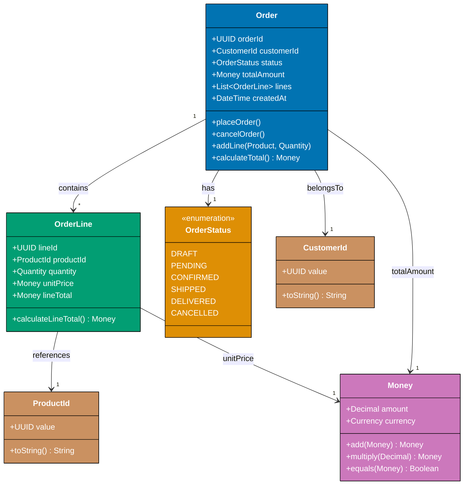

**Key Elements**:

- **Aggregate root**: Order entity owns OrderLine entities (aggregate boundary)
- **Value objects**: Money, CustomerId, ProductId—immutable types with no identity
- **Enumeration**: OrderStatus defines valid state transitions
- **Rich domain model**: Methods like `calculateTotal()` encapsulate business logic
- **Type safety**: Dedicated types (CustomerId, ProductId) prevent primitive obsession
- **Relationships**: "1 to many" (Order contains OrderLines), "1 to 1" (Order has CustomerId)

**Design Rationale**: Domain-driven design aggregates ensure consistency boundaries. Order aggregate guarantees total amount always matches sum of line totals because calculation logic is encapsulated in `calculateTotal()`. Value objects prevent invalid states—Money ensures amount and currency always travel together.

**Key Takeaway**: Use code diagrams to document domain model aggregates. Show entity relationships, value objects, and business methods. This level of detail guides implementation and ensures domain invariants are enforced consistently.

**Why It Matters**: Domain models encode business rules in type systems, making invariants enforceable through compiler checks. Aggregate boundaries prevent business logic duplication by centralizing domain operations—calculating totals outside aggregates creates consistency issues where different code paths produce different results. Code diagrams showing aggregate structure help identify where domain operations belong, guiding implementation toward encapsulated, testable, and consistent business logic that reduces defects in financial calculations.

### Example 62: State Machine Implementation

Complex state transitions require explicit modeling. This example shows order state machine implementation at code level.

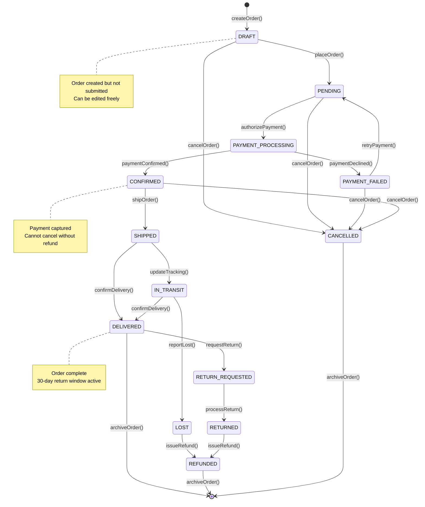

**Key Elements**:

- **14 states**: DRAFT through REFUNDED covering entire order lifecycle
- **21 transitions**: Each labeled with method name (placeOrder, cancelOrder, etc.)
- **Terminal states**: [*] represents end of lifecycle (archived)
- **Branch points**: PAYMENT_PROCESSING can go to CONFIRMED or PAYMENT_FAILED
- **Annotations**: Notes explain business rules at critical states
- **Idempotency**: State machine prevents invalid transitions (can't ship DRAFT order)

**Design Rationale**: Explicit state machine prevents invalid state transitions. Code enforces that orders can only move through allowed paths—attempting to ship a DRAFT order throws exception. This eliminates entire class of bugs where state is inconsistent.

**Key Takeaway**: Model complex workflows as state machines. Define all valid states and transitions. Implement as enum-based state pattern where each state is a class implementing allowed transitions. This makes business rules explicit and prevents invalid operations.

**Why It Matters**: State machines encode business rules in type systems that compilers enforce, eliminating invalid state transitions at compile time. Code diagrams showing valid transitions prevent entire classes of bugs where operations execute in wrong order—such as shipping orders before payment confirmation. Explicit state modeling makes business workflows visible and testable, catching logic errors early rather than discovering them in production through financial discrepancies or customer complaints.

### Example 63: Repository Pattern Implementation

Data access patterns need consistent implementation. This example shows repository pattern with caching at code level.

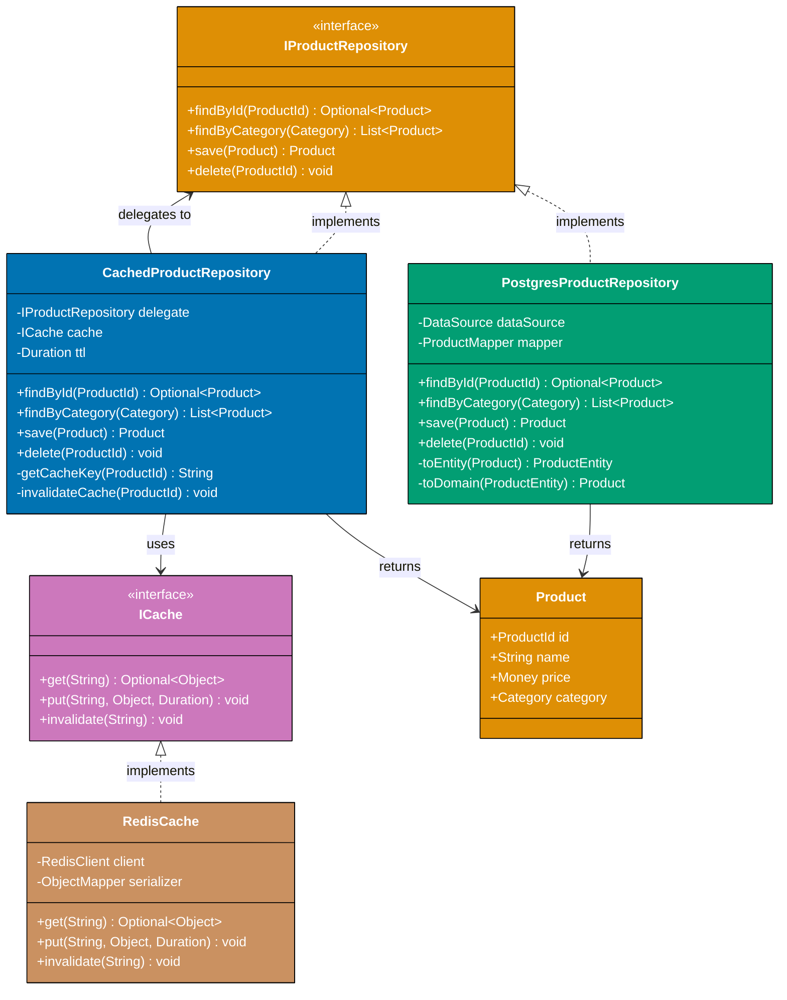

**Key Elements**:

- **Repository interface**: IProductRepository defines data access contract
- **Decorator pattern**: CachedProductRepository wraps another repository adding caching
- **Cache abstraction**: ICache interface enables swapping Redis for Memcached
- **Concrete implementations**: PostgresProductRepository, RedisCache—pluggable infrastructure
- **Domain model**: Product is infrastructure-agnostic
- **Methods**: findById, save, delete—standard repository operations
- **Cache invalidation**: delete() invalidates cache ensuring consistency

**Design Rationale**: Repository pattern abstracts data access enabling technology changes without affecting business logic. Decorator pattern adds caching transparently—business logic calls IProductRepository unaware of caching. This enables performance optimization without code changes.

**Key Takeaway**: Define repository interfaces matching domain language (findByCategory not SELECT). Implement concrete repositories per data store. Use decorator pattern for cross-cutting concerns (caching, logging, metrics). This achieves infrastructure independence and testability.

**Why It Matters**: Repository abstraction enables optimization without coupling, allowing performance improvements through infrastructure changes rather than business logic modifications. Decorator pattern wraps repositories with cross-cutting concerns like caching—changes concentrated in decorator implementation instead of scattered across many call sites. Code diagrams showing decorator structure reveal how infrastructure optimizations (adding caching, switching databases) can improve performance significantly while business logic remains unchanged and testable.

### Example 64: Event-Driven Architecture Code Flow

Event-driven systems need clear event schemas and handler contracts. This example shows event publishing and subscription at code level.

```mermaid
sequenceDiagram
    participant OrderService as Order Service
    participant EventBus as Event Bus (Kafka)
    participant InventoryService as Inventory Service
    participant EmailService as Email Service
    participant AnalyticsService as Analytics Service

    Note over OrderService: User places order
    OrderService->>OrderService: validateOrder()
    OrderService->>OrderService: persistOrder()

    OrderService->>EventBus: publish(OrderPlacedEvent)<br/>{orderId, customerId, items[], totalAmount, timestamp}

    Note over EventBus: Event distributed to subscribers

    EventBus->>InventoryService: consume(OrderPlacedEvent)
    EventBus->>EmailService: consume(OrderPlacedEvent)
    EventBus->>AnalyticsService: consume(OrderPlacedEvent)

    Note over InventoryService: Process in parallel
    InventoryService->>InventoryService: reserveStock(items)
    InventoryService->>EventBus: publish(StockReservedEvent)

    Note over EmailService: Process in parallel
    EmailService->>EmailService: sendConfirmationEmail(customerId, orderId)
    EmailService->>EventBus: publish(EmailSentEvent)

    Note over AnalyticsService: Process in parallel
    AnalyticsService->>AnalyticsService: recordOrderMetrics(orderId, totalAmount)

    EventBus->>OrderService: consume(StockReservedEvent)
    OrderService->>OrderService: updateOrderStatus(CONFIRMED)

    style OrderService fill:#0173B2,stroke:#000,color:#fff
    style EventBus fill:#DE8F05,stroke:#000,color:#fff
    style InventoryService fill:#029E73,stroke:#000,color:#fff
    style EmailService fill:#029E73,stroke:#000,color:#fff
    style AnalyticsService fill:#029E73,stroke:#000,color:#fff
```

**Key Elements**:

- **Event schema**: OrderPlacedEvent contains {orderId, customerId, items[], totalAmount, timestamp}
- **Publisher**: OrderService publishes events without knowing subscribers
- **Subscribers**: Inventory, Email, Analytics consume events independently
- **Parallel processing**: All subscribers process simultaneously (no blocking)
- **Event chain**: InventoryService publishes StockReservedEvent triggering next step
- **Asynchronous flow**: OrderService continues without waiting for subscribers
- **Idempotency**: Events include orderId for deduplication

**Design Rationale**: Event-driven architecture decouples services temporally and spatially. OrderService doesn't call Inventory/Email directly—it publishes event and continues. Subscribers react independently, enabling parallel processing and independent scaling.

**Key Takeaway**: Define explicit event schemas with all required data. Publish events after state changes. Subscribers consume events idempotently (handle duplicates). Chain events for multi-step workflows (OrderPlaced → StockReserved → PaymentCaptured). This achieves loose coupling and independent service evolution.

**Why It Matters**: Event-driven architecture prevents cascade failures and enables independent scaling through temporal decoupling. Sequence diagrams showing event flow reveal how reducing synchronous dependencies dramatically improves availability—service failures become isolated rather than cascading to dependent services. Publishers complete operations quickly by publishing events without waiting for subscriber processing, improving response times while subscribers process events asynchronously at their own pace, enabling independent scaling based on different throughput requirements.

### Example 65: API Contract Definition (OpenAPI)

API contracts need machine-readable specifications. This example shows OpenAPI specification structure for code generation.

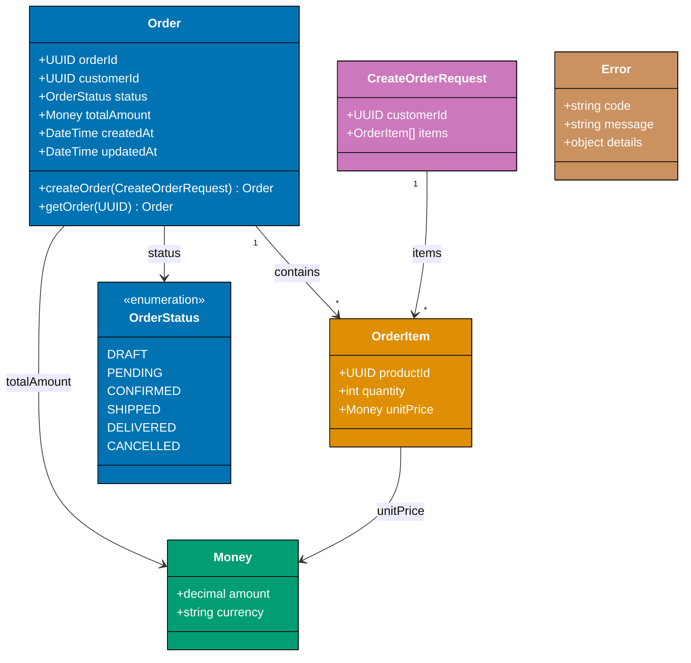

**Key Elements**:

- **Version management**: URL path includes `/v1` for API versioning
- **Idempotency**: Idempotency-Key header prevents duplicate order creation
- **Schema reuse**: `$ref` references shared components (Money, OrderItem)
- **Validation**: minItems, minimum, maximum, pattern enforce business rules
- **HTTP status codes**: 201 (created), 400 (validation error), 409 (duplicate), 404 (not found)
- **Enums**: OrderStatus enum defines valid states
- **Format specifications**: uuid, date-time, decimal for type safety
- **Documentation**: Descriptions explain business semantics

**Design Rationale**: Machine-readable API contracts enable code generation (clients, servers, validators) and automated testing. OpenAPI specification serves as single source of truth preventing client-server drift. Idempotency-Key header ensures duplicate requests (network retries) don't create duplicate orders.

**Key Takeaway**: Define API contracts in OpenAPI format. Include idempotency headers for write operations. Use schemas with validation rules (minimum, pattern). Version APIs in URL path (/v1, /v2). Generate client SDKs and server stubs from specification ensuring consistency.

**Why It Matters**: API contracts prevent integration failures and enable parallel development through machine-readable specifications. Code generation from OpenAPI produces client SDKs automatically across multiple languages, reducing SDK maintenance effort dramatically. Validation rules in schemas catch integration errors during development rather than production, shifting error detection left. Explicit idempotency patterns documented in API contracts eliminate duplicate operations that cause financial discrepancies and customer support burden.

## Complex Multi-System Architectures (Examples 66-72)

### Example 66: Global Multi-Region Deployment

Global applications require multi-region architecture for latency and availability. This example shows geographically distributed deployment.

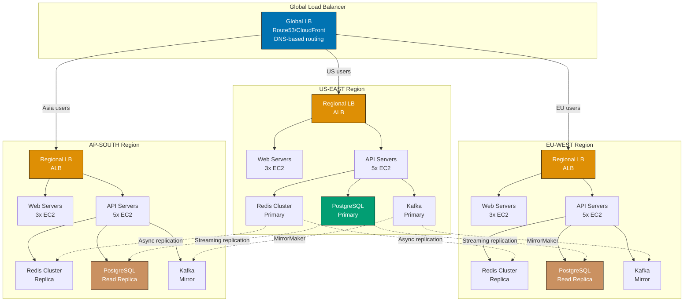

**Key Elements**:

- **Three regions**: US-EAST (primary), EU-WEST, AP-SOUTH (read replicas)
- **Global load balancer**: Route53/CloudFront routes users to nearest region (latency-based routing)
- **Regional load balancers**: ALB distributes traffic within region
- **Database replication**: PostgreSQL streaming replication from US to EU/AP (async)
- **Cache replication**: Redis async replication for read performance
- **Event streaming**: Kafka MirrorMaker replicates events across regions
- **Dotted lines**: Asynchronous replication (eventual consistency)
- **Failover**: If US-EAST fails, GLB routes to EU-WEST

**Design Rationale**: Multi-region architecture reduces latency by serving users from geographically nearest region. Primary-replica pattern handles writes in one region (US-EAST) and reads from local replicas (EU, AP). This balances consistency (writes go to primary) with performance (reads from local replica).

**Key Takeaway**: Deploy to multiple geographic regions. Use global load balancer for geo-routing. Replicate databases and caches asynchronously. Configure automated failover. This achieves low latency (users served from nearest region) and high availability (region failure doesn't cause outage).

**Why It Matters**: Multi-region deployment is critical for global applications, dramatically reducing latency through geographic distribution and improving availability through failure isolation. Deployment diagrams showing regional architecture reveal how routing users to nearest region improves response times significantly compared to single-region deployment. Regional isolation prevents cascading failures—infrastructure issues in one region don't affect other regions, maintaining substantial service capacity during localized outages rather than complete system failure.

### Example 67: Microservices with Service Mesh

Service meshes provide networking, security, and observability for microservices. This example shows Istio service mesh architecture.

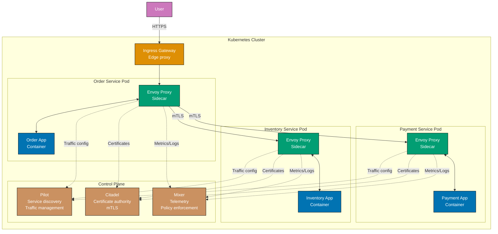

**Key Elements**:

- **Sidecar pattern**: Each service pod has Envoy proxy sidecar handling networking
- **mTLS**: Mutual TLS between all services (automatic encryption + authentication)
- **Pilot**: Service discovery and traffic management (routing rules, load balancing)
- **Citadel**: Certificate authority issuing certificates for mTLS
- **Mixer**: Telemetry collection (metrics, logs, traces) and policy enforcement
- **Ingress Gateway**: Edge proxy for external traffic entering mesh
- **Zero-trust network**: Services can't communicate without valid certificates
- **Observability**: All traffic flows through proxies enabling unified metrics

**Design Rationale**: Service mesh separates networking concerns from application code. Developers write business logic; Envoy sidecars handle retries, circuit breaking, mTLS, metrics. This enables consistent networking policies across polyglot microservices (Java, Go, Python) without code changes.

**Key Takeaway**: Deploy service mesh (Istio, Linkerd) for microservices networking. Use sidecar proxies for traffic management. Enable mTLS for zero-trust security. Centralize observability through proxy metrics. This achieves consistent networking, security, and observability without application code changes.

**Why It Matters**: Service mesh solves microservices complexity at infrastructure level, moving cross-cutting concerns from application code to proxy layer. Deployment diagrams showing service mesh architecture reveal how mTLS, retry logic, and circuit breakers can be centralized—eliminating duplicate implementation across services. Service mesh provides uniform observability across service boundaries, making traffic patterns visible that were previously hidden in application logs. This centralization reduces security incidents, accelerates incident response, and enables consistent reliability patterns without code changes.

### Example 68: Event Sourcing with CQRS at Scale

Large-scale event sourcing requires specialized infrastructure. This example shows production event-sourced system architecture.

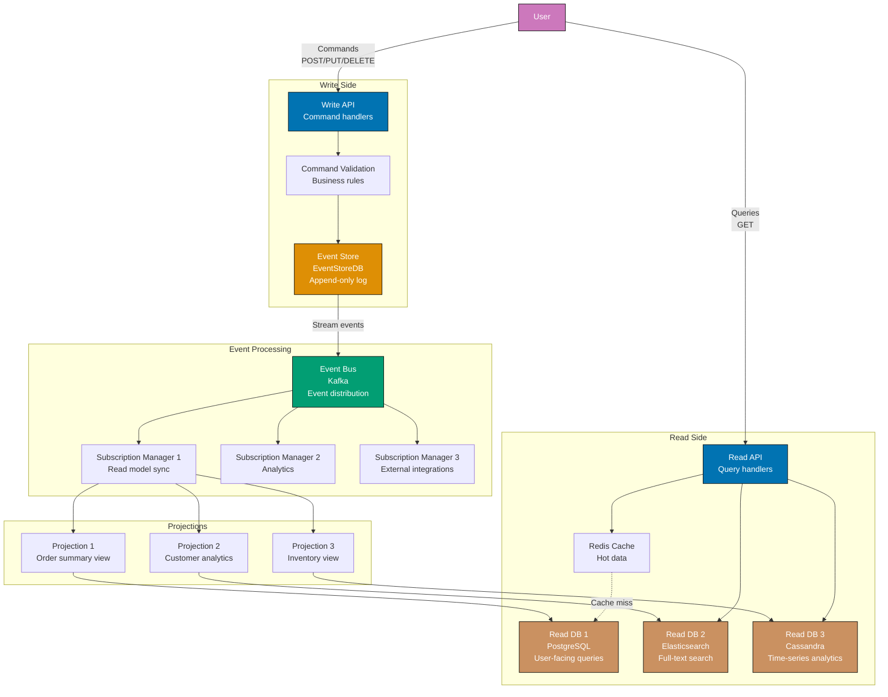

**Key Elements**:

- **Write API**: Handles commands (CreateOrder, CancelOrder) and appends events
- **Event Store**: EventStoreDB provides optimized append-only event storage
- **Event Bus**: Kafka distributes events to multiple subscribers
- **Subscription managers**: Process events and update projections
- **Multiple read databases**: PostgreSQL (relational queries), Elasticsearch (search), Cassandra (analytics)
- **Projections**: Specialized views built from event stream (order summary, customer analytics, inventory)
- **Cache layer**: Redis caches hot data reducing database load
- **Command validation**: Business rules validated before events persisted
- **Complete separation**: Write and read sides share no database

**Design Rationale**: CQRS with event sourcing optimizes write and read paths independently. Write side optimized for event append performance; read side optimized for query performance with multiple specialized databases. Event bus decouples them enabling independent scaling.

**Key Takeaway**: Separate write (commands to event store) from read (queries from read models). Use event bus to propagate events to multiple projections. Maintain specialized read databases optimized for different query patterns. This achieves write scalability (append-only event store), read scalability (multiple read replicas), and query optimization (database per query pattern).

**Why It Matters**: Event sourcing with CQRS enables extreme scale by separating write and read optimization paths. Architecture diagrams reveal how write workloads (append-only event logs) and read workloads (specialized query databases) can scale independently—overcoming traditional database limits where reads and writes compete for resources. Event sourcing provides dramatic write throughput improvements through append-only semantics, while CQRS enables read scaling through denormalized views optimized for specific query patterns. This separation allows systems to handle traffic spikes without database contention.

### Example 69: Zero-Downtime Blue-Green Deployment

Production deployments require zero downtime. This example shows blue-green deployment architecture with traffic shifting.

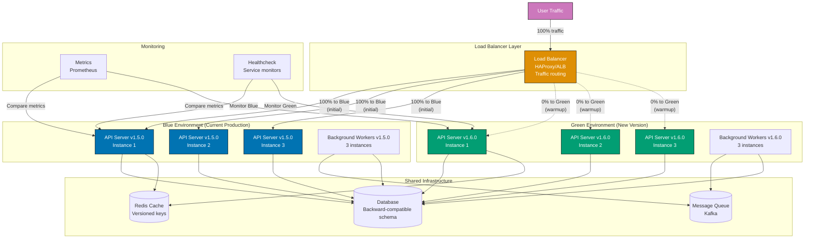

**Key Elements**:

- **Blue environment**: Current production (v1.5.0) serving 100% traffic
- **Green environment**: New version (v1.6.0) deployed but not serving traffic
- **Load balancer**: HAProxy/ALB controls traffic distribution between blue and green
- **Shared infrastructure**: Database and cache shared (backward-compatible schema)
- **Healthchecks**: Automated monitoring verifies green environment healthy before traffic shift
- **Metrics comparison**: Compare error rates, latency between blue and green
- **Traffic shifting**: Gradual 100% Blue → 10% Green → 50% Green → 100% Green
- **Rollback**: If green has issues, immediately shift 100% traffic back to blue
- **Versioned cache keys**: Redis keys include version to prevent cache poisoning

**Design Rationale**: Blue-green deployment eliminates downtime by running two complete environments. New version (green) deployed and tested while current version (blue) serves traffic. After validation, load balancer shifts traffic from blue to green instantly. If issues arise, rollback is instant—no need to redeploy previous version.

**Key Takeaway**: Maintain two identical production environments (blue and green). Deploy new version to inactive environment. Run smoke tests and healthchecks. Gradually shift traffic from blue to green monitoring metrics. Keep blue running for instant rollback. This achieves zero-downtime deployments with instant rollback capability.

**Why It Matters**: Blue-green deployments eliminate deployment downtime and reduce deployment risk by maintaining parallel production environments. Deployment diagrams showing blue-green architecture reveal how instant traffic switching enables rapid rollback—failed deployments revert in seconds by switching traffic back rather than requiring full redeployment. Zero-downtime deployment enables higher deployment frequency, accelerating feature delivery while maintaining high availability guarantees. This pattern balances rapid iteration needs against stability requirements.

### Example 70: Chaos Engineering Infrastructure

Production systems need chaos engineering to validate resilience. This example shows chaos testing architecture.

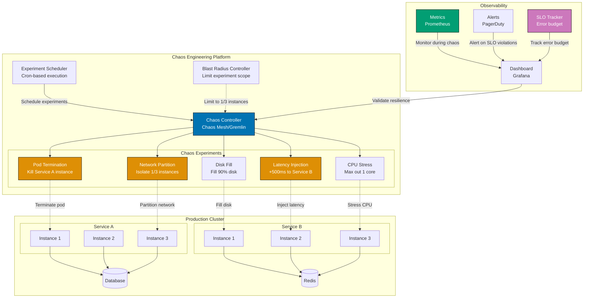

**Key Elements**:

- **Chaos Controller**: Chaos Mesh/Gremlin orchestrates chaos experiments
- **5 chaos types**: Latency injection, pod termination, network partition, disk fill, CPU stress
- **Blast radius control**: Limits experiments to subset of instances (1/3) preventing total outage
- **Experiment scheduler**: Runs chaos experiments during business hours (validates production resilience)
- **Observability integration**: Metrics, alerts, SLO tracking during experiments
- **Automated rollback**: If SLO violated, experiment terminates automatically
- **Gradual chaos**: Start with small blast radius (10% instances), increase if system resilient
- **Hypothesis validation**: "System maintains 99.9% availability when 1/3 instances fail"

**Design Rationale**: Chaos engineering validates resilience by intentionally injecting failures in production. Running experiments regularly (weekly) ensures systems remain resilient as code changes. Blast radius control prevents chaos experiments from causing customer-facing outages while still testing real production conditions.

**Key Takeaway**: Implement chaos engineering platform (Chaos Mesh, Gremlin). Run experiments in production with limited blast radius. Monitor SLOs during experiments. Automate rollback if SLO violated. Test hypotheses like "Service maintains availability during database failover" or "API latency stays under 200ms when cache fails." This builds confidence in production resilience.

**Why It Matters**: Chaos engineering prevents major outages by finding weaknesses proactively through controlled failure injection. Architecture diagrams showing chaos infrastructure reveal how systematic testing of failure scenarios drives resilient design patterns—developers build retry logic, circuit breakers, and graceful degradation because they experience failures regularly in testing. Proactive failure discovery dramatically reduces mean time to recovery since teams practice incident response continuously. Chaos engineering shifts failure discovery from production incidents to controlled experiments, reducing outage frequency and severity.

### Example 71: Data Pipeline Architecture (Lambda Architecture)

Big data systems need batch and real-time processing. This example shows Lambda architecture for data pipelines.

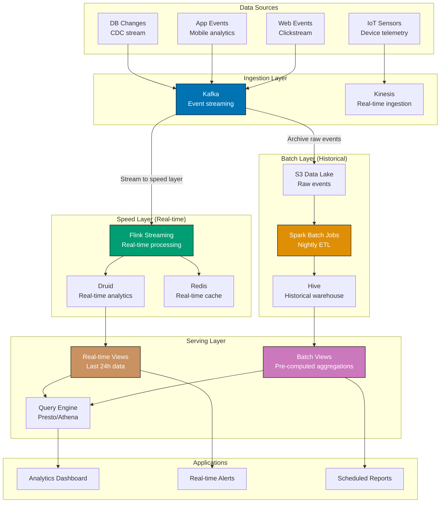

**Key Elements**:

- **Batch layer**: Spark processes all historical data nightly, stores in Hive warehouse
- **Speed layer**: Flink processes recent data (last 24 hours) in real-time, stores in Druid
- **Serving layer**: Combines batch views (historical accuracy) and real-time views (recent data)
- **Data sources**: Web, mobile, IoT, database changes—all flow through Kafka/Kinesis
- **S3 data lake**: Raw events archived for batch processing and reprocessing
- **Query engine**: Presto/Athena queries both batch and real-time views
- **Applications**: Dashboards (combined views), alerts (real-time), reports (batch)
- **Reprocessing**: If batch logic changes, reprocess S3 data to update views

**Design Rationale**: Lambda architecture balances accuracy (batch layer) with latency (speed layer). Batch layer processes all data with complex algorithms (accurate but slow). Speed layer processes recent data with simple algorithms (fast but approximate). Serving layer merges them giving accurate historical data plus low-latency recent data.

**Key Takeaway**: Implement batch layer (Spark/Hive) for accurate historical analytics. Implement speed layer (Flink/Druid) for real-time dashboards. Archive raw events in data lake (S3) enabling reprocessing. Merge batch and real-time views in serving layer. This achieves both accuracy (batch) and low latency (real-time).

**Why It Matters**: Lambda architecture solves the accuracy versus latency trade-off by combining batch and real-time processing paths. Architecture diagrams reveal how batch layer provides accurate computation over complete datasets while speed layer provides low-latency results over recent data—impossible with single processing approach. Batch-only systems suffer unacceptable latency for interactive use cases; real-time-only systems lack ability to reprocess historical data for accurate computation. Lambda architecture enables both comprehensive accuracy and real-time responsiveness by maintaining parallel processing paths.

### Example 72: Multi-Tenancy with Namespace Isolation

SaaS platforms need tenant isolation. This example shows Kubernetes namespace-based multi-tenancy.

```mermaid
graph TD
    subgraph "Kubernetes Cluster"
        subgraph "Shared Infrastructure Namespace"
            IngressController["Ingress Controller<br/>Nginx"]
            AuthService["Auth Service<br/>Central authentication"]
            Monitoring["Monitoring<br/>Prometheus"]
        end

        subgraph "Tenant A Namespace"
            TenantAAPI["API Server A<br/>Isolated"]
            TenantAWorkers["Workers A<br/>3 pods"]
            TenantADB["PostgreSQL A<br/>StatefulSet"]
            TenantACache["Redis A<br/>Dedicated"]

            ResourceQuota["Resource Quota<br/>CPU: 10 cores<br/>Memory: 32GB"]
            NetworkPolicy["Network Policy<br/>Deny cross-tenant"]
        end

        subgraph "Tenant B Namespace"
            TenantBAPI["API Server B<br/>Isolated"]
            TenantBWorkers["Workers B<br/>3 pods"]
            TenantBDB["PostgreSQL B<br/>StatefulSet"]
            TenantBCache["Redis B<br/>Dedicated"]

            ResourceQuotaB["Resource Quota<br/>CPU: 5 cores<br/>Memory: 16GB"]
            NetworkPolicyB["Network Policy<br/>Deny cross-tenant"]
        end

        subgraph "Premium Tenant C Namespace"
            TenantCAPI["API Server C<br/>Isolated"]
            TenantCWorkers["Workers C<br/>10 pods"]
            TenantCDB["PostgreSQL C<br/>HA StatefulSet"]
            TenantCCache["Redis C<br/>Cluster mode"]

            ResourceQuotaC["Resource Quota<br/>CPU: 50 cores<br/>Memory: 128GB"]
            NetworkPolicyC["Network Policy<br/>Deny cross-tenant"]
            DedicatedNodes["Dedicated Nodes<br/>Node affinity"]
        end
    end

    User["User"] -->|"HTTPS"| IngressController
    IngressController -->|"Route by subdomain<br/>tenant-a.saas.com"| TenantAAPI
    IngressController -->|"Route by subdomain<br/>tenant-b.saas.com"| TenantBAPI
    IngressController -->|"Route by subdomain<br/>tenant-c.saas.com"| TenantCAPI

    TenantAAPI --> AuthService
    TenantBAPI --> AuthService
    TenantCAPI --> AuthService

    TenantAAPI --> TenantACache
    TenantAAPI --> TenantADB
    TenantBAPI --> TenantBCache
    TenantBAPI --> TenantBDB
    TenantCAPI --> TenantCCache
    TenantCAPI --> TenantCDB

    ResourceQuota -.->|"Enforces limits"| TenantAAPI
    ResourceQuotaB -.->|"Enforces limits"| TenantBAPI
    ResourceQuotaC -.->|"Enforces limits"| TenantCAPI

    NetworkPolicy -.->|"Blocks traffic to"| TenantBAPI
    NetworkPolicyB -.->|"Blocks traffic to"| TenantAAPI
    NetworkPolicyC -.->|"Blocks traffic to"| TenantAAPI

    Monitoring -.->|"Monitors all namespaces"| TenantAAPI
    Monitoring -.->|"Monitors all namespaces"| TenantBAPI
    Monitoring -.->|"Monitors all namespaces"| TenantCAPI

    style IngressController fill:#0173B2,stroke:#000,color:#fff
    style TenantAAPI fill:#029E73,stroke:#000,color:#fff
    style TenantBAPI fill:#029E73,stroke:#000,color:#fff
    style TenantCAPI fill:#DE8F05,stroke:#000,color:#fff
    style ResourceQuota fill:#CC78BC,stroke:#000,color:#fff
    style NetworkPolicy fill:#CA9161,stroke:#000,color:#fff
```

**Key Elements**:

- **Namespace isolation**: Each tenant gets dedicated namespace with own resources
- **Resource quotas**: CPU/memory limits prevent noisy neighbor (Tenant A can't starve Tenant B)
- **Network policies**: Block cross-tenant communication (security isolation)
- **Shared ingress**: Single ingress controller routes by subdomain (tenant-a.saas.com)
- **Shared auth**: Central authentication service (shared infrastructure)
- **Tiered resources**: Premium tenant C gets 10x resources vs standard tenant B
- **Dedicated nodes**: Premium tenants can get dedicated Kubernetes nodes (node affinity)
- **Database isolation**: Each tenant has own PostgreSQL StatefulSet (data isolation)
- **Monitoring**: Central Prometheus monitors all tenants with tenant labels

**Design Rationale**: Kubernetes namespaces provide logical isolation while sharing cluster infrastructure. Resource quotas ensure fair resource distribution. Network policies enforce security boundaries. This balances isolation (separate namespaces) with efficiency (shared cluster reduces costs vs dedicated clusters per tenant).

**Key Takeaway**: Use Kubernetes namespaces for tenant isolation. Set resource quotas to prevent noisy neighbors. Configure network policies to block cross-tenant traffic. Route traffic by subdomain or header. Tier resources based on tenant pricing (premium gets more resources). This achieves strong isolation with cost efficiency.

**Why It Matters**: Multi-tenancy economics determine SaaS profitability through dramatic infrastructure cost reduction. Deployment diagrams showing namespace isolation reveal how resource sharing enables serving many tenants on shared infrastructure versus dedicated infrastructure per tenant—orders of magnitude cost difference. Resource quotas and namespace boundaries prevent noisy neighbor problems where one tenant's traffic spike affects others, enabling high-density multi-tenancy while maintaining isolation guarantees. This cost efficiency enables SaaS business models that wouldn't be viable with dedicated infrastructure.

## Microservices Patterns - Advanced (Examples 73-77)

### Example 73: Backends for Frontends (BFF) Pattern

Different clients need different API shapes. This example shows BFF pattern optimizing APIs per client type.

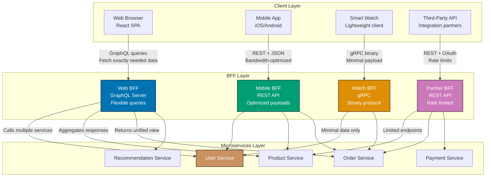

**Key Elements**:

- **Four BFFs**: Web (GraphQL), Mobile (REST), Watch (gRPC), Partner (REST with limits)
- **Protocol optimization**: GraphQL for web flexibility, gRPC for watch efficiency, REST for compatibility
- **Payload optimization**: Mobile BFF returns compressed JSON, Watch BFF returns minimal binary
- **Service aggregation**: Each BFF calls multiple microservices and aggregates responses
- **Client-specific logic**: Web BFF includes recommendations, Watch BFF excludes them (screen too small)
- **Security boundaries**: Partner BFF enforces rate limits and OAuth, internal BFFs use JWT
- **Independent evolution**: Change Web BFF without affecting Mobile BFF

**Design Rationale**: One-size-fits-all API forces compromises—web gets bloated payloads (wasting bandwidth), mobile gets insufficient data (requiring multiple requests), watches timeout (payloads too large). BFFs optimize per client: web gets flexible GraphQL, mobile gets compact JSON, watches get minimal gRPC.

**Key Takeaway**: Create separate BFF for each client type (web, mobile, watch, partner). Optimize protocol (GraphQL, REST, gRPC) for client needs. Aggregate microservice calls in BFF layer. Tailor response payloads to screen size and bandwidth. This achieves optimal performance per client without forcing one API to serve all.

**Why It Matters**: BFF pattern solves API compromise problems where generic APIs poorly serve specific client needs. API diagrams reveal how client-specific backends aggregate multiple calls into single requests, dramatically reducing network round trips—critical for mobile clients on constrained networks. Different clients have different needs (mobile: minimize payload size and round trips; web: flexible querying; IoT: tiny messages). BFF pattern enables per-client optimization while sharing backend services, avoiding one-size-fits-all API compromises that satisfy no client well.

### Example 74: Strangler Fig Pattern for Migration

Migrating monoliths to microservices requires gradual approach. This example shows strangler fig pattern incrementally extracting services.

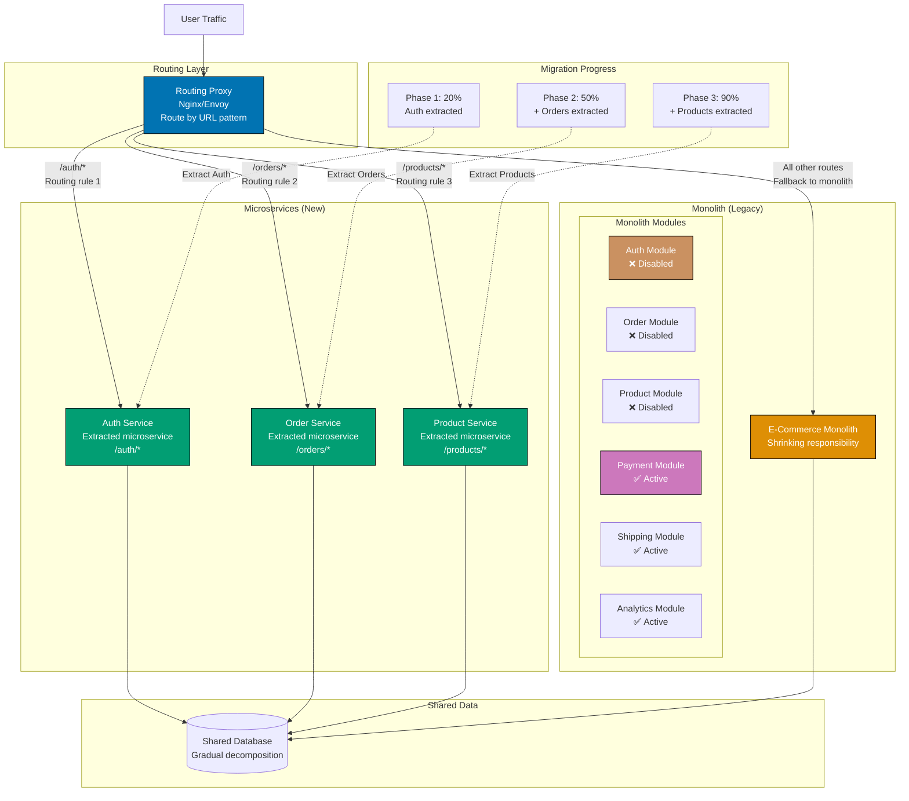

**Key Elements**:

- **Routing proxy**: Routes new traffic to microservices, old traffic to monolith
- **URL-based routing**: `/auth/*` to Auth Service, `/orders/*` to Order Service, everything else to monolith
- **Phased extraction**: Phase 1 (Auth), Phase 2 (Orders), Phase 3 (Products)—20% → 50% → 90% extracted
- **Disabled modules**: Extracted modules disabled in monolith (Auth, Orders, Products)
- **Active modules**: Remaining modules still active in monolith (Payment, Shipping, Analytics)
- **Shared database**: Initially shared, gradually decomposed per service
- **Gradual migration**: Each phase tested in production before next extraction
- **Rollback capability**: Route rules can revert to monolith if microservice fails

**Design Rationale**: Strangler fig pattern avoids "big bang" rewrite by incrementally extracting modules as microservices. Proxy routes new functionality to microservices while monolith handles remaining features. This reduces risk (extract one module at a time), enables testing (each extraction independently validated), and maintains delivery velocity (new features during migration).

**Key Takeaway**: Extract microservices incrementally from monolith. Use routing proxy to direct traffic by URL pattern. Disable extracted modules in monolith to prevent divergence. Share database initially, decompose later. Migrate 20% → 50% → 90% validating each phase. This achieves safe migration without "stop the world" rewrite.

**Why It Matters**: Strangler fig prevents rewrite failures by enabling gradual migration instead of risky big-bang rewrites. Architecture diagrams showing routing layer reveal how functionality migrates incrementally—new services handle specific routes while monolith handles remaining routes, allowing continuous feature delivery during migration. Gradual extraction reduces risk through incremental validation and rollback—each service extraction is small, testable change rather than all-or-nothing rewrite. This pattern enables large-scale architecture changes without deployment freezes or customer-facing outages.

### Example 75: Saga Choreography vs Orchestration

Distributed transactions need coordination strategies. This example compares saga choreography and orchestration patterns.

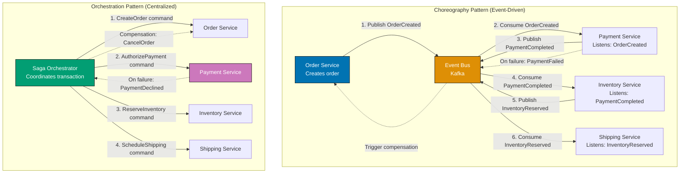

**Key Elements**:

**Choreography**:

- **Decentralized**: Each service listens to events and decides next action
- **Event bus**: Kafka distributes events to all interested subscribers
- **No central coordinator**: Services react to events autonomously
- **Event chain**: OrderCreated → PaymentCompleted → InventoryReserved → ShippingScheduled
- **Compensation**: PaymentFailed event triggers OrderService to cancel order
- **Pros**: No single point of failure, services loosely coupled
- **Cons**: Hard to visualize workflow, difficult to debug failures

**Orchestration**:

- **Centralized**: Saga orchestrator controls workflow execution
- **Command-based**: Orchestrator sends commands to services (CreateOrder, AuthorizePayment)
- **Workflow visibility**: Orchestrator code shows complete transaction flow
- **Compensation logic**: Orchestrator handles rollback (CancelOrder when payment fails)
- **Pros**: Clear workflow, easy debugging, explicit compensation
- **Cons**: Orchestrator is single point of failure, services coupled to orchestrator

**Design Rationale**: Choreography works for simple workflows (few steps, loose coupling priority). Orchestration works for complex workflows (many steps, visibility priority). Hybrid approach: use choreography for domain events (OrderCreated), orchestration for workflows (checkout process).

**Key Takeaway**: Use choreography for domain event broadcasting (notify interested parties). Use orchestration for complex multi-step workflows (require explicit coordination). Consider hybrid: orchestrator coordinates critical path, publishes events for non-critical notifications. This balances coupling (choreography) with visibility (orchestration).

**Why It Matters**: Saga pattern choice affects debuggability and resilience through different coordination approaches. Architecture diagrams comparing choreography versus orchestration reveal tradeoffs—orchestration provides centralized visibility enabling fast incident response for complex workflows, while choreography enables loose coupling for simple event broadcasts. Complex multi-step workflows benefit from orchestration's explicit state tracking; simple event propagation benefits from choreography's decentralization. Hybrid approach matches pattern to workflow complexity, optimizing both debuggability and coupling based on business requirements.

### Example 76: API Versioning Strategies

APIs evolve over time requiring version management. This example shows API versioning strategies comparison.

```mermaid
graph TD
    subgraph "URL Path Versioning"
        PathClient1["Client v1"] -->|"GET /v1/users/123"| PathAPI["API Gateway"]
        PathClient2["Client v2"] -->|"GET /v2/users/123"| PathAPI

        PathAPI -->|"Route /v1/*"| ServiceV1["User Service v1<br/>Legacy implementation"]
        PathAPI -->|"Route /v2/*"| ServiceV2["User Service v2<br/>New implementation"]
    end

    subgraph "Header Versioning"
        HeaderClient1["Client v1"] -->|"GET /users/123<br/>Accept: application/vnd.api+json;version=1"| HeaderAPI["API Gateway"]
        HeaderClient2["Client v2"] -->|"GET /users/123<br/>Accept: application/vnd.api+json;version=2"| HeaderAPI

        HeaderAPI -->|"Route by header"| SharedService["User Service<br/>Version branching in code"]
    end

    subgraph "Query Parameter Versioning"
        QueryClient1["Client v1"] -->|"GET /users/123?api_version=1"| QueryAPI["API Gateway"]
        QueryClient2["Client v2"] -->|"GET /users/123?api_version=2"| QueryAPI

        QueryAPI --> SharedServiceQ["User Service<br/>Version branching in code"]
    end

    subgraph "Content Negotiation (GraphQL)"
        GraphQLClient["Any Client"] -->|"POST /graphql<br/>query specific fields"| GraphQLAPI["GraphQL Server"]

        GraphQLAPI -->|"Schema evolution<br/>Add fields (non-breaking)<br/>Deprecate fields (gradual)"| GraphQLService["User Service<br/>Single schema version"]
    end

    style PathAPI fill:#0173B2,stroke:#000,color:#fff
    style ServiceV1 fill:#DE8F05,stroke:#000,color:#fff
    style ServiceV2 fill:#029E73,stroke:#000,color:#fff
    style GraphQLAPI fill:#CC78BC,stroke:#000,color:#fff
```

**Key Elements**:

**URL Path Versioning** (`/v1/users`, `/v2/users`):

- **Pros**: Explicit version in URL, cache-friendly, easy to route
- **Cons**: URL changes break bookmarks, requires separate documentation per version
- **Best for**: Public APIs where version visibility matters

**Header Versioning** (`Accept: application/vnd.api+json;version=1`):

- **Pros**: URL stays constant, standard HTTP content negotiation
- **Cons**: Harder to test (can't just paste URL), caching complexity
- **Best for**: Internal APIs where clients controlled

**Query Parameter** (`/users?api_version=1`):

- **Pros**: Easy to test, URL remains similar
- **Cons**: Not RESTful (query params should filter, not version), cache complexity
- **Best for**: Quick versioning with minimal infrastructure changes

**GraphQL Schema Evolution**:

- **Pros**: No version numbers, clients request only needed fields, gradual deprecation
- **Cons**: Requires GraphQL adoption, complex schema management
- **Best for**: Rapid iteration where breaking changes are rare

**Design Rationale**: URL path versioning makes version explicit and visible. Header versioning keeps URLs clean but complicates testing. GraphQL avoids versioning by making schema evolution additive (add fields, deprecate old ones gradually).

**Key Takeaway**: Choose URL path versioning for public APIs (explicit, cache-friendly). Use header versioning for internal APIs (URL stability). Consider GraphQL for high-change APIs (avoid versioning entirely via schema evolution). Support multiple versions (v1, v2) for 6-12 months enabling gradual client migration.

**Why It Matters**: API versioning strategy affects migration speed and client disruption through parallel version support. Version diagrams showing parallel API versions reveal how clients migrate gradually at their own pace rather than forced cutover—reducing integration breakage and support burden dramatically. Parallel version maintenance enables breaking changes (new features, consistency improvements) while maintaining backward compatibility for existing clients. This gradual migration approach balances API evolution needs against client stability requirements, enabling continuous API improvement without mass integration failures.

### Example 77: Bulkhead Pattern for Fault Isolation

Resource isolation prevents cascade failures. This example shows bulkhead pattern isolating thread pools and connection pools.

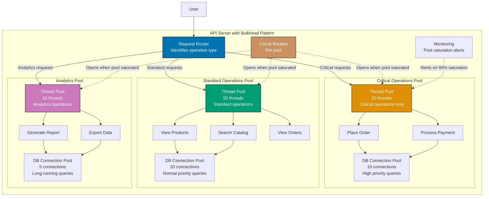

**Key Elements**:

- **Three bulkheads**: Critical (20 threads), Standard (50 threads), Analytics (10 threads)
- **Resource isolation**: Each pool has dedicated threads and database connections
- **Priority-based routing**: Request router assigns operations to appropriate pool
- **Failure isolation**: If analytics queries saturate their pool, critical operations unaffected
- **Circuit breakers**: Open when pool saturated preventing queue buildup
- **Monitoring**: Alerts when pools reach 80% capacity
- **Connection pools**: Separate database connection pools prevent analytics from blocking critical queries
- **Sized by SLO**: Critical pool smaller but higher priority, analytics pool smaller (less important)

**Design Rationale**: Bulkhead pattern prevents resource exhaustion in one category from affecting others. Expensive analytics queries get isolated pool—if they consume all threads, critical order placement remains responsive. This achieves fault isolation by partitioning resources.

**Key Takeaway**: Separate thread pools for critical vs standard vs analytics operations. Size pools based on SLO (critical gets guaranteed capacity). Configure circuit breakers per pool. Monitor pool saturation. Route requests to appropriate pool based on operation type. This prevents low-priority operations from starving high-priority operations.

**Why It Matters**: Bulkheads prevent cascade failures from resource exhaustion by isolating resource pools across workload types. Architecture diagrams showing shared resource pools reveal how expensive operations can starve fast operations—slow queries consuming all threads block fast queries, creating system-wide degradation. Separate resource pools per workload type (bulkhead pattern) isolate failures—resource exhaustion in one pool doesn't affect other pools. This isolation dramatically reduces outage frequency by preventing critical fast paths from being blocked by expensive background operations.

## Scaling Patterns (Examples 78-81)

### Example 78: Auto-Scaling with Multiple Metrics

Production systems need intelligent scaling. This example shows auto-scaling using multiple metrics beyond CPU.

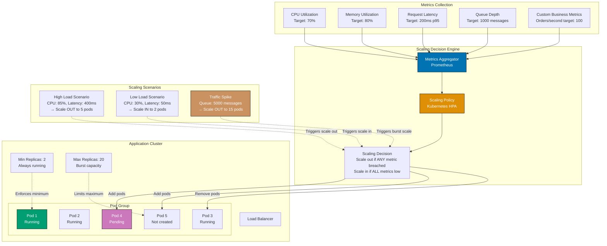

**Key Elements**:

- **Five metrics**: CPU, memory, latency, queue depth, business metrics (orders/second)
- **Multi-metric policy**: Scale OUT if ANY metric exceeds threshold, scale IN if ALL metrics low
- **Min/max replicas**: Minimum 2 (availability), maximum 20 (cost control)
- **Latency-based scaling**: Scale before users experience slowness (proactive not reactive)
- **Queue-depth scaling**: Scale workers based on message backlog
- **Business metrics**: Scale based on domain events (orders, signups) not just infrastructure
- **Cooldown period**: Wait 3 minutes before scaling again preventing flapping
- **Pod states**: Running, Pending (starting), Not created (within max capacity)

**Design Rationale**: CPU-only scaling misses important signals. High CPU might mean scale out, but high latency definitely means scale out (users experiencing slowness). Queue depth scaling prevents message backlog buildup. Business metrics enable proactive scaling (scale before traffic arrives for scheduled events).

**Key Takeaway**: Use multiple metrics for scaling decisions (CPU, memory, latency, queue depth, custom). Scale OUT if any metric breached (prevents performance degradation). Scale IN only if all metrics low (prevents premature scale-down). Set min replicas for availability, max for cost control. Monitor latency to scale before users affected.

**Why It Matters**: Multi-metric scaling prevents performance degradation by detecting problems earlier than CPU-based scaling alone. Architecture diagrams showing scaling policies reveal how latency-based metrics detect degradation before resource exhaustion—enabling proactive scaling rather than reactive recovery. Traditional CPU-based autoscaling lags behind traffic spikes; latency-based scaling detects user-facing impact immediately and scales preemptively. Combining multiple metrics (CPU, latency, queue depth) enables faster response to traffic patterns, maintaining user experience during peak load through predictive scaling.

### Example 79: Database Read Scaling with Connection Pooling

Database connections are expensive. This example shows read scaling with intelligent connection pooling and read replicas.

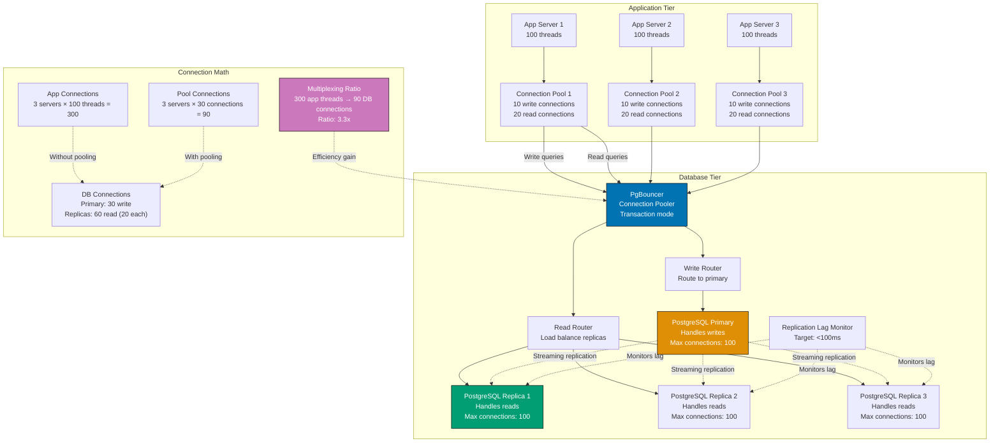

**Key Elements**:

- **Application pools**: Each app server has local connection pool (10 write, 20 read)
- **PgBouncer**: Transaction-mode pooler multiplexes app connections to database connections
- **Multiplexing**: 300 app threads share 90 database connections (3.3x ratio)
- **Read replicas**: 3 replicas load-balanced for read queries (20 connections each)
- **Write routing**: All writes to primary (30 connections total)
- **Replication lag monitoring**: Alert if lag >100ms (stale reads)
- **Connection limit**: Primary has 100 max connections, reserves 70 for other purposes
- **Transaction mode**: PgBouncer returns connection to pool after transaction (not session)

**Design Rationale**: Database connections are expensive (memory, CPU). Without pooling, 300 app threads require 300 database connections exhausting limits. With pooling, 300 threads share 90 connections via multiplexing—connections returned to pool between queries. Read replicas scale read traffic; write traffic to single primary.

**Key Takeaway**: Implement connection pooling at application tier (limit connections per server). Use PgBouncer for transaction-mode pooling (multiplexing). Route reads to replicas, writes to primary. Monitor replication lag to prevent stale reads. Calculate pool sizes: (max DB connections / number of app servers) leaving headroom for maintenance. This achieves read scaling without exhausting database connections.

**Why It Matters**: Connection pooling enables scale without database connection exhaustion through dramatic connection multiplexing. Database diagrams reveal how connection pooling serves many application connections with few database connections—overcoming database connection limits. Without pooling, application connections map one-to-one with database connections, hitting database limits far below application capacity. Connection pooling combined with read replicas enables horizontal scaling orders of magnitude beyond single-database connection limits, supporting massive concurrent user growth without database architecture changes.

### Example 80: Cache Warming and Preloading Strategy

Cache cold starts cause performance issues. This example shows cache warming strategies for production deployments.

```mermaid
graph TD
    subgraph "Cache Warming Strategies"
        ColdStart["Cold Start (Baseline)<br/>Cache empty after deployment<br/>First requests slow (cache miss)"]

        ProactiveWarming["Proactive Warming (Strategy 1)<br/>Pre-populate cache before traffic<br/>Zero cold start impact"]

        LazyLoadWarming["Lazy Load + Warming (Strategy 2)<br/>Cache-aside + background warming<br/>Gradual improvement"]

        WriteThrough["Write-Through (Strategy 3)<br/>Update cache on every write<br/>Always warm for writes"]
    end

    subgraph "Implementation Example"
        DeploymentPipeline["Deployment Pipeline"]

        subgraph "Cache Warming Job"
            WarmingJob["Cache Warming Job<br/>Runs before traffic switch"]

            TopProducts["1. Load top 1000 products<br/>Query from database"]
            TopUsers["2. Load VIP user profiles<br/>Query from database"]
            PopularSearches["3. Load top 100 searches<br/>Query from database"]
            CategoryData["4. Load category tree<br/>Query from database"]

            CacheWriter["Cache Writer<br/>Parallel bulk writes"]
        end

        RedisCluster["Redis Cluster<br/>Cache layer"]

        TrafficSwitch["Traffic Switch<br/>Blue-Green deployment"]

        subgraph "Monitoring"
            CacheHitRate["Cache Hit Rate<br/>Target: >95%"]
            WarmingDuration["Warming Duration<br/>Target: <2 minutes"]
            CacheSize["Cache Size<br/>Monitor memory"]
        end
    end

    subgraph "Performance Impact"
        ColdPerformance["Cold Cache Performance<br/>p95 latency: 800ms<br/>Hit rate: 0%<br/>Duration: 30 minutes"]

        WarmPerformance["Warm Cache Performance<br/>p95 latency: 50ms<br/>Hit rate: 95%<br/>Duration: Immediate"]

        PerformanceGain["Performance Gain<br/>16x latency improvement<br/>Zero cold start period"]
    end

    DeploymentPipeline --> WarmingJob

    WarmingJob --> TopProducts
    WarmingJob --> TopUsers
    WarmingJob --> PopularSearches
    WarmingJob --> CategoryData

    TopProducts --> CacheWriter
    TopUsers --> CacheWriter
    PopularSearches --> CacheWriter
    CategoryData --> CacheWriter

    CacheWriter -->|"Bulk write 10K keys"| RedisCluster

    RedisCluster --> TrafficSwitch
    TrafficSwitch -->|"Switch after warming complete"| CacheHitRate

    CacheHitRate -.->|"Validates warming"| WarmingDuration
    WarmingDuration -.->|"Tracks efficiency"| CacheSize

    ColdStart -.->|"Without warming"| ColdPerformance
    ProactiveWarming -.->|"With warming"| WarmPerformance
    WarmPerformance -.->|"Improvement"| PerformanceGain

    style WarmingJob fill:#0173B2,stroke:#000,color:#fff
    style RedisCluster fill:#DE8F05,stroke:#000,color:#fff
    style CacheWriter fill:#029E73,stroke:#000,color:#fff
    style PerformanceGain fill:#CC78BC,stroke:#000,color:#fff
```

**Key Elements**:

- **Cache warming job**: Runs before traffic switch, pre-populates cache
- **Four warming strategies**: Top products, VIP users, popular searches, category tree
- **Parallel bulk writes**: 10K cache keys written in <2 minutes
- **Traffic switch**: Blue-green deployment waits for cache warming completion
- **Hit rate target**: 95% cache hit rate immediately after deployment (vs 0% cold start)
- **Warming categories**: Choose data that drives 80% of traffic (Pareto principle)
- **Monitoring**: Track warming duration, hit rate, cache size
- **Performance impact**: 16x latency improvement (800ms cold → 50ms warm)

**Design Rationale**: Cache cold starts hurt user experience—first requests miss cache and hit database (slow). Warming cache before traffic arrives eliminates cold start period. Identify hot data (top products, VIP users) via analytics and pre-load before deployment.

**Key Takeaway**: Implement cache warming as deployment step. Identify hot data (top 1K products, VIP users, popular queries). Pre-load cache before switching traffic. Monitor cache hit rate to validate warming effectiveness. Use parallel bulk writes for fast warming (<2 minutes). This eliminates cache cold starts and maintains consistent performance across deployments.

**Why It Matters**: Cache warming prevents post-deployment performance degradation by preloading frequently accessed data before receiving production traffic. Deployment diagrams reveal how cold caches cause latency spikes during initial traffic—every request misses cache and hits slow backend. Pre-warming with most frequently accessed data achieves high cache hit rates immediately, eliminating cold start periods. Strategic cache warming focuses on high-traffic content (following power law distribution) rather than attempting complete pre-population, providing most benefit with minimal warm-up time.

### Example 81: Content Delivery Network (CDN) Architecture

Global content delivery requires CDN architecture. This example shows multi-tier CDN with origin shielding.

```mermaid
graph TD
    subgraph "User Layer (Global)"
        UserUS["User in US"]
        UserEU["User in EU"]
        UserAsia["User in Asia"]
    end

    subgraph "Edge CDN Layer (200+ Locations)"
        EdgeUS["Edge POP - New York<br/>CloudFlare/CloudFront<br/>Cache: 1TB<br/>TTL: 1 hour"]
        EdgeEU["Edge POP - Frankfurt<br/>CloudFlare/CloudFront<br/>Cache: 1TB<br/>TTL: 1 hour"]
        EdgeAsia["Edge POP - Singapore<br/>CloudFlare/CloudFront<br/>Cache: 1TB<br/>TTL: 1 hour"]
    end

    subgraph "Regional Shield Layer (3 Locations)"
        ShieldUS["Shield POP - US-East<br/>Origin shield<br/>Cache: 10TB<br/>TTL: 24 hours"]
        ShieldEU["Shield POP - EU-West<br/>Origin shield<br/>Cache: 10TB<br/>TTL: 24 hours"]
        ShieldAsia["Shield POP - AP-South<br/>Origin shield<br/>Cache: 10TB<br/>TTL: 24 hours"]
    end

    subgraph "Origin Layer (1 Location)"
        OriginLB["Origin Load Balancer<br/>CloudFront Origin"]

        subgraph "Origin Servers"
            Origin1["Origin Server 1<br/>Static assets"]
            Origin2["Origin Server 2<br/>Static assets"]
            Origin3["Origin Server 3<br/>Static assets"]
        end

        S3["S3 Bucket<br/>Asset storage<br/>Versioned objects"]
    end

    subgraph "Performance Metrics"
        Latency["Latency<br/>Edge hit: 10ms<br/>Shield hit: 50ms<br/>Origin hit: 200ms"]

        OriginOffload["Origin Offload<br/>99% requests served from CDN<br/>1% hit origin"]

        CacheHitRatio["Cache Hit Ratio<br/>Edge: 90%<br/>Shield: 95%<br/>Combined: 99.5%"]
    end

    UserUS -->|"10ms latency"| EdgeUS
    UserEU -->|"10ms latency"| EdgeEU
    UserAsia -->|"10ms latency"| EdgeAsia

    EdgeUS -.->|"Cache miss (10%)"| ShieldUS
    EdgeEU -.->|"Cache miss (10%)"| ShieldEU
    EdgeAsia -.->|"Cache miss (10%)"| ShieldAsia

    ShieldUS -.->|"Cache miss (5%)"| OriginLB
    ShieldEU -.->|"Cache miss (5%)"| OriginLB
    ShieldAsia -.->|"Cache miss (5%)"| OriginLB

    OriginLB --> Origin1
    OriginLB --> Origin2
    OriginLB --> Origin3

    Origin1 --> S3
    Origin2 --> S3
    Origin3 --> S3

    EdgeUS -.->|"Metrics"| Latency
    ShieldUS -.->|"Metrics"| OriginOffload
    OriginLB -.->|"Metrics"| CacheHitRatio

    style EdgeUS fill:#0173B2,stroke:#000,color:#fff
    style ShieldUS fill:#DE8F05,stroke:#000,color:#fff
    style OriginLB fill:#029E73,stroke:#000,color:#fff
    style CacheHitRatio fill:#CC78BC,stroke:#000,color:#fff
```

**Key Elements**:

- **Three-tier CDN**: Edge (200+ locations) → Shield (3 regions) → Origin (1 location)
- **Edge POPs**: Geographically distributed, low latency (10ms), smaller cache (1TB), short TTL (1 hour)
- **Shield POPs**: Regional aggregation, reduces origin load, larger cache (10TB), long TTL (24 hours)
- **Origin shielding**: Edge POPs request from shield (not origin) reducing origin requests by 10x
- **Cache hierarchy**: 90% edge hit → 95% shield hit → 5% origin hit = 99.5% combined hit rate
- **Latency tiers**: Edge 10ms, Shield 50ms, Origin 200ms
- **Origin offload**: 99% of requests served from CDN, only 1% hit origin servers
- **S3 backend**: Origin servers pull from S3 versioned bucket (cache-aside pattern)

**Design Rationale**: Multi-tier CDN balances latency (edge POPs close to users) with origin protection (shield POPs aggregate requests). Shield layer prevents "thundering herd" where 200 edge POPs request same asset from origin simultaneously. Edge POPs request from shield; only one shield POP requests from origin.

**Key Takeaway**: Deploy multi-tier CDN with edge layer (global, low latency) and shield layer (regional, origin protection). Configure cache TTLs appropriately (edge: 1 hour, shield: 24 hours). Monitor cache hit ratio at each tier. Use origin shielding to reduce origin load by 10-100x. This achieves low latency globally while protecting origin infrastructure.

**Why It Matters**: CDN architecture determines global performance and origin cost through request reduction and geographic distribution. CDN diagrams showing shield layer reveal how intermediate caching tiers dramatically reduce origin traffic—orders of magnitude fewer requests reach origin servers. Without proper CDN layering, traffic spikes require massive origin infrastructure scaling; with shield caching, origin infrastructure remains stable regardless of edge traffic. Effective CDN architecture enables serving global traffic spikes without origin overload, reducing infrastructure costs while improving user experience through edge proximity.

## Security and Compliance Patterns (Examples 82-85)

### Example 82: Zero-Trust Network Architecture

Modern security requires zero-trust model. This example shows zero-trust architecture with mTLS and identity-based access.

```mermaid
graph TD
    subgraph "Perimeter (No Implicit Trust)"
        Internet["Internet<br/>Untrusted network"]
        WAF["Web Application Firewall<br/>DDoS protection<br/>OWASP Top 10 filtering"]
    end

    subgraph "Identity Provider (Trust Anchor)"
        IDP["Identity Provider<br/>Okta/Auth0<br/>Central authentication"]
        SPIFFE["SPIFFE/SPIRE<br/>Workload identity<br/>X.509 certificates"]
    end

    subgraph "Application Layer (All Authenticated)"
        IngressGateway["Ingress Gateway<br/>Istio Gateway<br/>TLS termination"]

        subgraph "Service Mesh (mTLS Everywhere)"
            ServiceA["Service A<br/>Certificate: A<br/>Identity: sa-service-a"]
            ServiceB["Service B<br/>Certificate: B<br/>Identity: sa-service-b"]
            ServiceC["Service C<br/>Certificate: C<br/>Identity: sa-service-c"]
        end
    end

    subgraph "Data Layer (Encrypted at Rest)"
        DBProxy["Database Proxy<br/>Certificate-based auth"]
        DB[(Database<br/>Encrypted at rest<br/>Column-level encryption)]
    end

    subgraph "Authorization Engine"
        OPA["Open Policy Agent<br/>Centralized authorization<br/>Policy-as-code"]

        PolicyRules["Policy Rules<br/>- Service A can call Service B<br/>- Service B can read DB<br/>- Service C cannot call Service A"]
    end

    subgraph "Audit and Monitoring"
        AuditLog["Audit Log<br/>All access logged<br/>Immutable storage"]
        SIEM["SIEM<br/>Security analytics<br/>Anomaly detection"]
    end

    Internet -->|"HTTPS only"| WAF
    WAF -->|"Validates requests"| IngressGateway

    IngressGateway -->|"mTLS"| ServiceA
    ServiceA -->|"mTLS + identity"| ServiceB
    ServiceB -->|"mTLS + identity"| ServiceC

    ServiceA -.->|"Request auth decision"| OPA
    ServiceB -.->|"Request auth decision"| OPA
    ServiceC -.->|"Request auth decision"| OPA

    OPA -->|"Enforces policies"| PolicyRules

    ServiceB -->|"Certificate-based auth"| DBProxy
    DBProxy -->|"Encrypted connection"| DB

    SPIFFE -.->|"Issues certificates"| ServiceA
    SPIFFE -.->|"Issues certificates"| ServiceB
    SPIFFE -.->|"Issues certificates"| ServiceC

    IDP -.->|"User authentication"| IngressGateway

    ServiceA -.->|"Log all access"| AuditLog
    ServiceB -.->|"Log all access"| AuditLog
    ServiceC -.->|"Log all access"| AuditLog

    AuditLog --> SIEM

    style IDP fill:#0173B2,stroke:#000,color:#fff
    style SPIFFE fill:#DE8F05,stroke:#000,color:#fff
    style OPA fill:#029E73,stroke:#000,color:#fff
    style DB fill:#CC78BC,stroke:#000,color:#fff
    style SIEM fill:#CA9161,stroke:#000,color:#fff
```

**Key Elements**:

- **Zero implicit trust**: Every request authenticated and authorized (no network-based trust)
- **mTLS everywhere**: All service-to-service communication uses mutual TLS
- **SPIFFE/SPIRE**: Workload identity system issues X.509 certificates to services
- **Service identity**: Each service has cryptographic identity (not network location)
- **Centralized authorization**: Open Policy Agent (OPA) enforces policies across all services
- **Policy-as-code**: Authorization rules defined in code, version controlled
- **Certificate-based database auth**: No passwords, certificate rotation automated
- **Encryption at rest**: Database encrypted, sensitive columns double-encrypted
- **Comprehensive audit**: All access logged to immutable audit log
- **SIEM integration**: Security analytics detect anomalous access patterns

**Design Rationale**: Traditional network security assumes "inside network = trusted." Zero-trust assumes "nothing is trusted"—every request must prove identity and authorization regardless of network location. This prevents lateral movement after breach (attacker can't access Service B even if they compromise Service A).

**Key Takeaway**: Implement zero-trust architecture with mTLS for all communication. Use SPIFFE for workload identity (automatic certificate issuance). Centralize authorization in OPA (policy-as-code). Encrypt data at rest and in transit. Log all access to immutable audit log. Integrate with SIEM for anomaly detection. This achieves defense-in-depth where breach of one component doesn't compromise entire system.

**Why It Matters**: Zero-trust prevents lateral movement and reduces breach blast radius by requiring authentication for every request rather than network-based trust. Security diagrams reveal how network perimeter security fails once breached—compromising one system grants access to entire trusted network. Zero-trust architecture requires explicit authentication and authorization for each service interaction, preventing lateral movement even after initial compromise. Identity-based access control (mTLS, certificates) rather than network-based trust dramatically reduces security incidents by limiting attacker movement and making privilege escalation significantly harder.

### Example 83: Data Privacy and Compliance Architecture (GDPR)

Privacy regulations require architectural controls. This example shows GDPR-compliant architecture with data residency and deletion.

```mermaid
graph TD
    subgraph "User Consent Management"
        ConsentUI["Consent UI<br/>Cookie banner<br/>Privacy preferences"]
        ConsentService["Consent Service<br/>Tracks user preferences<br/>Versioned consent"]
        ConsentDB[(Consent Database<br/>User consent history<br/>Audit trail)]
    end

    subgraph "Data Classification"
        PII["PII (Personal Identifiable)<br/>Name, email, phone<br/>Encryption required"]
        SensitivePII["Sensitive PII<br/>Health, financial<br/>Column-level encryption"]
        NonPII["Non-PII<br/>Aggregate analytics<br/>No restrictions"]
    end

    subgraph "Data Processing (EU Region)"
        EUDataCenter["EU Data Center<br/>Frankfurt AWS Region<br/>Data residency compliance"]

        subgraph "EU Services"
            EUAPI["EU API Service<br/>Processes EU user data"]
            EUWorkers["EU Workers<br/>Background jobs"]
            EUDB[(EU Database<br/>PostgreSQL<br/>Encrypted at rest)]
        end

        DataMapping["Data Mapping Registry<br/>Tracks PII locations<br/>Data lineage"]
    end

    subgraph "Data Subject Rights (GDPR Articles)"
        RightToAccess["Right to Access (Art 15)<br/>Export all user data<br/>Machine-readable format"]
        RightToErasure["Right to Erasure (Art 17)<br/>Delete all user data<br/>30-day SLA"]
        RightToPortability["Right to Portability (Art 20)<br/>Transfer data to competitor<br/>JSON/CSV export"]
        RightToRectification["Right to Rectification (Art 16)<br/>Correct inaccurate data<br/>Update propagation"]
    end

    subgraph "Data Deletion Pipeline"
        DeletionRequest["Deletion Request<br/>User triggers deletion"]
        DeletionQueue["Deletion Queue<br/>Kafka topic<br/>30-day retention"]

        DeletionWorker["Deletion Worker<br/>Identifies all PII<br/>Uses data mapping"]

        DBDeletion["Database Deletion<br/>Hard delete PII<br/>Soft delete for audit"]
        S3Deletion["S3 Deletion<br/>Delete stored files<br/>Versioned deletion"]
        CacheDeletion["Cache Deletion<br/>Invalidate Redis keys"]
        BackupAnonymization["Backup Anonymization<br/>Anonymize PII in backups<br/>Retain aggregate data"]

        DeletionAudit["Deletion Audit Log<br/>Proof of deletion<br/>Compliance evidence"]
    end

    subgraph "Cross-Border Transfer Controls"
        SCCContracts["Standard Contractual Clauses<br/>EU-US data transfer<br/>Legal framework"]
        EncryptionInTransit["Encryption in Transit<br/>TLS 1.3<br/>Perfect forward secrecy"]
    end

    User["EU User"] --> ConsentUI
    ConsentUI --> ConsentService
    ConsentService --> ConsentDB

    User -->|"Data residency: EU only"| EUAPI
    EUAPI --> EUDB
    EUAPI -.->|"Check consent"| ConsentService

    EUAPI --> DataMapping
    DataMapping -.->|"Tracks PII locations"| EUDB

    User -->|"GDPR request"| RightToAccess
    User -->|"GDPR request"| RightToErasure
    User -->|"GDPR request"| RightToPortability

    RightToErasure --> DeletionRequest
    DeletionRequest --> DeletionQueue
    DeletionQueue --> DeletionWorker

    DeletionWorker --> DataMapping
    DeletionWorker --> DBDeletion
    DeletionWorker --> S3Deletion
    DeletionWorker --> CacheDeletion
    DeletionWorker --> BackupAnonymization

    DBDeletion --> DeletionAudit
    S3Deletion --> DeletionAudit
    BackupAnonymization --> DeletionAudit

    EUDataCenter -.->|"Restricted transfer"| SCCContracts
    EUAPI -.->|"All connections"| EncryptionInTransit

    style ConsentService fill:#0173B2,stroke:#000,color:#fff
    style DataMapping fill:#DE8F05,stroke:#000,color:#fff
    style DeletionWorker fill:#029E73,stroke:#000,color:#fff
    style RightToErasure fill:#CC78BC,stroke:#000,color:#fff
    style DeletionAudit fill:#CA9161,stroke:#000,color:#fff
```

**Key Elements**:

- **Consent management**: Track user consent preferences with audit trail
- **Data residency**: EU user data stays in EU region (Frankfurt AWS)
- **Data classification**: PII, Sensitive PII, Non-PII with different handling
- **Data mapping registry**: Tracks all PII locations for deletion and export
- **GDPR rights**: Access (Art 15), Erasure (Art 17), Portability (Art 20), Rectification (Art 16)
- **Deletion pipeline**: Automated deletion across database, S3, cache, backups within 30 days
- **Backup anonymization**: PII in backups anonymized (not deleted) for disaster recovery
- **Cross-border controls**: Standard Contractual Clauses for EU-US transfer
- **Deletion audit**: Immutable proof of deletion for compliance evidence
- **Encryption**: At rest (database, S3) and in transit (TLS 1.3)

**Design Rationale**: GDPR requires technical controls for data subject rights. Data mapping registry enables complete data deletion (know all PII locations). Separate EU infrastructure prevents accidental US data transfer. Automated deletion pipeline ensures 30-day SLA compliance. Backup anonymization balances deletion requirement with disaster recovery needs.

**Key Takeaway**: Implement data residency (EU data in EU region). Build data mapping registry tracking all PII locations. Create automated deletion pipeline honoring GDPR erasure requests within 30 days. Anonymize PII in backups (don't delete backups). Track consent with audit trail. Encrypt data at rest and in transit. This achieves GDPR compliance while maintaining operational capabilities.

**Why It Matters**: GDPR non-compliance creates significant regulatory and reputational risk through substantial financial penalties and customer trust erosion. Compliance diagrams reveal how proper data architecture (data mapping, deletion pipelines, encryption) prevents both regulatory violations and actual data breaches. Data mapping enables complete user data deletion upon request; encryption protects data if breached; automated deletion pipelines ensure timely compliance. Proactive compliance architecture reduces regulatory risk, protects customer data, and builds trust—customers increasingly prefer companies demonstrating strong privacy controls through transparent architectural practices.

### Example 84: Secrets Management Architecture

Production systems need secure secrets management. This example shows HashiCorp Vault integration for dynamic secrets.

```mermaid
graph TD
    subgraph "Application Layer"
        App1["Application Pod 1<br/>ServiceAccount: app-service"]
        App2["Application Pod 2<br/>ServiceAccount: app-service"]
        App3["Application Pod 3<br/>ServiceAccount: app-service"]

        InitContainer["Init Container<br/>Vault Agent<br/>Fetches secrets at startup"]
        SidecarContainer["Sidecar Container<br/>Vault Agent<br/>Refreshes secrets"]
    end

    subgraph "Vault Cluster"
        VaultLB["Vault Load Balancer"]

        Vault1["Vault Server 1<br/>Active"]
        Vault2["Vault Server 2<br/>Standby"]
        Vault3["Vault Server 3<br/>Standby"]

        subgraph "Secret Engines"
            KVEngine["KV Secrets Engine<br/>Static secrets<br/>API keys, config"]
            DatabaseEngine["Database Engine<br/>Dynamic credentials<br/>PostgreSQL, MySQL"]
            PKIEngine["PKI Engine<br/>TLS certificates<br/>X.509 generation"]
            AWSEngine["AWS Engine<br/>Dynamic IAM creds<br/>Temporary access"]
        end

        subgraph "Authentication Methods"
            K8sAuth["Kubernetes Auth<br/>ServiceAccount tokens"]
            OIDCAuth["OIDC Auth<br/>User authentication"]
            AppRoleAuth["AppRole Auth<br/>Machine authentication"]
        end

        AuditLog["Vault Audit Log<br/>All secret access logged<br/>Immutable storage"]
    end

    subgraph "Secret Lifecycle"
        SecretRequest["1. Secret Request<br/>App authenticates to Vault"]
        SecretLease["2. Secret Lease<br/>Vault generates credentials<br/>TTL: 1 hour"]
        SecretRotation["3. Secret Rotation<br/>Vault rotates at 50% TTL<br/>Zero-downtime renewal"]
        SecretRevocation["4. Secret Revocation<br/>Pod deleted → credentials revoked<br/>Automatic cleanup"]
    end

    subgraph "Database Integration"
        VaultDB["Vault DB Connection<br/>Admin credentials"]
        PostgreSQL[(PostgreSQL<br/>Database)]

        DynamicCreds["Dynamic Credentials<br/>Username: v-k8s-app-7days-abc123<br/>Password: random-64-chars<br/>TTL: 7 days<br/>Auto-revoke on pod deletion"]
    end

    App1 --> InitContainer
    App1 --> SidecarContainer
    App2 --> InitContainer
    App3 --> InitContainer

    InitContainer -->|"Authenticate with ServiceAccount"| VaultLB
    SidecarContainer -->|"Refresh secrets"| VaultLB

    VaultLB --> Vault1
    VaultLB --> Vault2
    VaultLB --> Vault3

    Vault1 --> K8sAuth
    Vault1 --> KVEngine
    Vault1 --> DatabaseEngine
    Vault1 --> PKIEngine
    Vault1 --> AWSEngine

    DatabaseEngine --> VaultDB
    VaultDB -->|"CREATE USER"| PostgreSQL
    DatabaseEngine -->|"Returns dynamic creds"| DynamicCreds
    DynamicCreds -->|"App connects with temp creds"| PostgreSQL

    K8sAuth -.->|"Validates ServiceAccount"| App1

    Vault1 --> AuditLog

    SecretRequest -.->|"Flow step 1"| Vault1
    SecretLease -.->|"Flow step 2"| DynamicCreds
    SecretRotation -.->|"Flow step 3"| SidecarContainer
    SecretRevocation -.->|"Flow step 4"| PostgreSQL

    style Vault1 fill:#0173B2,stroke:#000,color:#fff
    style DatabaseEngine fill:#DE8F05,stroke:#000,color:#fff
    style DynamicCreds fill:#029E73,stroke:#000,color:#fff
    style AuditLog fill:#CC78BC,stroke:#000,color:#fff
    style SecretRotation fill:#CA9161,stroke:#000,color:#fff
```

**Key Elements**:

- **Vault cluster**: 3-node HA cluster (1 active, 2 standby) for secrets management
- **Dynamic secrets**: Vault generates database credentials on-demand with TTL
- **Init container**: Fetches secrets at pod startup (Vault Agent)
- **Sidecar container**: Refreshes secrets before expiration (zero-downtime rotation)
- **Kubernetes auth**: Pods authenticate using ServiceAccount tokens (no static credentials)
- **Secret engines**: KV (static), Database (dynamic DB creds), PKI (certificates), AWS (IAM)
- **Automatic revocation**: Pod deletion triggers credential revocation in database
- **Audit logging**: All secret access logged to immutable audit log
- **Credential format**: Dynamic usernames include metadata (v-k8s-app-7days-abc123)
- **Secret rotation**: Sidecar rotates at 50% TTL (3.5 days for 7-day TTL)

**Design Rationale**: Static credentials in config files are security risks (leaked in git, shared across environments, never rotated). Vault provides dynamic credentials generated on-demand with automatic expiration. Database credentials exist only while pod runs—pod deletion revokes credentials preventing stolen credentials from working.

**Key Takeaway**: Use Vault for secrets management with dynamic credential generation. Authenticate using platform identity (Kubernetes ServiceAccount, not passwords). Rotate secrets automatically before expiration (50% TTL). Revoke credentials when workload deleted. Audit all secret access. This eliminates static credentials and reduces credential lifetime from "forever" to "hours."

**Why It Matters**: Dynamic secrets reduce breach blast radius by limiting credential lifespan and enabling automatic revocation. Audit logs reveal how static credentials create long exposure windows—stolen credentials remain valid indefinitely until manually rotated. Dynamic credentials with short time-to-live dramatically reduce this exposure window; automatic revocation on pod deletion ensures credentials stop working immediately. This temporal limitation contains breaches—attackers must maintain continuous access rather than using one-time stolen credentials indefinitely. Organizations report substantial reduction in credential-related security incidents through dynamic secret management.

### Example 85: Compliance as Code (SOC 2 Controls)

Compliance requires automated controls. This example shows SOC 2 controls implemented as infrastructure code.

```mermaid
graph TD
    subgraph "SOC 2 Control Categories"
        CC1["CC1: Control Environment<br/>Organizational security policies"]
        CC2["CC2: Communication<br/>Security training & awareness"]
        CC3["CC3: Risk Assessment<br/>Threat modeling & pentesting"]
        CC4["CC4: Monitoring<br/>Security monitoring & alerts"]
        CC5["CC5: Control Activities<br/>Technical security controls"]
    end

    subgraph "Infrastructure as Code (IaC)"
        Terraform["Terraform<br/>Infrastructure provisioning"]

        subgraph "Policy as Code"
            OPAPolicies["OPA Policies<br/>- No public S3 buckets<br/>- Encryption required<br/>- MFA enforced"]
            SentinelPolicies["Sentinel Policies<br/>Cost limits<br/>Region restrictions"]
        end

        subgraph "Security Controls"
            NetworkPolicy["Network Policies<br/>Zero-trust networking<br/>Default deny"]
            PodSecurityPolicy["Pod Security Standards<br/>No root containers<br/>Read-only filesystem"]
            EncryptionConfig["Encryption Config<br/>TLS 1.3 minimum<br/>AES-256 at rest"]
        end
    end

    subgraph "Continuous Compliance Monitoring"
        ComplianceScanner["Compliance Scanner<br/>Cloud Custodian<br/>Prowler"]

        AutoRemediation["Auto-Remediation<br/>- Delete public S3 buckets<br/>- Enable encryption<br/>- Rotate credentials"]

        ComplianceDashboard["Compliance Dashboard<br/>SOC 2 control status<br/>Evidence collection"]
    end

    subgraph "Audit Evidence Collection"
        AccessLogs["Access Logs<br/>All API calls logged<br/>CloudTrail/Audit logs"]

        ChangeTracking["Change Tracking<br/>Git commits<br/>Deployment history"]

        BackupVerification["Backup Verification<br/>Automated restore tests<br/>Monthly schedule"]

        IncidentResponse["Incident Response<br/>Runbooks automated<br/>MTTR tracking"]

        EvidenceStorage["Evidence Storage<br/>S3 with retention<br/>Immutable for 7 years"]
    end

    subgraph "Control Testing"
        AutomatedTests["Automated Tests<br/>InSpec/Chef compliance"]

        ControlTests["Control Test Examples<br/>✓ Encryption enabled<br/>✓ MFA enforced<br/>✓ Logs retained 1 year<br/>✓ Backups tested monthly"]

        ContinuousAssessment["Continuous Assessment<br/>Tests run hourly<br/>Violations trigger alerts"]
    end

    CC5 --> Terraform
    Terraform --> OPAPolicies
    Terraform --> NetworkPolicy
    Terraform --> PodSecurityPolicy
    Terraform --> EncryptionConfig

    OPAPolicies -.->|"Enforces at deploy time"| Terraform

    NetworkPolicy --> ComplianceScanner
    PodSecurityPolicy --> ComplianceScanner
    EncryptionConfig --> ComplianceScanner

    ComplianceScanner -->|"Detects violations"| AutoRemediation
    ComplianceScanner --> ComplianceDashboard

    CC4 --> AccessLogs
    AccessLogs --> EvidenceStorage
    ChangeTracking --> EvidenceStorage
    BackupVerification --> EvidenceStorage
    IncidentResponse --> EvidenceStorage

    ComplianceDashboard --> AutomatedTests
    AutomatedTests --> ControlTests
    ControlTests --> ContinuousAssessment

    ContinuousAssessment -.->|"Validates controls"| CC5

    style OPAPolicies fill:#0173B2,stroke:#000,color:#fff
    style ComplianceScanner fill:#DE8F05,stroke:#000,color:#fff
    style AutoRemediation fill:#029E73,stroke:#000,color:#fff
    style EvidenceStorage fill:#CC78BC,stroke:#000,color:#fff
    style ContinuousAssessment fill:#CA9161,stroke:#000,color:#fff
```

**Key Elements**:

- **Policy as code**: Security policies defined in OPA/Sentinel (version controlled, tested)
- **Infrastructure as code**: Terraform provisions infrastructure with compliance controls baked in
- **Automated controls**: Network policies, pod security standards, encryption—enforced automatically
- **Compliance scanner**: Cloud Custodian/Prowler continuously scans for violations
- **Auto-remediation**: Violations automatically fixed (delete public S3 bucket, enable encryption)
- **Evidence collection**: Access logs, change tracking, backups—all automated
- **Evidence storage**: Immutable S3 storage with 7-year retention (SOC 2 requirement)
- **Continuous testing**: InSpec tests validate controls hourly (not annually during audit)
- **Compliance dashboard**: Real-time SOC 2 control status (always audit-ready)
- **Control examples**: Encryption enabled, MFA enforced, logs retained, backups tested

**Design Rationale**: Traditional compliance is manual (spreadsheets, annual audits, spot checks). Compliance-as-code automates controls (enforced in infrastructure), testing (continuous validation), and evidence (automated collection). This shifts from "prove compliance once a year" to "always compliant, always auditable."

**Key Takeaway**: Implement SOC 2 controls as infrastructure code (policy-as-code). Use compliance scanner to detect violations hourly (not annually). Auto-remediate common violations (public buckets, missing encryption). Collect evidence automatically (access logs, change history, backup tests). Test controls continuously with automated tests. Store evidence in immutable storage for 7 years. This achieves continuous compliance instead of point-in-time compliance.

**Why It Matters**: Compliance-as-code reduces audit costs and time through automation and continuous validation. Architecture diagrams showing automated controls reveal how policy-as-code continuously tests compliance rather than manual periodic audits. Continuous testing catches violations during development rather than audit preparation; automated evidence collection replaces manual spreadsheet gathering. This automation dramatically reduces audit preparation time and cost while improving compliance quality. Always-compliant posture enables faster customer onboarding since compliance reports are continuously available rather than requiring lengthy audit cycles.

---

This completes the advanced-level C4 Model by-example tutorial with 25 comprehensive examples covering code-level diagrams, complex multi-system architectures, advanced microservices patterns, scaling strategies, and security/compliance patterns (75-95% coverage). Combined with beginner (Examples 1-30) and intermediate (Examples 31-60), this provides complete C4 Model mastery through 85 expert-level examples.
