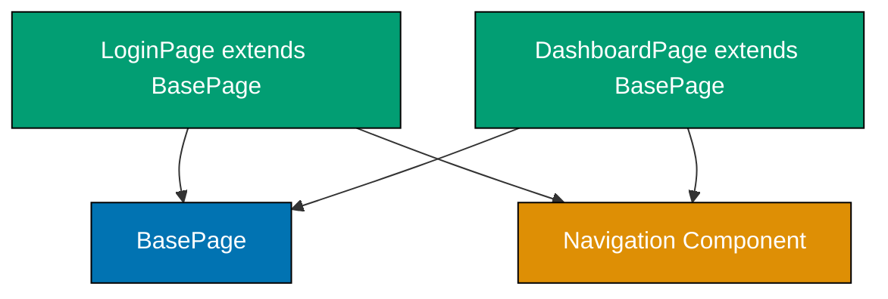
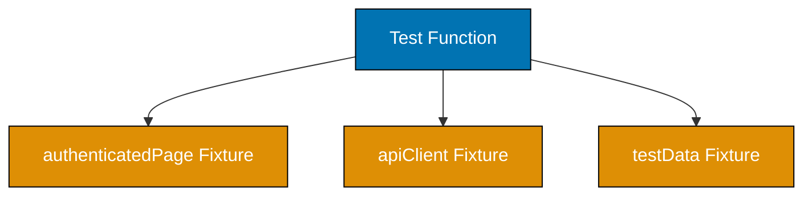
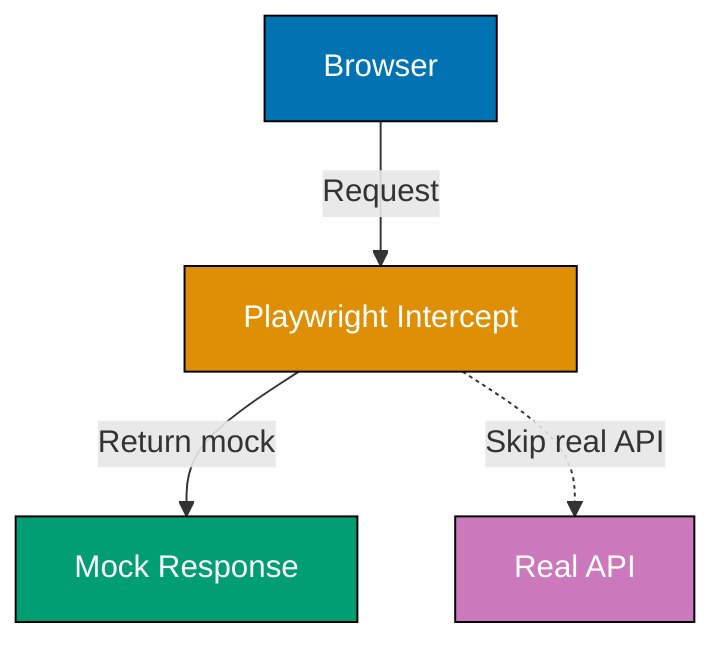
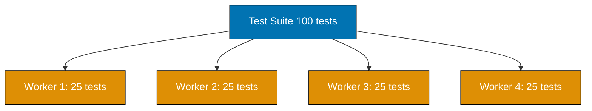
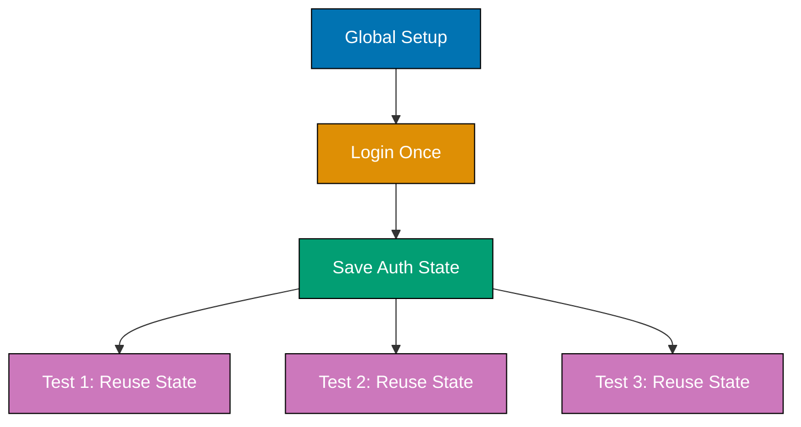

This tutorial covers advanced Playwright patterns for production environments including Page Object Model advanced patterns, custom fixtures, debugging tools, CI/CD integration, parallel execution, authentication flows, and production testing strategies.

## Example 61: Page Object Model - Advanced Composition

Page Object Model (POM) encapsulates page interactions in reusable classes. Advanced POM uses composition to share common components across pages.



**Code**:

```typescript
import { test, expect, Page, Locator } from "@playwright/test";

// Base page with common functionality
class BasePage {
  // => BasePage class definition
  readonly page: Page;
  // => page: readonly class field

  constructor(page: Page) {
    // => constructor() method
    this.page = page; // => Store page reference
    // => this.page: set instance property
  }
  // => End of block

  async goto(path: string): Promise<void> {
    // => goto() method
    await this.page.goto(`https://example.com${path}`); // => Navigate with base URL
    // => Navigates to URL and waits
  }
  // => End of block

  async waitForPageLoad(): Promise<void> {
    // => waitForPageLoad() method
    await this.page.waitForLoadState("networkidle"); // => Wait for network to settle
    // => Ensures page fully loaded
  }
  // => End of block
}

// Shared navigation component
class NavigationComponent {
  // => NavigationComponent class definition
  readonly page: Page;
  // => page: readonly class field
  readonly homeLink: Locator;
  // => homeLink: readonly class field
  readonly profileLink: Locator;
  // => profileLink: readonly class field
  readonly logoutButton: Locator;
  // => logoutButton: readonly class field

  constructor(page: Page) {
    // => constructor() method
    this.page = page;
    // => this.page: set instance property
    this.homeLink = page.getByRole("link", { name: "Home" }); // => Locate home link
    // => this.homeLink: set instance property
    this.profileLink = page.getByRole("link", { name: "Profile" }); // => Locate profile link
    // => this.profileLink: set instance property
    this.logoutButton = page.getByRole("button", { name: "Logout" }); // => Locate logout button
    // => this.logoutButton: set instance property
  }
  // => End of block

  async navigateToHome(): Promise<void> {
    // => navigateToHome() method
    await this.homeLink.click(); // => Click home link
    // => Navigates to home page
  }
  // => End of block

  async logout(): Promise<void> {
    // => logout() method
    await this.logoutButton.click(); // => Click logout
    // => Logs user out of application
  }
  // => End of block
}

// Login page with composition
class LoginPage extends BasePage {
  // => LoginPage extends BasePage: inherits parent methods
  readonly navigation: NavigationComponent;
  // => navigation: readonly class field
  readonly emailInput: Locator;
  // => emailInput: readonly class field
  readonly passwordInput: Locator;
  // => passwordInput: readonly class field
  readonly submitButton: Locator;
  // => submitButton: readonly class field

  constructor(page: Page) {
    // => constructor() method
    super(page); // => Call base constructor
    // => super() function defined
    this.navigation = new NavigationComponent(page); // => Compose navigation component
    // => this.navigation: set instance property
    this.emailInput = page.getByLabel("Email"); // => Locate email input
    // => this.emailInput: set instance property
    this.passwordInput = page.getByLabel("Password"); // => Locate password input
    // => this.passwordInput: set instance property
    this.submitButton = page.getByRole("button", { name: "Sign In" }); // => Locate submit button
    // => this.submitButton: set instance property
  }
  // => End of block

  async login(email: string, password: string): Promise<void> {
    // => login() method
    await this.emailInput.fill(email); // => Fill email
    // => Fills input field
    await this.passwordInput.fill(password); // => Fill password
    // => Fills input field
    await this.submitButton.click(); // => Submit form
    // => Clicks element
    await this.waitForPageLoad(); // => Wait for navigation
    // => Waits for condition
  }
  // => End of block
}

// Dashboard page reuses navigation component
class DashboardPage extends BasePage {
  // => DashboardPage extends BasePage: inherits parent methods
  readonly navigation: NavigationComponent;
  // => navigation: readonly class field
  readonly welcomeMessage: Locator;
  // => welcomeMessage: readonly class field

  constructor(page: Page) {
    // => constructor() method
    super(page);
    // => super() function defined
    this.navigation = new NavigationComponent(page); // => Same navigation component
    // => this.navigation: set instance property
    this.welcomeMessage = page.getByTestId("welcome-message"); // => Locate welcome message
    // => this.welcomeMessage: set instance property
  }
  // => End of block

  async getWelcomeText(): Promise<string> {
    // => getWelcomeText() method
    return (await this.welcomeMessage.textContent()) || ""; // => Get welcome text
    // => Returns welcome message
  }
  // => End of block
}
// => End of block

test("advanced POM with composition", async ({ page }) => {
  // => Test case or suite
  const loginPage = new LoginPage(page); // => Create login page object
  // => loginPage: creates LoginPage instance
  await loginPage.goto("/login"); // => Navigate using base method
  // => Awaits async operation
  await loginPage.login("user@example.com", "password"); // => Login using page method
  // => Awaits async operation

  const dashboard = new DashboardPage(page); // => Create dashboard page object
  // => dashboard: creates DashboardPage instance
  const welcomeText = await dashboard.getWelcomeText(); // => Get welcome message
  // => welcomeText: awaits async operation
  expect(welcomeText).toContain("Welcome"); // => Verify logged in
  // => expect() function defined

  await dashboard.navigation.logout(); // => Logout using shared component
  // => Reused navigation logic across pages
});
// => End of block
```

**Key Takeaway**: Advanced POM uses composition to share common components (navigation, footer, modals) across multiple page objects. BasePage provides shared utilities while component classes handle specific UI elements.

**Why It Matters**: Component composition reduces code duplication and maintenance burden across large test suites. When navigation changes, you update NavigationComponent once instead of modifying every page object that uses it. In enterprise applications with dozens of pages sharing common UI elements like headers, sidebars, and modals, component-based POM makes structural UI changes manageable without touching hundreds of test files. This pattern becomes essential when your test suite exceeds 100 files.

## Example 62: Component Objects Pattern

Component objects represent reusable UI components (modals, dropdowns, cards) that appear across multiple pages. They encapsulate component-specific interactions.

**Code**:

```typescript
import { test, expect, Page, Locator } from "@playwright/test";

// Modal component appearing across multiple pages
class ModalComponent {
  // => ModalComponent class definition
  readonly page: Page;
  // => page: readonly class field
  readonly container: Locator;
  // => container: readonly class field
  readonly title: Locator;
  // => title: readonly class field
  readonly closeButton: Locator;
  // => closeButton: readonly class field
  readonly confirmButton: Locator;
  // => confirmButton: readonly class field
  readonly cancelButton: Locator;
  // => cancelButton: readonly class field

  constructor(page: Page) {
    // => constructor() method
    this.page = page;
    // => this.page: set instance property
    this.container = page.getByRole("dialog"); // => Locate modal dialog
    // => this.container: set instance property
    this.title = this.container.getByRole("heading"); // => Title within modal
    // => this.title: set instance property
    this.closeButton = this.container.getByLabel("Close"); // => Close button (X icon)
    // => this.closeButton: set instance property
    this.confirmButton = this.container.getByRole("button", { name: "Confirm" }); // => Confirm button
    // => this.confirmButton: set instance property
    this.cancelButton = this.container.getByRole("button", { name: "Cancel" }); // => Cancel button
    // => this.cancelButton: set instance property
  }
  // => End of block

  async waitForModal(): Promise<void> {
    // => waitForModal() method
    await this.container.waitFor({ state: "visible" }); // => Wait for modal to appear
    // => Ensures modal fully rendered
  }
  // => End of block

  async getTitle(): Promise<string> {
    // => getTitle() method
    return (await this.title.textContent()) || ""; // => Get modal title
    // => Returns modal heading text
  }
  // => End of block

  async confirm(): Promise<void> {
    // => confirm() method
    await this.confirmButton.click(); // => Click confirm
    // => Clicks element
    await this.container.waitFor({ state: "hidden" }); // => Wait for modal to disappear
    // => Waits for condition
  }
  // => End of block

  async cancel(): Promise<void> {
    // => cancel() method
    await this.cancelButton.click(); // => Click cancel
    // => Clicks element
    await this.container.waitFor({ state: "hidden" }); // => Wait for modal to disappear
    // => Waits for condition
  }
  // => End of block

  async close(): Promise<void> {
    // => close() method
    await this.closeButton.click(); // => Click close icon
    // => Clicks element
    await this.container.waitFor({ state: "hidden" }); // => Wait for modal to disappear
    // => Waits for condition
  }
  // => End of block
}

// Dropdown component appearing in forms
class DropdownComponent {
  // => DropdownComponent class definition
  readonly page: Page;
  // => page: readonly class field
  readonly trigger: Locator;
  // => trigger: readonly class field
  readonly options: Locator;
  // => options: readonly class field

  constructor(page: Page, label: string) {
    // => constructor() method
    this.page = page;
    // => this.page: set instance property
    this.trigger = page.getByLabel(label); // => Dropdown trigger (select or button)
    // => this.trigger: set instance property
    this.options = page.getByRole("option"); // => Dropdown options
    // => this.options: set instance property
  }
  // => End of block

  async select(optionText: string): Promise<void> {
    // => select() method
    await this.trigger.click(); // => Open dropdown
    // => Clicks element
    await this.options.filter({ hasText: optionText }).click(); // => Select option
    // => Clicks specific option by text
  }
  // => End of block

  async getSelectedValue(): Promise<string> {
    // => getSelectedValue() method
    return await this.trigger.inputValue(); // => Get current selection
    // => Returns selected value
  }
  // => End of block
}
// => End of block

test("component objects for modals", async ({ page }) => {
  // => Test case or suite
  await page.goto("https://example.com/profile");

  // Trigger delete action
  const deleteButton = page.getByRole("button", { name: "Delete Account" });
  // => deleteButton: assigned value
  await deleteButton.click(); // => Opens confirmation modal
  // => Clicks element

  const modal = new ModalComponent(page); // => Create modal component
  // => modal: creates ModalComponent instance
  await modal.waitForModal(); // => Wait for modal appearance
  // => Waits for condition

  const title = await modal.getTitle(); // => Get modal title
  // => title: awaits async operation
  expect(title).toBe("Confirm Deletion"); // => Verify correct modal
  // => expect() function defined

  await modal.confirm(); // => Confirm deletion
  // => Modal closed and action executed
});
// => End of block

test("component objects for dropdowns", async ({ page }) => {
  // => Test case or suite
  await page.goto("https://example.com/settings");
  // => Navigates to URL and waits

  const languageDropdown = new DropdownComponent(page, "Language"); // => Create dropdown component
  // => languageDropdown: creates DropdownComponent instance
  await languageDropdown.select("English"); // => Select language
  // => Awaits async operation

  const selectedLanguage = await languageDropdown.getSelectedValue(); // => Get selection
  // => selectedLanguage: awaits async operation
  expect(selectedLanguage).toBe("English"); // => Verify selected
  // => expect() function defined

  const timezoneDropdown = new DropdownComponent(page, "Timezone"); // => Reuse component for different dropdown
  // => timezoneDropdown: creates DropdownComponent instance
  await timezoneDropdown.select("UTC+7"); // => Select timezone
  // => Same component, different instance
});
// => End of block
```

**Key Takeaway**: Component objects encapsulate reusable UI components (modals, dropdowns, cards) that appear across multiple pages. They provide a consistent API for interacting with specific component types.

**Why It Matters**: UI components are reused extensively in modern web apps — the same modal, dropdown, or notification toast can appear on dozens of pages. Component objects prevent code duplication by providing a single authoritative implementation for interacting with each reusable component. When the modal's close button selector changes, one fix propagates everywhere. Without this pattern, teams face widespread test failures and multi-hour repair sessions after routine UI refactors.

## Example 63: Custom Fixtures for Test Setup

Custom fixtures provide reusable test setup and teardown. They inject dependencies into tests using Playwright's built-in fixture system.



**Code**:

```typescript
import { test as base, expect, Page } from "@playwright/test";

// Define custom fixtures
type MyFixtures = {
  // => MyFixtures: TypeScript fixture type definition
  authenticatedPage: Page; // => Page with authenticated user
  // => authenticatedPage: property value
  testUser: { email: string; password: string }; // => Test user credentials
  // => testUser: property value
  apiClient: any; // => API client for test data setup
  // => apiClient: property value
};

// Extend base test with custom fixtures
const test = base.extend<MyFixtures>({
  // => test: assigned value
  testUser: async ({}, use) => {
    // => Define test user fixture
    const user = {
      // => user: assigned value
      email: "test@example.com",
      // => email: property value
      password: "SecurePassword123!",
      // => password: property value
    };
    // => End of block
    await use(user); // => Provide user to test
    // Cleanup: none needed for static data
  },
  // => Statement executed

  authenticatedPage: async ({ page, testUser }, use) => {
    // => Fixture depends on page and testUser
    // Setup: Login automatically
    await page.goto("https://example.com/login");
    // => Navigates to URL and waits
    await page.getByLabel("Email").fill(testUser.email); // => Fill email
    // => Fills input field
    await page.getByLabel("Password").fill(testUser.password); // => Fill password
    // => Fills input field
    await page.getByRole("button", { name: "Sign In" }).click(); // => Submit login
    // => Clicks element
    await page.waitForURL("**/dashboard"); // => Wait for redirect
    // => Page now authenticated

    await use(page); // => Provide authenticated page to test

    // Cleanup: Logout
    await page.getByRole("button", { name: "Logout" }).click(); // => Logout after test
    // => Clicks element
  },
  // => Statement executed

  apiClient: async ({ request }, use) => {
    // => Create API client fixture
    const client = {
      // => client: assigned value
      createUser: async (userData: any) => {
        // => createUser: async (userData: any) => {
        const response = await request.post("/api/users", { data: userData });
        // => response: awaits async operation
        return response.json(); // => Returns created user
        // => Returns result
      },
      // => Statement executed
      deleteUser: async (userId: string) => {
        // => deleteUser: async (userId: string) => {
        await request.delete(`/api/users/${userId}`);
        // => Deletes user
      },
      // => Statement executed
    };
    // => End of block

    await use(client); // => Provide API client to test

    // Cleanup: handled by test
  },
  // => Statement executed
});

// Use custom fixtures in tests
test("fixture for authenticated page", async ({ authenticatedPage }) => {
  // => Test receives pre-authenticated page
  const welcomeMessage = authenticatedPage.getByTestId("welcome-message");
  // => welcomeMessage: assigned value
  await expect(welcomeMessage).toBeVisible(); // => Already logged in
  // No manual login needed
});
// => End of block

test("fixture for test data creation", async ({ apiClient, page }) => {
  // Setup test data via API
  const user = await apiClient.createUser({
    // => user: awaits async operation
    name: "Test User",
    // => name: property value
    email: "newuser@example.com",
    // => email: property value
  }); // => Creates user via API

  // Test UI with created data
  await page.goto("https://example.com/users");
  // => Navigates to URL and waits
  const userRow = page.getByRole("row", { name: user.name });
  // => userRow: assigned value
  await expect(userRow).toBeVisible(); // => Verify user appears in UI

  // Cleanup
  await apiClient.deleteUser(user.id); // => Remove test data
  // => Awaits async operation
});
// => End of block

test("combined fixtures", async ({ authenticatedPage, testUser }) => {
  // => Uses multiple custom fixtures
  const profileLink = authenticatedPage.getByRole("link", { name: "Profile" });
  // => profileLink: assigned value
  await profileLink.click(); // => Navigate to profile
  // => Clicks element

  const emailDisplay = authenticatedPage.getByText(testUser.email);
  // => emailDisplay: assigned value
  await expect(emailDisplay).toBeVisible(); // => Verify user email shown
  // Fixtures compose naturally
});
// => End of block
```

**Key Takeaway**: Custom fixtures encapsulate test setup and teardown, providing reusable dependencies through Playwright's fixture system. Fixtures can depend on other fixtures for composition.

**Why It Matters**: Test setup duplication leads to maintenance burden and brittle tests. When database seeding or authentication logic is copied across dozens of test files, a single schema change forces updates in every location. Fixtures centralize setup logic and enable dependency injection, ensuring all tests use the same verified setup path. Production teams use fixtures extensively to provide authenticated users, seeded databases, and pre-warmed API clients without repeating boilerplate in every test file.

## Example 64: Fixture Composition and Scoping

Fixtures support composition (fixtures depending on other fixtures) and different scopes (test-scoped vs. worker-scoped). Worker-scoped fixtures run once per worker process.

**Code**:

```typescript
import { test as base, expect } from "@playwright/test";
// => Playwright imports

type MyFixtures = {
  // => MyFixtures: TypeScript fixture type definition
  database: any; // => Worker-scoped database connection
  // => database: property value
  testUser: any; // => Test-scoped user (unique per test)
  // => testUser: property value
  cleanupList: string[]; // => Test-scoped cleanup tracker
  // => cleanupList: property value
};
// => End of block

const test = base.extend<MyFixtures>({
  // Worker-scoped fixture: shared across tests in same worker
  database: [
    // => database: property value
    async ({}, use) => {
      // => Worker-scoped (runs once per worker)
      console.log("Connecting to database (worker-scoped)");
      // => console.log() called
      const db = {
        // => db: assigned value
        connected: true,
        // => connected: property value
        users: new Map(), // => Shared state across tests
        // => users: property value
        connect: () => console.log("DB connected"),
        // => connect: property value
        disconnect: () => console.log("DB disconnected"),
        // => disconnect: property value
      };
      // => End of block

      await db.connect(); // => Connect once
      // => Awaits async operation
      await use(db); // => Provide database to all tests
      // => Awaits async operation
      await db.disconnect(); // => Disconnect once
      // => Awaits async operation
      console.log("Disconnecting from database (worker-scoped)");
      // => console.log() called
    },
    // => Statement executed
    { scope: "worker" },
    // => Statement executed
  ], // => Worker scope

  // Test-scoped fixture: fresh instance per test
  testUser: async ({ database, cleanupList }, use) => {
    // => Test-scoped (runs for each test)
    // => Depends on database fixture
    const userId = `user-${Date.now()}`;
    // => userId: assigned value
    const user = {
      // => user: assigned value
      id: userId,
      // => id: property value
      name: "Test User",
      // => name: property value
      email: `${userId}@example.com`,
      // => email: property value
    };
    // => End of block

    database.users.set(userId, user); // => Create user in database
    // => Statement executed
    cleanupList.push(userId); // => Track for cleanup
    // => cleanupList.push() called

    await use(user); // => Provide user to test

    // Cleanup: runs after test
    database.users.delete(userId); // => Remove user
    // => Statement executed
    console.log(`Cleaned up user: ${userId}`);
    // => console.log() called
  },

  // Test-scoped cleanup tracker
  cleanupList: async ({}, use) => {
    // => Fresh list per test
    const list: string[] = [];
    // => list: assigned value
    await use(list); // => Provide list to test
    // => Awaits async operation
    console.log(`Cleanup list: ${list.join(", ")}`); // => Log cleanups
    // => console.log() called
  },
  // => Statement executed
});
// => End of block

test.describe("fixture scoping", () => {
  // => Test case or suite
  test("first test with fixtures", async ({ testUser, database }) => {
    // => Gets fresh testUser, shared database
    expect(testUser.id).toBeDefined(); // => Unique user
    // => expect() function defined
    expect(database.connected).toBe(true); // => Shared database
    // => expect() function defined
    console.log(`Test 1 user: ${testUser.id}`);
    // => console.log() called
  });
  // => End of block

  test("second test with fixtures", async ({ testUser, database }) => {
    // => Gets NEW testUser, SAME database
    expect(testUser.id).toBeDefined(); // => Different user from test 1
    // => expect() function defined
    expect(database.connected).toBe(true); // => Same database connection
    // => expect() function defined
    console.log(`Test 2 user: ${testUser.id}`);
    // Users are isolated, database is shared
  });
  // => End of block

  test("fixture composition", async ({ testUser, cleanupList }) => {
    // => testUser depends on cleanupList
    expect(cleanupList).toContain(testUser.id); // => User ID added to cleanup list
    // Fixtures compose through dependencies
  });
  // => End of block
});
// => End of block
```

**Output**:

```
Connecting to database (worker-scoped)  ← Once at worker start
Test 1 user: user-1738425600000
Cleaned up user: user-1738425600000     ← After test 1
Test 2 user: user-1738425600001         ← Different user
Cleaned up user: user-1738425600001     ← After test 2
Cleanup list: user-1738425600002
Cleaned up user: user-1738425600002
Disconnecting from database (worker-scoped)  ← Once at worker end
```

**Key Takeaway**: Fixture scoping controls lifecycle - test-scoped fixtures run for each test (fresh data), worker-scoped fixtures run once per worker (shared resources like database connections). Fixtures compose through dependencies.

**Why It Matters**: Proper scoping prevents test pollution and dramatically improves performance. Worker-scoped database connections are established once per worker process, eliminating thousands of connection cycles across a large test suite. Test-scoped data ensures each test has isolated, clean state, preventing race conditions in parallel execution. Production test suites strategically mix scopes: worker-scoped for expensive shared resources like database pools and browser contexts, test-scoped for user accounts and application state that must remain independent.

## Example 65: Parameterized Tests with test.describe.configure

Parameterized tests run the same test logic with different inputs. Use loops or data-driven approaches to reduce duplication.

**Code**:

```typescript
import { test, expect } from "@playwright/test";

// Data-driven test with array of test cases
const loginTestCases = [
  // => loginTestCases: assigned value
  { email: "user1@example.com", password: "Pass123!", expectedMessage: "Welcome user1" },
  // => Statement executed
  { email: "user2@example.com", password: "Pass456!", expectedMessage: "Welcome user2" },
  // => Statement executed
  { email: "admin@example.com", password: "Admin789!", expectedMessage: "Welcome admin" },
  // => Statement executed
];

// Run same test with different data
for (const testCase of loginTestCases) {
  // => Iteration
  test(`login with ${testCase.email}`, async ({ page }) => {
    // => Parameterized test runs 3 times
    await page.goto("https://example.com/login");
    // => Navigates to URL and waits

    await page.getByLabel("Email").fill(testCase.email); // => Fill email from test case
    // => Fills input field
    await page.getByLabel("Password").fill(testCase.password); // => Fill password from test case
    // => Fills input field
    await page.getByRole("button", { name: "Sign In" }).click(); // => Submit
    // => Clicks element

    const welcomeMessage = page.getByTestId("welcome-message");
    // => welcomeMessage: assigned value
    await expect(welcomeMessage).toHaveText(testCase.expectedMessage); // => Verify expected message
    // => Test case-specific assertion
  });
  // => End of block
}

// Alternative: describe.configure for browser-specific tests
test.describe.configure({ mode: "parallel" }); // => Run tests in parallel
// => Test case or suite

const browsers = ["chromium", "firefox", "webkit"] as const;
// => browsers: assigned value

for (const browserName of browsers) {
  // => Iteration
  test.describe(`Browser: ${browserName}`, () => {
    // => Browser-specific test suite
    test.use({ browserName }); // => Configure browser
    // => test.use() called

    test("renders homepage correctly", async ({ page }) => {
      // => Test case or suite
      await page.goto("https://example.com");
      // => Navigates to URL and waits

      const heading = page.getByRole("heading", { name: "Welcome" });
      // => heading: assigned value
      await expect(heading).toBeVisible(); // => Same test across browsers
      // => Runs on chromium, firefox, webkit
    });
    // => End of block

    test("handles navigation", async ({ page }) => {
      // => Test case or suite
      await page.goto("https://example.com");
      // => Navigates to URL and waits

      const aboutLink = page.getByRole("link", { name: "About" });
      // => aboutLink: assigned value
      await aboutLink.click(); // => Navigate
      // => Clicks element

      await expect(page).toHaveURL(/.*about/); // => Verify navigation
      // => Cross-browser navigation test
    });
    // => End of block
  });
  // => End of block
}

// Matrix testing: browsers × viewport sizes
const viewports = [
  // => viewports: assigned value
  { width: 1920, height: 1080, name: "Desktop" },
  // => Statement executed
  { width: 768, height: 1024, name: "Tablet" },
  // => Statement executed
  { width: 375, height: 667, name: "Mobile" },
  // => Statement executed
];
// => Statement executed

for (const viewport of viewports) {
  // => Iteration
  test.describe(`Viewport: ${viewport.name}`, () => {
    // => Test case or suite
    test.use({ viewport: { width: viewport.width, height: viewport.height } }); // => Configure viewport
    // => test.use() called

    test("responsive layout", async ({ page }) => {
      // => Test case or suite
      await page.goto("https://example.com");
      // => Navigates to URL and waits

      const navigation = page.getByRole("navigation");
      // => navigation: assigned value
      await expect(navigation).toBeVisible(); // => Navigation visible on all viewports
      // => Responsive test across viewports
    });
    // => End of block
  });
  // => End of block
}
// => End of block
```

**Key Takeaway**: Parameterized tests use loops or describe blocks to run the same test logic with different inputs (credentials, browsers, viewports). Reduces duplication for data-driven and cross-browser testing.

**Why It Matters**: Testing multiple scenarios manually duplicates code and creates maintenance burden. When you need to verify the same login form behavior across ten user roles, parameterized tests express this as a single loop rather than ten duplicated test blocks. Production accessibility audits use parameterization to run WCAG checks across every page type automatically. Cross-browser testing becomes trivial when browser targets are just another parameter dimension rather than repeated test suites.

## Example 66: Data-Driven Testing with External Data

Data-driven tests load test cases from external files (JSON, CSV, database). Separates test data from test logic for easier maintenance.

**Code**:

```typescript
import { test, expect } from "@playwright/test";
// => Playwright imports
import * as fs from "fs";
// => External import
import * as path from "path";

// Load test data from JSON file
const testDataPath = path.join(__dirname, "test-data", "users.json");
// => testDataPath: assigned value
const testData = JSON.parse(fs.readFileSync(testDataPath, "utf-8"));
// => Reads test data from external file
// users.json contains: [{ email: "...", password: "...", expectedRole: "..." }, ...]

interface UserTestData {
  // => Statement executed
  email: string;
  // => email: property value
  password: string;
  // => password: property value
  expectedRole: string;
  // => expectedRole: property value
  shouldSucceed: boolean;
  // => shouldSucceed: property value
}

// Run tests for each user in data file
for (const userData of testData.users as UserTestData[]) {
  // => Iteration
  test(`login test for ${userData.email}`, async ({ page }) => {
    // => One test per user in JSON
    await page.goto("https://example.com/login");
    // => Navigates to URL and waits

    await page.getByLabel("Email").fill(userData.email); // => Email from JSON
    // => Fills input field
    await page.getByLabel("Password").fill(userData.password); // => Password from JSON
    // => Fills input field
    await page.getByRole("button", { name: "Sign In" }).click(); // => Submit
    // => Clicks element

    if (userData.shouldSucceed) {
      // => Expected success path
      const roleDisplay = page.getByTestId("user-role");
      // => roleDisplay: assigned value
      await expect(roleDisplay).toHaveText(userData.expectedRole); // => Verify role
      // => Assertion uses expected value from JSON
    } else {
      // => Expected failure path
      const errorMessage = page.getByRole("alert");
      // => errorMessage: assigned value
      await expect(errorMessage).toBeVisible(); // => Verify error shown
      // => Handles both success and failure cases
    }
    // => End of block
  });
  // => End of block
}

// Alternative: CSV data parsing
test.describe("CSV data-driven tests", () => {
  // => Test case or suite
  const csvPath = path.join(__dirname, "test-data", "products.csv");
  // => csvPath: assigned value
  const csvContent = fs.readFileSync(csvPath, "utf-8");
  // => Read CSV file

  const rows = csvContent.split("\n").slice(1); // => Skip header row
  // => rows: assigned value
  const products = rows.map((row) => {
    // => products: assigned value
    const [id, name, price] = row.split(","); // => Parse CSV columns
    // => Statement executed
    return { id, name, price: parseFloat(price) };
    // => Returns result
  });
  // => End of block

  for (const product of products) {
    // => Iteration
    test(`search for product: ${product.name}`, async ({ page }) => {
      // => One test per CSV row
      await page.goto("https://example.com/search");
      // => Navigates to URL and waits

      const searchInput = page.getByRole("searchbox");
      // => searchInput: assigned value
      await searchInput.fill(product.name); // => Search from CSV
      // => Fills input field
      await searchInput.press("Enter"); // => Submit search
      // => Awaits async operation

      const resultCard = page.getByTestId(`product-${product.id}`);
      // => resultCard: assigned value
      await expect(resultCard).toBeVisible(); // => Verify product found
      // => Asserts condition

      const priceDisplay = resultCard.getByTestId("price");
      // => priceDisplay: assigned value
      await expect(priceDisplay).toHaveText(`$${product.price.toFixed(2)}`); // => Verify price
      // => CSV data drives assertions
    });
    // => End of block
  }
  // => End of block
});

// Dynamic data from API
test.describe("API-driven test data", () => {
  // => Test case or suite
  let apiData: any[];
  // => Declares apiData

  test.beforeAll(async ({ request }) => {
    // => Load data before tests
    const response = await request.get("https://api.example.com/test-users");
    // => response: awaits async operation
    apiData = await response.json(); // => API provides test data
    // => Data refreshed on each test run
  });
  // => End of block

  test("uses API-provided test data", async ({ page }) => {
    // => Data from beforeAll
    const firstUser = apiData[0];
    // => firstUser: assigned value

    await page.goto("https://example.com/users");
    // => Navigates to URL and waits
    const userCard = page.getByTestId(`user-${firstUser.id}`);
    // => userCard: assigned value
    await expect(userCard).toBeVisible(); // => Verify user from API
    // => Test data synchronized with API
  });
  // => End of block
});
// => End of block
```

**Example users.json**:

```json
{
  "users": [
    {
      "email": "admin@example.com",
      "password": "AdminPass123!",
      "expectedRole": "Administrator",
      "shouldSucceed": true
    },
    {
      "email": "user@example.com",
      "password": "UserPass123!",
      "expectedRole": "User",
      "shouldSucceed": true
    },
    {
      "email": "invalid@example.com",
      "password": "wrong",
      "expectedRole": "",
      "shouldSucceed": false
    }
  ]
}
```

**Key Takeaway**: Data-driven testing separates test data from test logic by loading test cases from external sources (JSON, CSV, API). Enables non-technical users to add test cases and keeps test code clean.

**Why It Matters**: Hardcoded test data mixes data with logic and makes updates difficult. When test cases change, developers must modify code rather than data files. External data sources enable non-engineers (QA analysts, product managers) to add test scenarios without touching TypeScript. In regulated industries where test evidence matters, JSON test data files are auditable and version-controlled alongside requirements, creating a clear traceability chain from specification to executed test case.

## Example 67: Visual Regression Testing with Screenshots

Visual regression testing captures screenshots and compares against baselines to detect unexpected UI changes. Playwright provides built-in screenshot comparison.

**Code**:

```typescript
import { test, expect } from "@playwright/test";
// => Playwright imports

test("visual regression - full page", async ({ page }) => {
  // => Test case or suite
  await page.goto("https://example.com");
  // => Navigates to URL and waits
  await page.waitForLoadState("networkidle"); // => Ensure page fully loaded
  // => Prevents flaky screenshots from in-flight requests

  // Capture and compare full page screenshot
  await expect(page).toHaveScreenshot("homepage.png"); // => Takes screenshot and compares
  // => On first run: creates baseline screenshot
  // => On subsequent runs: compares against baseline
  // => Fails if visual differences detected
});
// => End of block

test("visual regression - specific element", async ({ page }) => {
  // => Test case or suite
  await page.goto("https://example.com/products");
  // => Navigates to URL and waits

  const productCard = page.getByTestId("product-card-1");
  // => productCard: assigned value
  await expect(productCard).toHaveScreenshot("product-card.png"); // => Element screenshot
  // => Only captures specified element
  // => Ignores changes outside element
});
// => End of block

test("visual regression - with threshold", async ({ page }) => {
  // => Test case or suite
  await page.goto("https://example.com/dashboard");

  // Allow small pixel differences (anti-aliasing, font rendering)
  await expect(page).toHaveScreenshot("dashboard.png", {
    // => Asserts condition
    maxDiffPixels: 100, // => Allow up to 100 pixels difference
    // => Prevents false positives from minor rendering variations
  });

  // Alternative: percentage threshold
  await expect(page).toHaveScreenshot("dashboard-percent.png", {
    // => Asserts condition
    maxDiffPixelRatio: 0.01, // => Allow 1% pixel difference
    // => Useful for large screenshots
  });
  // => End of block
});
// => End of block

test("visual regression - masking dynamic content", async ({ page }) => {
  // => Test case or suite
  await page.goto("https://example.com/profile");

  // Mask dynamic elements (timestamps, user IDs)
  await expect(page).toHaveScreenshot("profile.png", {
    // => Asserts condition
    mask: [
      // => mask: property value
      page.getByTestId("last-login-time"), // => Masks timestamp
      // => page.getByTestId() called
      page.getByTestId("user-id"), // => Masks dynamic ID
      // => page.getByTestId() called
    ],
    // => Masked areas ignored in comparison
  });
  // => End of block
});
// => End of block

test("visual regression - animations disabled", async ({ page }) => {
  // => Test case or suite
  await page.goto("https://example.com/animated-page");

  // Disable animations for consistent screenshots
  await page.emulateMedia({ reducedMotion: "reduce" }); // => Disables CSS animations
  // => Prevents animation frames from causing differences

  await expect(page).toHaveScreenshot("animated-page.png");
  // => Screenshot captured without mid-animation frames
});
// => End of block

test.describe("multi-viewport visual regression", () => {
  // => Test case or suite
  const viewports = [
    // => viewports: assigned value
    { width: 1920, height: 1080, name: "desktop" },
    // => Statement executed
    { width: 768, height: 1024, name: "tablet" },
    // => Statement executed
    { width: 375, height: 667, name: "mobile" },
    // => Statement executed
  ];
  // => Statement executed

  for (const viewport of viewports) {
    // => Iteration
    test(`visual regression - ${viewport.name}`, async ({ page }) => {
      // => Test case or suite
      await page.setViewportSize({ width: viewport.width, height: viewport.height });
      // => Set viewport size

      await page.goto("https://example.com");
      // => Navigates to URL and waits

      await expect(page).toHaveScreenshot(`homepage-${viewport.name}.png`);
      // => Separate baseline per viewport
      // => Catches responsive layout issues
    });
  }
});
```

**Key Takeaway**: Visual regression testing captures screenshots and compares against baselines to detect unintended UI changes. Use masking for dynamic content and thresholds for minor rendering variations.

**Why It Matters**: Manual visual testing is time-consuming and misses subtle changes across breakpoints and browsers. A 1-pixel margin shift or wrong font weight is invisible in functional tests but immediately noticeable to users. Automated visual regression catches CSS bugs, layout shifts, and font rendering issues before deployment. Teams maintaining design systems use visual regression as a safety net for component library updates, ensuring no existing page accidentally breaks when shared styles change.

## Example 68: Network Interception and Request Mocking

Network interception captures and modifies network requests. Request mocking replaces real API responses with test data for faster, more reliable tests.



**Code**:

```typescript
import { test, expect } from "@playwright/test";
// => Playwright imports

test("intercept and log network requests", async ({ page }) => {
  // Log all API requests
  page.on("request", (request) => {
    // => page.on() called
    if (request.url().includes("/api/")) {
      // => Conditional check
      console.log(`API Request: ${request.method()} ${request.url()}`);
      // => Logs all API requests
    }
    // => End of block
  });

  // Log API responses
  page.on("response", (response) => {
    // => page.on() called
    if (response.url().includes("/api/")) {
      // => Conditional check
      console.log(`API Response: ${response.status()} ${response.url()}`);
      // => Logs all API responses with status
    }
    // => End of block
  });
  // => End of block

  await page.goto("https://example.com");
  // => Network activity logged in console
});
// => End of block

test("mock API response", async ({ page }) => {
  // Intercept and mock API endpoint
  await page.route("**/api/users", (route) => {
    // => Intercept /api/users requests
    route.fulfill({
      // => route.fulfill() called
      status: 200,
      // => status: property value
      contentType: "application/json",
      // => contentType: property value
      body: JSON.stringify([
        // => body: property value
        { id: 1, name: "Mock User 1", email: "mock1@example.com" },
        // => Statement executed
        { id: 2, name: "Mock User 2", email: "mock2@example.com" },
        // => Statement executed
      ]),
      // => Statement executed
    }); // => Return mock data instead of real API
    // => No real API call made
  });
  // => End of block

  await page.goto("https://example.com/users");
  // => Navigates to URL and waits

  const userCard = page.getByText("Mock User 1");
  // => userCard: assigned value
  await expect(userCard).toBeVisible(); // => Mock data displayed
  // => Test runs without real API
});
// => End of block

test("mock API failure for error handling", async ({ page }) => {
  // Mock API error
  await page.route("**/api/users", (route) => {
    // => Sets up request interception handler
    route.fulfill({
      // => route.fulfill() called
      status: 500,
      // => status: property value
      contentType: "application/json",
      // => contentType: property value
      body: JSON.stringify({ error: "Internal Server Error" }),
      // => body: property value
    }); // => Simulate API failure
    // => Tests error handling code
  });
  // => End of block

  await page.goto("https://example.com/users");
  // => Navigates to URL and waits

  const errorMessage = page.getByRole("alert");
  // => errorMessage: assigned value
  await expect(errorMessage).toHaveText("Failed to load users"); // => Error message shown
  // => Error handling tested without breaking real API
});
// => End of block

test("conditional mocking - pass through some requests", async ({ page }) => {
  // => Test case or suite
  await page.route("**/api/**", (route) => {
    // => Intercept all API requests
    const url = route.request().url();
    // => url: assigned value

    if (url.includes("/api/users")) {
      // Mock users endpoint
      route.fulfill({
        // => route.fulfill() called
        status: 200,
        // => status: property value
        body: JSON.stringify([{ id: 1, name: "Mock User" }]),
        // => body: property value
      }); // => Mock users
      // => Statement executed
    } else {
      // Pass through all other API requests
      route.continue(); // => Let other requests go to real API
      // => Only mocks specific endpoints
    }
    // => End of block
  });
  // => End of block

  await page.goto("https://example.com");
  // => /api/users mocked, other endpoints hit real API
});
// => End of block

test("modify request headers", async ({ page }) => {
  // => Test case or suite
  await page.route("**/api/**", (route) => {
    // Add custom header to all API requests
    const headers = {
      // => headers: assigned value
      ...route.request().headers(),
      // => Statement executed
      "X-Test-Mode": "true", // => Add test header
      // => Statement executed
    };
    // => End of block

    route.continue({ headers }); // => Forward with modified headers
    // => API receives requests with test header
  });
  // => End of block

  await page.goto("https://example.com");
  // => All API requests include X-Test-Mode header
});
// => End of block

test("mock slow network for loading states", async ({ page }) => {
  // => Test case or suite
  await page.route("**/api/products", async (route) => {
    // Simulate slow API
    await new Promise((resolve) => setTimeout(resolve, 3000)); // => Wait 3 seconds
    // => Simulates slow network

    route.fulfill({
      // => route.fulfill() called
      status: 200,
      // => status: property value
      body: JSON.stringify([{ id: 1, name: "Product" }]),
      // => body: property value
    });
    // => End of block
  });
  // => End of block

  await page.goto("https://example.com/products");

  // Verify loading state appears
  const loadingSpinner = page.getByTestId("loading-spinner");
  // => loadingSpinner: assigned value
  await expect(loadingSpinner).toBeVisible(); // => Loading state shown during delay

  // Eventually data loads
  await expect(loadingSpinner).toBeHidden({ timeout: 5000 }); // => Loading state disappears
  // => Tests loading states reliably
});
// => End of block
```

**Key Takeaway**: Network interception captures requests and responses for logging or modification. Request mocking replaces real API responses with test data for faster, more reliable tests and error scenario testing.

**Why It Matters**: Tests depending on real APIs are slow, flaky, and limited by what the API naturally returns. Network failures, 503 errors, and edge-case responses are nearly impossible to trigger reliably in real backends. Mocking eliminates external dependencies and enables systematic testing of error handling paths that production code must handle correctly. Teams that replace real API calls with intercepted mocks consistently report faster test execution and lower flakiness rates in CI pipelines.

## Example 69: Advanced Request Mocking with HAR Files

HAR (HTTP Archive) files record real network traffic and replay it in tests. Captures realistic API responses without maintaining mock data manually.

**Code**:

```typescript
import { test, expect } from "@playwright/test";
// => Playwright imports

test("record HAR file", async ({ page }) => {
  // Record network traffic to HAR file
  await page.routeFromHAR("network-archive.har", {
    // => Sets up request interception handler
    update: true, // => Record mode: captures real traffic
    // => Creates/updates HAR file with actual responses
  });
  // => End of block

  await page.goto("https://example.com");
  // => Navigates to URL and waits
  await page.getByRole("link", { name: "Products" }).click();
  // => Clicks element
  await page.getByRole("button", { name: "Load More" }).click();
  // => All network requests recorded to HAR
  // => network-archive.har now contains all API responses
});
// => End of block

test("replay from HAR file", async ({ page }) => {
  // Replay recorded traffic
  await page.routeFromHAR("network-archive.har", {
    // => Sets up request interception handler
    update: false, // => Replay mode: uses recorded responses
    // => No real API calls made
  });
  // => End of block

  await page.goto("https://example.com");
  // => Navigates to URL and waits
  await page.getByRole("link", { name: "Products" }).click();
  // => Uses recorded responses from HAR
  // => Exact same behavior as recording run

  const productCard = page.getByTestId("product-1");
  // => productCard: assigned value
  await expect(productCard).toBeVisible(); // => Data from HAR file
  // => Test runs offline using recorded data
});
// => End of block

test("replay with URL filtering", async ({ page }) => {
  // Replay only specific URLs from HAR
  await page.routeFromHAR("network-archive.har", {
    // => Sets up request interception handler
    url: "**/api/products/**", // => Only match products API
    // => Other requests go to real API
  });
  // => End of block

  await page.goto("https://example.com");
  // => /api/products replayed from HAR
  // => Other endpoints hit real API
});
// => End of block

test("update HAR incrementally", async ({ page }) => {
  // Update mode: record new requests, replay existing
  await page.routeFromHAR("network-archive.har", {
    // => Sets up request interception handler
    update: true,
    // => update: property value
    updateContent: "embed", // => Embed responses in HAR
    // => updateContent: property value
    updateMode: "minimal", // => Only record new/changed requests
    // => Doesn't re-record existing responses
  });

  await page.goto("https://example.com/new-feature");
  // => New feature requests added to HAR
  // => Existing requests replayed from HAR
});
```

**HAR File Structure** (simplified):

```json
{
  "log": {
    "entries": [
      {
        "request": {
          "method": "GET",
          "url": "https://example.com/api/products"
        },
        "response": {
          "status": 200,
          "content": {
            "text": "[{\"id\":1,\"name\":\"Product 1\"}]"
          }
        }
      }
    ]
  }
}
```

**Key Takeaway**: HAR files record and replay real network traffic, combining realism of real APIs with speed of mocked responses. Use update mode to record, replay mode for tests.

**Why It Matters**: Manual mock data drifts from real API responses over time as backends evolve. Handwritten mocks miss fields, use wrong data types, and fail to capture edge cases present in production traffic. HAR files capture realistic responses from live systems and can be refreshed by re-recording whenever APIs change. Production frontend teams use HAR-based mocking to maintain test accuracy without manually curating fixture data, significantly reducing test maintenance overhead after backend releases.

## Example 70: WebSocket Testing

WebSocket connections enable real-time bidirectional communication. Test WebSocket events and messages for live features like chat or notifications.

**Code**:

```typescript
import { test, expect } from "@playwright/test";
// => Playwright imports

test("WebSocket message receiving", async ({ page }) => {
  // Listen for WebSocket connections
  const wsPromise = page.waitForEvent("websocket");
  // => Wait for WebSocket connection to open

  await page.goto("https://example.com/chat");
  // => Navigates to URL and waits

  const ws = await wsPromise; // => WebSocket connection established
  // => ws: awaits async operation
  console.log(`WebSocket URL: ${ws.url()}`); // => Log WebSocket URL

  // Listen for WebSocket frames (messages)
  ws.on("framereceived", (event) => {
    // => ws.on() called
    console.log(`Received: ${event.payload}`); // => Log received messages
    // => Captures server-sent messages
  });
  // => End of block

  ws.on("framesent", (event) => {
    // => ws.on() called
    console.log(`Sent: ${event.payload}`); // => Log sent messages
    // => Captures client-sent messages
  });

  // Trigger message sending
  const messageInput = page.getByPlaceholder("Type a message");
  // => messageInput: assigned value
  await messageInput.fill("Hello WebSocket"); // => Type message
  // => Fills input field
  await messageInput.press("Enter"); // => Send message
  // => WebSocket frame sent

  // Wait for response message
  await page.waitForSelector('.message:has-text("Hello WebSocket")'); // => Message appears
  // => Verifies WebSocket round-trip
});
// => End of block

test("WebSocket connection lifecycle", async ({ page }) => {
  // => Test case or suite
  let wsOpened = false;
  // => wsOpened: assigned value
  let wsClosed = false;
  // => wsClosed: assigned value

  page.on("websocket", (ws) => {
    // => page.on() called
    console.log("WebSocket opened");
    // => console.log() called
    wsOpened = true; // => Connection opened
    // => Statement executed

    ws.on("close", () => {
      // => ws.on() called
      console.log("WebSocket closed");
      // => console.log() called
      wsClosed = true; // => Connection closed
      // => Statement executed
    });
    // => End of block
  });
  // => End of block

  await page.goto("https://example.com/live-updates");
  // => Navigates to URL and waits
  await page.waitForTimeout(1000); // => Wait for connection
  // => Waits for condition
  expect(wsOpened).toBe(true); // => Verify connection opened
  // => expect() function defined

  await page.close(); // => Close page
  // => Awaits async operation
  await page.context().browser()?.close(); // => Cleanup
  // => Awaits async operation
  expect(wsClosed).toBe(true); // => Verify connection closed
  // => Full lifecycle tested
});
// => End of block

test("WebSocket error handling", async ({ page }) => {
  // => Test case or suite
  const wsPromise = page.waitForEvent("websocket");
  // => wsPromise: assigned value

  await page.goto("https://example.com/chat");
  // => Navigates to URL and waits
  const ws = await wsPromise;
  // => ws: awaits async operation

  let errorOccurred = false;
  // => errorOccurred: assigned value
  ws.on("socketerror", (error) => {
    // => ws.on() called
    console.log(`WebSocket error: ${error}`);
    // => console.log() called
    errorOccurred = true; // => Error captured
    // => Statement executed
  });

  // Trigger network interruption (if testable)
  await page.evaluate(() => {
    // Close WebSocket from client side
    const wsConnection = (window as any).wsConnection;
    // => wsConnection: assigned value
    if (wsConnection) {
      // => Conditional check
      wsConnection.close(); // => Force close
      // => wsConnection.close() called
    }
    // => End of block
  });

  // Verify app handles disconnection
  const reconnectingMessage = page.getByText("Reconnecting...");
  // => reconnectingMessage: assigned value
  await expect(reconnectingMessage).toBeVisible(); // => Error handling UI shown
  // => WebSocket error handling tested
});
// => End of block
```

**Key Takeaway**: Test WebSocket connections by listening to websocket events, framereceived/framesent for messages, and close/socketerror for lifecycle and errors. Verifies real-time features work correctly.

**Why It Matters**: WebSocket bugs break real-time features — chat messages silently dropped, live dashboards frozen, collaborative edits lost — causing poor user experience that is difficult to reproduce manually. Testing WebSocket connections ensures reliability by verifying message delivery, proper connection lifecycle handling, and graceful error recovery. Applications depending on real-time data (trading platforms, collaborative tools, live monitoring) need automated WebSocket tests to catch regressions that only appear under specific network or timing conditions.

## Example 71: Trace Viewer for Debugging

Trace viewer records test execution with screenshots, console logs, network activity, and DOM snapshots. Essential for debugging flaky or failed tests.

**Code**:

```typescript
import { test, expect } from "@playwright/test";

// Enable tracing in playwright.config.ts:
// use: { trace: 'on-first-retry' } or 'retain-on-failure'

test("test with tracing enabled", async ({ page }) => {
  // Tracing automatically enabled based on config
  // => Records every action, screenshot, network request

  await page.goto("https://example.com");
  // => Screenshot captured, DOM snapshot saved

  await page.getByRole("button", { name: "Submit" }).click();
  // => Click recorded with before/after screenshots

  await expect(page.getByText("Success")).toBeVisible();
  // => Assertion recorded in trace

  // If test fails, trace saved to test-results/
  // View with: npx playwright show-trace trace.zip
});

test("manual trace control", async ({ page }, testInfo) => {
  // Start tracing manually
  await page.context().tracing.start({
    // => Awaits async operation
    screenshots: true, // => Capture screenshots
    // => screenshots: property value
    snapshots: true, // => Capture DOM snapshots
    // => snapshots: property value
    sources: true, // => Include source code
    // => sources: property value
  }); // => Tracing started

  await page.goto("https://example.com/complex-flow");

  // ... test actions ...

  // Stop and save trace
  await page.context().tracing.stop({
    // => Awaits async operation
    path: `traces/${testInfo.title}.zip`, // => Save trace file
    // => path: property value
  }); // => Trace saved for analysis
  // => View with: npx playwright show-trace traces/[test-name].zip
});

test("trace specific scenario", async ({ page }) => {
  await page.goto("https://example.com");

  // Start tracing for problematic section
  await page.context().tracing.start({ screenshots: true, snapshots: true });

  // Problematic flow
  await page.getByRole("button", { name: "Open Modal" }).click();
  // => Clicks element
  await page.getByLabel("Email").fill("user@example.com");
  // => Fills input field
  await page.getByRole("button", { name: "Save" }).click();
  // => All actions captured in trace

  await page.context().tracing.stop({ path: "traces/modal-flow.zip" });

  // Continue test without tracing
  await page.getByRole("button", { name: "Continue" }).click();
  // => Tracing overhead only for problematic section
});
```

**Trace Viewer Features**:

```markdown
- **Timeline**: Visual timeline of all actions with screenshots
- **Network**: All network requests and responses
- **Console**: Console logs from browser
- **Source**: Test source code with executed lines highlighted
- **Call**: Stack traces for each action
- **DOM Snapshots**: Full DOM state at each action
- **Screenshots**: Before/after screenshots for actions
- **Metadata**: Test info, browser, viewport, timings
```

**Viewing Traces**:

```bash
# After test run with tracing enabled
npx playwright show-trace test-results/test-trace.zip

# Opens web UI showing:
# - Every action taken
# - Screenshots at each step
# - Network requests made
# - Console output
# - DOM state at any point
```

**Key Takeaway**: Trace viewer records complete test execution including screenshots, network activity, console logs, and DOM snapshots. Essential debugging tool for understanding test failures, especially in CI where you can't run tests locally.

**Why It Matters**: Debugging failed tests in CI without traces requires guesswork, local reproduction attempts, and repeated re-runs with added logging — an expensive feedback cycle. Trace viewer eliminates this by recording screenshots, DOM snapshots, network activity, and console output at every step. When a test fails at 2 AM in a production deployment pipeline, the trace tells you exactly what the browser saw without requiring anyone to reproduce the environment locally. Most CI failures become self-diagnosable within minutes.

## Example 72: Debug Mode and Playwright Inspector

Debug mode pauses test execution and opens Playwright Inspector for step-by-step debugging. Use for developing tests or investigating failures.

**Code**:

```typescript
import { test, expect } from "@playwright/test";
// => Playwright imports

test("debug mode with inspector", async ({ page }) => {
  // Run with: npx playwright test --debug
  // => Opens Playwright Inspector

  await page.goto("https://example.com");
  // => Pauses here, Inspector shows page state

  await page.getByRole("button", { name: "Submit" }).click();
  // => Step through actions one at a time

  await expect(page.getByText("Success")).toBeVisible();
  // => Verify assertions in Inspector
});

test("programmatic breakpoint", async ({ page }) => {
  // => Test case or suite
  await page.goto("https://example.com/form");
  // => Navigates to URL and waits

  await page.getByLabel("Email").fill("user@example.com");

  // Add breakpoint in code
  await page.pause(); // => Pauses execution, opens Inspector
  // => Inspect page state, DOM, network at this point
  // => Click "Resume" to continue

  await page.getByLabel("Password").fill("password123");
  // => Fills input field
  await page.getByRole("button", { name: "Submit" }).click();
  // => Clicks element
});

test("debug with console logging", async ({ page }) => {
  // Enable console logging
  page.on("console", (msg) => {
    // => page.on() called
    console.log(`Browser console [${msg.type()}]: ${msg.text()}`);
    // => Logs all browser console messages
  });

  await page.goto("https://example.com");

  // Log page state for debugging
  const title = await page.title();
  // => title: awaits async operation
  console.log(`Page title: ${title}`); // => Logs page title
  // => console.log() called

  const url = page.url();
  // => url: assigned value
  console.log(`Current URL: ${url}`); // => Logs current URL

  // Execute JavaScript and log result
  const bodyText = await page.evaluate(() => document.body.innerText);
  // => bodyText: awaits async operation
  console.log(`Body text length: ${bodyText.length}`); // => Logs text length
  // => Console output aids debugging
});

test("step-by-step selector testing", async ({ page }) => {
  // => Test case or suite
  await page.goto("https://example.com");

  // Test selector interactively
  await page.pause(); // => Opens Inspector
  // In Inspector:
  // 1. Use "Pick Locator" to test selectors
  // 2. Type selectors in console: page.getByRole('button')
  // 3. See matching elements highlighted
  // 4. Copy working selector to test code

  const button = page.getByRole("button", { name: "Submit" });
  // => Selector developed in Inspector, then added to test
  await button.click();
  // => Clicks element
});
```

**Inspector Features**:

```markdown
- **Pick Locator**: Click elements to generate selectors
- **Step Through**: Execute test line-by-line
- **Console**: Run Playwright commands interactively
- **Source**: View test code with current line highlighted
- **Network**: View network requests in real-time
- **Console Logs**: See browser console output
- **DOM Snapshot**: Inspect page structure
```

**Debug Mode Commands**:

```bash
# Run single test in debug mode
npx playwright test tests/example.spec.ts --debug

# Debug specific test by name
npx playwright test -g "login test" --debug

# Debug headed (visible browser)
npx playwright test --debug --headed
```

**Key Takeaway**: Debug mode opens Playwright Inspector for step-by-step test execution, interactive selector testing, and page state inspection. Use page.pause() for programmatic breakpoints.

**Why It Matters**: Debugging tests by reading code alone is inefficient, especially when selector mismatches or timing issues cause failures. Inspector enables interactive debugging with visual feedback — you can pause execution, inspect the live DOM, and test selectors interactively without rerunning the entire test. This dramatically accelerates the write-run-fix cycle when authoring new tests. Setting `page.pause()` as a breakpoint lets you explore the application state at the exact moment a test assertion fails.

## Example 73: Video Recording for Test Evidence

Video recording captures full test execution as video files. Provides visual evidence of test behavior and failure scenarios.

**Code**:

```typescript
import { test, expect } from "@playwright/test";

// Enable video in playwright.config.ts:
// use: { video: 'on-first-retry' } or 'retain-on-failure'

test("test with video recording", async ({ page }) => {
  // Video automatically recorded based on config
  // => Every browser action captured

  await page.goto("https://example.com");
  // => Navigation recorded in video

  await page.getByRole("button", { name: "Open Menu" }).click();
  // => Click action visible in video

  await page.getByRole("link", { name: "Settings" }).click();
  // => Navigation flow captured

  await expect(page).toHaveURL(/.*settings/);
  // => URL change visible in video

  // If test fails, video saved to test-results/
  // Video shows exactly what happened
});

test("always record video", async ({ page }, testInfo) => {
  // Force video recording regardless of config
  // Configured in playwright.config.ts per project:
  // video: { mode: 'on', size: { width: 1280, height: 720 } }

  await page.goto("https://example.com/critical-flow");

  // Critical business flow
  await page.getByRole("button", { name: "Start Process" }).click();
  await page.getByLabel("Amount").fill("1000");
  await page.getByRole("button", { name: "Confirm" }).click();
  // => Complete flow recorded for audit/compliance

  const videoPath = await page.video()?.path();
  console.log(`Video saved to: ${videoPath}`);
  // => Video path available after test
});

test("custom video path", async ({ page, context }, testInfo) => {
  // Video configured per browser context in config
  // Access video after test completion

  await page.goto("https://example.com");
  await page.getByRole("button", { name: "Submit" }).click();

  // Video automatically saved based on test result
  // Path: test-results/[test-file]-[test-name]/video.webm
});

test.describe("video recording configuration", () => {
  // Configure in playwright.config.ts:
  test("retain on failure only", async ({ page }) => {
    // video: 'retain-on-failure'
    // => Video kept only if test fails
    // => Saves disk space for passing tests

    await page.goto("https://example.com");
    // Video recorded but deleted if test passes
  });

  test("record on first retry", async ({ page }) => {
    // video: 'on-first-retry'
    // => No video on first run
    // => Video recorded on retry after failure

    await page.goto("https://example.com");
    // First run: no video
    // Retry run: video recorded
  });
});
```

**Video Configuration** (playwright.config.ts):

```typescript
import { defineConfig } from "@playwright/test";
// => Import Playwright config builder

export default defineConfig({
  // => Export configuration object
  use: {
    // => Shared browser options for all tests
    // Video recording options
    video: {
      // => Video recording settings
      mode: "retain-on-failure", // 'on', 'off', 'retain-on-failure', 'on-first-retry'
      // => retain-on-failure: keeps video only when test fails
      size: { width: 1280, height: 720 }, // => Video resolution
      // => 1280x720 standard HD resolution
    },
  },
});
// => Configuration applied to all test runs
```

**Key Takeaway**: Video recording captures full test execution as video files, providing visual evidence of test behavior and failures. Configure retention strategy (always, on failure, on retry) to balance evidence with storage.

**Why It Matters**: Screenshots show single moments but miss the sequence of interactions that led to a failure. Videos show the full interaction flow — every click, scroll, and animation — making it possible to understand complex failures involving timing, animation states, or multi-step workflows. When communicating bugs to developers or product managers, a video provides irrefutable evidence. For customer-reported issues where you cannot reproduce manually, test videos from automated runs often capture the exact failure path.

## Example 74: HAR Files for Network Analysis

HAR (HTTP Archive) files record all network traffic during test execution. Essential for debugging API issues and performance analysis.

**Code**:

```typescript
import { test, expect } from "@playwright/test";
// => Playwright imports

test("record HAR for network debugging", async ({ page, context }) => {
  // Start HAR recording
  await context.routeFromHAR("network-traffic.har", {
    // => Awaits async operation
    update: true, // => Record mode
    // => update: property value
    updateContent: "embed", // => Embed response bodies
    // => updateContent: property value
  });

  await page.goto("https://example.com");
  // => All network requests recorded

  await page.getByRole("button", { name: "Load Data" }).click();
  // => API calls recorded with full request/response

  // HAR file contains:
  // - All HTTP requests (method, URL, headers)
  // - All responses (status, headers, body)
  // - Timing information (DNS, connect, request, response)
  // - Cookies, redirects, caching info
});

test("analyze HAR for performance", async ({ page, context }) => {
  await context.routeFromHAR("performance-har.har", {
    // => Awaits async operation
    update: true,
    // => update: property value
    updateContent: "embed",
    // => updateContent: property value
  });

  await page.goto("https://example.com/heavy-page");

  // After test, analyze HAR file:
  // - Identify slow requests
  // - Find large payloads
  // - Check caching headers
  // - Verify compression

  // HAR viewers: Chrome DevTools, HAR Analyzer, Playwright Trace Viewer
});

test("HAR with request filtering", async ({ page, context }) => {
  // Record only API requests
  await context.routeFromHAR("api-only.har", {
    // => Awaits async operation
    update: true,
    // => update: property value
    url: "**/api/**", // => Only record API paths
    // => Excludes static assets, images, etc.
  });

  await page.goto("https://example.com");

  // Only /api/* requests saved to HAR
  // Smaller HAR file, focused on backend interactions
});
```

**HAR File Structure**:

```json
{
  "log": {
    "version": "1.2",
    "creator": { "name": "Playwright", "version": "1.40" },
    "entries": [
      {
        "request": {
          "method": "GET",
          "url": "https://example.com/api/users",
          "headers": [{ "name": "Accept", "value": "application/json" }]
        },
        "response": {
          "status": 200,
          "statusText": "OK",
          "headers": [{ "name": "Content-Type", "value": "application/json" }],
          "content": {
            "size": 1234,
            "mimeType": "application/json",
            "text": "[{\"id\":1,\"name\":\"User\"}]"
          }
        },
        "time": 245,
        "timings": {
          "dns": 5,
          "connect": 20,
          "send": 1,
          "wait": 200,
          "receive": 19
        }
      }
    ]
  }
}
```

**Analyzing HAR Files**:

```bash
# Open in Chrome DevTools
# 1. Open DevTools → Network tab
# 2. Drag HAR file onto Network panel
# 3. Analyze requests, timings, payloads

# Open in Playwright Trace Viewer
npx playwright show-trace network-traffic.har
# Shows requests in timeline with full details
```

**Key Takeaway**: HAR files capture complete network traffic including requests, responses, headers, timings, and payloads. Essential for debugging API issues, analyzing performance, and understanding network behavior.

**Why It Matters**: Network issues are invisible without traffic capture — a slow API call, an unexpected redirect, or a missing cache header won't appear in functional test output. HAR files provide complete evidence including request headers, response bodies, timing breakdowns, and status codes for every network interaction. Support teams use HAR files from automated tests to diagnose network-related issues without needing live access to production systems, making them invaluable for investigating intermittent performance degradation or API contract violations.

## Example 75: Console Logs Capture and Analysis

Capturing browser console logs helps debug JavaScript errors, warnings, and application behavior. Essential for understanding client-side issues.

**Code**:

```typescript
import { test, expect } from "@playwright/test";
// => Playwright imports

test("capture and log console messages", async ({ page }) => {
  // Listen to all console messages
  page.on("console", (msg) => {
    // => page.on() called
    console.log(`[${msg.type()}] ${msg.text()}`);
    // => Logs all browser console output
    // => Types: log, info, warn, error, debug
  });
  // => End of block

  await page.goto("https://example.com");
  // => Console messages from page load logged

  await page.getByRole("button", { name: "Submit" }).click();
  // => Console messages from click handler logged
});
// => End of block

test("detect console errors", async ({ page }) => {
  // => Test case or suite
  const errors: string[] = [];

  // Capture console errors
  page.on("console", (msg) => {
    // => page.on() called
    if (msg.type() === "error") {
      // => Conditional check
      errors.push(msg.text()); // => Store error messages
      // => errors.push() called
    }
    // => End of block
  });
  // => End of block

  await page.goto("https://example.com");
  // => Navigates to URL and waits
  await page.getByRole("button", { name: "Trigger Error" }).click();

  // Verify no console errors occurred
  expect(errors).toHaveLength(0); // => Fails if any errors
  // => Detects JavaScript errors during test
});
// => End of block

test("capture specific console patterns", async ({ page }) => {
  // => Test case or suite
  const warnings: string[] = [];
  // => warnings: assigned value
  const apiCalls: string[] = [];
  // => apiCalls: assigned value

  page.on("console", (msg) => {
    // => page.on() called
    const text = msg.text();

    // Capture warnings
    if (msg.type() === "warn") {
      // => Conditional check
      warnings.push(text);
      // => warnings.push() called
    }

    // Capture API call logs
    if (text.includes("API:")) {
      // => Conditional check
      apiCalls.push(text); // => Track API-related logs
      // => apiCalls.push() called
    }
    // => End of block
  });
  // => End of block

  await page.goto("https://example.com");
  // => Navigates to URL and waits

  console.log(`Warnings: ${warnings.length}`); // => Log warning count
  // => console.log() called
  console.log(`API calls: ${apiCalls.length}`); // => Log API call count
  // => Analyze specific console patterns
});
// => End of block

test("verify expected console output", async ({ page }) => {
  // => Test case or suite
  let initializationLogged = false;
  // => initializationLogged: assigned value

  page.on("console", (msg) => {
    // => page.on() called
    if (msg.text().includes("App initialized")) {
      // => Conditional check
      initializationLogged = true; // => Expected log message found
      // => Statement executed
    }
    // => End of block
  });
  // => End of block

  await page.goto("https://example.com");
  // => Navigates to URL and waits

  expect(initializationLogged).toBe(true); // => Verify app logged initialization
  // => Tests that app produces expected logs
});
// => End of block

test("console with arguments and stack traces", async ({ page }) => {
  // => Test case or suite
  page.on("console", async (msg) => {
    // Get console message type and text
    console.log(`Type: ${msg.type()}, Text: ${msg.text()}`);

    // Get arguments (for complex objects)
    const args = msg.args();
    // => args: assigned value
    for (let i = 0; i < args.length; i++) {
      // => Iteration
      const argValue = await args[i].jsonValue();
      // => argValue: awaits async operation
      console.log(`Arg ${i}:`, argValue); // => Log each argument
      // => console.log() called
    }

    // Get location (file, line number)
    const location = msg.location();
    // => location: assigned value
    console.log(`Location: ${location.url}:${location.lineNumber}`);
    // => Shows where console.log was called
  });
  // => End of block

  await page.goto("https://example.com");
  // => Detailed console information logged
});
// => End of block

test("fail test on console errors", async ({ page }) => {
  // => Test case or suite
  const errors: Array<{ text: string; location: any }> = [];
  // => errors: assigned value

  page.on("console", (msg) => {
    // => page.on() called
    if (msg.type() === "error") {
      // => Conditional check
      errors.push({
        // => errors.push() called
        text: msg.text(),
        // => text: property value
        location: msg.location(),
        // => location: property value
      }); // => Capture error details
      // => Statement executed
    }
    // => End of block
  });
  // => End of block

  await page.goto("https://example.com");
  // => Navigates to URL and waits
  await page.getByRole("button", { name: "Action" }).click();

  // Fail test if any console errors
  if (errors.length > 0) {
    // => Conditional check
    const errorDetails = errors.map((e) => `${e.text} at ${e.location.url}:${e.location.lineNumber}`).join("\n");
    // => errorDetails: assigned value
    throw new Error(`Console errors detected:\n${errorDetails}`);
    // => Test fails with error details
  }
  // => End of block
});
// => End of block
```

**Key Takeaway**: Capture browser console messages to debug JavaScript errors, verify expected logs, and detect warnings. Use console listeners to fail tests on unexpected errors.

**Why It Matters**: Console errors indicate broken JavaScript — failed imports, unhandled promise rejections, React rendering errors — that may not cause visible UI failures but represent real application bugs. A test can pass all assertions while the browser console floods with errors that will affect users. Capturing console logs and automatically failing tests on unexpected errors adds a layer of quality assurance beyond UI assertions alone, catching integration issues between components and third-party libraries that functional tests miss entirely.

## Example 76: Parallel Execution with Workers

Parallel execution runs tests simultaneously across multiple worker processes. Drastically reduces total test suite execution time.



**Configuration** (playwright.config.ts):

```typescript
import { defineConfig } from "@playwright/test";
// => Playwright imports

export default defineConfig({
  // Parallel execution configuration
  workers: 4, // => 4 parallel worker processes
  // => Auto-detects CPU cores: workers: '50%' or workers: undefined

  fullyParallel: true, // => Run tests in same file in parallel
  // => Default: tests in same file run serially

  // Retry configuration
  retries: 2, // => Retry failed tests 2 times
  // => Reduces flakiness impact

  use: {
    // Shared context for all workers
    baseURL: "https://example.com",
    // => baseURL: property value
    screenshot: "only-on-failure",
    // => screenshot: property value
    video: "retain-on-failure",
    // => video: property value
  },
  // => Statement executed
});
// => End of block
```

**Code**:

```typescript
import { test, expect } from "@playwright/test";

// Tests in this file run in parallel (if fullyParallel: true)
test("parallel test 1", async ({ page }) => {
  // => Function call result
  await page.goto("/page1");
  // => Awaits async operation
  await expect(page.getByRole("heading")).toBeVisible();
  // => Runs in worker 1
});
// => End of block

test("parallel test 2", async ({ page }) => {
  // => Function call result
  await page.goto("/page2");
  // => Awaits async operation
  await expect(page.getByRole("heading")).toBeVisible();
  // => Runs in worker 2 (simultaneously)
});
// => End of block

test("parallel test 3", async ({ page }) => {
  // => Function call result
  await page.goto("/page3");
  // => Awaits async operation
  await expect(page.getByRole("heading")).toBeVisible();
  // => Runs in worker 3 (simultaneously)
});

// Force serial execution for dependent tests
test.describe.configure({ mode: "serial" });
// => Statement executed

test.describe("serial tests", () => {
  // These tests run one after another
  test("setup test", async ({ page }) => {
    // => Function call result
    await page.goto("/setup");
    // => Runs first
  });
  // => End of block

  test("dependent test", async ({ page }) => {
    // => Function call result
    await page.goto("/dependent");
    // => Runs second (depends on setup)
  });
  // => End of block
});

// Worker-scoped fixture for expensive setup
test.describe("worker-scoped database", () => {
  // => Statement executed
  test.beforeAll(async () => {
    // Runs once per worker (not per test)
    console.log("Setting up database for worker");
    // => Expensive setup shared across tests in worker
  });
  // => End of block

  test("test 1 with database", async ({ page }) => {
    // => Function call result
    await page.goto("/users");
    // => Uses database setup
  });
  // => End of block

  test("test 2 with database", async ({ page }) => {
    // => Function call result
    await page.goto("/products");
    // => Reuses same database setup
  });
  // => End of block
});
// => End of block
```

**Running Parallel Tests**:

```bash
# Run with default workers (auto-detect CPU cores)
npx playwright test

# Run with specific worker count
npx playwright test --workers=4

# Run with 50% of CPU cores
npx playwright test --workers=50%

# Run serially (debugging)
npx playwright test --workers=1

# Run specific file in parallel
npx playwright test tests/parallel.spec.ts --fully-parallel
```

**Performance Comparison**:

```typescript
// Before parallel execution (serial):
// 100 tests × 5 seconds each = 500 seconds (8.3 minutes)

// After parallel execution (4 workers):
// 100 tests ÷ 4 workers × 5 seconds = 125 seconds (2.1 minutes)
// => 75% time reduction
```

**Key Takeaway**: Parallel execution runs tests across multiple worker processes, reducing total execution time proportionally to worker count. Use fullyParallel for file-level parallelization and workers config for process count.

**Why It Matters**: Serial test execution becomes prohibitively slow as test suites grow — a 500-test suite running at 5 seconds per test takes over 40 minutes sequentially. Parallel execution maintains fast feedback loops essential for developer productivity and effective CI. With 4 workers, that same suite completes in roughly 10 minutes. Since each worker runs in an isolated browser context, tests remain independent. Parallel execution is the single most impactful configuration change for teams with growing test suites.

## Example 77: Test Sharding for CI

Sharding splits test suite across multiple CI machines. Enables horizontal scaling for even faster execution in CI environments.

**Code**:

```typescript
// No code changes needed in tests
// Sharding configured at runtime via CLI

import { test, expect } from "@playwright/test";
// => Playwright imports

test("test 1", async ({ page }) => {
  // => Test case or suite
  await page.goto("/page1");
  // => Navigates to URL and waits
  await expect(page).toHaveTitle(/Page 1/);
  // => Asserts condition
});

test("test 2", async ({ page }) => {
  // => Test case or suite
  await page.goto("/page2");
  // => Navigates to URL and waits
  await expect(page).toHaveTitle(/Page 2/);
  // => Asserts condition
});

// ... 100 more tests ...
```

**Sharding Commands**:

```bash
# Split tests into 4 shards, run shard 1
npx playwright test --shard=1/4

# Run shard 2 of 4
npx playwright test --shard=2/4

# Run shard 3 of 4
npx playwright test --shard=3/4

# Run shard 4 of 4
npx playwright test --shard=4/4

# Playwright automatically divides tests evenly across shards
# => Shard 1: tests 1-25
# => Shard 2: tests 26-50
# => Shard 3: tests 51-75
# => Shard 4: tests 76-100
```

**GitHub Actions Configuration**:

```yaml
name: Playwright Tests (Sharded)

on: [push, pull_request]

jobs:
  test:
    runs-on: ubuntu-latest
    strategy:
      matrix:
        shardIndex: [1, 2, 3, 4]
        shardTotal: [4]
    steps:
      - uses: actions/checkout@v3

      - uses: actions/setup-node@v3
        with:
          node-version: 18

      - name: Install dependencies
        run: npm ci

      - name: Install Playwright browsers
        run: npx playwright install --with-deps

      - name: Run Playwright tests (Shard ${{ matrix.shardIndex }}/${{ matrix.shardTotal }})
        run: npx playwright test --shard=${{ matrix.shardIndex }}/${{ matrix.shardTotal }}
        # => Runs 1/4 of tests on each matrix job

      - name: Upload test results
        if: always()
        uses: actions/upload-artifact@v3
        with:
          name: playwright-results-${{ matrix.shardIndex }}
          path: test-results/
```

**Sharding Performance**:

```typescript
// Without sharding (1 CI machine, 4 workers):
// 100 tests ÷ 4 workers × 5 seconds = 125 seconds

// With sharding (4 CI machines, 4 workers each):
// 100 tests ÷ 4 shards ÷ 4 workers × 5 seconds = 31 seconds
// => 75% additional time reduction through horizontal scaling
```

**Key Takeaway**: Sharding splits test suite across multiple machines for horizontal scaling in CI. Use --shard flag to distribute tests across CI matrix jobs.

**Why It Matters**: Single-machine parallelization has hard limits — you cannot exceed the number of available CPU cores. Sharding enables unlimited horizontal scaling by splitting the test suite across multiple CI machines running simultaneously. A test suite that takes 20 minutes on one machine with 4 workers can complete in 5 minutes across 4 sharded CI runners. Large organizations with thousands of tests use sharding to keep CI feedback under 10 minutes regardless of test suite growth, maintaining developer velocity at scale.

## Example 78: CI Configuration with GitHub Actions

GitHub Actions provides free CI/CD for open source projects. Configure Playwright tests to run automatically on every push and pull request.

**GitHub Actions Workflow** (.github/workflows/playwright.yml):

```yaml
name: Playwright Tests

on:
  push:
    branches: [main, master]
  pull_request:
    branches: [main, master]

jobs:
  test:
    timeout-minutes: 60
    runs-on: ubuntu-latest

    steps:
      - uses: actions/checkout@v3

      - uses: actions/setup-node@v3
        with:
          node-version: 18

      - name: Install dependencies
        run: npm ci

      - name: Install Playwright Browsers
        run: npx playwright install --with-deps
        # => Installs Chromium, Firefox, WebKit

      - name: Run Playwright tests
        run: npx playwright test
        # => Runs all tests

      - name: Upload test results
        uses: actions/upload-artifact@v3
        if: always()
        with:
          name: playwright-report
          path: playwright-report/
          retention-days: 30
        # => Uploads HTML report as artifact

      - name: Upload test videos
        uses: actions/upload-artifact@v3
        if: failure()
        with:
          name: test-videos
          path: test-results/**/video.webm
        # => Uploads videos only on failure
```

**Multi-Browser Testing**:

```yaml
name: Cross-Browser Tests

on: [push, pull_request]

jobs:
  test:
    runs-on: ubuntu-latest
    strategy:
      matrix:
        browser: [chromium, firefox, webkit]

    steps:
      - uses: actions/checkout@v3
      - uses: actions/setup-node@v3
        with:
          node-version: 18

      - name: Install dependencies
        run: npm ci

      - name: Install Playwright Browsers
        run: npx playwright install --with-deps ${{ matrix.browser }}
        # => Installs only specified browser

      - name: Run tests on ${{ matrix.browser }}
        run: npx playwright test --project=${{ matrix.browser }}
        # => Runs browser-specific tests

      - name: Upload results
        if: always()
        uses: actions/upload-artifact@v3
        with:
          name: results-${{ matrix.browser }}
          path: playwright-report/
```

**Key Takeaway**: Configure CI to run Playwright tests automatically on every push/PR. Upload test reports, videos, and traces as artifacts for debugging failures.

**Why It Matters**: Manual test runs are inconsistent and often skipped under deadline pressure — exactly when regressions are most likely to slip through. Automated CI testing enforces quality gates on every pull request, ensuring no code merges without passing the full test suite. This removes the human bottleneck from quality assurance and creates a safety net that operates independently of individual discipline. Teams with CI-enforced Playwright tests consistently catch regressions before production deployment rather than after user-reported incidents.

## Example 79: Docker for Consistent Test Environment

Docker provides consistent test environments across local development and CI. Eliminates "works on my machine" issues.

**Dockerfile** for Playwright:

```dockerfile
FROM mcr.microsoft.com/playwright:v1.40.0-focal

# Set working directory
WORKDIR /app

# Copy package files
COPY package*.json ./

# Install dependencies
RUN npm ci

# Copy test files
COPY . .

# Run tests
CMD ["npx", "playwright", "test"]
```

**Docker Compose** (docker-compose.yml):

```yaml
version: "3.8"

services:
  playwright:
    build: .
    environment:
      - CI=true
      - PWTEST_SKIP_TEST_OUTPUT=1
    volumes:
      - ./test-results:/app/test-results
      - ./playwright-report:/app/playwright-report
    # => Mounts results directories for artifact access
```

**Running Tests in Docker**:

```bash
# Build Docker image
docker build -t playwright-tests .

# Run tests in container
docker run -it playwright-tests

# Run with volume mounts for results
docker run -it \
  -v $(pwd)/test-results:/app/test-results \
  -v $(pwd)/playwright-report:/app/playwright-report \
  playwright-tests

# Run with Docker Compose
docker-compose up --abort-on-container-exit

# Run specific browser
docker run -it playwright-tests npx playwright test --project=chromium
```

**GitHub Actions with Docker**:

```yaml
name: Playwright Tests (Docker)

on: [push, pull_request]

jobs:
  test:
    runs-on: ubuntu-latest

    steps:
      - uses: actions/checkout@v3

      - name: Build Docker image
        run: docker build -t playwright-tests .

      - name: Run tests in Docker
        run: |
          docker run -v $(pwd)/test-results:/app/test-results \
                     -v $(pwd)/playwright-report:/app/playwright-report \
                     playwright-tests

      - name: Upload results
        if: always()
        uses: actions/upload-artifact@v3
        with:
          name: playwright-report
          path: playwright-report/
```

**Key Takeaway**: Docker provides consistent test environments across local and CI. Use official Playwright Docker images to eliminate environment-specific issues.

**Why It Matters**: Environment differences cause "works locally, fails in CI" problems that are time-consuming to diagnose. Different operating systems render fonts differently, handle file paths differently, and ship different versions of system libraries that affect browser behavior. Docker eliminates these variables by providing an identical, reproducible environment on every machine. The official Playwright Docker images include all required browser dependencies, preventing the class of failures caused by missing libraries or mismatched Chromium versions in CI environments.

## Example 80: Performance Testing Basics

Playwright can measure performance metrics like page load time, Core Web Vitals, and resource timings. Basic performance testing catches regressions.

**Code**:

```typescript
import { test, expect } from "@playwright/test";
// => Playwright imports

test("measure page load time", async ({ page }) => {
  // => Test case or suite
  const startTime = Date.now();
  // => startTime: assigned value

  await page.goto("https://example.com");
  // => Navigates to URL and waits
  await page.waitForLoadState("networkidle"); // => Wait for all network activity
  // => Waits for condition

  const loadTime = Date.now() - startTime;
  // => loadTime: assigned value
  console.log(`Page load time: ${loadTime}ms`); // => Log load time
  // => console.log() called

  expect(loadTime).toBeLessThan(3000); // => Fail if > 3 seconds
  // => Performance regression detected
});
// => End of block

test("measure Core Web Vitals", async ({ page }) => {
  // => Test case or suite
  await page.goto("https://example.com");

  // Get performance metrics
  const metrics = await page.evaluate(() => {
    // => metrics: awaits async operation
    return new Promise((resolve) => {
      // Wait for metrics to be available
      new PerformanceObserver((list) => {
        // => Statement executed
        const entries = list.getEntries();
        // => entries: assigned value
        resolve(
          // => Function call result
          entries.map((entry) => ({
            // => entries.map() called
            name: entry.name,
            // => name: property value
            value: entry.startTime,
            // => value: property value
          })),
          // => Statement executed
        );
        // => Statement executed
      }).observe({ entryTypes: ["navigation", "paint"] });

      // Fallback: use existing metrics
      setTimeout(() => {
        // => setTimeout() function defined
        const navigation = performance.getEntriesByType("navigation")[0] as any;
        // => navigation: assigned value
        const paint = performance.getEntriesByType("paint");
        // => paint: assigned value

        resolve({
          // Page load timing
          domContentLoaded: navigation?.domContentLoadedEventEnd - navigation?.domContentLoadedEventStart,
          // => domContentLoaded: property value
          loadComplete: navigation?.loadEventEnd - navigation?.loadEventStart,

          // Paint timing
          firstPaint: paint.find((p) => p.name === "first-paint")?.startTime,
          // => firstPaint: property value
          firstContentfulPaint: paint.find((p) => p.name === "first-contentful-paint")?.startTime,
          // => firstContentfulPaint: property value
        });
        // => End of block
      }, 1000);
      // => Statement executed
    });
    // => End of block
  });
  // => End of block

  console.log("Performance metrics:", metrics);

  // Assert on metrics
  expect((metrics as any).firstContentfulPaint).toBeLessThan(2000);
  // => First Contentful Paint < 2 seconds
});
// => End of block

test("measure resource loading", async ({ page }) => {
  // => Test case or suite
  await page.goto("https://example.com");
  // => Navigates to URL and waits

  const resourceTimings = await page.evaluate(() => {
    // => resourceTimings: awaits async operation
    const resources = performance.getEntriesByType("resource");
    // => resources: assigned value
    return resources.map((resource) => ({
      // => Returns result
      name: resource.name,
      // => name: property value
      duration: resource.duration,
      // => duration: property value
      size: (resource as any).transferSize,
      // => size: property value
    }));
    // => Statement executed
  });
  // => End of block

  console.log(`Loaded ${resourceTimings.length} resources`);

  // Find slow resources
  const slowResources = resourceTimings.filter((r) => r.duration > 1000);
  // => slowResources: assigned value
  console.log("Slow resources (>1s):", slowResources);
  // => console.log() called

  expect(slowResources.length).toBe(0); // => No slow resources
  // => Performance bottleneck detection
});
// => End of block

test("compare performance over time", async ({ page }) => {
  // Baseline metrics
  const baseline = {
    // => baseline: assigned value
    pageLoad: 2500,
    // => pageLoad: property value
    fcp: 1800,
    // => fcp: property value
  };
  // => End of block

  await page.goto("https://example.com");
  // => Navigates to URL and waits
  await page.waitForLoadState("networkidle");
  // => Waits for condition

  const fcp = await page.evaluate(() => {
    // => fcp: awaits async operation
    const paint = performance.getEntriesByType("paint");
    // => paint: assigned value
    return paint.find((p) => p.name === "first-contentful-paint")?.startTime || 0;
    // => Returns result
  });
  // => End of block

  console.log(`FCP: ${fcp}ms (baseline: ${baseline.fcp}ms)`);

  // Allow 10% performance regression
  const threshold = baseline.fcp * 1.1;
  // => threshold: assigned value
  expect(fcp).toBeLessThan(threshold);
  // => Detects performance regressions
});
// => End of block
```

**Key Takeaway**: Measure page load time, Core Web Vitals, and resource timings to catch performance regressions. Set thresholds and fail tests when metrics exceed acceptable limits.

**Why It Matters**: Performance regressions happen gradually and often go undetected until users report slow pages or Core Web Vitals scores drop, affecting search rankings. No single commit causes the regression — it accumulates across many small additions. Basic performance tests integrated into CI provide early warning by asserting that page load times and Web Vitals metrics remain within acceptable thresholds. Catching a 500ms regression in a pull request is far cheaper than diagnosing a degraded user experience weeks after deployment.

## Example 81: Authentication Flows - Login Once Pattern

Login once pattern authenticates once and reuses session across tests. Dramatically reduces test execution time by avoiding repeated logins.



**Global Setup** (global-setup.ts):

```typescript
import { chromium, FullConfig } from "@playwright/test";
// => Playwright imports

async function globalSetup(config: FullConfig) {
  // => Statement executed
  const browser = await chromium.launch();
  // => browser: awaits async operation
  const page = await browser.newPage();

  // Login once
  await page.goto("https://example.com/login");
  // => Navigates to URL and waits
  await page.getByLabel("Email").fill("test@example.com");
  // => Fills input field
  await page.getByLabel("Password").fill("SecurePassword123!");
  // => Fills input field
  await page.getByRole("button", { name: "Sign In" }).click();
  // => Clicks element
  await page.waitForURL("**/dashboard"); // => Wait for login redirect

  // Save authentication state
  await page.context().storageState({ path: "auth-state.json" });
  // => Saves cookies, localStorage, sessionStorage

  await browser.close();
  // => Awaits async operation
  console.log("Authentication state saved to auth-state.json");
  // => console.log() called
}
// => End of block

export default globalSetup;
// => Statement executed
```

**Playwright Config** (playwright.config.ts):

```typescript
import { defineConfig } from "@playwright/test";
// => Import dependencies

export default defineConfig({
  // => Statement executed
  globalSetup: require.resolve("./global-setup"),
  // => Runs global setup before all tests

  use: {
    // => Statement executed
    storageState: "auth-state.json",
    // => All tests reuse saved authentication
  },
  // => Statement executed
});
// => End of block
```

**Tests Using Saved Auth**:

```typescript
import { test, expect } from "@playwright/test";

// All tests automatically authenticated
test("access protected page", async ({ page }) => {
  // => Already logged in via storage state
  await page.goto("https://example.com/dashboard");
  // => Awaits async operation

  const welcomeMessage = page.getByTestId("welcome-message");
  // => welcomeMessage: variable defined
  await expect(welcomeMessage).toBeVisible(); // => Access granted
  // => No login needed
});
// => End of block

test("access user profile", async ({ page }) => {
  // => Authentication state reused
  await page.goto("https://example.com/profile");
  // => Awaits async operation

  const emailDisplay = page.getByText("test@example.com");
  // => emailDisplay: variable defined
  await expect(emailDisplay).toBeVisible(); // => User info shown
  // => Session persisted across tests
});

// Tests without authentication (override storage state)
test.use({ storageState: undefined }); // => Clear storage state
// => Statement executed

test("login page accessible when not authenticated", async ({ page }) => {
  // => No authentication state
  await page.goto("https://example.com/dashboard");
  // => Awaits async operation

  await expect(page).toHaveURL(/.*login/); // => Redirected to login
  // => Unauthenticated behavior tested
});
// => End of block
```

**Performance Impact**:

```typescript
// Without login once:
// 50 tests × 5 seconds login each = 250 seconds overhead

// With login once:
// 1 login × 5 seconds = 5 seconds overhead
// => 245 seconds saved (significant reduction)
```

**Key Takeaway**: Login once pattern authenticates in global setup and saves session state. All tests reuse saved state instead of logging in repeatedly, drastically reducing execution time.

**Why It Matters**: Repeated logins waste time and multiply failure points across every test that requires authentication. If the login page itself has a flaky element, every authenticated test fails rather than just the login test. Authenticating once in global setup and sharing the browser storage state across all tests eliminates this cascading failure mode. For suites with 50+ authenticated tests each spending 3-5 seconds logging in, this pattern eliminates several minutes of unnecessary overhead on every CI run.

## Example 82: Test Data Management Strategies

Test data management isolates test data to prevent interference between tests. Strategies include fixtures, factories, and cleanup hooks.

**Code**:

```typescript
import { test, expect } from "@playwright/test";

// Strategy 1: Test-scoped fixtures create fresh data per test
type TestFixtures = {
  // => TestFixtures: TypeScript fixture type definition
  testUser: { id: string; email: string; password: string };
  // => testUser: property value
};
// => End of block

const test = base.extend<TestFixtures>({
  // => test: assigned value
  testUser: async ({ page }, use) => {
    // Create unique user for this test
    const userId = `user-${Date.now()}-${Math.random()}`;
    // => userId: assigned value
    const user = {
      // => user: assigned value
      id: userId,
      // => id: property value
      email: `${userId}@example.com`,
      // => email: property value
      password: "TestPassword123!",
      // => password: property value
    };

    // Create user via API
    await page.request.post("/api/users", { data: user });
    // => User created

    await use(user); // => Provide to test

    // Cleanup: delete user
    await page.request.delete(`/api/users/${user.id}`);
    // => User deleted after test
  },
  // => Statement executed
});
// => End of block

test("test with isolated user data", async ({ page, testUser }) => {
  // => Fresh user for this test only
  await page.goto("/login");
  // => Navigates to URL and waits
  await page.getByLabel("Email").fill(testUser.email);
  // => Fills input field
  await page.getByLabel("Password").fill(testUser.password);
  // => Fills input field
  await page.getByRole("button", { name: "Sign In" }).click();
  // => Clicks element

  await expect(page.getByText(testUser.email)).toBeVisible();
  // => Test uses isolated data
});

// Strategy 2: Data factories generate test data
class UserFactory {
  // => UserFactory class definition
  static create(overrides = {}) {
    // => Statement executed
    const id = `user-${Date.now()}-${Math.random()}`;
    // => id: assigned value
    return {
      // => Returns result
      id,
      // => Statement executed
      name: "Test User",
      // => name: property value
      email: `${id}@example.com`,
      // => email: property value
      role: "user",
      // => role: property value
      createdAt: new Date().toISOString(),
      // => createdAt: property value
      ...overrides, // => Override defaults
      // => Statement executed
    };
    // => End of block
  }
  // => End of block

  static createAdmin(overrides = {}) {
    // => Statement executed
    return UserFactory.create({ role: "admin", ...overrides });
    // => Factory with preset
  }
  // => End of block
}
// => End of block

test("test with factory-generated data", async ({ page }) => {
  // => Test case or suite
  const user = UserFactory.create({ name: "Alice" });
  // => Generate test data

  // Use data in test
  await page.request.post("/api/users", { data: user });
  // => Awaits async operation

  await page.goto("/users");
  // => Navigates to URL and waits
  const userRow = page.getByRole("row", { name: user.name });
  // => userRow: assigned value
  await expect(userRow).toBeVisible();

  // Cleanup
  await page.request.delete(`/api/users/${user.id}`);
  // => Awaits async operation
});

// Strategy 3: Cleanup tracking
test.describe("automatic cleanup", () => {
  // => Test case or suite
  const createdResources: Array<{ type: string; id: string }> = [];
  // => createdResources: assigned value

  test.afterEach(async ({ page }) => {
    // Cleanup all resources created during test
    for (const resource of createdResources) {
      // => Iteration
      await page.request.delete(`/api/${resource.type}/${resource.id}`);
      // => Awaits async operation
      console.log(`Cleaned up ${resource.type}/${resource.id}`);
      // => console.log() called
    }
    // => End of block
    createdResources.length = 0; // => Clear tracking
    // => Statement executed
  });
  // => End of block

  test("test with tracked cleanup", async ({ page }) => {
    // Create user
    const user = UserFactory.create();
    // => user: assigned value
    await page.request.post("/api/users", { data: user });
    // => Awaits async operation
    createdResources.push({ type: "users", id: user.id }); // => Track for cleanup

    // Create order
    const order = { id: "order-123", userId: user.id, total: 100 };
    // => order: assigned value
    await page.request.post("/api/orders", { data: order });
    // => Awaits async operation
    createdResources.push({ type: "orders", id: order.id }); // => Track for cleanup

    // Test actions...

    // Cleanup happens automatically in afterEach
  });
  // => End of block
});

// Strategy 4: Database seeding with known state
test.describe("with database seed", () => {
  // => Test case or suite
  test.beforeAll(async ({ request }) => {
    // Seed database with known state
    await request.post("/api/test/seed", {
      // => Awaits async operation
      data: {
        // => data: {
        users: [
          // => users: property value
          { id: "user-1", name: "Alice", email: "alice@example.com" },
          // => Statement executed
          { id: "user-2", name: "Bob", email: "bob@example.com" },
          // => Statement executed
        ],
        // => Statement executed
        products: [{ id: "product-1", name: "Widget", price: 10 }],
        // => products: property value
      },
      // => Statement executed
    });
    // => Database populated with test data
  });
  // => End of block

  test.afterAll(async ({ request }) => {
    // Clean up seeded data
    await request.post("/api/test/reset");
    // => Database reset to clean state
  });
  // => End of block

  test("test with seeded data", async ({ page }) => {
    // Known data available
    await page.goto("/users");
    // => Navigates to URL and waits

    await expect(page.getByText("Alice")).toBeVisible();
    // => Asserts condition
    await expect(page.getByText("Bob")).toBeVisible();
    // => Predictable data state
  });
  // => End of block
});
// => End of block
```

**Key Takeaway**: Manage test data through fixtures for isolation, factories for generation, cleanup tracking for automatic removal, and database seeding for known state. Prevents test pollution and ensures reliability.

**Why It Matters**: Shared test data causes flaky tests through race conditions and state pollution — two parallel tests modifying the same user record produce unpredictable results depending on execution order. Isolated data management ensures each test operates on its own independent records, making tests deterministic regardless of parallelization. Cleanup tracking prevents test database bloat that accumulates over thousands of CI runs. Production test suites using isolated data consistently achieve near-zero flakiness rates compared to those sharing database state.

## Example 83: Environment Configuration Management

Environment configuration manages different settings for local, staging, and production environments. Use environment variables and config files.

**Trade-off comparison**: Playwright's built-in `process.env` handles environment variables natively without any packages, and CI tools (GitHub Actions secrets, Vercel environment variables) inject them directly. This example demonstrates `dotenv` to show the common pattern of loading `.env` files for local development convenience—Playwright also supports this natively via `testInfo.project.env` and the `dotenv` integration in `playwright.config.ts`. Use the built-in approach for CI; use `dotenv` only if you need a `.env` file workflow locally. Install: `npm install dotenv`.

**Code**:

```typescript
import { test, expect } from "@playwright/test";
// => Playwright imports
import * as dotenv from "dotenv";

// Load environment variables
dotenv.config(); // => Reads .env file

// Environment configuration
const config = {
  // => config: assigned value
  baseURL: process.env.BASE_URL || "http://localhost:3000",
  // => baseURL: property value
  apiURL: process.env.API_URL || "http://localhost:3001",
  // => apiURL: property value
  testUser: {
    // => testUser: {
    email: process.env.TEST_USER_EMAIL || "test@example.com",
    // => email: property value
    password: process.env.TEST_USER_PASSWORD || "password",
    // => password: property value
  },
  // => Statement executed
  timeout: parseInt(process.env.TEST_TIMEOUT || "30000"),
  // => timeout: property value
};

// Configure in playwright.config.ts
test.use({
  // => test.use() called
  baseURL: config.baseURL, // => All page.goto() calls use this base
  // => baseURL: property value
});
// => End of block

test("test with environment config", async ({ page }) => {
  // Uses baseURL from config
  await page.goto("/login"); // => Resolves to config.baseURL/login
  // => Navigates to URL and waits

  await page.getByLabel("Email").fill(config.testUser.email);
  // => Fills input field
  await page.getByLabel("Password").fill(config.testUser.password);
  // => Fills input field
  await page.getByRole("button", { name: "Sign In" }).click();
  // => Clicks element

  await expect(page).toHaveURL(/.*dashboard/);
  // => Works across environments
});
// => End of block

test("API request with environment URL", async ({ request }) => {
  // => Test case or suite
  const response = await request.get(`${config.apiURL}/api/health`);
  // => Uses API URL from config

  expect(response.ok()).toBeTruthy();
  // => Health check across environments
});

// Environment-specific test configuration
test.describe("staging-only tests", () => {
  // => Test case or suite
  test.skip(config.baseURL.includes("localhost"), "Staging-only test");
  // => Skip on local environment

  test("test feature flags in staging", async ({ page }) => {
    // => Test case or suite
    await page.goto("/experimental-feature");
    // => Only runs in staging/production
  });
  // => End of block
});
// => End of block

test.describe("production-only tests", () => {
  // => Test case or suite
  test.skip(!config.baseURL.includes("production.example.com"), "Production-only");
  // => test.skip() called

  test("verify production performance", async ({ page }) => {
    // => Test case or suite
    const startTime = Date.now();
    // => startTime: assigned value
    await page.goto("/");
    // => Navigates to URL and waits
    const loadTime = Date.now() - startTime;
    // => loadTime: assigned value

    expect(loadTime).toBeLessThan(2000); // => Stricter SLA in production
    // => expect() function defined
  });
  // => End of block
});
// => End of block
```

**Environment Files**:

**.env.local** (local development):

```env
BASE_URL=http://localhost:3000
API_URL=http://localhost:3001
TEST_USER_EMAIL=dev@example.com
TEST_USER_PASSWORD=dev123
TEST_TIMEOUT=30000
```

**.env.staging** (staging environment):

```env
BASE_URL=https://staging.example.com
API_URL=https://api-staging.example.com
TEST_USER_EMAIL=staging@example.com
TEST_USER_PASSWORD=staging_secure_password
TEST_TIMEOUT=60000
```

**.env.production** (production - usually in CI secrets):

```env
BASE_URL=https://example.com
API_URL=https://api.example.com
TEST_USER_EMAIL=test@example.com
TEST_USER_PASSWORD=production_secure_password
TEST_TIMEOUT=120000
```

**Loading Environment-Specific Config**:

```bash
# Local
npm test

# Staging
dotenv -e .env.staging -- npx playwright test

# Production (CI uses secrets)
npx playwright test
```

**Key Takeaway**: Manage environment configuration through environment variables and .env files. Configure baseURL, API endpoints, credentials, and timeouts per environment for portable tests.

**Why It Matters**: Hardcoded URLs and credentials break across environments and expose secrets in version control. A test suite that only works against localhost is useless for verifying staging deployments or production smoke testing. Environment configuration enables running the same test suite across local development, staging, and production without code changes. For teams using preview deployments (Vercel, Netlify, GitHub Environments), environment-driven configuration makes it possible to run the full Playwright suite against every pull request preview automatically.

## Example 84: Error Handling and Retry Patterns

Error handling patterns make tests resilient to transient failures. Use retries, waits, and error recovery strategies.

**Code**:

```typescript
import { test, expect } from "@playwright/test";

// Configure retries in playwright.config.ts:
// retries: 2  => Retry failed tests 2 times

test("test with built-in retries", async ({ page }) => {
  // Automatically retried up to 2 times on failure
  await page.goto("https://example.com");
  // => Navigates to URL and waits
  await expect(page.getByRole("heading")).toBeVisible();
  // => Retries on timeout or assertion failure
});
// => End of block

test("custom retry logic", async ({ page }) => {
  // Retry specific action with custom logic
  async function clickWithRetry(locator: Locator, maxRetries = 3) {
    // => Statement executed
    for (let attempt = 1; attempt <= maxRetries; attempt++) {
      // => Iteration
      try {
        // => Statement executed
        await locator.click({ timeout: 5000 }); // => Try click
        // => Clicks element
        return; // => Success, exit
        // => Statement executed
      } catch (error) {
        // => Statement executed
        if (attempt === maxRetries) {
          // => Conditional check
          throw error; // => Final attempt failed, throw
          // => Statement executed
        }
        // => End of block
        console.log(`Click failed (attempt ${attempt}), retrying...`);
        // => console.log() called
        await page.waitForTimeout(1000); // => Wait before retry
        // => Waits for condition
      }
      // => End of block
    }
    // => End of block
  }
  // => End of block

  await page.goto("https://example.com");
  // => Navigates to URL and waits
  const submitButton = page.getByRole("button", { name: "Submit" });
  // => submitButton: assigned value
  await clickWithRetry(submitButton); // => Retry up to 3 times
  // => Awaits async operation
});
// => End of block

test("graceful degradation on error", async ({ page }) => {
  // => Test case or suite
  await page.goto("https://example.com");

  // Try primary action, fall back to alternative
  try {
    // => Statement executed
    await page.getByRole("button", { name: "Primary Action" }).click({ timeout: 3000 });
    // => Try primary path
  } catch (error) {
    // => Statement executed
    console.log("Primary action failed, trying alternative");
    // => console.log() called
    await page.getByRole("button", { name: "Alternative Action" }).click();
    // => Fallback to alternative
  }

  // Continue test regardless of which path succeeded
  await expect(page.getByText("Action Completed")).toBeVisible();
  // => Asserts condition
});
// => End of block

test("conditional waits for dynamic content", async ({ page }) => {
  // => Test case or suite
  await page.goto("https://example.com/dynamic");

  // Wait for loading indicator to disappear
  const loadingSpinner = page.getByTestId("loading");
  // => loadingSpinner: assigned value
  await loadingSpinner.waitFor({ state: "hidden", timeout: 10000 });
  // => Waits up to 10 seconds for loading to complete

  // Or wait for content to appear
  await page.waitForSelector(".content", { state: "visible", timeout: 10000 });
  // => Waits for content before proceeding
});
// => End of block

test("network error recovery", async ({ page }) => {
  // Handle network failures gracefully
  page.on("pageerror", (error) => {
    // => page.on() called
    console.log(`Page error: ${error.message}`);
    // => Log errors without failing test
  });
  // => End of block

  page.on("requestfailed", (request) => {
    // => page.on() called
    console.log(`Request failed: ${request.url()}`);
    // => Log failed requests
  });

  await page.goto("https://example.com");

  // Test continues despite non-critical errors
  await expect(page.getByRole("heading")).toBeVisible();
  // => Asserts condition
});

test("soft assertions for partial validation", async ({ page }) => {
  // => Test case or suite
  await page.goto("https://example.com/dashboard");

  // Soft assertions don't immediately fail test
  await expect.soft(page.getByTestId("widget-1")).toBeVisible();
  // => Continues even if fails

  await expect.soft(page.getByTestId("widget-2")).toBeVisible();
  // => Asserts condition
  await expect.soft(page.getByTestId("widget-3")).toBeVisible();
  // => All assertions checked

  // Test fails at end if any soft assertion failed
  // => Collects all failures instead of stopping at first
});

test("timeout configuration per action", async ({ page }) => {
  // => Test case or suite
  await page.goto("https://example.com");

  // Short timeout for fast actions
  await page.getByRole("button", { name: "Quick Action" }).click({ timeout: 3000 });
  // => 3 second timeout

  // Long timeout for slow operations
  await page.getByText("Processing Complete").waitFor({ timeout: 60000 });
  // => 60 second timeout for slow backend operation

  // Default timeout from config used if not specified
  await expect(page.getByRole("heading")).toBeVisible();
  // => Uses default timeout (usually 30s)
});
```

**Key Takeaway**: Handle errors gracefully through retries, fallback logic, conditional waits, and soft assertions. Configure timeouts per action based on expected duration.

**Why It Matters**: Transient failures — network hiccups, race conditions in test infrastructure, CI resource contention — cause flaky tests that erode confidence in the entire test suite. When developers see intermittent failures they begin ignoring red builds, destroying the quality signal. Proper error handling with configured retries reduces flakiness without masking real bugs. Soft assertions allow tests to collect all failures rather than stopping at the first, giving complete diagnostic information. The key is distinguishing recoverable transience from real application defects.

## Example 85: Reporting and Metrics Collection

Reporting provides visibility into test results, trends, and coverage. Use built-in reporters and custom metrics collection.

**Playwright Config** (playwright.config.ts):

```typescript
import { defineConfig } from "@playwright/test";
// => Playwright imports

export default defineConfig({
  // => Statement executed
  reporter: [
    // => reporter: property value
    ["html", { outputFolder: "playwright-report", open: "never" }],
    // => HTML report with charts and traces

    ["json", { outputFile: "test-results/results.json" }],
    // => JSON report for custom processing

    ["junit", { outputFile: "test-results/junit.xml" }],
    // => JUnit XML for CI integration

    ["list"], // => Terminal output during execution
    // => Statement executed
  ],
  // => Statement executed
});
// => End of block
```

**Code**:

```typescript
import { test, expect } from "@playwright/test";
// => Import dependencies

test("test with custom metrics", async ({ page }, testInfo) => {
  // => Function call result
  const startTime = Date.now();
  // => startTime: variable defined

  await page.goto("https://example.com");
  // => Awaits async operation
  const navigationTime = Date.now() - startTime;

  // Attach custom metrics to test
  testInfo.annotations.push({
    // => Statement executed
    type: "metric",
    // => Statement executed
    description: `Navigation time: ${navigationTime}ms`,
    // => Statement executed
  });
  // => End of block

  await expect(page.getByRole("heading")).toBeVisible();
  // => Awaits async operation

  const totalTime = Date.now() - startTime;
  // => totalTime: variable defined
  testInfo.annotations.push({
    // => Statement executed
    type: "metric",
    // => Statement executed
    description: `Total time: ${totalTime}ms`,
    // => Statement executed
  });
  // => Metrics available in reports
});
// => End of block

test("test with screenshot evidence", async ({ page }, testInfo) => {
  // => Function call result
  await page.goto("https://example.com");

  // Attach screenshot to report
  const screenshot = await page.screenshot();
  // => screenshot: variable defined
  await testInfo.attach("page-screenshot", {
    // => Awaits async operation
    body: screenshot,
    // => Statement executed
    contentType: "image/png",
    // => Statement executed
  });
  // => Screenshot embedded in HTML report

  await expect(page.getByRole("heading")).toBeVisible();
  // => Awaits async operation
});
// => End of block

test("test with trace attachment", async ({ page }, testInfo) => {
  // Attach trace for debugging
  await page.context().tracing.start({ screenshots: true, snapshots: true });
  // => Awaits async operation

  await page.goto("https://example.com");
  // => Awaits async operation
  await page.getByRole("button", { name: "Action" }).click();
  // => Awaits async operation

  const tracePath = "traces/" + testInfo.title.replace(/\s/g, "-") + ".zip";
  // => tracePath: variable defined
  await page.context().tracing.stop({ path: tracePath });

  // Attach trace to report
  await testInfo.attach("trace", { path: tracePath });
  // => Trace available in HTML report
});

// Custom reporter for metrics aggregation
class MetricsReporter {
  // => Statement executed
  onTestEnd(test: any, result: any) {
    // Extract custom metrics
    const metrics = result.annotations.filter((a: any) => a.type === "metric").map((a: any) => a.description);
    // => metrics: variable defined

    if (metrics.length > 0) {
      // => Function call result
      console.log(`Test: ${test.title}`);
      // => Statement executed
      console.log(`Metrics: ${metrics.join(", ")}`);
      // => Statement executed
    }
    // => End of block
  }
  // => End of block

  onEnd(result: any) {
    // Aggregate results
    const total = result.allTests().length;
    // => total: variable defined
    const passed = result.allTests().filter((t: any) => t.outcome() === "expected").length;
    // => passed: variable defined
    const failed = total - passed;
    // => failed: variable defined
    const passRate = ((passed / total) * 100).toFixed(2);
    // => passRate: variable defined

    console.log("\n=== Test Summary ===");
    // => Statement executed
    console.log(`Total: ${total}`);
    // => Statement executed
    console.log(`Passed: ${passed}`);
    // => Statement executed
    console.log(`Failed: ${failed}`);
    // => Statement executed
    console.log(`Pass Rate: ${passRate}%`);
    // => Statement executed
  }
  // => End of block
}

// Use custom reporter in config:
// reporter: [['list'], ['./metrics-reporter.ts']]
```

**Analyzing Reports**:

```bash
# Open HTML report
npx playwright show-report

# Features:
# - Test results with pass/fail status
# - Screenshots and videos for failures
# - Trace viewer integration
# - Test duration and timing
# - Retry information
# - Custom attachments and annotations
```

**CI Integration with JUnit**:

```yaml
# GitHub Actions with test reporting
- name: Run Playwright tests
  run: npx playwright test

- name: Publish Test Results
  uses: dorny/test-reporter@v1
  if: always()
  with:
    name: Playwright Tests
    path: test-results/junit.xml
    reporter: java-junit
  # => Test results visible in GitHub Actions UI
```

**Key Takeaway**: Use built-in reporters (HTML, JSON, JUnit) for test visibility and CI integration. Attach screenshots, traces, and custom metrics to reports for comprehensive test evidence.

**Why It Matters**: Test results without reporting provide no visibility into failures, trends, or coverage patterns. A green build tells you tests passed; rich reporting tells you test duration trends are increasing, indicating architectural problems before they become critical. Comprehensive HTML reports with attached traces and screenshots reduce time-to-diagnosis for failures. JUnit XML integration connects Playwright results to CI dashboards and Slack notifications. Teams using metrics from custom reporters make data-driven decisions about test investment and identify unstable tests before they undermine build confidence.

---

This completes the **advanced level (Examples 61-85)** covering production Playwright patterns including advanced POM, custom fixtures, visual regression, network mocking, debugging tools, CI/CD integration, parallel execution, authentication flows, and production testing strategies. Total coverage: 75-95% of Playwright capabilities needed for professional web testing.

**Skill Mastery**: Developers completing this advanced section can implement enterprise-scale Playwright test suites with production-ready patterns, efficient CI/CD integration, and comprehensive debugging capabilities.
