This tutorial covers intermediate Playwright techniques including comprehensive form handling, advanced assertion patterns, API testing integration, and test organization best practices used in production test suites.

## Form Handling (Examples 31-40)

### Example 31: Multi-Field Form - Contact Form

Test forms with multiple input types working together. This pattern validates end-to-end form submission workflows.

```typescript
import { test, expect } from "@playwright/test";

test("submits contact form with multiple fields", async ({ page }) => {
  // => Test multi-field form submission
  await page.goto("https://example.com/contact");
  // => Navigates to contact page

  await page.getByLabel("Name").fill("Alice Smith");
  // => Fills text input with full name
  // => Uses accessible label selector

  await page.getByLabel("Email").fill("alice@example.com");
  // => Fills email input
  // => Validates with pattern: [text]@[domain].[tld]

  await page.getByLabel("Subject").selectOption("Support");
  // => Selects dropdown option
  // => Value: "Support" from available options

  await page.getByLabel("Message").fill("I need help with my account.");
  // => Fills textarea with message
  // => Multi-line text input

  await page.getByRole("button", { name: "Send Message" }).click();
  // => Submits form via button click
  // => Triggers form validation and submission

  await expect(page.getByText("Thank you for your message")).toBeVisible();
  // => Asserts success feedback
  // => Confirms form submitted successfully
});
```

**Key Takeaway**: Use getByLabel for accessible form field selection. Test complete submission workflows, not individual fields in isolation.

**Why It Matters**: Multi-field forms are the primary user interaction pattern in web applications. Label-based selectors reduce test brittleness compared to CSS selectors, as labels remain stable while implementation details change. Testing complete workflows catches integration bugs that field-level tests miss.

### Example 32: Form Validation - Client-Side Errors

Test client-side validation feedback without server submission. This verifies user-facing error messages appear correctly.

```typescript
import { test, expect } from "@playwright/test";

test("displays validation error for invalid email", async ({ page }) => {
  // => Test client-side validation
  await page.goto("https://example.com/signup");
  // => Navigates to signup form

  await page.getByLabel("Email").fill("invalid-email");
  // => Fills email with invalid format
  // => Missing @ symbol and domain

  await page.getByLabel("Password").fill("short");
  // => Fills password with insufficient length
  // => Less than minimum requirement

  await page.getByRole("button", { name: "Sign Up" }).click();
  // => Attempts form submission
  // => Triggers client-side validation

  await expect(page.getByText("Please enter a valid email address")).toBeVisible();
  // => Asserts email validation error appears
  // => Client-side feedback without server round-trip

  await expect(page.getByText("Password must be at least 8 characters")).toBeVisible();
  // => Asserts password validation error
  // => Multiple validation messages shown simultaneously
});
```

**Key Takeaway**: Test validation errors appear before form submission reaches server. Verify specific error messages, not just presence of errors.

**Why It Matters**: Client-side validation provides immediate user feedback and reduces server load. Immediate validation feedback improves form completion rates. Testing validation messages ensures accessibility compliance—screen reader users depend on clear error text to fix input mistakes.

### Example 33: Dynamic Forms - Conditional Fields

Test forms where fields appear/disappear based on user selections. This validates conditional logic in interactive forms.

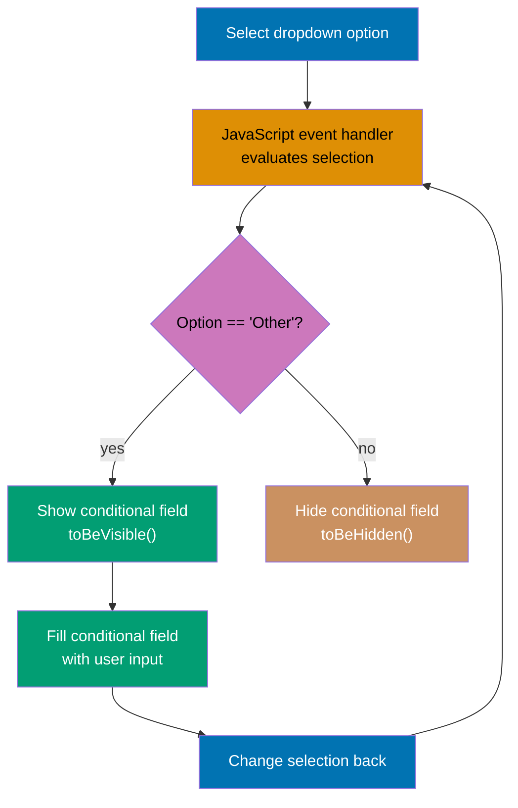

```typescript
import { test, expect } from "@playwright/test";

test("shows additional field when 'Other' selected", async ({ page }) => {
  // => Test conditional field visibility
  await page.goto("https://example.com/survey");
  // => Navigates to survey form

  await expect(page.getByLabel("Please specify")).toBeHidden();
  // => Confirms conditional field initially hidden
  // => Field doesn't exist in DOM or has display: none

  await page.getByLabel("How did you hear about us?").selectOption("Other");
  // => Selects 'Other' from dropdown
  // => Triggers conditional field visibility

  await expect(page.getByLabel("Please specify")).toBeVisible();
  // => Asserts conditional field now visible
  // => JavaScript toggled visibility based on selection

  await page.getByLabel("Please specify").fill("Friend's recommendation");
  // => Fills newly-visible text field
  // => Conditional input now accepts user data

  await page.getByLabel("How did you hear about us?").selectOption("Social Media");
  // => Changes selection back to non-conditional option
  // => Should hide conditional field again

  await expect(page.getByLabel("Please specify")).toBeHidden();
  // => Confirms conditional field hidden again
  // => Dynamic visibility works bidirectionally
});
```

**Key Takeaway**: Use toBeVisible/toBeHidden for conditional field testing. Test both appearance and disappearance of dynamic elements.

**Why It Matters**: Dynamic forms reduce cognitive load by showing only relevant fields. Conditional fields can reduce form abandonment but increase UI complexity. Testing visibility state changes ensures JavaScript logic works correctly—broken conditional logic frustrates users who can't access needed fields or are confused by irrelevant ones.

### Example 34: Date Pickers - Calendar Widget

Test date selection using calendar widgets. This handles complex date picker interactions common in booking and scheduling apps.

```typescript
import { test, expect } from "@playwright/test";

test("selects date from calendar widget", async ({ page }) => {
  // => Test calendar date picker
  await page.goto("https://example.com/booking");
  // => Navigates to booking page

  await page.getByLabel("Check-in Date").click();
  // => Opens calendar widget
  // => Triggers date picker overlay

  await page.getByRole("button", { name: "Next Month" }).click();
  // => Navigates calendar to next month
  // => Updates calendar display

  await page.getByRole("button", { name: "15" }).click();
  // => Selects 15th day from calendar
  // => Closes calendar and fills input

  await expect(page.getByLabel("Check-in Date")).toHaveValue(/2024-\d{2}-15/);
  // => Asserts date value in input field
  // => Regex matches YYYY-MM-15 format

  const selectedDate = await page.getByLabel("Check-in Date").inputValue();
  // => Retrieves selected date value
  // => Returns string like "2024-03-15"

  await page.getByLabel("Check-out Date").click();
  // => Opens check-out calendar
  await page.getByRole("button", { name: "20" }).filter({ hasText: /^20$/ }).click();
  // => Selects 20th day, filtering exact match
  // => Avoids selecting "20XX" year buttons

  const checkOutDate = await page.getByLabel("Check-out Date").inputValue();
  // => Retrieves check-out date value

  expect(new Date(checkOutDate) > new Date(selectedDate)).toBeTruthy();
  // => Asserts check-out after check-in
  // => Business logic validation
});
```

**Key Takeaway**: Use getByRole for calendar navigation and date selection. Validate date values in input fields, not just widget interactions.

**Why It Matters**: Date pickers are notoriously complex UI components with accessibility challenges. Calendar widgets can increase date entry errors compared to simple text inputs if implemented poorly. Testing date picker interactions ensures keyboard navigation, screen reader compatibility, and correct value population—critical for booking systems where date errors cause revenue loss.

### Example 35: Multi-Select - Checkbox Groups

Test multiple selection patterns using checkbox groups. This validates selection state management across related options.

```typescript
import { test, expect } from "@playwright/test";

test("selects multiple interests from checkbox group", async ({ page }) => {
  // => Test checkbox group multi-select
  await page.goto("https://example.com/preferences");
  // => Navigates to preferences form

  const programmingCheckbox = page.getByLabel("Programming");
  // => Locates programming checkbox
  const designCheckbox = page.getByLabel("Design");
  // => Locates design checkbox
  const marketingCheckbox = page.getByLabel("Marketing");
  // => Locates marketing checkbox

  await programmingCheckbox.check();
  // => Checks programming option
  // => Sets checked state to true

  await designCheckbox.check();
  // => Checks design option
  // => Independent of other checkboxes

  await expect(programmingCheckbox).toBeChecked();
  // => Asserts programming checked
  // => Verifies checked state persists

  await expect(designCheckbox).toBeChecked();
  // => Asserts design checked
  // => Both checkboxes selected simultaneously

  await expect(marketingCheckbox).not.toBeChecked();
  // => Asserts marketing unchecked
  // => Unselected options remain unchecked

  await programmingCheckbox.uncheck();
  // => Unchecks programming option
  // => Removes selection

  await expect(programmingCheckbox).not.toBeChecked();
  // => Confirms programming now unchecked
  await expect(designCheckbox).toBeChecked();
  // => Confirms design still checked
  // => Selections independent
});
```

**Key Takeaway**: Use check() and uncheck() methods instead of click() for checkbox state management. Assert checked state explicitly with toBeChecked.

**Why It Matters**: Checkbox groups allow users to select multiple options simultaneously, common in preference settings and filter interfaces. Checkbox state confusion causes many user support tickets—users don't understand whether checkboxes are selected. Testing explicit checked states ensures visual feedback matches data state, preventing silent data loss when forms submit with unexpected values.

### Example 36: Autocomplete - Search Suggestions

Test autocomplete/typeahead components that show suggestions as users type. This validates dynamic search filtering.

```typescript
import { test, expect } from "@playwright/test";

test("selects item from autocomplete suggestions", async ({ page }) => {
  // => Test autocomplete search
  await page.goto("https://example.com/search");
  // => Navigates to search page

  const searchInput = page.getByPlaceholder("Search for cities...");
  // => Locates search input by placeholder
  await searchInput.fill("San");
  // => Types partial query
  // => Triggers autocomplete suggestions

  await page.waitForSelector('[role="listbox"]');
  // => Waits for suggestions dropdown to appear
  // => Ensures suggestions loaded before interaction

  await expect(page.getByRole("option", { name: /San Francisco/ })).toBeVisible();
  // => Asserts San Francisco in suggestions
  // => Partial match shows relevant results

  await expect(page.getByRole("option", { name: /San Diego/ })).toBeVisible();
  // => Asserts San Diego in suggestions
  // => Multiple matching results displayed

  await page.getByRole("option", { name: /San Francisco/ }).click();
  // => Selects San Francisco from suggestions
  // => Fills input with selected value

  await expect(searchInput).toHaveValue("San Francisco");
  // => Asserts input filled with selected city
  // => Autocomplete completed input

  await expect(page.getByRole("listbox")).toBeHidden();
  // => Asserts suggestions dropdown closed
  // => Selection closes autocomplete
});
```

**Key Takeaway**: Wait for suggestions to load before interacting. Use role="option" to select autocomplete items accessibly.

**Why It Matters**: Autocomplete reduces typing effort and guides users toward valid options. Autocomplete improves query accuracy but adds timing complexity. Testing autocomplete requires waiting for asynchronous suggestion loading—race conditions between typing and suggestions appearing cause flaky tests that mask real bugs in debounce logic or API response handling.

### Example 37: Rich Text Editor - WYSIWYG Input

Test rich text editors with formatting controls. This validates WYSIWYG editor interactions and HTML content extraction.

```typescript
import { test, expect } from "@playwright/test";

test("formats text in rich text editor", async ({ page }) => {
  // => Test WYSIWYG editor formatting
  await page.goto("https://example.com/compose");
  // => Navigates to composition page

  const editor = page.locator('[contenteditable="true"]');
  // => Locates contenteditable div (editor)
  // => Rich text editors use contenteditable

  await editor.fill("Important announcement");
  // => Fills editor with plain text
  // => Sets innerHTML of contenteditable

  await editor.press("Control+A");
  // => Selects all text
  // => Keyboard shortcut for select all

  await page.getByRole("button", { name: "Bold" }).click();
  // => Clicks bold formatting button
  // => Applies <strong> or <b> tag to selection

  await expect(editor.locator("strong")).toHaveText("Important announcement");
  // => Asserts bold tag wraps text
  // => Verifies HTML structure created

  await editor.click();
  // => Focuses editor for additional input
  await editor.press("End");
  // => Moves cursor to end
  await editor.type(" - Please read");
  // => Appends additional text
  // => Text added to existing content

  await page.getByRole("button", { name: "Italic" }).click();
  // => Clicks italic button
  // => Applies to newly selected text

  const htmlContent = await editor.innerHTML();
  // => Retrieves HTML content from editor
  // => Returns full HTML structure

  expect(htmlContent).toContain("<strong>Important announcement</strong>");
  // => Asserts bold formatting present
  expect(htmlContent).toContain("Please read");
  // => Asserts appended text present
});
```

**Key Takeaway**: Use locator('[contenteditable="true"]') to target rich text editors. Validate HTML structure, not just visible text.

**Why It Matters**: WYSIWYG editors are critical for content management systems but notoriously difficult to test. Many content corruption bugs originate from incorrect HTML structure generation. Testing HTML output ensures formatting buttons create correct markup—visual appearance may match while underlying HTML is malformed, causing rendering issues or data loss when content is saved.

### Example 38: Drag-and-Drop - Reordering Items

Test drag-and-drop interactions for reordering lists. This validates mouse-based manipulation patterns.

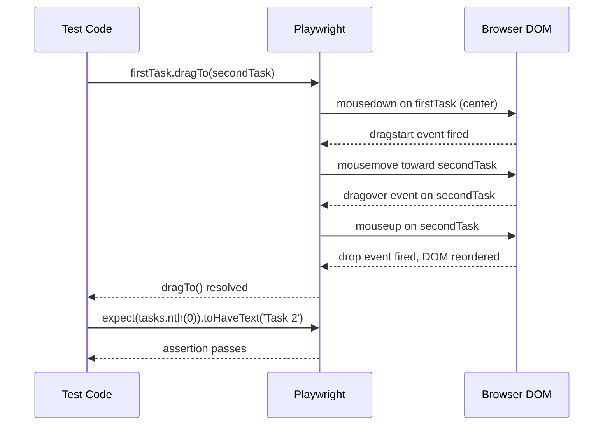

```typescript
import { test, expect } from "@playwright/test";

test("reorders items via drag and drop", async ({ page }) => {
  // => Test drag-and-drop reordering
  await page.goto("https://example.com/kanban");
  // => Navigates to kanban board

  const firstTask = page.locator('[data-task-id="1"]');
  // => Locates first task by data attribute
  const secondTask = page.locator('[data-task-id="2"]');
  // => Locates second task

  await expect(firstTask).toHaveText("Task 1");
  // => Confirms first task content
  await expect(secondTask).toHaveText("Task 2");
  // => Confirms second task content

  await firstTask.dragTo(secondTask);
  // => Drags first task to second task position
  // => Triggers drop event and reorder

  const tasks = page.locator("[data-task-id]");
  // => Locates all tasks after reorder
  await expect(tasks.nth(0)).toHaveText("Task 2");
  // => Asserts Task 2 now first
  // => Order changed successfully

  await expect(tasks.nth(1)).toHaveText("Task 1");
  // => Asserts Task 1 now second
  // => Drag-and-drop completed reorder
});
```

**Key Takeaway**: Use dragTo() method for drag-and-drop operations. Verify element order after drag completes, not during drag.

**Why It Matters**: Drag-and-drop provides intuitive reordering but requires complex mouse event sequences. Drag-and-drop reduces task organization time compared to modal-based reordering, but implementation is error-prone. Testing drag-and-drop validates mouse event handling, visual feedback during drag, and data persistence after drop—critical for kanban boards, file uploads, and priority management interfaces.

### Example 39: Range Slider - Numeric Input

Test range slider controls for numeric value selection. This validates slider interaction and value synchronization.

```typescript
import { test, expect } from "@playwright/test";

test("adjusts price range with sliders", async ({ page }) => {
  // => Test range slider interaction
  await page.goto("https://example.com/products");
  // => Navigates to product listing

  const minPriceSlider = page.locator('input[type="range"][name="minPrice"]');
  // => Locates minimum price slider
  const maxPriceSlider = page.locator('input[type="range"][name="maxPrice"]');
  // => Locates maximum price slider

  await minPriceSlider.fill("50");
  // => Sets minimum price to substantial amounts
  // => fill() works with range inputs

  await maxPriceSlider.fill("200");
  // => Sets maximum price to substantial amounts
  // => Programmatic value setting

  await expect(page.getByText("substantial amounts - substantial amounts")).toBeVisible();
  // => Asserts price range display updated
  // => UI reflects slider values

  const minValue = await minPriceSlider.inputValue();
  // => Retrieves current minimum value
  const maxValue = await maxPriceSlider.inputValue();
  // => Retrieves current maximum value

  expect(parseInt(minValue)).toBe(50);
  // => Validates minimum value numeric
  expect(parseInt(maxValue)).toBe(200);
  // => Validates maximum value numeric

  expect(parseInt(maxValue) > parseInt(minValue)).toBeTruthy();
  // => Asserts max greater than min
  // => Business logic validation
});
```

**Key Takeaway**: Use fill() to set range input values programmatically. Validate both slider state and corresponding UI display updates.

**Why It Matters**: Range sliders provide visual feedback for numeric input but synchronization between slider position and value display is error-prone. Many price filter bugs involve slider-value mismatches. Testing slider values ensures accessibility (keyboard users can set values), business logic validation (min < max), and UI synchronization—critical for e-commerce filters where incorrect ranges hide products users want to see.

### Example 40: Form Submission - Success and Error Handling

Test complete form submission lifecycle including success responses and server errors. This validates end-to-end form workflows.

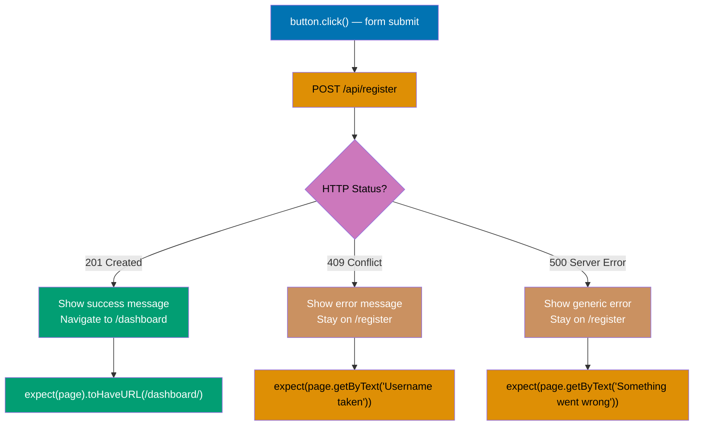

```typescript
import { test, expect } from "@playwright/test";

test("handles successful form submission", async ({ page }) => {
  // => Test successful submission flow
  await page.goto("https://example.com/register");
  // => Navigates to registration form

  await page.getByLabel("Username").fill("newuser123");
  // => Fills username field
  await page.getByLabel("Email").fill("newuser@example.com");
  // => Fills email field
  await page.getByLabel("Password").fill("SecurePass123!");
  // => Fills password field

  const responsePromise = page.waitForResponse(
    (response) => response.url().includes("/api/register") && response.status() === 201,
  );
  // => Waits for successful API response
  // => Status 201 indicates resource created

  await page.getByRole("button", { name: "Register" }).click();
  // => Submits registration form
  // => Triggers POST to /api/register

  await responsePromise;
  // => Ensures response received before assertion
  // => Prevents race condition

  await expect(page.getByText("Registration successful!")).toBeVisible();
  // => Asserts success message displayed
  // => User receives feedback

  await expect(page).toHaveURL(/\/dashboard/);
  // => Asserts navigation to dashboard
  // => Successful registration redirects user
});

test("handles server error during submission", async ({ page }) => {
  // => Test error handling flow
  await page.goto("https://example.com/register");
  // => Navigates to registration form

  await page.getByLabel("Username").fill("existinguser");
  // => Fills with username that already exists
  await page.getByLabel("Email").fill("existing@example.com");
  // => Fills with existing email
  await page.getByLabel("Password").fill("SecurePass123!");
  // => Fills password field

  const responsePromise = page.waitForResponse(
    (response) => response.url().includes("/api/register") && response.status() === 409,
  );
  // => Waits for conflict error response
  // => Status 409 indicates resource already exists

  await page.getByRole("button", { name: "Register" }).click();
  // => Submits registration form
  // => Server returns error

  await responsePromise;
  // => Ensures error response received

  await expect(page.getByText("Username already taken")).toBeVisible();
  // => Asserts error message displayed
  // => User informed of specific problem

  await expect(page).toHaveURL(/\/register/);
  // => Asserts user remains on registration page
  // => No navigation on error
});
```

**Key Takeaway**: Use waitForResponse to validate server communication. Test both success and error paths for complete form coverage.

**Why It Matters**: Forms bridge UI and backend systems—testing only UI interactions misses critical failure modes. Many form bugs occur in success/error handling, not input validation. Testing response handling ensures users receive appropriate feedback, data submits correctly, and errors are actionable. Network failures, server errors, and validation errors each require different user feedback patterns.

## Advanced Assertions (Examples 41-50)

### Example 41: URL Assertions - Navigation Validation

Test URL changes during navigation and after user actions. This validates routing and deep linking.

```typescript
import { test, expect } from "@playwright/test";

test("validates URL changes during multi-step flow", async ({ page }) => {
  // => Test URL assertions throughout flow
  await page.goto("https://example.com");
  // => Navigates to homepage

  await expect(page).toHaveURL("https://example.com/");
  // => Asserts exact URL match
  // => Confirms navigation completed

  await page.getByRole("link", { name: "Products" }).click();
  // => Clicks products navigation link
  // => Triggers route change

  await expect(page).toHaveURL(/\/products/);
  // => Asserts URL contains /products path
  // => Regex allows for query parameters

  await page.getByPlaceholder("Search products...").fill("laptop");
  // => Fills search input
  await page.keyboard.press("Enter");
  // => Submits search via Enter key

  await expect(page).toHaveURL(/\/products\?q=laptop/);
  // => Asserts URL includes query parameter
  // => Search term added to URL

  const url = new URL(page.url());
  // => Parses current URL for inspection
  expect(url.searchParams.get("q")).toBe("laptop");
  // => Validates query parameter value
  // => Ensures correct search term in URL

  await page.getByRole("link", { name: "Laptop Pro 15" }).click();
  // => Clicks product link
  await expect(page).toHaveURL(/\/products\/\d+/);
  // => Asserts URL matches product detail pattern
  // => Dynamic ID in URL path
});
```

**Key Takeaway**: Use toHaveURL with strings for exact matches, regex for patterns. Parse URLs with URL API for query parameter validation.

**Why It Matters**: URL structure affects SEO, deep linking, and browser history. Many users bookmark or share product URLs—incorrect URLs break navigation. Testing URL assertions validates routing logic, ensures query parameters persist correctly, and confirms single-page apps update browser history. URLs are the contract between frontend and backend routing systems.

### Example 42: Attribute Assertions - Element Properties

Test HTML element attributes that control behavior and styling. This validates data attributes, ARIA labels, and dynamic properties.

```typescript
import { test, expect } from "@playwright/test";

test("validates element attributes", async ({ page }) => {
  // => Test attribute assertions
  await page.goto("https://example.com/dashboard");
  // => Navigates to dashboard

  const profileButton = page.getByRole("button", { name: "Profile" });
  // => Locates profile button

  await expect(profileButton).toHaveAttribute("data-testid", "profile-btn");
  // => Asserts data attribute present
  // => Test ID attribute for stable selection

  await expect(profileButton).toHaveAttribute("aria-label", "Open profile menu");
  // => Asserts ARIA label for accessibility
  // => Screen readers use aria-label

  await profileButton.click();
  // => Opens profile dropdown
  // => May toggle aria-expanded

  await expect(profileButton).toHaveAttribute("aria-expanded", "true");
  // => Asserts expanded state attribute
  // => Dropdown open state communicated to AT

  const profileMenu = page.getByRole("menu");
  // => Locates profile menu dropdown
  await expect(profileMenu).toHaveAttribute("aria-labelledby", "profile-btn");
  // => Asserts menu labeled by button
  // => Accessibility relationship established

  const themeToggle = page.getByRole("switch", { name: "Dark Mode" });
  // => Locates theme toggle switch
  await expect(themeToggle).toHaveAttribute("aria-checked", "false");
  // => Asserts switch unchecked initially
  // => Dark mode disabled

  await themeToggle.click();
  // => Toggles dark mode on
  await expect(themeToggle).toHaveAttribute("aria-checked", "true");
  // => Asserts switch now checked
  // => State change reflected in attribute
});
```

**Key Takeaway**: Use toHaveAttribute to validate both data attributes and ARIA properties. Test attribute changes for interactive components.

**Why It Matters**: HTML attributes control accessibility, behavior, and testing stability. Many ARIA attribute errors involve incorrect state management. Testing attributes validates screen reader compatibility (aria-label, aria-expanded), component state (data-testid), and dynamic behavior (attribute changes on interaction). Data attributes provide stable selectors immune to text or style changes.

### Example 43: Element Count - Collection Assertions

Test the number of elements matching a selector. This validates list rendering, search results, and dynamic content.

```typescript
import { test, expect } from "@playwright/test";

test("validates search result count", async ({ page }) => {
  // => Test element count assertions
  await page.goto("https://example.com/products");
  // => Navigates to product listing

  const productCards = page.locator('[data-testid="product-card"]');
  // => Locates all product cards
  await expect(productCards).toHaveCount(20);
  // => Asserts 20 products displayed
  // => Default page size

  await page.getByPlaceholder("Search...").fill("laptop");
  // => Filters products by search term
  await page.keyboard.press("Enter");
  // => Submits search

  await expect(productCards).toHaveCount(5);
  // => Asserts filtered results count
  // => 5 products match "laptop"

  await page.getByLabel("Category").selectOption("Electronics");
  // => Applies category filter
  // => Narrows results further

  await expect(productCards).toHaveCount(3);
  // => Asserts combined filter count
  // => 3 products match both filters

  await page.getByRole("button", { name: "Clear Filters" }).click();
  // => Removes all filters
  await expect(productCards).toHaveCount(20);
  // => Asserts count back to default
  // => Filter reset successful
});
```

**Key Takeaway**: Use toHaveCount to assert exact element counts. Test count changes when filters or pagination change state.

**Why It Matters**: Element counts validate that filtering, pagination, and search work correctly. Count discrepancies are a key indicator of broken filtering logic. Testing counts ensures all matching items render, pagination displays correct totals, and filter combinations don't unexpectedly exclude results. Count mismatches signal data fetching bugs, race conditions, or incorrect query logic.

### Example 44: Screenshot Comparison - Visual Regression

Test visual appearance by comparing screenshots. This catches unintended UI changes across releases.

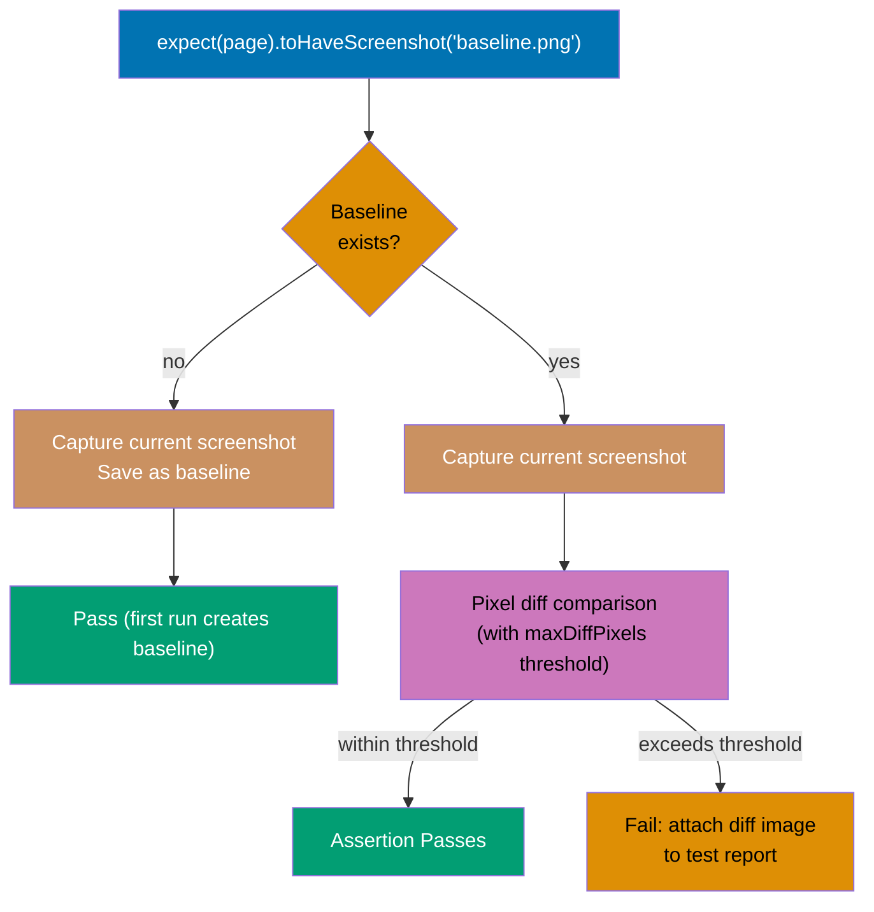

```typescript
import { test, expect } from "@playwright/test";

test("detects visual changes in button styling", async ({ page }) => {
  // => Test visual regression with screenshots
  await page.goto("https://example.com/components");
  // => Navigates to component showcase

  const primaryButton = page.getByRole("button", { name: "Primary Action" });
  // => Locates primary button

  await expect(primaryButton).toHaveScreenshot("primary-button.png");
  // => Captures button screenshot
  // => Compares against baseline image
  // => Fails if visual difference detected

  await page.getByRole("button", { name: "Toggle Dark Mode" }).click();
  // => Switches to dark theme
  // => Changes component appearance

  await expect(primaryButton).toHaveScreenshot("primary-button-dark.png");
  // => Captures dark mode screenshot
  // => Separate baseline for theme variant

  const cardComponent = page.locator('[data-testid="product-card"]').first();
  // => Locates product card component
  await expect(cardComponent).toHaveScreenshot("product-card.png", {
    // => Screenshot options
    maxDiffPixels: 100,
    // => Allows up to 100 pixels difference
    // => Tolerates minor rendering variations
  });
});
```

**Key Takeaway**: Use toHaveScreenshot for visual regression testing. Set maxDiffPixels threshold to tolerate minor rendering differences.

**Why It Matters**: Visual bugs slip past traditional assertions but frustrate users immediately. Many production bugs are visual regressions undetected by functional tests. Screenshot comparison catches CSS changes, layout shifts, font rendering issues, and theme problems. Anti-aliasing and font rendering vary across systems—maxDiffPixels threshold prevents flaky tests from rendering variations while catching real visual bugs.

### Example 45: Accessibility Assertions - Axe Integration

Test accessibility violations using axe-core integration. This validates WCAG compliance automatically.

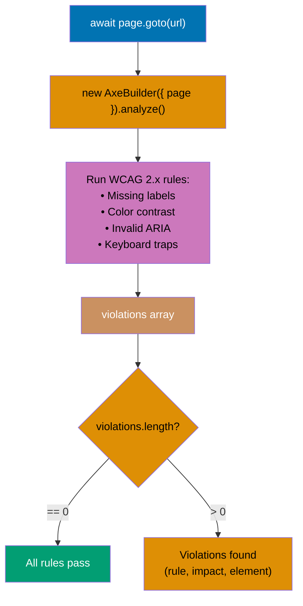

**Why this external dependency**: Playwright's built-in `accessibility()` snapshot API provides access to the accessibility tree for assertions on individual elements, but it does not detect WCAG rule violations automatically. `@axe-core/playwright` wraps the industry-standard axe-core engine, which tests pages against WCAG 2.x rules (missing labels, color contrast violations, invalid ARIA, keyboard traps, and more) in a single scan. Install with: `npm install @axe-core/playwright`.

```typescript
import { test, expect } from "@playwright/test";
import AxeBuilder from "@axe-core/playwright";

test("checks for accessibility violations", async ({ page }) => {
  // => Test accessibility with axe-core
  await page.goto("https://example.com/checkout");
  // => Navigates to checkout page
  // => Page will be scanned for WCAG violations

  const accessibilityScanResults = await new AxeBuilder({ page }).analyze();
  // => Runs axe-core accessibility scan on entire page
  // => Analyzes against WCAG 2.x rules (missing labels, contrast, ARIA)
  // => Returns object with violations array

  expect(accessibilityScanResults.violations).toEqual([]);
  // => Asserts no accessibility violations found
  // => Empty array means all WCAG rules pass

  await page.getByLabel("Card Number").fill("4111111111111111");
  // => Fills payment form field (test card number)
  await page.getByRole("button", { name: "Place Order" }).click();
  // => Submits order, triggers confirmation modal

  const confirmationScan = await new AxeBuilder({ page })
    .include("#confirmation-modal")
    // => .include() scopes scan to specific element
    // => Scans only the modal, not entire page
    .analyze();
  // => Returns violations for modal element only

  expect(confirmationScan.violations).toEqual([]);
  // => Asserts modal accessible
  // => Dialog focus management, ARIA roles correct
});
```

**Key Takeaway**: Use AxeBuilder for automated accessibility testing. Scan full pages and specific components after dynamic changes.

**Why It Matters**: Accessibility compliance is legal requirement in many jurisdictions and moral imperative for inclusive design. Automated testing catches a significant portion of WCAG violations—remaining 60% require manual testing, but 40% is significant. Axe-core detects missing labels, poor color contrast, invalid ARIA, keyboard traps, and heading structure issues. Testing accessibility programmatically prevents lawsuits and ensures disabled users can complete critical workflows.

### Example 46: Network Response Assertions - API Validation

Test network responses for data integrity and error handling. This validates API contract compliance.

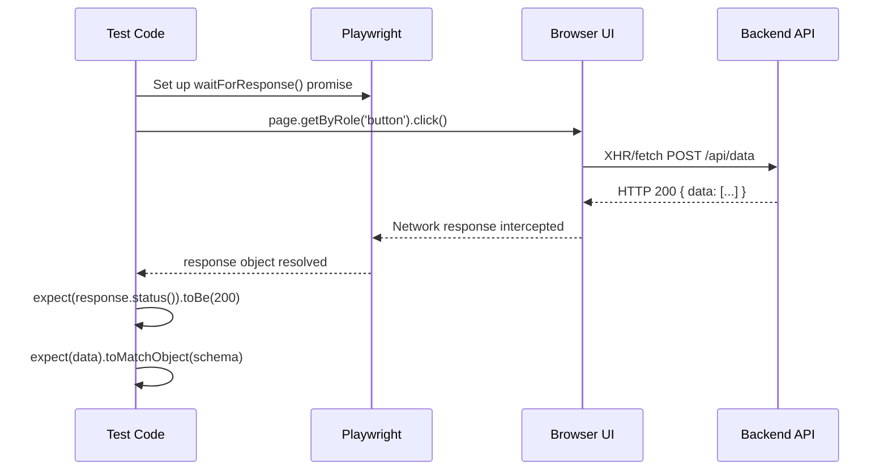

```typescript
import { test, expect } from "@playwright/test";

test("validates API response data structure", async ({ page }) => {
  // => Test API response assertions
  const responsePromise = page.waitForResponse((response) => response.url().includes("/api/users") && response.ok());
  // => Waits for successful users API call
  // => response.ok() means status 200-299

  await page.goto("https://example.com/admin/users");
  // => Navigates to user management page
  // => Triggers API request

  const response = await responsePromise;
  // => Captures response object
  const responseBody = await response.json();
  // => Parses JSON response body

  expect(response.status()).toBe(200);
  // => Asserts HTTP status code
  // => Successful request

  expect(responseBody).toHaveProperty("users");
  // => Asserts response has users array
  // => Expected data structure

  expect(Array.isArray(responseBody.users)).toBeTruthy();
  // => Validates users is array
  // => Not object or null

  expect(responseBody.users.length).toBeGreaterThan(0);
  // => Asserts users array not empty
  // => Contains data

  expect(responseBody.users[0]).toMatchObject({
    // => Validates user object structure
    id: expect.any(Number),
    // => ID is numeric
    name: expect.any(String),
    // => Name is string
    email: expect.stringMatching(/.+@.+\..+/),
    // => Email matches pattern
  });
});
```

**Key Takeaway**: Use waitForResponse to capture and validate API responses. Verify both HTTP status and response body structure.

**Why It Matters**: Frontend tests often miss API contract violations until production. Many production errors involve API response structure changes breaking frontend code. Testing response structure validates that backend sends expected data format, handles pagination correctly, and includes required fields. API contract tests prevent silent data loss when optional fields become required or data types change.

### Example 47: Custom Matchers - Domain-Specific Assertions

Create custom matchers for domain-specific validation. This improves test readability and reusability.

```typescript
import { test, expect } from "@playwright/test";
// => Import test runner and expect assertion library

// Extend Playwright's expect with custom matcher
// => expect.extend adds new assertion methods globally
expect.extend({
  // => Object where keys become new expect().methodName() calls
  async toHaveValidPrice(locator: Locator) {
    // => Custom matcher function: async, receives Locator
    const text = await locator.textContent();
    // => Gets element text content (e.g., "$29.99")
    const priceMatch = text?.match(/\$(\d+(?:\.\d{2})?)/);
    // => Extracts price from text using regex
    // => Regex matches $XX or $XX.XX format

    const pass = priceMatch !== null && parseFloat(priceMatch[1]) > 0;
    // => pass=true when: price found AND value > 0
    // => pass=false when: no match or zero/negative price

    return {
      // => Return object: Playwright reads message and pass
      message: () =>
        // => message(): function returning error string
        pass
          ? `Expected price to be invalid, but got ${text}`
          : // => .not.toHaveValidPrice() failure message
            `Expected valid price (e.g., substantial amounts.99), but got ${text}`,
      // => Regular toHaveValidPrice() failure message
      // => message(): called when assertion fails
      // => Different message for .not and normal usage
      pass,
      // => Playwright uses pass to determine success/failure
    };
  },
});

test("validates product prices with custom matcher", async ({ page }) => {
  // => Test using custom price matcher
  await page.goto("https://example.com/products");
  // => Navigates to product listing page

  const productPrice = page.locator('[data-testid="product-price"]').first();
  // => Locates first product price element by test ID
  await expect(productPrice).toHaveValidPrice();
  // => Calls custom matcher: validates "$XX.XX" format
  // => Fails if price missing, zero, or malformatted

  const allPrices = page.locator('[data-testid="product-price"]');
  // => Locates ALL product price elements
  for (const price of await allPrices.all()) {
    // => Iterates over each price element (array of Locators)
    await expect(price).toHaveValidPrice();
    // => Validates each price individually
    // => Custom matcher reused across all products
  }
});
```

**Key Takeaway**: Use expect.extend to create custom matchers for domain-specific patterns. Custom matchers improve test readability and reduce duplication.

**Why It Matters**: Generic assertions don't express domain concepts clearly. Custom matchers can reduce test maintenance by centralizing validation logic. Custom matchers like toHaveValidPrice, toBeWithinDateRange, or toMatchPhoneFormat make tests self-documenting and easier to maintain. Domain logic changes once in the matcher instead of across dozens of tests.

### Example 48: Soft Assertions - Continue After Failures

Use soft assertions to collect multiple failures in a single test run. This validates multiple conditions without stopping at the first failure.

```typescript
import { test, expect } from "@playwright/test";

test("validates all form fields with soft assertions", async ({ page }) => {
  // => Test with soft assertions
  await page.goto("https://example.com/profile");
  // => Navigates to profile page

  // Soft assertions don't stop test execution
  await expect.soft(page.getByLabel("Username")).toHaveValue(/\w+/);
  // => Soft assert username has value
  // => Test continues even if fails

  await expect.soft(page.getByLabel("Email")).toHaveValue(/.+@.+\..+/);
  // => Soft assert email format valid
  // => Continues to next assertion

  await expect.soft(page.getByLabel("Bio")).toHaveValue(/.{10,}/);
  // => Soft assert bio minimum length
  // => Continues collecting failures

  await expect.soft(page.getByLabel("Location")).toHaveValue(/\w+/);
  // => Soft assert location has value
  // => All assertions execute

  // Test fails only after all soft assertions collected
  // => Reports all failures together
  // => Shows complete validation picture
});
```

**Key Takeaway**: Use expect.soft() to continue test execution after assertion failures. Soft assertions collect all failures for comprehensive validation.

**Why It Matters**: Hard assertions stop at first failure, hiding subsequent issues. Soft assertions can reduce debugging time by revealing all problems simultaneously. Soft assertions are ideal for validating multiple fields, checking responsive layouts across breakpoints, or auditing pages for compliance violations. Seeing all failures at once prevents fix-test-fix-test cycles that waste developer time.

### Example 49: Polling Assertions - Wait for Conditions

Use polling assertions to wait for conditions that update asynchronously. This handles dynamic content updates.

```typescript
import { test, expect } from "@playwright/test";
// => Import test and expect from Playwright

test("waits for real-time update to appear", async ({ page }) => {
  // => Test polling assertions for async updates
  await page.goto("https://example.com/dashboard");
  // => Navigates to live dashboard with real-time features

  const notificationBadge = page.locator('[data-testid="notification-count"]');
  // => Locates notification counter by test ID
  await expect(notificationBadge).toHaveText("0");
  // => Asserts initial state: no notifications
  // => Baseline before triggering change

  // Simulate triggering notification (e.g., WebSocket message)
  await page.evaluate(() => {
    // => Executes JavaScript in browser context
    (window as any).simulateNotification();
    // => Calls global function to simulate notification
    // => Triggers WebSocket/server-sent event
  });
  // => Browser state updated asynchronously

  await expect(notificationBadge).toHaveText("1", { timeout: 5000 });
  // => Waits up to 5 seconds for count to update to "1"
  // => Polls every ~100ms until condition met or timeout
  // => Auto-retry handles asynchronous state updates

  await expect
    .poll(
      async () => {
        // => Custom polling function executed repeatedly
        const text = await notificationBadge.textContent();
        // => Reads current badge text on each poll
        return parseInt(text || "0");
        // => Returns numeric value for comparison
      },
      {
        timeout: 10000,
        // => Max wait time: 10 seconds
        intervals: [100, 250, 500],
        // => Polling intervals: 100ms, 250ms, 500ms (backoff)
      },
    )
    // => .poll().toBeGreaterThan(0): assertion on polled value
    .toBeGreaterThan(0);
  // => Asserts count eventually becomes positive (> 0)
  // => expect.poll retries until assertion passes or timeout
});
```

**Key Takeaway**: Use timeout option for built-in assertions waiting for async updates. Use expect.poll() for custom polling logic.

**Why It Matters**: Modern web apps update asynchronously via WebSockets, polling, or real-time APIs. Much test flakiness comes from incorrect wait strategies. Polling assertions provide explicit wait conditions for dynamic content. Default timeouts (30 seconds) work for most cases, but configurable intervals optimize test speed—short intervals for fast updates, longer intervals for slow polling endpoints.

### Example 50: Negative Assertions - Verify Absence

Test that elements or content do NOT exist or appear. This validates security controls and conditional rendering.

```typescript
import { test, expect } from "@playwright/test";

test("verifies admin panel hidden from regular users", async ({ page }) => {
  // => Test negative assertions
  await page.goto("https://example.com/dashboard");
  // => Navigates as regular user

  await expect(page.getByRole("link", { name: "Admin Panel" })).not.toBeVisible();
  // => Asserts admin link not visible
  // => Access control validation

  await expect(page.getByRole("link", { name: "Admin Panel" })).toHaveCount(0);
  // => Asserts admin link doesn't exist in DOM
  // => Stronger assertion than not.toBeVisible

  await expect(page.locator('[data-admin-only="true"]')).toHaveCount(0);
  // => Asserts no admin-only elements present
  // => Validates no admin features leaked

  await page.getByRole("button", { name: "Settings" }).click();
  // => Opens settings menu
  await expect(page.getByText("Delete All Users")).not.toBeVisible();
  // => Asserts dangerous action hidden
  // => Security feature validation

  await expect(page.getByRole("dialog")).not.toBeAttached();
  // => Asserts no modal dialog present
  // => not.toBeAttached checks DOM presence
  // => Differentiates from hidden modals
});
```

**Key Takeaway**: Use not.toBeVisible to assert elements hidden, toHaveCount(0) to assert elements absent from DOM. Choose assertion based on whether elements should exist but be hidden.

**Why It Matters**: Security bugs often involve showing restricted content to unauthorized users. Many access control bugs are UI-level leaks where API correctly restricts access but UI shows restricted options. Testing absence validates that admin features, premium content, or sensitive data don't appear to unauthorized users. Differentiating "not visible" (exists but hidden) from "not present" (doesn't exist) matters for performance and security.

## API Testing (Examples 51-55)

### Example 51: API Request Basics - REST Endpoint Testing

Test API endpoints directly using Playwright's request context. This validates backend behavior without UI interaction.

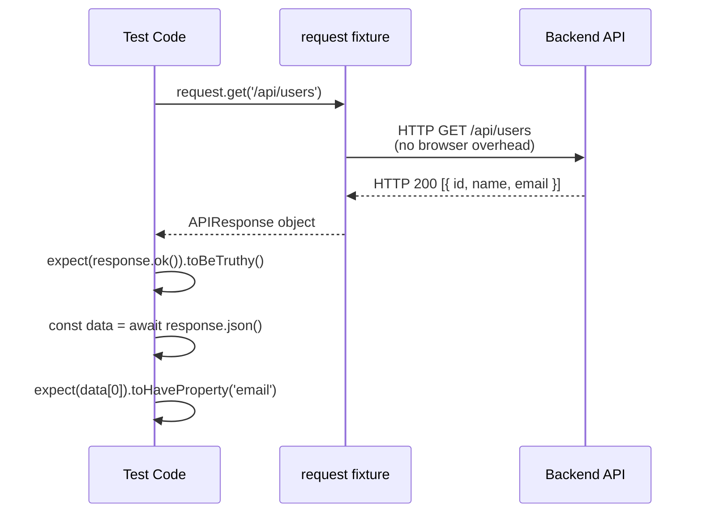

```typescript
import { test, expect } from "@playwright/test";
// => Import test and expect from Playwright

test("sends GET request to fetch user data", async ({ request }) => {
  // => request: Playwright's API request fixture
  // => No browser overhead - pure HTTP requests
  const response = await request.get("https://api.example.com/users/1");
  // => Sends GET request to user endpoint
  // => Returns APIResponse object
  // => Awaits HTTP response before continuing

  expect(response.ok()).toBeTruthy();
  // => response.ok() returns true for 200-299 status codes
  // => Asserts successful response
  expect(response.status()).toBe(200);
  // => Asserts specific HTTP status code is 200

  const userData = await response.json();
  // => Parses JSON response body asynchronously
  // => Returns parsed JavaScript object
  expect(userData).toMatchObject({
    // => Validates response contains expected shape (partial match)
    id: 1,
    // => User ID 1 was requested and returned
    name: expect.any(String),
    // => expect.any(String): name exists and is any string
    email: expect.stringMatching(/.+@.+\..+/),
    // => Email matches basic email format regex
  });
  // => toMatchObject allows extra fields (partial match)
});

test("sends POST request to create user", async ({ request }) => {
  // => Test API POST endpoint for resource creation
  const newUser = {
    // => Request payload (will be serialized as JSON)
    name: "Alice Smith",
    // => User's full name
    email: "alice@example.com",
    // => Unique email address
    role: "user",
    // => Role determines permissions
  };

  const response = await request.post("https://api.example.com/users", {
    data: newUser,
    // => data: automatically serialized to JSON
    // => Sets Content-Type: application/json header
  });
  // => Sends POST request with newUser as body

  expect(response.status()).toBe(201);
  // => 201 Created: HTTP standard for successful resource creation
  const createdUser = await response.json();
  // => Parses the response body (created user object)
  expect(createdUser).toMatchObject(newUser);
  // => Validates server echoed back the submitted data
  expect(createdUser.id).toBeDefined();
  // => Asserts server assigned a database ID to new user
});
```

**Key Takeaway**: Use request fixture for API testing without browser overhead. Validate both response status and body structure.

**Why It Matters**: API testing is significantly faster than UI testing for backend logic validation. Test pyramid recommends more unit tests than API tests, and more API tests than UI tests for optimal speed and coverage. Testing APIs directly validates business logic, data persistence, and error handling without browser rendering overhead. API tests run in milliseconds vs. seconds for UI tests, enabling rapid TDD cycles.

### Example 52: API Authentication - Bearer Token and Cookies

Test API endpoints requiring authentication. This validates auth flows and protected endpoint access.

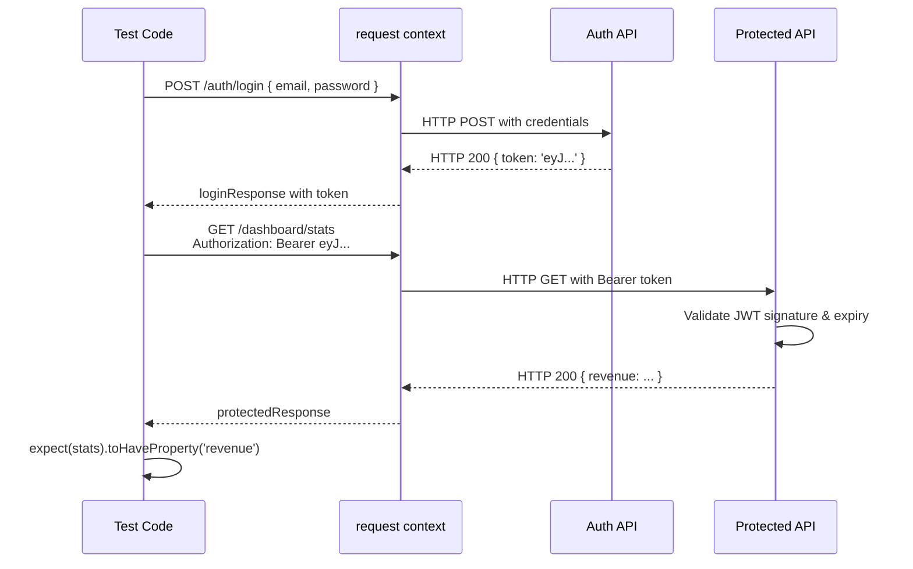

```typescript
import { test, expect } from "@playwright/test";
// => Import test runner and assertion library

test("authenticates with bearer token", async ({ request }) => {
  // => Test API authentication with JWT bearer token
  const loginResponse = await request.post("https://api.example.com/auth/login", {
    // => POST request to authentication endpoint
    data: {
      // => Login credentials as JSON body
      email: "user@example.com",
      // => Test account email
      password: "SecurePass123!",
      // => Test account password
    },
  });
  // => Returns 200 with JWT token in body

  const { token } = await loginResponse.json();
  // => Destructures token from JSON response
  // => token: "eyJhbGciOi..." (JWT format)
  expect(token).toBeDefined();
  // => Validates token string received from auth endpoint

  const protectedResponse = await request.get("https://api.example.com/dashboard/stats", {
    headers: {
      // => headers: object with HTTP request headers
      Authorization: `Bearer ${token}`,
      // => Authorization header: "Bearer eyJhbGci..."
      // => Standard JWT bearer token format (RFC 6750)
    },
  });
  // => Sends GET request with token in Authorization header

  expect(protectedResponse.ok()).toBeTruthy();
  // => Asserts 200 status: server accepted the token
  const stats = await protectedResponse.json();
  // => Parses dashboard statistics response body
  expect(stats).toHaveProperty("revenue");
  // => Asserts protected data (revenue) received
  // => toHaveProperty: checks nested property exists
});

test("authenticates with session cookies", async ({ request, context }) => {
  // => Test cookie-based session authentication
  // => context: browser context that stores cookies
  await request.post("https://api.example.com/auth/login", {
    // => POST to login endpoint
    data: {
      // => Login credentials
      email: "user@example.com",
      // => Test account email
      password: "SecurePass123!",
      // => Test account password
    },
  });
  // => Server sets Set-Cookie: session=... header
  // => Playwright's request context stores cookie automatically

  const profileResponse = await request.get("https://api.example.com/profile");
  // => GET request: Playwright sends stored session cookie
  // => Cookie header included automatically by request context

  expect(profileResponse.ok()).toBeTruthy();
  // => Asserts 200 status: session cookie validated by server
  const profile = await profileResponse.json();
  // => Parses user profile from response body
  expect(profile.email).toBe("user@example.com");
  // => Validates server returned the correct user's profile
});
```

**Key Takeaway**: Use headers option for bearer token auth, request context automatically handles cookies. Store tokens for reuse across requests.

**Why It Matters**: Authentication testing validates security controls and session management. Many authentication bugs involve token handling errors—expired tokens, missing refresh, or token leakage. Testing authentication flows ensures protected endpoints reject unauthenticated requests, tokens work across requests, and session cookies persist correctly. API-level auth tests run faster than UI login flows while providing better security validation.

### Example 53: API Mocking - Stubbing External Services

Mock API responses to test frontend behavior in isolation. This enables testing error conditions and edge cases.

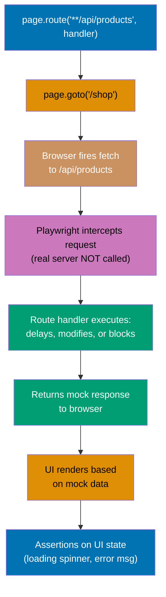

```typescript
import { test, expect } from "@playwright/test";
// => Import test runner and expect

test("mocks API to simulate slow response", async ({ page }) => {
  // => Test loading state UI with mocked slow API
  await page.route("**/api/products", async (route) => {
    // => page.route intercepts matching network requests
    // => "**" glob matches any domain prefix
    await new Promise((resolve) => setTimeout(resolve, 3000));
    // => Delays response by 3 seconds (simulates slow network)
    // => Frontend should show loading state during this time

    await route.fulfill({
      // => route.fulfill: send mock HTTP response
      status: 200,
      // => HTTP 200 OK
      contentType: "application/json",
      // => Sets Content-Type header for JSON
      body: JSON.stringify({
        // => JSON.stringify converts object to string
        products: [
          // => Array of mock product objects
          { id: 1, name: "Laptop", price: 999 },
          // => Mock product 1: Laptop at $999
          { id: 2, name: "Mouse", price: 29 },
          // => Mock product 2: Mouse at $29
        ],
        // => Array of product objects
      }),
      // => body: JSON string for response
    });
    // => Route fulfilled with mock data
  });
  // => Route handler registered (not called yet)

  await page.goto("https://example.com/shop");
  // => Navigation triggers XHR to /api/products
  // => Intercepted: response delayed 3 seconds

  await expect(page.getByText("Loading...")).toBeVisible();
  // => Asserts loading indicator appears during 3s delay
  // => Validates UI shows loading state correctly

  await expect(page.getByText("Laptop")).toBeVisible({ timeout: 5000 });
  // => Waits up to 5s for mocked "Laptop" to appear
  // => Mock response rendered by frontend
});

test("mocks API to simulate error response", async ({ page }) => {
  // => Test error handling UI with mocked API failure
  // => Different test: same route, different mock response
  await page.route("**/api/products", async (route) => {
    // => Intercepts products API requests
    await route.fulfill({
      status: 500,
      // => HTTP 500 Internal Server Error
      contentType: "application/json",
      body: JSON.stringify({
        error: "Internal server error",
        // => Error details in response body
      }),
    });
  });
  // => All /api/products requests return 500

  await page.goto("https://example.com/shop");
  // => Page loads, API call returns mocked 500 error

  await expect(page.getByText("Failed to load products. Please try again.")).toBeVisible();
  // => Asserts user-facing error message displayed
  // => Frontend gracefully handles 500 response
});
```

**Key Takeaway**: Use page.route to intercept and mock API requests. Mock slow responses, errors, and edge cases impossible to reliably trigger with real API.

**Why It Matters**: Real APIs are unreliable test dependencies—external services fail, rate limits trigger, or test data changes. Mocked API tests are significantly faster and more reliable than tests hitting real APIs. Mocking enables testing error states (500 errors, timeouts), loading states (slow responses), and edge cases (empty results, pagination boundaries) that are difficult or impossible to reproduce consistently with real backend services.

### Example 54: API Test Fixtures - Reusable Setup

Create test fixtures for API authentication and data setup. This reduces duplication in API tests.

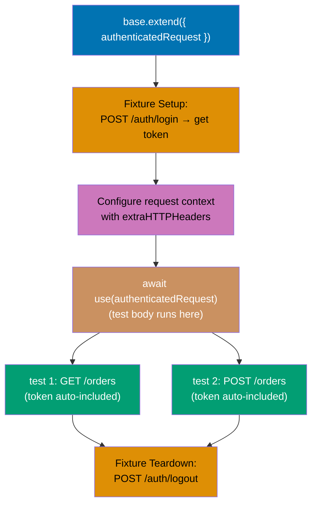

```typescript
import { test as base, expect } from "@playwright/test";
// => Import base test for extension, expect for assertions

// Extend base test with API auth fixture
// => base.extend creates a new test function with custom fixtures
const test = base.extend<{ authenticatedRequest: APIRequestContext }>({
  // => Type parameter: defines shape of custom fixtures object
  authenticatedRequest: async ({ request }, use) => {
    // => Fixture function: setup → use → teardown pattern
    // => request: built-in Playwright API request context
    const loginResponse = await request.post("https://api.example.com/auth/login", {
      // => POST to auth endpoint
      data: {
        // => Login credentials for obtaining auth token
        email: "test@example.com",
        // => Fixture test account email
        password: "TestPass123!",
        // => Fixture test account password
      },
    });
    // => loginResponse: HTTP 200 with token in body

    const { token } = await loginResponse.json();
    // => Destructures token from login response
    // => token: "eyJhbGci..." (JWT string)

    const authenticatedRequest = request;
    // => Reuses existing request context reference
    await authenticatedRequest.use({
      // => .use() configures request context defaults
      extraHTTPHeaders: {
        // => extraHTTPHeaders: added to every request automatically
        Authorization: `Bearer ${token}`,
        // => All subsequent requests include this header
        // => No need to add manually in each test
      },
    });
    // => Request context now pre-configured with auth

    await use(authenticatedRequest);
    // => Yields authenticated request to test body
    // => Test runs between use() call and completion

    // Cleanup after test
    await request.post("https://api.example.com/auth/logout");
    // => Invalidates server session after test completes
    // => Cleanup runs even if test fails
  },
});

test("fetches user orders with auth fixture", async ({ authenticatedRequest }) => {
  // => Fixture injected: authenticatedRequest has token pre-configured
  const response = await authenticatedRequest.get("https://api.example.com/orders");
  // => GET /orders with Authorization header automatically included
  // => Token added by fixture - no manual handling needed

  expect(response.ok()).toBeTruthy();
  // => Asserts 200 status: authenticated request succeeded
  const orders = await response.json();
  // => Parses orders array from response
  expect(orders.length).toBeGreaterThan(0);
  // => Validates at least one order returned
});

test("creates new order with auth fixture", async ({ authenticatedRequest }) => {
  // => Second test reusing same auth fixture - zero login duplication
  const newOrder = {
    productId: 123,
    // => Product to order
    quantity: 2,
    // => How many units
  };

  const response = await authenticatedRequest.post("https://api.example.com/orders", {
    data: newOrder,
    // => Request body with order data
  });
  // => POST /orders with auth token auto-included

  expect(response.status()).toBe(201);
  // => Asserts HTTP 201 Created: order successfully created
});
```

**Key Takeaway**: Extend base test with API fixtures for reusable authentication. Fixtures handle setup and cleanup automatically.

**Why It Matters**: API test duplication wastes time and makes tests fragile. Much API test code involves duplicated authentication setup. Fixtures centralize authentication, eliminate token management boilerplate, and ensure consistent cleanup. When auth logic changes, update the fixture once instead of dozens of tests. Fixtures also enable testing with different user roles by creating multiple authenticated request fixtures.

### Example 55: Combined UI and API Testing - Hybrid Validation

Combine UI interactions with API assertions for comprehensive validation. This tests both user experience and data integrity.

```typescript
import { test, expect } from "@playwright/test";

test("validates UI form submission creates API resource", async ({ page, request }) => {
  // => Hybrid test: UI interaction + API validation
  // => page: browser page, request: API client (both fixtures)
  await page.goto("https://example.com/products/new");
  // => Navigates to product creation form

  await page.getByLabel("Product Name").fill("Wireless Keyboard");
  // => Fills product name via UI (user perspective)
  await page.getByLabel("Price").fill("79.99");
  // => Fills price field
  await page.getByLabel("Category").selectOption("Electronics");
  // => Selects category from dropdown

  const responsePromise = page.waitForResponse(
    (response) => response.url().includes("/api/products") && response.status() === 201,
  );
  // => Sets up intercept BEFORE click (avoids race condition)
  // => Waits for specific URL + status code match

  await page.getByRole("button", { name: "Create Product" }).click();
  // => Triggers form submission, fires XHR to /api/products

  const response = await responsePromise;
  // => Resolves when intercepted response arrives
  const createdProduct = await response.json();
  // => Parses product data from API response

  expect(createdProduct.name).toBe("Wireless Keyboard");
  // => Validates API stored correct product name
  expect(createdProduct.price).toBe(79.99);
  // => Validates price stored as number (not string)

  // Verify product appears in UI
  await expect(page.getByText("Product created successfully")).toBeVisible();
  // => Asserts success notification shown to user

  // Verify product persisted via API GET
  const fetchResponse = await request.get(`https://api.example.com/products/${createdProduct.id}`);
  // => Direct API GET to verify persistence in database
  // => Uses request fixture (no browser)

  const fetchedProduct = await fetchResponse.json();
  // => Gets stored product from API
  expect(fetchedProduct).toMatchObject(createdProduct);
  // => Confirms data persisted correctly
  // => Complete chain: UI → API create → Database → API read
});
```

**Key Takeaway**: Combine UI interactions with API validation for end-to-end testing. Verify both user experience and data persistence.

**Why It Matters**: UI tests alone miss data corruption bugs; API tests alone miss user experience issues. Hybrid tests can catch more bugs than separate UI or API tests. Hybrid testing validates complete workflows: UI submits correctly, API processes correctly, data persists correctly, and subsequent API reads return correct data. This approach catches integration bugs where UI and backend disagree on data format or validation rules.

## Test Organization (Examples 56-60)

### Example 56: Page Object Model Basics - Encapsulation

Create page objects to encapsulate page-specific locators and actions. This improves test maintainability and reduces duplication.

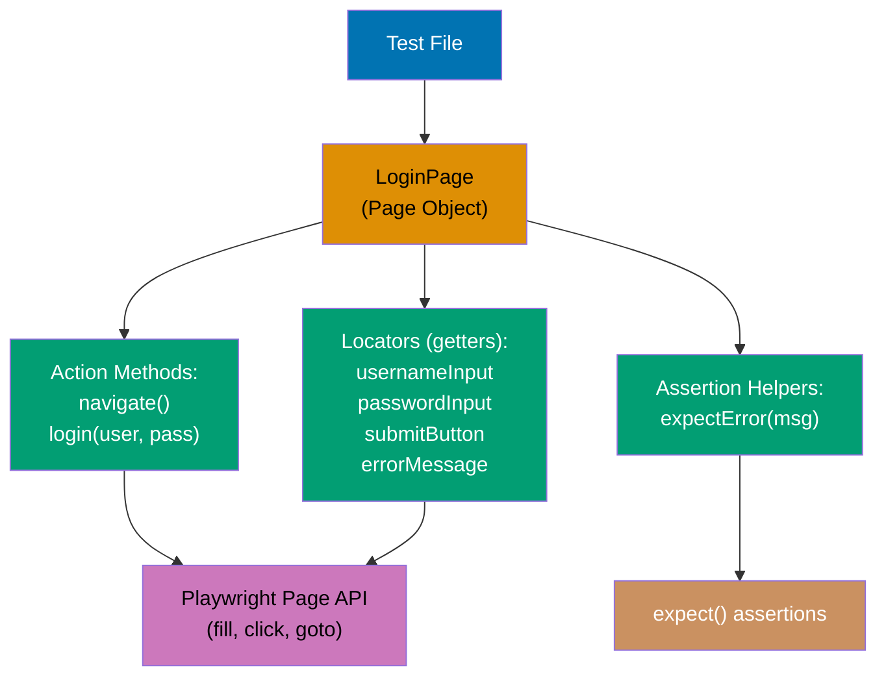

```typescript
import { test, expect, type Page } from "@playwright/test";
// => Import test runner, assertions, and Page type

class LoginPage {
  // => Page Object class encapsulating login page
  readonly page: Page;
  // => readonly: page reference never changes after construction

  constructor(page: Page) {
    // => Constructor receives Playwright Page object
    this.page = page;
    // => Stores reference for use in methods
  }

  // Locators defined as getters (evaluated lazily)
  get usernameInput() {
    // => Getter creates locator on every access (lazy)
    return this.page.getByLabel("Username");
    // => Returns Locator (not DOM element yet)
  }
  // => usernameInput getter defined

  get passwordInput() {
    // => Getter for password input field
    return this.page.getByLabel("Password");
    // => Locator re-evaluated each time (handles DOM updates)
  }
  // => passwordInput getter defined

  get submitButton() {
    // => Getter for login submit button
    return this.page.getByRole("button", { name: "Log In" });
    // => Locates by ARIA role + accessible name
  }
  // => submitButton getter defined

  get errorMessage() {
    // => Getter for error alert element
    return this.page.getByRole("alert");
    // => ARIA role "alert" used for error messages
  }
  // => errorMessage getter defined

  // Action methods combining multiple locator interactions
  async navigate() {
    // => Encapsulates login URL - single place to update
    await this.page.goto("https://example.com/login");
    // => Navigates to login page
  }
  // => navigate() method: URL encapsulated

  async login(username: string, password: string) {
    // => High-level login action: three steps as one method
    await this.usernameInput.fill(username);
    // => Fills username using page object's locator getter
    await this.passwordInput.fill(password);
    // => Fills password field
    await this.submitButton.click();
    // => Submits form, triggers navigation
  }
  // => login() method encapsulates 3-step login process

  async expectError(message: string) {
    // => Assertion method: encapsulates error verification
    await expect(this.errorMessage).toContainText(message);
    // => Asserts alert element contains expected error text
  }
  // => expectError(): assertion helper encapsulated in page object
}
// => LoginPage class complete: locators + actions + assertions

test("logs in successfully with page object", async ({ page }) => {
  // => Test uses page object API (high-level methods)
  const loginPage = new LoginPage(page);
  // => Creates LoginPage instance, passing Playwright page

  await loginPage.navigate();
  // => Navigates to login page (URL encapsulated in page object)
  await loginPage.login("testuser", "TestPass123!");
  // => Calls login method (fills fields + clicks - 3 actions in 1)

  await expect(page).toHaveURL(/\/dashboard/);
  // => Asserts URL changed to dashboard after successful login
  // => Test reads as user narrative: navigate → login → verify
});

test("shows error for invalid credentials", async ({ page }) => {
  // => Tests error path using same page object
  const loginPage = new LoginPage(page);
  // => Same page object, different scenario

  await loginPage.navigate();
  // => Goes to login page
  await loginPage.login("wronguser", "wrongpass");
  // => Submits invalid credentials (triggers error)

  await loginPage.expectError("Invalid username or password");
  // => Verifies error message via page object helper
  // => No raw locators in test - all encapsulated
});
```

**Key Takeaway**: Page objects encapsulate locators and actions for specific pages. Tests use high-level methods instead of low-level locator calls.

**Why It Matters**: Direct locator usage creates fragile tests—when UI changes, every test using that locator breaks. Page object pattern significantly reduces test maintenance burden. Page objects provide single source of truth for locators—when "Username" label changes to "Email", update one getter instead of 50 tests. Page objects also improve readability—`loginPage.login(user, pass)` is clearer than three fill/click calls.

### Example 57: Test Fixtures - Custom Setup and Teardown

Create custom test fixtures for reusable setup, teardown, and test data. This eliminates duplication across tests.

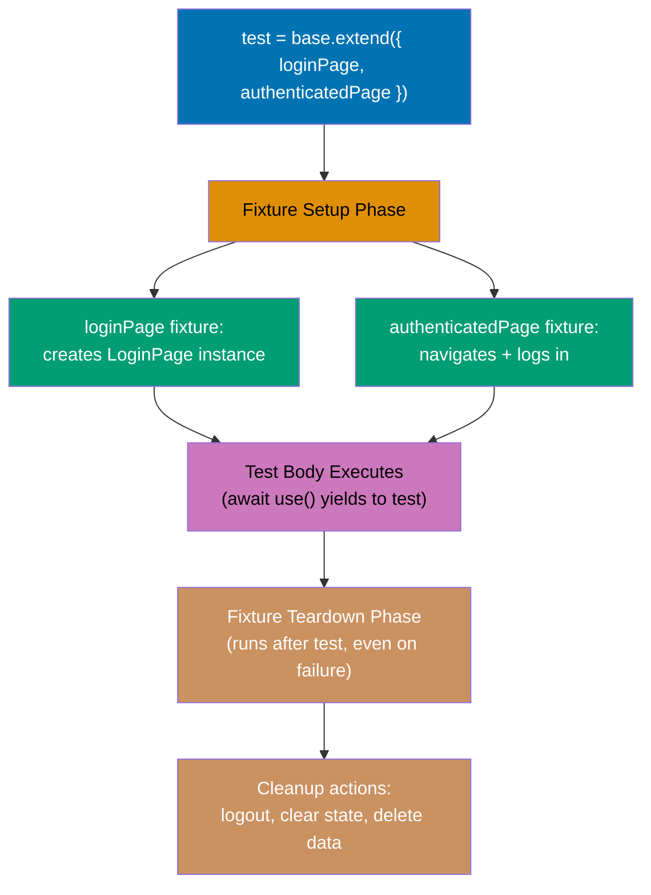

```typescript
import { test as base, expect, Page } from "@playwright/test";
// => Import base test for extending, expect, and Page type

// LoginPage class defined inline (self-contained example)
class LoginPage {
  // => Simple LoginPage page object for fixture use
  readonly page: Page;
  // => readonly: page reference cannot be reassigned

  constructor(page: Page) {
    // => Receives Playwright Page from fixture
    this.page = page;
    // => Stores page reference for method use
  }

  async goto(): Promise<void> {
    // => Navigates to login URL
    await this.page.goto("https://example.com/login");
    // => Encapsulates login URL in page object
  }
  // => goto() method: one-line navigation action

  async login(username: string, password: string): Promise<void> {
    // => Performs complete login sequence
    await this.page.getByLabel("Username").fill(username);
    // => Fills username field with provided value
    await this.page.getByLabel("Password").fill(password);
    // => Fills password field
    await this.page.getByRole("button", { name: "Log In" }).click();
    // => Clicks submit button
    await this.page.waitForURL(/\/dashboard/);
    // => Awaits redirect to dashboard (post-login)
  }
  // => login() method complete: fills, clicks, waits
}
// => LoginPage class complete

type CustomFixtures = {
  // => TypeScript type for fixture parameter injection
  loginPage: LoginPage;
  // => LoginPage page object (injected as fixture)
  authenticatedPage: Page;
  // => Playwright Page already logged in
};
// => CustomFixtures: shape of extended test's injected params

const test = base.extend<CustomFixtures>({
  // => Creates new test function with custom fixtures
  loginPage: async ({ page }, use) => {
    // => Setup: create LoginPage instance
    const loginPage = new LoginPage(page);
    // => Constructs page object with test's page
    await use(loginPage);
    // => Yields loginPage to test body
    // => Cleanup: none needed (page auto-closed)
  },

  authenticatedPage: async ({ page }, use) => {
    // => Setup: perform login before test
    await page.goto("https://example.com/login");
    // => Navigates to login page
    await page.getByLabel("Username").fill("testuser");
    // => Fills username
    await page.getByLabel("Password").fill("TestPass123!");
    // => Fills password
    await page.getByRole("button", { name: "Log In" }).click();
    // => Submits login form

    await page.waitForURL(/\/dashboard/);
    // => Waits for redirect to dashboard
    // => Page is now authenticated and ready

    await use(page);
    // => Yields authenticated page to test

    // Cleanup: logout after test completes
    await page.goto("https://example.com/logout");
    // => Invalidates session (cleanup runs after test)
  },
});

test("navigates to settings from dashboard", async ({ authenticatedPage }) => {
  // => authenticatedPage fixture: already logged in (no boilerplate)

  await authenticatedPage.getByRole("link", { name: "Settings" }).click();
  // => Clicks Settings link from authenticated dashboard
  // => Test logic is all that's here - no setup code

  await expect(authenticatedPage).toHaveURL(/\/settings/);
  // => Asserts URL matches settings path
});

test("creates new project from dashboard", async ({ authenticatedPage }) => {
  // => Reuses authenticatedPage fixture (auth repeated automatically)
  await authenticatedPage.getByRole("button", { name: "New Project" }).click();
  // => Clicks New Project from dashboard
  // => Zero login duplication between tests
});
```

**Key Takeaway**: Use fixtures for reusable setup and teardown. Fixtures provide clean state and reduce test duplication.

**Why It Matters**: Test duplication wastes time and makes suites fragile. Fixtures significantly reduce setup code while improving test isolation. Fixtures handle cleanup automatically—even if test fails, fixture teardown runs, preventing state leakage between tests. Fixtures also compose—`authenticatedPage` fixture can depend on `loginPage` fixture, building complex setup from simple building blocks.

### Example 58: Test Hooks - Setup and Teardown

Use beforeEach, afterEach, beforeAll, and afterAll hooks for test lifecycle management. This handles common setup/cleanup patterns.

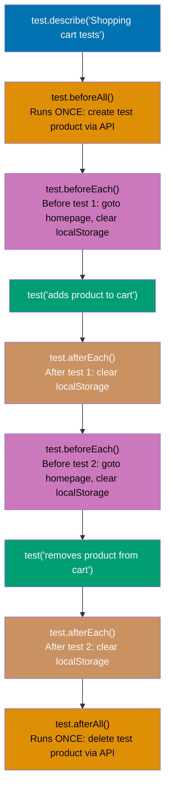

```typescript
import { test, expect } from "@playwright/test";
// => Import test and expect from Playwright

test.describe("Shopping cart tests", () => {
  // => Groups all shopping cart tests in one suite
  let testProductId: string;
  // => Shared variable accessible across all hooks and tests
  // => Initialized in beforeAll, used in test bodies

  test.beforeAll(async ({ request }) => {
    // => beforeAll: runs ONCE before any test in suite starts
    // => request: API fixture available in beforeAll
    const response = await request.post("https://api.example.com/test/products", {
      data: {
        // => Creates test product via API (test data)
        name: "Test Product",
        // => Product name for all tests in suite
        price: 99.99,
        // => Product price
      },
    });
    // => POST creates product, returns 201 Created
    // => POST /test/products returns 201 Created

    const product = await response.json();
    // => Parses created product with server-assigned ID
    testProductId = product.id;
    // => Stores ID in shared variable for all tests
    // => All tests in suite can access testProductId
  });

  test.beforeEach(async ({ page }) => {
    // => beforeEach: runs before EVERY individual test
    await page.goto("https://example.com");
    // => Ensures each test starts from homepage
    // => Prevents URL state leakage between tests

    await page.evaluate(() => localStorage.clear());
    // => Clears cart data stored in localStorage
    // => Each test starts with empty cart
  });
  // => beforeEach registered: runs before each test automatically

  test("adds product to cart", async ({ page }) => {
    // => Test body: beforeAll and beforeEach already ran
    await page.goto(`https://example.com/products/${testProductId}`);
    // => Navigates to test product page using shared ID
    await page.getByRole("button", { name: "Add to Cart" }).click();
    // => Adds product to cart via UI button

    await expect(page.getByText("1 item in cart")).toBeVisible();
    // => Asserts cart counter updated to 1
  });

  test("removes product from cart", async ({ page }) => {
    // => beforeEach ran: fresh start from homepage, empty cart
    await page.goto(`https://example.com/products/${testProductId}`);
    // => Navigates to same test product
    await page.getByRole("button", { name: "Add to Cart" }).click();
    // => Adds to cart first (prerequisite for remove test)

    await page.getByRole("link", { name: "Cart" }).click();
    // => Navigates to cart page
    await page.getByRole("button", { name: "Remove" }).click();
    // => Removes the added item

    await expect(page.getByText("Cart is empty")).toBeVisible();
    // => Asserts cart shows empty state after removal
  });

  test.afterEach(async ({ page }) => {
    // => afterEach: runs after EVERY test (even if test fails)
    await page.evaluate(() => localStorage.clear());
    // => Ensures cart state cleared after each test
    // => Guards against incomplete test runs leaving state
  });

  test.afterAll(async ({ request }) => {
    // => afterAll: runs ONCE after all tests complete
    await request.delete(`https://api.example.com/test/products/${testProductId}`);
    // => Removes test product from database
    // => Prevents test data accumulation across runs
  });
});
```

**Key Takeaway**: Use beforeEach/afterEach for per-test setup/cleanup, beforeAll/afterAll for suite-level setup/cleanup. Hooks ensure consistent test state.

**Why It Matters**: Test isolation prevents flaky tests from state leakage. Improper cleanup causes much test flakiness. beforeEach ensures every test starts with clean state (cleared storage, logged out, fresh navigation). afterAll prevents test data accumulation—without cleanup, thousands of test runs create millions of test products. Hooks centralize lifecycle management instead of copy-pasting setup/cleanup in every test.

### Example 59: Test Annotations - Metadata and Conditional Execution

Use test annotations to add metadata, skip tests conditionally, or mark tests as slow. This improves test organization and execution control.

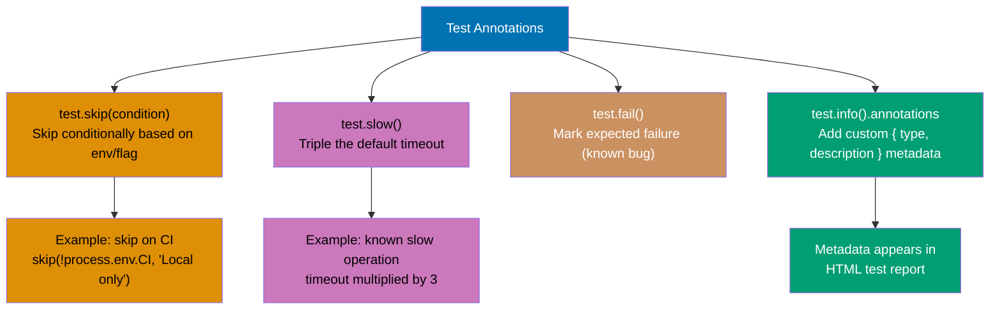

```typescript
import { test, expect } from "@playwright/test";
// => Import test and expect from Playwright

test("basic login test", async ({ page }) => {
  // => Standard test: no special annotations
  await page.goto("https://example.com/login");
  // => Runs with default timeout (30s) and no retries
});

test("slow database migration test", async ({ page }) => {
  // => Test with slow annotation for extended timeout
  test.slow();
  // => test.slow() triples the default test timeout
  // => 30s default → 90s with test.slow()
  // => Use for known slow operations (migrations, reports)

  await page.goto("https://example.com/admin/migrations");
  // => Navigates to migration admin page
  await page.getByRole("button", { name: "Run Migration" }).click();
  // => Triggers long-running database migration
});

test("mobile-only responsive test", async ({ page, isMobile }) => {
  // => Test with conditional skip based on fixture value
  test.skip(!isMobile, "This test is only for mobile viewports");
  // => isMobile: true when running with mobile project config
  // => Skips test if !isMobile (desktop run)
  // => Avoids false failures on desktop viewport

  await page.goto("https://example.com");
  // => Only runs when isMobile is true
  await expect(page.getByRole("button", { name: "Menu" })).toBeVisible();
  // => Hamburger menu only visible on mobile
});

test("flaky API integration test", async ({ page }) => {
  // => Test marked with fixme (known broken)
  test.fixme(true, "Known flaky test - API rate limiting issue");
  // => fixme(condition, reason): marks test as expected to fail
  // => Test is skipped with "fixme" status in report
  // => Documents known issues without deleting tests

  // Test would run here if fixme removed
});

test("payment processing test", async ({ page }) => {
  // => Test with custom metadata annotations
  test.info().annotations.push({
    type: "issue",
    // => Annotation type: links to issue tracker
    description: "https://github.com/org/repo/issues/123",
    // => URL to related GitHub issue
  });
  // => First annotation added to test metadata

  test.info().annotations.push({
    type: "category",
    // => Custom annotation type for filtering
    description: "payment",
    // => Category label for selective test execution
  });
  // => Annotations visible in HTML reporter

  await page.goto("https://example.com/checkout");
  // => Test executes normally with metadata attached
});

test.describe("WebKit-specific tests", () => {
  // => Suite conditionally skipped for non-WebKit browsers
  test.skip(({ browserName }) => browserName !== "webkit", "WebKit only");
  // => Arrow function receives fixtures: ({ browserName })
  // => Evaluates per-test: skip when browser is not webkit
  // => Entire suite skipped on Chromium/Firefox runs

  test("Safari-specific CSS rendering", async ({ page }) => {
    // => Only executes when browserName === "webkit"
    await page.goto("https://example.com");
    // => Tests Safari-specific rendering behavior
  });
});
```

**Key Takeaway**: Use test.slow() for known slow tests, test.skip() for conditional execution, and custom annotations for metadata. Annotations improve test reporting and filtering.

**Why It Matters**: Test metadata enables intelligent test execution and better reporting. Conditional skipping can significantly reduce CI time by running only relevant tests per environment. test.slow() prevents timeout failures for legitimate slow operations without inflating timeout for entire suite. Annotations document flaky tests, link to issues, and categorize tests for selective execution—run only "payment" tests for payment system changes.

### Example 60: Test Retries and Timeouts - Reliability Configuration

Configure test retries and timeouts to handle flaky tests and slow operations. This balances reliability with execution speed.

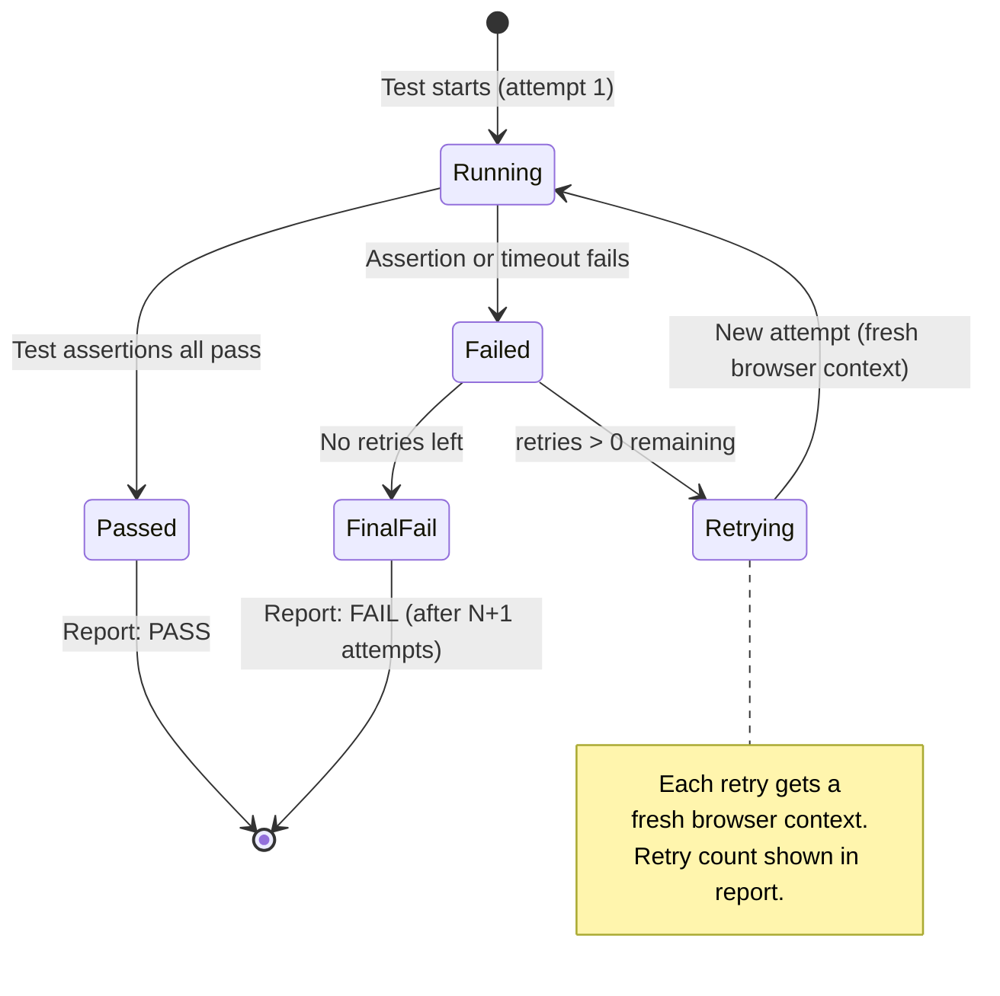

```typescript
import { test, expect } from "@playwright/test";

test.describe("Tests with custom retry logic", () => {
  // => Suite with configured retry behavior
  test.describe.configure({ retries: 2 });
  // => retries: 2 means: run test, if fails, retry up to 2 more times
  // => Total attempts: 3 (1 original + 2 retries)
  // => Scoped to this suite only

  test("flaky network-dependent test", async ({ page }) => {
    // => Test may fail transiently due to external API availability
    await page.goto("https://example.com/api-dashboard");
    // => Loads dashboard that polls external API
    // => Network hiccups may cause intermittent failures

    await expect(page.getByText("API Status: Online")).toBeVisible({
      timeout: 10000,
      // => Overrides default 5s assertion timeout to 10s
    });
    // => Waits up to 10s for API status to appear
    // => Handles slow API polling intervals
  });
});

test("critical test - no retries", async ({ page }) => {
  // => Important test: should fail fast without masking
  test.describe.configure({ retries: 0 });
  // => Overrides any global retry config
  // => Fail immediately to surface critical issues fast

  await page.goto("https://example.com/health");
  // => Health check endpoint
  await expect(page.getByText("System Healthy")).toBeVisible();
  // => If fails: system is down, not flaky - no retry needed
});

test("slow e2e test with extended timeout", async ({ page }) => {
  // => Test for long-running operation needing custom timeout
  test.setTimeout(120000);
  // => Sets test timeout to 120,000ms (2 minutes)
  // => Overrides global default (30s) for this test only

  await page.goto("https://example.com/report/generate");
  // => Navigates to report generation page
  await page.getByRole("button", { name: "Generate Annual Report" }).click();
  // => Triggers report generation (may take 60+ seconds)

  await expect(page.getByText("Report Ready")).toBeVisible({ timeout: 90000 });
  // => Assertion timeout: 90s (within 120s test timeout)
  // => Assertion timeout must be less than test timeout
});

test("dynamic timeout based on environment", async ({ page }) => {
  // => Adapts timeout to execution environment
  const timeout = process.env.CI ? 60000 : 30000;
  // => CI=true: 60s (CI servers slower than developer machines)
  // => CI undefined: 30s (faster on local hardware)

  test.setTimeout(timeout);
  // => Applies computed timeout for this test

  await page.goto("https://example.com/dashboard");
  // => Navigates to dashboard
  await expect(page.getByText("Dashboard Loaded")).toBeVisible({
    timeout: timeout / 2,
    // => Assertion timeout: half of test timeout (proportional)
  });
  // => Leaves buffer: assertion timeout < test timeout
});
```

**Key Takeaway**: Configure retries at suite level with test.describe.configure(), timeouts with test.setTimeout(). Balance reliability (retries) with fast failure detection.

**Why It Matters**: Flaky tests erode confidence in test suites but retrying every test wastes CI time. Multiple retries catch most transient failures while limiting retries to flaky suites prevents masking real bugs. Timeout configuration prevents false failures for legitimate slow operations while keeping default timeouts short to catch infinite loops. Environment-specific timeouts account for CI performance variability—CI servers are noticeably slower than developer machines.
