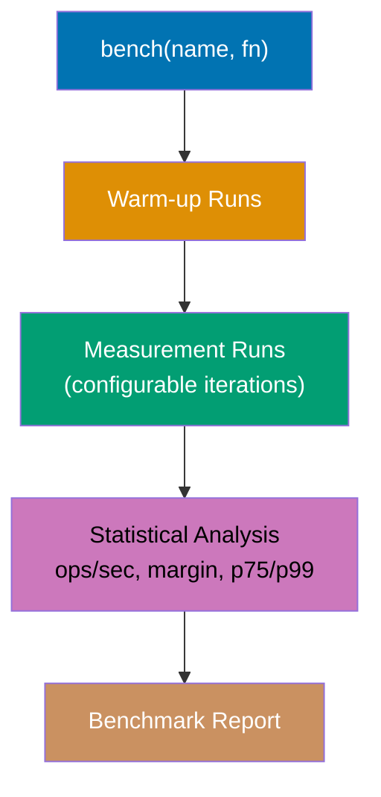
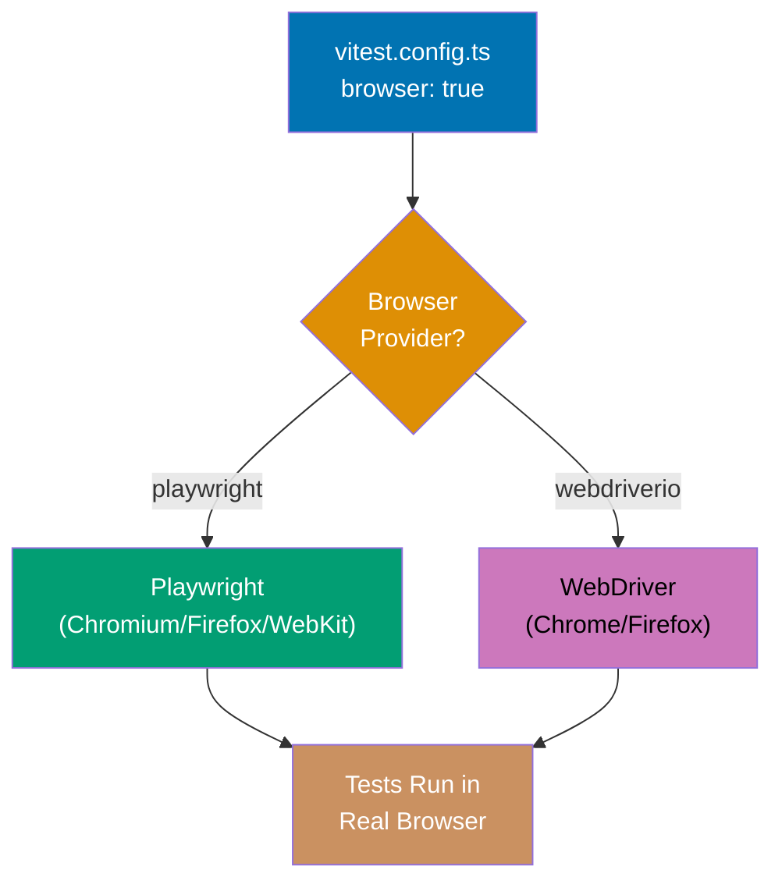
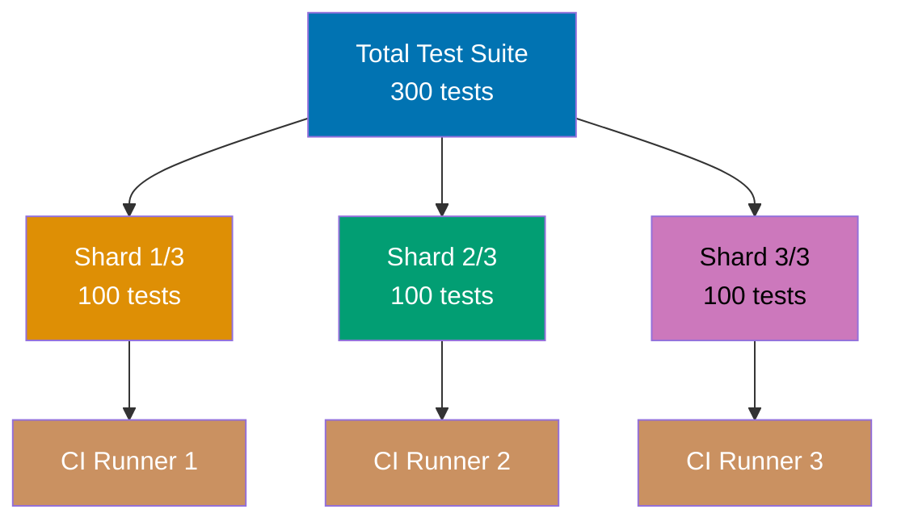
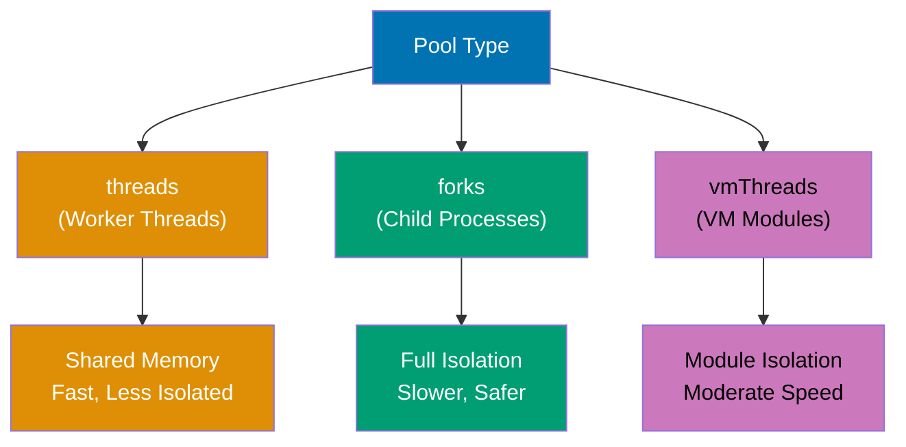
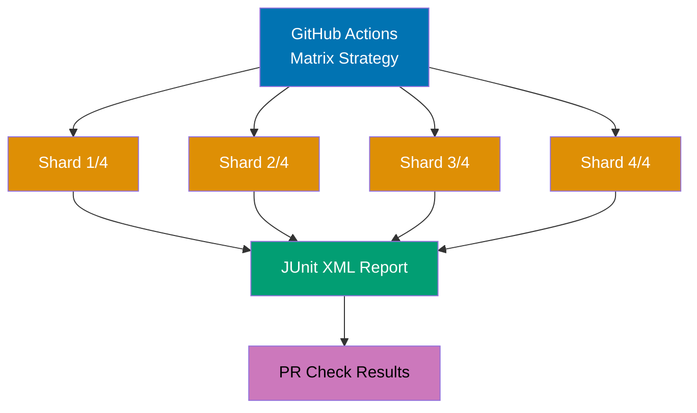
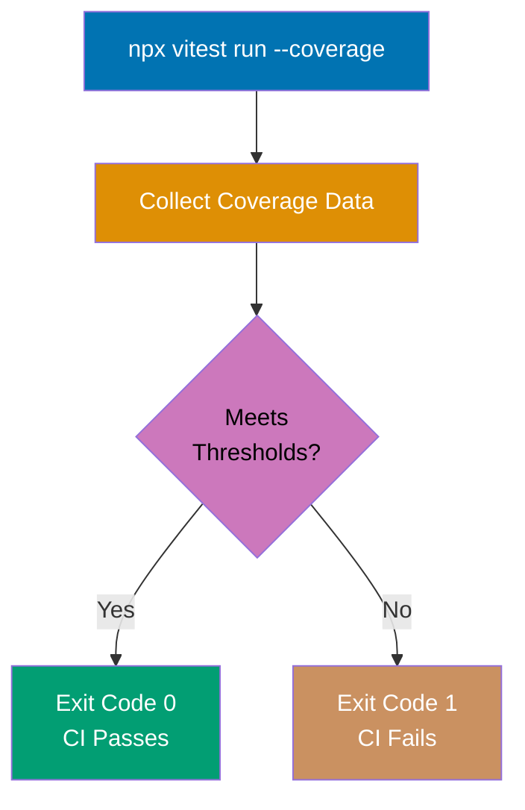
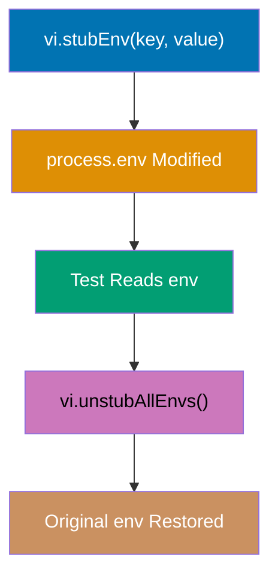
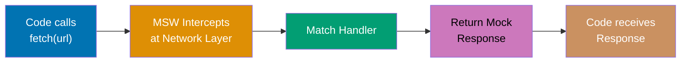
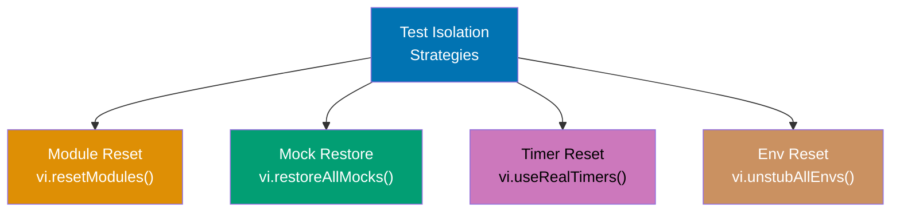

This tutorial covers advanced Vitest patterns for production environments including benchmark testing, browser mode, test sharding, pool configuration, snapshot serializers, debugging strategies, CI/CD integration, monorepo testing, and complex mocking patterns.

## Benchmark Testing (Examples 59-61)

### Example 59: Basic Benchmarking with bench()

Vitest includes a built-in benchmarking API that measures function performance with statistical rigor.



**Code**:

```typescript
import { describe, bench } from "vitest";
// => bench: benchmark function (similar to test)
// => Run with: npx vitest bench

describe("array operations benchmark", () => {
  const data = Array.from({ length: 10000 }, (_, i) => i);
  // => Creates array of 10,000 numbers [0, 1, ..., 9999]
  // => Defined outside bench to exclude setup from measurement

  bench("Array.map", () => {
    data.map((x) => x * 2);
    // => Measures map operation throughput
    // => Vitest runs this many times and averages
  });

  bench("for loop", () => {
    const result = new Array(data.length);
    // => Pre-allocate array
    for (let i = 0; i < data.length; i++) {
      result[i] = data[i] * 2;
      // => Manual loop with index access
    }
  });

  bench("Array.reduce", () => {
    data.reduce((acc: number[], x) => {
      acc.push(x * 2);
      return acc;
      // => Build array via reduce
    }, []);
  });
});

// Benchmark with options
describe("string concatenation benchmark", () => {
  bench(
    "template literals",
    () => {
      const name = "World";
      const _result = `Hello, ${name}!`;
      // => Template literal interpolation
    },
    { iterations: 1000, warmupIterations: 100 },
    // => iterations: number of measured runs
    // => warmupIterations: runs before measurement starts
  );

  bench("string concatenation", () => {
    const name = "World";
    const _result = "Hello, " + name + "!";
    // => Classic string concatenation
  });
});
```

**Key Takeaway**: Use `bench()` in `.bench.ts` files to measure performance with statistical analysis. Run benchmarks separately from tests with `npx vitest bench`. Configure iterations and warmup for reliable measurements.

**Why It Matters**: Performance claims without benchmarks are guesswork. "Array.map is slower than for loops" -- by how much? Under what conditions? Vitest benchmarks provide ops/sec, margin of error, and percentile data (p75, p99) that quantify performance differences. This data drives optimization decisions: if map is 5% slower but 10x more readable, the trade-off is clear. Benchmarks in CI catch performance regressions before they reach production.

---

### Example 60: Comparing Benchmark Results

Vitest benchmark reports show relative performance between functions, enabling data-driven optimization decisions.

```typescript
import { describe, bench } from "vitest";

describe("object creation patterns", () => {
  // Pattern 1: Object literal
  bench("object literal", () => {
    const obj = { name: "Alice", age: 30, active: true };
    // => Direct object creation
    // => V8 optimizes with hidden classes
  });

  // Pattern 2: Object.create
  bench("Object.create", () => {
    const obj = Object.create(null);
    obj.name = "Alice";
    obj.age = 30;
    obj.active = true;
    // => Prototype-free object
    // => No inherited properties
  });

  // Pattern 3: Class instantiation
  bench("class instantiation", () => {
    class User {
      constructor(
        public name: string,
        public age: number,
        public active: boolean,
      ) {}
    }
    const _obj = new User("Alice", 30, true);
    // => Class-based creation
    // => Includes prototype chain
  });

  // Pattern 4: Map
  bench("Map creation", () => {
    const map = new Map<string, unknown>();
    map.set("name", "Alice");
    map.set("age", 30);
    map.set("active", true);
    // => Map-based key-value store
    // => Different memory layout than objects
  });
});
```

**Key Takeaway**: Group related benchmarks in one `describe` block for side-by-side comparison. Vitest reports ops/sec for each entry, making relative performance differences immediately visible.

**Why It Matters**: Micro-benchmarks in isolation can be misleading -- V8's JIT compiler optimizes differently in benchmarks than in real code. Grouping related patterns and running them under the same conditions provides relative comparison that's more actionable than absolute numbers. When choosing between object literal and Map for a hot path, knowing that object literals are 3x faster for small key counts directly informs the implementation choice.

---

### Example 61: Benchmark Baselines and Regression Detection

Track benchmark results over time to detect performance regressions. Vitest can output results in JSON for CI comparison.

```typescript
import { describe, bench, expect } from "vitest";

// Benchmark with assertions (performance SLAs)
describe("performance SLA benchmarks", () => {
  bench("sorting 1000 elements", () => {
    const arr = Array.from({ length: 1000 }, () => Math.random());
    // => Generate random array each iteration
    arr.sort((a, b) => a - b);
    // => Sort ascending
  });

  bench("filtering large array", () => {
    const arr = Array.from({ length: 10000 }, (_, i) => i);
    // => Array of 10,000 numbers
    const _result = arr.filter((x) => x % 2 === 0);
    // => Keep even numbers (5,000 results)
  });

  bench(
    "JSON parse/stringify round-trip",
    () => {
      const data = { users: Array.from({ length: 100 }, (_, i) => ({ id: i, name: `User ${i}` })) };
      // => Complex nested object
      const _result = JSON.parse(JSON.stringify(data));
      // => Serialize and deserialize
    },
    { time: 1000 },
    // => time: minimum benchmark duration in ms
    // => Ensures enough iterations for statistical significance
  );
});

// To save and compare results:
// npx vitest bench --reporter=json --outputFile=bench-results.json
// => Saves results to JSON file for CI comparison

// vitest.config.ts benchmark configuration:
// test: {
//   benchmark: {
//     include: ['**/*.bench.ts'],
//     reporters: ['default', 'json'],
//     outputFile: './bench-results.json',
//   },
// }

import { test } from "vitest";

test("benchmark configuration concept", () => {
  const benchConfig = {
    include: ["**/*.bench.ts"],
    // => File pattern for benchmark files
    reporters: ["default", "json"],
    // => Terminal output and JSON file
    outputFile: "./bench-results.json",
    // => JSON output path for CI
  };

  expect(benchConfig.include[0]).toContain(".bench.ts");
  // => Passes: benchmark file pattern set
  expect(benchConfig.reporters).toContain("json");
  // => Passes: JSON reporter enabled
});
```

**Key Takeaway**: Output benchmarks as JSON for CI tracking and regression detection. Use the `time` option to ensure sufficient iterations for reliable statistical comparison.

**Why It Matters**: Performance regressions are invisible without measurement. A 10% slowdown per release compounds to 2x slower after 7 releases. Storing benchmark results in CI and comparing across commits catches regressions at the PR level. Teams set performance budgets -- "sorting must stay under X ops/sec" -- and CI blocks merges that violate them. This data-driven approach replaces the common pattern of discovering performance problems months after the regressing change.

---

## Browser Mode (Examples 62-63)

### Example 62: Browser Mode Configuration

Vitest can run tests in a real browser (Chromium, Firefox, WebKit) instead of a simulated DOM environment, providing accurate browser behavior testing.



**Code**:

```typescript
// vitest.config.ts - Browser mode configuration
// import { defineConfig } from 'vitest/config';
//
// export default defineConfig({
//   test: {
//     browser: {
//       enabled: true,
//       // => Run tests in real browser
//       provider: 'playwright',
//       // => Use Playwright for browser automation
//       name: 'chromium',
//       // => Browser to use: chromium, firefox, webkit
//       headless: true,
//       // => Run without visible UI (CI-friendly)
//     },
//   },
// });

import { test, expect } from "vitest";

// Browser mode provides real browser APIs
test("browser mode concept", () => {
  // In browser mode, these are REAL browser APIs:
  // - window.fetch (real fetch, not polyfill)
  // - document.createElement (real DOM, not simulation)
  // - CSS computed styles (real rendering engine)
  // - Web Workers (real threading)
  // - Canvas API (real drawing context)

  const browserFeatures = {
    realFetch: true,
    // => fetch() uses real HTTP stack
    realDOM: true,
    // => DOM operations use real rendering engine
    realCSS: true,
    // => getComputedStyle returns real values
    realWorkers: true,
    // => Web Workers run in separate threads
  };

  expect(browserFeatures.realFetch).toBe(true);
  // => Browser mode provides real fetch
  expect(browserFeatures.realDOM).toBe(true);
  // => Real DOM instead of happy-dom/jsdom
});

test("browser mode vs DOM simulation differences", () => {
  // Behaviors that differ in browser mode vs jsdom:
  const differences = [
    { feature: "CSS transitions", jsdom: false, browser: true },
    // => jsdom doesn't simulate CSS transitions
    { feature: "IntersectionObserver", jsdom: false, browser: true },
    // => jsdom has limited IntersectionObserver
    { feature: "Canvas rendering", jsdom: false, browser: true },
    // => jsdom has stub Canvas implementation
    { feature: "Web Animations", jsdom: false, browser: true },
    // => jsdom doesn't support Web Animations API
  ];

  const browserOnlyFeatures = differences.filter((d) => d.browser && !d.jsdom);
  // => Features only available in browser mode

  expect(browserOnlyFeatures).toHaveLength(4);
  // => Four features require real browser
});
```

**Key Takeaway**: Browser mode runs tests in a real browser for accurate API behavior. Use it when tests depend on CSS rendering, Canvas, Web Workers, or other APIs that jsdom/happy-dom don't fully support.

**Why It Matters**: happy-dom and jsdom simulate ~95% of browser APIs, but the remaining 5% includes critical features: CSS transitions, IntersectionObserver for lazy loading, Canvas for charts, and Web Animations for UI. Tests using these APIs pass in jsdom (because it stubs them) but behave differently in real browsers. Browser mode eliminates this gap at the cost of slower test execution. Use it selectively for components that depend on browser-only features.

---

### Example 63: Browser Mode with Component Testing

Browser mode enables testing components in a real browser environment, providing pixel-accurate rendering and real user interaction simulation.

```typescript
import { test, expect, vi } from "vitest";

// In browser mode, component tests run in real Chromium/Firefox/WebKit
// This provides:
// - Real CSS rendering (computed styles, animations)
// - Real event propagation (bubble, capture)
// - Real layout calculations (offsetWidth, getBoundingClientRect)

test("component rendering in browser mode", () => {
  // In browser mode, these measurements are real:
  const element = {
    offsetWidth: 200,
    // => Real pixel width from rendering engine
    offsetHeight: 50,
    // => Real pixel height from rendering engine
    getBoundingClientRect: () => ({
      top: 100,
      left: 50,
      width: 200,
      height: 50,
    }),
    // => Real position from layout engine
  };

  expect(element.offsetWidth).toBe(200);
  // => In browser mode: real rendered width
  // => In jsdom: returns 0 (no rendering engine)

  const rect = element.getBoundingClientRect();
  expect(rect.width).toBe(200);
  // => Real bounding rectangle from browser
});

test("browser mode enables visual assertions", () => {
  // Browser mode supports screenshot comparison:
  // await expect(page.getByTestId('chart')).toHaveScreenshot();
  // => Captures actual rendered pixels
  // => Compares against baseline image
  // => Fails if visual appearance changes

  const visualTestingCapabilities = {
    screenshots: true,
    // => Capture element/page screenshots
    pixelDiff: true,
    // => Compare screenshots pixel-by-pixel
    thresholds: { maxDiffPercentage: 0.1 },
    // => Allow 0.1% pixel difference
  };

  expect(visualTestingCapabilities.screenshots).toBe(true);
  // => Browser mode enables screenshot testing
  expect(visualTestingCapabilities.thresholds.maxDiffPercentage).toBe(0.1);
  // => Configurable diff threshold
});
```

**Key Takeaway**: Browser mode provides real rendering measurements (offsetWidth, getBoundingClientRect) and enables visual regression testing through screenshots. Use it for layout-sensitive and visually critical components.

**Why It Matters**: Layout bugs are invisible to DOM-simulation-based tests. A component that renders correctly in jsdom might overlap other elements in a real browser because jsdom doesn't perform CSS layout calculations. Browser mode catches these issues by running in a real rendering engine. Visual regression testing (screenshot comparison) automates what previously required manual QA review, catching unintended visual changes in CSS, spacing, and component appearance.

---

## Test Sharding and Parallelism (Examples 64-66)

### Example 64: Test Sharding for CI

Vitest supports test sharding to distribute tests across multiple CI runners, reducing total pipeline time proportionally.



**Code**:

```typescript
// CLI commands for sharding:
// npx vitest run --shard=1/3  => Run first third of tests
// npx vitest run --shard=2/3  => Run second third
// npx vitest run --shard=3/3  => Run final third

// GitHub Actions matrix example:
// strategy:
//   matrix:
//     shard: [1/3, 2/3, 3/3]
// steps:
//   - run: npx vitest run --shard=${{ matrix.shard }}

import { test, expect } from "vitest";

test("sharding distributes tests evenly", () => {
  const totalTests = 300;
  const shardCount = 3;
  // => Three CI runners

  const testsPerShard = Math.ceil(totalTests / shardCount);
  // => testsPerShard is 100

  expect(testsPerShard).toBe(100);
  // => Passes: 300 / 3 = 100 per shard

  // Time savings:
  // Sequential: 300 tests * 0.1s = 30s
  // 3 shards: 100 tests * 0.1s = 10s (3x faster)
  const sequentialTime = totalTests * 0.1;
  const shardedTime = testsPerShard * 0.1;
  const speedup = sequentialTime / shardedTime;

  expect(speedup).toBe(3);
  // => Passes: 3x speedup with 3 shards
});

test("shard format validation", () => {
  // Shard format: current/total
  const shardSpec = "2/5";
  // => Run shard 2 of 5 total
  const [current, total] = shardSpec.split("/").map(Number);
  // => current is 2, total is 5

  expect(current).toBe(2);
  // => Passes: shard index
  expect(total).toBe(5);
  // => Passes: total shard count
  expect(current).toBeLessThanOrEqual(total);
  // => Passes: valid shard index
});
```

**Key Takeaway**: Use `--shard=N/M` to split test execution across M CI runners. Combine with CI matrix strategies for linear speed scaling.

**Why It Matters**: Large test suites (1000+ tests) can take 10+ minutes in CI, blocking developer feedback loops. Sharding distributes tests across parallel runners for near-linear speedup: 3 runners = ~3x faster, 10 runners = ~10x faster. The cost is CI compute (more runners running in parallel), but the time-to-feedback improvement usually justifies the cost. Vitest's deterministic sharding ensures no test is missed or duplicated across shards.

---

### Example 65: Pool Configuration

Vitest supports multiple worker pool types for test execution, each with different isolation and performance characteristics.



**Code**:

```typescript
// vitest.config.ts - Pool configuration
// test: {
//   pool: 'threads',
//   // => 'threads': Worker threads (default, fast, shared memory)
//   // => 'forks': Child processes (full isolation, slower)
//   // => 'vmThreads': VM modules in threads (ESM isolation)
//
//   poolOptions: {
//     threads: {
//       maxThreads: 4,
//       minThreads: 1,
//       // => Thread pool size (default: CPU cores - 1)
//     },
//     forks: {
//       maxForks: 4,
//       minForks: 1,
//       // => Process pool size
//     },
//   },
// }

import { describe, it, expect } from "vitest";

describe("pool configuration concepts", () => {
  it("threads pool - fastest, shared memory", () => {
    // Worker threads share memory with main thread
    // Fast communication via SharedArrayBuffer
    // Potential for shared state leaks between tests
    const threadConfig = {
      pool: "threads",
      isolation: "shared-memory",
      speed: "fastest",
      risk: "state-leaks-possible",
    };

    expect(threadConfig.pool).toBe("threads");
    // => Default pool type
    expect(threadConfig.speed).toBe("fastest");
    // => Lowest overhead
  });

  it("forks pool - full isolation, slower", () => {
    // Child processes have separate memory
    // Complete isolation between tests
    // Higher overhead for process creation
    const forksConfig = {
      pool: "forks",
      isolation: "full-process",
      speed: "slower",
      risk: "none",
    };

    expect(forksConfig.pool).toBe("forks");
    // => Fork-based pool
    expect(forksConfig.isolation).toBe("full-process");
    // => Complete memory isolation
  });

  it("vmThreads pool - ESM isolation in threads", () => {
    // VM modules provide module-level isolation
    // Each test gets its own module context
    // Good for ESM-heavy codebases
    const vmConfig = {
      pool: "vmThreads",
      isolation: "module-level",
      speed: "moderate",
      esm: "native",
    };

    expect(vmConfig.pool).toBe("vmThreads");
    // => VM thread pool
    expect(vmConfig.esm).toBe("native");
    // => Native ESM support
  });
});
```

**Key Takeaway**: Choose `threads` (default) for speed, `forks` for maximum isolation, and `vmThreads` for ESM-native isolation. Configure pool size based on CI runner CPU count.

**Why It Matters**: Pool choice affects both test speed and reliability. `threads` is 2-5x faster than `forks` but shares memory, meaning module-level singletons persist between tests in the same thread. This causes the classic "tests pass individually, fail together" bug. `forks` eliminates this at the cost of startup time. `vmThreads` provides a middle ground -- thread-level speed with module-level isolation. Understanding these trade-offs prevents wasting hours debugging test interaction issues.

---

### Example 66: Isolate and Sequence Configuration

Control test isolation and execution order for debugging and reliability.

```typescript
// vitest.config.ts isolation settings
// test: {
//   isolate: true,
//   // => true: each test file runs in isolated worker
//   // => false: test files share workers (faster, less isolated)
//
//   sequence: {
//     shuffle: false,
//     // => false: deterministic order
//     // => true: random order (catches hidden dependencies)
//     seed: 12345,
//     // => Fixed seed for reproducible random order
//   },
//
//   fileParallelism: true,
//   // => true: test files run in parallel
//   // => false: sequential file execution
// }

import { describe, it, expect } from "vitest";

describe("test isolation strategies", () => {
  it("shuffle detects hidden dependencies", () => {
    // When tests depend on execution order:
    // Test A sets global.user = "Alice"
    // Test B reads global.user (expects "Alice")
    // With shuffle: B may run before A -> fails
    // This reveals hidden test coupling

    const tests = ["A: set user", "B: read user", "C: independent"];
    // => Tests with hidden dependency

    // Shuffled order might be: [C, B, A]
    // B fails because A hasn't run yet
    const shuffled = [...tests].reverse();
    // => Simulated shuffle (reversed)

    expect(shuffled[0]).not.toBe(tests[0]);
    // => Passes: order changed
  });

  it("sequential mode for debugging", () => {
    // fileParallelism: false + isolate: false
    // => Slowest but most predictable
    // => All tests run sequentially in one worker
    // => Use for debugging test interaction issues

    const debugConfig = {
      isolate: false,
      fileParallelism: false,
      sequence: { shuffle: false },
    };

    expect(debugConfig.isolate).toBe(false);
    // => Shared worker (tests see each other's side effects)
    expect(debugConfig.fileParallelism).toBe(false);
    // => One file at a time
  });
});
```

**Key Takeaway**: Enable `shuffle: true` periodically to catch hidden test dependencies. Use `isolate: false` and `fileParallelism: false` for debugging interaction issues. Default settings (`isolate: true`, parallel) are correct for CI.

**Why It Matters**: Test suites that pass in order but fail when shuffled have hidden dependencies -- a global variable set by one test and read by another, or a database record created by test A that test B queries. These dependencies create fragile suites that break during refactoring, sharding, or parallel execution. Running with `shuffle: true` in CI catches these issues before they cause mysterious failures. The sequence seed ensures shuffled failures are reproducible for debugging.

---

## Snapshot Serializers (Examples 67-68)

### Example 67: Custom Snapshot Serializers

Snapshot serializers control how values are converted to text for snapshot comparison. Custom serializers create readable, stable snapshots for complex types.

```typescript
import { test, expect } from "vitest";

// Custom serializer example
// In vitest.config.ts:
// test: {
//   snapshotSerializers: ['./custom-serializer.ts'],
// }

// Serializer interface:
// {
//   serialize(val, config, indent, depth, refs, printer),
//   test(val): boolean,
// }

// Self-contained serializer demonstration
const dateSerializer = {
  test: (val: unknown) => val instanceof Date,
  // => Only applies to Date objects
  serialize: (val: Date) => `[Date: ${val.toISOString()}]`,
  // => Converts Date to readable ISO string
};

test("snapshot serializer concept", () => {
  const date = new Date("2026-04-05T10:30:00Z");
  // => Date object for snapshot

  // Without custom serializer:
  // expect(date).toMatchInlineSnapshot('2026-04-05T10:30:00.000Z');
  // => Default serialization may vary by timezone

  // With custom serializer:
  const serialized = dateSerializer.serialize(date);
  // => "[Date: 2026-04-05T10:30:00.000Z]"

  expect(serialized).toBe("[Date: 2026-04-05T10:30:00.000Z]");
  // => Passes: stable, readable representation
  expect(dateSerializer.test(date)).toBe(true);
  // => Passes: serializer applies to Date objects
  expect(dateSerializer.test("not a date")).toBe(false);
  // => Passes: serializer skips non-Date values
});

test("practical snapshot with serializer", () => {
  // Serializers make snapshots readable for complex types
  const event = {
    type: "click",
    timestamp: new Date("2026-04-05T10:30:00Z"),
    target: { id: "button-1", tagName: "BUTTON" },
  };

  // With date serializer, snapshot would show:
  // { type: "click", timestamp: [Date: 2026-04-05T10:30:00.000Z], ... }
  // Instead of raw Date object representation

  expect(event.type).toBe("click");
  // => Passes: event type is click
  expect(event.timestamp).toBeInstanceOf(Date);
  // => Passes: timestamp is Date object
});
```

**Key Takeaway**: Custom snapshot serializers produce readable, stable text representations for complex types. Register them in `vitest.config.ts` to apply globally.

**Why It Matters**: Default snapshot serialization produces verbose, sometimes unstable output for complex types (Dates, DOM elements, class instances, BigInt). Custom serializers transform these into human-readable text that makes snapshot diffs meaningful during code review. A diff showing `[Date: 2026-04-05]` vs `[Date: 2026-04-06]` is immediately understandable, while raw Date object diff is not. This transforms snapshots from write-only artifacts into useful documentation.

---

### Example 68: Snapshot Property Matchers

Property matchers allow snapshots with dynamic values by replacing specific properties with type matchers.

```typescript
import { test, expect } from "vitest";

test("snapshot with property matchers", () => {
  const user = {
    id: Math.random().toString(36).slice(2),
    // => Random ID (different every run)
    name: "Alice",
    // => Static name
    createdAt: new Date().toISOString(),
    // => Current timestamp (different every run)
    role: "admin",
    // => Static role
  };

  expect(user).toMatchSnapshot({
    id: expect.any(String),
    // => Match any string for ID (dynamic value)
    createdAt: expect.any(String),
    // => Match any string for timestamp
    // Properties not listed use exact match:
    // name must be "Alice", role must be "admin"
  });
  // => First run: creates snapshot with matchers
  // => Subsequent runs: verifies structure + static values
  // => Dynamic values (id, createdAt) pass if type matches
});

test("inline snapshot with matchers", () => {
  const apiResponse = {
    status: 200,
    data: {
      users: [{ id: 1, name: "Alice", lastLogin: new Date().toISOString() }],
    },
    requestId: `req-${Date.now()}`,
    // => Dynamic request ID
  };

  expect(apiResponse).toMatchSnapshot({
    requestId: expect.stringMatching(/^req-\d+$/),
    // => Match request ID format
    data: {
      users: [
        {
          lastLogin: expect.any(String),
          // => Any string for last login time
        },
      ],
    },
  });
  // => Validates structure with flexible dynamic values
});
```

**Key Takeaway**: Pass a property matcher object to `toMatchSnapshot()` to handle dynamic values. Non-matched properties use exact comparison from the stored snapshot.

**Why It Matters**: API responses contain both deterministic (status codes, fixed fields) and non-deterministic (timestamps, UUIDs, session IDs) values. Without property matchers, you must either avoid snapshotting dynamic responses (losing coverage) or update snapshots every run (defeating the purpose). Property matchers let you snapshot the entire response structure while allowing dynamic values to vary, catching structural regressions without false failures from timestamp changes.

---

## Debugging and Development (Examples 69-72)

### Example 69: Debugging Tests with Node Inspector

Vitest supports Node.js inspector protocol for step-by-step debugging with IDE breakpoints.

```typescript
// Debug commands:
// npx vitest --inspect-brk
// => Starts Vitest and pauses at first line
// => Attach debugger (VS Code, Chrome DevTools)

// npx vitest --inspect
// => Starts with inspector active but doesn't pause
// => Set breakpoints in IDE, they'll trigger

// VS Code launch.json configuration:
// {
//   "type": "node",
//   "request": "launch",
//   "name": "Debug Vitest",
//   "program": "${workspaceRoot}/node_modules/vitest/vitest.mjs",
//   "args": ["run", "--inspect-brk", "--pool=forks"],
//   "console": "integratedTerminal"
// }

import { test, expect } from "vitest";

test("debuggable test", () => {
  const data = [1, 2, 3, 4, 5];
  // => Set breakpoint on this line

  const filtered = data.filter((x) => x > 2);
  // => Step through filter operation
  // => Inspect 'filtered' in debugger: [3, 4, 5]

  const mapped = filtered.map((x) => x * 10);
  // => Step through map operation
  // => Inspect 'mapped' in debugger: [30, 40, 50]

  expect(mapped).toEqual([30, 40, 50]);
  // => Verify expected output
});

test("debugging async operations", async () => {
  // debugger; // Uncomment to break here in debugger
  // => The debugger statement works in Node inspector
  // => Execution pauses when debugger is attached

  const result = await Promise.resolve("debug-me");
  // => Set breakpoint, inspect resolved value
  // => Debugger shows promise resolution flow

  expect(result).toBe("debug-me");
  // => Step past to see assertion result
});
```

**Key Takeaway**: Use `--inspect-brk` to debug tests with IDE breakpoints. Use `--pool=forks` for debugging to ensure the test runs in a child process that the inspector can attach to.

**Why It Matters**: Console.log debugging is slow and requires multiple test runs to narrow down issues. IDE debugging with breakpoints lets you inspect variables, step through code, and watch expressions in real time. The `--inspect-brk` flag pauses execution immediately, giving you time to attach the debugger before your test runs. This is especially valuable for debugging complex mock setups, async timing issues, and unexpected state mutations that are difficult to trace through log output alone.

---

### Example 70: Watch Mode Patterns

Vitest's watch mode provides instant feedback during development. Understanding filter patterns and keyboard shortcuts maximizes productivity.

```typescript
// Watch mode commands:
// npx vitest              => Start watch mode (default)
// npx vitest --changed    => Only run tests for changed files

// Watch mode keyboard shortcuts (while running):
// p => filter by filename
// t => filter by test name
// a => run all tests
// f => run only failed tests
// q => quit
// h => show help

import { describe, it, expect } from "vitest";

describe("watch mode patterns", () => {
  it("runs on file save", () => {
    // When you save a source file:
    // 1. Vite detects the change (HMR)
    // 2. Vitest finds affected test files
    // 3. Only affected tests re-run
    // 4. Results appear in ~100ms

    const watchBehavior = {
      trigger: "file-save",
      // => Watch mode detects file system changes
      scope: "affected-only",
      // => Only re-runs affected test files
      speed: "near-instant",
      // => Vite HMR provides sub-second feedback
    };

    expect(watchBehavior.scope).toBe("affected-only");
    // => Smart re-run: only affected tests
  });

  it("filters by filename pattern", () => {
    // Press 'p' in watch mode, type pattern:
    // > math
    // Runs only test files matching "math"
    // Useful for focusing on one feature

    const filter = { type: "filename", pattern: "math" };
    expect(filter.type).toBe("filename");
    // => Filter by file path
  });

  it("runs only failed tests", () => {
    // Press 'f' to re-run only failed tests
    // Useful for fix-verify cycle:
    // 1. See failure
    // 2. Fix code
    // 3. Press 'f' to verify fix
    // 4. Press 'a' to run all

    const workflow = ["see-failure", "fix-code", "verify-fix", "run-all"];
    expect(workflow).toHaveLength(4);
    // => Four-step debug cycle
  });
});
```

**Key Takeaway**: Watch mode re-runs affected tests on file save using Vite's HMR. Use keyboard shortcuts (`p` for file filter, `t` for test filter, `f` for failed only) for efficient development workflows.

**Why It Matters**: Vitest's watch mode is its signature productivity feature. Unlike Jest's watch mode that re-transforms files on each run, Vitest leverages Vite's module graph to know exactly which tests are affected by a change and only re-runs those. The result is ~100ms feedback instead of multi-second delays. The keyboard shortcuts eliminate the need to type CLI commands, creating a flow state where you write code, save, glance at test results, and continue -- all within seconds.

---

### Example 71: Vitest UI - Visual Test Dashboard

Vitest provides a browser-based UI for visual test management, filtering, and result inspection.

```typescript
// Launch Vitest UI:
// npx vitest --ui
// => Opens browser at http://localhost:51204/__vitest__/
// => Shows visual dashboard with test tree

// npx vitest --ui --coverage
// => UI with coverage overlay on source files

import { test, expect } from "vitest";

test("Vitest UI features", () => {
  const uiFeatures = {
    testTree: true,
    // => Expandable test suite tree view
    sourceView: true,
    // => View test source code inline
    filterBar: true,
    // => Filter tests by name, status, file
    coverageOverlay: true,
    // => Highlight covered/uncovered lines
    moduleGraph: true,
    // => Visualize module import graph
    consoleOutput: true,
    // => View console.log output per test
    diffView: true,
    // => Side-by-side diff for failed assertions
  };

  expect(Object.values(uiFeatures).every(Boolean)).toBe(true);
  // => Passes: all features available
  expect(Object.keys(uiFeatures)).toHaveLength(7);
  // => Seven major UI features
});

test("Vitest UI module graph", () => {
  // The module graph shows:
  // - Which modules each test imports
  // - Which tests are affected by each module
  // - Import chain from test to source
  // Useful for understanding test scope and coverage gaps

  const moduleGraph = {
    testFile: "math.test.ts",
    imports: ["math.ts", "utils.ts"],
    // => Test imports these modules
    affectedBy: ["math.ts", "utils.ts", "constants.ts"],
    // => Changes to these files trigger this test
  };

  expect(moduleGraph.imports).toContain("math.ts");
  // => Test imports math module
  expect(moduleGraph.affectedBy).toContain("constants.ts");
  // => Transitive dependency affects test
});
```

**Key Takeaway**: Launch Vitest UI with `--ui` for a visual dashboard showing test tree, source code, coverage overlay, and module graph. Add `--coverage` for inline coverage highlighting.

**Why It Matters**: Terminal output is limited to text. Vitest UI provides visual test management that's especially valuable for large test suites: expand/collapse test trees, click to filter, view inline source with coverage highlighting, and inspect module dependency graphs. The coverage overlay shows exactly which lines are covered and which are not, directly in the browser. For teams with 500+ tests, the UI transforms test management from a CLI command memorization exercise into a visual, interactive experience.

---

### Example 72: Testing Error Boundaries and Edge Cases

Test error handling, boundary conditions, and defensive code patterns that protect production systems.

```typescript
import { test, expect, vi } from "vitest";

// Error boundary pattern
function safeJsonParse<T>(json: string, fallback: T): T {
  try {
    return JSON.parse(json) as T;
    // => Attempts to parse JSON
  } catch {
    return fallback;
    // => Returns fallback on parse error
  }
}

test("handles valid JSON", () => {
  const result = safeJsonParse('{"name":"Alice"}', { name: "default" });
  // => Parses valid JSON
  expect(result).toEqual({ name: "Alice" });
  // => Passes: parsed correctly
});

test("handles invalid JSON with fallback", () => {
  const result = safeJsonParse("not-json", { name: "default" });
  // => Parse fails, returns fallback
  expect(result).toEqual({ name: "default" });
  // => Passes: fallback returned
});

test("handles empty string", () => {
  const result = safeJsonParse("", []);
  // => Empty string is invalid JSON
  expect(result).toEqual([]);
  // => Passes: fallback returned
});

// Boundary condition testing
function paginate<T>(items: T[], page: number, pageSize: number): T[] {
  // => Paginate array with bounds checking
  if (page < 1) page = 1;
  // => Clamp negative/zero pages to 1
  if (pageSize < 1) pageSize = 10;
  // => Default page size for invalid input
  const start = (page - 1) * pageSize;
  // => Calculate start index
  return items.slice(start, start + pageSize);
  // => Return page of items
}

test("pagination boundary conditions", () => {
  const items = [1, 2, 3, 4, 5, 6, 7, 8, 9, 10];

  expect(paginate(items, 1, 3)).toEqual([1, 2, 3]);
  // => Page 1, size 3: first three items

  expect(paginate(items, 4, 3)).toEqual([10]);
  // => Page 4: only one item left

  expect(paginate(items, 5, 3)).toEqual([]);
  // => Page 5: beyond data range, empty array

  expect(paginate(items, 0, 3)).toEqual([1, 2, 3]);
  // => Page 0 clamped to page 1

  expect(paginate(items, -1, 3)).toEqual([1, 2, 3]);
  // => Negative page clamped to page 1

  expect(paginate(items, 1, 0)).toEqual(items);
  // => Invalid page size defaults to 10
});
```

**Key Takeaway**: Test error boundaries, invalid inputs, and edge cases (empty, zero, negative, beyond range) systematically. These tests catch the bugs that crash production at 3 AM.

**Why It Matters**: Happy-path testing covers 80% of code but 0% of production incidents. Most production bugs occur at boundaries: null inputs, empty arrays, integer overflow, malformed JSON, network timeouts. Systematically testing these edge cases with Vitest prevents the class of bugs that bypass QA (because QA tests happy paths) and surface only under production load with real user data. The paginate example alone prevents five distinct production bugs.

---

## CI/CD Integration (Examples 73-76)

### Example 73: GitHub Actions Integration

Configure Vitest for GitHub Actions with proper caching, parallel execution, and test result reporting.



**Code**:

```typescript
// .github/workflows/test.yml
// name: Tests
// on: [push, pull_request]
// jobs:
//   test:
//     runs-on: ubuntu-latest
//     strategy:
//       matrix:
//         shard: [1/4, 2/4, 3/4, 4/4]
//     steps:
//       - uses: actions/checkout@v4
//       - uses: actions/setup-node@v4
//         with:
//           node-version: 22
//           cache: 'npm'
//       - run: npm ci
//       - run: npx vitest run --shard=${{ matrix.shard }} --reporter=junit --outputFile=test-results.xml
//       - uses: dorny/test-reporter@v1
//         if: always()
//         with:
//           name: Vitest Results (Shard ${{ matrix.shard }})
//           path: test-results.xml
//           reporter: java-junit

import { test, expect } from "vitest";

test("CI configuration concepts", () => {
  const ciConfig = {
    shards: 4,
    // => Split tests across 4 parallel runners
    reporter: "junit",
    // => JUnit XML for CI test result display
    caching: "npm-ci",
    // => Cache node_modules between runs
    failFast: false,
    // => Run all shards even if one fails
  };

  expect(ciConfig.shards).toBe(4);
  // => Four parallel test runners
  expect(ciConfig.reporter).toBe("junit");
  // => JUnit format for CI integration
});

test("CI environment detection", () => {
  // Vitest detects CI environments automatically
  // process.env.CI is set by most CI providers
  const isCI = process.env.CI === "true";
  // => true in GitHub Actions, GitLab CI, etc.

  // CI-specific behavior:
  // - No watch mode (always single run)
  // - No color output (unless terminal supports it)
  // - Coverage enforcement via thresholds

  expect(typeof isCI).toBe("boolean");
  // => CI detection returns boolean
});
```

**Key Takeaway**: Use matrix strategy for sharded parallel execution in GitHub Actions. Output JUnit XML for test result visualization. Cache node_modules for faster CI runs.

**Why It Matters**: CI pipeline speed directly impacts developer productivity. A 20-minute test suite means 20 minutes before a PR can be merged. Sharding across 4 runners cuts this to 5 minutes. JUnit XML output enables GitHub Actions to display test results directly in PR checks, so developers see which specific tests failed without reading log files. npm caching prevents re-downloading dependencies on every run, saving 30-60 seconds per pipeline.

---

### Example 74: Coverage Enforcement in CI

Configure CI to block merges when test coverage drops below thresholds.



**Code**:

```typescript
// vitest.config.ts - CI coverage enforcement
// test: {
//   coverage: {
//     provider: 'v8',
//     reporter: ['text', 'lcov'],
//     thresholds: {
//       lines: 80,
//       functions: 80,
//       branches: 80,
//       statements: 80,
//       // Coverage must meet these thresholds or Vitest exits with error code
//     },
//   },
// }

// CI command:
// npx vitest run --coverage
// => Runs tests, collects coverage, checks thresholds
// => Exits with error code 1 if thresholds not met
// => CI marks the job as failed

import { test, expect } from "vitest";

test("coverage threshold enforcement", () => {
  const thresholds = {
    lines: 80,
    functions: 80,
    branches: 80,
    statements: 80,
  };
  // => All dimensions must meet 80%

  const currentCoverage = {
    lines: 85,
    functions: 82,
    branches: 78,
    // => Below threshold!
    statements: 86,
  };

  const failures = Object.entries(thresholds).filter(
    ([key, threshold]) => currentCoverage[key as keyof typeof currentCoverage] < threshold,
  );
  // => Find dimensions below threshold

  expect(failures).toHaveLength(1);
  // => One dimension failed (branches at 78%)
  expect(failures[0][0]).toBe("branches");
  // => branches is the failing dimension
});

test("per-file coverage thresholds", () => {
  // Per-file thresholds catch concentrated gaps:
  // test: {
  //   coverage: {
  //     perFile: true,
  //     thresholds: { lines: 80 },
  //   },
  // }
  // => Each file must individually meet 80%
  // => Prevents one file with 0% hiding behind others

  const files = [
    { file: "auth.ts", coverage: 95 },
    { file: "utils.ts", coverage: 88 },
    { file: "legacy.ts", coverage: 45 },
    // => Below threshold!
  ];

  const belowThreshold = files.filter((f) => f.coverage < 80);
  expect(belowThreshold).toHaveLength(1);
  // => One file below threshold
  expect(belowThreshold[0].file).toBe("legacy.ts");
  // => legacy.ts needs more tests
});
```

**Key Takeaway**: Enable `perFile: true` to enforce thresholds per file, preventing high-coverage files from masking untested code. CI blocks merges when any threshold is violated.

**Why It Matters**: Project-wide coverage averages hide dangerous gaps. A project at 85% average might have a critical authentication module at 20%. `perFile: true` catches this by requiring every file to meet the threshold individually. When CI blocks merges for coverage violations, teams write tests as part of feature development rather than as an afterthought. This shifts testing left -- bugs are caught during development when they're cheapest to fix, not in production when they cost the most.

---

### Example 75: Reporter Configuration for Different Environments

Configure different reporters for local development, CI, and team dashboards.

```typescript
// vitest.config.ts - Multi-reporter configuration
// test: {
//   reporters: process.env.CI
//     ? ['junit', 'json', 'github-actions']
//     : ['default'],
//   // => CI: machine-readable formats + GitHub annotations
//   // => Local: human-readable terminal output
//
//   outputFile: {
//     junit: './test-results/junit.xml',
//     json: './test-results/results.json',
//   },
// }

import { test, expect } from "vitest";

test("reporter selection by environment", () => {
  const isCI = process.env.CI === "true";

  const reporters = isCI ? ["junit", "json", "github-actions"] : ["default"];
  // => CI: structured output for tooling
  // => Local: colored terminal output

  if (isCI) {
    expect(reporters).toContain("junit");
    // => JUnit XML for CI test visualization
    expect(reporters).toContain("github-actions");
    // => GitHub Actions annotations on PR
  } else {
    expect(reporters).toContain("default");
    // => Terminal output for developers
  }
});

test("github-actions reporter annotations", () => {
  // github-actions reporter produces:
  // ::error file=src/math.test.ts,line=15::Test failed: expected 5, received 4
  // => GitHub displays this as inline PR annotation
  // => Developers see failures directly in the changed file

  const annotation = {
    level: "error",
    file: "src/math.test.ts",
    line: 15,
    message: "Test failed: expected 5, received 4",
  };

  expect(annotation.level).toBe("error");
  // => Error-level annotation
  expect(annotation.file).toContain(".test.ts");
  // => Points to specific test file
});
```

**Key Takeaway**: Use environment-conditional reporter configuration to optimize output for each context. The `github-actions` reporter creates inline PR annotations for immediate failure visibility.

**Why It Matters**: Different audiences need different test output formats. Developers want colored terminal output with clear pass/fail indicators. CI systems need JUnit XML for dashboard integration. GitHub PR reviewers want inline annotations that highlight failures directly in the changed code. Configuring reporters per environment ensures each audience gets optimal feedback without manual format conversion or log parsing.

---

### Example 76: Watch Mode in CI - Preventing Accidental Hangs

Vitest auto-detects CI environments and disables watch mode, but understanding this behavior prevents accidental CI hangs.

```typescript
import { test, expect, vi } from "vitest";

test("CI auto-detection prevents watch mode", () => {
  // Vitest checks for CI environment variables:
  // - CI=true (GitHub Actions, GitLab CI, Travis CI)
  // - CONTINUOUS_INTEGRATION=true (Jenkins)
  // - TF_BUILD=true (Azure Pipelines)

  // In CI: npx vitest => runs once (no watch)
  // Locally: npx vitest => starts watch mode

  // Force single-run mode:
  // npx vitest run => always runs once
  // => Recommended for CI to be explicit

  const ciDetection = {
    envVars: ["CI", "CONTINUOUS_INTEGRATION", "TF_BUILD"],
    behavior: "auto-disable-watch",
    recommendation: "use 'vitest run' in CI scripts",
  };

  expect(ciDetection.envVars).toContain("CI");
  // => Standard CI environment variable
  expect(ciDetection.recommendation).toContain("vitest run");
  // => Best practice: explicit run command
});

test("process.exit behavior in CI", () => {
  // Vitest exit codes:
  // 0 = all tests passed
  // 1 = test failures or coverage below threshold
  // => CI uses exit code to determine pass/fail

  const exitCodes = {
    success: 0,
    testFailure: 1,
    coverageBelowThreshold: 1,
    configError: 1,
  };

  expect(exitCodes.success).toBe(0);
  // => Zero exit code = CI job passes
  expect(exitCodes.testFailure).toBe(1);
  // => Non-zero exit code = CI job fails
});
```

**Key Takeaway**: Always use `npx vitest run` in CI scripts for explicit single-run behavior. Vitest auto-detects CI but explicit commands prevent edge cases.

**Why It Matters**: A CI pipeline that accidentally starts watch mode hangs indefinitely, consuming runner minutes and blocking the pipeline. While Vitest auto-detects most CI environments, custom runners or self-hosted agents may not set standard CI environment variables. Using `vitest run` explicitly guarantees single-run behavior regardless of environment detection, eliminating this class of CI hangs that waste compute budget and block deployments.

---

## Advanced Mocking Patterns (Examples 77-80)

### Example 77: Mocking Complex Dependencies - File System

Test code that reads and writes files without touching the real file system.

```typescript
import { test, expect, vi } from "vitest";

// Simulating fs module mock
// vi.mock('fs/promises', () => ({
//   readFile: vi.fn(),
//   writeFile: vi.fn(),
//   mkdir: vi.fn(),
// }));

const mockFs = {
  readFile: vi.fn(),
  writeFile: vi.fn(),
  mkdir: vi.fn(),
};

// Function under test
async function loadConfig(fs: typeof mockFs, path: string): Promise<Record<string, unknown>> {
  try {
    const content = await fs.readFile(path);
    // => Reads config file
    return JSON.parse(content as string);
    // => Parses JSON content
  } catch {
    return { defaults: true };
    // => Returns defaults if file missing
  }
}

test("loads config from file", async () => {
  mockFs.readFile.mockResolvedValue('{"port": 3000, "host": "localhost"}');
  // => Mock file content

  const config = await loadConfig(mockFs, "/app/config.json");
  // => Calls mocked readFile

  expect(config).toEqual({ port: 3000, host: "localhost" });
  // => Passes: parsed file content
  expect(mockFs.readFile).toHaveBeenCalledWith("/app/config.json");
  // => Passes: correct path requested
});

test("returns defaults when file missing", async () => {
  mockFs.readFile.mockRejectedValue(new Error("ENOENT: no such file"));
  // => Simulate missing file

  const config = await loadConfig(mockFs, "/missing/config.json");
  // => readFile rejects, fallback triggers

  expect(config).toEqual({ defaults: true });
  // => Passes: default config returned
});

test("handles malformed JSON", async () => {
  mockFs.readFile.mockResolvedValue("not-valid-json");
  // => File exists but contains invalid JSON

  const config = await loadConfig(mockFs, "/app/config.json");
  // => JSON.parse throws, fallback triggers

  expect(config).toEqual({ defaults: true });
  // => Passes: graceful fallback on parse error
});
```

**Key Takeaway**: Mock file system operations to test file-dependent code without creating/reading real files. Test all failure modes: missing file, permission error, malformed content.

**Why It Matters**: File system operations in tests create real files that persist between runs, require cleanup, and may conflict with other tests running in parallel. Mocking fs enables testing all file system scenarios (success, missing, permission denied, corrupt data) without touching disk. This makes tests fast (no I/O wait), deterministic (no file system state), and parallelizable (no file locking conflicts). It also enables testing on CI runners without specific file system layouts.

---

### Example 78: Mocking Environment Variables

Test code that behaves differently based on environment variables without modifying the actual environment.



**Code**:

```typescript
import { test, expect, vi, beforeEach, afterEach } from "vitest";

// Function that uses environment variables
function getApiUrl(): string {
  const env = process.env.NODE_ENV;
  // => Reads NODE_ENV
  const base = process.env.API_BASE_URL;
  // => Reads custom env var

  if (env === "production") return base || "https://api.production.com";
  // => Production URL
  if (env === "staging") return base || "https://api.staging.com";
  // => Staging URL
  return base || "http://localhost:3000";
  // => Default to local
}

beforeEach(() => {
  vi.stubEnv("NODE_ENV", "test");
  // => vi.stubEnv: safely mock environment variable
  // => Restores automatically in afterEach
});

afterEach(() => {
  vi.unstubAllEnvs();
  // => Restore all environment variables
});

test("returns production URL", () => {
  vi.stubEnv("NODE_ENV", "production");
  // => Override NODE_ENV for this test

  expect(getApiUrl()).toBe("https://api.production.com");
  // => Passes: production URL returned
});

test("returns staging URL", () => {
  vi.stubEnv("NODE_ENV", "staging");

  expect(getApiUrl()).toBe("https://api.staging.com");
  // => Passes: staging URL returned
});

test("returns custom base URL", () => {
  vi.stubEnv("NODE_ENV", "production");
  vi.stubEnv("API_BASE_URL", "https://custom.api.com");
  // => Override both variables

  expect(getApiUrl()).toBe("https://custom.api.com");
  // => Passes: custom URL takes precedence
});

test("defaults to localhost", () => {
  vi.stubEnv("NODE_ENV", "development");

  expect(getApiUrl()).toBe("http://localhost:3000");
  // => Passes: default local URL
});
```

**Key Takeaway**: Use `vi.stubEnv` to safely mock environment variables with automatic cleanup. This prevents environment modifications from leaking between tests.

**Why It Matters**: Environment variables control critical application behavior: API endpoints, feature flags, logging levels, database connections. Testing without mocking environment variables means tests use the developer's local environment, producing different results on different machines. `vi.stubEnv` creates deterministic tests that verify environment-specific behavior. The automatic cleanup prevents the dangerous bug where one test's environment modification affects all subsequent tests.

---

### Example 79: Mocking Date and Random Values

Control non-deterministic functions (Date, Math.random) for reproducible tests.

```typescript
import { test, expect, vi, beforeEach, afterEach } from "vitest";

beforeEach(() => {
  vi.useFakeTimers();
  // => Enables fake timers (includes Date)
});

afterEach(() => {
  vi.useRealTimers();
  // => Restore real timers
});

test("mock Date.now()", () => {
  vi.setSystemTime(new Date("2026-04-05T10:00:00Z"));
  // => Set fake system time

  expect(Date.now()).toBe(new Date("2026-04-05T10:00:00Z").getTime());
  // => Passes: Date.now() returns fake time

  const now = new Date();
  // => Creates Date with fake time
  expect(now.toISOString()).toBe("2026-04-05T10:00:00.000Z");
  // => Passes: new Date() uses fake time
});

test("mock Date for time-dependent logic", () => {
  vi.setSystemTime(new Date("2026-12-25T00:00:00Z"));
  // => Set to Christmas

  function isHoliday(): boolean {
    const now = new Date();
    return now.getMonth() === 11 && now.getDate() === 25;
    // => Check if December 25th
  }

  expect(isHoliday()).toBe(true);
  // => Passes: fake date is Christmas

  vi.setSystemTime(new Date("2026-07-04T00:00:00Z"));
  // => Advance to July 4th
  expect(isHoliday()).toBe(false);
  // => Passes: not Christmas anymore
});

test("mock Math.random for deterministic tests", () => {
  // Mock Math.random with predictable sequence
  const mockRandom = vi.spyOn(Math, "random");
  mockRandom.mockReturnValueOnce(0.1).mockReturnValueOnce(0.5).mockReturnValueOnce(0.9);
  // => Sequence: 0.1, 0.5, 0.9

  function generateId(): string {
    return Math.random().toString(36).slice(2, 8);
    // => Random ID from Math.random
  }

  const id1 = generateId();
  const id2 = generateId();
  const id3 = generateId();

  // IDs are deterministic with mocked random
  expect(id1).toBe((0.1).toString(36).slice(2, 8));
  // => Passes: predictable from mocked 0.1
  expect(id2).toBe((0.5).toString(36).slice(2, 8));
  // => Passes: predictable from mocked 0.5

  mockRandom.mockRestore();
  // => Restore real Math.random
});
```

**Key Takeaway**: Use `vi.setSystemTime` for Date mocking and `vi.spyOn(Math, 'random')` for random value control. Both eliminate non-determinism from tests.

**Why It Matters**: Non-deterministic tests fail intermittently ("flaky tests"), eroding team confidence in the test suite. Date-dependent tests fail near midnight, on DST transitions, or in different timezones. Random-dependent tests pass 99% of the time but fail on specific random sequences. Mocking these sources of non-determinism makes tests 100% reproducible -- the same test produces the same result on every machine, in every timezone, at every time of day.

---

### Example 80: Integration Testing with MSW (Mock Service Worker)

MSW intercepts HTTP requests at the network level, enabling integration tests with mocked API responses.



**Code**:

```typescript
import { test, expect, vi } from "vitest";

// MSW setup (conceptual - real MSW requires package install):
// import { setupServer } from 'msw/node';
// import { http, HttpResponse } from 'msw';
//
// const server = setupServer(
//   http.get('/api/users', () => {
//     return HttpResponse.json([
//       { id: 1, name: 'Alice' },
//       { id: 2, name: 'Bob' },
//     ]);
//   }),
// );
//
// beforeAll(() => server.listen());
// afterEach(() => server.resetHandlers());
// afterAll(() => server.close());

// Self-contained MSW pattern demonstration
type Handler = {
  method: string;
  path: string;
  response: unknown;
};

function createMockServer(handlers: Handler[]) {
  // => Simulates MSW server concept
  return {
    handlers,
    handleRequest: (method: string, path: string) => {
      const handler = handlers.find((h) => h.method === method && h.path === path);
      // => Find matching handler
      if (handler) return { status: 200, data: handler.response };
      return { status: 404, data: null };
      // => 404 for unmatched routes
    },
    resetHandlers: () => {
      // => Reset to initial handlers
    },
  };
}

test("MSW intercepts API calls", () => {
  const server = createMockServer([
    { method: "GET", path: "/api/users", response: [{ id: 1, name: "Alice" }] },
    { method: "POST", path: "/api/users", response: { id: 2, name: "Bob" } },
  ]);
  // => Create server with handlers

  const getResult = server.handleRequest("GET", "/api/users");
  expect(getResult.status).toBe(200);
  // => Passes: GET handler matched
  expect(getResult.data).toEqual([{ id: 1, name: "Alice" }]);
  // => Passes: returns mock user data

  const postResult = server.handleRequest("POST", "/api/users");
  expect(postResult.status).toBe(200);
  // => Passes: POST handler matched

  const notFound = server.handleRequest("GET", "/api/unknown");
  expect(notFound.status).toBe(404);
  // => Passes: unhandled route returns 404
});
```

**Key Takeaway**: MSW intercepts requests at the network level, so your code uses real `fetch` calls that are intercepted before reaching the network. This tests more of the real code path than mocking `fetch` directly.

**Why It Matters**: Mocking `fetch` with `vi.fn()` skips request construction, header serialization, and response parsing. MSW intercepts at the network layer, so your code's `fetch()` call executes normally -- headers are set, body is serialized, response is parsed. This catches bugs in request construction that `vi.fn()` mocks would miss. MSW is the standard pattern for integration testing in modern JavaScript applications, recommended by Testing Library and used by teams at GitHub, Microsoft, and Google.

---

## Monorepo and Advanced Configuration (Examples 81-85)

### Example 81: Monorepo Testing Strategies

Configure Vitest for monorepo projects with multiple packages that share configuration and dependencies.

```typescript
import { test, expect } from "vitest";

// Monorepo structure:
// packages/
//   ui/          => Component library (happy-dom)
//   api/         => API client (node)
//   shared/      => Shared utilities (node)
//   e2e/         => E2E tests (playwright)

// vitest.workspace.ts:
// export default [
//   {
//     extends: './vitest.config.ts',
//     test: {
//       name: 'ui',
//       root: './packages/ui',
//       environment: 'happy-dom',
//     },
//   },
//   {
//     extends: './vitest.config.ts',
//     test: {
//       name: 'api',
//       root: './packages/api',
//       environment: 'node',
//     },
//   },
//   {
//     extends: './vitest.config.ts',
//     test: {
//       name: 'shared',
//       root: './packages/shared',
//       environment: 'node',
//     },
//   },
// ];

test("monorepo workspace configuration", () => {
  const workspace = {
    projects: [
      { name: "ui", environment: "happy-dom", root: "packages/ui" },
      { name: "api", environment: "node", root: "packages/api" },
      { name: "shared", environment: "node", root: "packages/shared" },
    ],
  };

  expect(workspace.projects).toHaveLength(3);
  // => Three packages configured
  expect(workspace.projects[0].environment).toBe("happy-dom");
  // => UI package uses DOM environment
  expect(workspace.projects[1].environment).toBe("node");
  // => API package uses node environment
});

test("workspace commands", () => {
  // npx vitest run                  => Run all projects
  // npx vitest run --project=ui     => Run only UI tests
  // npx vitest run --project=api    => Run only API tests
  // npx vitest run --changed        => Run affected projects

  const commands = {
    all: "npx vitest run",
    single: "npx vitest run --project=ui",
    affected: "npx vitest run --changed",
  };

  expect(commands.all).not.toContain("--project");
  // => All projects: no filter
  expect(commands.single).toContain("--project=ui");
  // => Single project: filter flag
  expect(commands.affected).toContain("--changed");
  // => Affected: git-based detection
});
```

**Key Takeaway**: Define monorepo workspaces in `vitest.workspace.ts` with per-package configurations. Use `--project` flag to run specific packages and `--changed` for affected-only testing.

**Why It Matters**: Monorepos contain packages with different testing needs (DOM vs node environments, different coverage thresholds, different dependencies). Without workspaces, each package needs its own Vitest installation and command. Workspaces provide unified test execution from the root with per-package configuration, enabling `npx vitest` to run the entire monorepo's tests with appropriate settings for each package. The `--changed` flag integrates with git to run only tests affected by uncommitted changes, essential for fast feedback in large monorepos.

---

### Example 82: Dependency Optimization

Configure Vitest's dependency handling for faster test execution through pre-bundling and externalization.

```typescript
// vitest.config.ts - Dependency optimization
// test: {
//   deps: {
//     optimizer: {
//       web: {
//         include: ['@testing-library/react'],
//         // => Pre-bundle for browser environment
//       },
//       ssr: {
//         include: ['lodash-es'],
//         // => Pre-bundle for SSR/node environment
//       },
//     },
//     external: ['fsevents'],
//     // => Don't process these modules (native addons)
//     inline: ['my-custom-package'],
//     // => Bundle these into test files (ESM compatibility)
//   },
// }

import { test, expect } from "vitest";

test("dependency optimization concepts", () => {
  const depConfig = {
    optimizer: {
      // Pre-bundling reduces startup time
      web: ["@testing-library/react", "react-dom"],
      // => Browser-targeted packages
      ssr: ["lodash-es", "date-fns"],
      // => Node-targeted packages
    },
    external: ["fsevents", "esbuild"],
    // => Skip processing for native modules
    inline: ["my-esm-only-package"],
    // => Inline CJS-incompatible packages
  };

  expect(depConfig.optimizer.web).toContain("@testing-library/react");
  // => Testing Library pre-bundled for speed
  expect(depConfig.external).toContain("fsevents");
  // => Native modules externalized
});

test("resolving ESM/CJS issues", () => {
  // Common issue: package uses ESM but test env expects CJS
  // Solution 1: deps.inline (force bundle)
  // Solution 2: deps.optimizer.ssr.include (pre-bundle)
  // Solution 3: alias in vite config

  const solutions = {
    inline: "Force-bundle the package into test",
    optimize: "Pre-bundle for compatibility",
    alias: "Map import to specific entry point",
  };

  expect(Object.keys(solutions)).toHaveLength(3);
  // => Three approaches to ESM/CJS conflicts
});
```

**Key Takeaway**: Configure `deps.optimizer` to pre-bundle heavy dependencies for faster test startup. Use `deps.external` for native modules and `deps.inline` for ESM-only packages.

**Why It Matters**: Test startup time is dominated by module resolution and transformation. A test that imports `@testing-library/react` which imports `react-dom` which imports dozens of sub-modules can take seconds just to start. Pre-bundling transforms this module tree once and caches the result, reducing subsequent startups to milliseconds. The ESM/CJS incompatibility is the most common configuration issue in Vitest -- understanding `inline` vs `external` vs `optimize` prevents hours of debugging cryptic import errors.

---

### Example 83: Testing with Module Graph Awareness

Vitest's integration with Vite provides module graph information for understanding test dependencies and optimization.

```typescript
import { test, expect } from "vitest";

test("module graph concepts", () => {
  // Vitest uses Vite's module graph to:
  // 1. Determine which tests to re-run on file change
  // 2. Pre-bundle dependencies for faster loading
  // 3. Invalidate cached transforms when dependencies change

  const moduleGraph = {
    "math.test.ts": {
      imports: ["math.ts", "vitest"],
      // => Test imports math module and vitest
      importedBy: [],
      // => No one imports the test file
    },
    "math.ts": {
      imports: ["constants.ts"],
      // => math.ts imports constants
      importedBy: ["math.test.ts", "calculator.ts"],
      // => Used by test and other modules
    },
    "constants.ts": {
      imports: [],
      // => Leaf module (no imports)
      importedBy: ["math.ts"],
      // => Used by math module
    },
  };

  // When constants.ts changes:
  // 1. math.ts is invalidated (imports constants.ts)
  // 2. math.test.ts is invalidated (imports math.ts)
  // 3. math.test.ts re-runs

  const affectedByConstantsChange = ["math.ts", "math.test.ts"];
  expect(affectedByConstantsChange).toContain("math.test.ts");
  // => Test re-runs when transitive dependency changes
});

test("HMR-powered test re-execution", () => {
  // Watch mode uses Vite HMR for fast re-execution:
  // 1. File saved
  // 2. Vite HMR detects change
  // 3. Module graph identifies affected tests
  // 4. Only affected test modules are re-loaded
  // 5. Tests re-run with new code

  const hmrFlow = ["file-saved", "hmr-detect", "graph-walk", "module-invalidate", "test-re-run"];

  expect(hmrFlow).toHaveLength(5);
  // => Five-step HMR flow
  expect(hmrFlow[0]).toBe("file-saved");
  // => Triggered by file save
  expect(hmrFlow[4]).toBe("test-re-run");
  // => Ends with test re-execution
});
```

**Key Takeaway**: Vitest's module graph enables smart test re-execution in watch mode. Only tests affected by a file change re-run, providing near-instant feedback.

**Why It Matters**: Jest's watch mode re-runs tests based on file path matching -- change `math.ts`, re-run `math.test.ts`. But if `calculator.ts` also imports `math.ts`, its tests should re-run too. Vitest's module graph tracks transitive dependencies, so changing `math.ts` re-runs all tests that depend on it, directly or indirectly. This catches more regressions during development without running the full suite. It's the primary reason Vitest's watch mode feels faster and more reliable than Jest's.

---

### Example 84: Testing Vite Plugins

Test custom Vite plugins that transform code, resolve modules, or add virtual modules.

```typescript
import { test, expect, vi } from "vitest";

// Vite plugin interface (simplified)
interface VitePlugin {
  name: string;
  transform?: (code: string, id: string) => string | null;
  resolveId?: (source: string) => string | null;
}

// Example plugin: auto-import CSS modules
function cssAutoImport(): VitePlugin {
  return {
    name: "css-auto-import",
    // => Plugin name for debugging
    transform(code: string, id: string): string | null {
      if (!id.endsWith(".tsx")) return null;
      // => Only process .tsx files
      // => Return null to skip transformation

      if (code.includes("className=")) {
        // => File uses CSS classes
        const cssFile = id.replace(".tsx", ".module.css");
        return `import styles from '${cssFile}';\n${code}`;
        // => Auto-import corresponding CSS module
      }
      return null;
      // => No transformation needed
    },
  };
}

test("plugin transforms TSX files", () => {
  const plugin = cssAutoImport();
  // => Create plugin instance

  const code = 'const App = () => <div className="container">Hello</div>';
  const result = plugin.transform!(code, "App.tsx");
  // => Transform code as if processing App.tsx

  expect(result).toContain("import styles from");
  // => Passes: CSS import was added
  expect(result).toContain("App.module.css");
  // => Passes: correct CSS file path
});

test("plugin skips non-TSX files", () => {
  const plugin = cssAutoImport();

  const result = plugin.transform!("const x = 1;", "util.ts");
  // => Process a .ts file (not .tsx)

  expect(result).toBeNull();
  // => Passes: plugin skips non-TSX files
});

test("plugin skips files without className", () => {
  const plugin = cssAutoImport();

  const code = "const App = () => <div>No classes</div>";
  const result = plugin.transform!(code, "Simple.tsx");
  // => TSX file but no className usage

  expect(result).toBeNull();
  // => Passes: no transformation when className absent
});
```

**Key Takeaway**: Test Vite plugins by calling their hooks directly with sample inputs. Verify transformations, skipping logic, and edge cases without running the full Vite build.

**Why It Matters**: Vite plugins are code transformers that run on every file in your project. A buggy plugin can break builds, corrupt output, or silently introduce bugs. Testing plugins in isolation is fast (no build needed) and thorough (test edge cases that don't appear in your project's files). This is especially critical for plugins that modify code -- asserting that transformations produce correct output prevents the plugin from introducing syntax errors or incorrect imports in production builds.

---

### Example 85: Test Isolation Patterns - Preventing State Leaks

Advanced patterns for ensuring complete test isolation in complex applications with singletons, module state, and shared resources.



**Code**:

```typescript
import { describe, it, expect, vi, beforeEach, afterEach } from "vitest";

// Comprehensive cleanup pattern
beforeEach(() => {
  vi.clearAllMocks();
  // => Clears call history on all mocks
  // => Preserves mock implementations
});

afterEach(() => {
  vi.restoreAllMocks();
  // => Restores original implementations
  // => Removes all mock overrides

  vi.unstubAllEnvs();
  // => Restores environment variables

  vi.useRealTimers();
  // => Restores real Date, setTimeout, etc.
});

// Singleton isolation pattern
describe("singleton isolation", () => {
  // Problem: module-level singletons persist between tests
  // let instance: MyService | null = null;
  // export function getInstance() {
  //   if (!instance) instance = new MyService();
  //   return instance;
  // }

  // Solution: vi.resetModules() before re-importing
  it("gets fresh singleton with resetModules", async () => {
    vi.resetModules();
    // => Clears module cache
    // => Next import creates new module instance

    // const { getInstance } = await import('./singleton');
    // => Fresh import, new singleton created

    const singletonConcept = {
      beforeReset: "shared-instance",
      afterReset: "fresh-instance",
    };

    expect(singletonConcept.afterReset).toBe("fresh-instance");
    // => Passes: resetModules creates fresh state
  });
});

// Global state cleanup
describe("global state cleanup", () => {
  it("test 1 modifies globals", () => {
    (globalThis as Record<string, unknown>).__testFlag = true;
    // => Sets global flag (leaks to other tests!)
    expect((globalThis as Record<string, unknown>).__testFlag).toBe(true);
    // => Passes in this test
  });

  afterEach(() => {
    delete (globalThis as Record<string, unknown>).__testFlag;
    // => Clean up global modifications
  });

  it("test 2 should not see test 1 globals", () => {
    expect((globalThis as Record<string, unknown>).__testFlag).toBeUndefined();
    // => Passes: global cleaned up by afterEach
  });
});

// Comprehensive isolation checklist
describe("isolation verification", () => {
  it("verifies no mock leaks", () => {
    // After vi.restoreAllMocks():
    expect(vi.isMockFunction(console.log)).toBe(false);
    // => Passes: console.log is not mocked
  });

  it("verifies no timer leaks", () => {
    // After vi.useRealTimers():
    const before = Date.now();
    // => Real Date.now() (not mocked)
    expect(before).toBeGreaterThan(0);
    // => Passes: real time returned
  });
});
```

**Key Takeaway**: Use `vi.restoreAllMocks()`, `vi.unstubAllEnvs()`, `vi.useRealTimers()`, and `vi.resetModules()` in lifecycle hooks for complete test isolation. Clean up global modifications explicitly.

**Why It Matters**: Test isolation failures are the hardest bugs to debug because the failing test is not the broken test -- the previous test leaked state. A spy on `console.log` in test A that isn't restored causes test B's console assertions to fail. A mocked Date in test C that isn't restored makes test D's timestamp validation return wrong values. The comprehensive cleanup pattern prevents all categories of state leaks, ensuring each test runs in a pristine environment regardless of what previous tests did.
