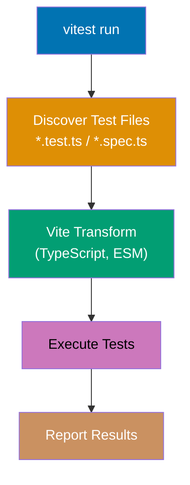
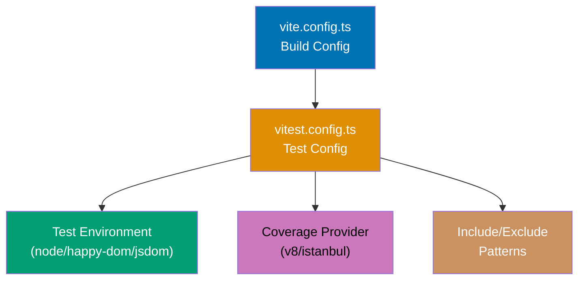
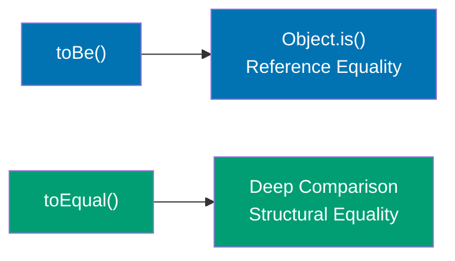
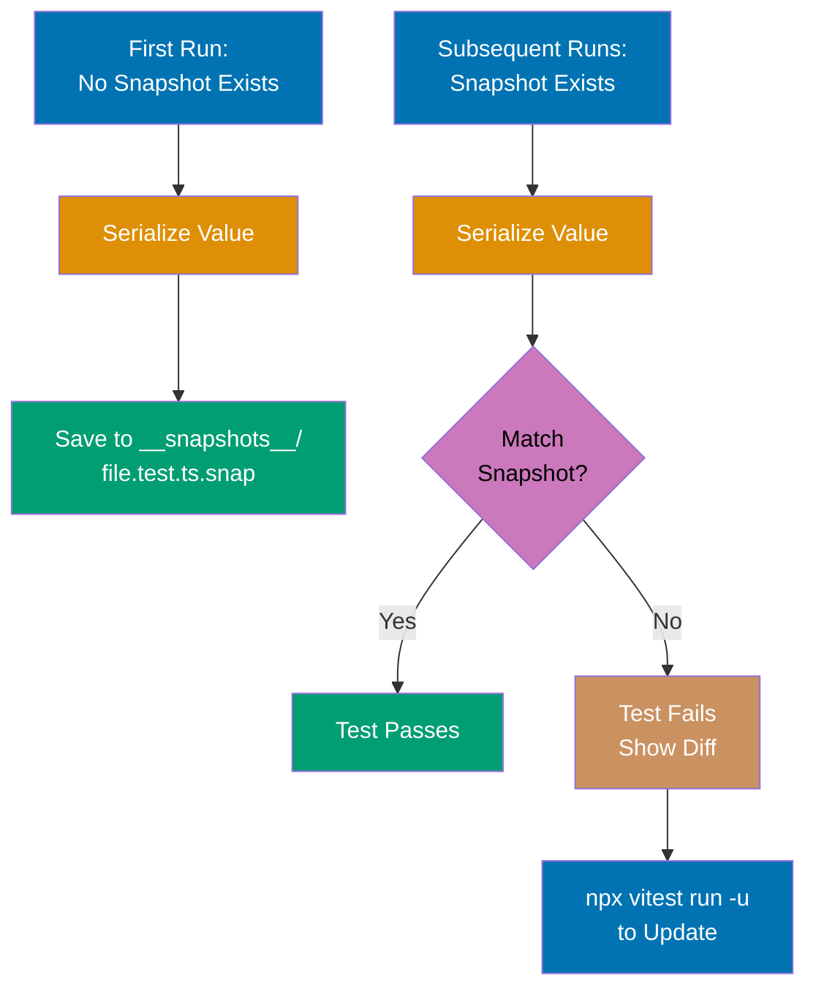
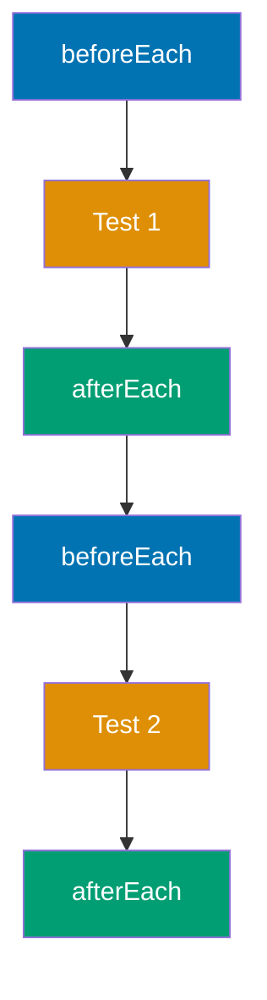
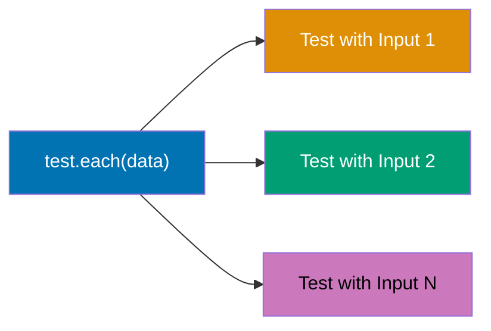
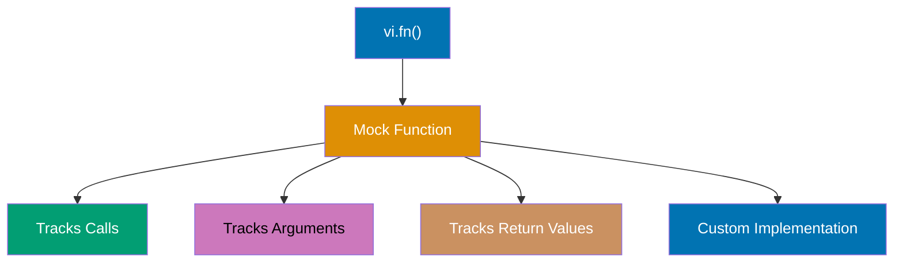
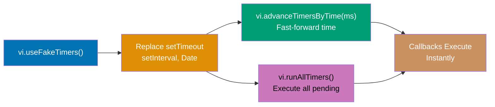

Learn Vitest fundamentals through 30 annotated code examples. Each example is self-contained, runnable with `npx vitest run`, and heavily commented to show what each line does, expected behaviors, and intermediate states.

## Core Fundamentals (Examples 1-5)

### Example 1: Hello World - Your First Vitest Test

Vitest tests use `test` or `it` functions to define test cases. The test runner discovers files matching `*.test.ts` or `*.spec.ts` and executes them with Vite's transformation pipeline.



**Code**:

```typescript
import { test, expect } from "vitest";
// => Imports test runner and assertion library from vitest
// => test: function to define test cases
// => expect: assertion function for verifications

test("adds two numbers", () => {
  // => Defines a test named "adds two numbers"
  // => Callback contains test logic (synchronous here)

  const result = 2 + 3;
  // => Performs arithmetic operation
  // => result is 5 (type: number)

  expect(result).toBe(5);
  // => Asserts result strictly equals 5
  // => Uses Object.is() for comparison
  // => Test passes when values match
});
```

**Key Takeaway**: Vitest tests are functions that receive a name and callback. Import `test` and `expect` from `vitest` -- the API is intentionally Jest-compatible, making migration straightforward.

**Why It Matters**: Vitest uses Vite's transformation pipeline, so TypeScript, ESM, and JSX work without configuration. Unlike Jest, which requires separate transform plugins (ts-jest, babel-jest), Vitest shares your project's Vite config. This means your tests transform code identically to your production build, eliminating "works in tests but not in prod" discrepancies.

---

### Example 2: Using it() and describe() for BDD Structure

`describe` groups related tests into suites. `it` is an alias for `test` that reads more naturally in BDD style ("it should do X"). Both are functionally identical.

```typescript
import { describe, it, expect } from "vitest";
// => describe: groups related tests into a suite
// => it: alias for test (BDD-style naming)
// => expect: assertion function

describe("Calculator", () => {
  // => Creates test suite named "Calculator"
  // => Groups related tests for organized output

  it("should add two numbers", () => {
    // => it() reads as: "it should add two numbers"
    // => Identical to test() -- purely stylistic choice
    expect(1 + 2).toBe(3);
    // => Asserts 1 + 2 equals 3
  });

  it("should subtract two numbers", () => {
    // => Another test case within the same suite
    expect(5 - 3).toBe(2);
    // => Asserts 5 - 3 equals 2
  });

  describe("division", () => {
    // => Nested describe for sub-grouping
    // => Output: Calculator > division > ...

    it("should divide evenly", () => {
      // => Test within nested suite
      expect(10 / 2).toBe(5);
      // => Asserts 10 / 2 equals 5
    });

    it("should handle decimal results", () => {
      // => Another test in nested suite
      expect(7 / 2).toBe(3.5);
      // => Asserts 7 / 2 equals 3.5
    });
  });
});
```

**Key Takeaway**: Use `describe` to organize tests into logical groups and `it` for BDD-style naming. Nesting creates hierarchical output that mirrors your application's structure.

**Why It Matters**: Test organization scales with codebase size. Flat test lists become unreadable at 100+ tests. Nested `describe` blocks create a tree structure in test output that maps to your application's domain model, making failures immediately localizable. Teams adopting BDD patterns use `it("should...")` to document behavior as executable specifications.

---

### Example 3: Test Configuration with vitest.config.ts

Vitest configuration extends Vite's config. You can define test-specific settings like environment, globals, and coverage in a dedicated config file.



**Code**:

```typescript
// vitest.config.ts
import { defineConfig } from "vitest/config";
// => Imports Vitest-specific config helper
// => Extends Vite's defineConfig with test options

export default defineConfig({
  // => Exports configuration object
  test: {
    // => Test-specific configuration section
    globals: false,
    // => When false: must import test/expect from "vitest"
    // => When true: test/expect available globally (Jest-like)
    environment: "node",
    // => Test environment: "node" (default), "happy-dom", "jsdom"
    // => "node" for backend/utility code
    include: ["src/**/*.test.ts"],
    // => Glob patterns for test file discovery
    // => Only files matching these patterns run as tests
    exclude: ["node_modules", "dist"],
    // => Patterns to exclude from test discovery
    // => Prevents testing third-party and build files
  },
});
```

**Key Takeaway**: `vitest.config.ts` inherits Vite's configuration and adds test-specific settings. Keep `globals: false` to maintain explicit imports and avoid global namespace pollution.

**Why It Matters**: Vitest's configuration inheritance from Vite eliminates the dual-config problem that plagues Jest + Webpack projects. Path aliases, TypeScript transforms, and CSS module handling defined once in Vite config automatically apply to tests. This single-source-of-truth approach prevents the common bug where code works in tests but fails in production because of different transform configurations.

---

### Example 4: Test File Conventions and Discovery

Vitest discovers test files through configurable glob patterns. Understanding naming conventions prevents test files from being silently ignored.

```typescript
// src/utils/math.test.ts (discovered by default)
import { describe, it, expect } from "vitest";
// => File named *.test.ts matches default include pattern
// => Vitest discovers this file automatically

// Function under test (defined in same file for self-containment)
function add(a: number, b: number): number {
  // => Simple function to demonstrate testing
  return a + b;
  // => Returns sum of two numbers
}

describe("math utilities", () => {
  // => Suite groups all math-related tests
  it("adds positive numbers", () => {
    expect(add(2, 3)).toBe(5);
    // => Calls add(2, 3), expects 5
  });

  it("adds negative numbers", () => {
    expect(add(-1, -2)).toBe(-3);
    // => Verifies negative number handling
  });

  it("adds zero", () => {
    expect(add(0, 5)).toBe(5);
    // => Zero is identity element for addition
  });
});

// Also valid: math.spec.ts, math.test.tsx, math.spec.tsx
// => Vitest default patterns: **/*.{test,spec}.{ts,tsx,js,jsx}
// => Configure custom patterns in vitest.config.ts include option
```

**Key Takeaway**: Name test files `*.test.ts` or `*.spec.ts` and place them alongside source files or in a `__tests__` directory. Vitest discovers them automatically through configurable glob patterns.

**Why It Matters**: Co-locating tests with source code (feature.ts + feature.test.ts) reduces navigation overhead and makes it obvious when code lacks tests. The glob-based discovery pattern means adding a test file automatically includes it in the test run -- no manual registration required. This convention-over-configuration approach reduces onboarding friction for new team members.

---

### Example 5: Running Tests - CLI Options

Vitest provides multiple execution modes through CLI flags. Understanding these options enables efficient development workflows.

```typescript
import { describe, it, expect } from "vitest";
// => Standard vitest imports

// CLI commands (run in terminal, not in test file):
// npx vitest run              => Run all tests once and exit
// npx vitest                  => Run in watch mode (re-runs on file change)
// npx vitest run math.test.ts => Run specific file
// npx vitest run -t "adds"    => Run tests matching name pattern
// npx vitest run --reporter=verbose => Detailed output per test

describe("CLI demonstration", () => {
  // => This suite demonstrates testable patterns

  it("runs in default mode", () => {
    // => Discovered and run by: npx vitest run
    const mode = "run";
    // => mode is "run" (type: string)
    expect(mode).toBe("run");
    // => Asserts mode equals "run"
  });

  it("supports watch mode", () => {
    // => In watch mode, Vitest re-runs on file save
    // => Uses Vite's HMR for near-instant re-execution
    const watchEnabled = true;
    // => watchEnabled is true (type: boolean)
    expect(watchEnabled).toBe(true);
    // => Confirms watch mode concept
  });

  it("filters by test name", () => {
    // => npx vitest run -t "filters" runs only this test
    // => -t flag matches against test/describe names
    const filtered = true;
    // => filtered is true
    expect(filtered).toBeTruthy();
    // => toBeTruthy() passes for any truthy value
  });
});
```

**Key Takeaway**: Use `npx vitest run` for CI (single run) and `npx vitest` for development (watch mode). The `-t` flag filters by test name for focused debugging.

**Why It Matters**: Vitest's watch mode leverages Vite's Hot Module Replacement (HMR) to re-run only affected tests when files change. This provides sub-second feedback during development, compared to Jest's multi-second cold starts. The filtering flags (`-t`, file patterns) let you focus on the test you're writing without running the entire suite, which matters significantly in large codebases with hundreds of test files.

---

## Assertion Matchers (Examples 6-15)

### Example 6: Equality Matchers - toBe vs toEqual

`toBe` uses `Object.is()` for strict reference equality. `toEqual` performs deep structural comparison. Choosing the wrong one causes subtle test failures.



**Code**:

```typescript
import { test, expect } from "vitest";

test("toBe vs toEqual", () => {
  // Primitives: toBe works for value comparison
  expect(1 + 1).toBe(2);
  // => Passes: Object.is(2, 2) is true
  // => Primitives compared by value

  expect("hello").toBe("hello");
  // => Passes: identical string values
  // => Strings are primitives (value equality)

  // Objects: toBe checks reference, toEqual checks structure
  const obj1 = { name: "Alice", age: 30 };
  // => obj1 is { name: "Alice", age: 30 }
  const obj2 = { name: "Alice", age: 30 };
  // => obj2 is { name: "Alice", age: 30 } (different reference)

  // expect(obj1).toBe(obj2);
  // => FAILS: different object references
  // => Object.is(obj1, obj2) is false

  expect(obj1).toEqual(obj2);
  // => PASSES: deep structural comparison
  // => Compares all properties recursively

  // Arrays: same distinction applies
  expect([1, 2, 3]).toEqual([1, 2, 3]);
  // => PASSES: arrays compared element-by-element
  // => toEqual handles nested structures

  // toStrictEqual: toEqual + checks for undefined properties
  expect({ a: 1 }).toEqual({ a: 1, b: undefined });
  // => PASSES: toEqual ignores undefined properties
  expect({ a: 1 }).not.toStrictEqual({ a: 1, b: undefined });
  // => PASSES: toStrictEqual catches undefined property difference
});
```

**Key Takeaway**: Use `toBe` for primitives and reference checks. Use `toEqual` for deep object/array comparison. Use `toStrictEqual` when `undefined` properties matter.

**Why It Matters**: Incorrect equality matcher choice is the most common source of false-passing tests. A test using `toBe` on objects silently fails when code returns a new object with identical structure -- the test passes during development but breaks when refactoring changes object identity. Using `toEqual` as default for objects prevents this class of bugs while `toStrictEqual` catches schema mismatches in API response validation.

---

### Example 7: Truthiness Matchers

Vitest provides matchers for JavaScript's truthy/falsy semantics. These matchers handle null, undefined, and boolean checks cleanly.

```typescript
import { test, expect } from "vitest";

test("truthiness matchers", () => {
  // toBeTruthy: passes for any truthy value
  expect(1).toBeTruthy();
  // => Passes: 1 is truthy
  expect("hello").toBeTruthy();
  // => Passes: non-empty string is truthy
  expect([]).toBeTruthy();
  // => Passes: empty array is truthy (common gotcha!)
  expect({}).toBeTruthy();
  // => Passes: empty object is truthy

  // toBeFalsy: passes for any falsy value
  expect(0).toBeFalsy();
  // => Passes: 0 is falsy
  expect("").toBeFalsy();
  // => Passes: empty string is falsy
  expect(null).toBeFalsy();
  // => Passes: null is falsy
  expect(undefined).toBeFalsy();
  // => Passes: undefined is falsy

  // toBeNull: strictly checks for null
  expect(null).toBeNull();
  // => Passes: value is exactly null
  // expect(undefined).toBeNull();
  // => FAILS: undefined is not null

  // toBeUndefined / toBeDefined
  expect(undefined).toBeUndefined();
  // => Passes: value is exactly undefined
  let x: string | undefined = "hello";
  // => x is "hello" (defined)
  expect(x).toBeDefined();
  // => Passes: value is not undefined

  // toBeNaN: checks for NaN
  expect(NaN).toBeNaN();
  // => Passes: value is NaN
  expect(0 / 0).toBeNaN();
  // => Passes: 0/0 produces NaN
});
```

**Key Takeaway**: Use specific matchers (`toBeNull`, `toBeUndefined`) over generic ones (`toBeFalsy`) when testing specific states. Specific matchers produce clearer error messages on failure.

**Why It Matters**: JavaScript's truthy/falsy semantics create subtle bugs -- `[]` and `{}` are truthy, `0` and `""` are falsy. Using `toBeFalsy` when you mean `toBeNull` masks bugs where a function returns `0` (falsy but valid) instead of `null` (absent). Specific matchers serve as documentation of expected types and produce error messages like "expected null, received undefined" rather than "expected falsy," dramatically reducing debugging effort.

---

### Example 8: Number Matchers

Vitest provides specialized matchers for numeric comparisons including floating-point precision handling.

```typescript
import { test, expect } from "vitest";

test("number matchers", () => {
  // toBeGreaterThan / toBeGreaterThanOrEqual
  expect(10).toBeGreaterThan(5);
  // => Passes: 10 > 5
  expect(10).toBeGreaterThanOrEqual(10);
  // => Passes: 10 >= 10

  // toBeLessThan / toBeLessThanOrEqual
  expect(3).toBeLessThan(7);
  // => Passes: 3 < 7
  expect(3).toBeLessThanOrEqual(3);
  // => Passes: 3 <= 3

  // toBeCloseTo: floating-point comparison with precision
  expect(0.1 + 0.2).not.toBe(0.3);
  // => Passes: 0.1 + 0.2 is 0.30000000000000004
  // => IEEE 754 floating-point precision issue

  expect(0.1 + 0.2).toBeCloseTo(0.3);
  // => Passes: within default precision (5 decimal places)
  // => Handles floating-point rounding errors

  expect(0.1 + 0.2).toBeCloseTo(0.3, 5);
  // => Second arg: number of decimal digits to check
  // => 5 means 10^-5 tolerance (0.00001)

  // Practical example: currency calculations
  const price = 19.99;
  // => price is 19.99
  const tax = price * 0.08;
  // => tax is 1.5992 (floating-point)
  const total = price + tax;
  // => total is 21.5892
  expect(total).toBeCloseTo(21.59, 2);
  // => Passes: within 2 decimal places (cents)
});
```

**Key Takeaway**: Use `toBeCloseTo` for floating-point comparisons to avoid IEEE 754 precision failures. Specify decimal precision matching your domain requirements (2 for currency, 5 for scientific).

**Why It Matters**: The classic `0.1 + 0.2 !== 0.3` problem breaks naive numeric tests in every language using IEEE 754 floating-point. Financial applications, physics simulations, and coordinate systems all produce values that differ by tiny fractions. Using `toBe` for these comparisons creates flaky tests that pass on one platform but fail on another. `toBeCloseTo` with explicit precision makes the acceptable tolerance part of the test specification.

---

### Example 9: String Matchers

Vitest provides matchers for string content verification using exact matches, substrings, and regular expressions.

```typescript
import { test, expect } from "vitest";

test("string matchers", () => {
  const greeting = "Hello, World!";
  // => greeting is "Hello, World!" (type: string)

  // toContain: substring check
  expect(greeting).toContain("World");
  // => Passes: "Hello, World!" contains "World"
  expect(greeting).toContain("Hello");
  // => Passes: "Hello, World!" contains "Hello"

  // toMatch: regex pattern matching
  expect(greeting).toMatch(/World/);
  // => Passes: matches regex /World/
  expect(greeting).toMatch(/^Hello/);
  // => Passes: starts with "Hello"
  expect(greeting).toMatch(/!$/);
  // => Passes: ends with "!"

  // toMatch with string (treated as substring)
  expect(greeting).toMatch("World");
  // => Passes: string arg treated as substring match

  // toHaveLength: string length check
  expect(greeting).toHaveLength(13);
  // => Passes: "Hello, World!" has 13 characters

  // Combining with not for negative assertions
  expect(greeting).not.toContain("Goodbye");
  // => Passes: string does NOT contain "Goodbye"
  expect(greeting).not.toMatch(/^\d+$/);
  // => Passes: string is NOT all digits
});
```

**Key Takeaway**: Use `toContain` for simple substring checks and `toMatch` with regex for pattern validation. Both provide clear error messages showing the actual string on failure.

**Why It Matters**: String assertions are essential for testing user-facing output, error messages, API responses, and log output. Using `toMatch` with regex enables flexible validation -- checking email format, date patterns, or URL structure without brittle exact-match assertions. The `not` modifier creates negative assertions that verify sensitive data is properly redacted or error details are not leaked to users.

---

### Example 10: Array and Object Matchers

Vitest provides matchers for verifying array contents and object structures without requiring exact matches.

```typescript
import { test, expect } from "vitest";

test("array matchers", () => {
  const fruits = ["apple", "banana", "cherry"];
  // => fruits is ["apple", "banana", "cherry"]

  // toContain: array includes value
  expect(fruits).toContain("banana");
  // => Passes: array includes "banana"
  // => Uses strict equality for comparison

  // toHaveLength: array length
  expect(fruits).toHaveLength(3);
  // => Passes: array has 3 elements

  // toContainEqual: deep equality check for array elements
  const users = [{ name: "Alice" }, { name: "Bob" }];
  // => Array of objects
  expect(users).toContainEqual({ name: "Alice" });
  // => Passes: array contains object matching structure
  // => Uses deep equality (not reference)

  // expect.arrayContaining: subset check
  expect(fruits).toEqual(expect.arrayContaining(["apple", "cherry"]));
  // => Passes: array contains at least these elements
  // => Order does not matter
});

test("object matchers", () => {
  const user = { name: "Alice", age: 30, role: "admin" };
  // => user object with three properties

  // toHaveProperty: checks property existence and value
  expect(user).toHaveProperty("name");
  // => Passes: object has "name" property
  expect(user).toHaveProperty("name", "Alice");
  // => Passes: "name" property equals "Alice"

  // expect.objectContaining: partial object match
  expect(user).toEqual(expect.objectContaining({ name: "Alice", role: "admin" }));
  // => Passes: object contains at least these properties
  // => Ignores "age" property (partial match)

  // Nested property access
  const config = { db: { host: "localhost", port: 5432 } };
  // => Nested object structure
  expect(config).toHaveProperty("db.host", "localhost");
  // => Passes: dot notation accesses nested properties
});
```

**Key Takeaway**: Use `toContain` for primitive array elements, `toContainEqual` for objects in arrays, and `expect.objectContaining` for partial object matching. These matchers make tests resilient to irrelevant changes.

**Why It Matters**: API responses and database records often contain auto-generated fields (timestamps, IDs) that change between runs. Using `toEqual` with exact objects creates brittle tests that break when new fields are added. `expect.objectContaining` and `expect.arrayContaining` verify the properties you care about while ignoring the rest, creating tests that survive schema evolution without masking real bugs.

---

### Example 11: Exception Matchers

Vitest provides `toThrow` and variants for testing that functions throw errors with expected messages or types.

```typescript
import { test, expect } from "vitest";

test("exception matchers", () => {
  // Function that throws
  function divide(a: number, b: number): number {
    // => Division function with validation
    if (b === 0) {
      throw new Error("Division by zero");
      // => Throws Error when dividing by zero
    }
    return a / b;
    // => Returns result for valid inputs
  }

  // toThrow: asserts function throws
  expect(() => divide(10, 0)).toThrow();
  // => Passes: function throws an error
  // => IMPORTANT: wrap in arrow function () =>
  // => Without wrapper, error propagates and test crashes

  // toThrow with message string
  expect(() => divide(10, 0)).toThrow("Division by zero");
  // => Passes: error message contains "Division by zero"
  // => Substring match, not exact match

  // toThrow with regex
  expect(() => divide(10, 0)).toThrow(/zero/);
  // => Passes: error message matches /zero/ regex

  // toThrow with Error class
  expect(() => divide(10, 0)).toThrow(Error);
  // => Passes: thrown value is instance of Error

  // Custom error classes
  class ValidationError extends Error {
    // => Custom error class for domain errors
    constructor(
      message: string,
      public field: string,
    ) {
      super(message);
      // => Calls parent Error constructor
    }
  }

  function validate(email: string) {
    // => Validation function
    if (!email.includes("@")) {
      throw new ValidationError("Invalid email", "email");
      // => Throws domain-specific error
    }
  }

  expect(() => validate("bad")).toThrow(ValidationError);
  // => Passes: thrown error is ValidationError instance
  expect(() => validate("bad")).toThrow("Invalid email");
  // => Passes: error message matches
});
```

**Key Takeaway**: Always wrap the throwing function in an arrow function `() =>` when using `toThrow`. Match error messages, regex patterns, or error classes depending on specificity needs.

**Why It Matters**: Error handling is a critical part of robust software. Testing that functions throw appropriate errors for invalid inputs verifies your validation logic works correctly. Using `toThrow(ErrorClass)` ensures your error hierarchy is preserved -- catching a generic `Error` when you expected a `ValidationError` indicates incorrect error classification that could mislead error handling code upstream.

---

### Example 12: Snapshot Testing

Snapshot testing captures a value's serialized representation and compares future runs against it. Vitest stores snapshots in `__snapshots__` directories.



**Code**:

```typescript
import { test, expect } from "vitest";

test("snapshot testing", () => {
  const user = {
    name: "Alice",
    age: 30,
    roles: ["admin", "editor"],
  };
  // => user object for snapshot comparison

  expect(user).toMatchSnapshot();
  // => First run: creates snapshot file
  // => Subsequent runs: compares against stored snapshot
  // => Fails if structure changes (intentional change detection)

  // Inline snapshots (stored in test file itself)
  expect(user.name).toMatchInlineSnapshot('"Alice"');
  // => Snapshot stored inline (Vitest auto-fills on first run)
  // => Easier to review in code review than external files

  // Snapshot with custom serializer
  const date = new Date("2026-01-15");
  // => date is Date object
  expect(date.toISOString()).toMatchInlineSnapshot('"2026-01-15T00:00:00.000Z"');
  // => Serializes date to ISO string for stable comparison
  // => Raw Date objects produce unstable snapshots
});
```

**Key Takeaway**: Use `toMatchSnapshot` for complex object regression testing and `toMatchInlineSnapshot` for small values that benefit from in-file visibility. Update snapshots with `npx vitest run -u` after intentional changes.

**Why It Matters**: Snapshots provide regression detection for complex outputs (API responses, component renders, configuration objects) without manually writing assertions for every property. They catch unintended changes during refactoring. However, large snapshots become rubber-stamped during code review. Inline snapshots keep assertions visible in the test file, making reviewers more likely to verify correctness. Use snapshots strategically for complex structures, not as a lazy alternative to specific assertions.

---

### Example 13: not Modifier for Negative Assertions

The `.not` modifier inverts any matcher, enabling you to assert that conditions do NOT hold.

```typescript
import { test, expect } from "vitest";

test("not modifier", () => {
  // Negate any matcher with .not
  expect(5).not.toBe(3);
  // => Passes: 5 is NOT 3

  expect("hello").not.toContain("xyz");
  // => Passes: "hello" does NOT contain "xyz"

  expect([1, 2, 3]).not.toContain(4);
  // => Passes: array does NOT include 4

  expect({ a: 1 }).not.toEqual({ a: 2 });
  // => Passes: objects are NOT structurally equal

  expect(() => {}).not.toThrow();
  // => Passes: function does NOT throw

  expect(null).not.toBeDefined();
  // => Passes: null is not considered defined
  // => Wait -- null IS defined! This actually FAILS
  // => Use toBeNull() instead for null checks

  // Correct null assertion
  expect(null).not.toBeUndefined();
  // => Passes: null is NOT undefined
  expect(null).toBeNull();
  // => Passes: value IS null

  // Practical use: ensure no error in result
  const result = { data: [1, 2, 3], error: null };
  // => result with null error (success case)
  expect(result.error).toBeNull();
  // => Passes: no error present
  expect(result.data).not.toHaveLength(0);
  // => Passes: data array is not empty
});
```

**Key Takeaway**: Chain `.not` before any matcher for inverse assertions. Be careful with `null` vs `undefined` semantics -- `null` is technically defined, so `not.toBeDefined()` on null fails.

**Why It Matters**: Negative assertions verify absence of bugs and unwanted behavior. Testing that API responses do NOT contain sensitive fields, that error objects are null on success, or that arrays are non-empty after operations are all essential production patterns. The `null` vs `undefined` subtlety catches developers regularly -- understanding this distinction prevents false confidence in your test suite.

---

### Example 14: expect.any and expect.anything Wildcards

Wildcard matchers allow flexible assertions where you care about types or presence but not specific values.

```typescript
import { test, expect } from "vitest";

test("wildcard matchers", () => {
  // expect.any(Constructor): matches any instance of type
  expect(42).toEqual(expect.any(Number));
  // => Passes: 42 is a Number
  expect("hello").toEqual(expect.any(String));
  // => Passes: "hello" is a String
  expect(true).toEqual(expect.any(Boolean));
  // => Passes: true is a Boolean

  // expect.anything(): matches anything except null/undefined
  expect(42).toEqual(expect.anything());
  // => Passes: 42 is not null or undefined
  expect("").toEqual(expect.anything());
  // => Passes: empty string is not null/undefined
  // expect(null).toEqual(expect.anything());
  // => FAILS: null does not match anything()

  // Practical: partial object matching with wildcards
  const apiResponse = {
    id: "abc-123-def",
    createdAt: new Date(),
    name: "Alice",
    status: "active",
  };
  // => API response with auto-generated fields

  expect(apiResponse).toEqual({
    id: expect.any(String),
    // => Matches any string ID (don't care about exact value)
    createdAt: expect.any(Date),
    // => Matches any Date (timestamp varies per run)
    name: "Alice",
    // => Exact match on name (business logic)
    status: "active",
    // => Exact match on status (business logic)
  });
  // => Passes: validates structure and business fields
  // => Ignores auto-generated values
});
```

**Key Takeaway**: Use `expect.any(Type)` for dynamic values where type matters but value does not. Use `expect.anything()` when you only need to verify a value exists (not null/undefined).

**Why It Matters**: Production APIs return timestamps, UUIDs, and auto-incremented IDs that change every test run. Without wildcard matchers, you either skip assertions on these fields (missing bugs) or use brittle regex patterns. `expect.any(String)` validates the field exists with the correct type without coupling to a specific value, creating tests that are both thorough and stable across environments.

---

### Example 15: Chained Matchers with expect.stringContaining and expect.objectContaining

Asymmetric matchers compose together for flexible assertions on complex nested structures.

```typescript
import { test, expect } from "vitest";

test("asymmetric matchers composition", () => {
  // expect.stringContaining: partial string match
  expect("hello world").toEqual(expect.stringContaining("world"));
  // => Passes: string contains "world"

  // expect.stringMatching: regex match
  expect("user-abc-123").toEqual(expect.stringMatching(/^user-/));
  // => Passes: string matches regex pattern

  // Composing matchers in objects
  const logEntry = {
    level: "error",
    message: "Connection refused to database",
    timestamp: "2026-04-05T10:30:00Z",
    metadata: { retries: 3, host: "db.example.com" },
  };
  // => Complex log entry object

  expect(logEntry).toEqual(
    expect.objectContaining({
      level: "error",
      // => Exact match on level
      message: expect.stringContaining("database"),
      // => Message must contain "database"
      timestamp: expect.stringMatching(/^\d{4}-\d{2}-\d{2}/),
      // => Timestamp must start with date format
      metadata: expect.objectContaining({
        retries: expect.any(Number),
        // => Retries is any number (don't care about exact count)
      }),
      // => Nested objectContaining for metadata
    }),
  );
  // => Passes: all composed matchers satisfied
  // => Validates structure without brittle exact matching

  // Array with asymmetric matchers
  const events = [
    { type: "click", target: "button-1" },
    { type: "input", target: "field-email" },
  ];
  // => Array of event objects

  expect(events).toEqual(
    expect.arrayContaining([
      expect.objectContaining({ type: "click" }),
      // => Array contains an object with type "click"
    ]),
  );
  // => Passes: events array has click event
});
```

**Key Takeaway**: Compose `expect.objectContaining`, `expect.stringContaining`, `expect.stringMatching`, and `expect.any` for flexible assertions on complex structures. These nest inside `toEqual` for powerful partial matching.

**Why It Matters**: Real-world data structures are deeply nested with a mix of deterministic and dynamic values. Composable asymmetric matchers let you write a single assertion that validates the entire structure at appropriate precision levels -- exact values for business logic, patterns for formatted data, type checks for auto-generated fields. This replaces chains of individual assertions that obscure the overall structure being validated.

---

## Test Lifecycle (Examples 16-19)

### Example 16: beforeEach and afterEach Hooks

Lifecycle hooks run setup and teardown code around each test. `beforeEach` runs before every test in the suite, `afterEach` runs after.



**Code**:

```typescript
import { describe, it, expect, beforeEach, afterEach } from "vitest";
// => Import lifecycle hooks alongside test functions

describe("database operations", () => {
  let items: string[];
  // => Shared state, reset before each test

  beforeEach(() => {
    // => Runs before EACH test in this describe block
    items = ["initial"];
    // => Reset items to known state
    // => Prevents test interdependencies
    console.log("Setup: items reset");
    // => Output: Setup: items reset (before each test)
  });

  afterEach(() => {
    // => Runs after EACH test in this describe block
    items = [];
    // => Clean up shared resources
    console.log("Cleanup: items cleared");
    // => Output: Cleanup: items cleared (after each test)
  });

  it("adds an item", () => {
    items.push("new");
    // => items is ["initial", "new"]
    expect(items).toHaveLength(2);
    // => Passes: 2 items after push
  });

  it("starts fresh each time", () => {
    // => beforeEach already ran, items is ["initial"]
    expect(items).toHaveLength(1);
    // => Passes: previous test's push didn't leak
    expect(items[0]).toBe("initial");
    // => Passes: items reset to known state
  });
});
```

**Key Takeaway**: Use `beforeEach` to establish known state before each test and `afterEach` to clean up resources. This ensures tests are isolated and run independently in any order.

**Why It Matters**: Test isolation is the foundation of reliable test suites. Tests that share mutable state create order-dependent failures -- test B passes when run after test A but fails when run alone. `beforeEach` guarantees each test starts from a known state, making tests deterministic. `afterEach` prevents resource leaks (open connections, temp files) that cause cascading failures in CI where tests run in the same process.

---

### Example 17: beforeAll and afterAll Hooks

`beforeAll` runs once before all tests in a suite. `afterAll` runs once after all tests complete. Use these for expensive one-time setup like database connections.

```typescript
import { describe, it, expect, beforeAll, afterAll } from "vitest";
// => Import suite-level lifecycle hooks

describe("expensive setup", () => {
  let connection: { connected: boolean; query: (sql: string) => string[] };
  // => Simulated database connection (expensive to create)

  beforeAll(() => {
    // => Runs ONCE before all tests in this suite
    // => Use for expensive setup: DB connections, server start
    connection = {
      connected: true,
      query: (sql: string) => [`result for: ${sql}`],
    };
    // => connection established (simulated)
    console.log("Connection opened (once)");
    // => Output: Connection opened (once) -- only printed once
  });

  afterAll(() => {
    // => Runs ONCE after all tests complete
    // => Use for cleanup: close connections, stop servers
    connection = { connected: false, query: () => [] };
    // => connection closed (simulated)
    console.log("Connection closed (once)");
    // => Output: Connection closed (once) -- only printed once
  });

  it("uses the connection", () => {
    expect(connection.connected).toBe(true);
    // => Passes: connection established by beforeAll
    const results = connection.query("SELECT * FROM users");
    // => results is ["result for: SELECT * FROM users"]
    expect(results).toHaveLength(1);
    // => Passes: query returns results
  });

  it("reuses the same connection", () => {
    // => Same connection object from beforeAll
    expect(connection.connected).toBe(true);
    // => Passes: connection still open
    const results = connection.query("SELECT * FROM orders");
    // => results is ["result for: SELECT * FROM orders"]
    expect(results[0]).toContain("orders");
    // => Passes: query executed on same connection
  });
});
```

**Key Takeaway**: Use `beforeAll`/`afterAll` for expensive one-time setup (database connections, server instances). Use `beforeEach`/`afterEach` for per-test state isolation. Mixing both is common.

**Why It Matters**: Creating a database connection per test (in `beforeEach`) can make a 200-test suite take minutes instead of seconds. `beforeAll` creates the connection once and shares it across tests. The trade-off is that tests share the connection state -- one test's writes are visible to subsequent tests. Combine `beforeAll` for connection setup with `beforeEach` for data reset (truncate tables) to balance performance with isolation.

---

### Example 18: Nested Lifecycle Hook Execution Order

When `describe` blocks are nested, hooks execute in outside-in (setup) and inside-out (teardown) order. Understanding this prevents unexpected state.

```typescript
import { describe, it, expect, beforeEach, afterEach } from "vitest";

// Execution order demonstration
const log: string[] = [];
// => Tracks execution order across hooks

describe("outer suite", () => {
  beforeEach(() => {
    log.push("outer beforeEach");
    // => Runs first (outermost setup)
  });

  afterEach(() => {
    log.push("outer afterEach");
    // => Runs last (outermost teardown)
  });

  describe("inner suite", () => {
    beforeEach(() => {
      log.push("inner beforeEach");
      // => Runs second (inner setup)
    });

    afterEach(() => {
      log.push("inner afterEach");
      // => Runs before outer afterEach
    });

    it("demonstrates hook order", () => {
      log.push("test execution");
      // => Runs between setup and teardown

      // Full order for this test:
      // 1. outer beforeEach
      // 2. inner beforeEach
      // 3. test execution
      // 4. inner afterEach
      // 5. outer afterEach
      expect(log).toEqual(["outer beforeEach", "inner beforeEach", "test execution"]);
      // => Passes: setup hooks run outside-in before test
    });
  });
});
```

**Key Takeaway**: Nested hooks execute outside-in for setup (`beforeEach`) and inside-out for teardown (`afterEach`). This mirrors constructor/destructor patterns in object-oriented programming.

**Why It Matters**: Large test suites use nested describes for organization -- "User API > Authentication > Login > Failure Cases." Each level may have its own setup hooks. Understanding execution order prevents bugs where inner setup overwrites outer setup, or teardown runs in unexpected order. This is especially critical when hooks manage resources like database transactions that must open (outer) before inserting test data (inner).

---

### Example 19: Async Lifecycle Hooks

Lifecycle hooks support async/await for asynchronous setup and teardown operations.

```typescript
import { describe, it, expect, beforeEach, afterEach } from "vitest";

describe("async hooks", () => {
  let data: string[];
  // => Data loaded asynchronously in setup

  beforeEach(async () => {
    // => async beforeEach: Vitest awaits completion before test
    data = await loadTestData();
    // => Waits for data to load before any test runs
    // => data is ["item-1", "item-2", "item-3"]
  });

  afterEach(async () => {
    // => async afterEach: cleanup can also be async
    await clearTestData();
    // => Waits for cleanup before next test
    data = [];
    // => Reset local reference
  });

  it("uses async-loaded data", () => {
    expect(data).toHaveLength(3);
    // => Passes: data loaded by async beforeEach
    expect(data[0]).toBe("item-1");
    // => Passes: first item is "item-1"
  });

  it("gets fresh data each time", () => {
    data.push("extra");
    // => data is ["item-1", "item-2", "item-3", "extra"]
    expect(data).toHaveLength(4);
    // => Passes: modified in this test
    // => Next test gets fresh data from beforeEach
  });
});

// Helper functions for self-containment
async function loadTestData(): Promise<string[]> {
  // => Simulates async data loading (API call, DB query)
  return Promise.resolve(["item-1", "item-2", "item-3"]);
  // => Returns resolved promise with test data
}

async function clearTestData(): Promise<void> {
  // => Simulates async cleanup
  return Promise.resolve();
  // => Returns resolved promise when cleanup complete
}
```

**Key Takeaway**: Return a promise or use `async`/`await` in lifecycle hooks for asynchronous operations. Vitest waits for the promise to resolve before proceeding to the test or next hook.

**Why It Matters**: Production test suites often need async setup -- seeding databases, starting mock servers, loading fixtures from files. If hooks don't properly await async operations, tests run before setup completes, causing intermittent failures. Vitest's native async hook support eliminates the callback-based patterns and manual promise handling required by older frameworks, making async setup as straightforward as synchronous setup.

---

## Test Organization (Examples 20-23)

### Example 20: test.skip - Temporarily Disabling Tests

`test.skip` marks tests as skipped without deleting them. Skipped tests appear in output as reminders.

```typescript
import { describe, it, expect } from "vitest";

describe("test.skip demonstration", () => {
  it("runs normally", () => {
    expect(1 + 1).toBe(2);
    // => Passes: normal test executes
  });

  it.skip("skips this test", () => {
    // => test.skip or it.skip: marked as skipped
    // => Appears in output as "skipped" (not "passed" or "failed")
    expect(true).toBe(false);
    // => Never executes -- would fail if it ran
  });

  // Equivalent: skip modifier on describe
  describe.skip("skipped suite", () => {
    // => All tests in this suite are skipped
    it("also skipped", () => {
      expect(true).toBe(false);
      // => Never executes
    });
  });

  // Conditional skip using test.skipIf
  const isCI = process.env.CI === "true";
  // => Check if running in CI environment

  it.skipIf(isCI)("skips in CI only", () => {
    // => Runs locally, skips in CI
    // => Useful for tests requiring local resources
    expect(true).toBe(true);
    // => Executes only when CI is not set
  });
});
```

**Key Takeaway**: Use `it.skip` for temporarily disabled tests and `it.skipIf` for environment-conditional skipping. Skipped tests remain visible in output as reminders to re-enable them.

**Why It Matters**: Deleting failing tests hides problems. Commenting them out makes them invisible in test output. `it.skip` keeps tests in the codebase and in test reports, creating social pressure to fix them. `it.skipIf` enables environment-specific testing -- skip GPU tests in CI, skip integration tests locally -- without maintaining separate test configurations per environment.

---

### Example 21: test.only - Focused Test Execution

`test.only` runs only marked tests, skipping everything else. Essential for debugging specific failures.

```typescript
import { describe, it, expect } from "vitest";

describe("test.only demonstration", () => {
  it("skipped when .only exists elsewhere", () => {
    // => This test is skipped because another test has .only
    expect(true).toBe(true);
  });

  it.only("only this test runs", () => {
    // => ONLY this test executes in the file
    // => All other tests in the file are skipped
    const result = complexCalculation(42);
    // => Focus debugging on this specific test
    expect(result).toBe(84);
    // => Passes: focused test runs
  });

  it("also skipped", () => {
    // => Skipped because it.only is active
    expect(true).toBe(true);
  });

  // describe.only: run only tests in this suite
  // describe.only("focused suite", () => {
  //   it("runs", () => { ... });    // => Runs
  //   it("also runs", () => { ... }); // => Runs
  // });
});

function complexCalculation(n: number): number {
  // => Function under focused debugging
  return n * 2;
  // => Returns doubled input
}
```

**Key Takeaway**: Use `it.only` to isolate a specific test during debugging. Remove `.only` before committing -- leaving it in production skips your entire test suite silently.

**Why It Matters**: When a test fails, running the full suite wastes time. `it.only` provides instant feedback on the test you're debugging. However, accidentally committing `.only` is a critical bug -- it silently skips your entire test suite in CI. Many teams use ESLint rules or pre-commit hooks to prevent `.only` from being committed. Vitest's `--bail` flag combined with `.only` creates an efficient debug-fix-verify loop.

---

### Example 22: test.todo - Placeholder Tests

`test.todo` creates placeholder tests that appear in output as reminders for unimplemented functionality.

```typescript
import { describe, it, expect } from "vitest";

describe("todo tests", () => {
  it("implemented test", () => {
    expect(true).toBe(true);
    // => This test is implemented and runs
  });

  it.todo("should validate email format");
  // => Placeholder: appears as "todo" in output
  // => No callback function -- just a reminder
  // => Does not count as passing or failing

  it.todo("should handle Unicode characters");
  // => Another unimplemented test
  // => Shows up in test report as work to be done

  it.todo("should rate-limit API calls");
  // => Tracks planned tests alongside implemented ones

  // todo with implementation (test runs but marked as todo)
  it.todo("should sanitize HTML input", () => {
    // => When callback provided, test runs but reports as todo
    const input = "<script>alert('xss')</script>";
    // => Malicious input to sanitize
    // Placeholder assertion
    expect(input).toBeDefined();
    // => Basic assertion placeholder
  });
});
```

**Key Takeaway**: Use `it.todo` to document planned tests as executable reminders. Unlike comments, todo tests appear in test output and can be tracked as part of test coverage planning.

**Why It Matters**: Test-driven development (TDD) begins with writing test names before implementations. `it.todo` formalizes this practice -- you can plan your entire test suite structure, commit it, and track progress as todos are replaced with implementations. Unlike code comments that rot, todo tests appear in every test run's output, keeping planned work visible. Teams use todo counts as a quality metric for test coverage completeness.

---

### Example 23: test.each - Parameterized Tests

`test.each` runs the same test with multiple data sets, reducing duplication for tests that verify the same logic with different inputs.



**Code**:

```typescript
import { describe, it, expect } from "vitest";

// test.each with array of arrays
it.each([
  [1, 2, 3],
  [5, 10, 15],
  [-1, -2, -3],
  [0, 0, 0],
])("adds %i + %i = %i", (a, b, expected) => {
  // => %i: format integer in test name
  // => Each array element becomes test arguments
  expect(a + b).toBe(expected);
  // => Runs 4 tests: "adds 1 + 2 = 3", "adds 5 + 10 = 15", etc.
});

// test.each with array of objects
describe("string utilities", () => {
  it.each([
    { input: "hello", expected: "HELLO" },
    { input: "World", expected: "WORLD" },
    { input: "vitest", expected: "VITEST" },
  ])("uppercases $input to $expected", ({ input, expected }) => {
    // => $input, $expected: template literal substitution
    // => Each object's properties become named arguments
    expect(input.toUpperCase()).toBe(expected);
    // => Runs 3 tests with descriptive names
  });
});

// test.each with template literal (table syntax)
describe("math operations", () => {
  it.each`
    a     | b    | expected
    ${1}  | ${2} | ${3}
    ${3}  | ${4} | ${7}
    ${-1} | ${1} | ${0}
  `("computes $a + $b = $expected", ({ a, b, expected }) => {
    // => Template literal syntax for table-like data
    // => First row defines column names
    expect(a + b).toBe(expected);
    // => Each row becomes a test case
  });
});
```

**Key Takeaway**: Use `test.each` to eliminate duplicate test code. Choose array format for simple data, object format for named parameters, or template literal format for table-like readability.

**Why It Matters**: Copy-pasting test cases to cover different inputs creates maintenance overhead -- fixing a bug in the test logic requires updating every copy. `test.each` defines the test logic once and varies only the data. This is critical for boundary testing (empty strings, zero, negative numbers, max values) and validation testing (valid/invalid formats) where you need dozens of cases testing the same assertion with different inputs.

---

## Async Testing (Examples 24-26)

### Example 24: Testing Async/Await Functions

Vitest natively supports async test functions. Return a promise or use async/await -- Vitest waits for resolution before evaluating assertions.

```typescript
import { test, expect } from "vitest";

// Async function under test
async function fetchUser(id: number): Promise<{ id: number; name: string }> {
  // => Simulates async API call
  return new Promise((resolve) => {
    setTimeout(() => {
      resolve({ id, name: `User ${id}` });
      // => Resolves after delay with user object
    }, 10);
  });
}

test("async function with await", async () => {
  // => async test: Vitest awaits the function
  const user = await fetchUser(1);
  // => Waits for promise resolution
  // => user is { id: 1, name: "User 1" }

  expect(user).toEqual({ id: 1, name: "User 1" });
  // => Passes: user matches expected structure
  expect(user.id).toBe(1);
  // => Passes: id is 1
  expect(user.name).toContain("User");
  // => Passes: name contains "User"
});

test("async function with resolves", async () => {
  // => Alternative: use resolves matcher
  await expect(fetchUser(2)).resolves.toEqual({
    id: 2,
    name: "User 2",
  });
  // => resolves: unwraps promise and asserts on resolved value
  // => Must await the expect() call
});

test("async rejection with rejects", async () => {
  // Async function that rejects
  async function failingFetch(): Promise<never> {
    // => Function that always rejects
    throw new Error("Network error");
  }

  await expect(failingFetch()).rejects.toThrow("Network error");
  // => rejects: unwraps rejected promise
  // => Asserts rejection reason matches
  // => Must await the expect() call
});
```

**Key Takeaway**: Use `async`/`await` in tests for async operations. Use `.resolves` and `.rejects` matchers for promise-specific assertions. Always `await` the `expect()` call when using these matchers.

**Why It Matters**: Modern JavaScript is heavily asynchronous -- API calls, database queries, file operations all return promises. Forgetting to `await` an async assertion silently passes even when the assertion would fail, because the test completes before the promise resolves. Vitest detects unhandled promises and warns, but explicit `await` makes intent clear and prevents this class of false-positive tests.

---

### Example 25: Testing Promise Rejection Patterns

Testing error handling in async code requires specific patterns to catch and verify rejections.

```typescript
import { test, expect } from "vitest";

// Async function with conditional rejection
async function divide(a: number, b: number): Promise<number> {
  // => Async division with validation
  if (b === 0) {
    throw new Error("Cannot divide by zero");
    // => Rejects for invalid input
  }
  return a / b;
  // => Resolves with quotient
}

test("tests successful async operations", async () => {
  const result = await divide(10, 2);
  // => result is 5
  expect(result).toBe(5);
  // => Passes: 10 / 2 = 5
});

test("tests async rejection", async () => {
  // Pattern 1: rejects matcher
  await expect(divide(10, 0)).rejects.toThrow("Cannot divide by zero");
  // => Passes: promise rejects with expected message

  // Pattern 2: try/catch for detailed inspection
  try {
    await divide(10, 0);
    // => Should throw, execution should not reach next line
    expect.unreachable("Should have thrown");
    // => expect.unreachable: fails if reached
    // => Prevents false-passing tests when throw is missing
  } catch (error) {
    // => Catches the rejection for inspection
    expect(error).toBeInstanceOf(Error);
    // => Passes: error is Error instance
    expect((error as Error).message).toBe("Cannot divide by zero");
    // => Passes: message matches
  }
});

test("tests that function does NOT reject", async () => {
  // Verify successful case does not throw
  await expect(divide(10, 2)).resolves.toBe(5);
  // => Passes: resolves successfully with value 5
  // => Would fail if function threw an error
});
```

**Key Takeaway**: Use `.rejects.toThrow()` for simple rejection checks and `try/catch` with `expect.unreachable` for detailed error inspection. `expect.unreachable` prevents false positives when the expected throw is missing.

**Why It Matters**: Async error handling is where most production bugs hide. A function that returns `undefined` instead of throwing corrupts downstream data silently. Testing rejections verifies your error paths work correctly. `expect.unreachable` is Vitest's safeguard against the classic mistake where a test "passes" because the error was never thrown and the catch block was never entered -- the most dangerous false positive in async testing.

---

### Example 26: Testing Callbacks and Event Emitters

Some APIs use callbacks instead of promises. Vitest provides patterns for testing callback-based and event-driven code.

```typescript
import { test, expect } from "vitest";

// Callback-based function
function fetchData(callback: (error: Error | null, data?: string) => void) {
  // => Node.js-style callback function
  setTimeout(() => {
    callback(null, "fetched data");
    // => Calls callback with null error and data
  }, 10);
}

test("callback-based function", () => {
  return new Promise<void>((resolve) => {
    // => Return promise to tell Vitest to wait
    fetchData((error, data) => {
      // => Callback invoked by fetchData
      expect(error).toBeNull();
      // => No error occurred
      expect(data).toBe("fetched data");
      // => Data received correctly
      resolve();
      // => Resolve promise to signal test completion
    });
  });
});

// Event emitter pattern
class EventEmitter {
  private listeners: Map<string, Array<(...args: unknown[]) => void>> = new Map();
  // => Simple event emitter for demonstration

  on(event: string, listener: (...args: unknown[]) => void) {
    // => Registers event listener
    const existing = this.listeners.get(event) || [];
    this.listeners.set(event, [...existing, listener]);
  }

  emit(event: string, ...args: unknown[]) {
    // => Fires event to all listeners
    const listeners = this.listeners.get(event) || [];
    listeners.forEach((fn) => fn(...args));
  }
}

test("event emitter", () => {
  return new Promise<void>((resolve) => {
    const emitter = new EventEmitter();
    // => Create event emitter instance

    emitter.on("data", (payload) => {
      // => Register listener for "data" event
      expect(payload).toBe("hello");
      // => Verify event payload
      resolve();
      // => Signal test completion
    });

    emitter.emit("data", "hello");
    // => Fire event with payload
  });
});
```

**Key Takeaway**: Wrap callback-based code in a `Promise` and return it from the test. Call `resolve()` in the callback after assertions to signal test completion.

**Why It Matters**: Many Node.js APIs and third-party libraries still use callbacks (file system, streams, older packages). Without proper promise wrapping, tests complete before callbacks fire, causing false positives. The promise-wrapping pattern ensures Vitest waits for the callback. For event emitters, the same pattern verifies that events are emitted with correct payloads -- essential for testing pub/sub systems, WebSocket handlers, and reactive architectures.

---

## Mocking Basics (Examples 27-30)

### Example 27: vi.fn() - Creating Mock Functions

`vi.fn()` creates a mock function that tracks calls, arguments, and return values. Mocks replace real implementations for isolated unit testing.



**Code**:

```typescript
import { test, expect, vi } from "vitest";
// => vi: Vitest's mock utility (replaces jest in Jest)

test("vi.fn creates mock function", () => {
  const mockFn = vi.fn();
  // => Creates mock function with no implementation
  // => Returns undefined by default

  mockFn("hello");
  // => Call mock with "hello" argument
  mockFn("world", 42);
  // => Call mock with two arguments

  // Verify calls
  expect(mockFn).toHaveBeenCalled();
  // => Passes: mock was called at least once
  expect(mockFn).toHaveBeenCalledTimes(2);
  // => Passes: mock was called exactly twice
  expect(mockFn).toHaveBeenCalledWith("hello");
  // => Passes: at least one call with "hello"
  expect(mockFn).toHaveBeenLastCalledWith("world", 42);
  // => Passes: last call had these arguments

  // Access call details
  expect(mockFn.mock.calls).toHaveLength(2);
  // => mock.calls: array of all call arguments
  expect(mockFn.mock.calls[0]).toEqual(["hello"]);
  // => First call: ["hello"]
  expect(mockFn.mock.calls[1]).toEqual(["world", 42]);
  // => Second call: ["world", 42]
});

test("vi.fn with implementation", () => {
  const mockAdd = vi.fn((a: number, b: number) => a + b);
  // => Mock with custom implementation
  // => Still tracks calls AND executes logic

  const result = mockAdd(2, 3);
  // => result is 5 (implementation executed)
  expect(result).toBe(5);
  // => Passes: implementation returns 2 + 3
  expect(mockAdd).toHaveBeenCalledWith(2, 3);
  // => Passes: call tracked with arguments
});
```

**Key Takeaway**: `vi.fn()` creates trackable mock functions. Use them to replace dependencies, verify interactions, and control return values during testing.

**Why It Matters**: Unit tests verify one component in isolation. When that component calls a database, API, or external service, mocks replace those dependencies with controllable substitutes. `vi.fn()` tracks whether your code called the dependency with correct arguments, how many times, and in what order. This enables testing business logic without network access, database connections, or API keys -- making tests fast, deterministic, and runnable offline.

---

### Example 28: Mock Return Values and Implementations

Mock functions can be configured to return specific values or execute custom implementations for different scenarios.

```typescript
import { test, expect, vi } from "vitest";

test("mock return values", () => {
  const mockFn = vi.fn();

  // mockReturnValue: fixed return value for all calls
  mockFn.mockReturnValue("default");
  // => All calls return "default"
  expect(mockFn()).toBe("default");
  // => Passes: returns "default"
  expect(mockFn()).toBe("default");
  // => Passes: still returns "default"

  // mockReturnValueOnce: return value for single call
  mockFn.mockReturnValueOnce("first").mockReturnValueOnce("second");
  // => Chain once-values: first call gets "first", second gets "second"
  expect(mockFn()).toBe("first");
  // => Passes: first queued value
  expect(mockFn()).toBe("second");
  // => Passes: second queued value
  expect(mockFn()).toBe("default");
  // => Passes: falls back to mockReturnValue after once-values exhausted

  // mockResolvedValue: return resolved promise
  const asyncMock = vi.fn();
  asyncMock.mockResolvedValue({ data: "success" });
  // => Returns Promise.resolve({ data: "success" })
});

test("mock resolved and rejected values", async () => {
  const fetchData = vi.fn();

  // mockResolvedValue: always resolves
  fetchData.mockResolvedValue({ status: 200 });
  const result = await fetchData();
  // => result is { status: 200 }
  expect(result.status).toBe(200);
  // => Passes: resolved with 200

  // mockResolvedValueOnce: resolve once, then different behavior
  fetchData.mockResolvedValueOnce({ status: 200 }).mockRejectedValueOnce(new Error("Timeout"));
  // => First call resolves, second call rejects

  await expect(fetchData()).resolves.toEqual({ status: 200 });
  // => Passes: first call resolves
  await expect(fetchData()).rejects.toThrow("Timeout");
  // => Passes: second call rejects

  // mockImplementation: custom logic
  fetchData.mockImplementation((url: string) => {
    // => Replace mock with custom implementation
    if (url === "/api/users") return Promise.resolve({ users: [] });
    // => Route-specific behavior
    return Promise.reject(new Error("Not found"));
    // => Default rejection
  });
});
```

**Key Takeaway**: Use `mockReturnValue` for fixed responses, `mockReturnValueOnce` for sequential responses, `mockResolvedValue` for async mocks, and `mockImplementation` for complex logic.

**Why It Matters**: Production code follows different paths based on API responses -- success, error, timeout, empty data. Mock return values let you test each path in isolation: configure the mock to return success data, then test the happy path; configure it to throw, then test error handling. `mockReturnValueOnce` chains enable testing retry logic by simulating "fail, fail, succeed" sequences without real network calls.

---

### Example 29: vi.spyOn - Spying on Existing Methods

`vi.spyOn` wraps an existing method with a spy that tracks calls while optionally preserving the original implementation.

```typescript
import { test, expect, vi } from "vitest";

// Object with methods to spy on
const calculator = {
  add(a: number, b: number): number {
    return a + b;
    // => Real implementation
  },
  multiply(a: number, b: number): number {
    return a * b;
    // => Real implementation
  },
};

test("spyOn tracks calls without changing behavior", () => {
  const spy = vi.spyOn(calculator, "add");
  // => Wraps calculator.add with a spy
  // => Original implementation still executes

  const result = calculator.add(2, 3);
  // => result is 5 (original implementation runs)
  expect(result).toBe(5);
  // => Passes: real add function executed

  expect(spy).toHaveBeenCalledWith(2, 3);
  // => Passes: spy tracked the call
  expect(spy).toHaveBeenCalledTimes(1);
  // => Passes: called once

  spy.mockRestore();
  // => Removes spy, restores original method
  // => IMPORTANT: always restore to prevent test leaks
});

test("spyOn with mock implementation", () => {
  const spy = vi.spyOn(calculator, "multiply");
  spy.mockReturnValue(999);
  // => Override implementation with fixed return

  const result = calculator.multiply(2, 3);
  // => result is 999 (mock return, not 6)
  expect(result).toBe(999);
  // => Passes: mock overrode real implementation
  expect(spy).toHaveBeenCalledWith(2, 3);
  // => Passes: call still tracked

  spy.mockRestore();
  // => Restore original multiply behavior
  expect(calculator.multiply(2, 3)).toBe(6);
  // => Passes: original implementation restored
});

test("spyOn console.log", () => {
  const consoleSpy = vi.spyOn(console, "log");
  consoleSpy.mockImplementation(() => {});
  // => Suppress console output in tests
  // => Still tracks calls

  console.log("test message");
  // => Output suppressed but call tracked

  expect(consoleSpy).toHaveBeenCalledWith("test message");
  // => Passes: console.log was called with this message

  consoleSpy.mockRestore();
  // => Restore console.log behavior
});
```

**Key Takeaway**: Use `vi.spyOn` when you want to track calls to existing methods without fully replacing them. Always call `mockRestore()` to prevent spy leaks between tests.

**Why It Matters**: Spies verify that your code calls dependencies correctly without replacing the entire dependency. This is valuable for integration-style unit tests where you want real behavior but need to verify interactions. Spying on `console.log` verifies logging without cluttering test output. Spying on `fetch` confirms correct URLs and headers are sent. The `mockRestore()` pattern is critical -- unrestored spies leak between tests, causing mysterious failures in unrelated tests.

---

### Example 30: Timer Mocks - vi.useFakeTimers

`vi.useFakeTimers` replaces real timers with controllable fakes, letting you test time-dependent code without waiting.



**Code**:

```typescript
import { test, expect, vi, beforeEach, afterEach } from "vitest";

beforeEach(() => {
  vi.useFakeTimers();
  // => Replaces setTimeout, setInterval, Date with fakes
  // => Time is frozen until explicitly advanced
});

afterEach(() => {
  vi.useRealTimers();
  // => Restore real timers after each test
  // => IMPORTANT: prevents leaking fake timers
});

test("controls setTimeout execution", () => {
  const callback = vi.fn();
  // => Mock callback for setTimeout

  setTimeout(callback, 1000);
  // => Schedules callback for 1000ms
  // => With fake timers, callback does NOT execute yet

  expect(callback).not.toHaveBeenCalled();
  // => Passes: timer hasn't fired

  vi.advanceTimersByTime(500);
  // => Fast-forward 500ms (not enough)
  expect(callback).not.toHaveBeenCalled();
  // => Passes: still waiting (500ms < 1000ms)

  vi.advanceTimersByTime(500);
  // => Fast-forward another 500ms (total: 1000ms)
  expect(callback).toHaveBeenCalledTimes(1);
  // => Passes: timer fired at 1000ms mark
});

test("controls setInterval execution", () => {
  const callback = vi.fn();
  setInterval(callback, 100);
  // => Repeating timer every 100ms

  vi.advanceTimersByTime(350);
  // => Fast-forward 350ms
  expect(callback).toHaveBeenCalledTimes(3);
  // => Passes: fired at 100ms, 200ms, 300ms (3 times)
  // => 350ms not enough for 4th invocation
});

test("runAllTimers executes everything", () => {
  const first = vi.fn();
  const second = vi.fn();

  setTimeout(first, 1000);
  // => Scheduled at 1000ms
  setTimeout(second, 5000);
  // => Scheduled at 5000ms

  vi.runAllTimers();
  // => Execute ALL pending timers immediately
  expect(first).toHaveBeenCalled();
  // => Passes: first timer executed
  expect(second).toHaveBeenCalled();
  // => Passes: second timer executed
});
```

**Key Takeaway**: Use `vi.useFakeTimers()` to control time in tests. Advance time precisely with `vi.advanceTimersByTime()` or execute everything with `vi.runAllTimers()`. Always restore real timers in `afterEach`.

**Why It Matters**: Real-world code uses timers for debouncing, polling, retry delays, animation frames, and cache expiration. Without fake timers, testing a 30-second retry delay requires waiting 30 real seconds -- making test suites impractically slow. Fake timers compress time to milliseconds, enabling thorough testing of time-dependent logic. This is critical for testing debounce functions, token refresh logic, and any code that behaves differently based on elapsed time.
