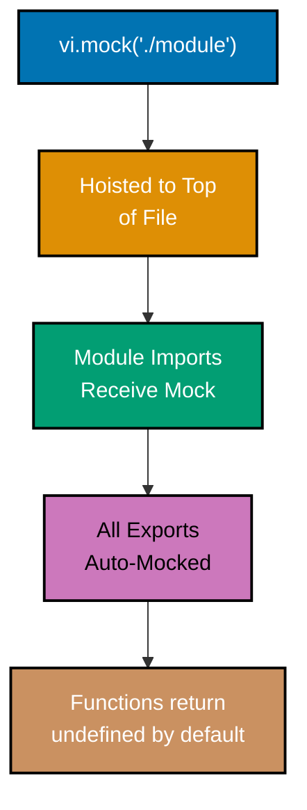
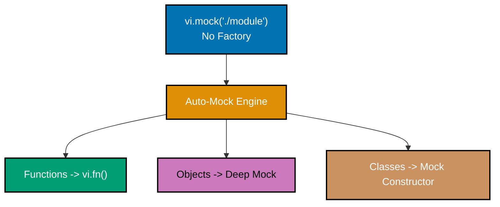
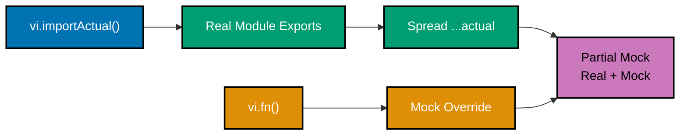
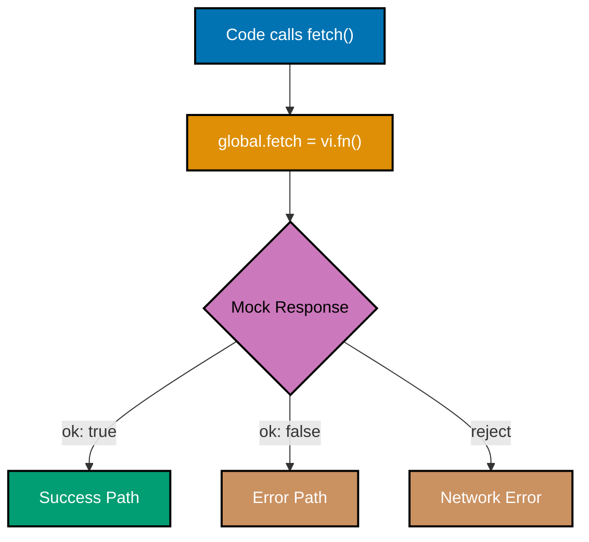
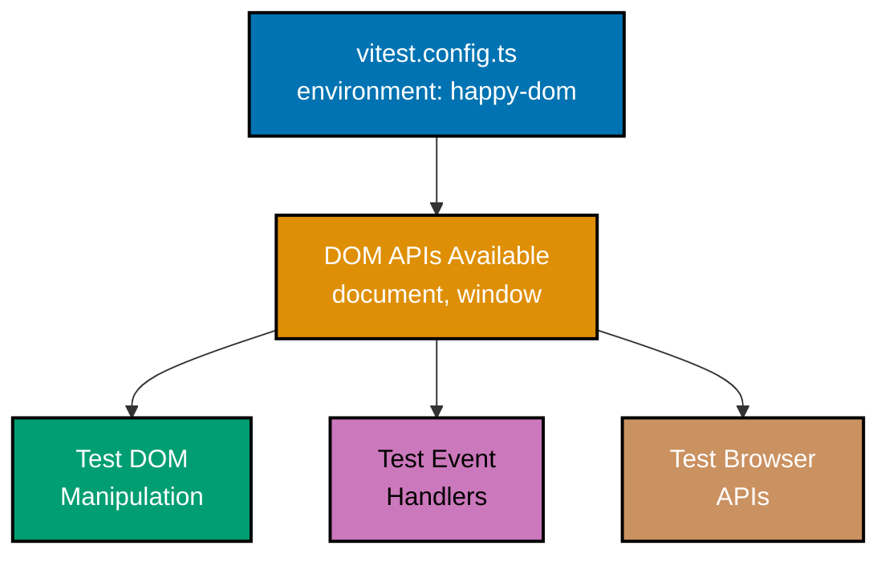
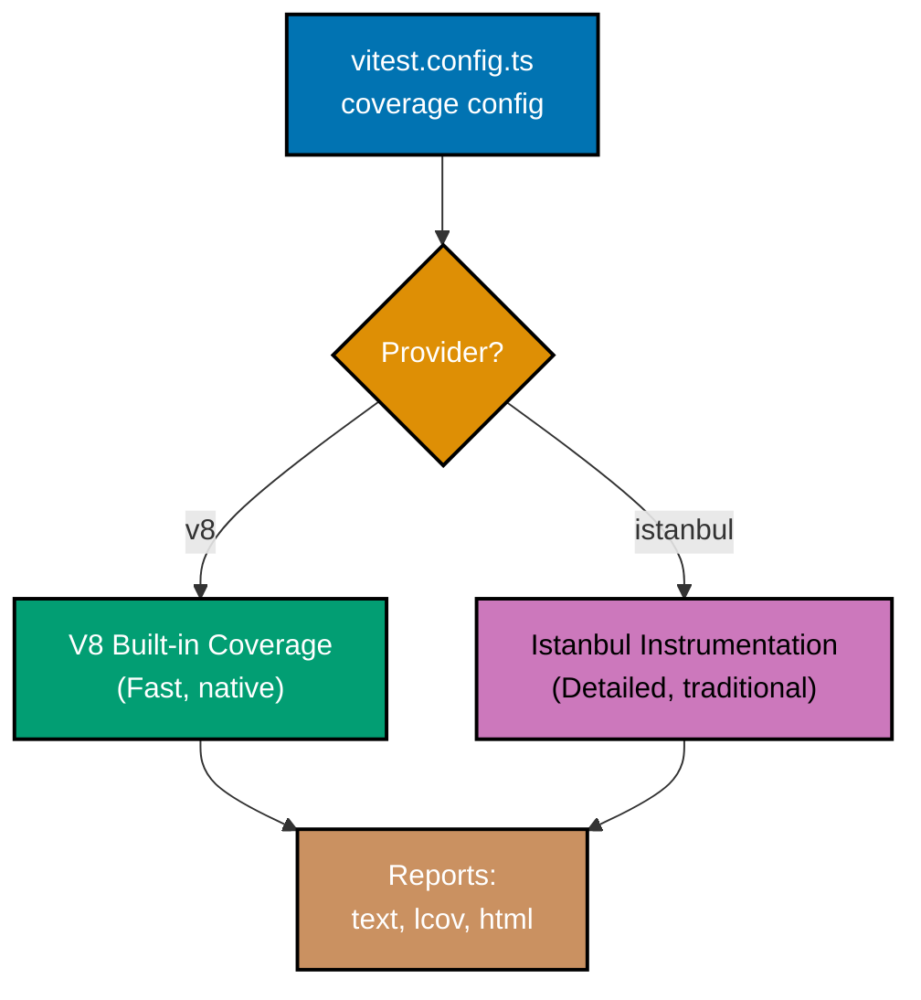
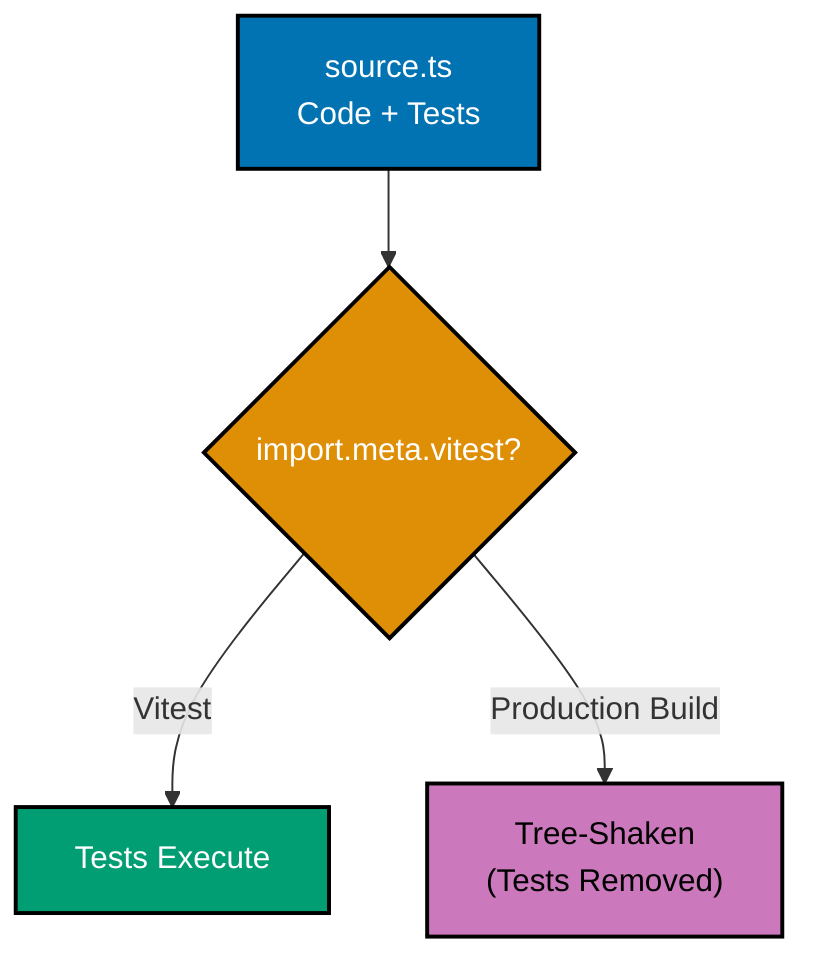
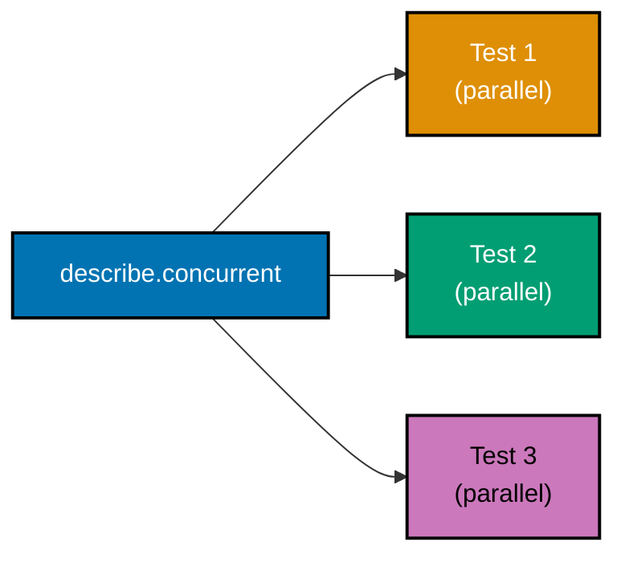
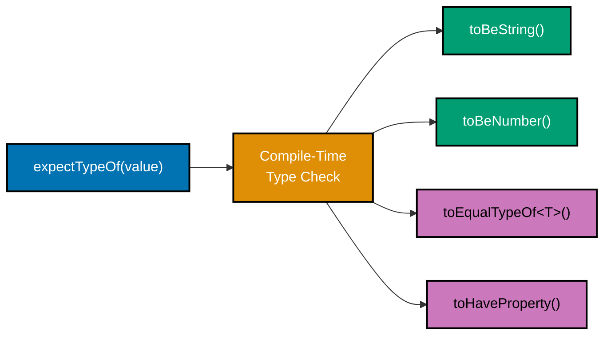

This tutorial covers intermediate Vitest techniques including module mocking, manual mocks, DOM testing, React component testing, coverage configuration, workspace setup, concurrent tests, type testing, and custom matchers used in production test suites.

## Module Mocking (Examples 31-38)

### Example 31: vi.mock - Mocking Entire Modules

`vi.mock` replaces an entire module with a mock implementation. Vitest hoists `vi.mock` calls to the top of the file, so they execute before any imports.



**Code**:

```typescript
import { test, expect, vi } from "vitest";

// Mock the module BEFORE importing
// vi.mock is hoisted -- order in file doesn't matter
vi.mock("./userService", () => ({
  // => Replaces ./userService module with mock
  // => Factory function returns mock exports
  fetchUser: vi.fn().mockResolvedValue({
    id: 1,
    name: "Mock User",
  }),
  // => fetchUser returns resolved promise with mock data
  deleteUser: vi.fn().mockResolvedValue(true),
  // => deleteUser returns resolved promise with true
}));

// This import receives the mock, not the real module
// (For self-containment, we define the types inline)
const { fetchUser, deleteUser } = (await import("./userService")) as {
  fetchUser: ReturnType<typeof vi.fn>;
  deleteUser: ReturnType<typeof vi.fn>;
};
// => Imports receive mocked functions
// => Real module never loaded

test("uses mocked module", async () => {
  const user = await fetchUser(1);
  // => Calls mocked fetchUser
  // => Returns { id: 1, name: "Mock User" }

  expect(user).toEqual({ id: 1, name: "Mock User" });
  // => Passes: mock data returned
  expect(fetchUser).toHaveBeenCalledWith(1);
  // => Passes: call tracked with argument 1
});

test("verifies delete was called", async () => {
  await deleteUser(1);
  // => Calls mocked deleteUser

  expect(deleteUser).toHaveBeenCalledWith(1);
  // => Passes: deleteUser called with ID 1
  expect(deleteUser).toHaveBeenCalledTimes(1);
  // => Passes: called exactly once
});
```

**Key Takeaway**: `vi.mock` is hoisted to the top of the file automatically, so import order does not matter. The factory function replaces all module exports with mocks.

**Why It Matters**: Module mocking isolates the unit under test from its dependencies. When testing a controller that calls a service, mocking the service module means you test the controller's logic without hitting databases or APIs. Vitest's automatic hoisting simplifies the common pattern where mocks must be declared before imports -- unlike Jest, you don't need to manually manage mock placement or use `jest.mock` at the top of the file.

---

### Example 32: vi.mock with Auto-Mocking

When `vi.mock` is called without a factory function, Vitest auto-mocks all exports. Functions become `vi.fn()`, objects become deep mocks, and classes have mocked constructors.



**Code**:

```typescript
import { test, expect, vi } from "vitest";

// Auto-mock: no factory function
vi.mock("./mathUtils");
// => All exports of ./mathUtils become vi.fn()
// => Functions return undefined by default
// => Classes have mocked constructors

// Self-contained demonstration of auto-mock behavior
const mockModule = {
  add: vi.fn(),
  subtract: vi.fn(),
  multiply: vi.fn(),
};
// => Simulates what auto-mock produces

test("auto-mocked functions return undefined", () => {
  const result = mockModule.add(2, 3);
  // => result is undefined (auto-mocked, no implementation)

  expect(result).toBeUndefined();
  // => Passes: auto-mocked function returns undefined
  expect(mockModule.add).toHaveBeenCalledWith(2, 3);
  // => Passes: call tracked despite no implementation
});

test("configure auto-mocked function behavior", () => {
  mockModule.add.mockReturnValue(10);
  // => Override auto-mock with specific return value

  expect(mockModule.add(2, 3)).toBe(10);
  // => Passes: returns configured value (not real 5)
  expect(mockModule.add).toHaveBeenCalledWith(2, 3);
  // => Passes: call tracked

  mockModule.subtract.mockImplementation((a: number, b: number) => a - b);
  // => Override with real implementation
  expect(mockModule.subtract(5, 3)).toBe(2);
  // => Passes: custom implementation runs
});

test("reset mock state between tests", () => {
  mockModule.add.mockClear();
  // => Clears call history (calls, instances, results)
  // => Does NOT remove mockReturnValue

  expect(mockModule.add).not.toHaveBeenCalled();
  // => Passes: call history cleared

  mockModule.add.mockReset();
  // => Clears call history AND removes mock implementations
  // => Function returns undefined again

  expect(mockModule.add(1, 2)).toBeUndefined();
  // => Passes: implementation removed by mockReset
});
```

**Key Takeaway**: Auto-mocking creates `vi.fn()` for all exports. Use `mockClear()` to reset call history and `mockReset()` to also remove implementations. Choose between clear and reset based on whether you want to keep configured behavior.

**Why It Matters**: Auto-mocking reduces boilerplate when you need to mock modules with many exports. Instead of writing a factory function for each export, auto-mock creates blanks that you configure per test. The `mockClear` vs `mockReset` distinction is critical -- using `mockReset` in `afterEach` ensures complete isolation, while `mockClear` preserves configured return values across tests. Getting this wrong causes subtle test interdependencies.

---

### Example 33: Manual Mocks with **mocks** Directory

Vitest supports manual mock files in `__mocks__` directories that automatically replace real modules when `vi.mock` is called.

```typescript
import { test, expect, vi } from "vitest";

// File structure for manual mocks:
// src/
//   __mocks__/
//     axios.ts           => Manual mock for 'axios' package
//   services/
//     __mocks__/
//       userService.ts   => Manual mock for ./userService
//     userService.ts     => Real implementation

// When you call vi.mock('./userService'),
// Vitest checks for __mocks__/userService.ts first

// Self-contained manual mock demonstration
const manualMockAxios = {
  get: vi.fn().mockResolvedValue({ data: { id: 1, name: "Mock" } }),
  // => Manual mock for axios.get
  // => Defined once, reused across all tests
  post: vi.fn().mockResolvedValue({ data: { success: true } }),
  // => Manual mock for axios.post
};

test("uses manual mock", async () => {
  const response = await manualMockAxios.get("/api/users/1");
  // => Calls mocked axios.get
  // => response is { data: { id: 1, name: "Mock" } }

  expect(response.data).toEqual({ id: 1, name: "Mock" });
  // => Passes: manual mock returns predefined data
  expect(manualMockAxios.get).toHaveBeenCalledWith("/api/users/1");
  // => Passes: URL tracked
});

test("manual mock for POST", async () => {
  const response = await manualMockAxios.post("/api/users", {
    name: "New User",
  });
  // => Calls mocked axios.post with body

  expect(response.data.success).toBe(true);
  // => Passes: POST mock returns success
  expect(manualMockAxios.post).toHaveBeenCalledWith("/api/users", {
    name: "New User",
  });
  // => Passes: URL and body tracked
});
```

**Key Takeaway**: Place manual mock files in `__mocks__` directories adjacent to the real module. Vitest uses them automatically when `vi.mock` is called. Centralized mocks reduce duplication across test files.

**Why It Matters**: Large projects mock the same modules (axios, fs, database clients) across dozens of test files. Without manual mocks, each test file duplicates the mock factory. Manual mocks define the mock once and share it across the entire test suite. When the real module's API changes, you update one mock file instead of searching through every test file. This is the standard pattern for mocking HTTP clients, file systems, and other infrastructure dependencies.

---

### Example 34: Mocking Module Factories with Partial Mocking

Sometimes you need to mock some exports while keeping others real. `vi.importActual` retrieves the real module for partial mocking.



**Code**:

```typescript
import { test, expect, vi } from "vitest";

// Simulating partial mock pattern
// In real code: vi.mock('./utils', async () => {
//   const actual = await vi.importActual('./utils');
//   return { ...actual, riskyFunction: vi.fn() };
// });

// Self-contained demonstration
const realModule = {
  safeFunction: (x: number) => x * 2,
  // => Real implementation we want to keep
  riskyFunction: (url: string) => fetch(url),
  // => Real implementation we want to mock
  CONSTANT: 42,
  // => Constant we want to keep
};

// Partial mock: keep safe functions, mock risky ones
const partialMock = {
  ...realModule,
  // => Spread all real exports
  riskyFunction: vi.fn().mockResolvedValue("mocked response"),
  // => Override only riskyFunction with mock
};

test("partial mock keeps real implementations", () => {
  expect(partialMock.safeFunction(5)).toBe(10);
  // => Passes: real implementation (5 * 2 = 10)
  expect(partialMock.CONSTANT).toBe(42);
  // => Passes: real constant preserved
});

test("partial mock replaces specific functions", async () => {
  const result = await partialMock.riskyFunction("https://api.example.com");
  // => Calls mocked riskyFunction
  // => result is "mocked response"

  expect(result).toBe("mocked response");
  // => Passes: mock returned instead of real fetch
  expect(partialMock.riskyFunction).toHaveBeenCalledWith("https://api.example.com");
  // => Passes: call tracked with URL
});
```

**Key Takeaway**: Use `vi.importActual` inside `vi.mock` factory to get real exports, then spread and override specific functions. This keeps utility functions real while mocking I/O operations.

**Why It Matters**: Over-mocking leads to tests that verify mock behavior rather than real code. If a module exports 10 functions and you only need to mock the one that hits the network, partial mocking keeps the other 9 executing real logic. This catches bugs in utility functions that full mocking would hide. The pattern is essential for testing modules that mix pure logic (safe to run) with side effects (needs mocking).

---

### Example 35: Mocking Classes

Vitest can mock class constructors and methods for testing code that depends on class instances.

```typescript
import { test, expect, vi } from "vitest";

// Class to be mocked
class EmailService {
  constructor(private apiKey: string) {
    // => Constructor stores API key
  }

  async send(to: string, subject: string, body: string): Promise<boolean> {
    // => Sends email via external API
    console.log(`Sending to ${to}: ${subject}`);
    return true;
    // => Returns true on success
  }

  validate(email: string): boolean {
    // => Validates email format
    return email.includes("@");
    // => Simple validation check
  }
}

// Mock the class
const MockEmailService = vi.fn().mockImplementation((apiKey: string) => ({
  // => vi.fn() creates mock constructor
  // => mockImplementation defines what "new" returns
  send: vi.fn().mockResolvedValue(true),
  // => Mock send method
  validate: vi.fn().mockReturnValue(true),
  // => Mock validate method
  apiKey,
  // => Store apiKey for verification
}));

test("mocked class constructor", () => {
  const service = new (MockEmailService as unknown as typeof EmailService)("test-key");
  // => Creates instance from mock constructor
  // => No real EmailService instantiated

  expect(MockEmailService).toHaveBeenCalledWith("test-key");
  // => Passes: constructor called with API key
});

test("mocked class methods", async () => {
  const service = new (MockEmailService as unknown as typeof EmailService)("test-key");

  const sent = await service.send("user@test.com", "Hello", "Body");
  // => Calls mocked send method
  // => sent is true (mock return)

  expect(sent).toBe(true);
  // => Passes: mock returned true
  expect(service.send).toHaveBeenCalledWith("user@test.com", "Hello", "Body");
  // => Passes: arguments tracked
});
```

**Key Takeaway**: Mock classes by creating a mock constructor with `vi.fn().mockImplementation()` that returns an object with mocked methods. Track constructor calls and method invocations separately.

**Why It Matters**: Service classes (email, payment, notification) are common in enterprise applications. Testing code that instantiates these services requires mocking the constructor to prevent real API calls and verify correct configuration. This pattern verifies that your code passes the right API key, calls the right methods, and handles responses correctly -- all without sending real emails or charging real credit cards.

---

### Example 36: Mock Implementations for Complex Scenarios

`mockImplementation` provides full control over mock behavior, enabling stateful mocks and conditional responses.

```typescript
import { test, expect, vi } from "vitest";

test("stateful mock implementation", () => {
  let callCount = 0;
  // => Track state across calls

  const mockFn = vi.fn().mockImplementation(() => {
    // => Custom implementation with state
    callCount++;
    if (callCount === 1) return "first call";
    // => First call returns specific value
    if (callCount === 2) return "second call";
    // => Second call returns different value
    return "subsequent call";
    // => All other calls return default
  });

  expect(mockFn()).toBe("first call");
  // => Passes: first invocation
  expect(mockFn()).toBe("second call");
  // => Passes: second invocation
  expect(mockFn()).toBe("subsequent call");
  // => Passes: third invocation
  expect(mockFn()).toBe("subsequent call");
  // => Passes: fourth invocation (same as third)
});

test("conditional mock based on arguments", () => {
  const mockFetch = vi.fn().mockImplementation(async (url: string) => {
    // => Route-based mock responses
    if (url === "/api/users") {
      return { status: 200, data: [{ id: 1 }] };
      // => Users endpoint returns array
    }
    if (url === "/api/health") {
      return { status: 200, data: { healthy: true } };
      // => Health check returns status
    }
    return { status: 404, data: null };
    // => Unknown routes return 404
  });

  // Test different routes
  expect(await mockFetch("/api/users")).toEqual({
    status: 200,
    data: [{ id: 1 }],
  });
  // => Passes: users endpoint returns user array

  expect(await mockFetch("/api/health")).toEqual({
    status: 200,
    data: { healthy: true },
  });
  // => Passes: health endpoint returns status

  expect(await mockFetch("/api/unknown")).toEqual({
    status: 404,
    data: null,
  });
  // => Passes: unknown route returns 404
});
```

**Key Takeaway**: Use `mockImplementation` for mocks that need state, conditional logic, or argument-dependent behavior. This provides the flexibility of real code with the tracking benefits of mocks.

**Why It Matters**: Production APIs have different behaviors based on inputs -- paginated responses, rate limiting, conditional errors. Simple `mockReturnValue` cannot simulate these patterns. `mockImplementation` enables testing complex interaction flows: "first request returns page 1, second returns page 2, third returns empty" or "requests after the 5th return 429 rate limit." These scenarios are impossible to test without implementation-based mocks.

---

### Example 37: Mocking Global Functions - fetch

Mocking global functions like `fetch` enables testing HTTP-dependent code without network access.



**Code**:

```typescript
import { test, expect, vi, beforeEach, afterEach } from "vitest";

// Function that uses global fetch
async function getUser(id: number): Promise<{ id: number; name: string }> {
  const response = await fetch(`/api/users/${id}`);
  // => Calls global fetch
  if (!response.ok) {
    throw new Error(`HTTP ${response.status}`);
    // => Throws on non-2xx responses
  }
  return response.json();
  // => Parses JSON response
}

beforeEach(() => {
  // Mock global fetch
  global.fetch = vi.fn();
  // => Replace global fetch with mock
});

afterEach(() => {
  vi.restoreAllMocks();
  // => Restore all mocked globals
});

test("mocks successful fetch", async () => {
  const mockResponse = {
    ok: true,
    status: 200,
    json: vi.fn().mockResolvedValue({ id: 1, name: "Alice" }),
    // => Mock json() method returns parsed data
  };
  (global.fetch as ReturnType<typeof vi.fn>).mockResolvedValue(mockResponse);
  // => fetch resolves with mock Response object

  const user = await getUser(1);
  // => Calls mocked fetch, gets mock response

  expect(user).toEqual({ id: 1, name: "Alice" });
  // => Passes: parsed mock JSON data
  expect(global.fetch).toHaveBeenCalledWith("/api/users/1");
  // => Passes: correct URL called
});

test("mocks failed fetch", async () => {
  const mockResponse = {
    ok: false,
    status: 404,
    json: vi.fn(),
  };
  (global.fetch as ReturnType<typeof vi.fn>).mockResolvedValue(mockResponse);
  // => fetch resolves with 404 Response

  await expect(getUser(999)).rejects.toThrow("HTTP 404");
  // => Passes: function throws for non-2xx status
});

test("mocks network error", async () => {
  (global.fetch as ReturnType<typeof vi.fn>).mockRejectedValue(new Error("Network error"));
  // => fetch rejects (simulates network failure)

  await expect(getUser(1)).rejects.toThrow("Network error");
  // => Passes: network error propagated
});
```

**Key Takeaway**: Mock `global.fetch` to test HTTP-dependent code without network access. Create mock Response objects with `ok`, `status`, and `json()` properties to simulate different HTTP scenarios.

**Why It Matters**: HTTP calls are the most common external dependency in web applications. Testing without mocking fetch means tests depend on network availability, API uptime, and data consistency -- making them slow and flaky. Mocking fetch lets you test all HTTP scenarios deterministically: success, various error codes, timeouts, and malformed responses. This is the foundation of reliable API client testing.

---

### Example 38: vi.mocked - Type-Safe Mock Access

`vi.mocked` provides type-safe access to mocked functions, enabling auto-completion and type checking on mock methods.

```typescript
import { test, expect, vi } from "vitest";

// Original function type
function fetchData(url: string): Promise<{ data: string }> {
  // => Real function signature
  return fetch(url).then((r) => r.json());
}

// Create a typed mock
const mockedFetch = vi.fn<typeof fetchData>();
// => Creates vi.fn typed as fetchData
// => Type-safe: mockResolvedValue must match return type

test("type-safe mock configuration", async () => {
  mockedFetch.mockResolvedValue({ data: "mocked" });
  // => TypeScript knows return type is Promise<{ data: string }>
  // => mockedFetch.mockResolvedValue({ wrong: true }) would be a type error

  const result = await mockedFetch("/api/data");
  // => result type is { data: string } (inferred from mock type)

  expect(result.data).toBe("mocked");
  // => Passes: type-safe access to .data property
  expect(mockedFetch).toHaveBeenCalledWith("/api/data");
  // => Passes: call tracked with argument
});

test("vi.mocked helper for imported mocks", () => {
  // When working with vi.mock'd modules:
  // const { fetchData } = await import('./api');
  // const mocked = vi.mocked(fetchData);
  // => vi.mocked() wraps function with mock types
  // => Enables .mockReturnValue, .mockImplementation with type safety

  // Self-contained demonstration
  const original = (x: number): string => String(x);
  // => Original function
  const mockOriginal = vi.fn(original);
  // => Mock wrapping original

  const typed = vi.mocked(mockOriginal);
  // => typed has full mock methods with type safety
  typed.mockReturnValue("42");
  // => TypeScript knows return must be string

  expect(typed(1)).toBe("42");
  // => Passes: mock return value used
});
```

**Key Takeaway**: Use `vi.fn<typeof realFunction>()` for typed mock creation and `vi.mocked()` for type-safe access to existing mocks. TypeScript catches type mismatches in mock configurations at compile time.

**Why It Matters**: Type-unsafe mocks are a hidden source of test bugs. A mock configured to return `{ data: "test" }` when the real function returns `{ results: "test" }` creates a test that passes against mock data but misses the real shape mismatch. Typed mocks catch these discrepancies at compile time, ensuring your mocks accurately represent the contracts they replace. This is especially critical in TypeScript codebases where type safety is a core value.

---

## DOM and Component Testing (Examples 39-45)

### Example 39: DOM Testing with happy-dom

Vitest supports DOM environments through `happy-dom` or `jsdom`. Configure the environment per file or globally for testing browser code.



**Code**:

```typescript
// @vitest-environment happy-dom
// => Per-file environment directive
// => Enables DOM APIs for this file only

import { test, expect } from "vitest";

test("creates and queries DOM elements", () => {
  const div = document.createElement("div");
  // => Creates <div> element in happy-dom
  div.id = "test-element";
  // => Sets id attribute
  div.textContent = "Hello, Vitest!";
  // => Sets text content

  document.body.appendChild(div);
  // => Appends to document body

  const found = document.getElementById("test-element");
  // => Queries by ID
  // => found is the <div> element

  expect(found).not.toBeNull();
  // => Passes: element exists in DOM
  expect(found?.textContent).toBe("Hello, Vitest!");
  // => Passes: text content matches

  // Cleanup
  document.body.removeChild(div);
  // => Remove element after test
});

test("handles DOM events", () => {
  const button = document.createElement("button");
  // => Creates <button> element
  let clicked = false;
  // => Track click state

  button.addEventListener("click", () => {
    clicked = true;
    // => Event handler sets flag
  });

  button.click();
  // => Programmatically triggers click event
  // => Event handler executes synchronously

  expect(clicked).toBe(true);
  // => Passes: click handler was invoked
});

test("manipulates CSS classes", () => {
  const element = document.createElement("span");
  // => Creates <span> element

  element.classList.add("active", "visible");
  // => Adds two CSS classes

  expect(element.classList.contains("active")).toBe(true);
  // => Passes: element has "active" class
  expect(element.className).toBe("active visible");
  // => Passes: className contains both classes

  element.classList.remove("active");
  // => Removes "active" class
  expect(element.classList.contains("active")).toBe(false);
  // => Passes: "active" class removed
});
```

**Key Takeaway**: Use `// @vitest-environment happy-dom` for per-file DOM environment or configure globally in `vitest.config.ts`. happy-dom is faster than jsdom for most use cases.

**Why It Matters**: Frontend code manipulates the DOM, handles events, and uses browser APIs. Without a DOM environment, these tests require a real browser. happy-dom provides a lightweight JavaScript implementation of DOM APIs that runs in Node.js, enabling fast unit tests for browser code. happy-dom is 2-3x faster than jsdom for most operations, making it the preferred choice for test suites with hundreds of DOM-dependent tests.

---

### Example 40: Testing with jsdom Environment

jsdom provides more complete browser API coverage than happy-dom, useful when testing code that relies on advanced browser features.

```typescript
// @vitest-environment jsdom
// => Uses jsdom instead of happy-dom
// => More complete API coverage, slightly slower

import { test, expect } from "vitest";

test("jsdom provides window properties", () => {
  expect(window).toBeDefined();
  // => Passes: window object available
  expect(document).toBeDefined();
  // => Passes: document object available
  expect(navigator).toBeDefined();
  // => Passes: navigator object available
});

test("localStorage in jsdom", () => {
  localStorage.setItem("key", "value");
  // => Sets item in localStorage (jsdom implementation)

  expect(localStorage.getItem("key")).toBe("value");
  // => Passes: retrieves stored value

  localStorage.removeItem("key");
  // => Cleans up storage
  expect(localStorage.getItem("key")).toBeNull();
  // => Passes: item removed
});

test("form element behavior", () => {
  const form = document.createElement("form");
  // => Creates form element
  const input = document.createElement("input");
  // => Creates input element
  input.type = "text";
  // => Sets input type
  input.name = "username";
  // => Sets input name
  input.value = "alice";
  // => Sets input value

  form.appendChild(input);
  // => Adds input to form

  const formData = new FormData(form);
  // => Creates FormData from form
  // => jsdom supports FormData API

  expect(formData.get("username")).toBe("alice");
  // => Passes: FormData extracted value from input
});
```

**Key Takeaway**: Use jsdom when testing code that requires advanced browser APIs like FormData, localStorage, or complex event handling. Use happy-dom for simpler DOM testing where speed matters more.

**Why It Matters**: The choice between happy-dom and jsdom depends on API coverage needs. happy-dom covers ~95% of DOM APIs at higher speed, while jsdom covers ~99% with more faithful browser simulation. Tests using Web Workers, Intersection Observer, or complex form APIs need jsdom. The per-file environment directive lets you mix environments in one project -- fast happy-dom for most tests, jsdom only where needed.

---

### Example 41: Testing React Components with Vitest

Vitest integrates with Testing Library for React component testing. The DOM environment provides the foundation for rendering and interacting with components.

```typescript
// @vitest-environment happy-dom
import { test, expect, vi } from "vitest";

// Self-contained React component simulation
// (In real code, use @testing-library/react)
// Demonstrating the pattern without requiring React dependency

interface Component {
  render: () => string;
  handleClick: () => void;
  getState: () => { count: number };
}

function createCounter(initial: number = 0): Component {
  // => Factory function simulating React component behavior
  let count = initial;
  // => Internal state (like useState)

  return {
    render: () => `Count: ${count}`,
    // => Render output (like JSX)
    handleClick: () => {
      count++;
      // => State update (like setState)
    },
    getState: () => ({ count }),
    // => State access for assertions
  };
}

test("renders component with initial state", () => {
  const counter = createCounter(0);
  // => Create component with initial count 0

  expect(counter.render()).toBe("Count: 0");
  // => Passes: renders initial state
  expect(counter.getState().count).toBe(0);
  // => Passes: state is 0
});

test("handles click events", () => {
  const counter = createCounter(0);
  // => Create fresh component

  counter.handleClick();
  // => Simulate click event
  counter.handleClick();
  // => Simulate another click

  expect(counter.getState().count).toBe(2);
  // => Passes: state updated twice
  expect(counter.render()).toBe("Count: 2");
  // => Passes: render reflects new state
});

test("initializes with custom value", () => {
  const counter = createCounter(10);
  // => Create component with initial count 10

  expect(counter.render()).toBe("Count: 10");
  // => Passes: respects initial value
});
```

**Key Takeaway**: Vitest provides the DOM environment; combine with Testing Library for React/Vue/Svelte component testing. Test components through their public API (renders, events, state) rather than implementation details.

**Why It Matters**: Component testing bridges the gap between unit tests and E2E tests. Unit tests verify logic, E2E tests verify user workflows, and component tests verify that UI elements render correctly and respond to interactions. Vitest's Vite-native transforms handle JSX, CSS modules, and asset imports identically to your build, ensuring component tests accurately reflect production behavior without the overhead of browser-based E2E testing.

---

### Example 42: Testing Custom Hooks Pattern

Custom hooks encapsulate reusable state logic. Testing them requires rendering within a component context.

```typescript
// @vitest-environment happy-dom
import { test, expect } from "vitest";

// Self-contained hook simulation
// (In real code, use @testing-library/react renderHook)

function createUseToggle(initial: boolean = false) {
  // => Simulates a useToggle custom hook
  let state = initial;
  // => Internal boolean state

  const toggle = () => {
    state = !state;
    // => Flips boolean value
  };

  const setValue = (value: boolean) => {
    state = value;
    // => Sets explicit value
  };

  return {
    getState: () => state,
    // => Current state accessor
    toggle,
    // => Toggle function
    setValue,
    // => Set function
  };
}

test("toggle hook starts with initial value", () => {
  const hook = createUseToggle(false);
  // => Create hook with false initial

  expect(hook.getState()).toBe(false);
  // => Passes: initial state is false
});

test("toggle hook flips state", () => {
  const hook = createUseToggle(false);

  hook.toggle();
  // => First toggle: false -> true
  expect(hook.getState()).toBe(true);
  // => Passes: state is now true

  hook.toggle();
  // => Second toggle: true -> false
  expect(hook.getState()).toBe(false);
  // => Passes: state flipped back
});

test("toggle hook sets explicit value", () => {
  const hook = createUseToggle(false);

  hook.setValue(true);
  // => Explicitly set to true
  expect(hook.getState()).toBe(true);
  // => Passes: state set to true

  hook.setValue(true);
  // => Set to true again (idempotent)
  expect(hook.getState()).toBe(true);
  // => Passes: still true (not toggled)
});
```

**Key Takeaway**: Test hooks through their return values and side effects, not their internal implementation. Verify initial state, state transitions, and edge cases (idempotent operations, boundary values).

**Why It Matters**: Custom hooks contain the majority of React application logic -- data fetching, form state, authentication, real-time connections. Testing hooks in isolation catches bugs earlier than component-level testing and runs faster. The pattern of testing through the public API (returned values and functions) ensures hooks can be refactored internally without breaking tests, supporting the "make it work, make it right, make it fast" development workflow.

---

### Example 43: Testing Async Components

Testing components that perform async operations (data fetching, animations, transitions) requires handling promises and state updates.

```typescript
// @vitest-environment happy-dom
import { test, expect, vi } from "vitest";

// Simulates async component (data fetching pattern)
function createAsyncList(fetchFn: () => Promise<string[]>) {
  // => Component that fetches and displays a list
  let items: string[] = [];
  let loading = true;
  let error: string | null = null;

  const load = async () => {
    // => Triggers data fetch
    loading = true;
    error = null;
    try {
      items = await fetchFn();
      // => Awaits data from fetch function
    } catch (e) {
      error = (e as Error).message;
      // => Captures error message
    } finally {
      loading = false;
      // => Loading complete regardless of outcome
    }
  };

  return {
    load,
    getState: () => ({ items, loading, error }),
    // => State accessor for assertions
  };
}

test("async component loading state", async () => {
  const mockFetch = vi.fn().mockResolvedValue(["item-1", "item-2"]);
  // => Mock fetch returns two items

  const list = createAsyncList(mockFetch);
  // => Create component with mock fetch

  expect(list.getState().loading).toBe(true);
  // => Passes: initial loading state

  await list.load();
  // => Trigger and await data fetch

  expect(list.getState().loading).toBe(false);
  // => Passes: loading complete
  expect(list.getState().items).toEqual(["item-1", "item-2"]);
  // => Passes: items loaded
  expect(list.getState().error).toBeNull();
  // => Passes: no error
});

test("async component error state", async () => {
  const mockFetch = vi.fn().mockRejectedValue(new Error("Network error"));
  // => Mock fetch rejects

  const list = createAsyncList(mockFetch);
  await list.load();
  // => Trigger fetch (which rejects)

  expect(list.getState().loading).toBe(false);
  // => Passes: loading complete (even on error)
  expect(list.getState().error).toBe("Network error");
  // => Passes: error message captured
  expect(list.getState().items).toEqual([]);
  // => Passes: items empty on error
});
```

**Key Takeaway**: Test async components through their loading, success, and error states. Mock the data source to control which state the component enters, and await the async operation before asserting.

**Why It Matters**: Every production component that fetches data has three states: loading, success, and error. Skipping error state testing means users see uncaught exceptions instead of error messages. Skipping loading state testing means users see blank screens. Testing all three states through controlled mocks ensures your components handle the full lifecycle of async operations, which is critical for user experience in network-dependent applications.

---

### Example 44: Inline Test Environment with @vitest-environment

Vitest supports per-file environment overrides using a comment directive, enabling mixed environments in one project.

```typescript
// @vitest-environment happy-dom
// => This file runs in happy-dom environment
// => Overrides the global environment from vitest.config.ts
// => Only affects this specific test file

import { test, expect } from "vitest";

test("DOM available with per-file directive", () => {
  expect(typeof document).toBe("object");
  // => Passes: document available in happy-dom

  expect(typeof window).toBe("object");
  // => Passes: window available in happy-dom

  const el = document.createElement("p");
  // => Creates paragraph element
  el.textContent = "Created in happy-dom";
  // => Sets content

  expect(el.textContent).toBe("Created in happy-dom");
  // => Passes: DOM manipulation works
});

// In another file without the directive:
// (assumes global environment is "node")
//
// test("no DOM in node environment", () => {
//   expect(typeof document).toBe("undefined");
//   // => Passes in node environment: no DOM
// });

// Environment options: node, happy-dom, jsdom, edge-runtime
// => node: default, no DOM (fastest)
// => happy-dom: lightweight DOM (fast)
// => jsdom: full DOM simulation (complete)
// => edge-runtime: Cloudflare Workers/Vercel Edge

test("environment applies to entire file", () => {
  // All tests in this file share happy-dom environment
  expect(navigator.userAgent).toContain("happy-dom");
  // => Passes: happy-dom provides navigator
  // => Each environment has its own user agent string
});
```

**Key Takeaway**: Use `// @vitest-environment <name>` comment at the top of test files to override the global environment. This enables testing DOM code and Node.js code in the same project without separate configurations.

**Why It Matters**: Full-stack projects have both server code (Node.js) and client code (browser). Running all tests in jsdom wastes performance on server tests that don't need DOM. Running all in node breaks DOM tests. Per-file environment directives let you assign the optimal environment to each test file, maximizing both speed and correctness. This is Vitest's approach to the problem that forces Jest users to maintain separate configurations for server and client tests.

---

### Example 45: Testing with Cleanup Patterns

DOM tests require cleanup to prevent element leaks between tests. Proper cleanup ensures test isolation in shared DOM environments.

```typescript
// @vitest-environment happy-dom
import { test, expect, afterEach } from "vitest";

afterEach(() => {
  // Clean up DOM after each test
  document.body.innerHTML = "";
  // => Removes all child elements from body
  // => Prevents DOM leaks between tests
});

test("first test adds elements", () => {
  const div = document.createElement("div");
  div.id = "test-1";
  // => Creates element with unique ID
  document.body.appendChild(div);

  expect(document.getElementById("test-1")).not.toBeNull();
  // => Passes: element exists
  expect(document.body.children).toHaveLength(1);
  // => Passes: one child element
});

test("second test starts with clean DOM", () => {
  // afterEach cleared the DOM
  expect(document.body.children).toHaveLength(0);
  // => Passes: no leftover elements from previous test

  expect(document.getElementById("test-1")).toBeNull();
  // => Passes: previous test's element was cleaned up

  const span = document.createElement("span");
  span.id = "test-2";
  document.body.appendChild(span);

  expect(document.getElementById("test-2")).not.toBeNull();
  // => Passes: this test's element exists
});

test("third test also starts clean", () => {
  expect(document.body.children).toHaveLength(0);
  // => Passes: cleanup ran after second test
  // => Each test starts with empty DOM
});
```

**Key Takeaway**: Clear `document.body.innerHTML` in `afterEach` to prevent DOM leaks. Testing Library's `cleanup()` does this automatically; when testing without it, manual cleanup is essential.

**Why It Matters**: DOM leaks are the most common cause of flaky UI tests. Element A from test 1 affects queries in test 2 -- `getByText("Submit")` finds the wrong button, or `querySelectorAll("button")` returns unexpected counts. The cleanup pattern ensures each test starts with a blank slate. In real projects, Testing Library's automatic cleanup handles this, but understanding the underlying principle prevents debugging hours when cleanup doesn't work as expected.

---

## Coverage and Configuration (Examples 46-50)

### Example 46: Coverage Configuration

Vitest supports code coverage through v8 (default, fast) or istanbul (traditional, detailed) providers. Configuration determines which files are measured and what thresholds apply.



**Code**:

```typescript
// vitest.config.ts - Coverage configuration
import { defineConfig } from "vitest/config";

export default defineConfig({
  test: {
    coverage: {
      // => Coverage configuration section
      provider: "v8",
      // => "v8": uses V8's built-in coverage (fast, default)
      // => "istanbul": uses Istanbul instrumentation (detailed)

      reporter: ["text", "lcov", "html"],
      // => "text": terminal output with summary table
      // => "lcov": machine-readable for CI tools
      // => "html": browsable HTML report

      include: ["src/**/*.ts"],
      // => Only measure coverage for source files
      // => Excludes test files, configs, scripts
      exclude: ["src/**/*.test.ts", "src/**/*.d.ts"],
      // => Explicitly exclude test and type declaration files

      thresholds: {
        // => Fail if coverage drops below thresholds
        lines: 80,
        // => 80% line coverage minimum
        functions: 80,
        // => 80% function coverage minimum
        branches: 80,
        // => 80% branch coverage minimum
        statements: 80,
        // => 80% statement coverage minimum
      },
    },
  },
});

// Self-contained test to demonstrate coverage concepts
import { test, expect } from "vitest";

function calculateDiscount(price: number, tier: string): number {
  // => Function with multiple branches (coverage target)
  if (tier === "gold") return price * 0.8;
  // => Gold tier: 20% discount
  if (tier === "silver") return price * 0.9;
  // => Silver tier: 10% discount
  return price;
  // => No discount for other tiers
}

test("covers gold tier", () => {
  expect(calculateDiscount(100, "gold")).toBe(80);
  // => Tests gold branch (20% discount)
});

test("covers silver tier", () => {
  expect(calculateDiscount(100, "silver")).toBe(90);
  // => Tests silver branch (10% discount)
});

test("covers default tier", () => {
  expect(calculateDiscount(100, "bronze")).toBe(100);
  // => Tests default branch (no discount)
  // => All three branches covered: 100% branch coverage
});
```

**Key Takeaway**: Configure coverage in `vitest.config.ts` with provider, reporters, included files, and thresholds. Run `npx vitest run --coverage` to generate reports.

**Why It Matters**: Coverage thresholds prevent test quality regression. Without thresholds, teams gradually stop writing tests as deadlines approach. With 80% enforcement, CI blocks merges when coverage drops, maintaining quality automatically. The v8 provider adds minimal overhead (1-2% slower), while istanbul provides source-mapped coverage that's easier to debug. LCOV output integrates with CI tools (Codecov, SonarQube) for trend tracking across releases.

---

### Example 47: In-Source Testing

Vitest supports defining tests directly in source files, co-locating tests with the code they verify. Tests are tree-shaken from production builds.



**Code**:

```typescript
// src/utils/math.ts (source file with in-source tests)

export function fibonacci(n: number): number {
  // => Calculates nth Fibonacci number
  if (n <= 0) return 0;
  // => Base case: fib(0) = 0
  if (n === 1) return 1;
  // => Base case: fib(1) = 1
  return fibonacci(n - 1) + fibonacci(n - 2);
  // => Recursive case: sum of previous two
}

export function isPrime(n: number): boolean {
  // => Checks if number is prime
  if (n < 2) return false;
  // => Numbers less than 2 are not prime
  for (let i = 2; i <= Math.sqrt(n); i++) {
    if (n % i === 0) return false;
    // => Divisible by i, not prime
  }
  return true;
  // => No divisors found, number is prime
}

// In-source tests (removed from production build)
if (import.meta.vitest) {
  // => Only executes in Vitest environment
  // => Tree-shaken from production builds
  // => import.meta.vitest is undefined in production

  const { test, expect } = import.meta.vitest;
  // => Access test and expect from Vitest

  test("fibonacci base cases", () => {
    expect(fibonacci(0)).toBe(0);
    // => fib(0) = 0
    expect(fibonacci(1)).toBe(1);
    // => fib(1) = 1
  });

  test("fibonacci recursive cases", () => {
    expect(fibonacci(5)).toBe(5);
    // => fib(5) = 5 (0,1,1,2,3,5)
    expect(fibonacci(10)).toBe(55);
    // => fib(10) = 55
  });

  test("isPrime identifies primes", () => {
    expect(isPrime(2)).toBe(true);
    // => 2 is prime
    expect(isPrime(7)).toBe(true);
    // => 7 is prime
    expect(isPrime(4)).toBe(false);
    // => 4 is not prime (divisible by 2)
  });
}
```

**Key Takeaway**: Wrap in-source tests in `if (import.meta.vitest)` to co-locate tests with code. Configure `define: { 'import.meta.vitest': 'undefined' }` in production build to tree-shake tests.

**Why It Matters**: In-source testing provides the tightest feedback loop -- tests live next to the code they verify, eliminating the context switch of navigating to a separate test file. Vite tree-shakes the test code from production builds, so there's no bundle size penalty. This pattern is especially valuable for utility functions and pure logic where the test is as simple as the implementation. It also ensures 100% co-location -- impossible for a function to lack tests when they share a file.

---

### Example 48: Workspace Configuration

Vitest workspaces enable running tests across multiple projects with different configurations in a monorepo.

```typescript
// vitest.workspace.ts - Workspace configuration
// (Configuration file, not a test)

// export default [
//   'packages/*',
//   // => Each package directory is a project
//   // => Uses each package's vitest.config.ts
//
//   {
//     extends: './vitest.config.ts',
//     test: {
//       name: 'unit',
//       include: ['src/**/*.unit.test.ts'],
//       environment: 'node',
//     },
//   },
//   // => Named project "unit" with node environment
//
//   {
//     extends: './vitest.config.ts',
//     test: {
//       name: 'browser',
//       include: ['src/**/*.browser.test.ts'],
//       environment: 'happy-dom',
//     },
//   },
//   // => Named project "browser" with happy-dom
// ];

// Self-contained workspace concept demonstration
import { test, expect } from "vitest";

const workspaceConfig = {
  projects: [
    { name: "unit", environment: "node", include: ["**/*.unit.test.ts"] },
    {
      name: "browser",
      environment: "happy-dom",
      include: ["**/*.browser.test.ts"],
    },
    {
      name: "integration",
      environment: "node",
      include: ["**/*.integration.test.ts"],
    },
  ],
};
// => Workspace defines multiple test projects

test("workspace has multiple projects", () => {
  expect(workspaceConfig.projects).toHaveLength(3);
  // => Three projects: unit, browser, integration
});

test("each project has different environment", () => {
  const environments = workspaceConfig.projects.map((p) => p.environment);
  // => ["node", "happy-dom", "node"]

  expect(environments).toContain("happy-dom");
  // => Browser tests use DOM environment
  expect(environments.filter((e) => e === "node")).toHaveLength(2);
  // => Two projects use node environment
});
```

**Key Takeaway**: Define `vitest.workspace.ts` to run multiple test projects with different configurations. Each project can have its own environment, include patterns, and settings.

**Why It Matters**: Monorepos contain packages with different testing needs -- a UI library needs happy-dom, an API package needs node, a shared utilities package needs both. Without workspaces, you maintain separate Vitest configs and run commands per package. Workspaces let `npx vitest` discover and run all projects with appropriate configurations, providing unified reporting and parallel execution across the entire monorepo from a single command.

---

### Example 49: Test Filtering and Reporters

Vitest provides multiple reporter formats for different output needs -- terminal development, CI integration, and HTML reporting.

```typescript
// vitest.config.ts reporter configuration
// test: {
//   reporters: ['default', 'json', 'junit'],
//   // => default: colored terminal output
//   // => json: machine-readable JSON
//   // => junit: XML for CI systems (Jenkins, GitLab)
//   outputFile: {
//     json: './test-results/results.json',
//     junit: './test-results/results.xml',
//   },
// }

import { describe, it, expect } from "vitest";

// Filtering examples (CLI commands):
// npx vitest run --reporter=verbose
// => Detailed per-test output
// npx vitest run --reporter=dot
// => Minimal dot notation (. for pass, x for fail)

describe("reporter demonstration", () => {
  // These tests generate different output per reporter

  it("passes and shows in all reporters", () => {
    expect(true).toBe(true);
    // => Default: checkmark with test name
    // => Verbose: full path and duration
    // => Dot: single "."
    // => JSON: { name: "...", status: "passed" }
  });

  describe("nested group", () => {
    it("shows hierarchy in verbose reporter", () => {
      expect(1 + 1).toBe(2);
      // => Verbose: "reporter demonstration > nested group > shows hierarchy..."
      // => Default: indented under parent
    });
  });

  // Filtering by test name
  // npx vitest run -t "passes"
  // => Runs only tests with "passes" in the name

  // Filtering by file
  // npx vitest run reporter
  // => Runs files matching "reporter" pattern

  // Filtering by project (workspaces)
  // npx vitest run --project=unit
  // => Runs only the "unit" workspace project
});
```

**Key Takeaway**: Configure reporters in `vitest.config.ts` or via CLI flags. Use `default` for development, `json`/`junit` for CI integration, and `verbose` for debugging.

**Why It Matters**: CI systems need machine-readable test results to display in dashboards, track trends, and enforce quality gates. JUnit XML integrates with Jenkins, GitHub Actions, and GitLab CI for test result visualization. JSON output enables custom reporting tools and test analytics. The `verbose` reporter shows exact test hierarchy and duration, essential for identifying slow tests. Choosing the right reporter per environment optimizes both developer experience and CI visibility.

---

### Example 50: Concurrent Tests

`it.concurrent` runs tests in parallel within a suite, reducing execution time for independent tests. Use carefully -- tests must be truly independent.



**Code**:

```typescript
import { describe, it, expect } from "vitest";

// All tests in this suite run concurrently
describe.concurrent("parallel tests", () => {
  it("test 1 runs in parallel", async () => {
    // => Starts immediately, doesn't wait for other tests
    const result = await simulateWork("task-1", 50);
    // => Simulates 50ms of async work
    expect(result).toBe("task-1-done");
    // => Passes: work completed
  });

  it("test 2 runs in parallel", async () => {
    // => Starts at the same time as test 1
    const result = await simulateWork("task-2", 50);
    expect(result).toBe("task-2-done");
    // => Passes: concurrent execution
  });

  it("test 3 runs in parallel", async () => {
    // => All three tests execute simultaneously
    const result = await simulateWork("task-3", 50);
    expect(result).toBe("task-3-done");
    // => Total time: ~50ms (not 150ms)
  });
});

// Individual concurrent test
it.concurrent("standalone concurrent test", async () => {
  // => it.concurrent marks single test as concurrent
  const result = await simulateWork("standalone", 30);
  expect(result).toBe("standalone-done");
  // => Runs in parallel with other concurrent tests
});

async function simulateWork(task: string, ms: number): Promise<string> {
  // => Simulates async work with delay
  return new Promise((resolve) => {
    setTimeout(() => resolve(`${task}-done`), ms);
    // => Resolves after specified delay
  });
}
```

**Key Takeaway**: Use `describe.concurrent` or `it.concurrent` for tests that are truly independent and don't share mutable state. Concurrent tests reduce wall-clock time but require careful isolation.

**Why It Matters**: A suite of 100 async tests that each take 50ms runs in 5 seconds sequentially but ~50ms concurrently. This 100x speedup is real for integration tests that wait on I/O (mocked API calls, timer-based logic). However, concurrent tests sharing mutable state (global variables, module singletons, DOM elements) create race conditions that produce random failures. Use concurrency for pure async tests and sequential execution for tests with shared state.

---

## Type Testing (Examples 51-53)

### Example 51: expectTypeOf - Compile-Time Type Assertions

Vitest provides `expectTypeOf` for testing TypeScript types at compile time. These assertions verify your type definitions work correctly.



**Code**:

```typescript
import { test, expectTypeOf } from "vitest";

test("basic type assertions", () => {
  expectTypeOf("hello").toBeString();
  // => Passes at compile time: "hello" is string type

  expectTypeOf(42).toBeNumber();
  // => Passes: 42 is number type

  expectTypeOf(true).toBeBoolean();
  // => Passes: true is boolean type

  expectTypeOf(null).toBeNull();
  // => Passes: null is null type

  expectTypeOf(undefined).toBeUndefined();
  // => Passes: undefined is undefined type

  expectTypeOf([1, 2, 3]).toBeArray();
  // => Passes: array type

  expectTypeOf({ name: "Alice" }).toBeObject();
  // => Passes: object type
});

test("function type assertions", () => {
  function greet(name: string): string {
    return `Hello, ${name}`;
  }

  expectTypeOf(greet).toBeFunction();
  // => Passes: greet is a function

  expectTypeOf(greet).parameters.toEqualTypeOf<[string]>();
  // => Passes: parameter types match [string]

  expectTypeOf(greet).returns.toBeString();
  // => Passes: return type is string
});

test("generic type assertions", () => {
  type User = { name: string; age: number };

  expectTypeOf<User>().toHaveProperty("name");
  // => Passes: User type has "name" property

  expectTypeOf<User>().toHaveProperty("age");
  // => Passes: User type has "age" property

  expectTypeOf<User>().toMatchTypeOf<{ name: string }>();
  // => Passes: User extends { name: string }
});
```

**Key Takeaway**: Use `expectTypeOf` to verify type definitions, function signatures, and generic constraints at compile time. These tests catch type regressions without runtime execution.

**Why It Matters**: TypeScript types are code -- they define contracts, constrain inputs, and guide IDE auto-completion. When types change (intentionally or accidentally), runtime tests won't catch the regression because JavaScript has no types at runtime. `expectTypeOf` fills this gap by verifying that your exported types maintain their contracts across versions. This is critical for library authors whose users depend on stable type definitions.

---

### Example 52: Complex Type Testing Patterns

Test union types, generics, and type narrowing to ensure your type definitions handle edge cases correctly.

```typescript
import { test, expectTypeOf } from "vitest";

test("union type assertions", () => {
  type Result<T> = { success: true; data: T } | { success: false; error: string };

  // Verify the union type structure
  expectTypeOf<Result<string>>().toMatchTypeOf<{ success: boolean }>();
  // => Passes: both branches have success property

  // Verify specific branch types
  const success: Result<number> = { success: true, data: 42 };
  expectTypeOf(success).toMatchTypeOf<{ data: number }>();
  // => Passes: success branch has data property

  const failure: Result<number> = { success: false, error: "fail" };
  expectTypeOf(failure).toMatchTypeOf<{ error: string }>();
  // => Passes: failure branch has error property
});

test("generic constraint assertions", () => {
  // Verify generic function accepts correct types
  function identity<T>(value: T): T {
    return value;
  }

  expectTypeOf(identity<string>).returns.toBeString();
  // => Passes: identity<string> returns string

  expectTypeOf(identity<number>).returns.toBeNumber();
  // => Passes: identity<number> returns number

  expectTypeOf(identity).toBeCallableWith("hello");
  // => Passes: can call with string
  expectTypeOf(identity).toBeCallableWith(42);
  // => Passes: can call with number
});

test("mapped type assertions", () => {
  type Readonly<T> = { readonly [K in keyof T]: T[K] };

  type User = { name: string; age: number };
  type ReadonlyUser = Readonly<User>;

  expectTypeOf<ReadonlyUser>().toHaveProperty("name");
  // => Passes: mapped type preserves properties
  expectTypeOf<ReadonlyUser>().toMatchTypeOf<{ name: string }>();
  // => Passes: property types preserved
});
```

**Key Takeaway**: Test complex types (unions, generics, mapped types) to ensure type transformations produce expected results. `expectTypeOf` catches regressions in type utilities that runtime tests cannot detect.

**Why It Matters**: Type utilities like `Result<T>`, `DeepPartial<T>`, and custom mapped types are used throughout large codebases. A subtle change to a mapped type can break dozens of consumers. Type tests verify that `Readonly<User>` actually makes properties readonly, that `Result<string>` correctly narrows to success or failure branches, and that generic constraints accept expected types. Without these tests, type regressions are caught only when developers notice broken auto-completion.

---

### Example 53: assertType for Runtime Type Narrowing

`assertType` combines compile-time type checking with runtime execution, useful for testing type guards and narrowing logic.

```typescript
import { test, assertType, expectTypeOf } from "vitest";

test("type guard assertions", () => {
  // Type guard function
  function isString(value: unknown): value is string {
    return typeof value === "string";
    // => Narrows type to string when returns true
  }

  const value: unknown = "hello";
  // => value is unknown type

  if (isString(value)) {
    // => Inside this block, TypeScript knows value is string
    assertType<string>(value);
    // => assertType: compile-time assertion that value is string
    // => Does nothing at runtime (type-level only)
    // => Fails at compile time if type is wrong

    expectTypeOf(value).toBeString();
    // => Additional verification
  }
});

test("discriminated union narrowing", () => {
  type Shape = { kind: "circle"; radius: number } | { kind: "square"; side: number };

  function area(shape: Shape): number {
    switch (shape.kind) {
      case "circle":
        // => TypeScript narrows to { kind: "circle"; radius: number }
        assertType<{ kind: "circle"; radius: number }>(shape);
        return Math.PI * shape.radius ** 2;
      case "square":
        // => TypeScript narrows to { kind: "square"; side: number }
        assertType<{ kind: "square"; side: number }>(shape);
        return shape.side ** 2;
    }
  }

  // Runtime verification
  const circle: Shape = { kind: "circle", radius: 5 };
  expect(area(circle)).toBeCloseTo(78.54, 1);
  // => Passes: pi * 25 ≈ 78.54

  const square: Shape = { kind: "square", side: 4 };
  expect(area(square)).toBe(16);
  // => Passes: 4^2 = 16
});
```

**Key Takeaway**: Use `assertType<T>()` to verify type narrowing inside conditional blocks. Combine with runtime assertions for complete type guard testing.

**Why It Matters**: Type guards are the bridge between TypeScript's type system and runtime behavior. A type guard that returns `true` for the wrong types creates type-unsafe code that TypeScript trusts. Testing type guards with both `assertType` (compile-time) and `expect` (runtime) ensures the guard correctly narrows types AND correctly identifies values. This double verification catches bugs where a type guard's implementation doesn't match its type signature.

---

## Custom Matchers (Examples 54-56)

### Example 54: expect.extend - Creating Custom Matchers

`expect.extend` adds domain-specific matchers to Vitest's assertion library, enabling expressive tests that match your business vocabulary.

```typescript
import { test, expect } from "vitest";

// Define custom matchers
expect.extend({
  toBeWithinRange(received: number, floor: number, ceiling: number) {
    // => Custom matcher: checks if number is within range
    const pass = received >= floor && received <= ceiling;
    // => pass is true if within range

    if (pass) {
      return {
        message: () => `expected ${received} not to be within range ${floor} - ${ceiling}`,
        // => Message shown when .not.toBeWithinRange fails
        pass: true,
        // => Indicates match succeeded
      };
    }
    return {
      message: () => `expected ${received} to be within range ${floor} - ${ceiling}`,
      // => Message shown when toBeWithinRange fails
      pass: false,
      // => Indicates match failed
    };
  },
});

// Type declaration for TypeScript
declare module "vitest" {
  interface Assertion<T = unknown> {
    toBeWithinRange(floor: number, ceiling: number): T;
  }
  interface AsymmetricMatchersContaining {
    toBeWithinRange(floor: number, ceiling: number): unknown;
  }
}

test("custom matcher - toBeWithinRange", () => {
  expect(50).toBeWithinRange(1, 100);
  // => Passes: 50 is between 1 and 100

  expect(0).not.toBeWithinRange(1, 100);
  // => Passes: 0 is NOT between 1 and 100

  expect(100).toBeWithinRange(1, 100);
  // => Passes: 100 is within range (inclusive)

  // Practical use: API response time
  const responseTime = 245;
  // => Response time in milliseconds
  expect(responseTime).toBeWithinRange(0, 500);
  // => Passes: response within acceptable range
});
```

**Key Takeaway**: Use `expect.extend` to create domain-specific matchers with descriptive names and clear error messages. Declare types with `declare module "vitest"` for TypeScript support.

**Why It Matters**: Generic assertions like `expect(x >= 1 && x <= 100).toBe(true)` produce useless failure messages: "expected false to be true." Custom matchers produce "expected 150 to be within range 1 - 100" -- immediately diagnosable. Domain-specific matchers (toBeValidEmail, toBeISO8601, toBeWithinRange) make tests read like specifications and produce actionable failure messages, reducing debugging time from minutes to seconds.

---

### Example 55: Custom Matchers for Objects

Create matchers that validate complex object structures using domain-specific rules.

```typescript
import { test, expect } from "vitest";

expect.extend({
  toBeValidUser(received: unknown) {
    // => Custom matcher: validates user object structure
    const user = received as Record<string, unknown>;
    const errors: string[] = [];
    // => Collect all validation errors

    if (!user || typeof user !== "object") {
      errors.push("not an object");
    } else {
      if (typeof user.name !== "string" || (user.name as string).length === 0) {
        errors.push("name must be a non-empty string");
      }
      if (typeof user.email !== "string" || !(user.email as string).includes("@")) {
        errors.push("email must contain @");
      }
      if (typeof user.age !== "number" || (user.age as number) < 0) {
        errors.push("age must be a non-negative number");
      }
    }

    const pass = errors.length === 0;
    // => pass is true when no validation errors

    return {
      pass,
      message: () =>
        pass
          ? `expected value not to be a valid user`
          : `expected valid user but found errors:\n${errors.map((e) => `  - ${e}`).join("\n")}`,
      // => Detailed error messages list all failures
    };
  },
});

declare module "vitest" {
  interface Assertion<T = unknown> {
    toBeValidUser(): T;
  }
}

test("validates correct user", () => {
  const user = { name: "Alice", email: "alice@test.com", age: 30 };
  // => Valid user object
  expect(user).toBeValidUser();
  // => Passes: all fields valid
});

test("rejects invalid user", () => {
  const user = { name: "", email: "invalid", age: -1 };
  // => Invalid: empty name, no @, negative age
  expect(user).not.toBeValidUser();
  // => Passes: user is NOT valid
});

test("validates partial user fails", () => {
  const user = { name: "Bob" };
  // => Missing email and age
  expect(user).not.toBeValidUser();
  // => Passes: incomplete user is not valid
});
```

**Key Takeaway**: Custom object matchers collect all validation errors and present them in the failure message, making complex object validation readable and debuggable.

**Why It Matters**: API endpoint tests frequently validate response objects with multiple required fields. Without custom matchers, you write separate assertions for each field, and the test stops at the first failure. A custom `toBeValidUser` matcher checks all fields and reports all errors at once, reducing the "fix one field, run again, fix next field" cycle. This pattern scales to any domain object -- orders, transactions, configurations -- where validation logic is complex.

---

### Example 56: Asymmetric Custom Matchers

Custom matchers work as asymmetric matchers inside `toEqual`, enabling flexible partial matching with domain logic.

```typescript
import { test, expect } from "vitest";

expect.extend({
  toBePositive(received: number) {
    // => Custom matcher: checks if number is positive
    return {
      pass: typeof received === "number" && received > 0,
      message: () => `expected ${received} to be a positive number`,
    };
  },
  toBeDateString(received: string) {
    // => Custom matcher: validates ISO date string format
    const dateRegex = /^\d{4}-\d{2}-\d{2}/;
    return {
      pass: typeof received === "string" && dateRegex.test(received),
      message: () => `expected "${received}" to be an ISO date string`,
    };
  },
});

declare module "vitest" {
  interface Assertion<T = unknown> {
    toBePositive(): T;
    toBeDateString(): T;
  }
  interface AsymmetricMatchersContaining {
    toBePositive(): unknown;
    toBeDateString(): unknown;
  }
}

test("custom matchers as asymmetric matchers", () => {
  const order = {
    id: 42,
    amount: 99.99,
    createdAt: "2026-04-05T10:30:00Z",
    items: [{ product: "Widget", quantity: 3, price: 33.33 }],
  };

  expect(order).toEqual({
    id: expect.toBePositive(),
    // => id must be a positive number (any positive value)
    amount: expect.toBePositive(),
    // => amount must be positive
    createdAt: expect.toBeDateString(),
    // => createdAt must match ISO date format
    items: expect.arrayContaining([
      expect.objectContaining({
        product: expect.any(String),
        quantity: expect.toBePositive(),
        price: expect.toBePositive(),
      }),
    ]),
    // => Items array contains at least one valid item
  });
  // => Passes: all custom and built-in matchers satisfied
});
```

**Key Takeaway**: Register custom matchers in `AsymmetricMatchersContaining` to use them inside `toEqual` with `expect.matcherName()` syntax. This combines domain validation with structural matching.

**Why It Matters**: Asymmetric custom matchers transform `toEqual` from a structural comparison tool into a validation engine. Instead of writing separate assertions for "id is positive," "date is ISO format," and "price is positive," you express all validation rules in a single `toEqual` call that matches the object's shape. This produces a single, readable assertion that validates both structure and domain rules, with failure messages that identify exactly which field and validation failed.

---

## Advanced Organization (Examples 57-58)

### Example 57: Test Context and Fixtures

Vitest provides test context for sharing utilities and state within a test suite, and supports extending the context with custom fixtures.

```typescript
import { describe, it, expect, beforeEach } from "vitest";

// Using test context (this-like access)
describe("test context", () => {
  interface TestContext {
    db: { query: (sql: string) => string[] };
    timestamp: number;
  }

  beforeEach<TestContext>((context) => {
    // => context parameter provides per-test state
    context.db = {
      query: (sql: string) => [`result: ${sql}`],
    };
    // => Set up database mock in context
    context.timestamp = Date.now();
    // => Record test start time
  });

  it<TestContext>("accesses context properties", (context) => {
    // => context carries values from beforeEach
    const results = context.db.query("SELECT 1");
    // => Uses context.db for queries

    expect(results).toHaveLength(1);
    // => Passes: query returned one result
    expect(results[0]).toContain("SELECT 1");
    // => Passes: result contains SQL
    expect(context.timestamp).toBeLessThanOrEqual(Date.now());
    // => Passes: timestamp is in the past
  });

  it<TestContext>("gets fresh context each test", (context) => {
    // => Fresh context from beforeEach
    expect(context.db).toBeDefined();
    // => Passes: db set up for this test
    expect(context.timestamp).toBeGreaterThan(0);
    // => Passes: timestamp is valid
  });
});
```

**Key Takeaway**: Vitest test context passes setup values from lifecycle hooks to tests via a typed context parameter. This provides dependency injection without closures or global variables.

**Why It Matters**: Closures (`let db` at describe level) work for simple cases but become unwieldy with many shared resources -- each resource needs a `let` declaration and `beforeEach` assignment. Test context bundles all per-test resources into a single typed object, making it clear what each test receives. The TypeScript generics (`it<TestContext>`) ensure context properties are type-checked, preventing typos and undefined access that closures don't catch.

---

### Example 58: Test Retry Configuration

Vitest supports retrying flaky tests a configurable number of times. Use retries sparingly -- they mask real issues but provide pragmatic stability for inherently flaky operations.

```typescript
import { describe, it, expect } from "vitest";

// Configure retries globally in vitest.config.ts:
// test: { retry: 2 }
// => Retry failed tests up to 2 additional times

// Or per-test retry:
describe("retry configuration", () => {
  let attemptCount = 0;
  // => Track attempts for demonstration

  it(
    "retries on failure",
    () => {
      attemptCount++;
      // => Increment on each attempt

      // Simulates a test that fails initially, then passes
      if (attemptCount < 3) {
        throw new Error(`Attempt ${attemptCount} failed`);
        // => Fails on attempts 1 and 2
      }

      expect(attemptCount).toBe(3);
      // => Passes on third attempt
    },
    { retry: 3 },
    // => Retry up to 3 times for this specific test
    // => Total attempts: 1 initial + 3 retries = 4 max
  );
});

// Practical retry patterns
describe("practical retries", () => {
  it(
    "handles flaky network test",
    async () => {
      // Simulated network call that occasionally fails
      const random = Math.random();
      // => Random value between 0 and 1

      if (random < 0.3) {
        throw new Error("Transient network error");
        // => 30% chance of failure
      }

      expect(random).toBeGreaterThanOrEqual(0.3);
      // => Passes when random >= 0.3
    },
    { retry: 2 },
    // => Allow 2 retries for transient failures
    // => With retry=2: probability of all 3 attempts failing
    // => is 0.3^3 = 2.7% (down from 30%)
  );
});
```

**Key Takeaway**: Configure retries with `{ retry: N }` per test or globally in config. Use retries only for genuinely flaky operations (network, timing), not as a band-aid for broken tests.

**Why It Matters**: Some tests are inherently non-deterministic -- race conditions in concurrent code, network timeouts, browser rendering timing. Retries reduce false failures in CI without hiding real bugs. However, overusing retries masks actual problems. A test that needs 3 retries to pass likely has a design issue. The pragmatic approach is retry for known flaky operations (external APIs, browser animations) and fix the root cause for deterministic test failures. CI pipelines typically allow 1-2 retries globally as a stability measure.
