This tutorial provides 30 intermediate examples covering Claude Code CLI automation in production environments. Learn GitHub Actions integration (Examples 31-35), advanced CI/CD patterns (Examples 36-40), multi-language subprocess integration (Examples 41-45), and production-ready development workflows (Examples 46-60).

## GitHub Actions Integration (Examples 31-35)

### Example 31: Basic GitHub Actions Workflow with Claude

Run Claude Code in GitHub Actions for automated code analysis, generation, or validation on push/PR events.

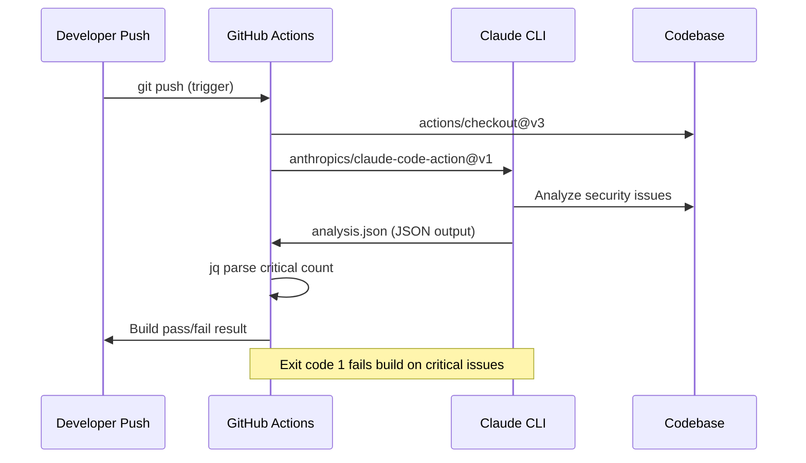

```yaml
# .github/workflows/claude-analysis.yml
name: Claude Code Analysis # => Workflow name shown in GitHub Actions UI
on: [push, pull_request] # => Triggers on every push and PR

jobs:
  analyze:
    runs-on: ubuntu-latest # => Fresh Ubuntu VM for each run
    steps:
      - uses: actions/checkout@v3 # => Checks out repo code
      - uses: anthropics/claude-code-action@v1 # => Sets up Claude CLI
        with:
          anthropic_api_key: ${{ secrets.ANTHROPIC_API_KEY }} # => Reads from GitHub Secrets
      - name: Analyze codebase
        run: claude -p "analyze code for security issues" --output-format json > analysis.json
        # => Runs Claude in non-interactive mode, saves JSON output
      - name: Check for critical issues
        run: |
          CRITICAL=$(jq '.issues[] | select(.severity=="critical") | length' analysis.json)
          # => Counts critical severity issues using jq
          if [ "$CRITICAL" -gt 0 ]; then exit 1; fi
          # => Fails the build (exit 1) if any critical issues found
```

**Key Takeaway**: GitHub Actions runs Claude CLI like any bash command. Use secrets for API keys, output to files, parse with jq.

**Why It Matters**: CI/CD integration catches issues before code review begins, providing consistent automated analysis at scale. Every push gets analyzed by Claude regardless of team size or commit volume - something impossible with manual review. Exit codes propagate Claude failures to GitHub Actions, failing builds on critical issues and preventing problematic code from reaching the main branch. This creates a repeatable quality baseline across the entire team.

### Example 32: Matrix Strategy with Claude - Testing Across Node Versions

Use GitHub Actions matrix strategy to run Claude analysis across multiple Node.js versions simultaneously.

```yaml
# .github/workflows/cross-version-test.yml
name: Cross-Version Claude Tests # => Runs tests across all supported Node versions
on: [pull_request] # => Triggers on every PR

jobs:
  test-matrix:
    runs-on: ubuntu-latest
    strategy:
      matrix:
        node-version: [18, 20, 22] # => Creates 3 parallel jobs, one per version
    steps:
      - uses: actions/checkout@v3
      - uses: actions/setup-node@v3
        with:
          node-version: ${{ matrix.node-version }} # => Each job uses its matrix node version
      - uses: anthropics/claude-code-action@v1
        with:
          anthropic_api_key: ${{ secrets.ANTHROPIC_API_KEY }}
      - name: Generate tests for Node ${{ matrix.node-version }}
        run: |
          claude -p "generate compatibility tests for Node ${{ matrix.node-version }}" > tests/node${{ matrix.node-version }}.spec.ts
          # => Claude generates version-specific tests (e.g., Node 18 vs 22 async differences)
      - name: Run generated tests
        run: npm test # => Runs Claude-generated tests against current Node version
```

**Key Takeaway**: Matrix builds parallelize Claude operations. Each matrix cell runs independent Claude command with different context.

**Why It Matters**: Parallel execution speeds up CI/CD significantly - testing three Node versions simultaneously instead of sequentially reduces wait time proportionally. Claude customizes its output per matrix cell, generating Node 18 vs 20 vs 22 compatibility tests that account for API differences between versions. This enables comprehensive cross-version testing without manual effort for each version. Matrix strategy scales naturally as you add more runtime versions or platforms.

### Example 33: Artifact Generation in CI/CD

Generate documentation, reports, or code as GitHub Actions artifacts using Claude, then download or use in subsequent jobs.

```yaml
# .github/workflows/artifact-gen.yml
name: Generate Documentation Artifacts # => Runs on every push to generate fresh docs
on: [push]

jobs:
  generate-docs:
    runs-on: ubuntu-latest
    steps:
      - uses: actions/checkout@v3
      - uses: anthropics/claude-code-action@v1
        with:
          anthropic_api_key: ${{ secrets.ANTHROPIC_API_KEY }}
      - name: Generate API docs
        run: |
          claude -p "generate comprehensive API documentation from src/api/**/*.ts" --output-format json > api-docs.json
          # => Scans all TypeScript API files, outputs structured JSON
          claude -p "convert JSON docs to markdown" < api-docs.json > API.md
          # => Converts JSON to readable Markdown documentation
      - name: Upload artifacts
        uses: actions/upload-artifact@v3
        with:
          name: documentation # => Artifact name for downstream jobs
          path: |
            api-docs.json        # => Machine-readable docs
            API.md               # => Human-readable docs

  deploy-docs:
    needs: generate-docs # => Runs only after generate-docs succeeds
    runs-on: ubuntu-latest
    steps:
      - uses: actions/download-artifact@v3
        with:
          name: documentation # => Downloads artifact from generate-docs job
      - name: Deploy to docs site
        run: ./deploy-docs.sh API.md # => Publishes generated docs
```

**Key Takeaway**: Generate artifacts with Claude, upload with actions/upload-artifact, download in dependent jobs.

**Why It Matters**: Artifact workflow separates expensive generation from downstream deployment and distribution. Documentation generated once by Claude gets used across multiple downstream jobs - deploy to documentation site, attach to GitHub release, email to stakeholders. This avoids regenerating the same analysis multiple times, reducing both API costs and build time. Artifact persistence also enables downloading generated documentation for manual review or archival purposes.

### Example 34: Secret Management for Claude API Keys

Secure Claude API keys using GitHub Secrets, environment variables, and permission scoping.

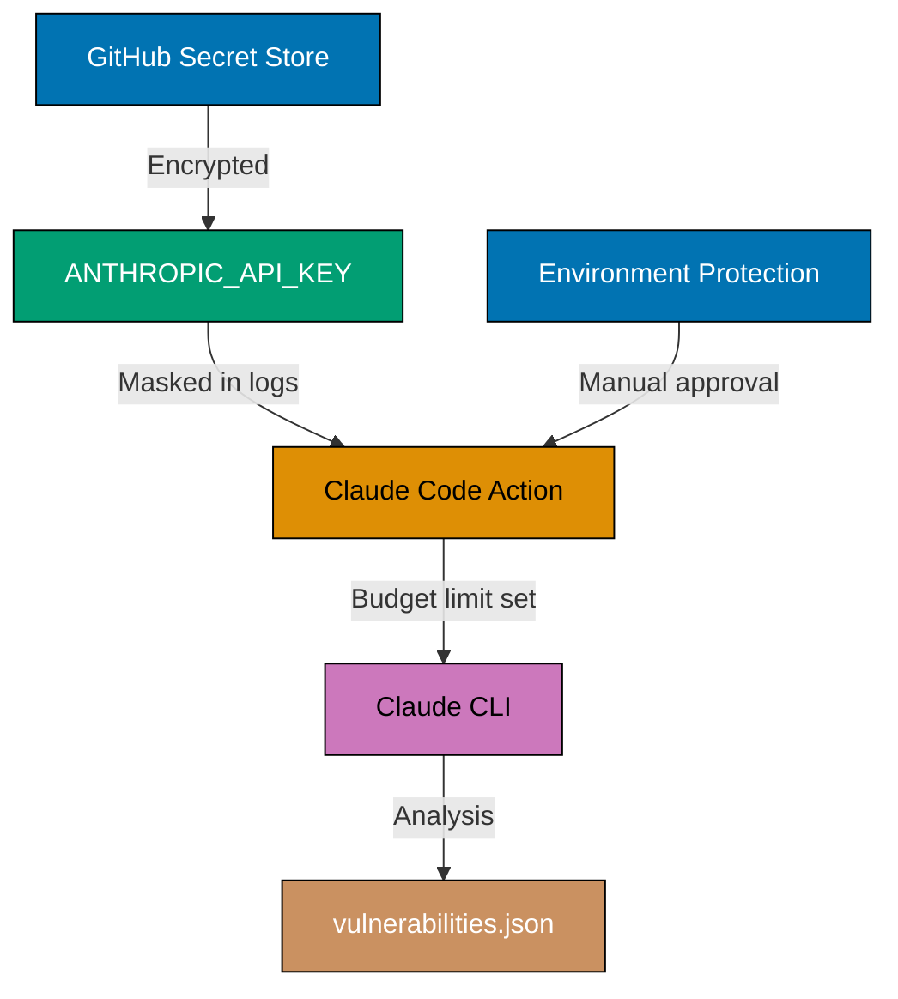

```yaml
# .github/workflows/secure-claude.yml
name: Secure Claude Usage
on: [pull_request] # => Runs on every PR for security gating

jobs:
  secure-analysis:
    runs-on: ubuntu-latest
    environment: production # => Requires manual approval for production secrets
    steps:
      - uses: actions/checkout@v3
      - uses: anthropics/claude-code-action@v1
        with:
          anthropic_api_key: ${{ secrets.ANTHROPIC_API_KEY }} # Never hardcode API keys
          # => Reads encrypted secret, masked in all logs
      - name: Run Claude with scoped permissions
        env:
          CLAUDE_MAX_BUDGET: "5.00" # => Limits spending to $5 per workflow run
        run: |
          claude -p "analyze security vulnerabilities" \
            --max-budget-usd $CLAUDE_MAX_BUDGET \
            --output-format json > vulnerabilities.json
            # => Budget limit prevents runaway costs if workflow loops
      - name: Never log secrets
        run: |
          # WRONG: echo $CLAUDE_API_KEY   # => Exposes secret in logs
          # RIGHT: Use masked variables
          echo "Analysis complete"        # => Only logs non-sensitive status
```

**Key Takeaway**: Store API keys in GitHub Secrets, never in code. Use environment protection for production access. Set budget limits.

**Why It Matters**: Exposed API keys enable unauthorized usage that incurs unexpected costs and risks data leaks. GitHub Secrets encrypt keys at rest and automatically mask them in all workflow logs. Environment protection rules require manual approval for production deployments, preventing automated workflows from consuming production budgets. Budget limits per workflow run prevent runaway costs from infinite loops. Combine secrets management with repository secret scanning to detect accidentally committed credentials.

### Example 35: Conditional Workflow Execution

Run Claude only when specific files change or conditions are met. Saves CI/CD time and API costs.

```yaml
# .github/workflows/conditional.yml
name: Conditional Claude Analysis
on:
  pull_request:
    paths:
      - "src/**/*.ts" # => Only run when TypeScript files change
      - "src/**/*.js"
      - "!src/**/*.spec.ts" # => Skip test files (they don't need analysis)

jobs:
  analyze-code:
    runs-on: ubuntu-latest
    if: github.event.pull_request.draft == false # => Skip draft PRs (work-in-progress)
    steps:
      - uses: actions/checkout@v3
        with:
          fetch-depth: 0 # => Full history needed for accurate git diff
      - uses: anthropics/claude-code-action@v1
        with:
          anthropic_api_key: ${{ secrets.ANTHROPIC_API_KEY }}

      - name: Get changed files
        id: changed-files
        run: |
          CHANGED=$(git diff --name-only origin/${{ github.base_ref }}...HEAD | grep -E '\.(ts|js)$' || true)
          # => Finds only TS/JS files changed in this PR vs base branch
          echo "files=$CHANGED" >> $GITHUB_OUTPUT  # => Passes file list to next step

      - name: Analyze only changed files
        if: steps.changed-files.outputs.files != '' # => Skip if no TS/JS files changed
        run: |
          for FILE in ${{ steps.changed-files.outputs.files }}; do
            echo "Analyzing $FILE"
            claude -p "review $FILE for issues" --output-format json > $FILE.analysis.json
            # => Analyzes each changed file separately for precise feedback
          done
```

**Key Takeaway**: Use `paths`, `if` conditions, and git diff to run Claude only when relevant. Analyze only changed files, not entire codebase.

**Why It Matters**: Unconditional analysis wastes CI/CD time and API costs. Path filters skip irrelevant changes (README edits don't need code analysis). Draft PR skip prevents spending on work-in-progress. Analyzing only changed files (not entire codebase) significantly reduces analysis time for typical PRs. Use conditional execution to balance thorough analysis with fast feedback.

## Advanced CI/CD Patterns (Examples 36-40)

### Example 36: Multi-Stage Pipeline (Lint → Test → Claude Analysis → Deploy)

Orchestrate multi-stage pipeline where each stage depends on previous success. Claude analysis runs after tests pass.

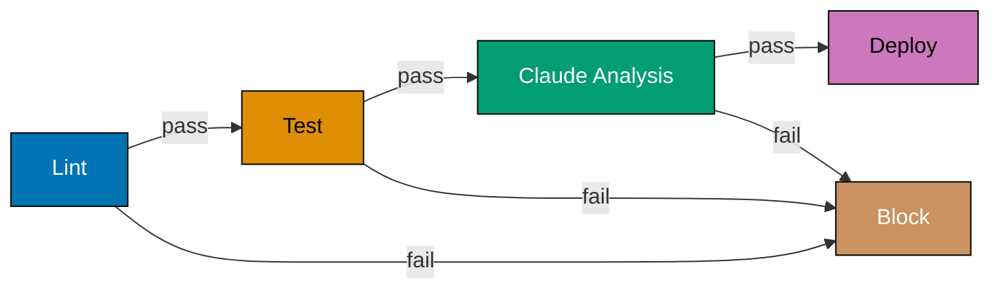

```yaml
# .github/workflows/pipeline.yml
name: Multi-Stage Pipeline # => Progressive quality gate: lint → test → analyze → deploy
on: [push]

jobs:
  lint:
    runs-on: ubuntu-latest
    steps:
      - uses: actions/checkout@v3
      - run: npm run lint # => Fast check (~30s), fails fast on style issues

  test:
    needs: lint # => Only runs if lint passes
    runs-on: ubuntu-latest
    steps:
      - uses: actions/checkout@v3
      - run: npm test

  claude-analysis:
    needs: test # => Only runs if tests pass (saves API costs on failing code)
    runs-on: ubuntu-latest
    steps:
      - uses: actions/checkout@v3
      - uses: anthropics/claude-code-action@v1
        with:
          anthropic_api_key: ${{ secrets.ANTHROPIC_API_KEY }}
      - name: Deep code analysis
        run: |
          claude -p "analyze architecture and suggest improvements" \
            --output-format json > architecture-review.json
            # => Outputs structured JSON for downstream processing
      - name: Generate improvement report
        run: |
          claude -c -p "create prioritized improvement roadmap from analysis" \
            > improvement-roadmap.md
            # => -c flag continues previous session context
      - uses: actions/upload-artifact@v3
        with:
          name: analysis-reports # => Stores reports for download or deploy job
          path: |
            architecture-review.json
            improvement-roadmap.md

  deploy:
    needs: claude-analysis # => Deploys only after Claude approves
    runs-on: ubuntu-latest
    if: github.ref == 'refs/heads/main' # => Production deploys on main branch only
    steps:
      - uses: actions/checkout@v3
      - run: ./deploy.sh
```

**Key Takeaway**: Chain jobs with `needs:` dependency. Each stage gates the next - Claude runs only if tests pass, deploy only if Claude approves.

**Why It Matters**: Multi-stage pipelines create progressive quality gates where fast cheap checks eliminate obvious failures before expensive operations run. Linting completes in seconds, preventing Claude API costs when code has obvious formatting issues. Claude analysis runs only on syntactically valid, tested code - maximizing the quality of AI feedback. Deploy gating on Claude approval creates an AI-enforced release checkpoint, preventing code with detected issues from reaching production.

### Example 37: PR Comment Generation with Claude

Post Claude analysis results as PR comments, providing inline feedback to developers.

```yaml
# .github/workflows/pr-comment.yml
name: Claude PR Review # => Posts Claude's analysis as inline PR comment
on: [pull_request]

jobs:
  review-and-comment:
    runs-on: ubuntu-latest
    permissions:
      pull-requests: write # => Required permission to post PR comments
    steps:
      - uses: actions/checkout@v3
      - uses: anthropics/claude-code-action@v1
        with:
          anthropic_api_key: ${{ secrets.ANTHROPIC_API_KEY }}

      - name: Analyze PR changes
        run: |
          claude -p "review this PR for code quality, security, and best practices" \
            --output-format json > review.json
            # => Produces structured JSON with issues, severity, file references

      - name: Format review as markdown
        run: |
          claude -p "convert review JSON to markdown with severity icons" \
            < review.json > review-comment.md
            # => Second Claude call transforms JSON into human-readable comment

      - name: Post comment
        uses: actions/github-script@v6 # => GitHub's official scripting action
        with:
          script: |
            const fs = require('fs');
            const body = fs.readFileSync('review-comment.md', 'utf8');
            github.rest.issues.createComment({
              issue_number: context.issue.number,  # => Posts to current PR
              owner: context.repo.owner,
              repo: context.repo.repo,
              body: `## 🤖 Claude Code Review\n\n${body}`
            });
```

**Key Takeaway**: Use `actions/github-script` to post Claude analysis as PR comments. Requires `pull-requests: write` permission.

**Why It Matters**: PR comments provide contextual feedback where developers are already working, eliminating the need to check separate CI/CD log pages. Developers engage more consistently with inline feedback compared to external report links that get ignored. Automated Claude reviews surface security vulnerabilities, architectural concerns, and code quality issues directly in the review thread. This makes AI review feel natural rather than an additional workflow step.

### Example 38: Release Notes Automation

Generate release notes from git commits using Claude, then create GitHub releases automatically.

```yaml
# .github/workflows/release.yml
name: Automated Release Notes # => Triggers on version tags (v1.2.3)
on:
  push:
    tags:
      - "v*" # => Matches v1.0.0, v2.3.1, etc.

jobs:
  create-release:
    runs-on: ubuntu-latest
    permissions:
      contents: write # => Required permission to create GitHub releases
    steps:
      - uses: actions/checkout@v3
        with:
          fetch-depth: 0 # => Full history needed to find previous tag

      - uses: anthropics/claude-code-action@v1
        with:
          anthropic_api_key: ${{ secrets.ANTHROPIC_API_KEY }}

      - name: Get commits since last tag
        id: commits
        run: |
          PREVIOUS_TAG=$(git describe --tags --abbrev=0 HEAD^ 2>/dev/null || echo "")
          # => Finds previous version tag (e.g., v1.1.0 before current v1.2.0)
          if [ -z "$PREVIOUS_TAG" ]; then
            COMMITS=$(git log --pretty=format:"%s (%h)" HEAD)  # => First release: all commits
          else
            COMMITS=$(git log --pretty=format:"%s (%h)" $PREVIOUS_TAG..HEAD)  # => Only new commits
          fi
          echo "commits<<EOF" >> $GITHUB_OUTPUT
          echo "$COMMITS" >> $GITHUB_OUTPUT
          echo "EOF" >> $GITHUB_OUTPUT            # => Multiline output using heredoc syntax

      - name: Generate release notes
        run: |
          echo "${{ steps.commits.outputs.commits }}" | \
          claude -p "create professional release notes from these commits, categorizing by Features, Bug Fixes, and Improvements" \
            > release-notes.md
            # => Claude categorizes commits and writes user-friendly descriptions

      - name: Create GitHub Release
        uses: softprops/action-gh-release@v1
        with:
          body_path: release-notes.md # => Uses Claude's generated content
          generate_release_notes: false # => Disables GitHub's auto-notes in favor of Claude's
```

**Key Takeaway**: Extract commits between tags, pass to Claude for formatting, create GitHub release with generated notes.

**Why It Matters**: Manual release notes are time-consuming and inconsistently formatted across releases. Claude automatically categorizes commits into features, bug fixes, and improvements, writing user-friendly descriptions that non-technical stakeholders can understand. Automated generation never misses commits or misrepresents the scope of changes. Release notes created from actual commit history are more accurate than notes written from memory at release time, improving user trust and changelog quality.

### Example 39: Deployment Approval Gates with Claude Risk Assessment

Use Claude to assess deployment risk, requiring manual approval for high-risk changes.

```yaml
# .github/workflows/deploy-gate.yml
name: Deployment with Risk Assessment # => AI-gated deployments based on change analysis
on:
  push:
    branches: [main] # => Every main branch push triggers risk assessment

jobs:
  assess-risk:
    runs-on: ubuntu-latest
    outputs:
      risk-level: ${{ steps.risk.outputs.level }} # => Exports risk level to other jobs
    steps:
      - uses: actions/checkout@v3
        with:
          fetch-depth: 50 # => Last 50 commits for broader change context

      - uses: anthropics/claude-code-action@v1
        with:
          anthropic_api_key: ${{ secrets.ANTHROPIC_API_KEY }}

      - name: Assess deployment risk
        id: risk
        run: |
          git diff HEAD~1 HEAD > changes.diff      # => Captures diff of latest commit
          RISK=$(claude -p "assess deployment risk (low/medium/high) based on these changes" \
            --output-format json < changes.diff | jq -r '.risk_level')
            # => Claude analyzes diff: DB migrations, API changes → high; docs → low
          echo "level=$RISK" >> $GITHUB_OUTPUT     # => Makes risk level available to other jobs
          echo "Deployment risk: $RISK"

  deploy-staging:
    needs: assess-risk # => Always deploys to staging for verification
    runs-on: ubuntu-latest
    steps:
      - uses: actions/checkout@v3
      - run: ./deploy-staging.sh

  deploy-production:
    needs: [assess-risk, deploy-staging] # => Requires both risk assessment and staging success
    runs-on: ubuntu-latest
    environment:
      name: production # => GitHub environment with protection rules
      # High-risk deployments require manual approval via environment protection
    steps:
      - uses: actions/checkout@v3
      - name: Check risk level
        run: |
          if [ "${{ needs.assess-risk.outputs.risk-level }}" = "high" ]; then
            echo "⚠️ High-risk deployment detected. Manual approval required."
            # => Environment protection pauses workflow for manual review
          fi
      - run: ./deploy-production.sh
```

**Key Takeaway**: Claude assesses deployment risk, outputs risk level, GitHub environment protection requires approval for high-risk changes.

**Why It Matters**: Automated risk assessment prevents dangerous deployments without adding friction to routine safe changes. Low-risk changes like documentation updates and typo fixes deploy immediately without human review. High-risk changes involving database migrations, authentication modifications, or breaking API changes trigger mandatory human approval via GitHub environment protection. This intelligent gating balances deployment velocity with safety, concentrating human attention where it provides the most value.

### Example 40: Automated Rollback with Claude Failure Detection

Monitor deployment health with Claude analyzing logs, trigger automatic rollback on detected issues.

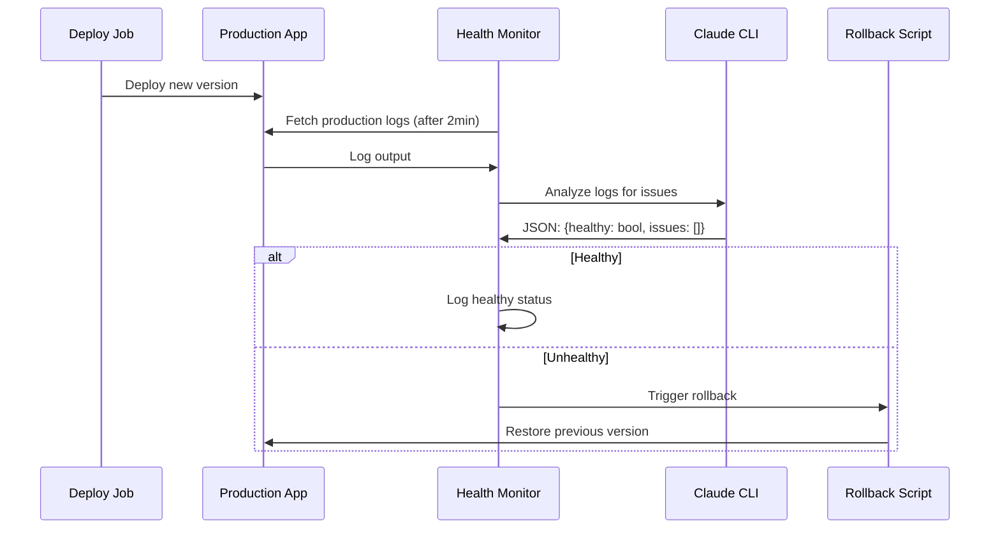

```yaml
# .github/workflows/auto-rollback.yml
name: Deploy with Auto-Rollback # => AI-monitored deployment with automatic recovery
on:
  workflow_dispatch: # => Manual trigger only - safer for rollback scenarios
    inputs:
      version:
        description: "Version to deploy"
        required: true # => Must specify version explicitly (e.g., v1.2.3)

jobs:
  deploy:
    runs-on: ubuntu-latest
    steps:
      - uses: actions/checkout@v3
        with:
          ref: ${{ github.event.inputs.version }} # => Checks out specific version tag
      - run: ./deploy.sh
      - name: Save deployment info
        run: |
          echo "VERSION=${{ github.event.inputs.version }}" >> deployment-info.txt
          echo "TIMESTAMP=$(date -u +%s)" >> deployment-info.txt  # => Unix timestamp for rollback timing
      - uses: actions/upload-artifact@v3
        with:
          name: deployment-info # => Passes version/timestamp to monitor-health job
          path: deployment-info.txt

  monitor-health:
    needs: deploy # => Starts monitoring immediately after deployment
    runs-on: ubuntu-latest
    steps:
      - uses: actions/checkout@v3
      - uses: anthropics/claude-code-action@v1
        with:
          anthropic_api_key: ${{ secrets.ANTHROPIC_API_KEY }}

      - name: Wait for deployment to stabilize
        run: sleep 120 # => Waits 2 minutes for service to fully start

      - name: Fetch and analyze logs
        id: health-check
        run: |
          ./fetch-prod-logs.sh > production.log  # => Fetches last 100 production log lines

          HEALTH=$(claude -p "analyze these production logs for errors, anomalies, or performance issues. Return JSON with {healthy: boolean, issues: string[]}" \
            --output-format json < production.log)
            # => Claude detects: error spikes, timeout patterns, memory anomalies

          HEALTHY=$(echo "$HEALTH" | jq -r '.healthy')
          echo "healthy=$HEALTHY" >> $GITHUB_OUTPUT  # => Passes health status to rollback step

          if [ "$HEALTHY" = "false" ]; then
            echo "🚨 Health check failed!"
            echo "$HEALTH" | jq '.issues[]'           # => Lists detected issues
          fi

      - name: Trigger rollback if unhealthy
        if: steps.health-check.outputs.healthy == 'false' # => Only rollback on health failure
        run: |
          echo "Initiating automatic rollback..."
          ./rollback.sh               # => Restores previous stable version
```

**Key Takeaway**: Deploy → monitor logs → Claude analyzes health → auto-rollback on detected issues. Reduces incident response time.

**Why It Matters**: Manual health monitoring delays incident detection by minutes or hours while on-call engineers investigate alerts. Claude analyzes production logs immediately post-deployment, detecting error rate spikes, performance degradation, and anomalous patterns that indicate deployment problems. Automatic rollback triggered by AI health analysis restores service in seconds rather than waiting for human triage and manual rollback procedures. This dramatically reduces mean time to recovery for deployment-caused incidents.

## Multi-Language Subprocess Integration (Examples 41-45)

### Example 41: Python Subprocess Calling Claude

Call Claude Code from Python scripts using subprocess module for automated code analysis or generation.

```python
# analyze.py
import subprocess
import json
import sys

def analyze_file(filepath):
    """Analyze Python file using Claude Code."""
    result = subprocess.run(
        ['claude', '-p', f'analyze {filepath} for code quality issues',
         '--output-format', 'json'],
        capture_output=True,
        text=True,
        timeout=60
    )

    if result.returncode != 0:
        print(f"Error: {result.stderr}", file=sys.stderr)
        sys.exit(1)

    analysis = json.loads(result.stdout)
    return analysis

def main():
    filepath = sys.argv[1]
    analysis = analyze_file(filepath)

    print(f"Issues found: {len(analysis['issues'])}")
    for issue in analysis['issues']:
        print(f"  - [{issue['severity']}] {issue['message']}")

if __name__ == '__main__':
    main()
```

```bash
python analyze.py src/main.py   # => Runs Claude analysis
                                    # => Parses JSON output
                                    # => Prints formatted results
```

**Key Takeaway**: Use `subprocess.run()` with `capture_output=True`, parse stdout as JSON, handle timeouts and errors.

**Why It Matters**: Python integration enables Claude in data pipelines, automated scripts, and CI/CD tooling built in Python. Data analysis scripts use Claude to generate insights, validate data quality, and explain statistical anomalies in plain language. Scientific computing workflows use Claude to document complex numerical algorithms. Integrate Claude into pytest fixtures for dynamic test generation based on discovered data patterns, creating tests that adapt to schema changes automatically.

### Example 42: Node.js Child Process with Claude

Call Claude from Node.js/JavaScript using child_process module for build scripts or automation tools.

```javascript
// generate-docs.js
const { exec } = require("child_process");
const { promisify } = require("util");
const execAsync = promisify(exec);

async function generateDocs(sourceDir) {
  try {
    const { stdout, stderr } = await execAsync(
      `claude -p "generate API documentation from ${sourceDir}" --output-format json`,
      { timeout: 60000 }, // 60 second timeout
    );

    if (stderr) {
      console.error("Claude stderr:", stderr);
    }

    const docs = JSON.parse(stdout);
    return docs;
  } catch (error) {
    console.error("Failed to generate docs:", error.message);
    process.exit(1);
  }
}

async function main() {
  const docs = await generateDocs("src/api/");

  console.log(`Generated docs for ${docs.endpoints.length} endpoints`);

  // Write to file
  const fs = require("fs").promises;
  await fs.writeFile("docs/api.json", JSON.stringify(docs, null, 2));
}

main();
```

```bash
node generate-docs.js           # => Calls Claude via exec
                                    # => Parses JSON output
                                    # => Writes to docs/api.json
```

**Key Takeaway**: Use `child_process.exec()` with promisify for async/await, set timeouts, handle stdout/stderr separately.

**Why It Matters**: Node.js integration enables Claude in build scripts for Webpack, Vite, and Rollup, as well as npm scripts and serverless functions. Build processes use Claude to identify unused code for bundle optimization. Next.js applications use Claude at build time to generate SEO metadata and pre-render dynamic content as static pages. This transforms AI from a development assistant into a build-time production optimization tool.

### Example 43: Java ProcessBuilder with Claude

Call Claude from Java applications using ProcessBuilder for enterprise integration or build tools.

**Why Not Core Features**: Gson is used here for concise JSON deserialization with POJO mapping. Java's built-in `javax.json` (JSR 374) is more verbose for mapping JSON to plain objects. In enterprise Java projects, Gson or Jackson are standard dependencies already included in most Spring Boot and Maven setups, making them effectively part of the project's core toolkit.

```java
// ClaudeAnalyzer.java
import java.io.*;
import java.util.concurrent.TimeUnit;
import com.google.gson.Gson;

public class ClaudeAnalyzer {
    private static final int TIMEOUT_SECONDS = 60;

    public static class Analysis {
        public String summary;
        public Issue[] issues;
    }

    public static class Issue {
        public String severity;
        public String message;
        public String file;
        public int line;
    }

    public static Analysis analyzeCodebase(String directory) throws IOException, InterruptedException {
        ProcessBuilder pb = new ProcessBuilder(
            "claude", "-p",
            "analyze code in " + directory + " for security issues",
            "--output-format", "json"
        );

        pb.redirectErrorStream(true);
        Process process = pb.start();

        // Read output
        BufferedReader reader = new BufferedReader(
            new InputStreamReader(process.getInputStream())
        );
        StringBuilder output = new StringBuilder();
        String line;
        while ((line = reader.readLine()) != null) {
            output.append(line);
        }

        // Wait for completion
        boolean finished = process.waitFor(TIMEOUT_SECONDS, TimeUnit.SECONDS);
        if (!finished) {
            process.destroyForcibly();
            throw new RuntimeException("Claude process timed out");
        }

        if (process.exitValue() != 0) {
            throw new RuntimeException("Claude failed with exit code " + process.exitValue());
        }

        // Parse JSON
        Gson gson = new Gson();
        return gson.fromJson(output.toString(), Analysis.class);
    }

    public static void main(String[] args) throws Exception {
        Analysis analysis = analyzeCodebase("src/main/java/");

        System.out.println("Summary: " + analysis.summary);
        System.out.println("Issues found: " + analysis.issues.length);

        for (Issue issue : analysis.issues) {
            System.out.printf("[%s] %s:%d - %s%n",
                issue.severity, issue.file, issue.line, issue.message);
        }
    }
}
```

```bash
javac ClaudeAnalyzer.java       # => Compile Java class
java ClaudeAnalyzer             # => Run Claude analysis
                                    # => Prints formatted results
```

**Key Takeaway**: Use `ProcessBuilder` with timeout, read stdout line-by-line, handle exit codes, parse JSON with Gson/Jackson.

**Why It Matters**: Java integration enables Claude in Maven and Gradle builds, Spring Boot applications, and enterprise tooling. Maven plugins use Claude to generate boilerplate code such as DTOs, mappers, and repository implementations during build time. Jenkins pipelines integrate Claude for automated code review before deployment approvals. IntelliJ IDEA plugins leverage Claude for in-editor analysis. Enterprise Java environments benefit from Claude's understanding of Spring conventions and Java EE patterns.

### Example 44: Go exec.Command with Claude

Call Claude from Go programs using os/exec package for CLI tools or backend services.

```go
// analyze.go
package main

import (
 "bytes"
 "encoding/json"
 "fmt"
 "os"
 "os/exec"
 "time"
)

type Analysis struct {
 Summary string  `json:"summary"`
 Issues  []Issue `json:"issues"`
}

type Issue struct {
 Severity string `json:"severity"`
 Message  string `json:"message"`
 File     string `json:"file"`
 Line     int    `json:"line"`
}

func analyzeCode(directory string) (*Analysis, error) {
 ctx, cancel := context.WithTimeout(context.Background(), 60*time.Second)
 defer cancel()

 cmd := exec.CommandContext(ctx, "claude", "-p",
  fmt.Sprintf("analyze code in %s for issues", directory),
  "--output-format", "json")

 var stdout, stderr bytes.Buffer
 cmd.Stdout = &stdout
 cmd.Stderr = &stderr

 err := cmd.Run()
 if err != nil {
  return nil, fmt.Errorf("claude failed: %w, stderr: %s", err, stderr.String())
 }

 var analysis Analysis
 if err := json.Unmarshal(stdout.Bytes(), &analysis); err != nil {
  return nil, fmt.Errorf("failed to parse JSON: %w", err)
 }

 return &analysis, nil
}

func main() {
 analysis, err := analyzeCode("./pkg")
 if err != nil {
  fmt.Fprintf(os.Stderr, "Error: %v\n", err)
  os.Exit(1)
 }

 fmt.Printf("Summary: %s\n", analysis.Summary)
 fmt.Printf("Issues found: %d\n", len(analysis.Issues))

 for _, issue := range analysis.Issues {
  fmt.Printf("[%s] %s:%d - %s\n",
   issue.Severity, issue.File, issue.Line, issue.Message)
 }
}
```

```bash
go run analyze.go               # => Runs Claude analysis from Go
                                    # => Parses JSON output
                                    # => Prints formatted results
```

**Key Takeaway**: Use `exec.CommandContext()` with timeout, capture stdout/stderr with bytes.Buffer, unmarshal JSON output.

**Why It Matters**: Go integration enables Claude in CLI tools built with Cobra or urfave/cli, backend services, and Kubernetes operators. CLI tools use Claude to explain complex Kubernetes YAML or generate Helm chart templates from plain language descriptions. Drone and Argo CI/CD pipelines integrate Claude for custom quality gates that understand Go module conventions and idiomatic patterns. This brings AI analysis to the Go ecosystem without leaving its native tooling.

### Example 45: Advanced Piping - Multi-Stage Claude Processing

Chain multiple Claude invocations through pipes, where each stage refines previous output for complex transformations.

```bash
#!/bin/bash
# Multi-stage code analysis pipeline

# Stage 1: Extract function signatures
cat src/**/*.ts | \
  claude -p "extract all function signatures" --output-format json > signatures.json

# Stage 2: Identify complex functions
cat signatures.json | \
  jq '.functions[] | select(.complexity > 10)' | \
  claude -p "analyze these complex functions and suggest refactoring" --output-format json > complex-analysis.json

# Stage 3: Generate refactoring plan
cat complex-analysis.json | \
  claude -p "create prioritized refactoring roadmap with effort estimates" > refactoring-plan.md

# Stage 4: Validate plan feasibility
cat refactoring-plan.md | \
  claude -p "validate this plan for risks and dependencies" --output-format json > validation.json

# Output final results
echo "Refactoring Plan:"
cat refactoring-plan.md

echo -e "\nValidation Results:"
jq '.risks[]' validation.json
```

```bash
./multi-stage-analysis.sh       # => Stage 1: Extract signatures
                                    # => Stage 2: Analyze complexity
                                    # => Stage 3: Generate plan
                                    # => Stage 4: Validate plan
                                    # => Outputs final roadmap
```

**Key Takeaway**: Pipe Claude output to jq for filtering, pipe filtered results to next Claude command. Each stage refines previous output.

**Why It Matters**: Multi-stage piping enables complex analysis impossible in single pass. Example: extract → filter → analyze → plan → validate creates comprehensive refactoring roadmaps. Each stage specializes - first extracts raw data, second filters relevant subset, third generates recommendations, fourth validates feasibility. Build custom analysis pipelines combining Claude (semantic understanding) with jq (data manipulation).

### Example 46: Async/Await Migration from Callbacks

Convert callback-based async code to async/await. Claude identifies callback patterns and refactors to modern promise-based syntax.


**Before - callback approach**:

```javascript
function fetchUserData(userId, callback) {
  db.query("SELECT * FROM users WHERE id = ?", [userId], (err, results) => {
    // => Callback receives error and results
    if (err) {
      // => Error passed to callback
      callback(err, null);
      return;
    }
    // => Success: pass null error, results data
    callback(null, results[0]);
  });
}
```

**Text explanation**: Callback pattern passes error-first callback. Nested callbacks lead to "callback hell" with deep indentation.

**After - async/await approach**:

```javascript
async function fetchUserData(userId) {
  // => Returns Promise, can use await
  try {
    const results = await db.query("SELECT * FROM users WHERE id = ?", [userId]);
    // => await pauses execution until query resolves
    return results[0];
    // => Returns data directly, no callback needed
  } catch (err) {
    // => Promise rejection caught here
    throw err;
    // => Re-throw for caller to handle
  }
}
```

**Text explanation**: Async/await provides synchronous-looking async code. Try-catch replaces error-first callbacks. Eliminates nesting.

**Commands**:

```bash
You: Convert src/services/legacy.ts from callbacks to async/await
                                    # => Claude reads legacy.ts
                                    # => Identifies callback patterns:
                                    # =>   - 12 functions using error-first callbacks
                                    # =>   - 3 levels of callback nesting (callback hell)
                                    # => Refactors each function:
                                    # =>   - Wraps callback APIs in Promises
                                    # =>   - Converts functions to async
                                    # =>   - Replaces callbacks with await
                                    # =>   - Replaces error-first pattern with try-catch
                                    # => Confirms: "Migrated 12 functions to async/await"
```

**Key Takeaway**: Claude converts callback-based code to async/await, eliminating callback hell and improving readability with modern syntax.

**Why It Matters**: Callback-to-async migration is tedious and error-prone - developers easily miss error handling paths or introduce subtle race conditions during manual conversion. AI migration systematically converts every callback function while preserving the original error handling semantics. This is particularly valuable for legacy Node.js codebases with deeply nested callback chains. The resulting async/await code is dramatically more readable and easier to debug when errors occur in production.

### Example 47: Error Handling Pattern Standardization

Standardize error handling across codebase. Claude identifies inconsistent patterns and updates to project-standard approach.

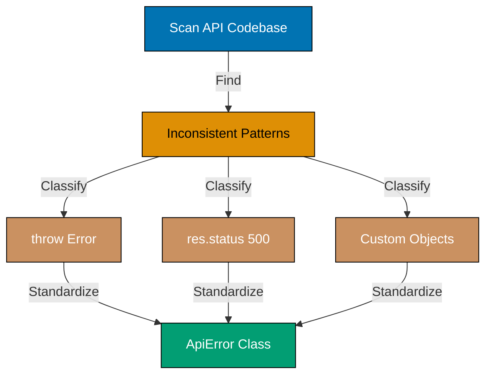

**Commands**:

```bash
You: Standardize all error handling in src/api/ to use our custom ApiError class
                                    # => Claude searches for error patterns
                                    # => Finds inconsistencies:
                                    # =>   - 8 endpoints use: throw new Error('message')
                                    # =>   - 5 endpoints use: res.status(500).send('Error')
                                    # =>   - 3 endpoints use: throw { code: 500, message: '...' }
                                    # => Reads ApiError class definition
                                    # => Refactors all error handling:
                                    # =>   throw new Error('Not found')
                                    # =>   → throw new ApiError(404, 'USER_NOT_FOUND', 'User not found')
                                    # => Ensures consistent structure:
                                    # =>   - HTTP status code
                                    # =>   - Error code constant
                                    # =>   - User-facing message
                                    # => Updates 16 error throw sites
```

**Key Takeaway**: Claude identifies error handling inconsistencies and refactors to standard pattern, ensuring uniform error responses across API.

**Why It Matters**: Inconsistent error handling causes poor client developer experience when every API endpoint returns errors in different formats. Clients must handle format variations per endpoint rather than writing shared error handling logic. Standardization with a consistent ApiError class enables clients to write one error handler for all API responses. This dramatically improves API usability, speeds up client integration, and makes debugging production issues straightforward.

### Example 48: Configuration Extraction and Environment Variables

Extract hardcoded values into configuration files. Claude identifies magic numbers and strings that should be configurable.

**Commands**:

```bash
You: Extract all hardcoded configuration values in src/ to environment variables
                                    # => Claude searches for configuration candidates:
                                    # =>   - Database connection strings
                                    # =>   - API keys and secrets
                                    # =>   - Port numbers
                                    # =>   - Feature flags
                                    # =>   - Rate limit thresholds
                                    # => Identifies 23 hardcoded values:
                                    # =>   - src/config/database.ts: 'localhost:5432'
                                    # =>   - src/api/auth.ts: 'secret-key-123'
                                    # =>   - src/server.ts: port 3000
                                    # =>   - src/middleware/rateLimiter.ts: 100 requests/hour
                                    # => Creates .env.example:
                                    # =>   DATABASE_URL=postgresql://localhost:5432/dbname
                                    # =>   JWT_SECRET=your-secret-key
                                    # =>   PORT=3000
                                    # =>   RATE_LIMIT_PER_HOUR=100
                                    # => Updates code to use process.env:
                                    # =>   const dbUrl = process.env.DATABASE_URL;
                                    # => Creates config module: src/config/env.ts
```

**Key Takeaway**: Claude identifies hardcoded config values, extracts to environment variables, and creates .env.example template with sensible defaults.

**Why It Matters**: Hardcoded configuration values prevent environment-specific deployment - the same binary cannot run correctly in dev, staging, and production. Manual config extraction is tedious, requiring systematic search across every source file to find scattered literals. AI extraction ensures comprehensive identification including values buried in rarely-touched utility files. Extracted configuration enables twelve-factor app compliance, simplifies container deployment, and dramatically reduces environment-specific debugging when moving between stages.

### Example 49: Design Pattern Implementation - Strategy Pattern

Implement design patterns to improve code structure. Claude refactors procedural code to use appropriate patterns based on problem structure.

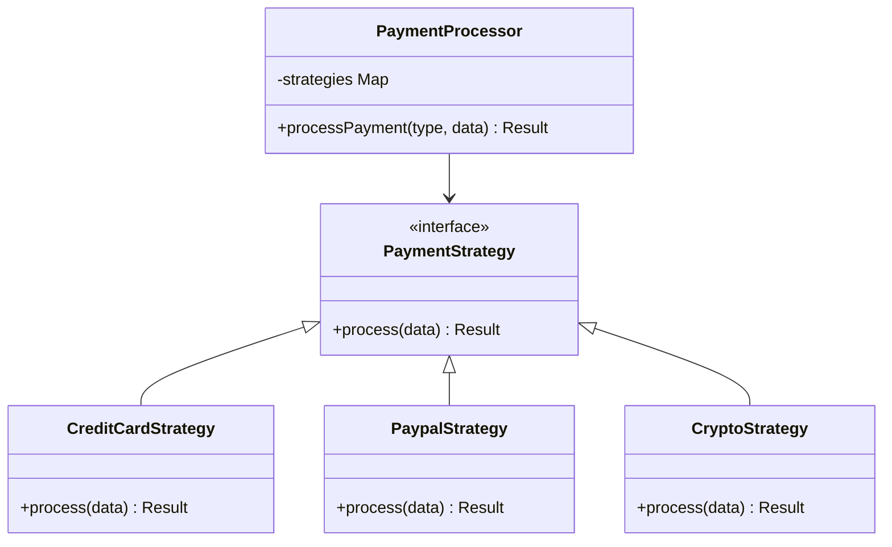

**Commands**:

```bash
You: Refactor the payment processing code in src/services/payments.ts to use Strategy pattern
                                    # => Claude reads payments.ts
                                    # => Identifies current structure:
                                    # =>   function processPayment(type, data) {
                                    # =>     if (type === 'credit_card') { ... }
                                    # =>     else if (type === 'paypal') { ... }
                                    # =>     else if (type === 'crypto') { ... }
                                    # =>   }
                                    # => Recognizes Strategy pattern opportunity
                                    # => Refactors to pattern:
                                    # =>   1. Creates interface PaymentStrategy
                                    # =>   2. Implements: CreditCardStrategy, PaypalStrategy, CryptoStrategy
                                    # =>   3. Creates PaymentProcessor with strategy map
                                    # =>   4. Updates processPayment to use strategy
                                    # => Result: extensible, testable, follows OCP
                                    # => Creates 4 new files:
                                    # =>   - PaymentStrategy.ts (interface)
                                    # =>   - CreditCardStrategy.ts
                                    # =>   - PaypalStrategy.ts
                                    # =>   - CryptoStrategy.ts
```

**Key Takeaway**: Claude identifies code smells (if-else chains) and refactors to appropriate design patterns (Strategy), improving extensibility and testability.

**Why It Matters**: Design pattern implementation requires deep architectural knowledge and careful multi-file coordination that many developers lack experience with. AI refactoring applies patterns correctly, creating all necessary interfaces, implementations, and dependency injection plumbing. Adding a new payment method becomes trivial - implement the PaymentStrategy interface with no changes to existing code. Teams report significant maintainability improvements after AI-driven pattern refactoring, particularly when adding features to previously rigid if-else chains.

### Example 50: Dead Code Elimination

Identify and remove unused code. Claude analyzes imports, function calls, and exports to find dead code safely removable.

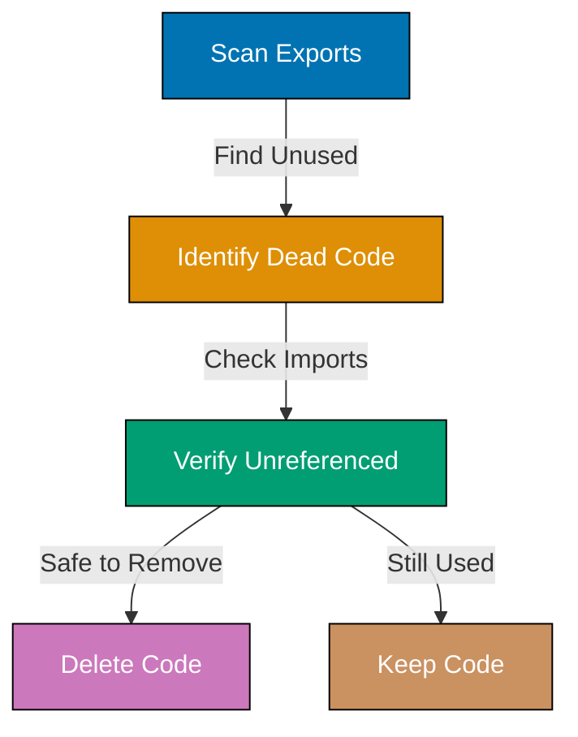

**Commands**:

```bash
You: Find and remove unused functions in src/utils/
                                    # => Claude analyzes each file in src/utils/
                                    # => For each exported function:
                                    # =>   1. Searches project for imports
                                    # =>   2. Checks if function called anywhere
                                    # => Identifies unused functions:
                                    # =>   - src/utils/legacy.ts: formatDate (not imported)
                                    # =>   - src/utils/helpers.ts: calculateTotal (imported but never called)
                                    # =>   - src/utils/validators.ts: validateZipCode (not imported)
                                    # => Asks for confirmation:
                                    # => "Found 3 unused functions. Safe to remove?"
You: Yes, remove them
                                    # => Claude deletes functions from files
                                    # => Removes empty files if no exports remain
                                    # => Confirms: "Removed 3 unused functions, deleted 1 empty file"
```

**Key Takeaway**: Claude finds unused code by analyzing exports, imports, and call sites across project. Safely removes dead code after confirmation.

**Why It Matters**: Dead code bloats codebases and creates cognitive overhead for maintainers who must determine whether unused code is intentional or forgotten. Manual dead code analysis is impractical - requires tracing every exported symbol through every import across the entire project. AI analysis completes this comprehensively in seconds. Mature projects accumulate significant dead code through refactoring and feature removal, and regular AI-assisted elimination keeps codebases lean and navigable.

## Git and Deployment Integration (Examples 51-55)

### Example 51: Automated Git Workflow - Branch Creation and Commits

Automate git operations through conversation. Claude creates branches, stages changes, and commits with descriptive messages.

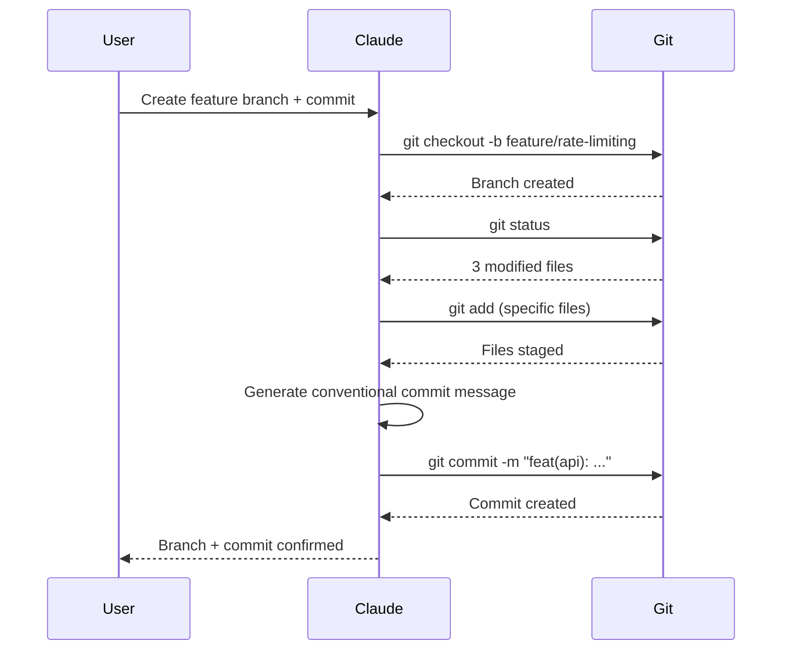

**Commands**:

```bash
You: Create a new feature branch for the rate limiting feature and commit the changes
                                    # => Claude uses Bash tool
                                    # => Runs: git checkout -b feature/rate-limiting
                                    # => Branch created: feature/rate-limiting
                                    # => Runs: git status
                                    # => Modified files:
                                    # =>   - src/middleware/rateLimiter.ts (new file)
                                    # =>   - src/server.ts (modified)
                                    # =>   - package.json (modified)
                                    # => Runs: git add (specific files, not git add .)
                                    # =>   git add src/middleware/rateLimiter.ts
                                    # =>   git add src/server.ts
                                    # =>   git add package.json
                                    # => Generates commit message:
                                    # =>   feat(api): add rate limiting middleware
                                    # =>
                                    # =>   - Implement Redis-based rate limiter
                                    # =>   - Support tier-based limits (free: 100/hr, premium: 1000/hr)
                                    # =>   - Add rate limit middleware to server
                                    # => Runs: git commit -m "..."
                                    # => Confirms: "Created branch + committed 3 files"
```

**Key Takeaway**: Claude automates git workflow: creates branches, stages specific files, generates conventional commit messages, and executes commits.

**Why It Matters**: Git operations interrupt coding flow - stopping to run git status, stage specific files, and compose descriptive commit messages breaks concentration. AI automation maintains developer flow state by handling the entire git workflow conversationally. Generated commit messages automatically follow conventional commits format, improving changelog quality without additional effort. Branch naming, staging specific files rather than git add -A, and multi-line commit bodies become effortless.

### Example 52: Commit Message Generation from Changes

Generate descriptive commit messages by analyzing staged changes. Claude reads diffs and summarizes changes in conventional commit format.

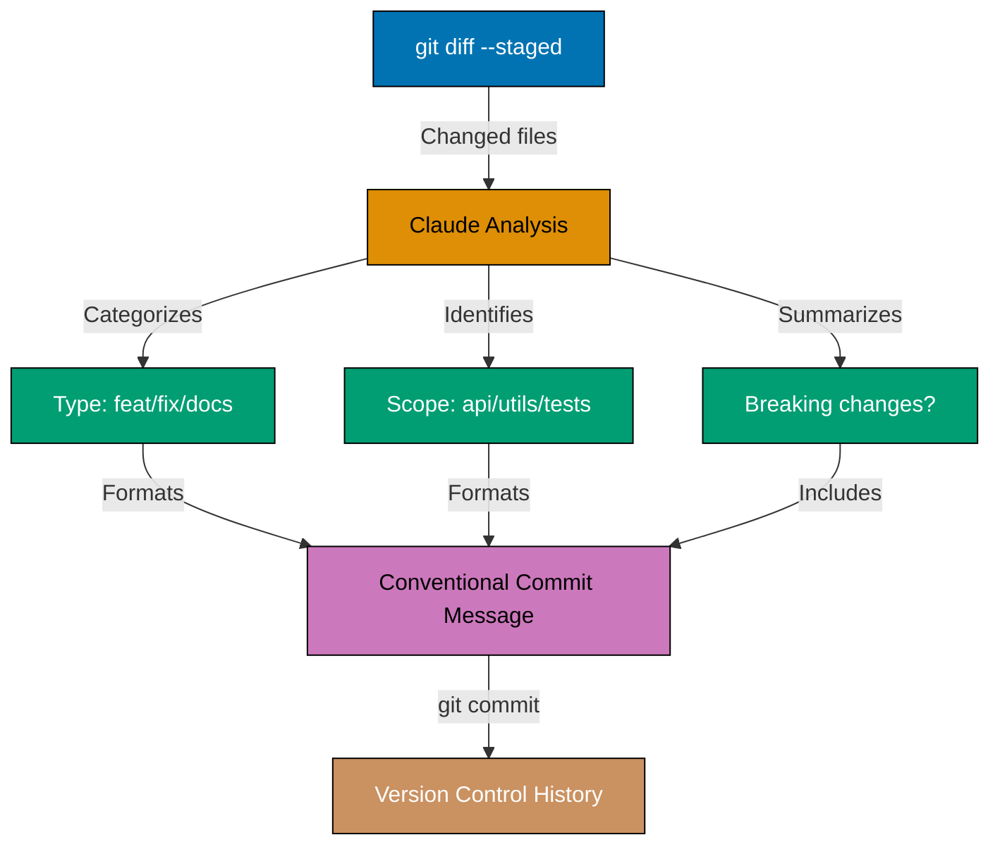

**Commands**:

```bash
You: Generate a commit message for the staged changes
                                    # => Claude runs: git diff --staged
                                    # => Analyzes changes:
                                    # =>   - src/api/users.ts: Added error handling (8 insertions)
                                    # =>   - src/api/posts.ts: Added error handling (12 insertions)
                                    # =>   - src/utils/errors.ts: Created ApiError class (new file)
                                    # => Generates message:
                                    # =>   feat(api): standardize error handling with ApiError class
                                    # =>
                                    # =>   - Create custom ApiError class for consistent error responses
                                    # =>   - Add error handling to users and posts endpoints
                                    # =>   - Include HTTP status, error codes, and messages
                                    # =>
                                    # =>   Improves API client error handling with predictable format.
                                    # => Shows message for review
You: Commit with that message
                                    # => Claude runs: git commit -m "..."
                                    # => Confirms: "Committed with generated message"
```

**Key Takeaway**: Claude analyzes git diffs to generate descriptive conventional commit messages summarizing what changed and why.

**Why It Matters**: Descriptive commit messages are time-consuming to write under deadline pressure, leading to lazy messages like "fix bug" or "wip". AI-generated messages analyze actual code changes and produce conventional commit format messages that accurately describe what changed and why. Consistent message quality makes git log genuinely useful for debugging and understanding historical decisions. Future developers, including your own future self, benefit from searchable, meaningful commit history.

### Example 53: Pull Request Description Generation

Generate comprehensive PR descriptions from branch commits. Claude analyzes commit history and creates structured PR summary.

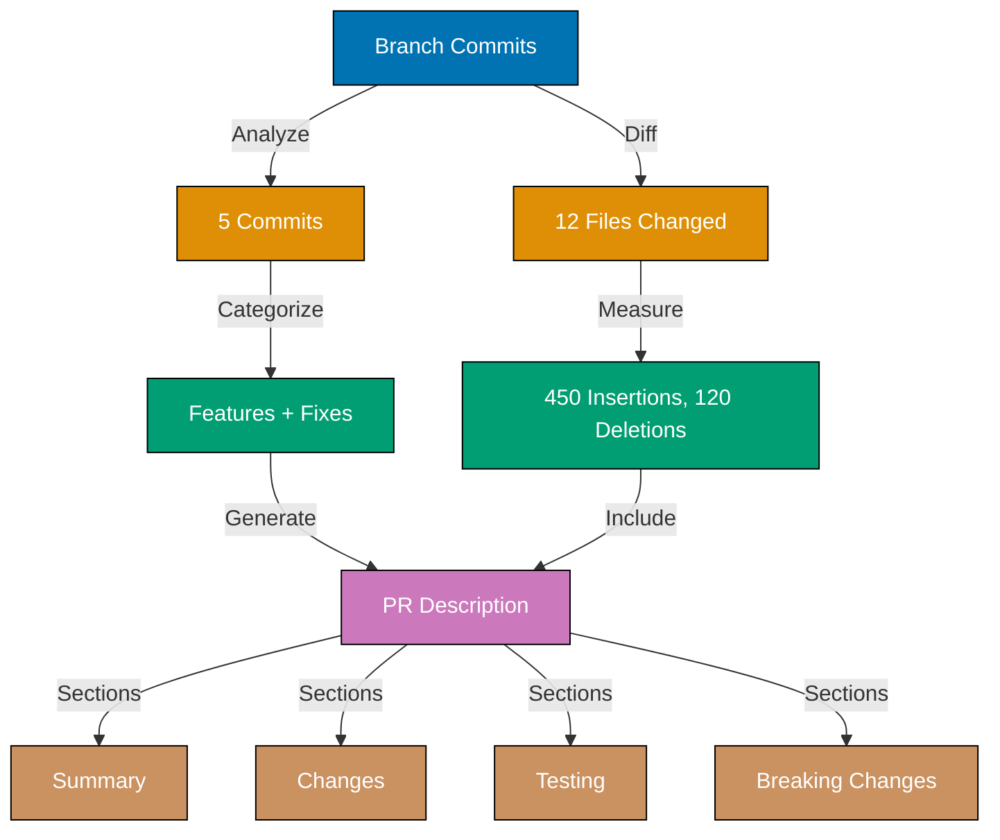

**Commands**:

```bash
You: Generate a pull request description for the current branch
                                    # => Claude runs: git diff main...HEAD
                                    # => Analyzes all commits in branch:
                                    # =>   - 5 commits
                                    # =>   - Files changed: 12
                                    # =>   - Insertions: 450, Deletions: 120
                                    # => Reads commit messages and changes
                                    # => Generates PR description:
                                    # => ## Summary
                                    # => Implements rate limiting for API endpoints with tier-based limits.
                                    # =>
                                    # => ## Changes
                                    # => - Add Redis-based rate limiter middleware
                                    # => - Implement tier detection from JWT
                                    # => - Configure limits: free (100/hr), premium (1000/hr)
                                    # => - Add rate limit headers to responses
                                    # => - Include integration tests for rate limiting
                                    # =>
                                    # => ## Testing
                                    # => - [x] Unit tests for middleware
                                    # => - [x] Integration tests for tier-based limits
                                    # => - [x] Manual testing with free and premium accounts
                                    # =>
                                    # => ## Breaking Changes
                                    # => None
```

**Key Takeaway**: Claude analyzes branch commits and diffs to generate structured PR descriptions with summary, changes, testing, and breaking changes sections.

**Why It Matters**: Comprehensive PR descriptions dramatically improve code review quality by giving reviewers context before they read code. Writing good PR descriptions is time-consuming and often deprioritized under deadline pressure. AI generation ensures consistent format with summary, change list, testing evidence, and breaking change documentation. Reviewers who understand intent before examining code provide more valuable architectural feedback rather than superficial comments on implementation details.

### Example 54: Merge Conflict Resolution Assistance

Get help resolving merge conflicts. Claude reads conflict markers, understands both versions, and suggests resolutions.

**Commands**:

```bash
You: Help me resolve the merge conflict in src/api/users.ts
                                    # => Claude reads conflicted file
                                    # => Sees conflict markers:
                                    # =>   <<<<<<< HEAD
                                    # =>   export async function createUser(data: CreateUserDTO) {
                                    # =>     const user = await db.users.create(data);
                                    # =>   =======
                                    # =>   export async function createUser(userData: UserInput) {
                                    # =>     const user = await database.insert('users', userData);
                                    # =>   >>>>>>> feature/database-refactor
                                    # => Analyzes differences:
                                    # => "Conflict: Parameter naming and database API differences.
                                    # =>  HEAD uses: CreateUserDTO + db.users.create
                                    # =>  Branch uses: UserInput + database.insert
                                    # =>
                                    # =>  Recommendation: Keep HEAD's approach (ORM-based),
                                    # =>  but update parameter name if UserInput is preferred.
                                    # =>
                                    # =>  Suggested resolution:
                                    # =>  export async function createUser(data: CreateUserDTO) {
                                    # =>    const user = await db.users.create(data);
                                    # =>  }"
You: Apply that resolution
                                    # => Claude removes conflict markers
                                    # => Updates file with suggested code
                                    # => Runs: git add src/api/users.ts
```

**Key Takeaway**: Claude reads conflict markers, explains differences, recommends resolution strategy, and can apply resolutions automatically.

**Why It Matters**: Merge conflicts are frustrating and error-prone - developers frequently keep the wrong version or accidentally introduce syntax errors while resolving markers. AI conflict analysis explains what changed semantically in each branch, not just which lines differ. Understanding intent makes resolution decisions confident rather than guesswork. Complex conflicts spanning multiple functions or involving renamed symbols particularly benefit from AI explanation of the underlying changes and their compatibility.

### Example 55: CI/CD Configuration Generation

Generate CI/CD pipeline configs. Claude creates GitHub Actions, GitLab CI, or other pipeline files based on project stack.

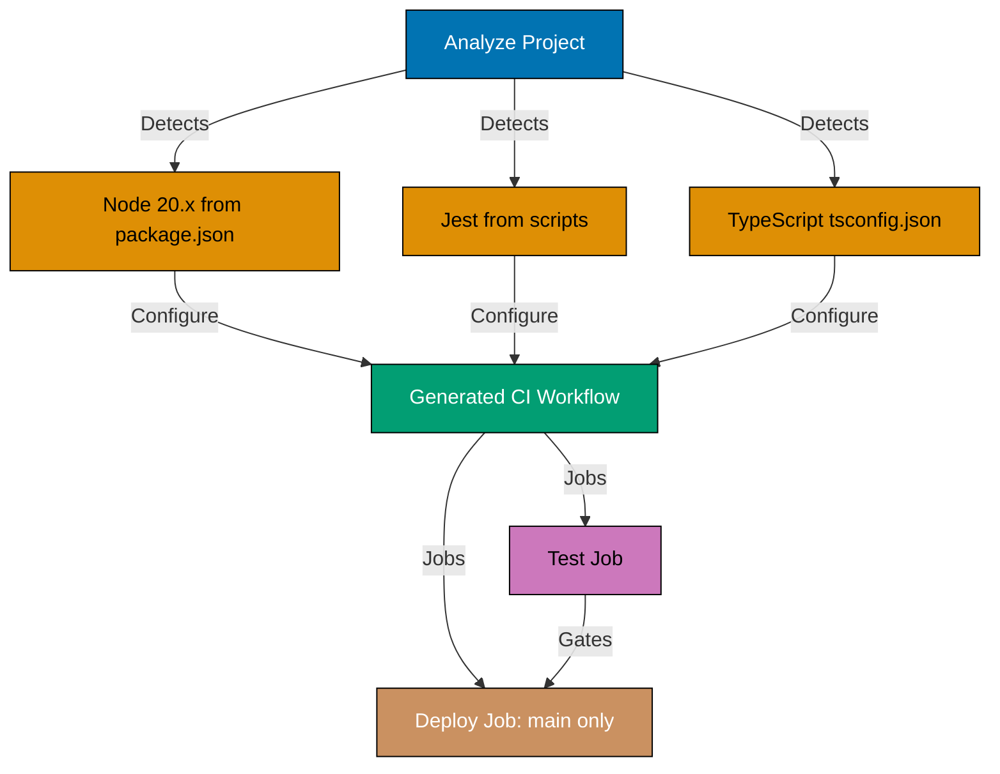

**Commands**:

```bash
You: Create a GitHub Actions workflow for testing and deploying this Node.js app
                                    # => Claude analyzes project:
                                    # =>   - Detects: Node.js 20.x (from package.json engines)
                                    # =>   - Detects: Jest tests (from package.json scripts)
                                    # =>   - Detects: TypeScript (from tsconfig.json)
                                    # => Generates .github/workflows/ci.yml:
                                    # =>   name: CI/CD
                                    # =>   on: [push, pull_request]
                                    # =>   jobs:
                                    # =>     test:
                                    # =>       runs-on: ubuntu-latest
                                    # =>       steps:
                                    # =>         - uses: actions/checkout@v4
                                    # =>         - uses: actions/setup-node@v4
                                    # =>           with: { node-version: '20.x' }
                                    # =>         - run: npm ci
                                    # =>         - run: npm run build
                                    # =>         - run: npm test
                                    # =>     deploy:
                                    # =>       needs: test
                                    # =>       if: github.ref == 'refs/heads/main'
                                    # =>       runs-on: ubuntu-latest
                                    # =>       steps:
                                    # =>         - (deployment steps)
                                    # => Creates workflow file
```

**Key Takeaway**: Claude generates CI/CD pipeline configs based on detected tech stack, including test, build, and deployment steps.

**Why It Matters**: CI/CD configuration is boilerplate-heavy, version-sensitive, and difficult to debug when workflows fail silently due to YAML indentation errors or incorrect action versions. AI generation creates working pipelines that match the detected project stack, including appropriate Node versions, build commands, and deployment targets. Teams reach automated testing and deployment significantly faster, eliminating the trial-and-error cycle of fixing workflow syntax while trying to learn GitHub Actions capabilities.

## Code Documentation and Architecture (Examples 56-60)

### Example 56: Automated API Documentation Generation

Generate API documentation from endpoint implementations. Claude extracts routes, parameters, request/response formats, and error codes.

**Commands**:

````bash
You: Generate API documentation for all endpoints in src/api/
                                    # => Claude scans all files in src/api/
                                    # => Identifies endpoints:
                                    # =>   - GET    /api/users
                                    # =>   - POST   /api/users
                                    # =>   - GET    /api/users/:id
                                    # =>   - PATCH  /api/users/:id
                                    # =>   - DELETE /api/users/:id
                                    # =>   - (15 more endpoints...)
                                    # => For each endpoint, extracts:
                                    # =>   - HTTP method and path
                                    # =>   - Request body schema (from validation)
                                    # =>   - Response format (from code)
                                    # =>   - Status codes (success + errors)
                                    # =>   - Authentication requirements
                                    # => Generates docs/api-reference.md:
                                    # =>   ## POST /api/users
                                    # =>   Create a new user account.
                                    # =>
                                    # =>   **Request Body:**
                                    # =>   ```json
                                    # =>   { "name": "string", "email": "string", "password": "string" }
                                    # =>   ```
                                    # =>
                                    # =>   **Responses:**
                                    # =>   - 201: User created (returns user object)
                                    # =>   - 400: Validation error
                                    # =>   - 409: Email already exists
````

**Key Takeaway**: Claude generates API documentation by analyzing endpoint code, extracting schemas, responses, and error conditions automatically.

**Why It Matters**: Manual API documentation falls out of sync with code implementations as endpoints evolve, creating misleading references that waste developer time. AI-generated documentation matches actual implementation by reading the source code directly, not relying on developer memory. Accurate API documentation reduces support tickets, accelerates third-party integrations, and makes onboarding new API consumers faster. Regular automated generation ensures documentation remains current with each release rather than requiring dedicated documentation sprints.

### Example 57: Architecture Diagram Generation with Mermaid

Generate architecture diagrams visualizing system structure. Claude analyzes imports and dependencies to create component relationship diagrams.

**Commands**:

```bash
You: Create an architecture diagram showing the layers of this application
                                    # => Claude analyzes project structure:
                                    # =>   - src/api/ (HTTP handlers)
                                    # =>   - src/services/ (business logic)
                                    # =>   - src/models/ (data models)
                                    # =>   - src/database/ (data access)
                                    # => Analyzes imports to understand dependencies
                                    # => Generates Mermaid diagram:
                                    # =>   graph TD
                                    # =>     A[HTTP Layer: src/api/] -->|calls| B[Service Layer: src/services/]
                                    # =>     B -->|uses| C[Model Layer: src/models/]
                                    # =>     B -->|accesses| D[Database Layer: src/database/]
                                    # =>     C -->|schema| D
                                    # =>
                                    # =>     style A fill:#0173B2,stroke:#000,color:#fff
                                    # =>     style B fill:#DE8F05,stroke:#000,color:#fff
                                    # =>     style C fill:#029E73,stroke:#000,color:#fff
                                    # =>     style D fill:#CC78BC,stroke:#000,color:#fff
                                    # => Adds to docs/architecture.md
```

**Key Takeaway**: Claude analyzes project structure and import relationships to generate Mermaid architecture diagrams showing system layers and dependencies.

**Why It Matters**: Architecture diagrams accelerate new developer onboarding by providing visual system understanding before diving into code. Manual diagram maintenance is consistently deprioritized, resulting in diagrams that describe systems as they were designed rather than how they actually work. AI-generated diagrams reflect real import relationships and current component boundaries. Accurate architecture documentation enables confident refactoring decisions and helps teams identify unexpected coupling between components.

### Example 58: Code Comment and Docstring Addition

Add explanatory comments to complex code. Claude analyzes logic and generates comments explaining intent, not just restating code.

**Commands**:

```bash
You: Add explanatory comments to the algorithm in src/utils/recommendation.ts
                                    # => Claude reads recommendation.ts
                                    # => Analyzes complex algorithm:
                                    # =>   function calculateSimilarity(userA, userB) {
                                    # =>     const dotProduct = ...
                                    # =>     const magnitudeA = ...
                                    # =>     const magnitudeB = ...
                                    # =>     return dotProduct / (magnitudeA * magnitudeB);
                                    # =>   }
                                    # => Adds explanatory comments:
                                    # =>   /**
                                    # =>    * Calculates cosine similarity between two user preference vectors.
                                    # =>    * Higher values (closer to 1) indicate more similar preferences.
                                    # =>    * Used for collaborative filtering recommendations.
                                    # =>    */
                                    # =>   function calculateSimilarity(userA, userB) {
                                    # =>     // Compute dot product of preference vectors
                                    # =>     const dotProduct = ...
                                    # =>     // Calculate magnitude (Euclidean norm) for normalization
                                    # =>     const magnitudeA = ...
                                    # =>     const magnitudeB = ...
                                    # =>     // Cosine similarity: dot product divided by product of magnitudes
                                    # =>     return dotProduct / (magnitudeA * magnitudeB);
                                    # =>   }
```

**Key Takeaway**: Claude adds comments explaining algorithm intent and mathematical concepts, not just restating obvious operations.

**Why It Matters**: Good comments explain the why behind code, not just restate what the code does. AI comments add context about algorithm choices, business rule origins, and design tradeoffs that are invisible from implementation alone. Complex mathematical algorithms, state machine logic, and performance-sensitive code become comprehensible to developers who lack the original context. Teams report faster code comprehension in unfamiliar files when high-quality explanatory comments are present.

### Example 59: Performance Optimization Suggestions

Request performance analysis and optimization recommendations. Claude identifies bottlenecks and suggests improvements.

**Commands**:

```bash
You: Analyze src/services/search.ts for performance issues and suggest optimizations
                                    # => Claude reads search.ts
                                    # => Analyzes code:
                                    # =>   function search(query) {
                                    # =>     const allItems = loadAllItems();  // Loads 10,000+ items
                                    # =>     return allItems.filter(item => item.name.includes(query));
                                    # =>   }
                                    # => Identifies issues:
                                    # =>   1. Loading all items inefficient (O(n) every search)
                                    # =>   2. Linear search through all items
                                    # =>   3. Case-sensitive matching misses results
                                    # => Suggests optimizations:
                                    # =>   1. Add database index on name column
                                    # =>   2. Push filter to SQL WHERE clause (database-level)
                                    # =>   3. Use ILIKE for case-insensitive search
                                    # =>   4. Add pagination to limit result set
                                    # => Provides optimized implementation:
                                    # =>   async function search(query, page = 1, limit = 20) {
                                    # =>     // Database performs filtering (much faster)
                                    # =>     return await db.query(
                                    # =>       'SELECT * FROM items WHERE name ILIKE $1 LIMIT $2 OFFSET $3',
                                    # =>       [`%${query}%`, limit, (page - 1) * limit]
                                    # =>     );
                                    # =>   }
```

**Key Takeaway**: Claude identifies performance bottlenecks (loading all data, inefficient filtering) and provides optimized implementations using database-level filtering.

**Why It Matters**: Performance bottlenecks are often invisible to developers without profiling experience and database tuning knowledge. AI analysis identifies common anti-patterns including N+1 queries, loading entire tables when filtering is needed, and missing database indexes that cause full table scans. These issues appear innocuous in development but cause severe degradation at production scale. Teams resolve performance problems faster when AI pinpoints specific causes rather than requiring expensive profiling investigations.

### Example 60: Accessibility Audit and Improvements

Audit frontend code for accessibility issues. Claude identifies WCAG violations and suggests fixes for keyboard navigation, ARIA labels, and color contrast.

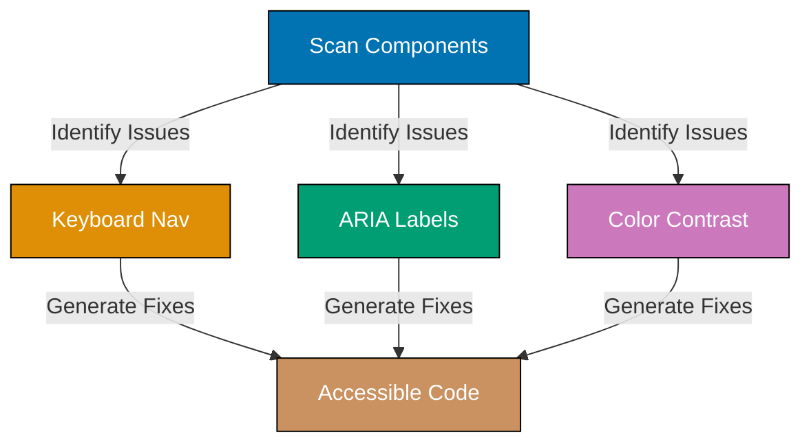

**Commands**:

```bash
You: Audit src/components/Modal.tsx for accessibility issues
                                    # => Claude reads Modal.tsx
                                    # => Identifies issues:
                                    # =>   1. Missing focus trap (keyboard users can tab outside modal)
                                    # =>   2. Missing ARIA role and labels
                                    # =>   3. No keyboard close (ESC key)
                                    # =>   4. Missing focus management (return focus on close)
                                    # =>   5. Close button has no accessible label (icon only)
                                    # => Suggests fixes:
                                    # =>   1. Add role="dialog" and aria-modal="true"
                                    # =>   2. Add aria-labelledby pointing to title
                                    # =>   3. Implement ESC key handler
                                    # =>   4. Use useEffect to manage focus
                                    # =>   5. Add aria-label="Close" to close button
                                    # => Generates improved component:
                                    # =>   <div role="dialog" aria-modal="true" aria-labelledby="modal-title">
                                    # =>     <h2 id="modal-title">{title}</h2>
                                    # =>     <button onClick={onClose} aria-label="Close">
                                    # =>       <CloseIcon aria-hidden="true" />
                                    # =>     </button>
                                    # =>     {children}
                                    # =>   </div>
                                    # => Adds keyboard handlers and focus management
```

**Key Takeaway**: Claude audits components for WCAG compliance, identifies keyboard navigation, ARIA, and focus management issues, then generates accessible implementations.

**Why It Matters**: Accessibility is frequently overlooked during feature development but legally required under ADA, WCAG, and similar regulations in many jurisdictions. Developers without assistive technology experience consistently miss keyboard navigation gaps, missing ARIA roles, and focus management failures. AI accessibility audits catch these issues systematically across every component. Fixing accessibility proactively prevents both legal liability and the reputational damage of excluding users who rely on screen readers or keyboard navigation.

## Next Steps

This intermediate tutorial covered Examples 31-60 (40-75% of Claude Code capabilities). You learned multi-file refactoring, advanced prompting techniques, comprehensive testing workflows, git automation, and code quality improvements for production-ready AI-assisted development.

**Continue learning**:

- [Beginner](/en/learn/software-engineering/automation-tools/claude-code/by-example/beginner) - Examples 1-30 reviewing essential commands and basic workflows
- [Advanced](/en/learn/software-engineering/automation-tools/claude-code/by-example/advanced) - Examples 61-85 covering custom agents, production orchestration, and enterprise integration patterns
