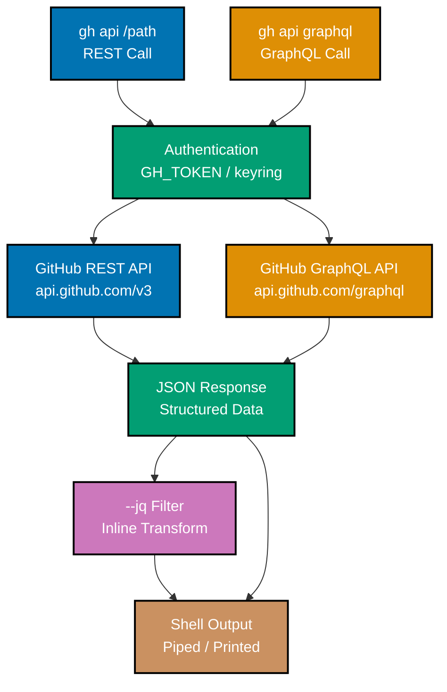
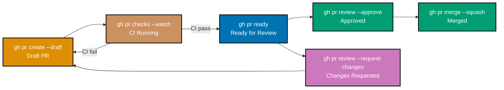

This tutorial covers advanced GitHub CLI concepts through 29 self-contained, heavily annotated
examples. The examples build on intermediate skills to cover direct REST and GraphQL API access,
pagination, jq transformations, extension authoring, shell scripting patterns, cross-repository
search, cache management, artifact attestations, GPG keys, GitHub Projects, and CI/CD automation
— spanning 70–95% of GitHub CLI features.

## REST API Calls

### Example 57: Call the GitHub REST API

`gh api` makes authenticated REST API calls to GitHub's API, handling authentication
headers and URL construction automatically. The response is printed as formatted JSON.

```bash
# Get details for the authenticated user.
# :path is relative to https://api.github.com/
gh api /user
# => {
# =>   "login": "alice",
# =>   "id": 12345678,
# =>   "name": "Alice Smith",
# =>   "email": "alice@example.com",
# =>   "public_repos": 42,
# =>   "followers": 120
# => }

# Get details for a specific repository using path placeholders.
# {owner} and {repo} are automatically resolved from the current git context.
gh api /repos/{owner}/{repo}
# => {
# =>   "name": "my-project",
# =>   "full_name": "alice/my-project",
# =>   "private": false,
# =>   "default_branch": "main",
# =>   "stargazers_count": 12
# => }

# Get rate limit status for the current token.
gh api /rate_limit
# => {
# =>   "resources": {
# =>     "core": {"limit": 5000, "remaining": 4876, "reset": 1680000000}
# =>   }
# => }
```

**Key takeaway:** `gh api /path` calls any GitHub REST endpoint with automatic authentication,
using `{owner}` and `{repo}` as context-aware placeholders for the current repository.

**Why it matters:** The GitHub REST API exposes functionality not yet surfaced in dedicated
`gh` subcommands — repository topics, traffic statistics, deployment statuses, and more. Using
`gh api` instead of `curl` with manually constructed Authorization headers removes credential
management from API scripts, making them portable and secrets-safe. Any capability in the
GitHub API is accessible via `gh api`.

---

### Example 58: Make POST and PATCH API Requests

`gh api` supports all HTTP methods — GET, POST, PATCH, PUT, DELETE — with request body fields
passed via `--field` or `--raw-field` flags.

```bash
# POST: Create a repository topic using the REST API.
# --method specifies the HTTP verb; --field passes JSON body fields.
gh api \
  --method PUT \
  /repos/{owner}/{repo}/topics \
  --field names[]="typescript" \
  --field names[]="nextjs" \
  --field names[]="react"
# => (204 No Content — topics updated successfully)

# PATCH: Update a repository's description and homepage.
gh api \
  --method PATCH \
  /repos/{owner}/{repo} \
  --field description="My awesome TypeScript project" \
  --field homepage="https://myproject.example.com"
# => {
# =>   "name": "my-project",
# =>   "description": "My awesome TypeScript project",
# =>   "homepage": "https://myproject.example.com"
# => }

# POST: Create an issue via the API (alternative to gh issue create).
gh api \
  --method POST \
  /repos/{owner}/{repo}/issues \
  --field title="API-created issue" \
  --field body="Created via gh api" \
  --field labels[]="bug"
# => {
# =>   "number": 50,
# =>   "html_url": "https://github.com/alice/my-project/issues/50"
# => }
```

**Key takeaway:** `--field` sends JSON values; `--raw-field` sends literal strings without
JSON encoding — use `--raw-field` for values that must remain as strings rather than parsed
as numbers or booleans.

**Why it matters:** Write operations through `gh api` enable automation of repository management
tasks that have no dedicated `gh` subcommand. Updating repository metadata, bulk-creating issues
from a CSV, or triggering deployment statuses from external systems are all scriptable using
`gh api --method POST`. This makes GitHub's full API surface automatable from shell scripts.

---

### Example 59: Extract Fields with --jq

The `--jq` flag applies a jq expression to the API response, extracting or transforming specific
fields without requiring a separate `jq` invocation.

```bash
# Extract just the login names from a list of repository contributors.
gh api /repos/{owner}/{repo}/contributors --jq '.[].login'
# => alice
# => bob
# => carol

# Extract the number and title of open issues.
gh api /repos/{owner}/{repo}/issues --jq '.[] | "\(.number): \(.title)"'
# => 50: API-created issue
# => 43: Add dark mode support
# => 42: Fix login button alignment on mobile

# Extract a nested field: get the default branch name.
gh api /repos/{owner}/{repo} --jq '.default_branch'
# => main

# Filter and transform: get only issues with more than 5 comments.
gh api /repos/{owner}/{repo}/issues \
  --jq '.[] | select(.comments > 5) | {number: .number, title: .title, comments: .comments}'
# => {
# =>   "number": 30,
# =>   "title": "Document API endpoints",
# =>   "comments": 8
# => }
```

**Key takeaway:** Combining `gh api` with `--jq` creates a one-liner data pipeline from
GitHub's API to structured shell output, eliminating the need for an intermediate file.

**Why it matters:** Extracting specific fields from API responses is necessary for scripting.
Without `--jq`, every consumer of `gh api` output needs a separate `jq` invocation, adding
a dependency and a pipeline step. Inline `--jq` expressions are more readable and do not
require intermediate variables, making automation scripts concise and self-documenting.

---

### Example 60: Paginate API Results

GitHub paginates list endpoints to 30 items by default. The `--paginate` flag fetches all
pages automatically, combining results into a single array.

```bash
# Fetch all open issues across all pages (not just the first 30).
gh api /repos/{owner}/{repo}/issues --paginate
# => [
# =>   (all open issues, potentially hundreds, across all pages)
# => ]

# Paginate and extract just the issue numbers.
gh api /repos/{owner}/{repo}/issues \
  --paginate \
  --jq '.[].number'
# => 50
# => 43
# => 42
# => (all issue numbers, one per line)

# Paginate repository list for an organization (can be hundreds).
gh api /orgs/myorg/repos \
  --paginate \
  --jq '.[].full_name'
# => myorg/repo-1
# => myorg/repo-2
# => (all repository names in the organization)
```

**Key takeaway:** Always use `--paginate` when you need complete data from a list endpoint;
without it, you only see the first 30 results and may make decisions based on incomplete data.

**Why it matters:** Organizations with many repositories or repositories with many issues
will silently truncate results without `--paginate`. Reporting scripts, audit tools, and
migration utilities that process all items — not just the first page — must use this flag.
Missing it causes subtle bugs where the script appears to succeed but silently ignores most
of the data.

---

## GraphQL API Calls

### Example 61: Run a GraphQL Query

`gh api graphql` sends a GraphQL query to GitHub's GraphQL API, which provides more efficient
data fetching than REST by returning exactly the fields requested.

```bash
# Query the authenticated user's profile and recent repositories.
gh api graphql --field query='
  query {
    viewer {
      login
      name
      repositories(first: 3, orderBy: {field: UPDATED_AT, direction: DESC}) {
        nodes {
          name
          stargazerCount
          primaryLanguage {
            name
          }
        }
      }
    }
  }
'
# => {
# =>   "data": {
# =>     "viewer": {
# =>       "login": "alice",
# =>       "name": "Alice Smith",
# =>       "repositories": {
# =>         "nodes": [
# =>           {"name": "my-project", "stargazerCount": 12, "primaryLanguage": {"name": "TypeScript"}},
# =>           {"name": "dotfiles", "stargazerCount": 3, "primaryLanguage": {"name": "Shell"}},
# =>           {"name": "cli-tools", "stargazerCount": 7, "primaryLanguage": {"name": "Go"}}
# =>         ]
# =>       }
# =>     }
# =>   }
# => }
```

**Key takeaway:** GraphQL queries fetch exactly the fields you need in a single request,
avoiding the multiple REST round-trips needed to join related data.

**Why it matters:** Fetching a user's repositories with their languages and star counts via
REST requires separate requests for each piece of data. The GraphQL equivalent fetches
everything in one request, which is critical for scripts that run in rate-limited environments
or that process many repositories. GitHub's GraphQL API also exposes some data not available
in the REST API.

---

### Example 62: GraphQL with Variables and Pagination

GraphQL variables decouple the query structure from its inputs, enabling parameterized
queries. GraphQL pagination uses cursors rather than page numbers.

```bash
# Parameterized query using GraphQL variables.
# Variables are passed separately from the query, preventing injection.
gh api graphql \
  --field query='
    query($owner: String!, $name: String!) {
      repository(owner: $owner, name: $name) {
        issues(first: 5, states: OPEN) {
          totalCount
          nodes {
            number
            title
            createdAt
          }
        }
      }
    }
  ' \
  --field owner="alice" \
  --field name="my-project"
# => {
# =>   "data": {
# =>     "repository": {
# =>       "issues": {
# =>         "totalCount": 5,
# =>         "nodes": [
# =>           {"number": 50, "title": "API-created issue", "createdAt": "2026-04-01T..."},
# =>           (4 more issues)
# =>         ]
# =>       }
# =>     }
# =>   }
# => }
```

**Key takeaway:** Pass dynamic values as `--field variable=value` GraphQL variables rather
than string-interpolating them into the query to prevent injection and improve readability.

**Why it matters:** String-interpolating user input into GraphQL queries creates injection
vulnerabilities. Using typed variables maintains the structural separation between the query
and its inputs. This pattern is essential when building tools that accept user input —
organization names, repository names, date ranges — and pass them to GitHub's GraphQL API.

---

## Extensions

### Example 63: Install and Use an Extension

`gh extension install` adds a community-authored extension that adds new subcommands to
`gh`. Extensions are git repositories hosted on GitHub.

```bash
# Install an extension by repository reference.
# Extensions are discovered at https://github.com/topics/gh-extension
gh extension install dlvhdr/gh-dash
# => ✓ Installed extension dlvhdr/gh-dash
# => (gh-dash adds: gh dash)

# Use the installed extension.
# Extensions run as gh subcommands using their repository name.
gh dash
# => (opens an interactive TUI dashboard for PRs and issues)

# Install another commonly used extension.
gh extension install seachicken/gh-poi
# => ✓ Installed extension seachicken/gh-poi
# => (gh-poi adds: gh poi — cleans merged local branches)

# List all installed extensions.
gh extension list
# => NAME     REPO                     VERSION
# => gh-dash  dlvhdr/gh-dash           v5.8.0
# => gh-poi   seachicken/gh-poi        v0.9.0

# Upgrade all extensions to their latest versions.
gh extension upgrade --all
# => ✓ Successfully upgraded extension dlvhdr/gh-dash
# => ✓ Successfully upgraded extension seachicken/gh-poi
```

**Key takeaway:** Extensions add new `gh` subcommands from community repositories — install
them by `owner/repo` reference and they run as `gh extension-name`.

**Why it matters:** The `gh` extension ecosystem extends the core tool with team-specific or
workflow-specific functionality. Popular extensions provide interactive TUIs for PR review,
branch management dashboards, and workflow helpers. Teams can publish internal extensions to
automate organization-specific deployment or reporting workflows, distributable via
`gh extension install myorg/gh-myextension`.

---

### Example 64: Create a Shell Extension

`gh extension create` scaffolds a new extension repository. A shell extension is the simplest
type — a single shell script that `gh` executes as a subcommand.

```bash
# Create a new shell extension scaffold.
gh extension create my-extension
# => ✓ Created directory gh-my-extension
# => ✓ Initialized git repo
# => ✓ Made main script executable
# => ✓ Created gh-my-extension/gh-my-extension (the main script)
# => (current directory now contains gh-my-extension/)

# The scaffolded script is a basic bash script.
cat gh-my-extension/gh-my-extension
# => #!/usr/bin/env bash
# => set -e
# => echo "hello gh-my-extension!"

# Edit the script to add your functionality.
# Example: list all branches sorted by last commit date.
cat > gh-my-extension/gh-my-extension << 'EOF'
#!/usr/bin/env bash
set -e
# List remote branches sorted by last commit date
git for-each-ref --sort=-committerdate refs/remotes/origin \
  --format='%(committerdate:short) %(refname:short)' | head -20
EOF

# Install the extension from the local directory for testing.
gh extension install .
# => ✓ Installed extension gh-my-extension

# Run the extension.
gh my-extension
# => 2026-04-01  origin/main
# => 2026-03-30  origin/feat/dark-mode
# => (branches sorted by last commit date)
```

**Key takeaway:** Shell extensions are the simplest extension type — any shell script in a
repository named `gh-*` is installable as a `gh` extension by other users.

**Why it matters:** Distributing team scripts as `gh` extensions gives them a consistent
interface, automatic installation via `gh extension install`, and version tracking. Teams
that currently share scripts as gists or Slack messages gain discoverability and
upgradeability by packaging them as extensions.

---

## Search

### Example 65: Search Repositories

`gh search repos` queries GitHub's repository search with filtering by language, stars,
topics, and other attributes — returning structured results directly in the terminal.

```bash
# Search for repositories about "rate limiting" in Go.
gh search repos "rate limiting" --language go --limit 5
# => NAME                            STARS  DESCRIPTION
# => toll-booth/throttle             1.2k   Distributed rate limiting in Go
# => ulule/limiter                   2.1k   Dead simple rate limit middleware for Go
# => mennanov/limiters               842    Redis-based rate limiters for Go
# => go-redis/redis_rate             3.4k   Rate limiting for go-redis

# Search repositories created by a specific organization with a topic.
gh search repos --owner github --topic "machine-learning" --limit 5
# => NAME                      STARS  DESCRIPTION
# => github/CodeSearchNet       4.2k   Benchmark dataset for code search
# => (more results)

# Search for repositories with many stars matching a term.
gh search repos "kubernetes operator" --language go --stars ">1000" --limit 5
# => NAME                          STARS  DESCRIPTION
# => operator-framework/operator-sdk  7.1k  SDK for building Kubernetes operators
# => (more results)
```

**Key takeaway:** `gh search repos` provides structured, scriptable repository search that
returns JSON-parseable results — unlike browser search which returns only HTML.

**Why it matters:** Finding relevant open-source libraries and tools is a frequent developer
activity. `gh search repos` returns structured data that can be piped into scripts for
technology radar automation, dependency research tools, or organization-wide library
discovery systems.

---

### Example 66: Search Issues and Pull Requests

`gh search issues` and `gh search prs` query issues and pull requests across all GitHub
repositories, with qualifiers matching GitHub's issue search syntax.

```bash
# Search for open issues mentioning a specific error message.
gh search issues "ECONNREFUSED connection refused" --state open --limit 5
# => REPO                    NUMBER  TITLE                                   UPDATED
# => nestjs/nest             #12345  ECONNREFUSED when starting dev server   2 days ago
# => expressjs/express       #3456   Connection refused on healthcheck        5 days ago

# Search for PRs that you authored across all repositories.
gh search prs --author @me --state open --limit 10
# => REPO                  NUMBER  TITLE                              UPDATED
# => alice/my-project      #45     Fix login button alignment          10 min ago
# => alice/other-project   #23     Update Node.js to v24              2 hours ago

# Search for issues assigned to you in a specific organization.
gh search issues --assignee @me --owner myorg --state open
# => (all open issues in myorg repositories assigned to you)

# Find PRs that need your review.
gh search prs "review-requested:@me" --state open
# => (open PRs where your review is requested, across all repositories)
```

**Key takeaway:** `gh search issues` and `gh search prs` use GitHub's full search qualifier
syntax, enabling cross-repository queries that the single-repository `gh issue list` cannot express.

**Why it matters:** Developers who contribute to multiple repositories need a unified view of
their work. `gh search issues --assignee @me` across all organizations provides this. Teams
that use `gh search prs "review-requested:@me"` as their daily standup command never miss
review requests, regardless of how many repositories they contribute to.

---

### Example 67: Search Code and Commits

`gh search code` finds code snippets matching a pattern across repositories. `gh search
commits` finds commits by message, author, or date range.

```bash
# Search for code using a specific pattern in TypeScript files.
gh search code "useState" --language typescript --owner alice --limit 5
# => REPO                  FILE                          LINE
# => alice/my-project      src/components/Login.tsx      12: const [email, setEmail] = useState('')
# => alice/other-project   src/pages/index.tsx           8:  const [data, setData] = useState(null)

# Search for commits with a specific message pattern.
gh search commits "fix: login" --author alice --limit 5
# => SHA      REPO               COMMIT MESSAGE           DATE
# => abc1234  alice/my-project   fix: login button CSS    2026-04-01
# => def5678  alice/my-project   fix: login form submit   2026-03-28

# Search commits in a date range.
gh search commits "breaking change" \
  --committer-date ">2026-01-01" \
  --repo alice/my-project \
  --limit 10
# => (commits with "breaking change" in message since 2026-01-01)
```

**Key takeaway:** `gh search code` enables cross-repository code search from the terminal,
useful for finding usage patterns, deprecated API calls, or security vulnerabilities across
an organization's codebases.

**Why it matters:** Security audits often require finding all usages of a vulnerable library
or deprecated API across all repositories. `gh search code "import from 'old-crypto-lib'"
--owner myorg` identifies every file that imports the vulnerable library in the entire
organization — a scan that would otherwise require cloning every repository.

---

## Advanced Scripting Patterns

### Example 68: Output JSON for Scripting

The `--json` flag on most `gh` subcommands outputs structured JSON instead of the default
table format, enabling reliable parsing in scripts without text scraping.

```bash
# Get issue list as JSON with specific fields.
gh issue list --json number,title,labels,assignees
# => [
# =>   {
# =>     "number": 50,
# =>     "title": "API-created issue",
# =>     "labels": [{"name": "bug"}],
# =>     "assignees": [{"login": "alice"}]
# =>   },
# =>   (more issues)
# => ]

# Get PR list as JSON and filter with jq.
gh pr list --json number,title,headRefName,isDraft \
  --jq '.[] | select(.isDraft == false) | {number: .number, branch: .headRefName}'
# => {"number": 45, "branch": "fix/login-btn"}
# => (only non-draft PRs, showing number and branch)

# Get run list as JSON for scripting.
gh run list --json databaseId,name,status,conclusion --limit 10
# => [
# =>   {"databaseId": 123456789, "name": "CI", "status": "completed", "conclusion": "success"},
# =>   (more runs)
# => ]
```

**Key takeaway:** Use `--json fieldName,fieldName` with `--jq` for reliable scripting — text
format parsing is fragile and breaks when column widths change.

**Why it matters:** Scripts that parse `gh` output using `awk`, `cut`, or `grep` on human-readable
table output break silently when field widths change or when Unicode characters affect column
alignment. The `--json` flag produces stable, typed JSON that tools like `jq`, Python's `json`
module, or Node.js can parse reliably, making automation scripts production-grade.

---

### Example 69: Combine gh Commands in a Shell Script

Shell scripts that combine multiple `gh` commands enable end-to-end automation of multi-step
GitHub workflows — creating branches, PRs, checking CI, and merging in one script.

```bash
#!/usr/bin/env bash
# Automate the full feature branch lifecycle:
# create branch → commit → push → create PR → wait for CI → merge

set -euo pipefail
# => set -e: exit on error; set -u: error on unset variable; set -o pipefail: fail on pipe error

FEATURE_NAME="${1:?Usage: $0 <feature-name>}"
# => Requires first argument; shows usage if missing

# Create and checkout feature branch.
git checkout -b "feat/$FEATURE_NAME"
# => Creates and switches to the new feature branch

# (make your code changes here, then stage them)
git add -A
git commit -m "feat: $FEATURE_NAME"
# => Commits staged changes with conventional commit message

# Push the branch and create a PR as draft.
git push -u origin "feat/$FEATURE_NAME"
# => Pushes branch to origin and sets upstream tracking

gh pr create \
  --title "feat: $FEATURE_NAME" \
  --body "Automated PR for $FEATURE_NAME" \
  --draft
# => Creates draft PR — reviewers not yet notified

# Wait for CI to complete, then mark ready for review.
gh pr checks --watch
# => Blocks until all CI checks complete (exits non-zero on failure)

gh pr ready
# => Marks PR as ready — notifies reviewers
echo "PR ready for review: $(gh pr view --json url --jq '.url')"
# => Prints the PR URL for sharing in Slack or email
```

**Key takeaway:** Shell scripts using `set -euo pipefail` with `gh` commands create atomic
workflows where any step failure aborts the entire script, preventing partial state.

**Why it matters:** Multi-step GitHub workflows performed manually are error-prone — developers
forget to push before creating a PR, or forget to mark a PR ready after CI passes. Encoding
the entire workflow in a script ensures every step executes in order and the script fails
loudly if any step fails, rather than producing a silently broken state.

---

### Example 70: Loop Over Repositories

Iterating over repository lists with `gh repo list --json` enables bulk operations across
all repositories in a user account or organization.

```bash
#!/usr/bin/env bash
# Add a label to all repositories in an organization that don't have it yet.

ORG="${1:?Usage: $0 <org-name>}"
# => Requires organization name argument

LABEL_NAME="needs-review"
LABEL_COLOR="0173B2"
# => Define the label to create

# Get all repo names as a newline-separated list.
gh repo list "$ORG" \
  --limit 1000 \
  --json nameWithOwner \
  --jq '.[].nameWithOwner' | while read -r REPO; do
  # => Each REPO value is like "myorg/repo-name"

  echo "Processing $REPO..."
  # => Log progress for each repository

  # Create label, ignoring error if it already exists.
  gh label create "$LABEL_NAME" \
    --color "$LABEL_COLOR" \
    --repo "$REPO" \
    --description "Requires maintainer review" 2>/dev/null || true
  # => 2>/dev/null suppresses "already exists" error
  # => || true prevents the loop from exiting on the suppressed error
done

echo "Done. Label '$LABEL_NAME' synchronized across $ORG."
```

**Key takeaway:** Piping `gh repo list --json` into a `while read` loop is the standard
pattern for bulk operations across all repositories in an organization.

**Why it matters:** Organizations that manage dozens or hundreds of repositories need consistent
configuration across all of them — labels, branch protection rules, secret names, and
webhook settings. Manual updates are impractical and lead to configuration drift. A
`gh repo list` loop script makes any per-repository setting consistently settable across
the entire organization in a single command.

---

### Example 71: Use gh in GitHub Actions Workflows

`gh` is pre-installed in GitHub Actions runners and automatically authenticated via the
`GITHUB_TOKEN` secret, enabling `gh` commands directly in workflow steps.

```bash
# In a GitHub Actions workflow step, gh is already authenticated.
# No login step is needed — GITHUB_TOKEN is set automatically by GitHub.
# The workflow YAML step would look like:
#
# - name: Comment PR with deployment URL
#   env:
#     GH_TOKEN: ${{ secrets.GITHUB_TOKEN }}
#   run: |
#     gh pr comment "${{ github.event.pull_request.number }}" \
#       --body "Deployed to staging: https://staging-${{ github.sha }}.example.com"

# Simulate this pattern in a local test (export GH_TOKEN manually):
export GH_TOKEN="$(gh auth token)"
# => Exports the current authentication token for sub-processes

PR_NUMBER=45
DEPLOY_URL="https://staging-abc1234.example.com"

gh pr comment "$PR_NUMBER" \
  --body "Deployment successful. Preview: $DEPLOY_URL"
# => https://github.com/alice/my-project/pull/45#issuecomment-123456793
# => Comment posted on the PR with the deployment URL

# Auto-merge a PR after all CI checks pass (used in workflow triggers).
gh pr merge "$PR_NUMBER" --auto --squash --delete-branch
# => ✓ Pull request #45 will be automatically merged via squash when all requirements are met.
```

**Key takeaway:** In GitHub Actions, export `GH_TOKEN: ${{ secrets.GITHUB_TOKEN }}` in the
step's `env` block to authenticate `gh` automatically without any login step.

**Why it matters:** Running `gh` in workflows enables actions like commenting on PRs with
deployment URLs, auto-merging after checks pass, creating release drafts, and notifying
teams. These patterns replace complex API call sequences in workflow YAML with simple
one-line `gh` commands, making workflows shorter and more maintainable.

---

## Cache Management

### Example 72: List and Delete Workflow Caches

`gh cache list` shows GitHub Actions caches stored for a repository. `gh cache delete` removes
stale or invalidated caches to free up storage and prevent cache poisoning.

```bash
# List all GitHub Actions caches for the current repository.
gh cache list
# => ID          KEY                                 SIZE    CREATED           ACCESSED
# => 123456789   node-modules-abc1234-package-lock   245 MB  about 2 hours ago  about 2 hours ago
# => 123456788   node-modules-def5678-package-lock   240 MB  about 1 day ago    about 1 day ago
# => 123456787   go-modules-xyz789-go.sum            82 MB   about 3 days ago   about 3 days ago

# Delete a specific cache by ID.
gh cache delete 123456788
# => ✓ Deleted cache 123456788

# Delete all caches for the current repository (useful after a lock file change).
gh cache delete --all
# => ✓ Deleted all 3 caches from alice/my-project

# Delete caches for a specific branch (after a branch is deleted).
gh cache list --branch feat/dark-mode
# => (lists caches scoped to the feat/dark-mode branch)
gh cache delete --all --branch feat/dark-mode
# => ✓ Deleted all caches for branch feat/dark-mode
```

**Key takeaway:** Delete all caches after updating a lock file to ensure CI uses fresh
dependencies, not stale cached ones that may have been invalidated.

**Why it matters:** GitHub Actions caches based on a key derived from the lock file hash.
If a cache key collision occurs, or if a cache was populated with incorrect data, it can cause
flaky or incorrect CI results. `gh cache delete --all` is the fastest way to reset cache state
when troubleshooting cache-related CI failures, after which the next run recreates clean caches.

---

## Attestations and Security

### Example 73: Verify Artifact Attestations

`gh attestation verify` checks whether a build artifact has a valid SLSA provenance attestation,
confirming it was built by a specific GitHub Actions workflow.

```bash
# Download the release binary to verify.
gh release download v1.2.0 --pattern "my-app-linux-amd64"
# => my-app-linux-amd64  downloaded  8.4 MB

# Verify the attestation for the downloaded binary.
# --owner specifies whose attestations to check.
gh attestation verify my-app-linux-amd64 --owner alice
# => Loaded digest sha256:abc123... for file://my-app-linux-amd64
# => ✓ Verifying attestations for artifact
# =>
# => The following 1 attestation(s) were verified:
# =>
# => - Attestation from: https://github.com/alice/my-project/actions/runs/123456789
# =>   - Build started at: 2026-04-01T10:00:00Z
# =>   - Signer Workflow: .github/workflows/release.yml
# =>   - SLSA Level: Build L3
```

**Key takeaway:** `gh attestation verify` confirms that a downloaded binary was built by a
specific, trusted GitHub Actions workflow — not an attacker-supplied artifact.

**Why it matters:** Supply chain attacks increasingly target the distribution of build
artifacts. SLSA attestations cryptographically bind a binary to the exact workflow run that
produced it. Verifying attestations before executing downloaded binaries ensures that even
if an attacker compromises a CDN or release hosting, the binary's provenance can be validated
independently. This is a critical security practice for security-sensitive tooling.

---

### Example 74: Manage GPG Keys

`gh gpg-key add` registers a GPG public key with your GitHub account for commit signing
verification. `gh gpg-key list` shows registered keys.

```bash
# Export your public GPG key and add it to GitHub.
# The key ID can be found with: gpg --list-secret-keys --keyid-format LONG
gpg --armor --export ABC123DEF456 | gh gpg-key add --title "Work Laptop 2026"
# => ✓ GPG key added to your account

# List all GPG keys registered on your account.
gh gpg-key list
# => ID       KEY ID (16-char)  TITLE             EMAILS          EXPIRES   ADDED
# => 9876543  ABC123DEF456789A  Work Laptop 2026  alice@ex.com    Never     about 5 min ago
# => 1234567  XYZ789GHI012JKL0  Old Key           alice@ex.com    2025-01-01  2 years ago

# Delete an expired GPG key.
gh gpg-key delete 1234567
# => ✓ GPG key 1234567 deleted from your account
```

**Key takeaway:** Register your GPG key with GitHub to enable the "Verified" badge on commits,
confirming that commits are signed by you and not forged.

**Why it matters:** Commit author information is trivially spoofable with `git config user.email`.
GPG-signed commits with GitHub verification provide cryptographic proof of authorship.
Organizations that enforce signed commits in branch protection rules use GPG key registration
as a prerequisite for any developer contributing to protected branches.

---

## GitHub Projects

### Example 75: List and View Projects

`gh project list` shows GitHub Projects (the board-style project management feature) for a
user or organization. `gh project view` displays project details.

```bash
# List all projects for the current authenticated user.
gh project list
# => NUMBER  TITLE           STATE  ID
# => 1       Sprint Board    open   PVT_kwABC123
# => 2       Backlog         open   PVT_kwDEF456
# => 3       2025 Q4 Goals   closed PVT_kwGHI789

# List projects for an organization.
gh project list --owner myorg
# => NUMBER  TITLE                STATE  ID
# => 1       Engineering Roadmap  open   PVT_kwORG123
# => 2       Security Audit 2026  open   PVT_kwORG456

# View details of a specific project.
gh project view 1 --owner alice
# => Title: Sprint Board
# => Number: 1
# => State: open
# => (item count and field definitions displayed)
```

**Key takeaway:** `gh project list` provides a terminal-accessible overview of project boards
without requiring the browser's project UI.

**Why it matters:** GitHub Projects is increasingly used for sprint and roadmap management.
Scripting project access with `gh project list` enables automation like daily standup reports
that list all in-progress items across multiple project boards, or CI scripts that automatically
move issues to "Done" when their linked PR is merged.

---

### Example 76: Create a Project and Add Items

`gh project create` creates a new GitHub Project. `gh project item-add` adds issues and PRs
to a project board from the terminal.

```bash
# Create a new project for the current user.
gh project create --owner alice --title "Q2 2026 Roadmap"
# => https://github.com/users/alice/projects/4
# => (project created with ID 4)

# Add an issue to the project by its URL.
gh project item-add 4 \
  --owner alice \
  --url https://github.com/alice/my-project/issues/42
# => https://github.com/users/alice/projects/4
# => (issue #42 added as an item to project 4)

# Add a PR to the project.
gh project item-add 4 \
  --owner alice \
  --url https://github.com/alice/my-project/pull/45
# => (PR #45 added as an item to project 4)

# List all items in a project.
gh project item-list 4 --owner alice --limit 20
# => TYPE   TITLE                                  NUMBER  REPO
# => ISSUE  Fix login button alignment on mobile   #42     alice/my-project
# => PR     Fix login button alignment on mobile   #45     alice/my-project
```

**Key takeaway:** `gh project item-add --url` automatically adds any issue or PR from any
repository to a project board by its full GitHub URL.

**Why it matters:** Sprint planning sessions that result in a list of issue URLs can be
automated: pipe the URLs into `gh project item-add` to populate a sprint board in seconds.
This replaces the manual drag-and-drop in the project UI, making sprint setup scriptable and
repeatable from planning meeting notes.

---

### Example 77: List Project Fields

`gh project field-list` displays all custom fields defined on a project, including their
types and options. This information is required to update item field values via the API.

```bash
# List all fields defined on project number 4.
gh project field-list 4 --owner alice
# => NAME        DATATYPE  ID
# => Status      SINGLE_SELECT  PVTF_kwABC123
# => Priority    SINGLE_SELECT  PVTF_kwDEF456
# => Sprint      ITERATION      PVTF_kwGHI789
# => Estimate    NUMBER         PVTF_kwJKL012

# The field IDs are used with gh project item-edit to update values.
# Update an item's Status to "In Progress" via the GraphQL API.
gh api graphql --field query='
  mutation($projectId: ID!, $itemId: ID!, $fieldId: ID!, $value: String!) {
    updateProjectV2ItemFieldValue(input: {
      projectId: $projectId
      itemId: $itemId
      fieldId: $fieldId
      value: {singleSelectOptionId: $value}
    }) {
      projectV2Item { id }
    }
  }
' \
  --field projectId="PVT_kwABC123" \
  --field itemId="PVTI_kwABC123" \
  --field fieldId="PVTF_kwABC123" \
  --field value="in-progress-option-id"
# => {"data": {"updateProjectV2ItemFieldValue": {"projectV2Item": {"id": "PVTI_kwABC123"}}}}
```

**Key takeaway:** Use `gh project field-list` to discover field IDs before scripting project
automation; field IDs are stable and required for GraphQL mutations that update item values.

**Why it matters:** Automating project status updates — for example, moving issues to "In
Progress" when a PR references them, or to "Done" when a PR is merged — requires knowing the
field and option IDs. Discovering these with `gh project field-list` and encoding them in an
automation script creates a fully automated project board that reflects the actual state of
work without manual updates.

---

## Advanced Configuration and Automation

### Example 78: Shell Alias for Complete PR Workflow

A carefully crafted shell alias combines `git push`, `gh pr create`, and `gh pr checks` into
a single repeatable command that encodes team conventions.

```bash
# Define a comprehensive PR workflow alias.
# This alias: pushes the branch, creates a draft PR, then marks it ready after CI.
gh alias set submit '!
  set -e
  BRANCH="$(git symbolic-ref --short HEAD)"
  git push -u origin "$BRANCH"
  gh pr create \
    --title "$(git log -1 --pretty=%s)" \
    --body "$(git log -1 --pretty=%b)" \
    --draft
  echo "PR created as draft. Waiting for CI..."
  gh pr checks --watch
  gh pr ready
  echo "PR ready: $(gh pr view --json url --jq .url)"
'
# => ✓ Added alias for submit

# Use the alias to submit the current branch.
gh submit
# => (pushes branch, creates draft PR with last commit message, waits for CI, marks ready)
```

**Key takeaway:** Shell aliases using `!` can run multi-line scripts with full bash logic —
`$(git log -1 --pretty=%s)` as the PR title automatically uses the last commit message.

**Why it matters:** The PR submission workflow (push, create PR, wait for CI, mark ready) is
performed dozens of times per sprint. Encoding it in a single alias reduces the four-step
process to one command, eliminates human error (forgetting `--draft`, wrong base branch),
and ensures CI is always checked before marking a PR ready for review.

---

### Example 79: Automated Release Script

A release automation script demonstrates how to combine `gh run list`, `gh release create`,
and `gh api` into a production-ready release workflow.

```bash
#!/usr/bin/env bash
# Full release automation: validate CI, create tag, publish release.

set -euo pipefail

VERSION="${1:?Usage: $0 <version>}"
# => e.g., v1.3.0

# Confirm main branch CI is green before releasing.
LATEST_RUN_CONCLUSION=$(
  gh run list \
    --branch main \
    --workflow CI \
    --limit 1 \
    --json conclusion \
    --jq '.[0].conclusion'
)
# => Gets the conclusion of the most recent CI run on main

if [[ "$LATEST_RUN_CONCLUSION" != "success" ]]; then
  echo "ERROR: Latest CI run on main is '$LATEST_RUN_CONCLUSION'. Aborting release."
  exit 1
fi
# => Abort if CI is not passing — never release from a red main

# Create and push the version tag.
git tag -s "$VERSION" -m "Release $VERSION"
# => Creates a signed git tag (requires GPG setup)

git push origin "$VERSION"
# => Pushes the tag to GitHub, which may trigger a release workflow

# Create the GitHub Release with auto-generated notes.
gh release create "$VERSION" \
  --title "$VERSION" \
  --generate-notes \
  --verify-tag
# => ✓ Created release v1.3.0
# => (--verify-tag ensures the tag exists before creating the release)

echo "Released $VERSION: $(gh release view "$VERSION" --json url --jq .url)"
# => Released v1.3.0: https://github.com/alice/my-project/releases/tag/v1.3.0
```

**Key takeaway:** A release script that validates CI state before tagging prevents releasing
broken code — `gh run list --json conclusion` makes this check a one-liner.

**Why it matters:** Releasing from a red CI state is a common cause of production incidents.
The pattern of checking CI state before tagging, using signed tags for auditability, and
using `--generate-notes` for consistent changelogs encodes quality gates directly into the
release process. This script can be run by any authorized team member and always produces
releases in the same verified way.

---

### Example 80: Stale Issue Management Script

Automation scripts using `gh issue list` with date filtering identify and notify about stale
issues, reducing manual triage work for maintainers.

```bash
#!/usr/bin/env bash
# Add a "stale" label to issues with no activity in 90 days.

STALE_DAYS=90
STALE_DATE=$(date -v-"${STALE_DAYS}"d +%Y-%m-%d 2>/dev/null || date -d "-${STALE_DAYS} days" +%Y-%m-%d)
# => Compute the cutoff date (works on macOS and Linux)

# Get all open issues updated before the cutoff date.
gh issue list \
  --state open \
  --limit 1000 \
  --json number,title,updatedAt \
  --jq --arg date "$STALE_DATE" \
  '.[] | select(.updatedAt < $date) | .number' | while read -r ISSUE_NUMBER; do
  # => Each iteration processes one stale issue number

  echo "Marking issue #$ISSUE_NUMBER as stale..."
  # => Log progress

  gh issue edit "$ISSUE_NUMBER" --add-label "stale"
  # => Adds the stale label to the issue

  gh issue comment "$ISSUE_NUMBER" \
    --body "This issue has had no activity for ${STALE_DAYS} days and has been marked stale. It will be closed in 14 days if there is no further activity."
  # => Posts a stale notification comment
done

echo "Stale issue sweep complete."
```

**Key takeaway:** Combining `gh issue list --json` with `--jq` date filtering and a `while
read` loop creates a stale issue bot implementable as a shell script without a dedicated app.

**Why it matters:** Accumulated stale issues are one of the top pain points for open-source
maintainers. Stale bots traditionally require a separate GitHub App or GitHub Actions workflow
with a dedicated action. This script demonstrates that the same behavior is achievable with
`gh` alone, making it deployable as a scheduled `cron` job or a `workflow_dispatch` workflow
without app installation.

---

### Example 81: Cross-Repository Deployment Coordination

Triggering deployment workflows in another repository from a script demonstrates advanced
`gh workflow run` usage for multi-repository coordination.

```bash
#!/usr/bin/env bash
# Deploy a specific version to production by triggering a deployment
# workflow in a separate infrastructure repository.

APP_VERSION="${1:?Usage: $0 <version>}"
# => e.g., v1.3.0

INFRA_REPO="myorg/infrastructure"
# => The repository containing the deployment workflows

# Trigger the deployment workflow with the version as input.
gh workflow run "deploy-production.yml" \
  --repo "$INFRA_REPO" \
  --field app_version="$APP_VERSION" \
  --field notify_slack="true"
# => ✓ Created workflow_dispatch event for deploy-production.yml at main

# Wait a moment for the run to be queued before watching it.
sleep 3
# => Give GitHub time to register the new run

# Watch the deployment run to completion.
DEPLOY_RUN_ID=$(
  gh run list \
    --repo "$INFRA_REPO" \
    --workflow "deploy-production.yml" \
    --limit 1 \
    --json databaseId \
    --jq '.[0].databaseId'
)
# => Gets the ID of the run just triggered

gh run watch "$DEPLOY_RUN_ID" --repo "$INFRA_REPO"
# => Streams the deployment workflow progress until completion
# => Exit code 0 = deployment succeeded; non-zero = deployment failed

echo "Deployment of $APP_VERSION complete."
```

**Key takeaway:** `gh workflow run --repo` triggers workflows in any repository you have
access to — enabling cross-repository deployment orchestration from a single script.

**Why it matters:** Many organizations separate application code from deployment infrastructure
into different repositories. Triggering an infrastructure workflow from an application release
script — and waiting for it to complete — creates a coordinated, auditable deployment chain
without a dedicated orchestration system. The entire flow is visible in GitHub Actions history
across both repositories.

---

### Example 82: Mermaid Diagram: gh API Data Flow

Understanding how `gh api` interacts with GitHub's REST and GraphQL APIs clarifies when to
use each path and how authentication flows through the system.



`gh api` routes calls through the same authentication layer regardless of whether the target
is the REST or GraphQL API. The `--jq` filter runs on the JSON response before it reaches
the shell, making transformation pipelines compact.

```bash
# REST call: get repository star count.
gh api /repos/cli/cli --jq '.stargazers_count'
# => 38421
# => (single JSON number extracted directly from the REST response)

# GraphQL call: get the same data with a typed query.
gh api graphql \
  --field query='query { repository(owner: "cli", name: "cli") { stargazerCount } }' \
  --jq '.data.repository.stargazerCount'
# => 38421
# => (same result via GraphQL — useful when you need multiple fields in one request)
```

**Key takeaway:** Use REST (`gh api /path`) for single-resource operations; use GraphQL
(`gh api graphql`) when you need multiple related fields in a single round-trip.

**Why it matters:** Choosing between REST and GraphQL affects both API rate limit consumption
and script complexity. A script that fetches 100 repositories and their languages via REST
makes 101 requests (1 for the list, 100 for language details). The same data via GraphQL
uses 1 request. At scale, this difference determines whether a script completes before hitting
the 5,000 requests/hour rate limit.

---

### Example 83: Mermaid Diagram: PR Lifecycle with gh

Visualizing the complete pull request lifecycle managed with `gh` shows how commands map
to each state transition in the workflow.



Each state transition in the PR lifecycle maps directly to a `gh` command, enabling the entire
workflow to run without a browser.

```bash
# Complete PR lifecycle from current branch — all in the terminal.

# 1. Create draft PR (start CI without notifying reviewers).
gh pr create --title "$(git log -1 --pretty=%s)" --draft
# => PR created as draft

# 2. Watch CI until completion.
gh pr checks --watch
# => All checks pass (exit code 0)

# 3. Mark ready — notifies reviewers.
gh pr ready
# => PR marked as ready for review

# 4. After approval (checked with gh pr view), merge with squash.
gh pr merge --squash --delete-branch --auto
# => PR will auto-merge when all requirements are met
```

**Key takeaway:** Every PR state transition — draft, CI wait, ready, approval, merge — has
a corresponding `gh` command, enabling terminal-native PR management without the browser.

**Why it matters:** The browser-based PR workflow fragments developer attention across multiple
tabs: the code editor, the PR page, the CI checks tab, and the review comments. Managing the
entire lifecycle from the terminal with `gh` eliminates these context switches, keeping
developers in the environment where they are most productive: the terminal and editor.

---

### Example 84: gh in Pre-push Hooks

Integrating `gh` into git hooks enables pre-push validation that checks GitHub-side conditions
before allowing a local push.

```bash
#!/usr/bin/env bash
# .git/hooks/pre-push
# Prevent pushing to main if any security advisory is open for the repository.

set -euo pipefail

# Only run this check when pushing to the remote named "origin".
REMOTE="$1"
# => First argument to pre-push hook is the remote name

if [[ "$REMOTE" != "origin" ]]; then
  exit 0
  # => Skip the check for non-origin remotes (e.g., local forks)
fi

# Query for open security advisories on this repository.
ADVISORY_COUNT=$(
  gh api /repos/{owner}/{repo}/security-advisories \
    --jq '[.[] | select(.state == "published")] | length'
)
# => Counts published (unresolved) security advisories

if [[ "$ADVISORY_COUNT" -gt 0 ]]; then
  echo "ERROR: $ADVISORY_COUNT open security advisory(ies) found."
  echo "Resolve them before pushing: $(gh repo view --json url --jq .url)/security/advisories"
  exit 1
  # => Block the push and print the advisory URL for action
fi

echo "Security check passed. No open advisories."
exit 0
# => Allow the push to proceed
```

**Key takeaway:** `gh api` in git hooks enables server-side GitHub checks (advisory counts,
required review counts, CI status) as local pre-push gates, catching issues before they
reach the remote.

**Why it matters:** Git hooks that only check local state (lint, tests) cannot detect
conditions that exist only on GitHub — open security advisories, unresolved conversations,
or branch protection violations. Adding `gh api` calls to hooks creates a bridge between the
local git workflow and GitHub's server-side state, catching category of issues that would
otherwise only surface during code review or deployment.

---

### Example 85: Complete Onboarding Automation Script

A comprehensive onboarding script demonstrates combining many `gh` commands into a single
script that sets up a developer's environment from scratch.

```bash
#!/usr/bin/env bash
# Developer onboarding: authenticate, clone all org repos, configure labels.
# Usage: ./onboard.sh <github-org> <team-name>

set -euo pipefail

ORG="${1:?Usage: $0 <org> <team>}"
TEAM="${2:?Usage: $0 <org> <team>}"
WORKSPACE_DIR="$HOME/code/$ORG"
# => Organize all org repos under ~/code/<org>/

echo "=== GitHub CLI Onboarding for $ORG/$TEAM ==="

# Step 1: Verify authentication.
if ! gh auth status --hostname github.com &>/dev/null; then
  echo "Not authenticated. Starting login flow..."
  gh auth login --hostname github.com --git-protocol ssh
fi
# => Checks auth silently; triggers login if not authenticated

USERNAME=$(gh api /user --jq .login)
echo "Authenticated as: $USERNAME"
# => Confirms who we are authenticated as

# Step 2: Create workspace directory.
mkdir -p "$WORKSPACE_DIR"
echo "Workspace: $WORKSPACE_DIR"
# => Creates the workspace directory if it does not exist

# Step 3: Clone all repos where the team has push access.
echo "Cloning team repositories..."
gh api "/orgs/$ORG/teams/$TEAM/repos" \
  --paginate \
  --jq '.[] | select(.permissions.push == true) | .full_name' | while read -r REPO; do
  # => Paginate through all repos the team has push access to

  REPO_DIR="$WORKSPACE_DIR/$(basename "$REPO")"
  if [[ -d "$REPO_DIR" ]]; then
    echo "  Skipping $REPO (already cloned)"
    continue
    # => Skip already-cloned repos (idempotent)
  fi

  echo "  Cloning $REPO..."
  gh repo clone "$REPO" "$REPO_DIR"
  # => Clone using gh (uses configured protocol, handles auth)
done

# Step 4: Configure global gh settings.
gh config set editor "code --wait"
gh config set git_protocol ssh
# => Set preferred editor and protocol for the new developer

# Step 5: Install standard team extensions.
gh extension install dlvhdr/gh-dash 2>/dev/null || true
# => Install the dashboard extension (ignore if already installed)

echo "=== Onboarding complete for $USERNAME ==="
echo "Repos cloned to: $WORKSPACE_DIR"
echo "Run 'gh dash' to open the PR dashboard."
```

**Key takeaway:** An onboarding script combining `gh auth`, `gh api`, `gh repo clone`, and
`gh config set` creates a repeatable, zero-click setup that gets a new developer productive
in a new environment without any browser interaction.

**Why it matters:** Manual onboarding steps are the most common source of "it works on my
machine" problems. Every step performed manually is a step that may be done differently by
each developer. Encoding the entire onboarding sequence in a script that uses `gh` creates
a reproducible, auditable process. New team members, CI environments, and Codespace setup
scripts can all use the same onboarding script, guaranteeing consistent environments.
