Examples 58–88 cover expert Git topics: interactive rebase operations, worktrees (parallel directories, lock/unlock/move, bare-repo workflows, practical multi-task development), automated bisect, submodule and subtree workflows, history rewriting with `filter-repo`, `rerere`, notes, bundles, archives, sparse-checkout, maintenance scheduling, the object model (blobs, trees, commits, tags), packfiles, shallow and partial clones, Git LFS basics, advanced merge strategies, `range-diff`, signing commits with GPG, and monorepo strategies.

## Interactive Rebase and History Editing

### Example 58: Interactive Rebase — Squash, Fixup, Reword, Edit, Drop

Interactive rebase rewrites a sequence of commits by applying a series of named actions in a text editor. It lets you collapse noisy work-in-progress commits into a polished linear history before merging, keeping the main branch readable and bisectable.

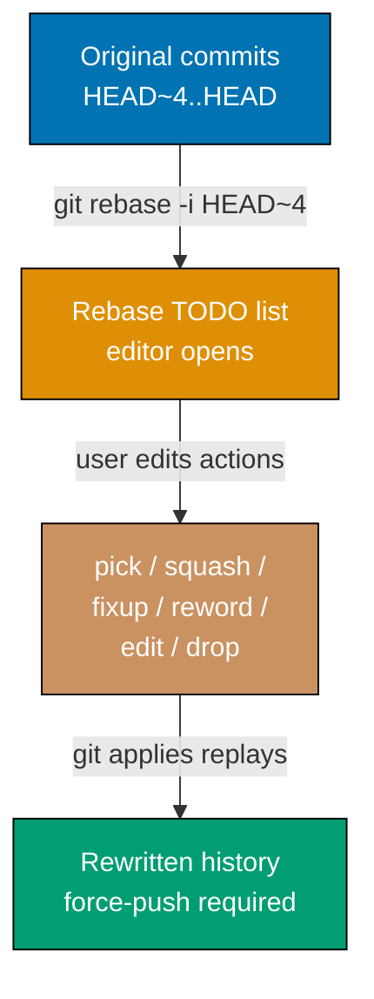

```bash
# Set up a scratch repository with four commits to rebase
git init /tmp/rebase-demo && cd /tmp/rebase-demo
# => Creates fresh repo at /tmp/rebase-demo

git commit --allow-empty -m "feat: base feature"
# => Commit A — the anchor commit we will NOT touch

git commit --allow-empty -m "wip: rough draft"
# => Commit B — will be squashed into the final message

git commit --allow-empty -m "fixup! rough draft"
# => Commit C — pure fixup, message will be discarded

git commit --allow-empty -m "typo in message"
# => Commit D — we want to reword this

git commit --allow-empty -m "dead end"
# => Commit E — we will drop it entirely

# Launch interactive rebase covering the last 4 commits (B, C, D, E)
# GIT_SEQUENCE_EDITOR lets us script what an editor would do interactively
GIT_SEQUENCE_EDITOR="sed -i \
  's/^pick \(.*\) wip.*/squash \1 wip: rough draft/; \
   s/^pick \(.*\) fixup.*/fixup \1 fixup! rough draft/; \
   s/^pick \(.*\) typo.*/reword \1 typo in message/; \
   s/^pick \(.*\) dead.*/drop \1 dead end/'" \
  git rebase -i HEAD~4
# => Actions applied in order:
# =>   squash B into A  — combines commit message, editor opens for combined message
# =>   fixup  C         — folds changes into squashed commit, discards C's message
# =>   reword D         — replays D then opens editor to fix the message
# =>   drop   E         — E is silently removed from history

git log --oneline
# => Output (example):
# =>   a1b2c3d feat: base feature
# =>   9f8e7d6 feat: combined wip work
# =>   3c4d5e6 fix: corrected message
```

**Key Takeaway**: Use `squash`/`fixup` to consolidate WIP commits, `reword` to fix bad messages, and `drop` to remove unwanted commits — always before pushing to a shared branch.

**Why It Matters**: Messy commit histories slow down `git bisect`, pollute `git blame`, and make code reviews harder. Interactive rebase lets individual developers clean their branch before it becomes permanent team history. Teams that enforce clean history through pre-merge squash policies (GitHub Squash and Merge, GitLab squash option) lower the average time to root-cause production regressions with `git bisect` from hours to minutes.

---

### Example 59: Interactive Rebase — `edit` to Amend a Mid-History Commit

The `edit` action pauses interactive rebase after replaying the selected commit, allowing you to stage additional changes or amend the commit message before the rebase continues. This is how you inject a forgotten file or fix a compilation error that was buried three commits ago.

```bash
# Prepare two commits, the first of which has a deliberate "mistake"
git init /tmp/edit-demo && cd /tmp/edit-demo
echo "version=1" > config.txt
git add config.txt
git commit -m "feat: add config"
# => Commit A — config.txt with version=1 (the "mistake" we'll fix)

echo "main logic" > main.sh
git add main.sh
git commit -m "feat: add main logic"
# => Commit B — depends on config.txt being correct

# Rebase the last 2 commits; mark commit A for `edit`
GIT_SEQUENCE_EDITOR="sed -i 's/^pick \(.*\) feat: add config/edit \1 feat: add config/'" \
  git rebase -i HEAD~2
# => Rebase pauses after replaying commit A
# => Git prints: "You can amend the commit now..."

# Rebase is now stopped at commit A — fix the "mistake"
echo "version=2" > config.txt
# => Overwrites config.txt with the corrected content

git add config.txt
# => Stages the corrected file for amendment

git commit --amend --no-edit
# => Folds the staged change into commit A without changing the message
# => Commit A now contains version=2

git rebase --continue
# => Replays commit B on top of the amended commit A
# => Final history: amended-A → B

git show HEAD~1:config.txt
# => Output: version=2
```

**Key Takeaway**: `edit` turns interactive rebase into a surgical mid-history amendment tool — pause, fix, amend, then let rebase replay the remaining commits automatically.

**Why It Matters**: Without `edit`, fixing a commit deep in history would require a new "fix old mistake" commit that obscures intent and complicates `git blame`. Amending history before a feature branch lands on `main` keeps blame annotations accurate, making future debugging faster and ensuring that every commit represents a coherent, reviewable unit of work.

---

## Git Worktree

### Example 60: Git Worktree — Parallel Working Directories

`git worktree add` creates an additional checkout of the same repository in a separate directory without cloning. Multiple worktrees share the same `.git` folder, so all branches, commits, and objects are instantly available in every working directory.

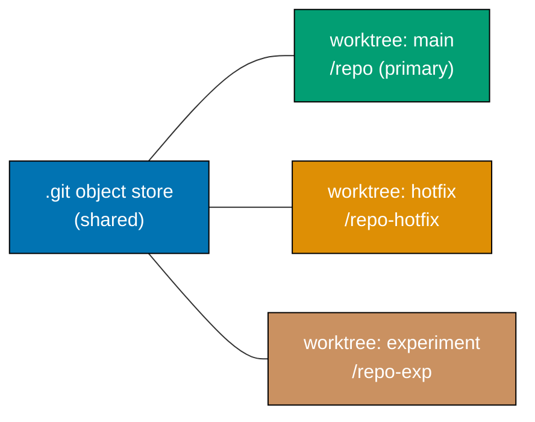

```bash
# Primary repository at ~/repo
cd ~/repo
# => Assume this repo has branches: main, hotfix/login, experiment/cache

# Add a linked worktree for the hotfix branch
git worktree add ../repo-hotfix hotfix/login
# => Creates /home/user/repo-hotfix/ with hotfix/login checked out
# => No full clone — same .git object store; disk usage ~= size of working tree only

# Add a worktree for a new experiment branch
git worktree add -b experiment/cache ../repo-exp main
# => Creates new branch experiment/cache from main
# => Checks it out at ../repo-exp

# List all worktrees
git worktree list
# => Output:
# =>   /home/user/repo       a1b2c3d [main]
# =>   /home/user/repo-hotfix 9f8e7d6 [hotfix/login]
# =>   /home/user/repo-exp   a1b2c3d [experiment/cache]

# Work in the hotfix worktree without leaving the main working directory
git -C ../repo-hotfix log --oneline -3
# => Shows commits on hotfix/login without cd

# Remove a worktree when done
git worktree remove ../repo-hotfix
# => Deletes the working tree directory and deregisters it
# => Branch hotfix/login still exists in the repository

git worktree prune
# => Removes stale worktree metadata if a directory was deleted manually
```

**Key Takeaway**: `git worktree` eliminates the need for multiple clones when you need to work on two branches simultaneously — all worktrees share the same objects, so there is no wasted disk space or network bandwidth.

**Why It Matters**: Developers frequently need to switch context mid-task — a production hotfix arrives while a feature is half-built. Without worktrees, the choices are stash/unstash (risks losing state), a full clone (wastes disk), or a Docker-based checkout (complex). Worktrees solve this in seconds and are especially valuable in CI/CD pipelines that need to build multiple branches in parallel on the same agent without cloning the full repository each time.

---

### Example 61: Git Worktree — Lock, Unlock, and Move

Long-lived worktrees risk accidental removal by `git worktree prune` or a teammate running cleanup scripts. `git worktree lock` marks a worktree as protected, and `git worktree move` relocates one without re-creating it from scratch.

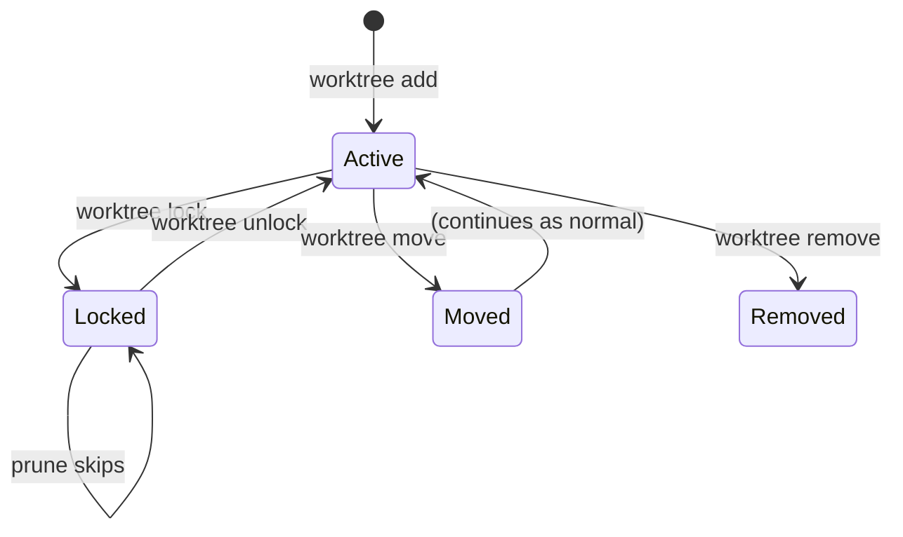

```bash
cd ~/repo

# Create a worktree for a long-running experiment
git worktree add ../repo-experiment experiment/ml-pipeline
# => Creates worktree at ../repo-experiment with experiment/ml-pipeline checked out

# Lock the worktree to prevent accidental removal
git worktree lock ../repo-experiment
# => Writes a lock file inside .git/worktrees/repo-experiment/locked
# => git worktree prune and git worktree remove will now refuse to touch it

# Verify lock status
git worktree list --porcelain
# => Output includes "locked" for the protected worktree:
# =>   worktree /home/user/repo-experiment
# =>   HEAD a1b2c3d
# =>   branch refs/heads/experiment/ml-pipeline
# =>   locked

# Lock with a reason (visible in list output and error messages)
git worktree lock --reason "Multi-week ML experiment — do not remove" ../repo-experiment
# => Updates the lock file with the reason string
# => git worktree remove will print: "fatal: working tree is locked, reason: Multi-week ML experiment"

# Attempt removal while locked — Git refuses
git worktree remove ../repo-experiment
# => fatal: working tree '../repo-experiment' is locked
# => Use 'unlock' to make it removable again

# Unlock when you are ready to clean up
git worktree unlock ../repo-experiment
# => Removes the lock file; worktree is now removable again

# Move a worktree to a new directory path
git worktree move ../repo-experiment ../experiments/ml-pipeline
# => Relocates the worktree directory and updates .git/worktrees metadata
# => No re-checkout needed — working tree contents are preserved as-is

git worktree list
# => Output:
# =>   /home/user/repo                       a1b2c3d [main]
# =>   /home/user/experiments/ml-pipeline    a1b2c3d [experiment/ml-pipeline]
```

**Key Takeaway**: `git worktree lock` protects long-lived worktrees from `prune` and `remove`; `git worktree move` relocates them without re-cloning. Always lock worktrees that will exist for more than a day.

**Why It Matters**: In shared CI environments and team workflows, automated cleanup scripts routinely run `git worktree prune` to reclaim disk space. Without locking, a multi-week experiment or a staging environment worktree can be silently deleted, losing uncommitted changes and disrupting in-progress work. The `--reason` flag documents intent so that teammates know why a worktree exists before they consider removing it manually. Move is essential when reorganizing project layouts — for instance, consolidating scattered worktrees under a single `~/experiments/` directory without losing state.

---

### Example 62: Git Worktree — Bare Repository Workflow

A bare repository has no primary working tree. Combined with `git worktree add`, this creates a workflow where every branch lives in its own dedicated directory — nothing is "special" or default. This pattern is popular in CI/CD systems and dotfile management.

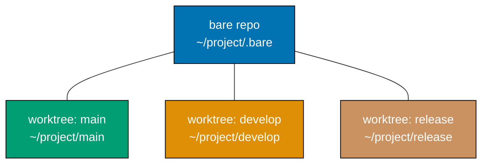

```bash
# Clone as bare — no working tree, just the object store
git clone --bare https://github.com/org/project.git ~/project/.bare
# => Creates ~/project/.bare/ containing only Git objects and refs
# => No files checked out — this is purely a data store

cd ~/project/.bare

# Tell Git to fetch all remote branches (bare clones default to only HEAD)
git config remote.origin.fetch "+refs/heads/*:refs/remotes/origin/*"
# => Ensures git fetch retrieves all branches, not just the default

git fetch origin
# => Fetches all remote branches into refs/remotes/origin/*

# Create a worktree for each branch you need
git worktree add ../main main
# => Creates ~/project/main/ with the main branch checked out

git worktree add ../develop develop
# => Creates ~/project/develop/ with the develop branch checked out

git worktree add ../release/v3 release/v3.0
# => Creates ~/project/release/v3/ with release/v3.0 checked out

# List all worktrees — the bare repo has no primary working tree
git worktree list
# => Output:
# =>   /home/user/project/.bare    (bare)
# =>   /home/user/project/main     a1b2c3d [main]
# =>   /home/user/project/develop  9f8e7d6 [develop]
# =>   /home/user/project/release/v3 3c4d5e6 [release/v3.0]

# Work in any directory independently — commits stay on their branch
cd ~/project/develop
echo "new feature" >> feature.txt && git add . && git commit -m "feat: add feature"
# => Commit recorded on develop; main and release worktrees are unaffected

# Clean up a worktree when a release branch is merged
cd ~/project/.bare
git worktree remove ../release/v3
# => Deletes the directory and deregisters the worktree
```

**Key Takeaway**: `git clone --bare` + `git worktree add` creates a flat directory layout where every branch has its own folder and no branch is privileged — ideal for CI agents and developers who work on multiple branches daily.

**Why It Matters**: CI/CD pipelines that build multiple branches in parallel traditionally clone the repository once per branch, wasting network bandwidth and disk space. A bare repository with worktrees eliminates redundant object downloads entirely — all branches share a single object store. Dotfile managers (such as bare-repo-based setups for `~/.dotfiles`) use this pattern to track home directory files without polluting `$HOME` with a `.git` folder. The bare worktree pattern also prevents the common mistake of accidentally committing to the wrong branch, since each directory is permanently bound to its branch.

---

### Example 63: Git Worktree — Practical Multi-Task Development

This example demonstrates a realistic development workflow: you are mid-feature when a production hotfix arrives. Instead of stashing, you create a worktree, fix the bug, run tests, merge, and return to your feature — all without losing any state.

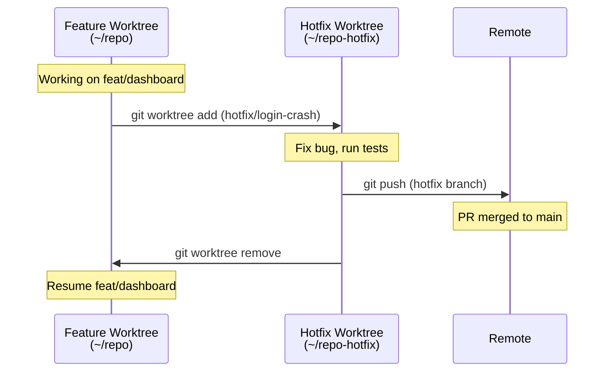

```bash
cd ~/repo
# => Currently on feat/dashboard with uncommitted work in progress

# Check current status — work in progress that you do not want to stash
git status
# => modified:   src/dashboard/chart.tsx
# => modified:   src/dashboard/filters.tsx
# => Working tree has changes; stashing risks losing context

# Create a hotfix worktree branching from main
git worktree add -b hotfix/login-crash ../repo-hotfix main
# => Creates new branch hotfix/login-crash from main
# => Checks it out at ../repo-hotfix
# => Your feat/dashboard working tree in ~/repo is completely untouched

# Fix the bug in the hotfix worktree
cd ../repo-hotfix
echo 'if (!session) return redirect("/login");' > src/auth/guard.ts
git add src/auth/guard.ts && git commit -m "fix: redirect to login on null session"
# => Commit recorded on hotfix/login-crash

# Run the test suite in the hotfix worktree
npm test
# => Tests pass — the fix is verified in isolation

# Push the hotfix and open a PR
git push -u origin hotfix/login-crash
# => Branch pushed; create PR from hotfix/login-crash → main

# Run tests in your feature worktree in parallel (from another terminal)
cd ~/repo
npm test
# => Feature tests run independently — no interference with hotfix worktree
# => Both test suites execute simultaneously using the same Git objects

# After the hotfix PR is merged, clean up
cd ~/repo
git worktree remove ../repo-hotfix
# => Deletes the hotfix directory and deregisters the worktree

# Update your feature branch with the fix from main
git fetch origin && git rebase origin/main
# => feat/dashboard now includes the hotfix; your WIP changes are preserved on top

git worktree list
# => Output:
# =>   /home/user/repo    a1b2c3d [feat/dashboard]
# => Only the primary worktree remains
```

**Key Takeaway**: Worktrees let you handle urgent interruptions without disrupting in-progress work — no stashing, no context loss, no re-cloning. Create a worktree, fix, push, remove, and resume.

**Why It Matters**: Context-switching is the largest source of lost developer productivity. Studies estimate that recovering full context after an interruption takes 15–25 minutes. `git stash` partially solves this but creates hidden state that developers forget to pop, leading to lost work and confusing merge conflicts. Worktrees eliminate these risks entirely: each task lives in its own directory with its own branch, node_modules, build cache, and editor state. Teams that adopt worktree-based workflows report fewer stash-related incidents and faster hotfix turnaround times because the developer never has to rebuild mental context for the original task — they simply `cd` back to where they left off.

---

## Git Bisect

### Example 64: Git Bisect — Manual Binary Search for a Regression

`git bisect` uses binary search to find the commit that introduced a bug. Git checks out the midpoint between a known-good and known-bad commit; you test and mark it good or bad, and Git narrows down to the culprit in O(log n) steps.

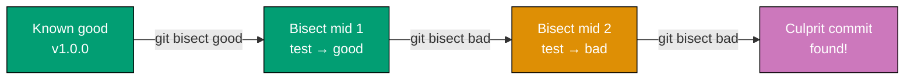

```bash
cd ~/repo
# => Start bisect session
git bisect start
# => Bisect mode enabled; HEAD is now detached during session

# Mark the current HEAD as bad (bug is present here)
git bisect bad
# => HEAD marked bad

# Mark a known-good commit (tag or SHA where bug did not exist)
git bisect good v1.0.0
# => Bisecting: ~N revisions left to test (roughly log2(N) steps)
# => Git checks out the midpoint commit automatically

# Test the checked-out commit (run your test suite or reproduce manually)
./run_tests.sh
# => If tests pass: mark good
git bisect good
# => Git checks out a new midpoint closer to HEAD

# If tests fail: mark bad
git bisect bad
# => Git checks out a new midpoint closer to v1.0.0

# Repeat until Git prints the culprit:
# => "<sha> is the first bad commit"
# =>   commit <sha>
# =>   Author: ...
# =>   Date:   ...

# Always end the session to restore HEAD
git bisect reset
# => Returns to the branch you started on
# => Working tree restored to pre-bisect state
```

**Key Takeaway**: Start `git bisect` with a known-good ref and a known-bad ref; mark each checkout good or bad until Git identifies the first bad commit in O(log n) tests.

**Why It Matters**: Manual regression hunting in large repositories with thousands of commits is impractical. Binary search reduces the problem from thousands of manual tests to a dozen. Teams that maintain automated test suites unlock the even more powerful automated bisect workflow, turning hours of debugging into a fully automated five-minute process that runs in CI without human intervention.

---

### Example 65: Git Bisect — Automated Binary Search with a Test Script

`git bisect run` executes a script at every bisect step, interpreting exit code 0 as good and non-zero as bad. Git automatically marks the commit and advances to the next midpoint, completing the entire search without human interaction.

```bash
cd ~/repo

# Create a simple test script that returns 0 if the bug is absent
cat > /tmp/test_regression.sh << 'EOF'
#!/usr/bin/env bash
# Build the project
make -s 2>/dev/null || exit 125
# => Exit 125 means "skip this commit" (unbuildable, not good or bad)

# Run the specific regression test
./test_login_flow
# => Returns 0 if test passes (good), non-zero if test fails (bad)
EOF
chmod +x /tmp/test_regression.sh
# => Script ready; exit 125 is special: tells bisect to skip the commit

# Start automated bisect
git bisect start
# => Session started

git bisect bad HEAD
# => HEAD is known bad

git bisect good v1.5.0
# => v1.5.0 is known good

git bisect run /tmp/test_regression.sh
# => Git calls /tmp/test_regression.sh at each midpoint automatically
# => Marks good/bad based on exit code
# => Output (example after ~7 steps):
# =>   3f2a1b0 is the first bad commit
# =>   commit 3f2a1b0
# =>   Author: dev@example.com
# =>   Date:   Mon Mar 10 09:12:33 2026 +0700
# =>
# =>       refactor: extract auth middleware
# =>
# =>   bisect run success

git bisect reset
# => Session ended; HEAD restored to original branch
```

**Key Takeaway**: `git bisect run <script>` fully automates regression hunting — provide a reproducible test and Git finds the culprit commit without manual intervention.

**Why It Matters**: Automated bisect is one of the highest-leverage debugging tools in software engineering. When integrated into a CI pipeline, a failing test can automatically trigger bisect against the last 1,000 commits, identifying the root cause commit within minutes of the regression being introduced. Projects like the Linux kernel use automated bisect routinely, reducing regression triage from days of manual code review to a precise single-commit attribution.

---

## Git Submodule

### Example 66: Git Submodule — Add, Clone, Update, foreach, deinit

Submodules embed a pinned reference to another Git repository inside your repository. The parent stores only the submodule's URL and commit SHA, not the submodule's files, keeping the parent repository lean.

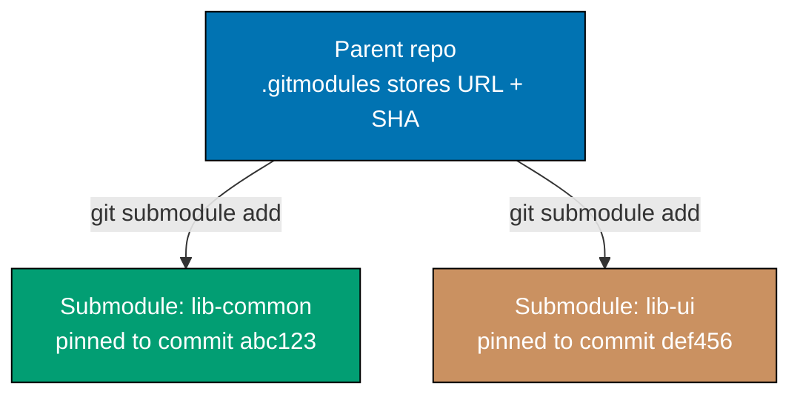

```bash
cd ~/main-project

# Add a submodule — clones the remote repo into vendor/lib-common
git submodule add https://github.com/example/lib-common vendor/lib-common
# => Clones lib-common HEAD into vendor/lib-common/
# => Creates/updates .gitmodules with [submodule "vendor/lib-common"] entry
# => Stages both .gitmodules and vendor/lib-common (the pinned SHA)

git commit -m "chore: add lib-common submodule"
# => Commits the .gitmodules file and the gitlink (SHA pointer)

# Clone a repo that already has submodules — without --recurse they appear empty
git clone https://github.com/example/main-project ~/cloned-project
cd ~/cloned-project

git submodule update --init --recursive
# => Initialises submodule config from .gitmodules
# => Clones each submodule at the pinned SHA
# => --recursive handles nested submodules (submodules of submodules)

# Update all submodules to their latest remote HEAD
git submodule update --remote --merge
# => Fetches each submodule's remote tracking branch
# => Merges remote changes into the local submodule checkout
# => Parent repo now has unstaged changes showing new SHAs

# Run a command in every submodule at once
git submodule foreach 'git log --oneline -1'
# => Iterates over each submodule, running the quoted command
# => Output: one-line log for each submodule

# Remove a submodule cleanly
git submodule deinit vendor/lib-common
# => Clears the submodule's local config from .git/config
# => Working tree directory vendor/lib-common is emptied

git rm vendor/lib-common
# => Removes the gitlink entry and the directory from index

rm -rf .git/modules/vendor/lib-common
# => Deletes the cached submodule repository inside .git/modules

git commit -m "chore: remove lib-common submodule"
# => Commits the removal
```

**Key Takeaway**: Submodules pin a dependency to an exact commit SHA; always use `git submodule update --init --recursive` after cloning and `deinit` + `git rm` + `rm -rf .git/modules/<name>` to remove one cleanly.

**Why It Matters**: Submodules enable large organizations (Google, Microsoft) to share versioned internal libraries across hundreds of repositories without publishing packages to a registry. The tradeoff is operational complexity: contributors who forget `--recurse-submodules` on clone end up with empty directories that cause confusing build failures. Teams should document submodule workflows clearly and consider `git clone --recurse-submodules` as the standard clone command in their README.

---

## Git Subtree

### Example 67: Git Subtree — Embed and Split a Project

`git subtree` merges an entire external repository into a subdirectory of your project, or extracts a subdirectory into a standalone branch — without any special metadata files. Contributors who don't know about subtrees can work normally; only the maintainer needs to know the subtree commands.

```bash
cd ~/main-project

# Add a remote for the library we want to embed
git remote add lib-common https://github.com/example/lib-common
# => Registers lib-common as a named remote (no files downloaded yet)

git fetch lib-common
# => Downloads lib-common's objects and refs

# Merge lib-common's main branch as a subdirectory
git subtree add --prefix vendor/lib-common lib-common main --squash
# => Squashes lib-common's entire history into a single merge commit
# => Copies all lib-common files into vendor/lib-common/
# => No .gitmodules, no special metadata — just files in your tree

# Later: pull upstream changes into the embedded subtree
git subtree pull --prefix vendor/lib-common lib-common main --squash
# => Fetches lib-common main and merges new commits into vendor/lib-common/
# => Creates a new squash merge commit in your repo

# Push local changes made in vendor/lib-common back upstream
git subtree push --prefix vendor/lib-common lib-common main
# => Extracts commits that touched vendor/lib-common/
# => Pushes them to lib-common's main branch as if they originated there

# Split the subdirectory into a standalone branch (useful for extracting to new repo)
git subtree split --prefix vendor/lib-common -b lib-common-extracted
# => Creates branch lib-common-extracted containing ONLY commits that
# =>   touched vendor/lib-common/, rewritten without the prefix
# => Output: SHA of the new branch tip

git log lib-common-extracted --oneline -5
# => Shows the extracted commits without vendor/lib-common/ prefix in paths
```

**Key Takeaway**: `git subtree add` merges an external repo into a subdirectory; `git subtree pull/push` sync changes bidirectionally; `git subtree split` extracts a subdirectory's history to a standalone branch — all without special metadata.

**Why It Matters**: Subtrees solve the same dependency problem as submodules but with a much lower operational cost: contributors need no special commands, cloning just works, and the history is fully self-contained. The tradeoff is repository size (the embedded project's files live in your repo) and slower `git log` on large embeddings. Most teams prefer subtrees for small internal dependencies that change infrequently.

---

## History Rewriting

### Example 68: `git filter-repo` — Rewrite Repository History

`git filter-repo` is the modern replacement for the deprecated `git filter-branch`. It rewrites history by replaying every commit through a set of filters, producing a new parallel history. Common uses: remove accidentally committed secrets, strip large binary blobs, or split a monorepo.

```bash
# Install git-filter-repo (not bundled with Git)
pip install git-filter-repo
# => Installs the Python script; git filter-repo is now available

cd ~/compromised-repo

# Remove a file containing a secret from ALL history
git filter-repo --path secrets.env --invert-paths
# => --path secrets.env     — selects commits touching secrets.env
# => --invert-paths         — keeps everything EXCEPT secrets.env
# => Rewrites every commit; new SHAs generated for all rewritten commits
# => secrets.env is now absent from all history, including unreachable commits

# Remove a specific string (e.g., an API key) from all file contents
git filter-repo --replace-text <(echo "REPLACE:sk-prod-12345:REMOVED_SECRET")
# => Scans every blob in history for "sk-prod-12345"
# => Replaces occurrences with "REMOVED_SECRET" in-place across all commits

# Strip all files larger than 10 MB from history (clean up accidental binary commits)
git filter-repo --strip-blobs-bigger-than 10M
# => Removes blob objects > 10 MB from all commits
# => Useful before migrating to LFS or reducing clone size

# Rename a directory across all history (repo restructuring)
git filter-repo --path-rename src/old-name/:src/new-name/
# => Every commit that touched src/old-name/ now shows src/new-name/

# After rewriting, force-push to remote
git push origin --force --all
git push origin --force --tags
# => CAUTION: all collaborators must re-clone or hard-reset
# => Coordinate with team and rotate any exposed secrets immediately
```

**Key Takeaway**: Use `git filter-repo --path <file> --invert-paths` to purge a sensitive file from all history, then force-push and rotate the exposed secret immediately.

**Why It Matters**: Accidentally committed secrets are a leading cause of cloud account compromises. A single AWS key committed to a public repository can be harvested by automated scanners within minutes. `git filter-repo` is 10-100x faster than `git filter-branch` (which is deprecated) and produces cleaner results. After rewriting, the old commits become unreachable but remain in everyone's clones until GC; a coordinated re-clone and secret rotation is mandatory.

---

## Git Rerere

### Example 69: Git Rerere — Record and Reuse Conflict Resolutions

`rerere` (reuse recorded resolution) records how you resolved a merge conflict and automatically applies the same resolution if the identical conflict appears again. This is invaluable for long-running feature branches that repeatedly rebase over the same contested area.

```bash
cd ~/project

# Enable rerere globally
git config --global rerere.enabled true
# => Activates automatic recording of conflict resolutions
# => Git creates .git/rr-cache/ to store resolution records

# Simulate a repeated rebase workflow
git checkout -b feature/large-refactor main
# => Start a long-lived feature branch

# Perform a rebase (conflicts will be recorded)
git rebase main
# => If conflicts arise in file.go:
# =>   - Git writes conflict markers into file.go
# =>   - rerere records the conflict's "fingerprint" (SHA of the conflict diff)

# Resolve the conflict manually
vim file.go
# => Edit file.go to remove conflict markers and choose correct content

git add file.go
# => Stage the resolved file; rerere records this resolution in .git/rr-cache/

git rebase --continue
# => Rebase proceeds with the resolution applied

# Next rebase — same conflict appears (main added more commits to same area)
git rebase main
# => Git detects the identical conflict fingerprint in .git/rr-cache/
# => Output: "Resolved 'file.go' using previous resolution."
# => file.go is automatically resolved — no manual editing needed

git rerere diff
# => Shows what rerere would apply (before staging)
# => Useful for reviewing auto-applied resolutions before committing

git rerere forget file.go
# => Discards the stored resolution for file.go
# => Use this if the stored resolution is wrong or stale
```

**Key Takeaway**: Enable `rerere.enabled = true` globally; once you resolve a conflict Git records it, and identical future conflicts in rebases or merges resolve automatically without manual intervention.

**Why It Matters**: Long-lived feature branches that track a fast-moving main branch accumulate repeated rebases. Without rerere, each rebase requires manually resolving the same conflict dozens of times. Rerere is standard practice on large projects like the Linux kernel, where maintainers merge hundreds of trees and regularly encounter the same conflict regions. Enabling it early in a project costs nothing and saves significant developer time over the project's lifetime.

---

## Git Notes

### Example 70: Git Notes — Attach Metadata Without Altering Commits

Git notes attach arbitrary text to a commit object without changing the commit's SHA. Notes live in a separate ref (`refs/notes/commits` by default) and can be pushed to and fetched from remotes independently. They are ideal for storing CI results, code review outcomes, or deployment records alongside commits.

```bash
cd ~/project

# Add a note to the latest commit
git notes add -m "CI: all 342 tests passed on 2026-03-20; coverage 94.7%" HEAD
# => Creates a note object linked to HEAD's SHA
# => HEAD's SHA is unchanged — notes are stored separately

# View the note
git log --show-notes -1
# => Output:
# =>   commit a1b2c3d...
# =>   Author: ...
# =>   Notes:
# =>       CI: all 342 tests passed on 2026-03-20; coverage 94.7%

# Append to an existing note (does not replace)
git notes append -m "Deployed to staging 2026-03-20 14:00 WIB" HEAD
# => Appends text to the existing note for HEAD

# List all annotated commits
git notes list
# => Output: <note-sha> <commit-sha> for each annotated commit

# Push notes to remote (notes are NOT pushed with git push by default)
git push origin refs/notes/commits
# => Explicitly pushes the notes ref to origin

# Fetch notes from remote
git fetch origin refs/notes/commits:refs/notes/commits
# => Fetches remote notes into local refs/notes/commits

# Remove a note
git notes remove HEAD
# => Deletes the note for HEAD; commit SHA remains unchanged

# Use a custom namespace to avoid collision with other tools
git notes --ref=review add -m "LGTM: approved by alice@example.com" HEAD
# => Stores note in refs/notes/review instead of refs/notes/commits
```

**Key Takeaway**: `git notes add -m "..."` attaches metadata to a commit without altering its SHA; push and fetch notes explicitly with `refs/notes/commits` since they do not transfer with regular pushes.

**Why It Matters**: Many CI/CD and code-review tools need to annotate commits with build results, test coverage, or approval status without creating a new commit or modifying history. Git notes provide a first-class mechanism for this. GitHub and GitLab do not display notes in their UIs by default, so notes are best suited for tooling that fetches them programmatically, such as internal dashboards or compliance audit pipelines.

---

## Git Bundle

### Example 71: Git Bundle — Offline Transfer of Repository Data

`git bundle` packages a set of Git objects and refs into a single file. This file can be transported on a USB drive, email, or any medium and then applied to another repository. Bundles are essential for air-gapped environments or for bootstrapping repositories on machines with no network access.

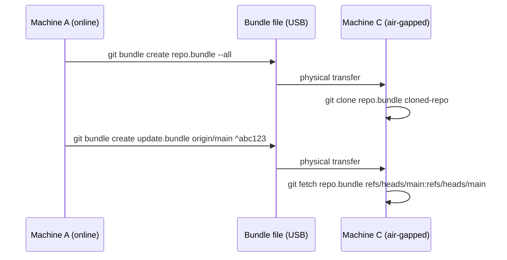

```bash
# On machine A: create a full bundle of the entire repository
cd ~/source-repo
git bundle create /media/usb/full-repo.bundle --all
# => Packs ALL objects and refs (branches, tags) into a single file
# => /media/usb/full-repo.bundle is a portable binary file
# => File size ≈ equivalent to a bare clone

# On machine C (air-gapped): clone from the bundle
git clone /media/usb/full-repo.bundle ~/cloned-repo
# => Exactly like cloning from a remote URL — full history available
cd ~/cloned-repo
git log --oneline -3
# => Shows commits from the bundled repo

# Later: create an incremental bundle (only new commits since last bundle)
# On machine A: note the SHA of the last bundled tip
LAST_TIP=$(git rev-parse v2.0.0)
# => LAST_TIP = SHA of the last-transferred commit

git bundle create /media/usb/update.bundle main ^$LAST_TIP
# => ^ prefix means "exclude commits reachable from $LAST_TIP"
# => Bundle contains only commits after v2.0.0 on main
# => Much smaller file than a full bundle

# On machine C: apply the incremental bundle
cd ~/cloned-repo
git fetch /media/usb/update.bundle refs/heads/main:refs/heads/main
# => Imports new commits from the bundle
# => Updates local main branch to include the new commits

# Verify a bundle is valid before transferring
git bundle verify /media/usb/update.bundle
# => Checks prerequisites (commit SHAs the bundle depends on) are present
# => Output: "The bundle records a complete history" or lists missing prereqs
```

**Key Takeaway**: `git bundle create <file> --all` produces a portable single-file repository snapshot; incremental bundles with `^<sha>` ship only new commits; `git bundle verify` confirms the target repo can receive it.

**Why It Matters**: Defence, banking, and industrial sectors operate networks physically isolated from the internet. Git bundles are the standard mechanism for delivering code updates, patches, and vendor libraries into these environments. Many organisations also use bundles for bootstrapping developer laptops on secure networks where cloning from GitHub is blocked by firewall policy.

---

## Git Archive

### Example 72: Git Archive — Export Clean Source Snapshots

`git archive` exports a snapshot of a tree — a branch, tag, or commit — into a tarball or zip without any `.git` metadata. The result is a clean, deployment-ready source distribution identical to what a release tarball on GitHub's releases page contains.

```bash
cd ~/project

# Export the HEAD of main as a tar.gz
git archive --format=tar.gz --prefix=myapp-1.0/ -o /tmp/myapp-1.0.tar.gz main
# => --format=tar.gz    — output format (tar, tar.gz, zip)
# => --prefix=myapp-1.0/ — prepend this directory name to all paths in the archive
# => -o /tmp/...        — write output to this file (default: stdout)
# => main               — the tree-ish to export (branch, tag, or SHA)
# => Result: /tmp/myapp-1.0.tar.gz with no .git/ directory inside

# Export a specific tag as a zip
git archive --format=zip -o /tmp/myapp-v2.3.zip v2.3
# => Exports the tree at tag v2.3 as a zip file
# => Suitable for distribution to users who need source but not history

# Export only a subdirectory
git archive --format=tar.gz --prefix=docs/ -o /tmp/docs-snapshot.tar.gz HEAD:docs/
# => HEAD:docs/ selects the docs/ subtree at HEAD
# => Useful for shipping documentation separately from source

# Stream to stdout and pipe to ssh for remote extraction
git archive --format=tar HEAD | ssh deploy@server 'tar -xf - -C /opt/app/'
# => Streams archive over SSH and extracts in place
# => Fast deployment without uploading a file first

# Verify the archive contents without extracting
git archive --format=tar HEAD | tar -t | head -20
# => Lists the first 20 paths in the archive without writing to disk
```

**Key Takeaway**: `git archive --format=tar.gz --prefix=name/ -o file.tar.gz <tree-ish>` exports a clean snapshot without `.git` metadata; pipe to SSH for zero-file remote deployment.

**Why It Matters**: Release tarballs and deployment packages must not contain `.git/` directories, which leak commit history, author emails, and internal branch names to end users. `git archive` produces reproducible snapshots: the same commit always produces byte-identical output (given the same Git version), which enables cryptographic signing and verification of release artefacts — a requirement for software supply chain security (SLSA compliance).

---

## Sparse Checkout

### Example 73: Git Sparse-Checkout — Check Out Only a Subdirectory

Sparse checkout allows you to work with a subset of the working tree, leaving the rest untracked locally. In a monorepo where you only own one service, sparse checkout dramatically reduces disk usage and improves command performance.

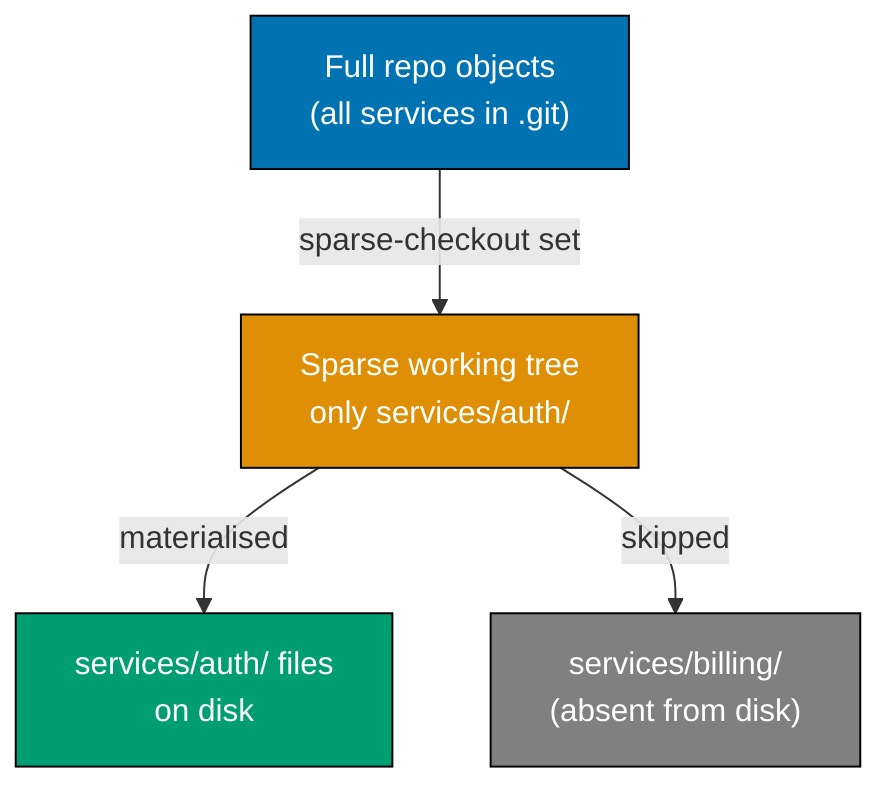

```bash
# Clone a large monorepo with only the sparse-checkout stub (no working tree yet)
git clone --filter=blob:none --sparse https://github.com/example/monorepo ~/sparse-repo
# => --filter=blob:none — partial clone: downloads commits/trees but defers blobs
# => --sparse           — initialises sparse-checkout with only the root checked out
# => Result: ~/sparse-repo/ contains only root-level files, services/ is absent

cd ~/sparse-repo

# Enable cone mode (recommended — uses prefix matching, much faster than pattern mode)
git sparse-checkout init --cone
# => Activates cone mode; only root-level files and explicitly listed directories appear

# Add a specific service directory to the sparse set
git sparse-checkout set services/auth
# => Downloads blobs for services/auth/ and materialises the directory
# => All other service directories remain absent from the working tree

# Add another directory without replacing the current set
git sparse-checkout add services/shared-libs
# => Adds services/shared-libs/ to the sparse set
# => services/auth/ remains materialised

# List the currently active sparse paths
git sparse-checkout list
# => Output:
# =>   services/auth
# =>   services/shared-libs

# Disable sparse checkout (restore full working tree)
git sparse-checkout disable
# => Materialises all files; working tree is now complete
# => Use when you need to work across the entire monorepo temporarily
```

**Key Takeaway**: `git clone --filter=blob:none --sparse` combined with `git sparse-checkout set <path>` gives you a partial clone that only materialises the directories you need, reducing checkout time and disk usage proportionally.

**Why It Matters**: At companies like Google, Meta, and Microsoft, monorepos contain millions of files. A full checkout would consume hundreds of gigabytes and take hours. Sparse checkout combined with partial clone (VFS for Git at Microsoft, Google's CitC) makes these repositories practical for individual developers by ensuring you only ever fetch and materialise files you actually work with. GitHub and GitLab now support partial clone server-side, making this technique available to any organisation without custom infrastructure.

---

## Git Maintenance

### Example 74: Git Maintenance — Automated Background Repository Optimization

`git maintenance` schedules background optimisation tasks (repacking, commit-graph updates, loose-object prefetching) that keep a large repository fast without manual intervention. It replaces the old `git gc` scheduled workflow.

```bash
cd ~/project

# Register the current repository for scheduled maintenance
git maintenance start
# => Creates platform-specific scheduled job entries:
# =>   Linux/macOS: cron jobs via crontab
# =>   Windows: Task Scheduler entries
# => Schedules four tasks at different intervals:
# =>   hourly:  prefetch (fetch all remotes in background)
# =>   daily:   loose-objects GC (pack loose objects)
# =>   daily:   incremental-repack (pack incremental object packs)
# =>   weekly:  gc (full garbage collection)
# =>   weekly:  commit-graph (write commit-graph for faster log/merge-base)

# Run a specific maintenance task immediately
git maintenance run --task=commit-graph
# => Writes/updates .git/objects/info/commit-graph
# => Speeds up git log --graph, git merge-base, and reachability queries

git maintenance run --task=incremental-repack
# => Creates a new pack file for recently added loose objects
# => Does NOT delete old packs (safe, non-disruptive)

git maintenance run --task=loose-objects
# => Packs loose objects into a pack file
# => Removes loose object files that are now packed

git maintenance run --task=prefetch
# => Fetches all configured remotes into FETCH_HEAD
# => Future git fetch commands complete faster (most work already done)

# Stop scheduled maintenance for this repository
git maintenance stop
# => Removes the cron/Task Scheduler entries for this repo
# => Does not affect other registered repositories

# Check current maintenance configuration
git config --list | grep maintenance
# => Output: maintenance.repo=/home/user/project
# =>         maintenance.strategy=incremental
```

**Key Takeaway**: `git maintenance start` registers your repository for automated background optimisation — commit-graph, loose-object packing, and incremental repacking — eliminating the need to manually run `git gc`.

**Why It Matters**: As repositories grow, operations like `git log --graph`, `git merge-base`, and even `git status` degrade without periodic maintenance. The old recommendation of running `git gc` manually is forgotten by most developers. `git maintenance` solves this by scheduling smart, incremental tasks that run in the background during idle time, keeping clone and fetch operations fast without the disruptive pauses caused by a full `git gc` mid-session.

---

## Git Object Model

### Example 75: The Git Object Model — Blobs, Trees, Commits, Tags

Every piece of data Git stores is one of four immutable object types: blobs (file contents), trees (directory listings), commits (snapshots with metadata), and tags (named pointers with optional metadata). All four are content-addressable: their SHA-1 (or SHA-256 in modern Git) is the hash of their content.

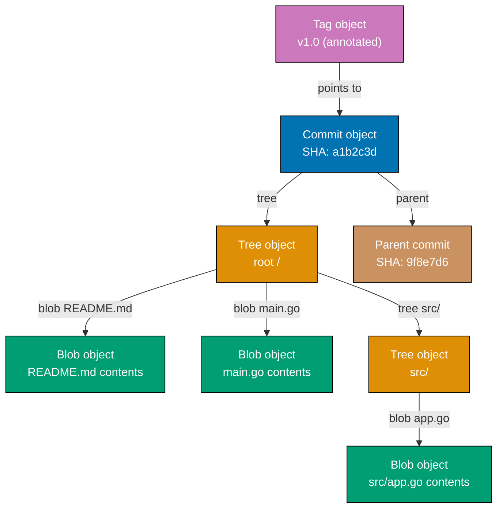

```bash
cd ~/project && git log --oneline -1
# => a1b2c3d feat: add main.go

# Inspect a commit object
git cat-file -p HEAD
# => Output:
# =>   tree 7d8e9f0a1b2c3d4e5f6a7b8c9d0e1f2a3b4c5d6e
# =>   parent 9f8e7d6...
# =>   author  Dev <dev@example.com> 1710912000 +0700
# =>   committer Dev <dev@example.com> 1710912000 +0700
# =>
# =>   feat: add main.go

# Inspect the root tree object referenced by the commit
git cat-file -p HEAD^{tree}
# => Output:
# =>   100644 blob 3b4c5d... README.md
# =>   100644 blob 6e7f8a... main.go
# =>   040000 tree 9c0d1e... src

# Inspect a blob (file content)
git cat-file -p HEAD:README.md
# => Output: raw contents of README.md at HEAD (no trailing newline added)

# Show the type of an object
git cat-file -t HEAD
# => Output: commit

git cat-file -t HEAD^{tree}
# => Output: tree

git cat-file -t HEAD:README.md
# => Output: blob

# Show the size of an object in bytes
git cat-file -s HEAD:README.md
# => Output: 42 (bytes)

# Create a raw blob object manually
echo "hello world" | git hash-object --stdin -w
# => Output: 3b18e512dba79e4c8300dd08aeb37f8e728b8dad
# => --stdin reads from stdin; -w writes the object to .git/objects/
# => SHA is the SHA-1 of "blob 12\0hello world\n"
```

**Key Takeaway**: The Git object store contains four types — blob, tree, commit, tag — all content-addressed by SHA; `git cat-file -p <sha>` reveals any object's raw content, and `git cat-file -t <sha>` reveals its type.

**Why It Matters**: Understanding the object model explains Git's core guarantees: immutability (SHA is derived from content, so changing a commit changes its SHA and all descendant SHAs), deduplication (identical file contents share a single blob regardless of path or branch), and integrity (a corrupted object produces a SHA mismatch). Engineers who understand the model can debug confusing Git behaviour (detached HEAD, ref conflicts, GC removing objects) without resorting to destructive commands.

---

### Example 76: Packfiles and `git gc` — How Git Compresses Object Storage

Git initially stores each object as a loose file. `git gc` (garbage collection) combines loose objects into binary packfiles and uses delta compression to store similar objects as a base blob plus a diff, dramatically reducing storage and improving clone performance.

```bash
cd ~/project

# Show current object storage state
git count-objects -v
# => Output:
# =>   count:          234     <- loose objects
# =>   size:           1024    <- loose objects size in KiB
# =>   in-pack:        12453   <- objects already in packfiles
# =>   packs:          2       <- number of packfiles (.pack files)
# =>   size-pack:      3840    <- packfile size in KiB
# =>   prune-packable: 0       <- loose objects also in packs (to prune)
# =>   garbage:        0       <- files in .git/objects with invalid names

# List pack files
ls .git/objects/pack/
# => Output:
# =>   pack-a1b2c3d4e5f6...idx    <- index file for fast SHA lookup
# =>   pack-a1b2c3d4e5f6...pack   <- binary pack file containing compressed objects

# Run garbage collection: pack loose objects, prune unreachable commits
git gc
# => Packs 234 loose objects into a new pack file
# =>   Uses delta compression: similar blobs stored as base + diff
# => Prunes objects unreachable for >2 weeks (default grace period)
# => Repacks small packs into fewer larger packs
# => Output: "Compressing objects: 100% (234/234), done."

# Aggressive GC: re-delta-compress all existing pack files
git gc --aggressive
# => Re-examines all objects for better delta base candidates
# => Produces smaller packs at the cost of significant CPU time
# => Use once after major history rewriting (filter-repo) not routinely

# Show packfile contents
git verify-pack -v .git/objects/pack/pack-*.idx | head -5
# => Shows each object: SHA, type, size, compressed-size, offset, depth, base-SHA
# => depth > 0 means the object is stored as a delta of the base at base-SHA

# Check repository integrity (verify all object SHAs)
git fsck
# => Traverses all reachable objects and verifies SHA checksums
# => Output: "Checking connectivity: done." if no corruption
# => Reports dangling commits (unreachable but not yet pruned)
```

**Key Takeaway**: Git starts with loose objects; `git gc` packs them into delta-compressed packfiles, and `git fsck` verifies all stored SHA checksums — together they ensure compact and correct object storage.

**Why It Matters**: A repository that never runs GC accumulates thousands of loose object files, degrading file-system performance on operations like `git status` and slowing down fetches. Modern Git runs GC automatically when the loose object count exceeds a threshold, but understanding packfiles helps diagnose unexpectedly large repository sizes. After running `git filter-repo` to rewrite history, the old objects remain as unreachable loose objects; `git gc --prune=now` immediately removes them, visibly shrinking the `.git` directory.

---

## Shallow and Partial Clones

### Example 77: Shallow Clone and Partial Clone — Fast CI Checkouts

Shallow clones (`--depth N`) and partial clones (`--filter=blob:none` or `--filter=tree:0`) dramatically reduce the data transferred during `git clone`, making CI/CD pipeline checkout steps seconds instead of minutes on large repositories.

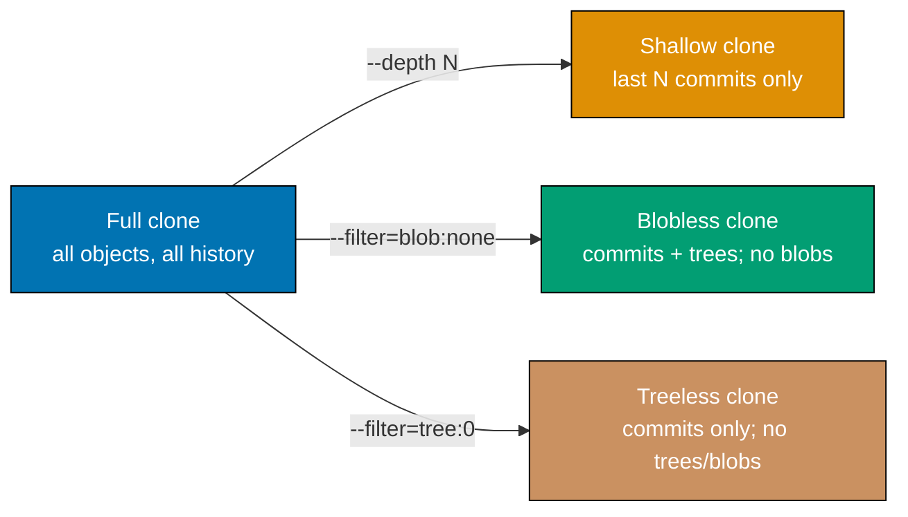

```bash
# Shallow clone: download only the last 1 commit (CI build-only checkout)
git clone --depth 1 https://github.com/example/large-repo ~/shallow-repo
# => Transfers only the latest commit + its tree + required blobs
# => No history; grafts mark the shallow boundary
# => git log shows only 1 commit

cd ~/shallow-repo
git log --oneline
# => Output: a1b2c3d feat: latest feature  (only 1 commit visible)

# Deepen a shallow clone by N more commits when you need more history
git fetch --deepen=10
# => Fetches 10 more ancestor commits, extending the visible history to 11

# Convert shallow clone to full history
git fetch --unshallow
# => Downloads complete history; clone becomes equivalent to a full clone

# Blobless partial clone: fetch commits + trees, defer blobs until needed
git clone --filter=blob:none https://github.com/example/large-repo ~/blobless-repo
# => Downloads all commits and tree objects immediately
# => Blob objects are fetched on-demand when you read a file (e.g., git checkout, git show)
# => git log, git diff --name-only work without fetching blobs
# => Best balance for developer workstations needing full history but quick clone

# Treeless partial clone: fetch only commits, defer trees and blobs
git clone --filter=tree:0 https://github.com/example/large-repo ~/treeless-repo
# => Downloads only commit objects immediately
# => Trees and blobs fetched on-demand when you access a working tree path
# => Fastest initial clone; best for CI that only reads specific paths

# Verify filter is still active
git config --local remote.origin.partialclonefilter
# => Output: blob:none  (filter applied to future fetches)
```

**Key Takeaway**: Use `--depth 1` for CI build-only checkouts where history is irrelevant; use `--filter=blob:none` for developer clones that need full history but want a fast initial clone.

**Why It Matters**: GitHub reports that the average clone of a large monorepo takes 15-30 minutes with a full clone. Shallow clones reduce CI checkout time to under 30 seconds for most projects, directly reducing compute costs and developer feedback loop time. Blobless clones are the recommended default for developer machines at companies like GitHub itself, where they reduced internal clone times by 90% while preserving full `git log` and `git blame` functionality.

---

## Git LFS

### Example 78: Git LFS — Storing Large Binary Files Outside the Object Store

Git LFS (Large File Storage) replaces large binary files in the repository with small text pointer files. The actual binary content is stored on a dedicated LFS server. Regular Git commands work transparently — LFS handles upload/download automatically.

```bash
# Install Git LFS (one-time per machine)
git lfs install
# => Installs the LFS credential helper and smudge/clean filter hooks globally
# => Output: "Git LFS initialized."

cd ~/project

# Track all PNG files with LFS
git lfs track "*.png"
# => Appends to .gitattributes: *.png filter=lfs diff=lfs merge=lfs -text
# => All future *.png additions will be stored in LFS

git lfs track "*.zip" "*.iso" "*.mp4"
# => Track additional binary types
# => .gitattributes is updated with filter=lfs for each pattern

# Commit .gitattributes so team members use the same LFS rules
git add .gitattributes
git commit -m "chore: configure Git LFS tracking for binary assets"
# => .gitattributes is stored as a normal Git blob (not in LFS)

# Add a large PNG — LFS handles it transparently
cp ~/design/hero.png assets/hero.png
git add assets/hero.png
# => Git runs the LFS clean filter: uploads hero.png to LFS server
# => Stores a 130-byte pointer file in the Git object store instead of the binary

git commit -m "feat: add hero image"
git push origin main
# => Pushes the pointer file (tiny) and the LFS object (large binary) separately
# => LFS objects are batch-uploaded to the LFS endpoint before the push completes

# Inspect the pointer file
git cat-file -p HEAD:assets/hero.png
# => Output:
# =>   version https://git-lfs.github.com/spec/v1
# =>   oid sha256:4b3a2e1d...
# =>   size 2048576

# List all tracked LFS files and their sizes
git lfs ls-files
# => Output: 4b3a2e1d * assets/hero.png

# Clone without downloading LFS objects (get pointers only)
GIT_LFS_SKIP_SMUDGE=1 git clone https://github.com/example/project ~/no-lfs
# => Clones repository with pointer files instead of binary content
# => Useful in CI when large assets are not needed for the build
```

**Key Takeaway**: `git lfs track "*.png"` stores binary files as pointer stubs in Git and actual content in LFS storage; `GIT_LFS_SKIP_SMUDGE=1` skips LFS downloads for CI jobs that do not need the binaries.

**Why It Matters**: Committing large binary files directly to Git inflates repository size exponentially — a 100 MB asset added and later deleted still occupies 100 MB in every clone forever. LFS solves this by keeping the Git object store small while retaining the ability to check out any historical version of the binary. GitHub, GitLab, and Bitbucket all offer LFS storage tiers, and most CI/CD platforms natively support LFS-aware cloning.

---

## Advanced Merge Strategies

### Example 79: Advanced Merge Strategies — Octopus, Recursive with Options, and Ours

Git's `-s` flag selects the merge strategy and `-X` passes strategy-specific options. The default `ort`/`recursive` strategy works for most cases, but `octopus` enables multi-branch merges and `ours` discards the other branch's changes entirely.

```bash
cd ~/project

# Octopus merge: merge multiple branches simultaneously
git checkout main
git merge feature/api feature/ui feature/docs
# => Uses the octopus strategy automatically when merging 3+ branches
# => Creates a single merge commit with 3 parents
# => FAILS if any conflicts arise — octopus does not handle conflicts
# => Best for independent branches with no overlapping file changes

git log --oneline --graph -4
# => Output:
# =>   *   a1b2c3d Merge branches 'feature/api', 'feature/ui', 'feature/docs'
# =>   |\\ \\
# =>   | | * d4e5f6 feat: docs updates
# =>   | * | b7c8d9 feat: ui changes
# =>   | |/
# =>   * / e0f1a2 feat: api changes
# =>   |/
# =>   * 9b0c1d base commit

# Recursive strategy with "ours" option: prefer our side on conflict
git merge -s recursive -X ours feature/conflicting-refactor
# => Uses recursive strategy (default for two-branch merge)
# => -X ours: on any conflict, automatically take OUR version of the file
# => Does NOT discard the other branch — just resolves conflicts in our favour
# => Merge commit still records both parents

# "Ours" strategy (different from -X ours): discard the other branch entirely
git merge -s ours old/deprecated-feature
# => Creates a merge commit but uses our current tree AS IS
# => All changes from old/deprecated-feature are silently discarded
# => Useful to mark a branch as "merged" without actually applying its changes
# => The branch will not appear as unmerged in future merges

# Theirs option: prefer the other branch on conflict (no -s theirs strategy, use -X theirs)
git merge -s recursive -X theirs feature/upstream-sync
# => Resolves all conflicts by taking THEIR version
# => Used when syncing with an upstream that you trust completely

git log --oneline --graph -3
# => Shows merge commit with both parents recorded
```

**Key Takeaway**: Use `octopus` for merging independent branches simultaneously; use `-X ours` or `-X theirs` to auto-resolve conflicts in one direction; use `-s ours` to record a merge commit without applying any changes.

**Why It Matters**: Octopus merges appear in the Linux kernel's release commits, where Linus Torvalds regularly merges 10-20 subsystem trees into a single merge commit. The `-s ours` strategy is critical for maintaining long-lived release branches: when a security patch is already applied differently on a release branch, merging with `-s ours` marks the security branch as "handled" without regressing the release branch's state.

---

## Git Range-Diff

### Example 80: `git range-diff` — Compare Two Versions of a Patch Series

`git range-diff` compares two versions of the same patch series, showing what changed between v1 and v2 of a feature branch. It is the standard tool for reviewing how a patch series has evolved in response to review feedback.

```bash
cd ~/project

# Assume we have two versions of a feature patch series:
#   v1: a1b2c3d..d4e5f6g  (original 3-commit series)
#   v2: h7i8j9k..m1n2o3p  (revised 3-commit series after review)

# Compare the two series
git range-diff a1b2c3d..d4e5f6g h7i8j9k..m1n2o3p
# => Matches commits between the two ranges by commit message similarity
# => Output format (one line per commit pair):
# =>   1: a1b2c3d = h7i8j9k feat: add auth middleware  (= means identical diff)
# =>   2: d4e5f6 ! i8j9k0  feat: add token validation  (! means content changed)
# =>   3: e7f8g9 > j9k0l1  feat: add refresh endpoint  (> new commit, no match in v1)
# =>   -: (absent) < k0l1m2 feat: remove debug logging (< commit removed in v2)

# Show full diff context for changed commits
git range-diff --creation-factor=80 v1..v2 w1..w2
# => --creation-factor=80: treat a commit as "new" if >80% of its lines are new
# => Higher values mean more commits matched; lower values create more new/deleted pairs

# Compare using tags
git range-diff v1.0.0..v1.0.1 v2.0.0..v2.0.1
# => Compare patch series between two point releases
# => Useful for reviewing what changed in a stable branch backport

# Typical usage: compare your local rebase against the remote version
git range-diff origin/main..origin/feature-v1 origin/main..feature-v2
# => Shows how your rebased branch (feature-v2) differs from the pushed version (feature-v1)
# => Perfect for preparing a "changes since last review" summary

git range-diff --no-color v1..v1-tip v2..v2-tip | head -40
# => Pipe to less or head for large series
# => --no-color for piping to tools that don't support ANSI
```

**Key Takeaway**: `git range-diff <base>..<v1-tip> <base>..<v2-tip>` compares two patch series commit-by-commit, showing which commits are identical, modified, added, or removed between versions.

**Why It Matters**: The Linux kernel and many large open-source projects use email-based patch review where contributors submit "v2", "v3" patch series in response to review comments. `git range-diff` was designed for exactly this workflow, letting reviewers quickly confirm which commits changed and what specifically changed without re-reading the entire series. GitHub's "compare" feature provides a similar view for pull request updates, but `git range-diff` works in any workflow and is more precise for tracking incremental revisions.

---

## Signing Commits

### Example 81: Signing Commits with GPG — Verified Authorship

GPG-signed commits prove cryptographically that a commit was authored by the owner of a specific GPG key. GitHub, GitLab, and Gitea display a "Verified" badge on signed commits, which is required by many organisations' security policies.

```bash
# List available GPG keys
gpg --list-secret-keys --keyid-format=long
# => Output:
# =>   /home/user/.gnupg/secring.gpg
# =>   sec   rsa4096/AABBCCDD11223344 2025-01-01 [SC]
# =>         FFEE...long fingerprint...
# =>   uid   Dev User <dev@example.com>

# Configure Git to use this key
git config --global user.signingkey AABBCCDD11223344
# => Sets the GPG key ID to use for signing commits and tags

# Enable automatic signing for all commits
git config --global commit.gpgsign true
# => Every commit in every repository automatically signed
# => Removes the need to remember -S on every git commit call

# Create a signed commit (explicit -S if gpgsign not enabled globally)
git commit -S -m "feat: add payment processor"
# => Prompts for GPG passphrase if key is passphrase-protected
# => Signs the commit object with the configured key
# => Adds a signature block to the commit object

# Verify the signature on the most recent commit
git log --show-signature -1
# => Output:
# =>   commit a1b2c3d...
# =>   gpg: Signature made Mon 20 Mar 2026 ...
# =>   gpg: Good signature from "Dev User <dev@example.com>"
# =>   Author: Dev User <dev@example.com>
# =>   feat: add payment processor

# Verify all commits in a range
git log --show-signature main ^v1.0.0 | grep "gpg:"
# => Lists GPG status lines for all commits between v1.0.0 and main

# Create a signed annotated tag
git tag -s v2.0.0 -m "Release 2.0.0"
# => -s signs the tag with GPG; annotated tags are preferred for releases

# Verify a signed tag
git tag -v v2.0.0
# => Output: "gpg: Good signature from ..."
# => Confirms the tag was signed by the expected key

# Use SSH key signing (Git 2.34+ alternative to GPG)
git config --global gpg.format ssh
git config --global user.signingkey ~/.ssh/id_ed25519.pub
git config --global commit.gpgsign true
# => Uses SSH key for signing instead of GPG
# => Simpler setup; GitHub/GitLab support SSH signing verification
```

**Key Takeaway**: Set `commit.gpgsign = true` and `user.signingkey = <ID>` globally to automatically sign every commit; use `git log --show-signature` to verify; SSH signing (Git 2.34+) is an easier alternative to GPG.

**Why It Matters**: Unsigned commits can be trivially forged — anyone with push access can set `user.name` and `user.email` to impersonate another developer. Commit signing is required by SLSA Level 2+ supply chain security requirements and by compliance frameworks like FedRAMP and SOC 2. Many organisations require all commits on protected branches to be signed, enforced via GitHub branch protection rules or GitLab push rules.

---

## Git Replace

### Example 82: `git replace` — Non-Destructive History Grafting

`git replace` creates a mapping that makes Git transparently substitute one object for another without rewriting history. It is the safest way to connect a truncated shallow history to its deeper ancestry without touching any existing commit SHAs.

```bash
cd ~/project

# Scenario: we have a shallow clone (only last 50 commits) and want to
# graft in older history from an archived bundle without rewriting SHAs

# Identify the shallow boundary commit
git rev-parse --verify HEAD~49
# => Output: abc123def456... (the oldest commit we currently have)
# => This commit has no parent in our shallow clone

# Create a replacement object: make abc123 appear to have parent xyz789
git replace --graft abc123def456 xyz789abc123
# => Creates a replacement: when Git traverses abc123, it uses the grafted version
# => abc123's SHA is unchanged; original remains in object store
# => .git/refs/replace/abc123def456 → SHA of new graft commit

# Verify the replacement is active
git log --oneline -5
# => abc123 now shows xyz789 as its parent in the graph
# => History appears continuous without any SHA changes

# List active replacements
git replace --list
# => Output: abc123def456 → <graft-sha>

# Delete a replacement
git replace -d abc123def456
# => Removes the replacement mapping; history reverts to original shallow boundary

# Convert replacements into real history (materialise the graft permanently)
git filter-repo --force
# => Rewrites history incorporating the replacement objects
# => After this, replacements are no longer needed; SHAs change
# => Use only if you want the graft to be permanent and portable

# Check if replacements are being used
git log --no-replace-objects --oneline -3
# => Shows history WITHOUT replacements applied
# => Useful to confirm the original state is preserved
```

**Key Takeaway**: `git replace --graft <new-root> <old-parent>` connects a shallow history to its ancestry without rewriting any SHAs — replacements are local-only by default and are transparent to all Git operations unless disabled with `--no-replace-objects`.

**Why It Matters**: History grafts are used during repository migrations when an organisation converts from SVN or Perforce to Git and wants to attach new Git history to the legacy history without rewriting all commit SHAs (which would break existing references). The replace mechanism allows a gradual migration: ship the new history to teams immediately, make the graft available via a separate ref, and materialise it permanently with `filter-repo` only after team-wide coordination.

---

## Git Fsck

### Example 83: `git fsck` — Filesystem Consistency Check

`git fsck` verifies the integrity of the Git object database by traversing all reachable objects and confirming their SHA checksums match their content. It also identifies dangling objects (unreachable but not yet garbage-collected) that can be inspected or pruned.

```bash
cd ~/project

# Run a standard integrity check
git fsck
# => Traverses all refs (branches, tags, HEAD) and follows all reachable objects
# => Verifies each object's SHA by re-hashing its content
# => Output: "Checking object directories: 100% (256/256), done."
# => Output: "Checking connectivity: done."
# => On clean repo: no warnings

# Show dangling objects (unreachable commits, blobs, trees)
git fsck --unreachable
# => Output:
# =>   unreachable commit d1e2f3a4...   <- stash drop, rebased-away commit, etc.
# =>   unreachable blob   9b8c7d6e...   <- staged-then-unstaged file content
# =>   unreachable tree   5f4e3d2c...   <- associated tree

# Inspect a dangling commit (potential recovery of accidentally dropped work)
git cat-file -p d1e2f3a4
# => Shows the commit's message and tree — you can cherry-pick it if needed

# Show lost commits specifically (disconnected from all refs)
git fsck --lost-found
# => Writes all dangling objects to .git/lost-found/commit/ and .git/lost-found/other/
# => Allows recovery of commits dropped by reset --hard or rebase

# Full verbose check (shows every object being checked)
git fsck --full --strict
# => --full: also checks pack files and loose object directories
# => --strict: stricter checks (e.g., verifies tag/commit format correctness)
# => Slower but more thorough; use when diagnosing suspected corruption

# Check if a specific object is valid
git cat-file -e a1b2c3d4 && echo "object exists" || echo "object missing"
# => -e exits 0 if the object exists and is valid, non-zero otherwise
```

**Key Takeaway**: `git fsck` verifies all object SHAs for integrity; `git fsck --lost-found` writes dangling objects to `.git/lost-found/` for potential recovery of accidentally discarded commits.

**Why It Matters**: Filesystem corruption, interrupted writes, or disk failures can silently corrupt the Git object database. Regular `git fsck` in CI or backup pipelines detects corruption before it spreads (Git's pack protocol validates transferred objects, but local corruption post-transfer is not automatically detected). The `--lost-found` option has saved developers' work countless times after an accidental `git reset --hard` that discarded uncommitted-but-staged changes — the blob objects remain dangling until the next GC.

---

## Monorepo Strategies

### Example 84: Monorepo Strategies with Git — Nx, Sparse Checkout, and CODEOWNERS

Large monorepos require deliberate Git strategies to remain fast and maintainable. The three most important tools are Nx (or Turborepo) for task orchestration, sparse checkout for developer ergonomics, and CODEOWNERS for access control and review routing.

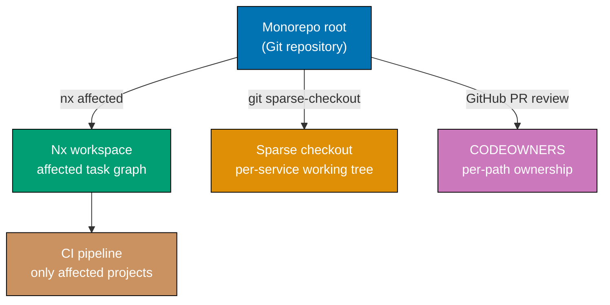

```bash
cd ~/monorepo   # repository with services/, libs/, apps/, docs/

# Strategy 1: Affected-only CI with Nx
# nx affected computes the dependency graph and runs tasks only for changed projects
npx nx affected -t build,test --base=origin/main --head=HEAD
# => Reads project.json / nx.json to build a dependency graph
# => Determines which projects changed between origin/main and HEAD
# => Runs build and test only for changed projects and their dependents
# => A change to libs/common runs tests for ALL projects that import it

# Strategy 2: Sparse checkout for large monorepos (see Example 73 for full details)
git clone --filter=blob:none --sparse https://github.com/org/monorepo ~/my-service-dev
cd ~/my-service-dev
git sparse-checkout set services/my-service libs/shared-utils
# => Checks out only your service and its shared utilities
# => Full git log and git blame still work across all paths

# Strategy 3: CODEOWNERS for automated review assignment
cat .github/CODEOWNERS
# => /services/auth/          @team-security        <- security team reviews auth
# => /services/billing/       @team-billing         <- billing team reviews billing
# => /libs/                   @platform-team        <- platform team reviews all libs
# => /docs/                   @tech-writers         <- tech writers review docs
# => /.github/                @devops-team          <- devops reviews CI config

# When a PR touches services/auth/ AND libs/, both @team-security and @platform-team
# are automatically requested as reviewers by GitHub

# Strategy 4: Protect shared library changes with required reviews
# (Configured in GitHub branch protection rules, not Git commands)
# => Require 2 approvals from @platform-team before merge if libs/ is changed
# => Prevents uncoordinated API changes in shared libraries

# Strategy 5: Incremental git fetch in CI (avoid full clone on every run)
# Use --filter=blob:none --depth=1 for fast CI checkout
git clone --filter=blob:none --depth=1 https://github.com/org/monorepo ~/ci-checkout
git fetch --deepen=50
# => Depth=1 for initial checkout, deepen=50 to give nx affected enough history
# => git diff HEAD~50 covers any reasonable PR size for affected computation

git log --oneline origin/main..HEAD
# => Shows commits in this PR branch vs main (basis for nx affected)
```

**Key Takeaway**: In a Git monorepo, combine `nx affected` for CI task scoping, sparse checkout for developer ergonomics, and CODEOWNERS for automated review routing — each layer addresses a different scalability dimension.

**Why It Matters**: Without deliberate monorepo strategies, CI time scales linearly with repository size: every PR triggers a full build of every project. Nx affected reduces CI time by 80-95% in large monorepos by running only impacted projects. CODEOWNERS enforces team ownership without manual PR assignment, which is the primary governance mechanism that makes monorepos viable at scale at companies like Google (Blaze/Bazel), Meta (Buck), and Microsoft (Rush).

---

### Example 85: Git Attributes and Custom Diff Drivers in a Monorepo

`.gitattributes` controls per-path behaviours: line ending normalisation, merge strategies for specific file types, diff drivers for binary or generated files, and export-ignore for archive exclusions.

```bash
cd ~/monorepo

# View existing .gitattributes
cat .gitattributes
# => # Line ending normalisation
# => *           text=auto eol=lf
# => *.bat        text eol=crlf
# =>
# => # Binary files — prevent corruption by disabling text processing
# => *.png        binary
# => *.pdf        binary
# => *.zip        binary
# =>
# => # Custom merge driver for generated lock files
# => package-lock.json merge=ours-lock
# => yarn.lock         merge=ours-lock
# =>
# => # Exclude from git archive output
# => .github/        export-ignore
# => tests/fixtures/ export-ignore

# Register a custom merge driver for lock files (always prefer ours, regenerate later)
git config --global merge.ours-lock.name "Keep ours lock file"
git config --global merge.ours-lock.driver "cp %O %A"
# => %O = ancestor file, %A = our file, %B = their file
# => This driver copies %A (our version) over the merge result
# => Prevents noisy lock file merge conflicts; developer regenerates after merge

# Configure a custom diff driver to show human-readable diffs for compiled output
git config --global diff.minified.textconv "prettier --stdin-filepath temp.js"
# => Textconv: pipe file content through a command before diffing
# => prettier formats the minified JS, making diffs readable

# Add to .gitattributes to activate the diff driver for minified files
echo "dist/*.min.js diff=minified" >> .gitattributes
# => All *.min.js files in dist/ now use the minified diff driver
# => git diff and git show display prettified output

# Force LF line endings for all shell scripts regardless of OS
echo "*.sh text eol=lf" >> .gitattributes
# => Prevents Windows git clients from converting LF to CRLF in .sh files
# => Eliminates "#!/usr/bin/env bash^M" errors on Linux/macOS CI

# Apply normalisation to existing working tree (after updating .gitattributes)
git add --renormalize .
# => Stages all files with re-applied attribute rules
# => Commits the line-ending normalisation as a single dedicated commit
git commit -m "chore: normalise line endings per .gitattributes"
```

**Key Takeaway**: `.gitattributes` governs per-path behaviour for line endings (`text eol=lf`), binary detection (`binary`), merge drivers (`merge=ours-lock`), and diff display (`diff=minified textconv=...`); commit it with `git add --renormalize .` to apply to existing files.

**Why It Matters**: Cross-platform teams without `.gitattributes` inevitably face line-ending corruption: Windows developers commit CRLF line endings, Linux CI fails with "bad interpreter: No such file or directory" on shell scripts, and diffs are polluted with whitespace-only changes. Custom merge drivers for generated files (lock files, proto-generated code) eliminate 90% of merge conflicts that carry zero semantic meaning, letting developers focus on real conflicts in hand-written code.

---

### Example 86: Git Hooks in a Team — Husky, lint-staged, and Commit-msg Validation

Git hooks execute scripts at specific lifecycle events (pre-commit, commit-msg, pre-push, post-checkout). Managed through Husky, they enforce code quality, conventional commit messages, and test execution locally before code reaches CI.

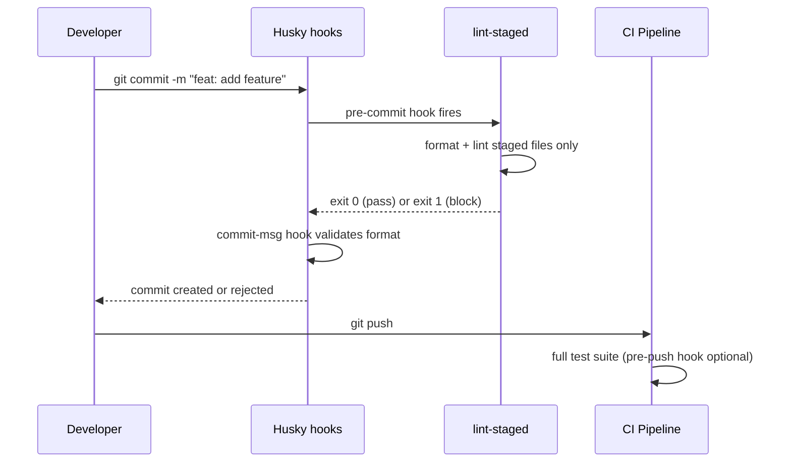

```bash
cd ~/project

# Install Husky and lint-staged
npm install --save-dev husky lint-staged
# => husky: manages Git hook scripts in .husky/
# => lint-staged: runs linters only on staged files (not the whole codebase)

# Initialise Husky (creates .husky/ directory and configures core.hooksPath)
npx husky init
# => Creates .husky/pre-commit with a default script
# => Sets git config core.hooksPath .husky
# => All hooks in .husky/ now execute at the corresponding Git event

# Configure pre-commit hook to run lint-staged
cat .husky/pre-commit
# => #!/usr/bin/env sh
# => . "$(dirname -- "$0")/_/husky.sh"
# => npx lint-staged
# => # => Runs linters only on git-staged files; exits 1 on lint errors

# Configure lint-staged in package.json
cat << 'EOF' >> package.json
{
  "lint-staged": {
    "*.{js,ts}": ["eslint --fix", "prettier --write"],
    "*.{md,json,yaml}": ["prettier --write"],
    "*.go": ["gofmt -w"]
  }
}
EOF
# => For JS/TS: auto-fix ESLint violations, then format with Prettier
# => For markdown/JSON/YAML: format with Prettier
# => For Go: run gofmt formatter
# => Only files in the current git staging area are processed

# Create commit-msg hook to enforce Conventional Commits format
cat > .husky/commit-msg << 'EOF'
#!/usr/bin/env sh
. "$(dirname -- "$0")/_/husky.sh"
npx --no -- commitlint --edit "$1"
EOF
chmod +x .husky/commit-msg
# => commitlint reads commit message from $1 (temp file path)
# => Validates against rules in commitlint.config.js
# => Rejects messages not matching: type(scope)?: description

# Configure commitlint
echo "export default { extends: ['@commitlint/config-conventional'] };" > commitlint.config.js
# => Enforces: feat:, fix:, docs:, chore:, refactor:, test: prefixes
# => Rejects: "fixed bug", "WIP", "asdf"

# Create pre-push hook for test:quick (runs affected project tests before push)
cat > .husky/pre-push << 'EOF'
#!/usr/bin/env sh
. "$(dirname -- "$0")/_/husky.sh"
npx nx affected -t test:quick --base=origin/main
EOF
chmod +x .husky/pre-push
# => Runs test:quick for all projects affected by commits being pushed
# => Blocks push if any test fails — catches regressions locally before CI
```

**Key Takeaway**: Husky manages Git hooks in version control; lint-staged limits formatting to staged files only (fast); commit-msg hooks with commitlint enforce Conventional Commits format that enables automated changelog generation.

**Why It Matters**: Automated local hooks catch errors before they reach CI, eliminating the 5-10 minute feedback loop of waiting for a CI pipeline to fail on a trivial lint error. Enforcing Conventional Commits enables automated tools like semantic-release and conventional-changelog to generate accurate changelogs and determine semantic version bumps without human input. Teams that consistently use these hooks report 40-60% fewer "fix lint" commits cluttering pull request history.

---

### Example 87: `git bisect` Combined with Git Notes — Document Regression Findings

Combining `git bisect` with `git notes` creates a documented audit trail of regression investigations, attaching the culprit commit SHA, reproduction steps, and root cause analysis directly to the relevant Git objects for future reference.

```bash
cd ~/project

# --- Phase 1: Find the regression with bisect ---
git bisect start
git bisect bad HEAD
# => HEAD is known bad (regression present)

git bisect good v3.1.0
# => v3.1.0 is known good (regression absent)

git bisect run ./tests/regression_test.sh
# => Automated binary search completes
# => Output: "4a5b6c7d is the first bad commit"

CULPRIT="4a5b6c7d"
git bisect reset
# => Returns to the branch tip after bisect completes

# --- Phase 2: Document the finding with git notes ---

# Attach a diagnostic note to the culprit commit
git notes add -m "
REGRESSION: payment calculation incorrect (found 2026-03-20)
Root cause: floating-point rounding removed from subtotal() in src/billing.go
Symptom: invoices off by 0.01 on amounts with > 2 decimal places
Reproduction: ./tests/regression_test.sh (exits 1 on affected commits)
Fix: PR #1234 cherry-picked to release/3.x in commit 9e0f1a2b
Investigated by: dev@example.com
" $CULPRIT
# => Note attached to $CULPRIT's SHA without modifying the commit
# => Future git log --show-notes will surface this context immediately

# Attach a note to the fix commit as well
FIX_COMMIT="9e0f1a2b"
git notes append -m "
FIXES regression introduced in $CULPRIT
Bisect session: automated with ./tests/regression_test.sh (7 steps, 10 min)
" $FIX_COMMIT
# => Cross-references the culprit from the fix commit for full audit trail

# Push notes to remote for team visibility
git push origin refs/notes/commits
# => Team members can fetch and view regression notes

# Search notes for a keyword
git log --notes --all --pretty=format:"%H %s %N" | grep -i "regression"
# => Finds all commits with notes containing "regression"
# => Useful for building a regression history report
```

**Key Takeaway**: After `git bisect` identifies a culprit, attach a `git notes add` entry documenting the root cause, reproduction steps, and fix reference — creating a permanent, searchable audit trail without modifying commit history.

**Why It Matters**: Production incident post-mortems frequently require locating the specific commit that caused an outage weeks or months later. Without notes, engineers must re-run bisect from scratch or search Slack/JIRA for context that may have been lost. Git notes provide an authoritative, version-controlled incident record co-located with the code itself, satisfying audit requirements in regulated industries (finance, healthcare) that mandate traceability between production incidents and code changes.

---

### Example 88: Git Reflog — Recovering Lost Commits and Branches

`git reflog` records every movement of HEAD and branch tips, including commits that are no longer reachable from any branch. It is the primary recovery tool when commits are lost due to `git reset --hard`, `git rebase`, or accidental branch deletion.

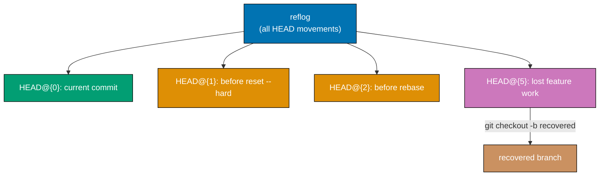

```bash
cd ~/project

# Simulate an accident: commit work, then hard reset it away
echo "important feature" > feature.txt
git add feature.txt
git commit -m "feat: important work that I'm about to lose"
# => Commit a1b2c3d recorded

git reset --hard HEAD~1
# => Moves HEAD back one commit; a1b2c3d is no longer reachable from any ref
# => git log no longer shows the commit — it appears lost

# Recover using reflog
git reflog
# => Output (most recent first):
# =>   HEAD@{0}  9f8e7d6  HEAD~1: updating HEAD
# =>   HEAD@{1}  a1b2c3d  commit: feat: important work that I'm about to lose
# =>   HEAD@{2}  9f8e7d6  commit: previous commit
# =>   HEAD@{3}  ...

# Restore the lost commit by resetting HEAD to it
git reset --hard HEAD@{1}
# => HEAD is now a1b2c3d again
# => feature.txt is restored in the working tree

# Or: create a new branch at the lost commit without disturbing current HEAD
git checkout -b recovered/feature a1b2c3d
# => New branch starting at the recovered commit
# => Original HEAD remains wherever it is

# Recover a deleted branch
git branch -D feature/experiment
# => Branch deleted; commits appear unreachable

git reflog | grep "feature/experiment" | head -3
# => Output:
# =>   b3c4d5e HEAD@{4} checkout: moving from feature/experiment to main
# => SHA b3c4d5e is the tip of the deleted branch

git checkout -b feature/experiment b3c4d5e
# => Recreates the branch from its last known tip in the reflog

# Show the reflog for a specific branch
git reflog show main
# => Shows all movements of main's tip (merges, resets, fast-forwards)

# Reflog expiry: entries older than 90 days (reachable) or 30 days (unreachable) are pruned by gc
git config --global gc.reflogExpire 180
git config --global gc.reflogExpireUnreachable 60
# => Extends reflog retention to 180 days / 60 days for larger safety net
```

**Key Takeaway**: `git reflog` records every HEAD movement for 90 days (reachable) or 30 days (unreachable); recover lost commits with `git reset --hard HEAD@{N}` or `git checkout -b <branch> <sha>` using the SHA shown in the reflog.

**Why It Matters**: Every developer eventually runs `git reset --hard` and immediately realises they needed those changes. The reflog is Git's safety net — as long as the commits are younger than the reflog retention period (configurable via `gc.reflogExpireUnreachable`), recovery is deterministic and takes seconds. Understanding reflog also demystifies why Git objects are not immediately deleted after becoming unreachable: the garbage collector respects the retention window, giving you time to recover before permanent deletion.
