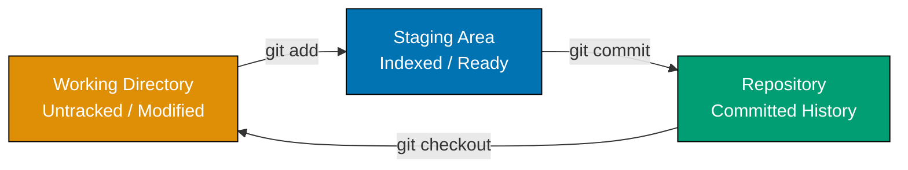
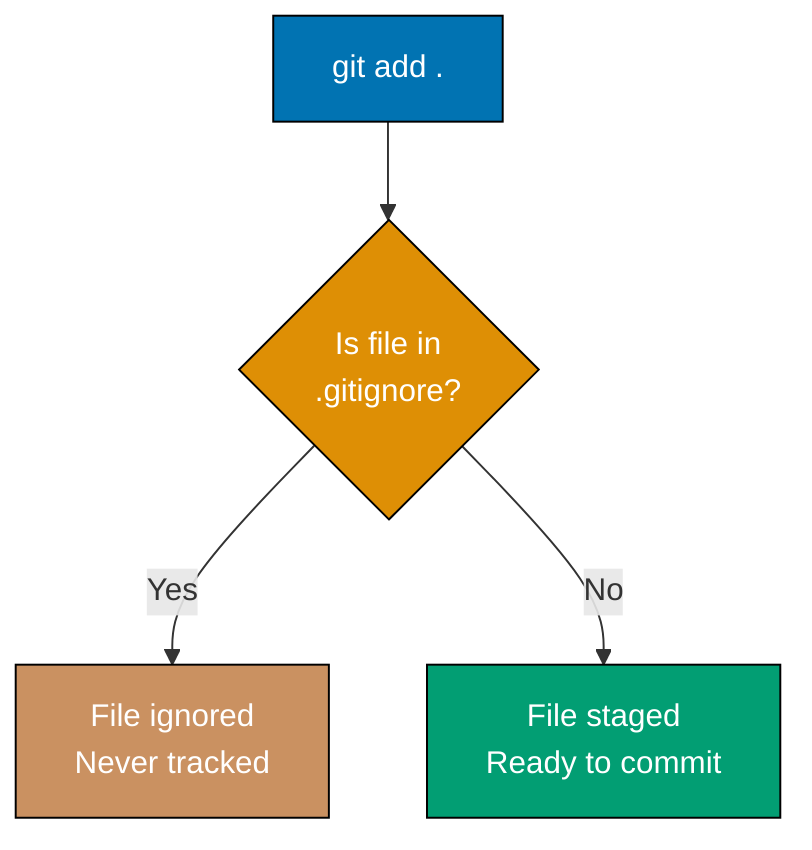
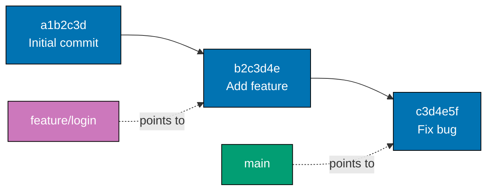
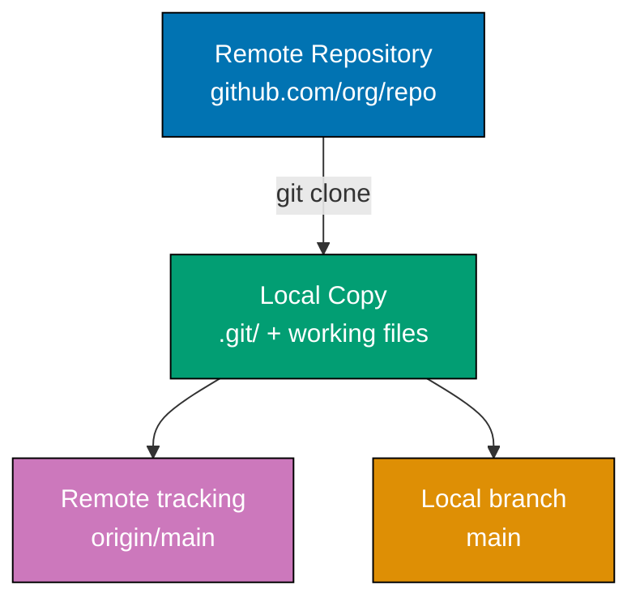
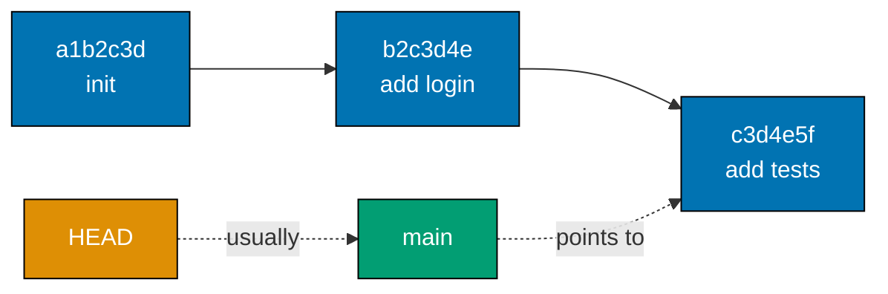
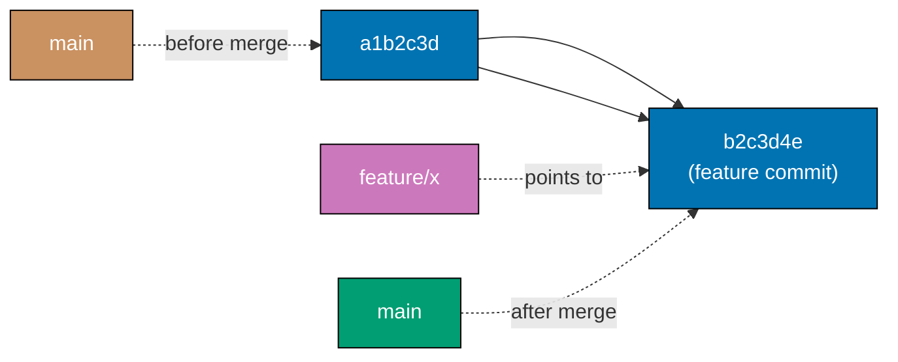

These 28 examples cover 0-35% of Git concepts, taking you from an empty directory to confident use of branching, remote repositories, and history inspection. Each example is self-contained — you can follow any one independently.

## Basic Repository Setup

### Example 1: Initialize a Local Repository

`git init` turns any directory into a Git repository by creating a hidden `.git` folder that stores all version history. Nothing is tracked yet — initialization only prepares the tracking infrastructure.

```bash
# Create a fresh directory for this example
mkdir my-project
# => Creates directory my-project/ in the current working directory

cd my-project
# => Working directory is now my-project/

git init
# => Initialized empty Git repository in /home/user/my-project/.git/
# => Creates hidden .git/ folder containing: HEAD, config, objects/, refs/

ls -la
# => total 0
# => drwxr-xr-x  3 user  staff   96 Mar 20 10:00 .
# => drwxr-xr-x 10 user  staff  320 Mar 20 10:00 ..
# => drwxr-xr-x  9 user  staff  288 Mar 20 10:00 .git

ls .git/
# => HEAD        branches/   config      description hooks/
# => info/       objects/    refs/
# => HEAD contains: ref: refs/heads/main (points to default branch)
```

**Key takeaway**: `git init` creates a `.git/` directory that is the entire Git database for your project — delete it and you lose all history.

**Why it matters**: Every Git workflow starts with initialization. In production, you almost always clone rather than init, but understanding `git init` reveals that a repository is just a directory with a `.git/` folder. This knowledge helps you diagnose issues, recover broken repos, and understand what Git actually stores on disk.

---

### Example 2: Configure User Identity

Git attaches your name and email to every commit permanently. Without configuration, commits either fail or record incorrect authorship that is difficult to fix retroactively.

```bash
# Set identity globally (applies to all repos on this machine)
git config --global user.name "Alice Smith"
# => Writes to ~/.gitconfig under [user] section
# => name = Alice Smith

git config --global user.email "alice@example.com"
# => Writes to ~/.gitconfig under [user] section
# => email = alice@example.com

# Verify the configuration was saved
git config --global user.name
# => Alice Smith

git config --global user.email
# => alice@example.com

# View the full global config
git config --global --list
# => user.name=Alice Smith
# => user.email=alice@example.com
# => core.editor=vim  (or whatever default editor is set)
```

**Key takeaway**: `--global` sets identity for all future commits on this machine; omit it to override only in the current repository.

**Why it matters**: Every commit permanently embeds author name and email. Teams rely on this for code review attribution, blame analysis, and compliance audits. In CI/CD pipelines, bots use dedicated service account identities. Incorrect identity causes confusion in pull requests and can violate contribution policies.

---

### Example 3: Check Repository Status

`git status` shows the current state of the working directory and staging area — which files are tracked, modified, staged, or untracked. It is the most frequently used Git command in daily work.

```bash
# Start from an initialized empty repo (from Example 1)
# Working directory: my-project/

git status
# => On branch main
# => No commits yet
# => nothing to commit (create/copy files and use "git add" to track)

# Create a file
echo "# My Project" > README.md
# => Creates README.md with content: # My Project

git status
# => On branch main
# => No commits yet
# =>
# => Untracked files:
# =>   (use "git add <file>..." to include in what will be committed)
# =>         README.md
# =>
# => nothing added to commit but untracked files present (use "git add" to track)
# => Status: README.md is untracked — Git sees it but ignores it
```

**Key takeaway**: Git ignores untracked files completely until you explicitly add them — creating a file does not automatically start tracking it.

**Why it matters**: `git status` is your safety check before every commit. It catches accidentally staged files, forgotten changes, and untracked files that should be ignored. Professional developers run `git status` compulsively — it is the fastest way to understand exactly what will and will not be committed.

---

### Example 4: Stage Files with git add

The staging area (also called the index) holds a snapshot of what will go into the next commit. `git add` moves changes from the working directory into this staging area — a deliberate, two-step design that lets you craft precise commits.



```bash
# Continuing from Example 3: README.md is untracked
echo "# My Project" > README.md
# => README.md contains: # My Project (untracked)

echo "console.log('hello');" > app.js
# => app.js contains one line (untracked)

# Stage only README.md (selective staging)
git add README.md
# => README.md moves from "untracked" to "staged"
# => app.js remains untracked

git status
# => On branch main
# => No commits yet
# =>
# => Changes to be committed:
# =>   (use "git rm --cached <file>..." to unstage)
# =>         new file:   README.md    ← staged
# =>
# => Untracked files:
# =>   (use "git add <file>..." to include in what will be committed)
# =>         app.js                   ← still untracked

# Stage everything at once with dot notation
git add .
# => Stages all untracked and modified files in current directory
# => app.js is now staged too

git status
# => Changes to be committed:
# =>         new file:   README.md
# =>         new file:   app.js
```

**Key takeaway**: Staging is intentional — `git add` lets you select exactly which changes to include in the next commit, enabling atomic, focused commit messages.

**Why it matters**: The staging area is Git's most powerful differentiator from simpler tools. In production codebases, a single task often touches many files but only some changes belong in one logical commit. Selective staging with `git add -p` (patch mode) lets you commit half a file's changes, keeping history clean and enabling clean bisection for bug hunting.

---

### Example 5: Create Your First Commit

A commit is a permanent snapshot of the staged changes plus metadata: author, timestamp, and message. Once committed, the snapshot is immutable and addressable by a SHA-1 hash.

```bash
# Assume README.md and app.js are staged (from Example 4)
git commit -m "Initial commit: add README and app entry point"
# => [main (root-commit) a1b2c3d] Initial commit: add README and app entry point
# => 2 files changed, 2 insertions(+)
# => create mode 100644 README.md
# => create mode 100644 app.js
# =>
# => Breakdown of output:
# => a1b2c3d = abbreviated SHA-1 hash (unique commit identifier)
# => root-commit = this is the very first commit (no parent)
# => 2 files changed, 2 insertions(+) = summary of diff

git status
# => On branch main
# => nothing to commit, working tree clean
# => Working directory now matches the committed snapshot
```

**Key takeaway**: A commit captures a snapshot (not a diff) of staged files at that moment, identified by a unique SHA-1 hash that can never change.

**Why it matters**: Every commit is a permanent checkpoint you can return to, diff against, or cherry-pick. Well-written commit messages are the primary narrative of project history — they answer "why was this changed?" six months later when the original author has moved on. Conventional Commits format (`feat:`, `fix:`, `chore:`) makes history machine-readable for changelogs.

---

## Viewing History and Differences

### Example 6: View Commit History with git log

`git log` displays the commit history in reverse-chronological order (newest first). Each entry shows the commit hash, author, date, and message. The history is your project's audit trail.

```bash
# Make a few commits to generate history
echo "v1.0" > version.txt && git add . && git commit -m "feat: add version file"
# => [main b2c3d4e] feat: add version file

echo "v1.1" > version.txt && git add . && git commit -m "feat: bump version to 1.1"
# => [main c3d4e5f] feat: bump version to 1.1

# View full history
git log
# => commit c3d4e5f... (HEAD -> main)
# => Author: Alice Smith <alice@example.com>
# => Date:   Thu Mar 20 10:05:00 2026 +0700
# =>
# =>     feat: bump version to 1.1
# =>
# => commit b2c3d4e...
# => Author: Alice Smith <alice@example.com>
# => Date:   Thu Mar 20 10:04:00 2026 +0700
# =>
# =>     feat: add version file
# =>
# => commit a1b2c3d...
# => Author: Alice Smith <alice@example.com>
# => Date:   Thu Mar 20 10:00:00 2026 +0700
# =>
# =>     Initial commit: add README and app entry point

# Compact one-line format
git log --oneline
# => c3d4e5f (HEAD -> main) feat: bump version to 1.1
# => b2c3d4e feat: add version file
# => a1b2c3d Initial commit: add README and app entry point
```

**Key takeaway**: `git log --oneline` gives a fast overview of history; the full `git log` reveals authorship and exact timestamps needed for audits.

**Why it matters**: Commit history is the primary debugging tool when something breaks. `git log` lets you correlate a production incident timestamp with the exact commit deployed. Combined with `git bisect`, a clean history enables pinpointing the exact commit that introduced a regression in minutes rather than hours.

---

### Example 7: Formatted git log with Graph

Git log accepts powerful formatting options that transform raw history into readable reports. The `--graph` flag draws ASCII branch/merge diagrams directly in the terminal.

```bash
# Extended log with decorations, graph, and relative dates
git log --oneline --graph --decorate --all
# => * c3d4e5f (HEAD -> main) feat: bump version to 1.1
# => * b2c3d4e feat: add version file
# => * a1b2c3d Initial commit: add README and app entry point
# =>
# => --graph: draws * for each commit, / and \ for branches
# => --decorate: shows branch/tag labels in parentheses
# => --all: includes all branches and remotes (not just current)

# Custom format: hash | date | author | subject
git log --pretty=format:"%h | %ad | %an | %s" --date=short
# => c3d4e5f | 2026-03-20 | Alice Smith | feat: bump version to 1.1
# => b2c3d4e | 2026-03-20 | Alice Smith | feat: add version file
# => a1b2c3d | 2026-03-20 | Alice Smith | Initial commit: add README and app entry point
# =>
# => %h = abbreviated hash, %ad = author date, %an = author name, %s = subject

# Limit to last 2 commits
git log -2 --oneline
# => c3d4e5f feat: bump version to 1.1
# => b2c3d4e feat: add version file
```

**Key takeaway**: Format `git log` output to suit your workflow — one-line summaries for quick scanning, custom formats for scripts and reports.

**Why it matters**: Custom log formats power automated release notes generators, CHANGELOG tools, and CI dashboards. The `--graph` view is the standard way to understand complex branch topologies before merging. Teams often alias `git log --oneline --graph --decorate --all` as `git lg` for daily use.

---

### Example 8: Inspect a Specific Commit with git show

`git show` displays the full details of a commit: metadata, diff of all changed files, and the exact lines added or removed. It is the standard command for code review of individual commits.

```bash
# Show the most recent commit (HEAD)
git show HEAD
# => commit c3d4e5f... (HEAD -> main)
# => Author: Alice Smith <alice@example.com>
# => Date:   Thu Mar 20 10:05:00 2026 +0700
# =>
# =>     feat: bump version to 1.1
# =>
# => diff --git a/version.txt b/version.txt
# => index abc1234..def5678 100644
# => --- a/version.txt      ← old version
# => +++ b/version.txt      ← new version
# => @@ -1 +1 @@
# => -v1.0                  ← line removed
# => +v1.1                  ← line added

# Show a specific commit by its abbreviated hash
git show a1b2c3d
# => (shows the initial commit diff — all lines are additions)
# => +++ b/README.md
# => @@ -0,0 +1 @@
# => +# My Project

# Show only commit metadata without the diff
git show --stat HEAD
# => commit c3d4e5f...
# => feat: bump version to 1.1
# =>  version.txt | 2 +-
# =>  1 file changed, 1 insertion(+), 1 deletion(-)
```

**Key takeaway**: `git show <hash>` is your primary tool for inspecting exactly what changed in any historical commit, line by line.

**Why it matters**: During incident response you need to know precisely what a deploy changed. `git show` gives you the exact diff without checking out old code. Code reviewers use it to inspect commits from teammates. The `--stat` summary is useful for understanding the scope of a change before reviewing the full diff.

---

### Example 9: See Unstaged and Staged Differences

`git diff` shows changes not yet staged; `git diff --staged` shows what is staged and ready to commit. Together they answer: "What have I changed and what am I about to commit?"

```bash
# Start clean, then make a change
echo "# My Project" > README.md && git add . && git commit -m "init"
# => [main a1b2c3d] init

# Modify the file (but don't stage yet)
echo "# My Project - Updated" > README.md
# => README.md now contains: # My Project - Updated

# See unstaged changes (working dir vs staging area)
git diff
# => diff --git a/README.md b/README.md
# => --- a/README.md     ← staged/last-committed version
# => +++ b/README.md     ← working directory version
# => @@ -1 +1 @@
# => -# My Project
# => +# My Project - Updated

# Stage the change
git add README.md
# => README.md is now staged

# git diff now shows nothing (working dir matches staging area)
git diff
# => (no output — working dir matches staging area)

# See staged changes (staging area vs last commit)
git diff --staged
# => diff --git a/README.md b/README.md
# => --- a/README.md     ← committed version
# => +++ b/README.md     ← staged version
# => @@ -1 +1 @@
# => -# My Project
# => +# My Project - Updated
```

**Key takeaway**: `git diff` inspects the unstaged gap; `git diff --staged` inspects what will enter the next commit — always review both before committing.

**Why it matters**: Reviewing diffs before committing is a professional discipline that catches debug statements, hardcoded secrets, and unintended changes. Many teams enforce `git diff --staged` review as part of their commit checklist. It also catches whitespace-only changes that inflate diffs in code review.

---

## Ignoring Files

### Example 10: Create a .gitignore File

`.gitignore` tells Git which files and directories to never track. Build artifacts, dependency folders, editor configs, and secrets should all be excluded to keep the repository clean and secure.



```bash
# Create typical project artifacts that should NOT be committed
mkdir node_modules && touch node_modules/lodash.js
# => Simulates npm dependencies (often 50k+ files)

echo "SECRET_KEY=abc123" > .env
# => .env contains sensitive credentials — never commit this

touch debug.log
# => Log file generated at runtime

git status
# => Untracked files:
# =>   .env
# =>   debug.log
# =>   node_modules/
# => All three appear — Git wants to track them

# Create .gitignore to exclude them
cat > .gitignore << 'EOF'
# Dependencies
node_modules/

# Environment variables (NEVER commit secrets)
.env
.env.local
.env.*.local

# Logs
*.log

# Build output
dist/
build/
EOF
# => .gitignore is now created with exclusion rules

git status
# => Untracked files:
# =>   .gitignore
# => node_modules/, .env, debug.log are all hidden — not listed

git add .gitignore && git commit -m "chore: add .gitignore"
# => [main b2c3d4e] chore: add .gitignore
# => .gitignore itself IS tracked so the rules are shared with the team
```

**Key takeaway**: Commit `.gitignore` early — once a file is tracked, `.gitignore` will not remove it from history, only new additions are excluded.

**Why it matters**: Accidentally committing `node_modules/` (often 200MB+) or `.env` files with API keys are among the most common Git mistakes. A `.gitignore` committed on day one prevents both. Security scanners routinely scan public repositories for leaked secrets — a single committed `.env` can expose credentials permanently since Git history is immutable.

---

## Undoing Changes

### Example 11: Restore a File to Last Committed State

`git restore` discards working directory changes, reverting a file to its last committed version. This is the safe way to undo local edits that you no longer want.

```bash
# Start with a committed file
echo "version = 1.0" > config.txt
git add config.txt && git commit -m "add config"
# => [main a1b2c3d] add config

# Make an unwanted change
echo "BROKEN CONFIG!!!" > config.txt
# => config.txt is now corrupted

git status
# => Changes not staged for commit:
# =>         modified:   config.txt
# => Git sees the modification but has not staged it

# Discard the working directory change
git restore config.txt
# => config.txt is restored to last committed version
# => WARNING: This discards changes permanently — no undo

cat config.txt
# => version = 1.0
# => File is back to the committed state

git status
# => nothing to commit, working tree clean
# => Working directory matches the repository
```

**Key takeaway**: `git restore <file>` permanently discards uncommitted working directory changes — use carefully since there is no undo.

**Why it matters**: Accidentally editing the wrong file or running a script that corrupts configuration is common. `git restore` is the fastest recovery — one command rolls back any number of unwanted changes. In automated environments, scripts use `git restore .` to guarantee a clean working directory before applying patches or running tests.

---

### Example 12: Unstage a Staged File

After `git add`, if you realize a file should not be in this commit, `git restore --staged` removes it from staging while preserving your working directory changes.

```bash
# Stage two files together
echo "feature code" > feature.js
echo "debug only" > debug-helper.js
git add feature.js debug-helper.js
# => Both files are staged

git status
# => Changes to be committed:
# =>         new file:   debug-helper.js   ← should not be in this commit
# =>         new file:   feature.js

# Remove debug-helper.js from staging (keep working directory change)
git restore --staged debug-helper.js
# => debug-helper.js moves from "staged" back to "untracked"
# => The file content on disk is unchanged

git status
# => Changes to be committed:
# =>         new file:   feature.js        ← only feature.js staged now
# =>
# => Untracked files:
# =>         debug-helper.js               ← still on disk, not staged

git commit -m "feat: add feature"
# => [main b2c3d4e] feat: add feature
# => 1 file changed (only feature.js committed, debug-helper.js excluded)
```

**Key takeaway**: `git restore --staged` is the precise tool for removing individual files from staging without touching their content.

**Why it matters**: Selective commits are essential for clean history. A commit mixing a feature change with debug code or unrelated fixes pollutes history and complicates code review. `git restore --staged` lets you course-correct after an overzealous `git add .` before the change becomes permanent.

---

## Working with Branches

### Example 13: Create and List Branches

A branch is a lightweight movable pointer to a commit. Creating a branch costs nothing — it writes one 41-byte file. Branches enable parallel development without interfering with stable code.



```bash
# Starting from a repo with commits on main
git log --oneline
# => c3d4e5f (HEAD -> main) feat: initial setup

# Create a new branch (does not switch to it)
git branch feature/login
# => Creates branch pointer at current commit (c3d4e5f)
# => HEAD still points to main

# List all local branches
git branch
# =>   feature/login
# => * main              ← asterisk marks current branch (HEAD)

# List branches with last commit info
git branch -v
# =>   feature/login c3d4e5f feat: initial setup
# => * main          c3d4e5f feat: initial setup
# => Both branches point to the same commit — no divergence yet

# List all branches including remote tracking branches
git branch -a
# =>   feature/login
# => * main
# => (no remotes yet — remote branches show as remotes/origin/main)
```

**Key takeaway**: A branch is just a named pointer to a commit — creating thousands of branches has negligible cost; deleting them loses only the pointer, not the commits.

**Why it matters**: Branch-based workflows (GitHub Flow, Gitflow) are the foundation of team development. Feature branches isolate work-in-progress from the stable main branch, enabling code review before integration. Understanding that a branch is a pointer (not a copy) explains why Git branching is nearly instant and why it is used so liberally compared to older VCS systems.

---

### Example 14: Switch Between Branches with git switch

`git switch` changes the active branch, updating the working directory to match that branch's latest commit. Modern Git recommends `git switch` over `git checkout` for branch operations.

```bash
# Continuing from Example 13: branches main and feature/login exist

# Switch to the feature branch
git switch feature/login
# => Switched to branch 'feature/login'
# => Working directory now reflects feature/login's tip commit

git branch
# =>   main
# => * feature/login   ← asterisk moved here

# Make a commit on feature/login
echo "login function" > login.js
git add login.js
git commit -m "feat: add login function"
# => [feature/login d4e5f6a] feat: add login function
# => login.js exists only on feature/login, not on main

# Switch back to main
git switch main
# => Switched to branch 'main'
# => login.js disappears from working directory (it only exists on feature/login)

ls
# => README.md  app.js  version.txt
# => login.js is NOT here — it belongs to feature/login branch only

git switch feature/login
# => Switched to branch 'feature/login'
# => login.js reappears
ls
# => README.md  app.js  login.js  version.txt
```

**Key takeaway**: Switching branches changes the working directory instantly — files from other branches disappear or appear depending on the branch's commit history.

**Why it matters**: Context switching between branches is the core of parallel development. You can switch branches mid-task to hotfix production, commit the fix, then return to your feature branch. The working directory transformation on switch is why `git status` should always show a clean state before switching — uncommitted changes can conflict with the target branch.

---

### Example 15: Create and Switch in One Command

`git switch -c` combines branch creation and switching into a single operation. This is the standard way to start a new feature or bugfix.

```bash
# Create and immediately switch to a new branch
git switch -c bugfix/null-pointer
# => Switched to a new branch 'bugfix/null-pointer'
# => Equivalent to: git branch bugfix/null-pointer && git switch bugfix/null-pointer

git branch
# => * bugfix/null-pointer   ← active
# =>   feature/login
# =>   main

# Make a fix commit
echo "null check added" > fix.js
git add fix.js && git commit -m "fix: add null pointer check"
# => [bugfix/null-pointer e5f6a7b] fix: add null pointer check

# Switch back to main without the fix
git switch main
# => Switched to branch 'main'

ls fix.js 2>/dev/null || echo "fix.js does not exist on main"
# => fix.js does not exist on main
# => Confirms: fix.js is isolated to bugfix/null-pointer branch
```

**Key takeaway**: `git switch -c <name>` is the one-liner standard for starting any new piece of work — always prefer it over separate create and switch commands.

**Why it matters**: Branching discipline prevents "works on my machine" problems by keeping experimental and stable code separated. Starting every task with `git switch -c` creates a natural scope boundary. Pull requests are then branch-based reviews. The `-c` flag is so common it should be muscle memory for any Git user working on a team.

---

## Working with Remotes

### Example 16: Clone a Remote Repository

`git clone` downloads a complete copy of a remote repository — all commits, all branches, all history — to your local machine. It also configures the remote origin automatically.



```bash
# Clone a public repository (uses HTTPS)
git clone https://github.com/example/demo-repo.git
# => Cloning into 'demo-repo'...
# => remote: Counting objects: 150, done.
# => remote: Compressing objects: 100% (80/80), done.
# => Receiving objects: 100% (150/150), 45.00 KiB
# => Resolving deltas: 100% (30/30), done.
# => Creates directory demo-repo/ with full history

cd demo-repo
# => Working directory is now demo-repo/

# Clone into a custom directory name
git clone https://github.com/example/demo-repo.git my-copy
# => Clones into my-copy/ instead of demo-repo/

# Verify remote was configured automatically
git remote -v
# => origin  https://github.com/example/demo-repo.git (fetch)
# => origin  https://github.com/example/demo-repo.git (push)
# => 'origin' is the conventional name for the primary remote
```

**Key takeaway**: `git clone` gives you a complete offline copy — you can commit, branch, and review history without network access; only push/pull/fetch require connectivity.

**Why it matters**: Cloning is how every contributor starts. The complete local history means `git log`, `git diff`, and `git blame` run at memory speed without network latency. Understanding that a clone is fully independent explains why you can work disconnected for days and sync when ready — Git's distributed architecture is its key advantage over centralized VCS tools.

---

### Example 17: Inspect Remote Configuration

`git remote` manages connections to remote repositories. A remote is a named URL shortcut — `origin` is the conventional default for the primary remote.

```bash
# In a cloned repository from Example 16

# List remotes (short form)
git remote
# => origin
# => One remote named 'origin' configured

# List remotes with URLs
git remote -v
# => origin  https://github.com/example/demo-repo.git (fetch)
# => origin  https://github.com/example/demo-repo.git (push)
# => fetch URL: where git fetch/pull downloads from
# => push URL: where git push sends to (usually the same)

# Show detailed info about origin
git remote show origin
# => * remote origin
# =>   Fetch URL: https://github.com/example/demo-repo.git
# =>   Push  URL: https://github.com/example/demo-repo.git
# =>   HEAD branch: main
# =>   Remote branches:
# =>     main tracked
# =>     develop tracked
# =>   Local branch configured for 'git pull':
# =>     main merges with remote main

# Add a second remote (common when forking)
git remote add upstream https://github.com/original/demo-repo.git
# => upstream remote added — points to the original (un-forked) repo

git remote -v
# => origin    https://github.com/example/demo-repo.git (fetch)
# => origin    https://github.com/example/demo-repo.git (push)
# => upstream  https://github.com/original/demo-repo.git (fetch)
# => upstream  https://github.com/original/demo-repo.git (push)
```

**Key takeaway**: Remotes are named URL shortcuts — `origin` for your fork, `upstream` for the original source is the standard two-remote pattern for open source contribution.

**Why it matters**: Teams commonly work with multiple remotes: your fork (`origin`) and the canonical repository (`upstream`). Enterprise workflows add staging, production, and third-party service remotes. Misconfigured remote URLs cause frustrating push failures — `git remote -v` is always the first diagnostic when a push or pull goes to the wrong place.

---

### Example 18: Push Commits to a Remote

`git push` uploads your local commits to the remote repository, making them available to collaborators. The `-u` flag links the local branch to its remote counterpart.

```bash
# In a local repo with commits ahead of remote
git log --oneline
# => d4e5f6a (HEAD -> main) feat: add login
# => c3d4e5f (origin/main) initial setup
# => HEAD is ahead of origin/main by 1 commit

# Push main branch to origin
git push origin main
# => Enumerating objects: 3, done.
# => Counting objects: 100% (3/3), done.
# => Writing objects: 100% (2/2), 230 bytes
# => To https://github.com/example/demo-repo.git
# =>    c3d4e5f..d4e5f6a  main -> main
# => Remote now has commit d4e5f6a

# Set upstream tracking (first push of new branch)
git switch -c feature/payments
git commit --allow-empty -m "start payments feature"
# => [feature/payments e5f6a7b] start payments feature

git push -u origin feature/payments
# => Branch 'feature/payments' set up to track remote branch 'feature/payments' from 'origin'.
# => To https://github.com/example/demo-repo.git
# =>  * [new branch]  feature/payments -> feature/payments
# => -u sets upstream: future 'git push' (no args) pushes this branch

# After -u is set, bare 'git push' works
git push
# => Pushes feature/payments to origin/feature/payments automatically
```

**Key takeaway**: Use `git push -u origin <branch>` for the first push of a new branch to establish tracking; subsequent pushes only need `git push`.

**Why it matters**: Pushing regularly is a backup strategy — local commits are lost if your machine fails. Push frequency is also a collaboration signal: frequent small pushes enable continuous code review. Many teams block direct pushes to `main` via branch protection rules, requiring pushes to feature branches followed by pull requests.

---

### Example 19: Fetch Remote Changes

`git fetch` downloads new commits, branches, and tags from the remote without modifying your local branches or working directory. It is the safe way to see what others have done.

```bash
# Simulate a remote having new commits (run by a teammate)
# Your local state:
git log --oneline
# => d4e5f6a (HEAD -> main, origin/main) feat: add login
# => c3d4e5f initial setup

# Remote has received a new commit (teammate pushed)
# Your remote tracking refs are stale

git fetch origin
# => remote: Enumerating objects: 3, done.
# => remote: Counting objects: 100% (3/3), done.
# => From https://github.com/example/demo-repo.git
# =>    d4e5f6a..f6a7b8c  main -> origin/main
# => origin/main updated — local main branch unchanged

git log --oneline --all
# => f6a7b8c (origin/main) feat: teammate's change    ← remote
# => d4e5f6a (HEAD -> main) feat: add login            ← local
# => c3d4e5f initial setup
# => Local main is behind origin/main by 1 commit

git diff main origin/main
# => Shows exactly what changed in teammate's commit
# => Review before merging — git fetch enables informed decisions
```

**Key takeaway**: `git fetch` is a read-only sync — it never touches your local branches, making it safe to run at any time to see what's new.

**Why it matters**: Fetching before merging gives you a chance to review incoming changes before they affect your work. Teams running continuous integration benefit from `git fetch` in their scripts — checking whether the remote has advanced before triggering a local build. Automated fetching in IDE background processes keeps remote tracking branches current without interrupting your workflow.

---

### Example 20: Pull Remote Changes

`git pull` combines `git fetch` and `git merge` (or `git rebase`) into one command. It updates your local branch with changes from the remote. Use it when you want to immediately integrate remote changes.

```bash
# Local main is behind origin/main by 1 commit (from Example 19)
git log --oneline
# => d4e5f6a (HEAD -> main) feat: add login
# => c3d4e5f initial setup

git pull origin main
# => From https://github.com/example/demo-repo.git
# =>  * branch            main       -> FETCH_HEAD
# => Updating d4e5f6a..f6a7b8c
# => Fast-forward            ← no divergence, so merge is a simple pointer advance
# =>  teammate-feature.js | 1 +
# =>  1 file changed, 1 insertion(+)

git log --oneline
# => f6a7b8c (HEAD -> main, origin/main) feat: teammate's change
# => d4e5f6a feat: add login
# => c3d4e5f initial setup
# => Local main now matches origin/main

# Pull with rebase (keeps history linear)
git pull --rebase origin main
# => Rebases local commits on top of fetched commits
# => Produces cleaner history than merge-based pull
# => Preferred by teams following linear history conventions
```

**Key takeaway**: `git pull` is `fetch + merge` — use `git pull --rebase` to keep history linear when your local branch has commits not yet on the remote.

**Why it matters**: Regular pulls prevent "integration hell" — the longer you delay pulling, the larger and more complex the eventual merge becomes. Teams often set `pull.rebase = true` in git config so all pulls use rebase by default, maintaining a clean linear history that makes bisecting and reverting trivial.

---

## The HEAD Concept

### Example 21: Understanding HEAD

HEAD is a special pointer that indicates your current position in the repository. Normally it points to the tip of the current branch. Understanding HEAD is essential for navigating history.



```bash
# Show what HEAD currently points to
cat .git/HEAD
# => ref: refs/heads/main
# => HEAD points to main branch (indirect reference)

# Show the commit HEAD resolves to
git rev-parse HEAD
# => c3d4e5f7a8b9d0e1f2a3b4c5d6e7f8a9b0c1d2e3
# => Full SHA-1 of the current commit

# HEAD~ notation: navigate backwards
git log --oneline
# => c3d4e5f (HEAD -> main) add tests
# => b2c3d4e add login
# => a1b2c3d init

git show HEAD~1 --stat
# => commit b2c3d4e
# => add login
# => login.js | 1 +
# => HEAD~1 = one commit before HEAD (parent)

git show HEAD~2 --stat
# => commit a1b2c3d
# => init
# => HEAD~2 = two commits before HEAD (grandparent)

# HEAD^ is equivalent to HEAD~1 (one parent)
git rev-parse HEAD^
# => b2c3d4e...   ← same as HEAD~1
```

**Key takeaway**: HEAD is your current position — `HEAD~N` navigates N commits back in history, enabling precise diff and inspection operations without knowing commit hashes.

**Why it matters**: HEAD notation is used throughout Git — `git diff HEAD~3..HEAD` shows the last three commits as a diff, `git reset HEAD~1` undoes the last commit while keeping changes staged. Scripts use HEAD to reference the current state without hardcoding hashes. Understanding HEAD unlocks advanced operations like interactive rebase and cherry-pick.

---

## File Management

### Example 22: Remove Tracked Files with git rm

`git rm` removes a file from both the working directory and the staging area (index) in one step. This is the correct way to delete tracked files — a plain `rm` only removes the file locally, requiring an additional `git add` to stage the deletion.

```bash
# Start with a tracked file
echo "old content" > obsolete.txt
git add obsolete.txt && git commit -m "add obsolete file"
# => [main a1b2c3d] add obsolete file

# Remove the file the Git-aware way
git rm obsolete.txt
# => rm 'obsolete.txt'
# => File deleted from disk AND deletion staged in one command

ls obsolete.txt 2>/dev/null || echo "File deleted from disk"
# => File deleted from disk

git status
# => Changes to be committed:
# =>         deleted:   obsolete.txt   ← deletion is staged, ready to commit

git commit -m "chore: remove obsolete file"
# => [main b2c3d4e] chore: remove obsolete file

# Remove from index only (keep file on disk — useful for accidental git add)
echo "should not be tracked" > local-notes.txt
git add local-notes.txt
# => Oops — staged accidentally

git rm --cached local-notes.txt
# => rm 'local-notes.txt'
# => File remains on disk, removed from staging/tracking only
# => Add local-notes.txt to .gitignore to prevent re-adding
```

**Key takeaway**: Use `git rm` to delete tracked files (removes disk + stages deletion); use `git rm --cached` to stop tracking a file without deleting it from disk.

**Why it matters**: Accidentally committed files must be removed via `git rm` to purge them from future tracking. `git rm --cached` is the fix when you committed files that should be in `.gitignore` — after running it, add the pattern to `.gitignore` so the file never appears in `git status` again.

---

### Example 23: Rename or Move Files with git mv

`git mv` renames or moves a file while recording the operation in the index. Git detects renames by content similarity but using `git mv` makes the rename explicit and avoids confusion in diffs.

```bash
# Start with a tracked file
echo "server logic" > server.js
git add server.js && git commit -m "add server"
# => [main a1b2c3d] add server

# Rename using git mv
git mv server.js app-server.js
# => Renames file on disk AND stages the rename in one step
# => Equivalent to: mv server.js app-server.js && git add app-server.js && git rm server.js

git status
# => Changes to be committed:
# =>         renamed:    server.js -> app-server.js   ← explicit rename record

git commit -m "refactor: rename server.js to app-server.js"
# => [main b2c3d4e] refactor: rename server.js to app-server.js

# Move file into a subdirectory
mkdir src/
git mv app-server.js src/app-server.js
# => Moves file into src/ subdirectory

git status
# => Changes to be committed:
# =>         renamed:    app-server.js -> src/app-server.js

git commit -m "refactor: move server into src/"
# => [main c3d4e5f] refactor: move server into src/
```

**Key takeaway**: `git mv` is the single-command rename/move that keeps the staging area in sync with disk — prefer it over shell `mv` to avoid extra `git add`/`git rm` steps.

**Why it matters**: Large-scale refactoring moves many files. Using `git mv` keeps the diff readable — reviewers see "renamed" rather than a mysterious delete-and-add pair. Git's rename detection (70% similarity threshold) works even without `git mv` but explicit renames prevent misidentification during complex merges.

---

## Navigating History

### Example 24: View History of a Specific File

`git log` accepts file paths to filter history, showing only commits that touched a specific file. This is the fastest way to trace when and why a file changed.

```bash
# Repository with multiple commits touching different files
git log --oneline
# => e5f6a7b fix: update config validation
# => d4e5f6a feat: add user model
# => c3d4e5f feat: add config loader
# => b2c3d4e chore: initial setup

# Show only commits that touched config.js
git log --oneline -- config.js
# => e5f6a7b fix: update config validation
# => c3d4e5f feat: add config loader
# => Only 2 of 4 commits touched config.js

# See the actual changes made to config.js across its history
git log -p -- config.js
# => commit e5f6a7b
# =>     fix: update config validation
# => diff --git a/config.js b/config.js
# => -  timeout: 30    ← old value
# => +  timeout: 60    ← new value
# =>
# => commit c3d4e5f
# =>     feat: add config loader
# => diff --git a/config.js b/config.js
# => +  const config = require('./config')   ← added

# Follow renames (-- follow tracks file across renames)
git log --follow --oneline -- src/app-server.js
# => c3d4e5f refactor: move server into src/
# => b2c3d4e refactor: rename server.js to app-server.js
# => a1b2c3d add server
# => --follow traverses rename history to show all commits
```

**Key takeaway**: `git log -- <file>` filters history to a single file; `--follow` extends tracking through renames; `-p` shows the full diff at each commit.

**Why it matters**: When a bug is discovered in a specific function, `git log -p -- <file>` shows the complete change history of that file — who changed what and why. This is faster than searching through unfiltered history. The `--follow` flag is essential after refactoring renames the file.

---

## Branch Operations

### Example 25: Delete a Branch

After merging a feature branch, delete it to keep the branch list clean. Git protects you from deleting unmerged branches by default.

```bash
# Branches: main and feature/old-feature (already merged)
git branch
# =>   feature/old-feature
# => * main

# Delete a merged branch (safe delete)
git branch -d feature/old-feature
# => Deleted branch feature/old-feature (was a1b2c3d).
# => -d only deletes if branch is fully merged into current branch

# Attempt to delete an unmerged branch with -d (fails)
git switch -c feature/wip
git commit --allow-empty -m "work in progress"
git switch main

git branch -d feature/wip
# => error: The branch 'feature/wip' is not fully merged.
# => If you are sure you want to delete it, run 'git branch -D feature/wip'.
# => Git protects unmerged work

# Force delete unmerged branch (use with caution)
git branch -D feature/wip
# => Deleted branch feature/wip (was b2c3d4e).
# => WARNING: Commits on feature/wip are now orphaned
# => They will be garbage collected after ~30 days

# Delete a remote branch
git push origin --delete feature/old-feature
# => To https://github.com/example/repo.git
# =>  - [deleted]         feature/old-feature
# => Removes the branch from the remote repository
```

**Key takeaway**: `-d` safely deletes merged branches; `-D` force-deletes unmerged branches — the orphaned commits remain temporarily accessible via `git reflog`.

**Why it matters**: Branch hygiene prevents "branch sprawl" where hundreds of stale branches accumulate in the remote. Most teams automate branch deletion on pull request merge via GitHub's "automatically delete head branches" setting. Deleting branches promptly signals completion and keeps `git branch -a` output manageable.

---

## Basic Merging

### Example 26: Fast-Forward Merge

A fast-forward merge occurs when the target branch has not diverged — Git simply advances the branch pointer forward without creating a merge commit. This is the simplest and cleanest merge.



```bash
# Setup: main has 1 commit, feature branch has 1 more on top
git log --oneline --all
# => b2c3d4e (HEAD -> feature/greet) feat: add greeting
# => a1b2c3d (main) init
# => feature/greet is ahead of main — no divergence

# Switch to main and merge
git switch main
# => Switched to branch 'main'

git merge feature/greet
# => Updating a1b2c3d..b2c3d4e
# => Fast-forward              ← no merge commit created
# =>  greeting.js | 1 +
# =>  1 file changed, 1 insertion(+)

git log --oneline
# => b2c3d4e (HEAD -> main, feature/greet) feat: add greeting
# => a1b2c3d init
# => main pointer simply moved forward to b2c3d4e

# Force a merge commit even for fast-forward (preserves branch history)
git merge --no-ff feature/greet
# => Merge branch 'feature/greet'
# => Creates a merge commit even when fast-forward is possible
# => Useful for preserving the fact that a feature branch existed
```

**Key takeaway**: Fast-forward merge advances the branch pointer without creating a merge commit — it produces the cleanest linear history when the feature branch has no parallel commits on main.

**Why it matters**: Understanding fast-forward vs three-way merge explains why some merge commits appear in history and others don't. Teams that value linear history use `--ff-only` to reject merges that would create merge commits, forcing a rebase first. Other teams use `--no-ff` always to preserve feature branch boundaries in history for changelog generation.

---

## Advanced Status and Log

### Example 27: Detailed git status and Short Format

`git status` has a compact short format that shows the same information with less visual noise. Understanding the two-character status codes enables faster scanning of large repositories.

```bash
# Create a mix of file states
echo "tracked file" > tracked.txt
git add tracked.txt && git commit -m "init"
# => File is committed (clean)

echo "modified" >> tracked.txt
# => tracked.txt is now modified (unstaged)

echo "new file" > new-staged.txt
git add new-staged.txt
# => new-staged.txt is staged

echo "totally new" > untracked.txt
# => untracked.txt is untracked

# Standard verbose status
git status
# => On branch main
# => Changes to be committed:
# =>   new file:   new-staged.txt     ← staged new file
# => Changes not staged for commit:
# =>   modified:   tracked.txt        ← modified but not staged
# => Untracked files:
# =>   untracked.txt                  ← not tracked at all

# Short format (2-character status codes)
git status --short
# => A  new-staged.txt   ← A = Added (staged)
# =>  M tracked.txt      ← M in right column = Modified (unstaged)
# => ?? untracked.txt    ← ?? = Untracked
# =>
# => First column: staging area status
# => Second column: working directory status
# => Common codes: A=Added, M=Modified, D=Deleted, R=Renamed, ?=Untracked

# Show branch info in short format
git status -sb
# => ## main...origin/main
# => A  new-staged.txt
# =>  M tracked.txt
# => ?? untracked.txt
# => -b adds branch tracking info at top
```

**Key takeaway**: `git status -sb` is the fastest status overview — two columns represent staging area and working directory states simultaneously.

**Why it matters**: Short format status is used in shell prompts, CI scripts, and aliases. Many developers add `git status -sb` to their prompt via Oh My Zsh or Starship to see repository state at a glance. Scripts parsing git status use short format because its format is stable and machine-readable, unlike verbose output which changes between Git versions.

---

### Example 28: Search Through Commit History with git log Filters

`git log` supports powerful filtering by author, date range, message pattern, and changed content. These filters transform history into a searchable database of changes.

```bash
# Repository with diverse commit history
# Show commits by a specific author
git log --oneline --author="Alice"
# => e5f6a7b feat: add user profile
# => c3d4e5f fix: null pointer in login
# => Filters to only Alice's commits (partial name match)

# Show commits from the last 7 days
git log --oneline --since="7 days ago"
# => f6a7b8c feat: add payment gateway
# => e5f6a7b feat: add user profile
# => Only commits from the past week

# Show commits with message matching a pattern
git log --oneline --grep="feat:"
# => f6a7b8c feat: add payment gateway
# => e5f6a7b feat: add user profile
# => d4e5f6a feat: add login
# => Only commits whose message contains "feat:"

# Search for commits that added or removed a specific string
git log --oneline -S "connectTimeout"
# => c3d4e5f feat: add config loader
# => Finds the commit that first introduced "connectTimeout" in any file
# => Useful for tracing when a function/variable was added

# Combine filters
git log --oneline --author="Alice" --since="30 days ago" --grep="fix:"
# => Commits by Alice, in the last 30 days, with "fix:" in message
# => Filters compose with AND logic
```

**Key takeaway**: `git log --grep`, `--author`, `--since`, and `-S` turn commit history into a searchable database — combine them to find exactly when and by whom any change was made.

**Why it matters**: Incident response starts with "what changed recently?" — `git log --since="2 hours ago"` shows every change deployed in the last two hours. The `-S` (pickaxe) option is uniquely powerful: it finds the commit that introduced a specific string, enabling you to trace the origin of a bug to its root cause across any file in the repository.

---

## Summary

These 28 examples cover the core Git workflow from initialization through branching and remote collaboration. The examples progress through four phases:

- **Repository Setup** (1-5): `git init`, config, status, staging, committing
- **History and Differences** (6-9): `log`, `show`, `diff`
- **File Management** (10-15): `.gitignore`, restore, unstage, branch operations
- **Remote Work** (16-20): clone, remote config, push, fetch, pull
- **Advanced Concepts** (21-28): HEAD, file deletion/rename, history filtering, merge, status formats

Continue with the Intermediate examples for branching strategies, conflict resolution, rebase workflows, and tag management.
