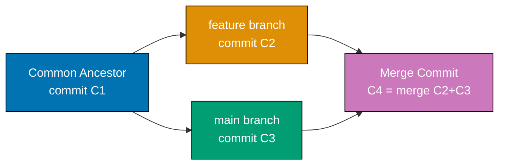
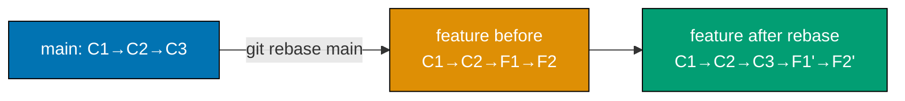
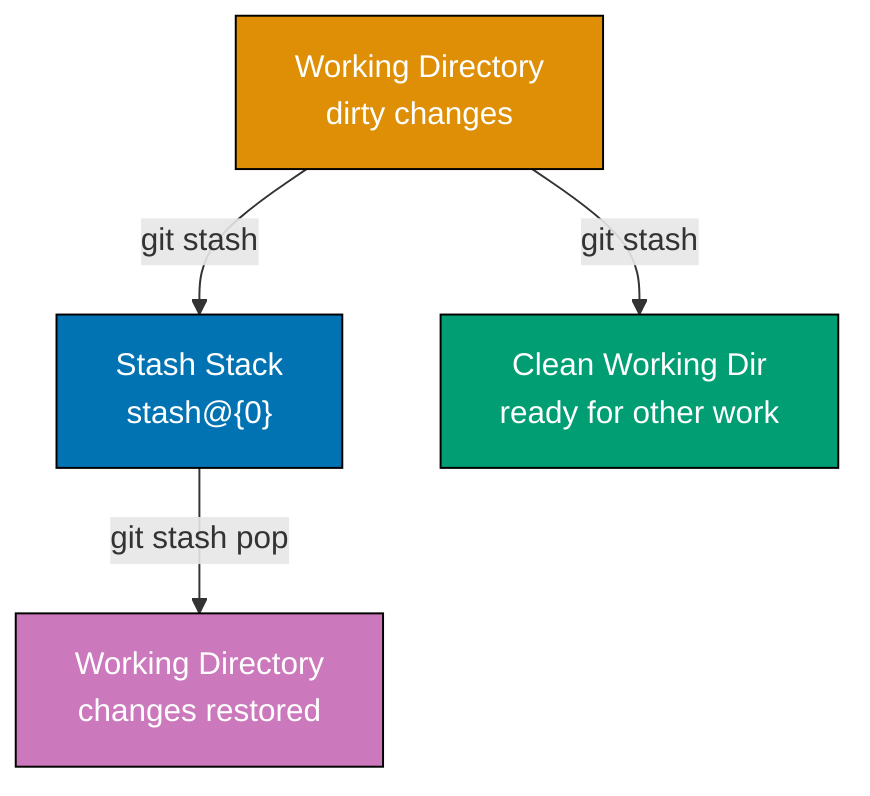
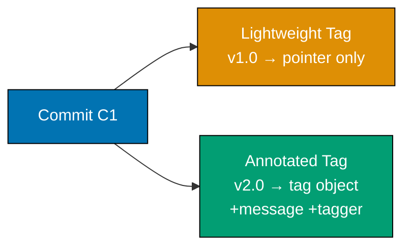
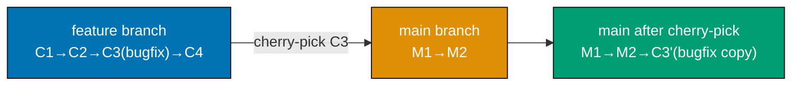
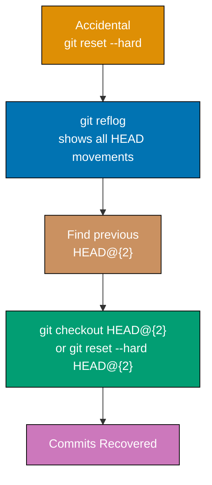
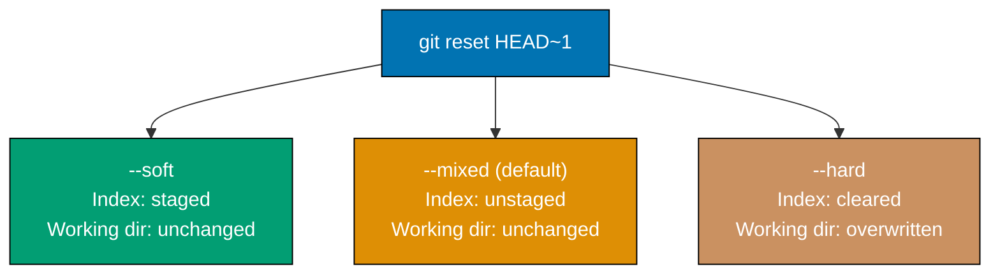
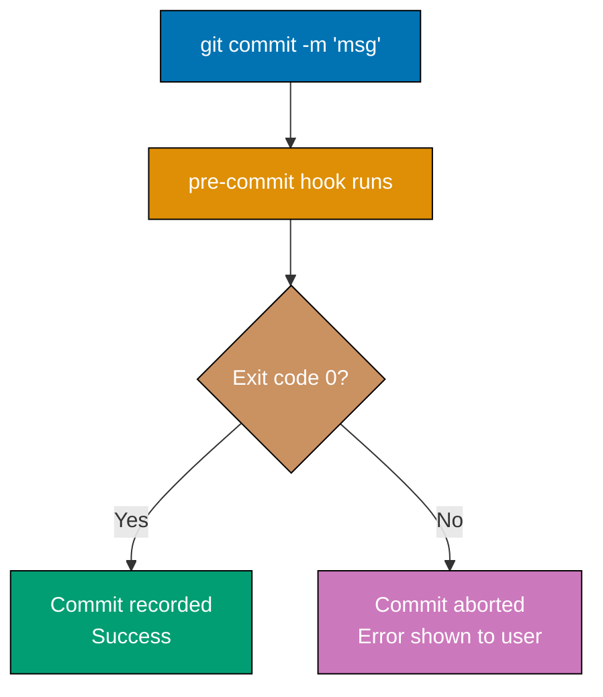
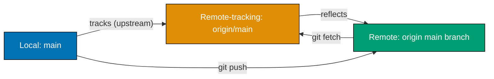
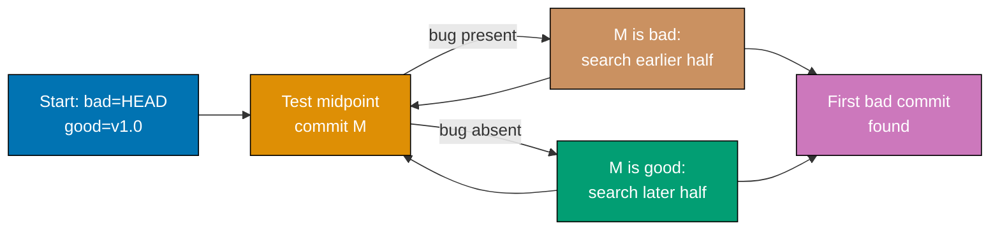

This file covers Examples 29–57, taking Git coverage from 40% to 75%. Each example is self-contained and runnable. The examples progress through branching workflows, history rewriting, remote management, and developer tooling that experienced engineers use daily in production repositories.

---

### Example 29: Three-Way Merge

Git performs a three-way merge when two branches have diverged from a common ancestor. It combines changes from both sides automatically unless the same lines conflict, creating a merge commit that preserves the full history of both branches.



```bash
# Set up a repository with diverging branches
git init three-way-demo                   # => Creates three-way-demo/ directory
cd three-way-demo                         # => Enters the new repo

echo "line1" > file.txt                   # => Creates file.txt with content "line1"
git add file.txt && git commit -m "init"  # => Records common ancestor commit C1

git checkout -b feature                   # => Creates and switches to 'feature' branch
echo "feature line" >> file.txt           # => Appends to file.txt on feature branch
git commit -am "add feature line"         # => Records commit C2 on feature branch
# => feature branch is now 1 commit ahead of main

git checkout main                         # => Returns to main branch
echo "main line" >> file.txt              # => Appends a different line on main
git commit -am "add main line"            # => Records commit C3 on main
# => main and feature have now diverged from C1

git merge feature                         # => Triggers three-way merge algorithm
# => Git finds common ancestor C1
# => Combines changes from C2 (feature) and C3 (main)
# => Creates merge commit C4 with two parents
# => Output: Merge made by the 'ort' strategy

git log --oneline --graph                 # => Shows the diamond-shaped merge topology
# => * <hash> (HEAD -> main) Merge branch 'feature'
# => |\
# => | * <hash> (feature) add feature line
# => * | <hash> add main line
# => |/
# => * <hash> init
```

**Key Takeaway**: Three-way merges preserve both branch histories via a merge commit, making the integration point explicit and auditable in the project timeline.

**Why It Matters**: Three-way merges are the backbone of team-based workflows. Pull requests in GitHub, GitLab, and Bitbucket produce merge commits by default, giving teams a permanent record of when and what was integrated. Unlike fast-forward merges, three-way merges make the branch lifecycle visible so reviewers can audit exactly which commits came from which feature branch. High-volume repositories use this to trace introduced regressions back to specific integration points.

---

### Example 30: Merge Conflict Resolution

A merge conflict occurs when both branches modify the same region of a file. Git marks the conflicting section with conflict markers and waits for the developer to resolve it manually before completing the merge.

```bash
git init conflict-demo                    # => Creates fresh repository
cd conflict-demo

echo "shared content" > shared.txt       # => Creates file on the default branch
git add shared.txt && git commit -m "base" # => Records the common ancestor

git checkout -b branch-a                  # => Creates branch-a
echo "branch-a change" > shared.txt      # => Overwrites entire file on branch-a
git commit -am "branch-a edit"           # => Records this change on branch-a

git checkout main                         # => Returns to main
echo "main change" > shared.txt          # => Overwrites same file differently on main
git commit -am "main edit"               # => Both branches now have conflicting edits

git merge branch-a                        # => Attempts the merge
# => CONFLICT (content): Merge conflict in shared.txt
# => Automatic merge failed; fix conflicts and then commit the result
# => Git sets exit code 1 and leaves repo in MERGING state

cat shared.txt                            # => Shows the conflict markers:
# => <<<<<<< HEAD
# => main change
# => =======
# => branch-a change
# => >>>>>>> branch-a
# => Lines between <<<< and ==== are HEAD (main); lines between ==== and >>>> are branch-a

echo "resolved content" > shared.txt     # => Replaces file with the resolved version
# => Developer must choose: keep ours, keep theirs, or write merged content

git add shared.txt                        # => Stages the resolved file
# => Marks conflict as resolved in the index

git commit                                # => Completes the merge with a merge commit
# => Git pre-fills commit message: "Merge branch 'branch-a'"
# => Use -m to override, or accept the default

git status                                # => Output: nothing to commit, working tree clean
```

**Key Takeaway**: Resolve conflicts by editing the file to the desired final state, removing all conflict markers, staging the file with `git add`, then running `git commit` to seal the merge.

**Why It Matters**: Conflict resolution is a non-negotiable skill in collaborative development. Teams that understand conflict markers resolve issues in minutes rather than hours. Automated tools like `git mergetool` or IDE integrations (VS Code, IntelliJ) provide visual three-way diff views, but understanding the raw marker format lets engineers handle conflicts in CI pipelines, production hotfix branches, and environments where only a terminal is available. Unresolved conflicts that accidentally get committed are a frequent source of production bugs.

---

### Example 31: git rebase (Basic Linear Rebase)

`git rebase` moves a branch's commits on top of another branch by replaying each commit one by one. The result is a linear history without a merge commit, as if you had started the branch from the current tip of the target.



```bash
git init rebase-demo                      # => Initializes new repository
cd rebase-demo

echo "v1" > app.txt && git add . && git commit -m "C1: init"  # => Creates base commit C1
echo "v2" >> app.txt && git commit -am "C2: main work"        # => Records C2 on main

git checkout -b feature HEAD~1            # => Creates feature branch from C1 (one behind main)
echo "feat" > feature.txt && git add . && git commit -m "F1: feature start"  # => Records F1
echo "feat2" >> feature.txt && git commit -am "F2: feature end"               # => Records F2
# => feature branch: C1 → F1 → F2 (misses C2 on main)

git rebase main                           # => Replays F1 and F2 on top of main (C1 → C2)
# => First, rewound head to replay your work on top of it...
# => Applying: F1: feature start  → creates F1' with new hash
# => Applying: F2: feature end    → creates F2' with new hash
# => feature is now: C1 → C2 → F1' → F2'

git log --oneline                         # => Shows linear history:
# => <hash> (HEAD -> feature) F2: feature end
# => <hash> F1: feature start
# => <hash> (main) C2: main work
# => <hash> C1: init

git checkout main && git merge feature    # => Fast-forward merge: no merge commit needed
# => Since feature is directly ahead of main, Git just moves the main pointer
# => Output: Fast-forward
```

**Key Takeaway**: `git rebase <target>` rewrites your branch's commits as new commits on top of `<target>`, producing a clean linear history ideal for fast-forward merges and readable logs.

**Why It Matters**: Rebasing is the standard workflow for keeping feature branches current with `main` in trunk-based development and many open-source projects. Linear history makes `git log --oneline` genuinely readable, `git bisect` faster to run, and code reviews cleaner since there are no extraneous merge commits. The trade-off is rewritten commit hashes — never rebase commits that others have already pulled, as this creates diverged histories that are painful to reconcile.

---

### Example 32: git rebase --onto (Selective Rebase)

`git rebase --onto` moves a range of commits from one base to another, allowing you to transplant a subset of commits without bringing along their original parent history.

```bash
git init onto-demo                        # => Creates repository for demonstration
cd onto-demo

echo "root" > f.txt && git add . && git commit -m "root"           # => Creates root commit
echo "A" >> f.txt && git commit -am "commit-A"                     # => Records A
echo "B" >> f.txt && git commit -am "commit-B"                     # => Records B on main

git checkout -b topic main               # => Creates topic branch at B
echo "C" >> f.txt && git commit -am "commit-C"  # => Records C on topic
echo "D" >> f.txt && git commit -am "commit-D"  # => Records D on topic
# => topic: root → A → B → C → D

# Suppose we only want C and D on top of root, not on top of B
git rebase --onto root commit-B topic    # => Syntax: --onto <newbase> <upstream> <branch>
# => <newbase>  = root  : where to place the moved commits
# => <upstream> = commit-B : exclude commits up to and including this
# => <branch>   = topic : the branch whose commits to move
# => Replays only C and D on top of root
# => topic becomes: root → C' → D'

git log --oneline                         # => Shows:
# => <hash> (HEAD -> topic) commit-D
# => <hash> commit-C
# => <hash> (root...) root
# => Commits A and B are no longer in topic's ancestry
```

**Key Takeaway**: `git rebase --onto <newbase> <upstream> <branch>` extracts the commits between `<upstream>` and `<branch>` tip, then replays them starting from `<newbase>`.

**Why It Matters**: `--onto` solves a specific but common problem: a feature branch was accidentally started from the wrong branch, or you need to extract a subset of work into its own branch. Without `--onto`, you would manually cherry-pick each commit. The three-argument form provides surgical precision for complex history reorganization operations that arise in long-lived project branches or when splitting large pull requests into smaller, reviewable units.

---

### Example 33: git stash save and pop

`git stash` saves your uncommitted changes (both staged and unstaged) onto a stack, restoring a clean working directory. `git stash pop` reapplies the most recent stash and removes it from the stack.



```bash
git init stash-demo && cd stash-demo
echo "v1" > work.txt && git add . && git commit -m "initial"  # => Records base commit

echo "in progress" >> work.txt            # => Modifies work.txt (uncommitted change)
echo "new file" > temp.txt               # => Creates an untracked file

git status                                # => Shows:
# => Changes not staged for commit:
# =>   modified:   work.txt
# => Untracked files:
# =>   temp.txt

git stash                                 # => Saves tracked changes; untracked files NOT saved by default
# => Saved working directory and index state WIP on main: <hash> initial
# => NOTE: temp.txt is NOT stashed (untracked)

git stash --include-untracked             # => To also stash untracked files, use this flag
# => Includes temp.txt in the stash entry

git status                                # => Output: nothing to commit, working tree clean
# => Working directory is now clean; safe to switch branches or pull

git stash pop                             # => Reapplies the most recent stash entry
# => Removes stash@{0} from the stack after applying
# => Output: On branch main — Changes not staged for commit: modified: work.txt

git status                                # => work.txt is modified again; temp.txt restored
# => Stack is now empty (stash pop removes the entry)
```

**Key Takeaway**: `git stash` creates a snapshot of dirty tracked files on a stack; `git stash pop` restores and removes the top entry. Use `--include-untracked` to stash new files too.

**Why It Matters**: Stashing is essential for context-switching in active codebases. When an urgent bug arrives while you are mid-feature, stash your work, fix the bug on the appropriate branch, then pop your stash to resume. Teams that do not use stash often resort to throwaway commits labeled "WIP" that pollute history. Stash keeps the commit graph clean while preserving partially complete work across branch switches.

---

### Example 34: git stash list, apply, and drop

When multiple stash entries accumulate, `git stash list` shows the full stack. `git stash apply` reapplies a specific entry without removing it, and `git stash drop` deletes a specific entry.

```bash
# Continuing from Example 33 setup (or start fresh)
git init stash-list-demo && cd stash-list-demo
echo "base" > f.txt && git add . && git commit -m "base"  # => Records base commit

echo "work1" >> f.txt && git stash                        # => Stash entry 0 created
# => stash@{0}: WIP on main: <hash> base

echo "work2" >> f.txt && git stash                        # => Stash entry 1 created
# => stash@{0} is now the newest (work2), pushing work1 to stash@{1}

echo "work3" >> f.txt && git stash                        # => Stash entry 2 created
# => Stack has three entries; newest is always stash@{0}

git stash list                            # => Shows all stash entries:
# => stash@{0}: WIP on main: <hash> base   ← most recent (work3)
# => stash@{1}: WIP on main: <hash> base   ← work2
# => stash@{2}: WIP on main: <hash> base   ← oldest (work1)

git stash apply stash@{1}                 # => Applies work2 WITHOUT removing it from stack
# => Changes restored to working directory
# => stash@{1} REMAINS in the list (apply ≠ pop)

git stash drop stash@{1}                  # => Removes stash@{1} from the stack
# => Dropped stash@{1} (<hash>)

git stash list                            # => Now shows only two entries:
# => stash@{0}: WIP on main: <hash> base
# => stash@{1}: WIP on main: <hash> base   ← was stash@{2}, renumbered

git stash clear                           # => Removes ALL stash entries at once
# => Use carefully — cannot be recovered after clearing
```

**Key Takeaway**: `git stash apply <ref>` restores a specific entry without removing it; `git stash drop <ref>` removes it; `git stash clear` removes all entries.

**Why It Matters**: Stash management matters in feature-rich development sprints where engineers juggle multiple partially-complete tasks. `apply` is safer than `pop` when you want to try restoring a stash while keeping a fallback copy. Production incidents often interrupt feature work multiple times in one day, building up a stash stack that must be managed deliberately. Understanding list, apply, and drop prevents accidental loss of unfinished work and keeps the stack from growing into an unmanageable pile.

---

### Example 35: git tag (Lightweight and Annotated)

Git tags mark specific commits as significant, typically for release versions. Lightweight tags are just pointers; annotated tags store extra metadata (tagger, date, message) and are checksummed objects in the Git database.



```bash
git init tag-demo && cd tag-demo
echo "release" > app.txt && git add . && git commit -m "v1 work"  # => Creates commit to tag

git tag v1.0                              # => Creates a LIGHTWEIGHT tag at HEAD
# => Lightweight tag: just a named reference (a file in .git/refs/tags/)
# => No message, no tagger info — a simple pointer to the commit hash

git tag -a v2.0 -m "Release version 2.0" # => Creates an ANNOTATED tag at HEAD
# => -a flag: create annotated tag (a full Git object)
# => -m flag: inline message; without -m, Git opens the editor
# => Annotated tag stores: tag name, message, tagger identity, and timestamp
# => Best practice: use annotated tags for public releases

git tag                                   # => Lists all tags in alphabetical order:
# => v1.0
# => v2.0

git show v2.0                             # => Shows annotated tag metadata + the commit:
# => tag v2.0
# => Tagger: Your Name <you@example.com>
# => Date:   <timestamp>
# => Release version 2.0
# =>
# => commit <hash> (HEAD -> main, tag: v2.0, tag: v1.0)

git tag v1.1 HEAD~0                       # => Tag a specific commit (even historical ones)
# => HEAD~0 = HEAD itself; use a commit hash to tag past commits

git push origin v2.0                      # => Push a single tag to remote
git push origin --tags                    # => Push ALL local tags to remote
# => Tags are NOT pushed automatically with git push; must be explicit
```

**Key Takeaway**: Use `git tag -a <name> -m "<msg>"` for release tags because annotated tags carry authorship and message metadata; lightweight tags suffice for private local bookmarks.

**Why It Matters**: Semantic versioning tags (v1.2.3) are the universal language of software release management. CI/CD pipelines trigger deployment workflows based on tag patterns — a push of a `v*` tag kicks off production builds in GitHub Actions, CircleCI, and Jenkins. Annotated tags appear in `git describe` output, enabling automatic version strings like `v1.2.3-7-g3a4b5c6` that identify exactly which commit a binary was built from. This traceability is critical for bug triage and reproducible builds.

---

### Example 36: git remote (add, remove, rename)

`git remote` manages the set of remote repositories a local repository tracks. Each remote is a named URL alias. Remotes can be added, renamed, and removed without affecting local branches or history.

```bash
git init remote-demo && cd remote-demo
echo "work" > f.txt && git add . && git commit -m "init"  # => Creates base commit

git remote add origin https://github.com/user/repo.git   # => Adds remote named 'origin'
# => 'origin' is the conventional name for the primary remote
# => Stores URL in .git/config under [remote "origin"]

git remote add upstream https://github.com/org/original.git  # => Adds a second remote
# => 'upstream' is the convention for the source repo when you fork
# => Allows fetching upstream changes without affecting origin

git remote -v                             # => Lists all remotes with their fetch and push URLs:
# => origin    https://github.com/user/repo.git (fetch)
# => origin    https://github.com/user/repo.git (push)
# => upstream  https://github.com/org/original.git (fetch)
# => upstream  https://github.com/org/original.git (push)

git remote rename origin primary          # => Renames remote 'origin' to 'primary'
# => Also renames all tracking branches: origin/main → primary/main
# => Updates .git/config automatically

git remote remove upstream                # => Removes the 'upstream' remote entirely
# => Deletes .git/config entry and all remote-tracking branches for 'upstream'
# => Does NOT affect local branches or commits

git remote -v                             # => Output now shows only 'primary'
# => primary   https://github.com/user/repo.git (fetch)
# => primary   https://github.com/user/repo.git (push)

git remote set-url primary https://github.com/user/new-repo.git  # => Changes URL
# => Useful after a repository is moved or renamed on the hosting service
```

**Key Takeaway**: `git remote add <name> <url>` registers a remote; `rename` and `remove` manage the registry without touching local history. Always verify URLs with `git remote -v`.

**Why It Matters**: Remote management is fundamental to fork-and-contribute workflows used across all major open-source projects. A forked repository typically has two remotes: `origin` (your fork, where you push) and `upstream` (the canonical source, from which you pull updates). Misconfigured remote URLs are a common source of confusion when repositories migrate between hosting providers (GitHub to GitLab, or self-hosted). Understanding `set-url` allows engineers to update all local clones in minutes rather than recloning.

---

### Example 37: git remote prune and Tracking Branches

Over time, branches deleted on the remote leave stale remote-tracking references locally. `git remote prune` removes these stale references, keeping the local branch list accurate.

```bash
# Assumes a repository with a real remote; simulate with a local bare repo
git init --bare remote.git                # => Creates a bare repository to act as remote
git clone remote.git local-repo           # => Clones it to local-repo
cd local-repo

git checkout -b feature-old               # => Creates a new branch
git push origin feature-old               # => Pushes it to the remote
# => Remote now has: main, feature-old

# Simulate remote deletion (another developer deleted the branch)
cd ../remote.git
git branch -d feature-old 2>/dev/null || true  # => Deletes from bare repo (simulating remote delete)
cd ../local-repo

git fetch                                 # => Fetches remote state; does NOT prune by default
git branch -a                             # => Shows ALL branches including remote-tracking:
# => * main
# =>   remotes/origin/HEAD -> origin/main
# =>   remotes/origin/feature-old          ← stale! branch deleted on remote
# =>   remotes/origin/main

git remote prune origin                   # => Removes stale remote-tracking refs for 'origin'
# => Pruning origin
# => [pruned] origin/feature-old
# => feature-old is removed from the local tracking list

git fetch --prune                         # => Combined: fetch + prune in one command
# => The recommended daily-use form; equivalent to fetch then prune

git branch -a                             # => Only live remote branches appear now
# => * main
# =>   remotes/origin/HEAD -> origin/main
# =>   remotes/origin/main
```

**Key Takeaway**: Run `git fetch --prune` regularly to synchronize the local view of remote branches with reality. Stale remote-tracking refs do not affect local branches but create confusion in branch listings.

**Why It Matters**: In active teams, short-lived feature branches are created and deleted dozens of times per week. Without pruning, `git branch -a` grows into an unmanageable list of defunct branches, making it hard to identify currently active work. Many teams set `fetch.prune = true` in `.git/config` to prune automatically on every fetch. CI systems that list remote branches for deployment automation will operate on stale data unless pruning is part of the pipeline setup.

---

### Example 38: git cherry-pick

`git cherry-pick` applies the changes introduced by a specific commit onto the current branch. It creates a new commit with the same diff but a different hash, parent, and timestamp — effectively copying a change without merging entire branches.



```bash
git init cherry-demo && cd cherry-demo
echo "main v1" > app.txt && git add . && git commit -m "M1: main init"  # => Records M1

git checkout -b feature                   # => Creates feature branch from M1
echo "feat A" >> app.txt && git commit -am "C1: feature work A"  # => Records C1
echo "bugfix" >> app.txt && git commit -am "C2: critical bugfix"  # => Records bugfix commit C2
echo "feat B" >> app.txt && git commit -am "C3: feature work B"  # => Records C3

git log --oneline                         # => Shows:
# => <hash_C3> (HEAD -> feature) C3: feature work B
# => <hash_C2> C2: critical bugfix         ← we want this on main NOW
# => <hash_C1> C1: feature work A
# => <hash_M1> (main) M1: main init

git checkout main                         # => Returns to main branch
git cherry-pick <hash_C2>                 # => Replace <hash_C2> with the actual hash shown above
# => [main <new_hash>] C2: critical bugfix
# => 1 file changed, 1 insertion(+)
# => Creates C2' — same diff as C2 but new hash, new parent (M1), new timestamp

git log --oneline                         # => Shows cherry-picked commit on main:
# => <new_hash> (HEAD -> main) C2: critical bugfix
# => <hash_M1> M1: main init
# => main now has the bugfix; feature branch is unaffected

git cherry-pick <hash_C1> <hash_C3>      # => Pick multiple commits in order
git cherry-pick <hash_C1>..<hash_C3>     # => Pick a range (excludes C1, includes C3)
```

**Key Takeaway**: `git cherry-pick <hash>` copies a commit's diff onto the current branch. Use it to backport bugfixes to release branches without merging the entire feature.

**Why It Matters**: Cherry-pick is the standard mechanism for hotfix backporting in release-branch workflows. When a bug is fixed on `main` and must also be patched in `release/v1.x` and `release/v2.x`, cherry-pick applies the exact fix without carrying unrelated feature work. Continuous delivery pipelines at companies like Google and Netflix automate cherry-picks to propagate security patches across dozens of active release branches simultaneously, reducing the window between vulnerability discovery and patch delivery.

---

### Example 39: git blame

`git blame` shows who last modified each line of a file, along with the commit hash and timestamp. It is the primary tool for understanding the authorship history of individual lines.

```bash
git init blame-demo && cd blame-demo

# Create a file with multiple authors simulated by multiple commits
echo "line one content" > notes.txt && git add . && git commit -m "add line 1" \
  --author="Alice <alice@example.com>"   # => Records line 1 with Alice as author

echo "line two content" >> notes.txt && git commit -am "add line 2" \
  --author="Bob <bob@example.com>"       # => Records line 2 with Bob as author

echo "line three content" >> notes.txt && git commit -am "add line 3" \
  --author="Carol <carol@example.com>"   # => Records line 3 with Carol as author

git blame notes.txt                      # => Shows per-line authorship:
# => ^abc1234 (Alice 2026-03-20 10:00:00 +0700 1) line one content
# => ^def5678 (Bob   2026-03-20 10:01:00 +0700 2) line two content
# => ^ghi9012 (Carol 2026-03-20 10:02:00 +0700 3) line three content
# => Format: <short-hash> (<author> <date> <line-number>) <content>

git blame -L 2,3 notes.txt               # => Shows blame for only lines 2–3
# => -L <start>,<end> : restricts output to the specified line range
# => Useful for large files where only a section is under investigation

git blame --since=1.week notes.txt       # => Shows only blame for lines changed in last week
# => Lines unchanged longer than 1 week show ^<hash> (before the range)

git blame -w notes.txt                   # => Ignores whitespace changes when attributing blame
# => Prevents reformatting commits from claiming authorship of every line
```

**Key Takeaway**: `git blame <file>` reveals who changed each line last and when. Use `-L` to restrict the range and `-w` to ignore whitespace-only changes.

**Why It Matters**: Blame is the first tool engineers reach for when debugging unexpected behavior or understanding a piece of unfamiliar code. Rather than guessing why a line exists, `git blame` reveals the commit that introduced it, and `git show <hash>` shows the full context of that change. IDEs like VS Code (GitLens), JetBrains, and Emacs integrate blame into the editor gutter so the information is always one hover away. Code review culture increasingly asks "blame before asking" as a time-saving practice.

---

### Example 40: git reflog

`git reflog` records every time the tip of HEAD (or any ref) changes, including operations like reset, rebase, and checkout. It provides a local safety net for recovering from history-rewriting mistakes.



```bash
git init reflog-demo && cd reflog-demo
echo "v1" > f.txt && git add . && git commit -m "commit 1"   # => C1
echo "v2" >> f.txt && git commit -am "commit 2"              # => C2
echo "v3" >> f.txt && git commit -am "commit 3"              # => C3

git log --oneline                         # => C3 → C2 → C1

git reset --hard HEAD~2                   # => Moves HEAD back 2 commits to C1
# => Discards C2 and C3 from branch history
# => HEAD now points to C1; C2 and C3 appear lost

git log --oneline                         # => Only shows C1 — C2 and C3 are "gone"

git reflog                                # => Shows every HEAD change, including the reset:
# => <hash_C1> (HEAD -> main) HEAD@{0}: reset: moving to HEAD~2
# => <hash_C3>                HEAD@{1}: commit: commit 3
# => <hash_C2>                HEAD@{2}: commit: commit 2
# => <hash_C1>                HEAD@{3}: commit: commit 1
# => reflog entries persist for 90 days by default

git reset --hard HEAD@{1}                 # => Recover C3 by resetting to the reflog entry
# => HEAD@{1} holds the hash of C3 before the reset happened
# => HEAD is now back at C3; C2 and C3 are fully restored

git log --oneline                         # => C3 → C2 → C1 restored
# => git reflog + reset is the rescue sequence for accidental hard resets
```

**Key Takeaway**: `git reflog` records every ref movement locally; use `git reset --hard HEAD@{N}` to restore a previous state after destructive operations like `reset --hard` or `rebase`.

**Why It Matters**: Reflog is Git's undo button for history-rewriting operations that `git log` cannot see. Every experienced Git user has accidentally run `git reset --hard` or `git rebase` and feared data loss. Reflog entries survive for 90 days by default (`gc.reflogExpire`), providing a generous window for recovery. The combination of reflog + reset has saved countless hours of work across the industry, making seemingly irreversible mistakes routine recoverable situations.

---

### Example 41: git reset --soft, --mixed, --hard

`git reset` moves the branch pointer to a target commit. The three modes differ in what happens to the index (staging area) and working directory after the pointer moves.



**Soft reset — keeps changes staged**:

```bash
git init reset-demo && cd reset-demo
echo "v1" > f.txt && git add . && git commit -m "C1"   # => C1
echo "v2" >> f.txt && git commit -am "C2"              # => C2

git reset --soft HEAD~1                   # => Moves branch pointer back to C1
# => C2 commit no longer exists on branch
# => Changes from C2 remain in the INDEX (staged), ready to re-commit
# => Working directory unchanged

git status                                # => Shows: Changes to be committed: modified: f.txt
# => --soft is ideal for "amend via re-commit" without the editor workflow
```

**Mixed reset — unstages but keeps files**:

```bash
git reset --mixed HEAD~1                  # => Moves pointer back, clears index
# => --mixed is the DEFAULT if no flag specified (git reset HEAD~1)
# => Changes are in working directory but NOT staged
# => git status shows: Changes not staged for commit: modified: f.txt
# => Useful for reworking a commit: unstage, re-edit, re-add, re-commit
```

**Hard reset — discards everything**:

```bash
git reset --hard HEAD~1                   # => Moves pointer back AND overwrites working dir
# => Index is cleared AND working directory files revert to HEAD~1 state
# => WARNING: Unsaved local changes are permanently lost (use with care)
# => git status shows: nothing to commit, working tree clean
# => Use when you want to abandon a commit AND all its local changes
```

**Key Takeaway**: `--soft` keeps staged changes, `--mixed` unstages them to the working directory, `--hard` discards everything. Default is `--mixed`. Never `--hard` reset commits others have pulled.

**Why It Matters**: Mastering the three reset modes gives engineers precise control over commit history cleanup. `--soft` enables "squash via reset" — a faster alternative to interactive rebase for combining the last N commits into one. `--mixed` enables commit surgery: go back, adjust the work, re-commit with a better message. `--hard` is the escape hatch for abandoned experiments. Code review workflows often require reset to clean up a messy feature branch before submitting a pull request.

---

### Example 42: git revert

`git revert` creates a new commit that exactly undoes the changes introduced by a specified commit. Unlike `git reset`, it does not remove the original commit from history, making it safe to use on shared branches.

```bash
git init revert-demo && cd revert-demo
echo "base" > app.txt && git add . && git commit -m "C1: base"    # => C1
echo "good feature" >> app.txt && git commit -am "C2: add feature" # => C2
echo "bad change" >> app.txt && git commit -am "C3: bad change"    # => C3 (the problem)
echo "more work" >> app.txt && git commit -am "C4: later work"     # => C4

git log --oneline                         # => C4 → C3 → C2 → C1
# => C3 introduced a bug that is now in production

git revert HEAD~1                         # => Reverts C3 (HEAD~1 is one behind HEAD = C3)
# => Opens editor for the revert commit message
# => Default message: "Revert 'C3: bad change'"
# => Creates C5 that exactly inverts C3's diff
# => C4 (later work) is preserved; only C3's changes are undone

git log --oneline                         # => C5(revert C3) → C4 → C3 → C2 → C1
# => C3 is still in history (audit trail preserved)
# => C5 contains the inverse patch

git revert <hash_C3> --no-edit            # => Reverts by hash; --no-edit skips the editor
# => --no-edit uses the default "Revert ..." message automatically

git revert HEAD~2..HEAD                   # => Reverts a range (C3 and C4 in this example)
# => Creates one revert commit per reverted commit
git revert --no-commit HEAD~2..HEAD       # => Stages reversals without committing
# => Allows combining multiple reverts into a single commit
```

**Key Takeaway**: `git revert <commit>` creates an inverse patch as a new commit, safely undoing a change without altering existing history — essential for shared/public branches.

**Why It Matters**: Revert is the production-safe undo. When a bad deployment reaches `main` or a release branch, `reset` would rewrite history that team members have already pulled — causing chaos. Revert appends a new undo commit that everyone can safely fetch and apply. Major platforms like GitHub explicitly recommend revert over reset for shared branches. Many organizations' incident response runbooks include `git revert` as the standard rollback mechanism because it leaves a clear audit trail showing when and why a change was undone.

---

### Example 43: git clean

`git clean` removes untracked files and directories from the working tree. It is the complement to `git checkout` for tracked files — it eliminates generated artifacts, build outputs, and leftover temporary files.

```bash
git init clean-demo && cd clean-demo
echo "tracked" > tracked.txt && git add . && git commit -m "init"  # => Tracks one file

echo "untracked" > untracked.txt         # => Creates an untracked file
mkdir build && echo "artifact" > build/output.bin  # => Creates an untracked directory

git status                                # => Shows:
# => Untracked files:
# =>   untracked.txt
# =>   build/

git clean -n                              # => DRY RUN: shows what WOULD be removed
# => -n (or --dry-run): preview without deleting
# => Would remove untracked.txt
# => NOTE: build/ directory NOT shown; -d flag needed for directories

git clean -nd                             # => Dry run including untracked directories
# => Would remove untracked.txt
# => Would remove build/

git clean -fd                             # => ACTUALLY removes files AND directories
# => -f (--force): required safety flag; prevents accidental deletion
# => -d: also removes untracked directories
# => Removing untracked.txt
# => Removing build/

git clean -fdx                            # => Also removes ignored files (e.g., build artifacts)
# => -x: removes files matching .gitignore patterns too
# => Useful for clean build: removes node_modules/, target/, dist/
# => WARNING: -x removes .env files if they are gitignored

git status                                # => Output: nothing to commit, working tree clean
```

**Key Takeaway**: Always run `git clean -n` (dry run) before `git clean -f` to preview what will be deleted. Use `-d` for directories and `-x` for ignored files.

**Why It Matters**: Build systems accumulate generated artifacts that confuse compilers and test runners when they go stale. `git clean -fdx` is the standard "nuke the build cache" command in CI pipelines before a fresh compilation. Running it before `git stash` or before switching between feature branches prevents contaminating one branch's state with another's build artifacts. The mandatory `-f` flag is a deliberate friction point that prevents catastrophic accidental deletions — a design decision praised by developers who have accidentally deleted days of untracked work.

---

### Example 44: .gitattributes

`.gitattributes` controls how Git handles specific files: line ending normalization, diff display, merge strategy, and binary vs text classification. It lives in the repository root and is committed alongside source code.

```bash
# Create a .gitattributes file
cat > .gitattributes << 'EOF'
# Normalize line endings to LF on commit, convert to OS-native on checkout
* text=auto                               # => Auto-detect text files; normalize to LF in repo

# Explicitly mark file types
*.sh text eol=lf                          # => Shell scripts always LF (must be LF for Unix execution)
*.bat text eol=crlf                       # => Windows batch files always CRLF

# Binary files — no line ending conversion, no diff
*.png binary                              # => Treat PNG as binary: no CR/LF mangling
*.jpg binary                              # => Same for JPEG
*.pdf binary                              # => Same for PDF
*.zip binary                              # => Same for archives

# Custom diff driver for lock files (show package name in diff header)
package-lock.json diff=json               # => Use json diff driver for lock files
yarn.lock -diff                           # => Disable diff for yarn.lock (too noisy)

# Merge strategy: always take ours for generated files
*.min.js merge=ours                       # => Minified files: keep ours on merge conflict
EOF

git add .gitattributes && git commit -m "add .gitattributes"  # => Commits the attribute rules
# => Rules apply to ALL future operations involving matched files

git ls-files --eol                        # => Shows the eol handling for each tracked file:
# => i/lf   w/lf   attr/text=auto    tracked.txt
# => i = index (stored in Git), w = working tree, attr = attribute applied
```

**Key Takeaway**: Commit `.gitattributes` to enforce consistent line endings, binary classifications, and merge strategies across all contributors' machines regardless of their local Git configuration.

**Why It Matters**: The most common cross-platform collaboration bug is line ending corruption — Windows uses CRLF, Unix uses LF, and macOS uses LF. Without `.gitattributes`, a single Windows developer can silently convert an entire file to CRLF, generating a diff that touches every line and obscuring the real change. The `text=auto` setting, combined with explicit per-extension overrides, is the industry-standard solution adopted by GitHub's own repositories. Properly classified binary files also prevent Git from attempting to merge image assets, which produces corrupt outputs.

---

### Example 45: Git Hooks (pre-commit)

Git hooks are executable scripts in `.git/hooks/` that run automatically at specific points in the Git workflow. The `pre-commit` hook runs before a commit is recorded and can abort the commit by exiting non-zero.



```bash
git init hook-demo && cd hook-demo
echo "code" > app.sh && git add .

# Create a pre-commit hook
cat > .git/hooks/pre-commit << 'EOF'
#!/bin/sh
# pre-commit: runs before every commit; exit non-zero to abort

# Check for debug statements left in staged files
if git diff --cached --name-only | xargs grep -l "console.log\|debugger\|TODO: REMOVE" 2>/dev/null; then
    echo "ERROR: Debug statements found. Remove before committing."
    exit 1                                # => Non-zero exit aborts the commit
fi

# Run linter on staged JS files
staged_js=$(git diff --cached --name-only --diff-filter=ACM | grep "\.js$")
if [ -n "$staged_js" ]; then
    echo "$staged_js" | xargs eslint --quiet 2>/dev/null || exit 1
    # => eslint exit code 1 if violations found; hook inherits the exit code
fi

exit 0                                    # => Exit 0 = all checks passed, proceed with commit
EOF

chmod +x .git/hooks/pre-commit            # => Must be executable; Git ignores non-executable hooks
# => chmod +x is required; this is the most common reason hooks silently don't run

git commit -m "test commit"               # => Triggers the hook automatically
# => If grep finds debug statements: "ERROR: Debug statements found." → commit aborted
# => If checks pass: commit proceeds normally

# Bypass hooks in emergencies (use sparingly)
git commit --no-verify -m "emergency fix" # => --no-verify skips ALL hooks
# => Useful when a hook is broken and blocking urgent work
# => Document usage in the commit message
```

**Key Takeaway**: `pre-commit` hooks enforce quality gates at commit time. Make them executable with `chmod +x`, keep them fast (under 5 seconds), and ensure they exit 0 on success and non-zero on failure.

**Why It Matters**: Pre-commit hooks shift quality checks left to the developer's machine, catching issues before they enter the repository rather than after. Tools like Husky (Node.js), pre-commit (Python), and lefthook (Go) provide cross-platform hook management with team-wide configuration. Meta, Google, and Airbnb enforce code formatting, import sorting, and secret detection via pre-commit hooks, preventing entire categories of review comments and CI failures. The 5-second rule keeps developer flow intact — slow hooks get disabled by frustrated engineers.

---

### Example 46: Git Hooks (commit-msg and pre-push)

The `commit-msg` hook validates the commit message format after the developer writes it, and the `pre-push` hook runs tests or checks before pushing to a remote — both can abort their respective operations by exiting non-zero.

```bash
git init hooks-demo2 && cd hooks-demo2
echo "app" > app.txt && git add .

# commit-msg hook: enforce Conventional Commits format
cat > .git/hooks/commit-msg << 'EOF'
#!/bin/sh
# commit-msg: receives the path to the commit message file as $1

MSG_FILE="$1"                             # => $1 = path to temporary commit message file
MSG=$(cat "$MSG_FILE")                    # => Read the proposed message

# Conventional Commits pattern: type(scope): description
PATTERN="^(feat|fix|docs|style|refactor|test|chore|ci|perf|revert)(\(.+\))?: .{1,100}$"

if ! echo "$MSG" | grep -qE "$PATTERN"; then
    echo "ERROR: Commit message must follow Conventional Commits:"
    echo "  feat(scope): add new feature"
    echo "  fix: resolve null pointer issue"
    echo "Got: $MSG"
    exit 1                                # => Aborts commit; developer must re-run with valid message
fi

exit 0                                    # => Message is valid; commit proceeds
EOF
chmod +x .git/hooks/commit-msg            # => Must be executable

# pre-push hook: run tests before allowing a push
cat > .git/hooks/pre-push << 'EOF'
#!/bin/sh
# pre-push: runs before git push executes the network operation
# Receives remote name and URL via stdin in format: <local-ref> <local-sha> <remote-ref> <remote-sha>

echo "Running tests before push..."
# Replace with your actual test command
if ! make test 2>/dev/null; then          # => Run test suite; non-zero exit aborts push
    echo "Tests failed. Push rejected."
    exit 1
fi

exit 0                                    # => Tests passed; push proceeds
EOF
chmod +x .git/hooks/pre-push              # => Must be executable

git commit -m "bad message"              # => Triggers commit-msg hook
# => ERROR: Commit message must follow Conventional Commits
# => Commit aborted

git commit -m "feat: add initial app"    # => Passes the hook; commit succeeds
```

**Key Takeaway**: `commit-msg` validates message format from the written message file (`$1`); `pre-push` runs longer checks (tests, linting) before network operations. Both are enforced via exit codes.

**Why It Matters**: Conventional Commits enforced by `commit-msg` hooks enable automated changelog generation, semantic versioning bumps, and release note creation. Tools like `semantic-release` and `release-please` parse commit history to determine version numbers automatically — but only if the messages are consistently formatted. `pre-push` hooks catch CI failures locally, saving 5–15 minutes of pipeline wait time per broken push. Teams using this pattern report measurably fewer "fix CI" commits that inflate and obscure project history.

---

### Example 47: git config (Local, Global, System)

Git configuration operates at three scopes: system (all users on the machine), global (current user), and local (current repository). Each scope overrides the previous one, and `git config` reads and writes at each level.

```bash
# System scope: /etc/gitconfig (requires admin/sudo)
git config --system core.autocrlf false  # => Sets system-wide line ending policy
# => Applies to ALL users on this machine
# => Rarely changed; usually set by system administrators

# Global scope: ~/.gitconfig (current user, all repos)
git config --global user.name "Alice Developer"       # => Sets author name for all commits
git config --global user.email "alice@example.com"    # => Sets author email for all commits
git config --global core.editor "vim"                 # => Sets commit message editor
git config --global init.defaultBranch main           # => Sets default branch name for git init
git config --global pull.rebase true                  # => Always rebase on pull (instead of merge)
git config --global fetch.prune true                  # => Auto-prune stale remote branches on fetch

# Local scope: .git/config (current repository only)
git init local-config-demo && cd local-config-demo
git config --local user.email "alice-work@company.com"  # => Overrides global email for this repo
# => Useful for work repos that need a corporate email vs personal email elsewhere
git config --local core.hooksPath .hooks              # => Custom hooks directory in the repo
# => Allows sharing hooks via version control (unlike .git/hooks which is not tracked)

git config --list --show-origin           # => Shows all config values and their source file:
# => file:/etc/gitconfig     core.autocrlf=false
# => file:/home/alice/.gitconfig  user.name=Alice Developer
# => file:/path/.git/config  user.email=alice-work@company.com
# => Local values override global which override system

git config user.email                     # => Reads the effective value for the current repo
# => alice-work@company.com (local overrides global)

git config --unset user.email             # => Removes a config key from local scope
git config --global --unset core.editor   # => Removes a key from global scope
```

**Key Takeaway**: Local config overrides global which overrides system. Use `--global` for personal defaults across all repos and `--local` for per-project overrides like work email or custom hooks paths.

**Why It Matters**: Misconfigured `user.email` is one of the most common commit hygiene issues — commits appear from personal email in corporate repositories or vice versa. The three-tier config hierarchy solves this cleanly: set your default identity globally, then override with `--local` per repository. Security-conscious organizations use `core.hooksPath` with a version-controlled `.hooks/` directory to enforce consistent pre-push checks across the team without relying on each developer manually installing hooks from `.git/hooks/`.

---

### Example 48: Git Aliases

Git aliases create shorthand commands registered in `.gitconfig`. They can abbreviate common commands or compose complex multi-flag operations into memorable single words.

```bash
# Define aliases globally (available in all repositories)
git config --global alias.st status      # => 'git st' now runs 'git status'
git config --global alias.co checkout    # => 'git co feature' runs 'git checkout feature'
git config --global alias.br branch      # => 'git br' runs 'git branch'
git config --global alias.ci commit      # => 'git ci -m "msg"' runs 'git commit -m "msg"'

# Complex aliases: multi-flag log formatting
git config --global alias.lg "log --oneline --graph --decorate --all"
# => 'git lg' shows a compact graphical branch/tag view of all history

git config --global alias.last "log -1 HEAD --stat"
# => 'git last' shows the most recent commit with file change stats

# Aliases that call shell commands (prefix with !)
git config --global alias.root '!git rev-parse --show-toplevel'
# => 'git root' prints the repository root directory path
# => The ! prefix routes the alias through the shell, not git itself

git config --global alias.wip '!git add -A && git commit -m "WIP: checkpoint"'
# => 'git wip' stages everything and creates a work-in-progress checkpoint commit

# Verify the aliases were saved
cat ~/.gitconfig                          # => Shows the [alias] section:
# => [alias]
# =>     st = status
# =>     co = checkout
# =>     lg = log --oneline --graph --decorate --all
# =>     root = !git rev-parse --show-toplevel

# Use the aliases
git st                                    # => Runs: git status
git lg                                    # => Runs: git log --oneline --graph --decorate --all
git root                                  # => Prints: /path/to/repository/root
```

**Key Takeaway**: Define short aliases for frequent commands with `git config --global alias.<name> <expansion>`. Use the `!` prefix to run arbitrary shell commands as aliases.

**Why It Matters**: Aliases compound over a career — a developer who runs `git status` fifty times per day saves hours per year by aliasing it to `git st`. More importantly, complex log or diff aliases encode team conventions ("how we view history here") into reusable commands. Open-source project `CONTRIBUTING.md` files often include recommended aliases so new contributors immediately have the same workflow as the maintainers. Aliases in `.gitconfig` are portable via dotfiles repositories, carrying personalized workflows across machines seamlessly.

---

### Example 49: git log Advanced (--graph, --oneline, --author, date ranges)

`git log` accepts dozens of flags for filtering, formatting, and visualizing commit history. The advanced options transform it from a scrolling wall of text into a precise forensic tool.

```bash
git init log-demo && cd log-demo
git config user.name "Alice" && git config user.email "alice@example.com"
echo "v1" > f.txt && git add . && git commit -m "feat: initial commit"
git config user.name "Bob" && git config user.email "bob@example.com"
echo "v2" >> f.txt && git commit -am "fix: patch bug"
git config user.name "Alice" && git config user.email "alice@example.com"
git checkout -b feature && echo "v3" >> f.txt && git commit -am "feat: add feature"
git checkout main && git merge feature --no-ff -m "Merge feature branch"
# => Builds a repository with multiple authors and a merge commit

git log --oneline                         # => Compact: one line per commit
# => <hash> (HEAD -> main) Merge feature branch
# => <hash> (feature) feat: add feature
# => <hash> fix: patch bug
# => <hash> feat: initial commit

git log --oneline --graph --all           # => Shows branch topology with ASCII art
# => *   <hash> (HEAD -> main) Merge feature branch
# => |\
# => | * <hash> (feature) feat: add feature
# => * | <hash> fix: patch bug
# => |/
# => * <hash> feat: initial commit

git log --author="Alice"                  # => Filters commits by author name (partial match)
# => Shows only commits where author contains "Alice"

git log --since="1 week ago" --until="now"  # => Date range filter
# => --since (or --after) and --until (or --before) accept human-readable dates
# => Also accepts: "2026-01-01", "yesterday", "2 days ago"

git log --grep="feat"                     # => Filters by commit message content (case-sensitive)
# => --grep accepts a regex pattern; -i flag makes it case-insensitive

git log --all --oneline -- path/to/file   # => Shows only commits touching a specific file
# => -- separator distinguishes paths from branch names

git log -n 5                              # => Shows only the last 5 commits
# => -n <number> limits output count; same as --max-count=<number>

git log --format="%h %an %s" --no-merges # => Custom format, skip merge commits
# => %h: short hash, %an: author name, %s: subject line
# => --no-merges: excludes merge commits from output
```

**Key Takeaway**: Combine `--oneline --graph --all` for topology visualization; use `--author`, `--since`, `--grep`, and `-- <path>` to filter history by who, when, what message, or which file.

**Why It Matters**: Advanced `git log` usage separates engineers who hunt through history manually from those who find answers in seconds. Filtering by author lets tech leads quickly audit contributions during performance reviews. Date range queries power release note generation scripts. File-path filtering (`-- path/file`) instantly identifies everyone who ever touched a specific module. Teams that master log filtering reduce the time spent in archaeology from hours to minutes, which compounds across thousands of debugging sessions over a product's lifetime.

---

### Example 50: git diff Advanced (--cached, branch comparison, stat)

`git diff` compares working tree, index, and commit states. The advanced forms compare branches, show only changed file names, and produce statistics — essential for code reviews and release summaries.

```bash
git init diff-demo && cd diff-demo
echo "original" > file.txt && git add . && git commit -m "C1"   # => Records C1

echo "modified" > file.txt               # => Modifies file.txt (unstaged)
echo "new content" > new.txt && git add new.txt  # => Stages new.txt only

git diff                                  # => Compares working tree vs index (unstaged changes)
# => Shows: file.txt changed from "original" to "modified"
# => new.txt NOT shown (it is staged, not in working tree diff)

git diff --cached                         # => Compares index vs last commit (staged changes)
# => Also written as: git diff --staged (exact synonym)
# => Shows: new.txt added with "new content"
# => file.txt NOT shown (it is not staged yet)

git add file.txt                          # => Stages file.txt
git diff HEAD                             # => Compares working tree vs HEAD commit
# => Shows ALL changes (both staged and unstaged) vs last commit
# => Equivalent to: git diff HEAD -- .

git commit -m "C2: all changes"          # => Records C2

git checkout -b feature
echo "feature work" >> file.txt && git commit -am "C3: feature"
git checkout main

git diff main..feature                    # => Shows commits in feature but not in main
# => Dot-dot: reachable from feature, not reachable from main
git diff main...feature                   # => Shows changes since branches diverged
# => Triple-dot: diff from common ancestor to feature tip (ignores main's commits)

git diff --stat main feature              # => Summary: file names + insertions/deletions
# => file.txt | 1 +
# => 1 file changed, 1 insertion(+)
# => --stat is ideal for pull request previews

git diff --name-only main feature         # => Lists only changed file names (no diff content)
# => Useful for scripts that need to process changed files
```

**Key Takeaway**: `git diff` (no args) = unstaged changes; `git diff --cached` = staged changes; `git diff HEAD` = all changes vs last commit; `git diff A..B` = commits in B not in A.

**Why It Matters**: Understanding the three diff modes (`diff`, `diff --cached`, `diff HEAD`) is fundamental to the Git staging workflow. Developers who confuse staged vs unstaged diffs routinely commit incomplete or incorrect change sets. Branch comparison diffs (`main..feature`, `--stat`) are the building blocks of pull request summaries, automated changelog generators, and deployment scripts that determine which files changed between releases. The `--name-only` flag powers CI tools that run only the tests relevant to the files modified in a PR, dramatically reducing pipeline duration.

---

### Example 51: Merge Strategies (ours and theirs)

Git's `-X ours` and `-X theirs` merge strategy extensions resolve all conflicts automatically by favoring one side. They do not select an entire branch — they only apply to conflicting hunks, leaving non-conflicting changes from both sides intact.

```bash
git init strategy-demo && cd strategy-demo
echo "shared content" > config.txt && git add . && git commit -m "base"

git checkout -b branch-a
echo "branch-a value" > config.txt && git commit -am "branch-a sets config"

git checkout main
echo "main value" > config.txt && git commit -am "main sets config"

# Merge with 'ours' strategy extension: on conflict, prefer our (main) version
git merge -X ours branch-a               # => Merges branch-a; conflicts auto-resolved to main's version
# => -X ours: when lines conflict, keep HEAD (current branch = main) version
# => Non-conflicting changes from branch-a are still applied
# => Output: Merge made by the 'ort' strategy

cat config.txt                            # => Shows "main value" (ours was preferred)

# Reset and try theirs
git reset --hard HEAD~1                   # => Undo the merge for demonstration
git merge -X theirs branch-a             # => Merges; conflicts auto-resolved to branch-a's version
# => -X theirs: when lines conflict, keep the incoming branch's version
cat config.txt                            # => Shows "branch-a value" (theirs was preferred)

# The 'ours' STRATEGY (not extension) is different:
git checkout main
git merge --strategy=ours branch-a        # => Entire branch-a content discarded
# => --strategy=ours (without -X): result is identical to current HEAD regardless of branch-a
# => Useful for marking branch-a as "merged" without applying any of its changes
# => Common use case: recording that an abandoned branch was intentionally discarded
```

**Key Takeaway**: `-X ours` and `-X theirs` are conflict-resolution extensions that auto-select one side for all conflicts. `--strategy=ours` (a different option) discards the merged branch entirely.

**Why It Matters**: Automated merge pipelines for generated files, documentation builds, and lock files cannot pause for manual conflict resolution. Using `-X ours` or `-X theirs` enables fully automated merges for files where the ownership policy is clear. For example, merging a localization branch where translations should always win (`-X theirs`) or merging a dependency update branch where the main branch's pinned versions take precedence (`-X ours`). Understanding the distinction between `-X ours` (conflict resolution) and `--strategy=ours` (full discard) prevents silently losing important changes.

---

### Example 52: Tracking Branches and Upstream Configuration

A tracking branch is a local branch that has an upstream relationship with a remote branch. This relationship enables `git pull`, `git push`, and `git status` to show how far ahead or behind the local branch is relative to the remote.



```bash
git init tracking-demo && cd tracking-demo
git init --bare origin.git                # => Creates a bare repo to act as remote
git remote add origin ./origin.git        # => Registers the remote

echo "v1" > f.txt && git add . && git commit -m "init"  # => Creates a commit to push
git push -u origin main                   # => -u sets up tracking: main → origin/main
# => -u (or --set-upstream): establishes the tracking relationship
# => Output: Branch 'main' set up to track remote branch 'main' from 'origin'

git status                                # => Shows tracking info:
# => On branch main
# => Your branch is up to date with 'origin/main'.

echo "local change" >> f.txt && git commit -am "local commit"  # => Local is now ahead
git status                                # => Output:
# => Your branch is ahead of 'origin/main' by 1 commit.
# =>   (use "git push" to publish your local commits)

# Set upstream for an existing branch (already created without -u)
git checkout -b feature && echo "feat" > f2.txt && git add . && git commit -m "feat"
git push origin feature                   # => Pushes but does NOT set upstream
git branch --set-upstream-to=origin/feature feature  # => Sets tracking after the fact
# => Branch 'feature' set up to track remote branch 'feature' from 'origin'.

git branch -vv                            # => Shows all branches with tracking info:
# => * feature  <hash> [origin/feature] feat
# =>   main     <hash> [origin/main: ahead 1] local commit

git pull                                  # => Without args, pulls from the tracked upstream
# => Since tracking is configured, git knows: pull from origin, merge into main
```

**Key Takeaway**: `git push -u origin <branch>` or `git branch --set-upstream-to` establishes a tracking relationship that powers argument-free `git push` and `git pull` and shows ahead/behind counts in `git status`.

**Why It Matters**: Tracking branch configuration determines whether engineers run `git push origin main` (explicit) or simply `git push` (implicit via tracking). Teams that standardize on `-u` for all new branches gain argument-free git operations and meaningful `git status` output showing sync state. The ahead/behind count in `git status` is the primary signal for "when did I last sync with the team?" — a critical awareness signal in repositories with active concurrent development.

---

### Example 53: git log with Merge History Filtering

`git log` provides flags to navigate merge-heavy histories efficiently: `--merges` shows only merge commits, `--no-merges` hides them, and `--first-parent` follows only the main-line history ignoring merged branches.

```bash
git init merge-log-demo && cd merge-log-demo
echo "main" > f.txt && git add . && git commit -m "M1: main init"
git checkout -b feature && echo "feat" >> f.txt && git commit -am "F1: feature"
git checkout main && git merge feature --no-ff -m "Merge feature into main"
echo "M2" >> f.txt && git commit -am "M2: main continues"
git checkout -b hotfix && echo "fix" >> f.txt && git commit -am "H1: hotfix"
git checkout main && git merge hotfix --no-ff -m "Merge hotfix"
# => History: M1 → F1, M1 → M2 → Merge(F1) → M2 → H1 → Merge(H1)

git log --oneline --merges                # => Shows ONLY merge commits:
# => <hash> Merge hotfix
# => <hash> Merge feature into main

git log --oneline --no-merges             # => Hides merge commits; shows real work:
# => <hash> M2: main continues
# => <hash> H1: hotfix
# => <hash> F1: feature
# => <hash> M1: main init

git log --oneline --first-parent          # => Follows only first parent (main line):
# => <hash> Merge hotfix
# => <hash> M2: main continues
# => <hash> Merge feature into main
# => <hash> M1: main init
# => Second parents (the merged branches) are not traversed
# => Gives a clean "main line" view ignoring branch history

git log --oneline --first-parent --no-merges  # => Main line commits only, no merge commits
# => <hash> M2: main continues
# => <hash> M1: main init
# => The cleanest "what happened on main" view
```

**Key Takeaway**: `--first-parent` traces the main-line history; `--no-merges` hides merge commits; combine them for the clearest "what actually changed on main" view in a merge-heavy repository.

**Why It Matters**: Long-lived repositories accumulate hundreds of merge commits that obscure actual feature commits in `git log`. Release management tools use `--no-merges --first-parent` to generate accurate changelogs that describe real work rather than plumbing. Automated tools like `git-cliff` and `conventional-changelog` rely on these flags. During incident investigation, `--first-parent` lets an engineer scan the main branch timeline in seconds to identify which merge (deployment) introduced a regression.

---

### Example 54: git diff with Word-Level and Whitespace Options

`git diff` offers fine-grained control over how differences are displayed: word-level diff highlights changes within lines, whitespace flags ignore formatting noise, and color-word mode provides inline color visualization.

```bash
git init diff-word-demo && cd diff-word-demo
cat > readme.txt << 'EOF'
The quick brown fox jumps over the lazy dog.
Hello world this is a test sentence.
EOF
git add . && git commit -m "initial"

# Make a word-level change (not a full-line replacement)
cat > readme.txt << 'EOF'
The slow brown cat jumps over the sleeping dog.
Hello world this is a revised sentence.
EOF

git diff                                  # => Default line-level diff:
# => -The quick brown fox jumps over the lazy dog.
# => +The slow brown cat jumps over the sleeping dog.
# => Shows entire lines as changed; hard to spot exactly what words changed

git diff --word-diff                      # => Word-level diff with brackets:
# => The {-quick-}{+slow+} brown {-fox-}{+cat+} jumps over the {-lazy-}{+sleeping+} dog.
# => {-removed-} in curly braces with minus; {+added+} with plus
# => Much clearer for prose changes and configuration file values

git diff --color-words                    # => Word-level with color (terminal colors):
# => Removed words shown in red, added words in green
# => Best for interactive terminal use

git diff --word-diff=porcelain            # => Machine-readable word diff format:
# => ~The·{-quick-}{+slow+}·brown·{-fox-}{+cat+}
# => Suitable for scripting and post-processing

# Whitespace handling
echo "    spaced content    " > spaces.txt && git add . && git commit -m "add spaces"
echo "  spaced content  " > spaces.txt    # => Changed only whitespace

git diff -w                               # => Ignores ALL whitespace changes
# => No output: diff is empty because only whitespace changed
# => -w (--ignore-all-space): treats whitespace as insignificant

git diff --ignore-space-at-eol            # => Ignores trailing whitespace only
# => More targeted than -w; preserves indentation differences
```

**Key Takeaway**: `--word-diff` shows sub-line changes clearly; `-w` ignores whitespace entirely. Use `--color-words` for readability in the terminal when reviewing prose or config file changes.

**Why It Matters**: Default line-level diffs are misleading for files where a change touches a single word in a long line — the diff shows the entire line as modified, making the actual change hard to spot in review. Documentation repositories, configuration files, and Markdown content benefit enormously from word-level diffs. The `-w` option prevents `git blame` from incorrectly attributing code ownership to reformatting commits, and pre-commit hooks use `--check` and whitespace flags to enforce clean trailing-whitespace policies before changes enter the repository.

---

### Example 55: git bisect

`git bisect` performs a binary search through commit history to find the exact commit that introduced a bug. It halves the search space with each step, finding the culprit in O(log n) steps instead of linear search.



```bash
git init bisect-demo && cd bisect-demo

# Build a history with a bug introduced midway
for i in 1 2 3 4 5 6 7 8; do
    echo "commit $i" > version.txt       # => Creates a file to change each commit
    git add . && git commit -m "commit $i"  # => Records 8 commits
done
# Simulate a bug introduced at commit 5 by checking content
# (In real use, you would run your test suite at each step)

git bisect start                          # => Begins bisect session; puts repo in bisect mode
git bisect bad HEAD                       # => Marks current (commit 8) as bad (bug present)
# => HEAD is the "bad" end of the search range

git bisect good HEAD~7                    # => Marks commit 1 as good (bug not present)
# => Bisect now knows: good = C1, bad = C8
# => Search space: 8 commits; binary search requires at most log2(8) = 3 tests
# => Git checks out the midpoint automatically: C4 or C5

# At each step, test whether the bug is present and mark accordingly:
git bisect bad                            # => Current commit shows the bug → search earlier
# => Git checks out an earlier midpoint automatically

git bisect good                           # => Current commit does not show the bug → search later
# => Git narrows the range again

# After enough steps, Git reports:
# => <hash> is the first bad commit
# => commit <hash>
# =>     commit 5          ← the culprit commit

git bisect reset                          # => Ends bisect session; returns to original HEAD
# => Cleans up the bisect state; repository returns to normal

# Automated bisect: run a test script at each step
git bisect start HEAD HEAD~7             # => Start + bad + good in one command
git bisect run sh -c 'grep -q "bad content" version.txt && exit 1 || exit 0'
# => -c: shell command to run; exit 0 = good, exit 1 = bad, exit 125 = skip
# => Git runs the script at each midpoint automatically until the culprit is found
```

**Key Takeaway**: `git bisect start`, `git bisect bad`, and `git bisect good` launch a binary search through history. `git bisect run <script>` automates it with a test command. Always finish with `git bisect reset`.

**Why It Matters**: Manual regression hunting through hundreds of commits takes hours. `git bisect` finds the culprit in seven steps even through 128 commits, ten steps through 1024 commits. The automated `git bisect run` form integrates with existing test suites to find the exact commit that broke a test without any developer interaction. Netflix engineering has documented using automated bisect to trace production regressions across thousands of commits in minutes. The O(log n) complexity makes it one of the highest-leverage debugging techniques available in any version control system.

---

### Example 56: git shortlog and Contribution Statistics

`git shortlog` summarizes commit history grouped by author. Combined with `--summary`, `--numbered`, and `--email` flags, it generates contributor statistics useful for team reports and release notes.

```bash
git init stats-demo && cd stats-demo

# Simulate multiple authors
git config user.name "Alice" && git config user.email "alice@corp.com"
echo "a1" > a.txt && git add . && git commit -m "feat: alice commit 1"
echo "a2" >> a.txt && git commit -am "feat: alice commit 2"
echo "a3" >> a.txt && git commit -am "fix: alice bugfix"

git config user.name "Bob" && git config user.email "bob@corp.com"
echo "b1" > b.txt && git add . && git commit -m "docs: bob commit 1"

git config user.name "Alice" && git config user.email "alice@corp.com"
echo "a4" >> a.txt && git commit -am "refactor: alice refactor"

git shortlog                              # => Groups commits by author, shows commit messages:
# => Alice (4):
# =>       feat: alice commit 1
# =>       feat: alice commit 2
# =>       fix: alice bugfix
# =>       refactor: alice refactor
# => Bob (1):
# =>       docs: bob commit 1

git shortlog -sn                          # => Summary with counts, sorted by number:
# => -s (--summary): show only count per author
# => -n (--numbered): sort by commit count descending
# =>      4  Alice
# =>      1  Bob

git shortlog -sne                         # => Summary with counts and emails:
# => -e (--email): append <email> to each author name
# =>      4  Alice <alice@corp.com>
# =>      1  Bob <bob@corp.com>

git shortlog -sn --since="1 month ago"   # => Activity in the last month
# => Useful for sprint retrospectives and team performance reviews

git log --format='%aN' | sort | uniq -c | sort -rn | head -10
# => Alternative: lists top 10 contributors by commit count using standard shell tools
# => %aN = author name (respects .mailmap)
```

**Key Takeaway**: `git shortlog -sn` is the fastest way to generate ranked contributor statistics. Use `--since` for time-bounded summaries relevant to sprint reviews and release notes.

**Why It Matters**: Open-source project maintainers use `git shortlog -sn` to generate "Contributors" sections in release notes and acknowledgment pages. Corporate engineering teams use date-bounded shortlogs during quarterly reviews to visualize contribution distribution. The `--email` flag powers `.mailmap` file creation — a Git mechanism that normalizes author identities when the same developer committed under different names or emails (common after a name change or employer change). Shortlog data feeds automation tools that track team velocity and contribution patterns over time.

---

### Example 57: git archive and Bundle

`git archive` exports a snapshot of repository content to a tar or zip archive without including the `.git/` directory. `git bundle` packages commits into a single portable file for transfer without a network connection.

```bash
git init archive-demo && cd archive-demo
echo "source code" > app.txt && git add . && git commit -m "v1"
git tag v1.0                              # => Marks the commit for archiving
echo "more code" >> app.txt && git commit -am "v2 additions"

# Create a tar.gz archive of the tagged release
git archive --format=tar.gz --output=../release-v1.0.tar.gz v1.0
# => --format: output format (tar, tar.gz, zip)
# => --output: write to file instead of stdout
# => v1.0: the tree-ish to archive (tag, branch, or commit hash)
# => Output contains only source files; .git/ directory excluded

# Create a zip of HEAD
git archive --format=zip HEAD > ../snapshot.zip
# => HEAD: archives the current working tree state
# => Equivalent to "download ZIP" on GitHub

# Add a prefix to all paths in the archive
git archive --format=tar.gz --prefix=myapp-v1.0/ --output=../prefixed.tar.gz v1.0
# => --prefix: all files placed inside myapp-v1.0/ folder in the archive
# => Standard practice for distributable source archives

# git bundle: package history for offline transfer
git bundle create ../repo.bundle --all    # => Packages ALL refs and history into a single file
# => --all: include all branches and tags
# => repo.bundle is a portable Git repository

git clone ../repo.bundle cloned-from-bundle  # => Clone directly from a bundle file
# => Works exactly like cloning from a URL
# => Useful for air-gapped environments, offline work, or backup

git bundle verify ../repo.bundle          # => Verifies bundle integrity
# => Output: The bundle contains these git objects: ...
# => Confirms the bundle is valid before transferring

# Incremental bundle (only new commits since v1.0)
git bundle create ../incremental.bundle v1.0..HEAD
# => Only packages commits reachable from HEAD but not from v1.0
# => Reduces file size for incremental transfers
```

**Key Takeaway**: `git archive` exports source-only snapshots for distribution; `git bundle` packages Git objects and history into a single portable file for offline or air-gapped repository transfers.

**Why It Matters**: Release management pipelines use `git archive` to generate the source tarballs that appear as release assets on GitHub and are submitted to package registries. The `--prefix` convention (adding `project-version/` to all paths) is the universal standard expected by package managers like Homebrew and AUR. `git bundle` is essential for organizations operating in classified or disconnected environments where internet access is restricted — it enables repository synchronization across security boundaries using physical media. Incremental bundles reduce transfer sizes, making daily synchronization practical even on slow media.
