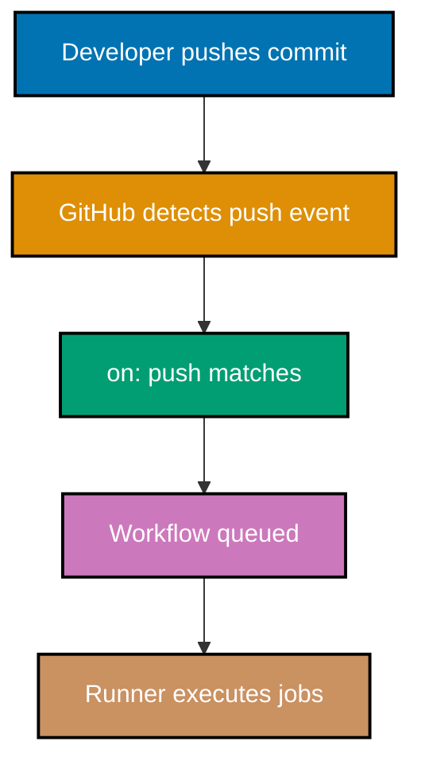
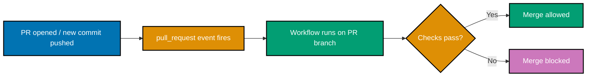
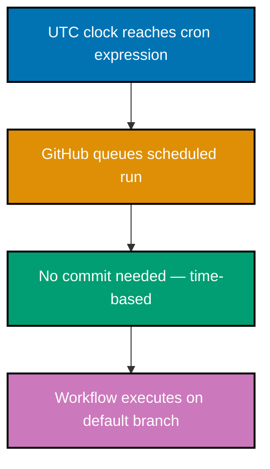
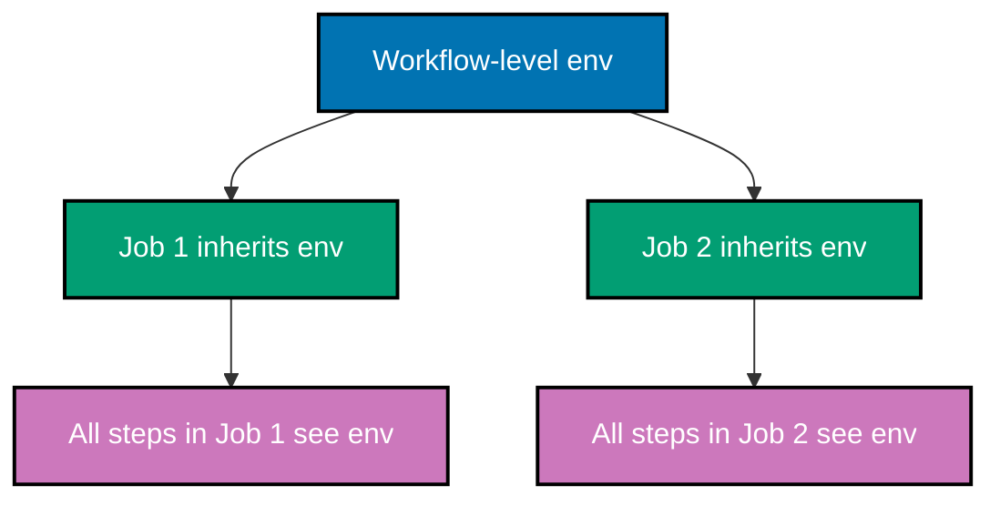
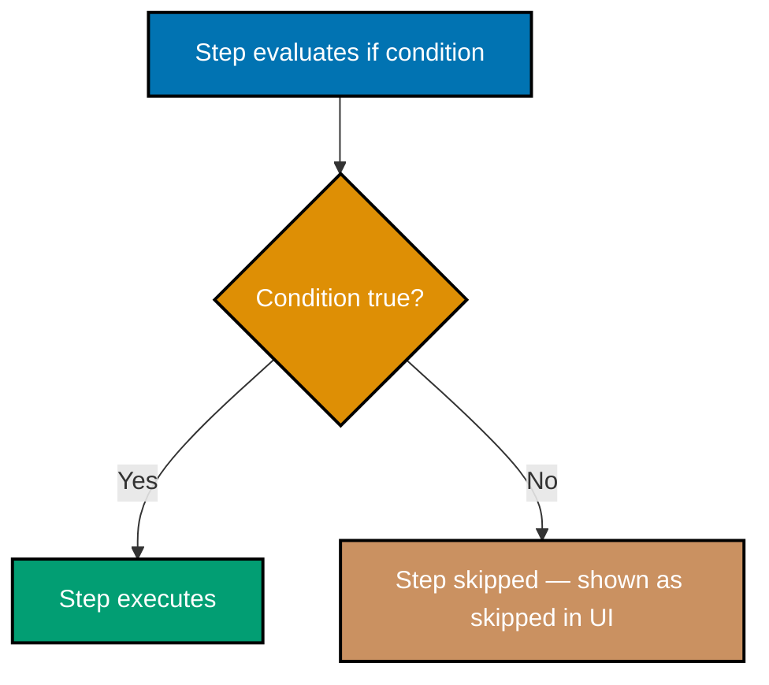
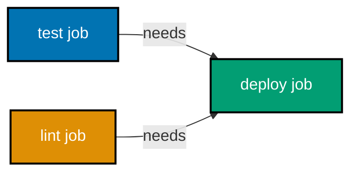
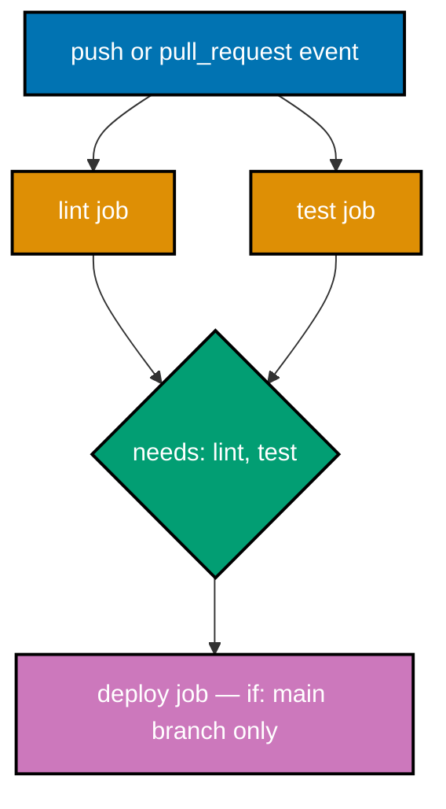

This tutorial covers core GitHub Actions concepts through 28 self-contained, heavily annotated workflow examples. Each example is a complete, runnable `.github/workflows/*.yml` file demonstrating one focused concept. The examples progress from the minimal workflow structure through triggers, job configuration, common actions, environment variables, conditionals, and job dependencies — spanning 0–35% of GitHub Actions features.

## Workflow File Structure

### Example 1: Minimal Workflow File

The smallest valid GitHub Actions workflow contains three required top-level keys: `name`, `on`, and `jobs`. Understanding this skeleton prevents the most common beginner mistake — missing required sections.

```yaml
# .github/workflows/minimal.yml

# The workflow name appears in the GitHub Actions UI tab.
# Choose names that describe WHAT this workflow does, not HOW.
name: Minimal Workflow

# "on" defines WHEN this workflow runs.
# Every workflow must declare at least one triggering event.
on:
  # "push" fires whenever commits are pushed to the repository.
  # Without branch filters it triggers on ALL branches.
  push:

# "jobs" is a map of one or more jobs to run.
# Every workflow must contain at least one job.
jobs:
  # "say-hello" is the job ID — used in logs and as a reference target.
  # Job IDs are lowercase, can contain hyphens, and must be unique within the workflow.
  say-hello:
    # "runs-on" specifies the runner (virtual machine) that executes this job.
    # "ubuntu-latest" is the most common choice for Linux-based CI.
    runs-on: ubuntu-latest

    # "steps" is the ordered list of tasks inside this job.
    # Steps run sequentially; if one fails the job stops (by default).
    steps:
      # Each step needs at minimum a "run" or "uses" key.
      # "run" executes shell commands directly on the runner.
      - run: echo "Hello from GitHub Actions"
        # => Prints: Hello from GitHub Actions
        # => This single shell command is the entire job payload here.
```

**Key takeaway:** Every valid workflow needs `name`, `on`, and `jobs` — the `jobs` block must contain at least one job with `runs-on` and `steps`.

**Why it matters:** Understanding the required skeleton saves debugging time when creating new workflows from scratch. Teams that skip a required key receive cryptic YAML parse errors rather than helpful messages. Knowing this three-key contract lets you scaffold any workflow confidently before adding triggers and steps.

---

### Example 2: Workflow Name and Job Name

Names at the workflow level and at the job level serve different UX purposes in the GitHub Actions interface. Descriptive names make audit trails readable.

```yaml
# .github/workflows/named-workflow.yml

# Workflow-level name: appears as the top-level entry in the
# "Actions" tab of the repository and in status badges.
name: Build and Test Pipeline

on:
  push:

jobs:
  # Job ID: machine-readable, used for "needs:" references.
  # Must match [a-zA-Z_][a-zA-Z0-9_-]* pattern.
  build-app:
    # "name" at job level: human-readable label shown in the UI sidebar.
    # Distinct from the job ID — can contain spaces and special chars.
    name: Compile Application

    # ubuntu-latest resolves to the latest GitHub-hosted Ubuntu runner.
    # GitHub updates this periodically; pin to "ubuntu-22.04" for stability.
    runs-on: ubuntu-latest

    steps:
      # Step "name" appears as a collapsible section in the Actions log UI.
      # Good step names describe the intent, not the command.
      - name: Print build message
        # => Step label "Print build message" appears in UI.
        run: echo "Building application..."
        # => Prints: Building application...

      - name: Confirm completion
        run: echo "Build step complete"
        # => Prints: Build step complete
```

**Key takeaway:** Workflow `name`, job `name`, and step `name` are all optional but critically improve readability in the GitHub Actions UI — they appear as human-readable labels separate from IDs.

**Why it matters:** In production pipelines with many jobs and steps, descriptive names reduce the time to locate a failure. Teams with generic names like "Run tests" spend minutes finding the right log; teams with names like "Run unit tests — auth module" find failures instantly. Naming is free and pays dividends at 2 AM during an incident.

---

### Example 3: The `on` Key with a Single Event

The `on` key is the entry point for all GitHub Actions triggers. At its simplest it accepts a single event name as a bare string.



```yaml
# .github/workflows/single-event.yml

name: Single Event Trigger

# A bare string value for "on" means: trigger on exactly this one event.
# This is the shortest valid "on" syntax.
on: push
# => Workflow triggers whenever any branch receives a push.
# => Equivalent to: on: { push: {} }

jobs:
  check:
    runs-on: ubuntu-latest

    steps:
      - name: Confirm trigger
        # GITHUB_EVENT_NAME is automatically set by the runner.
        # It will always be "push" when this workflow runs.
        run: echo "Triggered by event: $GITHUB_EVENT_NAME"
        # => Prints: Triggered by event: push
```

**Key takeaway:** `on: push` (bare string) is the shortest valid trigger and fires on every push to any branch in the repository.

**Why it matters:** Many teams start with a bare `on: push` to get a workflow running quickly, then add filters later. Understanding that the bare form means "no filters applied" prevents accidental cross-branch runs during early pipeline development.

---

### Example 4: The `push` Trigger

The `push` event is the most common trigger. Understanding its default behavior — firing on all branches — and how it differs from a filtered `push` prevents accidental CI runs on unwanted branches.

```yaml
# .github/workflows/push-trigger.yml

name: Push Trigger Demo

# "on" accepts a map when you need to configure event options.
# Here we configure the "push" event specifically.
on:
  # "push" as a key (not a bare string) allows adding sub-options.
  # With no sub-options, it triggers on every branch and tag push.
  push:
    # No branch filters here — this means ALL branches trigger the workflow.
    # This is intentional for demonstration; in practice add branch filters.

jobs:
  log-push:
    name: Log Push Context
    runs-on: ubuntu-latest

    steps:
      - name: Show pushed branch
        # GITHUB_REF contains the full ref, e.g. "refs/heads/main"
        # GITHUB_SHA is the commit SHA that triggered the run.
        run: |
          echo "Ref: $GITHUB_REF"
          echo "SHA: $GITHUB_SHA"
          # => Ref: refs/heads/<branch-name>
          # => SHA: <40-char commit hash>

      - name: Show actor
        # GITHUB_ACTOR is the login of the user who triggered the event.
        run: echo "Pushed by: $GITHUB_ACTOR"
        # => Prints: Pushed by: <github-username>
```

**Key takeaway:** The `push` event without filters runs on every branch; the runner injects context via `GITHUB_REF`, `GITHUB_SHA`, and `GITHUB_ACTOR` environment variables automatically.

**Why it matters:** Unfiltered `push` triggers are the most common cause of unexpected workflow runs in open-source repositories where contributors push feature branches. Knowing the defaults makes the decision to add branch filters deliberate rather than accidental.

---

## Triggers

### Example 5: The `pull_request` Trigger

The `pull_request` event fires when a PR is opened, synchronized (new commits), or reopened. It is the standard trigger for pre-merge validation checks.



```yaml
# .github/workflows/pull-request-trigger.yml

name: PR Validation

on:
  # "pull_request" fires on PR open, synchronize, and reopen by default.
  # The code checked out is the MERGE COMMIT (base + head merged together).
  pull_request:
    # No filters here — fires for PRs targeting any base branch.
    # Common production usage: add "branches: [main]" to limit scope.

jobs:
  validate:
    name: Run Validation
    runs-on: ubuntu-latest

    steps:
      - name: Show PR context
        run: |
          # GITHUB_HEAD_REF: the source branch of the PR
          echo "PR from branch: $GITHUB_HEAD_REF"
          # => Prints: PR from branch: feature/my-feature

          # GITHUB_BASE_REF: the target branch of the PR
          echo "PR targeting branch: $GITHUB_BASE_REF"
          # => Prints: PR targeting branch: main

      - name: Simulate validation
        run: echo "All checks passed"
        # => Prints: All checks passed
        # => Status check appears green on the PR page in GitHub UI
```

**Key takeaway:** `pull_request` triggers run against the merge commit and provide `GITHUB_HEAD_REF`/`GITHUB_BASE_REF` to identify source and target branches.

**Why it matters:** Making `pull_request` the required status check for protected branches enforces that all code passes CI before merging. This is the single most impactful use of GitHub Actions in team development — it shifts quality checking left and removes the "it worked on my machine" problem.

---

### Example 6: Multiple Triggers on One Workflow

A single workflow can respond to multiple events. Declaring both `push` and `pull_request` is a common pattern for running CI both on direct pushes and on PR checks.

```yaml
# .github/workflows/multi-trigger.yml

name: CI on Push and PR

# "on" accepts a map with multiple event keys.
# Both events independently trigger this entire workflow.
on:
  # Trigger 1: fires on every push to any branch
  push:

  # Trigger 2: fires when a PR is opened, updated, or reopened
  pull_request:

jobs:
  ci:
    name: Run CI
    runs-on: ubuntu-latest

    steps:
      - name: Identify trigger source
        run: |
          # GITHUB_EVENT_NAME will be either "push" or "pull_request"
          # depending on which event fired this run.
          echo "This run was triggered by: $GITHUB_EVENT_NAME"
          # => Prints: This run was triggered by: push
          # => OR:     This run was triggered by: pull_request

      - name: Run tests
        run: echo "Running test suite..."
        # => Both push runs and PR runs execute this step.
        # => This avoids maintaining two separate workflow files.
```

**Key takeaway:** Listing multiple events under `on` causes all listed events to independently trigger the same workflow — useful for running the same CI logic on pushes and pull requests.

**Why it matters:** A single shared workflow reduces maintenance. Without multi-trigger support, teams duplicate workflow files — one for push CI and one for PR checks — leading to drift between the two. Combining them ensures the same test suite runs in both contexts with one file to maintain.

---

### Example 7: Branch Filters on `push`

Branch filters limit which branches activate the `push` trigger. This is essential for preventing CI runs on every feature branch push when only `main` needs it.

```yaml
# .github/workflows/branch-filter-push.yml

name: Main Branch CI

on:
  push:
    # "branches" is a list of branch name patterns.
    # The workflow ONLY runs when commits are pushed to these branches.
    branches:
      # Exact match — only the "main" branch
      - main
      # Glob pattern — any branch starting with "release/"
      - "release/*"
      # => Pushes to "feature/login" will NOT trigger this workflow.
      # => Pushes to "main" or "release/1.0" WILL trigger it.

jobs:
  deploy-check:
    name: Deployment Readiness Check
    runs-on: ubuntu-latest

    steps:
      - name: Confirm branch filter
        run: |
          echo "Running on filtered branch: $GITHUB_REF_NAME"
          # => GITHUB_REF_NAME contains the short branch name (e.g. "main")
          # => This step only ever runs on main or release/* branches.
```

**Key takeaway:** The `branches` filter under `push` (or `pull_request`) limits the trigger to specific branch name patterns, including glob syntax like `release/*`.

**Why it matters:** Without branch filters, every push to every feature branch triggers CI, wasting runner minutes and cluttering the Actions tab. Branch filters focus expensive CI runs where they matter — release branches and the main trunk — reducing both cost and noise.

---

### Example 8: Path Filters on `push`

Path filters restrict triggers to pushes that touch specific files or directories. This dramatically reduces unnecessary CI runs in monorepos.

```yaml
# .github/workflows/path-filter-push.yml

name: Backend CI

on:
  push:
    branches:
      - main
    # "paths" is a list of file/directory patterns.
    # The workflow ONLY runs if at least one changed file matches a pattern.
    paths:
      # Run CI when anything in the backend/ directory changes.
      - "backend/**"
      # Also run if the shared config file changes.
      - "config/shared.yml"
      # => A push changing only "frontend/index.html" will NOT trigger this.
      # => A push changing "backend/app.go" WILL trigger this.

jobs:
  backend-tests:
    name: Backend Test Suite
    runs-on: ubuntu-latest

    steps:
      - name: Run backend tests
        run: echo "Running backend-specific tests..."
        # => Only runs when backend/** or config/shared.yml changed.
        # => Frontend-only changes never reach this step.
```

**Key takeaway:** `paths` filters fire the workflow only when at least one changed file matches the pattern list — powerful for monorepos where backend and frontend CI should be independent.

**Why it matters:** In a monorepo with ten services, a single documentation typo fix should not trigger all ten CI pipelines. Path filters cut CI costs proportionally to the number of independent services, and they speed up developer feedback loops by only running relevant checks.

---

### Example 9: The `schedule` Trigger (Cron Syntax)

The `schedule` trigger runs workflows on a time-based schedule using cron syntax. It is the standard way to run nightly builds, dependency scans, and scheduled reports.



```yaml
# .github/workflows/scheduled.yml

name: Nightly Dependency Scan

on:
  schedule:
    # "cron" follows standard cron syntax: minute hour day-of-month month day-of-week
    # All times are UTC. There is no built-in timezone conversion.
    - cron: "0 2 * * *"
    # => Field breakdown:
    # =>   0   = minute 0 (on the hour)
    # =>   2   = hour 2 (2:00 AM UTC)
    # =>   *   = every day of the month
    # =>   *   = every month
    # =>   *   = every day of the week
    # => Net result: runs at 02:00 UTC every day.

    # You can add multiple cron entries to run at different times.
    - cron: "0 14 * * 1"
    # => Every Monday at 14:00 UTC (second independent schedule).

jobs:
  scan:
    name: Run Dependency Scan
    runs-on: ubuntu-latest

    steps:
      - name: Announce scan start
        run: |
          echo "Scheduled scan starting at: $(date -u)"
          # => Prints: Scheduled scan starting at: <current UTC datetime>
          # => The run always uses code from the default branch (usually main).
```

**Key takeaway:** `schedule` with `cron` syntax runs workflows on a time basis independent of code changes; multiple cron entries can coexist under a single `schedule` key.

**Why it matters:** Security vulnerability databases update continuously. A nightly `schedule` trigger runs dependency audits, license scans, or dead-link checks automatically without requiring anyone to push code. Teams that skip scheduled runs often discover vulnerabilities only when an incident forces a reactive audit.

---

### Example 10: The `workflow_dispatch` Trigger (Manual Run)

`workflow_dispatch` allows a workflow to be triggered manually from the GitHub UI or via the API. It supports optional inputs to parameterize the run.

```yaml
# .github/workflows/manual-dispatch.yml

name: Manual Deployment

on:
  # "workflow_dispatch" enables the "Run workflow" button in the GitHub UI.
  # Without any inputs, the button appears with no form fields.
  workflow_dispatch:
    # "inputs" defines form fields shown in the UI before the run starts.
    inputs:
      environment:
        # "description" is the label shown next to the input field in the UI.
        description: "Target deployment environment"
        # "required: true" means the UI enforces a non-empty value before running.
        required: true
        # "default" pre-populates the field in the UI.
        default: "staging"
        # "type: choice" renders a dropdown instead of a free-text input.
        type: choice
        # "options" lists the allowed values for the dropdown.
        options:
          - staging
          - production
          # => Developer picks "staging" or "production" before clicking Run.

      dry-run:
        description: "Simulate without making changes"
        required: false
        # "type: boolean" renders a checkbox in the UI.
        type: boolean
        default: false

jobs:
  deploy:
    name: Deploy to Environment
    runs-on: ubuntu-latest

    steps:
      - name: Show chosen parameters
        run: |
          # inputs are accessed via github.event.inputs in expressions,
          # but also available as env vars prefixed with INPUT_ in shell.
          echo "Environment: ${{ github.event.inputs.environment }}"
          # => Prints: Environment: staging  (or production, per selection)
          echo "Dry run: ${{ github.event.inputs.dry-run }}"
          # => Prints: Dry run: false  (or true if checkbox was checked)

      - name: Simulate deploy
        run: echo "Deploying to ${{ github.event.inputs.environment }}..."
        # => Prints: Deploying to staging...
```

**Key takeaway:** `workflow_dispatch` adds a manual "Run workflow" button with optional typed inputs — choice dropdowns, booleans, and strings — accessible from the GitHub UI and the REST API.

**Why it matters:** Fully automated pipelines still need escape hatches for one-off deployments, hotfix releases, or manual approvals in regulated environments. `workflow_dispatch` provides that without the security risk of exposing SSH access or running ad-hoc scripts locally.

---

## The `runs-on` Key

### Example 11: Ubuntu, Windows, and macOS Runners

GitHub provides hosted runners for three operating systems. Choosing the right OS is critical for platform-specific tests and build artifacts.

```yaml
# .github/workflows/runner-os.yml

name: Multi-OS Runner Demo

on:
  push:

jobs:
  # Job 1: Linux runner — cheapest, fastest, most common
  linux-job:
    name: Linux Runner
    # ubuntu-latest maps to the current latest Ubuntu LTS on GitHub-hosted runners.
    runs-on: ubuntu-latest

    steps:
      - name: Show OS
        run: |
          uname -a
          # => Prints: Linux <hostname> <kernel-version> ... x86_64 GNU/Linux
          echo "Shell: $SHELL"
          # => Prints: Shell: /bin/bash  (default shell on ubuntu runners)

  # Job 2: Windows runner — needed for .NET, MSBuild, PowerShell-specific tasks
  windows-job:
    name: Windows Runner
    # windows-latest maps to the current latest Windows Server on GitHub runners.
    runs-on: windows-latest

    steps:
      - name: Show OS
        # On Windows runners, "run" defaults to PowerShell.
        run: |
          [System.Environment]::OSVersion.VersionString
          # => Prints: Microsoft Windows <version>
          Write-Host "Runner: windows-latest"
          # => Prints: Runner: windows-latest

  # Job 3: macOS runner — needed for iOS/macOS builds, Xcode
  macos-job:
    name: macOS Runner
    # macos-latest maps to the current latest macOS on GitHub runners.
    # macOS runners are more expensive (10x Linux per minute).
    runs-on: macos-latest

    steps:
      - name: Show OS
        run: |
          sw_vers
          # => Prints: ProductName: macOS / ProductVersion: 14.x / BuildVersion: ...
          echo "Shell: $SHELL"
          # => Prints: Shell: /bin/zsh  (default shell on macOS runners)
```

**Key takeaway:** `runs-on` accepts `ubuntu-latest`, `windows-latest`, or `macos-latest` for GitHub-hosted runners; jobs run concurrently (different jobs, not steps) since they are independent.

**Why it matters:** Cross-platform compatibility tests catch line-ending bugs, path separator issues, and OS-specific API differences before users encounter them. Mobile teams absolutely require macOS runners for Xcode builds. Explicitly understanding cost differences (`macos-latest` is ~10x Linux) enables informed architectural decisions about when multi-OS CI is worth the spend.

---

### Example 12: Pinning a Specific Runner Version

Pinning to a specific runner version (e.g., `ubuntu-22.04`) prevents breaking changes when GitHub updates `ubuntu-latest` to a new OS version.

```yaml
# .github/workflows/pinned-runner.yml

name: Stable Runner Version

on:
  push:

jobs:
  stable-build:
    name: Build on Pinned Runner
    # ubuntu-22.04 is pinned — will NOT silently update when GitHub releases ubuntu-24.04.
    # Contrast with ubuntu-latest, which updates automatically and can break builds.
    runs-on: ubuntu-22.04
    # => Runner: Ubuntu 22.04 LTS (Jammy Jellyfish)
    # => This version remains stable until GitHub explicitly deprecates it.

    steps:
      - name: Verify Ubuntu version
        run: |
          cat /etc/os-release | grep VERSION=
          # => Prints: VERSION="22.04.x LTS (Jammy Jellyfish)"
          # => Guaranteed — because runner is pinned, not "latest"

      - name: Check preinstalled tools
        run: |
          node --version
          # => Prints: v<version preinstalled on ubuntu-22.04 image>
          python3 --version
          # => Prints: Python 3.10.x  (specific to ubuntu-22.04 image)
```

**Key takeaway:** Pinning to `ubuntu-22.04` (or `ubuntu-24.04`) instead of `ubuntu-latest` prevents surprise breakage when GitHub updates the `latest` alias to a new OS major version.

**Why it matters:** In production, silent runner upgrades have broken builds by changing the default Python version, OpenSSL behavior, or preinstalled library versions. Pinned runners make CI deterministic — the same runner image runs in the same environment until the team consciously upgrades, making upgrades a planned event rather than an accidental one.

---

## Steps

### Example 13: The `run` Step with Multi-Line Commands

The `run` key executes shell commands. Multi-line commands use the YAML block scalar `|` to preserve newlines.

```yaml
# .github/workflows/run-step.yml

name: Run Step Patterns

on:
  push:

jobs:
  run-demo:
    runs-on: ubuntu-latest

    steps:
      # Pattern 1: single-line run
      - name: Single command
        run: echo "Single line command"
        # => Executes: echo "Single line command"
        # => Prints: Single line command

      # Pattern 2: multi-line run using "|" (literal block scalar)
      # Each line becomes a separate shell command in sequence.
      - name: Multi-line commands
        run: |
          echo "Line 1"
          echo "Line 2"
          echo "Line 3"
          # => Executes each echo in order, in the same shell session.
          # => Prints:
          # =>   Line 1
          # =>   Line 2
          # =>   Line 3

      # Pattern 3: chaining commands — if one fails, the step fails
      - name: Chained with exit code check
        run: |
          mkdir -p /tmp/ci-workspace
          # => Creates directory (and parents) if it doesn't exist
          echo "workspace ready" > /tmp/ci-workspace/flag.txt
          # => Writes "workspace ready" into flag.txt
          cat /tmp/ci-workspace/flag.txt
          # => Prints: workspace ready
```

**Key takeaway:** The `|` YAML block scalar preserves newlines, making each indented line a separate shell command in the same shell session — variable assignments in one line are visible in subsequent lines.

**Why it matters:** Multi-step shell logic is extremely common in CI — create a directory, build artifacts, move them, then verify. Using `|` keeps related commands in one named step with one log entry rather than scattered across many steps, improving log readability and grouping atomic operations.

---

### Example 14: The `uses` Step with `actions/checkout`

`uses` invokes a reusable action by its repository reference. `actions/checkout` is the most used action — it clones the repository onto the runner so subsequent steps can access the code.


```yaml
# .github/workflows/checkout-action.yml

name: Checkout Demo

on:
  push:

jobs:
  use-code:
    runs-on: ubuntu-latest

    steps:
      # Without this step, GITHUB_WORKSPACE is empty — no source code available.
      # Always put checkout as the FIRST step in jobs that need source code.
      - name: Checkout repository
        # "uses" references a public action at owner/repo@version.
        # Always pin to a specific version tag (v4), never use @main.
        uses: actions/checkout@v4
        # => Clones the repository at the triggering commit SHA.
        # => Working directory: $GITHUB_WORKSPACE (e.g. /home/runner/work/repo/repo)
        # => The default fetch depth is 1 (shallow clone) for speed.

      - name: Verify checkout
        run: |
          ls -la
          # => Lists files in the repository root — confirms code is present.
          echo "Workspace: $GITHUB_WORKSPACE"
          # => Prints: Workspace: /home/runner/work/<repo>/<repo>

      - name: Read a file from the repo
        run: cat README.md
        # => Reads README.md from the checked-out repo.
        # => This would fail completely if checkout step was missing.
```

**Key takeaway:** `actions/checkout@v4` clones the triggering commit into `$GITHUB_WORKSPACE`; it must precede any step that reads source files, and version pinning (`@v4`) is required for supply-chain security.

**Why it matters:** Forgetting `actions/checkout` is the single most common beginner mistake — the runner starts with an empty workspace and all file-reading steps silently fail. Understanding that the runner is a fresh VM with no code pre-loaded explains why checkout is always the first step in any workflow that builds, tests, or lints source code.

---

### Example 15: The `uses` Step with `actions/setup-node`

`actions/setup-node` installs a specific Node.js version on the runner. Pinning the Node.js version prevents "works on my machine, fails in CI" problems caused by version differences.

```yaml
# .github/workflows/setup-node.yml

name: Node.js Setup

on:
  push:

jobs:
  node-job:
    runs-on: ubuntu-latest

    steps:
      - name: Checkout code
        uses: actions/checkout@v4
        # => Repository cloned to workspace.

      - name: Set up Node.js
        uses: actions/setup-node@v4
        # "with" passes named inputs to the action.
        # Each action defines its own accepted inputs (documented in its README).
        with:
          # "node-version" specifies the exact Node.js version to install.
          # Use the same version as your local .nvmrc or .node-version file.
          node-version: "20"
          # => Installs Node.js 20.x (latest patch of the 20 major).
          # => Adds node and npm to PATH for all subsequent steps.

      - name: Verify Node.js version
        run: |
          node --version
          # => Prints: v20.x.x
          npm --version
          # => Prints: 10.x.x  (npm version bundled with Node 20)

      - name: Install dependencies
        run: npm ci
        # => Runs clean install from package-lock.json.
        # => Faster and more deterministic than npm install in CI.

      - name: Run app
        run: node -e "console.log('Node.js is ready')"
        # => Prints: Node.js is ready
```

**Key takeaway:** `actions/setup-node@v4` with `node-version: "20"` installs the specified Node.js major version and adds it to PATH, making `node` and `npm` available for all subsequent steps.

**Why it matters:** GitHub-hosted runners have a pre-installed Node.js, but its version changes with runner image updates. Explicit `setup-node` ties CI to the same Node.js version declared in your project's tooling files, eliminating an entire class of "different behavior in CI vs local" bugs related to API changes between Node.js majors.

---

### Example 16: The `uses` Step with `actions/setup-python`

`actions/setup-python` works identically to `setup-node` but for Python. The pattern generalizes: most language ecosystems have an official `actions/setup-*` action.

```yaml
# .github/workflows/setup-python.yml

name: Python Setup

on:
  push:

jobs:
  python-job:
    runs-on: ubuntu-latest

    steps:
      - name: Checkout code
        uses: actions/checkout@v4
        # => Repository cloned to workspace.

      - name: Set up Python
        uses: actions/setup-python@v5
        with:
          # "python-version" pins the Python version.
          # Accepts exact versions ("3.11.0"), minor ("3.11"), or range ("3.x").
          python-version: "3.11"
          # => Installs Python 3.11.x (latest patch).
          # => Adds python, python3, and pip to PATH.
          # => Also installs pip for package management.

      - name: Verify Python installation
        run: |
          python --version
          # => Prints: Python 3.11.x
          pip --version
          # => Prints: pip 23.x.x from /opt/hostedtoolcache/Python/3.11.x/...

      - name: Install packages
        run: pip install requests
        # => Installs the requests library from PyPI.
        # => Available to subsequent steps in this job.

      - name: Run Python script
        run: python -c "import requests; print('Python ready, requests version:', requests.__version__)"
        # => Prints: Python ready, requests version: 2.x.x
```

**Key takeaway:** `actions/setup-python@v5` pins the Python interpreter version identically to how `setup-node` pins Node.js — the pattern of `uses: actions/setup-*` + `with: { version: "x.y" }` is universal across language setup actions.

**Why it matters:** Python 3.9 and 3.11 have meaningful behavioral differences in typing, `match` statements, and standard library APIs. Pinning the version in CI ensures the test suite runs against the same interpreter version as development, making CI failures actionable rather than artifacts of interpreter version drift.

---

## The `with` Key (Action Inputs)

### Example 17: Passing Inputs to Actions with `with`

`with` is the standard mechanism for passing configuration to any action. Understanding how inputs map to action behavior is essential for using any third-party action.

```yaml
# .github/workflows/with-inputs.yml

name: Action Inputs Demo

on:
  push:

jobs:
  configure-actions:
    runs-on: ubuntu-latest

    steps:
      - name: Checkout with full history
        uses: actions/checkout@v4
        with:
          # By default, checkout does a shallow clone (depth: 1) for speed.
          # Setting fetch-depth: 0 fetches ALL history — needed for git log, tags.
          fetch-depth: 0
          # => Fetches complete git history, not just the latest commit.
          # => Required for tools that analyze commit history (e.g., semantic-release).

      - name: Set up Node.js with caching
        uses: actions/setup-node@v4
        with:
          node-version: "20"
          # "cache" enables automatic caching of the package manager's cache directory.
          # Subsequent runs restore from cache instead of downloading all packages.
          cache: "npm"
          # => Caches ~/.npm directory between runs keyed on package-lock.json hash.
          # => Can save 30-120 seconds on each run for large dependency trees.

      - name: Verify git history
        run: |
          git log --oneline | head -5
          # => Prints: last 5 commit messages (possible only with full history checkout)
```

**Key takeaway:** Every action defines its own `with` inputs in its `action.yml`; `fetch-depth: 0` on `actions/checkout` and `cache: "npm"` on `actions/setup-node` are two of the most commonly needed non-default inputs.

**Why it matters:** Default action settings are optimized for the common case, but real projects often need non-default behavior. Deep clones are required for changelog generation and semantic versioning. Caching can cut CI duration significantly. Knowing that `with` is the universal input mechanism means you can configure any action without learning new syntax per action.

---

## Environment Variables

### Example 18: Setting `env` at the Workflow Level

Workflow-level `env` defines environment variables available to all jobs and steps in the workflow. It is the right place for constants that apply everywhere.



```yaml
# .github/workflows/env-workflow.yml

name: Workflow-Level Environment Variables

# Workflow-level "env" makes these variables available in ALL jobs and steps.
# Use this for constants that must be consistent across the entire workflow.
env:
  # Convention: use SCREAMING_SNAKE_CASE for environment variable names.
  APP_NAME: my-application
  # => Available as $APP_NAME in every shell step of every job.

  NODE_VERSION: "20"
  # => Centralizing versions here means updating in one place updates everywhere.

  LOG_LEVEL: info
  # => Every step that reads LOG_LEVEL gets the same value.

on:
  push:

jobs:
  build:
    runs-on: ubuntu-latest

    steps:
      - name: Use workflow env vars
        run: |
          echo "App: $APP_NAME"
          # => Prints: App: my-application
          echo "Node version: $NODE_VERSION"
          # => Prints: Node version: 20
          echo "Log level: $LOG_LEVEL"
          # => Prints: Log level: info

  test:
    runs-on: ubuntu-latest

    steps:
      - name: Same env vars in second job
        run: echo "Testing $APP_NAME with log level $LOG_LEVEL"
        # => Prints: Testing my-application with log level info
        # => Workflow-level env is NOT re-declared here but is still available.
```

**Key takeaway:** Workflow-level `env` propagates to all jobs and steps — centralizing constants like app names and version strings prevents inconsistencies caused by copy-paste across individual steps.

**Why it matters:** Constants scattered across many `run` steps are a maintenance hazard. When the app name changes or a version needs bumping, every occurrence must be found and updated. Workflow-level `env` creates a single source of truth at the top of the file, reducing human error and making diffs cleaner during reviews.

---

### Example 19: Setting `env` at the Job Level

Job-level `env` overrides or supplements workflow-level variables for a specific job without affecting other jobs.

```yaml
# .github/workflows/env-job.yml

name: Job-Level Environment Variables

on:
  push:

# Workflow-level baseline — visible to all jobs
env:
  ENVIRONMENT: development
  # => Default value applied to all jobs unless overridden.

jobs:
  dev-job:
    name: Dev Build
    runs-on: ubuntu-latest
    # No job-level env — inherits workflow-level ENVIRONMENT=development

    steps:
      - name: Check environment
        run: echo "Running in: $ENVIRONMENT"
        # => Prints: Running in: development  (from workflow-level env)

  staging-job:
    name: Staging Build
    runs-on: ubuntu-latest
    # Job-level "env" overrides workflow-level variables for THIS job only.
    env:
      ENVIRONMENT: staging
      # => Overrides workflow-level ENVIRONMENT for all steps in this job.
      STAGING_URL: "https://staging.example.com"
      # => Additional variable available only in this job.

    steps:
      - name: Check environment
        run: |
          echo "Running in: $ENVIRONMENT"
          # => Prints: Running in: staging  (job-level overrides workflow-level)
          echo "Staging URL: $STAGING_URL"
          # => Prints: Staging URL: https://staging.example.com
```

**Key takeaway:** Job-level `env` overrides workflow-level `env` for the same key within that job's scope — the override does not affect sibling jobs, enabling per-environment configuration with shared defaults.

**Why it matters:** Multi-environment workflows (dev/staging/production) need different database URLs, API endpoints, and feature flags per job. Job-level `env` overrides provide this without duplicating the entire workflow or creating multiple files — critical for keeping environment-specific differences minimal and auditable.

---

### Example 20: Setting `env` at the Step Level

Step-level `env` scopes variables to a single step, preventing accidental variable leakage between steps while enabling step-specific configuration.

```yaml
# .github/workflows/env-step.yml

name: Step-Level Environment Variables

on:
  push:

jobs:
  demo:
    runs-on: ubuntu-latest

    steps:
      - name: Step with its own env
        # Step-level "env" is available ONLY within this step's shell session.
        # It does NOT leak to subsequent steps.
        env:
          GREETING: "Hello from step env"
          DEBUG_MODE: "true"
          # => Both variables exist only during this step's execution.
        run: |
          echo "$GREETING"
          # => Prints: Hello from step env
          echo "Debug mode: $DEBUG_MODE"
          # => Prints: Debug mode: true

      - name: Verify no variable leakage
        run: |
          # GREETING was defined only in the previous step's env.
          # It is NOT available here — the variable is empty/unset.
          echo "GREETING is: '${GREETING:-unset}'"
          # => Prints: GREETING is: 'unset'
          # => Confirms step-level env does not persist across steps.

      - name: Inject API key for one step only
        env:
          # Sensitive values (pulled from GitHub Secrets) should be
          # scoped to the minimum necessary steps using step-level env.
          API_TOKEN: ${{ secrets.MY_API_TOKEN }}
          # => API_TOKEN is only set during this step — minimizes exposure window.
        run: |
          echo "Token length: ${#API_TOKEN}"
          # => Prints: Token length: <N>  (never prints the actual token value)
```

**Key takeaway:** Step-level `env` is scoped to that step's shell process and does not leak to later steps — ideal for secret injection with minimal exposure surface.

**Why it matters:** Leaking secrets between steps is a real attack surface: a later step could accidentally log, upload, or transmit a secret that was set by a previous step. Step-level `env` for secret injection follows the principle of least privilege — the token exists only when the step that genuinely needs it is running.

---

## The `working-directory` Key

### Example 21: Changing the Working Directory for `run` Steps

By default, `run` steps execute from `$GITHUB_WORKSPACE` (the repository root). `working-directory` redirects execution to a subdirectory without `cd` commands.

```yaml
# .github/workflows/working-directory.yml

name: Working Directory Demo

on:
  push:

jobs:
  mono-repo-build:
    runs-on: ubuntu-latest

    steps:
      - name: Checkout
        uses: actions/checkout@v4
        # => Full monorepo cloned to $GITHUB_WORKSPACE

      - name: Prepare demo directories
        # Creates a simulated monorepo structure for this example.
        run: |
          mkdir -p frontend backend
          echo '{"name":"frontend"}' > frontend/package.json
          echo "print('backend')" > backend/app.py
          # => Creates frontend/ and backend/ subdirectories in workspace.

      - name: Build frontend
        # "working-directory" sets the shell's CWD for this step only.
        # Equivalent to "cd frontend && ..." but cleaner and safer.
        working-directory: frontend
        run: |
          pwd
          # => Prints: /home/runner/work/<repo>/<repo>/frontend
          ls
          # => Prints: package.json

      - name: Run backend
        # Each step with working-directory resets independently.
        # This step is in backend/, not frontend/ (no state leaks between steps).
        working-directory: backend
        run: |
          pwd
          # => Prints: /home/runner/work/<repo>/<repo>/backend
          python3 app.py
          # => Prints: backend

      - name: Default directory after working-directory steps
        run: |
          pwd
          # => Prints: /home/runner/work/<repo>/<repo>  (back to workspace root)
          # => working-directory does not permanently change the CWD.
```

**Key takeaway:** `working-directory` changes the CWD for a single `run` step without affecting subsequent steps — each step always resets to `$GITHUB_WORKSPACE` as its default.

**Why it matters:** Monorepo projects with separate frontend, backend, and infrastructure subdirectories need each CI step to run in the right directory. Explicit `working-directory` keys make the directory context readable in the YAML rather than buried in `cd` commands inside long `run` blocks.

---

## The `if` Conditional

### Example 22: Skipping Steps with `if` Conditionals

`if` conditionals control whether a step executes at all. They evaluate GitHub Actions expressions and are the primary mechanism for branch-specific, event-specific, or failure-contingent steps.



```yaml
# .github/workflows/if-conditional.yml

name: Conditional Steps

on:
  push:

jobs:
  conditional-demo:
    runs-on: ubuntu-latest

    steps:
      - name: Always runs
        run: echo "This step always runs"
        # => Prints: This step always runs
        # => No "if" key means implicit "if: true" — always executes.

      - name: Only on main branch
        # github.ref_name is the short branch name (e.g. "main", "feature/x").
        # This step ONLY executes when pushed directly to the main branch.
        if: github.ref_name == 'main'
        run: echo "Running deployment preparation on main"
        # => Executes: only when branch is "main"
        # => Skipped: on all other branches (step shown as "skipped" in UI)

      - name: Only on push event (not PR)
        # github.event_name holds the triggering event name.
        if: github.event_name == 'push'
        run: echo "This is a direct push, not a pull_request"
        # => Executes: when workflow triggered by a push event
        # => Skipped: if triggered by pull_request or workflow_dispatch

      - name: Skip on forks
        # github.repository_owner can detect if the action runs on the
        # original repo vs. a fork. Forks should not have deploy access.
        if: github.repository_owner == 'my-org'
        run: echo "Running in the official organization repository"
        # => Executes: only when the repo owner matches 'my-org'
        # => Skipped: on forks (different owner)
```

**Key takeaway:** `if` accepts GitHub Actions expressions without `${{ }}` at the step level; use `github.ref_name`, `github.event_name`, and `github.repository_owner` for the most common conditional patterns.

**Why it matters:** Without `if` conditionals, every deployment step would run even on feature branches, and notifications would fire on every commit. Conditionals enforce CI stage separation: lint and test on every branch, deploy only from `main`, notify only on failure — all within a single workflow file.

---

### Example 23: `if` on Jobs

`if` conditionals work at the job level too, preventing entire jobs from running based on context — more efficient than skipping individual steps.

```yaml
# .github/workflows/if-job.yml

name: Job-Level Conditionals

on:
  push:

jobs:
  # This job runs on every push to every branch.
  test:
    name: Run Tests
    runs-on: ubuntu-latest

    steps:
      - run: echo "Running tests..."
        # => Runs on all branches unconditionally.

  # This job ONLY runs when pushing to main.
  # The entire job (including runner provisioning) is skipped on other branches.
  deploy:
    name: Deploy to Production
    runs-on: ubuntu-latest
    # Job-level "if" prevents the job from being queued at all when false.
    # More efficient than step-level "if" — no runner is provisioned.
    if: github.ref_name == 'main'
    # => Job executes: only on pushes to the "main" branch.
    # => Job skipped: on feature/*, hotfix/*, and all other branch names.

    steps:
      - run: echo "Deploying to production..."
        # => Only reached when the job-level if is satisfied.

  # This job only runs for pull requests.
  pr-checks:
    name: PR-Specific Checks
    runs-on: ubuntu-latest
    if: github.event_name == 'pull_request'
    # => Runs: only when triggered by a pull_request event.
    # => Skipped: on direct pushes (even to main).

    steps:
      - run: echo "Running PR-specific quality checks..."
        # => Semantic versioning check, PR title lint, etc.
```

**Key takeaway:** Job-level `if` prevents runner provisioning entirely for skipped jobs, which is more efficient than step-level skipping — no billed runner minutes for skipped jobs.

**Why it matters:** Provisioning a runner takes 20–40 seconds and costs runner minutes even if all steps are skipped. Job-level `if` keeps the bill down and keeps the workflow run graph clean: skipped jobs appear as dotted boxes in the visualization rather than executing and showing all green-but-skipped steps.

---

## The `needs` Key (Job Dependencies)

### Example 24: Sequential Jobs with `needs`

By default, all jobs in a workflow run in parallel. `needs` declares a dependency: the dependent job waits until all listed jobs complete successfully.



```yaml
# .github/workflows/needs-dependency.yml

name: Sequential Pipeline with Needs

on:
  push:

jobs:
  # Stage 1: These two jobs run IN PARALLEL — no "needs" between them.
  lint:
    name: Lint Code
    runs-on: ubuntu-latest

    steps:
      - run: echo "Linting..."
        # => Runs at the same time as the "test" job.

  test:
    name: Run Tests
    runs-on: ubuntu-latest

    steps:
      - run: echo "Testing..."
        # => Runs at the same time as the "lint" job.

  # Stage 2: This job ONLY runs after BOTH lint and test succeed.
  deploy:
    name: Deploy
    runs-on: ubuntu-latest
    # "needs" accepts a single job ID or a list of job IDs.
    # The deploy job waits for all listed jobs to finish with success.
    needs: [lint, test]
    # => deploy starts: only after lint AND test both pass.
    # => deploy is skipped: if lint OR test fails (unless "if: always()" overrides).

    steps:
      - run: echo "Deploying — lint and tests passed!"
        # => Guaranteed: lint succeeded AND test succeeded before this runs.
```

**Key takeaway:** `needs: [job-a, job-b]` forces sequential execution — the dependent job waits until all listed jobs succeed; failure in any listed job skips the dependent job.

**Why it matters:** Deploying before tests pass is a critical production risk. `needs` encodes the pipeline contract in the YAML itself: tests must pass before deployment, and build must succeed before tests run. This replaces ad-hoc scripts that manually check exit codes, making the dependency graph visible and enforced by GitHub.

---

### Example 25: Accessing Outputs from Required Jobs

`needs` enables dependent jobs to access outputs from their dependencies, passing data between jobs without external storage.

```yaml
# .github/workflows/needs-outputs.yml

name: Job Outputs via Needs

on:
  push:

jobs:
  # Produces a version string as an output for downstream jobs.
  version:
    name: Calculate Version
    runs-on: ubuntu-latest
    # "outputs" declares variables this job will expose to dependent jobs.
    outputs:
      # Format: output-name: ${{ steps.step-id.outputs.output-name }}
      app-version: ${{ steps.calc.outputs.version }}
      # => app-version will be available in jobs that declare needs: [version]

    steps:
      - name: Calculate version
        id: calc
        # => "id" is required here so the step's outputs can be referenced above.
        run: |
          VERSION="1.0.${{ github.run_number }}"
          # => Example: 1.0.42  (run_number increments with each workflow run)

          # Use the special $GITHUB_OUTPUT file to set step outputs.
          echo "version=$VERSION" >> "$GITHUB_OUTPUT"
          # => Writes "version=1.0.42" to the output file.
          # => This makes ${{ steps.calc.outputs.version }} equal to "1.0.42"

  # Consumes the version output from the "version" job.
  build:
    name: Build with Version
    runs-on: ubuntu-latest
    needs: version
    # => Waits for the version job to complete successfully.

    steps:
      - name: Use version from previous job
        run: |
          echo "Building version: ${{ needs.version.outputs.app-version }}"
          # => Prints: Building version: 1.0.42
          # => needs.<job-id>.outputs.<output-name> is the access pattern.
```

**Key takeaway:** Job outputs defined via `echo "key=value" >> "$GITHUB_OUTPUT"` are accessible in dependent jobs via `${{ needs.<job-id>.outputs.<key> }}` — enabling structured data passing between jobs without external storage.

**Why it matters:** Passing artifacts between jobs via outputs (version strings, file paths, computed values) is cleaner and more auditable than writing to temporary files on shared storage. It makes the data flow explicit in the YAML, helping reviewers understand what each job produces and what depends on it.

---

## `timeout-minutes` and `continue-on-error`

### Example 26: Setting `timeout-minutes`

`timeout-minutes` caps the maximum time a job can run. Without it, a hung test or infinite loop consumes runner minutes until GitHub's default 6-hour limit.

```yaml
# .github/workflows/timeout.yml

name: Workflow with Timeouts

on:
  push:

jobs:
  bounded-job:
    name: Job with Timeout
    runs-on: ubuntu-latest
    # "timeout-minutes" cancels the ENTIRE JOB if it exceeds this duration.
    # Default if omitted: 360 minutes (6 hours) — expensive for runaway processes.
    timeout-minutes: 10
    # => Job is forcibly cancelled after 10 minutes regardless of step status.
    # => Runner time billing stops immediately on cancellation.

    steps:
      # Step-level timeout-minutes is also valid — limits a single step.
      - name: Quick operation
        timeout-minutes: 2
        # => This step specifically is cancelled if it takes more than 2 minutes.
        run: |
          echo "Starting quick task..."
          # => Prints: Starting quick task...
          sleep 1
          # => Sleeps 1 second — well within 2-minute timeout.
          echo "Quick task done"
          # => Prints: Quick task done

      - name: Bounded integration test
        timeout-minutes: 5
        # => If the test suite takes more than 5 minutes, the step is cancelled.
        # => The job still fails (step failure = job failure by default).
        run: echo "Running integration tests (timeout: 5 min)"
        # => Prints: Running integration tests (timeout: 5 min)
```

**Key takeaway:** `timeout-minutes` at the job or step level caps execution time — without it, a hung process runs until GitHub's 6-hour default, consuming the full cost of the runner.

**Why it matters:** Integration tests that wait for a service that never starts, or builds caught in an infinite dependency resolution loop, can silently consume hours of runner time before the team notices. A 10-minute job timeout provides a safety net that makes runaway CI both visible and cheap — the job fails fast and clearly.

---

### Example 27: Using `continue-on-error`

`continue-on-error: true` marks a step or job as non-blocking: even if it fails, subsequent steps (or the job itself) continue. The overall job/workflow is still marked as failed, but execution is not halted.

```yaml
# .github/workflows/continue-on-error.yml

name: Continue on Error Demo

on:
  push:

jobs:
  resilient-job:
    runs-on: ubuntu-latest

    steps:
      - name: Critical step — must succeed
        run: echo "This step must pass"
        # => If this fails, the job stops immediately (default behavior).

      - name: Optional linting check
        # "continue-on-error: true" means:
        # - If this step FAILS, the next step still runs.
        # - The step is marked with an orange warning icon (not red failure).
        # - The overall job still reports failure (step failure is recorded).
        continue-on-error: true
        run: |
          echo "Running optional lint..."
          # Simulate a lint warning/failure (exit 1).
          exit 1
          # => Step exits with code 1 (failure).
          # => Normally this would stop the job — but continue-on-error overrides that.

      - name: Step after the optional failure
        run: echo "This step runs even though the lint step failed"
        # => Prints: This step runs even though the lint step failed
        # => Execution continued past the failing step due to continue-on-error.

      - name: Required step — still runs
        run: echo "Pipeline completes despite optional failure"
        # => Final step executes normally.
        # => The job will show as failed in the UI (because the lint step failed),
        # => but all steps that could run did run.
```

**Key takeaway:** `continue-on-error: true` allows a failing step to be non-blocking — subsequent steps still run, but the job is ultimately marked as failed in GitHub's UI.

**Why it matters:** Some CI checks are informational rather than blocking — coverage trend checks, experimental linters, or canary feature tests. `continue-on-error` captures their results in the logs without blocking the deploy pipeline, preventing alert fatigue while still surfacing the signal.

---

## Advanced Beginner Patterns

### Example 28: Combining Triggers, Env, Needs, and Conditionals

A realistic beginner-level workflow combines multiple triggers, environment variables, job dependencies, and conditionals into a coherent pipeline pattern.



```yaml
# .github/workflows/realistic-pipeline.yml

# A realistic beginner pipeline combining the major concepts from this tutorial.
name: Application CI/CD Pipeline

on:
  # Trigger 1: Run on direct pushes to main and release branches.
  push:
    branches:
      - main
      - "release/*"
  # Trigger 2: Run as a PR check on all pull requests targeting main.
  pull_request:
    branches:
      - main

# Workflow-level constants — single source of truth for the entire pipeline.
env:
  NODE_VERSION: "20"
  APP_NAME: my-app

jobs:
  # Job 1: Code quality check — always runs.
  lint:
    name: Lint Code
    runs-on: ubuntu-latest
    timeout-minutes: 5
    # => Cancelled after 5 minutes — lint should never take that long.

    steps:
      - name: Checkout repository
        uses: actions/checkout@v4
        # => Clones code so linter has files to analyze.

      - name: Set up Node.js
        uses: actions/setup-node@v4
        with:
          node-version: ${{ env.NODE_VERSION }}
          # => Uses NODE_VERSION from workflow-level env (avoids hardcoding "20" twice).
          cache: "npm"
          # => Caches node_modules between runs for speed.

      - name: Install dependencies
        run: npm ci
        # => Installs from package-lock.json — deterministic, no version drift.

      - name: Run linter
        run: npm run lint
        # => Runs ESLint (or whatever lint script is configured in package.json).

  # Job 2: Test suite — always runs, in parallel with lint.
  test:
    name: Run Tests
    runs-on: ubuntu-latest
    timeout-minutes: 15
    # => Test suite gets 15 minutes; longer timeout than lint.

    steps:
      - uses: actions/checkout@v4
      - uses: actions/setup-node@v4
        with:
          node-version: ${{ env.NODE_VERSION }}
          cache: "npm"

      - name: Install dependencies
        run: npm ci

      - name: Run test suite
        run: npm test
        env:
          # Step-level env for the test command — test-specific configuration.
          NODE_ENV: test
          # => Tells the app it is running in test mode (mock databases, etc.).

  # Job 3: Deploy — ONLY on main branch, ONLY after lint AND test pass.
  deploy:
    name: Deploy Application
    runs-on: ubuntu-latest
    # Sequential dependency: both lint and test must succeed before deploy.
    needs: [lint, test]
    # Conditional: deploy only when pushing to main, not on PRs.
    if: github.ref_name == 'main' && github.event_name == 'push'
    # => This job: runs only on direct pushes to main after CI passes.
    # => PRs targeting main run lint and test but never reach deploy.

    steps:
      - uses: actions/checkout@v4

      - name: Deploy application
        env:
          # Secret injected at the step level — minimizes exposure window.
          DEPLOY_TOKEN: ${{ secrets.DEPLOY_TOKEN }}
          # => DEPLOY_TOKEN is only available during this one step.
        run: |
          echo "Deploying $APP_NAME to production..."
          # => APP_NAME comes from workflow-level env.
          echo "Deploy triggered by: $GITHUB_ACTOR"
          # => GITHUB_ACTOR: the GitHub user who pushed to main.
          # Actual deploy command would use $DEPLOY_TOKEN here.
          echo "Deployment complete"
          # => In real usage: call your deploy script, CLI, or API here.
```

**Key takeaway:** A production-ready pipeline combines multiple triggers with branch filters, shared `env` constants, parallel jobs, `needs` dependencies, and `if` conditionals to encode the full CI/CD policy in a single readable YAML file.

**Why it matters:** This pattern — parallel lint/test feeding a conditional deploy — is the backbone of thousands of production pipelines. Mastering these eight concepts (triggers, runners, steps, actions, env, working-directory, if, needs) covers the vast majority of real-world GitHub Actions usage. Every additional feature is an extension of this foundation.
