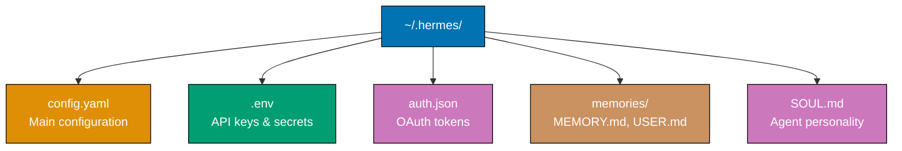
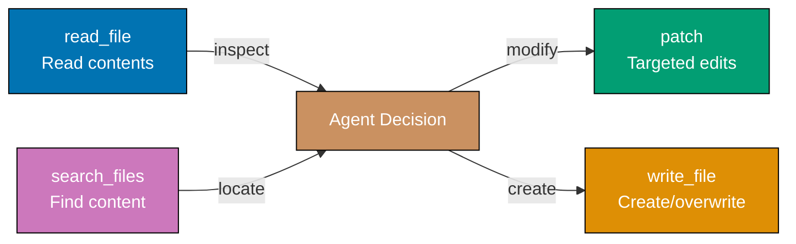
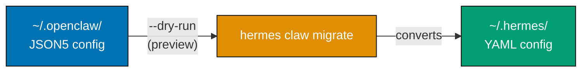

This tutorial provides 27 foundational examples covering the Hermes Agent AI platform. Learn installation and CLI basics (Examples 1-6), YAML configuration (Examples 7-13), built-in tools (Examples 14-20), and memory and context basics (Examples 21-27).

## Installation and CLI Basics (Examples 1-6)

### Example 1: Installing Hermes Agent

Hermes Agent installs via a single `curl` command that bootstraps the entire toolchain. The only prerequisite is Git — the installer auto-provisions Python 3.11, Node.js v22, uv, ripgrep, and ffmpeg.


**Commands**:

```bash
curl -fsSL https://raw.githubusercontent.com/NousResearch/hermes-agent/main/scripts/install.sh | bash
                                        # => Downloads and runs official install script
                                        # => Only prerequisite: Git must be installed
                                        # => Auto-installs: Python 3.11, Node.js v22
                                        # => Auto-installs: uv (Python package manager)
                                        # => Auto-installs: ripgrep (fast file search)
                                        # => Auto-installs: ffmpeg (media processing)

source ~/.bashrc                        # => Reloads shell environment
                                        # => Makes `hermes` command available in PATH

hermes --version                        # => Output: hermes-agent 0.9.0
                                        # => Confirms successful installation

hermes doctor                           # => Runs post-install health check
                                        # => Validates all dependencies installed
                                        # => Output: pass/fail for each component
```

**Key Takeaway**: Install Hermes Agent with `curl | bash`. The installer handles all dependencies — you only need Git pre-installed.

**Why It Matters**: Hermes Agent's zero-prerequisite installer removes the friction that kills adoption of developer tools. Traditional AI agent setups require manually installing Python, Node.js, and a half-dozen utilities before you even configure anything. The single `curl` command gets you from nothing to a working AI agent in under two minutes. This matters for teams onboarding new developers — instead of a page-long setup guide, it is one command followed by `hermes doctor` to verify everything works.

### Example 2: First-Time Setup Wizard

The `hermes setup` command launches an interactive wizard that configures your model provider, API keys, and creates the `~/.hermes/` directory structure. This is the recommended first step after installation.

```bash
hermes setup                            # => Launches interactive setup wizard
                                        # => Step 1: Select model provider
                                        # =>   Options: anthropic, openrouter, nous,
                                        # =>            openai, copilot, custom
                                        # => Step 2: Enter API key for chosen provider
                                        # => Step 3: Select default model
                                        # => Creates ~/.hermes/ directory structure
                                        # => Creates ~/.hermes/config.yaml
                                        # => Creates ~/.hermes/.env (API keys)
                                        # => Output: "Setup complete! Run `hermes` to start."

ls ~/.hermes/                           # => Output:
                                        # =>   config.yaml     — Main configuration
                                        # =>   .env            — API keys and secrets
                                        # =>   auth.json       — OAuth tokens (if used)
                                        # =>   memories/       — Persistent agent memory
                                        # =>   SOUL.md         — Agent personality definition

hermes model                            # => Shows current model selection
                                        # => Output: "Current model: anthropic/claude-sonnet-4-6"
                                        # => Use to switch models after initial setup
                                        # => Prompts for new provider and model selection
```

**Key Takeaway**: Run `hermes setup` immediately after installation. It creates `~/.hermes/` with config, API keys, and memory directories. Use `hermes model` to change models later.

**Why It Matters**: The setup wizard prevents the most common failure mode: manually editing YAML config with a typo that silently breaks the agent. The wizard validates your API key against the provider before saving, catches permission issues with `~/.hermes/`, and ensures the directory structure matches what the agent expects. Teams rolling out Hermes across developer machines use `hermes setup` to guarantee consistent baseline configuration without writing deployment scripts or distributing config templates.

### Example 3: Starting an Interactive Session

Running `hermes` or `hermes chat` launches the terminal user interface (TUI) for interactive conversations. The TUI supports multiline editing, autocomplete, streaming output, and live token/cost tracking.

```bash
hermes                                  # => Launches interactive TUI session
                                        # => Same as: hermes chat
                                        # => Multiline editing enabled by default
                                        # => Tab autocomplete for slash commands
                                        # => Streaming output renders as LLM generates

hermes chat                             # => Explicit command, identical to `hermes`
                                        # => Status bar shows: token count, session cost
                                        # => Ctrl+C to interrupt current generation
                                        # => /new to reset conversation (fresh context)
                                        # => /exit or Ctrl+D to quit session

# Inside the TUI:
# > What is Rust?                       # => Type prompt and press Enter
#                                       # => LLM streams response in real-time
#                                       # => Status bar updates token count
#                                       # => Status bar updates running cost
```

**Key Takeaway**: Run `hermes` to start an interactive session. Use `Ctrl+C` to interrupt, `/new` to reset context, and `Ctrl+D` to exit. The status bar tracks tokens and cost in real-time.

**Why It Matters**: The TUI is where most development work happens — exploring codebases, debugging issues, and iterating on solutions. Real-time token and cost tracking prevents budget surprises that are common with web-based AI interfaces where usage is invisible until the monthly bill arrives. The `/new` command is critical for context management: when a conversation drifts off-topic or the context window fills with irrelevant history, resetting gives the LLM a fresh start without restarting the entire application.

### Example 4: One-Shot Messages

The `-q` flag sends a single query and exits after the response, making Hermes Agent scriptable for automation pipelines, shell scripts, and CI/CD integrations.

```bash
hermes chat -q "What is Rust?"          # => Sends single query to configured LLM
                                        # => Prints response to stdout
                                        # => Exits automatically after response
                                        # => Non-interactive: no TUI launched

hermes chat -q "Summarize this" < README.md
                                        # => Pipes file content as stdin context
                                        # => LLM receives file + prompt together
                                        # => Useful for processing files in scripts

hermes chat --toolsets "web" -q "search for Rust async runtimes"
                                        # => Restricts available tools to web only
                                        # => Agent can search the web but not run terminal
                                        # => Limits scope for safer scripted usage
                                        # => Other toolsets: terminal, file, vision

echo "explain: $(cat error.log)" | hermes chat -q -
                                        # => Reads prompt from stdin via dash flag
                                        # => Useful in pipeline chains
                                        # => Combines shell interpolation with AI
```

**Key Takeaway**: Use `hermes chat -q "prompt"` for one-shot AI queries. Combine with `--toolsets` to restrict tool access. Supports stdin piping for shell integration.

**Why It Matters**: One-shot mode transforms Hermes Agent from an interactive tool into a composable UNIX utility. CI/CD pipelines use it for automated code review (`git diff | hermes chat -q "review this diff"`), shell aliases make AI queries instant (`alias ask='hermes chat -q'`), and cron jobs can generate daily reports. The `--toolsets` restriction is essential for scripted usage — you want the agent to answer questions but not accidentally run destructive terminal commands when processing untrusted input from logs or user data.

### Example 5: Reasoning Effort Levels

The `--reasoning-effort` flag controls how deeply the LLM reasons before responding. Six levels trade off latency and cost against answer depth and thoroughness.

```bash
hermes chat -q "What is 2+2?" --reasoning-effort none
                                        # => No chain-of-thought reasoning
                                        # => Fastest response, lowest token usage
                                        # => Output: "4"
                                        # => Best for: trivial lookups, simple facts

hermes chat -q "Explain mutex vs semaphore" --reasoning-effort minimal
                                        # => Minimal internal reasoning
                                        # => Brief but accurate answer
                                        # => Output: short comparison paragraph

hermes chat -q "Debug this null pointer" --reasoning-effort low
                                        # => Light reasoning pass
                                        # => Catches obvious issues
                                        # => Output: identifies likely cause

hermes chat -q "Design a cache layer" --reasoning-effort medium
                                        # => Moderate reasoning depth
                                        # => Considers trade-offs and alternatives
                                        # => Output: structured design with pros/cons
                                        # => Good default for general development tasks

hermes chat -q "Architect a payment system" --reasoning-effort high
                                        # => Extended reasoning, edge case analysis
                                        # => Output: comprehensive design document
                                        # => Covers: security, scaling, failure modes

hermes chat -q "Find the race condition" --reasoning-effort xhigh
                                        # => Maximum reasoning depth
                                        # => Exhaustive analysis of all code paths
                                        # => Output: detailed trace with fix
                                        # => Highest token usage and latency
```

**Key Takeaway**: Match `--reasoning-effort` to task complexity: `none` for lookups, `medium` for general work, `high` for architecture, `xhigh` for debugging race conditions. Each level increases cost and latency.

**Why It Matters**: Reasoning effort directly controls your LLM bill. A simple "what time is it in Tokyo" at `xhigh` wastes tokens on unnecessary deliberation, while a distributed systems design at `none` produces a shallow answer missing critical failure modes. Production teams configure default effort levels per workflow — quick Q&A channels use `low`, architecture discussions use `high`. The six-level granularity lets you fine-tune the cost-quality trade-off rather than accepting a one-size-fits-all approach that either overspends on simple tasks or underthinks complex ones.

### Example 6: Doctor and Diagnostics

The `hermes doctor` command validates your entire installation — checking dependencies, config syntax, API key validity, and tool availability. The `hermes status` and `hermes update` commands round out the diagnostics toolkit.

```bash
hermes doctor                           # => Runs full diagnostic suite
                                        # => Checks: Python 3.11 installed
                                        # => Checks: Node.js v22 installed
                                        # => Checks: uv package manager present
                                        # => Checks: ripgrep available
                                        # => Checks: ffmpeg available
                                        # => Checks: ~/.hermes/config.yaml valid
                                        # => Checks: API key authenticates
                                        # => Output: pass/fail for each check

hermes status                           # => Shows current configuration state
                                        # => Output: active model provider
                                        # => Output: configured API keys (masked)
                                        # => Output: enabled toolsets
                                        # => Output: memory file sizes

hermes update                           # => Updates Hermes Agent to latest version
                                        # => Downloads and replaces current install
                                        # => Preserves ~/.hermes/ config and memories
                                        # => Output: "Updated to hermes-agent 0.9.1"
```

**Key Takeaway**: Run `hermes doctor` when anything breaks. Use `hermes status` to inspect current config. Use `hermes update` to get the latest version without losing your configuration.

**Why It Matters**: Hermes Agent depends on six external tools (Python, Node.js, uv, ripgrep, ffmpeg, Git) plus network connectivity to LLM providers. Any of these failing produces different symptoms — from silent response drops to cryptic Python errors. `doctor` eliminates guesswork by testing each dependency systematically. The `update` command preserves your `~/.hermes/` directory, so upgrading never wipes your memories, API keys, or custom personality. This separation of binary from config is a deliberate design choice enabling fearless updates.

## YAML Configuration (Examples 7-13)

### Example 7: Configuration File Structure

Hermes Agent uses `~/.hermes/config.yaml` as the main configuration file, `~/.hermes/.env` for secrets, and `~/.hermes/auth.json` for OAuth tokens. Understanding this hierarchy is essential for proper setup.



**Directory structure**:

```bash
ls -la ~/.hermes/                       # => Output:
                                        # =>   config.yaml   — Main YAML configuration
                                        # =>   .env          — API keys (never commit)
                                        # =>   auth.json     — OAuth tokens (auto-managed)
                                        # =>   SOUL.md       — Agent personality definition
                                        # =>   memories/     — Persistent memory files
                                        # =>     MEMORY.md   — Agent's learned notes
                                        # =>     USER.md     — User profile info

cat ~/.hermes/config.yaml               # => YAML format: human-readable, comment-friendly
                                        # => All non-secret settings live here
                                        # => Changes take effect on next session start
```

**Key Takeaway**: All Hermes Agent configuration lives in `~/.hermes/`. Secrets go in `.env`, behavior in `config.yaml`, personality in `SOUL.md`, and learned context in `memories/`.

**Why It Matters**: Separating secrets (`.env`) from configuration (`config.yaml`) from personality (`SOUL.md`) follows the twelve-factor app methodology. You can share your `config.yaml` with teammates without exposing API keys, version-control your `SOUL.md` personality, and back up `memories/` independently. This separation also means `hermes update` safely replaces the binary without touching any of these files — your agent's learned knowledge and personality survive every upgrade.

### Example 8: Model Provider Configuration

The `model` section in `config.yaml` controls which LLM provider and model Hermes Agent uses. Supports Anthropic, OpenRouter, Nous, OpenAI, GitHub Copilot, and custom endpoints.

```yaml
# ~/.hermes/config.yaml
# => Model provider configuration
# => Controls which LLM processes your conversations

model:
  provider:
    anthropic # => LLM provider to use
    # => Options: anthropic, openrouter, nous,
    # =>          openai, copilot, custom
  model:
    claude-sonnet-4-6 # => Specific model within provider
    # => Anthropic: claude-opus-4, claude-sonnet-4-6
    # => OpenRouter: openai/gpt-4o, google/gemini-2.5-pro
  base_url:
    "" # => Custom API endpoint (leave empty for default)
    # => Used with provider: custom
    # => Example: http://localhost:11434/v1
  api_key:
    "${ANTHROPIC_API_KEY}" # => References key from .env file
    # => ${VAR} syntax for environment substitution

  # Fallback model configuration
  fallback:
    provider: openrouter # => Fallback provider if primary fails
    model:
      openai/gpt-4o # => Fallback model selection
      # => Activated on: rate limit, timeout, API error
```

**Key Takeaway**: Set `model.provider` and `model.model` for your primary LLM. Configure `fallback` for automatic failover. Use `${VAR}` syntax to reference API keys from `.env`.

**Why It Matters**: Model fallback chains prevent outages — when Anthropic has an incident, Hermes Agent automatically routes to OpenRouter without human intervention. The `${VAR}` substitution keeps API keys in `.env` rather than hardcoded in YAML, so you can safely share config files and version-control them. The provider abstraction means switching from Anthropic to OpenAI is a one-line change, not a code migration — essential for teams evaluating different LLMs or needing to rotate providers for cost optimization.

### Example 9: API Key Management

The `~/.hermes/.env` file stores all API keys and sensitive credentials. Hermes Agent loads this file at session start and resolves `${VAR}` references in `config.yaml`.

```bash
# ~/.hermes/.env
# => One key-value pair per line
# => Loaded at session start
# => Referenced via ${VAR} in config.yaml

ANTHROPIC_API_KEY=sk-ant-api03-xxxxx    # => Anthropic Claude API key
                                        # => Get from: console.anthropic.com

OPENROUTER_API_KEY=sk-or-v1-xxxxx       # => OpenRouter API key
                                        # => Get from: openrouter.ai/keys
                                        # => Provides access to 200+ models

OPENAI_API_KEY=sk-proj-xxxxx            # => OpenAI API key
                                        # => Get from: platform.openai.com

NOUS_API_KEY=nk-xxxxx                   # => Nous Research API key
                                        # => Get from: inference.nous.ai
```

```yaml
# ~/.hermes/config.yaml
# => Precedence order for configuration values:
# =>   1. CLI arguments (highest priority)
# =>   2. config.yaml values
# =>   3. .env file variables
# =>   4. Built-in defaults (lowest priority)

model:
  api_key:
    "${ANTHROPIC_API_KEY}" # => Resolved from .env at runtime
    # => Clear error if variable is unset
```

**Key Takeaway**: Store all API keys in `~/.hermes/.env`. Reference them in `config.yaml` with `${VAR}` syntax. CLI arguments override config which overrides `.env` which overrides defaults.

**Why It Matters**: Keeping secrets in `.env` rather than `config.yaml` follows security best practices — you can share, version-control, or post your config file without exposing credentials. The four-level precedence chain (CLI > config > env > defaults) enables flexible overrides: set a default model in config, override it per-session with `--model`, or let CI pipelines inject keys via environment variables without touching config files. This pattern is familiar to anyone who has used Docker, Kubernetes, or twelve-factor apps.

### Example 10: Display and Output Settings

The `display` and `streaming` sections control how Hermes Agent renders responses — progress indicators, streaming behavior, reasoning visibility, cost display, and visual skin.

```yaml
# ~/.hermes/config.yaml

display:
  tool_progress:
    true # => Show tool execution progress bars
    # => Displays: "Running terminal..." with spinner
  streaming:
    true # => Stream tokens as LLM generates them
    # => false: wait for complete response
  show_reasoning:
    true # => Display chain-of-thought reasoning
    # => Shows the LLM's thinking process
  show_cost:
    true # => Display cost per message and session total
    # => Output: "$0.003 (session: $0.15)"
  skin:
    default # => Visual theme for TUI
    # => Options: default, minimal, colorful
  personality:
    default # => Display personality name in status bar
    # => Shows which SOUL.md persona is active
  compact:
    false # => Compact mode reduces whitespace
    # => true: denser output, less scrolling

streaming:
  enabled:
    true # => Master switch for streaming
    # => false: all responses arrive as complete blocks
  transport:
    sse # => Streaming protocol
    # => Options: sse (Server-Sent Events), websocket
  edit_interval:
    100 # => Milliseconds between display updates
    # => Lower = smoother but higher CPU
  cursor:
    true # => Show blinking cursor during generation
    # => Visual indicator that LLM is still working
```

**Key Takeaway**: Control visual output with `display` settings. Enable `show_cost` to track spending, `show_reasoning` to see the LLM's thought process, and adjust `streaming` for response rendering.

**Why It Matters**: Display settings directly affect developer productivity. `show_cost: true` prevents budget surprises — you see per-message and session totals in real-time instead of discovering a large bill at month-end. `show_reasoning: true` is invaluable for debugging AI behavior: when the agent makes a wrong decision, the reasoning trace shows exactly where its logic diverged. `compact: true` saves screen real estate for developers on laptops. These are not cosmetic preferences — they are workflow tools.

### Example 11: Agent Behavior Configuration

The `agent` section controls core runtime behavior — maximum conversation turns, reasoning effort defaults, tool use enforcement, and context compression settings.

```yaml
# ~/.hermes/config.yaml

agent:
  max_turns:
    90 # => Maximum conversation turns per session
    # => Prevents runaway agent loops
    # => Default: 90 (sufficient for most tasks)
    # => Set lower for cost control

  reasoning_effort:
    medium # => Default reasoning effort level
    # => Options: none, minimal, low, medium, high, xhigh
    # => Overridable per-message with --reasoning-effort
    # => medium: good balance of speed and depth

  tool_use_enforcement:
    auto # => How strictly agent must use tools
    # => auto: agent decides when tools are needed
    # => always: force tool use every turn
    # => never: disable all tool usage

compression:
  enabled:
    true # => Enable automatic context compression
    # => Reduces context when approaching token limit
  threshold:
    0.50 # => Compress when context exceeds 50% of window
    # => Range: 0.0 (compress immediately) to 1.0 (never)
  target_ratio:
    0.30 # => Target context size after compression
    # => 0.30 = compress to 30% of window
  protect_last_n:
    5 # => Protect last N messages from compression
    # => Keeps recent context intact
    # => Older messages get summarized
```

**Key Takeaway**: Set `max_turns` to prevent runaway sessions, `reasoning_effort` for default depth, and `compression` to manage long conversations automatically.

**Why It Matters**: Without `max_turns`, a misbehaving agent can loop indefinitely — calling tools, getting errors, retrying — burning through your API budget. The compression system solves the context window problem: long debugging sessions accumulate thousands of tokens of history, eventually hitting the model's limit. Rather than crashing or truncating, compression intelligently summarizes older messages while protecting the recent conversation thread. `protect_last_n: 5` ensures the agent always remembers what you just discussed.

### Example 12: Human Delay Settings

The `human_delay` section adds configurable pauses between agent actions, making the agent appear more natural in messaging platforms where instant responses feel robotic.

```yaml
# ~/.hermes/config.yaml

human_delay:
  mode:
    "off" # => Delay mode selection
    # => off: no artificial delays (fastest)
    # => natural: randomized human-like pauses
    # => custom: use min_ms and max_ms values

  min_ms:
    500 # => Minimum delay in milliseconds
    # => Only used when mode: custom
    # => Adds at least 500ms between actions

  max_ms:
    2000 # => Maximum delay in milliseconds
    # => Only used when mode: custom
    # => Random delay between min_ms and max_ms
    # => Simulates human typing speed variation
```

```bash
# Example: mode set to "natural"
# Agent receives message at 10:00:00.000
# => Pauses 800ms (randomized)          # => Simulates reading the message
# Agent starts typing at 10:00:00.800
# => Pauses 1200ms (randomized)         # => Simulates composing response
# Agent sends response at 10:00:02.000
```

**Key Takeaway**: Use `mode: off` for development speed, `mode: natural` for messaging platforms where human-like pacing matters, and `mode: custom` for precise delay control.

**Why It Matters**: In Slack or Telegram channels where humans and AI agents coexist, an agent that responds in 50 milliseconds feels jarring and disrupts conversation flow. Natural delays make the agent a better team participant — colleagues perceive it as "thinking" rather than "instant-replying." For development and scripting use cases, `mode: off` eliminates unnecessary latency. Custom mode lets you tune delays for specific platforms — Discord communities may prefer faster responses than corporate Slack workspaces.

### Example 13: Quick Commands

The `quick_commands` section defines custom zero-token shell shortcuts that execute directly without consuming LLM context. Type `/command-name` in chat to run the associated shell command instantly.

```yaml
# ~/.hermes/config.yaml

quick_commands:
  status:
    "systemctl status hermes-agent"
    # => /status in chat runs this command
    # => Zero tokens consumed (no LLM involved)
    # => Output displayed directly in TUI

  disk:
    "df -h /" # => /disk shows filesystem usage
    # => Instant execution, no AI processing

  ports:
    "lsof -i -P -n | head -20" # => /ports lists open network ports
    # => Useful for debugging connectivity

  logs:
    "tail -50 /var/log/syslog" # => /logs shows recent system logs
    # => Quick access without typing full path

  gpu:
    "nvidia-smi" # => /gpu shows GPU utilization
    # => Useful when running local models
```

```bash
# Inside hermes TUI session:
/status                                 # => Executes: systemctl status hermes-agent
                                        # => Output: service status information
                                        # => Zero tokens consumed
                                        # => No LLM roundtrip — instant execution

/disk                                   # => Executes: df -h /
                                        # => Output: filesystem usage table
                                        # => Faster than asking "how much disk space"
```

**Key Takeaway**: Define `quick_commands` in `config.yaml` for frequently used shell commands. Type `/command-name` in chat for instant execution with zero token cost.

**Why It Matters**: Every message sent to the LLM costs tokens — asking "how much disk space do I have?" burns context and money for information a simple `df -h` provides. Quick commands bypass the LLM entirely, executing shell commands directly and displaying output in the TUI. Over a workday of frequent status checks, the token savings add up significantly. Teams standardize quick commands across developer machines so everyone has the same `/status`, `/logs`, `/health` shortcuts, creating a shared operational vocabulary.

## Built-in Tools (Examples 14-20)

### Example 14: Terminal Tool

The terminal tool lets Hermes Agent execute shell commands on your machine. When enabled, the agent autonomously runs commands to gather information, install packages, or perform system operations as part of its reasoning.

```yaml
# ~/.hermes/config.yaml
# => Terminal tool configuration

tools:
  terminal:
    backend:
      local # => Execution backend
      # => local: runs on host machine directly
      # => Options: local, docker, ssh
    timeout:
      180 # => Command timeout in seconds
      # => Kills command after 180s (3 minutes)
      # => Prevents: infinite loops, hung processes
    cwd:
      "~" # => Default working directory
      # => Agent starts commands here
      # => Can cd to other directories as needed
```

```bash
# In hermes TUI session:
> Check what Go version is installed

# => Agent decides to use terminal tool
# => Agent runs: go version
# => Output: go version go1.23.0 darwin/arm64
# => Agent reports: "You have Go 1.23.0 installed on macOS ARM64"

> Find all TODO comments in the src/ directory

# => Agent runs: rg "TODO" src/ --line-number
# => Output: list of files and lines with TODO comments
# => Agent summarizes: "Found 7 TODO comments across 4 files"
```

**Key Takeaway**: The terminal tool executes shell commands autonomously when the agent determines they are needed. Configure `timeout` to prevent runaway commands and `cwd` to set the default directory.

**Why It Matters**: Terminal access is what transforms an LLM from a text generator into an agent. Without it, the AI can only suggest commands — with it, the AI executes, observes results, and iterates. The `timeout` setting is critical safety infrastructure: without it, a command like `find / -name "*.log"` on a large filesystem runs indefinitely, blocking the agent and consuming system resources. The `backend` option enables sandboxed execution via Docker for teams that want AI terminal access without granting host-level permissions.

### Example 15: File Operations (read_file, write_file, patch)

Hermes Agent provides four file tools for reading, creating, editing, and searching files. These tools give the agent direct filesystem access for code modifications, config changes, and content creation.



**Tools**:

```bash
# In hermes TUI session:
> Read the contents of package.json

# => Agent uses: read_file("package.json")
# => Returns: full file contents to agent context
# => Agent analyzes and reports key information

> Create a .gitignore file for a Node.js project

# => Agent uses: write_file(".gitignore", "node_modules/\ndist/\n.env\n...")
# => Creates file with standard Node.js ignore patterns
# => Output: "Created .gitignore with 12 patterns"

> Change the port from 3000 to 8080 in server.ts

# => Agent uses: patch("server.ts",
# =>   old_string="port: 3000",
# =>   new_string="port: 8080")
# => Targeted edit — only changes matched text
# => Output: "Updated port from 3000 to 8080 in server.ts"

> Find all files importing the auth module

# => Agent uses: search_files("from.*auth", "src/")
# => Uses ripgrep under the hood for fast search
# => Returns: matching files with line numbers
# => Output: "Found 5 files importing auth module"
```

**Key Takeaway**: Use `read_file` to inspect, `write_file` to create, `patch` for targeted edits (old_string to new_string), and `search_files` to locate content across your project.

**Why It Matters**: The `patch` tool is particularly significant — it makes surgical edits rather than rewriting entire files. When the agent changes one line in a 500-line file, `patch` modifies only that line, preserving formatting, comments, and unrelated code. This is safer than `write_file` for modifications because it cannot accidentally delete content outside the edit region. The `search_files` tool uses ripgrep for speed, searching thousands of files in milliseconds — essential for the agent to understand large codebases before making changes.

### Example 16: Web Search and Extraction

The web tools let Hermes Agent search the internet and extract content from web pages. Configure the search backend in `config.yaml` to use Firecrawl, Tavily, Exa, or a parallel multi-engine search.

```yaml
# ~/.hermes/config.yaml

web:
  backend:
    firecrawl # => Web search/extraction backend
    # => Options: firecrawl, tavily, exa, parallel
    # => firecrawl: best for page extraction
    # => tavily: optimized for search relevance
    # => parallel: queries multiple engines
```

```bash
# In hermes TUI session:
> Search for the latest Rust release notes

# => Agent uses: web_search("Rust programming language latest release")
# => Queries configured backend (firecrawl/tavily/exa)
# => Returns: top search results with titles and snippets
# => Agent summarizes: "Rust 1.82 was released on..."

> Extract the content from https://doc.rust-lang.org/book/ch04-01.html

# => Agent uses: web_extract("https://doc.rust-lang.org/book/ch04-01.html")
# => Fetches page and converts to clean text
# => Strips navigation, ads, boilerplate
# => Returns: main content as structured text
# => Agent analyzes and answers based on extracted content
```

**Key Takeaway**: `web_search` queries the internet for information, `web_extract` fetches and cleans web page content. Configure `web.backend` in `config.yaml` to choose the search engine.

**Why It Matters**: LLMs have knowledge cutoff dates — they do not know about events, releases, or documentation updates after their training data ends. Web tools bridge this gap: the agent can search for current information, read up-to-date documentation, and verify its knowledge against live sources. The backend choice matters for different workflows: `firecrawl` excels at extracting structured content from documentation pages, `tavily` provides better search relevance ranking, and `parallel` combines multiple engines for comprehensive coverage at the cost of higher latency.

### Example 17: Process Management

The process tool lets Hermes Agent start, monitor, and stop long-running processes. This is essential for development workflows where the agent needs to run servers, watchers, or build processes in the background.

```bash
# In hermes TUI session:
> Start a development server in the background

# => Agent uses: process.start("npm run dev")
# => Launches process in background
# => Returns: process ID (PID) and status
# => Output: "Started process 12345: npm run dev"
# => Agent continues conversation while server runs

> Check the status of running processes

# => Agent uses: process.status()
# => Lists all agent-managed background processes
# => Output:
# =>   PID 12345 | running | npm run dev (2m 15s)
# =>   PID 12389 | running | tsc --watch  (1m 30s)

> Stop the development server

# => Agent uses: process.kill(12345)
# => Sends SIGTERM to process
# => Waits for graceful shutdown
# => Output: "Stopped process 12345: npm run dev"
```

**Key Takeaway**: Use process management to run development servers, file watchers, and build tools in the background. The agent tracks PIDs and can check status or kill processes on demand.

**Why It Matters**: Real development work requires multiple concurrent processes — a dev server, a TypeScript watcher, a test runner. Without process management, the agent would block on the first `npm run dev` and never return to the conversation. Background process support enables workflows like "start the server, run the tests, show me the failures, fix them, re-run tests" — all in a single conversation without manual intervention. The PID tracking prevents orphaned processes that consume resources after the session ends.

### Example 18: Todo Management

The todo tool gives Hermes Agent an internal task tracker for managing multi-step work within a session. The agent creates, updates, and completes todos as it works through complex tasks.

```bash
# In hermes TUI session:
> Refactor the auth module to use JWT tokens

# => Agent creates internal todo list:
# => [ ] Read current auth implementation
# => [ ] Identify all auth-dependent files
# => [ ] Install jsonwebtoken package
# => [ ] Create JWT utility functions
# => [ ] Update login handler
# => [ ] Update middleware
# => [ ] Run tests

# As agent works through tasks:
# => [x] Read current auth implementation
# => [x] Identify all auth-dependent files (found 8 files)
# => [x] Install jsonwebtoken package
# => [ ] Create JWT utility functions         <- current
# => [ ] Update login handler
# => [ ] Update middleware
# => [ ] Run tests

# => Todo list visible in session context
# => Agent tracks progress autonomously
# => Picks up where it left off if interrupted
```

**Key Takeaway**: The todo tool helps the agent break complex tasks into tracked steps. Todos are created, updated, and completed automatically as the agent works through multi-step operations.

**Why It Matters**: Complex tasks like "refactor the auth module" involve dozens of interconnected steps. Without internal task tracking, the agent loses its place after context compression or when recovering from an error. The todo list serves as the agent's working memory — a structured plan it follows and updates. This makes the agent's progress visible to you: instead of wondering "what is it doing?", you see a checklist showing completed and remaining work. It also enables the agent to prioritize and skip steps intelligently when earlier work reveals a simpler path.

### Example 19: Vision and Image Analysis

The vision tools let Hermes Agent analyze images and generate new ones. Vision analysis examines screenshots, diagrams, and photos. Image generation creates visuals via fal.ai integration.

```yaml
# ~/.hermes/config.yaml

auxiliary:
  vision:
    enabled:
      true # => Enable image analysis capabilities
      # => Agent can interpret screenshots, diagrams
    backend:
      default # => Vision processing backend
      # => Uses model's native vision when available
  image_generation:
    enabled:
      true # => Enable image creation
      # => Requires fal.ai API key in .env
    backend:
      fal # => Image generation provider
      # => fal: fal.ai (fast, high quality)
```

```bash
# In hermes TUI session:
> Analyze this screenshot of the error

# => Agent uses: vision_analyze("screenshot.png")
# => Processes image through vision model
# => Identifies: error message text, stack trace, UI context
# => Output: "The error shows a TypeError: cannot read property
# =>          'map' of undefined on line 42 of UserList.tsx"

> Generate an architecture diagram for a microservices system

# => Agent uses: image_generate("architecture diagram showing
# =>   API gateway connecting to auth, users, and orders
# =>   microservices with message queue between them")
# => Creates image via fal.ai
# => Saves to local file
# => Output: "Generated architecture diagram: arch-diagram.png"
```

**Key Takeaway**: Enable vision in `auxiliary.vision` for image analysis and `auxiliary.image_generation` for creating images via fal.ai. Vision analysis works with screenshots, diagrams, and photos.

**Why It Matters**: Vision analysis transforms how you report bugs to the AI agent. Instead of transcribing error messages from screenshots or describing UI layouts in words, you attach an image and the agent reads it directly. This is especially powerful for debugging frontend issues — the agent sees the broken UI, reads the error overlay, and correlates with source code. Image generation enables rapid prototyping of visual concepts — architecture diagrams, wireframes, and flowcharts — without switching to separate design tools.

### Example 20: Toolset Management

Hermes Agent groups tools into toolsets that can be enabled or disabled as a unit. The `hermes tools` command, `--toolsets` CLI flag, and `/tools` slash command provide three ways to manage tool access.

```bash
hermes tools                            # => Interactive tool management
                                        # => Shows all available toolsets
                                        # => Toggle enable/disable per toolset
                                        # => Output:
                                        # =>   [x] terminal    — Shell command execution
                                        # =>   [x] file        — File read/write/patch/search
                                        # =>   [x] web         — Web search and extraction
                                        # =>   [ ] process     — Background process management
                                        # =>   [ ] vision      — Image analysis and generation
                                        # =>   [x] todo        — Task tracking
                                        # =>   [x] memory      — Persistent memory operations

hermes chat --toolsets "web,file"        # => Restrict tools for this session only
                                        # => Only web and file tools available
                                        # => Terminal, process, vision disabled
                                        # => Useful for limiting agent capabilities

# Inside TUI session:
/tools                                  # => Shows tool status in current session
                                        # => Toggle tools without restarting
                                        # => Changes apply immediately
```

**Key Takeaway**: Manage tools with `hermes tools` (interactive), `--toolsets "list"` (per-session), or `/tools` (in-session toggle). Group tools by capability for easier access control.

**Why It Matters**: Not every task needs every tool. Code review sessions need file and search tools but not terminal execution. Research tasks need web tools but not filesystem access. Restricting toolsets follows the principle of least privilege — the agent can only use what is explicitly needed, reducing the attack surface for prompt injection and accidental destructive operations. Per-session toolset selection via `--toolsets` enables safe scripted usage where you want AI analysis but not AI execution.

## Memory and Context Basics (Examples 21-27)

### Example 21: MEMORY.md -- Agent's Persistent Notes

The `~/.hermes/memories/MEMORY.md` file is the agent's persistent notepad. Hermes Agent writes learned facts, environment details, and conventions here. The content is injected as a frozen snapshot at the start of every session.

```bash
cat ~/.hermes/memories/MEMORY.md        # => Agent's persistent memory file
                                        # => 2,200 character limit (~800 tokens)
                                        # => Injected at session start (read-only snapshot)
                                        # => Agent updates via memory tool (takes effect next session)
```

```markdown
<!-- ~/.hermes/memories/MEMORY.md -->
<!-- => Written and maintained by the agent autonomously -->
<!-- => 2,200 character limit (~800 tokens) -->

## Environment

- OS: macOS 14.5 (Apple Silicon M2)
- Shell: zsh with oh-my-zsh
- Default editor: neovim
- Package manager: Homebrew

## Project Conventions

- Uses conventional commits (feat/fix/docs/chore)
- Tests required before merge
- TypeScript strict mode enabled
- Prettier + ESLint for formatting

## Lessons Learned

- User prefers functional style over OOP
- Always check .env.example before suggesting env vars
- Project uses pnpm, not npm (lock file: pnpm-lock.yaml)
```

**Key Takeaway**: `MEMORY.md` stores up to 2,200 characters of persistent agent knowledge. The agent updates it autonomously. Content loads as a frozen snapshot at session start.

**Why It Matters**: Without persistent memory, every session starts from zero — the agent rediscovers your OS, your coding style, your project conventions, and your preferences. `MEMORY.md` eliminates this repeated discovery cost. The 2,200 character limit forces prioritization: only the most useful facts survive, preventing memory bloat that would waste context tokens on rarely-relevant details. The frozen snapshot design means memory changes take effect next session, preventing mid-conversation confusion from memory mutations.

### Example 22: USER.md -- User Profile

The `~/.hermes/memories/USER.md` file stores information about you — your name, role, timezone, communication style, and preferences. The agent updates this file autonomously as it learns about you through conversation.

```markdown
<!-- ~/.hermes/memories/USER.md -->
<!-- => Agent's knowledge about the user -->
<!-- => 1,375 character limit (~500 tokens) -->
<!-- => Updated autonomously by agent -->
<!-- => Injected at session start -->

## Identity

- Name: Alex Chen
- Role: Senior Backend Engineer
- Team: Platform Infrastructure
- Timezone: UTC+7 (Bangkok)

## Communication Style

- Prefers concise answers over verbose explanations
- Likes code examples over prose descriptions
- Appreciates when assumptions are stated explicitly
- Dislikes: emojis in code comments, unnecessary preamble

## Technical Preferences

- Languages: Rust (primary), Go, TypeScript
- Editor: Neovim with LSP
- OS: Arch Linux
- Deployment: Kubernetes + ArgoCD
- Testing: property-based testing when applicable
```

**Key Takeaway**: `USER.md` stores up to 1,375 characters about you. The agent learns your preferences through conversation and updates this file autonomously, creating a personalized experience across sessions.

**Why It Matters**: Personalization eliminates repetitive corrections. Without `USER.md`, you tell the agent "use Rust, not Python" every session, explain your commit message format every time, and remind it about your timezone for scheduling tasks. After a few conversations, the agent learns these preferences and applies them automatically. The separate file from `MEMORY.md` is intentional — user identity is stable (your name and role rarely change), while project knowledge evolves rapidly. Different retention limits reflect this: user profile gets fewer tokens because it changes less often.

### Example 23: Memory Operations

The memory tool provides three actions — `add`, `replace`, and `remove` — for modifying persistent memory. There is no `read` action because memory is automatically injected at session start. Changes persist to disk but take effect in the next session.

```bash
# In hermes TUI session:

> Remember that this project uses PostgreSQL 16

# => Agent uses: memory.add("- Database: PostgreSQL 16")
# => Appends to ~/.hermes/memories/MEMORY.md
# => Output: "Added to memory: Database: PostgreSQL 16"
# => Takes effect: next session start

> Update the database version from PostgreSQL 16 to 17

# => Agent uses: memory.replace(
# =>   old="- Database: PostgreSQL 16",
# =>   new="- Database: PostgreSQL 17")
# => Substring matching finds the line
# => Replaces in-place in MEMORY.md
# => Output: "Updated memory: PostgreSQL 16 → 17"

> Forget the note about PostgreSQL

# => Agent uses: memory.remove("- Database: PostgreSQL 17")
# => Removes matched substring from MEMORY.md
# => Output: "Removed from memory: Database: PostgreSQL 17"
# => Frees character budget for other facts
```

**Key Takeaway**: Use `add` to store new facts, `replace` to update existing ones (substring matching), and `remove` to delete outdated information. No `read` action exists — memory is injected automatically.

**Why It Matters**: The three-action design (add/replace/remove with no read) is deliberately minimal. Reading memory would waste tokens re-processing information already in context. Replace uses substring matching rather than line numbers or keys, making it robust against memory reorganization — if the agent rewrites `MEMORY.md` structure, replace still works as long as the target text exists. The persist-to-disk-but-apply-next-session model prevents a dangerous edge case: mid-session memory mutations could contradict the context the agent has already been reasoning about, causing inconsistent behavior.

### Example 24: Context Files (.hermes.md)

A `.hermes.md` file in your project directory provides project-specific instructions to the agent. Hermes Agent reads this file automatically when you start a session in that directory, with a priority chain for compatibility with other AI tools.

```markdown
<!-- /path/to/project/.hermes.md -->
<!-- => Project-specific agent instructions -->
<!-- => Max 20,000 characters per file -->
<!-- => Loaded automatically when session starts in this directory -->

# Project: MyAPI

## Tech Stack

- Language: Rust (edition 2024)
- Framework: Axum 0.8
- Database: PostgreSQL 17 via sqlx
- Testing: cargo-nextest + proptest

## Conventions

- All handlers must return Result<Json<T>, AppError>
- Database queries use sqlx::query_as! macro (compile-time checked)
- Error types defined in src/error.rs
- Tests go in tests/ directory (integration) and inline #[cfg(test)] (unit)

## Important Notes

- Never use unwrap() in production code — use ? operator
- All new endpoints need OpenAPI documentation in docs/api/
```

```bash
# Priority chain for context files:
# => 1. .hermes.md         (highest priority, Hermes-native)
# => 2. AGENTS.md          (cross-tool compatible)
# => 3. CLAUDE.md          (Claude Code compatible)
# => 4. .cursorrules       (Cursor compatible, lowest priority)
# => First found file wins — does not merge multiple files
```

**Key Takeaway**: Create `.hermes.md` in your project root for project-specific agent instructions. Maximum 20,000 characters. Hermes Agent also reads `AGENTS.md`, `CLAUDE.md`, and `.cursorrules` as fallbacks.

**Why It Matters**: Context files transform a general-purpose AI into a project-aware assistant. Without `.hermes.md`, the agent guesses your tech stack, coding conventions, and project structure — often incorrectly. With it, the agent knows to use `sqlx::query_as!` instead of raw SQL, to never use `unwrap()`, and to add OpenAPI docs for new endpoints. The cross-tool compatibility chain means you do not need separate instruction files for each AI tool — a single `AGENTS.md` works with Hermes, Claude Code, and Cursor, reducing maintenance burden for teams using multiple AI tools.

### Example 25: Agent Identity (SOUL.md)

The `~/.hermes/SOUL.md` file defines the agent's personality — its communication style, behavioral tendencies, and response patterns. This file loads independently from context files and applies across all projects.

```markdown
<!-- ~/.hermes/SOUL.md -->
<!-- => Agent personality definition -->
<!-- => Loaded independently from .hermes.md -->
<!-- => Applies across all sessions and projects -->

You are a senior systems programmer with deep expertise in
Rust, distributed systems, and performance optimization.

## Communication Style

- Be direct and technical — skip pleasantries
- Lead with the answer, then explain reasoning
- Use code examples over prose when possible
- Flag potential issues proactively

## Behavioral Rules

- Always consider error handling before happy path
- Suggest property-based tests for algorithmic code
- Prefer compile-time guarantees over runtime checks
- Recommend benchmarks before optimizing
```

```bash
# In hermes TUI session:
/personality                            # => Shows current personality
                                        # => Output: "Current: custom (SOUL.md)"
                                        # => 14 built-in personalities available

/personality scientist                  # => Switches to built-in "scientist" persona
                                        # => Session overlay — does not modify SOUL.md
                                        # => Resets on /new or session restart

/personality list                       # => Lists all available personalities
                                        # => Output: default, scientist, teacher,
                                        # =>   coder, writer, analyst, creative,
                                        # =>   mentor, reviewer, planner, ...
```

**Key Takeaway**: Define agent personality in `~/.hermes/SOUL.md`. Use `/personality` to switch between 14 built-in personas during a session without modifying the file.

**Why It Matters**: Personality shapes every response. A "teacher" persona explains concepts step-by-step with analogies, while a "reviewer" persona is terse and focuses on issues. The same question about mutex vs semaphore produces fundamentally different answers depending on personality. `SOUL.md` persists your preferred style across sessions, while `/personality` enables quick switches for different tasks — use "coder" for implementation, switch to "reviewer" for code review, then "writer" for documentation. This separation of persistent identity from session overlays gives you stable defaults with situational flexibility.

### Example 26: Slash Commands Reference

Hermes Agent includes built-in slash commands for session management, model switching, context control, and platform interaction. These commands execute instantly without consuming LLM tokens.

```bash
# Session Management
/new                                    # => Reset conversation to fresh context
                                        # => Clears all message history
                                        # => Reloads MEMORY.md and USER.md
/reset                                  # => Alias for /new
                                        # => Same behavior, alternative name

# Model Control
/model anthropic:claude-sonnet-4-6    # => Switch LLM model mid-session
                                        # => Format: provider:model-name
                                        # => Takes effect immediately
/model                                  # => Without args: shows current model

# Conversation Control
/retry                                  # => Regenerate the last agent response
                                        # => Uses same prompt, may get different answer
/undo                                   # => Remove the last user-agent turn pair
                                        # => Rolls back one exchange

# Context Management
/compress                               # => Manually trigger context compression
                                        # => Summarizes older messages
                                        # => Frees token budget for new messages
/usage                                  # => Show token usage for current session
                                        # => Output: input/output tokens, cost

# Personality and Skills
/personality scientist                  # => Switch to built-in persona (session only)
/skills                                 # => Browse available skills
                                        # => Shows installed skill names and descriptions

# Platform Status
/platforms                              # => Show connected platform status
                                        # => Lists: active channels, connection health
```

**Key Takeaway**: Slash commands provide zero-token session control. Use `/new` to reset, `/model` to switch LLMs, `/compress` to manage context, and `/retry` to regenerate responses.

**Why It Matters**: Slash commands are the agent's control plane — they manage the session without consuming the tokens you pay for. `/compress` is particularly critical: in long debugging sessions, the context window fills with old attempts and error logs. Manual compression lets you reclaim that space for fresh context. `/retry` enables experimentation: when the agent's approach does not work, regenerate with potentially different reasoning rather than explaining why the first attempt failed. `/undo` prevents context pollution — removing a mistaken turn before it influences subsequent responses.

### Example 27: Migrating from OpenClaw

Hermes Agent provides a built-in migration tool for OpenClaw users. The `hermes claw migrate` command converts OpenClaw configuration (JSON5), memories, skills, and auth tokens to Hermes format (YAML).



**Commands**:

```bash
hermes claw migrate --dry-run           # => Preview migration without writing files
                                        # => Shows: what would be created/converted
                                        # => Shows: config format changes (JSON5 → YAML)
                                        # => Shows: directory mapping
                                        # => Safe to run repeatedly

hermes claw migrate --preset full       # => Full migration: config, memories, skills, auth
                                        # => Converts: openclaw.json → config.yaml
                                        # => Copies: memories/ → memories/
                                        # => Converts: skills/ → skills/
                                        # => Migrates: auth tokens and OAuth state
                                        # => Output: "Migrated 12 files, 3 skills"

hermes claw migrate --preset user-data  # => Migrate memories and preferences only
                                        # => Skips: API keys and auth tokens
                                        # => Skips: skill configurations
                                        # => Useful when re-entering credentials manually
                                        # => Output: "Migrated 4 files (user-data only)"
```

```bash
# Directory mapping (OpenClaw → Hermes):
# ~/.openclaw/openclaw.json       → ~/.hermes/config.yaml
#                                 # => JSON5 converted to YAML format
# ~/.openclaw/memories/MEMORY.md  → ~/.hermes/memories/MEMORY.md
#                                 # => Content preserved, no format change
# ~/.openclaw/memories/USER.md    → ~/.hermes/memories/USER.md
#                                 # => Content preserved, no format change
# ~/.openclaw/workspace/skills/   → ~/.hermes/skills/
#                                 # => SKILL.md files preserved
# ~/.openclaw/auth.json           → ~/.hermes/auth.json
#                                 # => OAuth tokens migrated
```

**Key Takeaway**: Use `hermes claw migrate --dry-run` to preview, `--preset full` for complete migration, or `--preset user-data` to migrate only memories and preferences without secrets.

**Why It Matters**: Migration tools reduce switching costs — the biggest barrier to adopting better tools. Without `claw migrate`, moving from OpenClaw to Hermes means manually recreating configuration, re-entering API keys, rewriting skills, and losing conversation memories. The `--dry-run` flag builds trust by showing exactly what will happen before writing any files. The `--preset user-data` option addresses a real security concern: when migrating on shared machines, you may not want to copy API keys from one tool's config to another. Hermes respects that by offering granular migration presets.
