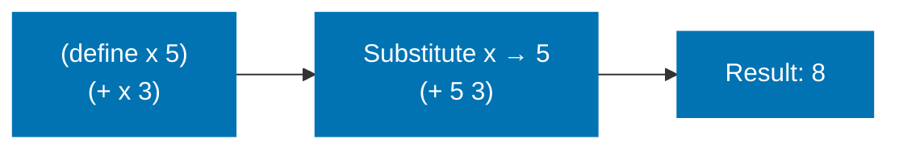
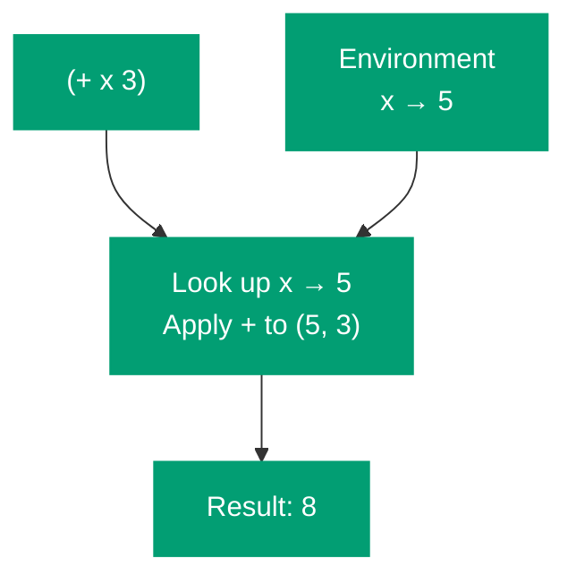
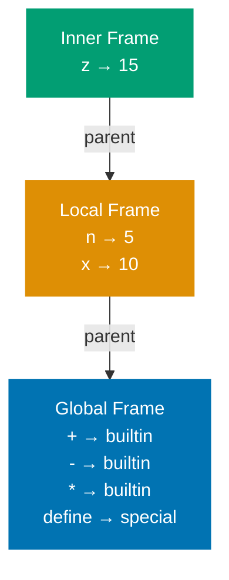
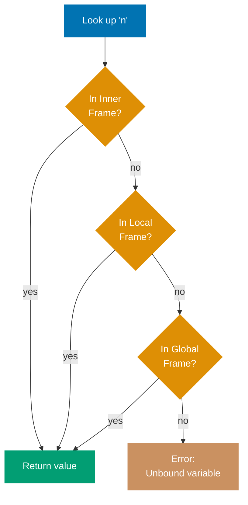
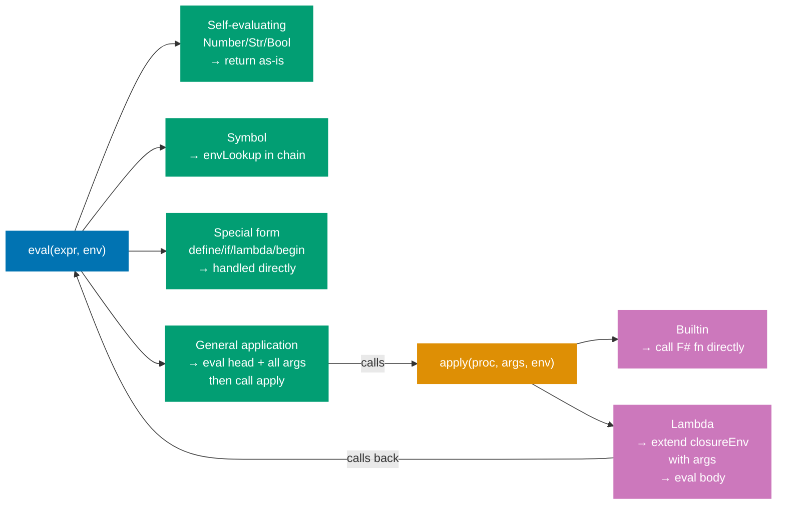
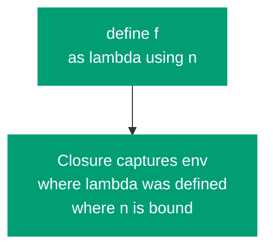
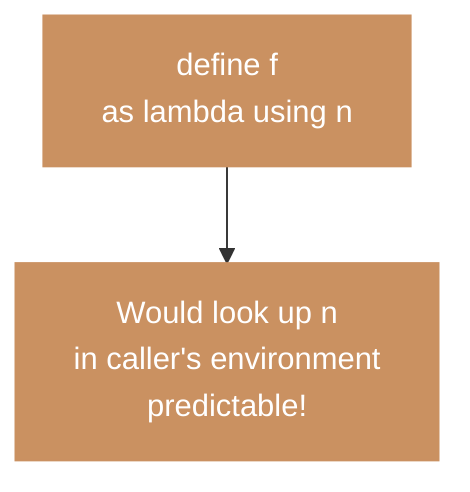
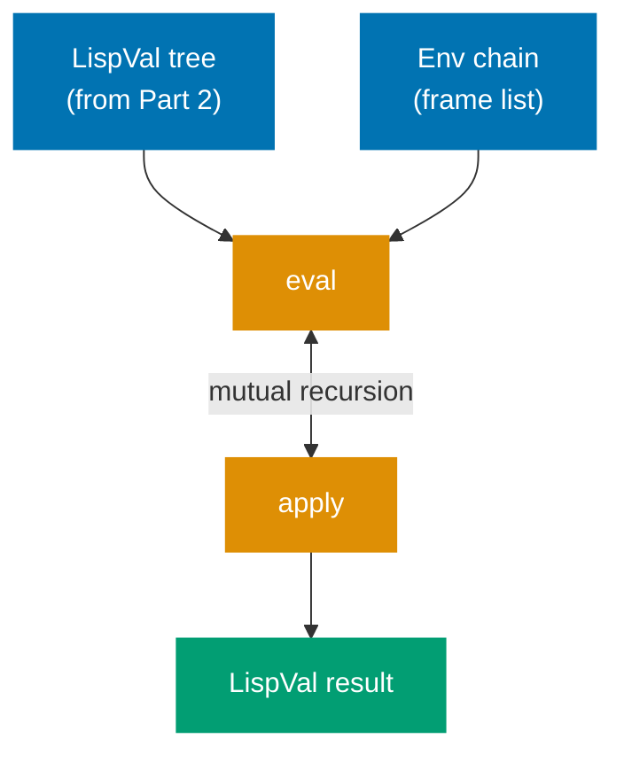

With parsing complete, we now have `LispVal` trees. The evaluator's job is to give them meaning. This part introduces the two foundational concepts that underlie every interpreter: the **environment model** and the **eval/apply** mutual recursion.

## CS Concept: Two Models of Evaluation

There are two mental models for how a programming language evaluates expressions.

**Substitution model** — replace names with values before evaluating:



**Environment model** — look up names in an environment chain at runtime:



**The substitution model** — a name is replaced by its value before evaluation. Intuitive, but breaks down for mutation and closures.

**The environment model** — maintain a data structure (the **environment**) that maps names to their current values. Evaluation looks up names in this structure. This is what real interpreters use.

## CS Concept: The Environment as a Chain of Frames

An environment is not a single flat dictionary. It is a **chain of frames**, where each frame is a dictionary of bindings and each frame has a pointer to its enclosing (parent) frame.



Variable lookup traverses this chain: check the innermost frame first; if not found, check the parent; repeat until the global frame.



This chain structure is what implements **lexical scope**: a function's free variables resolve in the frame where the function was _defined_, not where it is _called_.

## Implementing the Environment

```fsharp
type Env = Map<string, LispVal ref>

let envLookup (name: string) (envChain: Env list) : LispVal =
    let rec search = function
        | [] -> failwith $"Unbound variable: {name}"
        | frame :: rest ->
            match Map.tryFind name frame with
            | Some v -> !v
            | None -> search rest
    search envChain

let envDefine (name: string) (value: LispVal) (frame: Env ref) : unit =
    frame := Map.add name (ref value) !frame

let envExtend (bindings: (string * LispVal) list) (parent: Env list) : Env list =
    let frame = ref Map.empty
    List.iter (fun (k, v) -> envDefine k v frame) bindings
    !frame :: parent
```

The environment is represented as `Env list` — a list of frames, innermost first. `envExtend` creates a new frame and prepends it to the parent chain.

## CS Concept: Eval and Apply

The evaluator is structured as two mutually recursive functions: `eval` and `apply`. This pairing — discovered by John McCarthy in 1960 and formalized in SICP — is the canonical architecture for tree-walking interpreters.



Neither `eval` nor `apply` is simpler than the other. They are symmetric: `eval` produces values from expressions; `apply` produces values from procedures and argument values.

## The Evaluator

```fsharp
let rec eval (expr: LispVal) (env: Env list) : LispVal =
    match expr with
    | Number _ | Str _ | Bool _ -> expr
    | Symbol name -> envLookup name env
    | List [] -> Nil
    | List (head :: args) ->
        match head with
        | Symbol "quote" ->
            match args with
            | [x] -> x
            | _ -> failwith "quote: expects exactly one argument"
        | _ ->
            let proc = eval head env
            let evaluatedArgs = List.map (fun a -> eval a env) args
            apply proc evaluatedArgs env
    | _ -> failwith $"Cannot evaluate: {expr}"

and apply (proc: LispVal) (args: LispVal list) (env: Env list) : LispVal =
    match proc with
    | Builtin f -> f args
    | Lambda (parms, body, closureEnv) ->
        if parms.Length <> args.Length then
            failwith $"Arity mismatch: expected {parms.Length}, got {args.Length}"
        let extendedEnv = envExtend (List.zip parms args) closureEnv
        eval body extendedEnv
    | _ -> failwith $"Not a procedure: {proc}"
```

## Tracing `(* (+ 1 2) 4)`

```mermaid
%% Color palette: Blue #0173B2, Orange #DE8F05, Teal #029E73, Purple #CC78BC, Brown #CA9161, Gray #808080
sequenceDiagram
    participant C as Caller
    participant EV as eval
    participant AP as apply

    C->>EV: List [Symbol "*"; List [Symbol "+"; 1; 2]; Number 4]
    EV->>EV: eval Symbol "*" → Builtin multiply
    EV->>EV: eval List [Symbol "+"; 1; 2]
    note over EV: recursive call for inner expr
    EV->>EV: eval Symbol "+" → Builtin add
    EV->>EV: eval Number 1 → 1
    EV->>EV: eval Number 2 → 2
    EV->>AP: apply Builtin add [1; 2]
    AP-->>EV: Number 3
    EV->>EV: eval Number 4 → 4
    EV->>AP: apply Builtin multiply [3; 4]
    AP-->>EV: Number 12
    EV-->>C: Number 12
```

## The Substitution Model vs Environment Model: Why It Matters

Notice that `apply` for a `Lambda` extends `closureEnv` — the environment captured at the time the lambda was created — not the `env` argument to `apply`. This is **lexical scope**.

**Lexical scope** (Scheme — correct) — closure captures env at definition site:



**Dynamic scope** (wrong for Scheme) — would look up n in caller's environment:



If we extended `env` (the call-site environment) instead of `closureEnv`, we would get **dynamic scope**: a function's free variables resolve in the caller's environment. Scheme mandates lexical scope. The `closureEnv` field in `Lambda` is what enforces it.

## The Global Environment

```fsharp
let numericBinop (op: float -> float -> float) (args: LispVal list) : LispVal =
    match args with
    | [Number a; Number b] -> Number (op a b)
    | _ -> failwith "Expected two numbers"

let makeGlobalEnv () : Env list =
    let frame = ref Map.empty
    let define name value = envDefine name value frame

    define "+" (Builtin (numericBinop (+)))
    define "-" (Builtin (numericBinop (-)))
    define "*" (Builtin (numericBinop (*)))
    define "/" (Builtin (numericBinop (/)))
    define "=" (Builtin (fun args ->
        match args with
        | [Number a; Number b] -> Bool (a = b)
        | _ -> failwith "= expects two numbers"))
    define ">" (Builtin (fun args ->
        match args with
        | [Number a; Number b] -> Bool (a > b)
        | _ -> failwith "> expects two numbers"))
    define "car" (Builtin (fun args ->
        match args with
        | [List (h :: _)] -> h
        | _ -> failwith "car: not a non-empty list"))
    define "cdr" (Builtin (fun args ->
        match args with
        | [List (_ :: t)] -> List t
        | _ -> failwith "cdr: not a non-empty list"))
    define "cons" (Builtin (fun args ->
        match args with
        | [h; List t] -> List (h :: t)
        | _ -> failwith "cons: expects value and list"))
    define "null?" (Builtin (fun args ->
        match args with
        | [List []] | [Nil] -> Bool true
        | [_] -> Bool false
        | _ -> failwith "null?: expects one argument"))

    [!frame]
```

## Testing the Evaluator So Far

```fsharp
let env = makeGlobalEnv ()

eval (read "42") env
// → Number 42.0

eval (read "(+ 1 2)") env
// → Number 3.0

eval (read "(* (+ 1 2) (- 5 3))") env
// → Number 6.0

eval (read "(car (cons 1 (cons 2 (cons 3 ()))))") env
// → Number 1.0
```

We cannot yet evaluate `(define x 10)` or `(lambda (x) x)` — those require special form handling, which is Part 4.

## Summary



The environment model maintains a chain of frames mapping names to values. `eval` and `apply` form a mutually recursive pair. The closure's captured environment (not the call-site environment) is used when applying a lambda — this is what enforces lexical scope.

In [Part 4](/en/learn/software-engineering/compilers-and-interpreters/lisp-interpreter-in-fsharp/part-4-special-forms-and-closures), we add `define`, `if`, `lambda`, and `begin` — the forms that make the evaluator Turing-complete and introduce closures.
