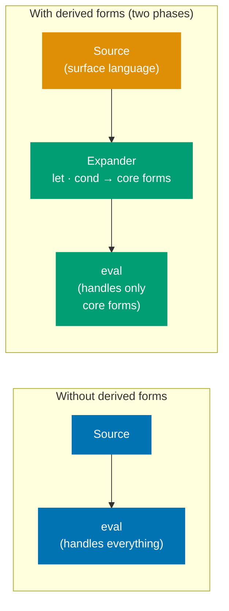
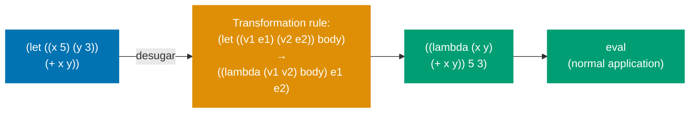
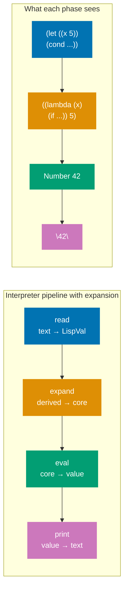
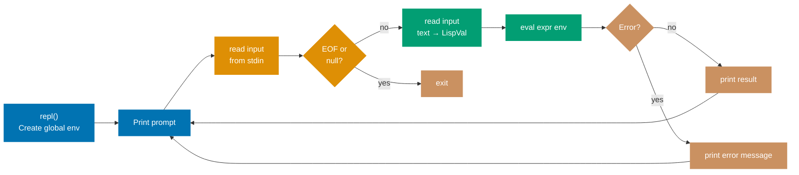
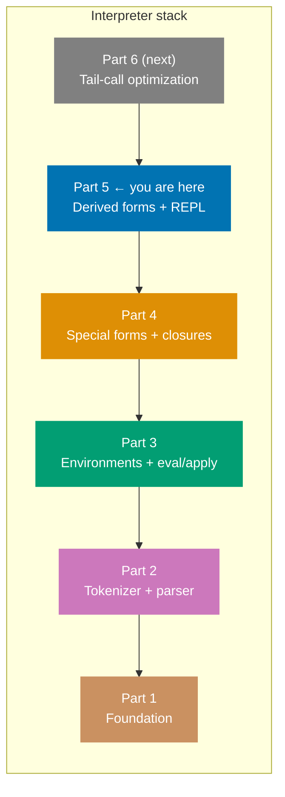

The interpreter from Part 4 is complete — it can express any computable function. But it is inconvenient to use. `let` bindings and `cond` branches are patterns programmers reach for constantly. This part adds them as **derived forms**: transformations that rewrite surface syntax into the core forms the evaluator already handles.

## CS Concept: Syntactic Sugar and Derived Forms

**Syntactic sugar** is syntax that adds no expressive power — anything written with it can be written without it — but makes programs easier to read and write.

**Derived forms** implement syntactic sugar by transforming the sugared form into a desugared equivalent _before_ evaluation. The evaluator never sees the sugared form.



The insight from SICP Chapter 4: you can define an arbitrarily rich surface language on top of a tiny primitive core, as long as every surface form can be mechanically rewritten into primitive forms. This is the foundation of Lisp's macro systems and of how languages like Haskell (`do` notation), Rust (procedural macros), and Kotlin (coroutines) implement syntactic extensions.

## `let` as a Derived Form

`let` introduces local bindings:

```scheme
(let ((x 5) (y 3))
  (+ x y))
```

This is identical in meaning to immediately invoking a lambda:

```scheme
((lambda (x y) (+ x y)) 5 3)
```



In F#:

```fsharp
let desugarLet (args: LispVal list) : LispVal =
    match args with
    | List bindings :: body ->
        let parms, vals =
            bindings
            |> List.map (function
                | List [Symbol name; valueExpr] -> Symbol name, valueExpr
                | _ -> failwith "let: malformed binding")
            |> List.unzip
        List (List (Symbol "lambda" :: List parms :: body) :: vals)
    | _ -> failwith "let: expects (let ((var val) ...) body)"
```

This produces a `LispVal` representing the lambda application, which `eval` then processes normally. The evaluator never learns that `let` existed.

## `cond` as a Derived Form

`cond` is a multi-branch conditional:

```scheme
(cond
  ((= x 0) "zero")
  ((< x 0) "negative")
  (else    "positive"))
```

This desugars to nested `if` expressions:

```mermaid
%% Color palette: Blue #0173B2, Orange #DE8F05, Teal #029E73, Purple #CC78BC, Brown #CA9161, Gray #808080
flowchart LR
    Cond["(cond\n  ((= x 0) \"zero\")\n  ((< x 0) \"negative\")\n  (else \"positive\"))"]

    If1["(if (= x 0) \"zero\"\n  ...)"]
    If2["(if (< x 0) \"negative\"\n  ...)"]
    Else["\"positive\""]

    Cond -->|"desugar"| If1
    If1 -->|"alternate branch"| If2
    If2 -->|"else branch"| Else

    classDef blue fill:#0173B2,color:#fff,stroke:#0173B2
    classDef orange fill:#DE8F05,color:#fff,stroke:#DE8F05
    classDef teal fill:#029E73,color:#fff,stroke:#029E73

    class Cond blue
    class If1,If2 orange
    class Else teal
```

In F#:

```fsharp
let rec desugarCond (clauses: LispVal list) : LispVal =
    match clauses with
    | [] -> Nil
    | List (Symbol "else" :: body) :: _ ->
        List (Symbol "begin" :: body)
    | List (test :: body) :: rest ->
        List [Symbol "if"; test; List (Symbol "begin" :: body); desugarCond rest]
    | _ -> failwith "cond: malformed clause"
```

## Hooking Derived Forms into the Evaluator

Add pattern matches _before_ the general application case in `eval`:

```fsharp
| List (Symbol "let" :: rest) ->
    eval (desugarLet rest) env      // expand then re-enter eval

| List (Symbol "cond" :: clauses) ->
    eval (desugarCond clauses) env  // expand then re-enter eval
```

The desugared form is passed back to `eval` recursively. The evaluator processes only core forms; all surface syntax is rewritten away.

## CS Concept: The Expansion Phase



What we have implemented manually is a rudimentary **expansion phase**. Production Lisp implementations (Racket, Guile, SBCL) have a full macro expander as a separate phase between parsing and evaluation. A macro expander can apply user-defined transformations (`define-syntax`, `syntax-rules`), not just built-in ones.

## Adding More Primitives

Before wiring up the REPL, we add more primitives to `makeGlobalEnv`:

```fsharp
define "list"   (Builtin (fun args -> List args))

define "length" (Builtin (fun args ->
    match args with
    | [List xs] -> Number (float xs.Length)
    | _ -> failwith "length: expects a list"))

define "append" (Builtin (fun args ->
    match args with
    | [List a; List b] -> List (a @ b)
    | _ -> failwith "append: expects two lists"))

define "map" (Builtin (fun args ->
    match args with
    | [proc; List xs] ->
        List (List.map (fun x -> apply proc [x] []) xs)
    | _ -> failwith "map: expects procedure and list"))

define "not" (Builtin (fun args ->
    match args with
    | [Bool false] -> Bool true
    | [_]          -> Bool false
    | _ -> failwith "not: expects one argument"))

define "display"  (Builtin (fun args ->
    match args with
    | [v] -> printf "%s" (printVal v); Nil
    | _ -> failwith "display: expects one argument"))

define "newline" (Builtin (fun _ -> printfn ""; Nil))
```

## The REPL



```fsharp
let printVal (v: LispVal) : string =
    let rec show = function
        | Number n  -> if n = System.Math.Floor n then string (int n) else string n
        | Str s     -> $"\"{s}\""
        | Bool true -> "#t"
        | Bool false -> "#f"
        | Symbol s  -> s
        | List vs   -> $"({String.concat " " (List.map show vs)})"
        | Lambda _  -> "#<procedure>"
        | Builtin _ -> "#<builtin>"
        | Nil       -> "()"
    show v

let repl () =
    let env = makeGlobalEnv ()
    printfn "Scheme interpreter. Ctrl+C to exit."
    let rec loop () =
        printf "> "
        let input = System.Console.ReadLine()
        if input <> null then
            try
                let expr = read input
                let result = eval expr env
                printfn "%s" (printVal result)
            with ex ->
                printfn "Error: %s" ex.Message
            loop ()
    loop ()
```

The REPL maintains a single `env` across iterations — definitions made in one iteration persist to the next.

## Testing a Complete Session

```scheme
> (define fib
    (lambda (n)
      (cond
        ((= n 0) 0)
        ((= n 1) 1)
        (else (+ (fib (- n 1)) (fib (- n 2)))))))
fib

> (fib 10)
55

> (let ((x 3) (y 4))
    (* x y))
12

> (map (lambda (x) (* x x)) (list 1 2 3 4 5))
(1 4 9 16 25)
```

## What We Have Built After Part 5



One correctness property is still missing: **tail-call optimization**. A deeply recursive program using tail calls will overflow the F# call stack. Scheme's R5RS standard mandates that tail calls must not consume stack space.

In [Part 6](/en/learn/software-engineering/compilers-and-interpreters/lisp-interpreter-in-fsharp/part-6-tail-call-optimization), we implement TCO by transforming the evaluator's tail positions into a loop.
