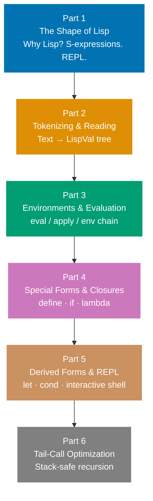
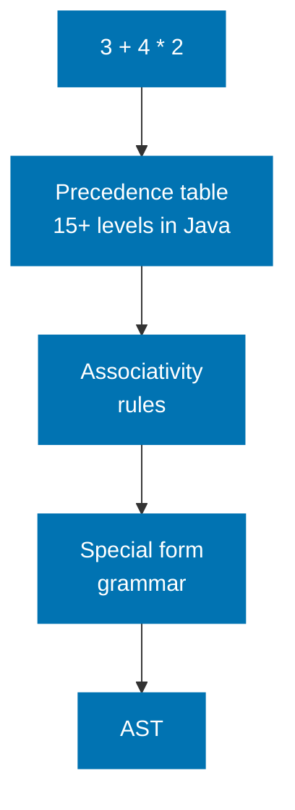
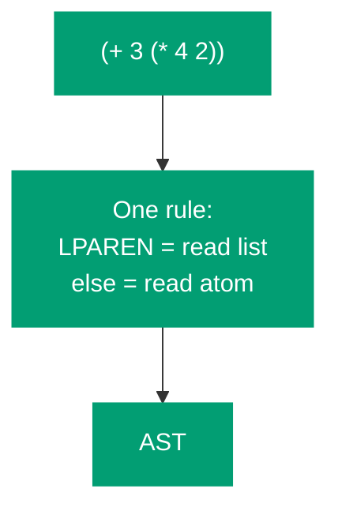
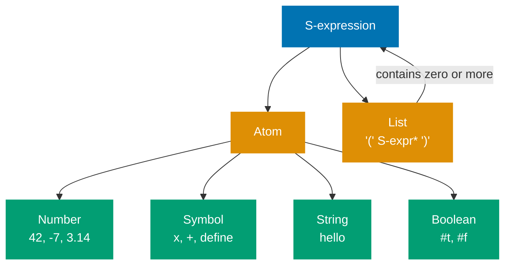
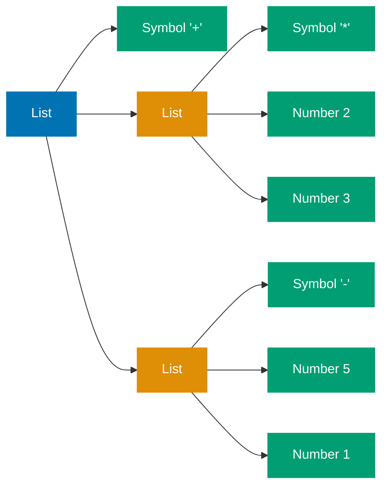
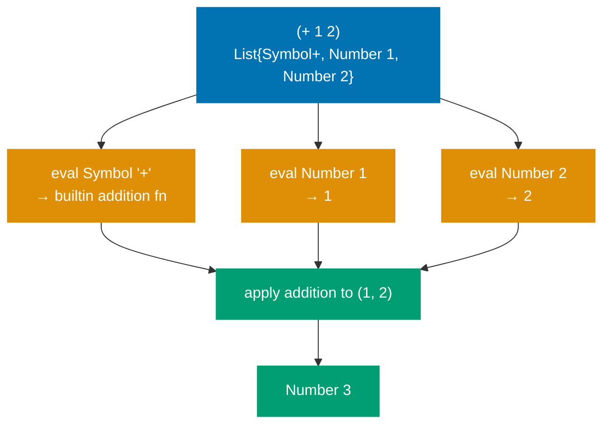
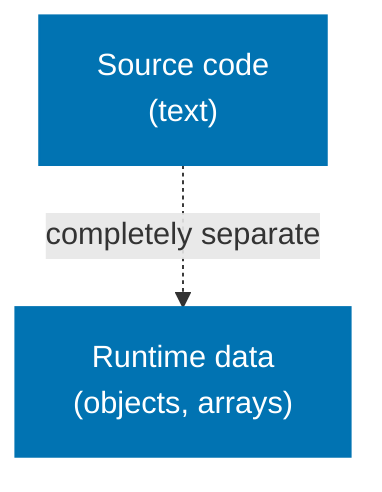
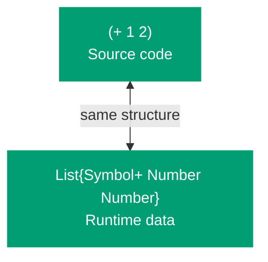
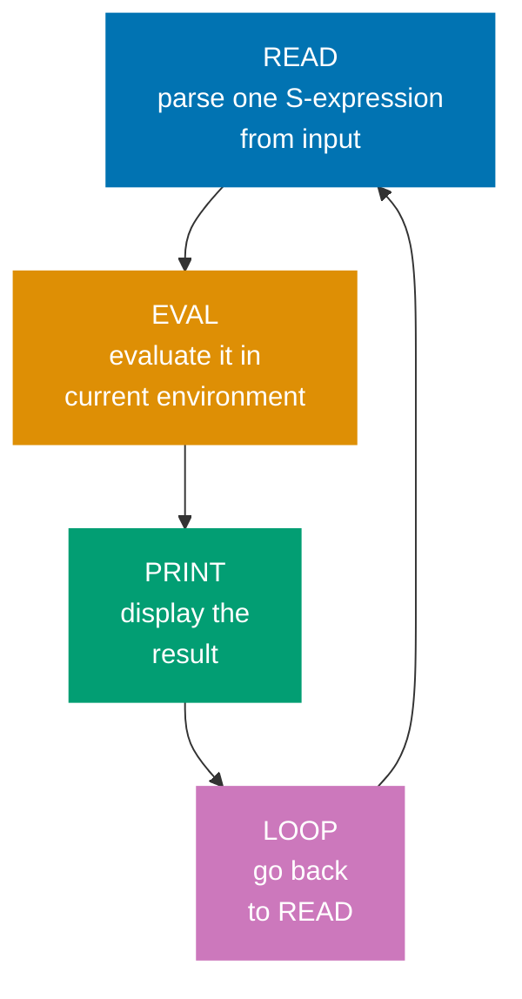
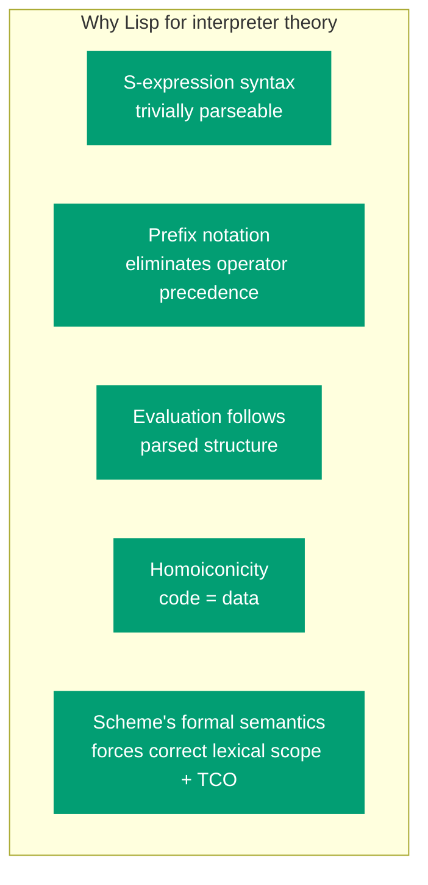

Before writing a single line of Go, we need to understand _why_ Lisp is used to teach interpreter theory and what properties of its design make an interpreter so tractable to implement.

## The Series at a Glance

Each part of this series builds on the previous, adding one layer at a time:



## The Problem with Most Language Syntaxes

Most programming languages are surprisingly hard to parse. Consider a fragment of arithmetic:

```
3 + 4 * 2
```

A naive left-to-right reading gives `(3 + 4) * 2 = 14`. The correct answer is `3 + (4 * 2) = 11`. The parser must know that `*` binds more tightly than `+` — this is **operator precedence**. Real languages have dozens of precedence levels, associativity rules, and special syntactic forms (`if/else`, `for`, `while`, `switch`) that each require dedicated grammar rules and parser branches.

**Infix language parser** — must resolve precedence, associativity, and special forms:



**Lisp parser** — one recursive rule, no precedence table needed:



Lisp removes all of it.

## S-Expressions: One Rule to Parse Them All

Lisp programs are built from **S-expressions** (symbolic expressions). An S-expression is either:

1. An **atom** — a number, a string, a boolean, or a symbol (identifier)
2. A **list** — zero or more S-expressions enclosed in parentheses

That is the complete grammar. There are no statements, no operators with precedence, no special syntactic forms. Everything is a list.

```scheme
42                    ; atom: number
"hello"               ; atom: string
#t                    ; atom: boolean
x                     ; atom: symbol (identifier)
()                    ; empty list
(1 2 3)               ; list of three numbers
(+ 1 2)               ; list: symbol + followed by two numbers
(define x 10)         ; list: symbol define, symbol x, number 10
(if (> x 0) x (- x)) ; nested lists
```

The grammar expressed as a diagram:



Parsing this grammar requires exactly two rules:

1. If you see `(`, read S-expressions until you see `)`, collect them as a list.
2. Otherwise, read characters until whitespace or `)` — that is an atom.

A complete parser is about 30 lines of Go.

## S-Expressions as Trees

Every S-expression is a tree. `(+ (* 2 3) (- 5 1))` parses into:



The tree structure encodes evaluation order: children are evaluated before parents. No precedence rules needed — the nesting _is_ the precedence.

## Prefix Notation Eliminates Ambiguity

Notice that `(+ 1 2)` places the operator _before_ the operands — this is called **prefix notation** (or Polish notation). It completely eliminates operator precedence as a parsing concern.

Infix: `3 + 4 * 2` — ambiguous without precedence rules.
Prefix: `(+ 3 (* 4 2))` — unambiguous. The nesting of parentheses encodes precedence explicitly.

The trade-off is verbose notation. The payoff is a parser that is trivially simple.

## Evaluation Follows Structure

Once parsed into nested lists, evaluation follows the structure directly:

- An atom evaluates to itself (numbers, strings, booleans) or looks up its value in the environment (symbols).
- A list is a **function call** by default: evaluate the first element to get a function, evaluate the remaining elements to get arguments, apply the function to the arguments.



This maps naturally to a Go function `eval` that uses a type switch on the input. No need for an abstract syntax tree separate from the parsed form — the parsed form _is_ the AST.

## Homoiconicity: Code as Data

In most languages, source code and runtime data are completely separate. A Go program cannot easily manipulate Go source code as a value at runtime.

Lisp programs are written in the same structure that Lisp uses for lists at runtime:

**Other languages** — code and data are completely separate:



**Lisp (homoiconic)** — code and data share the same list structure:



This property — code and data sharing the same representation — is called **homoiconicity**. For our interpreter, it means the data structure we produce during parsing and the data structure we manipulate during evaluation are identical. There is no "compile to AST" step distinct from "parse".

## What We Build: A Scheme Dialect

We implement a subset of **Scheme**, one of the two main Lisp dialects (alongside Common Lisp). Scheme is preferred for interpreter pedagogy because it is minimal and formally specified.

The Scheme standard (R5RS) mandates two properties that will shape our implementation:

1. **Lexical scope** — a function closes over the environment where it was _defined_, not where it is _called_.
2. **Tail-call optimization** — a function call in tail position must not consume additional stack space.

Both are correctness requirements, not optional features.

## The Read-Eval-Print Loop

Every Lisp system is traditionally structured as a REPL:



This structure is pedagogically valuable because it exposes each phase as a distinct, composable step. We will implement each phase separately before wiring them into the loop in Part 5.

## What We Will and Will Not Build

**In scope (Parts 1–6):**

- Tokenizer and recursive descent parser
- `LispVal` interface type (the AST/value type)
- Environment model with lexical scope
- `eval` / `apply` mutual recursion
- Special forms: `define`, `if`, `lambda`, `begin`, `quote`
- Derived forms: `let`, `cond`
- Numeric and list primitives
- Interactive REPL
- Tail-call optimization via loop transform

**Out of scope (explicitly excluded):**

- `call/cc` — continuations require a complete interpreter rewrite
- Hygienic macros — `define-syntax` / `syntax-rules` are the advanced follow-up
- Garbage collection — delegated to the Go runtime
- The full R5RS standard library

## Summary



In [Part 2](/en/learn/software-engineering/compilers-and-interpreters/lisp-interpreter-in-golang/part-2-tokenizing-and-reading), we implement the tokenizer and recursive descent parser, producing the `LispVal` interface type that will carry values through all subsequent parts.
