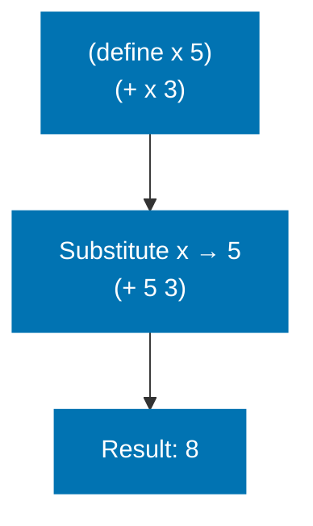
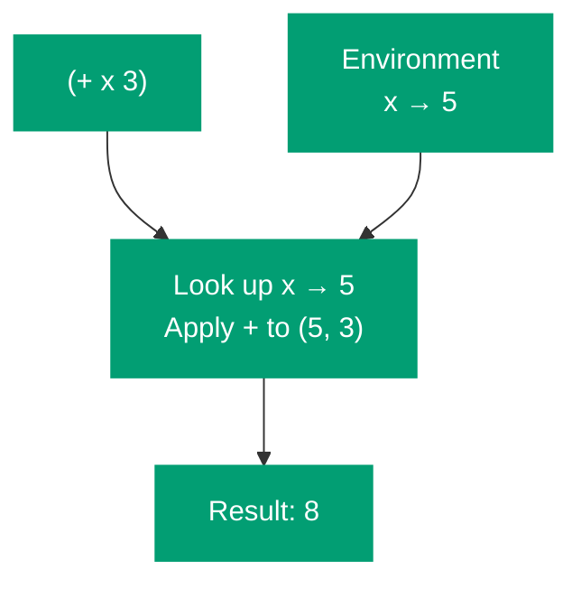
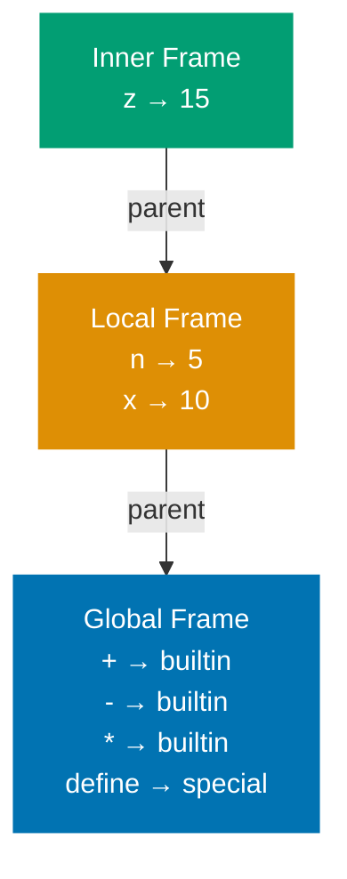
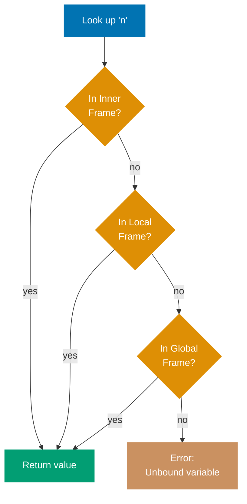
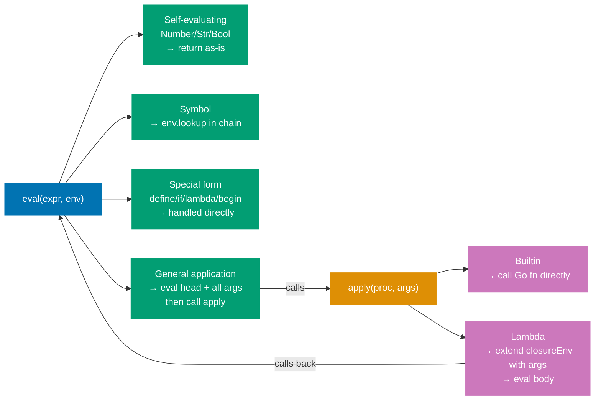
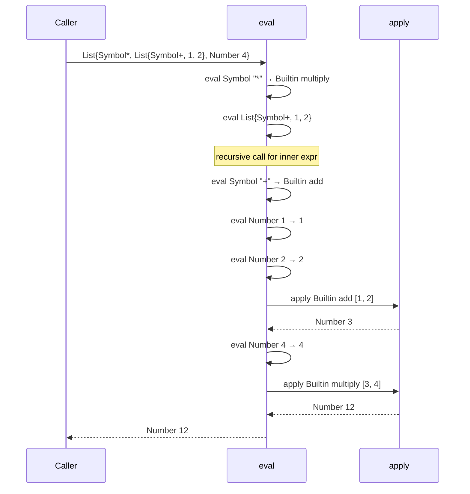
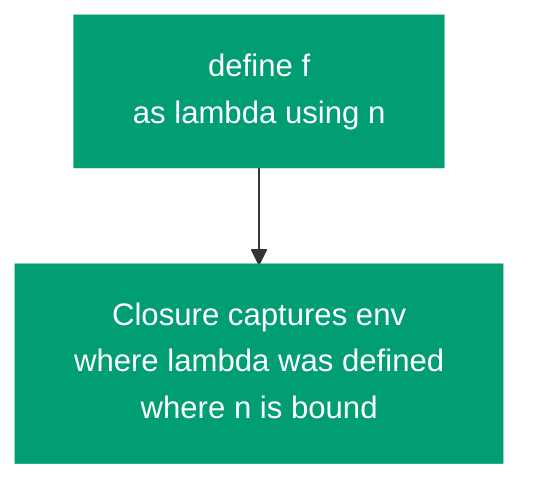
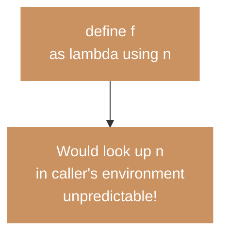
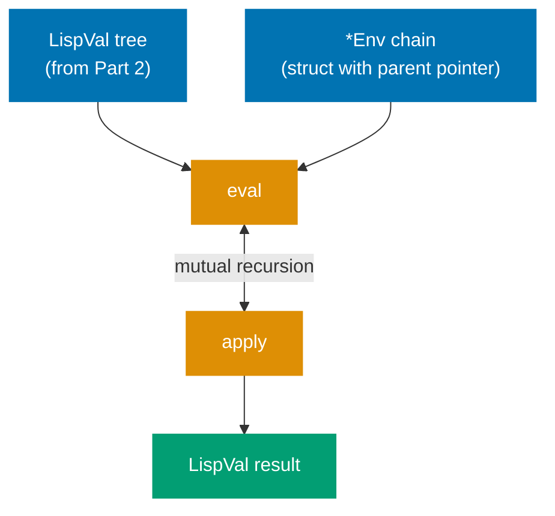

With parsing complete, we now have `LispVal` trees. The evaluator's job is to give them meaning. This part introduces the two foundational concepts that underlie every interpreter: the **environment model** and the **eval/apply** mutual recursion.

## CS Concept: Two Models of Evaluation

There are two mental models for how a programming language evaluates expressions.

**Substitution model** — replace names with values before evaluating:



**Environment model** — look up names in an environment chain at runtime:



**The substitution model** — a name is replaced by its value before evaluation. Intuitive, but breaks down for mutation and closures.

**The environment model** — maintain a data structure (the **environment**) that maps names to their current values. Evaluation looks up names in this structure. This is what real interpreters use.

## CS Concept: The Environment as a Chain of Frames

An environment is not a single flat dictionary. It is a **chain of frames**, where each frame is a dictionary of bindings and each frame has a pointer to its enclosing (parent) frame.



Variable lookup traverses this chain: check the innermost frame first; if not found, check the parent; repeat until the global frame.



This chain structure is what implements **lexical scope**: a function's free variables resolve in the frame where the function was _defined_, not where it is _called_.

## Implementing the Environment

In Go, the environment is a struct with a `map` of bindings and a pointer to the parent frame. The chain is formed by following `parent` pointers — no need for a list of maps as in the F# version.

```go
type Env struct {
    bindings map[string]LispVal
    parent   *Env
}

func newEnv(parent *Env) *Env {
    return &Env{bindings: make(map[string]LispVal), parent: parent}
}

func (e *Env) lookup(name string) (LispVal, error) {
    if v, ok := e.bindings[name]; ok {
        return v, nil
    }
    if e.parent != nil {
        return e.parent.lookup(name)
    }
    return nil, fmt.Errorf("unbound variable: %s", name)
}

func (e *Env) define(name string, val LispVal) {
    e.bindings[name] = val
}

func extendEnv(params []string, args []LispVal, parent *Env) *Env {
    env := newEnv(parent)
    for i, param := range params {
        env.define(param, args[i])
    }
    return env
}
```

The `*Env` pointer in `Lambda` (Part 4) is what makes closures work: a lambda captures the `*Env` at definition time, and `extendEnv` extends that captured env — not the call-site env — when the lambda is applied.

## CS Concept: Eval and Apply

The evaluator is structured as two mutually recursive functions: `eval` and `apply`. This pairing — discovered by John McCarthy in 1960 and formalized in SICP — is the canonical architecture for tree-walking interpreters.



Neither `eval` nor `apply` is simpler than the other. They are symmetric: `eval` produces values from expressions; `apply` produces values from procedures and argument values.

## The Evaluator

In Go, pattern matching on the `LispVal` interface is done with a **type switch**:

```go
func eval(expr LispVal, env *Env) (LispVal, error) {
    switch e := expr.(type) {
    case Number, Str, Bool:
        return expr, nil

    case Symbol:
        return env.lookup(e.Value)

    case List:
        if len(e.Values) == 0 {
            return Nil{}, nil
        }
        head := e.Values[0]
        args := e.Values[1:]

        // Check for special forms
        if sym, ok := head.(Symbol); ok {
            switch sym.Value {
            case "quote":
                if len(args) != 1 {
                    return nil, fmt.Errorf("quote: expects 1 argument")
                }
                return args[0], nil
            }
        }

        // General application
        proc, err := eval(head, env)
        if err != nil {
            return nil, err
        }
        evaluatedArgs := make([]LispVal, len(args))
        for i, arg := range args {
            v, err := eval(arg, env)
            if err != nil {
                return nil, err
            }
            evaluatedArgs[i] = v
        }
        return apply(proc, evaluatedArgs)

    default:
        return nil, fmt.Errorf("cannot evaluate: %T", expr)
    }
}

func apply(proc LispVal, args []LispVal) (LispVal, error) {
    switch p := proc.(type) {
    case Builtin:
        return p.Fn(args)
    case Lambda:
        if len(p.Params) != len(args) {
            return nil, fmt.Errorf("arity mismatch: expected %d, got %d",
                len(p.Params), len(args))
        }
        extended := extendEnv(p.Params, args, p.Env)
        return eval(p.Body, extended)
    default:
        return nil, fmt.Errorf("not a procedure: %T", proc)
    }
}
```

## Tracing `(* (+ 1 2) 4)`



## The Substitution Model vs Environment Model: Why It Matters

Notice that `apply` for a `Lambda` extends `p.Env` — the environment captured at the time the lambda was created — not the `env` argument at the call site. This is **lexical scope**.

**Lexical scope** (Scheme — correct) — closure captures env at definition site:



**Dynamic scope** (wrong for Scheme) — would look up n in caller's environment:



If we extended `env` (the call-site environment) instead of `p.Env`, we would get **dynamic scope**: a function's free variables resolve in the caller's environment. Scheme mandates lexical scope. The `Env *Env` field in `Lambda` is what enforces it.

## The Global Environment

```go
func makeGlobalEnv() *Env {
    env := newEnv(nil)

    numericBinop := func(op func(float64, float64) float64) LispVal {
        return Builtin{Fn: func(args []LispVal) (LispVal, error) {
            if len(args) != 2 {
                return nil, fmt.Errorf("expected 2 arguments, got %d", len(args))
            }
            a, ok1 := args[0].(Number)
            b, ok2 := args[1].(Number)
            if !ok1 || !ok2 {
                return nil, fmt.Errorf("expected two numbers")
            }
            return Number{Value: op(a.Value, b.Value)}, nil
        }}
    }

    env.define("+", numericBinop(func(a, b float64) float64 { return a + b }))
    env.define("-", numericBinop(func(a, b float64) float64 { return a - b }))
    env.define("*", numericBinop(func(a, b float64) float64 { return a * b }))
    env.define("/", numericBinop(func(a, b float64) float64 { return a / b }))

    env.define("=", Builtin{Fn: func(args []LispVal) (LispVal, error) {
        a, ok1 := args[0].(Number)
        b, ok2 := args[1].(Number)
        if !ok1 || !ok2 {
            return nil, fmt.Errorf("=: expects two numbers")
        }
        return Bool{Value: a.Value == b.Value}, nil
    }})

    env.define(">", Builtin{Fn: func(args []LispVal) (LispVal, error) {
        a, ok1 := args[0].(Number)
        b, ok2 := args[1].(Number)
        if !ok1 || !ok2 {
            return nil, fmt.Errorf(">: expects two numbers")
        }
        return Bool{Value: a.Value > b.Value}, nil
    }})

    env.define("car", Builtin{Fn: func(args []LispVal) (LispVal, error) {
        lst, ok := args[0].(List)
        if !ok || len(lst.Values) == 0 {
            return nil, fmt.Errorf("car: not a non-empty list")
        }
        return lst.Values[0], nil
    }})

    env.define("cdr", Builtin{Fn: func(args []LispVal) (LispVal, error) {
        lst, ok := args[0].(List)
        if !ok || len(lst.Values) == 0 {
            return nil, fmt.Errorf("cdr: not a non-empty list")
        }
        return List{Values: lst.Values[1:]}, nil
    }})

    env.define("cons", Builtin{Fn: func(args []LispVal) (LispVal, error) {
        lst, ok := args[1].(List)
        if !ok {
            return nil, fmt.Errorf("cons: second argument must be a list")
        }
        return List{Values: append([]LispVal{args[0]}, lst.Values...)}, nil
    }})

    env.define("null?", Builtin{Fn: func(args []LispVal) (LispVal, error) {
        switch v := args[0].(type) {
        case List:
            return Bool{Value: len(v.Values) == 0}, nil
        case Nil:
            return Bool{Value: true}, nil
        default:
            return Bool{Value: false}, nil
        }
    }})

    return env
}
```

## Testing the Evaluator So Far

The examples below use a small `mustRead` helper that panics on parse errors — convenient for inline test expressions:

```go
func mustRead(s string) LispVal {
    v, err := read(s)
    if err != nil { panic(err) }
    return v
}
```

```go
env := makeGlobalEnv()

v, _ := eval(mustRead("42"), env)
// → Number{Value: 42}

v, _ = eval(mustRead("(+ 1 2)"), env)
// → Number{Value: 3}

v, _ = eval(mustRead("(* (+ 1 2) (- 5 3))"), env)
// → Number{Value: 6}

v, _ = eval(mustRead("(car (cons 1 (cons 2 (cons 3 ()))))"), env)
// → Number{Value: 1}
```

We cannot yet evaluate `(define x 10)` or `(lambda (x) x)` — those require special form handling, which is Part 4.

## Summary



The environment model maintains a chain of `*Env` frames mapping names to values. `eval` and `apply` form a mutually recursive pair. The closure's captured `*Env` (not the call-site env) is used when applying a lambda — this is what enforces lexical scope.

In [Part 4](/en/learn/software-engineering/compilers-and-interpreters/lisp-interpreter-in-golang/part-4-special-forms-and-closures), we add `define`, `if`, `lambda`, and `begin` — the forms that make the evaluator Turing-complete and introduce closures.
