This glossary defines the terms used throughout the [Building a Lisp Interpreter in F#](/en/learn/software-engineering/compilers-and-interpreters/lisp-interpreter-in-fsharp) series. Terms appear in the order they are encountered when building an interpreter — from raw source text through to execution semantics.

## How the Pieces Fit Together

Before diving into individual definitions, here is how all the terms relate to each other in the overall pipeline of taking source text to a running program:

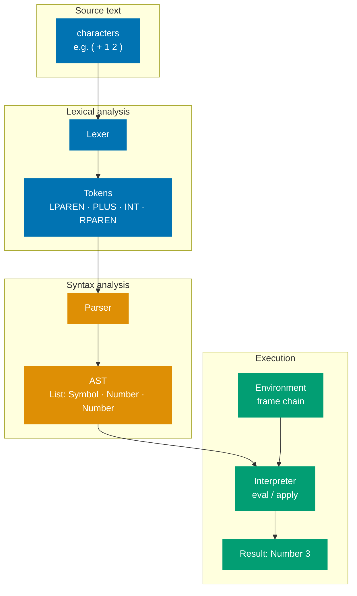

---

## The Compilation Pipeline

### Character

The smallest input unit — a single Unicode code point. Characters are what the lexer reads one at a time. A character is not yet meaningful on its own.

### Lexeme

The actual substring of source text matched by the lexer — the raw string `"if"`, `"velocityX"`, or `"42"`. The lexer identifies a lexeme and emits a corresponding token.

**Lexeme vs token**: the lexeme is _what was matched_ (the raw text); the token is _the classification of what was matched_ (the abstract category plus any needed value). The string `"42"` is a lexeme; the pair `(INTEGER_LITERAL, 42)` is the token.

### Token

A pair `(token-name, attribute-value)` produced by the lexer. The token-name is an abstract symbol representing a class of lexical unit (`IDENTIFIER`, `INTEGER_LITERAL`, `LPAREN`). The attribute-value carries any instance-specific information needed later (`42`, a symbol-table pointer).

_Source: Aho, Lam, Sethi, Ullman — "Compilers: Principles, Techniques, and Tools" (Dragon Book), §3.1_

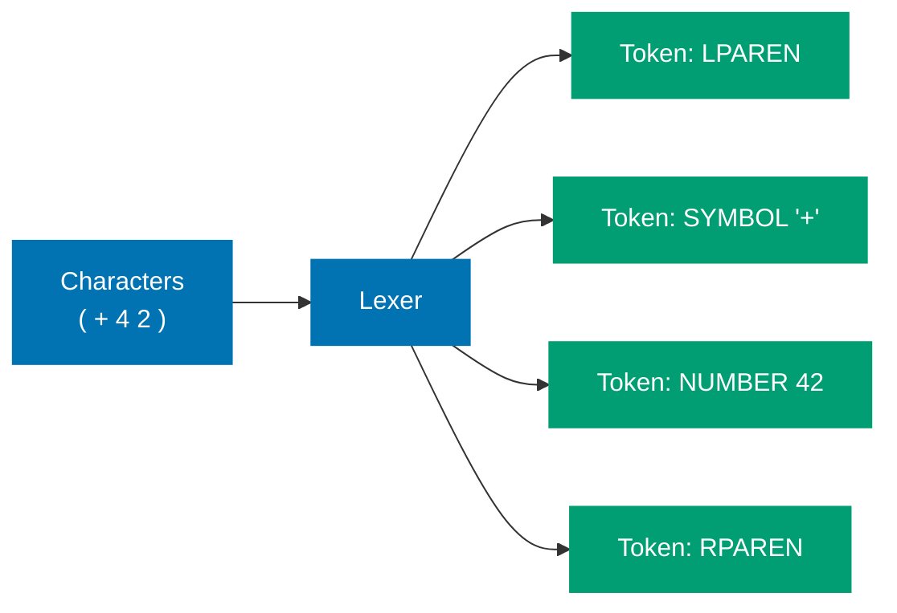

### Lexer / Tokenizer / Scanner

All three names refer to the same phase — the component that reads raw characters, groups them into lexemes, and emits tokens.

- **Scanner** emphasises the left-to-right character-by-character reading
- **Tokenizer** emphasises the output (tokens)
- **Lexer** / **Lexical analyser** is the formal term used in compiler literature

These are synonyms in standard usage. The Dragon Book uses "lexical analyser" as the canonical term.

### Parser

The component that takes a flat stream of tokens as input and produces a hierarchical syntactic structure (AST or parse tree) as output, verifying the token sequence conforms to the language's grammar.

**What the parser does not do**: it does not read characters (that is the lexer); it does not determine meaning (that is semantic analysis or the evaluator).

_Common parser algorithms: LL(k), LR(k), LALR, Earley, Pratt (operator-precedence), recursive descent._

### Parse Tree / Concrete Syntax Tree (CST)

A tree that directly reflects the grammar derivation — every grammar rule application produces a node, including intermediate nonterminals and all tokens including punctuation. Faithful but verbose.

### Abstract Syntax Tree (AST)

A tree representing the _meaningful_ syntactic structure of source code, where concrete syntactic details (parentheses, commas, semicolons, grammar helper nonterminals) are omitted because they are implicit in the tree's shape.

The word "abstract" means the tree omits nodes present in the CST that are syntactically necessary but semantically redundant.

For the expression `(+ 1 2)`:

**CST** — every syntax token preserved, including punctuation:

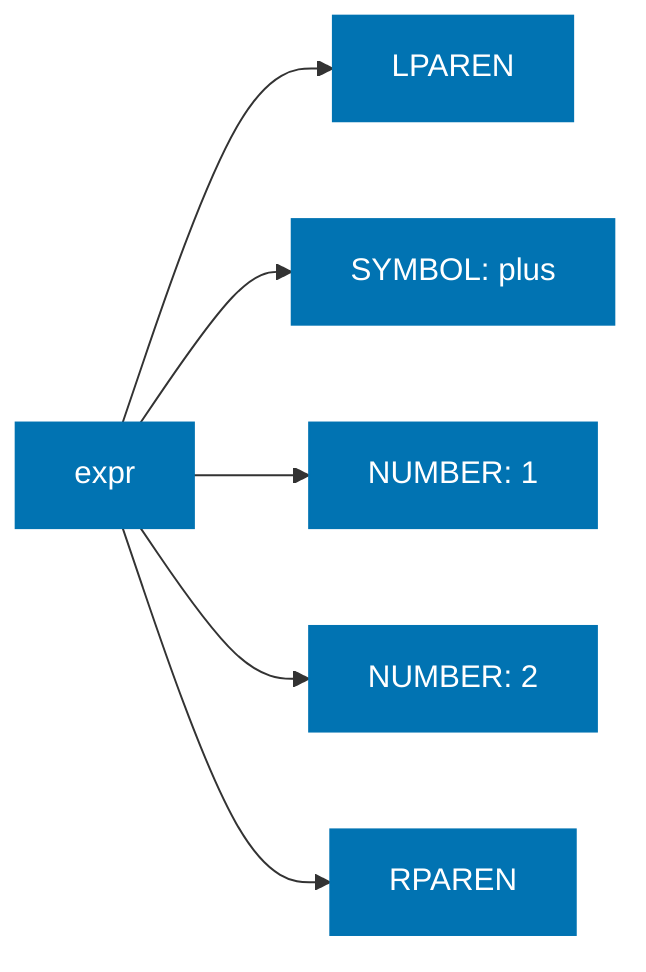

**AST** — only meaningful structure, punctuation dropped:

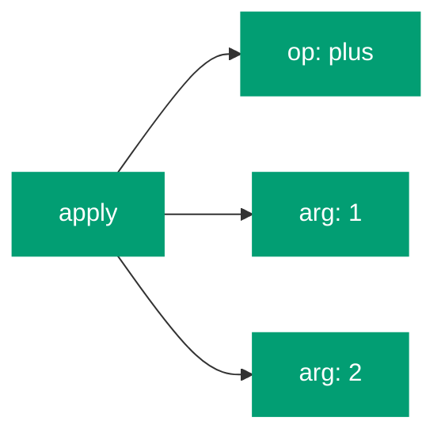

_Source: Dragon Book, §5; Wikipedia: Abstract syntax tree_

### Context-Free Grammar (CFG)

A formal grammar G = (V, Σ, R, S) where every production rule has exactly one nonterminal on the left-hand side: `A → α`. **Context-free** means a nonterminal can be replaced by its right-hand side regardless of what surrounds it — no context conditions.

Programming languages use CFGs because they are expressive enough to describe block structure and recursion, yet simple enough to allow efficient O(n) parsing (for deterministic subclasses). Context-sensitive features like "a variable must be declared before use" are handled separately in semantic analysis.

_BNF notation was invented for Algol 60 (1960) by Backus and Naur — the first formal CFG-described programming language._

---

## Programs That Process Programs

### Compiler

A program that translates source code in one language into an equivalent program in another language (typically lower-level machine or assembly code) as a **complete, standalone, offline transformation** — the output program runs independently of the compiler.

The key property: translation happens _before_ execution, and the resulting artifact runs without the compiler being present.

### Interpreter

A program that directly executes source code or an intermediate representation, interleaving translation and execution at runtime.

**Compiler** — translates offline, output runs independently:

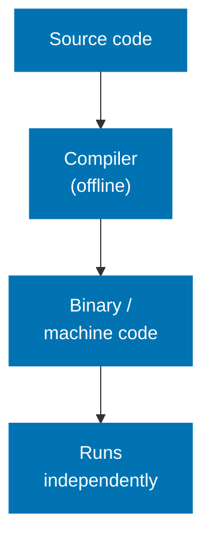

**Interpreter** — translates and executes together at runtime:

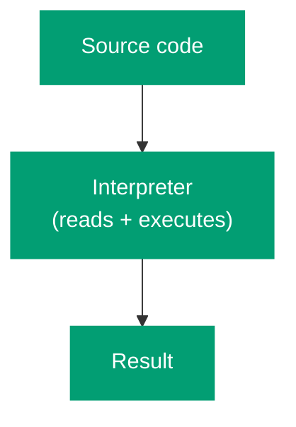

**Spectrum of interpretation** — interpreters exist on a spectrum:

| Style        | How it works                                         | Examples                           |
| ------------ | ---------------------------------------------------- | ---------------------------------- |
| Tree-walking | Parse to AST; walk and execute nodes                 | Early Ruby, our Scheme interpreter |
| Bytecode VM  | Compile to compact bytecode; VM executes             | CPython, Lua, JVM before JIT       |
| JIT          | Compile hot bytecode paths to native code at runtime | V8, JVM HotSpot, PyPy              |

JIT compilation blurs the compiler/interpreter boundary — translation still happens at runtime, so the user ships bytecode, not machine code.

### Transpiler / Source-to-Source Compiler

A compiler whose output is source code in the same or a different high-level language, rather than machine code or bytecode.

Examples: TypeScript → JavaScript (`tsc`), CoffeeScript → JavaScript, C++ → C (Cfront, 1983), modern JS → ES5 (Babel).

**Is "transpiler" a real CS term?** Yes — coined by Dick Pountain in 1989, documented in technical literature. It is more common in developer culture than in academic compiler textbooks, which prefer "source-to-source compiler." Both terms are correct.

---

## Lisp-Specific Concepts

### S-expression

A **symbolic expression** (sexp) — Lisp's recursive data notation, defined by John McCarthy in 1960:

> An S-expression is either an atom (a symbol or number) or a dotted pair `(x . y)` where x and y are S-expressions.

In practice, Lisp uses a shorthand: `(a b c)` for the chain `(a . (b . (c . nil)))`. S-expressions were originally the _data_ format; programmers never adopted a separate code format, yielding homoiconicity.

_Primary source: McCarthy (1960), "Recursive Functions of Symbolic Expressions and Their Computation by Machine, Part I." CACM 3(4)._

### Homoiconicity

The property of a language in which programs are represented in the **primary data structure of the language itself**, allowing programs to be inspected and transformed as data using the same language.

In Lisp: both code and data are S-expressions (lists). A macro receives its arguments as unevaluated lists and can transform them using the same list operations used on any data.

**Most languages** — code and data are separate representations:

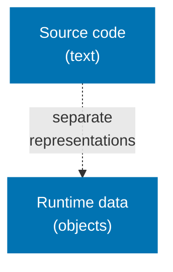

**Lisp** — code and data share the same S-expression structure:

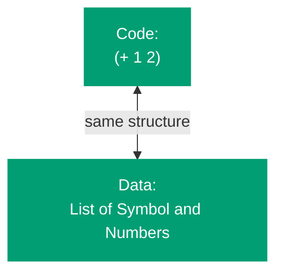

**Caveat**: no single consensus definition exists. The strongest claim applies to Lisp dialects where the parser's native output _is_ the primary data type. Julia (`Expr`), Prolog (terms), and Elixir (`quote`) have weaker forms of the same property.

### Special Form

A syntactic construct evaluated **differently from standard function application** — its arguments are not all evaluated in the normal way before the construct executes.

Standard function calls evaluate all arguments first, then pass the values. Special forms need control over _which_ arguments are evaluated and _when_:

- `if` must evaluate the condition first, then exactly one branch
- `quote` must not evaluate its argument at all
- `define` must create a binding rather than look up the name

Special forms are implemented as primitives in the evaluator. Users cannot add new special forms — that requires extending the interpreter itself (unlike macros).

_Source: Kent Pitman (1980), "Special Forms in Lisp"; Common Lisp HyperSpec §3.1.2.1.2.1_

### Syntactic Sugar / Derived Form

**Syntactic sugar** is syntax that adds no expressive power — anything written with it can be written without it — but makes programs more readable or convenient.

A **derived form** (Scheme terminology, R5RS §7.3) is a form whose semantics are defined by a source-to-source transformation to core forms:

```
(let ((x 5)) body)  →  ((lambda (x) body) 5)
(cond (t1 e1) ...)  →  (if t1 e1 (cond ...))
```

The evaluator never sees the derived form — it only processes the expanded core form. In Scheme, `let`, `cond`, `case`, `and`, `or`, `when`, `unless`, and `do` are all derived expressions.

_Source: R5RS §7.3; Wikipedia: Syntactic sugar_

### REPL

**Read–Eval–Print Loop** — an interactive programming environment that cyclically:

1. **Reads** a user expression (parses one S-expression from stdin)
2. **Evaluates** it in the current environment
3. **Prints** the result to stdout
4. **Loops** back to step 1

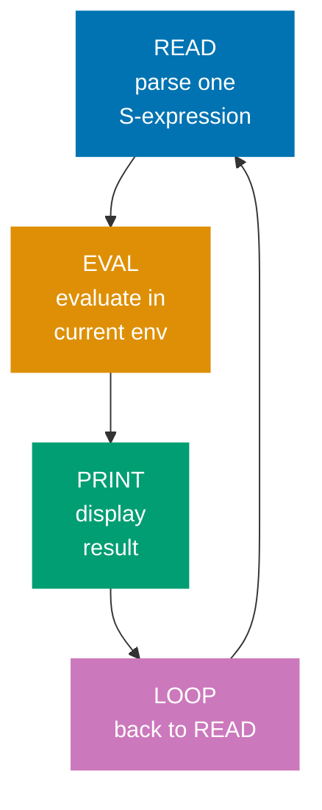

Each letter names a Lisp primitive function. The REPL does not terminate between inputs — it returns to `read` after each `print`.

_First documented usage: Deutsch & Berkeley (1964), Lisp on PDP-1. Acronym standardised in Scheme communities by the early 1980s._

---

## The Runtime Model

### Environment

In PL theory: a **mapping from variable names to their values** (or to storage locations). In SICP's environment model: an environment is a _sequence of frames_, where each frame is a table of name→value bindings, and variable lookup proceeds from the current frame outward.

### Frame

A single table of bindings for one scope — the local variables of one function call. A frame always has a pointer to its enclosing (parent) frame, forming the environment chain.

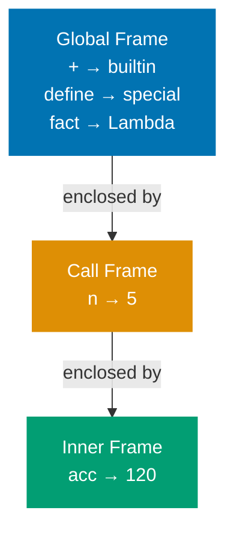

_Source: SICP §3.2_

### Closure

A runtime value pairing a function's code (parameter list + body) with the **lexical environment in which it was defined** — capturing all free variable bindings so the function can access those variables even when called from outside their original scope.

Peter Landin coined the term in 1964: a closure has "an environment part and a control part." Sussman and Steele popularised it in their 1975 Scheme paper.

**Precise answer to "function + env, or just captured variables?"**: A closure is the function paired with the _entire captured environment chain_ — not just the individual variable values. Because the environment is captured by reference (not by copy), mutations to captured variables via `set!` are visible through the closure.

**Anonymous function vs closure**: an anonymous function is a function literal without a name. A closure is the _runtime instance_ of a function that has captured an environment. All closures are functions; not all anonymous functions are closures (only those that reference free variables from an enclosing scope).

_Source: Landin (1964); Sussman & Steele (1975) "SCHEME: An interpreter for extended lambda calculus"_

### Lexical Scope

A scoping rule where a variable's binding is determined by the **textual structure of the source code** — a name always refers to the definition that lexically encloses it, determined at parse time, independent of the runtime call stack.

Synonym: **static scope** (emphasises compile-time determination).

Scheme, Python, JavaScript, Go, Rust, C, Java, and most modern languages use lexical scope.

### Dynamic Scope

A scoping rule where a variable's binding is determined by the **runtime call stack** — a name resolves to the most recent binding active at the time of the call, regardless of where the calling or called function was defined in source code.

**Lexical scope** — name resolves at definition site:

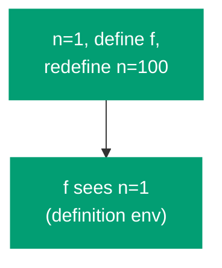

**Dynamic scope** — name resolves at call site:

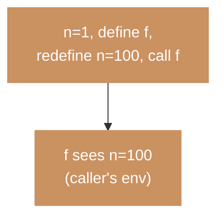

**Where dynamic scope appears today**: Emacs Lisp (default, opt-in lexical since 2012), Bash/POSIX shell variables, Perl's `local`, Common Lisp's `special` declarations.

---

## Evaluation

### Evaluation Strategy

A rule determining _when_ function arguments are evaluated and _how_ they are passed.

| Strategy              | When evaluated              | Re-evaluated?  | Languages                         |
| --------------------- | --------------------------- | -------------- | --------------------------------- |
| Call-by-value (eager) | Before the call             | No             | C, Java, Python, Go, Rust, Scheme |
| Call-by-name          | On each use                 | Yes, each time | ALGOL 60, Scala `=>` params       |
| Call-by-need (lazy)   | On first use, then cached   | No (memoised)  | Haskell, Miranda                  |
| Call-by-sharing       | By-value but objects shared | No             | Python, Java, Ruby (for objects)  |

**Common misconception**: "lazy evaluation" ≠ "call-by-name." Call-by-name re-evaluates arguments on every use; call-by-need (true laziness) evaluates at most once. Haskell uses call-by-need.

_Scheme uses call-by-value: all arguments are fully evaluated before the function is called._

### Tail Call

A function call in **tail position** — the final operation performed before a function returns, such that the caller contributes no further computation to the result after the call completes.

**NOT a tail call** — result is used further after the call returns:

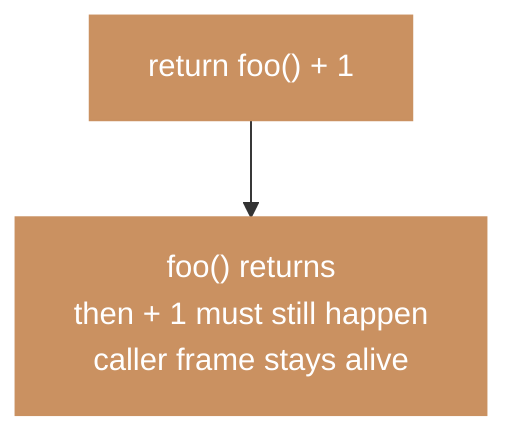

**IS a tail call** — result is returned directly, caller frame is immediately useless:

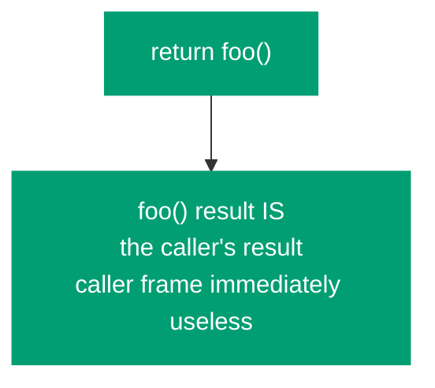

**Tail position is a syntactic property**, not a property of what function is called. A recursive call, a call to a different function, and a builtin call can all be in tail position.

### Tail-Call Optimization (TCO) vs Proper Tail Calls (PTC)

- **TCO**: A compiler or runtime _optimisation_ that replaces a tail call with a jump, reusing the current stack frame rather than allocating a new one. An optional quality-of-implementation feature.

- **Proper tail calls (PTC)**: A _language specification requirement_ that all tail calls execute in constant stack space. R5RS mandates PTC for all Scheme implementations.

**Without TCO** — each tail call pushes a new frame, stack grows O(n):

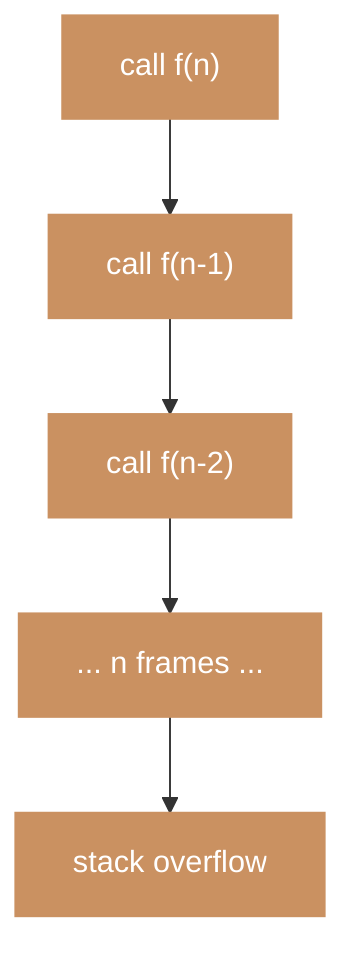

**With TCO** — tail call reuses the same frame, stack stays O(1):

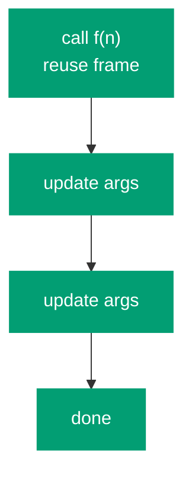

**Key distinction**: TCO is something a compiler _may_ do. PTC is something a language _requires_ — making unbounded tail recursion semantically equivalent to iteration. R5RS §3.5 states: "Implementations of Scheme are required to be properly tail-recursive."

_Languages with PTC: Scheme (R5RS/R6RS/R7RS), Lua 5.x, ECMAScript 2015 (specified but not universally implemented). Languages with TCO as optimisation: F#, Kotlin (`tailrec`), GHC Haskell (via lazy evaluation, different mechanism)._
