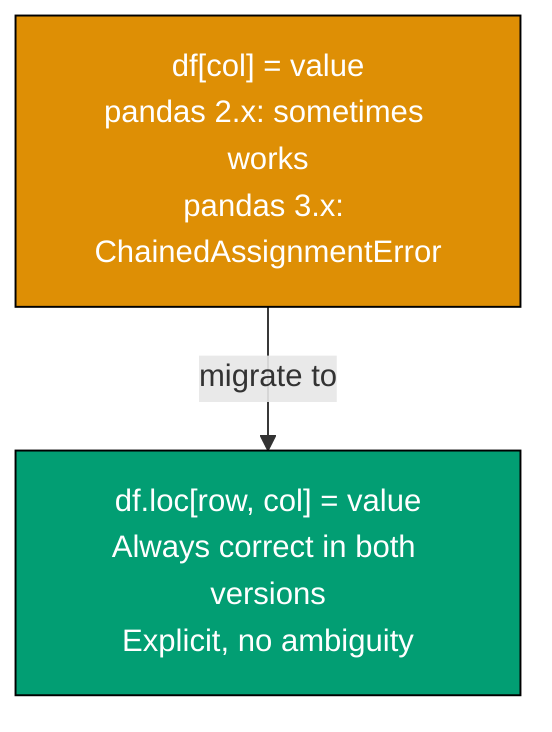
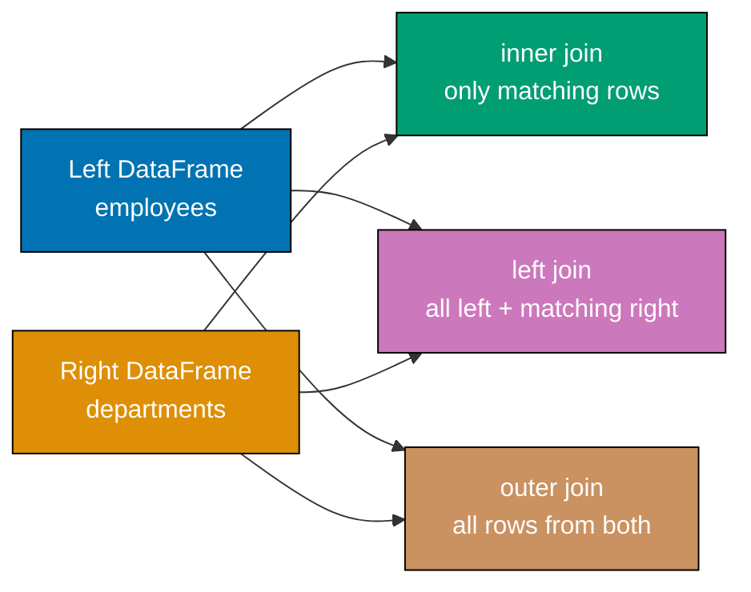

Examples 1 through 28 cover loading data, exploring DataFrames, filtering, handling missing values, basic numpy operations, and fundamental visualization with matplotlib and seaborn. All code targets pandas 3.0.2 and numpy 2.4.4.

## Example 1: Loading CSV with pandas 3.0.2

Loading a CSV file is the most common entry point for data analytics. pandas 3.0.2 introduces `dtype_backend` parameter for Arrow-backed or nullable integer/string types — a significant improvement over the legacy `object` dtype for non-numeric columns.

**Code**:

```python
import pandas as pd  # => pandas 3.0.2 — major breaking changes from 2.x

# Read CSV with numpy_nullable backend for proper NA handling
# dtype_backend="numpy_nullable" uses pd.NA instead of np.nan for missing values
df = pd.read_csv(
    "sales.csv",              # => path to CSV file
    dtype_backend="numpy_nullable",  # => use nullable dtypes (Int64, Float64, StringDtype)
)

# Alternatively, use pyarrow backend for 2-5x memory reduction
# df = pd.read_csv("sales.csv", dtype_backend="pyarrow")

print(df.head(3))   # => prints first 3 rows as a formatted table
print(df.shape)     # => (1000, 8) — 1000 rows and 8 columns
print(df.dtypes)    # => shows dtype per column: Int64, Float64, string, etc.
```

**Key Takeaway**: Use `dtype_backend="numpy_nullable"` or `dtype_backend="pyarrow"` in `pd.read_csv()` to get proper NA handling and memory efficiency instead of the legacy `object` dtype.

**Why It Matters**: The default dtype for string columns in pandas 2.x was `object`, which used Python strings and was memory-inefficient. pandas 3.0.2's `StringDtype` and nullable numeric types (`Int64`, `Float64`) use `pd.NA` for missing values instead of `np.nan`, allowing proper type inference and reducing memory usage. Knowing which backend to choose at load time prevents costly dtype conversions later.

---

## Example 2: DataFrame Basics — Shape, Info, Describe

After loading data, the first task is always to understand its structure. These five methods give you a complete picture in seconds.

**Code**:

```python
import pandas as pd       # => pandas 3.0.2

# Create a sample DataFrame for demonstration
data = {
    "name": ["Alice", "Bob", "Charlie", "Diana", None],  # => one missing name
    "age": [25, 32, None, 41, 28],                        # => one missing age
    "salary": [55000.0, 72000.0, 60000.0, 85000.0, 48000.0],
    "department": ["Engineering", "Marketing", "Engineering", "Finance", "Marketing"],
}
df = pd.DataFrame(data)   # => DataFrame with 5 rows, 4 columns

# === Basic shape and column info ===
print(df.shape)       # => (5, 4) — rows, columns as tuple
print(df.columns)     # => Index(['name', 'age', 'salary', 'department'], dtype='object')
print(df.dtypes)      # => name: object, age: float64, salary: float64, department: object

# === Summary info: non-null counts + dtypes ===
df.info()
# => <class 'pandas.core.frame.DataFrame'>
# => RangeIndex: 5 entries, 0 to 4
# => Data columns (total 4 columns):
# =>  #   Column      Non-Null Count  Dtype
# => ---  ------      --------------  -----
# =>  0   name        4 non-null      object
# =>  1   age         4 non-null      float64
# =>  2   salary      5 non-null      float64
# =>  3   department  5 non-null      object

# === Statistical summary for numeric columns ===
print(df.describe())
# => shows count, mean, std, min, 25%, 50%, 75%, max for age and salary

# === First and last rows ===
print(df.head(2))  # => first 2 rows
print(df.tail(2))  # => last 2 rows
```

**Key Takeaway**: Use `shape`, `info()`, and `describe()` as your standard "first look" trio — they reveal structure, null counts, and statistical distributions immediately.

**Why It Matters**: Understanding your data's shape and dtype distribution before any analysis prevents bugs caused by unexpected nulls, wrong types, or scale mismatches. `df.info()` is particularly useful because it shows non-null counts per column at a glance, letting you immediately identify columns needing imputation or dropping. `df.describe()` reveals outliers through the min/max and percentile gaps.

---

## Example 3: Selecting Columns and Rows — loc, iloc, Single/Multi-Column

pandas provides multiple selection mechanisms. Understanding the difference between label-based (`loc`) and position-based (`iloc`) selection avoids off-by-one errors and unexpected behavior.

**Code**:

```python
import pandas as pd       # => pandas 3.0.2

df = pd.DataFrame({
    "name": ["Alice", "Bob", "Charlie"],
    "age": [25, 32, 41],
    "salary": [55000, 72000, 85000],
})

# === Single column selection — returns Series ===
ages = df["age"]          # => Series with index [0,1,2], values [25, 32, 41]
print(type(ages))         # => <class 'pandas.core.series.Series'>

# === Multiple column selection — returns DataFrame ===
subset = df[["name", "salary"]]   # => DataFrame with 2 columns only
print(subset.shape)               # => (3, 2)

# === Label-based row selection with .loc ===
# .loc[row_label, col_label] — inclusive on both ends
row0 = df.loc[0]                  # => Series: name=Alice, age=25, salary=55000
row_range = df.loc[0:1, "name"]   # => Series: ['Alice', 'Bob'] (0 and 1 included)

# === Position-based selection with .iloc ===
# .iloc[row_pos, col_pos] — exclusive upper bound (like Python slices)
first_two_rows = df.iloc[0:2]     # => rows 0 and 1 only (row 2 excluded)
cell = df.iloc[1, 2]              # => 72000 — row index 1, col index 2

# === Combined: specific rows AND specific columns ===
result = df.loc[0:1, ["name", "age"]]
# => DataFrame: Alice/25, Bob/32 — 2 rows, 2 columns
print(result)
```

**Key Takeaway**: Use `df["col"]` for column selection, `df.loc[]` for label-based row/cell access, and `df.iloc[]` for positional access — they are not interchangeable.

**Why It Matters**: The distinction between `loc` (inclusive upper bound) and `iloc` (exclusive upper bound) catches developers coming from other languages by surprise. Mixing them up produces silently wrong results rather than errors. Understanding which accessor to use in which context is foundational to all downstream pandas work, from filtering to assignment.

---

## Example 4: Copy-on-Write in pandas 3.0.2 — ChainedAssignmentError

Copy-on-Write (CoW) is the most important breaking change in pandas 3.0.2. Code that silently worked in 2.x will now raise a `ChainedAssignmentError` or produce incorrect results.



**Code**:

```python
import pandas as pd           # => pandas 3.0.2 — CoW is now enforced

df = pd.DataFrame({
    "age": [25, 32, 41, 28],
    "salary": [55000, 72000, 85000, 48000],
    "department": ["Eng", "Mkt", "Eng", "Fin"],
})

# === WRONG: ChainedAssignment — raises error in pandas 3.0.2 ===
# df[df["age"] > 30]["salary"] = 99999
# => ChainedAssignmentError: behavior is undefined, CoW means the filtered
# => DataFrame may be a copy, so assignment has no effect on original

# === CORRECT: Use df.loc for conditional assignment ===
mask = df["age"] > 30                      # => boolean Series [False, True, True, False]
df.loc[mask, "salary"] = 99999             # => modifies original DataFrame in-place
print(df["salary"].tolist())               # => [55000, 99999, 99999, 48000]

# === CORRECT: Assign new column from expression ===
df["salary_k"] = df["salary"] / 1000      # => new column is fine — no chaining
print(df["salary_k"].tolist())            # => [55.0, 99.999, 99.999, 48.0]

# === CORRECT: df.assign() for method chaining — returns new DataFrame ===
df2 = df.assign(bonus=df["salary"] * 0.1)  # => new DataFrame, df unchanged
print(df2["bonus"].tolist())               # => [5500.0, 9999.9, 9999.9, 4800.0]
```

**Key Takeaway**: Replace all `df[condition]["col"] = value` patterns with `df.loc[condition, "col"] = value` — CoW enforcement makes chained assignment an error, not a silent no-op.

**Why It Matters**: In pandas 2.x, chained assignment sometimes worked and sometimes silently failed, leading to data corruption bugs that were hard to detect. pandas 3.0.2's CoW enforcement converts this silent failure into an explicit error, which is much better for correctness. Migrating to `df.loc[]` for all assignments is now mandatory and produces more predictable code.

---

## Example 5: Filtering Rows — Boolean Indexing

Boolean indexing is the pandas idiom for selecting rows that meet conditions. Multiple conditions compose with `&` and `|`, not `and` and `or`.

**Code**:

```python
import pandas as pd      # => pandas 3.0.2

df = pd.DataFrame({
    "name": ["Alice", "Bob", "Charlie", "Diana", "Eve"],
    "age": [25, 32, 41, 28, 35],
    "salary": [55000, 72000, 85000, 48000, 67000],
    "department": ["Eng", "Mkt", "Eng", "Fin", "Mkt"],
})

# === Single condition filter ===
seniors = df[df["age"] > 30]           # => 3 rows: Bob(32), Charlie(41), Eve(35)
print(seniors.shape)                   # => (3, 4)

# === Multiple conditions with & (AND) — parentheses required ===
eng_seniors = df[(df["age"] > 30) & (df["department"] == "Eng")]
# => 1 row: Charlie — must be BOTH conditions true
print(eng_seniors["name"].tolist())    # => ['Charlie']

# === Multiple conditions with | (OR) ===
high_or_young = df[(df["salary"] > 70000) | (df["age"] < 27)]
# => 3 rows: Alice(age<27), Bob(salary>70k), Charlie(salary>70k)
print(high_or_young.shape)             # => (3, 4)

# === Negation with ~ ===
not_marketing = df[~(df["department"] == "Mkt")]
# => 3 rows: Alice, Charlie, Diana — excludes Marketing employees
print(not_marketing["department"].tolist())  # => ['Eng', 'Eng', 'Fin']

# === Using .isin() for multiple value membership ===
tech_depts = df[df["department"].isin(["Eng", "Fin"])]
# => 3 rows: Alice, Charlie, Diana
print(tech_depts.shape)                # => (3, 4)

# === String contains filter ===
# df[df["name"].str.contains("a", case=False)]  => Alice, Charlie, Diana
```

**Key Takeaway**: Use `&` and `|` (not `and`/`or`) for combining boolean conditions, and always wrap each condition in parentheses — Python's operator precedence makes bare conditions ambiguous.

**Why It Matters**: Boolean indexing is the foundation of all data selection in analytics. The `&`/`|` vs `and`/`or` distinction trips up nearly every developer new to pandas, and the resulting error message is cryptic. Mastering boolean indexing with proper parenthesization enables all downstream filtering, grouping, and conditional transformation patterns.

---

## Example 6: Handling Missing Values

Missing values are ubiquitous in real data. pandas provides `isnull()`, `dropna()`, and `fillna()` for detection, removal, and imputation.

**Code**:

```python
import pandas as pd    # => pandas 3.0.2
import numpy as np     # => numpy 2.4.4

df = pd.DataFrame({
    "name": ["Alice", None, "Charlie", "Diana"],
    "age": [25, 32, np.nan, 41],           # => np.nan for float missing values
    "score": [88.5, 92.0, None, 77.3],
    "grade": ["A", "A", "B", None],
})

# === Detect missing values ===
print(df.isnull())      # => boolean DataFrame — True where value is NaN/None/NA
print(df.isna().sum())  # => Series: name=1, age=1, score=1, grade=1 (count per column)
print(df.isnull().sum().sum())  # => 4 — total missing cells in entire DataFrame

# === Which rows have any missing value ===
has_null = df[df.isnull().any(axis=1)]   # => all 4 rows (each has one null)
print(has_null.shape)                     # => (4, 4)

# === Drop rows with ANY missing value ===
df_clean = df.dropna()               # => 0 rows remain (every row has at least one null)
print(df_clean.shape)                # => (0, 4)

# === Drop rows only if specific column is null ===
df_name_ok = df.dropna(subset=["name"])   # => 3 rows: Alice, Charlie, Diana
print(df_name_ok.shape)                    # => (3, 4) — row with None name dropped

# === Fill missing values with a constant ===
df_filled = df.fillna({"age": 0, "score": df["score"].mean(), "grade": "Unknown"})
# => age NaN -> 0, score None -> mean(88.5, 92.0, 77.3)=85.93, grade None -> Unknown
print(df_filled["age"].tolist())      # => [25.0, 32.0, 0.0, 41.0]
print(df_filled["grade"].tolist())    # => ['A', 'A', 'B', 'Unknown']

# === Forward fill (propagate last valid value forward) ===
df_ffill = df[["score"]].ffill()
# => score column: 88.5, 92.0, 92.0 (filled from 92.0), 77.3
print(df_ffill["score"].tolist())     # => [88.5, 92.0, 92.0, 77.3]
```

**Key Takeaway**: Use `df.isna().sum()` to profile missing data per column, `df.dropna(subset=[...])` to remove rows missing key fields, and `df.fillna()` with a dict to impute column-specific values.

**Why It Matters**: Most real-world datasets have missing values, and how you handle them determines result validity. Dropping too aggressively loses information; imputing naively (e.g., filling with 0 where 0 is a valid value) introduces bias. Understanding the full toolkit — detection, visualization of missing patterns, selective dropping, and informed imputation — is essential for any analytics pipeline.

---

## Example 7: Data Types — astype, StringDtype, Safe Conversion

pandas 3.0.2 introduces `pd.StringDtype()` as the default for string columns when using nullable backends. Understanding dtype conversion prevents silent data loss.

**Code**:

```python
import pandas as pd       # => pandas 3.0.2

df = pd.DataFrame({
    "id": ["001", "002", "003", "004"],    # => stored as string/object
    "revenue": ["1200.5", "850.0", "invalid", "2100.0"],  # => mixed — has non-numeric
    "count": [10, 20, 30, 40],             # => int64 by default
    "flag": [1, 0, 1, 0],                  # => int64, but conceptually boolean
})

print(df.dtypes)
# => id: object, revenue: object, count: int64, flag: int64

# === Convert integer column to boolean ===
df["flag"] = df["flag"].astype(bool)      # => True/False values
print(df["flag"].dtype)                   # => bool
print(df["flag"].tolist())                # => [True, False, True, False]

# === Convert string column to float with error handling ===
# astype(float) raises ValueError if non-numeric strings exist
# Use pd.to_numeric with errors="coerce" to replace invalid values with NaN
df["revenue_num"] = pd.to_numeric(df["revenue"], errors="coerce")
# => "1200.5" -> 1200.5, "850.0" -> 850.0, "invalid" -> NaN, "2100.0" -> 2100.0
print(df["revenue_num"].tolist())         # => [1200.5, 850.0, nan, 2100.0]
print(df["revenue_num"].isna().sum())     # => 1 — one coercion failure

# === Explicit StringDtype for string columns (pandas 3.0.2) ===
df["id"] = df["id"].astype(pd.StringDtype())
# => id column now uses pd.StringDtype() not object
print(df["id"].dtype)                     # => string[python] or StringDtype()

# === Convert int to Int64 (nullable integer) ===
df["count"] = df["count"].astype("Int64")
# => Int64 supports pd.NA for missing values; int64 uses np.nan (forces float)
print(df["count"].dtype)                  # => Int64 (capital I — nullable)
```

**Key Takeaway**: Use `pd.to_numeric(errors="coerce")` for safe string-to-number conversion, and use capital-I `"Int64"` or `pd.StringDtype()` for nullable types that properly support `pd.NA`.

**Why It Matters**: Type correctness is foundational — aggregations on `object` dtype columns silently concatenate strings instead of summing numbers. The distinction between `int64` (uses `np.nan`, forces float) and `Int64` (uses `pd.NA`, stays integer) matters for downstream calculations and memory efficiency. Knowing `pd.to_numeric(errors="coerce")` prevents crashes on real-world dirty data.

---

## Example 8: Sorting — sort_values with Single and Multiple Keys

Sorting is essential for ranking, reporting, and time-ordered analysis. pandas supports multi-column sort with independent ascending/descending per column.

**Code**:

```python
import pandas as pd         # => pandas 3.0.2

df = pd.DataFrame({
    "name": ["Charlie", "Alice", "Bob", "Diana", "Eve"],
    "department": ["Eng", "Mkt", "Eng", "Fin", "Eng"],
    "salary": [85000, 55000, 72000, 48000, 72000],
    "years": [8, 3, 5, 2, 5],
})

# === Sort by single column, descending ===
by_salary = df.sort_values("salary", ascending=False)
# => Charlie(85k), Bob(72k), Eve(72k), Alice(55k), Diana(48k)
print(by_salary["name"].tolist())    # => ['Charlie', 'Bob', 'Eve', 'Alice', 'Diana']

# === Sort by multiple columns — salary desc, then name asc for ties ===
multi_sort = df.sort_values(
    ["salary", "name"],              # => sort by salary first, then name for ties
    ascending=[False, True],         # => salary desc, name asc
)
# => Charlie(85k), Bob(72k) < Eve(72k) by name, Alice(55k), Diana(48k)
print(multi_sort["name"].tolist())   # => ['Charlie', 'Bob', 'Eve', 'Alice', 'Diana']

# === Sort and reset index so iloc matches sorted order ===
sorted_df = df.sort_values("salary", ascending=False).reset_index(drop=True)
# => drop=True prevents old index from becoming a column
print(sorted_df.index.tolist())      # => [0, 1, 2, 3, 4] — fresh sequential index

# === Sort with NaN handling — na_position controls where NaNs go ===
import numpy as np              # => numpy 2.4.4
df_with_nan = df.copy()
df_with_nan.loc[2, "salary"] = np.nan  # => introduce one missing salary
sorted_nan = df_with_nan.sort_values("salary", na_position="last")
# => NaN rows sorted to end by default (na_position="last")
print(sorted_nan["salary"].tolist())   # => [48000, 55000, 72000, 85000, nan]
```

**Key Takeaway**: Use `sort_values(["col1", "col2"], ascending=[True, False])` for stable multi-key sorts, and always call `reset_index(drop=True)` after sorting if positional indexing will follow.

**Why It Matters**: Correct multi-key sort order is essential for ranking reports and leaderboards. Forgetting `reset_index()` after sorting causes `iloc[0]` to return the wrong row — a subtle bug that passes visual inspection. The `na_position` parameter controls where missing values land, which affects rank calculations and report readability.

---

## Example 9: Adding and Removing Columns

Columns are added, transformed, and removed throughout the analytics workflow. pandas 3.0.2's CoW rules mean some patterns that worked in 2.x now require explicit reassignment.

**Code**:

```python
import pandas as pd     # => pandas 3.0.2

df = pd.DataFrame({
    "name": ["Alice", "Bob", "Charlie"],
    "salary": [55000, 72000, 85000],
    "years": [3, 5, 8],
})

# === Add new column by direct assignment ===
df["monthly"] = df["salary"] / 12      # => new column from existing column
# => [4583.33, 6000.0, 7083.33]
print(df["monthly"].round(2).tolist()) # => [4583.33, 6000.0, 7083.33]

# === Add column conditionally using numpy where ===
import numpy as np                      # => numpy 2.4.4
df["level"] = np.where(
    df["years"] >= 5,                   # => condition: 5+ years
    "Senior",                           # => value if True
    "Junior",                           # => value if False
)
print(df["level"].tolist())             # => ['Junior', 'Senior', 'Senior']

# === df.assign() — immutable chaining, returns new DataFrame ===
df_extended = (
    df.assign(
        annual_bonus=df["salary"] * 0.1,    # => 10% bonus
        total_comp=lambda d: d["salary"] + d["annual_bonus"],  # => uses new column
    )
)
print(df_extended["total_comp"].tolist()) # => [60500.0, 79200.0, 93500.0]

# === Remove column with drop() — original unchanged unless inplace=True ===
df_no_monthly = df.drop(columns=["monthly"])      # => new DataFrame without monthly
print(df_no_monthly.columns.tolist())             # => ['name', 'salary', 'years', 'level']
print("monthly" in df.columns)                    # => True — df still has monthly column

# === Remove multiple columns at once ===
df_minimal = df.drop(columns=["monthly", "level"])
print(df_minimal.columns.tolist())                # => ['name', 'salary', 'years']
```

**Key Takeaway**: Use direct assignment `df["col"] = expr` for simple column creation, `df.assign()` for method-chaining patterns, and `df.drop(columns=[...])` to remove columns without modifying the original.

**Why It Matters**: The choice between `df["col"] = ...` (mutates in-place) and `df.assign()` (returns new DataFrame) matters for pipeline composability. `df.assign()` is the functional style that integrates cleanly with method chains and avoids accidental mutation. Understanding both patterns lets you write either imperative or functional analytics code as the situation demands.

---

## Example 10: Aggregations with groupby

`groupby` is the core aggregation mechanism in pandas — split the data by a category, apply a function, and combine results. Note: polars uses `group_by` (different spelling); this example is for pandas only.

**Code**:

```python
import pandas as pd       # => pandas 3.0.2
# NOTE: pandas uses "groupby" (one word, no space)
# polars uses "group_by" (two words with underscore) — different API!

df = pd.DataFrame({
    "department": ["Eng", "Mkt", "Eng", "Fin", "Mkt", "Eng"],
    "name": ["Alice", "Bob", "Charlie", "Diana", "Eve", "Frank"],
    "salary": [55000, 72000, 85000, 48000, 67000, 71000],
    "years": [3, 5, 8, 2, 4, 6],
})

# === Single aggregation per group ===
dept_avg = df.groupby("department")["salary"].mean()
# => department
# => Eng    70333.33
# => Fin    48000.00
# => Mkt    69500.00
print(dept_avg)

# === Multiple aggregations at once ===
dept_stats = df.groupby("department")["salary"].agg(["mean", "min", "max", "count"])
# => mean, min, max, count columns per department group
print(dept_stats)

# === Aggregate different columns with different functions ===
result = df.groupby("department").agg(
    avg_salary=("salary", "mean"),   # => named aggregation syntax (pandas 0.25+)
    max_years=("years", "max"),
    headcount=("name", "count"),
)
# => avg_salary, max_years, headcount columns indexed by department
print(result)

# === Group by multiple columns ===
# df.groupby(["department", "level"])["salary"].mean()

# === Reset index to get flat DataFrame ===
flat = dept_avg.reset_index()   # => two-column DataFrame: department, salary
print(flat.columns.tolist())    # => ['department', 'salary']
```

**Key Takeaway**: Use `df.groupby("col").agg(name=("col", "func"))` for named aggregations that produce readable column names — this is clearer than chaining `.rename()` after `.agg()`.

**Why It Matters**: groupby is the foundation of all summary reporting. The named aggregation syntax `agg(avg_salary=("salary", "mean"))` produces self-documenting DataFrames without needing a separate rename step. Understanding how groupby produces a MultiIndex result (and when to call `reset_index()`) prevents confusion when joining aggregated results back to the original DataFrame.

---

## Example 11: Renaming and Reindexing

Clean column names and consistent indexes are prerequisites for readable output and reliable joining. pandas provides concise methods for both.

**Code**:

```python
import pandas as pd       # => pandas 3.0.2

df = pd.DataFrame({
    "Dept Name": ["Engineering", "Marketing", "Finance"],
    "Avg Salary $": [72000, 65000, 58000],
    "HC": [45, 20, 15],
})

# === Rename columns with a dictionary mapping ===
df_renamed = df.rename(columns={
    "Dept Name": "department",     # => spaces replaced, lowercase
    "Avg Salary $": "avg_salary",  # => remove special characters
    "HC": "headcount",             # => expand abbreviation
})
print(df_renamed.columns.tolist())  # => ['department', 'avg_salary', 'headcount']

# === Lowercase all column names programmatically ===
df.columns = df.columns.str.lower().str.replace(" ", "_").str.replace("$", "")
# => 'dept_name', 'avg_salary_', 'hc'
print(df.columns.tolist())

# === set_index — make a column the row index ===
df2 = pd.DataFrame({
    "id": [101, 102, 103],
    "name": ["Alice", "Bob", "Charlie"],
    "score": [88, 92, 77],
})
df_indexed = df2.set_index("id")    # => id becomes row label
# => df_indexed.loc[101] returns Alice's row
print(df_indexed.loc[101]["name"]) # => 'Alice'

# === reset_index — move index back to a column ===
df_flat = df_indexed.reset_index()       # => id returns as regular column
print(df_flat.columns.tolist())          # => ['id', 'name', 'score']
print(df_flat.index.tolist())            # => [0, 1, 2] — default integer index

# === Reindex to add/remove rows by label, fills missing with NaN ===
df_reindexed = df2.set_index("id").reindex([101, 102, 103, 104])
# => row 104 added with NaN values since it doesn't exist
print(df_reindexed.loc[104]["name"])     # => NaN
```

**Key Takeaway**: Use `df.rename(columns={...})` for targeted renames, `df.columns = df.columns.str.lower()` for bulk normalization, and `set_index()`/`reset_index()` to switch between labeled and positional row access.

**Why It Matters**: Consistent, machine-friendly column names (lowercase, no spaces, no special characters) are essential for reliable programmatic access — `df["Avg Salary $"]` is fragile compared to `df["avg_salary"]`. Setting a meaningful row index (like a primary key) makes `df.loc[]` lookups fast and readable, while `reset_index()` is needed before most joins.

---

## Example 12: Merging DataFrames — pd.merge Join Types

Merging combines two DataFrames on a common key, analogous to SQL JOIN. Understanding the four join types prevents accidental data loss or duplication.



**Code**:

```python
import pandas as pd       # => pandas 3.0.2

employees = pd.DataFrame({
    "emp_id": [1, 2, 3, 4],
    "name": ["Alice", "Bob", "Charlie", "Diana"],
    "dept_id": [10, 20, 10, 30],   # => Diana's dept 30 has no match in departments
})

departments = pd.DataFrame({
    "dept_id": [10, 20, 40],       # => dept 40 has no employees
    "dept_name": ["Engineering", "Marketing", "Legal"],
})

# === inner join — only rows with matching keys in BOTH DataFrames ===
inner = pd.merge(employees, departments, on="dept_id", how="inner")
# => 3 rows: Alice/Eng, Bob/Mkt, Charlie/Eng — Diana(dept 30) dropped
print(inner.shape)                           # => (3, 4)

# === left join — ALL left rows + matching right (NaN if no right match) ===
left = pd.merge(employees, departments, on="dept_id", how="left")
# => 4 rows: Alice/Eng, Bob/Mkt, Charlie/Eng, Diana/NaN (dept 30 missing)
print(left.shape)                            # => (4, 4)
print(left["dept_name"].isna().sum())        # => 1 — Diana has NaN dept_name

# === outer join — ALL rows from both, NaN where no match ===
outer = pd.merge(employees, departments, on="dept_id", how="outer")
# => 5 rows: 4 employee rows + 1 Legal(dept 40) row with NaN employees
print(outer.shape)                           # => (5, 4)

# === Merge on different column names in each DataFrame ===
# pd.merge(left, right, left_on="emp_dept", right_on="dept_id")

# === Merge on index ===
# pd.merge(left, right, left_index=True, right_index=True)
```

**Key Takeaway**: Choose `how="left"` when you want to preserve all rows from your primary DataFrame regardless of whether a match exists in the secondary table — this is the most common join in analytics.

**Why It Matters**: Choosing the wrong join type silently drops rows (inner join) or introduces unexpected NaN-filled rows (outer join). Left join is the analytics default because it preserves your primary dataset while enriching it with lookup data. Understanding join cardinality (one-to-one vs one-to-many) prevents row duplication that inflates aggregation results.

---

## Example 13: Concatenating DataFrames — pd.concat

Concatenation stacks DataFrames vertically (more rows) or horizontally (more columns). It is the correct way to combine data from multiple sources with the same schema.

**Code**:

```python
import pandas as pd       # => pandas 3.0.2

# === Vertical concatenation (stacking rows) ===
q1 = pd.DataFrame({
    "month": ["Jan", "Feb", "Mar"],
    "revenue": [12000, 15000, 11000],
})
q2 = pd.DataFrame({
    "month": ["Apr", "May", "Jun"],
    "revenue": [16000, 18000, 14000],
})

# Concatenate vertically — adds rows from q2 below q1
combined = pd.concat([q1, q2], ignore_index=True)
# => ignore_index=True resets index to 0,1,2,3,4,5 — prevents duplicate indices
print(combined.shape)                  # => (6, 2)
print(combined.index.tolist())         # => [0, 1, 2, 3, 4, 5]

# === WITHOUT ignore_index — index from each DataFrame preserved ===
combined_raw = pd.concat([q1, q2])
print(combined_raw.index.tolist())     # => [0, 1, 2, 0, 1, 2] — duplicate indices!

# === Add a source label to track origin ===
combined_labeled = pd.concat(
    [q1, q2],
    keys=["Q1", "Q2"],                 # => creates MultiIndex (Q1/Q2, 0/1/2)
    ignore_index=False,
)
print(combined_labeled.index)         # => MultiIndex: Q1-0, Q1-1, Q1-2, Q2-0, Q2-1, Q2-2

# === Horizontal concatenation (adding columns) ===
ids = pd.DataFrame({"id": [101, 102, 103]})
names = pd.DataFrame({"name": ["Alice", "Bob", "Charlie"]})
horiz = pd.concat([ids, names], axis=1)  # => axis=1 means columns direction
# => DataFrame with id and name columns
print(horiz.columns.tolist())             # => ['id', 'name']

# === Handling mismatched columns — fills with NaN ===
df_a = pd.DataFrame({"x": [1, 2], "y": [3, 4]})
df_b = pd.DataFrame({"x": [5, 6], "z": [7, 8]})  # => no 'y' column
combined_mismatch = pd.concat([df_a, df_b], ignore_index=True)
# => y column has NaN for df_b rows; z column has NaN for df_a rows
print(combined_mismatch)
```

**Key Takeaway**: Always pass `ignore_index=True` when concatenating vertically unless you need the original indices for something — duplicate indices cause confusing behavior with `.loc[]`.

**Why It Matters**: Concatenation is used constantly in data pipelines — loading multiple CSV files, combining daily/monthly batches, or assembling results from parallel processing. The `ignore_index=True` parameter is almost always needed to prevent the duplicate index trap. The `keys` parameter adds a useful provenance label that makes debugging batch processing much easier.

---

## Example 14: String Operations with pandas

The `.str` accessor exposes vectorized string methods for the entire column at once, avoiding slow Python-level for loops.

**Code**:

```python
import pandas as pd      # => pandas 3.0.2

df = pd.DataFrame({
    "email": ["ALICE@example.com", "  bob@DOMAIN.ORG  ", "charlie@test.net", "invalid-email"],
    "description": ["Product A - red", "Product B - blue", "Product C - red", "Product D - green"],
    "code": ["SKU-001", "SKU-002", "SKU-003", "SKU-004"],
})

# === Case normalization ===
df["email_clean"] = df["email"].str.lower().str.strip()
# => 'alice@example.com', 'bob@domain.org', 'charlie@test.net', 'invalid-email'
print(df["email_clean"].tolist())

# === Check if string contains a pattern ===
is_red = df["description"].str.contains("red", case=False, na=False)
# => True where description has "red" (case-insensitive)
print(is_red.tolist())   # => [True, False, True, False]

# === Extract substring — get domain from email ===
df["domain"] = df["email_clean"].str.split("@").str[-1]
# => 'example.com', 'domain.org', 'test.net', 'invalid-email' (no @ so last part is full string)
print(df["domain"].tolist())

# === Replace pattern ===
df["code_num"] = df["code"].str.replace("SKU-", "", regex=False)
# => '001', '002', '003', '004'
print(df["code_num"].tolist())

# === Pad strings to fixed width ===
df["code_padded"] = df["code_num"].str.zfill(5)
# => '00001', '00002', '00003', '00004'
print(df["code_padded"].tolist())

# === String length ===
df["email_len"] = df["email_clean"].str.len()
# => 17, 14, 16, 13 (characters in cleaned email)
print(df["email_len"].tolist())

# === startswith / endswith ===
is_com = df["email_clean"].str.endswith(".com")
# => True, False, False, False
print(is_com.tolist())
```

**Key Takeaway**: The `.str` accessor vectorizes all Python string methods, making them operate on entire columns without explicit loops — always prefer `.str.method()` over `df["col"].apply(lambda x: x.method())`.

**Why It Matters**: String cleaning is 40-60% of real data analytics work. The `.str` accessor is 5-50x faster than `apply(lambda)` on string columns because it uses optimized Cython internals. Chaining `.str.lower().str.strip()` is idiomatic pandas and produces cleaner code than a custom function. Knowing `.str.contains()` for filtering and `.str.split().str[-1]` for extraction covers most practical text processing needs.

---

## Example 15: Date and Time — pd.to_datetime, dt Accessor, New Freq Aliases

pandas 3.0.2 deprecates old frequency aliases. `"M"` → `"ME"`, `"Y"` → `"YE"`, `"Q"` → `"QE"`. This is a breaking change from 2.x.

**Code**:

```python
import pandas as pd       # => pandas 3.0.2

df = pd.DataFrame({
    "date_str": ["2025-01-15", "2025-03-22", "2025-07-04", "2026-01-01"],
    "sales": [1200, 1800, 2100, 950],
})

# === Parse string column to datetime ===
df["date"] = pd.to_datetime(df["date_str"])
# => dtype becomes datetime64[ns]
print(df["date"].dtype)              # => datetime64[ns]

# === Extract datetime components using .dt accessor ===
df["year"] = df["date"].dt.year      # => [2025, 2025, 2025, 2026]
df["month"] = df["date"].dt.month    # => [1, 3, 7, 1]
df["quarter"] = df["date"].dt.quarter  # => [1, 1, 3, 1]
df["day_name"] = df["date"].dt.day_name()  # => ['Wednesday', 'Saturday', 'Friday', 'Thursday']
df["week"] = df["date"].dt.isocalendar().week   # => ISO week number

print(df[["date", "year", "month", "quarter"]].to_string())

# === Date arithmetic ===
df["days_from_start"] = (df["date"] - df["date"].min()).dt.days
# => [0, 66, 169, 351] — days elapsed from earliest date
print(df["days_from_start"].tolist())

# === Create a date range for time series ===
# CRITICAL: pandas 3.0.2 uses "ME" for month-end, NOT deprecated "M"
monthly_dates = pd.date_range("2025-01-01", periods=6, freq="ME")
# => DatetimeIndex: 2025-01-31, 2025-02-28, 2025-03-31, ..., 2025-06-30
print(monthly_dates)

# === Other new aliases (pandas 3.0.2) ===
# "YE" for year-end (was "Y" in 2.x — deprecated)
# "QE" for quarter-end (was "Q" in 2.x — deprecated)
# "MS" for month-start (unchanged)
# "YS" for year-start (unchanged)
annual_dates = pd.date_range("2020-01-01", periods=5, freq="YE")
# => DatetimeIndex: 2020-12-31, 2021-12-31, ..., 2024-12-31
print(annual_dates)
```

**Key Takeaway**: Always use `"ME"`, `"YE"`, `"QE"` in pandas 3.0.2 — the old `"M"`, `"Y"`, `"Q"` aliases raise `FutureWarning` now and will be errors in future versions.

**Why It Matters**: Time series analysis is pervasive in analytics (sales trends, user growth, cohort analysis). The frequency alias change is the most common runtime error when migrating pandas 2.x code to 3.x. The `.dt` accessor unlocks the full datetime component toolkit without writing custom extraction logic. Date arithmetic with pandas datetime objects is mathematically correct for edge cases like leap years and DST.

---

## Example 16: numpy Arrays — Creating and Inspecting

numpy is the numerical foundation underlying pandas. Understanding arrays, shapes, and dtypes is prerequisite to effective data manipulation.

**Code**:

```python
import numpy as np       # => numpy 2.4.4 — major type alias changes from 1.x

# === Creating arrays from Python lists ===
arr = np.array([1, 2, 3, 4, 5])   # => 1D array, dtype inferred as int64
print(arr)                          # => [1 2 3 4 5]
print(arr.dtype)                    # => int64
print(arr.shape)                    # => (5,) — 1D array with 5 elements
print(arr.ndim)                     # => 1 — one dimension

# === Creating 2D arrays ===
matrix = np.array([[1, 2, 3], [4, 5, 6]])   # => 2 rows, 3 columns
print(matrix.shape)                           # => (2, 3)
print(matrix.ndim)                            # => 2
print(matrix[0, 2])                           # => 3 — row 0, col 2

# === Utility creation functions ===
zeros = np.zeros((3, 4))           # => 3x4 array of 0.0 floats
ones = np.ones((2, 3), dtype=np.float64)  # => float64, NOT np.float_ (removed in 2.x)
identity = np.eye(3)               # => 3x3 identity matrix
range_arr = np.arange(0, 10, 2)   # => [0, 2, 4, 6, 8] — like Python range()
linspace = np.linspace(0, 1, 5)   # => [0.0, 0.25, 0.5, 0.75, 1.0] — 5 evenly spaced

print(zeros.shape)    # => (3, 4)
print(range_arr)      # => [0 2 4 6 8]
print(linspace)       # => [0.   0.25 0.5  0.75 1.  ]

# === Reshaping arrays ===
flat = np.arange(12)               # => [0, 1, 2, ..., 11] — 12 elements
reshaped = flat.reshape(3, 4)      # => 3 rows, 4 columns
print(reshaped.shape)              # => (3, 4)
print(reshaped[1, 2])              # => 6 — row 1, col 2 of reshaped array

# === Array metadata ===
print(reshaped.size)               # => 12 — total number of elements
print(reshaped.nbytes)             # => 96 — bytes used (12 elements * 8 bytes each for int64)
```

**Key Takeaway**: Use `np.float64` (not `np.float_`), `np.arange()` for integer ranges, and `np.linspace()` for evenly-spaced float ranges — and remember `arr.shape` returns `(rows, cols)`, not `(cols, rows)`.

**Why It Matters**: numpy arrays underpin all numeric operations in pandas, scikit-learn, and matplotlib. Understanding `shape`, `dtype`, and `ndim` is the mental model for all multi-dimensional data. The numpy 2.x removal of `np.float_`, `np.int_`, and `np.NaN` aliases breaks many code examples found online — using explicit names (`np.float64`, `np.nan`) is both correct and version-stable.

---

## Example 17: numpy Arithmetic — Element-wise Operations and Broadcasting

numpy performs arithmetic element-wise by default and extends operations across arrays of different shapes through broadcasting — without explicit loops.

**Code**:

```python
import numpy as np     # => numpy 2.4.4

a = np.array([1, 2, 3, 4, 5])     # => 1D array
b = np.array([10, 20, 30, 40, 50]) # => same shape as a

# === Element-wise arithmetic ===
print(a + b)   # => [11, 22, 33, 44, 55] — adds corresponding elements
print(a * b)   # => [10, 40, 90, 160, 250]
print(b / a)   # => [10.0, 10.0, 10.0, 10.0, 10.0]
print(a ** 2)  # => [1, 4, 9, 16, 25] — squares each element

# === Scalar broadcasting — scalar applied to every element ===
print(a + 100)   # => [101, 102, 103, 104, 105]
print(a * 2.5)   # => [2.5, 5.0, 7.5, 10.0, 12.5]

# === 2D broadcasting — row vector added to each row of a matrix ===
matrix = np.array([[1, 2, 3],
                   [4, 5, 6],
                   [7, 8, 9]])       # => shape (3, 3)
row_bias = np.array([10, 20, 30])    # => shape (3,) — 1D row vector

result = matrix + row_bias   # => row_bias broadcast to each row
# => [[11, 22, 33],
# =>  [14, 25, 36],
# =>  [17, 28, 39]]
print(result)

# === Column broadcasting — column vector added to each column ===
col_bias = np.array([[100], [200], [300]])  # => shape (3, 1) — column vector
result_col = matrix + col_bias
# => [[101, 102, 103],   (row 0 + 100)
# =>  [204, 205, 206],   (row 1 + 200)
# =>  [307, 308, 309]]   (row 2 + 300)
print(result_col)

# === Aggregate functions ===
print(matrix.sum())          # => 45 — sum all elements
print(matrix.sum(axis=0))    # => [12, 15, 18] — sum each column
print(matrix.sum(axis=1))    # => [6, 15, 24] — sum each row
print(matrix.mean())         # => 5.0 — mean of all elements
print(matrix.std())          # => ~2.58 — standard deviation
```

**Key Takeaway**: Broadcasting eliminates explicit loops — numpy automatically expands smaller arrays to match larger array shapes, making `matrix + row_vector` work without reshaping.

**Why It Matters**: Broadcasting is the key to writing fast, readable numpy code. Without it, normalizing each feature in a 1000-row dataset would require a loop. With broadcasting, `(data - mean) / std` normalizes all rows simultaneously in one expression. This pattern is used throughout scikit-learn preprocessing and all numerical analytics.

---

## Example 18: numpy 2.4.4 Random — default_rng (New API)

numpy 2.4.4 recommends `np.random.default_rng()` over the legacy `np.random.seed()` API. The new API is more explicit, composable, and correct for parallel computing.

**Code**:

```python
import numpy as np       # => numpy 2.4.4

# === NEW API: default_rng (RECOMMENDED in numpy 2.x) ===
rng = np.random.default_rng(seed=42)  # => creates Generator object with reproducible seed
# => rng is a numpy.random.Generator instance

# Continuous distributions
normal_samples = rng.normal(loc=0.0, scale=1.0, size=5)
# => loc=mean, scale=std_dev, size=number of samples
# => e.g., [ 0.304, -1.035, 0.750, 0.940, -0.151] (exact values depend on seed)
print(normal_samples.round(3))

uniform_samples = rng.uniform(low=0.0, high=100.0, size=5)
# => 5 uniform samples between 0 and 100
print(uniform_samples.round(1))   # => e.g., [77.4, 43.2, 0.3, 63.8, 53.6]

# Discrete distributions
int_samples = rng.integers(low=1, high=7, size=10)
# => 10 integers from 1 to 6 (high is exclusive, like Python range)
print(int_samples)                # => e.g., [1, 5, 2, 3, 6, 4, 1, 5, 3, 2]

# Shuffle and choice
arr = np.arange(10)               # => [0, 1, 2, ..., 9]
rng.shuffle(arr)                  # => shuffles in-place
print(arr)                        # => e.g., [7, 4, 2, 0, 9, 6, 1, 8, 5, 3]

choices = rng.choice(["A", "B", "C"], size=5, replace=True)
# => 5 random choices from the list, with replacement
print(choices)                    # => e.g., ['B', 'A', 'C', 'A', 'B']

# === DEPRECATED API (still works but discouraged) ===
# np.random.seed(42)             # => module-level seed, not thread-safe
# np.random.normal(0, 1, 5)      # => uses global state, not recommended
# np.random.RandomState(42)      # => legacy class, use default_rng instead
```

**Key Takeaway**: Use `rng = np.random.default_rng(seed=42)` and call methods on `rng` — this is reproducible, thread-safe, and composable compared to the legacy module-level `np.random.seed()`.

**Why It Matters**: Reproducibility is critical in analytics — you need the same random numbers to reproduce experiments. The old `np.random.seed()` is module-level state that breaks when multiple threads or processes share it. `default_rng` creates independent `Generator` objects that each carry their own state, making parallel Monte Carlo simulations and cross-validation splits correctly reproducible.

---

## Example 19: numpy 2.4.4 Type Names — Breaking Changes from 1.x

numpy 2.4.4 removes deprecated type aliases that were common in numpy 1.x code. Any code using `np.float_`, `np.NaN`, or `np.bool` will fail.

**Code**:

```python
import numpy as np     # => numpy 2.4.4 — type alias breaking changes

# === CORRECT type names in numpy 2.4.4 ===
x_float = np.float64(3.14)     # => np.float64 — 64-bit IEEE float
x_int = np.intp(42)            # => np.intp — platform-native integer (64-bit on 64-bit systems)
x_complex = np.complex128(1+2j) # => np.complex128 — 128-bit complex (64+64)
x_bool = np.bool_(True)         # => np.bool_ — numpy boolean
missing = np.nan                 # => lowercase np.nan — Python float('nan')

print(type(x_float))    # => <class 'numpy.float64'>
print(type(missing))    # => <class 'float'> — np.nan is Python's float nan

# === REMOVED in numpy 2.x (will raise AttributeError) ===
# np.float_    => AttributeError: module 'numpy' has no attribute 'float_'
# np.int_      => removed (was alias for intp but confusingly named like int)
# np.complex_  => removed (use np.complex128)
# np.NaN       => removed (use np.nan lowercase)
# np.bool      => removed in 1.20, still gone (use np.bool_ or Python bool)
# np.string_   => removed (use np.bytes_)

# === How to safely check for NaN in numpy 2.4.4 ===
arr = np.array([1.0, np.nan, 3.0, np.nan, 5.0])
nan_mask = np.isnan(arr)              # => [False, True, False, True, False]
print(nan_mask)

valid = arr[~nan_mask]               # => [1.0, 3.0, 5.0] — filter out NaN
print(valid)

# === Dtype specification with correct names ===
arr_f64 = np.zeros(5, dtype=np.float64)    # => correct
arr_i64 = np.zeros(5, dtype=np.int64)      # => correct
arr_bool = np.zeros(5, dtype=bool)          # => Python bool works
print(arr_f64.dtype)                        # => float64
print(arr_i64.dtype)                        # => int64
```

**Key Takeaway**: Replace `np.float_` with `np.float64`, `np.NaN` with `np.nan`, `np.bool` with `np.bool_` or Python `bool` — these are hard errors in numpy 2.x, not deprecation warnings.

**Why It Matters**: Most code examples on Stack Overflow and in older textbooks use `np.float_` and `np.NaN`. These silently worked in numpy 1.x but raise `AttributeError` in 2.x, breaking existing notebooks instantly on upgrade. Knowing the correct replacements lets you fix migration errors in minutes rather than spending hours debugging opaque `AttributeError: module 'numpy' has no attribute 'float_'` messages.

---

## Example 20: Basic matplotlib Plot — fig, ax Pattern

matplotlib's object-oriented API (`fig, ax = plt.subplots()`) is the correct pattern for production code. The pyplot state-machine API (`plt.plot()`) is only for quick interactive exploration.

**Code**:

```python
import matplotlib.pyplot as plt   # => matplotlib 3.10.x
import numpy as np                # => numpy 2.4.4

# === Generate sample data ===
rng = np.random.default_rng(seed=42)         # => reproducible random data
x = np.linspace(0, 10, 100)                  # => 100 points from 0 to 10
y_signal = np.sin(x)                          # => sine wave
y_noisy = y_signal + rng.normal(0, 0.2, 100) # => sine + Gaussian noise

# === Create figure and axes with OO API ===
fig, ax = plt.subplots(figsize=(10, 4))
# => fig is the Figure container, ax is the Axes (the plot area)
# => figsize=(width_inches, height_inches)

# === Plot data ===
ax.plot(x, y_signal, color="#0173B2", linewidth=2, label="Clean signal")
# => solid blue line for the true signal
ax.plot(x, y_noisy, color="#DE8F05", alpha=0.5, linewidth=1, label="Noisy signal")
# => orange line with 50% transparency for noisy observations

# === Annotations and labels ===
ax.set_xlabel("Time (seconds)", fontsize=12)  # => x-axis label
ax.set_ylabel("Amplitude", fontsize=12)        # => y-axis label
ax.set_title("Sine Wave with Gaussian Noise", fontsize=14, fontweight="bold")
ax.legend(loc="upper right")                   # => show legend with labels
ax.grid(True, alpha=0.3)                        # => faint grid for readability

# === Save to file ===
# plt.savefig("sine_wave.png", dpi=150, bbox_inches="tight")
# => dpi=150 for reasonable print quality; bbox_inches="tight" removes extra whitespace

plt.tight_layout()   # => adjusts subplot parameters to fit labels
plt.show()           # => display in notebook/interactive session
```

**Key Takeaway**: Always use `fig, ax = plt.subplots()` — this returns explicit objects you can modify, save, and embed in reports, unlike the implicit pyplot state machine.

**Why It Matters**: The `fig, ax` pattern is essential for production code because it allows creating multiple subplots, customizing each axes independently, and saving to specific files. The pyplot state-machine (`plt.plot()`) only works in interactive sessions and breaks when called from functions or multi-figure scripts. Learning the OO API from the start avoids painful rewrites later.

---

## Example 21: Scatter Plot with matplotlib and pandas

Scatter plots reveal relationships between two numeric variables. pandas DataFrame has a `.plot.scatter()` convenience method that delegates to matplotlib.

**Code**:

```python
import pandas as pd             # => pandas 3.0.2
import matplotlib.pyplot as plt # => matplotlib 3.10.x
import numpy as np              # => numpy 2.4.4

# === Generate correlated data ===
rng = np.random.default_rng(seed=42)          # => reproducible generator
n = 100
experience = rng.integers(1, 15, size=n)       # => years 1-14
base_salary = experience * 5000               # => salary increases with experience
noise = rng.normal(0, 8000, size=n)            # => random variation
salary = base_salary + 40000 + noise           # => total salary with noise

df = pd.DataFrame({
    "experience_years": experience,
    "salary": salary.astype(int),
    "department": rng.choice(["Eng", "Mkt", "Fin"], size=n),
})

# === Method 1: pandas .plot.scatter() convenience method ===
ax = df.plot.scatter(
    x="experience_years",     # => x-axis column
    y="salary",               # => y-axis column
    alpha=0.6,                # => transparency to see overlapping points
    color="#0173B2",          # => blue — accessible color
    figsize=(8, 5),
)
ax.set_title("Salary vs Experience")
ax.set_xlabel("Years of Experience")
ax.set_ylabel("Annual Salary ($)")
plt.tight_layout()

# === Method 2: matplotlib directly — more control ===
fig, ax = plt.subplots(figsize=(8, 5))

# Color-code by department using a color map
dept_colors = {"Eng": "#0173B2", "Mkt": "#DE8F05", "Fin": "#029E73"}
for dept, color in dept_colors.items():
    mask = df["department"] == dept              # => filter to this department
    ax.scatter(
        df.loc[mask, "experience_years"],
        df.loc[mask, "salary"],
        c=color, alpha=0.7, label=dept, s=40,   # => s=marker size in points^2
    )

ax.set_xlabel("Years of Experience")
ax.set_ylabel("Annual Salary ($)")
ax.set_title("Salary vs Experience by Department")
ax.legend()
plt.tight_layout()
plt.show()
```

**Key Takeaway**: Use `df.plot.scatter()` for quick exploration and `ax.scatter()` directly when you need per-group color coding or other fine-grained control.

**Why It Matters**: Scatter plots are the fastest way to spot correlations, outliers, and cluster structure in continuous data. Color-coding by a categorical variable (department, region, segment) reveals whether the relationship varies by group — a critical check before building a model. Understanding both the pandas convenience wrapper and the raw matplotlib API lets you choose the right tool for quick EDA vs publication-quality figures.

---

## Example 22: Bar Chart — Grouped and Stacked

Bar charts communicate categorical comparisons. pandas integrates with matplotlib for quick group-level visualizations.

**Code**:

```python
import pandas as pd              # => pandas 3.0.2
import matplotlib.pyplot as plt  # => matplotlib 3.10.x

sales_data = pd.DataFrame({
    "region": ["North", "South", "East", "West", "North", "South", "East", "West"],
    "product": ["A", "A", "A", "A", "B", "B", "B", "B"],
    "revenue": [120000, 95000, 140000, 88000, 75000, 110000, 65000, 130000],
})

# === Grouped bar chart ===
pivot = sales_data.pivot(index="region", columns="product", values="revenue")
# => creates a 4x2 DataFrame: regions as rows, products as columns
print(pivot)
# =>         A        B
# => East   140000   65000
# => North  120000   75000
# => South   95000  110000
# => West    88000  130000

fig, axes = plt.subplots(1, 2, figsize=(14, 5))
# => 1 row, 2 columns of subplots — axes is array [ax1, ax2]

# Grouped bar chart (side-by-side bars per region)
pivot.plot.bar(
    ax=axes[0],          # => plot on first subplot
    color=["#0173B2", "#DE8F05"],  # => blue for A, orange for B
    rot=0,               # => don't rotate x-axis labels
    width=0.7,           # => bar width (0 to 1)
)
axes[0].set_title("Grouped: Revenue by Region and Product")
axes[0].set_xlabel("Region")
axes[0].set_ylabel("Revenue ($)")
axes[0].legend(title="Product")

# Stacked bar chart
pivot.plot.bar(
    ax=axes[1],
    stacked=True,        # => bars stacked vertically
    color=["#0173B2", "#DE8F05"],
    rot=0,
)
axes[1].set_title("Stacked: Revenue by Region and Product")
axes[1].set_xlabel("Region")
axes[1].set_ylabel("Total Revenue ($)")

plt.tight_layout()
plt.show()
```

**Key Takeaway**: Use `pivot()` to reshape long-format data into a wide matrix, then call `.plot.bar()` directly on the pivoted DataFrame for side-by-side or stacked group comparisons.

**Why It Matters**: Bar charts are the most-used chart type in business analytics dashboards. The pivot-then-plot pattern is the idiomatic pandas workflow for grouped comparisons. Stacked bars show total and composition simultaneously, while grouped bars make within-group comparisons easier. Choosing wrong (stacked when magnitudes differ by 10x) makes charts misleading — understanding both lets you make informed choices.

---

## Example 23: Histogram — Understanding Distributions

Histograms reveal the shape, spread, and skewness of a continuous variable. They are the first visualization you should create for any new numeric column.

**Code**:

```python
import pandas as pd              # => pandas 3.0.2
import matplotlib.pyplot as plt  # => matplotlib 3.10.x
import numpy as np               # => numpy 2.4.4

rng = np.random.default_rng(seed=42)      # => reproducible generator

# Create a bimodal distribution (two salary groups)
junior_salaries = rng.normal(45000, 8000, 300)   # => junior cluster ~45k
senior_salaries = rng.normal(90000, 12000, 200)  # => senior cluster ~90k
all_salaries = np.concatenate([junior_salaries, senior_salaries])

df = pd.DataFrame({"salary": all_salaries})

fig, axes = plt.subplots(1, 3, figsize=(15, 4))

# === Histogram with auto bins ===
axes[0].hist(df["salary"], bins="auto", color="#0173B2", edgecolor="#000", alpha=0.8)
# => bins="auto" uses Sturges formula to choose bin count
axes[0].set_title("Auto Bins")
axes[0].set_xlabel("Salary ($)")
axes[0].set_ylabel("Frequency")

# === Histogram with specific bin count ===
axes[1].hist(df["salary"], bins=30, color="#029E73", edgecolor="#000", alpha=0.8)
# => bins=30 divides salary range into 30 equal-width buckets
axes[1].set_title("30 Bins")
axes[1].set_xlabel("Salary ($)")

# === pandas convenience histogram ===
df["salary"].hist(
    ax=axes[2],
    bins=25,
    color="#CC78BC",         # => purple — accessible color
    edgecolor="black",
    grid=False,
)
# => adds mean and median reference lines
mean_val = df["salary"].mean()
median_val = df["salary"].median()
axes[2].axvline(mean_val, color="#DE8F05", linewidth=2, label=f"Mean: {mean_val:,.0f}")
axes[2].axvline(median_val, color="#CA9161", linewidth=2, linestyle="--", label=f"Median: {median_val:,.0f}")
axes[2].legend()
axes[2].set_title("With Mean/Median Lines")
axes[2].set_xlabel("Salary ($)")

plt.tight_layout()
plt.show()

# Bimodality visible in all three histograms — two humps around 45k and 90k
print(f"Mean: {mean_val:,.0f}, Median: {median_val:,.0f}")
# => Mean: 64399, Median: 58102 (mean pulled right by senior group)
```

**Key Takeaway**: Always add mean and median vertical lines to histograms — when mean significantly exceeds median, the distribution is right-skewed and may need log transformation before modeling.

**Why It Matters**: Histograms reveal distribution shape before any statistical analysis. Bimodal distributions (two humps) signal mixed populations that should be analyzed separately. Right-skewed salary data means the median is more representative than the mean. Knowing whether to log-transform, clip outliers, or segment the population before modeling prevents systematic bias in downstream analysis.

---

## Example 24: seaborn Basics — scatterplot, lineplot, histplot

seaborn adds statistical context on top of matplotlib — confidence intervals, kernel density estimates, and hue-faceted plots with minimal code.

**Code**:

```python
import seaborn as sns             # => seaborn 0.13.2
import matplotlib.pyplot as plt   # => matplotlib 3.10.x
import pandas as pd               # => pandas 3.0.2
import numpy as np                # => numpy 2.4.4

rng = np.random.default_rng(seed=42)
n = 150
df = pd.DataFrame({
    "experience": rng.integers(1, 15, n),
    "salary": rng.integers(40000, 130000, n),
    "department": rng.choice(["Eng", "Mkt", "Fin"], n),
    "score": rng.normal(75, 15, n).clip(0, 100),
})

fig, axes = plt.subplots(1, 3, figsize=(16, 5))

# === scatterplot with hue (color by category) ===
palette = {"Eng": "#0173B2", "Mkt": "#DE8F05", "Fin": "#029E73"}
sns.scatterplot(
    data=df,
    x="experience",    # => x-axis column name
    y="salary",        # => y-axis column name
    hue="department",  # => color-codes dots by department
    palette=palette,   # => explicit accessible colors
    alpha=0.7,
    ax=axes[0],
)
axes[0].set_title("Salary vs Experience by Department")

# === lineplot with confidence interval ===
# seaborn auto-aggregates y values for each unique x and shows CI
sns.lineplot(
    data=df,
    x="experience",
    y="salary",
    hue="department",
    palette=palette,
    ax=axes[1],
    errorbar="ci",     # => 95% confidence interval shading
)
axes[1].set_title("Mean Salary Trend with 95% CI")

# === histplot with KDE overlay ===
sns.histplot(
    data=df,
    x="score",
    hue="department",
    palette=palette,
    kde=True,           # => overlay kernel density estimate curve
    alpha=0.5,
    ax=axes[2],
)
axes[2].set_title("Score Distribution by Department")

plt.tight_layout()
plt.show()
```

**Key Takeaway**: seaborn's `hue` parameter automatically splits a single plot by a categorical variable and adds a legend — this replaces a manual loop over categories that matplotlib requires.

**Why It Matters**: seaborn reduces exploratory visualization code by 60-80% compared to raw matplotlib. The automatic confidence interval in `lineplot` provides immediate uncertainty quantification without manual bootstrapping. The `hue` parameter enables rapid multi-group comparison — the most common EDA task. Understanding seaborn's data-first API (`data=df, x="col", y="col"`) versus matplotlib's array-first API (`ax.plot(x_array, y_array)`) is essential for productive EDA.

---

## Example 25: seaborn Heatmap — Correlation Matrix

A correlation heatmap is the fastest way to understand pairwise linear relationships across all numeric columns in a dataset.

**Code**:

```python
import pandas as pd              # => pandas 3.0.2
import seaborn as sns            # => seaborn 0.13.2
import matplotlib.pyplot as plt  # => matplotlib 3.10.x
import numpy as np               # => numpy 2.4.4

rng = np.random.default_rng(seed=42)
n = 200

df = pd.DataFrame({
    "age": rng.integers(22, 65, n),
    "experience": rng.integers(0, 40, n),
    "salary": rng.integers(35000, 150000, n),
    "performance": rng.normal(75, 12, n).clip(0, 100),
    "satisfaction": rng.normal(68, 15, n).clip(0, 100),
})

# Make salary correlate with experience for realism
df["salary"] = df["salary"] + df["experience"] * 2000

# === Compute Pearson correlation matrix ===
corr_matrix = df.corr(method="pearson")
# => corr() returns a square DataFrame where each cell is correlation coefficient
# => values range from -1 (perfect negative) to +1 (perfect positive)
print(corr_matrix.round(2))

fig, axes = plt.subplots(1, 2, figsize=(14, 5))

# === Full correlation heatmap ===
sns.heatmap(
    corr_matrix,
    annot=True,          # => show numeric values in each cell
    fmt=".2f",           # => format as 2 decimal places
    cmap="Blues",        # => blue sequential colormap (lighter = closer to 0)
    vmin=-1, vmax=1,     # => fix color scale from -1 to 1
    center=0,            # => white at 0
    square=True,         # => equal aspect ratio cells
    ax=axes[0],
)
axes[0].set_title("Pearson Correlation Matrix")

# === Upper triangle only (remove redundant lower half) ===
mask = np.triu(np.ones_like(corr_matrix, dtype=bool))
# => mask is True in upper triangle including diagonal
sns.heatmap(
    corr_matrix,
    mask=mask,           # => hide upper triangle cells
    annot=True,
    fmt=".2f",
    cmap="Blues",
    vmin=-1, vmax=1,
    center=0,
    square=True,
    ax=axes[1],
)
axes[1].set_title("Lower Triangle Only")

plt.tight_layout()
plt.show()
```

**Key Takeaway**: Always mask the upper triangle with `np.triu()` when displaying correlation matrices — it halves the visual complexity without losing information since the matrix is symmetric.

**Why It Matters**: Correlation heatmaps reveal multicollinearity (highly correlated predictors that cause instability in regression models), feature selection candidates (features with high correlation to the target), and redundant features (two features correlated at 0.95+ contain nearly identical information). The heatmap is a non-negotiable step in any feature engineering workflow before model building.

---

## Example 26: Saving Plots — savefig with DPI and Layout

Saving plots correctly for reports, presentations, and publications requires controlling resolution, layout, and format.

**Code**:

```python
import matplotlib.pyplot as plt   # => matplotlib 3.10.x
import numpy as np                # => numpy 2.4.4

rng = np.random.default_rng(seed=42)     # => reproducible data
x = np.linspace(0, 2 * np.pi, 200)      # => 200 points for smooth sine curve
y = np.sin(x) * np.exp(-x / 5)          # => damped sine wave

fig, ax = plt.subplots(figsize=(8, 4))   # => 8 inches wide, 4 inches tall

ax.plot(x, y, color="#0173B2", linewidth=2, label="Damped sine")
ax.fill_between(x, y, 0, alpha=0.2, color="#0173B2")  # => shaded area under curve
ax.axhline(0, color="black", linewidth=0.5)             # => horizontal reference line
ax.set_xlabel("Time (radians)", fontsize=12)
ax.set_ylabel("Amplitude", fontsize=12)
ax.set_title("Damped Sine Wave", fontsize=14)
ax.legend()
ax.grid(True, alpha=0.3)

# === Save as PNG (raster format) ===
plt.savefig(
    "damped_sine.png",       # => filename with extension
    dpi=150,                 # => dots per inch — 72=screen, 150=good quality, 300=print
    bbox_inches="tight",     # => crop extra whitespace around figure
    facecolor="white",       # => explicit white background (avoids transparent PNG issue)
)
# => file saved to current working directory

# === Save as SVG (vector format — scalable for presentations) ===
plt.savefig("damped_sine.svg", bbox_inches="tight")
# => SVG is lossless and infinitely scalable — best for slides and web

# === Save as PDF (vector format for LaTeX/academic papers) ===
plt.savefig("damped_sine.pdf", bbox_inches="tight", dpi=300)
# => PDF embeds fonts properly for academic submissions

# === Save with transparent background ===
plt.savefig("damped_sine_transparent.png", transparent=True, bbox_inches="tight")
# => PNG with alpha channel — useful for overlaying on colored slide backgrounds

plt.close(fig)     # => release memory — important in scripts that create many figures
# => plt.show() not called when saving to file in scripts
print("Plots saved successfully")
```

**Key Takeaway**: Always use `bbox_inches="tight"` and `facecolor="white"` when saving PNG files — omitting these creates figures with excess whitespace and transparent backgrounds that look broken in Word/PowerPoint.

**Why It Matters**: Correctly saved figures determine whether reports look professional or amateurish. The `dpi` setting controls file size vs. quality trade-off: 150 DPI is good for web, 300 DPI is needed for print. `bbox_inches="tight"` is virtually always needed because matplotlib's default layout leaves excessive margin. Forgetting `plt.close(fig)` in scripts that generate hundreds of figures causes memory leaks and out-of-memory crashes.

---

## Example 27: Jupyter Notebook Setup — Display and Magic Commands

Jupyter notebooks are the standard environment for interactive data analytics. Understanding cell types and magic commands makes the workflow efficient.

**Code**:

```python
# === Cell 1: Setup magic commands ===
# Run this in the FIRST cell of any analytics notebook

# Inline matplotlib — renders plots in the notebook output cell
# %matplotlib inline      # => renders static PNG inline
# %matplotlib widget      # => renders interactive pan/zoom widget (requires ipympl)

# Auto-reload modules without restarting kernel
# %load_ext autoreload
# %autoreload 2           # => reloads imported modules on every cell execution

# Display all outputs from a cell (not just the last expression)
# from IPython.core.interactiveshell import InteractiveShell
# InteractiveShell.ast_node_interactivity = "all"

# === Cell 2: Standard imports block ===
import pandas as pd       # => pandas 3.0.2
import numpy as np        # => numpy 2.4.4
import matplotlib.pyplot as plt   # => matplotlib 3.10.x
import seaborn as sns     # => seaborn 0.13.2

# Configure display options
pd.set_option("display.max_columns", 20)   # => show up to 20 columns in cell output
pd.set_option("display.max_rows", 100)     # => show up to 100 rows
pd.set_option("display.float_format", "{:.2f}".format)  # => 2 decimal places

sns.set_theme(style="whitegrid")  # => seaborn white background with gridlines for all plots

# === Cell 3: Rich DataFrame display ===
df = pd.DataFrame({
    "name": ["Alice", "Bob", "Charlie"],
    "salary": [55000, 72000, 85000],
    "dept": ["Eng", "Mkt", "Fin"],
})

# Jupyter renders DataFrame as HTML table automatically
# Just type the variable name on the last line of a cell:
df  # => displays styled HTML table in Jupyter output (not in .py scripts)

# === Styled display for reports ===
styled = (
    df.style
    .format({"salary": "${:,.0f}"})      # => format salary as currency
    .highlight_max(subset=["salary"])     # => highlight highest salary cell
)
styled   # => renders with formatting in Jupyter output
```

**Key Takeaway**: Set pandas display options and `sns.set_theme()` in the first cell of every notebook — this ensures consistent formatting across all subsequent cells without repeating configuration.

**Why It Matters**: Jupyter notebooks are the standard medium for sharing analytics results with stakeholders. Proper setup (`%matplotlib inline`, display options, seaborn theme) ensures consistent, readable output throughout the notebook. `df.style` produces publication-quality conditional formatting that communicates data insights visually — much faster for readers than scanning raw numbers.

---

## Example 28: Data Summary Report — Combining Describe, value_counts, and Missing Analysis

A comprehensive data quality report is the first deliverable in any analytics project. This example combines multiple pandas methods into a structured overview.

**Code**:

```python
import pandas as pd       # => pandas 3.0.2
import numpy as np        # => numpy 2.4.4

# Simulate a realistic dataset with quality issues
rng = np.random.default_rng(seed=42)
n = 500
df = pd.DataFrame({
    "customer_id": range(1001, 1001 + n),
    "age": np.where(rng.random(n) < 0.05, np.nan, rng.integers(18, 75, n)),
    "income": rng.lognormal(10.8, 0.6, n),  # => right-skewed income distribution
    "region": rng.choice(["North", "South", "East", "West", None], n, p=[0.3, 0.3, 0.2, 0.15, 0.05]),
    "product_tier": rng.choice(["Basic", "Standard", "Premium"], n, p=[0.5, 0.3, 0.2]),
    "churn": rng.choice([0, 1], n, p=[0.75, 0.25]),
})

print("=" * 60)
print("DATA QUALITY REPORT")
print("=" * 60)

# === 1. Basic shape and schema ===
print(f"\nRows: {df.shape[0]:,}")        # => 500 rows
print(f"Columns: {df.shape[1]}")         # => 6 columns
print(f"\nDtypes:\n{df.dtypes}")

# === 2. Missing values analysis ===
missing = df.isnull().sum()              # => count per column
missing_pct = (missing / len(df) * 100).round(1)  # => percentage
missing_report = pd.DataFrame({"count": missing, "pct": missing_pct})
missing_report = missing_report[missing_report["count"] > 0]  # => only columns with nulls
print(f"\nMissing Values:\n{missing_report}")
# => age: ~25 (5%), region: ~25 (5%)

# === 3. Numeric column statistics ===
print(f"\nNumeric Summary:\n{df.describe().round(2)}")
# => count, mean, std, min, 25%, 50%, 75%, max for age, income, churn

# === 4. Categorical column distribution ===
for col in df.select_dtypes(include=["object"]).columns:
    print(f"\n{col} distribution:")
    print(df[col].value_counts(dropna=False))  # => dropna=False shows NaN count too
    # => region: North 150, South 150, East 100, West 75, NaN 25
    # => product_tier: Basic 250, Standard 150, Premium 100

# === 5. Target variable distribution ===
print(f"\nTarget (churn) balance:")
print(df["churn"].value_counts(normalize=True).round(3))
# => 0 (retained): ~0.750
# => 1 (churned):  ~0.250 — 3:1 class imbalance, relevant for modeling

print("\nReport complete.")
```

**Key Takeaway**: Combine `df.describe()`, `df.isnull().sum()`, and `value_counts(dropna=False)` into a standard profiling block that runs at the start of every analytics project to surface data quality issues before analysis.

**Why It Matters**: Data quality issues discovered during modeling are 10x more expensive to fix than issues discovered during initial profiling. A systematic summary report catches missing value patterns (is `age` missing randomly or for a specific region?), class imbalance (25% churn requires oversampling or class weights in models), and distribution skewness (log-normal income may need transformation). This profiling pattern is the foundation of professional analytics workflow.
