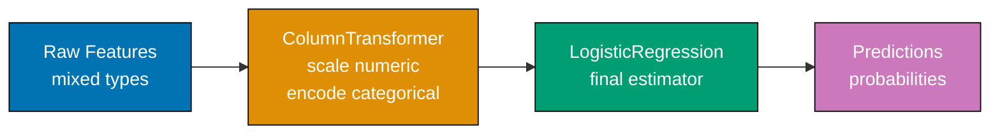

Examples 29 through 57 cover advanced pandas transformations, the polars 1.40.1 API, DuckDB SQL on DataFrames, scikit-learn preprocessing pipelines, and statistical hypothesis testing.

## Example 29: DataFrame.map() — Replacing Deprecated applymap()

pandas 3.0.2 removes `applymap()` and replaces it with `map()` at the DataFrame level. Any code using `df.applymap()` will raise `AttributeError` on import or call.

**Code**:

```python
import pandas as pd    # => pandas 3.0.2 — applymap() is REMOVED

df = pd.DataFrame({
    "price": [10.5, 20.0, 15.75, 8.99],
    "quantity": [3, 1, 5, 12],
    "discount": [0.1, 0.0, 0.15, 0.05],
})

# === WRONG — applymap() is deprecated and removed in pandas 3.0.2 ===
# df.applymap(lambda x: round(x, 1))
# => AttributeError: 'DataFrame' object has no attribute 'applymap'

# === CORRECT — use DataFrame.map() in pandas 3.0.2 ===
df_rounded = df.map(lambda x: round(x, 1))
# => applies lambda to every element in the entire DataFrame
# => price: [10.5, 20.0, 15.8, 9.0], quantity: [3, 1, 5, 12], discount: [0.1, 0.0, 0.1, 0.1]
print(df_rounded)

# === map() with type conversion — format all values as strings ===
df_str = df.map(str)
# => every numeric value becomes a string: "10.5", "3", "0.1", etc.
print(df_str.dtypes)          # => all columns are object dtype

# === map() with conditional logic ===
def flag_value(x):
    # => returns "high" if x > 10, else "low" — applied to every element
    return "high" if isinstance(x, (int, float)) and x > 10 else "low"

df_flagged = df.map(flag_value)
# => "high" where value > 10, "low" otherwise
print(df_flagged)

# === Alternative: apply() for row/column-wise operations (not element-wise) ===
row_sums = df.apply(lambda row: row["price"] * row["quantity"], axis=1)
# => axis=1 applies function to each row; returns Series
# => [31.5, 20.0, 78.75, 107.88]
print(row_sums.round(2).tolist())
```

**Key Takeaway**: Replace every `df.applymap()` call with `df.map()` — the new name is consistent with the Series-level `series.map()` API that already existed.

**Why It Matters**: `applymap()` was renamed to `map()` to unify the API between DataFrame and Series — both now use `map()` for element-wise operations. Any tutorial or Stack Overflow answer written before 2023 will show `applymap()` which is a hard error in pandas 3.x. Knowing the replacement prevents hours of debugging broken notebooks when upgrading environments.

---

## Example 30: pd.col() Expression Syntax — Lazy Column References

pandas 3.0.2 introduces `pd.col()` for lazy column references that support expression-style transformations without immediately evaluating against a specific DataFrame.

**Code**:

```python
import pandas as pd     # => pandas 3.0.2 — pd.col() is new

df = pd.DataFrame({
    "price": [10.5, 20.0, 15.75, 8.99],
    "quantity": [3, 1, 5, 12],
    "tax_rate": [0.1, 0.12, 0.08, 0.15],
})

# === pd.col() creates a lazy column reference ===
price_col = pd.col("price")       # => ColExpr pointing to "price" column, not yet evaluated
qty_col = pd.col("quantity")      # => ColExpr pointing to "quantity" column

# === Build expressions from lazy references ===
revenue_expr = price_col * qty_col   # => ColExpr: price * quantity (lazy)
tax_expr = revenue_expr * pd.col("tax_rate")  # => ColExpr: price * quantity * tax_rate

# === Evaluate expressions against a DataFrame using assign() ===
result = df.assign(
    revenue=revenue_expr,           # => evaluates price * quantity for each row
    tax_amount=tax_expr,            # => evaluates price * quantity * tax_rate for each row
)
print(result["revenue"].tolist())   # => [31.5, 20.0, 78.75, 107.88]
print(result["tax_amount"].round(2).tolist())  # => [3.15, 2.4, 6.3, 16.18]

# === pd.col() enables reusable transformation logic ===
def compute_margin(cost_col_name, revenue_col_name):
    # => factory function that returns a reusable expression
    cost = pd.col(cost_col_name)
    revenue = pd.col(revenue_col_name)
    return (revenue - cost) / revenue  # => margin ratio expression (lazy)

# Apply the reusable expression to any DataFrame with the right columns
df2 = pd.DataFrame({
    "cost": [8.0, 15.0, 12.0, 7.5],
    "revenue": [31.5, 20.0, 78.75, 107.88],
})
margin_expr = compute_margin("cost", "revenue")
df2["margin"] = df2.assign(margin=margin_expr)["margin"]
print(df2["margin"].round(3).tolist())   # => [0.746, 0.25, 0.848, 0.931]
```

**Key Takeaway**: `pd.col()` creates reusable, composable column expressions that can be defined once and applied to any DataFrame with matching column names — enabling functional, DRY transformation logic.

**Why It Matters**: `pd.col()` brings a polars-inspired expression API to pandas, enabling transformation logic to be defined independently of any specific DataFrame. This is particularly valuable in ETL pipelines where the same business logic (e.g., margin calculation) must be applied to multiple tables with different but compatible schemas. It reduces code duplication and makes pipeline logic testable in isolation.

---

## Example 31: apply() vs map() vs Vectorized Operations — Performance

`apply()` is the escape hatch — correct but slow. Vectorized pandas operations are 10-100x faster. Understanding which to use and when prevents performance bottlenecks.

**Code**:

```python
import pandas as pd      # => pandas 3.0.2
import numpy as np       # => numpy 2.4.4
import time

rng = np.random.default_rng(seed=42)
n = 100_000  # => 100k rows to illustrate performance differences
df = pd.DataFrame({
    "x": rng.normal(0, 1, n),
    "y": rng.normal(0, 1, n),
})

# === Method 1: apply() with lambda — slowest ===
# apply() calls Python function once per row — no vectorization
start = time.time()
df["euclidean_apply"] = df.apply(
    lambda row: (row["x"] ** 2 + row["y"] ** 2) ** 0.5,
    axis=1,
)
apply_time = time.time() - start
# => ~0.5-2s for 100k rows — Python overhead per row

# === Method 2: map() on Series — faster than apply for single column ===
start = time.time()
df["x_abs_map"] = df["x"].map(abs)
# => calls abs() on each Series element — still Python level
map_time = time.time() - start
# => ~0.02s — faster but still Python per element

# === Method 3: vectorized operations — fastest ===
start = time.time()
df["euclidean_vec"] = (df["x"] ** 2 + df["y"] ** 2) ** 0.5
# => operates on entire arrays at once via numpy C extension
vec_time = time.time() - start
# => ~0.001s — 100-2000x faster than apply

# === numpy functions are vectorized ===
df["x_abs_np"] = np.abs(df["x"])   # => numpy absolute value on entire array
# => same result as df["x"].map(abs) but 10-50x faster

print(f"apply():     {apply_time:.3f}s")
print(f"map():       {map_time:.4f}s")
print(f"vectorized:  {vec_time:.4f}s")

# === When apply() IS necessary ===
# Only use apply() when no vectorized equivalent exists:
# - Complex multi-column logic that cannot be expressed as array ops
# - Functions from external libraries that don't support arrays
# - Prototyping where performance doesn't matter yet

# Example: apply() for regex that needs multiple groups
import re
df_small = pd.DataFrame({"text": ["apple-1", "banana-2", "cherry-3"]})
df_small["item"] = df_small["text"].str.extract(r"([a-z]+)")  # => vectorized str.extract
# => prefer .str methods over apply for string operations
```

**Key Takeaway**: Default to vectorized pandas/numpy operations; use `apply(axis=1)` only when no vectorized equivalent exists — it is 10-1000x slower due to Python's per-row function call overhead.

**Why It Matters**: A pipeline that works correctly on 10k rows using `apply()` may take 30 minutes on 10M rows. Understanding the performance hierarchy (vectorized > `map()` > `apply()`) lets you make informed trade-offs. The `.str` accessor and numpy universal functions (`np.abs`, `np.log`, `np.exp`) cover 90% of element-wise needs without `apply()`.

---

## Example 32: Pivot Tables — pd.pivot_table

Pivot tables aggregate data from long format into a cross-tabulation with one column as rows, another as columns, and a third as values.

**Code**:

```python
import pandas as pd     # => pandas 3.0.2
import numpy as np      # => numpy 2.4.4

sales = pd.DataFrame({
    "region": ["North", "South", "East", "North", "South", "East", "West", "West"],
    "product": ["A", "A", "A", "B", "B", "B", "A", "B"],
    "quarter": ["Q1", "Q1", "Q1", "Q1", "Q1", "Q1", "Q1", "Q1"],
    "revenue": [12000, 9500, 14000, 7500, 11000, 6500, 8800, 13000],
    "units": [120, 95, 140, 75, 110, 65, 88, 130],
})

# === Basic pivot table — mean revenue by region and product ===
pivot_mean = pd.pivot_table(
    sales,
    values="revenue",      # => column to aggregate
    index="region",        # => becomes row labels
    columns="product",     # => becomes column labels
    aggfunc="mean",        # => aggregation function
)
# =>          A       B
# => East   14000    6500
# => North  12000    7500
# => South   9500   11000
# => West    8800   13000
print(pivot_mean)

# === Multiple aggregation functions ===
pivot_multi = pd.pivot_table(
    sales,
    values="revenue",
    index="region",
    columns="product",
    aggfunc=["sum", "count"],  # => both sum and count
)
print(pivot_multi)

# === Fill NaN in pivot (regions with no sales for a product) ===
pivot_filled = pd.pivot_table(
    sales,
    values="revenue",
    index="region",
    columns="product",
    aggfunc="sum",
    fill_value=0,           # => replace NaN with 0 for missing combinations
)
print(pivot_filled)

# === Add margins (grand totals for rows and columns) ===
pivot_totals = pd.pivot_table(
    sales,
    values="revenue",
    index="region",
    columns="product",
    aggfunc="sum",
    margins=True,           # => adds "All" row and "All" column
    margins_name="Total",   # => label for totals
)
print(pivot_totals)
# => Total column sums across products per region
# => Total row sums across regions per product
```

**Key Takeaway**: Use `pd.pivot_table()` instead of manual `groupby().unstack()` chains — it handles missing combinations, multiple aggregations, and grand totals in a single call.

**Why It Matters**: Pivot tables are the standard output format for business reporting — showing revenue by region × product, user counts by cohort × month, or error rates by service × severity. The `margins=True` parameter adds grand totals that analysts always want but forget to calculate separately. Understanding pivot tables lets you produce executive-ready summary tables directly from raw transaction data.

---

## Example 33: Melt and Stack/Unstack — Wide to Long Reshaping

Data often arrives in wide format (one row per entity, many columns) but analytical functions expect long format (one row per observation). `pd.melt()` handles the conversion.

**Code**:

```python
import pandas as pd    # => pandas 3.0.2

# Wide format: one row per student, columns per subject
wide_df = pd.DataFrame({
    "student_id": [1, 2, 3],
    "math_score": [85, 92, 78],
    "english_score": [76, 88, 91],
    "science_score": [90, 70, 85],
})
print("Wide format:")
print(wide_df)
# => 3 rows, 4 columns — hard to compute stats across subjects

# === pd.melt() — converts wide to long format ===
long_df = pd.melt(
    wide_df,
    id_vars=["student_id"],          # => columns to keep as-is (identifier variables)
    value_vars=["math_score", "english_score", "science_score"],  # => columns to melt
    var_name="subject",              # => new column for former column names
    value_name="score",              # => new column for values
)
print("\nLong format:")
print(long_df)
# => 9 rows (3 students × 3 subjects), 3 columns
# =>  student_id       subject  score
# =>  1          math_score     85
# =>  1       english_score     76
# =>  ...

# Now easy to compute stats by subject
print(long_df.groupby("subject")["score"].mean().round(1))
# => english_score  85.0
# => math_score     85.0
# => science_score  81.7

# Clean up subject names
long_df["subject"] = long_df["subject"].str.replace("_score", "")
# => 'math', 'english', 'science'

# === stack() / unstack() — alternative reshaping via MultiIndex ===
indexed = wide_df.set_index("student_id")  # => student_id as row index
# stack() moves columns to a new innermost row index level
stacked = indexed.stack()                   # => creates a Series with MultiIndex (student_id, col)
print(type(stacked))                        # => pandas.core.series.Series
print(stacked.head(6))

# unstack() reverses: moves innermost index level back to columns
unstacked = stacked.unstack()   # => back to wide format
print(unstacked.equals(indexed))           # => True — round-trip
```

**Key Takeaway**: Use `pd.melt()` to convert wide format to long format before applying `groupby()`, seaborn's `hue`, or any function that expects tidy data with one observation per row.

**Why It Matters**: Most raw data arrives in wide format (spreadsheets, database aggregations). Most analytics functions (seaborn plots, statistical tests, groupby aggregations) expect long "tidy" format. Knowing `pd.melt()` is the bridge that makes the rest of the analytics toolkit usable on real-world data. Tidy data principles from Hadley Wickham's seminal paper are the foundation of the entire pandas/seaborn/R data ecosystem.

---

## Example 34: Window Functions — Rolling, Expanding, EWM

Window functions compute aggregations over a sliding window of rows. They are essential for smoothing time series, computing moving averages, and detecting trends.

**Code**:

```python
import pandas as pd     # => pandas 3.0.2
import numpy as np      # => numpy 2.4.4

rng = np.random.default_rng(seed=42)
dates = pd.date_range("2025-01-01", periods=30, freq="D")  # => 30 daily dates
values = rng.normal(100, 15, 30) + np.linspace(0, 30, 30)  # => trending noisy data

df = pd.DataFrame({"date": dates, "value": values}).set_index("date")

# === Rolling window — fixed-size window ===
df["roll_7d_mean"] = df["value"].rolling(window=7).mean()
# => NaN for first 6 rows (not enough data), then 7-day moving average
# => window=7 means each row uses current + 6 previous rows
print(df[["value", "roll_7d_mean"]].head(10).round(2))

df["roll_7d_std"] = df["value"].rolling(window=7).std()
# => rolling standard deviation — larger = more volatility

# Rolling with min_periods — allow shorter windows at start
df["roll_3d_mean"] = df["value"].rolling(window=7, min_periods=3).mean()
# => uses at least 3 observations — reduces initial NaN rows from 6 to 2

# === Expanding window — grows from start to current row ===
df["cumulative_mean"] = df["value"].expanding().mean()
# => each row = mean of ALL rows from the beginning up to and including that row
# => converges as more data accumulates

df["cumulative_max"] = df["value"].expanding().max()
# => running maximum — useful for "all-time high" tracking

# === Exponentially Weighted Moving Average (EWM) ===
df["ewm_7"] = df["value"].ewm(span=7, adjust=False).mean()
# => span=7 means recent observations have exponentially higher weight
# => more responsive to recent changes than simple rolling mean
# => adjust=False uses online (recursive) formula, not correction factor

print(df.tail(5).round(2))
# => shows last 5 rows with all window computations completed

# === Pairwise rolling correlation ===
# df["rolling_corr"] = df["x"].rolling(30).corr(df["y"])
# => 30-day correlation between two columns — detects regime changes
```

**Key Takeaway**: Use `rolling(window=N)` for fixed-window smoothing, `expanding()` for cumulative statistics that grow with data, and `ewm(span=N)` when you want recent observations to have more weight than older ones.

**Why It Matters**: Raw time series data is noisy — daily sales jump and dip due to weekends, promotions, and random variation. Rolling averages reveal the underlying trend. EWM adapts faster to trend changes than simple rolling averages, making it useful for anomaly detection and forecasting initialization. Expanding windows compute cumulative KPIs (total revenue, running user count) that appear in virtually every analytics dashboard.

---

## Example 35: Time Series Resampling — New Freq Aliases (pandas 3.0.2)

Resampling converts time series from one frequency to another — e.g., daily data to monthly summaries. pandas 3.0.2 changed frequency aliases: `"M"` → `"ME"`, `"Y"` → `"YE"`, `"Q"` → `"QE"`.

**Code**:

```python
import pandas as pd     # => pandas 3.0.2 — CRITICAL: new frequency aliases
import numpy as np      # => numpy 2.4.4

rng = np.random.default_rng(seed=42)
# Daily data for 2 years
daily_dates = pd.date_range("2024-01-01", "2025-12-31", freq="D")
daily_sales = rng.lognormal(7, 0.5, len(daily_dates))  # => realistic sales distribution

ts = pd.Series(daily_sales, index=daily_dates, name="sales")

# === CRITICAL: pandas 3.0.2 frequency aliases ===
# OLD (pandas 2.x, now deprecated/broken):  NEW (pandas 3.0.2):
# "M"  month-end       =>  "ME"
# "Y"  year-end        =>  "YE"
# "Q"  quarter-end     =>  "QE"
# "MS" month-start     =>  "MS"  (unchanged)
# "YS" year-start      =>  "YS"  (unchanged)
# "D"  day             =>  "D"   (unchanged)
# "H"  hour            =>  "h"   (lowercase in 3.x)
# "T"  minute          =>  "min" (in 3.x)

# === Downsample: daily → monthly-end ===
monthly = ts.resample("ME").sum()   # => NOT "M" which is deprecated
# => monthly is a Series with one value per month (last calendar day of each month)
print(f"Monthly entries: {len(monthly)}")   # => 24 months (Jan 2024 - Dec 2025)
print(monthly.head(3).round(0))

# === Downsample with multiple aggregations ===
monthly_stats = ts.resample("ME").agg(["sum", "mean", "max", "count"])
# => DataFrame with sum, mean, max, count columns — one row per month
print(monthly_stats.head(3).round(0))

# === Quarterly aggregation ===
quarterly = ts.resample("QE").sum()   # => NOT "Q"
# => 8 quarters from Q1-2024 to Q4-2025
print(f"Quarterly entries: {len(quarterly)}")  # => 8

# === Annual aggregation ===
annual = ts.resample("YE").sum()    # => NOT "Y"
print(annual)                        # => 2 rows: 2024-12-31, 2025-12-31

# === Upsample: monthly → daily (fills missing with NaN then interpolate) ===
monthly_data = monthly.resample("D").asfreq()     # => daily with NaN gaps
monthly_filled = monthly.resample("D").interpolate(method="time")
# => linear interpolation between month-end values
print(monthly_filled.shape)    # => ~730 rows
```

**Key Takeaway**: Always use `"ME"`, `"QE"`, `"YE"` in pandas 3.0.2 — `"M"`, `"Q"`, `"Y"` raise `FutureWarning` and will become errors; `"H"` and `"T"` become `"h"` and `"min"`.

**Why It Matters**: Time series resampling is the foundation of all trend analysis and reporting. A monthly revenue trend requires daily → monthly aggregation. The frequency alias change is the #1 migration error from pandas 2.x to 3.x and produces cryptic warnings that silently produce wrong date ranges in some cases. Knowing the full alias mapping prevents subtle date-boundary bugs in scheduled reports.

---

## Example 36: Multi-level Indexing — MultiIndex Creation and Slicing

MultiIndex DataFrames use hierarchical row labels — essential for panel data (multiple entities observed over time) and complex pivot results.

**Code**:

```python
import pandas as pd     # => pandas 3.0.2

# === Create MultiIndex from arrays ===
regions = ["North", "North", "South", "South", "East", "East"]
years = [2024, 2025, 2024, 2025, 2024, 2025]
revenues = [120000, 135000, 95000, 102000, 140000, 158000]

idx = pd.MultiIndex.from_arrays(
    [regions, years],           # => list of arrays, one per index level
    names=["region", "year"],   # => names for each level
)
df = pd.DataFrame({"revenue": revenues}, index=idx)
print(df)
# =>                   revenue
# => region year
# => North  2024       120000
# =>        2025       135000
# => South  2024        95000
# ...

# === Slice by outer level ===
north_data = df.loc["North"]           # => both 2024 and 2025 rows for North
# => DataFrame with year as single index
print(north_data)

# === Slice by both levels ===
specific = df.loc[("North", 2025)]     # => tuple for multi-level loc
# => Series or scalar: 135000
print(specific)

# === Cross-section (xs) — slice by inner level across all outer levels ===
data_2024 = df.xs(2024, level="year")   # => all regions for year 2024
# => North: 120000, South: 95000, East: 140000
print(data_2024)

# === Reset MultiIndex to flat columns ===
flat = df.reset_index()
# => columns: region, year, revenue — standard flat DataFrame
print(flat.columns.tolist())   # => ['region', 'year', 'revenue']

# === Create MultiIndex from product (all combinations) ===
from itertools import product as iterproduct
all_idx = pd.MultiIndex.from_product(
    [["North", "South"], [2023, 2024, 2025]],
    names=["region", "year"],
)
template = pd.DataFrame({"revenue": 0}, index=all_idx)
print(template.shape)          # => (6, 1) — 2 regions × 3 years
```

**Key Takeaway**: Use `df.xs(value, level="level_name")` to slice across an inner MultiIndex level, and `df.loc[("outer", "inner")]` for exact cell lookup — both avoid the complexity of boolean masks for hierarchical data.

**Why It Matters**: Panel data (economic indicators, A/B test results across segments and dates) naturally has two-level structure. MultiIndex makes it efficient to compute cross-sectional statistics (all regions in 2024) or time series per entity (North's full history) without filtering. Understanding how to navigate and reset MultiIndex is essential for working with `groupby().unstack()` and `pivot_table()` results.

---

## Example 37: Reading Parquet with PyArrow

Parquet is the standard columnar storage format for analytics. It is 5-20x more storage-efficient than CSV and 10-100x faster to read for columnar queries.

**Code**:

```python
import pandas as pd       # => pandas 3.0.2
import numpy as np        # => numpy 2.4.4

# === Write a DataFrame to Parquet ===
rng = np.random.default_rng(seed=42)
df = pd.DataFrame({
    "id": range(10000),
    "name": [f"user_{i}" for i in range(10000)],
    "score": rng.normal(75, 15, 10000),
    "category": rng.choice(["A", "B", "C", "D"], 10000),
    "timestamp": pd.date_range("2025-01-01", periods=10000, freq="h"),
})

# Write to Parquet — uses pyarrow engine by default
df.to_parquet(
    "data.parquet",
    engine="pyarrow",     # => explicit engine (pyarrow or fastparquet)
    compression="snappy", # => snappy: fast compression with good ratio
    index=True,           # => include DataFrame index in file
)
# => file size ~60KB vs ~600KB for equivalent CSV (10x smaller)

# === Read entire Parquet file ===
df_loaded = pd.read_parquet("data.parquet", engine="pyarrow")
print(df_loaded.shape)    # => (10000, 6) — all rows and columns
print(df_loaded.dtypes)   # => dtypes preserved exactly from original

# === Read only specific columns (columnar advantage) ===
df_subset = pd.read_parquet(
    "data.parquet",
    columns=["id", "score", "category"],  # => only read 3 of 6 columns
)
# => parquet reads ONLY the requested columns from disk — much faster than CSV
print(df_subset.shape)    # => (10000, 3) — only 3 columns loaded

# === Read with row filter (predicate pushdown) ===
df_filtered = pd.read_parquet(
    "data.parquet",
    filters=[("category", "==", "A")],    # => server-side filter — reads less data
)
# => only rows where category == "A" are loaded from disk
print(f"Category A rows: {len(df_filtered)}")  # => ~2500 (25% of 10000)

import os
# os.remove("data.parquet")  # => cleanup for demo
```

**Key Takeaway**: Use Parquet instead of CSV for any dataset you read more than once — column-level compression and columnar layout make subset reads 5-100x faster, and `filters=` enables server-side row filtering before data loads into memory.

**Why It Matters**: CSV files read all columns even when you only need two. A 10GB CSV queried for one column still loads 10GB of data. Parquet's columnar layout reads only the 200MB column you need. This is why every data warehouse (Snowflake, BigQuery, Redshift) stores data in columnar format internally. Learning to write and read Parquet is the single most impactful performance improvement for most analytics pipelines.

---

## Example 38: polars 1.40.1 Basics — API Differences from pandas

polars is a high-performance DataFrame library with a fundamentally different API from pandas. The most critical difference: polars uses `group_by` (not `groupby`).

**Code**:

```python
import polars as pl    # => polars 1.40.1 — NOT pandas! Different API

# === Create a polars DataFrame ===
df = pl.DataFrame({
    "name": ["Alice", "Bob", "Charlie", "Diana", "Eve"],
    "age": [25, 32, 41, 28, 35],
    "salary": [55000, 72000, 85000, 48000, 67000],
    "department": ["Eng", "Mkt", "Eng", "Fin", "Mkt"],
})
print(df)               # => polars renders as a clean table with types
print(df.shape)         # => (5, 4) — same as pandas
print(df.dtypes)        # => [Utf8, Int64, Int64, Utf8] — polars dtype names differ

# === Selecting columns ===
ages = df["age"]            # => polars Series
names_salaries = df.select(["name", "salary"])   # => polars uses select(), not [] for multi
print(type(names_salaries))  # => polars.DataFrame

# === Filtering rows — polars uses filter() not boolean indexing ===
senior = df.filter(pl.col("age") > 30)    # => pl.col() for column references in polars
# => 3 rows: Bob(32), Charlie(41), Eve(35)
print(senior)

# === CRITICAL DIFFERENCE: group_by NOT groupby ===
# pandas: df.groupby("department")["salary"].mean()  # => pandas API
dept_stats = (
    df.group_by("department")              # => polars: group_by (two words with underscore)
    .agg(pl.col("salary").mean().alias("avg_salary"))  # => agg with expression
)
print(dept_stats)
# =>  department  avg_salary
# =>  Eng         70000.0
# =>  Mkt         69500.0
# =>  Fin         48000.0

# === Adding new columns with with_columns() ===
df_extended = df.with_columns(
    (pl.col("salary") / 12).alias("monthly_salary"),  # => new column expression
    pl.col("age").cast(pl.Float32).alias("age_float"),  # => type cast
)
print(df_extended.columns)
# => ['name', 'age', 'salary', 'department', 'monthly_salary', 'age_float']

# === Sort ===
df_sorted = df.sort("salary", descending=True)  # => polars: descending=True (not ascending=False)
print(df_sorted["name"].to_list())  # => ['Charlie', 'Bob', 'Eve', 'Alice', 'Diana']
```

**Key Takeaway**: polars uses `group_by` (not `groupby`), `filter()` (not boolean indexing), `select()` (not `df[[cols]]`), and `with_columns()` (not `df["col"] = ...`) — memorize these four API differences first.

**Why It Matters**: polars is 5-50x faster than pandas for large datasets due to SIMD-accelerated parallel execution and Arrow-native memory layout. It is increasingly used in production data pipelines where pandas hits memory limits. However, the API differences trip up pandas developers who assume the same syntax works. Learning the four key differences (group_by, filter, select, with_columns) enables productive polars use immediately.

---

## Example 39: polars Lazy Evaluation — scan_csv + collect

polars's lazy API defers computation and optimizes the entire query plan before execution — similar to SQL query planning. This is the recommended way to process large files.

**Code**:

```python
import polars as pl    # => polars 1.40.1

# === Eager API (like pandas — immediately executes) ===
df_eager = pl.read_csv("data.csv")          # => reads ALL rows and columns into memory
# => immediate computation, no optimization

# === Lazy API (recommended for large files) ===
lazy_df = pl.scan_csv("data.csv")           # => creates LazyFrame, reads NOTHING yet
# => type is polars.LazyFrame, not DataFrame

# Build the query plan (nothing executes yet)
result_plan = (
    lazy_df
    .filter(pl.col("salary") > 50000)       # => predicate (filter rows, pushed to scan)
    .select(["name", "department", "salary"]) # => projection (only read 3 columns)
    .group_by("department")                  # => aggregation
    .agg(
        pl.col("salary").mean().alias("avg_salary"),
        pl.col("name").count().alias("headcount"),
    )
    .sort("avg_salary", descending=True)    # => sort result
)
# => result_plan is a LazyFrame — query described but NOT executed

# Execute the optimized plan
result = result_plan.collect()              # => .collect() triggers execution
# => polars optimizes: pushes filter to scan (reads fewer rows), projects columns (reads less)
print(type(result))    # => polars.DataFrame
print(result)

# === Explain the query plan ===
print(lazy_df.filter(pl.col("salary") > 50000).explain())
# => shows the optimized execution plan polars will use
# => demonstrates that filter is pushed down to the CSV scanner

# === Streaming for files larger than memory ===
# result_streaming = result_plan.collect(streaming=True)
# => streaming=True processes file in chunks — enables out-of-core computation
```

**Key Takeaway**: Use `pl.scan_csv()` (lazy) instead of `pl.read_csv()` (eager) for files over 100MB — the optimizer pushes filters to the scan and projects only needed columns, reducing memory usage by 50-90%.

**Why It Matters**: The lazy API enables polars to apply transformations that pandas cannot — reading only the filtered rows from a 10GB CSV without loading the full file into memory. The query optimizer (like a SQL query planner) reorders, combines, and eliminates operations for maximum efficiency. This is how polars can process 1-billion-row datasets on a laptop that pandas would exhaust memory on.

---

## Example 40: polars Expressions — str, cast, when/then/otherwise

polars expressions are composable column transformation primitives. They enable complex transformations to be expressed declaratively.

**Code**:

```python
import polars as pl    # => polars 1.40.1

df = pl.DataFrame({
    "name": ["Alice Smith", "BOB JONES", "  charlie  ", "Diana"],
    "age": [25, 32, 41, 28],
    "score_str": ["88.5", "92.0", "invalid", "77.3"],
    "status": [1, 0, 1, 0],
})

# === String expressions ===
df_str = df.with_columns(
    pl.col("name").str.to_lowercase().alias("name_lower"),    # => all lowercase
    pl.col("name").str.strip_chars().alias("name_stripped"),  # => remove leading/trailing whitespace
    pl.col("name").str.split(" ").list.first().alias("first_name"),  # => first word
)
print(df_str.select(["name", "name_lower", "name_stripped", "first_name"]))

# === Type casting ===
df_cast = df.with_columns(
    pl.col("age").cast(pl.Float32).alias("age_float"),   # => int to float
    pl.col("status").cast(pl.Boolean).alias("is_active"),  # => int to bool
)
print(df_cast["is_active"].to_list())   # => [True, False, True, False]

# === Safe string-to-numeric conversion ===
df_score = df.with_columns(
    pl.col("score_str").cast(pl.Float64, strict=False).alias("score"),
    # => strict=False: invalid values become null instead of raising error
)
print(df_score["score"].to_list())     # => [88.5, 92.0, None, 77.3]

# === Conditional logic: when/then/otherwise ===
df_graded = df_score.with_columns(
    pl.when(pl.col("score") >= 90)
    .then(pl.lit("A"))
    .when(pl.col("score") >= 80)
    .then(pl.lit("B"))
    .when(pl.col("score") >= 70)
    .then(pl.lit("C"))
    .otherwise(pl.lit("F"))           # => None/invalid scores get "F"
    .alias("grade"),
)
print(df_graded["grade"].to_list())   # => ['B', 'A', 'F', 'C']
```

**Key Takeaway**: polars `when().then().otherwise()` replaces `np.where()` and `df.apply()` for conditional column creation — it is fully lazy and SIMD-accelerated.

**Why It Matters**: The polars expression system is the language for transforming data in polars pipelines. Unlike pandas's mix of `df["col"] = expr`, `df.apply()`, and `np.where()`, polars provides one unified way to express all transformations. Learning `when/then/otherwise` enables complex conditional logic that chains naturally with the lazy API for fully optimized execution.

---

## Example 41: polars vs pandas Performance — When to Use Each

Understanding when to use polars versus pandas prevents over-engineering and helps select the right tool for each job.

**Code**:

```python
import pandas as pd   # => pandas 3.0.2
import polars as pl   # => polars 1.40.1
import numpy as np    # => numpy 2.4.4
import time

rng = np.random.default_rng(seed=42)
n = 1_000_000  # => 1M rows to show performance differences

# Generate test data
data = {
    "id": range(n),
    "category": rng.choice(["A", "B", "C", "D"], n),
    "value": rng.normal(100, 20, n),
}

# === pandas groupby performance ===
df_pd = pd.DataFrame(data)
start = time.time()
result_pd = df_pd.groupby("category")["value"].agg(["mean", "std", "count"])
pd_time = time.time() - start
# => ~0.5-1.5s for 1M rows on typical hardware

# === polars group_by performance ===
df_pl = pl.DataFrame(data)
start = time.time()
result_pl = df_pl.group_by("category").agg([
    pl.col("value").mean().alias("mean"),
    pl.col("value").std().alias("std"),
    pl.col("value").count().alias("count"),
])
pl_time = time.time() - start
# => ~0.05-0.2s — 5-30x faster due to SIMD parallelism

print(f"pandas: {pd_time:.3f}s, polars: {pl_time:.3f}s")
print(f"polars speedup: {pd_time / pl_time:.1f}x")

# === When to use pandas ===
# - Data is < 1M rows (performance difference negligible)
# - Heavy use of .apply() with custom Python functions (polars can't call Python funcs natively)
# - Integration with sklearn (requires numpy arrays or pandas DataFrames)
# - Existing pandas-heavy codebase (compatibility)
# - Rich ecosystem: .plot(), .style, pd.read_html(), etc.

# === When to use polars ===
# - Data is > 1M rows (SIMD parallelism shows real gains)
# - Reading large CSV/Parquet files (lazy API + predicate pushdown)
# - Memory-constrained environments (Arrow-native, less overhead)
# - Multi-threaded pipelines (polars is thread-safe by design)
# - Expression-based transformations (more composable than pandas)

# === Converting between them ===
pd_from_polars = result_pl.to_pandas()  # => polars DataFrame -> pandas DataFrame
pl_from_pandas = pl.from_pandas(df_pd)  # => pandas DataFrame -> polars DataFrame
print(type(pd_from_polars))  # => pandas.core.frame.DataFrame
print(type(pl_from_pandas))  # => polars.dataframe.frame.DataFrame
```

**Key Takeaway**: Use polars for datasets over 1M rows or when reading large files with selective column/row access; use pandas for sklearn integration, plotting, and datasets under 500k rows where the ecosystem depth outweighs the performance gap.

**Why It Matters**: Choosing the wrong tool creates unnecessary complexity. polars's SIMD parallelism provides real benefits on multi-core machines for large datasets, but the conversion overhead and API learning curve make it overkill for small EDA tasks. The conversion functions (`to_pandas()`, `pl.from_pandas()`) let you use the right tool for each step — polars for ingestion and aggregation, pandas for sklearn and plotting.

---

## Example 42: DuckDB 1.2.x — In-process SQL on DataFrames

DuckDB runs SQL queries directly on pandas DataFrames, polars DataFrames, and Parquet/CSV files without a server — the fastest way to do complex joins and aggregations.

**Code**:

```python
import duckdb       # => duckdb 1.2.x — in-process SQL analytics
import pandas as pd  # => pandas 3.0.2

employees = pd.DataFrame({
    "emp_id": [1, 2, 3, 4, 5],
    "name": ["Alice", "Bob", "Charlie", "Diana", "Eve"],
    "dept_id": [10, 20, 10, 30, 20],
    "salary": [55000, 72000, 85000, 48000, 67000],
})

departments = pd.DataFrame({
    "dept_id": [10, 20, 30],
    "dept_name": ["Engineering", "Marketing", "Finance"],
    "budget": [500000, 300000, 200000],
})

# === Run SQL directly on pandas DataFrames ===
# DuckDB automatically registers DataFrames by variable name
result = duckdb.sql("""
    SELECT
        d.dept_name,
        COUNT(e.emp_id) AS headcount,
        AVG(e.salary) AS avg_salary,
        d.budget,
        d.budget / COUNT(e.emp_id) AS budget_per_head
    FROM employees e
    JOIN departments d ON e.dept_id = d.dept_id
    GROUP BY d.dept_name, d.budget
    ORDER BY avg_salary DESC
""").df()   # => .df() converts DuckDB result to pandas DataFrame
# => result: Engineering(2 emps, avg 70000), Marketing(2 emps, avg 69500), Finance(1 emp, avg 48000)
print(result)

# === Window functions in SQL (often cleaner than pandas) ===
result_window = duckdb.sql("""
    SELECT
        name,
        salary,
        dept_id,
        RANK() OVER (PARTITION BY dept_id ORDER BY salary DESC) AS dept_rank,
        salary - AVG(salary) OVER (PARTITION BY dept_id) AS salary_vs_dept_avg
    FROM employees
""").df()
print(result_window)

# === DuckDB connection for multiple queries ===
con = duckdb.connect()                   # => in-memory database connection
con.register("emp", employees)           # => register pandas DF with custom name
con.register("dept", departments)
result2 = con.execute("SELECT * FROM emp WHERE salary > 60000").df()
print(result2)
```

**Key Takeaway**: Use DuckDB for complex multi-table joins and window functions — SQL is often more readable and 10-100x faster for these operations than equivalent pandas chains.

**Why It Matters**: Many analytics tasks are naturally SQL-shaped — multi-table joins, window functions, CTEs. Doing these in pandas requires verbose merge-groupby-pivot chains that are hard to read and debug. DuckDB brings standard SQL to Python without a server, database setup, or data transfer. It is particularly valuable for analysts transitioning from SQL databases to Python, or for teams where some members are SQL-comfortable but not Python-comfortable.

---

## Example 43: DuckDB Reading Parquet and CSV Directly

DuckDB's file readers query CSV and Parquet files directly without loading them into memory first — enabling SQL on files larger than RAM.

**Code**:

```python
import duckdb       # => duckdb 1.2.x

# === Write sample Parquet files for demo ===
import pandas as pd
import numpy as np

rng = np.random.default_rng(seed=42)
pd.DataFrame({
    "date": pd.date_range("2025-01-01", periods=1000, freq="D"),
    "product": rng.choice(["A", "B", "C"], 1000),
    "region": rng.choice(["North", "South", "East"], 1000),
    "revenue": rng.lognormal(8, 0.5, 1000),
}).to_parquet("sales.parquet")

pd.DataFrame({
    "product": ["A", "B", "C"],
    "product_name": ["Widget", "Gadget", "Gizmo"],
    "cost": [45.0, 68.0, 32.0],
}).to_parquet("products.parquet")

# === Query Parquet files directly — no DataFrame creation needed ===
result = duckdb.sql("""
    SELECT
        product,
        region,
        COUNT(*) AS num_transactions,
        SUM(revenue) AS total_revenue,
        AVG(revenue) AS avg_revenue
    FROM read_parquet('sales.parquet')
    WHERE revenue > 1000
    GROUP BY product, region
    ORDER BY total_revenue DESC
    LIMIT 10
""").df()
print(result.head())

# === Join Parquet files with SQL ===
joined = duckdb.sql("""
    SELECT
        p.product_name,
        s.region,
        SUM(s.revenue) AS revenue,
        SUM(s.revenue) / MAX(p.cost) AS revenue_to_cost_ratio
    FROM read_parquet('sales.parquet') s
    JOIN read_parquet('products.parquet') p ON s.product = p.product
    GROUP BY p.product_name, s.region
""").df()
print(joined)

# === Read CSV directly with type inference ===
# result_csv = duckdb.sql("SELECT * FROM read_csv_auto('data.csv') LIMIT 100").df()
# => read_csv_auto infers column types automatically

# === Use glob pattern to read multiple Parquet files ===
# duckdb.sql("SELECT * FROM read_parquet('data/sales_*.parquet')")
# => reads all files matching pattern as single table (partitioned data lake)

import os
# Cleanup
for f in ["sales.parquet", "products.parquet"]:
    if os.path.exists(f):
        os.remove(f)
```

**Key Takeaway**: Use `duckdb.sql("SELECT ... FROM read_parquet('file.parquet')")` to query files directly — DuckDB streams data from disk and applies filters before loading, enabling SQL on datasets larger than available RAM.

**Why It Matters**: Data lakes store data as Parquet files on disk or object storage (S3, GCS). DuckDB's ability to query these files directly with SQL — including joins across multiple files — without a server or explicit data loading makes it a powerful tool for analytics on large datasets. The combination of Parquet's columnar storage and DuckDB's pushdown filters can query a 100GB dataset in seconds by reading only the relevant columns and rows.

---

## Example 44: Feature Engineering — Binning with pd.cut and pd.qcut

Feature engineering creates informative new variables from raw data. Binning converts continuous values to categorical bins — essential for decision trees, reporting, and cohort analysis.

**Code**:

```python
import pandas as pd    # => pandas 3.0.2
import numpy as np     # => numpy 2.4.4

rng = np.random.default_rng(seed=42)
df = pd.DataFrame({
    "age": rng.integers(18, 75, 500),
    "income": rng.lognormal(10.5, 0.7, 500),
    "score": rng.normal(65, 20, 500).clip(0, 100),
})

# === pd.cut() — equal-width bins based on value ranges ===
df["age_group"] = pd.cut(
    df["age"],
    bins=[18, 30, 45, 60, 75],           # => bin edges
    labels=["18-30", "31-45", "46-60", "61-75"],  # => label per bin
    right=True,                            # => include right edge (default)
    include_lowest=True,                   # => include 18 in first bin
)
print(df["age_group"].value_counts().sort_index())
# => 18-30: ~175, 31-45: ~175, 46-60: ~150 — not equal counts (equal-width)

# === pd.qcut() — quantile-based bins with approximately equal counts ===
df["income_quartile"] = pd.qcut(
    df["income"],
    q=4,                              # => 4 quantile bins (quartiles)
    labels=["Q1", "Q2", "Q3", "Q4"], # => labels from low to high
)
print(df["income_quartile"].value_counts().sort_index())
# => Q1: 125, Q2: 125, Q3: 125, Q4: 125 — exactly equal counts

# === pd.cut() with automatic bins ===
df["score_band"] = pd.cut(df["score"], bins=5)   # => 5 equal-width bins automatically
print(df["score_band"].value_counts().head(3))

# === Use bins for group analysis ===
income_stats = df.groupby("income_quartile", observed=True).agg(
    # => observed=True required for Categorical groupby in pandas 3.x
    avg_score=("score", "mean"),
    count=("score", "count"),
)
print(income_stats)
# => shows whether income quartile correlates with scores

# === Integer bins for compact representation ===
df["score_int"] = pd.cut(
    df["score"],
    bins=[0, 60, 70, 80, 100],
    labels=[0, 1, 2, 3],      # => integer labels for use in models
).astype("Int64")              # => nullable integer for the categorical
print(df["score_int"].value_counts())
```

**Key Takeaway**: Use `pd.cut()` for domain-defined boundaries (age groups, price tiers) and `pd.qcut()` for equal-sample bins (quartiles, deciles) — the choice determines whether bin boundaries or bin sizes are uniform.

**Why It Matters**: Binning is used throughout analytics — customer lifetime value tiers (Q1-Q4), age cohorts for marketing, risk score bands for credit. `pd.qcut()` creates bins with equal numbers of observations (important for statistical validity), while `pd.cut()` creates bins with equal ranges (important when the range boundaries have domain meaning like "18-30 year olds"). Getting this wrong produces misleading cohort analyses.

---

## Example 45: Outlier Detection — IQR Method and Z-Score

Outliers are data points far from the main distribution. They require detection before modeling because they can dominate least-squares regression and distort means.

**Code**:

```python
import pandas as pd     # => pandas 3.0.2
import numpy as np      # => numpy 2.4.4
from scipy import stats # => scipy 1.15.x

rng = np.random.default_rng(seed=42)
normal_data = rng.normal(100, 15, 500)
# Inject obvious outliers
outliers = np.array([250, 300, -50, -80, 400])
all_data = np.concatenate([normal_data, outliers])
df = pd.DataFrame({"value": all_data})

# === Method 1: IQR (Interquartile Range) method ===
Q1 = df["value"].quantile(0.25)   # => 25th percentile ~89
Q3 = df["value"].quantile(0.75)   # => 75th percentile ~111
IQR = Q3 - Q1                     # => IQR ~22 — middle 50% spread
print(f"Q1={Q1:.1f}, Q3={Q3:.1f}, IQR={IQR:.1f}")

lower_fence = Q1 - 1.5 * IQR   # => ~56 — values below here are outliers
upper_fence = Q3 + 1.5 * IQR   # => ~144 — values above here are outliers

iqr_outliers = df[(df["value"] < lower_fence) | (df["value"] > upper_fence)]
print(f"IQR outliers: {len(iqr_outliers)}")  # => 5 (the injected outliers)
print(iqr_outliers["value"].tolist())

# Clean data by removing IQR outliers
df_clean_iqr = df[~((df["value"] < lower_fence) | (df["value"] > upper_fence))]
print(f"Clean rows: {len(df_clean_iqr)}")    # => 500 normal rows remain

# === Method 2: Z-Score method ===
z_scores = np.abs(stats.zscore(df["value"]))  # => absolute z-score per value
# => z-score = (value - mean) / std — how many standard deviations from mean
df["z_score"] = z_scores
z_outliers = df[df["z_score"] > 3]            # => values more than 3 std devs from mean
print(f"Z-score outliers (>3 std): {len(z_outliers)}")  # => 5

# === Clipping instead of removing — preserves row count ===
df["value_clipped"] = df["value"].clip(lower=lower_fence, upper=upper_fence)
# => values outside fences replaced with fence value (not removed)
print(df["value_clipped"].max())     # => ~144 (upper fence)
print(df["value_clipped"].min())     # => ~56 (lower fence)
```

**Key Takeaway**: Use the IQR method (`Q1 - 1.5*IQR` to `Q3 + 1.5*IQR`) for robust outlier detection that is not sensitive to the outliers themselves — unlike Z-scores, which assume normality.

**Why It Matters**: A single data entry error ($300,000 salary instead of $30,000) can skew a regression model's intercept significantly. The IQR method is preferred over Z-scores for skewed distributions because it uses median-based statistics that outliers do not distort. The choice between removing outliers and clipping (winsorizing) depends on context — clipping preserves statistical power while bounding extreme values.

---

## Example 46: Encoding Categorical Variables

Machine learning models require numeric inputs. Categorical variables must be encoded before use in scikit-learn models.

**Code**:

```python
import pandas as pd     # => pandas 3.0.2
import numpy as np      # => numpy 2.4.4
from sklearn.preprocessing import OrdinalEncoder, LabelEncoder   # => scikit-learn 1.8.0

df = pd.DataFrame({
    "size": ["Small", "Large", "Medium", "Small", "Large"],
    "color": ["Red", "Blue", "Red", "Green", "Blue"],
    "priority": ["Low", "High", "Medium", "High", "Low"],
})

# === One-Hot Encoding — pd.get_dummies() ===
# Creates binary (0/1) column per category — suitable for nominal data (no order)
df_ohe = pd.get_dummies(
    df[["color"]],          # => encode color column
    columns=["color"],      # => explicit columns list
    drop_first=True,        # => drop first category to avoid multicollinearity
    dtype=int,              # => 0/1 integers instead of bool
)
print(df_ohe)
# =>  color_Green  color_Red  (color_Blue dropped as reference)
# =>  0            0           (Blue row — both zeros)
# =>  0            1           (Red row)
# ...

# === One-Hot Encoding for multiple columns ===
df_multi_ohe = pd.get_dummies(df[["color", "size"]], drop_first=True, dtype=int)
print(df_multi_ohe.columns.tolist())
# => ['color_Green', 'color_Red', 'size_Medium', 'size_Small']

# === Ordinal Encoding — for ordered categories ===
enc = OrdinalEncoder(
    categories=[["Low", "Medium", "High"]],  # => define order explicitly
)
df["priority_ordinal"] = enc.fit_transform(df[["priority"]])
# => Low=0.0, Medium=1.0, High=2.0 — order preserved
print(df["priority_ordinal"].tolist())   # => [0.0, 2.0, 1.0, 2.0, 0.0]

# === Label Encoding for target variable ===
le = LabelEncoder()
df["size_label"] = le.fit_transform(df["size"])
# => Large=0, Medium=1, Small=2 (alphabetical)
print(df["size_label"].tolist())        # => [2, 0, 1, 2, 0]
print(le.classes_)                      # => ['Large' 'Medium' 'Small']

# Note: OrdinalEncoder for features, LabelEncoder for target only
```

**Key Takeaway**: Use `pd.get_dummies(drop_first=True)` for nominal categorical features (no natural order), and `OrdinalEncoder(categories=[...])` for ordinal features (size S/M/L, priority Low/High) — using one-hot encoding for ordinal data discards the ordering information.

**Why It Matters**: Encoding choice directly affects model performance. Tree-based models (Random Forest, XGBoost) work well with ordinal encoding even for nominal variables. Linear models require one-hot encoding to avoid imposing false order (encoding Blue=1, Red=2, Green=3 would tell the model that Green is "more" than Blue). `drop_first=True` eliminates the dummy variable trap (perfect multicollinearity) that breaks linear regression.

---

## Example 47: Scaling Features — StandardScaler and MinMaxScaler

Feature scaling normalizes numeric ranges so that distance-based models (SVM, KNN) and gradient descent algorithms (logistic regression) are not dominated by high-magnitude features.

**Code**:

```python
import pandas as pd        # => pandas 3.0.2
import numpy as np         # => numpy 2.4.4
from sklearn.preprocessing import StandardScaler, MinMaxScaler  # => scikit-learn 1.8.0

df = pd.DataFrame({
    "age": [25, 32, 41, 28, 55, 48],
    "salary": [45000, 72000, 95000, 52000, 110000, 87000],
    "score": [78, 92, 65, 83, 71, 88],
})

# === StandardScaler — zero mean, unit variance (Z-score normalization) ===
# Formula: (x - mean) / std
std_scaler = StandardScaler()
scaled_std = std_scaler.fit_transform(df[["age", "salary", "score"]])
# => .fit_transform() computes mean/std then applies transformation
# => returns numpy array

df_std = pd.DataFrame(scaled_std, columns=["age_std", "salary_std", "score_std"])
print(df_std.round(3))
# => age_std column: values centered around 0, spread ~1 std
print(f"age_std mean: {df_std['age_std'].mean():.6f}")  # => ~0.0 (near zero)
print(f"age_std std:  {df_std['age_std'].std():.6f}")   # => ~1.0

# StandardScaler preserves the learned parameters for transforming new data
mean_age = std_scaler.mean_[0]   # => ~38.2 (mean of training age)
std_age = std_scaler.scale_[0]   # => ~10.5 (std of training age)

# === MinMaxScaler — scales to [0, 1] range ===
# Formula: (x - min) / (max - min)
mm_scaler = MinMaxScaler(feature_range=(0, 1))
scaled_mm = mm_scaler.fit_transform(df[["age", "salary", "score"]])
df_mm = pd.DataFrame(scaled_mm, columns=["age_mm", "salary_mm", "score_mm"])

print(df_mm.round(3))
print(f"age_mm range: [{df_mm['age_mm'].min():.2f}, {df_mm['age_mm'].max():.2f}]")
# => [0.00, 1.00] — age is now [0, 1]

# === Apply to test data using ONLY training statistics ===
# CRITICAL: fit() once on TRAINING data, transform() on both train and test
test_df = pd.DataFrame({"age": [30], "salary": [65000], "score": [80]})
test_scaled = std_scaler.transform(test_df[["age", "salary", "score"]])
# => uses mean/std learned from training data — no re-fitting on test set
print(test_scaled.round(3))
```

**Key Takeaway**: Fit scalers on training data only (`scaler.fit(X_train)`) and then apply to both train and test (`scaler.transform(X_train)`, `scaler.transform(X_test)`) — never fit on test data as it leaks future information into the model.

**Why It Matters**: Feature scaling is non-optional for logistic regression, SVM, KNN, and neural networks — without it, a feature with values in [0, 100000] dominates features in [0, 1] despite potentially being less informative. StandardScaler works better when the distribution is roughly Gaussian; MinMaxScaler works better when you need a strict [0, 1] bound (neural network inputs). The train-only fitting rule is a critical discipline for avoiding data leakage.

---

## Example 48: scikit-learn Pipeline — Preprocessing + Model in One Object

Pipelines chain preprocessing steps and a final estimator into a single object that can be trained, evaluated, and deployed as one unit — preventing data leakage and simplifying code.



**Code**:

```python
import pandas as pd                            # => pandas 3.0.2
import numpy as np                             # => numpy 2.4.4
from sklearn.pipeline import Pipeline          # => scikit-learn 1.8.0
from sklearn.preprocessing import StandardScaler, OneHotEncoder
from sklearn.compose import ColumnTransformer
from sklearn.linear_model import LogisticRegression
from sklearn.model_selection import train_test_split

# Sample dataset
rng = np.random.default_rng(seed=42)
n = 500
df = pd.DataFrame({
    "age": rng.integers(22, 65, n),
    "salary": rng.normal(65000, 20000, n),
    "department": rng.choice(["Eng", "Mkt", "Fin"], n),
    "churn": rng.choice([0, 1], n, p=[0.75, 0.25]),
})

X = df.drop(columns=["churn"])
y = df["churn"]

X_train, X_test, y_train, y_test = train_test_split(
    X, y, test_size=0.2, random_state=42, stratify=y,
)
# => stratify=y preserves class proportions in each split

# === ColumnTransformer — different preprocessing per column type ===
numeric_features = ["age", "salary"]
categorical_features = ["department"]

preprocessor = ColumnTransformer([
    ("num", StandardScaler(), numeric_features),        # => scale numerics
    ("cat", OneHotEncoder(drop="first", sparse_output=False), categorical_features),
    # => one-hot encode categoricals, drop first category
])

# === Pipeline — preprocessor + model in one object ===
pipe = Pipeline([
    ("prep", preprocessor),              # => step 1: transform features
    ("clf", LogisticRegression(max_iter=1000)),  # => step 2: fit model
])

# === Train: preprocessor.fit + model.fit in one call ===
pipe.fit(X_train, y_train)
# => preprocessor fits on X_train (learns mean/std, category levels)
# => model fits on transformed X_train

# === Evaluate: preprocessor.transform + model.predict in one call ===
accuracy = pipe.score(X_test, y_test)
# => transforms X_test using TRAINING statistics, then predicts
print(f"Test accuracy: {accuracy:.3f}")   # => typically ~0.75

y_pred = pipe.predict(X_test)           # => class predictions [0, 1, ...]
y_proba = pipe.predict_proba(X_test)[:, 1]  # => churn probability per row
```

**Key Takeaway**: Always wrap preprocessing + model in a `Pipeline` — it guarantees that test data is transformed using only training statistics, preventing the most common form of data leakage.

**Why It Matters**: Without a Pipeline, it is easy to accidentally `fit_transform()` the scaler on the full dataset before splitting, leaking test information into training. Pipeline enforces the correct flow: fit only on training data, transform both. It also makes the entire preprocessing + model a single deployable object — `joblib.dump(pipe, "model.pkl")` saves everything needed for production inference.

---

## Example 49: scikit-learn set_output — pandas-native Pipeline Output

scikit-learn 1.8.0 introduces `set_output(transform="pandas")` which makes transformers return pandas DataFrames instead of numpy arrays — preserving column names throughout the pipeline.

**Code**:

```python
import pandas as pd                            # => pandas 3.0.2
import numpy as np                             # => numpy 2.4.4
from sklearn.preprocessing import StandardScaler, OneHotEncoder
from sklearn.compose import ColumnTransformer
from sklearn.pipeline import Pipeline
from sklearn.linear_model import LogisticRegression

rng = np.random.default_rng(seed=42)
df = pd.DataFrame({
    "age": rng.integers(22, 65, 100),
    "salary": rng.normal(65000, 20000, 100),
    "department": rng.choice(["Eng", "Mkt", "Fin"], 100),
})

numeric_features = ["age", "salary"]
categorical_features = ["department"]

# === Without set_output: returns numpy array (no column names) ===
scaler_default = StandardScaler()
arr = scaler_default.fit_transform(df[numeric_features])
print(type(arr))                 # => <class 'numpy.ndarray'>
print(arr.shape)                 # => (100, 2) — no column names!

# === With set_output("pandas"): returns pandas DataFrame with column names ===
scaler_pandas = StandardScaler().set_output(transform="pandas")
df_scaled = scaler_pandas.fit_transform(df[numeric_features])
print(type(df_scaled))           # => <class 'pandas.core.frame.DataFrame'>
print(df_scaled.columns.tolist())  # => ['age', 'salary'] — column names preserved!

# === Apply to ColumnTransformer — all steps return pandas ===
preprocessor = ColumnTransformer([
    ("num", StandardScaler(), numeric_features),
    ("cat", OneHotEncoder(drop="first", sparse_output=False), categorical_features),
]).set_output(transform="pandas")
# => set_output on ColumnTransformer propagates to all child transformers

df_transformed = preprocessor.fit_transform(df)
print(type(df_transformed))               # => pandas.DataFrame
print(df_transformed.columns.tolist())
# => ['num__age', 'num__salary', 'cat__department_Mkt', 'cat__department_Eng']
# => ColumnTransformer prefixes column names with step name

# === In a full Pipeline ===
pipe = Pipeline([
    ("prep", preprocessor),
    ("clf", LogisticRegression()),
]).set_output(transform="pandas")

# Accessing intermediate outputs with set_output
from sklearn.model_selection import train_test_split
X = df
y = rng.choice([0, 1], 100)
X_train, X_test, y_train, y_test = train_test_split(X, y, test_size=0.2, random_state=42)
pipe.fit(X_train, y_train)
print(f"Score: {pipe.score(X_test, y_test):.3f}")
```

**Key Takeaway**: Call `.set_output(transform="pandas")` on any scikit-learn transformer or `ColumnTransformer` to get named DataFrames back instead of anonymous numpy arrays — essential for debugging transformations and inspecting feature names.

**Why It Matters**: Without `set_output`, intermediate pipeline outputs lose column names, making it impossible to inspect which features the model actually used. This breaks feature importance analysis, SHAP explanations, and debugging. scikit-learn 1.8.0's `set_output` solves this systematically — it is now the recommended way to build interpretable pipelines.

---

## Example 50: Train/Test Split — Stratification and Random State

Correct train/test splits are the foundation of valid model evaluation. Stratification ensures class balance in both sets; random state ensures reproducibility.

**Code**:

```python
import pandas as pd     # => pandas 3.0.2
import numpy as np      # => numpy 2.4.4
from sklearn.model_selection import train_test_split  # => scikit-learn 1.8.0

rng = np.random.default_rng(seed=42)
n = 1000
df = pd.DataFrame({
    "feature1": rng.normal(0, 1, n),
    "feature2": rng.normal(5, 2, n),
    "target": rng.choice([0, 1, 2], n, p=[0.6, 0.3, 0.1]),  # => imbalanced 3-class
})

X = df[["feature1", "feature2"]]
y = df["target"]

print(f"Overall class distribution:\n{y.value_counts(normalize=True).round(3)}")
# => 0: 0.600, 1: 0.300, 2: 0.100

# === Without stratification — class balance may differ ===
X_train_raw, X_test_raw, y_train_raw, y_test_raw = train_test_split(
    X, y, test_size=0.2, random_state=42
)
print(f"\nTest without stratify:\n{y_test_raw.value_counts(normalize=True).round(3)}")
# => may show slightly different proportions due to random chance

# === With stratification — ensures class proportions are preserved ===
X_train, X_test, y_train, y_test = train_test_split(
    X, y,
    test_size=0.2,       # => 20% test, 80% train
    random_state=42,     # => reproducible split — same result every time
    stratify=y,          # => preserves class proportions in both sets
)
print(f"\nTest with stratify:\n{y_test.value_counts(normalize=True).round(3)}")
# => 0: 0.600, 1: 0.300, 2: 0.100 — matches original distribution

print(f"\nSplit sizes: train={len(X_train)}, test={len(X_test)}")
# => train=800, test=200

# === Validate no data leakage between sets ===
train_indices = set(X_train.index)
test_indices = set(X_test.index)
print(f"Index overlap: {len(train_indices & test_indices)}")  # => 0 — no overlap

# === Multi-output stratification (for multiple targets) ===
# from sklearn.model_selection import StratifiedShuffleSplit
# sss = StratifiedShuffleSplit(n_splits=1, test_size=0.2, random_state=42)
```

**Key Takeaway**: Always use `stratify=y` when your target variable has imbalanced classes — without it, the minority class (2: 10% overall) might have 0-3% representation in the test set, making evaluation unreliable.

**Why It Matters**: A test set with no examples of the minority class produces a trivially high accuracy for any model that never predicts that class. Stratification guarantees that the test set reflects the production distribution, making the evaluation score predictive of real-world performance. The `random_state` parameter is essential for reproducible experiments — same split every run enables fair comparison between models.

---

## Example 51: Cross-Validation — cross_val_score and StratifiedKFold

Cross-validation provides a reliable estimate of model performance by training and evaluating on multiple data folds — more reliable than a single train/test split.

**Code**:

```python
import numpy as np     # => numpy 2.4.4
from sklearn.datasets import make_classification   # => scikit-learn 1.8.0
from sklearn.model_selection import cross_val_score, StratifiedKFold, cross_validate
from sklearn.linear_model import LogisticRegression
from sklearn.preprocessing import StandardScaler
from sklearn.pipeline import Pipeline

# Generate classification dataset
X, y = make_classification(
    n_samples=500, n_features=10, n_informative=5,
    n_classes=2, weights=[0.7, 0.3], random_state=42,
)
# => X: (500, 10) array, y: (500,) binary labels with 70/30 class split

# === Simple cross_val_score ===
pipe = Pipeline([
    ("scaler", StandardScaler()),
    ("clf", LogisticRegression(random_state=42)),
])

cv_scores = cross_val_score(
    pipe, X, y,
    cv=5,                    # => 5-fold cross-validation
    scoring="accuracy",      # => metric to compute
    n_jobs=-1,               # => use all CPU cores in parallel
)
print(f"CV accuracy per fold: {cv_scores.round(3)}")
# => e.g., [0.780, 0.760, 0.800, 0.820, 0.790]
print(f"Mean: {cv_scores.mean():.3f} ± {cv_scores.std():.3f}")
# => Mean: 0.790 ± 0.019 — stable across folds (low variance)

# === StratifiedKFold — preserves class proportions in each fold ===
skf = StratifiedKFold(n_splits=5, shuffle=True, random_state=42)
# => shuffle=True randomizes order before splitting
# => stratify ensures minority class appears in all folds

cv_stratified = cross_val_score(pipe, X, y, cv=skf, scoring="roc_auc")
print(f"\nStratified CV ROC-AUC: {cv_stratified.round(3)}")
print(f"Mean ROC-AUC: {cv_stratified.mean():.3f} ± {cv_stratified.std():.3f}")

# === cross_validate — multiple metrics at once ===
results = cross_validate(
    pipe, X, y, cv=skf,
    scoring=["accuracy", "precision", "recall", "f1"],
    return_train_score=True,   # => also compute training score per fold
)
print("\nTest scores:")
for metric in ["accuracy", "precision", "recall", "f1"]:
    scores = results[f"test_{metric}"]
    print(f"  {metric}: {scores.mean():.3f} ± {scores.std():.3f}")

# === Detect overfitting: compare train vs test scores ===
train_acc = results["train_accuracy"].mean()
test_acc = results["test_accuracy"].mean()
gap = train_acc - test_acc
print(f"\nTrain-Test gap: {gap:.3f}")  # => small gap = good generalization
```

**Key Takeaway**: Report CV results as `mean ± std` across folds — the standard deviation reveals whether model performance is stable or varies dramatically depending on which 20% becomes the test set.

**Why It Matters**: A single train/test split is a high-variance estimate — you might get lucky or unlucky with which observations end up in the test set. Cross-validation averages over multiple splits, reducing this variance. The train-test gap detects overfitting (high train accuracy, low test accuracy). Using `StratifiedKFold` ensures each fold has the same class distribution as the full dataset.

---

## Example 52: plotly Interactive Charts — px.scatter, px.line, px.bar

plotly produces interactive charts where users can hover, zoom, and filter — essential for dashboards and web-based reports.

**Code**:

```python
import plotly.express as px     # => plotly 6.x express API
import plotly.graph_objects as go  # => plotly low-level API
import pandas as pd              # => pandas 3.0.2
import numpy as np               # => numpy 2.4.4

rng = np.random.default_rng(seed=42)
n = 200
df = pd.DataFrame({
    "experience": rng.integers(1, 15, n),
    "salary": rng.integers(40000, 130000, n),
    "department": rng.choice(["Engineering", "Marketing", "Finance"], n),
    "performance": rng.normal(75, 15, n).clip(0, 100).round(1),
    "name": [f"Employee_{i}" for i in range(n)],
})
# Make salary correlate with experience
df["salary"] = (df["salary"] + df["experience"] * 3000).clip(40000, 150000)

# === Interactive scatter plot ===
fig_scatter = px.scatter(
    df,
    x="experience",            # => x-axis
    y="salary",                # => y-axis
    color="department",        # => color-code points by department
    hover_data=["name", "performance"],  # => show in hover tooltip
    color_discrete_map={       # => accessible color palette
        "Engineering": "#0173B2",
        "Marketing": "#DE8F05",
        "Finance": "#029E73",
    },
    title="Salary vs Experience by Department",
    labels={"experience": "Years of Experience", "salary": "Annual Salary ($)"},
    trendline="ols",           # => add OLS regression trendline
)
# fig_scatter.show()  # => opens in browser with interactive controls

# === Interactive line chart for time series ===
dates = pd.date_range("2024-01-01", periods=24, freq="ME")  # => "ME" not "M" in pandas 3.0.2
monthly_df = pd.DataFrame({
    "date": dates.tolist() * 3,
    "revenue": rng.lognormal(11, 0.3, 72),
    "department": ["Engineering"] * 24 + ["Marketing"] * 24 + ["Finance"] * 24,
})
fig_line = px.line(
    monthly_df,
    x="date", y="revenue", color="department",
    color_discrete_map={"Engineering": "#0173B2", "Marketing": "#DE8F05", "Finance": "#029E73"},
    title="Monthly Revenue by Department",
)
# fig_line.show()

# === Interactive bar chart ===
dept_summary = df.groupby("department")["salary"].mean().reset_index()
fig_bar = px.bar(
    dept_summary,
    x="department", y="salary",
    color="department",
    color_discrete_map={"Engineering": "#0173B2", "Marketing": "#DE8F05", "Finance": "#029E73"},
    title="Average Salary by Department",
    text_auto=".0f",     # => show value labels on bars
)
# fig_bar.show()

# === Save as HTML file (self-contained interactive) ===
# fig_scatter.write_html("scatter.html")
print("plotly charts created (call .show() to display)")
```

**Key Takeaway**: Use `plotly.express` (px) for data-driven interactive charts with minimal code, and add `hover_data=[...]` to display additional context on mouse hover — this replaces annotation clutter in static charts.

**Why It Matters**: Interactive charts transform exploratory data analysis — clicking on a data point to see its attributes, zooming into dense regions, and toggling legend items reveals insights that static matplotlib cannot. For stakeholder presentations in notebooks or web apps, plotly HTML files are self-contained and shareable. The `trendline="ols"` parameter adds a regression line without any additional code.

---

## Example 53: plotly Subplots — Multiple Chart Types in One Figure

Complex dashboards require multiple charts in a grid layout. plotly's `make_subplots()` creates multi-panel figures with different chart types.

**Code**:

```python
import plotly.graph_objects as go    # => plotly 6.x low-level API
from plotly.subplots import make_subplots
import pandas as pd                   # => pandas 3.0.2
import numpy as np                    # => numpy 2.4.4

rng = np.random.default_rng(seed=42)
df = pd.DataFrame({
    "category": ["A", "B", "C", "D"],
    "revenue": [120000, 95000, 140000, 88000],
    "growth": [0.15, -0.05, 0.22, 0.08],
})
time_series = pd.DataFrame({
    "month": range(1, 13),
    "sales": rng.lognormal(10, 0.3, 12),
})
scatter_df = pd.DataFrame({
    "x": rng.normal(0, 1, 100),
    "y": rng.normal(0, 1, 100),
})

# === Create 2x2 subplot grid ===
fig = make_subplots(
    rows=2, cols=2,          # => 2 rows, 2 columns
    subplot_titles=[         # => title per subplot cell
        "Revenue by Category",
        "Monthly Sales Trend",
        "Scatter Distribution",
        "Growth Rate",
    ],
    specs=[                  # => chart type spec per cell
        [{"type": "bar"}, {"type": "scatter"}],
        [{"type": "scatter"}, {"type": "bar"}],
    ],
)

# === Add bar chart to row=1, col=1 ===
fig.add_trace(
    go.Bar(
        x=df["category"], y=df["revenue"],
        marker_color="#0173B2",
        name="Revenue",
    ),
    row=1, col=1,   # => place in first cell
)

# === Add line chart to row=1, col=2 ===
fig.add_trace(
    go.Scatter(
        x=time_series["month"], y=time_series["sales"],
        mode="lines+markers",
        line=dict(color="#DE8F05", width=2),
        name="Monthly Sales",
    ),
    row=1, col=2,
)

# === Add scatter to row=2, col=1 ===
fig.add_trace(
    go.Scatter(
        x=scatter_df["x"], y=scatter_df["y"],
        mode="markers",
        marker=dict(color="#029E73", size=5, opacity=0.7),
        name="Distribution",
    ),
    row=2, col=1,
)

# === Add growth bar to row=2, col=2 ===
colors = ["#0173B2" if g > 0 else "#DE8F05" for g in df["growth"]]
fig.add_trace(
    go.Bar(x=df["category"], y=df["growth"], marker_color=colors, name="Growth"),
    row=2, col=2,
)

fig.update_layout(
    height=600,          # => total figure height in pixels
    showlegend=False,    # => hide legend for cleaner dashboard look
    title_text="Analytics Dashboard",
)
# fig.show()
print("Dashboard figure created")
```

**Key Takeaway**: Use `make_subplots(rows=2, cols=2, specs=...)` to create multi-panel dashboards where each panel can have a different chart type — this is more flexible than matplotlib's `plt.subplots()`.

**Why It Matters**: Production dashboards require multiple coordinated views of the same data — a trend line, a distribution, a comparison, and a detail table. plotly's `make_subplots` enables this in a single interactive figure that can be embedded in a web app or shared as an HTML file. The `specs=` parameter allows mixing bar, scatter, map, and indicator chart types in a single layout.

---

## Example 54: seaborn objects Interface — sns.objects (0.13.2)

seaborn 0.13.2 introduces a new high-level `so.Plot` API inspired by R's ggplot2. It is more composable than the function-based API.

**Code**:

```python
import seaborn.objects as so   # => seaborn 0.13.2 objects interface
import seaborn as sns           # => seaborn 0.13.2 function interface (still usable)
import matplotlib.pyplot as plt # => matplotlib 3.10.x
import pandas as pd             # => pandas 3.0.2
import numpy as np              # => numpy 2.4.4

rng = np.random.default_rng(seed=42)
n = 200
df = pd.DataFrame({
    "experience": rng.integers(1, 15, n),
    "salary": rng.normal(65000, 20000, n).clip(30000, 150000),
    "department": rng.choice(["Eng", "Mkt", "Fin"], n),
    "performance": rng.normal(75, 12, n).clip(0, 100),
})

# === so.Plot API — composable layer system ===
# So.Plot defines the mapping of data to aesthetics
# .add() layers specify what marks to draw

# Scatter plot with regression line
p = (
    so.Plot(df, x="experience", y="salary", color="department")
    .add(so.Dot(alpha=0.6, pointsize=5))    # => dot layer
    .add(so.Line(), so.PolyFit(order=1))    # => linear regression line per department
    .scale(color={                           # => explicit color mapping
        "Eng": "#0173B2",
        "Mkt": "#DE8F05",
        "Fin": "#029E73",
    })
    .label(title="Salary vs Experience", x="Years of Experience", y="Annual Salary ($)")
)
# p.show()  # => display in interactive session

# === Faceted plots (separate subplot per department) ===
p_faceted = (
    so.Plot(df, x="performance", y="salary")
    .add(so.Dot(color="#0173B2", alpha=0.5, pointsize=4))
    .add(so.Line(color="#DE8F05"), so.PolyFit())   # => regression per facet
    .facet(col="department")                        # => one column per department
    .label(title="Salary vs Performance by Department")
)
# p_faceted.show()

# === Combined distribution view ===
p_dist = (
    so.Plot(df, x="salary", color="department")
    .add(so.Area(), so.KDE())      # => kernel density estimate as shaded area
    .scale(color={"Eng": "#0173B2", "Mkt": "#DE8F05", "Fin": "#029E73"})
    .label(title="Salary Distribution by Department", x="Salary ($)")
)
# p_dist.show()

print("seaborn objects plots created")
plt.close("all")
```

**Key Takeaway**: The `so.Plot(...).add(so.Mark(), so.Stat())` pattern separates data mapping from geometric representation and statistical transformation — enabling arbitrary combinations without separate function calls for each chart type.

**Why It Matters**: The traditional seaborn API has one function per chart type (`sns.scatterplot`, `sns.lineplot`, etc.). The new `so.Plot` API composes marks and statistics, enabling charts that combine scatter + regression + confidence band in three `.add()` calls. This matches R's ggplot2's "grammar of graphics" philosophy, making complex multi-layer visualizations possible without writing any matplotlib code.

---

## Example 55: Statistical Testing — scipy.stats.ttest_ind

Hypothesis testing quantifies whether an observed difference between two groups is statistically significant or likely due to chance.

**Code**:

```python
import numpy as np           # => numpy 2.4.4
from scipy import stats      # => scipy 1.15.x
import pandas as pd          # => pandas 3.0.2

rng = np.random.default_rng(seed=42)

# Two salary groups — test if Engineering earns significantly more than Marketing
eng_salaries = rng.normal(75000, 12000, 50)   # => n=50 Engineering employees
mkt_salaries = rng.normal(65000, 10000, 45)   # => n=45 Marketing employees

# === Two-sample independent t-test ===
t_stat, p_value = stats.ttest_ind(
    eng_salaries,
    mkt_salaries,
    equal_var=False,   # => Welch's t-test — does NOT assume equal variances (safer)
    alternative="two-sided",  # => test for difference in EITHER direction
)
print(f"t-statistic: {t_stat:.3f}")   # => positive means eng > mkt
print(f"p-value: {p_value:.4f}")       # => e.g., 0.0023 — less than 0.05 threshold

# === Interpret the result ===
alpha = 0.05
if p_value < alpha:
    print(f"SIGNIFICANT: p={p_value:.4f} < {alpha}")
    print("Reject H0: Engineering and Marketing salaries are statistically different")
else:
    print(f"NOT significant: p={p_value:.4f} >= {alpha}")
    print("Fail to reject H0: No significant difference detected")

# === Effect size — Cohen's d ===
# p-value tells significance but NOT magnitude of difference
pooled_std = np.sqrt(
    (eng_salaries.std() ** 2 + mkt_salaries.std() ** 2) / 2
)
cohens_d = (eng_salaries.mean() - mkt_salaries.mean()) / pooled_std
# => d < 0.2: small, d < 0.5: medium, d < 0.8: large
print(f"Cohen's d: {cohens_d:.2f}")    # => e.g., 0.89 — large effect size

# === Confidence interval for the mean difference ===
diff = eng_salaries.mean() - mkt_salaries.mean()
se = np.sqrt(eng_salaries.var() / len(eng_salaries) + mkt_salaries.var() / len(mkt_salaries))
ci_low = diff - 1.96 * se       # => 95% CI lower bound
ci_high = diff + 1.96 * se      # => 95% CI upper bound
print(f"95% CI for difference: [{ci_low:,.0f}, {ci_high:,.0f}]")
# => e.g., [3,200, 16,800] — Engineering earns $3.2k-$16.8k more on average
```

**Key Takeaway**: Always compute and report effect size (Cohen's d) alongside the p-value — a statistically significant result with d=0.05 is practically meaningless, while a non-significant result with d=0.8 in a small sample deserves further investigation with more data.

**Why It Matters**: Statistical significance (p < 0.05) is not practical significance. With large enough samples, trivial differences (Engineering earns $200 more/year) become statistically significant. Cohen's d contextualizes the magnitude. Confidence intervals show the plausible range, which is often more actionable than a binary "significant/not" decision. These distinctions are essential for rigorous A/B test analysis and compensation equity studies.

---

## Example 56: Chi-Square Test — Categorical Independence

The chi-square test of independence determines whether two categorical variables are statistically associated or independent.

**Code**:

```python
import numpy as np           # => numpy 2.4.4
from scipy import stats      # => scipy 1.15.x
import pandas as pd          # => pandas 3.0.2

# Observed data: promotion rates by department
# Question: Is promotion rate independent of department?
data = pd.DataFrame({
    "department": ["Engineering"] * 100 + ["Marketing"] * 80 + ["Finance"] * 70,
    "promoted": (
        [1] * 35 + [0] * 65 +   # => 35% Engineering promoted
        [1] * 20 + [0] * 60 +   # => 25% Marketing promoted
        [1] * 25 + [0] * 45     # => 36% Finance promoted
    ),
})

# === Create contingency table ===
contingency = pd.crosstab(
    data["department"],   # => rows
    data["promoted"],     # => columns
    rownames=["Department"],
    colnames=["Promoted"],
)
# =>                 Promoted  0   1
# => Department
# => Engineering           65  35
# => Finance               45  25
# => Marketing             60  20
print(contingency)

# === Chi-square test of independence ===
chi2_stat, p_value, dof, expected = stats.chi2_contingency(contingency)
# => chi2_stat: test statistic
# => p_value: probability of observed distribution under independence assumption
# => dof: degrees of freedom = (rows-1) * (cols-1)
# => expected: expected cell counts if variables were truly independent

print(f"\nChi-square statistic: {chi2_stat:.3f}")
print(f"Degrees of freedom: {dof}")       # => (3-1)*(2-1) = 2
print(f"p-value: {p_value:.4f}")

alpha = 0.05
if p_value < alpha:
    print(f"SIGNIFICANT (p={p_value:.4f}): Department and promotion are NOT independent")
else:
    print(f"NOT significant: Cannot reject independence of department and promotion")

# === Expected counts (under independence assumption) ===
expected_df = pd.DataFrame(
    expected.round(1),
    index=contingency.index,
    columns=contingency.columns,
)
print("\nExpected counts:")
print(expected_df)

# === Cramér's V — effect size for chi-square ===
n = len(data)                           # => total observations
cramers_v = np.sqrt(chi2_stat / (n * min(contingency.shape[0]-1, contingency.shape[1]-1)))
# => V = 0: no association, V = 1: perfect association
print(f"Cramér's V: {cramers_v:.3f}")   # => e.g., 0.19 — weak association
```

**Key Takeaway**: After rejecting independence with chi-square, compute Cramér's V to quantify association strength — a V of 0.1 is weak, 0.3 is moderate, 0.5+ is strong, regardless of sample size.

**Why It Matters**: Chi-square tests are the standard tool for HR analytics (is gender associated with promotion rate?), marketing (is campaign type independent of conversion?), and quality control (is defect rate independent of production line?). Without effect size (Cramér's V), a statistically significant result in a large dataset might represent a 0.1% difference that is operationally irrelevant. Combining p-value and effect size gives the full picture.

---

## Example 57: Correlation Analysis — Pearson and Spearman

Pearson correlation measures linear relationships; Spearman measures monotonic relationships. Choosing the wrong one produces misleading correlation coefficients.

**Code**:

```python
import numpy as np           # => numpy 2.4.4
import pandas as pd          # => pandas 3.0.2
from scipy import stats      # => scipy 1.15.x

rng = np.random.default_rng(seed=42)
n = 200

df = pd.DataFrame({
    "experience": rng.integers(1, 20, n),
    "salary": rng.normal(65000, 20000, n),
    "income_log": np.log(rng.lognormal(10, 0.7, n)),  # => right-skewed variable
    "score": rng.normal(75, 15, n).clip(0, 100),
})
# Add correlation structure
df["salary"] = df["salary"] + df["experience"] * 3000

# === Pearson correlation — linear relationships ===
pearson_matrix = df.corr(method="pearson")
# => matrix of Pearson r values — measures LINEAR correlation
# => r = +1: perfect positive linear, r = 0: no linear, r = -1: perfect negative linear
print("Pearson correlation:")
print(pearson_matrix.round(3))

# === Spearman correlation — monotonic relationships ===
spearman_matrix = df.corr(method="spearman")
# => Spearman ρ — measures MONOTONIC correlation (ranks, not raw values)
# => More robust to outliers and non-normal distributions
# => Good for ordinal variables or right-skewed data
print("\nSpearman correlation:")
print(spearman_matrix.round(3))

# === When they differ significantly, Pearson may be misleading ===
# income_log is log of lognormal — it IS approximately linear with others after transformation
pearson_diff = (pearson_matrix - spearman_matrix).abs()
print("\nAbs difference (large = non-linear relationship):")
print(pearson_diff.round(3))

# === Pairwise correlation with p-values using scipy ===
corr_r, corr_p = stats.pearsonr(df["experience"], df["salary"])
print(f"\nexperience-salary Pearson r={corr_r:.3f}, p={corr_p:.4f}")
# => r~0.65 (moderate positive), p < 0.05 (significant)

spear_r, spear_p = stats.spearmanr(df["experience"], df["salary"])
print(f"experience-salary Spearman ρ={spear_r:.3f}, p={spear_p:.4f}")

# === Interpret correlation strength ===
# |r| < 0.2: negligible, 0.2-0.4: weak, 0.4-0.6: moderate, 0.6-0.8: strong, > 0.8: very strong
```

**Key Takeaway**: Use Spearman correlation for skewed distributions, ordinal variables, or when outliers are present — it is more robust than Pearson because it operates on ranks rather than raw values.

**Why It Matters**: Pearson correlation can be near zero even for a perfect non-linear relationship (e.g., a U-curve). Spearman detects any monotonic relationship, which covers most real-world cases. Comparing Pearson and Spearman values reveals whether a relationship is linear (values similar) or non-linear (values differ). This diagnostic is a standard part of feature selection and multicollinearity analysis before building regression models.
