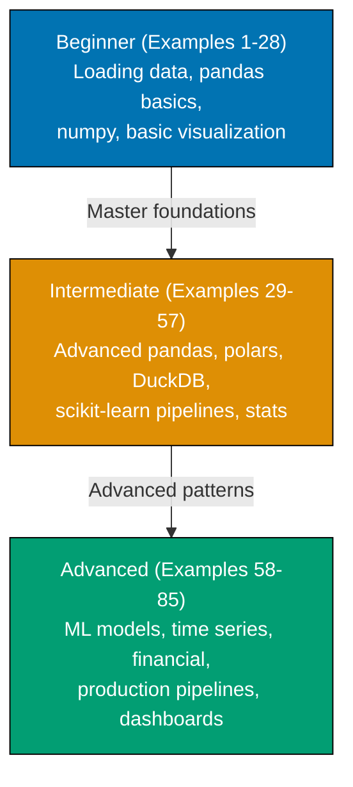
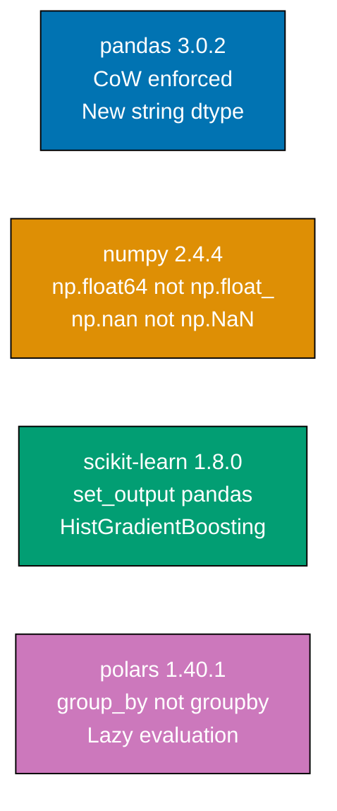

**Want to quickly master Python data analytics through working examples?** This by-example guide teaches 95% of practical data analytics through 85 annotated examples organized by complexity level, targeting pandas 3.0.2, numpy 2.4.4, scikit-learn 1.8.0, and polars 1.40.1.

## What Is By-Example Learning?

By-example learning is an **example-first approach** where you learn through annotated, runnable Python code rather than narrative explanations. Each example is self-contained, immediately executable, and heavily commented to show:

- **What each operation does** - Inline `# =>` comments explain the purpose and mechanism
- **Expected outputs** - Show actual values, shapes, and types after each operation
- **Breaking changes** - Critical version differences for pandas 3.0.2 and numpy 2.4.4
- **Key takeaways** - 1-2 sentence summaries of core concepts

This approach is **ideal for experienced developers** who know at least one programming language and want to quickly understand Python data analytics syntax, library conventions, and patterns through working code.

## Learning Path

The tutorial guides you through 85 examples organized into three progressive levels.



## Version Landscape

This tutorial targets the current major versions as of 2026. Understanding breaking changes is critical — several libraries have major API shifts that break older code.



## What This Tutorial Covers

### Core Libraries

- **pandas 3.0.2** - DataFrame operations, Copy-on-Write, new string dtype, deprecated freq aliases
- **numpy 2.4.4** - Arrays, broadcasting, new random API, updated type names
- **scikit-learn 1.8.0** - Preprocessing, pipelines, classification, regression, clustering
- **polars 1.40.1** - High-performance DataFrames with lazy evaluation and SIMD acceleration

### Visualization

- **matplotlib 3.10.x** - Foundation plotting with `fig, ax = plt.subplots()` pattern
- **seaborn 0.13.2** - Statistical visualization including the new `sns.objects` interface
- **plotly 6.x** - Interactive charts with `px.scatter()`, `px.line()`, `go.Figure()`

### Data Sources and Storage

- **DuckDB 1.2.x** - In-process SQL analytics on DataFrames and Parquet files
- **PyArrow 20.0.0** - Apache Arrow format, Parquet reading, Arrow-backed DataFrames
- **yfinance 0.2.x** - Financial data fetching from Yahoo Finance

### Statistical Analysis

- **scipy 1.15.x** - Statistical tests, hypothesis testing, optimization
- **statsmodels 0.14.x** - OLS regression, time series ARIMA, seasonal decomposition

### Production Patterns

- Reproducible pipelines with type hints and docstrings
- Data validation with pandera
- Streamlit dashboards
- Packaging with `pyproject.toml` and `uv`

## Critical Breaking Changes to Know

Before writing any code, understand these breaking changes in pandas 3.0.2 and numpy 2.4.4:

### pandas 3.0.2 Breaking Changes

**Copy-on-Write (CoW) is now enforced**:

```python
# WRONG in pandas 3.0.2 - raises ChainedAssignmentError
df["subset"]["col"] = value

# CORRECT - use df.loc for modifications
df.loc[mask, "col"] = value
```

**New string dtype** - strings no longer use `object` dtype:

```python
# pandas 3.0.2 default string storage
df["name"].dtype  # => StringDtype (not object)
```

**Deprecated frequency aliases changed**:

```python
# WRONG (pandas 2.x aliases)
df.resample("M")   # Month-end was "M"
df.resample("Y")   # Year-end was "Y"
df.resample("Q")   # Quarter-end was "Q"

# CORRECT (pandas 3.0.2 aliases)
df.resample("ME")  # Month-end is now "ME"
df.resample("YE")  # Year-end is now "YE"
df.resample("QE")  # Quarter-end is now "QE"
```

**`applymap()` replaced by `map()`**:

```python
# WRONG (deprecated in pandas 3.x)
df.applymap(lambda x: x * 2)

# CORRECT (pandas 3.0.2)
df.map(lambda x: x * 2)
```

### numpy 2.4.4 Breaking Changes

**Type alias names changed**:

```python
# WRONG (numpy 1.x aliases, removed in 2.x)
np.float_   # Removed
np.int_     # Removed (means intp now, not int64)
np.complex_ # Removed
np.NaN      # Removed (was alias for float("nan"))

# CORRECT (numpy 2.4.4)
np.float64  # Explicit 64-bit float
np.intp     # Platform pointer integer
np.complex128  # 128-bit complex
np.nan      # Lowercase nan (built-in float)
```

**New random API (use this, not deprecated `np.random.seed()`)**:

```python
# WRONG (deprecated, non-reproducible across processes)
np.random.seed(42)
np.random.normal(0, 1, 100)

# CORRECT (numpy 2.4.4 style)
rng = np.random.default_rng(seed=42)
rng.normal(0, 1, 100)
```

## Prerequisites

This tutorial assumes you:

- Know at least one programming language (Python experience helpful but not required)
- Understand basic programming concepts (loops, functions, data structures)
- Have Python 3.11+ installed with pip or uv

**Installation**:

```bash
pip install pandas==3.0.2 numpy==2.4.4 scikit-learn==1.8.0 polars==1.40.1
pip install matplotlib seaborn plotly scipy statsmodels
pip install pyarrow duckdb yfinance pandera streamlit
```

Or with uv (faster):

```bash
uv pip install pandas numpy scikit-learn polars matplotlib seaborn plotly scipy statsmodels pyarrow duckdb yfinance pandera streamlit
```

## How to Use This Guide

Each example follows a consistent five-part structure:

1. **Brief explanation** - What this example demonstrates (1-3 sentences)
2. **Optional diagram** - Visual representation for complex concepts
3. **Heavily annotated code** - Working Python with `# =>` comments showing values and outputs
4. **Key takeaway** - 1-2 sentence lesson summary
5. **Why It Matters** - 50-100 words on practical significance

The `# =>` annotation pattern documents what happens at each step:

```python
import pandas as pd                    # => pandas 3.0.2

df = pd.read_csv("sales.csv")         # => loads CSV into DataFrame
print(df.shape)                        # => (1000, 8) - rows, columns
print(df.dtypes)                       # => shows column types per column
```

Work through examples sequentially within each level, or jump directly to the example that covers your immediate need. Each example is self-contained.
