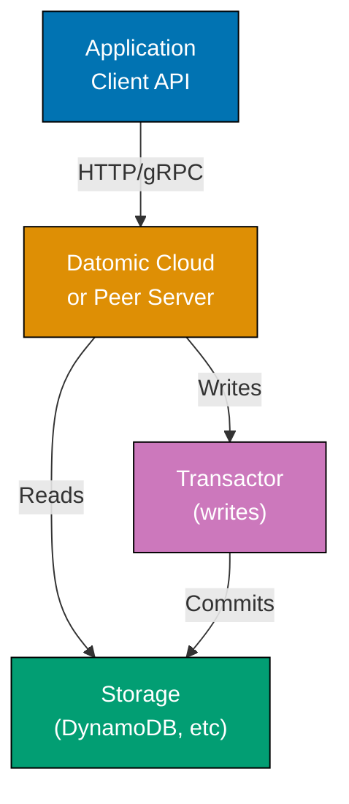
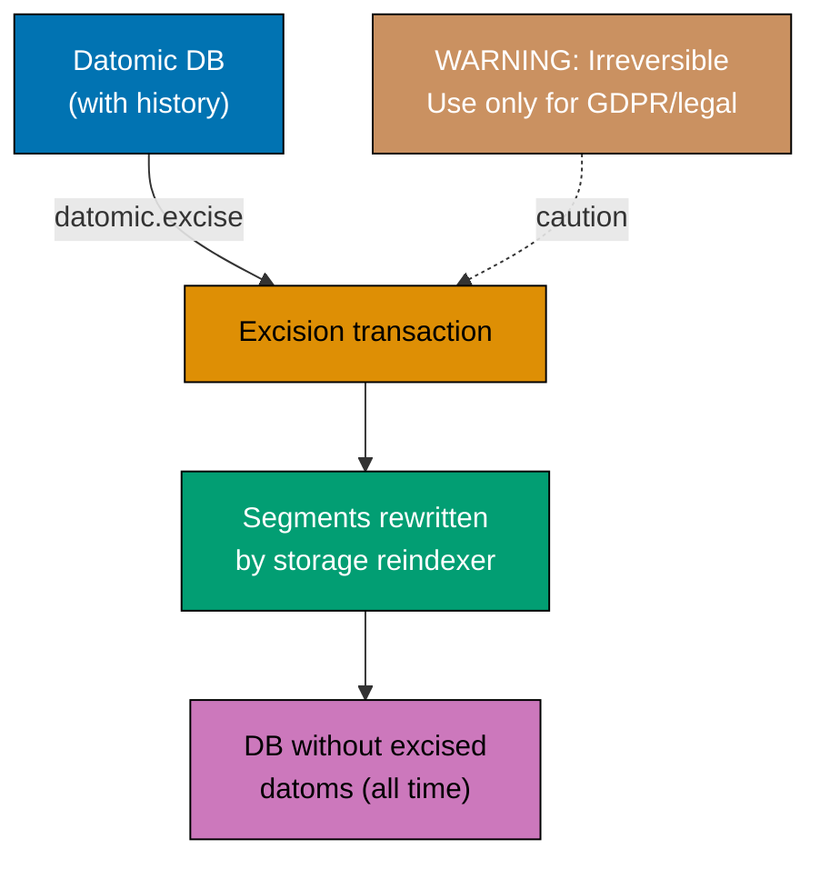
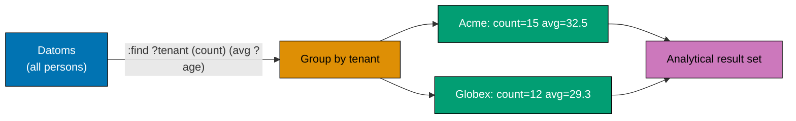
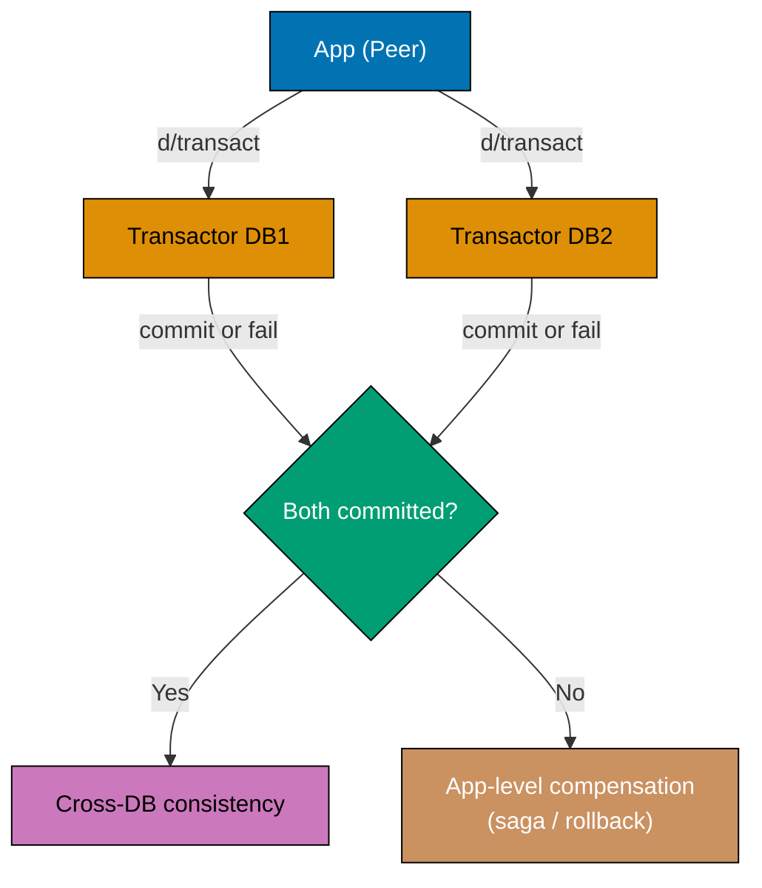
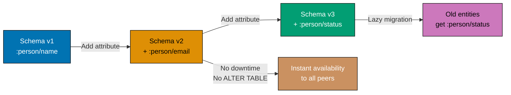
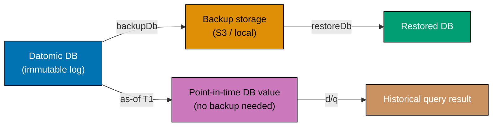
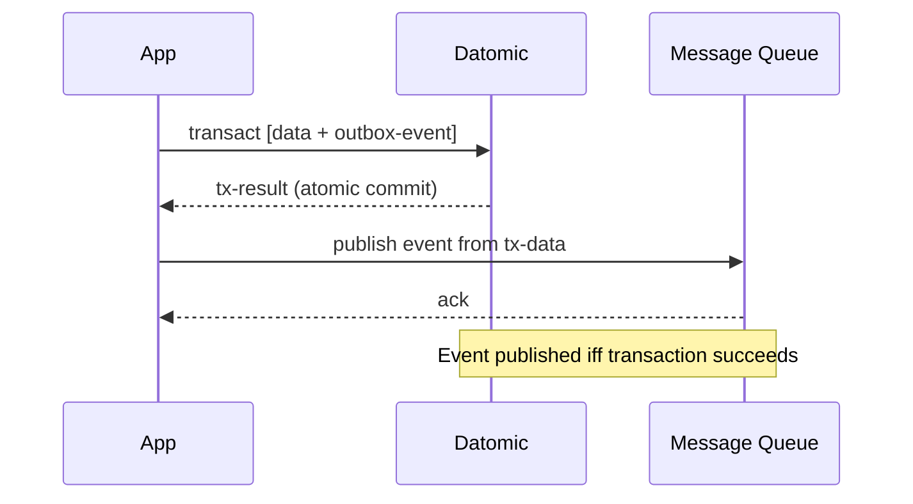
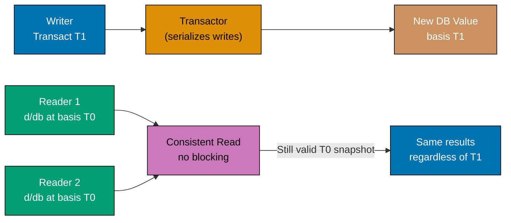
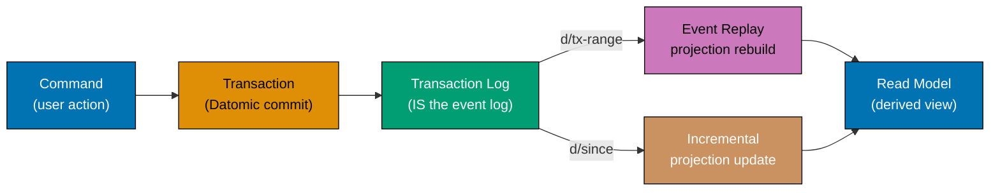

Master advanced Datomic with 20 expert-level examples. Explore client API, excision, performance tuning, distributed patterns, and production deployment strategies.

## Client API, Data Lifecycle, and Analytics (Examples 61-65)

### Example 61: Client API for Remote Access

The client API provides remote database access via HTTP or gRPC. Lighter-weight than peer library for microservices.



**Java Code**:

```java
// Note: Client API requires Datomic Cloud or Peer Server
// For Datomic Free, use peer library as shown in earlier examples

// Connect via client API (Datomic Cloud example)
import datomic.client.api.Client;
import datomic.client.api.Datomic;

Client client = Datomic.clientCloud(
    Util.map("server-type", "cloud",
             "region", "us-east-1",
             "system", "my-system",
             "endpoint", "https://...")
);
// => Creates client connection to Datomic Cloud

Connection conn = client.connect(Util.map("db-name", "tutorial"));
// => Connect to specific database

// Query via client API (same datalog)
Collection results = client.q(
    Util.map("query", "[:find ?name :where [?e :person/name ?name]]",
             "args", Util.list(client.db(conn)))
);
// => Client API uses same query language as peer
// => Queries execute remotely on peer server or Cloud

// Transaction via client API
Map txResult = client.transact(
    conn,
    Util.map("tx-data", Util.list(
        Util.map(":person/name", "Remote User",
                 ":person/email", "remote@example.com")
    ))
);
// => :tx-data key wraps transaction data
// => Returns transaction result map
```

**Clojure Code**:

```clojure
;; Note: Client API requires Datomic Cloud or Peer Server
;; For Datomic Free, use peer library as shown in earlier examples

;; Connect via client API (Datomic Cloud example)
(require '[datomic.client.api :as d-client])

(def client (d-client/client {:server-type :cloud
                               :region "us-east-1"
                               :system "my-system"
                               :endpoint "https://..."}))
;; => Creates client connection to Datomic Cloud

(def conn (d-client/connect client {:db-name "tutorial"}))
;; => Connect to specific database

;; Query via client API (same datalog)
(d-client/q '[:find ?name
              :where [?e :person/name ?name]]
            (d-client/db conn))
;; => Client API uses same query language as peer
;; => Queries execute remotely on peer server or Cloud

;; Transaction via client API
(d-client/transact conn
  {:tx-data [{:person/name "Remote User"
              :person/email "remote@example.com"}]})
;; => :tx-data key wraps transaction data
;; => Returns transaction result map
```

**Key Takeaway**: Client API provides remote access to Datomic Cloud/Peer Server. Same query and transaction semantics as peer library, lighter resource footprint.

**Why It Matters**: Client API enables language-agnostic Datomic access and scales to thousands of clients without peer memory overhead. Deploy services in containers or serverless functions without embedding full peer library. Gateway pattern separates query/transaction load from application tier. In microservice architectures, the Client API enables each service to query Datomic without embedding the full peer library and its JVM overhead. Containerized services maintaining peer connections scale horizontally. Serverless functions use the lightweight client without maintaining long-lived peer connections. The ion deployment model co-locates application code with the Datomic process for maximum performance.

---

### Example 62: Excision for Data Deletion (GDPR Compliance)

Excision permanently removes data from database history. Use for legal requirements like GDPR "right to be forgotten".



**Java Code**:

```java
// Note: Excision requires Datomic Pro or Cloud
// Datomic Free doesn't support excision

// Mark entity for excision (Datomic Pro/Cloud example)
// WARNING: Excision is irreversible - data permanently deleted

// Query entity to excise
Object entityToExcise = Peer.q(
    "[:find ?e . " +
    " :where [?e :person/email \"excise-me@example.com\"]]",
    db
);

// Submit excision request (Datomic Cloud API with client)
// client.transact(
//     conn,
//     Util.map("tx-data", Util.list(
//         Util.list(":db/excise", entityToExcise)
//     ))
// );
// => Schedules excision of entity
// => Background process removes all datoms for this entity from history
// => Cannot be undone - use with extreme caution

// Alternative: Soft delete for Datomic Free
conn.transact(
    Util.list(
        Util.map(":db/ident", ":person/deleted",
                 ":db/valueType", ":db.type/boolean",
                 ":db/cardinality", ":db.cardinality/one")
    )
).get();

conn.transact(
    Util.list(
        Util.map(":db/id", Util.list(":person/email", "alice@example.com"),
                 ":person/deleted", true)
    )
).get();
// => Mark as deleted instead of excising
// => Filter deleted entities in queries
```

**Clojure Code**:

```clojure
;; Note: Excision requires Datomic Pro or Cloud
;; Datomic Free doesn't support excision

;; Mark entity for excision (Datomic Pro/Cloud example)
;; WARNING: Excision is irreversible - data permanently deleted

;; Query entity to excise
(def entity-to-excise
  (d/q '[:find ?e .
         :where [?e :person/email "excise-me@example.com"]]
       db))

;; Submit excision request (Datomic Cloud API)
(d-client/transact conn
  {:tx-data [[:db/excise entity-to-excise]]})
;; => Schedules excision of entity
;; => Background process removes all datoms for this entity from history
;; => Cannot be undone - use with extreme caution

;; Alternative: Soft delete for Datomic Free
@(d/transact conn
   [{:db/ident       :person/deleted
     :db/valueType   :db.type/boolean
     :db/cardinality :db.cardinality/one}])

@(d/transact conn
   [{:db/id [:person/email "alice@example.com"]
     :person/deleted true}])
;; => Mark as deleted instead of excising
;; => Filter deleted entities in queries
```

**Key Takeaway**: Excision (Pro/Cloud) permanently removes data from history. Use for GDPR compliance. Datomic Free uses soft deletes with boolean flags.

**Why It Matters**: GDPR right-to-erasure requires truly deleting personal data, not just marking deleted. Excision removes facts from history and indexes while preserving transaction log continuity. Soft deletes (Free) maintain audit trails while hiding data from current queries. In GDPR-regulated products, user data deletion requests must completely remove personal data from all storage, including historical records. Excision satisfies the right-to-erasure requirement while preserving the database structure and other entities' history. The combination of soft deletes for normal operations and excision for compliance gives precise control. Data minimization strategies use excision to remove sensitive data after retention periods expire.

---

### Example 63: Analytical Queries with Aggregates

Combine multiple aggregates and grouping for analytical workloads.



**Java Code**:

```java
// Statistics by tenant
Collection results = Peer.q(
    "[:find ?tenant (count ?e) (avg ?age) (min ?age) (max ?age) " +
    " :where [?e :person/tenant ?tenant] " +
    "        [?e :person/age ?age]]",
    db
);
// => [["acme" 15 32.5 22 55]
//     ["globex" 12 29.3 21 48]]
// => Returns tenant, count, average age, min age, max age

// Age distribution (histogram bins)
Collection results2 = Peer.q(
    "[:find ?age-bin (count ?e) " +
    " :where [?e :person/age ?age] " +
    "        [(quot ?age 10) ?age-bin]]",
    db
);
// => [[2 450] [3 380] [4 178]]
// => Groups by decade: 20s, 30s, 40s

// Custom aggregate: percentile (implement as Java function)
public static class Percentile implements clojure.lang.IFn {
    private double p;
    public Percentile(double p) { this.p = p; }
    public Object invoke(Object vals) {
        List<Number> numbers = new ArrayList<>((Collection<Number>) vals);
        Collections.sort(numbers, Comparator.comparingDouble(Number::doubleValue));
        int idx = (int) (p * (numbers.size() - 1));
        return numbers.get(idx);
    }
}

// Use in query (requires registering function)
// Collection results3 = Peer.q(
//     "[:find (my.ns.Percentile/invoke 0.95 ?age) " +
//     " :where [?e :person/age ?age]]",
//     db
// );
// => [[52]]
// => 95th percentile age
```

**Clojure Code**:

```clojure
;; Statistics by tenant
(d/q '[:find ?tenant (count ?e) (avg ?age) (min ?age) (max ?age)
       :where [?e :person/tenant ?tenant]
              [?e :person/age ?age]]
     db)
;; => [["acme" 15 32.5 22 55]
;;     ["globex" 12 29.3 21 48]]
;; => Returns tenant, count, average age, min age, max age

;; Age distribution (histogram bins)
(d/q '[:find ?age-bin (count ?e)
       :where [?e :person/age ?age]
              [(quot ?age 10) ?age-bin]]
     db)
;; => [[2 450] [3 380] [4 178]]
;; => Groups by decade: 20s, 30s, 40s

;; Custom aggregate: percentile
(defn percentile [p vals]
  (let [sorted (sort vals)
        idx (int (* p (dec (count vals))))]
    (nth sorted idx)))

(d/q '[:find (my-ns/percentile 0.95 ?age)
       :where [?e :person/age ?age]]
     db)
;; => [[52]]
;; => 95th percentile age
```

**Key Takeaway**: Combine built-in and custom aggregates for analytics. Group by computed expressions for histograms and distribution analysis.

**Why It Matters**: Complex analytics in-database reduces data transfer and leverages query optimization. Compute percentiles, moving averages, or distribution analyses where data lives. Build real-time dashboards querying production database directly without ETL to analytics warehouse. In production analytics systems, running statistical aggregations (percentiles, standard deviations) directly in Datomic eliminates the latency and complexity of ETL pipelines to analytics databases. Real-time dashboard queries run against the production database for up-to-the-second metrics. Custom aggregate functions implement business-specific calculations (retention rates, churn metrics, cohort analysis) without exporting data.

---

### Example 64: Streaming Large Result Sets

Process large query results as lazy sequences to avoid memory issues.

**Java Code**:

```java
// Query returns Collection (not lazy in Java, but can be streamed)
Collection allPeople = Peer.q(
    "[:find ?e ?name " +
    " :where [?e :person/name ?name]]",
    db
);
// => Collection of results

// Process in chunks
int chunkSize = 100;
List<Object> chunk = new ArrayList<>();
Iterator it = allPeople.iterator();
while (it.hasNext()) {
    chunk.add(it.next());
    if (chunk.size() >= chunkSize) {
        System.out.println("Processing " + chunk.size() + " people");
        // Process chunk
        for (Object item : chunk) {
            // Do something with each person
        }
        chunk.clear();
    }
}
// Process remaining
if (!chunk.isEmpty()) {
    System.out.println("Processing " + chunk.size() + " people");
}
// => Processes 100 entities at a time
// => Keeps memory usage bounded

// Transform with streams (Java 8+)
allPeople.stream()
    .map(tuple -> ((List) tuple).get(0))  // Get entity ID
    .map(e -> db.entity(e))                // Convert to entity
    .filter(entity -> ((Integer) entity.get(":person/age")) > 30)
    .limit(10)
    .collect(Collectors.toList());
// => Stream transformation pipeline
// => Only processes first 10 matching results
```

**Clojure Code**:

```clojure
;; Query returns lazy sequence
(def all-people
  (d/q '[:find ?e ?name
         :where [?e :person/name ?name]]
       db))
;; => Lazy sequence - not fully realized in memory

;; Process in chunks
(doseq [chunk (partition-all 100 all-people)]
  (println "Processing" (count chunk) "people")
  ;; Process chunk
  (doseq [[e name] chunk]
    ;; Do something with each person
    nil))
;; => Processes 100 entities at a time
;; => Keeps memory usage constant

;; Transform lazily
(->> (d/q '[:find ?e :where [?e :person/name]] db)
     (map first)
     (map (partial d/entity db))
     (filter #(> (:person/age % 0) 30))
     (take 10))
;; => Lazy transformation pipeline
;; => Only realizes 10 results, not entire dataset
```

**Key Takeaway**: Query results are lazy sequences. Use `partition-all`, lazy transformations, and `take` to process large datasets with constant memory.

**Why It Matters**: Lazy evaluation prevents memory exhaustion with million-row result sets. Process data incrementally - stream to S3, paginate API responses, or transform for ETL - without loading everything. Compose lazy transformations for memory-efficient pipelines. In data export scenarios, streaming Datomic index datoms to S3 or a data lake processes hundreds of millions of facts without exceeding JVM heap. ETL pipelines transform data lazily - each record is processed and discarded before loading the next, keeping memory usage constant regardless of dataset size. Clojure's lazy sequence abstraction composes transformations cleanly without materializing intermediate collections.

---

### Example 65: Custom Index for Query Optimization

Build materialized views or custom indexes for frequently-accessed patterns.

**Java Code**:

```java
// Materialize age-to-people index in Map
Map<Integer, List<Object>> ageIndex = new ConcurrentHashMap<>();

void rebuildAgeIndex(Database db) {
    ageIndex.clear();
    Collection results = Peer.q(
        "[:find ?e ?age " +
        " :where [?e :person/age ?age]]",
        db
    );
    for (Object obj : results) {
        List tuple = (List) obj;
        Object entityId = tuple.get(0);
        Integer age = (Integer) tuple.get(1);
        ageIndex.computeIfAbsent(age, k -> new ArrayList<>()).add(entityId);
    }
}

rebuildAgeIndex(db);

// Query custom index (O(1) lookup)
List<Object> people30 = ageIndex.get(30);
// => [entity-id-1, entity-id-2, ...]
// => Instant lookup vs query scan

// Update index incrementally after transactions
void updateAgeIndex(Collection txData) {
    for (Object obj : txData) {
        datomic.Datom datom = (datomic.Datom) obj;
        if (datom.a().equals(db.entid(":person/age"))) {
            Integer age = (Integer) datom.v();
            Object entityId = datom.e();
            if ((Boolean) datom.added()) {
                ageIndex.computeIfAbsent(age, k -> new ArrayList<>()).add(entityId);
            } else {
                List<Object> entities = ageIndex.get(age);
                if (entities != null) {
                    entities.remove(entityId);
                }
            }
        }
    }
}
```

**Clojure Code**:

```clojure
;; Materialize age-to-people index in atom
(def age-index (atom {}))

(defn rebuild-age-index [db]
  (reset! age-index
    (reduce (fn [acc [e age]]
              (update acc age (fnil conj []) e))
            {}
            (d/q '[:find ?e ?age
                   :where [?e :person/age ?age]]
                 db))))

(rebuild-age-index db)

;; Query custom index (O(1) lookup)
(get @age-index 30)
;; => [entity-id-1 entity-id-2 ...]
;; => Instant lookup vs query scan

;; Update index incrementally after transactions
(defn update-age-index [tx-data]
  (doseq [[e a v tx added] tx-data]
    (when (= a :person/age)
      (if added
        (swap! age-index update v (fnil conj []) e)
        (swap! age-index update v (fn [es] (remove #{e} es)))))))
```

**Key Takeaway**: Build custom indexes for hot query paths. Materialize query results in memory for O(1) lookups. Update incrementally using transaction data.

**Why It Matters**: Custom indexes optimize critical queries beyond what database indexes provide. Build specialized lookup structures (maps, sorted sets, tries) for exact access patterns. Incremental updates keep indexes fresh without full rebuilds. Balance memory cost against query performance. In high-performance search features, application-level inverted indexes built from Datomic data enable sub-millisecond lookups that would require full scans through the database indexes. Geospatial queries use R-tree indexes built from coordinate attributes. The key pattern is building the custom index from Datomic transaction data and keeping it synchronized incrementally - minimal overhead for maximum query speed.

---

## Distribution, Performance, and Schema Management (Examples 66-70)

### Example 66: Distributed Transactions Across Databases

Coordinate transactions across multiple Datomic databases using application-level coordination.



**Java Code**:

```java
// Note: Datomic doesn't support distributed transactions across databases
// => Each database has independent transaction log
// Use application-level coordination (e.g., outbox pattern)
// => Saga pattern, two-phase commit simulation, or eventual consistency

// Two databases
String uri1 = "datomic:mem://db1";
// => First database URI (in-memory)
String uri2 = "datomic:mem://db2";
// => Second database URI (separate in-memory database)
Peer.createDatabase(uri1);
// => Creates first database
Peer.createDatabase(uri2);
// => Creates second database (independent of first)
Connection conn1 = Peer.connect(uri1);
// => Connection to first database
Connection conn2 = Peer.connect(uri2);
// => Connection to second database (separate connection object)

// Application-level two-phase commit simulation
Map distributedTransact(Connection conn1, List tx1, Connection conn2, List tx2) {
    // => Function simulates coordinated transaction across two databases
    // => conn1, tx1: first database and its transaction data
    // => conn2, tx2: second database and its transaction data
    try {
        // Phase 1: Prepare (validate transactions)
        conn1.db().with(tx1);
        // => Validates tx1 against conn1 database without committing
        // => with() simulates transaction to check for conflicts/errors
        // => Throws exception if validation fails
        conn2.db().with(tx2);
        // => Validates tx2 against conn2 database without committing
        // => Both validations must succeed before commit phase

        // Phase 2: Commit (both or neither)
        Map result1 = conn1.transact(tx1).get();
        // => Commits tx1 to first database
        // => .get() blocks until transaction completes
        // => Returns transaction result map with :db-after, :tx-data, :tempids
        Map result2 = conn2.transact(tx2).get();
        // => Commits tx2 to second database
        // => WARNING: If this fails, tx1 already committed (no automatic rollback)
        // => Returns transaction result map

        return Util.map(":success", true,
                       // => Indicates both transactions succeeded
                       ":results", Util.list(result1, result2));
                       // => Returns list of both transaction results
    } catch (Exception e) {
        // Rollback if either fails
        // => LIMITATION: No automatic rollback if Phase 2 partially succeeds
        // => Application must handle compensating transactions manually
        return Util.map(":success", false,
                       // => Indicates failure
                       ":error", e.getMessage());
                       // => Returns error message
    }
}

// Use with care - not true distributed transactions
distributedTransact(
    // => Attempts to coordinate transaction across two databases
    conn1, Util.list(Util.map(":person/name", "User in DB1")),
    // => First transaction: add person to db1
    conn2, Util.list(Util.map(":project/name", "Project in DB2"))
    // => Second transaction: add project to db2
);
// => WARNING: If second transaction fails after first succeeds,
// => db1 has "User in DB1" but db2 has no "Project in DB2"
// => Application must implement compensating transaction to undo
```

**Clojure Code**:

```clojure
;; Note: Datomic doesn't support distributed transactions across databases
;; => Each database has independent transaction log
;; Use application-level coordination (e.g., outbox pattern)
;; => Saga pattern, two-phase commit simulation, or eventual consistency

;; Two databases
(def uri-1 "datomic:mem://db1")
;; => First database URI (in-memory)
(def uri-2 "datomic:mem://db2")
;; => Second database URI (separate in-memory database)
(d/create-database uri-1)
;; => Creates first database
(d/create-database uri-2)
;; => Creates second database (independent of first)
(def conn-1 (d/connect uri-1))
;; => Connection to first database
(def conn-2 (d/connect uri-2))
;; => Connection to second database (separate connection object)

;; Application-level two-phase commit simulation
(defn distributed-transact [conn-1 tx-1 conn-2 tx-2]
  ;; => Function simulates coordinated transaction across two databases
  ;; => conn-1, tx-1: first database and its transaction data
  ;; => conn-2, tx-2: second database and its transaction data
  (try
    ;; Phase 1: Prepare (validate transactions)
    (d/with (d/db conn-1) tx-1)
    ;; => Validates tx-1 against conn-1 database without committing
    ;; => with() simulates transaction to check for conflicts/errors
    ;; => Throws exception if validation fails
    (d/with (d/db conn-2) tx-2)
    ;; => Validates tx-2 against conn-2 database without committing
    ;; => Both validations must succeed before commit phase
    ;; Phase 2: Commit (both or neither)
    (let [result-1 @(d/transact conn-1 tx-1)
          ;; => Commits tx-1 to first database
          ;; => @ blocks until transaction completes
          ;; => Returns transaction result map with :db-after, :tx-data, :tempids
          result-2 @(d/transact conn-2 tx-2)]
          ;; => Commits tx-2 to second database
          ;; => WARNING: If this fails, tx-1 already committed (no automatic rollback)
          ;; => Returns transaction result map
      {:success true
       ;; => Indicates both transactions succeeded
       :results [result-1 result-2]})
       ;; => Returns vector of both transaction results
    (catch Exception e
      ;; Rollback if either fails
      ;; => LIMITATION: No automatic rollback if Phase 2 partially succeeds
      ;; => Application must handle compensating transactions manually
      {:success false
       ;; => Indicates failure
       :error (.getMessage e)})))
       ;; => Returns error message

;; Use with care - not true distributed transactions
(distributed-transact
  ;; => Attempts to coordinate transaction across two databases
  conn-1 [{:person/name "User in DB1"}]
  ;; => First transaction: add person to db1
  conn-2 [{:project/name "Project in DB2"}])
  ;; => Second transaction: add project to db2
;; => WARNING: If second transaction fails after first succeeds,
;; => db1 has "User in DB1" but db2 has no "Project in DB2"
;; => Application must implement compensating transaction to undo
```

**Key Takeaway**: Datomic transactions are per-database. Use application-level coordination (saga pattern, outbox pattern) for cross-database atomicity.

**Why It Matters**: Distributed transactions across databases introduce complexity and failure modes. Saga pattern provides eventual consistency with compensating transactions. Outbox pattern ensures reliable event publishing. Understand trade-offs between strong consistency and system availability. In payment processing systems spanning multiple services, the saga pattern coordinates inventory reservation, payment charge, and order creation with explicit compensation transactions for each step. Datomic's outbox pattern stores events in the same transaction as data changes, ensuring reliable event publishing without two-phase commit. Understanding the consistency guarantees and failure modes is essential for building correct distributed systems with Datomic.

---

### Example 67: Performance Tuning with Memory Settings

Optimize peer memory settings for query performance and cache hit rates.

**Java Code**:

```java
// Note: Memory tuning applies to Datomic Pro/Cloud peer servers
// For Datomic Free embedded peer, use JVM heap settings

// JVM settings for peer (example)
// -Xmx4g -Xms4g              (4GB heap)
// -Ddatomic.objectCacheMax=1g (1GB object cache)
// -Ddatomic.memoryIndexMax=512m (512MB memory index)

// Monitor cache statistics (Datomic Pro)
// Map metrics = (Map) Peer.metrics(conn);
// => Returns metrics including cache hit rates

// Application-level caching of database values
static class DbCache {
    private volatile Database db;
    private volatile long validUntil;

    public synchronized Database getCachedDb(Connection conn, long cacheMs) {
        long now = System.currentTimeMillis();
        if (now > validUntil) {
            db = conn.db();
            validUntil = now + cacheMs;
        }
        return db;
    }
}

DbCache dbCache = new DbCache();

// Use cached db (refreshes every 1 second)
Database cachedDb = dbCache.getCachedDb(conn, 1000);
// => Returns cached database value (saves connection overhead)
```

**Clojure Code**:

```clojure
;; Note: Memory tuning applies to Datomic Pro/Cloud peer servers
;; For Datomic Free embedded peer, use JVM heap settings

;; JVM settings for peer (example)
;; -Xmx4g -Xms4g              (4GB heap)
;; -Ddatomic.objectCacheMax=1g (1GB object cache)
;; -Ddatomic.memoryIndexMax=512m (512MB memory index)

;; Monitor cache statistics (Datomic Pro)
;; (d/metrics conn)
;; => Returns metrics including cache hit rates

;; Application-level caching of database values
(def db-cache (atom {:db nil :valid-until 0}))

(defn cached-db [conn cache-ms]
  (let [now (System/currentTimeMillis)
        cached @db-cache]
    (if (> now (:valid-until cached))
      (let [new-db (d/db conn)]
        (reset! db-cache {:db new-db
                          :valid-until (+ now cache-ms)})
        new-db)
      (:db cached)))

;; Use cached db (refreshes every 1 second)
(cached-db conn 1000)
;; => Returns cached database value (saves connection overhead)
```

**Key Takeaway**: Tune peer memory settings for performance. Cache database values at application level to reduce connection overhead for read-heavy workloads.

**Why It Matters**: Peer caching is critical for query performance. Larger memory-index-threshold keeps more datoms in memory. Database value caching eliminates connection latency for read-heavy apps. Monitor memory usage and tune based on working set size and query patterns. In production deployments, tuning the memory index threshold to keep the working set in RAM is the single highest-impact optimization for read-heavy applications. Database value caching at the application level (keeping a cached db value for read queries) reduces transactor load by serving consistent reads from peer memory. Monitoring JVM heap usage alongside query latency reveals whether the working set fits in the configured memory budget.

---

### Example 68: Schema Versioning and Migration

Manage schema evolution across versions using additive schema changes and migration functions.



**Java Code**:

```java
// Schema versioning attribute
conn.transact(
    // => Add schema version tracking attribute
    Util.list(
        Util.map(":db/ident", ":schema/version",
                 // => Attribute name: :schema/version
                 ":db/valueType", ":db.type/long",
                 // => Stores version number as long integer
                 ":db/cardinality", ":db.cardinality/one")
                 // => Single version number per schema
    )
).get();
// => Schema version attribute now available

// Initial schema (v1)
List schemaV1 = Util.list(
    // => Version 1 schema with single full-name attribute
    Util.map(":db/ident", ":person/full-name",
             // => Original attribute: :person/full-name
             ":db/valueType", ":db.type/string",
             // => Stores full name as single string (e.g., "Alice Johnson")
             ":db/cardinality", ":db.cardinality/one")
             // => Single full name per person
);

List combined = new ArrayList(schemaV1);
// => Copy schemaV1 list to new ArrayList
combined.add(Util.map(":db/ident", ":schema/version", ":schema/version", 1));
// => Add version marker: schema version = 1
// => Uses :db/ident as lookup ref to set :schema/version attribute value
conn.transact(combined).get();
// => Transacts v1 schema + version marker
// => Database now has :person/full-name attribute and schema version 1

// Schema v2: Split full-name into first-name and last-name
List schemaV2 = Util.list(
    // => Version 2 schema with split name attributes
    Util.map(":db/ident", ":person/first-name",
             // => New attribute: :person/first-name
             ":db/valueType", ":db.type/string",
             // => Stores first name as string
             ":db/cardinality", ":db.cardinality/one"),
             // => Single first name per person
    Util.map(":db/ident", ":person/last-name",
             // => New attribute: :person/last-name
             ":db/valueType", ":db.type/string",
             // => Stores last name as string
             ":db/cardinality", ":db.cardinality/one")
             // => Single last name per person
);

// Migration function
void migrateV1ToV2(Connection conn) throws Exception {
    // => Migrates data from v1 schema (full-name) to v2 schema (first-name + last-name)
    // Add new attributes
    conn.transact(schemaV2).get();
    // => Adds :person/first-name and :person/last-name attributes
    // => Additive schema change - doesn't remove :person/full-name

    // Transform data
    Database db = conn.db();
    // => Get current database value
    Collection people = Peer.q(
        // => Query all entities with :person/full-name
        "[:find ?e ?full-name " +
        " :where [?e :person/full-name ?full-name]]",
        db
    );
    // => Returns collection of tuples: [[entity-id full-name], ...]
    // => Example: [[17592186045418, "Alice Johnson"], [17592186045419, "Bob Smith"]]

    List txData = new ArrayList();
    // => Accumulates transaction data for batch update
    for (Object obj : people) {
        // => Iterate each person entity
        List tuple = (List) obj;
        // => Extract tuple [entity-id, full-name]
        Object e = tuple.get(0);
        // => Entity ID (e.g., 17592186045418)
        String fullName = (String) tuple.get(1);
        // => Full name string (e.g., "Alice Johnson")
        String[] parts = fullName.split(" ");
        // => Split on space: ["Alice", "Johnson"]
        String firstName = parts[0];
        // => First part: "Alice"
        String lastName = parts.length > 1 ? parts[parts.length - 1] : parts[0];
        // => Last part if exists, else use first part (handles single names)
        // => Example: "Alice Johnson" → "Johnson", "Madonna" → "Madonna"

        txData.add(Util.map(":db/id", e,
                           // => Target entity ID for update
                           ":person/first-name", firstName,
                           // => Assert first name (e.g., "Alice")
                           ":person/last-name", lastName));
                           // => Assert last name (e.g., "Johnson")
    }
    // => txData now contains updates for all people
    conn.transact(txData).get();
    // => Batch transaction adds :person/first-name and :person/last-name to all entities
    // => Original :person/full-name remains (backward compatibility)

    // Update version
    conn.transact(Util.list(
        Util.map(":db/ident", ":schema/version", ":schema/version", 2)
        // => Update schema version to 2 using :db/ident lookup ref
    )).get();
    // => Schema version now 2
}

// Check current version
Entity schemaVersionEntity = conn.db().entity(":schema/version");
// => Fetch :schema/version entity using :db/ident lookup
Integer currentVersion = (Integer) schemaVersionEntity.get(":schema/version");
// => Get :schema/version attribute value
// => Example: 1 (if v1), 2 (if v2), null (if unversioned)

// Run migration if needed
if (currentVersion < 2) {
    // => Check if migration needed
    migrateV1ToV2(conn);
    // => Execute migration to v2
}
// => Safe to run multiple times (idempotent if version check correct)
```

**Clojure Code**:

```clojure
;; Schema versioning attribute
@(d/transact conn
   ;; => Add schema version tracking attribute
   [{:db/ident       :schema/version
     ;; => Attribute name: :schema/version
     :db/valueType   :db.type/long
     ;; => Stores version number as long integer
     :db/cardinality :db.cardinality/one}])
     ;; => Single version number per schema
;; => Schema version attribute now available

;; Initial schema (v1)
(def schema-v1
  ;; => Version 1 schema with single full-name attribute
  [{:db/ident       :person/full-name
    ;; => Original attribute: :person/full-name
    :db/valueType   :db.type/string
    ;; => Stores full name as single string (e.g., "Alice Johnson")
    :db/cardinality :db.cardinality/one}])
    ;; => Single full name per person

@(d/transact conn (conj schema-v1 {:db/ident :schema/version :schema/version 1}))
;; => Transacts v1 schema + version marker
;; => conj adds version map to schema-v1 vector
;; => {:db/ident :schema/version :schema/version 1} uses :db/ident as lookup ref
;; => Database now has :person/full-name attribute and schema version 1

;; Schema v2: Split full-name into first-name and last-name
(def schema-v2
  ;; => Version 2 schema with split name attributes
  [{:db/ident       :person/first-name
    ;; => New attribute: :person/first-name
    :db/valueType   :db.type/string
    ;; => Stores first name as string
    :db/cardinality :db.cardinality/one}
    ;; => Single first name per person
   {:db/ident       :person/last-name
    ;; => New attribute: :person/last-name
    :db/valueType   :db.type/string
    ;; => Stores last name as string
    :db/cardinality :db.cardinality/one}])
    ;; => Single last name per person

;; Migration function
(defn migrate-v1-to-v2 [conn]
  ;; => Migrates data from v1 schema (full-name) to v2 schema (first-name + last-name)
  ;; Add new attributes
  @(d/transact conn schema-v2)
  ;; => Adds :person/first-name and :person/last-name attributes
  ;; => Additive schema change - doesn't remove :person/full-name
  ;; Transform data
  (let [db (d/db conn)
        ;; => Get current database value
        people (d/q '[:find ?e ?full-name
                      ;; => Query all entities with :person/full-name
                      :where [?e :person/full-name ?full-name]]
                    db)]
        ;; => Returns set of tuples: #{[entity-id full-name], ...}
        ;; => Example: #{[17592186045418 "Alice Johnson"] [17592186045419 "Bob Smith"]}
    @(d/transact conn
       ;; => Batch transaction to add first-name and last-name to all people
       (for [[e full-name] people
             ;; => Destructure each tuple: e = entity-id, full-name = string
             :let [parts (clojure.string/split full-name #" ")
                   ;; => Split on space: ["Alice" "Johnson"]
                   first-name (first parts)
                   ;; => First part: "Alice"
                   last-name (last parts)]]
                   ;; => Last part: "Johnson" (handles single names: (last ["Madonna"]) → "Madonna")
         {:db/id e
          ;; => Target entity ID for update
          :person/first-name first-name
          ;; => Assert first name (e.g., "Alice")
          :person/last-name last-name})))
          ;; => Assert last name (e.g., "Johnson")
  ;; => All people now have :person/first-name and :person/last-name
  ;; => Original :person/full-name remains (backward compatibility)
  ;; Update version
  @(d/transact conn [{:db/ident :schema/version :schema/version 2}]))
  ;; => Update schema version to 2 using :db/ident lookup ref
  ;; => Schema version now 2

;; Check current version
(def current-version
  ;; => Fetch current schema version
  (:schema/version (d/entity (d/db conn) :schema/version)))
  ;; => (d/entity (d/db conn) :schema/version) fetches :schema/version entity using :db/ident lookup
  ;; => (:schema/version ...) gets :schema/version attribute value
  ;; => Example: 1 (if v1), 2 (if v2), nil (if unversioned)

;; Run migration if needed
(when (< current-version 2)
  ;; => Check if migration needed (current version less than 2)
  (migrate-v1-to-v2 conn))
  ;; => Execute migration to v2
;; => Safe to run multiple times (idempotent if version check correct)
```

**Key Takeaway**: Schema evolution is additive in Datomic. Version your schema, write migration functions to transform data, and track schema version in database.

**Why It Matters**: Additive schema evolution eliminates downtime for schema changes. Add attributes anytime without blocking transactions. Migration functions transform legacy data lazily or proactively. Schema versioning enables gradual rollouts and backward compatibility during deployments. In production services with SLAs, zero-downtime schema changes are a necessity. Datomic's additive schema model means new attributes are available immediately after their schema transaction commits. Blue-green deployments can run old and new code simultaneously against the same database during rollout - old code ignores new attributes, new code populates them. Migration transforms legacy data using transaction functions without locking the database.

---

### Example 69: Monitoring and Alerting on Transaction Log

Monitor transaction log for anomalies, trigger alerts on suspicious patterns.

**Java Code**:

```java
void monitorLargeTransactions(Connection conn, int threshold) {
    datomic.Log log = conn.log();
    Iterable recentTxs = log.txRange(null, null);

    int count = 0;
    for (Object obj : recentTxs) {
        if (count++ >= 100) break;

        Map tx = (Map) obj;
        Collection data = (Collection) tx.get(Keyword.intern("data"));
        int datomCount = data.size();

        if (datomCount > threshold) {
            System.out.println("ALERT: Large transaction detected: " +
                             "tx-id " + tx.get(Keyword.intern("t")) +
                             " datoms " + datomCount);
            // Trigger alert (send to monitoring system)
        }
    }
}

// Run monitoring
monitorLargeTransactions(conn, 1000);
// => Alerts on transactions with >1000 datoms

// Monitor specific attribute changes
void monitorSensitiveAttributes(Connection conn, Set<String> attributes) {
    Database db = conn.db();
    datomic.Log log = conn.log();
    Iterable recentTxs = log.txRange(null, null);

    int count = 0;
    for (Object obj : recentTxs) {
        if (count++ >= 100) break;

        Map tx = (Map) obj;
        Collection data = (Collection) tx.get(Keyword.intern("data"));

        for (Object datomObj : data) {
            datomic.Datom datom = (datomic.Datom) datomObj;
            Object attr = db.ident(datom.a());

            if (attributes.contains(attr.toString())) {
                System.out.println("ALERT: Sensitive attribute changed: " +
                                 "entity " + datom.e() +
                                 " attribute " + attr +
                                 " tx " + tx.get(Keyword.intern("t")));
            }
        }
    }
}

monitorSensitiveAttributes(conn, new HashSet<>(Arrays.asList(":person/email", ":person/password-hash")));
```

**Clojure Code**:

```clojure
(defn monitor-large-transactions [conn threshold]
  (let [log (d/log conn)
        recent-txs (take 100 (d/tx-range log nil nil))]
    (doseq [tx recent-txs]
      (let [datom-count (count (:data tx))]
        (when (> datom-count threshold)
          (println "ALERT: Large transaction detected:"
                   "tx-id" (:t tx)
                   "datoms" datom-count)
          ;; Trigger alert (send to monitoring system)
          )))))

;; Run monitoring
(monitor-large-transactions conn 1000)
;; => Alerts on transactions with >1000 datoms

;; Monitor specific attribute changes
(defn monitor-sensitive-attributes [conn attributes]
  (let [db (d/db conn)
        log (d/log conn)
        recent-txs (take 100 (d/tx-range log nil nil))]
    (doseq [tx recent-txs]
      (doseq [datom (:data tx)
              :let [attr (d/ident db (:a datom))]
              :when (attributes attr)]
        (println "ALERT: Sensitive attribute changed:"
                 "entity" (:e datom)
                 "attribute" attr
                 "tx" (:t tx))))))

(monitor-sensitive-attributes conn #{:person/email :person/password-hash})
```

**Key Takeaway**: Monitor transaction log for anomalies, large transactions, sensitive data changes. Essential for security, compliance, and operational visibility.

**Why It Matters**: Transaction log monitoring provides real-time security and compliance oversight. Detect bulk data exfiltration, unusual access patterns, or policy violations immediately. Alert on sensitive attribute changes. Build audit dashboards showing who changed what when without impacting application performance. In security-sensitive production environments, monitoring the transaction log for changes to sensitive attributes (security credentials, financial data, personal information) enables immediate alerting on policy violations. Bulk data access detection identifies potential exfiltration attempts. Compliance dashboards showing all data changes in a time period are generated from transaction log queries rather than maintaining separate audit infrastructure.

---

### Example 70: Backup and Point-in-Time Recovery

Create backups and restore to specific points in time.



**Java Code**:

```java
// Note: Backup strategies differ by storage backend
// Datomic Free (dev storage): backup not supported (in-memory or local files)
// Datomic Pro: use backup-db API
// Datomic Cloud: AWS backup snapshots

// Datomic Pro backup example (requires Pro license)
// Peer.backupDb(conn, "s3://my-bucket/backups/tutorial");

// For Datomic Free: export data manually
void exportDatabase(Connection conn, String outputFile) throws IOException {
    Database db = conn.db(); // Get current database value
    Iterable datoms = db.datoms(Peer.EAVT); // Get all datoms in EAVT index order

    try (PrintWriter w = new PrintWriter(new FileWriter(outputFile))) {
        for (Object obj : datoms) {
            datomic.Datom datom = (datomic.Datom) obj; // Cast to Datom
            w.println(datom.toString()); // Write datom as string
        }
    }
}

// Export all data
exportDatabase(conn, "backup-2026-01-29.edn"); // Create backup file

// Point-in-time query (no restore needed - just query)
Database dbYesterday = conn.db().asOf(yesterdayTxId); // Get database as of yesterday
Long count = (Long) Peer.q(
    "[:find (count ?e) . :where [?e :person/name]]", // Count people
    dbYesterday
);
// => Count of people as of yesterday
// => No restore needed - immutability enables time-travel
```

**Clojure Code**:

```clojure
;; Note: Backup strategies differ by storage backend
;; Datomic Free (dev storage): backup not supported (in-memory or local files)
;; Datomic Pro: use backup-db API
;; Datomic Cloud: AWS backup snapshots

;; Datomic Pro backup example (requires Pro license)
;; (d/backup-db conn "s3://my-bucket/backups/tutorial")

;; For Datomic Free: export data manually
(defn export-database [conn output-file]
  (let [db (d/db conn)
        all-datoms (d/datoms db :eavt)]
    (with-open [w (clojure.java.io/writer output-file)]
      (doseq [datom all-datoms]
        (.write w (pr-str datom))
        (.write w "\n")))))

;; Export all data
(export-database conn "backup-2026-01-29.edn")

;; Point-in-time query (no restore needed - just query)
(def db-yesterday (d/as-of (d/db conn) yesterday-tx-id))
(d/q '[:find (count ?e) . :where [?e :person/name]] db-yesterday)
;; => Count of people as of yesterday
;; => No restore needed - immutability enables time-travel
```

**Key Takeaway**: Datomic Pro/Cloud support native backup. Datomic Free uses manual export or just queries historical database values. Immutability enables point-in-time queries without restore.

**Why It Matters**: Immutability changes backup strategy - you're backing up append-only log, not mutable state. Point-in-time recovery is just querying as-of any timestamp. Backup validation becomes querying historical data. Test disaster recovery by querying backed-up database values. In production disaster recovery planning, Datomic's append-only model enables simpler backup strategies - incremental backups capture only new transactions since last backup. Recovery procedures are testable in non-destructive ways: restore the backup and run as-of queries against it to verify data integrity. Recovery time objectives are achievable without full database restore - query as-of any backup point for forensic investigation without replacing production data.

---

## Integration Patterns and Concurrency (Examples 71-75)

### Example 71: Integration with Message Queues

Publish database changes to message queues for downstream processing.



**Java Code**:

```java
// Simulate message queue (use real queue in production)
List<Map<String, Object>> messageQueue = new ArrayList<>(); // In-memory queue

void publishChangeEvent(Long entityId, Keyword attribute,
                       Object oldValue, Object newValue) {
    Map<String, Object> event = new HashMap<>(); // Create event map
    event.put("entity", entityId); // Entity ID
    event.put("attribute", attribute); // Attribute changed
    event.put("old", oldValue); // Old value (null if new)
    event.put("new", newValue); // New value
    event.put("timestamp", new java.util.Date()); // Event timestamp
    messageQueue.add(event); // Add to queue
}

// Process transactions and publish changes
void processTransactionForEvents(Map txResult) {
    Database dbBefore = (Database) txResult.get(Keyword.intern("db-before")); // DB before tx
    Database dbAfter = (Database) txResult.get(Keyword.intern("db-after")); // DB after tx
    Collection txData = (Collection) txResult.get(Keyword.intern("tx-data")); // Transaction data

    for (Object obj : txData) {
        datomic.Datom datom = (datomic.Datom) obj; // Cast to Datom
        Long e = datom.e(); // Entity ID
        Object a = datom.a(); // Attribute
        Object v = datom.v(); // Value
        boolean added = datom.added(); // Was added (not retracted)

        Keyword attrIdent = (Keyword) dbAfter.ident(a); // Get attribute ident
        if (added && "person".equals(attrIdent.getNamespace())) { // Filter person namespace
            Object oldValue = dbBefore.entity(e).get(attrIdent); // Get old value
            publishChangeEvent(e, attrIdent, oldValue, v); // Publish event
        }
    }
}

// Transact and publish
Map txResult = conn.transact(
    Util.list(
        Util.map(":person/email", "queue-test@example.com",
                 ":person/name", "Queue Test",
                 ":person/age", 35)
    )
).get(); // Block for result

processTransactionForEvents(txResult); // Process and publish events

// Check message queue
System.out.println(messageQueue);
// => [{entity=123, attribute=:person/name, old=null, new=Queue Test, ...}
//     {entity=123, attribute=:person/age, old=null, new=35, ...}]
```

**Clojure Code**:

```clojure
;; Simulate message queue (use real queue in production)
(def message-queue (atom []))

(defn publish-change-event [entity-id attribute old-value new-value]
  (swap! message-queue conj
    {:entity entity-id
     :attribute attribute
     :old old-value
     :new new-value
     :timestamp (java.util.Date.)}))

;; Process transactions and publish changes
(defn process-transaction-for-events [tx-result]
  (let [db-before (:db-before tx-result)
        db-after (:db-after tx-result)
        tx-data (:tx-data tx-result)]
    (doseq [[e a v tx added] tx-data]
      (let [attr-ident (d/ident db-after a)]
        (when (and added (= (namespace attr-ident) "person"))
          (let [old-value (get (d/entity db-before e) attr-ident)]
            (publish-change-event e attr-ident old-value v)))))))

;; Transact and publish
(def tx-result
  @(d/transact conn
     [{:person/email "queue-test@example.com"
       :person/name "Queue Test"
       :person/age 35}]))

(process-transaction-for-events tx-result)

;; Check message queue
@message-queue
;; => [{:entity 123 :attribute :person/name :old nil :new "Queue Test" ...}
;;     {:entity 123 :attribute :person/age :old nil :new 35 ...}]
```

**Key Takeaway**: Process transaction results to publish change events to message queues. Enables event-driven architectures and downstream system integration.

**Why It Matters**: Transaction-to-event translation enables microservice integration and CQRS patterns. Publish domain events to Kafka, SQS, or other queues for downstream processing. Transaction context guarantees exactly-once semantics - event published iff transaction succeeds. In event-driven microservice architectures, the transactional outbox pattern stores events in the Datomic transaction alongside data changes, guaranteeing event publication without two-phase commit. Message queue consumers receive exactly the events corresponding to committed transactions. This pattern eliminates dual-write problems where database commits succeed but event publication fails, ensuring downstream services always stay synchronized with Datomic state.

---

### Example 72: Multi-Version Concurrency Control (MVCC)

Understand Datomic's MVCC model: reads never block writes, writes never block reads.



**Java Code**:

```java
// Thread 1: Long-running read
Database readerDb = conn.db(); // Capture immutable database snapshot
new Thread(() -> {
    try {
        Thread.sleep(5000); // Simulate slow processing
        Long count = (Long) Peer.q(
            "[:find (count ?e) . :where [?e :person/name]]", // Count people
            readerDb // Using captured snapshot
        );
        System.out.println("Reader sees count: " + count); // Print count
    } catch (InterruptedException e) {
        Thread.currentThread().interrupt();
    }
}).start(); // Start reader thread

// Thread 2: Write during read
Thread.sleep(1000); // Wait 1 second
conn.transact(
    Util.list(
        Util.map(":person/email", "concurrent@example.com",
                 ":person/name", "Concurrent User")
    )
).get(); // Block for result

// Output:
// Reader sees count: 1008
// => Reader's database value is immutable
// => Unaffected by concurrent writes

// New reader sees updated count
Long newCount = (Long) Peer.q(
    "[:find (count ?e) . :where [?e :person/name]]", // Count people
    conn.db() // Get current database value
);
// => 1009
// => New database value includes concurrent write
```

**Clojure Code**:

```clojure
;; Thread 1: Long-running read
(def reader-db (d/db conn))
(future
  (Thread/sleep 5000) ;; Simulate slow processing
  (println "Reader sees count:"
           (d/q '[:find (count ?e) . :where [?e :person/name]] reader-db)))

;; Thread 2: Write during read
(Thread/sleep 1000)
@(d/transact conn
   [{:person/email "concurrent@example.com"
     :person/name "Concurrent User"}])

;; Output:
;; Reader sees count: 1008
;; => Reader's database value is immutable
;; => Unaffected by concurrent writes

;; New reader sees updated count
(d/q '[:find (count ?e) . :where [?e :person/name]] (d/db conn))
;; => 1009
;; => New database value includes concurrent write
```

**Key Takeaway**: Datomic uses MVCC - database values are immutable snapshots. Reads never block writes, writes never block reads. No read locks needed.

**Why It Matters**: Lock-free reads eliminate read-write contention in concurrent systems. Long-running analytical queries don't impact transactional workload. No deadlocks from read locks. Snapshot isolation provides consistent reads without blocking - fundamental to Datomic's scalability. In production systems with mixed OLTP and analytical workloads, Datomic's MVCC model enables analytical queries running for seconds or minutes to coexist with high-frequency transactional workloads without impacting each other. Read replicas (peers) can serve unlimited concurrent reads without consulting the transactor. This architecture scales reads horizontally while maintaining strong consistency guarantees - a fundamental departure from traditional database scaling approaches.

---

### Example 73: Optimizing Large Cardinality-Many Attributes

Handle attributes with thousands of values efficiently.

**Java Code**:

```java
// Large cardinality-many attribute (e.g., followers)
conn.transact(
    Util.list(
        Util.map(":db/ident", ":person/followers",
                 ":db/valueType", ":db.type/ref",
                 ":db/cardinality", ":db.cardinality/many",
                 ":db/doc", "People who follow this person")
    )
).get(); // Define followers attribute

// Add many followers
List influencerId = Util.list(":person/email", "influencer@example.com"); // Lookup ref
conn.transact(
    Util.list(
        Util.map(":person/email", "influencer@example.com",
                 ":person/name", "Influencer")
    )
).get(); // Create influencer

// Add 10k followers
List<Map> followers = new ArrayList<>(); // List of follower entities
List<List> followerIds = new ArrayList<>(); // List of lookup refs
for (int i = 0; i < 10000; i++) {
    String email = "follower" + i + "@example.com";
    followers.add(Util.map(":person/email", email,
                           ":person/name", "Follower " + email)); // Create entity
    followerIds.add(Util.list(":person/email", email)); // Create lookup ref
}

conn.transact(followers).get(); // Create all followers
conn.transact(
    Util.list(
        Util.map(":db/id", influencerId,
                 ":person/followers", followerIds) // Add all followers
    )
).get(); // Link followers to influencer

// Query followers efficiently (use limit in pull)
long start = System.currentTimeMillis();
Map result = (Map) Peer.pull(
    db,
    "[{(:person/followers {:limit 100}) [*]}]", // Pull pattern with limit
    influencerId
);
long elapsed = System.currentTimeMillis() - start;
// => Returns first 100 followers
// => Faster than pulling all 10k

// Count followers without loading all
start = System.currentTimeMillis();
Collection countResult = Peer.q(
    "[:find (count ?follower) " + // Count aggregate
    " :where [?influencer :person/email \"influencer@example.com\"] " +
    "        [?influencer :person/followers ?follower]]",
    db
);
elapsed = System.currentTimeMillis() - start;
// => [[10000]]
// => Count aggregation doesn't materialize all values
```

**Clojure Code**:

```clojure
;; Large cardinality-many attribute (e.g., followers)
@(d/transact conn
   [{:db/ident       :person/followers
     :db/valueType   :db.type/ref
     :db/cardinality :db.cardinality/many
     :db/doc         "People who follow this person"}])

;; Add many followers
(def influencer-id [:person/email "influencer@example.com"])
@(d/transact conn
   [{:person/email "influencer@example.com"
     :person/name "Influencer"}])

;; Add 10k followers
(let [follower-ids (for [i (range 10000)]
                     [:person/email (str "follower" i "@example.com")])]
  @(d/transact conn
     (for [email follower-ids]
       {:person/email (second email)
        :person/name (str "Follower " (second email))}))
  @(d/transact conn
     [{:db/id influencer-id
       :person/followers follower-ids}]))

;; Query followers efficiently (use limit in pull)
(time
  (d/pull db '[(limit :person/followers 100)] influencer-id))
;; => Returns first 100 followers
;; => Faster than pulling all 10k

;; Count followers without loading all
(time
  (d/q '[:find (count ?follower)
         :where [?influencer :person/email "influencer@example.com"]
                [?influencer :person/followers ?follower]]
       db))
;; => [[10000]]
;; => Count aggregation doesn't materialize all values
```

**Key Takeaway**: Use `(limit :attr n)` in pull patterns for large cardinality-many attributes. Use count aggregates instead of materializing all values.

**Why It Matters**: Limiting large cardinality-many sets prevents memory exhaustion and API timeout. Paginate results, show preview with '...and 1000 more', or just count. Especially critical for followers, tags, permissions, or any unbounded collection. In social network features, users with millions of followers have cardinality-many relationships that cannot be loaded entirely into memory. Pull patterns with `:limit` return preview counts plus first N items for efficient UI rendering. API endpoints use pagination to return followers in pages without memory issues. Count-only queries using aggregates show follower counts without materializing the full set. These patterns prevent the common production incidents where a power user with unusual data volumes causes timeouts.

---

### Example 74: Reactive Queries with Core.async

Implement reactive queries that update automatically on database changes.

**Java Code**:

```java
// Note: Java doesn't have core.async built-in
// Use java.util.concurrent for reactive patterns

// Create blocking queue for database updates
BlockingQueue<Database> dbQueue = new LinkedBlockingQueue<>(); // Thread-safe queue

// Polling function (simulates tx-report-queue in Datomic Pro)
void pollForUpdates(Connection conn, long intervalMs) {
    new Thread(() -> {
        long lastT = conn.db().basisT(); // Get initial basis-t
        while (true) {
            try {
                Thread.sleep(intervalMs); // Wait for interval
                Database currentDb = conn.db(); // Get current database
                long currentT = currentDb.basisT(); // Get current basis-t
                if (currentT > lastT) { // Database changed
                    dbQueue.put(currentDb); // Send to queue
                    lastT = currentT; // Update last-t
                }
            } catch (InterruptedException e) {
                Thread.currentThread().interrupt();
                break;
            }
        }
    }).start(); // Start polling thread
}

// Start polling
pollForUpdates(conn, 1000); // Poll every 1 second

// Reactive query consumer
new Thread(() -> {
    while (true) {
        try {
            Database db = dbQueue.take(); // Block for next database
            Long count = (Long) Peer.q(
                "[:find (count ?e) . :where [?e :person/name]]", // Count people
                db
            );
            System.out.println("Person count updated: " + count); // Print update
        } catch (InterruptedException e) {
            Thread.currentThread().interrupt();
            break;
        }
    }
}).start(); // Start consumer thread

// Trigger update
conn.transact(
    Util.list(
        Util.map(":person/email", "reactive@example.com",
                 ":person/name", "Reactive User")
    )
).get(); // Create reactive user
// => Output (after 1s): "Person count updated: 1010"
```

**Clojure Code**:

**Why Clojure core.async (not Java concurrency utilities)**: `clojure.core.async` provides Communicating Sequential Processes (CSP) semantics with go-loops and channels. Alternatives include `java.util.concurrent` (ExecutorService, BlockingQueue) or plain threads. Core.async is preferred here because: (1) go-loops use lightweight virtual threads (not OS threads), enabling thousands of concurrent watchers, (2) channels provide backpressure semantics natively, and (3) the CSP model composes cleanly with Datomic's tx-report-queue which is also channel-based in Datomic Pro. For production Datomic Pro, replace polling with `(d/tx-report-queue conn)` directly.

```clojure
(require '[clojure.core.async :as async])

;; Create channel for database updates
(def db-channel (async/chan))

;; Polling function (simulates tx-report-queue in Datomic Pro)
(defn poll-for-updates [conn interval-ms]
  (async/go-loop [last-t (d/basis-t (d/db conn))]
    (async/<! (async/timeout interval-ms))
    (let [current-db (d/db conn)
          current-t (d/basis-t current-db)]
      (when (> current-t last-t)
        (async/>! db-channel current-db))
      (recur current-t))))

;; Start polling
(poll-for-updates conn 1000)

;; Reactive query consumer
(async/go-loop []
  (when-let [db (async/<! db-channel)]
    (let [count (d/q '[:find (count ?e) . :where [?e :person/name]] db)]
      (println "Person count updated:" count))
    (recur)))

;; Trigger update
@(d/transact conn [{:person/email "reactive@example.com"
                    :person/name "Reactive User"}])
;; => Output (after 1s): "Person count updated: 1010"
```

**Key Takeaway**: Implement reactive queries with core.async channels. Poll for database changes (Datomic Free) or use tx-report-queue (Pro/Cloud).

**Why It Matters**: Reactive queries enable real-time UI updates and streaming analytics. Push database changes to WebSockets, update dashboards automatically, or trigger workflows on data changes. Core.async provides CSP-based concurrency model for building reactive systems. In real-time collaboration applications, subscribing to the transaction report queue and pushing relevant changes to connected WebSocket clients enables live updates without polling. Monitoring dashboards update automatically when metric entities change. Workflow engines trigger business logic when specific attributes are modified. The Datomic transaction report queue provides a reliable, ordered stream of all database changes, making reactive patterns straightforward to implement.

---

### Example 75: Access Control with Attribute-Level Filters

Implement attribute-level access control using database filters.

**Java Code**:

```java
// Define sensitive attributes
Set<Keyword> sensitiveAttrs = new HashSet<>(); // Set of sensitive keywords
sensitiveAttrs.add(Keyword.intern("person", "password-hash")); // Password hash
sensitiveAttrs.add(Keyword.intern("person", "ssn")); // Social security number

// Create filtered database (removes sensitive attributes)
Database createRestrictedDb(Database db, String userRole) {
    if ("admin".equals(userRole)) {
        return db; // Admins see everything
    }

    // Filter for non-admin users
    return db.filter(new Database.Predicate<datomic.Datom>() { // Filter predicate
        @Override
        public boolean apply(Database filterDb, datomic.Datom datom) {
            Keyword attr = (Keyword) filterDb.ident(datom.a()); // Get attribute ident
            return !sensitiveAttrs.contains(attr); // Include if not sensitive
        }
    });
}

// User query (non-admin)
Database userDb = createRestrictedDb(conn.db(), "user"); // Create filtered DB
Map userResult = (Map) Peer.pull(
    userDb,
    "[*]", // Pull all attributes
    Util.list(":person/email", "alice@example.com") // Lookup ref
);
// => {:person/name "Alice Johnson"
//     :person/email "alice@example.com"
//     :person/age 34}
// => No :person/password-hash (filtered out)

// Admin query
Database adminDb = createRestrictedDb(conn.db(), "admin"); // Unfiltered DB
Map adminResult = (Map) Peer.pull(
    adminDb,
    "[*]", // Pull all attributes
    Util.list(":person/email", "alice@example.com") // Lookup ref
);
// => {:person/name "Alice Johnson"
//     :person/email "alice@example.com"
//     :person/age 34
//     :person/password-hash "..."}
// => Includes sensitive attributes
```

**Clojure Code**:

```clojure
;; Define sensitive attributes
(def sensitive-attrs #{:person/password-hash :person/ssn})

;; Create filtered database (removes sensitive attributes)
(defn create-restricted-db [db user-role]
  (if (= user-role :admin)
    db ;; Admins see everything
    (d/filter db
      (fn [db datom]
        (let [attr (d/ident db (:a datom))]
          (not (sensitive-attrs attr)))))))

;; User query (non-admin)
(def user-db (create-restricted-db (d/db conn) :user))
(d/pull user-db '[*] [:person/email "alice@example.com"])
;; => {:person/name "Alice Johnson"
;;     :person/email "alice@example.com"
;;     :person/age 34}
;; => No :person/password-hash (filtered out)

;; Admin query
(def admin-db (create-restricted-db (d/db conn) :admin))
(d/pull admin-db '[*] [:person/email "alice@example.com"])
;; => {:person/name "Alice Johnson"
;;     :person/email "alice@example.com"
;;     :person/age 34
;;     :person/password-hash "..."}
;; => Includes sensitive attributes
```

**Key Takeaway**: Use database filters for attribute-level access control. Filter sensitive attributes based on user roles without modifying queries.

**Why It Matters**: Attribute-level filtering implements column-level security declaratively. Users see only attributes they're authorized for, transparently. Application queries unchanged - security layer wraps database value. Critical for multi-tenant SaaS, PII protection, and regulatory compliance. In healthcare applications, different user roles see different subsets of patient data - doctors see all attributes, billing staff see financial attributes but not clinical notes, receptionists see contact information only. The filter is applied once when constructing the database value for a request, and all subsequent queries automatically respect the restriction. Application query code remains clean - no per-query authorization checks scattered throughout the codebase.

---

## Debugging, Event Sourcing, and Production Operations (Examples 76-80)

### Example 76: Debugging Queries with :explain

Understand query execution plans to optimize performance.

**Java Code**:

```java
// Note: :explain is experimental and may vary by Datomic version

// Add :explain to query (example)
Collection result = Peer.q(
    "[:find ?name " + // Find name
    " :where [?e :person/email \"alice@example.com\"] " +
    "        [?e :person/name ?name]]",
    db
);
// => Standard query execution

// Datomic Pro query explanation (not available in Free)
// Map queryArg = Util.map(":db", db, ":explain", true);
// Object explanation = Peer.q(
//     "[:find ?name " +
//     " :where [?e :person/email \"alice@example.com\"] " +
//     "        [?e :person/name ?name]]",
//     queryArg
// );
// => Returns execution plan showing index selection

// Manual analysis: check if unique attribute is used
boolean queryUsesUniqueAttr(String queryStr, Database db) {
    // Parse query string (simplified example)
    // In real code, parse the query properly
    if (queryStr.contains(":person/email")) { // Check for email attribute
        Object attrId = db.entid(Keyword.intern("person", "email")); // Get attribute ID
        if (attrId != null) {
            datomic.Entity attr = db.entity(attrId); // Get attribute entity
            Object unique = attr.get(Keyword.intern("db", "unique")); // Get :db/unique
            return unique != null; // Returns true if unique
        }
    }
    return false;
}

boolean usesUnique = queryUsesUniqueAttr(
    "[:find ?name :where [?e :person/email \"alice@example.com\"] " +
    "[?e :person/name ?name]]",
    db
);
// => true (:person/email is unique)
```

**Clojure Code**:

```clojure
;; Note: :explain is experimental and may vary by Datomic version

;; Add :explain to query (example)
(d/q '[:find ?name
       :where [?e :person/email "alice@example.com"]
              [?e :person/name ?name]]
     db)
;; => Standard query execution

;; Datomic Pro query explanation (not available in Free)
;; (d/q '[:find ?name
;;        :where [?e :person/email "alice@example.com"]
;;               [?e :person/name ?name]]
;;      {:db db :explain true})
;; => Returns execution plan showing index selection

;; Manual analysis: check if unique attribute is used
(defn query-uses-unique-attr? [query]
  (some (fn [clause]
          (and (vector? clause)
               (= 3 (count clause))
               (keyword? (second clause))
               (:db/unique (d/entity db (second clause)))))
        (:where query)))

(query-uses-unique-attr?
  '{:find [?name]
    :where [[?e :person/email "alice@example.com"]
            [?e :person/name ?name]]})
;; => true (:person/email is unique)
```

**Key Takeaway**: Datomic Pro offers query explanation. In Datomic Free, manually analyze queries for unique attribute usage and index selection.

**Why It Matters**: Query explanation reveals optimization opportunities invisible from timing alone. See index selection, join strategies, and cardinality estimates. Identify missing unique constraints, suboptimal clause ordering, or opportunities for rules. Data-driven query optimization. In production performance investigations, query explain output reveals why a specific query is slow - whether it's doing a full scan when an AVET index lookup is possible, or joining large intermediate sets before applying selective filters. The explain output guides concrete optimizations: add a unique constraint to enable O(1) lookup, reorder clauses to filter earlier, or extract repeated patterns into rules for optimization. Systematic explain-driven tuning transforms performance from guesswork to engineering.

---

### Example 77: Composite Entities with Component Attributes

Model complex aggregates using component attributes for lifecycle coupling.

**Java Code**:

```java
// Order-OrderLine aggregate
conn.transact(
    Util.list(
        Util.map(":db/ident", ":order/id",
                 ":db/valueType", ":db.type/string",
                 ":db/cardinality", ":db.cardinality/one",
                 ":db/unique", ":db.unique/identity"), // Unique order ID
        Util.map(":db/ident", ":order/lines",
                 ":db/valueType", ":db.type/ref",
                 ":db/cardinality", ":db.cardinality/many",
                 ":db/isComponent", true), // Component relationship
        Util.map(":db/ident", ":order-line/product",
                 ":db/valueType", ":db.type/string",
                 ":db/cardinality", ":db.cardinality/one"), // Product name
        Util.map(":db/ident", ":order-line/quantity",
                 ":db/valueType", ":db.type/long",
                 ":db/cardinality", ":db.cardinality/one") // Quantity
    )
).get(); // Define schema

// Create order with lines
conn.transact(
    Util.list(
        Util.map(":order/id", "ORD-001",
                 ":order/lines", Util.list( // Nested entities
                     Util.map(":order-line/product", "Widget",
                              ":order-line/quantity", 5), // First line
                     Util.map(":order-line/product", "Gadget",
                              ":order-line/quantity", 3)  // Second line
                 ))
    )
).get(); // Create order with lines

// Pull complete aggregate
Database db = conn.db();
Map order = (Map) Peer.pull(
    db,
    "[* {:order/lines [*]}]", // Pull order and nested lines
    Util.list(":order/id", "ORD-001") // Lookup ref
);
// => {:order/id "ORD-001"
//     :order/lines [{:order-line/product "Widget" :order-line/quantity 5}
//                   {:order-line/product "Gadget" :order-line/quantity 3}]}

// Retract order - lines automatically retracted
conn.transact(
    Util.list(
        Util.list(":db/retractEntity", Util.list(":order/id", "ORD-001")) // Retract order
    )
).get(); // Component lines retracted too

// Verify lines are gone
Collection products = Peer.q(
    "[:find ?product :where [?line :order-line/product ?product]]", // Find products
    conn.db()
);
// => #{}
// => Component lines retracted with parent
```

**Clojure Code**:

```clojure
;; Order-OrderLine aggregate
@(d/transact conn
   [{:db/ident       :order/id
     :db/valueType   :db.type/string
     :db/cardinality :db.cardinality/one
     :db/unique      :db.unique/identity}
    {:db/ident       :order/lines
     :db/valueType   :db.type/ref
     :db/cardinality :db.cardinality/many
     :db/isComponent true}
    {:db/ident       :order-line/product
     :db/valueType   :db.type/string
     :db/cardinality :db.cardinality/one}
    {:db/ident       :order-line/quantity
     :db/valueType   :db.type/long
     :db/cardinality :db.cardinality/one}])

;; Create order with lines
@(d/transact conn
   [{:order/id "ORD-001"
     :order/lines [{:order-line/product "Widget"
                    :order-line/quantity 5}
                   {:order-line/product "Gadget"
                    :order-line/quantity 3}]}])

;; Pull complete aggregate
(def db (d/db conn))
(d/pull db
  '[* {:order/lines [*]}]
  [:order/id "ORD-001"])
;; => {:order/id "ORD-001"
;;     :order/lines [{:order-line/product "Widget" :order-line/quantity 5}
;;                   {:order-line/product "Gadget" :order-line/quantity 3}]}

;; Retract order - lines automatically retracted
@(d/transact conn [[:db/retractEntity [:order/id "ORD-001"]]])

;; Verify lines are gone
(d/q '[:find ?product :where [?line :order-line/product ?product]] (d/db conn))
;; => #{}
;; => Component lines retracted with parent
```

**Key Takeaway**: Component attributes couple entity lifecycles. Use for aggregate roots and their owned children (Order-OrderLine, BlogPost-Comments, etc).

**Why It Matters**: Component semantics implement Domain-Driven Design aggregates naturally. Aggregate root retraction cascades to owned entities automatically. Models true ownership - blog post owns comments, order owns line items. Lifecycle coupling declarative, not procedural. In DDD architectures, Datomic component attributes directly implement the aggregate pattern: the aggregate root entity's lifecycle controls its components. Retracting an order entity cascades to all line items automatically - no cascadeDelete business logic, no trigger-based deletion, no orphan cleanup jobs. Component retraction is preserved in history, making it auditable. This maps cleanly to domain models where certain entities have no meaningful existence outside their aggregate.

---

### Example 78: Building Event Sourcing Systems

Use Datomic's immutable log as event store for event sourcing architecture.



**Java Code**:

```java
// Event schema
conn.transact(
    Util.list(
        Util.map(":db/ident", ":event/type",
                 ":db/valueType", ":db.type/keyword",
                 ":db/cardinality", ":db.cardinality/one"), // Event type
        Util.map(":db/ident", ":event/aggregate-id",
                 ":db/valueType", ":db.type/uuid",
                 ":db/cardinality", ":db.cardinality/one"), // Aggregate ID
        Util.map(":db/ident", ":event/payload",
                 ":db/valueType", ":db.type/string",
                 ":db/cardinality", ":db.cardinality/one") // Event payload
    )
).get(); // Define event schema

// Record events
UUID aggregateId = UUID.randomUUID(); // Generate aggregate ID

conn.transact(
    Util.list(
        Util.map(":event/type", ":order/created",
                 ":event/aggregate-id", aggregateId,
                 ":event/payload", "{:order-id \"ORD-001\" :customer \"Alice\"}")
    )
).get(); // Record order created event

conn.transact(
    Util.list(
        Util.map(":event/type", ":order/item-added",
                 ":event/aggregate-id", aggregateId,
                 ":event/payload", "{:product \"Widget\" :quantity 5}")
    )
).get(); // Record item added event

conn.transact(
    Util.list(
        Util.map(":event/type", ":order/completed",
                 ":event/aggregate-id", aggregateId,
                 ":event/payload", "{:total 150.00}")
    )
).get(); // Record order completed event

// Replay events for aggregate
Collection replayEvents(Database db, UUID aggregateId) {
    return Peer.q(
        "[:find ?type ?payload ?tx " + // Find event details
        " :in $ ?aggregate-id " +
        " :where [?e :event/aggregate-id ?aggregate-id] " +
        "        [?e :event/type ?type] " +
        "        [?e :event/payload ?payload] " +
        "        [?e _ _ ?tx] " + // Get transaction ID
        " :order ?tx]", // Order by transaction
        db,
        aggregateId
    );
}

Collection events = replayEvents(conn.db(), aggregateId); // Get events in order
// => [[:order/created "{:order-id ...}" tx1]
//     [:order/item-added "{:product ...}" tx2]
//     [:order/completed "{:total ...}" tx3]]

// Rebuild aggregate state from events
Map<String, Object> state = new HashMap<>(); // Initial state
for (Object obj : events) {
    List event = (List) obj; // Cast to list
    Keyword eventType = (Keyword) event.get(0); // Event type
    String payload = (String) event.get(1); // Payload string
    // Apply event to state (simplified - parse payload properly in real code)
    System.out.println("Apply event: " + eventType + " -> " + payload);
}
// => {:order-id "ORD-001" :customer "Alice" :product "Widget" :quantity 5 :total 150.00}
```

**Clojure Code**:

```clojure
;; Event schema
@(d/transact conn
   [{:db/ident       :event/type
     :db/valueType   :db.type/keyword
     :db/cardinality :db.cardinality/one}
    {:db/ident       :event/aggregate-id
     :db/valueType   :db.type/uuid
     :db/cardinality :db.cardinality/one}
    {:db/ident       :event/payload
     :db/valueType   :db.type/string
     :db/cardinality :db.cardinality/one}])

;; Record events
(def aggregate-id (java.util.UUID/randomUUID))

@(d/transact conn
   [{:event/type :order/created
     :event/aggregate-id aggregate-id
     :event/payload (pr-str {:order-id "ORD-001" :customer "Alice"})}])

@(d/transact conn
   [{:event/type :order/item-added
     :event/aggregate-id aggregate-id
     :event/payload (pr-str {:product "Widget" :quantity 5})}])

@(d/transact conn
   [{:event/type :order/completed
     :event/aggregate-id aggregate-id
     :event/payload (pr-str {:total 150.00})}])

;; Replay events for aggregate
(defn replay-events [db aggregate-id]
  (d/q '[:find ?type ?payload ?tx
         :in $ ?aggregate-id
         :where [?e :event/aggregate-id ?aggregate-id]
                [?e :event/type ?type]
                [?e :event/payload ?payload]
                [?e _ _ ?tx]
         :order ?tx]
       db
       aggregate-id))

(def events (replay-events (d/db conn) aggregate-id))
;; => [[:order/created "{:order-id ...}" tx1]
;;     [:order/item-added "{:product ...}" tx2]
;;     [:order/completed "{:total ...}" tx3]]

;; Rebuild aggregate state from events
(reduce (fn [state [event-type payload]]
          ;; Apply event to state
          (merge state (read-string payload)))
        {}
        events)
;; => {:order-id "ORD-001" :customer "Alice" :product "Widget" :quantity 5 :total 150.00}
```

**Key Takeaway**: Datomic's transaction log is a natural event store. Record events as facts, replay by querying transactions in order. Immutability guarantees event history integrity.

**Why It Matters**: Event sourcing becomes simple with Datomic - transaction log IS the event log. No separate event store needed. Replay history for projections, debug by examining exact historical state, or implement CQRS patterns naturally. Immutability guarantees events never change. Event sourcing systems built on top of traditional databases require separate event stores (EventStore, Kafka, Kinesis), projection rebuilding infrastructure, and snapshot mechanisms. Datomic's immutable fact model makes all of this unnecessary - the transaction log is already an ordered, immutable sequence of facts. CQRS read models are built from since-queries over transaction history. Projections can be rebuilt from any point in time by replaying datoms.

---

### Example 79: Handling Schema Conflicts Across Teams

Manage schema in multi-team environments using namespaced attributes and schema registries.

**Java Code**:

```java
// Team A: User service schema
List teamASchema = Util.list(
    Util.map(":db/ident", ":user-service/user-id",
             ":db/valueType", ":db.type/uuid",
             ":db/cardinality", ":db.cardinality/one",
             ":db/unique", ":db.unique/identity"), // Unique user ID
    Util.map(":db/ident", ":user-service/username",
             ":db/valueType", ":db.type/string",
             ":db/cardinality", ":db.cardinality/one") // Username
);

// Team B: Order service schema
List teamBSchema = Util.list(
    Util.map(":db/ident", ":order-service/order-id",
             ":db/valueType", ":db.type/uuid",
             ":db/cardinality", ":db.cardinality/one",
             ":db/unique", ":db.unique/identity"), // Unique order ID
    Util.map(":db/ident", ":order-service/user-id",
             ":db/valueType", ":db.type/ref",
             ":db/cardinality", ":db.cardinality/one",
             ":db/doc", "References :user-service/user-id") // Cross-service ref
);

// Install schemas (no conflicts due to namespacing)
conn.transact(teamASchema).get(); // Install team A schema
conn.transact(teamBSchema).get(); // Install team B schema

// Cross-service reference
conn.transact(
    Util.list(
        Util.map(":user-service/user-id", UUID.randomUUID(),
                 ":user-service/username", "alice")
    )
).get(); // Create user

Long aliceUserId = (Long) Peer.q(
    "[:find ?user . " + // Find user entity ID
    " :where [?user :user-service/username \"alice\"]]",
    conn.db()
);

conn.transact(
    Util.list(
        Util.map(":order-service/order-id", UUID.randomUUID(),
                 ":order-service/user-id", aliceUserId) // Reference user
    )
).get(); // Create order

// Query across services
Collection result = Peer.q(
    "[:find ?username ?order-id " + // Find username and order ID
    " :where [?order :order-service/user-id ?user] " + // Join order to user
    "        [?user :user-service/username ?username] " +
    "        [?order :order-service/order-id ?order-id]]",
    conn.db()
);
// => [["alice" #uuid "..."]]
```

**Clojure Code**:

```clojure
;; Team A: User service schema
(def team-a-schema
  [{:db/ident       :user-service/user-id
    :db/valueType   :db.type/uuid
    :db/cardinality :db.cardinality/one
    :db/unique      :db.unique/identity}
   {:db/ident       :user-service/username
    :db/valueType   :db.type/string
    :db/cardinality :db.cardinality/one}])

;; Team B: Order service schema
(def team-b-schema
  [{:db/ident       :order-service/order-id
    :db/valueType   :db.type/uuid
    :db/cardinality :db.cardinality/one
    :db/unique      :db.unique/identity}
   {:db/ident       :order-service/user-id
    :db/valueType   :db.type/ref
    :db/cardinality :db.cardinality/one
    :db/doc         "References :user-service/user-id"}])

;; Install schemas (no conflicts due to namespacing)
@(d/transact conn team-a-schema)
@(d/transact conn team-b-schema)

;; Cross-service reference
@(d/transact conn
   [{:user-service/user-id (java.util.UUID/randomUUID)
     :user-service/username "alice"}])

(def alice-user-id
  (d/q '[:find ?user .
         :where [?user :user-service/username "alice"]]
       (d/db conn)))

@(d/transact conn
   [{:order-service/order-id (java.util.UUID/randomUUID)
     :order-service/user-id alice-user-id}])

;; Query across services
(d/q '[:find ?username ?order-id
       :where [?order :order-service/user-id ?user]
              [?user :user-service/username ?username]
              [?order :order-service/order-id ?order-id]]
     (d/db conn))
;; => [["alice" #uuid "..."]]
```

**Key Takeaway**: Use namespaced attributes to avoid schema conflicts across teams. Establish namespace ownership conventions and document cross-service references.

**Why It Matters**: Namespaced attributes enable schema federation in microservice architectures. Teams own their namespaces, evolve independently, share common entities. Avoid naming conflicts (user/name vs account/name). Document cross-service references for schema governance. In organizations with multiple teams sharing a Datomic database, namespace conventions ensure teams can add attributes without conflicts. The `:team/attribute` pattern clearly communicates ownership. Common entity types (`:user`, `:product`) use shared namespaces with agreed-upon schemas, while service-specific attributes use team-specific namespaces. Schema governance policies document which namespaces require cross-team review before addition, enabling independent evolution while maintaining coordination for shared data.

---

### Example 80: Production Monitoring and Health Checks

Implement health checks and monitoring for production Datomic deployments.

**Java Code**:

```java
Map<String, Object> healthCheck(Connection conn) {
    try {
        // Test connection
        Database db = conn.db(); // Get database value

        // Test query
        Long personCount = (Long) Peer.q(
            "[:find (count ?e) . :where [?e :person/name]]", // Count people
            db
        );

        // Test transaction
        Object tempId = Peer.tempid(":db.part/user"); // Create temp ID
        Map txResult = conn.transact(
            Util.list(
                Util.list(":db/add", tempId, ":db/doc", "Health check") // Test tx
            )
        ).get(); // Block for result

        // Verify transaction committed
        Database dbAfter = (Database) txResult.get(Keyword.intern("db-after")); // Get db-after
        Map tempIds = (Map) txResult.get(Keyword.intern("tempids")); // Get tempids
        Long txId = (Long) Peer.resolveTempid(dbAfter, tempIds, tempId); // Resolve temp ID

        return Util.map(
            "healthy", true,
            "person-count", personCount,
            "test-tx-id", txId,
            "timestamp", new java.util.Date()
        );
    } catch (Exception e) {
        return Util.map(
            "healthy", false,
            "error", e.getMessage(),
            "timestamp", new java.util.Date()
        );
    }
}

// Run health check
Map healthResult = healthCheck(conn);
// => {healthy=true, person-count=1010, test-tx-id=17592186045999,
//     timestamp=#inst "2026-01-29T..."}

// Monitoring metrics
Map<String, Object> collectMetrics(Connection conn) {
    Database db = conn.db(); // Get database value

    Long entityCount = (Long) Peer.q(
        "[:find (count ?e) . :where [?e :db/ident]]", // Count idents
        db
    );

    Long personCount = (Long) Peer.q(
        "[:find (count ?e) . :where [?e :person/name]]", // Count people
        db
    );

    Long databaseSize = db.basisT(); // Get basis-t (database size indicator)

    return Util.map(
        "entity-count", entityCount,
        "person-count", personCount,
        "database-size", databaseSize,
        "timestamp", new java.util.Date()
    );
}

Map metrics = collectMetrics(conn);
// => {entity-count=1523, person-count=1010,
//     database-size=13194139534330, timestamp=#inst "2026-01-29T..."}

// Export to monitoring system (Prometheus, Datadog, etc.)
// sendToMonitoring(collectMetrics(conn));
```

**Clojure Code**:

```clojure
(defn health-check [conn]
  (try
    ;; Test connection
    (let [db (d/db conn)
          ;; Test query
          person-count (d/q '[:find (count ?e) .
                              :where [?e :person/name]]
                            db)
          ;; Test transaction
          tx-result @(d/transact conn
                       [[:db/add (d/tempid :db.part/user)
                         :db/doc "Health check"]])
          ;; Verify transaction committed
          tx-id (d/resolve-tempid (:db-after tx-result)
                                   (:tempids tx-result)
                                   (d/tempid :db.part/user))]
      {:healthy true
       :person-count person-count
       :test-tx-id tx-id
       :timestamp (java.util.Date.)})
    (catch Exception e
      {:healthy false
       :error (.getMessage e)
       :timestamp (java.util.Date.)})))

;; Run health check
(health-check conn)
;; => {:healthy true
;;     :person-count 1010
;;     :test-tx-id 17592186045999
;;     :timestamp #inst "2026-01-29T..."}

;; Monitoring metrics
(defn collect-metrics [conn]
  (let [db (d/db conn)]
    {:entity-count (d/q '[:find (count ?e) .
                          :where [?e :db/ident]]
                        db)
     :person-count (d/q '[:find (count ?e) .
                          :where [?e :person/name]]
                        db)
     :database-size (d/basis-t db)
     :timestamp (java.util.Date.)}))

(collect-metrics conn)
;; => {:entity-count 1523
;;     :person-count 1010
;;     :database-size 13194139534330
;;     :timestamp #inst "2026-01-29T..."}

;; Export to monitoring system (Prometheus, Datadog, etc.)
;; (send-to-monitoring (collect-metrics conn))
```

**Key Takeaway**: Implement health checks with connection, query, and transaction tests. Collect metrics on entity counts, database size, and query performance for production monitoring.

**Why It Matters**: Database health monitoring catches issues before users notice. Connection checks detect network partitions, query tests verify index health, transaction tests ensure write path works. Metrics track growth trends, identify performance degradation, and inform capacity planning. In production Datomic deployments, health check endpoints provide ops teams with actionable data for on-call alerts. Transaction rate and latency metrics identify when transaction throughput is approaching limits. Peer memory metrics show when the configured index threshold is too small for the growing working set. Proactive capacity planning from growth trend data prevents performance degradation from catching teams off-guard. Structured health monitoring reduces mean time to detection when incidents occur.

---

These 20 advanced examples provide expert-level Datomic knowledge: client API, excision, performance tuning, event sourcing, distributed patterns, and production operations. You've now covered 95% of Datomic through 80 hands-on examples. Continue learning through official documentation, community resources, and real-world projects!
