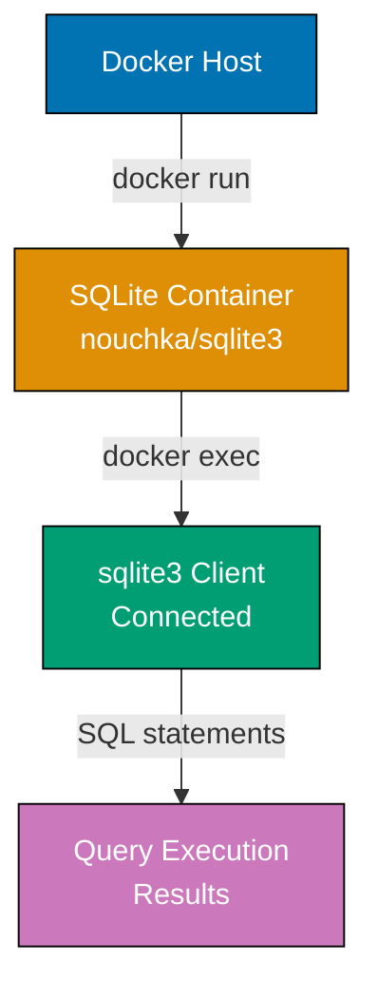
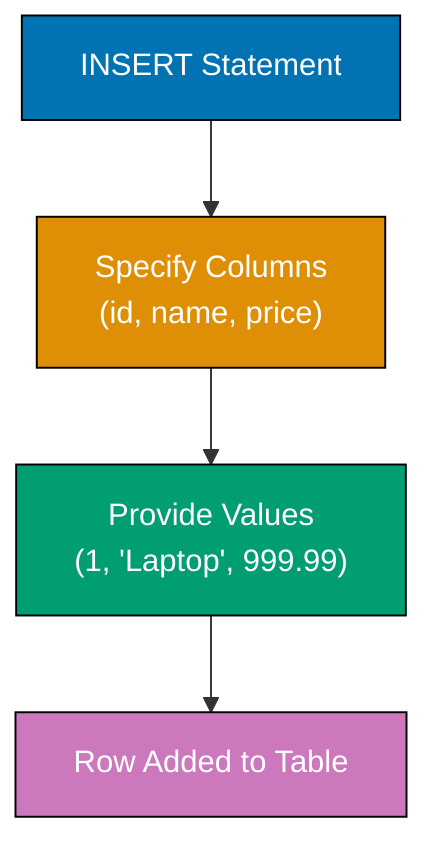
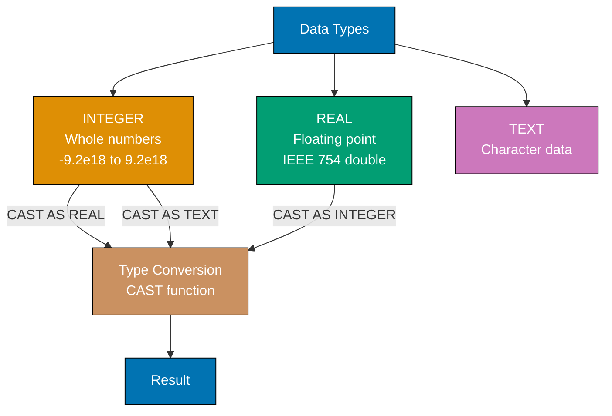
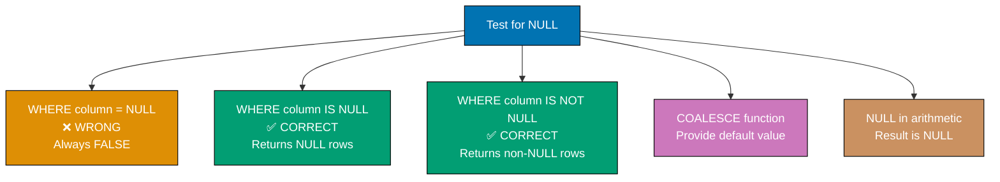
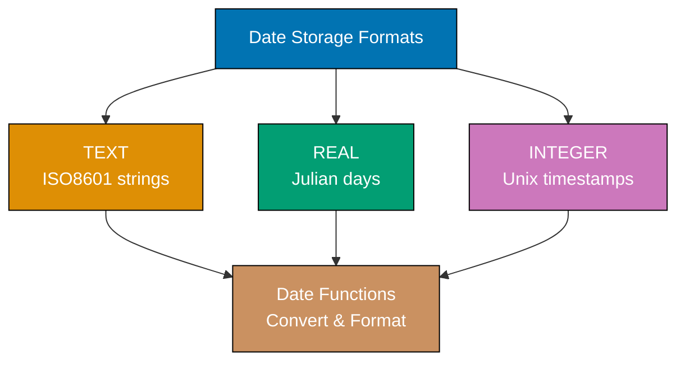
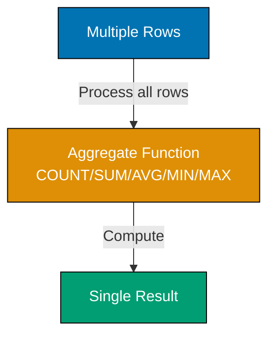
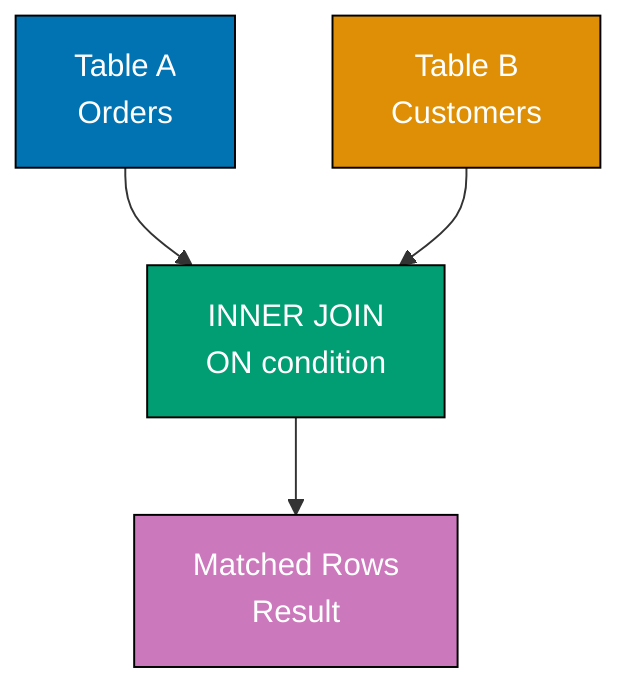
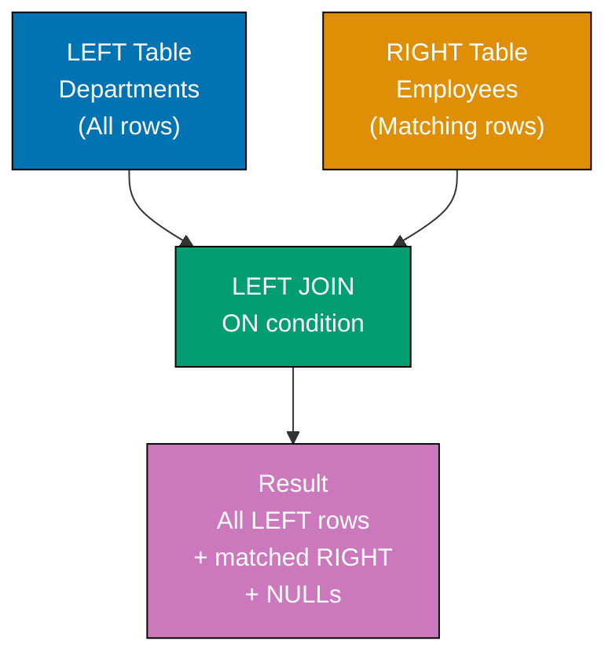
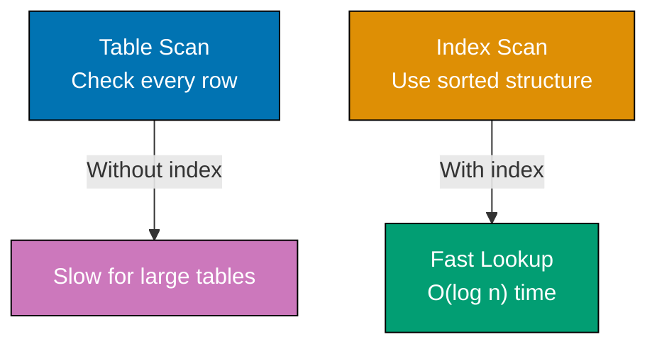

Learn SQL fundamentals through 30 annotated examples. Each example is self-contained, runnable in SQLite, and heavily commented to show what each statement does, expected outputs, and intermediate table states.

## Example 1: Installing SQLite and First Query

SQLite runs in a Docker container for isolated, reproducible environments across all platforms. This setup creates a lightweight database you can experiment with safely without installing server software.



**Code**:

```bash
# One-time setup: Create SQLite container with persistent storage
docker run --name sqlite-tutorial \
  -v sqlite-data:/data \
  -d nouchka/sqlite3:latest tail -f /dev/null
# => Container created with SQLite, data persisted in volume 'sqlite-data'

# Connect to SQLite
docker exec -it sqlite-tutorial sqlite3 /data/tutorial.db
# => Opens SQLite shell connected to tutorial.db file
```

**First query**:

```sql
-- Simple query to verify connection
SELECT sqlite_version();
-- => Returns SQLite version (e.g., "3.45.0")

-- Simple arithmetic
SELECT 2 + 2 AS result;
-- => Returns 4 in column named 'result'

-- String concatenation
SELECT 'Hello, ' || 'SQL!' AS greeting;
-- => Returns "Hello, SQL!" (|| is concatenation operator)

-- Current date and time
SELECT datetime('now') AS current_time;
-- => Returns current UTC timestamp (e.g., "2025-12-29 02:07:25")
```

**Key Takeaway**: SQLite runs in Docker containers with no server configuration needed. The `SELECT` statement executes queries and returns results - even simple expressions work without FROM clauses.

**Why It Matters**: Reproducible development environments prevent "works on my machine" issues across teams. Docker-based database setups enable consistent testing, onboarding, and CI/CD pipelines. Production applications typically use managed database services like AWS RDS or Google Cloud SQL, but local containerized databases are essential for development and testing without affecting production data. Teams using Docker for local databases onboard new developers in minutes instead of hours, eliminating environment-specific bugs from day one.

---

## Example 2: Creating Your First Table

Tables store related data in rows and columns. Each column has a name and data type. Tables are the fundamental storage unit in relational databases.

**Code**:

```sql
-- Create a simple table
CREATE TABLE users (
    id INTEGER,           -- => Integer column for user ID
                          -- => Stores whole numbers from -9.2e18 to 9.2e18
    name TEXT,            -- => Text column for user name
                          -- => Stores variable-length character data
    email TEXT,           -- => Text column for email address
                          -- => No length limit in SQLite TEXT type
    age INTEGER           -- => Integer column for age
                          -- => SQLite flexible typing allows NULL by default
);
-- => Table 'users' created with 4 columns
-- => Table exists in database but contains no rows yet

-- List all tables
.tables
-- => Shows: users
-- => SQLite command (starts with .) lists all tables in database

-- Show table structure
.schema users
-- => Displays CREATE TABLE statement
-- => Shows column names, types, and constraints

-- Verify table is empty
SELECT COUNT(*) FROM users;
-- => Returns 0 (no rows yet)
-- => COUNT(*) counts all rows in table
```

**Key Takeaway**: Use `CREATE TABLE` to define structure before storing data. Each column needs a name and type (INTEGER, TEXT, REAL, BLOB). Tables start empty - use INSERT to add rows.

**Why It Matters**: Schema design decisions impact application performance and maintainability for years. Choosing appropriate data types affects storage efficiency, query speed, and data integrity. TEXT for what should be INTEGER wastes storage and breaks sorting. Production databases evolve through migrations that carefully add, modify, or remove columns while preserving existing data—schema changes in production require planning, testing, and rollback strategies to avoid downtime.

---

## Example 3: Basic SELECT Queries

SELECT retrieves data from tables. The asterisk (`*`) selects all columns, while specific column names give precise control over what data returns.

**Code**:

```sql
-- Create table and insert sample data
CREATE TABLE products (
    id INTEGER,          -- => Unique identifier for each product
    name TEXT,           -- => Product name (variable length)
    price REAL,          -- => Product price (floating point)
    category TEXT        -- => Product category grouping
);
-- => Table structure defined, ready for data

INSERT INTO products (id, name, price, category)
VALUES
    (1, 'Laptop', 999.99, 'Electronics'),
    (2, 'Mouse', 29.99, 'Electronics'),
    (3, 'Desk Chair', 199.99, 'Furniture'),
    (4, 'Monitor', 299.99, 'Electronics');
-- => 4 rows inserted
-- => Each row represents one product with all four columns populated

-- Select all columns, all rows
SELECT * FROM products;
-- => Returns all 4 rows with columns: id | name | price | category
-- => Asterisk (*) means "all columns"
-- => No WHERE clause means "all rows"

-- Select specific columns
SELECT name, price FROM products;
-- => Returns only 'name' and 'price' columns for all rows
-- => Order of columns matches SELECT clause order
-- => Reduces data transfer compared to SELECT *

-- Select with expressions
SELECT name, price, price * 1.10 AS price_with_tax FROM products;
-- => Calculates new column showing 10% tax
-- => price * 1.10 computes tax for each row
-- => AS price_with_tax names the computed column
-- => Laptop: 1099.99, Mouse: 32.99, Desk Chair: 219.99, Monitor: 329.99
```

**Key Takeaway**: SELECT retrieves data from tables - use `*` for all columns or name specific columns. You can include expressions and calculations in SELECT to derive new values without modifying stored data.

**Why It Matters**: Selecting only needed columns reduces network bandwidth and memory usage—critical for high-traffic applications. A query fetching 50 columns when you need 3 wastes 94% of its bandwidth. Production systems avoid `SELECT *` because it fetches unnecessary data and breaks when schema changes add columns unexpectedly. Computed columns enable business logic in queries without duplicating data storage, keeping derived values always consistent with source data.

---

## Example 4: Inserting Data with INSERT

INSERT adds new rows to tables. You can insert single rows, multiple rows at once, or specify only certain columns (others become NULL).



**Code**:

```sql
CREATE TABLE inventory (
    id INTEGER,           -- => Inventory item identifier
    item TEXT,            -- => Item name/description
    quantity INTEGER,     -- => Stock quantity (number of units)
    warehouse TEXT        -- => Warehouse location code
);
-- => Table structure defined for inventory tracking
-- => No constraints defined, all columns nullable by default

-- Insert single row with all columns
INSERT INTO inventory (id, item, quantity, warehouse)
VALUES (1, 'Widget A', 100, 'North');
-- => Inserts 1 row into inventory table
-- => Explicitly specifies all 4 column values
-- => Row state: id=1, item='Widget A', quantity=100, warehouse='North'

-- Insert multiple rows at once (more efficient)
INSERT INTO inventory (id, item, quantity, warehouse)
VALUES
    (2, 'Widget B', 200, 'South'),
    (3, 'Widget C', 150, 'East'),
    (4, 'Widget D', 75, 'West');
-- => Inserts 3 rows in single statement
-- => Single INSERT reduces database round-trips
-- => More efficient than 3 separate INSERT statements
-- => Table now contains 4 rows total

-- Insert partial columns (others become NULL)
INSERT INTO inventory (id, item)
VALUES (5, 'Widget E');
-- => Inserts row with only id and item specified
-- => quantity and warehouse columns become NULL
-- => Row state: id=5, item='Widget E', quantity=NULL, warehouse=NULL
-- => NULL represents missing/unknown data

-- Verify data
SELECT * FROM inventory;
-- => Returns all 5 rows
-- => Displays: id, item, quantity, warehouse for each row
-- => Row 5 shows NULL values for quantity and warehouse
```

**Key Takeaway**: INSERT adds rows to tables - specify columns and values explicitly for clarity. Multi-row inserts are more efficient than multiple single-row inserts. Columns not specified get NULL unless a default value is defined.

**Why It Matters**: Bulk inserts dramatically improve performance for data imports—inserting 10,000 rows individually takes minutes, while a single multi-row INSERT completes in seconds. Production ETL pipelines batch inserts to reduce network round-trips and transaction overhead. Applications importing CSV files, syncing data from APIs, or performing bulk migrations rely on batched inserts. Explicit column lists protect against schema changes breaking INSERT statements when new columns are added to the table later.

---

## Example 5: Updating and Deleting Rows

UPDATE modifies existing rows matching a WHERE condition. DELETE removes rows. Both are dangerous without WHERE clauses - they affect ALL rows.

**Code**:

```sql
CREATE TABLE stock (
    id INTEGER,           -- => Stock item identifier
    product TEXT,         -- => Product name
    quantity INTEGER,     -- => Current stock quantity
    price REAL            -- => Unit price in dollars
);
-- => Table for inventory stock management
-- => Tracks product quantities and pricing

INSERT INTO stock (id, product, quantity, price)
VALUES
    (1, 'Apples', 100, 1.50),
    (2, 'Bananas', 150, 0.75),
    (3, 'Oranges', 80, 2.00);
-- => Inserts 3 products with initial quantities and prices
-- => Table state: 3 rows with complete data

-- Update single row
UPDATE stock
SET quantity = 120
WHERE id = 1;
-- => Updates Apples quantity to 120 (only row with id=1)
-- => WHERE clause targets specific row by id
-- => Before: quantity=100, After: quantity=120
-- => Other columns (product, price) unchanged

-- Update multiple columns
UPDATE stock
SET quantity = 200, price = 0.80
WHERE product = 'Bananas';
-- => Updates both quantity and price for Bananas
-- => SET clause specifies multiple column changes
-- => Before: quantity=150, price=0.75
-- => After: quantity=200, price=0.80

-- Update with calculation
UPDATE stock
SET price = price * 1.10
WHERE price < 2.00;
-- => Increases price by 10% for items under $2.00
-- => WHERE filters rows: Apples (1.50) and Bananas (0.80) qualify
-- => Apples: price 1.50 -> 1.65 (1.50 * 1.10)
-- => Bananas: price 0.80 -> 0.88 (0.80 * 1.10)
-- => Oranges unchanged (price 2.00 not < 2.00)

-- Verify updates
SELECT * FROM stock;
-- => Returns all rows showing updated values
-- => Displays current state after all UPDATE operations

-- Delete specific row
DELETE FROM stock
WHERE id = 3;
-- => Removes Oranges (id=3)
-- => WHERE clause targets single row by id
-- => Table now contains 2 rows (Apples, Bananas)
-- => Deleted row permanently removed

-- DANGEROUS: Update without WHERE affects ALL rows
UPDATE stock SET quantity = 0;
-- => Sets quantity to 0 for ALL remaining items (Apples, Bananas)
-- => No WHERE clause means operation applies to every row
-- => Both products now have quantity=0
-- => Prices unchanged (only SET quantity affected)

-- DANGEROUS: Delete without WHERE removes ALL rows
DELETE FROM stock;
-- => Removes all rows from table (table structure remains)
-- => No WHERE clause means delete every row
-- => Table still exists but contains 0 rows
-- => Table structure (columns, constraints) preserved
```

**Key Takeaway**: Always use WHERE clauses with UPDATE and DELETE to target specific rows - omitting WHERE modifies or removes ALL rows. Test your WHERE clause with SELECT before running UPDATE or DELETE.

**Why It Matters**: Accidental mass updates and deletes are among the most devastating database mistakes—one missing WHERE clause can destroy production data in seconds. "UPDATE users SET is_admin = true" without a WHERE clause grants admin to all users. Production environments use transaction wrappers, require peer review for destructive queries, and maintain point-in-time backups. The "SELECT first, then UPDATE/DELETE" practice catches errors before they become irreversible disasters requiring restore from backup.

---

## Example 6: Numeric Types (INTEGER and REAL)

SQLite uses dynamic typing with type affinity. INTEGER stores whole numbers, REAL stores floating-point numbers. Unlike other databases, SQLite is flexible about type enforcement.



**Code**:

```sql
CREATE TABLE numeric_examples (
    id INTEGER,               -- => Row identifier (auto or manual)
    whole_number INTEGER,     -- => Stores integers: -9223372036854775808 to 9223372036854775807
    decimal_number REAL,      -- => Stores floating point (IEEE 754 double precision)
    scientific REAL           -- => Can store scientific notation values
);
-- => Table 'numeric_examples' created with 4 columns
-- => No constraints defined: all values are optional (nullable)

INSERT INTO numeric_examples (id, whole_number, decimal_number, scientific)
VALUES
    (1, 42, 3.14159, 6.022e23),      -- => Row 1: positive integer, pi, Avogadro's number
    (2, -100, 99.99, 1.602e-19);     -- => Row 2: negative integer, price, electron charge
-- => 2 rows inserted demonstrating full numeric range and precision
-- => scientific values stored internally as IEEE 754 doubles

SELECT * FROM numeric_examples;
-- => Returns all columns for both rows
-- => Row 1: id=1, whole_number=42, decimal_number=3.14159, scientific=6.022e+23
-- => Row 2: id=2, whole_number=-100, decimal_number=99.99, scientific=1.602e-19

-- Arithmetic operations
SELECT
    whole_number + 10 AS addition,       -- => 42 + 10 = 52
    decimal_number * 2 AS multiplication, -- => 3.14159 * 2 = 6.28318
    whole_number / 3 AS division,         -- => 42 / 3 = 14 (integer division)
    whole_number % 3 AS modulo            -- => 42 % 3 = 0 (no remainder)
FROM numeric_examples
WHERE id = 1;                             -- => Filters to first row only
-- => Returns single row: addition=52, multiplication=6.28318, division=14, modulo=0
-- => Integer division truncates: 42/3 = 14 exactly (no fractional part)

-- Type conversion
SELECT
    CAST(decimal_number AS INTEGER) AS truncated,  -- => 3.14159 → 3 (truncates decimals)
    CAST(whole_number AS REAL) AS as_real          -- => 42 → 42.0 (adds decimal point)
FROM numeric_examples
WHERE id = 1;                                       -- => Filters to first row
-- => Returns: truncated=3 (CAST drops decimal, does not round), as_real=42.0
-- => CAST is explicit type conversion; SQLite also does implicit conversion
```

**Key Takeaway**: Use INTEGER for whole numbers and REAL for decimals. SQLite's dynamic typing is flexible but can cause unexpected behavior - use explicit CAST when precision matters, especially for financial calculations.

**Why It Matters**: Floating-point errors accumulate in financial calculations—0.1 + 0.2 doesn't equal 0.3 in binary floating-point. Stripe, PayPal, and every serious payment processor store amounts in integer cents to avoid rounding errors that cause accounting discrepancies. Production financial systems use integer cents or dedicated decimal types. Type mismatches between application code and database can cause silent data corruption that surfaces only during audits, potentially after millions of transactions.

---

## Example 7: Text Types and String Operations

TEXT stores character data of any length. SQLite treats TEXT, VARCHAR, and CHAR identically (unlike other databases where length matters).

**Code**:

```sql
CREATE TABLE text_examples (
    id INTEGER,               -- => Row identifier
    short_text TEXT,          -- => Stores short character strings (any length)
    long_text TEXT,           -- => Stores longer character strings (no length limit)
    varchar_col VARCHAR(50),  -- => Length hint (50) ignored by SQLite, same as TEXT
    char_col CHAR(10)         -- => Length hint (10) ignored by SQLite, same as TEXT
);
-- => Table 'text_examples' created with 5 columns
-- => SQLite treats VARCHAR and CHAR the same as TEXT (no length enforcement)

INSERT INTO text_examples (id, short_text, long_text, varchar_col, char_col)
VALUES
    (1, 'Hello', 'This is a longer text with multiple words', 'VARCHAR example', 'CHAR ex'),
    -- => Row 1: short word, multi-word sentence, example values
    (2, 'SQL', 'Standard Query Language for databases', 'Another text', '1234567890');
    -- => Row 2: acronym, definition, numeric string
-- => 2 rows inserted: row 2's long_text contains 'database' for LIKE demo

-- String concatenation
SELECT short_text || ' ' || long_text AS combined   -- => || joins strings together
FROM text_examples
WHERE id = 1;                                         -- => Filters to first row only
-- => Returns single value: "Hello This is a longer text with multiple words"
-- => || operator concatenates strings; space ' ' separates the two fields

-- String functions
SELECT
    UPPER(short_text) AS uppercase,          -- => Convert all characters to uppercase
    LOWER(short_text) AS lowercase,          -- => Convert all characters to lowercase
    LENGTH(short_text) AS length,            -- => Count characters in string
    SUBSTR(long_text, 1, 10) AS first_10_chars  -- => Extract substring: start=1, length=10
FROM text_examples
WHERE id = 1;                                -- => Filters to first row
-- => Returns: uppercase='HELLO', lowercase='hello', length=5, first_10_chars='This is a '
-- => SUBSTR(text, start_position, length): positions are 1-based in SQLite

-- Pattern matching with LIKE
SELECT * FROM text_examples
WHERE long_text LIKE '%database%';  -- => % matches any characters before/after 'database'
-- => LIKE is case-insensitive in SQLite by default
-- => Returns row 2 only: long_text contains "databases" (includes 'database' substring)
-- => Row 1's 'This is a longer text' does not contain 'database'

-- Replace function
SELECT REPLACE(short_text, 'SQL', 'Structured Query Language') AS replaced
    -- => REPLACE(string, find, replacement) substitutes all occurrences
FROM text_examples
WHERE id = 2;                        -- => Filters to row with short_text='SQL'
-- => Returns: "Structured Query Language"
-- => 'SQL' found in short_text and replaced with full expansion
```

**Key Takeaway**: TEXT is the primary string type in SQLite and handles any length. Use `||` for concatenation, UPPER/LOWER for case conversion, LIKE for pattern matching, and SUBSTR for extraction.

**Why It Matters**: String operations power search features, data cleaning, and report formatting. Production systems use LIKE patterns for user search functionality, string functions for normalizing imported data (trimming whitespace, standardizing case), and proper text handling prevents SQL injection attacks. E-commerce platforms use UPPER/LOWER for case-insensitive product searches. Understanding string collation affects sorting behavior across languages—critical for international applications serving multiple regions.

---

## Example 8: NULL Handling

NULL represents missing or unknown data. NULL is NOT equal to anything, including itself. Special operators IS NULL and IS NOT NULL test for NULL values.



**Code**:

```sql
CREATE TABLE employees (
    id INTEGER,     -- => Employee identifier
    name TEXT,      -- => Employee full name
    email TEXT,     -- => Email address (nullable - some employees have none)
    phone TEXT,     -- => Phone number (nullable - may be missing)
    salary REAL     -- => Annual salary (nullable - may be undisclosed)
);
-- => Table 'employees' created with 5 columns
-- => All columns nullable to demonstrate NULL handling scenarios

INSERT INTO employees (id, name, email, phone, salary)
VALUES
    (1, 'Alice', 'alice@example.com', '555-1234', 75000),  -- => Complete record
    (2, 'Bob', NULL, '555-5678', 60000),                   -- => NULL email
    (3, 'Charlie', 'charlie@example.com', NULL, 80000),    -- => NULL phone
    (4, 'Diana', NULL, NULL, NULL);                        -- => Multiple NULLs
-- => 4 rows inserted with various NULL values
-- => Row 4 (Diana) has NULL email, phone, and salary

-- WRONG: This doesn't work as expected
SELECT * FROM employees WHERE email = NULL;
-- => NULL = NULL evaluates to UNKNOWN, not TRUE
-- => Returns 0 rows even though Bob and Diana have NULL emails (silent failure)

-- CORRECT: Use IS NULL
SELECT * FROM employees WHERE email IS NULL;
-- => IS NULL specifically tests for missing/unknown values
-- => Returns Bob (id=2) and Diana (id=4) — the two rows with NULL email

-- Find rows with non-NULL values
SELECT * FROM employees WHERE phone IS NOT NULL;
-- => IS NOT NULL returns only rows with actual phone values
-- => Returns Alice (id=1) and Bob (id=2) — the two rows with phone numbers
-- => Charlie (NULL phone) and Diana (NULL phone) excluded

-- COALESCE provides default for NULL
SELECT
    name,                                                    -- => Employee name
    COALESCE(email, 'no-email@example.com') AS email_with_default,
    -- => COALESCE returns first non-NULL value from argument list
    -- => If email is NULL, returns 'no-email@example.com' as fallback
    COALESCE(salary, 0) AS salary_or_zero
    -- => If salary is NULL, returns 0 as default
FROM employees;
-- => Alice: email='alice@example.com' (not NULL, returned as-is), salary_or_zero=75000
-- => Bob: email_with_default='no-email@example.com' (NULL replaced), salary_or_zero=60000
-- => Diana: both NULL values replaced with defaults

-- NULL in calculations
SELECT
    name,                               -- => Employee name
    salary,                             -- => Original salary (may be NULL)
    salary * 1.10 AS salary_with_raise  -- => Computed 10% raise
FROM employees;
-- => Any arithmetic with NULL produces NULL result
-- => Alice: 75000 * 1.10 = 82500.0 (normal calculation)
-- => Diana: NULL * 1.10 = NULL (NULL propagates through arithmetic)
```

**Key Takeaway**: Use `IS NULL` and `IS NOT NULL` to test for missing values - never use `= NULL`. COALESCE provides defaults for NULL values. NULL in arithmetic or comparisons produces NULL.

**Why It Matters**: NULL bugs are among the most common database errors—using `= NULL` instead of `IS NULL` returns zero rows and silently fails without any error message. Production applications must handle NULL in aggregations (COUNT ignores NULL, SUM returns NULL if any input is NULL), joins (NULL never matches any value), and display logic. COALESCE provides sensible defaults that prevent NULL propagation through complex calculations, stopping one missing value from corrupting an entire report.

---

## Example 9: Date and Time Types

SQLite stores dates and times as TEXT (ISO8601), REAL (Julian day), or INTEGER (Unix timestamp). Use date/time functions for manipulation and formatting.



**Code**:

```sql
CREATE TABLE events (
    id INTEGER,                -- => Event identifier
    event_name TEXT,           -- => Human-readable event title
    event_date TEXT,           -- => Stores date as TEXT (ISO8601: YYYY-MM-DD)
                               -- => ISO8601 enables lexicographic sorting (alphabetical = chronological)
    event_datetime TEXT,       -- => Stores datetime as TEXT (ISO8601: YYYY-MM-DD HH:MM:SS)
                               -- => Full timestamp for events with specific times
    created_at INTEGER         -- => Unix timestamp (seconds since 1970-01-01 UTC)
                               -- => Compact storage, useful for system-generated timestamps
);
-- => Table 'events' created with 5 columns
-- => Three common date storage approaches demonstrated for comparison

-- Insert with various date formats
INSERT INTO events (id, event_name, event_date, event_datetime, created_at)
VALUES
    (1, 'Conference', '2025-06-15', '2025-06-15 09:00:00', 1735426800),
    -- => Conference: ISO date, ISO datetime, Unix timestamp all representing same event
    (2, 'Meeting', '2025-07-20', '2025-07-20 14:30:00', 1737369000);
    -- => Meeting: different event with afternoon time slot
-- => 2 events inserted with consistent date formats

-- Current date and time
SELECT
    date('now') AS current_date,           -- => 'now' keyword returns current UTC time
    time('now') AS current_time,           -- => Extract time portion only
    datetime('now') AS current_datetime;   -- => Full date and time together
-- => Returns current UTC date, time, and datetime (not local timezone)
-- => Example: current_date='2025-12-29', current_time='02:07:25', current_datetime='2025-12-29 02:07:25'

-- Date arithmetic
SELECT
    event_name,                              -- => Event title for reference
    event_date,                              -- => Original event date
    date(event_date, '+7 days') AS week_later,    -- => Add 7 days to date
    date(event_date, '-1 month') AS month_earlier -- => Subtract 1 month
FROM events;
-- => date(value, modifier) applies time arithmetic modifiers
-- => Conference (2025-06-15): week_later='2025-06-22', month_earlier='2025-05-15'
-- => Meeting (2025-07-20): week_later='2025-07-27', month_earlier='2025-06-20'

-- Extract date parts
SELECT
    event_name,
    STRFTIME('%Y', event_date) AS year,
    STRFTIME('%m', event_date) AS month,
    STRFTIME('%d', event_date) AS day,
    STRFTIME('%w', event_date) AS weekday
FROM events;
-- => Conference: year='2025', month='06', day='15', weekday='0' (Sunday)

-- Date differences
SELECT
    event_name,
    JULIANDAY(event_date) - JULIANDAY('2025-01-01') AS days_from_new_year
FROM events;
-- => Conference: ~165 days from January 1, 2025
```

**Key Takeaway**: Store dates as TEXT in ISO8601 format (YYYY-MM-DD) for readability and portability. Use date(), time(), and datetime() functions for manipulation. STRFTIME() formats dates, JULIANDAY() enables date arithmetic.

**Why It Matters**: Date handling is notoriously error-prone—timezone bugs have caused flight overbookings, incorrect billing cycles, and scheduling failures. Production systems standardize on UTC storage with timezone conversion at display time, preventing the "it works here but not in Japan" class of bugs. ISO8601 format (YYYY-MM-DD) ensures consistent sorting and cross-system compatibility when integrating with external APIs. Date arithmetic errors in subscription billing can result in charging customers for extra days or missing renewal dates.

---

## Example 10: Boolean Values and Truthiness

SQLite has no dedicated BOOLEAN type. Use INTEGER with 0 (false) and 1 (true) by convention. Comparisons and logical operators produce 0 or 1.

**Code**:

```sql
CREATE TABLE settings (
    id INTEGER,                   -- => Settings identifier (unique per setting)
    feature_name TEXT,            -- => Human-readable feature name
    is_enabled INTEGER,           -- => 0 = false, 1 = true by convention
                                   -- => Boolean flag controlling feature state
    is_visible INTEGER            -- => 0 = hidden, 1 = visible in UI
                                   -- => Boolean flag for UI rendering control
);
-- => Table structure defined for feature flags
-- => No BOOLEAN type in SQLite, use INTEGER 0/1 pattern

INSERT INTO settings (id, feature_name, is_enabled, is_visible)
VALUES
    (1, 'Dark Mode', 1, 1),       -- => id=1, enabled=true, visible=true
    (2, 'Notifications', 0, 1),   -- => id=2, enabled=false, visible=true
    (3, 'Beta Features', 1, 0);   -- => id=3, enabled=true, visible=false
-- => 3 rows inserted with boolean states represented as 0/1
-- => Table state: 3 feature flags with different combinations

-- Filter by boolean values
SELECT * FROM settings WHERE is_enabled = 1;
-- => WHERE is_enabled = 1 filters to "true" values only
-- => Returns 2 rows: Dark Mode (id=1) and Beta Features (id=3)
-- => Notifications (is_enabled=0) excluded from results
-- => Output: id | feature_name | is_enabled | is_visible

-- Logical operators produce 0 or 1
SELECT
    feature_name,                 -- => Feature name for display
    is_enabled,                   -- => Current enabled state (0 or 1)
    is_visible,                   -- => Current visible state (0 or 1)
    is_enabled AND is_visible AS both_true,  -- => 1 if both true, else 0
                                              -- => Dark Mode: 1 AND 1 = 1
                                              -- => Notifications: 0 AND 1 = 0
                                              -- => Beta Features: 1 AND 0 = 0
    is_enabled OR is_visible AS either_true, -- => 1 if either true, else 0
                                              -- => Dark Mode: 1 OR 1 = 1
                                              -- => Notifications: 0 OR 1 = 1
                                              -- => Beta Features: 1 OR 0 = 1
    NOT is_enabled AS inverted    -- => 1 if enabled=0, else 0
                                   -- => Dark Mode: NOT 1 = 0
                                   -- => Notifications: NOT 0 = 1
                                   -- => Beta Features: NOT 1 = 0
FROM settings;
-- => Returns 3 rows with computed boolean columns
-- => Output shows truthiness combinations for each setting
-- => Dark Mode: both_true=1, either_true=1, inverted=0
-- => Notifications: both_true=0, either_true=1, inverted=1
-- => Beta Features: both_true=0, either_true=1, inverted=0

-- Comparison operators produce 0 or 1
SELECT
    feature_name,                 -- => Feature name column
    (is_enabled = 1) AS explicit_check,  -- => Comparison returns 0 or 1
                                          -- => Dark Mode: 1 = 1 → 1 (true)
                                          -- => Notifications: 0 = 1 → 0 (false)
                                          -- => Beta Features: 1 = 1 → 1 (true)
    (id > 2) AS id_comparison     -- => Comparison operator result
                                   -- => Dark Mode: 1 > 2 → 0 (false)
                                   -- => Notifications: 2 > 2 → 0 (false)
                                   -- => Beta Features: 3 > 2 → 1 (true)
FROM settings;
-- => Returns 3 rows with boolean comparison results
-- => Dark Mode: explicit_check=1, id_comparison=0
-- => Notifications: explicit_check=0, id_comparison=0
-- => Beta Features: explicit_check=1, id_comparison=1
```

**Key Takeaway**: Use INTEGER with 0/1 values to represent boolean data. Logical operators (AND, OR, NOT) and comparisons produce 0 (false) or 1 (true). This convention is portable to other SQL databases.

**Why It Matters**: Boolean flags control feature toggles, user permissions, and state management across virtually every application. Production systems use boolean columns for is_active, is_deleted, and is_verified fields that enable soft deletes and staged rollouts without losing historical data. Understanding SQLite's integer booleans (1/0) prevents bugs where application code expecting true/false receives integers. This pattern powers access control systems where a single is_admin flag determines privilege levels.

---

## Example 11: WHERE Clause Filtering

WHERE filters rows based on conditions. Only rows where the condition evaluates to true (non-zero) are returned. Combine multiple conditions with AND/OR.

**Code**:

```sql
CREATE TABLE orders (
    id INTEGER,          -- => Order identifier (unique per order)
    customer TEXT,       -- => Customer name (not normalized for simplicity)
    amount REAL,         -- => Order total in dollars
    status TEXT,         -- => Order state: 'completed', 'pending', 'cancelled'
    order_date TEXT      -- => ISO date when order was placed
);
-- => Table 'orders' created with 5 columns
-- => Sample data spans multiple customers, amounts, and statuses

INSERT INTO orders (id, customer, amount, status, order_date)
VALUES
    (1, 'Alice', 150.00, 'completed', '2025-01-15'),  -- => Completed, above $100
    (2, 'Bob', 75.50, 'pending', '2025-01-16'),        -- => Pending, below $100
    (3, 'Charlie', 200.00, 'completed', '2025-01-17'), -- => Completed, above $150
    (4, 'Alice', 50.00, 'cancelled', '2025-01-18'),    -- => Cancelled, below $100
    (5, 'Diana', 300.00, 'completed', '2025-01-19');   -- => Completed, above $150
-- => 5 orders inserted across 4 customers with 3 different statuses
-- => Table state: Alice has 2 orders, others have 1 each

-- Single condition
SELECT * FROM orders WHERE status = 'completed';
-- => WHERE filters to rows where condition is true
-- => Checks status column against exact string 'completed'
-- => Returns rows 1, 3, 5 (3 completed orders, pending/cancelled excluded)

-- Numeric comparison
SELECT * FROM orders WHERE amount > 100;
-- => Comparison operator > checks numeric value
-- => Returns rows 1, 3, 5 (amounts: 150, 200, 300 — all exceed 100)
-- => Row 2 (75.50) and row 4 (50.00) excluded

-- Multiple conditions with AND
SELECT * FROM orders WHERE status = 'completed' AND amount > 150;
-- => AND requires BOTH conditions to be true for row inclusion
-- => Row 1 (completed, 150): amount NOT > 150, excluded (150 is not > 150)
-- => Returns rows 3, 5 only (completed AND amount strictly above 150)

-- Multiple conditions with OR
SELECT * FROM orders WHERE customer = 'Alice' OR amount > 250;
-- => OR includes row if EITHER condition is true
-- => Alice's orders: rows 1, 4 (customer matches)
-- => Large amounts: row 5 (300 > 250)
-- => Returns rows 1, 4, 5 (Alice's orders or large orders)

-- Negation with NOT or !=
SELECT * FROM orders WHERE status != 'cancelled';
-- => != (not equal) excludes rows matching the value
-- => Row 4 has status='cancelled', excluded by != filter
-- => Returns rows 1, 2, 3, 5 (all non-cancelled orders)

-- Range check with BETWEEN
SELECT * FROM orders WHERE amount BETWEEN 50 AND 150;
-- => BETWEEN is inclusive on both ends (50 <= amount <= 150)
-- => Row 1: 150 qualifies (equal to upper bound)
-- => Row 2: 75.50 qualifies (within range)
-- => Row 4: 50.00 qualifies (equal to lower bound)
-- => Returns rows 1, 2, 4 (amounts from $50 to $150 inclusive)

-- List membership with IN
SELECT * FROM orders WHERE customer IN ('Alice', 'Bob');
-- => IN checks if value matches any item in the list
-- => Equivalent to: customer = 'Alice' OR customer = 'Bob'
-- => Returns rows 1, 2, 4 (Alice orders: 1,4; Bob order: 2)
```

**Key Takeaway**: WHERE filters rows using conditions - comparison operators (=, !=, <, >, <=, >=), BETWEEN for ranges, IN for lists. Combine conditions with AND (both must be true) or OR (either can be true).

**Why It Matters**: WHERE clauses determine query performance—filtering early reduces data processing from millions to thousands of rows. Production queries must use indexed columns in WHERE for acceptable response times; unindexed WHERE clauses on large tables cause full table scans measured in seconds. IN clauses enable parameterized queries that prevent SQL injection while filtering by dynamic lists of IDs from application code. Between ranges on indexed columns provide O(log n) performance for date-range queries in analytics pipelines.

---

## Example 12: Sorting with ORDER BY

ORDER BY sorts query results by one or more columns. Default is ascending (ASC), use DESC for descending. Multiple columns create hierarchical sorting.

**Code**:

```sql
CREATE TABLE students (
    id INTEGER,     -- => Student identifier
    name TEXT,      -- => Student name
    grade INTEGER,  -- => Grade level (9 or 10 in this dataset)
    score REAL      -- => Exam score (0-100 range)
);
-- => Table 'students' created with 4 columns
-- => Grade and score fields used to demonstrate multi-column sorting

INSERT INTO students (id, name, grade, score)
VALUES
    (1, 'Alice', 10, 95.5),    -- => Grade 10, highest score
    (2, 'Bob', 9, 87.0),       -- => Grade 9, lowest score
    (3, 'Charlie', 10, 92.0),  -- => Grade 10, third highest
    (4, 'Diana', 9, 94.5),     -- => Grade 9, second highest
    (5, 'Eve', 10, 88.5);      -- => Grade 10, fourth highest
-- => 5 students across 2 grades with varied scores

-- Sort by single column (ascending by default)
SELECT * FROM students ORDER BY score;
-- => ORDER BY sorts results; default direction is ASC (lowest first)
-- => Returns: Bob (87.0), Eve (88.5), Charlie (92.0), Diana (94.5), Alice (95.5)
-- => Without ORDER BY, row order is not guaranteed

-- Sort descending
SELECT * FROM students ORDER BY score DESC;
-- => DESC reverses sort direction (highest first)
-- => Returns: Alice (95.5), Diana (94.5), Charlie (92.0), Eve (88.5), Bob (87.0)

-- Multi-column sort (grade first, then score)
SELECT * FROM students ORDER BY grade, score DESC;
-- => Primary sort: grade ASC (grade 9 before grade 10)
-- => Secondary sort: score DESC (higher scores first within same grade)
-- => Grade 9 group: Diana (94.5), Bob (87.0)
-- => Grade 10 group: Alice (95.5), Charlie (92.0), Eve (88.5)
-- => Returns: Diana, Bob, Alice, Charlie, Eve

-- Sort by expression
SELECT name, score, (score * 1.10) AS bonus_score
    -- => bonus_score is computed column (10% bonus added)
FROM students
ORDER BY bonus_score DESC;  -- => Sort by computed column value
-- => ORDER BY can reference column aliases and expressions
-- => Alice: score=95.5, bonus_score=105.05 (highest)
-- => Ranking by bonus_score same as ranking by score (proportional)

-- Sort with NULL handling (NULLs appear first in ASC, last in DESC)
INSERT INTO students (id, name, grade, score) VALUES (6, 'Frank', 10, NULL);
-- => Adds Frank with no score (NULL) to demonstrate NULL sort behavior
SELECT * FROM students ORDER BY score;
-- => NULLs sort BEFORE all non-NULL values in ascending order
-- => Frank (NULL score) appears as first row
-- => Remaining students follow in ascending score order
```

**Key Takeaway**: Use ORDER BY to sort results by one or more columns. ASC (default) sorts low to high, DESC sorts high to low. Multi-column sorting creates hierarchical order (primary sort, then secondary).

**Why It Matters**: Consistent ordering is essential for pagination and user experience—without ORDER BY, results vary between queries due to query planner changes, index structure, or concurrent modifications. Production APIs returning paginated results must specify deterministic sort orders; missing ORDER BY causes items to appear on multiple pages or get skipped entirely. Secondary sort columns (like ID) handle ties in the primary sort, ensuring stable pagination. ORDER BY on non-indexed columns causes full table scans that degrade with scale.

---

## Example 13: Limiting Results with LIMIT and OFFSET

LIMIT restricts the number of rows returned. OFFSET skips a specified number of rows before returning results. Together they enable pagination.

**Code**:

```sql
CREATE TABLE products (
    id INTEGER,      -- => Product identifier (1-8 in this dataset)
    name TEXT,       -- => Product name (Widget A through H)
    price REAL,      -- => Product price in dollars
    stock INTEGER    -- => Quantity currently in stock
);
-- => Table 'products' created with 4 columns
-- => 8 products at various prices for LIMIT/OFFSET demonstration

INSERT INTO products (id, name, price, stock)
VALUES
    (1, 'Widget A', 10.00, 100),   -- => Cheapest product
    (2, 'Widget B', 15.00, 50),
    (3, 'Widget C', 20.00, 75),
    (4, 'Widget D', 12.00, 120),
    (5, 'Widget E', 18.00, 90),
    (6, 'Widget F', 25.00, 60),
    (7, 'Widget G', 30.00, 40),    -- => Most expensive product
    (8, 'Widget H', 22.00, 80);
-- => 8 rows inserted: prices range from $10 to $30

-- Get first 3 products
SELECT * FROM products LIMIT 3;
-- => LIMIT restricts result set to specified row count
-- => Returns first 3 rows in natural (insertion) order: rows 1, 2, 3
-- => Without ORDER BY, row order is arbitrary

-- Get 3 products starting from the 4th row (0-indexed offset)
SELECT * FROM products LIMIT 3 OFFSET 3;
-- => OFFSET skips N rows before starting to return results
-- => OFFSET 3 skips first 3 rows, then returns next 3
-- => Returns rows 4, 5, 6 (Widget D, Widget E, Widget F)

-- Pagination: Page 1 (3 items per page)
SELECT * FROM products ORDER BY price LIMIT 3 OFFSET 0;
-- => ORDER BY price ensures consistent ordering for pagination
-- => OFFSET 0 = start from beginning (page 1)
-- => Returns 3 cheapest: Widget A ($10), Widget D ($12), Widget B ($15)

-- Pagination: Page 2
SELECT * FROM products ORDER BY price LIMIT 3 OFFSET 3;
-- => OFFSET 3 = skip first 3 rows (page 1 items)
-- => Returns next 3 by price: Widget E ($18), Widget C ($20), Widget H ($22)

-- Top N query: 5 most expensive products
SELECT * FROM products ORDER BY price DESC LIMIT 5;
-- => ORDER BY price DESC sorts highest price first
-- => LIMIT 5 keeps only top 5 results
-- => Returns: Widget G ($30), Widget F ($25), Widget H ($22), Widget C ($20), Widget E ($18)

-- OFFSET without LIMIT (gets all remaining rows after offset)
SELECT * FROM products OFFSET 5;
-- => OFFSET without LIMIT returns all rows after skipping N
-- => Skips first 5 rows, returns remaining 3: rows 6, 7, 8 (Widget F, G, H)
```

**Key Takeaway**: LIMIT restricts result count, OFFSET skips rows. Use together for pagination: `LIMIT page_size OFFSET (page_number - 1) * page_size`. Always ORDER BY for consistent pagination.

**Why It Matters**: Unbounded queries can overwhelm applications with millions of rows—LIMIT protects against memory exhaustion and API response timeouts. A "fetch all users" query on a table with 50 million users crashes applications. However, OFFSET-based pagination degrades at high page numbers because the database must scan and discard skipped rows. Production systems like Twitter and Instagram use cursor-based pagination with WHERE id > last_seen_id for O(log n) performance at any page depth.

---

## Example 14: DISTINCT for Unique Values

DISTINCT removes duplicate rows from results. When used with multiple columns, it considers the entire row for uniqueness.

**Code**:

```sql
CREATE TABLE purchases (
    id INTEGER,          -- => Purchase record identifier
    customer TEXT,       -- => Customer name (intentionally repeated for DISTINCT demo)
    product TEXT,        -- => Product purchased (intentionally repeated for DISTINCT demo)
    quantity INTEGER     -- => Number of items purchased
);
-- => Table 'purchases' created with 4 columns
-- => Multiple purchases per customer and product to demonstrate DISTINCT behavior

INSERT INTO purchases (id, customer, product, quantity)
VALUES
    (1, 'Alice', 'Laptop', 1),     -- => Alice's first purchase
    (2, 'Bob', 'Mouse', 2),        -- => Bob's first purchase
    (3, 'Alice', 'Keyboard', 1),   -- => Alice's second purchase (duplicate customer)
    (4, 'Charlie', 'Mouse', 1),    -- => Charlie buys same product as Bob
    (5, 'Bob', 'Monitor', 1),      -- => Bob's second purchase (duplicate customer)
    (6, 'Alice', 'Mouse', 3);      -- => Alice's third purchase (duplicate customer AND product)
-- => 6 rows inserted: Alice appears 3x, Bob 2x, Charlie 1x
-- => Mouse appears 3x (different customers), Laptop/Keyboard/Monitor appear once

-- Get all customers (with duplicates)
SELECT customer FROM purchases;
-- => Returns all 6 rows including duplicates
-- => Returns: Alice, Bob, Alice, Charlie, Bob, Alice (6 rows, no deduplication)

-- Get unique customers
SELECT DISTINCT customer FROM purchases;
-- => DISTINCT removes duplicate values in result set
-- => 6 rows → 3 unique customer names
-- => Returns: Alice, Bob, Charlie (3 rows, each customer once)

-- Get unique products
SELECT DISTINCT product FROM purchases;
-- => DISTINCT on product column removes duplicates
-- => Mouse appears 3 times in table, but once in DISTINCT result
-- => Returns: Laptop, Mouse, Keyboard, Monitor (4 unique products)

-- DISTINCT with multiple columns (unique combinations)
SELECT DISTINCT customer, product FROM purchases;
-- => With multiple columns, DISTINCT considers the entire row combination
-- => (Alice, Mouse) appears once even though Alice bought Mouse once
-- => Returns 6 unique (customer, product) pairs (all rows are distinct combinations)

-- Count distinct values
SELECT COUNT(DISTINCT customer) AS unique_customers FROM purchases;
-- => COUNT(DISTINCT column) counts unique non-NULL values in column
-- => 6 rows → 3 distinct customer names (Alice, Bob, Charlie)
-- => Returns 3
```

**Key Takeaway**: DISTINCT removes duplicate rows from results. With multiple columns, it considers the complete row for uniqueness. Use COUNT(DISTINCT column) to count unique values.

**Why It Matters**: DISTINCT is essential for analytics—unique visitors, distinct products purchased, unique countries reached—but can be expensive on large tables without supporting indexes because it requires sorting or hashing all results. Production dashboards use DISTINCT for deduplication while monitoring query performance. COUNT(DISTINCT user_id) enables metrics like "daily active users" and "monthly unique buyers" that drive business decisions worth millions. Understanding when DISTINCT causes full scans helps avoid accidental performance regressions.

---

## Example 15: Pattern Matching with LIKE and GLOB

LIKE performs case-insensitive pattern matching with wildcards: `%` (any characters) and `_` (single character). GLOB is case-sensitive with `*` and `?` wildcards.

**Code**:

```sql
CREATE TABLE files (
    id INTEGER,                       -- => File identifier
    filename TEXT,                    -- => File name with extension
                                      -- => Mixed case for testing case sensitivity
    size INTEGER,                     -- => File size in bytes
    extension TEXT                    -- => File extension (separate column for convenience)
);
-- => Table for file metadata
-- => Demonstrates pattern matching on text fields

INSERT INTO files (id, filename, size, extension)
VALUES
    (1, 'report_2025.pdf', 1024, 'pdf'),      -- => Lowercase filename, lowercase extension
    (2, 'image_001.jpg', 2048, 'jpg'),        -- => Numeric pattern in filename
    (3, 'Report_Final.PDF', 512, 'PDF'),      -- => Uppercase 'Report' and 'PDF'
    (4, 'data_export.csv', 4096, 'csv'),      -- => Different file type
    (5, 'photo_vacation.JPG', 3072, 'JPG');   -- => Uppercase extension
-- => 5 files with varied case patterns
-- => Rows 1 and 3 have same word 'report' (different case)
-- => Extensions vary in case: pdf, PDF, jpg, JPG, csv

-- LIKE: Case-insensitive, % matches any characters
SELECT * FROM files WHERE filename LIKE '%report%';
                                      -- => LIKE is case-insensitive: matches 'report' and 'Report'
                                      -- => % (percent) matches zero or more characters
-- => Returns rows 1, 3 (both lowercase and uppercase 'report' match)
-- => Rows 2, 4, 5 excluded (no 'report' substring)

-- LIKE: _ matches single character
SELECT * FROM files WHERE filename LIKE 'image___%.jpg';
                                      -- => _ matches exactly ONE character (3 underscores = 3 chars)
                                      -- => Pattern: 'image' + 3 chars + any chars + '.jpg'
-- => Returns row 2 ('image_001.jpg': '001' = 3 underscores match)
-- => Other rows excluded (don't start with 'image' or wrong extension)

-- LIKE: Match file extensions
SELECT * FROM files WHERE filename LIKE '%.pdf';
                                      -- => % matches anything before extension
                                      -- => Case-insensitive: matches both .pdf and .PDF
-- => Returns rows 1, 3 (both lowercase .pdf and uppercase .PDF match)
-- => Rows 2, 4, 5 excluded (different extensions)

-- GLOB: Case-sensitive, * matches any characters
SELECT * FROM files WHERE filename GLOB '*report*';
                                      -- => GLOB is case-SENSITIVE (unlike LIKE)
                                      -- => * matches zero or more characters (same as % in LIKE)
-- => Returns row 1 only (lowercase 'report' matches; uppercase 'Report' does not)
-- => Key difference from LIKE: GLOB distinguishes uppercase from lowercase

-- GLOB: ? matches single character
SELECT * FROM files WHERE filename GLOB 'photo_*.JPG';
                                      -- => * matches any characters, .JPG is case-sensitive literal
                                      -- => Pattern: 'photo_' + any chars + '.JPG' (uppercase only)
-- => Returns row 5 ('photo_vacation.JPG')
-- => Would NOT match 'photo_vacation.jpg' (GLOB is case-sensitive)

-- NOT LIKE for exclusion
SELECT * FROM files WHERE filename NOT LIKE '%.pdf';
                                      -- => NOT inverts the match: returns files NOT ending in .pdf
                                      -- => Case-insensitive: excludes both .pdf and .PDF
-- => Returns rows 2, 4, 5 (jpg, csv, JPG files)
-- => Rows 1 and 3 excluded (both .pdf and .PDF match the case-insensitive pattern)
```

**Key Takeaway**: Use LIKE for case-insensitive pattern matching (`%` = any characters, `_` = one character). Use GLOB for case-sensitive matching (`*` = any characters, `?` = one character). LIKE is more common across SQL databases.

**Why It Matters**: Pattern matching powers search features throughout applications, from e-commerce product search to log analysis tools. However, leading wildcard patterns (`LIKE '%search%'`) bypass indexes and cause full table scans that become unacceptably slow at scale—Netflix and Amazon cannot scan millions of product records per search query. Production search typically uses full-text search indexes (FTS5 in SQLite) for indexed pattern matching. LIKE patterns must escape special characters to prevent unexpected matches and potential security issues.

---

## Example 16: COUNT, SUM, AVG, MIN, MAX

Aggregate functions compute single values from multiple rows. COUNT counts rows, SUM adds values, AVG calculates mean, MIN/MAX find extremes.



**Code**:

```sql
CREATE TABLE sales (
    id INTEGER,          -- => Sale record identifier
    product TEXT,        -- => Product name (repeated across rows for aggregation)
    quantity INTEGER,    -- => Number of units sold in this transaction
    price REAL,          -- => Price per unit in dollars
    sale_date TEXT       -- => Date of sale (ISO format)
);
-- => Table 'sales' created with 5 columns
-- => Intentional duplicates (Widget A appears twice) to show aggregate across rows

INSERT INTO sales (id, product, quantity, price, sale_date)
VALUES
    (1, 'Widget A', 10, 15.00, '2025-01-15'),  -- => 10 units at $15
    (2, 'Widget B', 5, 25.00, '2025-01-16'),   -- => 5 units at $25
    (3, 'Widget A', 8, 15.00, '2025-01-17'),   -- => Second Widget A sale
    (4, 'Widget C', 12, 10.00, '2025-01-18'),  -- => 12 units at $10
    (5, 'Widget B', 3, 25.00, '2025-01-19');   -- => Second Widget B sale
-- => 5 rows inserted: Widget A totals 18 units, Widget B totals 8, Widget C 12

-- Count total rows
SELECT COUNT(*) AS total_sales FROM sales;
-- => COUNT(*) counts all rows regardless of NULL values
-- => Returns 5 (total number of sale transactions in table)

-- Count non-NULL values in column
SELECT COUNT(quantity) AS quantity_count FROM sales;
-- => COUNT(column) counts only non-NULL values in specified column
-- => All 5 quantity values are non-NULL here
-- => Returns 5 (same as COUNT(*) when no NULLs exist)

-- Sum total quantity sold
SELECT SUM(quantity) AS total_quantity FROM sales;
-- => SUM adds all values in the column
-- => 10 + 5 + 8 + 12 + 3 = 38 units total
-- => Returns 38

-- Average price
SELECT AVG(price) AS average_price FROM sales;
-- => AVG computes arithmetic mean: sum / count
-- => (15 + 25 + 15 + 10 + 25) / 5 = 90 / 5 = 18.0
-- => Returns 18.0

-- Minimum and maximum price
SELECT MIN(price) AS min_price, MAX(price) AS max_price FROM sales;
-- => MIN returns lowest value; MAX returns highest value
-- => Prices in table: 15, 25, 15, 10, 25
-- => Returns min_price=10.0 (Widget C), max_price=25.0 (Widget B)

-- Multiple aggregates in one query
SELECT
    COUNT(*) AS num_sales,       -- => Total transactions: 5
    SUM(quantity) AS total_qty,  -- => Total units sold: 38
    AVG(price) AS avg_price,     -- => Average price: 18.0
    MIN(price) AS min_price,     -- => Cheapest product price: 10.0
    MAX(price) AS max_price      -- => Most expensive product price: 25.0
FROM sales;
-- => Single query computes all 5 aggregates in one pass
-- => Returns one row with 5 columns: 5, 38, 18.0, 10.0, 25.0

-- Aggregate with calculation
SELECT SUM(quantity * price) AS total_revenue FROM sales;
-- => Multiplies quantity × price per row BEFORE summing
-- => Row calculations: 10*15=150, 5*25=125, 8*15=120, 12*10=120, 3*25=75
-- => Sum: 150 + 125 + 120 + 120 + 75 = 590.0
-- => Returns 590.0 (total revenue across all sales)
```

**Key Takeaway**: Aggregate functions reduce multiple rows to single values. COUNT(\*) counts rows, SUM/AVG work on numeric columns, MIN/MAX find extremes. Combine multiple aggregates in one SELECT for comprehensive statistics.

**Why It Matters**: Aggregates power dashboards, reports, and analytics that drive business decisions across every industry. Database-level aggregation is vastly faster than fetching rows and computing in application code—summing 10 million sales records in SQL takes milliseconds, while fetching and summing in Python takes seconds. Production systems use aggregate queries for real-time metrics (total sales today, active users this hour) and batch reports (monthly summaries, year-over-year comparisons) that inform product and business strategy.

---

## Example 17: GROUP BY for Categorized Aggregation

GROUP BY partitions rows into groups and applies aggregate functions to each group separately. Commonly combined with aggregates to produce per-category statistics.

**Code**:

```sql
CREATE TABLE transactions (
    id INTEGER,                -- => Transaction identifier
    account TEXT,              -- => Account holder name
    type TEXT,                 -- => Transaction type: 'deposit' or 'withdrawal'
    amount REAL,               -- => Transaction amount in dollars
    transaction_date TEXT      -- => Date of transaction (ISO format)
);
-- => Table 'transactions' created with 5 columns
-- => Multiple transactions per account to demonstrate GROUP BY behavior

INSERT INTO transactions (id, account, type, amount, transaction_date)
VALUES
    (1, 'Alice', 'deposit', 1000.00, '2025-01-15'),     -- => Alice's deposit
    (2, 'Bob', 'deposit', 500.00, '2025-01-16'),         -- => Bob's deposit
    (3, 'Alice', 'withdrawal', 200.00, '2025-01-17'),    -- => Alice's withdrawal
    (4, 'Charlie', 'deposit', 1500.00, '2025-01-18'),    -- => Charlie's deposit
    (5, 'Bob', 'withdrawal', 100.00, '2025-01-19'),      -- => Bob's withdrawal
    (6, 'Alice', 'deposit', 300.00, '2025-01-20');       -- => Alice's second deposit
-- => 6 rows inserted: Alice has 3 transactions, Bob 2, Charlie 1

-- Count transactions per account
SELECT account, COUNT(*) AS num_transactions
FROM transactions
GROUP BY account;           -- => Creates one group per distinct account value
-- => GROUP BY splits all rows into groups by account value
-- => COUNT(*) counts rows within each group independently
-- => Alice group: rows 1, 3, 6 → count=3
-- => Bob group: rows 2, 5 → count=2
-- => Charlie group: row 4 → count=1

-- Sum amounts per transaction type
SELECT type, SUM(amount) AS total_amount
FROM transactions
GROUP BY type;              -- => Groups all rows by type (deposit vs withdrawal)
-- => deposit group: rows 1, 2, 4, 6 → SUM = 1000 + 500 + 1500 + 300 = 3300.00
-- => withdrawal group: rows 3, 5 → SUM = 200 + 100 = 300.00

-- Multiple aggregates per group
SELECT
    account,                        -- => Group identifier (must be in GROUP BY or aggregate)
    COUNT(*) AS num_trans,          -- => Count transactions per account
    SUM(amount) AS total,           -- => Total amount across account's transactions
    AVG(amount) AS average,         -- => Average transaction size
    MIN(amount) AS smallest,        -- => Smallest transaction for account
    MAX(amount) AS largest          -- => Largest transaction for account
FROM transactions
GROUP BY account;
-- => Returns one summary row per account:
-- => Alice: num_trans=3, total=1500.00 (1000+200+300), average=500.00, smallest=200.00, largest=1000.00
-- => Bob: num_trans=2, total=600.00, average=300.00, smallest=100.00, largest=500.00
-- => Charlie: num_trans=1, total=1500.00, average=1500.00, smallest=1500.00, largest=1500.00

-- GROUP BY multiple columns
SELECT
    account,                  -- => Account name
    type,                     -- => Transaction type
    SUM(amount) AS total      -- => Sum for this account+type combination
FROM transactions
GROUP BY account, type;       -- => Group by both columns: each unique pair is one group
-- => (Alice, deposit): rows 1, 6 → 1000 + 300 = 1300.00
-- => (Alice, withdrawal): row 3 → 200.00
-- => (Bob, deposit): row 2 → 500.00
-- => (Bob, withdrawal): row 5 → 100.00
-- => (Charlie, deposit): row 4 → 1500.00

-- GROUP BY with WHERE (filter before grouping)
SELECT account, COUNT(*) AS large_transactions
FROM transactions
WHERE amount > 500               -- => WHERE filters rows BEFORE GROUP BY applies
GROUP BY account;
-- => WHERE reduces input: only rows 1 (1000.00) and 4 (1500.00) remain
-- => Then GROUP BY groups filtered rows by account
-- => Alice: 1 qualifying transaction (row 1)
-- => Charlie: 1 qualifying transaction (row 4)
-- => Bob excluded (no transactions > 500 after filtering)
```

**Key Takeaway**: GROUP BY partitions rows into categories and applies aggregates to each group. Combine with COUNT/SUM/AVG for per-category statistics. WHERE filters before grouping, HAVING filters after grouping.

**Why It Matters**: GROUP BY enables segmented analysis—sales by region, users by signup month, errors by type—that reveals actionable insights hidden in aggregate totals. This categorization is fundamental to business intelligence platforms like Tableau, Looker, and Metabase. Production analytics systems generate thousands of GROUP BY queries daily, segmenting user behavior, revenue streams, and operational metrics. Without segmentation, "total revenue declined 10%" is alarming; with GROUP BY, you discover the decline is isolated to one product category.

---

## Example 18: HAVING Clause for Filtering Groups

HAVING filters groups AFTER aggregation (unlike WHERE which filters rows BEFORE aggregation). Use HAVING to filter based on aggregate results.

**Code**:

```sql
CREATE TABLE store_sales (
    id INTEGER,     -- => Sale record identifier
    store TEXT,     -- => Store name (A, B, or C in dataset)
    product TEXT,   -- => Product type sold
    revenue REAL    -- => Revenue generated by this sale
);
-- => Table 'store_sales' created with 4 columns
-- => Multiple sales per store to demonstrate HAVING on aggregated groups

INSERT INTO store_sales (id, store, product, revenue)
VALUES
    (1, 'Store A', 'Widget', 1000.00),   -- => Store A: Widget sale
    (2, 'Store B', 'Widget', 500.00),    -- => Store B: Widget sale
    (3, 'Store A', 'Gadget', 1500.00),   -- => Store A: Gadget sale
    (4, 'Store C', 'Widget', 800.00),    -- => Store C: Widget sale
    (5, 'Store B', 'Gadget', 600.00),    -- => Store B: Gadget sale
    (6, 'Store A', 'Tool', 300.00);      -- => Store A: Tool sale
-- => 6 rows inserted: Store A has 3 sales (total 2800), Store B has 2 (1100), Store C has 1 (800)

-- Find stores with total revenue over $1500
SELECT store, SUM(revenue) AS total_revenue
FROM store_sales
GROUP BY store              -- => Step 1: Group all rows by store
HAVING SUM(revenue) > 1500; -- => Step 2: Filter GROUPS where aggregate exceeds threshold
-- => GROUP BY creates 3 groups (A, B, C) with their aggregates
-- => HAVING filters those groups: Store A (2800 > 1500) ✓, Store B (1100 ≤ 1500) ✗, Store C (800 ≤ 1500) ✗
-- => Returns 1 row: Store A: 2800.00

-- Find stores selling more than 2 products
SELECT store, COUNT(*) AS product_count
FROM store_sales
GROUP BY store              -- => Group by store to count distinct product entries
HAVING COUNT(*) > 2;        -- => Filter groups where number of sales exceeds 2
-- => Store A has 3 rows (Widget, Gadget, Tool) → count=3 > 2 ✓
-- => Store B has 2 rows (Widget, Gadget) → count=2, NOT > 2 ✗
-- => Store C has 1 row (Widget) → count=1 ✗
-- => Returns 1 row: Store A with product_count=3

-- Combining WHERE and HAVING
-- WHERE filters rows, HAVING filters groups
SELECT product, COUNT(*) AS store_count, AVG(revenue) AS avg_revenue
FROM store_sales
WHERE revenue > 500              -- => Step 1: Remove rows with revenue ≤ 500 (row 2: Store B Widget $500 excluded)
GROUP BY product                 -- => Step 2: Group remaining rows by product
HAVING COUNT(*) >= 2;            -- => Step 3: Keep groups with 2 or more qualifying stores
-- => After WHERE filter: Widget has rows 1 (1000), 4 (800); Gadget has rows 3 (1500), 5 (600); Tool has row 6 (300)
-- => Widget group: count=2, avg=(1000+800)/2=900 ✓ (2 stores pass HAVING)
-- => Gadget group: count=2, avg=(1500+600)/2=1050 ✓ (2 stores pass HAVING)
-- => Tool group: count=1 ✗ (only 1 row after WHERE filter)
-- => Returns: Widget (2 stores, avg=900.00) and Gadget (2 stores, avg=1050.00)

-- HAVING with multiple conditions
SELECT store, SUM(revenue) AS total, COUNT(*) AS products
FROM store_sales
GROUP BY store
HAVING SUM(revenue) > 1000 AND COUNT(*) > 1;  -- => Both aggregate conditions must be true
-- => Store A: total=2800 > 1000 ✓ AND count=3 > 1 ✓ → included
-- => Store B: total=1100 > 1000 ✓ AND count=2 > 1 ✓ → included
-- => Store C: total=800, NOT > 1000 ✗ → excluded regardless of count
-- => Returns: Store A (2800, 3 products) and Store B (1100, 2 products)

-- HAVING can reference column aliases (SQLite-specific)
SELECT store, SUM(revenue) AS total_revenue
FROM store_sales
GROUP BY store
HAVING total_revenue > 1500;   -- => Alias 'total_revenue' usable in HAVING (SQLite extension)
-- => Standard SQL requires repeating SUM(revenue) > 1500 in HAVING
-- => SQLite allows using the alias for readability
-- => Returns 1 row: Store A (2800 > 1500)
```

**Key Takeaway**: Use WHERE to filter rows before grouping, HAVING to filter groups after aggregation. HAVING conditions typically use aggregate functions (COUNT, SUM, AVG). WHERE executes first, then GROUP BY, then HAVING.

**Why It Matters**: HAVING enables threshold-based reporting—finding high-value customers (SUM > 10000), active users (COUNT > 5 logins), or anomalies (AVG deviating from baseline). Production monitoring systems use HAVING to surface outliers requiring attention: servers with error rates above 5%, customers with unusually high transaction volumes (fraud detection), or API endpoints with average response times above SLA thresholds. HAVING lets the database do threshold filtering, avoiding expensive application-side filtering on large result sets.

---

## Example 19: INNER JOIN for Matching Rows

INNER JOIN combines rows from two tables where the join condition matches. Only rows with matches in both tables appear in results.



**Code**:

```sql
CREATE TABLE customers (
    id INTEGER,           -- => Customer identifier
    name TEXT,            -- => Customer name
    email TEXT            -- => Customer email address
);
-- => Customers table stores customer information

CREATE TABLE orders (
    id INTEGER,           -- => Order identifier
    customer_id INTEGER,  -- => Links to customers.id (foreign key concept)
    product TEXT,         -- => Product purchased
    amount REAL           -- => Order amount in dollars
);
-- => Orders table stores purchase transactions
-- => customer_id creates relationship to customers table

INSERT INTO customers (id, name, email)
VALUES
    (1, 'Alice', 'alice@example.com'),
    (2, 'Bob', 'bob@example.com'),
    (3, 'Charlie', 'charlie@example.com');
-- => Inserts 3 customers
-- => Customer ids: 1, 2, 3

INSERT INTO orders (id, customer_id, product, amount)
VALUES
    (1, 1, 'Laptop', 1000.00),
    (2, 2, 'Mouse', 50.00),
    (3, 1, 'Keyboard', 100.00),
    (4, 4, 'Monitor', 300.00);  -- customer_id=4 doesn't exist in customers
-- => Inserts 4 orders
-- => Orders 1 and 3 link to Alice (customer_id=1)
-- => Order 2 links to Bob (customer_id=2)
-- => Order 4 links to non-existent customer (id=4)

-- INNER JOIN: Only matching rows
SELECT
    customers.name,
    customers.email,
    orders.product,
    orders.amount
FROM customers
INNER JOIN orders ON customers.id = orders.customer_id;
-- => Joins customers and orders tables
-- => ON clause specifies join condition (how rows match)
-- => For each order, find customer where customers.id = orders.customer_id
-- => Only includes rows with matches in BOTH tables
-- => Returns 3 rows:
-- => Alice, alice@example.com, Laptop, 1000.00 (customers.id=1 matches orders.customer_id=1)
-- => Bob, bob@example.com, Mouse, 50.00 (customers.id=2 matches orders.customer_id=2)
-- => Alice, alice@example.com, Keyboard, 100.00 (customers.id=1 matches orders.customer_id=1 again)
-- => Charlie excluded (no matching orders.customer_id=3)
-- => Order 4 (Monitor) excluded (no matching customers.id=4)

-- Table aliases for shorter syntax
SELECT c.name, o.product, o.amount
FROM customers c
INNER JOIN orders o ON c.id = o.customer_id;
-- => Same join as above with shorter table names
-- => 'c' is alias for customers table
-- => 'o' is alias for orders table
-- => Improves readability in complex queries

-- Multiple conditions in join
SELECT c.name, o.product, o.amount
FROM customers c
INNER JOIN orders o ON c.id = o.customer_id AND o.amount > 100;
-- => Combines join condition with filter condition
-- => ON c.id = o.customer_id: matches customer to order
-- => AND o.amount > 100: filters to orders over $100
-- => Returns: Alice/Laptop/1000.00 (only order over $100)
-- => Alice's Keyboard order (100.00) excluded (not > 100)

-- Aggregation with INNER JOIN
SELECT c.name, COUNT(o.id) AS num_orders, SUM(o.amount) AS total_spent
FROM customers c
INNER JOIN orders o ON c.id = o.customer_id
GROUP BY c.id, c.name;
-- => Joins customers with orders
-- => GROUP BY groups results per customer
-- => COUNT(o.id) counts orders per customer
-- => SUM(o.amount) totals order amounts per customer
-- => Alice: 2 orders (Laptop + Keyboard), $1100.00 total (1000 + 100)
-- => Bob: 1 order (Mouse), $50.00 total
-- => Charlie excluded (no orders to join with)
```

**Key Takeaway**: INNER JOIN combines tables where join conditions match. Only rows with matches in BOTH tables appear. Use table aliases (AS) for cleaner syntax. Rows without matches are excluded.

**Why It Matters**: JOINs are the foundation of relational database queries—combining normalized data stored across multiple tables. Production applications use JOINs to assemble complete records: users with their orders, posts with their authors, products with their categories. Understanding JOIN performance is critical—missing indexes on join columns cause nested loop scans that grow quadratically with table size. A JOIN on two tables with 100k rows each without indexes can take 10+ seconds; the same query with indexes runs in milliseconds.

---

## Example 20: LEFT JOIN for Optional Matches

LEFT JOIN returns all rows from the left table, with matched rows from the right table. When no match exists, right table columns become NULL.



**Code**:

```sql
CREATE TABLE departments (
    id INTEGER,                   -- => Department identifier
    name TEXT                     -- => Department name
);
-- => Table for organizational departments
-- => Will be LEFT table in LEFT JOIN

CREATE TABLE employees (
    id INTEGER,                   -- => Employee identifier
    name TEXT,                    -- => Employee name
    department_id INTEGER         -- => Foreign key to departments.id
                                   -- => Nullable - employees can have no department
);
-- => Table for employee records
-- => Will be RIGHT table in LEFT JOIN

INSERT INTO departments (id, name)
VALUES
    (1, 'Engineering'),           -- => id=1, name='Engineering'
    (2, 'Sales'),                 -- => id=2, name='Sales'
    (3, 'Marketing');             -- => id=3, name='Marketing'
-- => 3 departments inserted
-- => Marketing has no employees (demonstrates LEFT JOIN behavior)

INSERT INTO employees (id, name, department_id)
VALUES
    (1, 'Alice', 1),              -- => Alice in Engineering (dept 1)
    (2, 'Bob', 1),                -- => Bob in Engineering (dept 1)
    (3, 'Charlie', 2);            -- => Charlie in Sales (dept 2)
-- => 3 employees inserted
-- => No employee assigned to Marketing (dept 3)
-- => Engineering has 2 employees, Sales has 1, Marketing has 0

-- LEFT JOIN: All departments, even those without employees
SELECT
    d.name AS department,         -- => Department name from LEFT table
    e.name AS employee            -- => Employee name from RIGHT table (NULL if no match)
FROM departments d                -- => LEFT table (all rows preserved)
LEFT JOIN employees e ON d.id = e.department_id;  -- => Join condition matches dept IDs
                                                    -- => Keeps all departments even without matches
-- => Returns 4 rows (3 matches + 1 unmatched):
-- => Row 1: department='Engineering', employee='Alice' (match on id=1)
-- => Row 2: department='Engineering', employee='Bob' (match on id=1)
-- => Row 3: department='Sales', employee='Charlie' (match on id=2)
-- => Row 4: department='Marketing', employee=NULL (no match, id=3 has no employees)
-- => LEFT JOIN ensures all departments appear in results

-- Count employees per department (including zero)
SELECT
    d.name AS department,         -- => Department name
    COUNT(e.id) AS num_employees  -- => Count employee IDs (NULLs not counted)
                                   -- => COUNT(e.id) counts only non-NULL values
FROM departments d                -- => LEFT table
LEFT JOIN employees e ON d.id = e.department_id  -- => Preserves all departments
GROUP BY d.id, d.name;            -- => Group by department to get counts
                                   -- => Each department gets one row
-- => Returns 3 rows with counts:
-- => Engineering: 2 (Alice, Bob)
-- => Sales: 1 (Charlie)
-- => Marketing: 0 (COUNT(e.id) returns 0 when all e.id are NULL)
-- => LEFT JOIN with COUNT useful for "include zeros" reporting

-- Filter for departments with no employees
SELECT d.name AS department       -- => Department name only
FROM departments d                -- => LEFT table
LEFT JOIN employees e ON d.id = e.department_id  -- => Join to find matches
WHERE e.id IS NULL;               -- => Filter to rows where RIGHT table has NULL
                                   -- => NULL in e.id means no matching employee
-- => Returns 1 row: 'Marketing'
-- => Identifies departments without employees
-- => IS NULL test on RIGHT table columns finds unmatched LEFT rows

-- LEFT JOIN with WHERE on left table (filter before join)
SELECT
    d.name,                       -- => Department name
    e.name AS employee            -- => Employee name (NULL if no match)
FROM departments d                -- => LEFT table
LEFT JOIN employees e ON d.id = e.department_id  -- => Join condition
WHERE d.name IN ('Engineering', 'Sales');  -- => Filter on LEFT table columns
                                            -- => Excludes Marketing before LEFT JOIN
-- => Returns 3 rows:
-- => Engineering, Alice
-- => Engineering, Bob
-- => Sales, Charlie
-- => Marketing excluded by WHERE clause (filter on LEFT table reduces result set)
-- => WHERE on LEFT table filters before preserving unmatched rows
```

**Key Takeaway**: LEFT JOIN returns all rows from left table regardless of matches. Right table columns become NULL when no match exists. Use to find missing relationships (WHERE right.id IS NULL).

**Why It Matters**: LEFT JOIN handles optional relationships essential for real-world data—users who haven't ordered yet, products without reviews, employees without managers at the top of hierarchies. The "find NULLs after LEFT JOIN" pattern powers data quality reports that identify incomplete records: customers without billing addresses, orders without shipment tracking, or users who never completed onboarding. Production analytics require including all users in cohort reports regardless of purchase history, making LEFT JOIN fundamental to accurate metrics.

---

## Example 21: Self-Joins for Hierarchical Data

Self-joins join a table to itself, useful for hierarchical relationships (employees and managers) or comparing rows within the same table.

**Code**:

```sql
CREATE TABLE employees (
    id INTEGER,              -- => Employee identifier (used as manager_id reference)
    name TEXT,               -- => Employee full name
    manager_id INTEGER       -- => References id in same table (self-referential)
                             -- => NULL for top-level employees (CEO has no manager)
);
-- => Table 'employees' created: single table represents entire organizational hierarchy
-- => manager_id creates parent-child relationships within the same table

INSERT INTO employees (id, name, manager_id)
VALUES
    (1, 'Alice', NULL),    -- => CEO: no manager (top of hierarchy)
    (2, 'Bob', 1),         -- => Reports to Alice (manager_id=1)
    (3, 'Charlie', 1),     -- => Reports to Alice (manager_id=1)
    (4, 'Diana', 2),       -- => Reports to Bob (manager_id=2)
    (5, 'Eve', 2);         -- => Reports to Bob (manager_id=2)
-- => 5 employees in 3-level hierarchy: Alice → Bob/Charlie → Diana/Eve

-- Self-join: List employees with their managers
SELECT
    e.name AS employee,    -- => Employee from left instance of table
    m.name AS manager      -- => Manager from right instance of same table
FROM employees e           -- => Alias 'e' treats table as employee list
LEFT JOIN employees m ON e.manager_id = m.id;  -- => Alias 'm' treats same table as manager list
-- => JOIN condition: employee's manager_id matches manager's id
-- => LEFT JOIN preserves Alice (manager_id=NULL, no matching manager row)
-- => Returns 5 rows:
-- =>   Alice → NULL (no manager match for NULL)
-- =>   Bob → Alice (manager_id=1 matches Alice's id=1)
-- =>   Charlie → Alice (manager_id=1 matches Alice's id=1)
-- =>   Diana → Bob (manager_id=2 matches Bob's id=2)
-- =>   Eve → Bob (manager_id=2 matches Bob's id=2)

-- Find all employees reporting to a specific manager
SELECT
    e.name AS employee     -- => Employee names only
FROM employees e           -- => Employee table instance
INNER JOIN employees m ON e.manager_id = m.id  -- => Join to manager table instance
WHERE m.name = 'Bob';      -- => Filter manager by name
-- => INNER JOIN excludes Alice (NULL manager_id) automatically
-- => WHERE filter restricts to rows where the joined manager row has name='Bob'
-- => Returns: Diana, Eve (both have manager_id=2, Bob's id)

-- Count direct reports per manager
SELECT
    m.name AS manager,            -- => Manager name (from RIGHT instance as left table)
    COUNT(e.id) AS direct_reports -- => Count employees reporting to this manager
FROM employees m                  -- => Here 'm' is the outer/manager role
LEFT JOIN employees e ON e.manager_id = m.id  -- => Find employees whose manager_id = this employee's id
GROUP BY m.id, m.name;            -- => Group per manager to aggregate counts
-- => All 5 employees become potential managers (LEFT side)
-- => JOIN finds their direct reports
-- => Alice: 2 direct reports (Bob, Charlie)
-- => Bob: 2 direct reports (Diana, Eve)
-- => Charlie: 0 (no one has manager_id=3)
-- => Diana: 0, Eve: 0 (leaf nodes, no subordinates)

-- Find employees at same level (same manager)
SELECT
    e1.name AS employee1,         -- => First employee in the pair
    e2.name AS employee2,         -- => Second employee in the pair
    m.name AS common_manager      -- => Their shared manager
FROM employees e1                 -- => First employee instance
INNER JOIN employees e2           -- => Second employee instance
    ON e1.manager_id = e2.manager_id  -- => Both report to same manager
    AND e1.id < e2.id             -- => Prevent duplicates: (Bob,Charlie) not (Charlie,Bob)
INNER JOIN employees m ON e1.manager_id = m.id;  -- => Resolve manager name
-- => e1.id < e2.id ensures each pair appears once, not twice
-- => Bob (id=2) and Charlie (id=3): manager_id both =1 (Alice), 2 < 3 ✓
-- => Diana (id=4) and Eve (id=5): manager_id both =2 (Bob), 4 < 5 ✓
-- => Returns 2 pairs: (Bob, Charlie, Alice), (Diana, Eve, Bob)
```

**Key Takeaway**: Self-joins treat one table as two separate tables with aliases. Essential for hierarchical data (manager-employee), comparing rows, or finding pairs/groups within same table.

**Why It Matters**: Organizational hierarchies, category trees, and threaded comments require self-referential relationships that model real-world nesting. Production HR systems store entire org charts in single self-referencing tables. E-commerce platforms use hierarchical categories (Electronics > Computers > Laptops) with self-joins. Reddit-style threaded comments store parent_id references enabling nested discussions. Understanding recursive patterns (WITH RECURSIVE) extends this to unlimited depth hierarchies, enabling queries like "find all employees under this VP" regardless of org depth.

---

## Example 22: Multiple Joins

Complex queries often join three or more tables. Each JOIN adds another table to the result set, combining data from multiple sources.

**Code**:

```sql
CREATE TABLE authors (
    id INTEGER,   -- => Author identifier
    name TEXT     -- => Author full name
);
-- => Table 'authors': 2 authors for this example

CREATE TABLE books (
    id INTEGER,              -- => Book identifier
    title TEXT,              -- => Book title
    author_id INTEGER,       -- => Foreign key referencing authors.id
    publisher_id INTEGER     -- => Foreign key referencing publishers.id
);
-- => Table 'books': central table linking authors and publishers
-- => author_id and publisher_id are the join columns to other tables

CREATE TABLE publishers (
    id INTEGER,   -- => Publisher identifier
    name TEXT,    -- => Publisher company name
    country TEXT  -- => Country of publisher (used in WHERE filter)
);
-- => Table 'publishers': 2 publishers in 2 countries

INSERT INTO authors (id, name)
VALUES (1, 'Alice Author'), (2, 'Bob Writer');
-- => 2 authors: Alice (id=1), Bob (id=2)

INSERT INTO publishers (id, name, country)
VALUES (1, 'Pub House A', 'USA'), (2, 'Pub House B', 'UK');
-- => 2 publishers: US publisher (id=1), UK publisher (id=2)

INSERT INTO books (id, title, author_id, publisher_id)
VALUES
    (1, 'SQL Mastery', 1, 1),           -- => Alice's book with US publisher
    (2, 'Database Design', 2, 1),       -- => Bob's book with US publisher
    (3, 'Query Optimization', 1, 2);    -- => Alice's second book with UK publisher
-- => 3 books: Alice wrote 2, Bob wrote 1; US publisher has 2 books, UK has 1

-- Join three tables
SELECT
    b.title,             -- => Book title (from books table)
    a.name AS author,    -- => Author name (from authors table via author_id join)
    p.name AS publisher, -- => Publisher name (from publishers table via publisher_id join)
    p.country            -- => Publisher country (from publishers table)
FROM books b                                    -- => Start with books (has both foreign keys)
INNER JOIN authors a ON b.author_id = a.id      -- => Add author: match author_id to authors.id
INNER JOIN publishers p ON b.publisher_id = p.id;  -- => Add publisher: match publisher_id to publishers.id
-- => Each book row gets expanded with matching author and publisher data
-- => Returns 3 rows (one per book):
-- =>   SQL Mastery, Alice Author, Pub House A, USA
-- =>   Database Design, Bob Writer, Pub House A, USA
-- =>   Query Optimization, Alice Author, Pub House B, UK

-- Aggregation across multiple joins
SELECT
    a.name AS author,                         -- => Author name (GROUP BY key)
    COUNT(b.id) AS num_books,                 -- => Count books per author
    COUNT(DISTINCT p.id) AS num_publishers    -- => Count unique publishers per author
FROM authors a                                -- => Start with authors (LEFT side)
LEFT JOIN books b ON a.id = b.author_id       -- => Include authors with no books
LEFT JOIN publishers p ON b.publisher_id = p.id  -- => Add publisher info where books exist
GROUP BY a.id, a.name;                        -- => Aggregate per author
-- => Alice (id=1): books 1,3 → num_books=2, publishers 1,2 → num_publishers=2
-- => Bob (id=2): book 2 → num_books=1, publisher 1 → num_publishers=1

-- Filter across joined tables
SELECT b.title, a.name AS author  -- => Select from joined result
FROM books b                       -- => Start with books
INNER JOIN authors a ON b.author_id = a.id        -- => Add authors
INNER JOIN publishers p ON b.publisher_id = p.id  -- => Add publishers (needed for WHERE)
WHERE p.country = 'USA';           -- => Filter using publisher's country field
-- => Only books published in USA qualify (publisher_id=1)
-- => Returns: SQL Mastery (Alice), Database Design (Bob)
-- => Query Optimization excluded (UK publisher)
```

**Key Takeaway**: Chain multiple JOINs to combine data from 3+ tables. Each JOIN references the previous result. Order matters - start with the main table, then add related tables.

**Why It Matters**: Real applications require combining many tables—an order detail view joins orders, customers, products, shipping addresses, and payment methods in a single query. E-commerce platforms routinely join 5-8 tables to render a single product page. Production queries must balance completeness with performance, using appropriate join types and ensuring indexes exist on all join columns. Multi-table queries without proper indexes can take seconds on production datasets, causing API timeouts and poor user experience.

---

## Example 23: Primary Keys for Unique Identification

Primary keys uniquely identify each row in a table. Use INTEGER PRIMARY KEY for auto-incrementing IDs. Primary keys cannot be NULL and must be unique.

**Code**:

```sql
CREATE TABLE users (
    id INTEGER PRIMARY KEY,  -- => Auto-incrementing primary key
                              -- => SQLite's INTEGER PRIMARY KEY is special: auto-assigns unique IDs
    username TEXT NOT NULL,   -- => Username required: NOT NULL prevents empty entries
    email TEXT UNIQUE,        -- => Must be unique across all rows: no two users same email
                              -- => UNIQUE creates implicit index for fast lookups
    created_at TEXT           -- => Registration timestamp (optional, can be NULL)
);
-- => Table 'users' created with PRIMARY KEY and UNIQUE constraints
-- => INTEGER PRIMARY KEY enables auto-increment behavior in SQLite

-- Insert with explicit ID
INSERT INTO users (id, username, email, created_at)
VALUES (1, 'alice', 'alice@example.com', '2025-01-15');
-- => Explicit id=1 provided; SQLite uses this exact value
-- => Row state: id=1, username='alice', email='alice@example.com'

-- Insert without ID (auto-increment)
INSERT INTO users (username, email, created_at)
VALUES
    ('bob', 'bob@example.com', '2025-01-16'),
    ('charlie', 'charlie@example.com', '2025-01-17');
-- => Omitting INTEGER PRIMARY KEY column triggers auto-increment
-- => SQLite assigns id=2 for bob, id=3 for charlie (next available values)
-- => Table now has 3 rows: Alice (1), Bob (2), Charlie (3)

-- Verify IDs
SELECT * FROM users;
-- => Returns all 3 rows showing assigned ids
-- => id values: 1 (explicit), 2 (auto), 3 (auto)

-- Try to insert duplicate primary key (fails)
INSERT INTO users (id, username, email) VALUES (1, 'duplicate', 'dup@example.com');
-- => Attempting to insert id=1 which already exists
-- => ERROR: UNIQUE constraint failed: users.id
-- => PRIMARY KEY implies UNIQUE: each id value can appear only once

-- Try to insert duplicate email (fails)
INSERT INTO users (username, email) VALUES ('dave', 'alice@example.com');
-- => alice@example.com already used by Alice (row 1)
-- => ERROR: UNIQUE constraint failed: users.email
-- => UNIQUE constraint on email prevents duplicate entries

-- Primary key enables fast lookup
SELECT * FROM users WHERE id = 2;
-- => WHERE on primary key uses automatic index (always O(log N))
-- => Returns Bob's row instantly without scanning full table
-- => id=2 is Bob: username='bob', email='bob@example.com'
```

**Key Takeaway**: Use INTEGER PRIMARY KEY for auto-incrementing unique IDs. Primary keys ensure uniqueness and enable fast lookups. UNIQUE constraints enforce uniqueness on non-key columns like email.

**Why It Matters**: Primary keys are the foundation of data integrity—every row must be uniquely identifiable for updates, deletes, and foreign key references. Production systems use auto-increment IDs for simplicity in single-database setups or UUIDs for distributed systems where multiple servers generate IDs independently. UNIQUE constraints on business keys (email, username) prevent duplicate accounts that cause user confusion and data integrity issues. Without UNIQUE on email, two users with the same email can register, breaking password reset flows.

---

## Example 24: Foreign Keys for Relationships

Foreign keys link tables by referencing primary keys in other tables. They enforce referential integrity - prevent orphaned records that reference non-existent parents.

**Code**:

```sql
-- Enable foreign key support (required in SQLite)
PRAGMA foreign_keys = ON;
-- => SQLite disables FK enforcement by default (for backward compatibility)
-- => Must enable per-connection before creating or inserting into FK-constrained tables

CREATE TABLE categories (
    id INTEGER PRIMARY KEY,  -- => Category identifier (referenced by products.category_id)
    name TEXT NOT NULL       -- => Category name required
);
-- => Table 'categories': parent table in the parent-child relationship

CREATE TABLE products (
    id INTEGER PRIMARY KEY,  -- => Product identifier
    name TEXT NOT NULL,      -- => Product name required
    category_id INTEGER,     -- => References categories.id (the linking column)
    price REAL,              -- => Product price
    FOREIGN KEY (category_id) REFERENCES categories(id)
    -- => Constraint: category_id must match an existing id in categories
    -- => Enforces referential integrity at the database level
);
-- => Table 'products': child table with foreign key to categories

INSERT INTO categories (id, name)
VALUES (1, 'Electronics'), (2, 'Furniture');
-- => 2 parent rows inserted: ids 1 and 2 available for FK references

-- Insert product with valid category
INSERT INTO products (name, category_id, price)
VALUES ('Laptop', 1, 999.99);
-- => category_id=1 exists in categories table ✓
-- => Foreign key constraint satisfied: insert succeeds

-- Try to insert product with non-existent category (fails)
INSERT INTO products (name, category_id, price)
VALUES ('Invalid Product', 99, 50.00);
-- => category_id=99 does NOT exist in categories table ✗
-- => ERROR: FOREIGN KEY constraint failed (category_id=99 doesn't exist)
-- => Database rejects the insert to prevent orphaned product record

-- Join tables using foreign key
SELECT p.name AS product, c.name AS category, p.price
FROM products p
INNER JOIN categories c ON p.category_id = c.id;  -- => FK column is the join condition
-- => FK relationship defines the natural join condition
-- => Returns: Laptop, Electronics, 999.99

-- Try to delete category with products (fails by default)
DELETE FROM categories WHERE id = 1;
-- => Products table has rows referencing categories.id=1 (the Laptop)
-- => ERROR: FOREIGN KEY constraint failed (products reference this category)
-- => Database prevents deleting parent row that has child rows

-- Must delete products first, then category
DELETE FROM products WHERE category_id = 1;  -- => Remove child rows first
DELETE FROM categories WHERE id = 1;          -- => Then safely remove parent row
-- => Order matters: children before parents
-- => Both statements succeed when executed in correct order
```

**Key Takeaway**: Foreign keys enforce referential integrity by linking tables. They prevent orphaned records and deletion of referenced rows. Enable with `PRAGMA foreign_keys = ON` in SQLite before creating tables.

**Why It Matters**: Foreign keys prevent data corruption that application bugs would otherwise cause—orders referencing deleted customers, comments on non-existent posts, inventory tied to discontinued products. Production databases rely on foreign keys to maintain referential integrity even when application code has race conditions, bugs, or concurrent modifications. The database becomes the last line of defense: even if application validation fails, the database rejects orphaned records. CASCADE rules automate cleanup, preventing the manual SQL required to delete related records.

---

## Example 25: Constraints (NOT NULL, CHECK, DEFAULT)

Constraints enforce data integrity rules. NOT NULL prevents NULL values, CHECK validates conditions, DEFAULT provides fallback values.

**Code**:

```sql
CREATE TABLE products (
    id INTEGER PRIMARY KEY,            -- => Auto-increment unique product ID
    name TEXT NOT NULL,                -- => Cannot be NULL (required field)
    price REAL NOT NULL CHECK (price > 0),  -- => Must be positive (no free or negative prices)
    stock INTEGER DEFAULT 0,           -- => Defaults to 0 if not specified
    category TEXT CHECK (category IN ('Electronics', 'Furniture', 'Clothing')),
                                        -- => Only allows 3 valid category values
    created_at TEXT DEFAULT (datetime('now'))  -- => Defaults to current timestamp
);
-- => products table created with 5 constraints enforcing data integrity

-- Insert valid row with defaults
INSERT INTO products (name, price, category)
VALUES ('Laptop', 999.99, 'Electronics');
-- => stock=0, created_at=current timestamp (from defaults)

-- Verify defaults
SELECT * FROM products;
-- => Returns: id=1, name='Laptop', price=999.99, stock=0, category='Electronics', created_at='2025-12-29 02:07:25'

-- Try to insert NULL name (fails)
INSERT INTO products (name, price) VALUES (NULL, 50.00);
-- => ERROR: NOT NULL constraint failed: products.name

-- Try to insert negative price (fails)
INSERT INTO products (name, price) VALUES ('Invalid', -10.00);
-- => ERROR: CHECK constraint failed: price > 0

-- Try to insert invalid category (fails)
INSERT INTO products (name, price, category) VALUES ('Toy', 20.00, 'Toys');
-- => ERROR: CHECK constraint failed: category IN (...)

-- Insert with explicit stock (overrides default)
INSERT INTO products (name, price, stock, category)
VALUES ('Mouse', 29.99, 50, 'Electronics');
-- => stock=50 (explicit value overrides default)

-- Multiple constraints on same column
CREATE TABLE accounts (
    id INTEGER PRIMARY KEY,            -- => Unique account identifier
    balance REAL NOT NULL DEFAULT 0 CHECK (balance >= 0)
                                        -- => Cannot be NULL, defaults to 0, cannot be negative
);
-- => balance must be non-NULL, defaults to 0, and cannot be negative
-- => Stacking constraints: NOT NULL + DEFAULT + CHECK all on one column
```

**Key Takeaway**: Constraints enforce data quality at database level. NOT NULL prevents missing data, CHECK validates conditions, DEFAULT provides fallback values. Constraints prevent invalid data from entering the database.

**Why It Matters**: Database constraints catch data issues that slip past application validation—concurrent requests, direct database access, data migrations, and bulk imports bypass application code entirely. Production systems treat constraints as the authoritative source of business rules, not just application-layer validation. CHECK constraints prevent impossible states like negative prices, future birth dates, or invalid status codes from corrupting downstream reports. Teams that omit database constraints spend weeks debugging "how did this invalid data get in?" incidents.

---

## Example 26: Indexes for Query Performance

Indexes speed up queries by creating sorted lookup structures. B-tree indexes (default) work for equality and range queries. Trade-off: faster reads, slower writes.



**Code**:

```sql
CREATE TABLE customers (
    id INTEGER PRIMARY KEY,  -- => Primary key: automatically indexed by SQLite
    email TEXT,              -- => Email address (no index yet, slow to query)
    name TEXT,               -- => Customer name
    country TEXT             -- => Country code (for composite index demo)
);
-- => Table 'customers' created; only id has an automatic index

-- Insert many rows (simulating large dataset)
INSERT INTO customers (email, name, country)
VALUES
    ('alice@example.com', 'Alice', 'USA'),   -- => Row 1: auto-assigned id=1
    ('bob@example.com', 'Bob', 'UK'),         -- => Row 2: auto-assigned id=2
    ('charlie@example.com', 'Charlie', 'USA'); -- => Row 3: auto-assigned id=3
-- => 3 rows inserted; email column has no index (must scan all rows to find one)

-- Query without index (table scan)
EXPLAIN QUERY PLAN
SELECT * FROM customers WHERE email = 'alice@example.com';
-- => EXPLAIN QUERY PLAN reveals execution strategy without running query
-- => Shows: "SCAN TABLE customers" (reads every row sequentially)
-- => O(N) complexity: must check all 3 rows to find the match

-- Create index on email column
CREATE INDEX idx_customers_email ON customers(email);
-- => Creates B-tree index structure: sorted email values → row locations
-- => Index name 'idx_customers_email' follows naming convention: idx_table_column

-- Query with index (index scan)
EXPLAIN QUERY PLAN
SELECT * FROM customers WHERE email = 'alice@example.com';
-- => Shows: "SEARCH TABLE customers USING INDEX idx_customers_email (email=?)"
-- => SEARCH (vs SCAN) means index-based lookup
-- => O(log N) complexity: 3 rows → ~2 index lookups vs 3 full row reads

-- Unique index (enforces uniqueness + speeds up queries)
CREATE UNIQUE INDEX idx_customers_email_unique ON customers(email);
-- => UNIQUE index: rejects duplicate values AND provides fast lookup
-- => ERROR if duplicate emails already exist in table
-- => Combines constraint enforcement with query optimization

-- Multi-column index (for queries filtering both columns)
CREATE INDEX idx_customers_country_name ON customers(country, name);
-- => Leftmost prefix rule: index used when WHERE includes leading columns
-- => Optimizes: WHERE country = 'USA' AND name LIKE 'A%'
-- => Leftmost column (country) must appear in WHERE for index to be used

-- List all indexes
.indices customers
-- => SQLite meta-command to list all indexes on a table
-- => Shows: idx_customers_email, idx_customers_email_unique, idx_customers_country_name

-- Drop index
DROP INDEX idx_customers_email;
-- => Removes index from database: no data lost, only lookup structure
-- => After drop, queries on email column revert to full table scans
```

**Key Takeaway**: Create indexes on columns used in WHERE, JOIN, and ORDER BY to speed up queries. Indexes trade write speed for read speed. Use EXPLAIN QUERY PLAN to verify index usage.

**Why It Matters**: Indexes are the primary tool for database performance tuning—the difference between a 5ms query and a 5-second query. Production queries scanning millions of rows without indexes cause API timeouts and server overload during peak traffic. However, over-indexing slows writes and wastes storage: each INSERT/UPDATE must maintain all indexes. Write-heavy tables (logs, events) should have fewer indexes than read-heavy tables (product catalog). EXPLAIN QUERY PLAN reveals whether queries use indexes, guiding optimization efforts before issues reach production.

---

## Example 27: Transactions for Data Consistency

Transactions group multiple statements into atomic units - either all succeed or all fail. Use BEGIN to start, COMMIT to save, ROLLBACK to cancel.

**Code**:

```sql
CREATE TABLE accounts (
    id INTEGER PRIMARY KEY,          -- => Account identifier
    owner TEXT,                      -- => Account holder name
    balance REAL NOT NULL CHECK (balance >= 0)  -- => Balance cannot be negative
    -- => NOT NULL prevents NULL balance; CHECK enforces minimum value
);
-- => Table 'accounts' with balance constraint to demonstrate transaction safety

INSERT INTO accounts (owner, balance)
VALUES ('Alice', 1000.00), ('Bob', 500.00);
-- => 2 accounts: Alice (id=1, $1000), Bob (id=2, $500)
-- => Initial state before any transfers

-- Transaction example: Transfer money atomically
BEGIN TRANSACTION;
-- => Starts a transaction: all subsequent changes are provisional
-- => Changes are isolated from other database connections until COMMIT

UPDATE accounts SET balance = balance - 200 WHERE owner = 'Alice';
-- => Deducts $200 from Alice's balance
-- => Alice balance: 1000.00 → 800.00 (visible within this transaction only)

UPDATE accounts SET balance = balance + 200 WHERE owner = 'Bob';
-- => Credits $200 to Bob's balance
-- => Bob balance: 500.00 → 700.00 (visible within this transaction only)

-- Verify within transaction
SELECT * FROM accounts;
-- => Shows current (uncommitted) state: Alice=800.00, Bob=700.00
-- => Both changes visible within same transaction

COMMIT;
-- => Makes both changes permanent and visible to all connections
-- => Both debit and credit committed together (atomically)

-- Verify after commit
SELECT * FROM accounts;
-- => Shows committed state: Alice=800.00, Bob=700.00
-- => Changes now permanent in database

-- Transaction with ROLLBACK
BEGIN TRANSACTION;

UPDATE accounts SET balance = balance - 500 WHERE owner = 'Alice';
-- => Deducts $500 from Alice's balance
-- => Alice balance: 800.00 → 300.00 (tentative, not committed)

-- Oops, mistake! Cancel transaction
ROLLBACK;
-- => Discards all changes made since BEGIN TRANSACTION
-- => Alice balance reverts back to 800.00 as if UPDATE never happened

SELECT * FROM accounts;
-- => Shows: Alice=800.00, Bob=700.00 (unchanged, ROLLBACK restored state)

-- Constraint violation triggers automatic rollback
BEGIN TRANSACTION;
UPDATE accounts SET balance = balance - 1000 WHERE owner = 'Alice';
-- => Would set Alice's balance to 800.00 - 1000.00 = -200.00
-- => -200.00 violates CHECK (balance >= 0) constraint
-- => ERROR: CHECK constraint failed: balance >= 0
-- => SQLite automatically rolls back the failing statement (and transaction)
```

**Key Takeaway**: Use transactions to ensure related changes succeed or fail together. BEGIN starts transaction, COMMIT saves changes, ROLLBACK cancels. Constraint violations automatically rollback transactions.

**Why It Matters**: Transactions prevent partial updates that corrupt data—transferring money must debit one account AND credit another, never just one. Stripe, PayPal, and every financial system rely on ACID transactions. Production systems wrap related operations in transactions to maintain consistency across concurrent requests. Without transactions, system crashes mid-operation leave data in invalid states requiring manual cleanup. Savepoints enable partial rollbacks in complex workflows where some steps should succeed even if later steps fail.

---

## Example 28: Views for Query Simplification

Views are saved queries that act like virtual tables. They simplify complex queries, provide abstraction, and can restrict data access.

**Code**:

```sql
CREATE TABLE employees (
    id INTEGER PRIMARY KEY,  -- => Employee identifier
    name TEXT,               -- => Employee name
    department TEXT,         -- => Department name (string, not FK for simplicity)
    salary REAL,             -- => Annual salary
    hire_date TEXT           -- => Hire date in ISO format
);
-- => Table 'employees': 3 initial employees then 1 added to show view live updates

CREATE TABLE departments (
    id INTEGER PRIMARY KEY,  -- => Department identifier
    name TEXT,               -- => Department name (matches employees.department)
    budget REAL              -- => Annual budget for the department
);
-- => Table 'departments': used in the JOIN-based view below

INSERT INTO employees (name, department, salary, hire_date)
VALUES
    ('Alice', 'Engineering', 120000, '2020-01-15'),   -- => High earner (>100k)
    ('Bob', 'Sales', 80000, '2021-03-20'),             -- => Not high earner (<100k)
    ('Charlie', 'Engineering', 110000, '2019-06-10');  -- => High earner (>100k)
-- => 3 employees: 2 qualify for high_earners view, 1 does not

INSERT INTO departments (id, name, budget)
VALUES (1, 'Engineering', 500000), (2, 'Sales', 300000);
-- => 2 departments: Engineering ($500k budget), Sales ($300k budget)

-- Create view: High earners (salary > 100k)
CREATE VIEW high_earners AS     -- => CREATE VIEW stores the query, not data
SELECT name, department, salary
FROM employees
WHERE salary > 100000;          -- => View definition: filter condition
-- => View 'high_earners' created: each query runs the stored SELECT dynamically

-- Query view like a table
SELECT * FROM high_earners;
-- => View executes its SELECT query when referenced
-- => Returns 2 rows: Alice (120000), Charlie (110000)
-- => Bob excluded (80000 < 100000)

-- Views update automatically when underlying data changes
INSERT INTO employees (name, department, salary, hire_date)
VALUES ('Diana', 'Engineering', 130000, '2022-01-01');
-- => New employee Diana earns 130000 (qualifies for view)

SELECT * FROM high_earners;
-- => View re-executes SELECT on employees table (which now has 4 rows)
-- => Returns 3 rows: Alice, Charlie, Diana (all > 100000)
-- => View automatically reflects the new row without modification

-- Create view with JOIN
CREATE VIEW employee_departments AS  -- => VIEW encapsulates a JOIN query
SELECT
    e.name AS employee,    -- => Employee name from employees table
    e.salary,              -- => Employee salary
    d.name AS department,  -- => Department name from departments table
    d.budget               -- => Department budget from departments table
FROM employees e
INNER JOIN departments d ON e.department = d.name;  -- => Join on matching names
-- => View joins two tables; callers see single virtual table

SELECT * FROM employee_departments WHERE department = 'Engineering';
-- => Queries the view, which internally executes the JOIN
-- => Returns Engineering employees: Alice (120k, budget 500k), Charlie (110k, 500k), Diana (130k, 500k)

-- Drop view
DROP VIEW high_earners;
-- => Removes view definition only; underlying tables unaffected
-- => Queries using high_earners will fail after DROP
```

**Key Takeaway**: Views simplify repetitive queries by saving them as virtual tables. They automatically reflect underlying data changes. Use views for abstraction, security (hide columns), and query reuse.

**Why It Matters**: Views encapsulate complex query logic that would otherwise be duplicated across dozens of application queries. Production systems use views to provide stable interfaces while underlying tables evolve through migrations—changing a table structure only requires updating the view definition, not every query. Views hide sensitive columns (salary, SSN) from certain user roles by exposing only approved fields. Pre-joining common table combinations through views reduces query complexity and ensures consistent business logic across all reports.

---

## Example 29: Subqueries in WHERE

Subqueries are queries nested inside other queries. Use in WHERE clauses to filter based on results from another query.

**Code**:

```sql
CREATE TABLE employees (
    id INTEGER PRIMARY KEY,  -- => Employee identifier
    name TEXT,               -- => Employee name
    department TEXT,         -- => Department assignment
    salary REAL              -- => Annual salary
);
-- => Table 'employees' with varied salaries for subquery demonstrations

INSERT INTO employees (name, department, salary)
VALUES
    ('Alice', 'Engineering', 120000),   -- => Above average salary
    ('Bob', 'Sales', 80000),            -- => Below average salary
    ('Charlie', 'Engineering', 90000),  -- => Below average salary
    ('Diana', 'Sales', 95000),          -- => Above average salary
    ('Eve', 'Marketing', 75000);        -- => Below average salary
-- => 5 employees; average salary = (120+80+90+95+75)/5 = 92000

-- Find employees earning more than average salary
SELECT name, salary
FROM employees
WHERE salary > (SELECT AVG(salary) FROM employees);
-- => Inner subquery executes first: AVG(salary) across all 5 employees = 92000
-- => Outer query compares each employee's salary to 92000
-- => Alice: 120000 > 92000 ✓, Diana: 95000 > 92000 ✓
-- => Returns 2 rows: Alice (120000), Diana (95000)

-- Find employees in highest-paid department
SELECT name, department, salary
FROM employees
WHERE department = (            -- => Subquery returns a single string value
    SELECT department           -- => Select department name
    FROM employees
    GROUP BY department         -- => Aggregate per department
    ORDER BY SUM(salary) DESC   -- => Sort by total salary, highest first
    LIMIT 1                     -- => Take only the top result
);
-- => Subquery: Engineering SUM=210000, Sales SUM=175000, Marketing SUM=75000
-- => ORDER BY DESC + LIMIT 1 returns 'Engineering'
-- => Outer query: WHERE department = 'Engineering'
-- => Returns: Alice, Charlie (both in Engineering)

-- IN with subquery: Find employees in departments with budget > 100k
CREATE TABLE departments (dept_name TEXT, budget REAL);
-- => Simple 2-column table for budget filtering subquery
INSERT INTO departments VALUES ('Engineering', 500000), ('Sales', 300000), ('Marketing', 80000);
-- => Marketing has budget below 100000; will be excluded by subquery

SELECT name, department
FROM employees
WHERE department IN (                                      -- => IN checks against subquery result set
    SELECT dept_name FROM departments WHERE budget > 100000  -- => Returns {Engineering, Sales}
);
-- => Subquery produces list: {Engineering, Sales} (Marketing excluded at 80000)
-- => IN equivalent to: department = 'Engineering' OR department = 'Sales'
-- => Returns 4 employees: Alice, Bob, Charlie, Diana (Eve's Marketing excluded)

-- EXISTS: Find departments with employees
SELECT dept_name
FROM departments d
WHERE EXISTS (
    SELECT 1 FROM employees e WHERE e.department = d.dept_name
);
-- => EXISTS returns TRUE if the subquery produces any rows
-- => For each department row, subquery checks if any employee's department matches
-- => Engineering: employees Alice, Charlie match → EXISTS=TRUE ✓
-- => Sales: employees Bob, Diana match → EXISTS=TRUE ✓
-- => Marketing: employee Eve matches → EXISTS=TRUE ✓
-- => Returns all 3 departments: Engineering, Sales, Marketing
```

**Key Takeaway**: Subqueries enable filtering based on computed values or related data. Use scalar subqueries (return single value) with comparison operators, or list subqueries with IN/EXISTS.

**Why It Matters**: Subqueries solve complex filtering problems that simple WHERE clauses cannot express—finding above-average performers, records matching criteria from another table, or existence checks across related data. Production analytics use correlated subqueries for cohort analysis, finding customers whose behavior in one period predicts outcomes in another. EXISTS subqueries are often more efficient than IN for large datasets because they stop searching after the first match. CTEs (WITH clauses) replace deeply nested subqueries with readable named steps.

---

## Example 30: CASE Expressions for Conditional Logic

CASE expressions provide if-then-else logic within SQL. Use for conditional values, categorization, or pivot-like transformations.

**Code**:

```sql
CREATE TABLE products (
    id INTEGER PRIMARY KEY,       -- => Auto-incrementing product ID
                                   -- => PRIMARY KEY ensures uniqueness
    name TEXT,                     -- => Product name
    price REAL,                    -- => Product price (floating point)
    stock INTEGER                  -- => Quantity in stock
);
-- => Table for product inventory management
-- => Stock levels used for CASE expression demonstrations

INSERT INTO products (name, price, stock)
VALUES
    ('Laptop', 999.99, 5),        -- => id=1, high price, mid stock
    ('Mouse', 29.99, 0),           -- => id=2, low price, out of stock
    ('Keyboard', 79.99, 20),       -- => id=3, mid price, high stock
    ('Monitor', 299.99, 2);        -- => id=4, high price, low stock
-- => 4 products with varying prices and stock levels
-- => Different stock levels demonstrate CASE conditions

-- Simple CASE: Categorize stock levels
SELECT
    name,                          -- => Product name column
    stock,                         -- => Current stock quantity
    CASE                           -- => CASE expression for conditional logic
        WHEN stock = 0 THEN 'Out of Stock'    -- => Condition 1: exactly 0
                                               -- => Returns string when true
        WHEN stock < 5 THEN 'Low Stock'       -- => Condition 2: checked if first false
                                               -- => 0 < stock < 5
        ELSE 'In Stock'            -- => Default case: stock >= 5
                                   -- => ELSE is optional but recommended
    END AS stock_status            -- => Names the computed column
FROM products;
-- => Returns 4 rows with status labels:
-- => Laptop: In Stock (stock=5, not <5, goes to ELSE)
-- => Mouse: Out of Stock (stock=0, matches first WHEN)
-- => Keyboard: In Stock (stock=20, goes to ELSE)
-- => Monitor: Low Stock (stock=2, matches second WHEN)
-- => CASE evaluates conditions in order, stops at first match

-- CASE with calculations: Apply tiered discounts
SELECT
    name,                          -- => Product name
    price,                         -- => Original price
    CASE                           -- => CASE for price-based discount tiers
        WHEN price > 500 THEN price * 0.80  -- => 20% discount (multiply by 0.80)
                                             -- => Applies to Laptop (999.99)
        WHEN price > 100 THEN price * 0.90  -- => 10% discount (multiply by 0.90)
                                             -- => Applies to Monitor (299.99)
        ELSE price * 0.95          -- => 5% discount for all others
                                   -- => Applies to Mouse, Keyboard
    END AS discounted_price        -- => Computed discounted price
FROM products;
-- => Returns 4 rows with discounts:
-- => Laptop: 999.99 → 799.99 (999.99 * 0.80, 20% off)
-- => Mouse: 29.99 → 28.49 (29.99 * 0.95, 5% off)
-- => Keyboard: 79.99 → 75.99 (79.99 * 0.95, 5% off)
-- => Monitor: 299.99 → 269.99 (299.99 * 0.90, 10% off)
-- => CASE enables tiered pricing logic in single query

-- CASE in aggregation: Count by category
SELECT
    COUNT(CASE WHEN stock = 0 THEN 1 END) AS out_of_stock,
                                   -- => CASE returns 1 for stock=0, NULL otherwise
                                   -- => COUNT counts non-NULL values
                                   -- => Counts products with stock=0
    COUNT(CASE WHEN stock > 0 AND stock < 5 THEN 1 END) AS low_stock,
                                   -- => Counts products with 0 < stock < 5
                                   -- => Combines conditions with AND
    COUNT(CASE WHEN stock >= 5 THEN 1 END) AS in_stock
                                   -- => Counts products with stock >= 5
                                   -- => No ELSE means NULL for non-matches
FROM products;
-- => Returns single row with category counts:
-- => out_of_stock=1 (Mouse)
-- => low_stock=1 (Monitor, stock=2)
-- => in_stock=2 (Laptop stock=5, Keyboard stock=20)
-- => CASE in COUNT creates pivot-table-style aggregations
-- => Counts filtered by different conditions in same query

-- Searched CASE (no column after CASE keyword)
SELECT
    name,                          -- => Product name
    CASE                           -- => Searched CASE (no value after CASE)
        WHEN price < 50 THEN 'Budget'       -- => Test condition directly
                                             -- => Mouse qualifies (29.99)
        WHEN price < 200 THEN 'Mid-Range'   -- => Second condition
                                             -- => Keyboard qualifies (79.99)
        ELSE 'Premium'             -- => Default for price >= 200
                                   -- => Laptop, Monitor qualify
    END AS price_tier              -- => Category label column
FROM products;
-- => Returns 4 rows with price categories:
-- => Mouse: Budget (price 29.99 < 50)
-- => Keyboard: Mid-Range (price 79.99, 50 <= price < 200)
-- => Laptop: Premium (price 999.99 >= 200)
-- => Monitor: Premium (price 299.99 >= 200)
-- => Searched CASE allows any boolean conditions
-- => Different from simple CASE which compares single value
```

**Key Takeaway**: CASE expressions add conditional logic to SELECT statements. Use WHEN-THEN for conditions, ELSE for defaults. Powerful for categorization, pivoting, and conditional aggregation.

**Why It Matters**: CASE expressions enable business logic in SQL without application code round-trips that fetch data and transform it in memory. Production reports use CASE for status labels, price tier categorization, and conditional calculations across millions of rows. Pivoting data with CASE in aggregations creates quarterly sales comparisons (Q1, Q2, Q3, Q4 as columns) directly from SQL, replacing complex application-side pivoting code. This pattern is fundamental to analytics dashboards that summarize time-series data into columnar comparisons.
