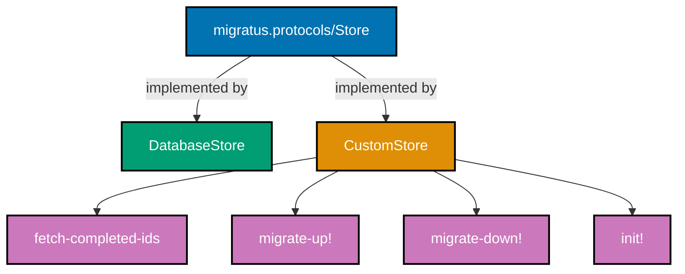
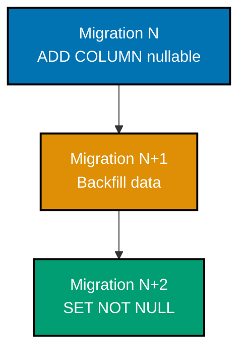
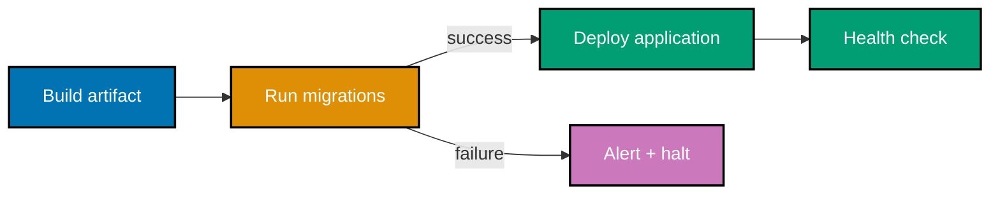
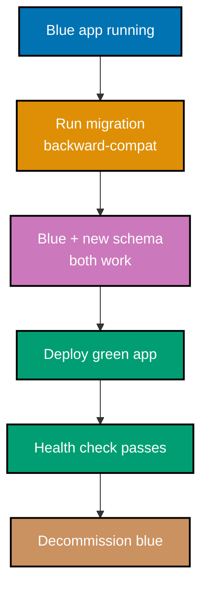
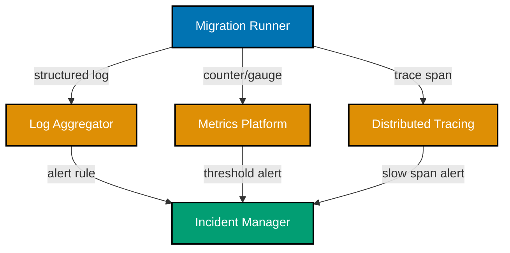

## Advanced Examples (61-85)

**Coverage**: 75-95% of Migratus functionality

**Focus**: Custom protocols, zero-downtime deployment patterns, CI/CD integration, REPL-driven development, observability, and production best practices.

These examples assume you understand beginner and intermediate concepts (config map, migration pairs, core API, transactions, rollback, data migrations). All examples are self-contained and production-ready.

---

### Example 61: Custom Migration Protocol

Migratus exposes a `Protocol` abstraction that lets you implement a custom migration store. By satisfying `migratus.protocols/Store` and `migratus.protocols/Migration`, you can back migrations with any medium—a cloud blob store, a distributed config system, or an in-memory registry for testing.



```clojure
(ns myapp.migrations.custom-store
  "Implements a custom in-memory Migratus store for unit testing.
   Satisfies migratus.protocols/Store so tests never touch a real database."
  (:require [migratus.protocols :as mp]))
  ; => migratus.protocols holds the defprotocol definitions

;; In-memory state: atom holding a set of applied migration IDs
(defonce applied-ids (atom #{}))
; => defonce: only initialises once per JVM lifetime, safe for REPL reloads
; => #{}: empty persistent set; Clojure sets are O(log n) contains? checks

(defrecord InMemoryStore []
  ; => defrecord creates a Java class implementing the given protocols
  ; => InMemoryStore holds no fields; state lives in the module-level atom

  mp/Store
  ; => Declares that InMemoryStore satisfies migratus.protocols/Store

  (init [_store]
    ; => _store: naming convention for unused binding; _ prefix signals intentional discard
    (reset! applied-ids #{})
    ; => reset! replaces atom value; returns new value #{} (empty set)
    nil)
    ; => init! must return nil for Migratus internals

  (fetch-completed-ids [_store]
    @applied-ids)
    ; => @ (deref) reads atom's current value
    ; => Returns a set of Long IDs that Migratus already applied

  (mark-completed! [_store id]
    (swap! applied-ids conj id)
    ; => swap! applies conj atomically; conj adds id to the set
    nil)

  (mark-failed! [_store id]
    (swap! applied-ids disj id)
    ; => disj removes id from set; idempotent if id not present
    nil))

(defn make-config [migrations-dir]
  ; => Factory fn; callers never construct the record directly
  {:store         (->InMemoryStore)
   ; => ->InMemoryStore: positional constructor generated by defrecord
   :migration-dir migrations-dir
   :db            nil})
   ; => db is nil for in-memory store; real stores need a connection map

;; Usage in tests:
(comment
  (require '[migratus.core :as migratus])
  (def cfg (make-config "test-migrations"))
  (migratus/migrate cfg)
  ; => Runs migrations against the in-memory store; no DB side effects
  @applied-ids)
  ; => Inspect which IDs were applied during the test run
```

**Key Takeaway**: Implement `migratus.protocols/Store` with a `defrecord` to swap the migration backend entirely, enabling hermetic unit tests that run without a database.

**Why It Matters**: Production migrations often require multi-environment pipelines where spinning up a real PostgreSQL instance per test suite is expensive and slow. A custom in-memory store lets you verify migration ordering, conflict detection, and rollback logic in milliseconds. Teams that rely on production-like databases for all migration tests discover flakiness (port conflicts, data residue) that derails CI pipelines. Separating the store protocol from the migration execution logic follows Migratus's intentional open/closed design and enables safe experimentation with alternative backends.

---

### Example 62: Zero-Downtime Column Addition

Adding a new column to a live table is safe in PostgreSQL when the column is nullable or has a server-side default. The addition acquires only a brief `ACCESS EXCLUSIVE` lock for the catalog update; rows are not rewritten.

```sql
-- resources/migrations/020-add-phone-to-users.up.sql
-- => Zero-downtime column addition: nullable column, no DEFAULT requiring rewrite

ALTER TABLE users
  ADD COLUMN IF NOT EXISTS phone TEXT;
-- => TEXT column: nullable by default; no table rewrite occurs
-- => IF NOT EXISTS: idempotent; safe to re-run if migration partially applied
-- => PostgreSQL acquires ACCESS EXCLUSIVE briefly (catalog only, not row scan)
-- => Application reads NULL for existing rows until they update their phone field

-- Optional: add a CHECK constraint once column exists
ALTER TABLE users
  ADD CONSTRAINT chk_phone_format
  CHECK (phone IS NULL OR length(phone) >= 7);
-- => Constraint validated ONLY for new/updated rows (NOT VALID omitted here intentionally)
-- => Existing NULL values pass: IS NULL branch short-circuits
```

```sql
-- resources/migrations/020-add-phone-to-users.down.sql
ALTER TABLE users
  DROP COLUMN IF EXISTS phone;
-- => Drops column and all data; IF EXISTS prevents error on re-rollback
-- => Also drops the chk_phone_format constraint automatically
```

**Key Takeaway**: Adding a nullable column with no `DEFAULT` (or a `DEFAULT` of a constant in PostgreSQL 11+) is a metadata-only operation and safe under production traffic without downtime.

**Why It Matters**: Developers unfamiliar with PostgreSQL locking mechanics sometimes add `NOT NULL DEFAULT ''` columns expecting them to be safe, only to discover that older PostgreSQL versions rewrite the entire table to stamp the default value into every row—causing multi-minute exclusive locks on a 100M-row table. Understanding the distinction between metadata-only changes and row-rewriting operations is foundational to zero-downtime schema evolution at scale.

---

### Example 63: Zero-Downtime Column Removal (3-Phase)

Removing a column safely requires three separate deployments to avoid errors in application code that still references the old column.


**Phase 1 — Stop referencing the column in application code (no migration yet):**

```clojure
;; Before (references old column):
;; (jdbc/execute! db ["SELECT id, username, legacy_notes FROM users WHERE id = ?" id])

;; After phase 1 (column ignored in queries; still present in DB):
(defn find-user [db id]
  ; => Fetch user without legacy_notes; column still exists, just not selected
  (jdbc/execute-one! db
    ["SELECT id, username, email FROM users WHERE id = ?" id]))
  ; => Application is now safe whether or not the column exists
  ; => Deploy this code change before running the DROP COLUMN migration
```

**Phase 2 — Migration to drop the column (after phase 1 is fully deployed):**

```sql
-- resources/migrations/021-drop-legacy-notes.up.sql
ALTER TABLE users
  DROP COLUMN IF EXISTS legacy_notes;
-- => Safe now: no live application code queries this column
-- => IF NOT EXISTS prevents errors if column was already removed manually
-- => Takes ACCESS EXCLUSIVE lock briefly; row data freed immediately
```

**Phase 3 — Cleanup (remove IF NOT EXISTS guards in future):**

```clojure
;; Phase 3 is optional cleanup of defensive guards added in phase 1.
;; Nothing to do in migrations; update code comments and remove guards
;; in a follow-up refactor commit.
(comment
  "Three phases summary:
   1. Deploy code that ignores the column.
   2. Run the DROP COLUMN migration.
   3. Optional: remove defensive guards in a cleanup commit.")
  ; => Documenting the pattern in source keeps institutional knowledge accessible
```

**Key Takeaway**: Never drop a column and update application code in the same deployment; always remove code references first, then run the `DROP COLUMN` migration after the code change is fully live.

**Why It Matters**: Blue-green and rolling deployments mean old and new application versions run simultaneously. If the migration runs before old pods shut down, those old pods crash with `column does not exist` errors—causing partial outages. The three-phase pattern decouples schema from code deployments and guarantees both old and new application versions work at every point in the rollout.

---

### Example 64: Zero-Downtime Table Rename

Table renames in PostgreSQL are instantaneous (catalog update only) but break any application code using the old name. The safe approach uses a view to maintain the old name as an alias while code migrates.

```sql
-- resources/migrations/022-rename-expenses-to-transactions.up.sql
-- => Phase 1: rename the table and create a view under the old name
-- => migratus-no-transaction not needed; table rename is transactional
-- migratus-no-transaction
-- => Using no-transaction here because we chain DDL + view creation
-- => Some PostgreSQL versions behave better outside a transaction for this combo

ALTER TABLE expenses RENAME TO transactions;
-- => Instantaneous: only updates pg_class catalog entry
-- => All existing indexes, constraints, sequences move with the table

CREATE OR REPLACE VIEW expenses AS
  SELECT * FROM transactions;
-- => Legacy alias: old application code using "expenses" still works
-- => VIEW expenses proxies to transactions; transparent for SELECT queries
-- => INSERT/UPDATE/DELETE on simple views also work in PostgreSQL (auto-updatable views)
```

```sql
-- resources/migrations/022-rename-expenses-to-transactions.down.sql
-- migratus-no-transaction
DROP VIEW IF EXISTS expenses;
-- => Remove alias before reversing rename
ALTER TABLE transactions RENAME TO expenses;
-- => Restore original name; safe if view dropped first
```

**Key Takeaway**: Create a view under the old table name immediately after renaming so legacy application code continues working during the migration window, then drop the view once all callers use the new name.

**Why It Matters**: Table renames touch every query, ORM mapping, and stored procedure that references the old name. Doing them atomically with a single migration and a compatibility view gives teams a controllable cut-over window—deploy the migration, then migrate application code across releases without a hard cutover deadline. Without the view, a missed reference causes runtime errors discovered only under production traffic.

---

### Example 65: Large Table Migration with Batched Updates

Updating millions of rows in a single `UPDATE` statement holds row-level locks for the entire duration, blocking concurrent writes. Batched updates process rows in chunks to minimise lock contention.

```clojure
;; resources/migrations/023-backfill-status.clj
(ns migrations.023-backfill-status
  "Backfill status column in batches to avoid long-running lock contention."
  (:require [next.jdbc :as jdbc]))
  ; => Clojure migration: SQL alone cannot express the batch loop

(def batch-size 5000)
; => Tune batch-size: larger = fewer round trips, longer locks per batch
; => 1000-10000 is a common range; test on staging with production data volume

(defn up [db]
  ; => db: next.jdbc connectable provided by Migratus
  (loop [offset 0]
    ; => Tail-recursive loop; offset tracks how many rows processed so far
    (let [result (jdbc/execute-one! db
                   ["UPDATE users
                     SET status = 'active'
                     WHERE status IS NULL
                     AND id IN (
                       SELECT id FROM users WHERE status IS NULL
                       ORDER BY id
                       LIMIT ? OFFSET ?
                     )"
                    batch-size offset])]
                   ; => Subquery selects a stable ordered page; UPDATE applies to that page
                   ; => ORDER BY id ensures deterministic pagination across batches
      (let [updated (:next.jdbc/update-count result)]
        ; => :next.jdbc/update-count: number of rows modified by this batch
        (when (pos? updated)
          ; => pos?: true if updated > 0; terminates loop when no more rows
          (println "Backfilled batch at offset" offset "rows:" updated)
          (recur (+ offset batch-size)))))))
          ; => recur: tail-call optimisation; no stack growth regardless of table size

(defn down [db]
  ; => Reverting a backfill is usually a no-op; data loss acceptable in rollback
  (jdbc/execute! db
    ["UPDATE users SET status = NULL WHERE status = 'active'"]))
    ; => Caution: this also clears statuses set legitimately after migration ran
    ; => Consider a version column or timestamp to scope the rollback precisely
```

**Key Takeaway**: Use a Clojure migration with a `loop`/`recur` batch pattern to process large tables incrementally, trading total migration time for reduced per-batch lock duration.

**Why It Matters**: A naive `UPDATE users SET status = 'active' WHERE status IS NULL` on a 50M-row table holds an `ACCESS SHARE` read lock and row locks for potentially minutes. During that time, inserts and updates on those rows queue up, causing application timeouts. Batched updates release locks between iterations, keeping the application responsive at the cost of running longer. Teams that discover this only after triggering a production incident lose customer trust; building the batch pattern into standard procedure prevents it.

---

### Example 66: Online Index Creation (CONCURRENTLY)

PostgreSQL's `CREATE INDEX CONCURRENTLY` builds an index without blocking writes. It takes longer than a standard `CREATE INDEX` but does not prevent `INSERT`, `UPDATE`, or `DELETE` during construction.

```sql
-- resources/migrations/024-add-user-email-index.up.sql
-- migratus-no-transaction
-- => CONCURRENTLY cannot run inside a transaction block
-- => Migratus default wraps in transaction; this directive disables it for this file

CREATE INDEX CONCURRENTLY IF NOT EXISTS idx_users_email
  ON users (email);
-- => CONCURRENTLY: two-phase build using snapshot isolation
-- => Phase 1: scans table, builds index snapshot (other writes continue)
-- => Phase 2: catches up with writes that occurred during phase 1
-- => Final: marks index valid; future queries can use it
-- => IF NOT EXISTS: idempotent; safe if migration was interrupted mid-build

-- For partial indexes with CONCURRENTLY:
CREATE INDEX CONCURRENTLY IF NOT EXISTS idx_users_active_created
  ON users (created_at DESC)
  WHERE status = 'active';
-- => Partial index: only indexes active users; smaller, faster to update
-- => DESC: pre-sorted for ORDER BY created_at DESC queries (avoids sort step)
```

```sql
-- resources/migrations/024-add-user-email-index.down.sql
-- migratus-no-transaction
-- => DROP INDEX CONCURRENTLY also requires no-transaction
DROP INDEX CONCURRENTLY IF EXISTS idx_users_email;
DROP INDEX CONCURRENTLY IF EXISTS idx_users_active_created;
-- => CONCURRENTLY: waits for in-flight transactions before marking index invalid
-- => IF EXISTS: safe to re-run if partially rolled back
```

**Key Takeaway**: Always use `CREATE INDEX CONCURRENTLY` in production migration files and always pair the migration file with `-- migratus-no-transaction` since `CONCURRENTLY` is incompatible with explicit transaction blocks.

**Why It Matters**: A standard `CREATE INDEX` on a large table acquires `SHARE` lock, blocking all writes for the index build duration—potentially minutes on a 100M-row table. On a 24/7 SaaS platform, this means writes queue up and time out during the index build. `CONCURRENTLY` eliminates write blocking at the cost of longer build time and one additional table scan. Every production index addition should default to `CONCURRENTLY`; only use the blocking form in controlled maintenance windows.

---

### Example 67: Data Backfill Pattern

A data backfill populates a new column based on existing data. The safest pattern separates the schema change (adding the column) from the data fill (populating it) and from the constraint enforcement (adding `NOT NULL`) across three migrations.



**Migration N — Add nullable column:**

```sql
-- resources/migrations/025-add-display-name-nullable.up.sql
ALTER TABLE users
  ADD COLUMN IF NOT EXISTS display_name TEXT;
-- => Nullable: no DEFAULT means no table rewrite; zero-downtime addition
-- => Application writes NULL for new rows until backfill completes
```

**Migration N+1 — Backfill from existing data:**

```clojure
;; resources/migrations/026-backfill-display-name.clj
(ns migrations.026-backfill-display-name
  (:require [next.jdbc :as jdbc]))

(defn up [db]
  ; => Populate display_name from username for all existing rows
  (jdbc/execute! db
    ["UPDATE users
      SET display_name = username
      WHERE display_name IS NULL"]))
    ; => WHERE display_name IS NULL: idempotent; skip rows already backfilled
    ; => For large tables, replace with batch loop from Example 65

(defn down [_db]
  ; => Backfill down is a no-op; column removal handled by migration N's down
  nil)
```

**Migration N+2 — Enforce NOT NULL after backfill:**

```sql
-- resources/migrations/027-set-display-name-not-null.up.sql
ALTER TABLE users
  ALTER COLUMN display_name SET NOT NULL;
-- => Safe now: every existing row has a non-null display_name after backfill
-- => PostgreSQL validates constraint on all rows before applying; fails if any NULL remains
-- => In PostgreSQL 12+, adding NOT VALID then VALIDATE CONSTRAINT allows background validation
```

**Key Takeaway**: Split column addition, data backfill, and constraint enforcement across three separate migrations so each step can be deployed and validated independently before proceeding.

**Why It Matters**: Combining `ADD COLUMN NOT NULL DEFAULT ''` into a single migration rewrites the entire table in older PostgreSQL versions, causing a blocking lock. The three-migration pattern lets you deploy the nullable column first (zero downtime), run the backfill during a low-traffic window, and only then enforce the constraint. If the backfill fails mid-way, you roll back only that migration—the schema remains valid and the application continues working with nullable values.

---

### Example 68: Migratus in CI/CD Pipeline

Running Migratus migrations automatically in CI/CD ensures the database schema matches the code being deployed. The migration should run as a pre-deployment step before application pods start.



```clojure
(ns myapp.migrations.runner
  "Standalone migration runner invoked from CI/CD pre-deploy scripts.
   Reads DATABASE_URL from environment; exits non-zero on failure."
  (:require [migratus.core :as migratus])
  (:gen-class))
  ; => :gen-class: generates a Java class with a main method (required for uberjar entry)

(defn build-config []
  ; => Reads connection details from environment variables (twelve-factor)
  (let [db-url (System/getenv "DATABASE_URL")]
    ; => System/getenv: reads process environment; returns nil if unset
    (when-not db-url
      (throw (ex-info "DATABASE_URL environment variable is not set"
                      {:cause :missing-env-var})))
                      ; => ex-info: creates ExceptionInfo with attached data map
                      ; => Throwing here fails fast before attempting DB connection
    {:store         :database
     :migration-dir "migrations"    ; => Classpath-relative; matches resources/migrations/
     :db            {:connection-uri db-url}}))
                     ; => connection-uri: next.jdbc format; includes host, port, db, creds

(defn -main [& _args]
  ; => -main: entry point called by java -cp ... myapp.migrations.runner.Runner
  ; => _args: unused; naming convention signals intentional discard
  (println "Starting migration runner...")
  (let [config (build-config)]
    (try
      (migratus/migrate config)
      ; => Applies all pending up.sql migrations; no-op if all applied
      (println "Migrations completed successfully.")
      (System/exit 0)
      ; => Exit 0: signals success to CI/CD pipeline; proceed to deploy
      (catch Exception e
        (println "Migration failed:" (.getMessage e))
        ; => .getMessage: Java interop call on the Exception object
        (System/exit 1)))))
        ; => Exit 1: signals failure; CI/CD pipeline halts, alert fires
```

**Key Takeaway**: Package the migration runner as a standalone `(-main)` entry point that reads `DATABASE_URL` from the environment and exits with a non-zero code on failure, integrating cleanly with any CI/CD orchestrator.

**Why It Matters**: Migrations that run inside the application on startup create race conditions in multi-pod deployments—if five pods start simultaneously, all five attempt to migrate, and only Migratus's advisory lock prevents corruption. A dedicated pre-deploy migration job that runs once before pods start eliminates the race entirely. It also provides a clear deployment gate: if the migration fails, zero new application pods start, leaving the old version running and the database intact.

---

### Example 69: Migration Monitoring with Metrics

Tracking migration duration and status as metrics enables alerting when migrations run longer than expected or fail silently in automated pipelines.

```clojure
(ns myapp.migrations.monitored
  "Wraps migratus/migrate with timing and metric emission."
  (:require [migratus.core :as migratus]
            [clojure.tools.logging :as log]))
            ; => clojure.tools.logging: SLF4J facade; routes to Logback/Log4j at runtime

(defn emit-metric! [metric-name value tags]
  ; => Stub: replace with your metrics client (StatsD, Prometheus, CloudWatch)
  (log/infof "METRIC %s=%s tags=%s" metric-name value tags))
  ; => infof: formatted log at INFO level; logged and emitted as structured metric

(defn migrate-with-metrics! [config]
  ; => Wraps standard migrate call with timing and outcome tracking
  (let [start-ms (System/currentTimeMillis)]
    ; => currentTimeMillis: wall-clock time in milliseconds; used for duration calc
    (try
      (migratus/migrate config)
      ; => Runs all pending migrations; throws on any migration failure
      (let [duration-ms (- (System/currentTimeMillis) start-ms)]
        ; => Subtract start from current time to get elapsed milliseconds
        (emit-metric! "migration.duration_ms" duration-ms {:status "success"})
        (emit-metric! "migration.success" 1 {})
        ; => Emit counter: allows alert on migration.success rate dropping below 1
        (log/infof "Migrations succeeded in %d ms" duration-ms))
      (catch Exception e
        (let [duration-ms (- (System/currentTimeMillis) start-ms)]
          (emit-metric! "migration.duration_ms" duration-ms {:status "failure"})
          (emit-metric! "migration.failure" 1 {:error (.getMessage e)})
          ; => failure counter: PagerDuty alert on any non-zero value
          (log/errorf e "Migration failed after %d ms" duration-ms)
          (throw e))))))
          ; => Re-throw so callers (CI/CD runner) still see the failure and exit non-zero

(comment
  ;; Example usage:
  (def config {:store :database
               :migration-dir "migrations"
               :db {:connection-uri (System/getenv "DATABASE_URL")}})
  (migrate-with-metrics! config))
  ; => Emits timing metrics; logs success or failure with duration
```

**Key Takeaway**: Wrap `migratus/migrate` in a timing harness that emits duration and success/failure metrics so your observability platform can alert on slow or failed migrations before they affect production deployments.

**Why It Matters**: Silent migration failures in automated pipelines are among the hardest incidents to diagnose—the application deploys, but schema and code are out of sync, causing subtle data corruption or runtime errors that manifest minutes later. Metrics with immediate alerting reduce time-to-detection from hours to seconds. Duration metrics also build a historical baseline: a migration that normally takes 200ms spiking to 45 seconds signals a locking conflict worth investigating before the next deployment.

---

### Example 70: Migration Rollback Testing

Validating that every migration's down path actually works prevents nasty surprises during production incidents when you need to roll back quickly.

```clojure
(ns myapp.migrations.rollback-test
  "Test harness: apply and rollback each migration pair, verifying no errors."
  (:require [migratus.core :as migratus]
            [next.jdbc :as jdbc]
            [clojure.test :refer [deftest is testing]]))

(defn test-db-config []
  ; => Use a dedicated test database; never rollback-test against production
  {:store         :database
   :migration-dir "resources/migrations"
   :db            {:connection-uri
                   (or (System/getenv "TEST_DATABASE_URL")
                       "jdbc:postgresql://localhost:5432/testdb?user=test&password=test")}})
                   ; => or: returns first truthy value; falls back to local default

(deftest test-all-migration-rollbacks
  (testing "each migration can be applied and then rolled back"
    (let [config (test-db-config)]
      (migratus/reset config)
      ; => reset: runs all down migrations then all up migrations
      ; => Verifies both directions work without errors

      ;; Apply all migrations up
      (migratus/migrate config)
      ; => All pending migrations applied; schema fully up-to-date

      ;; Roll back one by one until none remain
      (loop []
        (let [pending-down (migratus.core/completed-list config)]
          ; => completed-list: returns seq of applied migration IDs in order
          (when (seq pending-down)
            ; => seq: returns nil for empty collection; falsy in when check
            (migratus/rollback config)
            ; => Rolls back the most recently applied migration
            (recur))))
            ; => Loop until no applied migrations remain

      ;; Verify schema_migrations is empty
      (let [ds (jdbc/get-datasource (get-in config [:db :connection-uri]))]
        ; => get-datasource: creates a HikariCP pool from the URI string
        (let [count-result (jdbc/execute-one! ds
                             ["SELECT COUNT(*) AS cnt FROM schema_migrations"])]
          (is (= 0 (:cnt count-result))
              "All migrations should be rolled back")))))))
              ; => is: clojure.test assertion; fails test if condition false
```

**Key Takeaway**: Automate rollback testing by applying all migrations up, then rolling each back individually in a dedicated test database, asserting the `schema_migrations` table returns to empty.

**Why It Matters**: Down migrations are rarely exercised in normal development—they run only during incidents. Discovering that a down migration is broken at 2 AM during a production rollback is the worst possible time. Automated rollback tests in CI catch broken down files during the pull request review cycle, when the cost of fixing them is minutes rather than hours. Teams that treat down migrations as optional documentation rather than tested code accumulate a graveyard of broken rollback paths.

---

### Example 71: Blue-Green Deployment Migrations

Blue-green deployments require migrations to be backward-compatible with the currently running (blue) application version so the database can be migrated before the green version goes live.



```clojure
(ns myapp.migrations.compat-guide
  "Documentation namespace: rules for backward-compatible migrations
   required by blue-green deployments.")

;; RULE 1: Add columns as nullable (blue app ignores them; green app writes them)
(comment
  "Safe: ALTER TABLE orders ADD COLUMN discount_pct NUMERIC(5,2);
   Blue app: ignores the new column; existing queries unaffected.
   Green app: writes discount_pct; reads it for new business logic.")

;; RULE 2: New tables are always safe (blue app never queries them)
(comment
  "Safe: CREATE TABLE discount_codes (...);
   Blue app: has no code referencing discount_codes; zero impact.
   Green app: uses discount_codes for new feature.")

;; RULE 3: NEVER rename or drop columns while blue is running
(comment
  "Dangerous: ALTER TABLE orders RENAME COLUMN total TO total_amount;
   Blue app: still queries 'total'; crashes with column-not-found errors.
   Fix: use the three-phase column rename from Example 64.")

;; RULE 4: NEVER change column types while blue is running
(comment
  "Dangerous: ALTER TABLE orders ALTER COLUMN amount TYPE BIGINT;
   Blue app: may cast incompatibly; data loss or conversion errors.
   Fix: add new column, backfill, update code, then drop old column.")

(defn validate-migration-compat! [migration-sql]
  ; => Simple static check: warn on patterns known to break blue-green
  (let [dangerous-patterns ["DROP COLUMN" "RENAME COLUMN" "ALTER COLUMN"
                             "DROP TABLE" "RENAME TABLE"]]
    ; => Vector of SQL keywords that signal backward-incompatible changes
    (doseq [pattern dangerous-patterns]
      ; => doseq: iterate for side effects; no return value used
      (when (.contains (clojure.string/upper-case migration-sql) pattern)
        ; => upper-case: normalise case before searching; SQL is case-insensitive
        (println (str "WARNING: migration contains '" pattern
                      "' which may break blue-green compatibility"))))))
        ; => str: string concatenation; prints advisory warning for human review
```

**Key Takeaway**: Blue-green deployments require every migration run before the green deployment to be fully backward-compatible with the blue application; restrict pre-cutover migrations to additive operations only.

**Why It Matters**: The value of blue-green deployment—instant rollback by switching traffic back to blue—is destroyed if the migration breaks blue. A dropped column or renamed table means the rollback target crashes on every request. Building a migration compatibility classifier into your review process (as a lint step or pull request check) catches incompatible migrations before they reach production, preserving the rollback option that blue-green deployments exist to provide.

---

### Example 72: Feature Flag Migration Pattern

Migrations that support feature flags add schema elements used by new features before those features are enabled, allowing the feature to be toggled without a deployment.

```sql
-- resources/migrations/028-add-feature-flags-table.up.sql
-- => Feature flag table: controls which features are enabled per tenant
CREATE TABLE IF NOT EXISTS feature_flags (
  id          BIGSERIAL PRIMARY KEY,
  flag_name   TEXT NOT NULL,            -- => Unique feature identifier (e.g. 'new_checkout')
  tenant_id   TEXT,                     -- => NULL = global flag; non-null = tenant-specific
  enabled     BOOLEAN NOT NULL DEFAULT FALSE,
  -- => Default FALSE: new flags are disabled until explicitly enabled
  created_at  TIMESTAMPTZ NOT NULL DEFAULT now(),
  updated_at  TIMESTAMPTZ NOT NULL DEFAULT now(),

  UNIQUE (flag_name, tenant_id)         -- => Ensures one row per flag+tenant combination
  -- => NULLS are distinct in PostgreSQL UNIQUE constraints: two rows with same flag_name
  -- => and NULL tenant_id are considered DIFFERENT; use COALESCE(tenant_id,'') to prevent
);

CREATE INDEX IF NOT EXISTS idx_feature_flags_name_tenant
  ON feature_flags (flag_name, tenant_id);
-- => Composite index: lookup by flag_name alone, or by flag_name + tenant_id
-- => Most common query: WHERE flag_name = ? AND (tenant_id = ? OR tenant_id IS NULL)
```

```sql
-- resources/migrations/028-add-feature-flags-table.down.sql
DROP TABLE IF EXISTS feature_flags;
```

```clojure
(defn flag-enabled? [db flag-name tenant-id]
  ; => Check feature flag: tenant-specific takes precedence over global
  (let [row (jdbc/execute-one! db
              ["SELECT enabled FROM feature_flags
                WHERE flag_name = ?
                AND (tenant_id = ? OR tenant_id IS NULL)
                ORDER BY tenant_id NULLS LAST
                LIMIT 1"
               flag-name tenant-id])]
               ; => ORDER BY tenant_id NULLS LAST: tenant-specific row ranks before global
               ; => LIMIT 1: we only care about the highest-precedence match
    (boolean (:enabled row))))
    ; => boolean: coerces nil (flag not found) to false; treats absent flag as disabled
```

**Key Takeaway**: Create the feature flag infrastructure in a migration before deploying code that uses it, enabling flag-controlled rollouts without additional deployments.

**Why It Matters**: Deploying code behind feature flags decouples deployment from release—you can merge and deploy code that is invisible to users until the flag is enabled. The schema must exist before the code runs, so the migration always precedes the feature deployment. Teams that skip the infrastructure migration find themselves needing emergency deployments to enable features, defeating the purpose of flag-driven rollouts.

---

### Example 73: Multi-Tenant Schema Migration

Multi-tenant applications can use PostgreSQL schemas (namespaces) to isolate tenant data. Migratus can run migrations against each tenant schema programmatically.

```clojure
(ns myapp.migrations.multi-tenant
  "Runs migrations against each tenant's PostgreSQL schema."
  (:require [migratus.core :as migratus]
            [next.jdbc :as jdbc]))

(defn tenant-schemas [db]
  ; => Discover all tenant schemas from a registry table in the public schema
  (->> (jdbc/execute! db
         ["SELECT schema_name FROM tenant_registry WHERE active = true"])
         ; => tenant_registry: admin table listing provisioned tenants
       (mapv :schema_name)))
       ; => mapv: eager map to vector; returns ["tenant_a" "tenant_b" ...]

(defn make-tenant-config [base-uri schema-name]
  ; => Build a per-tenant config by setting search_path to the tenant schema
  {:store         :database
   :migration-dir "migrations/tenant"
   ; => Separate migration dir for tenant-specific schema (not public schema DDL)
   :db            {:connection-uri
                   (str base-uri "&currentSchema=" schema-name)}})
                   ; => currentSchema: PostgreSQL JDBC option sets search_path for connection
                   ; => All unqualified table names resolve to the tenant schema

(defn migrate-all-tenants! [base-uri admin-db]
  ; => Apply tenant migrations to every active tenant schema
  (let [schemas (tenant-schemas admin-db)]
    (doseq [schema schemas]
      ; => doseq: iterate for side effects; no return value
      (let [config (make-tenant-config base-uri schema)]
        (println "Migrating schema:" schema)
        (migratus/migrate config)
        ; => Runs pending migrations scoped to this tenant's search_path
        (println "Done:" schema)))))

(comment
  (def admin-db (jdbc/get-datasource "jdbc:postgresql://localhost:5432/platform?user=admin&password=secret"))
  (migrate-all-tenants!
    "jdbc:postgresql://localhost:5432/platform?user=admin&password=secret"
    admin-db))
    ; => Migrates every active tenant schema in sequence
    ; => For hundreds of tenants, parallelise with pmap or core.async/pipeline
```

**Key Takeaway**: Build a tenant discovery function that returns schema names, then construct per-tenant Migratus configs with `currentSchema` in the connection URI to run the same migration files against each tenant's isolated schema.

**Why It Matters**: Schema-per-tenant isolation prevents data leakage between tenants at the database level and enables targeted backup and restore operations per tenant. The challenge is keeping all tenant schemas in sync as migrations accumulate. A programmatic migration runner that iterates tenant schemas—rather than relying on manual per-tenant runs—ensures no tenant is accidentally left on an older schema version during a release.

---

### Example 74: Migration with pgcrypto Encryption

The `pgcrypto` extension enables column-level encryption in PostgreSQL. Migrations install the extension and create tables with encrypted columns in a single ordered sequence.

```sql
-- resources/migrations/029-install-pgcrypto.up.sql
-- => pgcrypto: PostgreSQL extension for cryptographic functions
CREATE EXTENSION IF NOT EXISTS pgcrypto;
-- => IF NOT EXISTS: idempotent; safe if extension already installed on the cluster
-- => pgcrypto provides: gen_random_uuid(), crypt(), gen_salt(), pgp_sym_encrypt()
-- => Must be installed once per database; typically a one-time setup migration
```

```sql
-- resources/migrations/030-create-secrets-table.up.sql
-- => Table storing encrypted secrets using pgcrypto symmetric encryption
CREATE TABLE IF NOT EXISTS secrets (
  id           UUID PRIMARY KEY DEFAULT gen_random_uuid(),
  -- => gen_random_uuid(): pgcrypto function; cryptographically random UUID v4
  owner_id     TEXT NOT NULL,
  secret_name  TEXT NOT NULL,
  secret_value BYTEA NOT NULL,
  -- => BYTEA: binary data type; stores encrypted ciphertext (not readable as text)
  created_at   TIMESTAMPTZ NOT NULL DEFAULT now(),

  UNIQUE (owner_id, secret_name)
  -- => One secret per owner+name pair; enforce uniqueness at DB level
);
```

```clojure
;; Application code: encrypting and decrypting with pgcrypto
(defn store-secret! [db owner-id name plaintext encryption-key]
  ; => Encrypt plaintext using AES via pgcrypto; store ciphertext only
  (jdbc/execute! db
    ["INSERT INTO secrets (owner_id, secret_name, secret_value)
      VALUES (?, ?, pgp_sym_encrypt(?, ?))"
     owner-id name plaintext encryption-key]))
     ; => pgp_sym_encrypt: OpenPGP symmetric encryption; key never stored in DB
     ; => encryption-key: must come from vault/env; never hardcoded

(defn read-secret [db owner-id name encryption-key]
  ; => Decrypt secret value; decryption occurs inside PostgreSQL
  (jdbc/execute-one! db
    ["SELECT pgp_sym_decrypt(secret_value, ?) AS plaintext
      FROM secrets
      WHERE owner_id = ? AND secret_name = ?"
     encryption-key owner-id name]))
     ; => pgp_sym_decrypt: decrypts BYTEA using the provided key
     ; => Returns {:plaintext "decrypted value"} or nil if not found
```

**Key Takeaway**: Install `pgcrypto` in its own migration before any migrations that use its functions, and use `pgp_sym_encrypt`/`pgp_sym_decrypt` for column-level encryption without changing your application's SQL query patterns.

**Why It Matters**: Column-level encryption protects sensitive fields (API tokens, personal data) from exposure in database backups, query logs, and read replicas that might have broader access than the primary. Storing the encryption key outside the database (in a secrets manager or HSM) means a database breach does not automatically expose plaintext values. Migrations that install pgcrypto as a separate numbered step make the dependency explicit and auditable in the migration history.

---

### Example 75: Audit Trail Table Migration

An audit trail records every change to critical tables with who made the change and when. Migrations create the audit table and a PostgreSQL trigger that populates it automatically.

```sql
-- resources/migrations/031-create-audit-log.up.sql
-- => Audit log: immutable record of all changes to auditable tables

CREATE TABLE IF NOT EXISTS audit_log (
  id          BIGSERIAL PRIMARY KEY,
  table_name  TEXT NOT NULL,                    -- => Which table was changed
  record_id   TEXT NOT NULL,                    -- => PK of the changed row (cast to TEXT)
  operation   TEXT NOT NULL CHECK (operation IN ('INSERT','UPDATE','DELETE')),
  -- => CHECK: only valid DML operations; prevents garbage data
  old_data    JSONB,                            -- => Row before change (NULL for INSERT)
  new_data    JSONB,                            -- => Row after change (NULL for DELETE)
  changed_by  TEXT,                             -- => Application user (from session variable)
  changed_at  TIMESTAMPTZ NOT NULL DEFAULT now()
);

CREATE INDEX IF NOT EXISTS idx_audit_log_table_record
  ON audit_log (table_name, record_id, changed_at DESC);
-- => Composite index: retrieve full history of a specific record efficiently
-- => DESC on changed_at: most recent changes returned first without sort step

-- Trigger function: called by per-table triggers
CREATE OR REPLACE FUNCTION log_audit_change()
RETURNS TRIGGER AS $$
-- => RETURNS TRIGGER: special return type for trigger functions
BEGIN
  INSERT INTO audit_log (table_name, record_id, operation, old_data, new_data, changed_by)
  VALUES (
    TG_TABLE_NAME,
    -- => TG_TABLE_NAME: trigger variable; name of the table that fired the trigger
    CASE WHEN TG_OP = 'DELETE' THEN OLD.id::TEXT ELSE NEW.id::TEXT END,
    -- => TG_OP: 'INSERT', 'UPDATE', or 'DELETE'; determines which row variable to use
    TG_OP,
    CASE WHEN TG_OP = 'INSERT' THEN NULL ELSE row_to_json(OLD)::JSONB END,
    -- => OLD: previous row (NULL during INSERT trigger)
    CASE WHEN TG_OP = 'DELETE' THEN NULL ELSE row_to_json(NEW)::JSONB END,
    -- => NEW: new row (NULL during DELETE trigger)
    current_setting('app.current_user', TRUE)
    -- => current_setting: reads PostgreSQL session variable set by application
    -- => TRUE: do not raise error if variable not set (returns NULL instead)
  );
  RETURN NEW;
  -- => RETURN NEW: required for AFTER triggers; Migratus expects non-null return
END;
$$ LANGUAGE plpgsql;
-- => plpgsql: PostgreSQL procedural language; required for TRIGGER functions

-- Attach trigger to the users table:
CREATE TRIGGER trg_audit_users
  AFTER INSERT OR UPDATE OR DELETE ON users
  FOR EACH ROW EXECUTE FUNCTION log_audit_change();
-- => FOR EACH ROW: trigger fires once per affected row (not once per statement)
-- => AFTER: fires after the DML commits; row data fully available in OLD/NEW
```

```sql
-- resources/migrations/031-create-audit-log.down.sql
DROP TRIGGER IF EXISTS trg_audit_users ON users;
DROP FUNCTION IF EXISTS log_audit_change();
DROP TABLE IF EXISTS audit_log;
-- => Order matters: drop trigger before function before table
```

**Key Takeaway**: Create the audit log table, trigger function, and per-table triggers in a single migration file to keep the audit infrastructure atomic; order the down migration to drop triggers before the function and table they depend on.

**Why It Matters**: Application-level audit logging is fragile—it misses bulk updates, direct database modifications, and code paths where the audit call is accidentally omitted. Database triggers fire unconditionally for every row change, regardless of how the change was made. Storing audit data in JSONB captures the full row snapshot, enabling forensic queries like "show me every state this record passed through." Regulated industries (finance, healthcare) require tamper-evident audit trails; building them in the database layer rather than the application layer is more reliable.

---

### Example 76: Soft Delete Schema Pattern

Soft deletes mark rows as deleted without removing them from the database, preserving referential integrity and enabling data recovery. The migration adds a `deleted_at` column and a partial index.

```sql
-- resources/migrations/032-add-soft-delete-to-orders.up.sql
-- => Soft delete: mark rows deleted without physical removal

ALTER TABLE orders
  ADD COLUMN IF NOT EXISTS deleted_at TIMESTAMPTZ;
-- => TIMESTAMPTZ: timezone-aware timestamp; NULL means "not deleted"
-- => Nullable by design: NULL = active, non-null = soft-deleted

CREATE INDEX IF NOT EXISTS idx_orders_active
  ON orders (user_id, created_at DESC)
  WHERE deleted_at IS NULL;
-- => Partial index: only indexes active (non-deleted) orders
-- => WHERE deleted_at IS NULL matches all standard application queries
-- => Application always filters WHERE deleted_at IS NULL; index used automatically

CREATE INDEX IF NOT EXISTS idx_orders_deleted
  ON orders (deleted_at)
  WHERE deleted_at IS NOT NULL;
-- => Second partial index: for admin queries that specifically list deleted orders
-- => Keeps deleted record lookups fast without bloating the active-record index
```

```clojure
;; Application helpers for soft delete pattern
(defn soft-delete! [db table-name id]
  ; => Mark a row as deleted by setting deleted_at; never removes the row
  (jdbc/execute! db
    [(str "UPDATE " table-name
          " SET deleted_at = now() WHERE id = ? AND deleted_at IS NULL")
     id]))
     ; => AND deleted_at IS NULL: idempotent; double-delete is a no-op
     ; => now(): PostgreSQL function; returns current transaction timestamp

(defn find-active [db table-name id]
  ; => Fetch only if not deleted; standard lookup pattern
  (jdbc/execute-one! db
    [(str "SELECT * FROM " table-name
          " WHERE id = ? AND deleted_at IS NULL")
     id]))
     ; => Returns nil if row not found or is soft-deleted

(defn restore! [db table-name id]
  ; => Un-delete: clear deleted_at to restore the row
  (jdbc/execute! db
    [(str "UPDATE " table-name
          " SET deleted_at = NULL WHERE id = ?")
     id]))
     ; => Restoration is instant; no data was lost during soft delete
```

**Key Takeaway**: Add a nullable `deleted_at TIMESTAMPTZ` column and pair it with a partial index on `WHERE deleted_at IS NULL` to keep active-record queries fast while preserving deleted rows for recovery.

**Why It Matters**: Hard deletes break foreign keys, remove audit evidence, and are irreversible. Soft deletes preserve referential integrity (foreign keys still resolve), enable data recovery within a retention window, and provide an implicit audit trail of when records were removed. The partial index ensures that the overwhelming majority of queries—which filter `WHERE deleted_at IS NULL`—perform identically to a table without the soft-delete column, because the index excludes deleted rows entirely.

---

### Example 77: REPL-Driven Migration Development

The Clojure REPL enables interactive migration development: write a migration, apply it, inspect the result, rollback, refine, and repeat without restarting the application.

```clojure
(ns dev.migrations
  "REPL namespace for interactive migration development.
   Only load in the :dev profile; never in production builds."
  (:require [migratus.core :as migratus]
            [next.jdbc :as jdbc]))

(def dev-config
  ; => Hardcoded dev credentials; acceptable only in dev namespace
  {:store         :database
   :migration-dir "resources/migrations"
   :db            {:connection-uri
                   "jdbc:postgresql://localhost:5432/devdb?user=dev&password=dev"}})

(defn apply-pending! []
  ; => Apply all pending migrations against the dev database
  (migratus/migrate dev-config))
  ; => Call from REPL: (dev.migrations/apply-pending!)

(defn rollback-last! []
  ; => Roll back the most recently applied migration
  (migratus/rollback dev-config))
  ; => Call from REPL: (dev.migrations/rollback-last!)

(defn reset-db! []
  ; => Down all + up all: full schema rebuild from scratch
  (migratus/reset dev-config))
  ; => WARNING: destroys all dev data; use only during schema development

(defn pending-list []
  ; => List migration IDs that have not been applied yet
  (migratus/pending-list dev-config))
  ; => Returns a seq of Migration records ready to apply

(defn inspect-schema [table-name]
  ; => Query PostgreSQL information_schema to inspect current column definitions
  (jdbc/execute! (jdbc/get-datasource (get-in dev-config [:db :connection-uri]))
    ["SELECT column_name, data_type, is_nullable, column_default
      FROM information_schema.columns
      WHERE table_name = ?
      ORDER BY ordinal_position"
     table-name]))
     ; => Useful after applying a migration to verify the schema matches expectations

(comment
  ;; REPL workflow for developing a new migration:
  ;; 1. Write the .up.sql and .down.sql files
  (apply-pending!)          ; => Apply and observe any SQL errors immediately
  (inspect-schema "users")  ; => Confirm columns exist with correct types
  (rollback-last!)          ; => Roll back to refine the migration
  ;; 2. Edit the SQL files, then re-apply
  (apply-pending!)          ; => Re-apply the corrected migration
  ;; 3. Satisfied with result; commit the migration files
  )
```

**Key Takeaway**: Maintain a `dev.migrations` REPL namespace with thin wrappers around `migratus/migrate`, `migratus/rollback`, and `migratus/reset` to enable interactive migration development cycles without restart overhead.

**Why It Matters**: Writing migration SQL in a text editor and running the full application startup to test it introduces a multi-second feedback loop per iteration. The REPL reduces that to milliseconds—apply, inspect, rollback, edit, repeat. Teams that develop migrations interactively catch syntax errors, type mismatches, and constraint violations in the development cycle rather than in CI or staging, compressing the time from first draft to correct migration significantly.

---

### Example 78: Migration with HugSQL Integration

HugSQL loads SQL queries from annotated `.sql` files as Clojure functions. Migrations that use HugSQL for data operations maintain a consistent query authorship style across migration and application code.

```clojure
;; resources/migrations/033-seed-configuration.clj
(ns migrations.033-seed-configuration
  "Seed system configuration using HugSQL queries.
   Demonstrates loading HugSQL in a Clojure migration context."
  (:require [next.jdbc :as jdbc]
            [hugsql.core :as hugsql]))
            ; => hugsql.core: parses annotated .sql files into Clojure functions

;; Define queries inline for migration self-containment
;; In production, HugSQL typically loads from separate .sql files
(def insert-config-sql
  "-- :name insert-config! :! :n
   -- :doc Insert a configuration key-value pair
   INSERT INTO system_config (config_key, config_value, description)
   VALUES (:key, :value, :description)
   ON CONFLICT (config_key) DO UPDATE
     SET config_value = EXCLUDED.config_value,
         updated_at   = now()")
  ; => :name: HugSQL annotation; defines Clojure function name
  ; => :!: command type (execute, not query); :n returns update count
  ; => ON CONFLICT: upsert pattern; idempotent re-run safe

(defn up [db]
  ; => Parse the SQL string and create the Clojure function dynamically
  (let [fns (hugsql/map-of-db-fns (hugsql/parsed-defs-from-string insert-config-sql))]
    ; => map-of-db-fns: returns a map of {function-name fn} from parsed definitions
    ; => parsed-defs-from-string: parses HugSQL annotations from a string (not a file)
    (let [insert-config! (get fns :insert-config!)]
      ; => Retrieve the generated function by its annotation name
      (doseq [cfg [{:key "max_upload_mb"  :value "50"   :description "Max file upload size in MB"}
                   {:key "session_hours"  :value "24"   :description "Session expiry in hours"}
                   {:key "rate_limit_rpm" :value "1000" :description "API rate limit requests per minute"}]]
              ; => doseq: iterate over seed data for side effects
        (insert-config! db cfg)))))
        ; => HugSQL function: accepts db and a map of :named-params
        ; => Executes the annotated SQL with parameters from the map

(defn down [db]
  (jdbc/execute! db
    ["DELETE FROM system_config WHERE config_key IN (?, ?, ?)"
     "max_upload_mb" "session_hours" "rate_limit_rpm"]))
     ; => Targeted delete: removes only the rows this migration inserted
```

**Key Takeaway**: Use `hugsql/map-of-db-fns` with `hugsql/parsed-defs-from-string` to instantiate HugSQL query functions inline inside a Clojure migration, keeping the migration self-contained while following HugSQL conventions.

**Why It Matters**: Mixing raw `jdbc/execute!` strings with application code that uses HugSQL creates two different SQL authorship styles in the same codebase. When developers move between migration files and application code, the style mismatch increases cognitive load. Standardising on HugSQL throughout—including in migrations—provides a consistent named-query pattern, SQL stored as data rather than interpolated strings, and parameter binding that prevents SQL injection regardless of where in the codebase the query originates.

---

### Example 79: Schema Drift Detection

Schema drift occurs when the live database schema diverges from the migration history—through manual `ALTER TABLE` commands, hotfixes applied directly to production, or failed rollbacks that left the schema in a partial state.

```clojure
(ns myapp.migrations.drift-detector
  "Detects schema drift by comparing pg_catalog state against expected state."
  (:require [next.jdbc :as jdbc]))

(defn actual-columns [db table-name]
  ; => Query PostgreSQL catalog for current column definitions
  (jdbc/execute! db
    ["SELECT column_name, data_type, is_nullable, column_default
      FROM information_schema.columns
      WHERE table_schema = 'public'
      AND table_name = ?
      ORDER BY ordinal_position"
     table-name]))
     ; => information_schema.columns: standard SQL view; works across PostgreSQL versions
     ; => Returns authoritative list of columns as they actually exist in the DB

(defn actual-indexes [db table-name]
  ; => Query pg_indexes for current index definitions on the table
  (jdbc/execute! db
    ["SELECT indexname, indexdef
      FROM pg_indexes
      WHERE schemaname = 'public'
      AND tablename = ?
      ORDER BY indexname"
     table-name]))
     ; => pg_indexes: PostgreSQL catalog view listing all indexes

(defn report-drift! [db expected-schema]
  ; => expected-schema: map of {:table [{:column :type}]} from code/docs
  ; => Compare against actual catalog state; print discrepancies
  (doseq [[table-name expected-cols] expected-schema]
    ; => Destructure each table entry from the expected schema map
    (let [actual-cols (actual-columns db (name table-name))
          actual-names (set (map :column_name actual-cols))
          expected-names (set (map :column_name expected-cols))
          ; => Build sets of column names for efficient diff operations
          missing (clojure.set/difference expected-names actual-names)
          ; => difference: columns expected by code but absent from DB
          extra   (clojure.set/difference actual-names expected-names)]
          ; => extra: columns present in DB but not expected by code
      (when (seq missing)
        (println "DRIFT: Table" table-name "missing columns:" missing))
      (when (seq extra)
        (println "DRIFT: Table" table-name "has unexpected columns:" extra)))))

(comment
  (def ds (jdbc/get-datasource "jdbc:postgresql://localhost:5432/prod?user=app&password=secret"))
  (report-drift! ds
    {:users    [{:column_name "id"} {:column_name "username"} {:column_name "email"}]
     :orders   [{:column_name "id"} {:column_name "user_id"} {:column_name "total"}]}))
     ; => Prints drift report comparing expected schema vs actual pg_catalog state
```

**Key Takeaway**: Query `information_schema.columns` and `pg_indexes` to build a drift detector that compares expected schema (from code/documentation) against the actual PostgreSQL catalog state, flagging discrepancies for investigation.

**Why It Matters**: In organisations where DBAs or emergency hotfixes apply schema changes directly to production, the migration history and the actual schema diverge silently. The next migration attempt may fail with mysterious errors because it assumes a baseline that does not exist. Scheduled drift detection (run nightly against production) creates an early-warning system, catching manual changes before they accumulate into a large discrepancy that is difficult to reconcile. Detection also enforces the discipline that all schema changes go through migrations.

---

### Example 80: Migration Dependency Graph

Complex migration sequences sometimes have implicit dependencies—migration 025 assumes the column added in 020 exists. Documenting these dependencies as data enables tooling to validate ordering and detect unsafe reorderings.

```clojure
(ns myapp.migrations.dependency-graph
  "Represents migration dependencies as a directed graph for validation.")

(def migration-graph
  ; => Adjacency map: key = migration ID, val = set of IDs it depends on
  {20 #{}
   ; => Migration 20 depends on nothing (initial table creation)
   21 #{20}
   ; => Migration 21 depends on 20 (adds column to table created in 20)
   22 #{20}
   ; => Migration 22 also depends on 20 (adds different column to same table)
   23 #{21 22}
   ; => Migration 23 depends on both 21 and 22 (uses columns from both)
   24 #{23}
   ; => Migration 24 depends on 23 (adds index to column added in 23)
   })
   ; => This graph represents the logical dependency DAG, not file order alone

(defn topological-order [graph]
  ; => Kahn's algorithm: produces a valid linear ordering of the DAG
  (let [in-degree (reduce (fn [acc [node deps]]
                            (assoc acc node (count deps)))
                          {} graph)
        ; => in-degree: map of {node -> number of unsatisfied dependencies}
        queue     (into [] (filter #(zero? (in-degree %)) (keys graph)))]
        ; => queue: initially populated with nodes that have no dependencies
    (loop [q queue result [] degree in-degree]
      (if (empty? q)
        (if (= (count result) (count graph))
          result
          ; => Result shorter than graph means a cycle exists (unreachable nodes)
          (throw (ex-info "Migration dependency cycle detected!" {:result result})))
        (let [[node & rest] q
              dependents    (filter (fn [[_ deps]] (contains? deps node)) graph)]
              ; => Find all migrations that depend on current node
          (recur (into rest
                       (filter #(zero? (get (update degree % dec) %)) (map first dependents)))
                 (conj result node)
                 (reduce (fn [d [n _]] (update d n dec)) degree dependents)))))))
                 ; => Decrement in-degree for dependents; enqueue those reaching zero

(comment
  (topological-order migration-graph)
  ; => Returns e.g. [20 21 22 23 24] - a valid application order
  ; => Any valid topological sort is acceptable; Migratus uses numeric order
  )
```

**Key Takeaway**: Model migration dependencies as a directed acyclic graph using an adjacency map and validate ordering with Kahn's topological sort algorithm to catch cycles and unsafe reorderings before they reach production.

**Why It Matters**: Migration ordering bugs are subtle—migration files are applied in numeric order, but developers sometimes insert a migration with a lower number after others have already run. If migration 021 references a column created in migration 025, applying them in numeric order fails. An explicit dependency graph with automated validation in CI catches these ordering violations at pull request time, before the migration reaches a shared database where it would fail and require manual intervention.

---

### Example 81: Migration Squashing Pattern

After accumulating many migrations, squashing combines them into a single consolidated baseline migration, reducing startup time and simplifying the migration history for new installations.

```clojure
(ns myapp.migrations.squash
  "Utilities for squashing historical migrations into a baseline."
  (:require [migratus.core :as migratus]
            [next.jdbc :as jdbc]))

;; Step 1: Generate the current schema as a single SQL file
(defn dump-current-schema [db output-file]
  ; => Query information_schema to reconstruct CREATE TABLE statements
  ; => In practice, use pg_dump --schema-only for a complete and accurate dump
  (let [tables (jdbc/execute! db
                 ["SELECT table_name FROM information_schema.tables
                   WHERE table_schema = 'public' AND table_type = 'BASE TABLE'
                   ORDER BY table_name"])]
    ; => Retrieve all user-created tables in the public schema
    (spit output-file
          (str "-- Squashed baseline generated " (java.time.Instant/now) "\n"
               "-- All migrations prior to baseline-001 are superseded by this file.\n\n"
               "-- NOTE: In production, use: pg_dump --schema-only --no-owner <dbname>\n"))
               ; => spit: writes string to file; creates or overwrites
    (println "Tables found:" (count tables) "- use pg_dump for accurate DDL")))
    ; => Reminder: pg_dump produces more accurate DDL than information_schema reconstruction

;; Step 2: Record squash in schema_migrations to prevent re-application
(defn mark-squashed-migrations! [db squashed-ids baseline-id]
  ; => After installing the baseline, mark all squashed IDs as applied
  (jdbc/with-transaction [tx db]
    ; => with-transaction: wraps all inserts in one atomic transaction
    (doseq [id squashed-ids]
      (jdbc/execute! tx
        ["INSERT INTO schema_migrations (id) VALUES (?) ON CONFLICT DO NOTHING" id]))
        ; => ON CONFLICT DO NOTHING: safe re-run if some IDs were already recorded
    (jdbc/execute! tx
      ["INSERT INTO schema_migrations (id) VALUES (?) ON CONFLICT DO NOTHING" baseline-id])))
      ; => Also mark the new baseline itself; prevents Migratus from trying to apply it again

(comment
  ;; Squash workflow:
  ;; 1. Create resources/migrations/000-baseline.up.sql from pg_dump output
  ;; 2. For new installations: apply 000-baseline.up.sql directly
  ;; 3. For existing installations: mark all squashed IDs as applied (skip re-run)
  ;; 4. Archive old migration files to resources/migrations/archive/
  ;; 5. Keep down migrations for the baseline period in case rollback is needed
  )
```

**Key Takeaway**: Squash accumulated migrations by generating a single baseline SQL file from `pg_dump --schema-only`, then use `ON CONFLICT DO NOTHING` inserts to mark all superseded migration IDs as applied in `schema_migrations` so Migratus skips them on existing installations.

**Why It Matters**: After two years of active development, a codebase might have 200+ migration files. Every new developer, CI environment, and staging instance runs all 200 on first setup. Many of those migrations undo each other (add column in 015, drop it in 067), making the sequence inefficient. Squashing consolidates the net effect into one file, reducing setup from minutes to seconds and removing hundreds of files that exist only for historical reference. The key is updating `schema_migrations` on existing installations so Migratus does not attempt to re-apply migrations already represented in the database.

---

### Example 82: Migration Performance Benchmarking

Benchmarking individual migrations identifies slow ones that need optimization before they reach production and cause deployment delays.

```clojure
(ns myapp.migrations.benchmark
  "Measures migration execution time against a test database."
  (:require [migratus.core :as migratus]
            [next.jdbc :as jdbc]))

(defn time-migration [config migration-id]
  ; => Apply a single migration by ID and return elapsed milliseconds
  (let [start (System/nanoTime)]
    ; => nanoTime: monotonic clock; accurate for elapsed time measurement
    (migratus/up config migration-id)
    ; => migratus/up: applies a single migration by numeric ID
    (let [elapsed-ns (- (System/nanoTime) start)]
      {:id         migration-id
       :elapsed-ms (/ elapsed-ns 1e6)
       ; => Convert nanoseconds to milliseconds; 1e6 = 1,000,000
       :timestamp  (java.time.Instant/now)})))

(defn benchmark-all [config]
  ; => Roll back to baseline, then apply each migration timing it individually
  (migratus/reset config)
  ; => reset: down all then up all; starts from clean state
  (let [migrations (migratus/pending-list config)]
    ; => pending-list: returns all migrations in application order
    (mapv (fn [m]
            ; => mapv: eager map; each call to time-migration applies one migration
            (time-migration config (:id m)))
          migrations)))
          ; => :id: numeric ID extracted from migration record

(defn report-slow-migrations [results threshold-ms]
  ; => Filter and print migrations exceeding the threshold
  (let [slow (filter #(> (:elapsed-ms %) threshold-ms) results)]
    ; => filter: returns lazy seq of results exceeding threshold-ms
    (if (seq slow)
      (do
        (println "Slow migrations (>" threshold-ms "ms):")
        (doseq [r slow]
          (printf "  ID %d: %.1f ms%n" (:id r) (:elapsed-ms r))))
          ; => printf: formatted output; %d integer, %.1f float, %n newline
      (println "All migrations completed within" threshold-ms "ms"))))

(comment
  (def bench-config
    {:store :database :migration-dir "resources/migrations"
     :db {:connection-uri "jdbc:postgresql://localhost:5432/benchdb?user=bench&password=bench"}})
  (def results (benchmark-all bench-config))
  (report-slow-migrations results 500.0))
  ; => Prints any migration taking more than 500ms to apply
```

**Key Takeaway**: Wrap `migratus/up` with `System/nanoTime` measurements and compare against a threshold to identify slow migrations during development, before they cause deployment pipeline timeouts in production.

**Why It Matters**: Deployment pipelines often have strict timeouts (five minutes, ten minutes). A migration that takes twelve minutes to build a GIN index on a large production table fails the pipeline, leaves the migration half-applied, and requires manual recovery. Benchmarking migrations against production-scale data volumes in a staging environment catches these timing issues early. Migrations identified as slow can be redesigned—split into phases, use batching, or switched to `CONCURRENTLY` variants—before they block a release.

---

### Example 83: Stored Procedures in Advanced Patterns

PostgreSQL stored procedures (introduced in PostgreSQL 11) support transaction control within the procedure body, making them suitable for long-running batch operations that need periodic commits.

```sql
-- resources/migrations/034-create-archive-procedure.up.sql
-- => Stored PROCEDURE (not FUNCTION): supports COMMIT inside procedure body
-- => Requires PostgreSQL 11+; use FUNCTION for PostgreSQL 10 and earlier

CREATE OR REPLACE PROCEDURE archive_old_orders(cutoff_days INTEGER DEFAULT 365)
LANGUAGE plpgsql
AS $$
-- => $$ is PostgreSQL dollar-quoting; avoids escaping single quotes in procedure body
DECLARE
  batch_size  INTEGER := 1000;
  -- => DECLARE block: PL/pgSQL variable declarations
  -- => := is PL/pgSQL assignment operator (not = which is equality test)
  rows_moved  INTEGER;
BEGIN
  LOOP
    -- => LOOP...EXIT WHEN: PL/pgSQL infinite loop with conditional exit
    INSERT INTO orders_archive
      SELECT * FROM orders
      WHERE created_at < now() - (cutoff_days || ' days')::INTERVAL
        AND archived_at IS NULL
      LIMIT batch_size;
      -- => INSERT...SELECT: copy batch to archive table
      -- => LIMIT: caps each iteration to batch_size rows
    GET DIAGNOSTICS rows_moved = ROW_COUNT;
    -- => GET DIAGNOSTICS: PL/pgSQL built-in; reads affected row count from last DML
    UPDATE orders
      SET archived_at = now()
      WHERE id IN (SELECT id FROM orders_archive WHERE archived_at IS NULL LIMIT batch_size);
      -- => Mark source rows as archived; prevents re-archival on next run
    COMMIT;
    -- => COMMIT inside PROCEDURE: releases locks between batches
    -- => This is what distinguishes PROCEDURE from FUNCTION in PostgreSQL 11+
    EXIT WHEN rows_moved < batch_size;
    -- => Exit loop when fewer than batch_size rows were processed (last batch)
  END LOOP;
END;
$$;
-- => Call from Clojure: (jdbc/execute! db ["CALL archive_old_orders(180)"])
```

```sql
-- resources/migrations/034-create-archive-procedure.down.sql
DROP PROCEDURE IF EXISTS archive_old_orders(INTEGER);
-- => Must match parameter type in signature for DROP to find the right overload
```

**Key Takeaway**: Use a PostgreSQL `PROCEDURE` (not `FUNCTION`) when you need `COMMIT` inside the body for periodic lock release during long-running batch operations; create it via a Migratus migration to keep it in the versioned schema history.

**Why It Matters**: Long-running archive or cleanup operations that run in a single transaction hold row locks for the entire duration, blocking concurrent application queries. Procedures that commit every batch release locks between iterations, allowing normal application traffic to proceed. Defining the procedure in a migration (rather than ad-hoc `psql` execution) ensures it is versioned, reproducible across environments, and rolled back automatically if the deployment is reverted.

---

### Example 84: Production Migration Checklist

A structured checklist prevents common migration mistakes in production deployments by capturing the verification steps experienced engineers follow before and after running migrations.

```clojure
(ns myapp.migrations.checklist
  "Pre-flight and post-flight checklists for production migrations.")

(def pre-migration-checklist
  ; => Vector of maps; each step is a named check with a rationale
  [{:step "Backup database"
    :verify "pg_dump completed successfully within last 30 minutes"
    :rationale "Last resort recovery if migration causes data corruption"}
   {:step "Check pending migrations"
    :verify "migratus/pending-list returns expected migration IDs only"
    :rationale "Confirms no unexpected migrations were added since last review"}
   {:step "Review migration SQL"
    :verify "No DROP COLUMN, RENAME, or ALTER TYPE on columns used by current code"
    :rationale "Backward compatibility required during rolling deployment"}
   {:step "Estimate migration duration"
    :verify "Benchmarked against staging with production data volume"
    :rationale "Prevent deployment timeout; alert SRE if > 5 minutes expected"}
   {:step "Verify rollback path"
    :verify "down.sql tested against staging clone; confirmed it reverts cleanly"
    :rationale "Rollback must be available if new application version has defects"}
   {:step "Check maintenance window"
    :verify "Migration scheduled during lowest-traffic period if locking DDL"
    :rationale "Reduces blast radius for any lock contention during migration"}])

(def post-migration-checklist
  [{:step "Verify schema_migrations"
    :verify "SELECT id FROM schema_migrations ORDER BY id DESC LIMIT 5 shows new IDs"
    :rationale "Confirms Migratus recorded the migration as applied"}
   {:step "Spot-check affected tables"
    :verify "SELECT * FROM <table> LIMIT 5 returns expected column structure"
    :rationale "Confirms DDL executed correctly; catches typos in column names"}
   {:step "Run smoke tests"
    :verify "Critical application endpoints return 200 and correct data"
    :rationale "Detects application-level breakage caused by schema mismatch"}
   {:step "Check error logs"
    :verify "Zero new exceptions in application logs for 5 minutes post-migration"
    :rationale "Confirms new code works correctly against updated schema"}
   {:step "Emit migration metric"
    :verify "migration.success counter incremented in metrics dashboard"
    :rationale "Confirms observability infrastructure captured the event"}])

(defn run-checklist! [checklist db]
  ; => Print checklist with space for operator to mark each step complete
  (println "=== MIGRATION CHECKLIST ===")
  (doseq [{:keys [step verify rationale]} checklist]
    ; => Destructure each checklist item map
    (printf "[ ] %s%n    Verify: %s%n    Why: %s%n%n" step verify rationale)))
    ; => printf: formatted output with newlines; [ ] prefix for manual checkbox

(comment
  (run-checklist! pre-migration-checklist nil)
  ; => Prints the pre-migration checklist to stdout for operator review
  )
```

**Key Takeaway**: Encode pre- and post-migration verification steps as a structured data checklist that can be printed, tracked, and audited, converting tribal knowledge into a repeatable procedure.

**Why It Matters**: Production migrations fail in predictable ways that experienced engineers have learned to prevent through habit. New team members lack those habits. A written checklist transfers institutional knowledge, reduces reliance on any single person, and provides an audit trail that shows each step was verified. Checklists also improve under pressure—during an incident, the checklist prevents panic-driven steps being skipped. Teams that invest in production runbooks for common operations like migrations execute them more reliably and recover from failures faster.

---

### Example 85: Migration Observability and Alerting

Complete observability for the migration lifecycle combines structured logging, metrics emission, distributed tracing, and alert routing to ensure migration events are visible across the organisation's monitoring stack.



```clojure
(ns myapp.migrations.observability
  "Full observability wrapper for Migratus: structured logging, metrics, tracing."
  (:require [migratus.core :as migratus]
            [clojure.tools.logging :as log]))

(defn structured-log [level event data]
  ; => Emit a structured log event as EDN; ingested by log aggregators as JSON
  (let [entry (merge {:event event
                      :timestamp (.toString (java.time.Instant/now))
                      ; => toString: ISO-8601 format; parseable by all log platforms
                      :service "migration-runner"}
                     data)]
    (case level
      :info  (log/info entry)
      ; => case: pattern match on keyword; dispatches to appropriate log level
      :error (log/error entry)
      :warn  (log/warn entry))))

(defn with-observability [config migration-name f]
  ; => Higher-order function: wraps any migration operation with full observability
  (let [trace-id (str (java.util.UUID/randomUUID))
        ; => Random UUID as trace ID; correlates all log/metric events for this run
        start-ns (System/nanoTime)]
    (structured-log :info :migration.started
                    {:migration migration-name
                     :trace-id  trace-id})
    (try
      (let [result (f)]
        ; => f: thunk (zero-arg fn) containing the actual migration operation
        (let [duration-ms (/ (- (System/nanoTime) start-ns) 1e6)]
          (structured-log :info :migration.succeeded
                          {:migration   migration-name
                           :duration-ms duration-ms
                           :trace-id    trace-id})
          ; => Structured log includes duration; alert if duration-ms > SLA threshold
          result))
      (catch Exception e
        (let [duration-ms (/ (- (System/nanoTime) start-ns) 1e6)]
          (structured-log :error :migration.failed
                          {:migration   migration-name
                           :duration-ms duration-ms
                           :error       (.getMessage e)
                           :trace-id    trace-id})
          ; => :error level triggers PagerDuty/Slack alert via log aggregator rule
          (throw e))))))
          ; => Re-throw: caller (CI/CD runner) still exits non-zero on failure

(defn migrate-observed! [config]
  ; => Drop-in replacement for migratus/migrate with full observability
  (with-observability config "batch-migrate"
    (fn [] (migratus/migrate config))))
    ; => Thunk wraps the actual migrate call; observability is transparent

(defn rollback-observed! [config]
  ; => Drop-in replacement for migratus/rollback with full observability
  (with-observability config "rollback"
    (fn [] (migratus/rollback config))))

(comment
  (def config {:store :database
               :migration-dir "resources/migrations"
               :db {:connection-uri (System/getenv "DATABASE_URL")}})
  (migrate-observed! config)
  ; => Emits structured logs: migration.started, migration.succeeded (or migration.failed)
  ; => Log aggregator routes :error events to incident manager automatically
  )
```

**Key Takeaway**: Wrap every `migratus/migrate` and `migratus/rollback` call with a higher-order observability function that emits correlated structured log events with a trace ID, enabling log aggregators to route migration failures to incident management automatically.

**Why It Matters**: Migrations are infrequent but high-impact events. Without structured observability, a failed migration in an automated pipeline may be noticed only when users report errors—minutes or hours after the failure. Structured logs with consistent event names (`migration.started`, `migration.succeeded`, `migration.failed`) enable log aggregators to trigger alerts within seconds of failure. Trace IDs correlate the start and end events across distributed systems, making it easy to answer "what happened during the migration at 14:32?" by filtering on a single UUID across all log sources.
