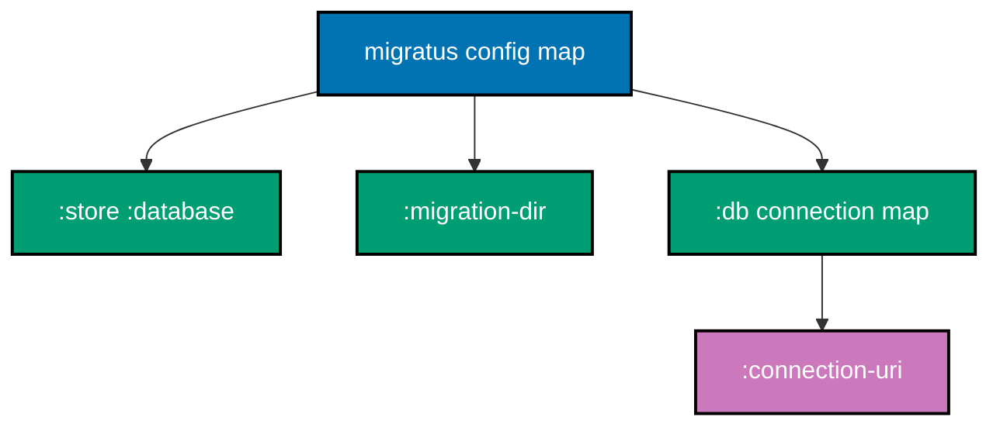
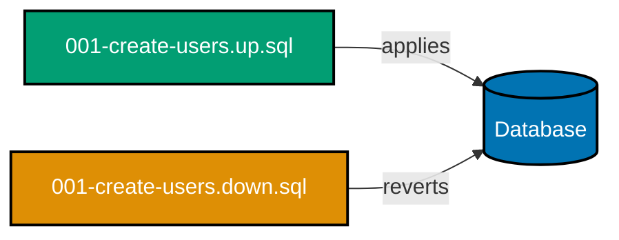
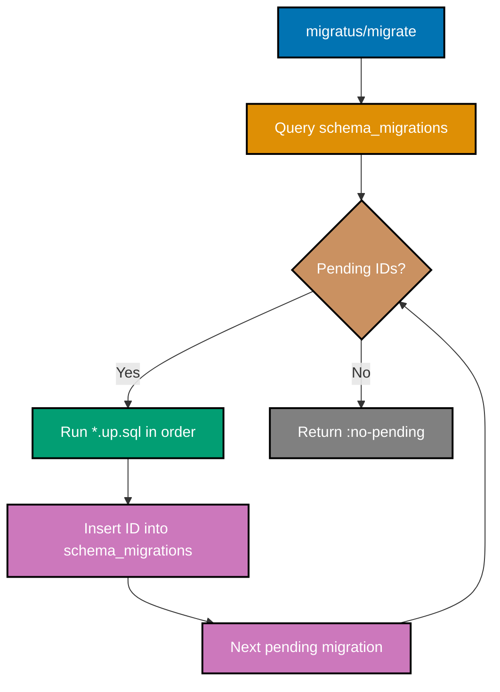
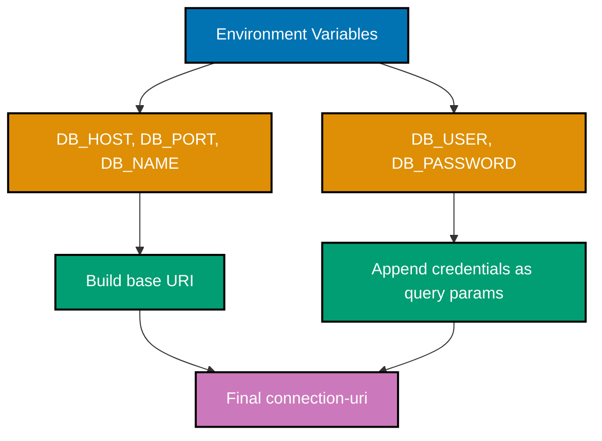

## Beginner Examples (1-30)

**Coverage**: 0-40% of Migratus functionality

**Focus**: Configuration, migration file conventions, core API operations, and common SQL DDL patterns.

These examples cover fundamentals needed for managing database schema evolution in Clojure applications. Each example is completely self-contained and runnable in a Clojure REPL or as file content.

---

### Example 1: Migratus Config Map

Migratus is configured through a plain Clojure map passed to every API function. The config map declares the store type, migration directory, and database connection—the three required keys for SQL-based migrations.



```clojure
(require '[migratus.core :as migratus])  ; => Import migratus.core namespace

(def config
  {:store         :database              ; => Use the SQL database store
                                         ; => Other stores exist (:fs) but :database is standard
   :migration-dir "migrations"           ; => Path relative to classpath (resources/migrations/)
   :db            {:connection-uri       ; => Database connection map (next.jdbc format)
                   "jdbc:postgresql://localhost:5432/mydb?user=admin&password=secret"}})
                                         ; => config is a plain Clojure map; no object creation
                                         ; => Passed as first arg to every migratus/* function

(migratus/migrate config)                ; => Runs all pending SQL migrations
                                         ; => Reads *.up.sql files from resources/migrations/
```

**Key Takeaway**: The Migratus config map is a plain data structure—no macros, no DSL—making it easy to build programmatically from environment variables or configuration files.

**Why It Matters**: In production Clojure applications, separating migration configuration from application startup logic enables cleaner dependency injection and testability. A plain map lets you swap connection strings between environments (test, staging, production) without changing the migration code. Teams that embed credentials directly in source code face security and rotation problems; externalising them through environment variables—captured into this map—follows twelve-factor app principles and keeps secrets out of version control.

---

### Example 2: First Migration Pair (up.sql / down.sql)

Every Migratus migration consists of two SQL files: an `.up.sql` file that applies the change and a `.down.sql` file that reverses it. Both files live in the migrations directory and share the same numeric prefix and name.



**File: `resources/migrations/001-create-users.up.sql`**

```sql
-- => Creates the users table (applied when migrating up)
CREATE TABLE IF NOT EXISTS users (
  id      TEXT PRIMARY KEY,            -- => Primary key; TEXT for UUIDs
  username TEXT NOT NULL UNIQUE,       -- => Unique login handle; NOT NULL enforced
  email    TEXT NOT NULL UNIQUE,       -- => Unique contact address
  created_at TEXT NOT NULL             -- => ISO-8601 timestamp stored as text
);
-- => Migratus executes this file in a transaction by default
```

**File: `resources/migrations/001-create-users.down.sql`**

```sql
-- => Drops the users table (applied when rolling back)
DROP TABLE IF EXISTS users;
-- => IF EXISTS prevents error if table was already removed manually
-- => Always mirror every up.sql change with a matching down.sql
```

**Key Takeaway**: Every migration must have a matching down file so rollbacks are always possible; the `IF NOT EXISTS` / `IF EXISTS` guards make migrations idempotent and safe to re-run during recovery.

**Why It Matters**: Production incidents often require rolling back a bad migration immediately. Without a well-written down file, rollback becomes a manual, error-prone process. Teams that skip down files accumulate technical debt and lose the ability to automate recovery. The `IF EXISTS` guard in down files prevents failures when a partial migration left the schema in an unexpected state, which is common after interrupted deployments.

---

### Example 3: Migration File Naming Convention

Migratus uses a strict numeric prefix to determine migration order. The prefix must be a unique integer; the suffix is a human-readable description. The file extension determines direction (`up` or `down`).

```clojure
;; Migration file naming rules:
;; Format: {id}-{description}.{direction}.sql
;;
;; {id}          - Unique positive integer (determines execution order)
;;               ; => Migratus sorts migrations by integer value, not lexicographically
;; {description} - Kebab-case description of the change
;;               ; => Used only for human readability; not parsed by Migratus
;; {direction}   - "up" to apply, "down" to revert
;;               ; => Must exactly match these strings

;; Valid examples:
;; 001-create-users.up.sql          ; => First migration
;; 002-create-orders.up.sql         ; => Second migration
;; 010-add-email-index.up.sql       ; => Tenth migration (gaps allowed)
;; 20241201120000-add-column.up.sql ; => Timestamp-based IDs also valid

;; Invalid examples (will not be loaded by Migratus):
;; create-users.up.sql              ; => Missing numeric prefix
;; 001-create-users.sql             ; => Missing direction
;; 001_create_users.up.sql          ; => Underscore separator (must be hyphen after id)

;; Check what Migratus sees in the migrations directory:
(require '[migratus.core :as migratus])

(def config {:store         :database
             :migration-dir "migrations"
             :db            {:connection-uri "jdbc:postgresql://localhost:5432/mydb"}})

(migratus/pending-list config)
;; => Returns list of migration IDs not yet applied
;; => Example: [1 2 10] (the integer prefixes)
```

**Key Takeaway**: Use sequential integers (001, 002, ...) or timestamps as migration IDs; gaps are allowed but IDs must be globally unique within the project, and only the numeric prefix controls execution order.

**Why It Matters**: Naming discipline prevents subtle ordering bugs. Teams working in parallel branches can create conflicting migration IDs, causing non-deterministic schema states when branches merge. Using timestamps as IDs (e.g., `20241201120000`) avoids collisions in team environments because each developer's migration gets a unique wall-clock prefix. Consistent kebab-case descriptions also make `git log` output and migration history readable when auditing schema changes during incident investigation.

---

### Example 4: :store :database Configuration

The `:store :database` key tells Migratus to use a SQL database as both the migration executor and the migration state tracker. This is the only store type used in production Clojure applications with relational databases.

```clojure
(require '[migratus.core :as migratus])

;; :store :database is the SQL database store
(def config
  {:store         :database            ; => Required; tells Migratus which store implementation to use
                                       ; => :database uses next.jdbc to run SQL and track state
   :migration-dir "migrations"         ; => Classpath-relative directory containing .sql files
   :db            {:connection-uri
                   "jdbc:postgresql://localhost:5432/mydb?user=app&password=secret"}})
                                       ; => :db map is passed directly to next.jdbc/get-datasource

;; The :database store automatically creates a tracking table:
;; CREATE TABLE IF NOT EXISTS schema_migrations (
;;   id BIGINT UNIQUE NOT NULL,         ; => The numeric migration ID
;;   applied TIMESTAMP NOT NULL         ; => When the migration ran
;; );
;; => Migratus creates this table on first use
;; => You do NOT need to create it manually

(migratus/migrate config)              ; => Applies all pending migrations
                                       ; => Reads schema_migrations to determine which IDs ran
                                       ; => Executes each pending *.up.sql in ascending ID order
```

**Key Takeaway**: `:store :database` is self-bootstrapping—Migratus creates the `schema_migrations` tracking table automatically on first run, so no manual setup is required beyond providing a valid database connection.

**Why It Matters**: The automatic creation of the tracking table means database provisioning scripts stay simple. In container environments where databases are created fresh per deployment (e.g., integration test pipelines), Migratus handles its own bootstrapping without requiring a separate initialisation step. Teams that manually manage the tracking table risk schema drift when the table definition evolves across Migratus versions.

---

### Example 5: :migration-dir Setting

The `:migration-dir` value is resolved relative to the JVM classpath, not the filesystem working directory. In a typical Clojure project, `resources/` is on the classpath, so `"migrations"` resolves to `resources/migrations/`.

```clojure
(require '[migratus.core :as migratus])

;; Project structure (standard Clojure layout):
;; my-project/
;; ├── deps.edn               ; => :paths ["src" "resources"]
;; ├── resources/
;; │   └── migrations/        ; => Migration files live here
;; │       ├── 001-create-users.up.sql
;; │       └── 001-create-users.down.sql
;; └── src/

(def config
  {:store         :database
   :migration-dir "migrations"         ; => Classpath-relative; resolves to resources/migrations/
                                       ; => Do NOT use absolute paths or "resources/migrations"
                                       ; => "resources/" is already the classpath root
   :db            {:connection-uri "jdbc:postgresql://localhost:5432/mydb"}})

;; If resources/ is on the classpath (in deps.edn :paths):
;; "migrations" => resources/migrations/   OK
;; "db/migrations" => resources/db/migrations/  also valid if directory exists

;; Verify migration files are on classpath:
(clojure.java.io/resource "migrations/001-create-users.up.sql")
;; => Returns java.net.URL if file exists on classpath
;; => Returns nil if path is wrong (common setup mistake)
```

**Key Takeaway**: Set `:migration-dir` to the path segment after your classpath root (usually `resources/`), never including `resources/` itself—the classpath inclusion in `deps.edn` makes `resources/` invisible as a path prefix.

**Why It Matters**: The classpath-relative resolution is the most common source of "no migrations found" errors for developers new to Migratus. Unlike filesystem tools that use `File` paths, Migratus uses `clojure.java.io/resource` internally, which only resolves against classpath roots. Understanding this distinction prevents wasted debugging time and explains why migrations that run locally can fail in Docker containers if the resources directory is not included in the container's classpath.

---

### Example 6: Running All Migrations (migratus/migrate)

`migratus/migrate` applies all pending migrations in ascending ID order. It is the primary function called at application startup to bring the database schema up to date.



```clojure
(require '[migratus.core :as migratus])

(def config
  {:store         :database
   :migration-dir "migrations"
   :db            {:connection-uri "jdbc:postgresql://localhost:5432/mydb?user=app&password=secret"}})

;; Run all pending migrations:
(migratus/migrate config)
;; => Queries SELECT id FROM schema_migrations to find applied IDs
;; => Finds all *.up.sql files in resources/migrations/
;; => Computes set difference: file IDs - applied IDs = pending IDs
;; => Executes each pending *.up.sql in ascending numeric ID order
;; => Inserts each completed ID into schema_migrations
;; => Returns nil on success
;; => Throws exception on SQL error (transaction rolls back for that migration)

;; Call at application startup (from -main or component start):
(defn -main [& _args]
  (migratus/migrate config)            ; => Schema up-to-date before server starts
  (start-server!))                     ; => Server starts with consistent schema
```

**Key Takeaway**: Call `migratus/migrate` once at application startup before initialising any connection pools or HTTP servers to guarantee the schema matches the application code.

**Why It Matters**: Running migrations at startup eliminates the deployment coordination problem of "deploy migrations first, then deploy app". In container orchestration systems like Kubernetes, pods start independently; if the application assumes a schema that does not yet exist, it crashes on the first database operation. Startup migration ensures the schema is always ready before the application accepts traffic. The idempotent nature of the tracking table means multiple pod replicas starting simultaneously will not double-apply migrations—Migratus uses a database lock internally.

---

### Example 7: Running Single Migration Up (migratus/up)

`migratus/up` applies one or more specific migrations by their numeric ID, regardless of whether earlier pending migrations exist. This is useful for targeted schema changes during debugging or hotfixes.

```clojure
(require '[migratus.core :as migratus])

(def config
  {:store         :database
   :migration-dir "migrations"
   :db            {:connection-uri "jdbc:postgresql://localhost:5432/mydb?user=app&password=secret"}})

;; Apply migration ID 3 only:
(migratus/up config 3)
;; => Looks for resources/migrations/003-*.up.sql
;; => Executes the SQL in that file
;; => Inserts ID 3 into schema_migrations
;; => Does NOT run migrations 1 or 2 if they are pending
;; => Returns nil on success

;; Apply multiple specific IDs:
(migratus/up config 5 6)               ; => Runs migration 5 then migration 6
                                       ; => Useful when testing specific migration pairs
                                       ; => IDs are applied in the order you pass them

;; If migration already applied, migratus/up is a no-op:
(migratus/up config 3)                 ; => ID 3 already in schema_migrations
                                       ; => No SQL executed; returns nil silently
```

**Key Takeaway**: Use `migratus/up` with specific IDs for surgical schema changes during debugging; never rely on it as a substitute for `migratus/migrate` in production startup because it skips pending earlier migrations.

**Why It Matters**: During development, `migratus/up` lets you apply a single new migration while leaving others pending, enabling isolated testing of a specific schema change without rebuilding the entire database. In production incidents where a specific migration caused a problem, `migratus/up` can re-apply it after a fix without touching unrelated migrations. However, using it in place of `migratus/migrate` in application startup code creates schema gaps that cause application errors—a common mistake by developers unfamiliar with migration ordering constraints.

---

### Example 8: Rolling Back Single Migration (migratus/down)

`migratus/down` reverts one or more specific migrations by their numeric ID, executing the corresponding `.down.sql` file and removing the ID from the tracking table.

```clojure
(require '[migratus.core :as migratus])

(def config
  {:store         :database
   :migration-dir "migrations"
   :db            {:connection-uri "jdbc:postgresql://localhost:5432/mydb?user=app&password=secret"}})

;; Roll back migration ID 3:
(migratus/down config 3)
;; => Looks for resources/migrations/003-*.down.sql
;; => Executes the SQL in that file (e.g., DROP TABLE)
;; => Removes ID 3 from schema_migrations
;; => Returns nil on success

;; Roll back multiple IDs (in order given):
(migratus/down config 6 5)             ; => Reverts migration 6, then migration 5
                                       ; => Note: typically roll back in reverse order
                                       ; => to respect foreign key dependencies

;; After rollback, migration is pending again:
(migratus/pending-list config)         ; => [3] — ID 3 is pending again after down
                                       ; => Running migrate again will re-apply it
```

**Key Takeaway**: Always pass multiple rollback IDs in reverse order (highest first) to respect foreign key dependencies—rolling back a child table before its parent avoids constraint errors.

**Why It Matters**: Rollback is the primary recovery tool when a bad migration reaches staging or production. Teams that write incorrect down files—or omit them entirely—lose the ability to automate recovery and must perform manual DDL surgery under pressure. The tracking table removal means a rolled-back migration will be re-applied on the next `migrate` call, making the system self-healing once the up file is corrected. Ordering rollbacks from newest to oldest mirrors the reverse of how they were applied, which is the only correct order when tables have foreign key relationships.

---

### Example 9: Creating New Migration (migratus/create)

`migratus/create` generates a new migration file pair with the correct naming convention. It uses the current timestamp as the ID when no explicit ID is provided, preventing collisions in team environments.

```clojure
(require '[migratus.core :as migratus])

(def config
  {:store         :database
   :migration-dir "migrations"
   :db            {:connection-uri "jdbc:postgresql://localhost:5432/mydb?user=app&password=secret"}})

;; Create a new migration named "add-email-index":
(migratus/create config "add-email-index")
;; => Generates two empty files in resources/migrations/:
;; => 20241201143022-add-email-index.up.sql   (timestamp as ID)
;; => 20241201143022-add-email-index.down.sql
;; => Files are empty; you fill in the SQL manually
;; => Returns nil

;; The generated files are empty stubs:
;; 20241201143022-add-email-index.up.sql:
;;   (empty — add your CREATE INDEX statement here)
;;
;; 20241201143022-add-email-index.down.sql:
;;   (empty — add your DROP INDEX statement here)

;; After creating, edit both files before running migrations:
;; up.sql:   CREATE INDEX idx_users_email ON users (email);
;; down.sql: DROP INDEX IF EXISTS idx_users_email;
```

**Key Takeaway**: Use `migratus/create` rather than manually creating migration files to guarantee the timestamp-based ID is unique and the file names follow the exact convention Migratus expects.

**Why It Matters**: Manually created migration files frequently have naming errors—wrong extension, missing direction suffix, or non-unique IDs from developers choosing sequential integers by hand. In team environments with parallel feature branches, two developers independently choosing `005` as the next migration ID causes a merge conflict that corrupts migration state. Timestamp-based IDs from `migratus/create` provide millisecond-granular uniqueness. The empty stubs also serve as a checklist reminder: both the up and down files must be filled in before committing.

---

### Example 10: Checking Pending Migrations (migratus/pending-list)

`migratus/pending-list` returns the list of migration IDs that exist as files but have not yet been applied to the database. Use it to inspect migration state without executing any SQL changes.

```clojure
(require '[migratus.core :as migratus])

(def config
  {:store         :database
   :migration-dir "migrations"
   :db            {:connection-uri "jdbc:postgresql://localhost:5432/mydb?user=app&password=secret"}})

;; Inspect pending migrations:
(migratus/pending-list config)
;; => Queries schema_migrations for applied IDs
;; => Reads *.up.sql filenames from resources/migrations/
;; => Returns vector of numeric IDs not in schema_migrations
;; => Example: [3 5 6]  (IDs 1,2,4 already applied; 3,5,6 pending)
;; => Returns [] when all migrations are applied

;; Use in a health check or pre-deployment gate:
(defn migrations-up-to-date? [config]
  (empty? (migratus/pending-list config))) ; => true when nothing pending
                                           ; => false when schema lags behind files

(if (migrations-up-to-date? config)
  (println "Schema is current")           ; => Output when all applied
  (println "WARNING: pending migrations")) ; => Output when behind
```

**Key Takeaway**: Use `migratus/pending-list` in CI/CD health checks to detect schema drift before deploying a new application version—a non-empty result is a deployment gate failure signal.

**Why It Matters**: In continuous deployment pipelines, detecting pending migrations before releasing new application code prevents runtime errors caused by the application expecting columns or tables that do not exist yet. A pre-deployment check using `pending-list` makes the pipeline self-documenting: an empty list means the migration step ran successfully. Teams that skip this check discover schema drift at runtime, typically during peak traffic, when the cost of discovery is highest.

---

### Example 11: Creating Tables

The fundamental DDL operation in any migration is `CREATE TABLE`. This example shows a complete table creation with common column types, constraints, and the corresponding rollback.

```sql
-- File: resources/migrations/001-create-users.up.sql
-- => Creates the users table with common column patterns

CREATE TABLE IF NOT EXISTS users (
  id            TEXT PRIMARY KEY,        -- => UUID stored as text; application generates the value
  username      TEXT NOT NULL UNIQUE,    -- => Login handle; UNIQUE enforces no duplicates at DB level
  email         TEXT NOT NULL UNIQUE,    -- => Contact address; UNIQUE index created automatically
  password_hash TEXT NOT NULL,           -- => Bcrypt or Argon2 hash; never store plaintext
  display_name  TEXT NOT NULL DEFAULT '',-- => Optional display name; empty string default
  role          TEXT NOT NULL DEFAULT 'USER', -- => Enum-like role; enforced by CHECK (see Example 22)
  created_at    TEXT NOT NULL,           -- => ISO-8601 timestamp; application sets this
  updated_at    TEXT NOT NULL            -- => Last modification timestamp
);
-- => IF NOT EXISTS prevents error if migration is re-run manually
-- => Migratus wraps this in a transaction; error causes rollback
```

```sql
-- File: resources/migrations/001-create-users.down.sql
-- => Drops the users table, reversing the up migration

DROP TABLE IF EXISTS users;
-- => IF EXISTS prevents error if table was removed manually before rollback
-- => All rows, indexes, and constraints are dropped with the table
```

**Key Takeaway**: Always include `IF NOT EXISTS` in `CREATE TABLE` and `IF EXISTS` in `DROP TABLE` to make migrations re-runnable after partial failures—these guards cost nothing and prevent painful manual recovery.

**Why It Matters**: Production deployments occasionally fail mid-migration (network loss, disk full, timeout). A migration without `IF NOT EXISTS` fails on retry, requiring manual SQL surgery to clean up. The `IF NOT EXISTS` guard makes the migration idempotent for the table creation step, enabling automatic retry without human intervention. This discipline applies to every DDL statement—indexes, sequences, types—not just tables, and is a foundational habit for reliable zero-downtime deployments.

---

### Example 12: Adding Columns

`ALTER TABLE ... ADD COLUMN` extends an existing table. This example shows adding a column to the users table in a separate migration, with a safe rollback using `DROP COLUMN`.

```sql
-- File: resources/migrations/006-add-users-status.up.sql
-- => Adds status column to existing users table

ALTER TABLE users
  ADD COLUMN status TEXT NOT NULL DEFAULT 'ACTIVE';
-- => ADD COLUMN appends the new column to the table
-- => DEFAULT 'ACTIVE' back-fills existing rows immediately
-- => NOT NULL is safe here because DEFAULT provides a value for existing rows
-- => Without DEFAULT, NOT NULL ADD COLUMN fails if table has existing rows

-- Add a second column in the same migration:
ALTER TABLE users
  ADD COLUMN failed_login_attempts INTEGER NOT NULL DEFAULT 0;
-- => Integer counter; default 0 for all existing users
-- => Multiple ALTER TABLE statements in one up.sql file are allowed
```

```sql
-- File: resources/migrations/006-add-users-status.down.sql
-- => Removes columns added in up migration (in reverse order)

ALTER TABLE users DROP COLUMN IF EXISTS failed_login_attempts;
-- => Remove second column first (reverse of up order)
ALTER TABLE users DROP COLUMN IF EXISTS status;
-- => Remove first column last
-- => IF EXISTS prevents error if column was already removed manually
```

**Key Takeaway**: When adding a `NOT NULL` column to an existing table, always provide a `DEFAULT` value in the same `ALTER TABLE` statement so the database can back-fill existing rows without violating the constraint.

**Why It Matters**: A common migration mistake is adding `NOT NULL` columns without defaults to tables that already contain rows. PostgreSQL rejects this with a constraint violation error, causing the migration to fail and potentially leaving a partial lock on the table. Providing a sensible default in the DDL ensures the migration applies cleanly to both empty tables (development) and populated tables (production). The default can be removed in a later migration once application code populates the column for all new rows.

---

### Example 13: Adding Indexes

Indexes improve query performance but do not change the data model. This example shows adding a standard index, a unique index, and a partial index in separate migrations from the table creation.

```sql
-- File: resources/migrations/007-add-users-indexes.up.sql
-- => Adds query performance indexes to the users table

-- Standard index for frequent lookup by email:
CREATE INDEX IF NOT EXISTS idx_users_email
  ON users (email);
-- => Speeds up WHERE email = '...' queries
-- => IF NOT EXISTS prevents error on re-run
-- => Index name convention: idx_{table}_{column(s)}

-- Partial index for active users only:
CREATE INDEX IF NOT EXISTS idx_users_active
  ON users (username)
  WHERE status = 'ACTIVE';
-- => Only indexes rows where status = 'ACTIVE'
-- => Smaller index; faster for queries that always filter by status
-- => WHERE clause mirrors common application query pattern

-- Composite index for multi-column lookups:
CREATE INDEX IF NOT EXISTS idx_users_role_status
  ON users (role, status);
-- => Covers queries filtering on both role AND status
-- => Column order matters: role is the leading column
-- => Query must include role to use this index efficiently
```

```sql
-- File: resources/migrations/007-add-users-indexes.down.sql
-- => Drops indexes added in the up migration

DROP INDEX IF EXISTS idx_users_role_status;
DROP INDEX IF EXISTS idx_users_active;
DROP INDEX IF EXISTS idx_users_email;
-- => Indexes are dropped in reverse creation order (good practice)
-- => IF EXISTS prevents errors if already removed
```

**Key Takeaway**: Create indexes in separate migrations from the table creation so index additions can be rolled back independently—and use `CREATE INDEX CONCURRENTLY` in high-traffic environments to avoid table locks.

**Why It Matters**: Adding indexes to large tables in production takes time and locks the table in some databases. Separating index creation into its own migration makes the lock window observable and rollback-able without affecting the table itself. `IF NOT EXISTS` guards are critical here because some teams manually create indexes as emergency hotfixes; a subsequent migration without this guard will fail. The naming convention `idx_{table}_{columns}` makes slow query logs immediately readable by matching index names to table structures.

---

### Example 14: Adding Foreign Keys

Foreign key constraints enforce referential integrity at the database level. This example adds a foreign key column to a child table referencing a parent table, with proper rollback.

```sql
-- File: resources/migrations/008-add-expenses-user-fk.up.sql
-- => Adds foreign key relationship between expenses and users

-- First ensure the expenses table exists (created in an earlier migration):
ALTER TABLE expenses
  ADD COLUMN IF NOT EXISTS user_id TEXT NOT NULL DEFAULT '';
-- => Add column first if it does not exist
-- => DEFAULT '' allows back-fill; will be updated to proper values

-- Then add the foreign key constraint:
ALTER TABLE expenses
  ADD CONSTRAINT fk_expenses_user
  FOREIGN KEY (user_id)
  REFERENCES users (id)
  ON DELETE CASCADE;
-- => FOREIGN KEY (user_id) references the id column of users table
-- => ON DELETE CASCADE: deleting a user auto-deletes their expenses
-- => Constraint name fk_{child_table}_{parent_table} is a clear convention
-- => PostgreSQL creates an index on user_id automatically for FK performance
```

```sql
-- File: resources/migrations/008-add-expenses-user-fk.down.sql
-- => Removes the foreign key constraint (column remains)

ALTER TABLE expenses
  DROP CONSTRAINT IF EXISTS fk_expenses_user;
-- => Removes only the constraint, not the column
-- => IF EXISTS prevents error if constraint was already removed
-- => Data in user_id column is preserved
```

**Key Takeaway**: Add foreign key constraints in a separate `ALTER TABLE ... ADD CONSTRAINT` statement after the column exists, and always name constraints explicitly so they can be referenced by name in rollbacks and error messages.

**Why It Matters**: Named constraints appear in database error messages, making debugging faster: `ERROR: insert or update on table "expenses" violates foreign key constraint "fk_expenses_user"` immediately tells you which relationship is violated. Anonymous constraints get system-generated names that are meaningless in logs. Separating column addition from constraint addition also allows the constraint to be added to tables with existing data—after ensuring the data is clean—without coupling data backfill to constraint creation in the same migration.

---

### Example 15: Adding Unique Constraints

Unique constraints enforce data integrity by preventing duplicate values. This example shows adding a unique constraint to an existing column and a composite unique constraint across multiple columns.

```sql
-- File: resources/migrations/009-add-unique-constraints.up.sql
-- => Adds unique constraints to enforce data integrity rules

-- Single-column unique constraint:
ALTER TABLE users
  ADD CONSTRAINT uq_users_username UNIQUE (username);
-- => Prevents two users from having the same username
-- => Constraint name uq_{table}_{column} is self-documenting
-- => PostgreSQL automatically creates a unique index to enforce this
-- => Fails if duplicate usernames already exist in the table

-- Composite unique constraint (multi-column):
ALTER TABLE refresh_tokens
  ADD CONSTRAINT uq_refresh_tokens_user_hash
  UNIQUE (user_id, token_hash);
-- => Prevents the same user from having duplicate token hashes
-- => Both columns together must be unique; either alone may repeat
-- => Useful for junction tables and token management
```

```sql
-- File: resources/migrations/009-add-unique-constraints.down.sql
-- => Removes unique constraints (preserves data)

ALTER TABLE refresh_tokens
  DROP CONSTRAINT IF EXISTS uq_refresh_tokens_user_hash;
-- => Removes composite unique constraint

ALTER TABLE users
  DROP CONSTRAINT IF EXISTS uq_users_username;
-- => Removes single-column unique constraint
-- => Drops the underlying unique index automatically
```

**Key Takeaway**: Always name unique constraints explicitly using the `uq_{table}_{columns}` convention—unnamed constraints get database-generated names that are unreadable in error messages and impossible to drop by name in rollbacks.

**Why It Matters**: Unique constraint violations are the most common data integrity errors in web applications (duplicate username registration, duplicate token generation). Clearly named constraints make these errors actionable in application error handlers: you can catch the constraint name in the exception and return a specific user-facing message. Composite unique constraints enforce business rules that single-column uniqueness cannot—for example, a user can have multiple sessions, but not two sessions with the same token hash.

---

### Example 16: schema_migrations Table Structure

Migratus maintains a `schema_migrations` table to track which migrations have been applied. Understanding its structure helps with debugging, manual recovery, and integrating with external migration tools.

```sql
-- The schema_migrations table is created automatically by Migratus on first use.
-- Its structure (PostgreSQL dialect):

-- => Migratus creates this table if it does not exist:
-- CREATE TABLE IF NOT EXISTS schema_migrations (
--   id      BIGINT UNIQUE NOT NULL,   -- => The numeric migration ID (e.g., 1, 2, 20241201143022)
--   applied TIMESTAMP NOT NULL        -- => UTC timestamp when migration was applied
-- );

-- Query applied migrations manually:
-- SELECT id, applied FROM schema_migrations ORDER BY id;
-- => id=1, applied=2024-12-01 10:00:00
-- => id=2, applied=2024-12-01 10:00:01
-- => id=3, applied=2024-12-01 10:00:02

-- Query in Clojure to see applied state:
(require '[next.jdbc :as jdbc]
         '[migratus.core :as migratus])

(def ds (jdbc/get-datasource
          {:connection-uri "jdbc:postgresql://localhost:5432/mydb?user=app&password=secret"}))
                                                ; => Creates next.jdbc datasource

(jdbc/execute! ds ["SELECT id, applied FROM schema_migrations ORDER BY id"])
;; => [{:schema_migrations/id 1 :schema_migrations/applied #inst "2024-12-01T10:00:00"}
;;     {:schema_migrations/id 2 :schema_migrations/applied #inst "2024-12-01T10:00:01"}]
;; => Each map represents one applied migration row
```

**Key Takeaway**: The `schema_migrations` table is owned by Migratus—do not modify it manually except during emergency recovery, and always back it up before performing manual DDL operations that bypass the migration system.

**Why It Matters**: Understanding the tracking table structure is essential for emergency recovery scenarios. When a migration partially fails and leaves the database in an inconsistent state, you may need to manually insert or delete rows in `schema_migrations` to reconcile what Migratus thinks happened with what actually happened. Database administrators who do not understand this table structure make recovery harder by modifying it incorrectly, causing subsequent `migrate` calls to skip already-applied migrations or re-apply ones that succeeded.

---

### Example 17: JDBC Connection String Setup

Migratus uses next.jdbc under the hood and accepts any JDBC-compatible connection URI. This example shows how to construct the connection string securely using environment variables in a Clojure application.



```clojure
(require '[migratus.core :as migratus])

(defn build-migratus-config
  "Constructs Migratus config from environment variables.
   Credentials are query parameters because next.jdbc reads them from the URI."
  []
  (let [host     (or (System/getenv "DB_HOST")     "localhost") ; => DB host; default localhost
        port     (or (System/getenv "DB_PORT")     "5432")      ; => DB port; default PostgreSQL port
        db-name  (or (System/getenv "DB_NAME")     "mydb")      ; => Database name
        user     (or (System/getenv "DB_USER")     "app")       ; => DB username
        password (or (System/getenv "DB_PASSWORD") "secret")    ; => DB password
        base-uri (str "jdbc:postgresql://" host ":" port "/" db-name)
                                                                  ; => Constructs base JDBC URI
        full-uri (str base-uri "?user=" user "&password=" password)]
                                                                  ; => Appends credentials as query params
    {:store         :database
     :migration-dir "migrations"
     :db            {:connection-uri full-uri}}))
                                                                  ; => Returns complete Migratus config

;; Usage:
(def config (build-migratus-config))   ; => Reads from environment at call time
(migratus/migrate config)              ; => Runs migrations with environment-sourced credentials
```

**Key Takeaway**: Build the connection URI from environment variables at startup rather than hardcoding credentials, and append user and password as query parameters because next.jdbc reads them from the URI string.

**Why It Matters**: Hardcoded database credentials in source code are a critical security vulnerability. When credentials rotate (a standard security practice), hardcoded values require code changes and deployments. Environment-variable-based configuration enables credential rotation without code changes. The query-parameter approach for credentials (`?user=...&password=...`) is specific to how Migratus passes the `:db` map to next.jdbc—using a properties map with `:user` and `:password` keys works for next.jdbc directly but not through Migratus's connection handling.

---

### Example 18: NOT NULL with Default Values

Adding `NOT NULL` constraints to new columns on existing tables requires providing a `DEFAULT` value simultaneously. This example demonstrates the correct pattern and explains why omitting the default causes migration failures.

```sql
-- File: resources/migrations/010-add-display-name.up.sql
-- => Adds display_name column with NOT NULL constraint safely

-- CORRECT: NOT NULL with DEFAULT (works on tables with existing rows)
ALTER TABLE users
  ADD COLUMN display_name TEXT NOT NULL DEFAULT '';
-- => DEFAULT '' satisfies NOT NULL for all existing rows immediately
-- => New rows without explicit display_name also get empty string
-- => Two-phase approach: add with default, remove default later if desired

-- WRONG (do not do this on a populated table):
-- ALTER TABLE users ADD COLUMN display_name TEXT NOT NULL;
-- => ERROR: column "display_name" of relation "users" contains null values
-- => Fails because existing rows get NULL, violating NOT NULL constraint

-- Optional: Remove the default after backfilling real values
-- ALTER TABLE users ALTER COLUMN display_name DROP DEFAULT;
-- => Run this in a LATER migration after application populates all rows
-- => Removing default in same migration as adding column is safe only for empty tables
```

```sql
-- File: resources/migrations/010-add-display-name.down.sql
-- => Removes display_name column

ALTER TABLE users DROP COLUMN IF EXISTS display_name;
-- => Drops column and any associated default constraint
```

**Key Takeaway**: Always pair `NOT NULL` with a `DEFAULT` when adding columns to tables that may have existing rows—the default satisfies the constraint for all pre-existing rows and can be dropped in a subsequent migration after the application backfills real values.

**Why It Matters**: This is one of the most common migration failures in production. A developer writes a migration that works fine on an empty development database but fails on production because the table has millions of rows. The default value is a deployment enabler, not a permanent design decision: it can be a sensible semantic default (empty string, zero, false) or a temporary placeholder removed after a data backfill job. Documenting this two-phase pattern in comments helps reviewers understand why the default exists and when it can be removed.

---

### Example 19: UUID Primary Keys (PostgreSQL)

UUID primary keys avoid sequential ID exposure and support distributed generation. This example shows using the `gen_random_uuid()` PostgreSQL function and the `pgcrypto` extension for backward-compatible UUID generation.

```sql
-- File: resources/migrations/011-create-orders-uuid.up.sql
-- => Creates a table using UUID primary keys generated by PostgreSQL

-- Option A: Use gen_random_uuid() (PostgreSQL 13+, no extension needed)
CREATE TABLE IF NOT EXISTS orders (
  id          UUID PRIMARY KEY DEFAULT gen_random_uuid(),
  -- => UUID type; gen_random_uuid() generates v4 UUID automatically
  -- => Application can omit id; database generates it
  user_id     UUID NOT NULL,             -- => FK to users.id (also UUID)
  total       NUMERIC(12,2) NOT NULL,    -- => Monetary amount; 12 digits, 2 decimal places
  created_at  TIMESTAMPTZ NOT NULL DEFAULT NOW()
  -- => Timestamp with timezone; NOW() defaults to current time
);

-- Option B: TEXT primary key (Clojure generates UUID string in application)
-- CREATE TABLE IF NOT EXISTS orders (
--   id         TEXT PRIMARY KEY,        -- => Application sets UUID via (str (random-uuid))
--   ...
-- );
-- => TEXT approach avoids PostgreSQL UUID type; portable across databases
-- => Used in demo-be-clojure-pedestal where Clojure generates UUIDs
```

```sql
-- File: resources/migrations/011-create-orders-uuid.down.sql
DROP TABLE IF EXISTS orders;
```

**Key Takeaway**: Use `UUID PRIMARY KEY DEFAULT gen_random_uuid()` for database-generated UUIDs in PostgreSQL 13+, or use `TEXT PRIMARY KEY` when the application generates UUIDs (as Clojure's `(str (random-uuid))` idiom does) for maximum portability.

**Why It Matters**: UUID primary keys prevent enumeration attacks (a user cannot guess valid resource IDs by incrementing integers) and support offline ID generation (the application generates the UUID before inserting, enabling optimistic locking without database round-trips). The choice between database-generated and application-generated UUIDs affects transaction design: database-generated UUIDs require a `RETURNING id` clause to get the generated value, while application-generated UUIDs are known before insert and simplify multi-table transaction logic.

---

### Example 20: Timestamp Columns with Defaults

Timestamp columns record when records were created and modified. This example shows using `TIMESTAMPTZ` (timestamp with time zone) with `NOW()` defaults and how Clojure applications interact with them.

```sql
-- File: resources/migrations/012-add-timestamps.up.sql
-- => Adds standard audit timestamp columns to an existing table

ALTER TABLE expenses
  ADD COLUMN IF NOT EXISTS created_at TIMESTAMPTZ NOT NULL DEFAULT NOW(),
  -- => TIMESTAMPTZ stores UTC time with timezone offset
  -- => DEFAULT NOW() auto-fills on INSERT when application omits the column
  -- => TIMESTAMPTZ preferred over TIMESTAMP for multi-timezone applications
  ADD COLUMN IF NOT EXISTS updated_at TIMESTAMPTZ NOT NULL DEFAULT NOW();
  -- => Applications must explicitly update this on UPDATE operations
  -- => PostgreSQL does NOT auto-update updated_at (unlike MySQL's ON UPDATE)
  -- => Use a trigger or application logic to keep updated_at current

-- Note: Multiple ADD COLUMN clauses in one ALTER TABLE statement are atomic
-- => Both columns added in a single DDL transaction
```

```sql
-- File: resources/migrations/012-add-timestamps.down.sql
ALTER TABLE expenses
  DROP COLUMN IF EXISTS updated_at,
  DROP COLUMN IF EXISTS created_at;
-- => Multiple DROP COLUMN in one statement; atomic operation
```

**Key Takeaway**: Use `TIMESTAMPTZ` (not `TIMESTAMP`) for audit columns so timestamps survive daylight saving transitions correctly, and set `DEFAULT NOW()` in the database so records always have timestamps even when application code forgets to set them.

**Why It Matters**: Using `TIMESTAMP WITHOUT TIME ZONE` causes silent data corruption when servers change time zones or observe daylight saving transitions—timestamps appear to shift by hours. `TIMESTAMPTZ` stores everything as UTC internally and converts on output based on session time zone, providing correct behavior across environments. The `DEFAULT NOW()` at the database level is a safety net: if application code has a bug that omits the timestamp field, the database fills it in correctly rather than rejecting the insert with a NOT NULL violation.

---

### Example 21: Enum Types via SQL

PostgreSQL supports native `ENUM` types, but SQL-string enums (using `TEXT` with a `CHECK` constraint) are more migration-friendly because adding new values to a native ENUM requires DDL. This example shows both patterns.

```sql
-- File: resources/migrations/013-create-status-enum.up.sql
-- => Demonstrates enum-like columns via CHECK constraint (preferred) vs native ENUM

-- Approach A: TEXT with CHECK constraint (migration-friendly)
ALTER TABLE users
  ADD COLUMN IF NOT EXISTS account_status TEXT NOT NULL DEFAULT 'ACTIVE'
    CHECK (account_status IN ('ACTIVE', 'SUSPENDED', 'DELETED'));
-- => CHECK constraint acts as an enum at the database level
-- => Adding new values = ALTER TABLE users ADD CHECK (... IN (..., 'NEW_VALUE'))
-- => No type to drop; works across all SQL databases

-- Approach B: Native PostgreSQL ENUM type (avoid in migrated schemas)
-- CREATE TYPE user_status AS ENUM ('ACTIVE', 'SUSPENDED', 'DELETED');
-- ALTER TABLE users ADD COLUMN status user_status NOT NULL DEFAULT 'ACTIVE';
-- => Harder to evolve: ALTER TYPE user_status ADD VALUE 'PENDING' requires careful ordering
-- => Cannot remove values from a ENUM without complex workarounds
-- => Native ENUM is used in demo-be-clojure-pedestal as TEXT for portability
```

```sql
-- File: resources/migrations/013-create-status-enum.down.sql
ALTER TABLE users DROP COLUMN IF EXISTS account_status;
-- => Drops column and its CHECK constraint together
```

**Key Takeaway**: Prefer `TEXT NOT NULL CHECK (col IN (...))` over native `ENUM` types in migration-managed schemas because adding new values to a `CHECK` constraint is simpler and more reversible than evolving a native `ENUM` type.

**Why It Matters**: Native PostgreSQL `ENUM` types create hidden coupling between the database type system and application code. Adding a new status value to a native ENUM requires `ALTER TYPE ... ADD VALUE` which cannot be done inside a transaction in older PostgreSQL versions, complicating zero-downtime deployments. The `TEXT + CHECK` approach allows the same constraint semantics with simpler migrations: drop the old check, add a new one. The Clojure demo project uses `TEXT` columns for all enum-like fields precisely for this portability and evolvability reason.

---

### Example 22: CHECK Constraints

`CHECK` constraints enforce business rules at the database level, ensuring invalid data never enters the table regardless of which application layer inserted it. This example shows simple and complex check constraints.

```sql
-- File: resources/migrations/014-add-check-constraints.up.sql
-- => Adds CHECK constraints to enforce business rules

-- Positive amount constraint:
ALTER TABLE expenses
  ADD CONSTRAINT chk_expenses_amount_positive
    CHECK (amount::NUMERIC > 0);
-- => Prevents zero or negative expense amounts
-- => amount::NUMERIC casts TEXT to NUMERIC for comparison
-- => Constraint name chk_{table}_{rule} is self-documenting

-- Valid currency code constraint:
ALTER TABLE expenses
  ADD CONSTRAINT chk_expenses_currency_valid
    CHECK (currency IN ('USD', 'EUR', 'GBP', 'IDR', 'SGD'));
-- => Restricts currency to known codes; mirrors application-level validation
-- => Database is the last line of defense; never rely solely on app validation

-- Non-empty description with length limit:
ALTER TABLE users
  ADD CONSTRAINT chk_users_username_length
    CHECK (length(username) >= 3 AND length(username) <= 50);
-- => Prevents empty usernames and excessively long ones
-- => length() is a standard SQL function available in all major databases
```

```sql
-- File: resources/migrations/014-add-check-constraints.down.sql
ALTER TABLE users    DROP CONSTRAINT IF EXISTS chk_users_username_length;
ALTER TABLE expenses DROP CONSTRAINT IF EXISTS chk_expenses_currency_valid;
ALTER TABLE expenses DROP CONSTRAINT IF EXISTS chk_expenses_amount_positive;
-- => Dropped in reverse order as a convention (mirrors up migration)
```

**Key Takeaway**: Name all `CHECK` constraints explicitly with the `chk_{table}_{rule}` convention so violation errors include the constraint name, immediately identifying which rule was broken without parsing the error message.

**Why It Matters**: Database-level constraints are the strongest guarantee of data integrity because they cannot be bypassed by any code path, including background jobs, direct database access, or future application code that forgets to validate. Application-level validation can have bugs or be bypassed by administrative tools; database constraints cannot. Named constraints make error handling in application code straightforward: catch the exception, check the constraint name, return a specific user-facing error message without string parsing.

---

### Example 23: Composite Indexes

Composite indexes cover queries that filter or sort on multiple columns simultaneously. The column order within the index matters and must match the most common query patterns to be effective.

```sql
-- File: resources/migrations/015-add-composite-indexes.up.sql
-- => Adds composite indexes optimised for common query patterns

-- Composite index for filtering and sorting expenses by user and date:
CREATE INDEX IF NOT EXISTS idx_expenses_user_date
  ON expenses (user_id, date DESC);
-- => Covers: WHERE user_id = ? ORDER BY date DESC
-- => Leading column user_id filters first (most selective)
-- => DESC on date matches common "most recent first" sort
-- => Index scan is efficient for paginated expense lists per user

-- Composite index for token lookup by user and revocation status:
CREATE INDEX IF NOT EXISTS idx_refresh_tokens_user_revoked
  ON refresh_tokens (user_id, revoked);
-- => Covers: WHERE user_id = ? AND revoked = 0
-- => Filters active tokens for a specific user efficiently
-- => Both columns have low cardinality individually; composite gives selectivity

-- Covering index (includes extra column to avoid table lookup):
CREATE INDEX IF NOT EXISTS idx_users_email_covering
  ON users (email)
  INCLUDE (id, display_name);
-- => Index-only scan for: SELECT id, display_name FROM users WHERE email = ?
-- => INCLUDE columns are stored in the index leaf pages
-- => Avoids heap table access for these specific queries
```

```sql
-- File: resources/migrations/015-add-composite-indexes.down.sql
DROP INDEX IF EXISTS idx_users_email_covering;
DROP INDEX IF EXISTS idx_refresh_tokens_user_revoked;
DROP INDEX IF EXISTS idx_expenses_user_date;
```

**Key Takeaway**: Design composite indexes by starting with equality-filter columns (most selective first) followed by range or sort columns—the leading column must match query predicates or the index will not be used.

**Why It Matters**: Poorly ordered composite indexes are invisible performance bugs: the index exists, query plans do not show a sequential scan, but performance is still bad because the index order does not match the query's predicate order. A composite index on `(date, user_id)` will not efficiently serve `WHERE user_id = ? ORDER BY date` queries because the query needs to scan all dates to find a specific user. Getting index column order right at migration time avoids painful production query tuning later.

---

### Example 24: Junction Tables (Many-to-Many)

Many-to-many relationships require a junction table (also called a join table or bridge table) with foreign keys to both parent tables. This example creates a user-roles junction table.

```sql
-- File: resources/migrations/016-create-user-roles.up.sql
-- => Creates junction table for many-to-many user-role relationship

CREATE TABLE IF NOT EXISTS user_roles (
  user_id  TEXT NOT NULL,               -- => FK to users.id
  role_id  TEXT NOT NULL,               -- => FK to roles.id (roles table created separately)
  granted_at TIMESTAMPTZ NOT NULL DEFAULT NOW(),
  -- => When this role was granted; audit trail
  granted_by TEXT,                      -- => Who granted the role; nullable (system grants)

  PRIMARY KEY (user_id, role_id),       -- => Composite PK prevents duplicate grants
                                        -- => Same as UNIQUE(user_id, role_id) but also defines PK
  CONSTRAINT fk_user_roles_user
    FOREIGN KEY (user_id) REFERENCES users (id) ON DELETE CASCADE,
  -- => Deleting a user removes all their role grants
  CONSTRAINT fk_user_roles_role
    FOREIGN KEY (role_id) REFERENCES roles (id) ON DELETE CASCADE
  -- => Deleting a role removes all user grants for that role
);

-- Index on role_id for reverse lookup (find all users with a role):
CREATE INDEX IF NOT EXISTS idx_user_roles_role
  ON user_roles (role_id);
-- => Covers: SELECT user_id FROM user_roles WHERE role_id = ?
-- => user_id index covered by PRIMARY KEY; role_id needs explicit index
```

```sql
-- File: resources/migrations/016-create-user-roles.down.sql
DROP TABLE IF EXISTS user_roles;
-- => Cascade constraints dropped with table
```

**Key Takeaway**: Use a composite primary key `(user_id, role_id)` in junction tables to enforce uniqueness and index the join automatically—then add a separate index on the second column for efficient reverse lookups.

**Why It Matters**: Junction tables without a composite primary key silently accumulate duplicate rows, causing incorrect counts in aggregate queries (a user appearing to have a role twice). The composite PK provides uniqueness enforcement for free while also serving as a covering index for the most common join direction. The explicit index on the second column is easy to forget but critical for performance: without it, "find all users with admin role" requires a full table scan of the junction table.

---

### Example 25: Seed Data in Migrations

Reference data and initial configuration values can be inserted in migration files. This ensures every environment starts with consistent baseline data without requiring separate seeding scripts.

```sql
-- File: resources/migrations/017-seed-roles.up.sql
-- => Inserts initial role data required by the application

INSERT INTO roles (id, name, description, created_at) VALUES
  ('role-admin',   'ADMIN',   'Full system access',      NOW()),
  -- => Admin role; id is application-generated UUID string
  ('role-manager', 'MANAGER', 'Team management access',  NOW()),
  -- => Manager role; second row in the same INSERT
  ('role-user',    'USER',    'Standard user access',    NOW())
  -- => Default user role; third row
ON CONFLICT (id) DO NOTHING;
-- => ON CONFLICT DO NOTHING makes the INSERT idempotent
-- => If roles already exist (e.g., migration re-run), skip silently
-- => Without this, re-running the migration causes PRIMARY KEY violation errors
```

```sql
-- File: resources/migrations/017-seed-roles.down.sql
-- => Removes seeded roles (only if no user_roles references them)

DELETE FROM roles WHERE id IN ('role-admin', 'role-manager', 'role-user');
-- => Explicit ID list ensures only seeded rows are deleted
-- => Will fail with FK violation if user_roles still references these IDs
-- => Consider disabling FK checks or clearing user_roles first in a real rollback
```

**Key Takeaway**: Use `INSERT ... ON CONFLICT DO NOTHING` for seed data migrations to make them idempotent—repeated migration runs (common in staging environments that are rebuilt frequently) do not fail on duplicate key errors.

**Why It Matters**: Seed data migrations without `ON CONFLICT DO NOTHING` cause repeated pipeline failures in CI environments that rebuild databases from scratch regularly. Each rebuild runs all migrations; if migration 17 inserts roles without conflict handling, the second rebuild fails on the insert. The `ON CONFLICT DO NOTHING` idiom is the SQL equivalent of `ensure-data-exists`—it transitions the insert from a command that mutates state to a declaration of desired state, making the entire migration system idempotent by construction.

---

### Example 26: Multiple Statements in One File

A single migration file can contain multiple SQL statements. This is useful for logically grouped changes that must apply together or for adding related constraints and indexes alongside a table creation.

```sql
-- File: resources/migrations/018-create-audit-log.up.sql
-- => Multiple SQL statements; all execute in the same transaction

-- Create the audit log table:
CREATE TABLE IF NOT EXISTS audit_log (
  id          TEXT PRIMARY KEY,
  table_name  TEXT NOT NULL,             -- => Which table was affected
  operation   TEXT NOT NULL,             -- => 'INSERT', 'UPDATE', or 'DELETE'
  record_id   TEXT NOT NULL,             -- => ID of the affected record
  changed_by  TEXT,                      -- => User who made the change; NULL for system ops
  changed_at  TIMESTAMPTZ NOT NULL DEFAULT NOW(),
  old_values  TEXT,                      -- => JSON of previous values (nullable for INSERT)
  new_values  TEXT                       -- => JSON of new values (nullable for DELETE)
);
-- => Statement 1 complete

-- Add index for common lookup patterns:
CREATE INDEX IF NOT EXISTS idx_audit_log_table_record
  ON audit_log (table_name, record_id);
-- => Statement 2: covers WHERE table_name = ? AND record_id = ?

CREATE INDEX IF NOT EXISTS idx_audit_log_changed_by
  ON audit_log (changed_by)
  WHERE changed_by IS NOT NULL;
-- => Statement 3: partial index; only indexed rows where changed_by is set
-- => Skips NULL rows; useful for user-activity audit queries

-- => All three statements execute atomically in one transaction
-- => If statement 2 or 3 fails, statement 1 is also rolled back
```

```sql
-- File: resources/migrations/018-create-audit-log.down.sql
DROP TABLE IF EXISTS audit_log;
-- => Dropping the table cascades to its indexes automatically
```

**Key Takeaway**: Group logically related DDL statements in one migration file to ensure they apply atomically—all succeed together or all roll back together, preventing partial schema states.

**Why It Matters**: Putting a table creation and its indexes in the same migration ensures the table never exists without its indexes. If they were separate migrations, a deployment that succeeds on the table migration but fails on the index migration leaves a table that works but performs poorly under load—a subtle production problem that is easy to miss in testing. Atomic grouping also reduces the total migration count, keeping the migration history clean and the startup migration time short.

---

### Example 27: IF NOT EXISTS Guards

`IF NOT EXISTS` and `IF EXISTS` guards make DDL statements idempotent. This example shows their use across common DDL operations to protect migrations from partial-failure recovery scenarios.

```sql
-- File: resources/migrations/019-idempotent-ddl-patterns.up.sql
-- => Demonstrates IF NOT EXISTS / IF EXISTS guards for safe re-runnable migrations

-- Table creation guard:
CREATE TABLE IF NOT EXISTS settings (
  key   TEXT PRIMARY KEY,
  value TEXT NOT NULL
);
-- => Creates table only if it does not exist; no error on re-run

-- Column addition guard:
ALTER TABLE settings
  ADD COLUMN IF NOT EXISTS updated_at TIMESTAMPTZ DEFAULT NOW();
-- => Adds column only if absent; PostgreSQL supports IF NOT EXISTS for ADD COLUMN
-- => MySQL/SQLite handle this differently; check your database dialect

-- Index creation guard:
CREATE INDEX IF NOT EXISTS idx_settings_key ON settings (key);
-- => Creates index only if no index with this name exists

-- Sequence guard (PostgreSQL):
CREATE SEQUENCE IF NOT EXISTS order_seq START WITH 1000;
-- => Creates sequence only if it does not exist
-- => Useful for custom ID generators

-- Drop guard (down direction):
-- DROP TABLE IF EXISTS settings;
-- DROP INDEX IF EXISTS idx_settings_key;
-- DROP SEQUENCE IF EXISTS order_seq;
-- => All drop statements should use IF EXISTS in down files
```

**Key Takeaway**: Apply `IF NOT EXISTS` to every `CREATE` statement and `IF EXISTS` to every `DROP` statement in migration files—this discipline makes migrations safe to re-run after partial failures and simplifies emergency recovery procedures.

**Why It Matters**: Without these guards, re-running a failed migration after fixing the underlying problem (disk full, network timeout, lock timeout) causes the DDL statements that already succeeded to fail with "already exists" errors, preventing the migration from completing. With the guards, partial migrations become idempotent: re-run, skip past what succeeded, continue from the failure point. This transforms a multi-step manual recovery process into a single `migratus/migrate` call.

---

### Example 28: Cascade Delete Foreign Keys

`ON DELETE CASCADE` automatically removes child rows when a parent row is deleted. This example shows cascade configuration and its implications for data management.

```sql
-- File: resources/migrations/020-cascade-deletes.up.sql
-- => Configures cascade delete for parent-child table relationships

-- Refresh tokens cascade with user deletion:
ALTER TABLE refresh_tokens
  ADD CONSTRAINT fk_refresh_tokens_user
  FOREIGN KEY (user_id) REFERENCES users (id)
  ON DELETE CASCADE;
-- => Deleting a user automatically deletes all their refresh tokens
-- => No orphan tokens remain after account deletion
-- => Application does not need to explicitly delete tokens before deleting user

-- Expenses cascade with user deletion:
ALTER TABLE expenses
  ADD CONSTRAINT fk_expenses_user_cascade
  FOREIGN KEY (user_id) REFERENCES users (id)
  ON DELETE CASCADE;
-- => Deleting a user automatically deletes all their expenses
-- => Permanent data loss: cascade is appropriate for owned child data

-- Attachments cascade with expense deletion:
ALTER TABLE attachments
  ADD CONSTRAINT fk_attachments_expense
  FOREIGN KEY (expense_id) REFERENCES expenses (id)
  ON DELETE CASCADE;
-- => Multi-level cascade: delete user -> deletes expenses -> deletes attachments
-- => Cascades chain through the entire ownership hierarchy
```

```sql
-- File: resources/migrations/020-cascade-deletes.down.sql
ALTER TABLE attachments  DROP CONSTRAINT IF EXISTS fk_attachments_expense;
ALTER TABLE expenses     DROP CONSTRAINT IF EXISTS fk_expenses_user_cascade;
ALTER TABLE refresh_tokens DROP CONSTRAINT IF EXISTS fk_refresh_tokens_user;
```

**Key Takeaway**: Use `ON DELETE CASCADE` for owned child data (tokens, attachments, line items) where the child has no meaning without the parent, and use `ON DELETE RESTRICT` (the default) for shared reference data (categories, tags) where deletion should be blocked until children are handled.

**Why It Matters**: Cascade configuration is a permanent business rule baked into the schema. Choosing the wrong cascade behavior causes data loss (too aggressive cascade) or blocked deletions (missing cascade on owned data). The cascade choice also affects application code: with cascades, Clojure code that deletes a user needs no special handling for related records; without cascades, it must delete children first in the correct order. Documenting the cascade rationale in migration comments helps future developers understand whether a cascade is intentional or an oversight.

---

### Example 29: Dropping Tables/Columns Safely

Dropping tables and columns is irreversible in most databases. This example shows the safe patterns for removal migrations and why they must be done in separate migrations from the code changes that stop using them.

```sql
-- File: resources/migrations/021-drop-legacy-columns.up.sql
-- => Removes columns that are no longer used by the application
-- => IMPORTANT: Only run AFTER deploying application code that no longer reads these columns

-- Safe column drop (column no longer referenced by any code):
ALTER TABLE users
  DROP COLUMN IF EXISTS legacy_session_token,
  -- => Remove old session token column (replaced by refresh_tokens table)
  DROP COLUMN IF EXISTS old_avatar_url;
  -- => Remove old avatar URL (migrated to object storage in migration 015)
  -- => IF EXISTS prevents error if columns were never added (staging env drift)

-- Safe table drop:
DROP TABLE IF EXISTS legacy_user_preferences;
-- => Table replaced by settings table in migration 019
-- => Verify zero traffic to this table in production before dropping
-- => Consider: SELECT COUNT(*) FROM legacy_user_preferences; first
```

```sql
-- File: resources/migrations/021-drop-legacy-columns.down.sql
-- => Restore dropped columns (data is lost; this restores structure only)

ALTER TABLE users
  ADD COLUMN IF NOT EXISTS old_avatar_url TEXT,
  -- => Column restored but all data is gone (permanent loss)
  ADD COLUMN IF NOT EXISTS legacy_session_token TEXT;
  -- => Down migration can only restore column structure, not data

CREATE TABLE IF NOT EXISTS legacy_user_preferences (
  user_id TEXT PRIMARY KEY,
  preferences TEXT
);
-- => Table structure restored but data is permanently lost
-- => This is why drop migrations require careful pre-deployment validation
```

**Key Takeaway**: Deploy column removal migrations only after deploying and verifying application code that no longer reads the column—removing a column that live application code still queries causes immediate production errors.

**Why It Matters**: Column drops are the most dangerous migration type because they are irreversible (data is permanently lost) and cause immediate runtime errors if any application code still references the dropped column. The safe deployment sequence is: first deploy application code that stops using the column (backward-compatible change), verify no errors for one full release cycle, then deploy the column drop migration. This two-phase approach—sometimes called "expand and contract"—prevents downtime from schema and code version mismatches during rolling deployments.

---

### Example 30: deps.edn Dependency Declaration

Migratus is added to a Clojure project through `deps.edn`. This example shows the exact dependency coordinates, the required classpath configuration, and how to verify the dependency resolves correctly.

```clojure
;; File: deps.edn
;; => Clojure deps.edn format (not Leiningen project.clj)

{:paths ["src"           ; => Source code directory on classpath
         "resources"]    ; => Resources directory on classpath (migrations live here)
                         ; => resources/ must be in :paths for Migratus to find migration files

 :deps {;; Clojure core:
        org.clojure/clojure {:mvn/version "1.12.0"}

        ;; Migratus (database migrations):
        migratus/migratus {:mvn/version "1.6.5"}
        ;; => Maven group: migratus
        ;; => Artifact: migratus
        ;; => Version: 1.6.5 (latest stable as of 2026)
        ;; => Brings next.jdbc as a transitive dependency

        ;; JDBC driver (PostgreSQL):
        org.postgresql/postgresql {:mvn/version "42.7.10"}
        ;; => PostgreSQL JDBC driver required for jdbc:postgresql:// URIs
        ;; => Migratus does not bundle any JDBC driver

        ;; next.jdbc (direct database access alongside Migratus):
        com.github.seancorfield/next.jdbc {:mvn/version "1.3.1093"}}}
        ;; => next.jdbc is a transitive dep of Migratus but pin it explicitly
        ;; => for direct jdbc usage in the application
```

```clojure
;; Verify Migratus resolves after editing deps.edn:
;; Run in terminal:
;; clj -P
;; => Downloads all dependencies declared in deps.edn
;; => -P flag: prepare (download only, do not start REPL)
;; => Error here means wrong coordinates or network issues

;; Test Migratus is on the classpath from the REPL:
(require '[migratus.core :as migratus])  ; => Loads migratus.core namespace
                                          ; => Error if dependency not resolved
migratus/migrate                          ; => #function[migratus.core/migrate]
                                          ; => Confirms function is available
```

**Key Takeaway**: Always include `"resources"` in the `:paths` vector of `deps.edn`—omitting it causes Migratus to silently find no migration files, making `pending-list` return an empty list and `migrate` complete without applying any migrations.

**Why It Matters**: The most silent Migratus failure mode is a missing `"resources"` in `:paths`. When `resources/` is not on the classpath, `migratus/migrate` runs successfully (returns nil, no errors) but applies zero migrations because it finds no files. This is indistinguishable from "all migrations already applied" to the developer. Developers who hit this issue waste significant debugging time because no error is thrown. Adding `"resources"` to `:paths` is a one-line fix that prevents this category of confusion entirely.

---

## Summary

These 30 examples cover the foundational Migratus patterns required for managing database schema evolution in production Clojure applications:

- **Configuration** (Examples 1-5): Config map structure, store selection, migration directory resolution, JDBC connection setup
- **Core API** (Examples 6-10): migrate, up, down, create, pending-list operations
- **Table DDL** (Examples 11-16): CREATE TABLE, ADD COLUMN, indexes, foreign keys, unique constraints, tracking table
- **Column Patterns** (Examples 17-23): Connection strings, NOT NULL defaults, UUID keys, timestamps, enum constraints, CHECK constraints, composite indexes
- **Advanced Patterns** (Examples 24-30): Junction tables, seed data, multiple statements, idempotent guards, cascade deletes, safe drops, dependency declaration

After completing these examples, you can build and manage the full schema lifecycle for a production Clojure application using Migratus.
