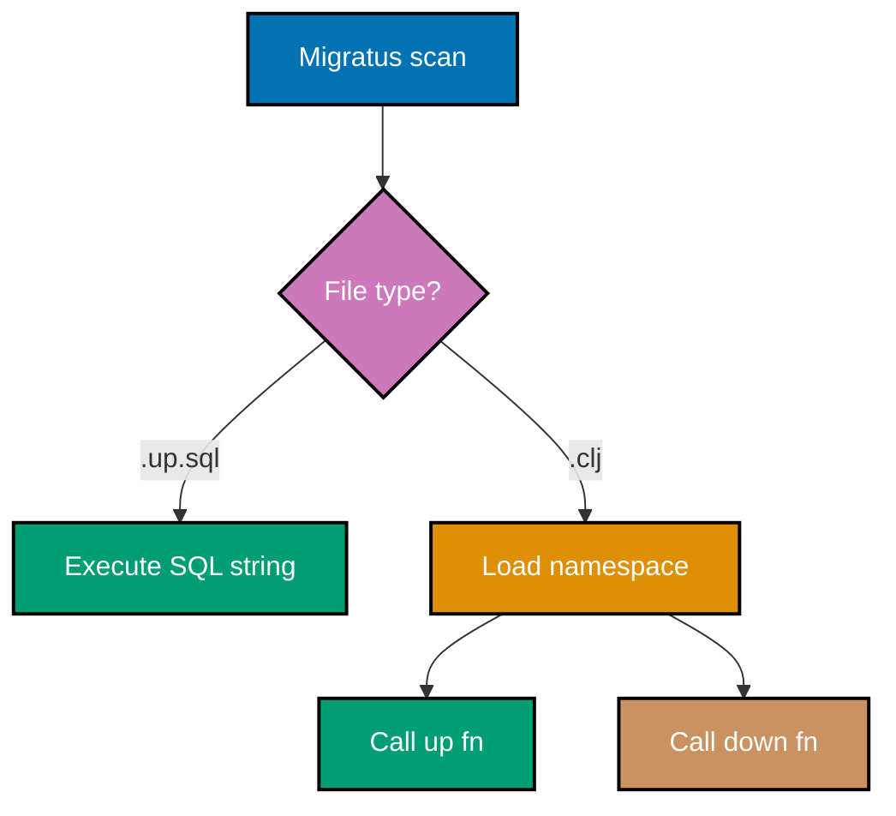
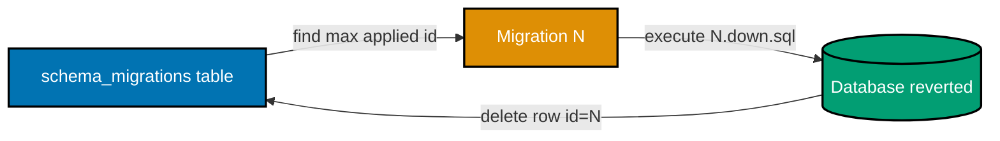

## Intermediate Examples (31-60)

**Coverage**: 40-75% of Migratus functionality

**Focus**: Clojure-based migrations, transaction wrapping, rollback and reset commands, custom stores, data migrations, advanced DDL patterns, testing strategies, and Pedestal integration.

These examples assume you understand beginner concepts (config map, SQL migration pairs, core API operations). Each example is completely self-contained and runnable in a Clojure REPL or as file content.

---

### Example 31: Clojure-Based Migrations (.clj Files)

Migratus supports Clojure namespace files as migrations alongside SQL files. A `.clj` migration file defines `up` and `down` functions in a namespace, enabling programmatic schema changes that SQL alone cannot express.



**File: `resources/migrations/006-seed-roles.clj`**

```clojure
(ns migrations.006-seed-roles
  "Clojure migration: seed roles table with initial data.
   Migratus calls (up db) to apply and (down db) to revert.")
  ; => Namespace must match the file path (migrations/006-seed-roles.clj)
  ; => Migratus passes a next.jdbc connectable as the db argument

(defn up
  "Insert default roles that every deployment requires."
  [db]                                     ; => db is a next.jdbc datasource or connection
  (require '[next.jdbc :as jdbc])
  (jdbc/execute! db
    ["INSERT INTO roles (name) VALUES (?), (?), (?)"
     "admin" "editor" "viewer"]))
  ; => Executes parameterised INSERT; returns [{:next.jdbc/update-count 3}]
  ; => jdbc/execute! uses the same connectable Migratus manages

(defn down
  "Remove the default roles inserted by this migration."
  [db]                                     ; => db provided by Migratus at rollback time
  (require '[next.jdbc :as jdbc])
  (jdbc/execute! db
    ["DELETE FROM roles WHERE name IN (?, ?, ?)"
     "admin" "editor" "viewer"]))
  ; => Targeted DELETE avoids dropping roles added after migration ran
  ; => Always mirror up with a reversible down operation
```

**Key Takeaway**: Clojure migrations receive the live database connectable and can use the full next.jdbc API, making them ideal for data migrations, conditional logic, and operations that require Clojure computation before hitting the database.

**Why It Matters**: Not every schema change fits neatly into a SQL file. Generating UUIDs, hashing passwords for seed users, or branching on existing data all require Clojure code. Mixing `.clj` and `.sql` migrations in the same numbered sequence gives teams the flexibility to use the right tool per migration while preserving a single ordered history tracked by the same `schema_migrations` table.

---

### Example 32: Transaction Wrapping in Migrations

Migratus wraps each SQL migration in a transaction by default. You can override this per-migration using a comment directive, which is necessary for PostgreSQL DDL statements that cannot run inside a transaction (like `CREATE INDEX CONCURRENTLY`).

```clojure
;; Default behaviour: Migratus wraps each migration in a transaction
;; The SQL file runs inside BEGIN / COMMIT automatically
;; If any statement fails, the entire migration rolls back

;; To DISABLE transaction wrapping for a specific migration,
;; add this comment as the very first line of the .up.sql file:
;; -- migratus-no-transaction

;; Example: resources/migrations/007-add-search-index.up.sql
```

**File: `resources/migrations/007-add-search-index.up.sql`**

```sql
-- migratus-no-transaction
-- => Disables auto-transaction for this file only
-- => Required because CREATE INDEX CONCURRENTLY cannot run inside a transaction
-- => PostgreSQL raises: ERROR: CREATE INDEX CONCURRENTLY cannot run inside a transaction block

CREATE INDEX CONCURRENTLY IF NOT EXISTS idx_products_name
  ON products (name);
-- => CONCURRENTLY builds index without holding a full table lock
-- => Other writes continue during index creation (long-running DDL safe for production)
-- => IF NOT EXISTS prevents error on re-run
```

**File: `resources/migrations/007-add-search-index.down.sql`**

```sql
-- migratus-no-transaction
-- => Also disable transaction in the down file for the same reason
DROP INDEX CONCURRENTLY IF EXISTS idx_products_name;
-- => CONCURRENTLY drops index without blocking reads or writes
-- => Matches the non-transactional up migration symmetrically
```

**Key Takeaway**: Use `-- migratus-no-transaction` only when a DDL statement explicitly forbids transactions; leave the default transaction wrapping for all other migrations to guarantee atomicity.

**Why It Matters**: Transactional DDL is one of PostgreSQL's most powerful features—if a migration partially fails, the database reverts to a clean state automatically. Disabling transactions should be deliberate and documented. Production databases running 24/7 depend on `CONCURRENTLY` variants to avoid downtime during index creation on large tables, but mixing transactional and non-transactional statements in the same file without `-- migratus-no-transaction` causes cryptic errors that are hard to diagnose under pressure.

---

### Example 33: Rollback Command (migratus/rollback)

`migratus/rollback` reverts the most recently applied migration by executing the corresponding `.down.sql` file. It reverts exactly one migration per call, making it precise and safe for staged rollback procedures.



```clojure
(require '[migratus.core :as migratus])

(def config
  {:store         :database
   :migration-dir "migrations"              ; => Classpath-relative path to migration files
   :db            {:connection-uri
                   "jdbc:postgresql://localhost:5432/mydb?user=app&password=secret"}})

;; Assume migrations 001, 002, and 003 have been applied
;; schema_migrations contains rows: 1, 2, 3

(migratus/rollback config)
;; => Finds migration with highest applied ID (3)
;; => Executes resources/migrations/003-*.down.sql
;; => Removes row id=3 from schema_migrations
;; => Returns nil on success; throws on failure

;; After rollback: schema_migrations contains rows: 1, 2
;; Call again to rollback migration 002:
(migratus/rollback config)
;; => Executes 002-*.down.sql
;; => schema_migrations contains row: 1 only

;; To rollback a specific migration by ID (not "most recent"):
(migratus/down config 3)
;; => Rolls back migration with ID 3 regardless of order
;; => Useful when you need to revert a non-latest migration
;; => WARNING: can leave schema in inconsistent state if dependencies exist
```

**Key Takeaway**: `migratus/rollback` reverts one migration at a time in reverse order; use `migratus/down` with a specific ID only when targeted rollback is needed and you have verified no dependent migrations exist.

**Why It Matters**: Incremental rollback matches the incremental way migrations were applied. Reverting one migration at a time lets teams verify the schema is correct at each step before continuing the rollback. Automated deployment pipelines use `rollback` as the first recovery action after a failed health check, and it is far safer than dropping and recreating the database from a backup when only the latest migration is faulty.

---

### Example 34: Reset Command (migratus/reset)

`migratus/reset` rolls back all applied migrations in reverse order and then immediately re-applies them all in forward order. It is a destructive operation used only in development and test environments to rebuild the schema from scratch.

```clojure
(require '[migratus.core :as migratus])

(def config
  {:store         :database
   :migration-dir "migrations"
   :db            {:connection-uri
                   "jdbc:postgresql://localhost:5432/devdb?user=dev&password=dev"}})
  ; => WARNING: reset destroys all data in affected tables
  ; => NEVER run against staging or production databases

;; Before reset: migrations 001, 002, 003 applied; tables exist with data
(migratus/reset config)
;; => Phase 1 (down): executes 003.down.sql, 002.down.sql, 001.down.sql in that order
;; => Phase 2 (up):   executes 001.up.sql, 002.up.sql, 003.up.sql in that order
;; => Result: schema rebuilt from scratch; schema_migrations contains 1, 2, 3
;; => All table data is GONE (down migrations drop tables)

;; Contrast with migratus/init (creates tracking table only):
(migratus/init config)
;; => Creates schema_migrations table if it does not exist
;; => Does NOT run any migrations
;; => Safe to call multiple times (idempotent)

;; Contrast with migratus/migrate (applies pending only):
(migratus/migrate config)
;; => Runs only migrations not yet in schema_migrations
;; => Safe to call repeatedly (idempotent)
```

**Key Takeaway**: Reserve `migratus/reset` for development and CI test setup where a clean schema state is required; never invoke it against databases holding real data.

**Why It Matters**: CI pipelines benefit from `reset` because each test run starts from a known empty schema, preventing state leakage between test suites. Developers use `reset` after editing an early migration to verify the full migration sequence still applies cleanly from zero. The destructive nature of `reset` is intentional—it forces teams to treat migrations as the authoritative schema definition rather than relying on manual tweaks that accumulate on long-lived developer databases.

---

### Example 35: Pending Migrations List

`migratus/pending-list` returns the IDs of migrations that have not yet been applied. It queries `schema_migrations` and compares against the migration files present on the classpath—without executing any SQL.

```clojure
(require '[migratus.core :as migratus])

(def config
  {:store         :database
   :migration-dir "migrations"
   :db            {:connection-uri
                   "jdbc:postgresql://localhost:5432/mydb?user=app&password=secret"}})

;; Suppose migrations 001 and 002 are applied; 003, 004 exist on disk but not yet run
(def pending (migratus/pending-list config))
;; => pending is [3 4]  (a seq of Long migration IDs)
;; => IDs are the numeric prefixes from file names: 003-*.sql -> 3, 004-*.sql -> 4
;; => Does NOT run any migration; purely informational

(if (seq pending)                         ; => seq returns nil for empty collection
  (do
    (println "Pending migrations:" pending) ; => Output: Pending migrations: [3 4]
    (migratus/migrate config))              ; => Apply all pending migrations
  (println "Schema is up to date"))
;; => Conditional pattern: check before applying to log intent clearly

;; Use in health-check endpoint to alert when unrun migrations exist in production:
(defn migrations-applied?
  "Returns true when no pending migrations exist."
  [config]
  (empty? (migratus/pending-list config))) ; => empty? is true when seq is nil or empty
;; => migrations-applied? returns false if any pending migrations exist
;; => Useful for readiness probes in Kubernetes deployments
```

**Key Takeaway**: `migratus/pending-list` gives you the set of unapplied migration IDs without side effects, making it safe to call from health checks, deployment scripts, and REPL diagnostics.

**Why It Matters**: Knowing that pending migrations exist before routing traffic to a new deployment is critical for zero-downtime deploys. A readiness probe that calls `migrations-applied?` prevents Kubernetes from marking a pod ready until all migrations have run. This pattern is especially valuable in horizontally scaled deployments where multiple pods start simultaneously and only one should run migrations while others wait.

---

### Example 36: Custom Migration Store

Migratus allows you to implement custom migration stores by implementing the `migratus.store/Store` protocol. A custom store controls where migration SQL is loaded from and how applied state is tracked.

```clojure
(ns example.custom-store
  "Demonstrates implementing a custom Migratus store backed by the filesystem
   with applied state tracked in an in-memory atom (useful for testing).")

(require '[migratus.protocols :as mp])    ; => Migratus protocol namespace

;; In-memory state tracker (simulates schema_migrations)
(def applied-ids (atom #{}))             ; => atom wraps a set; starts empty
                                         ; => #{} is the empty set literal in Clojure

(defrecord MemoryStore [migrations-dir]
  ; => defrecord creates a Java class implementing given protocols
  ; => MemoryStore has one field: migrations-dir (path to .sql files)

  mp/Store
  ; => Implement all methods required by the Store protocol

  (init [_]                              ; => Called once before any migration runs
    (println "MemoryStore initialised")) ; => No-op: in-memory store needs no setup

  (applied-migration-ids [_]            ; => Returns set of applied migration IDs
    @applied-ids)                        ; => Dereference atom to get current set value

  (mark-applied [_ id _]               ; => Called after successful up migration
    (swap! applied-ids conj id))         ; => swap! atomically adds id to the set

  (mark-rolled-back [_ id]             ; => Called after successful down migration
    (swap! applied-ids disj id)))        ; => disj removes id from the set atomically

;; Usage: pass :store instance directly in config map
(def config
  {:store         (->MemoryStore "migrations") ; => Construct MemoryStore record
                                               ; => ->MemoryStore is auto-generated constructor
   :migration-dir "migrations"
   :db            {:connection-uri "jdbc:sqlite:test.db"}})
```

**Key Takeaway**: Implement `migratus.protocols/Store` to replace the default database-backed tracking with any persistence mechanism—useful for testing migrations without a real `schema_migrations` table.

**Why It Matters**: Custom stores enable migration testing in environments where creating `schema_migrations` in a shared database is undesirable (CI pipelines sharing a test database across concurrent jobs). An in-memory store also lets property-based tests verify migration sequences without any database interaction, making the test suite faster and fully deterministic.

---

### Example 37: Data Migration with INSERT...SELECT

Data migrations copy and transform existing rows into a new table structure. Combining `INSERT ... SELECT` with SQL functions performs the transformation atomically inside the migration transaction.

```sql
-- resources/migrations/008-normalise-user-emails.up.sql
-- => Data migration: populate new email_addresses table from users.email column
-- => Runs inside a transaction; either all rows migrate or none do

CREATE TABLE IF NOT EXISTS email_addresses (
  id      BIGSERIAL PRIMARY KEY,         -- => Auto-incrementing surrogate key
  user_id TEXT      NOT NULL,            -- => FK referencing users(id)
  email   TEXT      NOT NULL,            -- => Extracted from users.email
  type    TEXT      NOT NULL DEFAULT 'primary', -- => All migrated emails are primary
  FOREIGN KEY (user_id) REFERENCES users (id)  -- => Enforce referential integrity
);
-- => Creates destination table before inserting

INSERT INTO email_addresses (user_id, email, type)
SELECT id,
       LOWER(TRIM(email)),              -- => Normalise: lowercase and strip whitespace
       'primary'
FROM   users
WHERE  email IS NOT NULL               -- => Skip users with no email stored
  AND  TRIM(email) <> '';              -- => Skip blank-string emails
-- => INSERT...SELECT is atomic: all or nothing inside the wrapping transaction
-- => LOWER(TRIM(...)) normalises inconsistent email casing from legacy data
```

```sql
-- resources/migrations/008-normalise-user-emails.down.sql
DROP TABLE IF EXISTS email_addresses;
-- => Drops the table and all migrated data
-- => Original users.email column is untouched; data is recoverable
```

**Key Takeaway**: `INSERT ... SELECT` combines table creation and data copy in a single atomic statement, making it the standard pattern for populating a new table from existing data during a schema normalisation migration.

**Why It Matters**: Data migrations that fail halfway leave the database in a split state where some rows are migrated and others are not, causing application bugs that are difficult to reproduce. Running the full migration inside a transaction guarantees an all-or-nothing outcome. The `LOWER(TRIM(...))` transformation shows how SQL functions clean legacy data at migration time rather than burdening application code with perpetual data-quality checks.

---

### Example 38: Seed Data Pattern

Seed migrations insert reference data (lookup tables, default configuration, initial admin users) that the application requires to function. Seeds run as ordinary numbered migrations so their order relative to schema migrations is explicit.

```sql
-- resources/migrations/009-seed-currencies.up.sql
-- => Seed migration: insert ISO 4217 currency codes required by the application
-- => INSERT ... ON CONFLICT DO NOTHING makes this idempotent
-- => Safe to re-run if migration tracking table is reset during disaster recovery

INSERT INTO currencies (code, name, symbol)
VALUES
  ('USD', 'United States Dollar', '$'),  -- => ISO 4217 code, human name, display symbol
  ('EUR', 'Euro',                 '€'),
  ('GBP', 'Pound Sterling',       '£'),
  ('IDR', 'Indonesian Rupiah',    'Rp'),
  ('MYR', 'Malaysian Ringgit',    'RM')
ON CONFLICT (code) DO NOTHING;           -- => Skip if currency already exists
                                         -- => Prevents unique constraint violation on re-run
                                         -- => Requires UNIQUE constraint on currencies(code)
```

```sql
-- resources/migrations/009-seed-currencies.down.sql
DELETE FROM currencies
WHERE code IN ('USD', 'EUR', 'GBP', 'IDR', 'MYR');
-- => Targeted DELETE removes only the rows this migration inserted
-- => Does not delete currencies added by later migrations or application code
```

**Key Takeaway**: Seed migrations use `ON CONFLICT DO NOTHING` or `ON CONFLICT DO UPDATE` to remain idempotent, so they can be safely re-applied after a reset without violating unique constraints.

**Why It Matters**: Hard-coding lookup data in application startup code creates a hidden dependency: the application fails to start if the data is missing. Expressing seed data as migrations makes the dependency explicit, versioned, and automatically applied during deployment. The idempotency guarantee via `ON CONFLICT` is essential for disaster recovery scenarios where migrations are re-run against a database that already contains partial data.

---

### Example 39: Foreign Key with ON UPDATE CASCADE

`ON UPDATE CASCADE` propagates primary key changes to all referencing foreign keys automatically. This removes the need for manual cascading updates in application code when a referenced value changes.

```sql
-- resources/migrations/010-add-order-items.up.sql
-- => Creates order_items table with cascading FK to orders

CREATE TABLE IF NOT EXISTS orders (
  id         TEXT PRIMARY KEY,           -- => UUID stored as TEXT; application generates
  total      NUMERIC(12, 2) NOT NULL,   -- => Fixed precision for monetary amounts
  created_at TEXT NOT NULL
);

CREATE TABLE IF NOT EXISTS order_items (
  id         BIGSERIAL PRIMARY KEY,      -- => Surrogate integer key for items
  order_id   TEXT NOT NULL,              -- => FK references orders(id)
  product_id TEXT NOT NULL,
  quantity   INTEGER NOT NULL CHECK (quantity > 0), -- => Inline CHECK constraint
  unit_price NUMERIC(12, 2) NOT NULL,

  FOREIGN KEY (order_id) REFERENCES orders (id)
    ON UPDATE CASCADE                    -- => If orders.id changes, order_items.order_id updates automatically
    ON DELETE CASCADE                    -- => If order deleted, all its items are deleted
    DEFERRABLE INITIALLY DEFERRED       -- => FK check deferred to end of transaction
                                         -- => Allows inserting items before the order row in same tx
);
-- => DEFERRABLE INITIALLY DEFERRED is a PostgreSQL extension for flexible insert ordering
```

**Key Takeaway**: `ON UPDATE CASCADE` and `ON DELETE CASCADE` move referential integrity enforcement into the database, eliminating application-level cascading logic that can be bypassed or forgotten.

**Why It Matters**: Application-level cascade logic—updating child rows manually after changing a parent—fails silently when developers use raw SQL, bypass the ORM, or forget to include the cascade in a bulk update. Database-enforced `CASCADE` never misses a reference, runs in the same transaction as the parent change, and is visible to all future developers without reading application code. The `DEFERRABLE INITIALLY DEFERRED` option solves insert ordering problems in complex transactions without sacrificing constraint enforcement.

---

### Example 40: Composite Primary Keys

Composite primary keys use multiple columns together as the unique identifier. They are common in junction tables (many-to-many relationships) and history tables where the combination of values is naturally unique.

```sql
-- resources/migrations/011-create-user-roles.up.sql
-- => Creates user_roles junction table with composite PK
-- => A user can have multiple roles; a role can belong to many users

CREATE TABLE IF NOT EXISTS user_roles (
  user_id    TEXT NOT NULL,              -- => FK to users(id)
  role_id    BIGINT NOT NULL,            -- => FK to roles(id)
  granted_at TEXT NOT NULL,             -- => When this role was assigned
  granted_by TEXT,                       -- => Who assigned it (nullable: may be system-assigned)

  PRIMARY KEY (user_id, role_id),       -- => Composite PK: pair is unique, no surrogate key needed
                                         -- => Automatically creates a composite index
  FOREIGN KEY (user_id) REFERENCES users (id) ON DELETE CASCADE,
  -- => Removing a user removes all their role assignments
  FOREIGN KEY (role_id) REFERENCES roles (id) ON DELETE CASCADE
  -- => Removing a role removes all user assignments for that role
);

CREATE INDEX IF NOT EXISTS idx_user_roles_role_id
  ON user_roles (role_id);              -- => Index on role_id for queries filtering by role
                                         -- => The composite PK already indexes (user_id, role_id)
                                         -- => This index supports role_id-first lookups efficiently
```

```sql
-- resources/migrations/011-create-user-roles.down.sql
DROP TABLE IF EXISTS user_roles;
```

**Key Takeaway**: Composite primary keys on junction tables eliminate the need for a surrogate `id` column while providing an implicit unique index; add a single-column index on the secondary FK column to support queries filtering by that column alone.

**Why It Matters**: Junction tables with surrogate IDs enable duplicate associations (same user-role pair inserted twice), requiring an additional `UNIQUE` constraint anyway. Composite PKs prevent duplicates structurally. The secondary index on `role_id` prevents full table scans when answering "which users have role X?"—a query common in authorization checks that becomes expensive without it at scale.

---

### Example 41: Partial Indexes

Partial indexes index only rows matching a `WHERE` predicate. They are smaller, faster to update, and often more useful than full-column indexes when a query always filters on the same condition.

```sql
-- resources/migrations/012-add-active-user-index.up.sql
-- => Partial index: index only active users (status = 'active')
-- => Most queries filter on active users; indexing inactive users wastes space

CREATE INDEX IF NOT EXISTS idx_users_active_email
  ON users (email)
  WHERE status = 'active';
-- => Index size: proportional to number of active users, not total users
-- => Query planner uses this index for: SELECT * FROM users WHERE status='active' AND email=?
-- => The WHERE condition in the query must match the partial index predicate exactly

CREATE INDEX IF NOT EXISTS idx_expenses_pending
  ON expenses (user_id, created_at DESC)
  WHERE status = 'pending';
-- => Multi-column partial index for pending expenses ordered by creation date
-- => Supports: SELECT * FROM expenses WHERE user_id=? AND status='pending' ORDER BY created_at DESC
-- => LIMIT queries benefit most: index already sorted, planner stops at LIMIT rows
```

```sql
-- resources/migrations/012-add-active-user-index.down.sql
DROP INDEX IF EXISTS idx_users_active_email;
DROP INDEX IF EXISTS idx_expenses_pending;
```

**Key Takeaway**: Partial indexes deliver full-index query performance at a fraction of the storage cost when queries consistently include the same filter predicate; the query `WHERE` clause must exactly match the index predicate for the planner to use it.

**Why It Matters**: A table with 10 million users where 90% are inactive wastes 90% of a full-column index storage and update overhead on rows rarely queried. The partial index covers only the 1 million active users, making writes faster (fewer index entries to maintain) and index scans faster (fewer pages to read). This pattern is particularly effective for soft-delete patterns (`WHERE deleted_at IS NULL`) and status-filtered queries common in SaaS applications.

---

### Example 42: Full-Text Search Indexes

PostgreSQL's `tsvector` type and GIN indexes enable efficient full-text search without an external search engine. Migrations create a generated `tsvector` column and a GIN index on it.

```sql
-- resources/migrations/013-add-fts-to-products.up.sql
-- => Full-text search: add tsvector column and GIN index to products table

ALTER TABLE products
  ADD COLUMN IF NOT EXISTS search_vector tsvector;
-- => tsvector stores pre-processed lexemes (stemmed tokens) for full-text search
-- => Generated from text columns; must be updated when source columns change

UPDATE products
SET search_vector =
  to_tsvector('english',               -- => 'english' stemmer: "running" -> "run"
    COALESCE(name, '') || ' ' ||        -- => Concatenate name field (handle nulls)
    COALESCE(description, ''));         -- => Include description field
-- => Populates existing rows; new rows require trigger or application-level update
-- => to_tsvector normalises text: strips punctuation, applies stemming, removes stop words

CREATE INDEX IF NOT EXISTS idx_products_fts
  ON products USING GIN (search_vector); -- => GIN index required for tsvector queries
                                          -- => GIN: Generalised Inverted Index; maps lexemes to row IDs
```

```sql
-- resources/migrations/013-add-fts-to-products.down.sql
DROP INDEX IF EXISTS idx_products_fts;
ALTER TABLE products DROP COLUMN IF EXISTS search_vector;
```

**Key Takeaway**: Add a `tsvector` column populated by `to_tsvector` and a GIN index to enable `WHERE search_vector @@ to_tsquery(?)` full-text queries without changing your schema's logical structure.

**Why It Matters**: Full-text search using `LIKE '%keyword%'` performs sequential scans and cannot leverage indexes. The `tsvector`/`tsquery` system enables index-backed search with linguistic intelligence (stemming, stop words, ranking) that covers the majority of search use cases without the operational complexity of Elasticsearch or Solr. For applications where search is secondary to relational queries, this built-in PostgreSQL capability is often sufficient and eliminates a deployment dependency.

---

### Example 43: Creating Views

SQL views wrap complex queries behind a named relation. Migrations create views so that query complexity is managed at the database layer and multiple application queries share a single maintained definition.

```sql
-- resources/migrations/014-create-expense-summary-view.up.sql
-- => View: aggregate expenses per user with monthly totals

CREATE OR REPLACE VIEW user_expense_summary AS
SELECT
  u.id                                   AS user_id,
  u.username,
  COUNT(e.id)                            AS total_expenses,
  -- => COUNT(e.id) counts non-null expense IDs (excludes users with no expenses)
  COALESCE(SUM(e.amount::NUMERIC), 0)   AS total_amount,
  -- => Cast TEXT amount to NUMERIC for aggregation; COALESCE handles no-expense users
  COALESCE(
    MAX(e.date),
    'none'
  )                                       AS latest_expense_date
FROM users u
LEFT JOIN expenses e ON e.user_id = u.id -- => LEFT JOIN includes users with zero expenses
GROUP BY u.id, u.username;               -- => GROUP BY all non-aggregate SELECT columns
-- => CREATE OR REPLACE VIEW allows updating the view definition without drop/recreate
-- => Not transactional across major changes; prefer DROP + CREATE for structural changes
```

```sql
-- resources/migrations/014-create-expense-summary-view.down.sql
DROP VIEW IF EXISTS user_expense_summary;
```

**Key Takeaway**: `CREATE OR REPLACE VIEW` encapsulates complex aggregation queries as a named relation; application code queries the view as if it were a table, decoupling query complexity from the codebase.

**Why It Matters**: Without views, complex reporting queries are duplicated across application layers—API handlers, background jobs, analytics scripts—and diverge over time as requirements change. Centralising the query in a view creates a single source of truth: update the migration and all callers benefit automatically. Views also provide a security boundary; granting `SELECT` on a view but not on underlying tables allows read-only reporting roles without exposing raw schema details.

---

### Example 44: Creating Materialized Views

Materialized views store query results on disk. Unlike regular views, they do not recompute on every access, making them suitable for expensive aggregations that tolerate some staleness.

```sql
-- resources/migrations/015-create-monthly-report-matview.up.sql
-- => Materialized view: monthly expense totals per user
-- => Expensive aggregation pre-computed and stored; refreshed on demand

CREATE MATERIALIZED VIEW IF NOT EXISTS monthly_expense_report AS
SELECT
  user_id,
  DATE_TRUNC('month', date::DATE)       AS month,
  -- => DATE_TRUNC truncates to start of month: '2024-03-15' -> '2024-03-01'
  -- => Cast TEXT date column to DATE type for date function
  SUM(amount::NUMERIC)                  AS total_amount,
  COUNT(*)                              AS expense_count,
  AVG(amount::NUMERIC)                  AS avg_amount
FROM expenses
GROUP BY user_id, DATE_TRUNC('month', date::DATE)
WITH DATA;                               -- => WITH DATA populates immediately on creation
                                         -- => WITH NO DATA creates empty matview (populate later)

CREATE UNIQUE INDEX IF NOT EXISTS idx_monthly_report_user_month
  ON monthly_expense_report (user_id, month);
-- => Unique index required for REFRESH MATERIALIZED VIEW CONCURRENTLY
-- => CONCURRENTLY refreshes without locking readers; requires unique index
```

```sql
-- resources/migrations/015-create-monthly-report-matview.down.sql
DROP MATERIALIZED VIEW IF EXISTS monthly_expense_report;
```

**Key Takeaway**: Materialized views trade data freshness for query speed; add a unique index to enable `REFRESH MATERIALIZED VIEW CONCURRENTLY` so refreshes do not block read queries.

**Why It Matters**: Dashboard queries aggregating months of expense data across thousands of users are too slow for real-time execution at every page load. A materialized view pre-computes the result, reducing dashboard query time from seconds to milliseconds. The `CONCURRENTLY` refresh option—requiring a unique index—allows the view to update in the background while the dashboard continues serving the previous snapshot, eliminating the downtime window that a non-concurrent refresh would create.

---

### Example 45: Trigger Functions

Trigger functions execute automatically before or after row operations. They are used for audit logging, computed column maintenance, and enforcing business rules that span multiple tables.

```sql
-- resources/migrations/016-add-audit-trigger.up.sql
-- => Trigger function: record every UPDATE to expenses in an audit log

CREATE TABLE IF NOT EXISTS expense_audit_log (
  id           BIGSERIAL PRIMARY KEY,
  expense_id   TEXT NOT NULL,           -- => Which expense changed
  changed_by   TEXT,                    -- => Application user (from session context)
  changed_at   TEXT NOT NULL,           -- => When the change occurred
  old_amount   TEXT,                    -- => Previous amount value
  new_amount   TEXT                     -- => New amount value
);
-- => Audit table stores old and new values for changed rows

CREATE OR REPLACE FUNCTION log_expense_update()
RETURNS TRIGGER AS $$                   -- => $$ is PostgreSQL dollar-quoting (avoids escape issues)
BEGIN
  IF OLD.amount <> NEW.amount THEN      -- => Only log when amount actually changed
    INSERT INTO expense_audit_log
      (expense_id, changed_at, old_amount, new_amount)
    VALUES
      (OLD.id, NOW()::TEXT, OLD.amount, NEW.amount);
    -- => OLD is the row before UPDATE; NEW is the row after UPDATE
    -- => NOW()::TEXT converts current timestamp to ISO-8601 text
  END IF;
  RETURN NEW;                           -- => RETURN NEW continues the original UPDATE
END;                                    -- => RETURN NULL would cancel the UPDATE (not wanted here)
$$ LANGUAGE plpgsql;

CREATE TRIGGER expenses_audit_update
  AFTER UPDATE ON expenses              -- => Fire after each successful row UPDATE
  FOR EACH ROW                          -- => Row-level trigger (statement-level uses FOR EACH STATEMENT)
  EXECUTE FUNCTION log_expense_update(); -- => Calls the function above
```

```sql
-- resources/migrations/016-add-audit-trigger.down.sql
DROP TRIGGER IF EXISTS expenses_audit_update ON expenses;
DROP FUNCTION IF EXISTS log_expense_update();
DROP TABLE IF EXISTS expense_audit_log;
```

**Key Takeaway**: Trigger functions fire automatically on DML operations, ensuring audit logging and derived data maintenance happen regardless of which application path modifies the row.

**Why It Matters**: Application-level audit logging is bypassed whenever code writes to the database outside the main application path—bulk imports, data fixes, background jobs using raw SQL. Database triggers fire unconditionally, creating a complete and tamper-evident audit record. This is a compliance requirement in financial and healthcare applications where every data modification must be traceable to a time and actor.

---

### Example 46: Stored Procedures

Stored procedures encapsulate multi-step logic that must run atomically inside the database. PostgreSQL `PROCEDURE` (added in PostgreSQL 11) supports transaction control, unlike functions.

```sql
-- resources/migrations/017-add-transfer-procedure.up.sql
-- => Stored procedure: transfer amount between two expense categories atomically

CREATE OR REPLACE PROCEDURE transfer_expense_category(
  p_user_id   TEXT,                     -- => Procedure parameter: user whose expenses to transfer
  p_from_cat  TEXT,                     -- => Source category name
  p_to_cat    TEXT,                     -- => Destination category name
  p_amount    NUMERIC                   -- => Amount to transfer between categories
)
LANGUAGE plpgsql AS $$
DECLARE
  v_available NUMERIC;                  -- => Declare local variable for available amount
BEGIN
  SELECT COALESCE(SUM(amount::NUMERIC), 0)
  INTO v_available                      -- => INTO populates the local variable
  FROM expenses
  WHERE user_id = p_user_id AND category = p_from_cat;
  -- => Check available amount in source category

  IF v_available < p_amount THEN
    RAISE EXCEPTION 'Insufficient amount in category %: have %, need %',
      p_from_cat, v_available, p_amount; -- => RAISE EXCEPTION aborts transaction
  END IF;

  UPDATE expenses
  SET category = p_to_cat
  WHERE user_id = p_user_id
    AND category = p_from_cat
    AND amount::NUMERIC <= p_amount;    -- => Move individual expenses up to the target amount
  -- => COMMIT/ROLLBACK are allowed inside PROCEDURE (unlike FUNCTION)
END;
$$;
```

```sql
-- resources/migrations/017-add-transfer-procedure.down.sql
DROP PROCEDURE IF EXISTS transfer_expense_category(TEXT, TEXT, TEXT, NUMERIC);
-- => Must specify parameter types to uniquely identify overloaded procedures
```

**Key Takeaway**: Use `CREATE PROCEDURE` when you need transaction control inside database-side logic; `CREATE FUNCTION` cannot issue `COMMIT` or `ROLLBACK`, making procedures necessary for multi-step atomic operations.

**Why It Matters**: Moving complex multi-step business logic into a stored procedure eliminates the round-trip latency of an application driving the same logic over multiple SQL calls. A transfer that requires checking a balance, deducting from one row, and crediting another benefits from executing entirely within the database, where intermediate state is never visible to other connections and rollback is instantaneous on failure.

---

### Example 47: Conditional Migration Logic

Clojure migrations can query the database and branch on the result, enabling migrations that adapt to the current schema state without failing on databases that have diverged slightly between environments.

```clojure
;; resources/migrations/018-conditional-column.clj
;; Clojure migration: add column only if it does not exist (safe for partial rollouts)

(ns migrations.018-conditional-column)

(defn up
  "Add notes column to expenses only if it is absent."
  [db]
  (require '[next.jdbc :as jdbc])
  (let [result (jdbc/execute-one!
                 db
                 ["SELECT column_name
                   FROM information_schema.columns
                   WHERE table_name  = 'expenses'
                     AND column_name = 'notes'"])]
    ; => query information_schema: standard SQL catalog view
    ; => execute-one! returns a map or nil (not a seq like execute!)
    (when (nil? result)                  ; => nil means column does not exist
      (jdbc/execute! db
        ["ALTER TABLE expenses ADD COLUMN notes TEXT"]))))
  ; => Conditionally adds the column; no error if already present
  ; => Idempotent: safe to run again even if migration tracking table was reset

(defn down
  "Remove notes column from expenses."
  [db]
  (require '[next.jdbc :as jdbc])
  (jdbc/execute! db
    ["ALTER TABLE expenses DROP COLUMN IF EXISTS notes"]))
  ; => IF EXISTS makes down idempotent too
  ; => Safe even if up's conditional branch was skipped
```

**Key Takeaway**: Use `information_schema` queries in Clojure migrations to guard DDL operations when the schema may have diverged between environments; this makes migrations idempotent and safe to re-run.

**Why It Matters**: In teams where developers sometimes apply schema changes manually for urgent fixes, the migration may arrive in the version control history after the change already exists on staging or production. A conditional migration avoids the "column already exists" error that would otherwise block the deployment pipeline. This pattern is a pragmatic safety net, not an excuse to skip version control—but it prevents a manual hotfix from permanently blocking automated deployments.

---

### Example 48: Batch Data Migration Pattern

Large data migrations must process rows in batches to avoid long-running transactions, excessive memory usage, and table-lock contention. The Clojure migration loops until no more rows require processing.

```clojure
;; resources/migrations/019-backfill-user-slug.clj
;; Batch migration: generate URL slugs for existing users who have none

(ns migrations.019-backfill-user-slug)

(defn slugify
  "Convert a username to a URL-safe slug."
  [username]
  (-> username
      clojure.string/lower-case         ; => "John Doe" -> "john doe"
      (clojure.string/replace #"[^a-z0-9]" "-") ; => "john doe" -> "john-doe"
      (clojure.string/replace #"-+" "-")         ; => collapse multiple hyphens
      (clojure.string/trim)))           ; => trim leading/trailing hyphens

(def batch-size 500)                    ; => Process 500 rows per transaction
                                        ; => Balances transaction size vs loop iterations

(defn up
  "Backfill slug column for all users without one."
  [db]
  (require '[next.jdbc :as jdbc])
  (loop []                              ; => Tail-recursive loop; no accumulator
    (let [batch (jdbc/execute!
                  db
                  ["SELECT id, username FROM users
                    WHERE slug IS NULL
                    LIMIT ?"
                   batch-size])]       ; => Fetch at most batch-size rows without a slug
      (when (seq batch)                 ; => Continue only when rows remain
        (doseq [{:users/keys [id username]} batch] ; => Destructure next.jdbc column namespaced keys
          (jdbc/execute! db
            ["UPDATE users SET slug = ? WHERE id = ?"
             (slugify username) id]))  ; => Update each row individually (safe for any batch size)
        (recur)))))                     ; => recur jumps back to loop start; checks remaining rows

(defn down
  "Remove generated slugs (set back to NULL)."
  [db]
  (require '[next.jdbc :as jdbc])
  (jdbc/execute! db ["UPDATE users SET slug = NULL"]))
```

**Key Takeaway**: Batch data migrations use `LIMIT` to fetch rows incrementally inside a `loop/recur`, committing small transactions that avoid table locks and allow other queries to run between batches.

**Why It Matters**: A single `UPDATE users SET slug = slugify(username)` on a table with millions of rows holds row-level locks for minutes, blocking every concurrent write to the users table. Batching limits the lock window to milliseconds per transaction. The `recur` tail call avoids stack overflow regardless of table size. Production teams running live systems cannot afford multi-minute lock windows, so batch migrations are a non-negotiable pattern for large tables.

---

### Example 49: Migration Testing with clojure.test

Testing migrations verifies that `up` and `down` pairs leave the database in the expected state. Tests use an in-memory SQLite database so they run without PostgreSQL infrastructure.

```clojure
(ns migrations.test.example-49
  (:require [clojure.test :refer [deftest is testing use-fixtures]]
            [migratus.core :as migratus]
            [next.jdbc :as jdbc]))

;; SQLite in-memory database for fast migration tests
(def test-config
  {:store         :database
   :migration-dir "test-migrations"      ; => Points to a test-specific migrations directory
   :db            {:connection-uri "jdbc:sqlite::memory:"}})
                                         ; => :memory: creates a fresh SQLite DB per connection
                                         ; => No file cleanup required after tests

(deftest test-create-users-migration
  (testing "up migration creates users table"
    (migratus/migrate test-config)       ; => Apply all pending migrations
    (let [result (jdbc/execute!
                   (jdbc/get-datasource (:db test-config))
                   ["SELECT name FROM sqlite_master
                     WHERE type='table' AND name='users'"])]
      (is (= 1 (count result)))))        ; => Exactly one row: the users table exists

  (testing "down migration drops users table"
    (migratus/rollback test-config)      ; => Revert most recent migration
    (let [result (jdbc/execute!
                   (jdbc/get-datasource (:db test-config))
                   ["SELECT name FROM sqlite_master
                     WHERE type='table' AND name='users'"])]
      (is (= 0 (count result))))))       ; => Zero rows: table was dropped by rollback
```

**Key Takeaway**: Use an in-memory SQLite database to run migration tests without external infrastructure; verify that `up` creates the expected schema and `down` removes it cleanly.

**Why It Matters**: Migrations are code and need tests like any other code. An untested `down` migration discovered during a production rollback is the worst possible time to find a bug in it. Testing both directions on every migration gives teams confidence that rollbacks will work under pressure. The SQLite in-memory approach keeps tests fast and isolated, running in CI without Docker or a shared test database.

---

### Example 50: Test Database Setup with Testcontainers

Testcontainers spins up a real PostgreSQL container for integration tests, providing full PostgreSQL compatibility including features SQLite does not support (JSON operators, CTEs, window functions).

```clojure
(ns migrations.test.example-50
  (:require [clojure.test :refer [deftest is use-fixtures]]
            [migratus.core :as migratus]
            [next.jdbc :as jdbc])
  (:import [org.testcontainers.containers PostgreSQLContainer]))

(defonce ^:dynamic *db-config* nil)     ; => Dynamic var holds connection config per test run
                                         ; => defonce prevents redefinition on namespace reload

(defn start-postgres-container
  "Start a PostgreSQL container and return Migratus config."
  []
  (let [container (doto (PostgreSQLContainer. "postgres:16-alpine")
                    (.start))]          ; => doto chains method calls; start returns void
    {:store         :database
     :migration-dir "migrations"
     :db            {:connection-uri (.getJdbcUrl container) ; => Container-assigned JDBC URL
                     :username       (.getUsername container) ; => "test" by default
                     :password       (.getPassword container)}})) ; => Auto-generated password

(defn with-clean-db
  "Fixture: start fresh PostgreSQL for each test, apply migrations."
  [test-fn]
  (let [cfg (start-postgres-container)]
    (migratus/migrate cfg)              ; => Apply all migrations to clean container
    (binding [*db-config* cfg]          ; => Bind dynamic var so test body can access config
      (test-fn))                        ; => Run the actual test
    (.stop ^PostgreSQLContainer (get-in cfg [:container :instance])))) ; => Cleanup container

(use-fixtures :each with-clean-db)      ; => Run fixture around each deftest

(deftest test-expense-schema
  (let [ds (jdbc/get-datasource (:db *db-config*))]
    (jdbc/execute! ds ["INSERT INTO expenses
                        (id, user_id, type, amount, currency, description, category, date,
                         created_at, updated_at)
                        VALUES (?, ?, ?, ?, ?, ?, ?, ?, ?, ?)"
                       "exp-1" "usr-1" "food" "25.50" "USD" "Lunch" "meals"
                       "2024-01-15" "2024-01-15T12:00:00" "2024-01-15T12:00:00"])
    (let [row (jdbc/execute-one! ds ["SELECT * FROM expenses WHERE id = ?" "exp-1"])]
      (is (= "25.50" (:expenses/amount row)))))) ; => Verify exact schema column type
```

**Key Takeaway**: Testcontainers provides real PostgreSQL semantics for integration tests; combine with `use-fixtures :each` to reset the database state between every test, preventing state leakage.

**Why It Matters**: SQLite's type affinity, missing operators, and limited DDL support mean that tests passing on SQLite can still fail on PostgreSQL in production. Testcontainers runs the exact same PostgreSQL version as production, catching type mismatches, missing indexes, and PostgreSQL-specific syntax errors before deployment. The per-test fixture overhead is acceptable because real database fidelity is worth the extra startup time when testing schema-dependent code.

---

### Example 51: JSON/JSONB Columns

PostgreSQL `JSONB` stores JSON data in a binary format that supports indexing and efficient operators. Migrations add `JSONB` columns for flexible metadata fields that vary across rows.

```sql
-- resources/migrations/020-add-metadata-jsonb.up.sql
-- => Add JSONB metadata column to expenses for flexible key-value attributes

ALTER TABLE expenses
  ADD COLUMN IF NOT EXISTS metadata JSONB;
-- => JSONB: binary JSON; supports indexing, operators, functions
-- => JSON: text JSON; preserves key order and whitespace but no indexing
-- => JSONB preferred for all new columns unless exact JSON preservation required

-- => Add GIN index for containment queries (see Example 53 for full GIN coverage)
CREATE INDEX IF NOT EXISTS idx_expenses_metadata_gin
  ON expenses USING GIN (metadata);
-- => Supports: SELECT * FROM expenses WHERE metadata @> '{"currency":"USD"}'::jsonb
-- => @> operator: "contains" (left JSONB contains right JSONB subset)

-- => Example: populate metadata for existing rows with default
UPDATE expenses
SET metadata = '{"migrated": true}'::jsonb
WHERE metadata IS NULL;
-- => ::jsonb cast converts text literal to JSONB
-- => Existing rows get a baseline metadata object; application code can update later
```

```sql
-- resources/migrations/020-add-metadata-jsonb.down.sql
DROP INDEX IF EXISTS idx_expenses_metadata_gin;
ALTER TABLE expenses DROP COLUMN IF EXISTS metadata;
```

**Key Takeaway**: Use `JSONB` over `JSON` for new columns because it supports GIN indexing and efficient containment/existence operators; add a GIN index immediately to enable `@>` and `?` queries without sequential scans.

**Why It Matters**: JSONB columns solve the "variable attributes" problem that otherwise requires either a wide table with mostly-null columns or a separate entity-attribute-value table. Product attributes, user preferences, and integration-specific metadata all benefit from JSONB's flexible schema. Adding the GIN index in the same migration that creates the column prevents the operational oversight of deploying a JSONB column and forgetting to add the index, which causes full table scans on containment queries.

---

### Example 52: Array Columns (PostgreSQL)

PostgreSQL native array columns store ordered lists of values in a single column without a junction table. Migrations create array columns with appropriate element types and indexes.

```sql
-- resources/migrations/021-add-tags-array.up.sql
-- => Add TEXT[] (text array) column to expenses for user-defined tags

ALTER TABLE expenses
  ADD COLUMN IF NOT EXISTS tags TEXT[] DEFAULT '{}';
-- => TEXT[] is a PostgreSQL native array of text values
-- => DEFAULT '{}' sets empty array as default (not NULL)
-- => '{}' is PostgreSQL array literal for an empty array

-- => GIN index for array containment and overlap operators
CREATE INDEX IF NOT EXISTS idx_expenses_tags_gin
  ON expenses USING GIN (tags);
-- => Supports: WHERE tags @> ARRAY['food', 'restaurant']  -- contains all
-- => Supports: WHERE tags && ARRAY['food', 'travel']      -- overlaps (any match)
-- => Supports: WHERE 'food' = ANY(tags)                   -- element membership

-- => Example query using array operators:
-- SELECT * FROM expenses
-- WHERE tags @> ARRAY['food']::text[]   -- all expenses tagged 'food'
--   AND tags && ARRAY['lunch', 'dinner']::text[];  -- and tagged lunch or dinner
-- => ::text[] cast required when comparing array literals
```

```sql
-- resources/migrations/021-add-tags-array.down.sql
DROP INDEX IF EXISTS idx_expenses_tags_gin;
ALTER TABLE expenses DROP COLUMN IF EXISTS tags;
```

**Key Takeaway**: PostgreSQL array columns with GIN indexes support containment (`@>`), overlap (`&&`), and membership (`= ANY(...)`) operators efficiently, eliminating junction tables for simple tag or label associations.

**Why It Matters**: A junction table for tags requires three tables (entities, tags, entity_tags), two joins per query, and careful index design. For simple tagging where the full relational flexibility is not needed, a `TEXT[]` column with a GIN index provides the same query capability with significantly less schema complexity and faster read performance. The GIN index handles containment and overlap queries that would require multi-join aggregations in the junction table model.

---

### Example 53: GIN Index for JSONB

GIN (Generalised Inverted Index) indexes map individual JSONB keys and values to row identifiers, enabling fast containment, existence, and path queries across JSONB columns.

```sql
-- resources/migrations/022-add-advanced-jsonb-indexes.up.sql
-- => Multiple GIN index strategies for JSONB query patterns

-- Strategy 1: Default GIN (jsonb_ops) - most common
CREATE INDEX IF NOT EXISTS idx_products_attrs_gin
  ON products USING GIN (attributes);
-- => jsonb_ops operator class (default for JSONB GIN)
-- => Supports: @> (contains), @? (path exists), @@ (jsonpath match)
-- => Does NOT support: > < = comparisons on values

-- Strategy 2: jsonb_path_ops - faster containment queries, smaller index
CREATE INDEX IF NOT EXISTS idx_products_attrs_path_gin
  ON products USING GIN (attributes jsonb_path_ops);
-- => jsonb_path_ops only supports @> operator
-- => 20-40% smaller index; faster for pure containment queries
-- => Use when you only ever query with @>

-- Strategy 3: Expression index on JSONB key extraction
CREATE INDEX IF NOT EXISTS idx_products_category
  ON products ((attributes->>'category'));
-- => attributes->>'category' extracts category as TEXT
-- => B-tree index on extracted value; supports =, <, >, BETWEEN
-- => Useful when queries always filter on a specific known key
-- => Planner uses this for: WHERE attributes->>'category' = 'electronics'
```

```sql
-- resources/migrations/022-add-advanced-jsonb-indexes.down.sql
DROP INDEX IF EXISTS idx_products_attrs_gin;
DROP INDEX IF EXISTS idx_products_attrs_path_gin;
DROP INDEX IF EXISTS idx_products_category;
```

**Key Takeaway**: Choose `jsonb_ops` (default GIN) for general JSONB queries, `jsonb_path_ops` for pure containment queries on large tables, and expression B-tree indexes when filtering on a single well-known JSONB key with comparison operators.

**Why It Matters**: JSONB indexes have nuanced trade-offs that are rarely explained in documentation. Using `jsonb_path_ops` on a column that also needs `?` (key existence) queries silently falls back to a sequential scan because `jsonb_path_ops` does not support that operator. Migrations that create the wrong GIN variant appear to work until the data grows large enough that the sequential scan becomes a performance problem. Encoding the index strategy in migration comments makes the architectural intent explicit and auditable.

---

### Example 54: Table Partitioning

Table partitioning splits a large table into smaller physical partitions managed transparently by PostgreSQL. Range partitioning by date is the most common pattern for time-series and archival data.

```sql
-- resources/migrations/023-partition-expenses-by-year.up.sql
-- => Range partition expenses by year; each year is a separate physical table

-- Step 1: Create the partitioned parent table
CREATE TABLE IF NOT EXISTS expenses_partitioned (
  id          TEXT NOT NULL,
  user_id     TEXT NOT NULL,
  amount      NUMERIC(12,2) NOT NULL,
  date        DATE NOT NULL,            -- => Partition key must be NOT NULL
  created_at  TIMESTAMPTZ NOT NULL DEFAULT NOW()
) PARTITION BY RANGE (date);            -- => Range partitioning on date column
                                         -- => Rows routed to partition by date value

-- Step 2: Create year partitions
CREATE TABLE IF NOT EXISTS expenses_2024
  PARTITION OF expenses_partitioned
  FOR VALUES FROM ('2024-01-01') TO ('2025-01-01');
-- => Partition covers: 2024-01-01 <= date < 2025-01-01 (upper bound exclusive)

CREATE TABLE IF NOT EXISTS expenses_2025
  PARTITION OF expenses_partitioned
  FOR VALUES FROM ('2025-01-01') TO ('2026-01-01');
-- => Each partition is a real table; can have its own indexes

-- Step 3: Default partition catches rows outside defined ranges
CREATE TABLE IF NOT EXISTS expenses_default
  PARTITION OF expenses_partitioned DEFAULT;
-- => Without DEFAULT, inserting a 2026 date raises: no partition found

-- Step 4: Add primary key (must include partition key)
ALTER TABLE expenses_partitioned
  ADD CONSTRAINT expenses_part_pkey PRIMARY KEY (id, date);
-- => PostgreSQL requires partition key in PK for partitioned tables
```

```sql
-- resources/migrations/023-partition-expenses-by-year.down.sql
DROP TABLE IF EXISTS expenses_default;
DROP TABLE IF EXISTS expenses_2025;
DROP TABLE IF EXISTS expenses_2024;
DROP TABLE IF EXISTS expenses_partitioned;
```

**Key Takeaway**: Declare `PARTITION BY RANGE (date_column)` on the parent table, create named partitions with `FOR VALUES FROM ... TO ...`, and include a `DEFAULT` partition to catch out-of-range rows.

**Why It Matters**: A `expenses` table accumulating years of data eventually degrades query performance even with indexes, because PostgreSQL must scan more pages. Range partitioning by year allows the query planner to skip entire partitions for date-filtered queries (partition pruning), making annual report queries scan only the relevant year's partition. Old partitions can be archived or detached without affecting current data, and new year partitions can be added with a single DDL statement each January.

---

### Example 55: Generated Columns

Generated columns compute their value from other columns automatically on every insert and update. PostgreSQL 12+ supports stored generated columns that persist the computed value to disk.

```sql
-- resources/migrations/024-add-generated-columns.up.sql
-- => Generated columns: auto-computed values stored in the table

ALTER TABLE expenses
  ADD COLUMN IF NOT EXISTS amount_in_cents BIGINT
    GENERATED ALWAYS AS (ROUND(amount::NUMERIC * 100)::BIGINT) STORED;
-- => GENERATED ALWAYS AS (...) STORED: computed on INSERT/UPDATE, stored on disk
-- => STORED is currently the only supported type in PostgreSQL (VIRTUAL not yet supported)
-- => amount_in_cents = amount * 100 rounded to nearest cent
-- => Useful for integer arithmetic on monetary values without floating-point errors

ALTER TABLE expenses
  ADD COLUMN IF NOT EXISTS amount_display TEXT
    GENERATED ALWAYS AS (
      TRIM(TO_CHAR(amount::NUMERIC, 'FM999,999,990.00'))
    ) STORED;
-- => amount_display formats amount as "1,234.50" string
-- => FM prefix removes leading spaces from TO_CHAR output
-- => Generated automatically; application never needs to format this value
-- => Cannot be updated directly: ERROR: column "amount_display" can only be updated to DEFAULT
```

```sql
-- resources/migrations/024-add-generated-columns.down.sql
ALTER TABLE expenses DROP COLUMN IF EXISTS amount_display;
ALTER TABLE expenses DROP COLUMN IF EXISTS amount_in_cents;
```

**Key Takeaway**: Generated columns eliminate the dual-write problem where applications must update both the source value and its computed derivative; the database keeps them in sync unconditionally.

**Why It Matters**: Derived values computed in application code drift out of sync when rows are modified through multiple code paths (API, admin tools, bulk imports). A generated column for a formatted display value or a denormalised aggregate eliminates an entire class of data inconsistency bugs without any application code changes. The migration-based approach means the generated column is added to all environments simultaneously, preventing environment-specific schema divergence.

---

### Example 56: Connection Pooling with HikariCP

Migratus accepts a HikariCP datasource as the `:db` value instead of a raw connection URI, enabling migration runs to share the application's connection pool and respect its concurrency limits.

```clojure
(ns example.hikari-migratus
  (:require [migratus.core :as migratus])
  (:import [com.zaxxer.hikari HikariConfig HikariDataSource]))

(defn create-hikari-datasource
  "Create a HikariCP connection pool configured for Migratus."
  [database-url db-user db-password]
  (let [hk-config (doto (HikariConfig.)
                    (.setJdbcUrl database-url)   ; => JDBC URL without credentials
                    (.setUsername db-user)         ; => Separate username avoids URL encoding issues
                    (.setPassword db-password)
                    (.setMaximumPoolSize 5)        ; => Migration needs at most 1 connection; 5 is generous
                    (.setMinimumIdle 1)            ; => Keep 1 idle connection; pool starts immediately
                    (.setConnectionTimeout 30000)  ; => 30 seconds to acquire connection before exception
                    (.setIdleTimeout 600000))]     ; => 10 minutes before idle connection closed
    (HikariDataSource. hk-config)))               ; => Constructs pool; connects to DB immediately

(defn migratus-config-with-pool
  "Build Migratus config using a HikariCP datasource."
  [datasource]
  {:store         :database
   :migration-dir "migrations"
   :db            datasource})           ; => Pass datasource directly; Migratus accepts next.jdbc connectable
                                         ; => Not a map with :connection-uri; the datasource IS the connection

;; Usage at application startup:
(let [ds  (create-hikari-datasource
            (System/getenv "DATABASE_URL")
            (System/getenv "DB_USER")
            (System/getenv "DB_PASSWORD"))
      cfg (migratus-config-with-pool ds)]
  (migratus/migrate cfg)                 ; => Runs migrations using pool connection
  ds)                                    ; => Return datasource for application use
```

**Key Takeaway**: Pass a `HikariDataSource` directly as the `:db` value in the Migratus config map; Migratus calls `next.jdbc/get-connection` on the datasource, transparently using the pool.

**Why It Matters**: Running migrations with a raw JDBC URL creates a separate, unmanaged connection outside the pool. This bypasses pool timeout settings, connection limits, and monitoring. In containerised deployments where the database may not be immediately available at startup, the pool's `connectionTimeout` setting provides automatic retry logic that a raw connection does not, preventing hard startup failures during rolling deploys when the database is briefly unreachable.

---

### Example 57: Migration with next.jdbc

Next.jdbc is Migratus's underlying database driver. Understanding next.jdbc patterns is essential for writing Clojure migrations that handle query results correctly, especially column name conventions and result types.

```clojure
(ns migrations.057-nextjdbc-patterns
  "Illustrates next.jdbc patterns used inside Clojure migrations.")

(defn up [db]
  (require '[next.jdbc :as jdbc]
           '[next.jdbc.result-set :as rs])

  ;; Pattern 1: execute! returns a vector of maps with namespaced keys
  (let [rows (jdbc/execute! db ["SELECT id, username FROM users LIMIT 3"])]
    ;; => rows is [{:users/id "u1" :users/username "alice"} ...]
    ;; => Keys are namespace-qualified: :table-name/column-name
    (doseq [{:users/keys [id username]} rows] ; => Destructure namespaced keys
      (println id username)))                  ; => Output: u1 alice

  ;; Pattern 2: execute-one! returns a single map or nil
  (let [row (jdbc/execute-one! db ["SELECT COUNT(*) AS cnt FROM users"])]
    ;; => row is {:users/cnt 42} or nil if no rows
    (println (:next.jdbc/cnt row)))            ; => Output: 42 (for generic queries, namespace is next.jdbc)

  ;; Pattern 3: Unqualified keys with as-unqualified-maps
  (let [rows (jdbc/execute! db
               ["SELECT id, username FROM users LIMIT 3"]
               {:builder-fn rs/as-unqualified-maps})] ; => Override default key builder
    ;; => rows is [{:id "u1" :username "alice"} ...]
    ;; => Keys are plain keywords without table namespace
    (doseq [{:keys [id username]} rows]              ; => Standard Clojure destructuring
      (println id username))))

(defn down [db] nil)                     ; => No-op down for this example migration
```

**Key Takeaway**: next.jdbc returns namespace-qualified keys by default (`:table/column`); use `rs/as-unqualified-maps` as `:builder-fn` when plain keyword destructuring is preferred in Clojure migrations.

**Why It Matters**: Switching between `execute!` and `execute-one!` or using the wrong destructuring pattern for namespaced keys are the most common errors in first-time Clojure migrations. Understanding that `execute!` always returns a vector (even for a single row) and that `execute-one!` returns a map or nil prevents defensive code patterns like `(first (jdbc/execute! ...))` that hide bugs when multiple rows match unexpectedly.

---

### Example 58: Multi-Database Support

Migratus supports running the same migration set against different database types by abstracting the connection URI. This enables applications that support both PostgreSQL (production) and SQLite (development/test) to share migration files.

```clojure
(ns example.multi-database-config
  (:require [migratus.core :as migratus]))

(defn build-config
  "Build Migratus config from environment, supporting PostgreSQL and SQLite."
  []
  (let [db-type (or (System/getenv "DB_TYPE") "sqlite")]
    {:store         :database
     :migration-dir "migrations"
     :db            (case db-type
                      "postgres"
                      {:connection-uri
                       (str (System/getenv "DATABASE_URL")
                            "?user=" (System/getenv "DB_USER")
                            "&password=" (System/getenv "DB_PASSWORD"))}
                      ; => PostgreSQL: full JDBC URL with credentials as query params
                      ; => Migratus passes this map to next.jdbc/get-datasource

                      "sqlite"
                      {:connection-uri
                       (str "jdbc:sqlite:"
                            (or (System/getenv "SQLITE_PATH") ":memory:"))}
                      ; => SQLite: file path or :memory: for in-memory (tests)
                      ; => :memory: creates fresh DB per connection; no file cleanup

                      (throw (ex-info "Unknown DB_TYPE" {:db-type db-type})))}))
                      ; => ex-info creates exception with attached data map
                      ; => Fails fast with informative error at startup

;; Migrate using environment-derived config:
(migratus/migrate (build-config))
;; => Reads DB_TYPE env var to select connection strategy
;; => Applies all pending migrations against the configured database
```

**Key Takeaway**: Parameterise the `:db` map using environment variables and a `case` dispatch to support multiple database backends from the same migration codebase.

**Why It Matters**: Developing against SQLite and deploying to PostgreSQL is a common workflow in Clojure teams because SQLite requires zero infrastructure. The multi-database config pattern keeps migration invocation identical across environments—the same `(migratus/migrate config)` call works everywhere. This means developers can run migrations locally with SQLite without installing PostgreSQL, while CI and production always use PostgreSQL through the same code path.

---

### Example 59: Migration Error Handling

Migratus throws exceptions when migrations fail. Wrapping the migrate call in `try/catch` allows applications to log context, trigger alerts, and fail fast with a meaningful error message rather than a stack trace.

```clojure
(ns example.migration-error-handling
  (:require [migratus.core :as migratus]))

(defn migrate-with-diagnostics!
  "Run migrations with structured error handling.
   Returns :ok on success; throws on failure after logging context."
  [config]
  (try
    (let [pending (migratus/pending-list config)] ; => Check pending migrations before running
      (when (seq pending)
        (println "Applying migrations:" pending))  ; => Log which migrations will run
      (migratus/migrate config)                    ; => Execute all pending migrations
      (println "Migrations complete")
      :ok)
    (catch java.sql.SQLException e
      ;; => Catches SQL-level errors: constraint violations, syntax errors, type mismatches
      (throw (ex-info "SQL migration failed"
                      {:error     (.getMessage e)
                       :sql-state (.getSQLState e)  ; => SQLState code (e.g., "42P01" = table not found)
                       :pending   (try (migratus/pending-list config) ; => Which migration was running?
                                       (catch Exception _ :unknown))}
                      e)))                           ; => Wrap original exception as cause
    (catch Exception e
      ;; => Catches non-SQL errors: connection failures, classpath issues, file not found
      (throw (ex-info "Migration setup failed"
                      {:error   (.getMessage e)
                       :cause   (class e)}           ; => Include exception class for triage
                      e)))))

;; In application startup:
(try
  (migrate-with-diagnostics! config)
  (catch clojure.lang.ExceptionInfo e
    (println "FATAL: migration failed" (ex-data e)) ; => ex-data extracts the map from ex-info
    (System/exit 1)))                               ; => Hard exit: do not start server with broken schema
```

**Key Takeaway**: Wrap `migratus/migrate` in `try/catch` that distinguishes `java.sql.SQLException` (migration logic errors) from `Exception` (infrastructure errors); log structured context and exit the process if migrations fail at startup.

**Why It Matters**: A migration failure during startup that allows the server to start anyway leads to subtle data corruption or 500 errors as the application operates against an unexpected schema. Exiting the process immediately on migration failure is the correct behaviour: it triggers restart policies, alerts on-call engineers, and prevents traffic from reaching a broken instance. The structured `ex-info` map makes the error actionable in log aggregation systems where stack traces are hard to parse.

---

### Example 60: Pedestal Integration Pattern

The Pedestal application in `demo-be-clojure-pedestal` runs migrations at startup before the HTTP server starts. This pattern ensures the schema is always current before the server accepts requests.

```clojure
(ns demo-be-cjpd.main
  "Application entry point: runs migrations then starts the Pedestal server."
  (:require [demo-be-cjpd.config :as config]   ; => Load environment configuration
            [demo-be-cjpd.db.core :as db]       ; => HikariCP datasource setup
            [demo-be-cjpd.server :as server]    ; => Pedestal server creation
            [migratus.core :as migratus])        ; => Migration runner
  (:gen-class))

(defn- migratus-config
  "Build Migratus config from the database URL.
   Embeds user and password as query parameters because Migratus passes
   the :db map directly to next.jdbc which requires credentials in the URI."
  [database-url]
  (let [user     (or (System/getenv "DB_USER") "demo_be_cjpd")
        password (or (System/getenv "DB_PASSWORD") "demo_be_cjpd")
        sep      (if (.contains database-url "?") "&" "?")
        ; => Detect existing query params: use & if ? already present, else ?
        uri      (str database-url sep "user=" user "&password=" password)]
    {:store         :database
     :migration-dir "migrations"         ; => Classpath path: resources/migrations/
     :db            {:connection-uri uri}}))
  ; => Returns plain config map; no side effects at this point

(defn -main
  "Start the demo-be-cjpd Pedestal application."
  [& _args]
  (let [cfg (config/load-config)         ; => Load :database-url, :port from env vars
        ds  (db/create-datasource (:database-url cfg))]
                                         ; => Create HikariCP pool (separate from migrations)
    (migratus/migrate (migratus-config (:database-url cfg)))
    ; => Run migrations BEFORE creating the server
    ; => Server only starts if migrations succeed; exception propagates and exits JVM
    (let [srv (server/create-server cfg ds)]
      (server/start! srv)                ; => Start Pedestal HTTP server (non-blocking)
      (println (str "Server started on port " (:port cfg)))
      (.addShutdownHook (Runtime/getRuntime)
                        (Thread. (fn [] (server/stop! srv)))))))
    ; => JVM shutdown hook: gracefully stops server on SIGTERM
    ; => Allows in-flight requests to complete before process exits
```

**Key Takeaway**: Call `migratus/migrate` before `server/start!` in the `-main` function so that any migration failure prevents the server from starting and the process exits with a non-zero code that triggers restart policies.

**Why It Matters**: The sequence—migrate then serve—is the Pedestal application's safety guarantee. A deployment that starts the HTTP server before confirming migrations succeeded risks serving requests against an outdated schema, causing data corruption or hard-to-diagnose errors for the first users to hit the new code paths. The JVM shutdown hook for `server/stop!` complements this pattern by ensuring the server drains gracefully on deployment replacement, providing zero-downtime rolling deploys when the migration succeeds and the new server is healthy.
