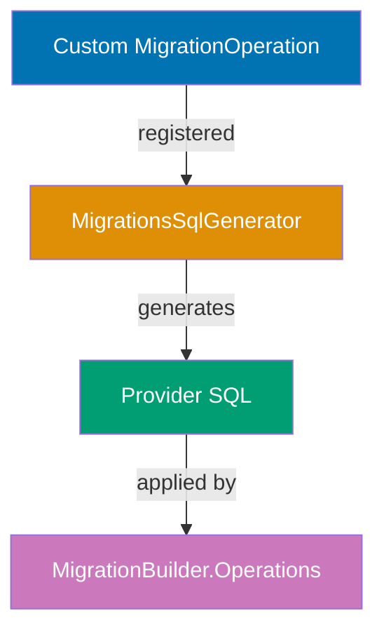
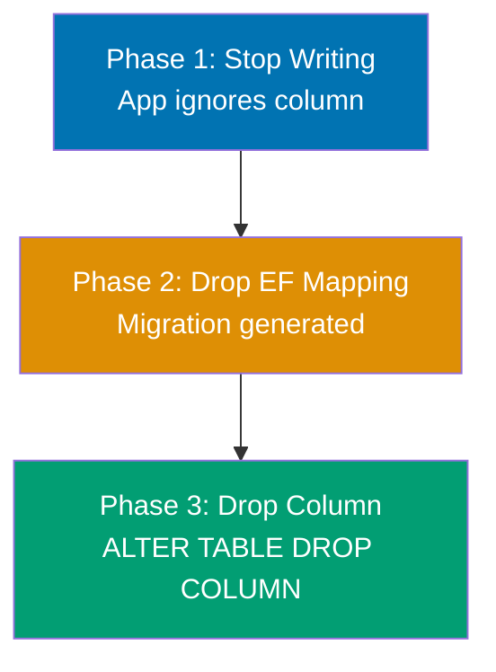
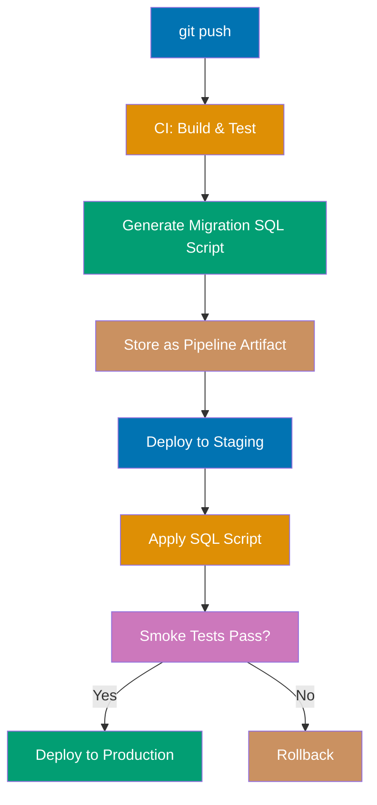
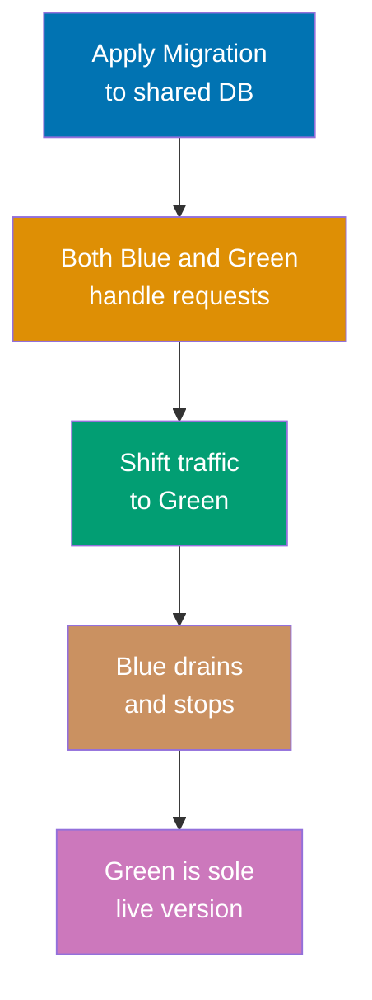

## Advanced Examples (61-85)

**Coverage**: 75-95% of EF Core Migrations functionality

**Focus**: Custom migration operations, zero-downtime strategies, CI/CD integration, multi-tenant schemas, performance optimizations, and production monitoring.

These examples assume you understand beginner and intermediate concepts. Each example is self-contained and targets real production concerns that arise when running EF Core at scale.

---

### Example 61: Custom Migration Operations

A `MigrationOperation` subclass lets you model a database action as a typed object, keeping migration code expressive and reusable. The companion `IMigrationsSqlGenerator` extension translates the operation into provider-specific SQL at generation time.



```csharp
using Microsoft.EntityFrameworkCore.Migrations;
using Microsoft.EntityFrameworkCore.Migrations.Operations;
// => EF Core migration extension namespaces

// Step 1: Define a typed operation object
public class CreateSequenceOperation : MigrationOperation
{
    // => Inherits from MigrationOperation; EF treats this as a first-class DDL step
    public string SequenceName { get; set; } = "";
    // => Name of the database sequence to create
    public long StartValue { get; set; } = 1;
    // => Initial value; SEQUENCE starts here on first NEXTVAL call
    public long IncrementBy { get; set; } = 1;
    // => Increment step; set > 1 to pre-allocate ranges and reduce round-trips
}

// Step 2: Extend MigrationsSqlGenerator to handle the operation
public class ExtendedNpgsqlMigrationsSqlGenerator
    : Npgsql.EntityFrameworkCore.PostgreSQL.Migrations.NpgsqlMigrationsSqlGenerator
{
    public ExtendedNpgsqlMigrationsSqlGenerator(
        MigrationsSqlGeneratorDependencies dependencies,
        Npgsql.EntityFrameworkCore.PostgreSQL.Infrastructure.Internal.INpgsqlSingletonOptions opts)
        : base(dependencies, opts) { }
    // => Delegates to base ctor; required boilerplate for DI

    protected override void Generate(
        MigrationOperation operation,
        IModel? model,
        MigrationCommandListBuilder builder)
    {
        // => Called for every operation in the migration; dispatch on type
        if (operation is CreateSequenceOperation op)
        {
            builder
                .Append($"CREATE SEQUENCE {op.SequenceName}")
                // => Emits DDL verb; Append does NOT add semicolon
                .Append($" START WITH {op.StartValue}")
                // => Sets first value returned by NEXTVAL
                .Append($" INCREMENT BY {op.IncrementBy}")
                // => Sets stride; IncrementBy=50 means app fetches 50 IDs per round-trip
                .AppendLine(";");
                // => AppendLine adds newline; semicolon terminates PostgreSQL statement
            builder.EndCommand();
            // => Signals end of one SQL command; required for multi-statement migrations
        }
        else
        {
            base.Generate(operation, model, builder);
            // => Fall through to default handling for all standard operations
        }
    }
}

// Step 3: Register the extended generator in DI
// In Program.cs or DbContext setup:
// services.AddDbContext<AppDbContext>(options =>
//     options.UseNpgsql(connectionString)
//            .ReplaceService<IMigrationsSqlGenerator,
//                           ExtendedNpgsqlMigrationsSqlGenerator>());
// => ReplaceService swaps the default generator for the custom one
// => All existing migration operations continue to work via base.Generate()

// Step 4: Use the custom operation in a migration
public partial class AddOrderSequence : Migration
{
    protected override void Up(MigrationBuilder migrationBuilder)
    {
        migrationBuilder.Operations.Add(new CreateSequenceOperation
        {
            SequenceName = "order_number_seq",
            // => Database sequence name; referenced by DEFAULT nextval('order_number_seq')
            StartValue = 100000,
            // => First order number is 100000; avoids confusion with test data
            IncrementBy = 1
            // => Single-increment; adjust to 50+ for high-throughput ordering systems
        });
    }

    protected override void Down(MigrationBuilder migrationBuilder)
    {
        migrationBuilder.Sql("DROP SEQUENCE IF EXISTS order_number_seq;");
        // => Rollback removes the sequence; IF EXISTS prevents error on clean databases
    }
}
```

**Key Takeaway**: Implement `MigrationOperation` + `IMigrationsSqlGenerator` when you need repeatable, typed DDL that EF Core's fluent API does not express; this keeps migrations readable and the SQL generation testable.

**Why It Matters**: Production databases often require database-specific features—sequences, custom types, materialized views—that EF Core's cross-provider abstraction cannot generate. Custom operations make these repeatable and reviewable in version control rather than hidden in raw SQL strings. The generator extension is provider-specific, so you retain full SQL control while keeping the migration's intent clear in C# code. Teams using this pattern catch regressions in SQL generation via unit tests on the generator class.

---

### Example 62: IDesignTimeDbContextFactory Deep Dive

`IDesignTimeDbContextFactory<T>` tells the `dotnet ef` CLI how to construct your `DbContext` without running the application. This is critical when your context depends on runtime configuration (environment variables, secrets, or custom DI wiring) that is unavailable at design time.

```csharp
using Microsoft.EntityFrameworkCore;
using Microsoft.EntityFrameworkCore.Design;
using Microsoft.Extensions.Configuration;
// => Design-time factory requires both EF Core and Configuration namespaces

public class AppDbContext(DbContextOptions<AppDbContext> options) : DbContext(options)
{
    public DbSet<OrderModel> Orders => Set<OrderModel>();
    // => Standard DbSet; no change needed to support design-time factory
}

public class OrderModel
{
    public int Id { get; set; }          // => PK; EF infers auto-increment from int Id convention
    public string Reference { get; set; } = "";  // => Order reference number; non-nullable
    public decimal Total { get; set; }   // => Order total; decimal maps to NUMERIC in PostgreSQL
}

// Design-time factory: discovered automatically by dotnet ef tools
public class AppDbContextFactory : IDesignTimeDbContextFactory<AppDbContext>
{
    public AppDbContext CreateDbContext(string[] args)
    {
        // => args is populated from -- arguments after `dotnet ef migrations add -- arg1 arg2`
        // => CLI calls this method; no ASP.NET pipeline exists at this point

        var configuration = new ConfigurationBuilder()
            .SetBasePath(Directory.GetCurrentDirectory())
            // => Resolves relative paths from the project root where dotnet ef runs
            .AddJsonFile("appsettings.json", optional: false)
            // => Loads base configuration; optional: false throws if file missing
            .AddJsonFile("appsettings.Development.json", optional: true)
            // => Overrides for local development; optional: true silently skips if absent
            .AddEnvironmentVariables()
            // => Allows CI/CD to inject connection string without modifying files
            .Build();
            // => IConfiguration instance ready for use

        var connectionString = configuration.GetConnectionString("DefaultConnection")
            ?? throw new InvalidOperationException(
                "Connection string 'DefaultConnection' not found.");
        // => Fail fast with clear error; missing connection string produces opaque EF errors otherwise

        var optionsBuilder = new DbContextOptionsBuilder<AppDbContext>();
        optionsBuilder.UseNpgsql(connectionString,
            npgsqlOptions => npgsqlOptions
                .MigrationsAssembly("MyApp.Infrastructure")
                // => Required when migrations live in a different assembly than DbContext
                .CommandTimeout(300));
                // => 5-minute timeout for slow DDL on large tables during design-time operations
        // => optionsBuilder.Options is the fully configured DbContextOptions<AppDbContext>

        return new AppDbContext(optionsBuilder.Options);
        // => Returns fully configured context; CLI uses this to scaffold migrations and apply updates
    }
}

// Usage from CLI:
// dotnet ef migrations add AddOrdersTable --project MyApp.Infrastructure --startup-project MyApp.Api
// => CLI finds AppDbContextFactory via reflection; no startup code runs
// => Migration generated using the factory-provided DbContext
```

**Key Takeaway**: Implement `IDesignTimeDbContextFactory<T>` whenever your `DbContext` requires configuration that only exists at runtime; it gives the CLI a deterministic, environment-aware path to your context independent of the application host.

**Why It Matters**: Without a design-time factory, the CLI tries to instantiate your context by running the application's `Program.cs` or falling back to a parameterless constructor—both fail when secrets come from Vault, AWS Parameter Store, or Docker secrets. Teams that skip this pattern spend time debugging cryptic "unable to create DbContext" messages. The factory also enables setting the migrations assembly explicitly, which is required in clean-architecture setups where the data layer is a separate class library.

---

### Example 63: Zero-Downtime Column Addition

Adding a nullable column with a default value is inherently backward-compatible: existing application code ignores the column, new code can read and write it, and the migration completes instantly without a table lock on most databases.


```csharp
using Microsoft.EntityFrameworkCore.Migrations;
// => MigrationBuilder for schema operations

public partial class AddArchivedAtToOrders : Migration
{
    protected override void Up(MigrationBuilder migrationBuilder)
    {
        migrationBuilder.AddColumn<DateTime>(
            name: "ArchivedAt",
            // => Column name in the database; EF uses PascalCase → snake_case if UseSnakeCaseNamingConvention enabled
            table: "Orders",
            // => Target table; must already exist
            nullable: true,
            // => NULL-able column: no existing row update needed; ADD COLUMN is O(1) metadata-only on PostgreSQL
            defaultValue: null);
            // => No DEFAULT value in DDL; existing rows get NULL; safe for backward compatibility
        // => SQL: ALTER TABLE "Orders" ADD COLUMN "ArchivedAt" timestamp NULL;
        // => PostgreSQL: ADD COLUMN with nullable=true acquires only ShareUpdateExclusiveLock (non-blocking)
        // => SQL Server: ADD COLUMN nullable completes without rebuilding the table
    }

    protected override void Down(MigrationBuilder migrationBuilder)
    {
        migrationBuilder.DropColumn(
            name: "ArchivedAt",
            table: "Orders");
        // => SQL: ALTER TABLE "Orders" DROP COLUMN "ArchivedAt";
        // => Rollback; note that DropColumn on PostgreSQL is safe but irreversible (data lost)
    }
}
```

**Key Takeaway**: Add columns as nullable (no DEFAULT) to guarantee a metadata-only `ALTER TABLE` on PostgreSQL and a non-blocking operation on SQL Server; deploy the migration before the application code that uses the column.

**Why It Matters**: Non-nullable columns with a server-computed DEFAULT force the database to rewrite every existing row during the migration, which can lock a busy table for minutes on large datasets. The zero-downtime pattern separates schema change from data change: add the column, deploy new code that populates it, then optionally add a NOT NULL constraint after backfill. This sequence keeps the application available throughout.

---

### Example 64: Zero-Downtime Column Removal (3-Phase)

Removing a column safely requires three sequential deployments: stop writing to it, drop the EF mapping, then drop the column. Skipping phases causes either application errors (accessing a dropped column) or schema drift (column exists in DB but not in model).



```csharp
// ---- PHASE 1 MIGRATION: Mark column as ignored in EF model ----
// In OnModelCreating, stop SELECT/INSERT from including the column:
// entity.Ignore(e => e.LegacyNotes);
// => EF removes LegacyNotes from all generated SQL; column still exists in DB
// => Old app instances writing LegacyNotes continue working; new instances stop

// ---- PHASE 2 MIGRATION: Drop EF property, generate migration ----
// After all instances are on Phase 1 code, remove the property from the entity:
// public string LegacyNotes { get; set; } = ""; ← DELETE THIS
// Run: dotnet ef migrations add DropLegacyNotesMapping
// Migration generated is empty (EF already ignored the column); safe no-op deployment

// ---- PHASE 3 MIGRATION: Drop the actual column ----
using Microsoft.EntityFrameworkCore.Migrations;

public partial class DropLegacyNotesColumn : Migration
{
    protected override void Up(MigrationBuilder migrationBuilder)
    {
        migrationBuilder.DropColumn(
            name: "LegacyNotes",
            table: "Orders");
        // => SQL: ALTER TABLE "Orders" DROP COLUMN "LegacyNotes";
        // => Safe because no running application instance reads or writes this column now
        // => PostgreSQL acquires AccessExclusiveLock but for very short duration (metadata change)
    }

    protected override void Down(MigrationBuilder migrationBuilder)
    {
        // => Rollback re-adds the column, but existing data is permanently lost
        migrationBuilder.AddColumn<string>(
            name: "LegacyNotes",
            table: "Orders",
            nullable: true,
            maxLength: 1000);
        // => Column is re-created empty; cannot restore dropped data from this migration alone
    }
}
```

**Key Takeaway**: Remove columns in three phases—ignore in EF model, deploy, then drop via migration—so no running application version ever reads a column that no longer exists in the database.

**Why It Matters**: Deploying a migration that drops a column while old application instances are still running causes immediate `column does not exist` errors on every SELECT that references it. The three-phase approach makes each individual deployment safe and independently rollback-able. This is especially important in blue-green and canary deployments where old and new code run simultaneously for minutes or hours.

---

### Example 65: Zero-Downtime Table Rename

Renaming a table is one of the most disruptive DDL operations because every query referencing the old name fails immediately. The safe pattern uses a view to maintain backward compatibility during transition.

```csharp
using Microsoft.EntityFrameworkCore.Migrations;

public partial class RenameOrdersToSalesOrders : Migration
{
    protected override void Up(MigrationBuilder migrationBuilder)
    {
        // Step 1: Rename the underlying table
        migrationBuilder.RenameTable(
            name: "Orders",
            newName: "SalesOrders");
        // => SQL: ALTER TABLE "Orders" RENAME TO "SalesOrders";
        // => Atomic metadata operation; existing indexes and constraints follow the table

        // Step 2: Create a compatibility view so old queries still work
        migrationBuilder.Sql(@"
            CREATE VIEW ""Orders"" AS
            SELECT * FROM ""SalesOrders"";
        ");
        // => Old application code querying ""Orders"" now reads from the view
        // => SELECT statements work transparently; INSERT/UPDATE/DELETE require updatable view or triggers
        // => PostgreSQL: simple single-table SELECT views are automatically updatable
    }

    protected override void Down(MigrationBuilder migrationBuilder)
    {
        migrationBuilder.Sql(@"DROP VIEW IF EXISTS ""Orders"";");
        // => Remove compatibility view before reversing rename

        migrationBuilder.RenameTable(
            name: "SalesOrders",
            newName: "Orders");
        // => Restore original name; all indexes travel with the table automatically
    }
}

// After all application code is updated to use "SalesOrders":
// Create a follow-up migration to drop the view:
// migrationBuilder.Sql(@"DROP VIEW IF EXISTS ""Orders"";");
// => Clean up compatibility shim once all consumers reference the new name
```

**Key Takeaway**: Rename tables by first creating a compatibility view under the old name, then removing the view only after all application code has been updated and deployed.

**Why It Matters**: Table renames affect every stored procedure, view, ORM mapping, and ad-hoc query in the system. Failing to provide a compatibility layer causes cascading failures across every service that queries the old name. The view-based approach gives teams a controlled migration window where old and new names coexist, making the rename reversible without downtime and independently deployable from the application update.

---

### Example 66: Large Table Migration with Batched Updates

Updating millions of rows in a single transaction holds locks for the duration, blocking reads and writes. Batched updates process rows in small chunks, releasing locks between batches and allowing normal traffic.

```csharp
using Microsoft.EntityFrameworkCore.Migrations;

public partial class BackfillOrderRegion : Migration
{
    protected override void Up(MigrationBuilder migrationBuilder)
    {
        // Step 1: Add the new column without a default (zero-downtime)
        migrationBuilder.AddColumn<string>(
            name: "Region",
            table: "Orders",
            nullable: true,
            maxLength: 50);
        // => ALTER TABLE adds column instantly; existing rows get NULL

        // Step 2: Backfill in batches to avoid long-running locks
        migrationBuilder.Sql(@"
            DO $$
            DECLARE
                batch_size INT := 1000;
                -- => Process 1000 rows per iteration; tune based on row size and lock tolerance
                offset_val INT := 0;
                -- => Starting offset; increments by batch_size each iteration
                rows_updated INT;
                -- => Count of rows affected in this batch
            BEGIN
                LOOP
                    UPDATE ""Orders""
                    SET ""Region"" = CASE
                        WHEN ""CountryCode"" IN ('US', 'CA', 'MX') THEN 'AMER'
                        WHEN ""CountryCode"" IN ('DE', 'FR', 'GB') THEN 'EMEA'
                        ELSE 'APAC'
                    END
                    WHERE ""Id"" IN (
                        SELECT ""Id"" FROM ""Orders""
                        WHERE ""Region"" IS NULL
                        -- => Target only un-backfilled rows; idempotent if migration reruns
                        ORDER BY ""Id""
                        LIMIT batch_size
                    );
                    -- => UPDATE affects at most batch_size rows; lock held only during this statement

                    GET DIAGNOSTICS rows_updated = ROW_COUNT;
                    -- => Capture affected row count for loop termination

                    EXIT WHEN rows_updated = 0;
                    -- => No more NULL rows; exit loop

                    PERFORM pg_sleep(0.05);
                    -- => 50ms pause between batches; reduces I/O pressure on primary
                END LOOP;
            END $$;
        ");
        // => Full backfill completes without holding a table-wide lock
        // => Each batch is its own transaction; partial progress is preserved on failure
    }

    protected override void Down(MigrationBuilder migrationBuilder)
    {
        migrationBuilder.DropColumn(name: "Region", table: "Orders");
        // => Rollback drops the column; backfilled data is lost
    }
}
```

**Key Takeaway**: Backfill large tables using a batched loop in a `DO $$` block with a short sleep between batches to release locks and reduce I/O pressure.

**Why It Matters**: A single `UPDATE orders SET region = ...` on a 50-million-row table can run for 20+ minutes while holding an exclusive lock, causing application timeouts and connection exhaustion. The batched approach keeps each transaction short (milliseconds), allows reads and writes to interleave between batches, and lets the migration be safely interrupted and resumed—since only NULL rows are processed each time.

---

### Example 67: Online Index Creation (CONCURRENTLY)

PostgreSQL's `CREATE INDEX CONCURRENTLY` builds an index without blocking reads or writes. EF Core's `CreateIndex` always uses the blocking form; use `migrationBuilder.Sql` to issue the non-blocking variant.

```csharp
using Microsoft.EntityFrameworkCore.Migrations;

public partial class AddOrdersCustomerIdIndexConcurrently : Migration
{
    protected override void Up(MigrationBuilder migrationBuilder)
    {
        // Do NOT use: migrationBuilder.CreateIndex(...)
        // => Standard CreateIndex issues: CREATE INDEX ON "Orders" ("CustomerId")
        // => This acquires ShareLock, blocking all writes for the index build duration

        // Use raw SQL for CONCURRENTLY variant:
        migrationBuilder.Sql(
            @"CREATE INDEX CONCURRENTLY IF NOT EXISTS
              ""IX_Orders_CustomerId""
              ON ""Orders"" (""CustomerId"");",
            suppressTransaction: true);
        // => suppressTransaction: true is REQUIRED; CONCURRENTLY cannot run inside a transaction
        // => IF NOT EXISTS makes the operation idempotent; safe to re-run on retry
        // => Index build runs in background; table remains fully accessible during build
        // => PostgreSQL performs two table scans and waits for existing transactions to complete
        // => Index becomes valid only after both scans succeed; check pg_indexes.indexdef to confirm
    }

    protected override void Down(MigrationBuilder migrationBuilder)
    {
        migrationBuilder.Sql(
            @"DROP INDEX CONCURRENTLY IF EXISTS ""IX_Orders_CustomerId"";",
            suppressTransaction: true);
        // => DROP CONCURRENTLY also requires suppressTransaction: true
        // => Drops the index without blocking reads or writes during removal
    }
}
```

**Key Takeaway**: Use `migrationBuilder.Sql("CREATE INDEX CONCURRENTLY ...", suppressTransaction: true)` for online index creation on production tables; EF Core's built-in `CreateIndex` blocks all writes for the duration.

**Why It Matters**: Adding an index to a large, active table with the standard `CREATE INDEX` can block writes for minutes, causing transaction queues to pile up and application timeouts to spike. `CONCURRENTLY` extends the build time (it takes roughly 2-3x longer) but keeps the table writable throughout. The `suppressTransaction: true` flag is non-negotiable—omitting it causes PostgreSQL to reject the statement with "CREATE INDEX CONCURRENTLY cannot run inside a transaction block."

---

### Example 68: Data Backfill Pattern

Separating structural migration from data migration into two migrations gives you a safe rollback boundary: you can always roll back the data migration independently without undoing the schema change.

```csharp
using Microsoft.EntityFrameworkCore.Migrations;

// MIGRATION 1: Add column (structural change)
public partial class AddOrderPriorityColumn : Migration
{
    protected override void Up(MigrationBuilder migrationBuilder)
    {
        migrationBuilder.AddColumn<int>(
            name: "Priority",
            table: "Orders",
            nullable: true,
            defaultValue: null);
        // => Structural change only; no data written yet
        // => Existing rows have Priority = NULL; new orders written by old app code also get NULL
    }

    protected override void Down(MigrationBuilder migrationBuilder)
    {
        migrationBuilder.DropColumn(name: "Priority", table: "Orders");
        // => Rollback of structural change is clean; no data lost that matters
    }
}

// MIGRATION 2: Backfill data (data change, separate migration)
public partial class BackfillOrderPriority : Migration
{
    protected override void Up(MigrationBuilder migrationBuilder)
    {
        migrationBuilder.Sql(@"
            UPDATE ""Orders""
            SET ""Priority"" = CASE
                WHEN ""Total"" >= 10000 THEN 1
                -- => High-value orders: Priority 1
                WHEN ""Total"" >= 1000  THEN 2
                -- => Mid-value orders: Priority 2
                ELSE 3
                -- => Standard orders: Priority 3
            END
            WHERE ""Priority"" IS NULL;
            -- => WHERE clause ensures idempotency; re-running migration is safe
        ");
        // => Backfill runs in one transaction; for large tables replace with batched loop (see Ex. 66)
    }

    protected override void Down(MigrationBuilder migrationBuilder)
    {
        // => Rollback clears the backfilled data; structural column remains (Migration 1 handles that)
        migrationBuilder.Sql(@"UPDATE ""Orders"" SET ""Priority"" = NULL;");
        // => Resets all Priority values; useful during staged rollout testing
    }
}
```

**Key Takeaway**: Separate schema migrations (ADD COLUMN) from data migrations (UPDATE) into distinct migration files so each step can be rolled back independently.

**Why It Matters**: Combining schema and data changes in a single migration means a failed data backfill requires rolling back the schema change too—often more disruptive than the original failure. Two-migration patterns give operators fine-grained control: apply the column, verify it, then apply the backfill separately. If the backfill takes too long or produces incorrect data, roll back only the data migration while the schema change stays in place.

---

### Example 69: EF Core Migrations in CI/CD Pipeline

CI/CD pipelines should validate migrations at build time and apply them in a controlled manner during deployment. The key tool is `dotnet ef migrations script` which generates idempotent SQL that can be reviewed, stored as an artifact, and applied by your deployment tool.



```bash
# CI step 1: Generate idempotent migration script
dotnet ef migrations script \
  --idempotent \
  --output ./artifacts/migration.sql \
  --project MyApp.Infrastructure \
  --startup-project MyApp.Api
# => --idempotent wraps each migration in IF NOT EXISTS checks
# => Script can be applied multiple times safely; useful for multi-instance deployments
# => Output file is stored as a pipeline artifact for audit and manual review

# CI step 2: Validate the script is non-empty (detects missing migration for model changes)
if [ ! -s ./artifacts/migration.sql ]; then
  echo "ERROR: Migration script is empty. Did you forget to add a migration?"
  exit 1
fi
# => Fails the build if someone changed a DbContext without running dotnet ef migrations add

# CD step: Apply migration to target database
# Option A: Apply via dotnet ef (requires EF tools in deployment image)
dotnet ef database update \
  --project MyApp.Infrastructure \
  --startup-project MyApp.Api \
  --connection "$DATABASE_URL"
# => Applies pending migrations; skips already-applied ones using __EFMigrationsHistory table

# Option B: Apply the pre-generated SQL script (preferred for production; no EF tooling needed)
psql "$DATABASE_URL" -f ./artifacts/migration.sql
# => Applies idempotent SQL directly; no dotnet CLI required in production image
# => SQL script is auditable and can be reviewed by DBAs before deployment
```

```csharp
// Option C: Apply migrations at application startup (simpler but less controlled)
// In Program.cs:
using var scope = app.Services.CreateScope();
var db = scope.ServiceProvider.GetRequiredService<AppDbContext>();
await db.Database.MigrateAsync();
// => Applies pending migrations on startup; suitable for development and simple deployments
// => Risk: multiple instances can race on startup; use distributed lock or leader election for safety
// => Production recommendation: prefer the SQL script approach for explicit control
```

**Key Takeaway**: Generate idempotent migration SQL in CI, store it as an artifact, and apply it as a separate deployment step using `psql` or your database management tool—avoiding EF tooling in production images.

**Why It Matters**: Running `dotnet ef database update` in production requires the EF design-time tools and your DbContext assembly in the deployment environment, increasing image size and attack surface. Generating SQL at build time lets DBAs review changes, enables pre-flight checks, and produces an immutable artifact tied to the specific build. The idempotent flag ensures the same script can be applied to staging and production without modification.

---

### Example 70: Migration Rollback Testing with xUnit

Migration rollback is rarely tested until a production emergency. Writing xUnit tests that apply `Up()`, verify schema, roll back with `Down()`, and verify cleanup catches migration errors before deployment.

```csharp
using Microsoft.EntityFrameworkCore;
using Microsoft.EntityFrameworkCore.Infrastructure;
using Microsoft.EntityFrameworkCore.Migrations;
using Xunit;
// => xUnit test framework; no MSTest or NUnit; Xunit.Assert for fluent assertions

public class MigrationRollbackTests : IAsyncLifetime
{
    private AppDbContext _context = null!;
    // => null! suppresses nullable warning; initialized in InitializeAsync

    public async Task InitializeAsync()
    {
        var options = new DbContextOptionsBuilder<AppDbContext>()
            .UseNpgsql("Host=localhost;Database=ef_rollback_test;Username=test;Password=test")
            // => Use a dedicated test database; never the development or production connection string
            .Options;
        _context = new AppDbContext(options);
        await _context.Database.EnsureDeletedAsync();
        // => Drop entire test database before each test; guarantees clean state
        await _context.Database.MigrateAsync();
        // => Apply all migrations up to current; establishes baseline schema
    }

    public async Task DisposeAsync()
    {
        await _context.Database.EnsureDeletedAsync();
        // => Clean up after test; removes test database so it does not accumulate
        await _context.DisposeAsync();
    }

    [Fact]
    public async Task AddArchivedAt_UpAndDown_SchemaIsConsistent()
    {
        var migrator = _context.GetService<IMigrator>();
        // => IMigrator is the EF Core service that applies/reverts individual migrations

        // Apply the specific migration under test
        await migrator.MigrateAsync("AddArchivedAtToOrders");
        // => Migrates forward to exactly this migration; subsequent migrations are not applied

        // Verify column exists after Up()
        var columnExistsAfterUp = await ColumnExistsAsync("Orders", "ArchivedAt");
        // => Query information_schema to confirm DDL was applied
        Assert.True(columnExistsAfterUp, "ArchivedAt column should exist after Up()");
        // => Fails immediately if migration did not create the column

        // Roll back the specific migration
        await migrator.MigrateAsync("AddOrdersTable");
        // => Migrates back to "AddOrdersTable"; runs Down() of "AddArchivedAtToOrders"

        // Verify column is gone after Down()
        var columnExistsAfterDown = await ColumnExistsAsync("Orders", "ArchivedAt");
        Assert.False(columnExistsAfterDown, "ArchivedAt column should not exist after Down()");
        // => Confirms Down() correctly reverses the schema change
    }

    private async Task<bool> ColumnExistsAsync(string table, string column)
    {
        var sql = $"""
            SELECT COUNT(*) FROM information_schema.columns
            WHERE table_name = '{table.ToLower()}'
              AND column_name = '{column.ToLower()}';
            """;
        // => information_schema is ANSI SQL standard; works on PostgreSQL, SQL Server, MySQL
        var result = await _context.Database
            .SqlQueryRaw<long>(sql)
            .FirstOrDefaultAsync();
        return result > 0;
        // => Returns true if at least one matching column row exists
    }
}
```

**Key Takeaway**: Test each migration's `Down()` method with a real database using `IMigrator.MigrateAsync(targetMigration)` to verify that rollback correctly undoes schema changes.

**Why It Matters**: `Down()` methods are notoriously under-tested because rollback rarely occurs in development workflows. When a production deployment fails and a rollback is needed, untested `Down()` methods frequently cause secondary failures (e.g., trying to drop a column that was already removed, or missing CASCADE drops). Integration tests with a real PostgreSQL instance catch these before deployment and give operators confidence that rollback is a viable recovery option.

---

### Example 71: Blue-Green Deployment Migrations

Blue-green deployments require that migrations applied for the green (new) version remain backward-compatible with the blue (old) version running in parallel during traffic cutover.



```csharp
// Rules for blue-green compatible migrations:
// 1. New columns MUST be nullable (old blue code does not set them)
// 2. No column renames or drops in the same deployment
// 3. No new NOT NULL constraints without a default

// COMPATIBLE: Add nullable column (blue ignores it, green uses it)
public partial class AddOrderTagsBlueGreenSafe : Migration
{
    protected override void Up(MigrationBuilder migrationBuilder)
    {
        migrationBuilder.AddColumn<string>(
            name: "Tags",
            table: "Orders",
            nullable: true,
            maxLength: 500);
        // => Blue version: ignores Tags (EF model does not include it)
        // => Green version: reads and writes Tags
        // => No conflict; both versions share the same database schema simultaneously
    }

    protected override void Down(MigrationBuilder migrationBuilder)
    {
        migrationBuilder.DropColumn(name: "Tags", table: "Orders");
    }
}

// INCOMPATIBLE example (avoid during blue-green):
// migrationBuilder.AlterColumn<string>(name: "Status", table: "Orders",
//     nullable: false, defaultValue: "Pending");
// => Blue writes Status=NULL (old model); DB rejects with NOT NULL violation
// => This breaks blue instances immediately; requires single-version deployment

// Application-level guard in green code:
// var tags = order.Tags ?? ""; // => Defensive null check; works even if DB row has NULL Tags
// => Green code must handle NULL for any newly added nullable column
// => Assumes blue wrote NULL; green fills in on next save
```

**Key Takeaway**: Blue-green migrations must be additive and nullable-only; never rename, drop, or add NOT NULL constraints in a migration that is applied while two application versions share one database.

**Why It Matters**: Blue-green deployments eliminate downtime by running old and new code simultaneously, but this requires the shared database schema to satisfy both versions' assumptions. A single NOT NULL constraint violation from the old code reading the new schema can cascade into connection pool exhaustion and a failed deployment. Teams that adopt explicit migration compatibility rules catch incompatible changes in code review before they reach the deployment pipeline.

---

### Example 72: Feature Flag Migration Pattern

Feature flags decouple schema deployment from feature activation. The migration runs ahead of time; the flag controls whether application code uses the new schema.

```csharp
using Microsoft.EntityFrameworkCore;
using Microsoft.EntityFrameworkCore.Migrations;
// => Standard EF Core namespaces

// The migration: adds the column unconditionally
public partial class AddLoyaltyPointsColumn : Migration
{
    protected override void Up(MigrationBuilder migrationBuilder)
    {
        migrationBuilder.AddColumn<int>(
            name: "LoyaltyPoints",
            table: "Customers",
            nullable: true,
            defaultValue: 0);
        // => Column is present in DB; application does not use it until flag is enabled
        // => defaultValue: 0 means new rows get 0 points; old rows are backfilled lazily
    }

    protected override void Down(MigrationBuilder migrationBuilder)
    {
        migrationBuilder.DropColumn(name: "LoyaltyPoints", table: "Customers");
    }
}

// Application service: reads flag before using the column
public class CustomerService(AppDbContext db, IFeatureFlagService flags)
{
    public async Task<int> GetLoyaltyPointsAsync(int customerId)
    {
        if (!await flags.IsEnabledAsync("loyalty-program"))
        {
            // => Feature not yet active; return zero without touching the new column
            return 0;
        }

        var customer = await db.Customers
            .Where(c => c.Id == customerId)
            .Select(c => c.LoyaltyPoints)
            // => Column exists in DB; safe to select regardless of flag
            .FirstOrDefaultAsync();
        return customer ?? 0;
        // => Null-coalesce handles rows written before the backfill completes
    }

    public async Task AwardPointsAsync(int customerId, int points)
    {
        if (!await flags.IsEnabledAsync("loyalty-program"))
            return;
        // => Guard: no writes while flag is off; column stays at 0 for inactive customers

        await db.Customers
            .Where(c => c.Id == customerId)
            .ExecuteUpdateAsync(s =>
                s.SetProperty(c => c.LoyaltyPoints, c => (c.LoyaltyPoints ?? 0) + points));
        // => ExecuteUpdateAsync issues: UPDATE customers SET loyalty_points = loyalty_points + @p
        // => No entity tracking; efficient for single-column updates
    }
}
```

**Key Takeaway**: Deploy migrations ahead of feature activation and use a feature flag to gate application code access, allowing schema rollout to be decoupled from business feature launch timing.

**Why It Matters**: Tying schema changes to feature releases forces migrations and feature launches to happen simultaneously, increasing the blast radius of any failure. Deploying schema changes days before the feature launch verifies migration stability in production without user-visible impact. If the migration causes unexpected performance issues, it can be rolled back before the feature ever goes live.

---

### Example 73: Multi-Tenant Schema Migration

Multi-tenant applications using schema-per-tenant isolation need to apply EF Core migrations to each tenant schema independently. The pattern uses a dynamic connection or schema override per tenant.

```csharp
using Microsoft.EntityFrameworkCore;
using Microsoft.EntityFrameworkCore.Migrations;
// => Standard EF Core and migrations namespaces

// Tenant-aware DbContext: each instance scoped to one tenant schema
public class TenantDbContext(DbContextOptions<TenantDbContext> options, string tenantSchema)
    : DbContext(options)
{
    private readonly string _schema = tenantSchema;
    // => Captures schema name for use in OnModelCreating

    public DbSet<InvoiceModel> Invoices => Set<InvoiceModel>();
    // => Table lives under the tenant schema, e.g., tenant_abc.Invoices

    protected override void OnModelCreating(ModelBuilder modelBuilder)
    {
        modelBuilder.HasDefaultSchema(_schema);
        // => All tables in this context are created under the tenant's schema
        // => SQL: CREATE TABLE tenant_abc."Invoices" (...)
        // => Each tenant has isolated data; shared schema (public) has tenant registry only

        modelBuilder.Entity<InvoiceModel>(entity =>
        {
            entity.HasKey(e => e.Id);
            entity.Property(e => e.Amount).HasColumnType("numeric(18,2)");
            // => NUMERIC(18,2) is exact decimal; required for financial data
        });
    }
}

public class InvoiceModel
{
    public int Id { get; set; }
    public decimal Amount { get; set; }
    public DateTime IssuedAt { get; set; }
}

// Migration runner: applies migrations to all tenant schemas
public class TenantMigrationRunner(IConfiguration config)
{
    public async Task MigrateAllTenantsAsync(IEnumerable<string> tenantSchemas)
    {
        foreach (var schema in tenantSchemas)
        {
            // => Sequential migration; consider parallelism with Parallel.ForEachAsync for many tenants
            await MigrateTenantAsync(schema);
        }
    }

    private async Task MigrateTenantAsync(string schema)
    {
        var connectionString = config.GetConnectionString("MultiTenant")!;
        // => Shared connection string; schema isolation is PostgreSQL schema, not separate DB

        var options = new DbContextOptionsBuilder<TenantDbContext>()
            .UseNpgsql(connectionString, npgsql =>
                npgsql.MigrationsHistoryTable("__EFMigrationsHistory", schema))
                // => Each schema gets its own migrations history table
                // => Prevents cross-schema migration tracking conflicts
            .Options;

        await using var ctx = new TenantDbContext(options, schema);
        // => Context scoped to this tenant's schema

        await ctx.Database.MigrateAsync();
        // => Applies pending migrations for this tenant; reads from schema.__EFMigrationsHistory
        // => New tenants: all migrations applied; existing tenants: only new migrations applied
    }
}
```

**Key Takeaway**: Combine `HasDefaultSchema` with per-schema `MigrationsHistoryTable` so EF Core can independently track and apply migrations for each tenant schema.

**Why It Matters**: Multi-tenant schema isolation prevents data leakage between tenants but complicates schema management: running `dotnet ef database update` on a single context only updates one schema. The runner pattern enables operations teams to migrate all tenants in a single deployment step, with per-tenant tracking ensuring that a failure on one tenant does not block others. New tenant provisioning reuses the same runner to bring a fresh schema to the current migration level.

---

### Example 74: Migration with pgcrypto Encryption

Column-level encryption via PostgreSQL's `pgcrypto` extension protects sensitive data at rest. The migration enables the extension and stores only encrypted ciphertext in the column.

```csharp
using Microsoft.EntityFrameworkCore.Migrations;

public partial class AddEncryptedTaxIdColumn : Migration
{
    protected override void Up(MigrationBuilder migrationBuilder)
    {
        // Step 1: Enable pgcrypto extension (idempotent)
        migrationBuilder.Sql("CREATE EXTENSION IF NOT EXISTS pgcrypto;",
            suppressTransaction: false);
        // => pgcrypto provides pgp_sym_encrypt / pgp_sym_decrypt functions
        // => IF NOT EXISTS: safe to re-run; does nothing if already installed
        // => Must be superuser or pg_extension_owner to run CREATE EXTENSION

        // Step 2: Add encrypted column
        migrationBuilder.AddColumn<string>(
            name: "TaxIdEncrypted",
            table: "Companies",
            nullable: true,
            maxLength: 1000);
        // => TEXT column; encrypted output is base64-encoded and longer than plaintext
        // => maxLength: 1000 accommodates pgcrypto's overhead (~200-300 bytes per PGP packet)

        // Step 3: Backfill from plaintext column using database-side encryption
        migrationBuilder.Sql(@"
            UPDATE ""Companies""
            SET ""TaxIdEncrypted"" = encode(
                pgp_sym_encrypt(""TaxId""::text, current_setting('app.encryption_key')),
                'base64'
            )
            WHERE ""TaxId"" IS NOT NULL;
            -- => pgp_sym_encrypt(plaintext, key) returns bytea; encode(..., 'base64') makes it text-safe
            -- => current_setting('app.encryption_key') reads a PostgreSQL session variable
            -- => Set via: SET app.encryption_key = 'your-key'; before running migration
        ");
        // => After backfill, TaxIdEncrypted holds ciphertext; TaxId (plaintext) can be dropped later
    }

    protected override void Down(MigrationBuilder migrationBuilder)
    {
        migrationBuilder.DropColumn(name: "TaxIdEncrypted", table: "Companies");
        // => Rollback drops encrypted column; plaintext TaxId column remains unchanged
    }
}

// Application-side decryption (never store the key in code):
// var decrypted = await db.Database.SqlQueryRaw<string>(
//     "SELECT pgp_sym_decrypt(decode({0}, 'base64'), {1})::text",
//     encryptedValue, encryptionKey).FirstAsync();
// => Decryption happens in PostgreSQL; plaintext never stored in C# objects beyond the call
```

**Key Takeaway**: Use `pgp_sym_encrypt` from the `pgcrypto` extension for column-level encryption in migrations; store the encryption key in a session variable or Vault, never in the migration SQL.

**Why It Matters**: Database backups, replication streams, and disk snapshots expose plaintext data when columns are unencrypted. Column-level encryption ensures that even with full database read access, an attacker cannot read sensitive fields without the encryption key. The migration pattern handles both enabling the extension and backfilling existing data in a single deployment step while keeping the key outside the SQL file.

---

### Example 75: Audit Trail Table Migration

An audit trail records who changed what and when. The migration creates the audit table and a PostgreSQL trigger that populates it automatically, eliminating the need for application-level audit logic.

```csharp
using Microsoft.EntityFrameworkCore.Migrations;

public partial class AddAuditTrailTable : Migration
{
    protected override void Up(MigrationBuilder migrationBuilder)
    {
        // Step 1: Create audit table
        migrationBuilder.CreateTable(
            name: "AuditLogs",
            columns: table => new
            {
                Id = table.Column<long>(nullable: false)
                    .Annotation("Npgsql:ValueGenerationStrategy",
                        Npgsql.EntityFrameworkCore.PostgreSQL.Metadata.NpgsqlValueGenerationStrategy.IdentityByDefaultColumn),
                // => BIGINT GENERATED BY DEFAULT AS IDENTITY; auto-increment PK
                TableName = table.Column<string>(maxLength: 100, nullable: false),
                // => Which table was changed
                RecordId = table.Column<string>(maxLength: 100, nullable: false),
                // => PK of the changed row (stored as string to support composite keys)
                Operation = table.Column<string>(maxLength: 10, nullable: false),
                // => INSERT, UPDATE, or DELETE
                OldValues = table.Column<string>(nullable: true),
                // => JSON snapshot of row before change (NULL for INSERT)
                NewValues = table.Column<string>(nullable: true),
                // => JSON snapshot of row after change (NULL for DELETE)
                ChangedBy = table.Column<string>(maxLength: 255, nullable: true),
                // => Application user; set via SET LOCAL app.current_user = '...'
                ChangedAt = table.Column<DateTime>(nullable: false,
                    defaultValueSql: "NOW()")
                // => Timestamp of change; database clock prevents clock skew
            },
            constraints: table => table.PrimaryKey("PK_AuditLogs", x => x.Id));

        // Step 2: Create trigger function that writes to AuditLogs
        migrationBuilder.Sql(@"
            CREATE OR REPLACE FUNCTION audit_trigger_func()
            RETURNS TRIGGER AS $$
            BEGIN
                INSERT INTO ""AuditLogs""
                    (""TableName"", ""RecordId"", ""Operation"", ""OldValues"", ""NewValues"", ""ChangedBy"")
                VALUES (
                    TG_TABLE_NAME,
                    -- => TG_TABLE_NAME: name of the table that fired the trigger
                    COALESCE(NEW.""Id""::text, OLD.""Id""::text),
                    -- => Use NEW for INSERT/UPDATE, OLD for DELETE
                    TG_OP,
                    -- => TG_OP: 'INSERT', 'UPDATE', or 'DELETE'
                    CASE WHEN TG_OP = 'INSERT' THEN NULL
                         ELSE row_to_json(OLD)::text END,
                    -- => row_to_json serializes the full OLD row as JSON text
                    CASE WHEN TG_OP = 'DELETE' THEN NULL
                         ELSE row_to_json(NEW)::text END,
                    current_setting('app.current_user', true)
                    -- => current_setting with missing_ok=true; returns NULL if not set
                );
                RETURN NEW;
            END;
            $$ LANGUAGE plpgsql;
        ");

        // Step 3: Attach trigger to Orders table
        migrationBuilder.Sql(@"
            CREATE TRIGGER orders_audit_trigger
            AFTER INSERT OR UPDATE OR DELETE ON ""Orders""
            FOR EACH ROW EXECUTE FUNCTION audit_trigger_func();
            -- => AFTER trigger: fires after the row change; sees both OLD and NEW
            -- => FOR EACH ROW: fires once per changed row (not once per statement)
        ");
    }

    protected override void Down(MigrationBuilder migrationBuilder)
    {
        migrationBuilder.Sql(@"DROP TRIGGER IF EXISTS orders_audit_trigger ON ""Orders"";");
        // => Remove trigger before dropping function (trigger depends on function)
        migrationBuilder.Sql(@"DROP FUNCTION IF EXISTS audit_trigger_func();");
        // => Remove trigger function
        migrationBuilder.DropTable("AuditLogs");
        // => Remove audit table; all audit history is lost
    }
}
```

**Key Takeaway**: Implement audit trails at the database trigger level so all changes—including direct SQL updates and bulk operations—are captured regardless of application code path.

**Why It Matters**: Application-level audit logging misses changes made via direct database access, bulk import scripts, or other microservices. Database triggers are the only reliable mechanism to capture every modification. The `row_to_json` approach captures the complete row state without maintaining a separate column list, making the trigger schema-independent. Storing the current application user via `SET LOCAL app.current_user` threads user identity through PostgreSQL's session settings without modifying the table schema.

---

### Example 76: Soft Delete Schema Pattern

Soft delete uses an `IsDeleted` flag (or `DeletedAt` timestamp) to mark records as removed without physically deleting them. The migration adds the column and an index optimized for the common "get active records" query.

```csharp
using Microsoft.EntityFrameworkCore;
using Microsoft.EntityFrameworkCore.Migrations;

public partial class AddSoftDeleteToCustomers : Migration
{
    protected override void Up(MigrationBuilder migrationBuilder)
    {
        // Add soft delete timestamp column
        migrationBuilder.AddColumn<DateTime>(
            name: "DeletedAt",
            table: "Customers",
            nullable: true,
            defaultValue: null);
        // => NULL means active; non-NULL means deleted at that timestamp
        // => Stores deletion time for audit purposes vs. boolean IsDeleted

        // Partial index: only index non-deleted rows (common query path)
        migrationBuilder.Sql(@"
            CREATE INDEX ""IX_Customers_Active""
            ON ""Customers"" (""Id"")
            WHERE ""DeletedAt"" IS NULL;
            -- => Partial index on active customers only
            -- => WHERE clause excludes deleted rows; index is smaller and faster for active queries
            -- => Full table scan used for queries filtering on DeletedAt IS NOT NULL (rare)
        ");

        // Unique partial index: unique email among active customers only
        migrationBuilder.Sql(@"
            CREATE UNIQUE INDEX ""IX_Customers_Email_Active""
            ON ""Customers"" (""Email"")
            WHERE ""DeletedAt"" IS NULL;
            -- => Allows the same email on soft-deleted rows (re-registration after account closure)
            -- => Prevents duplicate emails among active customers
            -- => Standard UNIQUE constraint cannot express this; requires raw SQL
        ");
    }

    protected override void Down(MigrationBuilder migrationBuilder)
    {
        migrationBuilder.Sql(@"DROP INDEX IF EXISTS ""IX_Customers_Email_Active"";");
        migrationBuilder.Sql(@"DROP INDEX IF EXISTS ""IX_Customers_Active"";");
        // => Drop partial indexes before dropping the column they reference
        migrationBuilder.DropColumn(name: "DeletedAt", table: "Customers");
    }
}

// EF Core global query filter (in OnModelCreating):
// modelBuilder.Entity<CustomerModel>().HasQueryFilter(c => c.DeletedAt == null);
// => All LINQ queries automatically include WHERE "DeletedAt" IS NULL
// => Use .IgnoreQueryFilters() to query deleted records when needed
```

**Key Takeaway**: Combine a nullable `DeletedAt` column with partial indexes to implement soft delete with zero overhead on active-record queries and optional email uniqueness enforcement among active rows.

**Why It Matters**: Hard deletes make audit trails and account recovery impossible. Soft delete preserves the history but introduces query complexity—every query must filter deleted rows. EF Core's `HasQueryFilter` automates this at the ORM level, while partial indexes ensure the filter uses an index rather than scanning all rows including deleted ones. The unique partial index on email is a common requirement that cannot be expressed with standard EF Core `IsUnique` and requires raw SQL in the migration.

---

### Example 77: Compiled Models for Startup Performance

`dotnet ef dbcontext optimize` generates a compiled model—a pre-built in-memory representation of the EF Core metadata—that eliminates the model-building cost from application startup. This is critical for serverless and containerized environments with frequent cold starts.

```csharp
// Command to generate compiled model:
// dotnet ef dbcontext optimize \
//   --output-dir CompiledModels \
//   --namespace MyApp.CompiledModels \
//   --project MyApp.Infrastructure \
//   --startup-project MyApp.Api
// => Generates C# files in CompiledModels/ directory
// => Files contain pre-computed relational and runtime model data
// => Generated files must be re-generated after ANY model change

// Generated file example (do not edit manually):
// public partial class AppDbContextModel : RuntimeModel
// {
//     private static readonly AppDbContextModel _instance = new();
//     public static IModel Instance => _instance;
//     static AppDbContextModel() { /* compiled model data */ }
// }

// Registration in Program.cs:
using MyApp.CompiledModels;

var builder = WebApplication.CreateBuilder(args);

builder.Services.AddDbContext<AppDbContext>(options =>
{
    options.UseNpgsql(builder.Configuration.GetConnectionString("DefaultConnection"));
    options.UseModel(AppDbContextModel.Instance);
    // => UseModel() injects the pre-compiled model; skips runtime model building
    // => Startup: model-building cost drops from ~200ms to ~5ms on large models
    // => The compiled model is validated against the current database schema at startup
});

// In development: disable compiled model to avoid regenerating after each model change
// if (!builder.Environment.IsDevelopment())
// {
//     options.UseModel(AppDbContextModel.Instance);
// }
// => In development, let EF rebuild the model normally; compiled model in production only

// Benchmark results (representative, varies by model complexity):
// Without compiled model: 180-250ms cold start overhead
// With compiled model:    5-15ms cold start overhead
// => ~20x improvement for large models (100+ entities)
// => Azure Container Apps, AWS Lambda, and Kubernetes scale-to-zero benefit most
```

**Key Takeaway**: Run `dotnet ef dbcontext optimize` and register the compiled model with `UseModel()` to eliminate EF Core's runtime metadata-building cost and reduce cold-start latency significantly.

**Why It Matters**: For every cold start in serverless or containerized deployments, EF Core rebuilds the in-memory model from scratch by reflecting over all entity classes, processing fluent API calls, and building relational metadata. On a moderately complex schema, this adds 200-500ms to every cold start. Compiled models pre-compute this work at build time, making each deployment image more responsive. The trade-off is that compiled models must be regenerated whenever the DbContext or entity classes change—enforce this in CI by checking that the committed compiled model matches a freshly generated one.

---

### Example 78: JSON Columns Deep Dive (ToJson)

EF Core 8's `ToJson()` maps a C# class to a JSON column in the database, enabling structured document storage with full LINQ query support and automatic serialization/deserialization.

```csharp
using Microsoft.EntityFrameworkCore;
using System.Text.Json.Serialization;

// Owned type: maps to JSON column
public class OrderMetadata
{
    public string Source { get; set; } = "";
    // => Order channel: "web", "mobile", "api"; stored as JSON field
    public List<string> Tags { get; set; } = [];
    // => Free-form tags; stored as JSON array
    public Dictionary<string, string> CustomFields { get; set; } = new();
    // => Merchant-specific key-value pairs; stored as JSON object

    [JsonIgnore]
    public bool IsEmpty => string.IsNullOrEmpty(Source) && !Tags.Any();
    // => Computed property; JsonIgnore prevents EF from trying to map it
}

public class OrderModel
{
    public int Id { get; set; }
    public string Reference { get; set; } = "";
    public OrderMetadata Metadata { get; set; } = new();
    // => EF stores Metadata as a single JSON column via ToJson() configuration
}

// DbContext configuration
public class AppDbContext(DbContextOptions<AppDbContext> options) : DbContext(options)
{
    public DbSet<OrderModel> Orders => Set<OrderModel>();

    protected override void OnModelCreating(ModelBuilder modelBuilder)
    {
        modelBuilder.Entity<OrderModel>(entity =>
        {
            entity.HasKey(e => e.Id);

            entity.OwnsOne(e => e.Metadata, metadata =>
            {
                metadata.ToJson();
                // => Maps OrderMetadata to a JSONB column named "Metadata" in PostgreSQL
                // => EF handles serialization and deserialization automatically
                // => Supports LINQ queries against JSON properties (translated to ->> operators)

                metadata.Property(m => m.Source).HasMaxLength(50);
                // => MaxLength is advisory for JSON; not enforced by PostgreSQL JSONB column type
            });
        });
    }
}

// Migration generated by dotnet ef migrations add AddOrdersWithJsonMetadata:
// migrationBuilder.CreateTable(
//     name: "Orders",
//     columns: table => new {
//         Id = table.Column<int>(...),
//         Reference = table.Column<string>(...),
//         Metadata = table.Column<string>(type: "jsonb", nullable: false)
//         // => jsonb type: binary JSON; indexed and queriable; preferred over json (text)
//     }, ...);

// Querying JSON properties via LINQ:
// var webOrders = await db.Orders
//     .Where(o => o.Metadata.Source == "web")
//     // => Translated to: WHERE "Metadata"->>'Source' = 'web'
//     .Where(o => o.Metadata.Tags.Contains("priority"))
//     // => Translated to: WHERE "Metadata"->'Tags' ? 'priority' (JSONB containment)
//     .ToListAsync();
```

**Key Takeaway**: Use `OwnsOne(...).ToJson()` to store complex C# objects as JSONB columns with automatic serialization and LINQ-queryable JSON field access via PostgreSQL's `->>` and `?` operators.

**Why It Matters**: Traditional normalization would require separate tables and joins for flexible metadata or tagging structures. `ToJson` provides a pragmatic middle ground: structured relational tables for queryable core fields, with JSON columns for variable-schema extensions. EF Core translates LINQ predicates against owned JSON properties into efficient JSONB operators, avoiding the need to deserialize and filter in application code. The pattern is ideal for merchant-specific custom fields, event payloads, and any attribute set that varies per record.

---

### Example 79: Temporal Tables Deep Dive

EF Core 6+ supports SQL Server's system-versioned temporal tables, which automatically record the full history of every row change. The migration creates the temporal structure; EF Core generates `AS OF` queries for point-in-time lookups.

```csharp
using Microsoft.EntityFrameworkCore;
using Microsoft.EntityFrameworkCore.Migrations;

public class ProductModel
{
    public int Id { get; set; }
    public string Name { get; set; } = "";
    public decimal Price { get; set; }
    public bool IsAvailable { get; set; }
    // => Temporal tables automatically add PeriodStart and PeriodEnd columns
    // => Do NOT add these manually; EF Core generates them in the migration
}

// DbContext configuration for temporal table
public class AppDbContext(DbContextOptions<AppDbContext> options) : DbContext(options)
{
    public DbSet<ProductModel> Products => Set<ProductModel>();

    protected override void OnModelCreating(ModelBuilder modelBuilder)
    {
        modelBuilder.Entity<ProductModel>(entity =>
        {
            entity.HasKey(e => e.Id);
            entity.Property(e => e.Price).HasColumnType("decimal(18,2)");

            entity.ToTable("Products", t =>
            {
                t.IsTemporal(temporal =>
                {
                    temporal.HasPeriodStart("ValidFrom");
                    // => Column name for row validity start; SQL Server manages this automatically
                    temporal.HasPeriodEnd("ValidTo");
                    // => Column name for row validity end; set to 9999-12-31 for current rows
                    temporal.UseHistoryTable("ProductsHistory");
                    // => Separate history table name; SQL Server maintains it automatically
                    // => History table has identical columns + ValidFrom, ValidTo
                });
            });
        });
    }
}

// Generated migration (SQL Server only; temporal tables are SQL Server-specific):
// migrationBuilder.CreateTable(
//     name: "Products",
//     columns: table => new {
//         Id = ...,
//         Name = ...,
//         Price = ...,
//         IsAvailable = ...,
//         ValidFrom = table.Column<DateTime>(..., rowVersion: false)
//             .Annotation("SqlServer:IsTemporal", true)
//             .Annotation("SqlServer:TemporalPeriodStartColumnName", "ValidFrom"),
//         ValidTo = table.Column<DateTime>(...)
//             .Annotation("SqlServer:IsTemporal", true)
//             .Annotation("SqlServer:TemporalPeriodEndColumnName", "ValidTo")
//     }, ...)
//     .Annotation("SqlServer:IsTemporal", true)
//     .Annotation("SqlServer:TemporalHistoryTableName", "ProductsHistory");

// Querying historical data:
// var priceYesterday = await db.Products
//     .TemporalAsOf(DateTime.UtcNow.AddDays(-1))
//     // => Generates: SELECT * FROM Products FOR SYSTEM_TIME AS OF @p0
//     .Where(p => p.Id == productId)
//     .Select(p => p.Price)
//     .FirstOrDefaultAsync();
// => Returns the product price as it was 24 hours ago
// => No application code needed to maintain history; SQL Server handles it transparently
```

**Key Takeaway**: Configure `IsTemporal()` in `OnModelCreating` to have EF Core generate the full temporal table DDL and history table, then use `TemporalAsOf()` for point-in-time queries.

**Why It Matters**: Manual history tables require triggers, application code, and complex query logic. SQL Server temporal tables offload all history management to the database engine: every INSERT, UPDATE, and DELETE automatically archives the previous row state with precise timestamps. This enables regulatory compliance (data must be auditable for N years), debugging production data issues by querying state at an arbitrary past time, and rollback of accidental data changes without restoring backups.

---

### Example 80: Raw SQL Migrations with EF Core

Some schema changes cannot be expressed through EF Core's `MigrationBuilder` fluent API. `migrationBuilder.Sql()` is the designated escape hatch for database-specific DDL that requires raw SQL.

```csharp
using Microsoft.EntityFrameworkCore.Migrations;

public partial class AddMaterializedViewAndFunction : Migration
{
    protected override void Up(MigrationBuilder migrationBuilder)
    {
        // Example 1: Materialized view (PostgreSQL-specific)
        migrationBuilder.Sql(@"
            CREATE MATERIALIZED VIEW ""OrderSummaryByMonth"" AS
            SELECT
                DATE_TRUNC('month', ""CreatedAt"") AS ""Month"",
                -- => Truncates timestamp to month boundary; groups all days in month together
                COUNT(*) AS ""OrderCount"",
                -- => Total orders in the month
                SUM(""Total"") AS ""TotalRevenue"",
                -- => Aggregate revenue; NULL-safe because SUM ignores NULL values
                AVG(""Total"") AS ""AverageOrderValue""
                -- => Mean order value for the month
            FROM ""Orders""
            WHERE ""DeletedAt"" IS NULL
            -- => Exclude soft-deleted orders from the summary
            GROUP BY DATE_TRUNC('month', ""CreatedAt"")
            ORDER BY ""Month"" DESC;
            -- => Most recent months first; optional but useful for default display order
        ");
        // => Materialized view stores results; refreshed manually or via REFRESH MATERIALIZED VIEW

        // Example 2: Index on materialized view
        migrationBuilder.Sql(@"
            CREATE UNIQUE INDEX ""IX_OrderSummaryByMonth_Month""
            ON ""OrderSummaryByMonth"" (""Month"");
            -- => Unique index enables CONCURRENTLY refresh and supports point lookups
            -- => REFRESH MATERIALIZED VIEW CONCURRENTLY requires at least one unique index
        ");

        // Example 3: Stored function for complex business logic
        migrationBuilder.Sql(@"
            CREATE OR REPLACE FUNCTION calculate_order_discount(
                order_total NUMERIC,
                customer_tier TEXT
            ) RETURNS NUMERIC AS $$
            BEGIN
                RETURN CASE customer_tier
                    WHEN 'gold'     THEN order_total * 0.15
                    -- => Gold tier: 15% discount
                    WHEN 'silver'   THEN order_total * 0.10
                    -- => Silver tier: 10% discount
                    WHEN 'bronze'   THEN order_total * 0.05
                    -- => Bronze tier: 5% discount
                    ELSE 0
                    -- => Standard tier: no discount
                END;
            END;
            $$ LANGUAGE plpgsql IMMUTABLE;
            -- => IMMUTABLE: same inputs always return same output; enables function-based index usage
        ");
    }

    protected override void Down(MigrationBuilder migrationBuilder)
    {
        migrationBuilder.Sql(@"DROP FUNCTION IF EXISTS calculate_order_discount(NUMERIC, TEXT);");
        // => Drop function before materialized view (no dependency, but ordered for clarity)
        migrationBuilder.Sql(@"DROP MATERIALIZED VIEW IF EXISTS ""OrderSummaryByMonth"";");
        // => CASCADE would drop dependent indexes; IF NOT EXISTS prevents error on clean rollback
    }
}
```

**Key Takeaway**: Use `migrationBuilder.Sql()` for database-specific DDL—materialized views, stored functions, custom aggregates—that EF Core's fluent API cannot express; always pair with `suppressTransaction: true` for DDL that requires running outside a transaction.

**Why It Matters**: EF Core's fluent API is intentionally database-agnostic, which means it cannot expose every feature of every database. Raw SQL migrations fill this gap for reporting views, performance-critical stored functions, full-text search configurations, and any other database-specific capability. Keeping these in migrations ensures they are version-controlled, reviewed, and applied in the correct order alongside schema changes.

---

### Example 81: ASP.NET Core Integration Patterns

EF Core migrations can run automatically at startup, on demand via a dedicated endpoint, or via a background service. Each pattern suits different deployment models.

```csharp
using Microsoft.EntityFrameworkCore;
using Microsoft.Extensions.Diagnostics.HealthChecks;
// => HealthChecks.EntityFrameworkCore NuGet package for DB health check

var builder = WebApplication.CreateBuilder(args);

builder.Services.AddDbContext<AppDbContext>(options =>
    options.UseNpgsql(builder.Configuration.GetConnectionString("DefaultConnection")));
// => Standard DbContext registration; connection string from appsettings or environment

// Pattern A: Migrate at startup (simple, single-instance deployments)
// builder.Services.AddHostedService<MigrationHostedService>();
// => Runs migrations before the app starts accepting requests

// Pattern B: Health check integration (recommended for production)
builder.Services.AddHealthChecks()
    .AddDbContextCheck<AppDbContext>(
        name: "database",
        // => Health check name shown in /health endpoint response
        failureStatus: HealthStatus.Unhealthy,
        // => Returns HTTP 503 if database is unreachable
        tags: ["db", "sql", "postgresql"]);
        // => Tags allow filtering: /health?tags=db returns only DB checks

var app = builder.Build();

// Startup migration (applied before routing middleware)
using (var scope = app.Services.CreateScope())
{
    var db = scope.ServiceProvider.GetRequiredService<AppDbContext>();
    // => Resolve DbContext from DI; scoped lifetime matches this using block

    var pendingMigrations = await db.Database.GetPendingMigrationsAsync();
    // => Returns list of migration names not yet in __EFMigrationsHistory
    if (pendingMigrations.Any())
    {
        // => Only log and migrate if there is work to do
        var logger = scope.ServiceProvider.GetRequiredService<ILogger<Program>>();
        logger.LogInformation("Applying {Count} pending migrations: {Names}",
            pendingMigrations.Count(),
            string.Join(", ", pendingMigrations));
        // => Structured logging; Count and Names as separate named parameters for log queries

        await db.Database.MigrateAsync();
        // => Applies all pending migrations in order; throws on failure
        logger.LogInformation("Migrations applied successfully");
    }
}

app.MapHealthChecks("/health");
// => Endpoint responds with JSON: { status: "Healthy", checks: [...] }
// => Kubernetes liveness/readiness probes point to this endpoint

app.Run();

// Pattern C: Migration as a hosted service (runs in background after startup)
public class MigrationHostedService(IServiceScopeFactory scopeFactory, ILogger<MigrationHostedService> logger)
    : IHostedService
{
    public async Task StartAsync(CancellationToken cancellationToken)
    {
        using var scope = scopeFactory.CreateScope();
        // => IHostedService is singleton; create a scope to resolve scoped DbContext
        var db = scope.ServiceProvider.GetRequiredService<AppDbContext>();
        await db.Database.MigrateAsync(cancellationToken);
        // => Applies pending migrations; cancellationToken supports graceful shutdown
        logger.LogInformation("Database migration completed");
    }

    public Task StopAsync(CancellationToken cancellationToken) => Task.CompletedTask;
    // => Nothing to clean up; migration is complete before StopAsync is called
}
```

**Key Takeaway**: Apply migrations at startup inside a scoped `IServiceScope` and add a health check endpoint so Kubernetes and load balancers can verify database connectivity independently.

**Why It Matters**: Different deployment models need different migration strategies. Single-instance apps can migrate at startup; multi-instance deployments need distributed locking or pre-deployment migration scripts to avoid races. Health checks decouple "application started" from "database is ready," allowing orchestrators to route traffic only to instances with verified database connectivity. Logging pending migration names before applying provides an audit trail visible in centralized logging systems.

---

### Example 82: Migration Performance Benchmarking

Measuring migration execution time identifies slow DDL operations before they cause production incidents. BenchmarkDotNet can time migrations in a controlled environment; `pg_stat_activity` shows real-time progress.

```csharp
using BenchmarkDotNet.Attributes;
using BenchmarkDotNet.Running;
using Microsoft.EntityFrameworkCore;
// => BenchmarkDotNet NuGet package: BenchmarkDotNet

// Benchmark class: measures time to apply and roll back a specific migration
[MemoryDiagnoser]
// => Measures GC allocations in addition to time
[SimpleJob(warmupCount: 1, iterationCount: 3)]
// => Few iterations: migration benchmarks are slow; 1 warmup + 3 measured runs
public class MigrationBenchmarks
{
    private AppDbContext _ctx = null!;

    [GlobalSetup]
    public async Task Setup()
    {
        var options = new DbContextOptionsBuilder<AppDbContext>()
            .UseNpgsql("Host=localhost;Database=bench_db;Username=bench;Password=bench")
            .Options;
        _ctx = new AppDbContext(options);
        await _ctx.Database.EnsureDeletedAsync();
        // => Fresh database for each benchmark run
        await _ctx.Database.MigrateAsync();
        // => Apply all migrations up to the one before the benchmark target
    }

    [Benchmark]
    public async Task ApplyAndRollbackBackfillMigration()
    {
        var migrator = _ctx.GetService<Microsoft.EntityFrameworkCore.Migrations.IMigrator>();

        await migrator.MigrateAsync("BackfillOrderPriority");
        // => Apply the migration under test; time includes SQL execution
        await migrator.MigrateAsync("AddOrderPriorityColumn");
        // => Roll back to the previous migration; includes Down() execution
    }

    [GlobalCleanup]
    public async Task Cleanup()
    {
        await _ctx.Database.EnsureDeletedAsync();
        await _ctx.DisposeAsync();
    }
}

// Run benchmarks:
// BenchmarkRunner.Run<MigrationBenchmarks>();

// PostgreSQL real-time monitoring during migration:
// SELECT pid, query, state, wait_event_type, wait_event,
//        now() - query_start AS duration
// FROM pg_stat_activity
// WHERE query NOT LIKE '%pg_stat_activity%'
// ORDER BY duration DESC;
// -- => Shows currently running queries; useful during long DDL operations
// -- => wait_event = 'Lock' indicates blocking; find blocker via pg_blocking_pids(pid)

// Lock monitoring:
// SELECT blocked.pid, blocking.pid AS blocking_pid,
//        blocked.query AS blocked_query,
//        blocking.query AS blocking_query
// FROM pg_stat_activity blocked
// JOIN pg_stat_activity blocking
//   ON blocking.pid = ANY(pg_blocking_pids(blocked.pid))
// WHERE cardinality(pg_blocking_pids(blocked.pid)) > 0;
// -- => Identifies which queries are blocking migration DDL
```

**Key Takeaway**: Benchmark migrations against a dataset representative of production size to detect slow DDL before deployment, and monitor `pg_stat_activity` during migration execution to identify lock contention in real time.

**Why It Matters**: A migration that runs in 50ms on a development database with 100 rows can take 30 minutes on a production table with 200 million rows. Benchmarking with production-scale data reveals this before the deployment window. The `pg_stat_activity` queries give operators real-time visibility into DDL progress and lock contention, enabling informed decisions about whether to wait or abort and roll back.

---

### Example 83: Schema Drift Detection

Schema drift occurs when the database schema diverges from the EF Core model—caused by manual SQL changes, emergency fixes applied directly to the database, or failed migrations. Detecting drift before deployment prevents silent data corruption.

```csharp
using Microsoft.EntityFrameworkCore;
using Microsoft.EntityFrameworkCore.Migrations;
// => Standard EF Core namespaces; MigrationsSqlGeneratorDependencies for diff

// Drift detection using EF Core's built-in diff tool
public class SchemaDriftDetector(AppDbContext db)
{
    public async Task<IReadOnlyList<string>> DetectDriftAsync()
    {
        var diffs = new List<string>();

        // Check for pending migrations (model ahead of database)
        var pendingMigrations = (await db.Database.GetPendingMigrationsAsync()).ToList();
        if (pendingMigrations.Any())
        {
            diffs.Add($"Pending migrations: {string.Join(", ", pendingMigrations)}");
            // => Migration files exist but have not been applied; model is ahead of schema
        }

        // Check for applied migrations not in codebase (database ahead of model)
        var appliedMigrations = (await db.Database.GetAppliedMigrationsAsync()).ToList();
        // => Reads from __EFMigrationsHistory table; returns all applied migration IDs

        var availableMigrations = db.Database
            .GetMigrations()
            .ToHashSet();
        // => Returns all migration IDs defined in the current assembly

        var orphanedMigrations = appliedMigrations
            .Where(m => !availableMigrations.Contains(m))
            .ToList();
        // => Migrations in the DB but not in code; indicates rollback was missed or branch mismatch

        foreach (var orphan in orphanedMigrations)
        {
            diffs.Add($"Orphaned migration in __EFMigrationsHistory: {orphan}");
            // => This migration ran on the database but no longer exists in source code
        }

        return diffs;
    }
}

// CI integration: fail pipeline if drift detected
// In a CI test:
// var detector = new SchemaDriftDetector(dbContext);
// var diffs = await detector.DetectDriftAsync();
// Assert.Empty(diffs); // => Fails build if any drift detected

// PostgreSQL: check for columns in DB not tracked by EF Core
// (Requires querying information_schema and comparing to EF model)
// SELECT column_name
// FROM information_schema.columns
// WHERE table_schema = 'public'
//   AND table_name = 'Orders'
//   AND column_name NOT IN ('Id', 'Reference', 'Total', 'CreatedAt', 'ArchivedAt')
// -- => Substitute the NOT IN list with your EF-mapped columns
// -- => Any result indicates a column added outside EF Core migrations
```

**Key Takeaway**: Use `GetPendingMigrationsAsync()` and `GetAppliedMigrationsAsync()` in CI to detect drift between the EF Core model and the database, failing the pipeline before the mismatch reaches production.

**Why It Matters**: Schema drift is a silent failure mode: the application starts, queries succeed, but the EF model assumptions no longer match the database layout. This causes subtle bugs—missing columns cause silent NULLs, extra columns cause unexpected data. Detecting drift in CI ensures every environment is synchronized and no manual SQL changes bypass the migration pipeline. The orphaned migration check catches the common mistake of rolling back a migration on one environment without removing the entry from `__EFMigrationsHistory`.

---

### Example 84: Production Migration Checklist

A structured checklist executed before every production migration prevents the most common failure modes. This example implements the checklist as executable validation code.

```csharp
using Microsoft.EntityFrameworkCore;
using Npgsql;
// => Npgsql for direct PostgreSQL queries (lock monitoring, table size)

public class PreMigrationValidator(AppDbContext db, IConfiguration config)
{
    public async Task<MigrationValidationReport> ValidateAsync(string targetMigration)
    {
        var report = new MigrationValidationReport();

        // Check 1: Backup timestamp (verify backup exists within last 2 hours)
        var backupAge = DateTime.UtcNow - await GetLastBackupTimestampAsync();
        // => Requires integration with your backup system; adapt to AWS Backup, pg_dump cron, etc.
        report.BackupFresh = backupAge < TimeSpan.FromHours(2);
        // => Fail migration if backup is stale; data loss risk is unacceptable without recent backup

        // Check 2: Table size (warn if target tables are large)
        var tableSizeMb = await GetTableSizeMbAsync("Orders");
        report.LargeTableWarning = tableSizeMb > 10_000;
        // => Tables > 10GB may require extended maintenance window or CONCURRENTLY index builds

        // Check 3: Active connections (warn if high connection count)
        var activeConnections = await GetActiveConnectionCountAsync();
        report.HighConnectionWarning = activeConnections > 50;
        // => Many active connections increase lock contention during DDL

        // Check 4: Pending migrations match expected
        var pending = (await db.Database.GetPendingMigrationsAsync()).ToList();
        report.PendingMigrations = pending;
        report.UnexpectedMigrations = pending.Where(m => m != targetMigration).ToList();
        // => Unexpected pending migrations indicate the database is not in the expected state

        // Check 5: Replication lag (prevent migrating a lagging replica's primary)
        report.ReplicationLagSeconds = await GetReplicationLagSecondsAsync();
        report.ReplicationLagAcceptable = report.ReplicationLagSeconds < 30;
        // => High lag means replicas are behind; migration on primary causes further lag

        return report;
    }

    private async Task<double> GetTableSizeMbAsync(string tableName)
    {
        var sql = $"SELECT pg_total_relation_size('{tableName}') / 1048576.0;";
        // => pg_total_relation_size includes table + indexes + TOAST; 1048576 = 1 MB in bytes
        return await db.Database.SqlQueryRaw<double>(sql).FirstAsync();
    }

    private async Task<int> GetActiveConnectionCountAsync()
    {
        var sql = "SELECT count(*) FROM pg_stat_activity WHERE state = 'active';";
        // => Count of connections with an active query; excludes idle connections
        return await db.Database.SqlQueryRaw<int>(sql).FirstAsync();
    }

    private async Task<double> GetReplicationLagSecondsAsync()
    {
        var sql = @"
            SELECT COALESCE(
                EXTRACT(EPOCH FROM (now() - pg_last_xact_replay_timestamp())),
                0
            );";
        // => On replica: returns seconds since last replayed transaction
        // => On primary (no replication): returns 0 via COALESCE
        return await db.Database.SqlQueryRaw<double>(sql).FirstAsync();
    }

    private Task<DateTime> GetLastBackupTimestampAsync()
        => Task.FromResult(DateTime.UtcNow.AddHours(-1));
    // => Stub: replace with actual backup system query (AWS Backup API, pg_dump log, etc.)
}

public class MigrationValidationReport
{
    public bool BackupFresh { get; set; }
    public bool LargeTableWarning { get; set; }
    public bool HighConnectionWarning { get; set; }
    public List<string> PendingMigrations { get; set; } = [];
    public List<string> UnexpectedMigrations { get; set; } = [];
    public double ReplicationLagSeconds { get; set; }
    public bool ReplicationLagAcceptable { get; set; }

    public bool IsReadyForMigration =>
        BackupFresh && !UnexpectedMigrations.Any() && ReplicationLagAcceptable;
    // => All critical checks must pass; warnings are advisory only
}
```

**Key Takeaway**: Automate production migration pre-flight checks—backup freshness, table size, connection count, and replication lag—into a validation step that must pass before applying migrations.

**Why It Matters**: Most production migration failures are preventable with pre-flight validation. A missing recent backup turns a failed migration into a data loss event. An unexpectedly large table causes an index rebuild to run far longer than planned. High replication lag means applying a migration causes cascading lag across all replicas. Codifying these checks as executable code rather than a manual checklist ensures they are always run and their results are logged for post-incident review.

---

### Example 85: Migration Monitoring and Health Checks

Production migrations need observability: structured logs, metrics, and health checks that let operators verify migration completion, detect failures, and correlate migration events with application behavior changes.

```csharp
using Microsoft.EntityFrameworkCore;
using Microsoft.Extensions.Diagnostics.HealthChecks;
using System.Diagnostics;
using System.Diagnostics.Metrics;
// => System.Diagnostics.Metrics: .NET built-in metrics API (OpenTelemetry compatible)

// Custom migration health check
public class MigrationHealthCheck(AppDbContext db) : IHealthCheck
{
    public async Task<HealthCheckResult> CheckHealthAsync(
        HealthCheckContext context,
        CancellationToken cancellationToken = default)
    {
        try
        {
            var pending = (await db.Database.GetPendingMigrationsAsync(cancellationToken)).ToList();
            // => Query __EFMigrationsHistory to find unapplied migrations

            if (pending.Any())
            {
                return HealthCheckResult.Degraded(
                    description: $"Pending migrations: {string.Join(", ", pending)}",
                    data: new Dictionary<string, object>
                    {
                        ["pending_count"] = pending.Count,
                        ["pending_names"] = pending
                    });
                // => Degraded (not Unhealthy) because the application is functional
                // => Kubernetes readiness probe will return HTTP 200 for Degraded by default
                // => Configure probe to treat Degraded as Unhealthy if migrations must complete first
            }

            var applied = (await db.Database.GetAppliedMigrationsAsync(cancellationToken)).ToList();
            // => All migration IDs from __EFMigrationsHistory

            return HealthCheckResult.Healthy(
                description: $"Database schema up to date. Applied migrations: {applied.Count}",
                data: new Dictionary<string, object>
                {
                    ["applied_count"] = applied.Count,
                    ["latest_migration"] = applied.LastOrDefault() ?? "none"
                    // => Latest migration name for correlation with deployment logs
                });
        }
        catch (Exception ex)
        {
            return HealthCheckResult.Unhealthy(
                description: "Database connectivity failed",
                exception: ex);
            // => Unhealthy: application cannot function without database access
        }
    }
}

// Migration metrics using .NET Meters API
public class MigrationMetrics
{
    private static readonly Meter Meter = new("MyApp.Migrations", "1.0.0");
    // => Meter name and version; used by OpenTelemetry exporters for filtering

    private static readonly Counter<long> MigrationsApplied =
        Meter.CreateCounter<long>(
            "migrations_applied_total",
            description: "Total number of migrations applied successfully");
    // => Prometheus metric: myapp_migrations_applied_total counter

    private static readonly Histogram<double> MigrationDuration =
        Meter.CreateHistogram<double>(
            "migration_duration_seconds",
            unit: "s",
            description: "Duration of migration application in seconds");
    // => Histogram tracks distribution; P50/P95/P99 latency in dashboards

    public static async Task TrackMigrationAsync(AppDbContext db, ILogger logger)
    {
        var pending = (await db.Database.GetPendingMigrationsAsync()).ToList();
        if (!pending.Any()) return;

        var stopwatch = Stopwatch.StartNew();
        // => High-resolution timer; more accurate than DateTime.UtcNow subtraction

        logger.LogInformation(
            "Applying {Count} migrations: {Names}",
            pending.Count, string.Join(", ", pending));
        // => Structured log; searchable in Datadog, Grafana Loki, Azure Monitor

        try
        {
            await db.Database.MigrateAsync();
            stopwatch.Stop();

            MigrationsApplied.Add(pending.Count,
                new KeyValuePair<string, object?>("result", "success"));
            // => Tag with result for success/failure filtering in dashboards

            MigrationDuration.Record(stopwatch.Elapsed.TotalSeconds,
                new KeyValuePair<string, object?>("migration_count", pending.Count));
            // => Record duration with count as dimension; detect slow migrations in histograms

            logger.LogInformation(
                "Migrations applied in {DurationMs}ms",
                stopwatch.ElapsedMilliseconds);
        }
        catch (Exception ex)
        {
            stopwatch.Stop();
            MigrationsApplied.Add(pending.Count,
                new KeyValuePair<string, object?>("result", "failure"));

            logger.LogError(ex,
                "Migration failed after {DurationMs}ms. Pending: {Names}",
                stopwatch.ElapsedMilliseconds, string.Join(", ", pending));
            // => Error log with duration and migration names for post-incident analysis
            throw;
            // => Re-throw to fail startup; do not silently swallow migration failures
        }
    }
}

// Registration in Program.cs:
// builder.Services.AddHealthChecks()
//     .AddCheck<MigrationHealthCheck>("migrations", tags: ["db"]);
// => Health check endpoint at /health reports migration state
// => Integrate with Kubernetes readiness probe, Datadog, or PagerDuty for alerting
```

**Key Takeaway**: Instrument migrations with structured logs, OpenTelemetry-compatible metrics, and a dedicated health check so operators can verify migration completion, measure duration, and detect failures through existing observability infrastructure.

**Why It Matters**: Migrations that fail silently or incompletely are among the hardest production incidents to diagnose. Structured logging ensures migration events appear in centralized log aggregation with searchable fields (migration names, duration, result). Metrics enable alerting on migration failure rate and duration regressions over time. The health check provides a real-time signal to orchestrators and deployment pipelines, allowing automated rollback triggers when migrations do not complete within expected time bounds.
