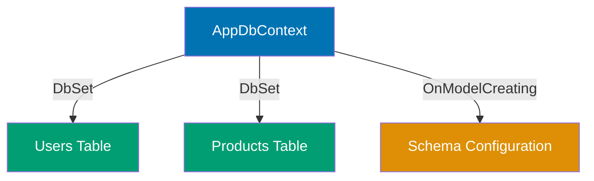
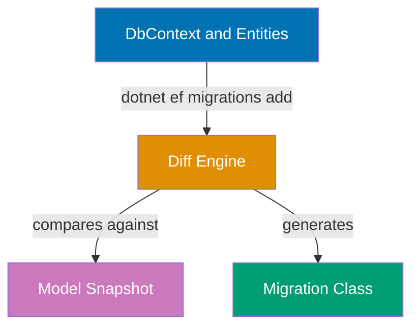

## Beginner Examples (1-30)

**Coverage**: 0-40% of EF Core Migrations functionality

**Focus**: DbContext setup, migration creation and application, MigrationBuilder operations, CLI tooling, and production patterns.

These examples cover the fundamentals needed for managing real production database schemas. Each example is completely self-contained and targets the `dotnet ef` CLI workflow.

---

### Example 1: DbContext Setup

A `DbContext` is the entry point for all EF Core database operations. It holds `DbSet<T>` properties that map entity classes to database tables, and an `OnModelCreating` override for fluent configuration of schema details like constraints, indexes, and column types.



```csharp
using Microsoft.EntityFrameworkCore;          // => EF Core namespace; provides DbContext, DbSet<T>

namespace MyApp.Infrastructure;

// Primary constructor syntax (C# 12); injects DbContextOptions
public class AppDbContext(DbContextOptions<AppDbContext> options) : DbContext(options)
{
    // DbSet<T> exposes LINQ-queryable table; each property maps to one table
    public DbSet<UserModel> Users => Set<UserModel>();
    // => Users property maps to "Users" table (or configured table name)
    // => Set<T>() is preferred over field-backed DbSet for testability

    public DbSet<ProductModel> Products => Set<ProductModel>();
    // => Products property maps to "Products" table

    protected override void OnModelCreating(ModelBuilder modelBuilder)
    {
        // => Called once at startup to build the model
        // => Fluent API here overrides data annotation defaults

        modelBuilder.Entity<UserModel>(entity =>
        {
            entity.HasKey(e => e.Id);
            // => Declares Id as primary key; EF generates PK constraint
            entity.HasIndex(e => e.Email).IsUnique();
            // => Creates UNIQUE INDEX on Email column
            // => Prevents duplicate emails without application-layer checks
            entity.Property(e => e.Email).HasMaxLength(255);
            // => Maps to VARCHAR(255); without this EF uses TEXT (no length limit)
        });
    }
}
```

**Key Takeaway**: `DbContext` is the single source of truth for your database schema in EF Core; configure all column types, indexes, and constraints in `OnModelCreating` rather than scattering them across entity annotations.

**Why It Matters**: Production applications need consistent schema enforcement. Centralizing configuration in `OnModelCreating` makes it easy to audit all constraints in one place, avoids annotation clutter on entity classes, and ensures migrations accurately reflect the intended schema. Missing index or constraint configuration here means missing it in the generated migration, leading to performance or data integrity problems discovered only in production.

---

### Example 2: First Migration (dotnet ef migrations add)

The `dotnet ef migrations add` command generates a migration class by comparing the current EF Core model (your `DbContext` and entity classes) against the last applied migration snapshot. It produces a timestamped `.cs` file containing `Up()` and `Down()` methods.



```bash
# Run from project directory containing the .csproj file
dotnet ef migrations add InitialCreate
# => Compares current DbContext model against last snapshot (none exists yet)
# => Generates three files in Migrations/ folder:
# =>   20260327000000_InitialCreate.cs          (migration logic)
# =>   20260327000000_InitialCreate.Designer.cs (EF metadata snapshot for this migration)
# =>   AppDbContextModelSnapshot.cs             (current model snapshot, updated on every add)

dotnet ef migrations add AddProductTable
# => Compares updated DbContext (with Products DbSet) against current snapshot
# => Generates only the DIFF - changes since InitialCreate
# => If no model changes detected: "No changes detected" error; nothing generated
```

```csharp
// Generated file: Migrations/20260327000000_InitialCreate.cs
using Microsoft.EntityFrameworkCore.Migrations;  // => MigrationBuilder lives here

#nullable disable                                 // => Suppresses nullable warnings in generated code

namespace MyApp.Migrations;

public partial class InitialCreate : Migration   // => partial class; Designer.cs adds metadata
{
    protected override void Up(MigrationBuilder migrationBuilder)
    {
        // => EF Core fills this with CreateTable, CreateIndex, etc. calls
        // => Runs when: dotnet ef database update
    }

    protected override void Down(MigrationBuilder migrationBuilder)
    {
        // => Reverse of Up(); EF Core generates DropTable, DropIndex, etc.
        // => Runs when: dotnet ef database update PreviousMigration
    }
}
```

**Key Takeaway**: `dotnet ef migrations add` only detects model changes relative to the last snapshot; always verify the generated migration file before applying it to catch unexpected additions or omissions.

**Why It Matters**: EF Core's diff engine is powerful but not infallible—subtle model mismatches can produce incorrect migrations. Reviewing generated files before running `database update` prevents applying wrong schema changes to production databases, which can be expensive or impossible to reverse cleanly, especially when data is involved.

---

### Example 3: Up() and Down() Methods

Every migration class has two methods: `Up()` applies the schema change forward, and `Down()` reverses it. EF Core generates both automatically, but understanding their relationship is critical for safe rollbacks.

```csharp
using Microsoft.EntityFrameworkCore.Migrations;  // => Required namespace for MigrationBuilder

namespace MyApp.Migrations;

public partial class AddEmailToUsers : Migration
{
    protected override void Up(MigrationBuilder migrationBuilder)
    {
        // => Runs on: dotnet ef database update (forward migration)
        // => Purpose: apply the intended schema change

        migrationBuilder.AddColumn<string>(
            name: "email",                        // => Column name in database
            table: "users",                       // => Target table
            type: "character varying(255)",       // => SQL type for PostgreSQL
            maxLength: 255,                       // => Reflected in EF model validation
            nullable: false,                      // => NOT NULL constraint
            defaultValue: "");                    // => Required default for existing rows
        // => SQL: ALTER TABLE users ADD COLUMN email VARCHAR(255) NOT NULL DEFAULT ''
    }

    protected override void Down(MigrationBuilder migrationBuilder)
    {
        // => Runs on: dotnet ef database update AddEmailToUsers~ (revert)
        // => Purpose: undo exactly what Up() did, in reverse order

        migrationBuilder.DropColumn(
            name: "email",                        // => Column to remove
            table: "users");                      // => Target table
        // => SQL: ALTER TABLE users DROP COLUMN email
        // => All data in the email column is PERMANENTLY DELETED on Down()
    }
}
```

**Key Takeaway**: `Down()` must be the exact inverse of `Up()` in reverse order; EF Core generates both, but always verify `Down()` is safe before relying on rollback in production.

**Why It Matters**: Rollback scenarios arise under time pressure (failed deployments, data issues). A broken `Down()` method leaves the database in an inconsistent state that requires manual intervention. Destructive `Down()` operations (dropping columns with data) need careful planning—consider soft-drop strategies for columns containing irreplaceable production data.

---

### Example 4: MigrationBuilder.CreateTable

`CreateTable` generates a `CREATE TABLE` SQL statement. The columns lambda uses anonymous type properties to define each column's name, type, and constraints. The constraints lambda adds primary keys and other table-level constraints.

```csharp
using System;                                    // => Guid lives here
using Microsoft.EntityFrameworkCore.Migrations;  // => MigrationBuilder

namespace MyApp.Migrations;

public partial class CreateProductsTable : Migration
{
    protected override void Up(MigrationBuilder migrationBuilder)
    {
        migrationBuilder.CreateTable(
            name: "products",                    // => Table name in database
            columns: table => new                // => Anonymous object; each property = one column
            {
                id = table.Column<Guid>(
                    type: "uuid",                // => PostgreSQL UUID type
                    nullable: false),            // => NOT NULL; primary keys cannot be null
                // => Column: id UUID NOT NULL

                name = table.Column<string>(
                    type: "character varying(200)",
                    maxLength: 200,              // => EF model validation limit
                    nullable: false),            // => Required field
                // => Column: name VARCHAR(200) NOT NULL

                price = table.Column<decimal>(
                    type: "numeric(19,4)",
                    precision: 19,               // => Total significant digits
                    scale: 4,                    // => Digits after decimal point
                    nullable: false),            // => NOT NULL; every product has a price
                // => Column: price NUMERIC(19,4) NOT NULL

                created_at = table.Column<DateTimeOffset>(
                    type: "timestamp with time zone",
                    nullable: false),            // => Audit timestamp; always populated
                // => Column: created_at TIMESTAMPTZ NOT NULL
            },
            constraints: table =>               // => Table-level constraints (PK, FK, CHECK)
            {
                table.PrimaryKey("pk_products", x => x.id);
                // => Constraint: PRIMARY KEY (id) NAMED pk_products
                // => Naming convention: pk_{table_name}
            });
        // => Final SQL (PostgreSQL):
        // => CREATE TABLE products (
        // =>   id UUID NOT NULL,
        // =>   name VARCHAR(200) NOT NULL,
        // =>   price NUMERIC(19,4) NOT NULL,
        // =>   created_at TIMESTAMPTZ NOT NULL,
        // =>   CONSTRAINT pk_products PRIMARY KEY (id)
        // => );
    }

    protected override void Down(MigrationBuilder migrationBuilder)
    {
        migrationBuilder.DropTable(name: "products");
        // => SQL: DROP TABLE products
        // => All rows and the table structure are permanently removed
    }
}
```

**Key Takeaway**: The anonymous type property names in the `columns` lambda become the actual database column names, so use snake_case names here to match database conventions even when your C# entity uses PascalCase.

**Why It Matters**: Column naming conventions affect readability of raw SQL queries and database monitoring tools. Consistent snake_case in the database layer while keeping PascalCase in C# is standard in EF Core projects and avoids confusion when debugging queries or inspecting database schemas directly.

---

### Example 5: MigrationBuilder.AddColumn

`AddColumn` generates an `ALTER TABLE ... ADD COLUMN` statement. It is used in subsequent migrations to add new columns to existing tables without recreating the table, preserving all existing data.

```csharp
using System;
using Microsoft.EntityFrameworkCore.Migrations;

namespace MyApp.Migrations;

public partial class AddDescriptionToProducts : Migration
{
    protected override void Up(MigrationBuilder migrationBuilder)
    {
        migrationBuilder.AddColumn<string>(
            name: "description",                 // => New column name
            table: "products",                   // => Existing table to alter
            type: "character varying(500)",      // => SQL type
            maxLength: 500,                      // => EF model length validation
            nullable: false,                     // => NOT NULL constraint
            defaultValue: "");                   // => Default for existing rows (required for NOT NULL)
        // => SQL: ALTER TABLE products
        // =>        ADD COLUMN description VARCHAR(500) NOT NULL DEFAULT ''
        // => Existing rows get empty string; change default after population if needed

        migrationBuilder.AddColumn<DateTimeOffset>(
            name: "updated_at",
            table: "products",
            type: "timestamp with time zone",
            nullable: true);                     // => Nullable: no default needed for existing rows
        // => SQL: ALTER TABLE products ADD COLUMN updated_at TIMESTAMPTZ NULL
        // => Existing rows get NULL; application sets value on next update
    }

    protected override void Down(MigrationBuilder migrationBuilder)
    {
        migrationBuilder.DropColumn(name: "description", table: "products");
        // => SQL: ALTER TABLE products DROP COLUMN description
        // => Irreversible data loss for description values if rows exist

        migrationBuilder.DropColumn(name: "updated_at", table: "products");
        // => SQL: ALTER TABLE products DROP COLUMN updated_at
    }
}
```

**Key Takeaway**: Adding a NOT NULL column to a populated table requires a `defaultValue` to avoid constraint violations; choose a sentinel default that your application can detect and update rather than leaving empty strings permanently.

**Why It Matters**: The most common migration failure in production is adding a NOT NULL column without a default to a table that already contains rows. The database rejects the ALTER TABLE statement because existing rows cannot satisfy the constraint. EF Core's `defaultValue` parameter prevents this failure, but the chosen default needs deliberate thought—an empty string default might hide missing data in monitoring queries.

---

### Example 6: MigrationBuilder.DropColumn

`DropColumn` generates an `ALTER TABLE ... DROP COLUMN` statement. This is a destructive, often irreversible operation—all data in the column is permanently lost when the migration runs.

```csharp
using Microsoft.EntityFrameworkCore.Migrations;

namespace MyApp.Migrations;

public partial class RemoveLegacyColumns : Migration
{
    protected override void Up(MigrationBuilder migrationBuilder)
    {
        migrationBuilder.DropColumn(
            name: "legacy_code",                 // => Column to remove
            table: "products");                  // => Target table
        // => SQL: ALTER TABLE products DROP COLUMN legacy_code
        // => All values in legacy_code are permanently deleted from every row
        // => Cannot be rolled back without restoring from backup

        migrationBuilder.DropColumn(
            name: "deprecated_flag",
            table: "products");
        // => SQL: ALTER TABLE products DROP COLUMN deprecated_flag
        // => Drop columns individually; there is no multi-column drop shorthand
    }

    protected override void Down(MigrationBuilder migrationBuilder)
    {
        // => Restoring a dropped column recreates it with NULL for all existing rows
        // => Original data is gone; Down() can only add the column back as nullable

        migrationBuilder.AddColumn<string>(
            name: "legacy_code",
            table: "products",
            type: "text",
            nullable: true);                     // => Must be nullable; no original data to restore
        // => SQL: ALTER TABLE products ADD COLUMN legacy_code TEXT NULL

        migrationBuilder.AddColumn<bool>(
            name: "deprecated_flag",
            table: "products",
            type: "boolean",
            nullable: true);
        // => SQL: ALTER TABLE products ADD COLUMN deprecated_flag BOOLEAN NULL
    }
}
```

**Key Takeaway**: `DropColumn` is irreversible in terms of data; always verify there are no active queries reading the column and that all application code referencing it has been deployed before running this migration.

**Why It Matters**: Dropping a column in a live system requires coordinated deployment: remove all application code reading the column first, deploy that code, then run the migration. Running the migration before updating code causes immediate application errors. This "expand-contract" pattern is the safe zero-downtime approach to column removal in production systems.

---

### Example 7: MigrationBuilder.CreateIndex

`CreateIndex` generates a `CREATE INDEX` statement. Indexes dramatically improve query performance for columns used in `WHERE` clauses, `JOIN` conditions, or `ORDER BY` expressions, but they add write overhead and storage cost.

```csharp
using Microsoft.EntityFrameworkCore.Migrations;

namespace MyApp.Migrations;

public partial class AddProductIndexes : Migration
{
    protected override void Up(MigrationBuilder migrationBuilder)
    {
        migrationBuilder.CreateIndex(
            name: "ix_products_category",        // => Index name; convention: ix_{table}_{column}
            table: "products",                   // => Table to index
            column: "category");                 // => Single column to index
        // => SQL: CREATE INDEX ix_products_category ON products (category)
        // => Speeds up: WHERE category = 'Electronics'
        // => Does NOT enforce uniqueness

        migrationBuilder.CreateIndex(
            name: "ix_products_category_price",
            table: "products",
            columns: new[] { "category", "price" });
                                                 // => Composite index on two columns
        // => SQL: CREATE INDEX ix_products_category_price ON products (category, price)
        // => Useful for: WHERE category = 'X' ORDER BY price
        // => Column ORDER matters: most selective filter first

        migrationBuilder.CreateIndex(
            name: "ix_products_sku",
            table: "products",
            column: "sku",
            unique: true);                       // => UNIQUE constraint via index
        // => SQL: CREATE UNIQUE INDEX ix_products_sku ON products (sku)
        // => Prevents duplicate SKU values at the database level
        // => EF Core maps this to HasIndex(...).IsUnique() in OnModelCreating
    }

    protected override void Down(MigrationBuilder migrationBuilder)
    {
        migrationBuilder.DropIndex(name: "ix_products_sku", table: "products");
        // => SQL: DROP INDEX ix_products_sku
        // => Removes UNIQUE constraint; duplicates can now exist

        migrationBuilder.DropIndex(name: "ix_products_category_price", table: "products");
        migrationBuilder.DropIndex(name: "ix_products_category", table: "products");
        // => Remove indexes in reverse order of creation (defensive practice)
    }
}
```

**Key Takeaway**: Name indexes consistently using the `ix_{table}_{column(s)}` convention and always add indexes before running heavy queries on a populated table—adding them to an existing table with millions of rows requires a full table scan that can block production traffic.

**Why It Matters**: Missing indexes are the leading cause of slow database queries in production applications. EF Core does not automatically create indexes for foreign keys (unlike Hibernate), so developers must explicitly add them. The `columns` parameter for composite indexes requires careful column ordering—the leading column determines which queries benefit from the index, making wrong ordering nearly as bad as no index.

---

### Example 8: MigrationBuilder.AddForeignKey

`AddForeignKey` generates an `ALTER TABLE ... ADD CONSTRAINT ... FOREIGN KEY` statement, enforcing referential integrity between two tables at the database level.

```csharp
using Microsoft.EntityFrameworkCore.Migrations;

namespace MyApp.Migrations;

public partial class AddOrderItemsForeignKey : Migration
{
    protected override void Up(MigrationBuilder migrationBuilder)
    {
        // Step 1: Create supporting index on foreign key column first
        migrationBuilder.CreateIndex(
            name: "ix_order_items_order_id",    // => Index name for the FK column
            table: "order_items",               // => Child table
            column: "order_id");                // => FK column to index
        // => SQL: CREATE INDEX ix_order_items_order_id ON order_items (order_id)
        // => Index is critical: without it, deleting an order causes full scan of order_items

        // Step 2: Add the foreign key constraint
        migrationBuilder.AddForeignKey(
            name: "fk_order_items_orders_order_id",
                                                // => Constraint name; convention: fk_{child}_{parent}_{column}
            table: "order_items",               // => Child table (holds FK column)
            column: "order_id",                 // => FK column in child table
            principalTable: "orders",           // => Parent table (referenced)
            principalColumn: "id",              // => Referenced column in parent table (usually PK)
            onDelete: ReferentialAction.Cascade);
                                                // => ON DELETE CASCADE: deleting order deletes its items
        // => SQL: ALTER TABLE order_items
        // =>        ADD CONSTRAINT fk_order_items_orders_order_id
        // =>        FOREIGN KEY (order_id) REFERENCES orders (id)
        // =>        ON DELETE CASCADE
    }

    protected override void Down(MigrationBuilder migrationBuilder)
    {
        // Drop FK constraint BEFORE dropping the index it depends on
        migrationBuilder.DropForeignKey(
            name: "fk_order_items_orders_order_id",
            table: "order_items");
        // => SQL: ALTER TABLE order_items DROP CONSTRAINT fk_order_items_orders_order_id

        migrationBuilder.DropIndex(
            name: "ix_order_items_order_id",
            table: "order_items");
        // => SQL: DROP INDEX ix_order_items_order_id
    }
}
```

**Key Takeaway**: Always create an index on the foreign key column before adding the constraint; the index is required for efficient cascade operations and DELETE performance on the parent table.

**Why It Matters**: Foreign key constraints without supporting indexes cause catastrophic performance degradation when deleting parent records, because the database must perform a full table scan of the child table to check for referencing rows. In high-traffic systems, this can cause DELETE operations to take seconds instead of milliseconds, triggering timeouts and cascading failures.

---

### Example 9: Applying Migrations (dotnet ef database update)

The `dotnet ef database update` command applies all pending migrations to the database in chronological order. EF Core tracks which migrations have been applied in the `__EFMigrationsHistory` table.

```bash
# Apply all pending migrations (forward to latest)
dotnet ef database update
# => Queries __EFMigrationsHistory to find last applied migration
# => Runs Up() of each unapplied migration in timestamp order
# => Inserts a row into __EFMigrationsHistory for each applied migration
# => Output: Applying migration '20260327000001_InitialCreate'
# => Output: Done.

# Apply up to a specific migration (partial update)
dotnet ef database update AddEmailToUsers
# => Applies only migrations up to and including AddEmailToUsers
# => Stops before any later migrations
# => Useful for staged rollouts or debugging a specific migration

# Apply to empty database (fresh install)
dotnet ef database update --connection "Host=localhost;Database=myapp_dev;Username=admin;Password=secret"
# => Uses explicit connection string instead of appsettings.json
# => Creates __EFMigrationsHistory table if it does not exist
# => Applies all migrations from the beginning
```

```csharp
// What EF Core does internally when database update runs:
// 1. Opens database connection
// 2. Creates __EFMigrationsHistory if missing:
//    CREATE TABLE IF NOT EXISTS "__EFMigrationsHistory" (
//      "MigrationId" VARCHAR(150) NOT NULL,   -- => e.g. "20260327000001_InitialCreate"
//      "ProductVersion" VARCHAR(32) NOT NULL, -- => e.g. "10.0.1"
//      CONSTRAINT "PK___EFMigrationsHistory" PRIMARY KEY ("MigrationId")
//    );
// 3. Queries applied migrations:
//    SELECT "MigrationId" FROM "__EFMigrationsHistory";
// 4. For each pending migration, runs Up() then inserts:
//    INSERT INTO "__EFMigrationsHistory" VALUES ('20260327_InitialCreate', '10.0.1');
```

**Key Takeaway**: `dotnet ef database update` is idempotent within a run—it skips already-applied migrations—but never run it against a production database without first reviewing the pending migrations with `dotnet ef migrations list`.

**Why It Matters**: Blindly running `database update` in production without reviewing what will execute is a common source of unplanned outages. EF Core applies ALL pending migrations in sequence, so if three migrations have accumulated since the last deployment, all three run. Reviewing with `migrations list` first and using `--verbose` to see generated SQL gives operators the information needed to estimate impact and plan maintenance windows.

---

### Example 10: Reverting Migrations (dotnet ef database update PreviousMigration)

To roll back a migration, pass the name of the migration you want to be the new "current" state. EF Core runs `Down()` methods in reverse chronological order until it reaches the target.

```bash
# Revert to a specific previous migration
dotnet ef database update InitialCreate
# => Runs Down() for each migration AFTER InitialCreate, in reverse order
# => Example: if applied order was InitialCreate -> AddEmail -> AddIndex
# =>   Runs Down() of AddIndex first
# =>   Runs Down() of AddEmail second
# =>   Stops; InitialCreate remains applied
# => Removes the reverted rows from __EFMigrationsHistory

# Revert ALL migrations (empty database schema)
dotnet ef database update 0
# => Runs Down() for ALL applied migrations in reverse order
# => __EFMigrationsHistory becomes empty (table remains but no rows)
# => All tables created by migrations are dropped
# => WARNING: All data is lost; use only in development or testing

# Check current state before reverting
dotnet ef migrations list
# => Shows each migration with [applied] or [pending] tag
# => Output:
# =>   20260327000001_InitialCreate [applied]
# =>   20260327000002_AddEmailToUsers [applied]
# =>   20260327000003_AddIndex [applied]  <-- current tip
```

**Key Takeaway**: Always verify with `migrations list` before reverting, and remember that `Down()` methods can destroy data—reverting a migration that added a column permanently deletes all data in that column.

**Why It Matters**: Rollback in production is rarely safe when data-modifying migrations have run. If `AddDescriptionToProducts` ran and users populated description fields, the `Down()` method that drops the column destroys that data permanently. Production rollback strategies should prefer forward-only migrations (adding a nullable column to "undo" a change) rather than relying on `Down()` for data-sensitive operations.

---

### Example 11: Removing Last Migration (dotnet ef migrations remove)

`dotnet ef migrations remove` deletes the most recently created migration file and updates the model snapshot, but only works if the migration has not yet been applied to any database.

```bash
# Remove the last unapplied migration
dotnet ef migrations remove
# => Deletes Migrations/20260327000003_AddIndex.cs
# => Deletes Migrations/20260327000003_AddIndex.Designer.cs
# => Reverts AppDbContextModelSnapshot.cs to the state before AddIndex was generated
# => Output: Removing migration '20260327000003_AddIndex'
# => Output: Done.

# ERROR case: trying to remove an already-applied migration
dotnet ef migrations remove
# => Output: The migration '20260327000003_AddIndex' has already been applied to the database.
# => Output: Revert it and try again.
# => Fix: run `dotnet ef database update PreviousMigration` first, then `migrations remove`

# Verify the removal
dotnet ef migrations list
# => Output:
# =>   20260327000001_InitialCreate [applied]
# =>   20260327000002_AddEmailToUsers [applied]
# => AddIndex is gone from the list
```

```csharp
// After remove, the snapshot reverts.
// AppDbContextModelSnapshot.cs no longer contains the AddIndex configuration.
// Your DbContext model must also be reverted (remove the property/index that caused AddIndex).
// If you leave the DbContext change but remove the migration, the NEXT add will regenerate it.
```

**Key Takeaway**: `migrations remove` only works on unapplied migrations and modifies three files; always revert the corresponding `DbContext` model change at the same time to keep the model and migrations in sync.

**Why It Matters**: Leaving the DbContext model change in place after removing the migration file creates a confusing state: the model says one thing, the snapshot says another, and the next `migrations add` generates a migration you thought you deleted. Teams working in feature branches frequently hit this when cleaning up migrations before merging—establishing a clear protocol (revert model and run `remove` together) prevents snapshot divergence.

---

### Example 12: Listing Migrations (dotnet ef migrations list)

`dotnet ef migrations list` shows all migration classes in chronological order and indicates whether each has been applied to the target database.

```bash
# List all migrations with their applied/pending status
dotnet ef migrations list
# => Output:
# =>   20260101000001_InitialCreate (Applied)
# =>   20260201000001_AddEmailToUsers (Applied)
# =>   20260301000001_AddProductTable (Applied)
# =>   20260327000001_AddIndexes (Pending)
# => Applied = row exists in __EFMigrationsHistory
# => Pending = migration file exists but not yet run

# List against a specific environment database
dotnet ef migrations list --connection "Host=prod-db.example.com;Database=myapp;Username=ro;Password=secret"
# => Connects to production (or staging) DB to check actual applied migrations
# => Useful for verifying deployment status without SSH access

# List with verbose output (shows project and startup project)
dotnet ef migrations list --verbose
# => Output also includes:
# =>   Using project 'MyApp.Infrastructure'
# =>   Using startup project 'MyApp.Api'
# =>   Build started...
# =>   Build succeeded.
```

**Key Takeaway**: Run `migrations list` before every `database update` in non-local environments to confirm exactly which migrations are pending and avoid surprises during deployments.

**Why It Matters**: In systems with multiple databases (dev, staging, production), migration states diverge quickly. A migration merged last week might be applied to staging but not production. Running `migrations list --connection <prod>` before a deployment gives operators a precise list of schema changes about to run, enabling informed go/no-go decisions and accurate communication with database administrators.

---

### Example 13: \_\_EFMigrationsHistory Table

EF Core uses a special `__EFMigrationsHistory` table in each database to track which migrations have been applied. This table is the source of truth for `dotnet ef migrations list` and `database update`.

```sql
-- Structure of __EFMigrationsHistory (PostgreSQL)
-- => EF Core creates this automatically on first database update
SELECT column_name, data_type, character_maximum_length
FROM information_schema.columns
WHERE table_name = '__EFMigrationsHistory';
-- => column_name: MigrationId  | data_type: character varying | max_length: 150
-- => column_name: ProductVersion | data_type: character varying | max_length: 32

-- Querying applied migrations directly
SELECT "MigrationId", "ProductVersion"
FROM "__EFMigrationsHistory"
ORDER BY "MigrationId";
-- => Output:
-- =>   MigrationId                              | ProductVersion
-- =>   20260101000001_InitialCreate             | 10.0.1
-- =>   20260201000001_AddEmailToUsers           | 10.0.1
-- =>   20260301000001_AddProductTable           | 10.0.1

-- Checking if a specific migration was applied
SELECT COUNT(*) FROM "__EFMigrationsHistory"
WHERE "MigrationId" = '20260327000001_AddIndexes';
-- => 0 = not applied (pending)
-- => 1 = applied
```

```csharp
// EF Core inserts into __EFMigrationsHistory after each successful Up() call:
// INSERT INTO "__EFMigrationsHistory" ("MigrationId", "ProductVersion")
// VALUES ('20260327000001_AddIndexes', '10.0.1');
// => MigrationId format: {timestamp}_{ClassName}
// => ProductVersion: the EF Core NuGet package version (e.g. "10.0.1")

// EF Core deletes from __EFMigrationsHistory during revert (Down()):
// DELETE FROM "__EFMigrationsHistory"
// WHERE "MigrationId" = '20260327000001_AddIndexes';
// => Row removed means migration is no longer tracked as applied
```

**Key Takeaway**: Never manually insert or delete rows from `__EFMigrationsHistory` unless you are deliberately marking a migration as applied without running its `Up()` method (a technique for resolving deployment drift).

**Why It Matters**: The `__EFMigrationsHistory` table is EF Core's sole mechanism for tracking migration state. Manual edits can cause EF Core to attempt to re-apply already-run migrations (causing duplicate object errors) or skip migrations that were never applied. The only legitimate manual edit case is "baselining"—inserting all migration IDs for a database that was created through another mechanism (e.g., restored from a dump).

---

### Example 14: Migration Snapshot File

The `AppDbContextModelSnapshot.cs` file captures the complete current EF Core model as a C# class. EF Core regenerates the diff for new migrations by comparing the current `DbContext` against this snapshot, not against the database.

```csharp
// File: Migrations/AppDbContextModelSnapshot.cs
// => Auto-generated; DO NOT edit manually
// => Updated every time you run: dotnet ef migrations add

// <auto-generated />
using Microsoft.EntityFrameworkCore;
using Microsoft.EntityFrameworkCore.Infrastructure;
using MyApp.Infrastructure;

namespace MyApp.Migrations;

[DbContext(typeof(AppDbContext))]              // => Links snapshot to specific DbContext
partial class AppDbContextModelSnapshot : ModelSnapshot
{
    protected override void BuildModel(ModelBuilder modelBuilder)
    {
#pragma warning disable 612, 618             // => Suppress obsolete API warnings in generated code
        modelBuilder
            .HasAnnotation("ProductVersion", "10.0.1")
            // => Tracks EF Core version that generated this snapshot
            .HasAnnotation("Relational:MaxIdentifierLength", 63);
            // => PostgreSQL identifier limit (63 chars for table/column names)

        modelBuilder.Entity("MyApp.Infrastructure.Models.UserModel", b =>
        {
            b.Property<Guid>("Id")            // => Matches entity property type
                .ValueGeneratedOnAdd()        // => Database generates value on INSERT
                .HasColumnType("uuid")        // => PostgreSQL-specific type annotation
                .HasColumnName("id");         // => Actual column name in database

            b.HasKey("Id");                   // => Primary key declaration
            b.ToTable("users");               // => Table mapping
        });
    }
}
```

**Key Takeaway**: The snapshot file represents the "last known state" of your model from EF Core's perspective; if it becomes corrupted or out of sync, delete it and regenerate by running `dotnet ef migrations add` (which rebuilds the snapshot from scratch using the existing migration history).

**Why It Matters**: The snapshot file must be committed to version control alongside migration files. If a developer deletes it or it diverges (e.g., due to merge conflicts), `migrations add` generates incorrect diffs—either empty migrations or migrations that re-create already-existing schema. Resolving snapshot merge conflicts requires understanding EF Core's model builder API, making snapshot conflicts one of the trickier issues teams face when multiple developers create migrations concurrently.

---

### Example 15: Designer.cs Metadata

Each migration has a corresponding `.Designer.cs` file that captures a snapshot of the EF Core model at the point in time that migration was created. This lets EF Core reconstruct historical model states for point-in-time operations.

```csharp
// File: Migrations/20260327000001_InitialCreate.Designer.cs
// => Auto-generated alongside the migration class; DO NOT edit manually

// <auto-generated />
using System;
using Microsoft.EntityFrameworkCore;
using Microsoft.EntityFrameworkCore.Infrastructure;
using Microsoft.EntityFrameworkCore.Migrations;
using MyApp.Infrastructure;

namespace MyApp.Migrations;

[DbContext(typeof(AppDbContext))]            // => Associates metadata with AppDbContext
[Migration("20260327000001_InitialCreate")] // => Links metadata to specific migration ID
partial class InitialCreate                  // => Same partial class as InitialCreate.cs
{
    protected override void BuildTargetModel(ModelBuilder modelBuilder)
    {
        // => Snapshot of model state AFTER this migration was applied
        // => Used by dotnet ef migrations script to generate SQL between two points

        modelBuilder
            .HasAnnotation("ProductVersion", "10.0.1")
            .HasAnnotation("Relational:MaxIdentifierLength", 63);

        modelBuilder.Entity("MyApp.Infrastructure.Models.UserModel", b =>
        {
            b.Property<Guid>("Id")
                .ValueGeneratedOnAdd()
                .HasColumnType("uuid")
                .HasColumnName("id");         // => Column name at time of InitialCreate

            b.HasKey("Id");
            b.ToTable("users");
        });
        // => If AddEmailToUsers later added the email column,
        // => THIS snapshot (Designer.cs for InitialCreate) does NOT include email
        // => The Designer.cs for AddEmailToUsers DOES include email
    }
}
```

**Key Takeaway**: Designer.cs files are auto-generated metadata artifacts that enable point-in-time SQL generation; commit them to source control but never edit them manually.

**Why It Matters**: The Designer.cs files enable `dotnet ef migrations script From To` to generate a SQL script for a specific migration range, which is essential for upgrade scripts when deployments must advance through multiple migration versions. Without accurate Designer.cs files, ranged script generation produces incorrect SQL. Teams that `.gitignore` Designer.cs files break this capability and often discover it at the worst moment—during an emergency partial rollback.

---

### Example 16: Adding Unique Constraints

Unique constraints prevent duplicate values in one or more columns. In EF Core Migrations, you add them either through `CreateIndex` with `unique: true` (creates a unique index) or via `AddUniqueConstraint` for a named constraint without an index.

```csharp
using Microsoft.EntityFrameworkCore.Migrations;

namespace MyApp.Migrations;

public partial class AddUniqueConstraints : Migration
{
    protected override void Up(MigrationBuilder migrationBuilder)
    {
        // Approach 1: Unique index (most common; supports queries on the column)
        migrationBuilder.CreateIndex(
            name: "ix_users_email",
            table: "users",
            column: "email",
            unique: true);                       // => UNIQUE constraint via index
        // => SQL: CREATE UNIQUE INDEX ix_users_email ON users (email)
        // => Rejects INSERT/UPDATE that would create a duplicate email
        // => Also makes queries on email fast (index is used for WHERE email = ?)

        // Approach 2: Composite unique constraint (unique combination of columns)
        migrationBuilder.CreateIndex(
            name: "ix_order_items_order_product",
            table: "order_items",
            columns: new[] { "order_id", "product_id" },
                                                 // => Composite uniqueness
            unique: true);
        // => SQL: CREATE UNIQUE INDEX ix_order_items_order_product
        // =>        ON order_items (order_id, product_id)
        // => Each (order_id, product_id) pair must be unique
        // => Same product can appear in different orders (order_id differs)
        // => Same order cannot have the same product twice
    }

    protected override void Down(MigrationBuilder migrationBuilder)
    {
        migrationBuilder.DropIndex(name: "ix_order_items_order_product", table: "order_items");
        // => SQL: DROP INDEX ix_order_items_order_product
        // => Uniqueness no longer enforced; duplicate (order, product) pairs now possible

        migrationBuilder.DropIndex(name: "ix_users_email", table: "users");
        // => SQL: DROP INDEX ix_users_email
    }
}
```

**Key Takeaway**: Prefer unique indexes (`CreateIndex` with `unique: true`) over `AddUniqueConstraint` because the index also serves query performance, eliminating the need to create a separate index on the same column.

**Why It Matters**: Unique constraints are the last line of defense against duplicate data when concurrent inserts occur—application-level uniqueness checks have a race condition window between the SELECT check and the INSERT. Only a database-level unique constraint atomically prevents duplicates. For user-facing data like emails or usernames, missing unique constraints lead to data corruption that is expensive to clean up and damages user trust.

---

### Example 17: NOT NULL with Default Values

Adding a NOT NULL column to a table that already contains rows requires a default value, or the database rejects the ALTER TABLE command. EF Core's `defaultValue` parameter generates the appropriate `DEFAULT` clause.

```csharp
using System;
using Microsoft.EntityFrameworkCore.Migrations;

namespace MyApp.Migrations;

public partial class AddAuditColumns : Migration
{
    protected override void Up(MigrationBuilder migrationBuilder)
    {
        migrationBuilder.AddColumn<string>(
            name: "created_by",
            table: "users",
            type: "character varying(255)",
            maxLength: 255,
            nullable: false,
            defaultValue: "system");             // => Default for existing rows
        // => SQL: ALTER TABLE users
        // =>        ADD COLUMN created_by VARCHAR(255) NOT NULL DEFAULT 'system'
        // => All existing rows get "system" as the created_by value
        // => New rows must supply a value (or rely on application-side default)

        migrationBuilder.AddColumn<string>(
            name: "updated_by",
            table: "users",
            type: "character varying(255)",
            maxLength: 255,
            nullable: false,
            defaultValue: "system");
        // => SQL: ALTER TABLE users
        // =>        ADD COLUMN updated_by VARCHAR(255) NOT NULL DEFAULT 'system'

        migrationBuilder.AddColumn<DateTimeOffset>(
            name: "deleted_at",
            table: "users",
            type: "timestamp with time zone",
            nullable: true);                     // => Nullable; no default needed
        // => SQL: ALTER TABLE users ADD COLUMN deleted_at TIMESTAMPTZ NULL
        // => Null means "not deleted"; non-null means soft-deleted with timestamp
    }

    protected override void Down(MigrationBuilder migrationBuilder)
    {
        migrationBuilder.DropColumn(name: "deleted_at", table: "users");
        migrationBuilder.DropColumn(name: "updated_by", table: "users");
        migrationBuilder.DropColumn(name: "created_by", table: "users");
        // => Drop in reverse order of creation (defensive practice)
    }
}
```

**Key Takeaway**: The `defaultValue` in a migration only controls the SQL `DEFAULT` clause for the schema change; it does not set a runtime default in EF Core—use `HasDefaultValue()` in `OnModelCreating` or a C# property initializer for that.

**Why It Matters**: The distinction between migration-time defaults and runtime defaults trips up many developers. The `defaultValue: "system"` in `AddColumn` only fills existing rows and creates a SQL DEFAULT constraint. Future inserts through EF Core still need the value set explicitly in the entity or via `HasDefaultValueSql` in `OnModelCreating`. Omitting the runtime default causes NOT NULL violations at runtime even though the migration succeeded.

---

### Example 18: UUID/GUID Primary Keys

UUID primary keys (using `Guid` in C#) avoid sequential ID predictability and enable client-side ID generation. EF Core maps `Guid` to the `uuid` type in PostgreSQL.

```csharp
using System;
using Microsoft.EntityFrameworkCore.Migrations;

namespace MyApp.Migrations;

public partial class CreateOrdersWithUuid : Migration
{
    protected override void Up(MigrationBuilder migrationBuilder)
    {
        migrationBuilder.CreateTable(
            name: "orders",
            columns: table => new
            {
                id = table.Column<Guid>(
                    type: "uuid",                // => PostgreSQL UUID type; 16 bytes
                    nullable: false),            // => Primary key; never null
                // => C# Guid maps to PostgreSQL uuid
                // => Default value NOT set here; application generates the Guid

                customer_id = table.Column<Guid>(
                    type: "uuid",
                    nullable: false),            // => Foreign key reference; uuid type
                // => Matches id type of customers table for FK relationship

                total = table.Column<decimal>(
                    type: "numeric(19,4)",
                    precision: 19,
                    scale: 4,
                    nullable: false),

                created_at = table.Column<DateTimeOffset>(
                    type: "timestamp with time zone",
                    nullable: false),
            },
            constraints: table =>
            {
                table.PrimaryKey("pk_orders", x => x.id);
                // => PRIMARY KEY (id); uuid column as PK
                // => No sequence/identity needed; application supplies Guid.NewGuid()
            });
        // => Final SQL:
        // => CREATE TABLE orders (
        // =>   id UUID NOT NULL,
        // =>   customer_id UUID NOT NULL,
        // =>   total NUMERIC(19,4) NOT NULL,
        // =>   created_at TIMESTAMPTZ NOT NULL,
        // =>   CONSTRAINT pk_orders PRIMARY KEY (id)
        // => );
    }

    protected override void Down(MigrationBuilder migrationBuilder)
    {
        migrationBuilder.DropTable(name: "orders");
        // => SQL: DROP TABLE orders
    }
}
```

```csharp
// In your entity class, use Guid for the Id property:
public class OrderModel
{
    public Guid Id { get; set; } = Guid.NewGuid();
    // => Guid.NewGuid() generates a new UUID on object creation
    // => Client generates the ID before the INSERT; no round-trip needed to get ID
    // => Format example: 550e8400-e29b-41d4-a716-446655440000

    public Guid CustomerId { get; set; }         // => FK; no default (must be set by caller)
    public decimal Total { get; set; }
    public DateTimeOffset CreatedAt { get; set; }
}
```

**Key Takeaway**: UUID primary keys enable client-side ID generation and distributed ID uniqueness, but use `uuid_generate_v4()` or `gen_random_uuid()` as the database default for cases where inserts bypass EF Core.

**Why It Matters**: UUID primary keys are the standard choice for distributed systems where multiple application instances insert records concurrently without coordination. Sequential integer IDs require a central sequence generator that becomes a bottleneck and exposes row count information to external consumers. However, random UUIDs have worse index locality than sequential integers—for very high-write tables, consider UUIDv7 (sequential UUIDs) to maintain B-tree index performance.

---

### Example 19: Timestamp Columns with Defaults

Audit timestamp columns (`created_at`, `updated_at`) typically have database-side defaults that populate automatically on INSERT or UPDATE, independent of application code.

```csharp
using System;
using Microsoft.EntityFrameworkCore.Migrations;

namespace MyApp.Migrations;

public partial class AddTimestampDefaults : Migration
{
    protected override void Up(MigrationBuilder migrationBuilder)
    {
        migrationBuilder.AddColumn<DateTimeOffset>(
            name: "created_at",
            table: "products",
            type: "timestamp with time zone",
            nullable: false,
            defaultValueSql: "now()");           // => Database function as default
        // => SQL: ALTER TABLE products
        // =>        ADD COLUMN created_at TIMESTAMPTZ NOT NULL DEFAULT now()
        // => Any INSERT that omits created_at gets the current timestamp automatically
        // => Bypassing EF Core (raw SQL INSERT) still gets correct timestamp

        migrationBuilder.AddColumn<DateTimeOffset>(
            name: "updated_at",
            table: "products",
            type: "timestamp with time zone",
            nullable: false,
            defaultValueSql: "now()");           // => Same default for initial value
        // => SQL: ALTER TABLE products
        // =>        ADD COLUMN updated_at TIMESTAMPTZ NOT NULL DEFAULT now()
        // => Application code must set updated_at on every UPDATE
        // => (Or use a trigger; EF Core does not auto-update timestamps by default)
    }

    protected override void Down(MigrationBuilder migrationBuilder)
    {
        migrationBuilder.DropColumn(name: "updated_at", table: "products");
        migrationBuilder.DropColumn(name: "created_at", table: "products");
    }
}
```

```csharp
// In OnModelCreating, mirror the SQL default so EF Core knows about it:
modelBuilder.Entity<ProductModel>(entity =>
{
    entity.Property(e => e.CreatedAt)
        .HasDefaultValueSql("now()");            // => Tells EF Core to use now() as SQL default
        // => EF Core omits created_at from INSERT if value equals CLR default (DateTimeOffset.MinValue)
        // => Database default fills it automatically
});
```

**Key Takeaway**: Use `defaultValueSql: "now()"` (not `defaultValue: DateTimeOffset.UtcNow`) so the timestamp reflects actual insertion time at runtime, not the migration creation time baked into the migration file.

**Why It Matters**: Using a C# `DateTimeOffset.UtcNow` as `defaultValue` in a migration bakes the timestamp from when the migration was written, causing every subsequent row to have that historical timestamp as default—a subtle bug that is hard to detect in testing. SQL function defaults (`now()`, `CURRENT_TIMESTAMP`) evaluate at INSERT time, ensuring accurate audit timestamps regardless of when the migration was authored.

---

### Example 20: Enum Storage Patterns

C# enums need a storage strategy in the database. EF Core supports storing enums as integers (compact, opaque) or as strings (readable, safe for schema changes).

```csharp
using Microsoft.EntityFrameworkCore.Migrations;

namespace MyApp.Migrations;

public partial class AddStatusColumn : Migration
{
    protected override void Up(MigrationBuilder migrationBuilder)
    {
        // String storage pattern (preferred for readability)
        migrationBuilder.AddColumn<string>(
            name: "status",
            table: "users",
            type: "character varying(50)",       // => Bounded string; enum values are short
            maxLength: 50,
            nullable: false,
            defaultValue: "ACTIVE");             // => Default to active status
        // => SQL: ALTER TABLE users
        // =>        ADD COLUMN status VARCHAR(50) NOT NULL DEFAULT 'ACTIVE'
        // => Stored as: 'ACTIVE', 'INACTIVE', 'SUSPENDED'
        // => Readable in raw SQL queries; safe to add new enum values later

        // Integer storage pattern (compact, less readable)
        migrationBuilder.AddColumn<int>(
            name: "role",
            table: "users",
            type: "integer",
            nullable: false,
            defaultValue: 0);                    // => 0 maps to first enum value (e.g. Guest)
        // => SQL: ALTER TABLE users
        // =>        ADD COLUMN role INTEGER NOT NULL DEFAULT 0
        // => Stored as: 0, 1, 2 (opaque without enum definition)
        // => RISK: reordering enum values in C# changes meaning of existing data
    }

    protected override void Down(MigrationBuilder migrationBuilder)
    {
        migrationBuilder.DropColumn(name: "role", table: "users");
        migrationBuilder.DropColumn(name: "status", table: "users");
    }
}
```

```csharp
// In OnModelCreating, configure string conversion:
modelBuilder.Entity<UserModel>(entity =>
{
    entity.Property(e => e.Status).HasConversion(
        v => v.ToString().ToUpperInvariant(),    // => C# enum -> DB string: UserStatus.Active -> "ACTIVE"
        v => Enum.Parse<UserStatus>(v, ignoreCase: true));
                                                 // => DB string -> C# enum: "ACTIVE" -> UserStatus.Active
    // => HasConversion teaches EF Core to translate between C# enum and database string
});
```

**Key Takeaway**: Store enums as strings unless storage space is critical; string storage makes database queries readable, avoids integer-to-meaning mapping confusion, and allows adding new enum values without schema changes.

**Why It Matters**: Integer-stored enums are a maintenance hazard: if a developer inserts a new enum value before the end of the C# enum definition, all subsequent integer values shift, corrupting existing rows silently. String storage eliminates this risk entirely—adding `UserStatus.PendingVerification` to the enum does not affect existing `ACTIVE` or `INACTIVE` rows. The small storage overhead (a VARCHAR vs an INTEGER) is insignificant compared to the operational safety gain.

---

### Example 21: CHECK Constraints

CHECK constraints enforce domain rules at the database level, rejecting any INSERT or UPDATE where the constraint expression evaluates to false. EF Core Migrations supports adding them via `migrationBuilder.Sql()`.

```csharp
using Microsoft.EntityFrameworkCore.Migrations;

namespace MyApp.Migrations;

public partial class AddCheckConstraints : Migration
{
    protected override void Up(MigrationBuilder migrationBuilder)
    {
        // Add CHECK constraint using raw SQL (EF Core does not have a typed API)
        migrationBuilder.Sql(
            "ALTER TABLE products ADD CONSTRAINT chk_products_price_positive " +
            "CHECK (price > 0)");
        // => SQL: ALTER TABLE products
        // =>        ADD CONSTRAINT chk_products_price_positive CHECK (price > 0)
        // => INSERT INTO products (price) VALUES (-5) => ERROR: check constraint violated
        // => Constraint name convention: chk_{table}_{description}

        migrationBuilder.Sql(
            "ALTER TABLE products ADD CONSTRAINT chk_products_quantity_non_negative " +
            "CHECK (quantity IS NULL OR quantity >= 0)");
        // => SQL: ALTER TABLE products
        // =>        ADD CONSTRAINT chk_products_quantity_non_negative
        // =>        CHECK (quantity IS NULL OR quantity >= 0)
        // => NULL is allowed (quantity is optional); non-null quantity must be >= 0

        migrationBuilder.Sql(
            "ALTER TABLE users ADD CONSTRAINT chk_users_email_format " +
            "CHECK (email LIKE '%@%')");
        // => SQL: ALTER TABLE users
        // =>        ADD CONSTRAINT chk_users_email_format CHECK (email LIKE '%@%')
        // => Basic format check; not a full email validation but catches obvious errors
    }

    protected override void Down(MigrationBuilder migrationBuilder)
    {
        migrationBuilder.Sql(
            "ALTER TABLE users DROP CONSTRAINT IF EXISTS chk_users_email_format");
        // => IF EXISTS prevents error if constraint was never added (safe rollback)

        migrationBuilder.Sql(
            "ALTER TABLE products DROP CONSTRAINT IF EXISTS chk_products_quantity_non_negative");

        migrationBuilder.Sql(
            "ALTER TABLE products DROP CONSTRAINT IF EXISTS chk_products_price_positive");
        // => Drop in reverse order; constraints are independent but consistent ordering is good practice
    }
}
```

**Key Takeaway**: Use `migrationBuilder.Sql()` for CHECK constraints since EF Core lacks a typed `AddCheckConstraint` API, and always mirror the constraint in `OnModelCreating` using `HasCheckConstraint()` so EF Core includes it in model validation.

**Why It Matters**: CHECK constraints prevent invalid data that application-level validation misses—concurrent inserts, data migrations, or direct database access can all bypass application code. A positive price constraint at the database level ensures that no code path, no matter how indirect, can store a negative price. The cost is minimal (constraint evaluation on every write), while the data quality guarantee is permanent and unconditional.

---

### Example 22: Composite Indexes

A composite (multi-column) index covers queries that filter on a combination of columns. Column order within the composite index is critical—the index benefits queries whose WHERE clause includes the leading columns.

```csharp
using Microsoft.EntityFrameworkCore.Migrations;

namespace MyApp.Migrations;

public partial class AddCompositeIndexes : Migration
{
    protected override void Up(MigrationBuilder migrationBuilder)
    {
        // Index for: WHERE user_id = ? ORDER BY created_at DESC
        migrationBuilder.CreateIndex(
            name: "ix_expenses_user_id_created_at",
            table: "expenses",
            columns: new[] { "user_id", "created_at" });
                                                  // => Column order: user_id first, created_at second
        // => SQL: CREATE INDEX ix_expenses_user_id_created_at
        // =>        ON expenses (user_id, created_at)
        // => Benefits: WHERE user_id = X (uses index)
        // =>            WHERE user_id = X AND created_at > Y (uses index fully)
        // => Does NOT benefit: WHERE created_at > Y (user_id missing; partial index scan only)

        // Covering index: includes extra column to avoid table lookup
        migrationBuilder.CreateIndex(
            name: "ix_expenses_user_id_date_amount",
            table: "expenses",
            columns: new[] { "user_id", "date", "amount" });
        // => SQL: CREATE INDEX ix_expenses_user_id_date_amount
        // =>        ON expenses (user_id, date, amount)
        // => For: SELECT amount FROM expenses WHERE user_id = ? AND date = ?
        // => Index contains all needed columns; no heap lookup required (covering index)
    }

    protected override void Down(MigrationBuilder migrationBuilder)
    {
        migrationBuilder.DropIndex(name: "ix_expenses_user_id_date_amount", table: "expenses");
        migrationBuilder.DropIndex(name: "ix_expenses_user_id_created_at", table: "expenses");
    }
}
```

**Key Takeaway**: Put the most selective (highest cardinality) column first in a composite index, and design the column set to match actual query patterns from your application's `WHERE` and `ORDER BY` clauses.

**Why It Matters**: Incorrectly ordered composite indexes are an invisible performance problem—the index exists, the query planner may use it, but performance is far worse than optimal. For a table with millions of expense rows, a query returning a single user's expenses can take milliseconds with the right index or seconds without it. Analyzing actual slow query logs and matching index design to real query patterns is essential for production database performance.

---

### Example 23: Junction Tables (Many-to-Many)

Many-to-many relationships require a junction (join) table with foreign keys to both sides. EF Core 5+ can manage this automatically, but explicit junction tables give full control over the join table schema.

```csharp
using System;
using Microsoft.EntityFrameworkCore.Migrations;

namespace MyApp.Migrations;

public partial class CreateTagsJunctionTable : Migration
{
    protected override void Up(MigrationBuilder migrationBuilder)
    {
        // Create the lookup/reference table first
        migrationBuilder.CreateTable(
            name: "tags",
            columns: table => new
            {
                id = table.Column<Guid>(type: "uuid", nullable: false),
                name = table.Column<string>(type: "character varying(100)", maxLength: 100, nullable: false),
            },
            constraints: table =>
            {
                table.PrimaryKey("pk_tags", x => x.id);
                // => Tags is the reference table; products can have many tags
            });

        // Create the junction table with composite primary key
        migrationBuilder.CreateTable(
            name: "product_tags",                // => Junction table name: {entity1}_{entity2}
            columns: table => new
            {
                product_id = table.Column<Guid>(type: "uuid", nullable: false),
                // => FK to products table
                tag_id = table.Column<Guid>(type: "uuid", nullable: false),
                // => FK to tags table
                // => No surrogate PK here; (product_id, tag_id) is the composite PK
            },
            constraints: table =>
            {
                table.PrimaryKey("pk_product_tags", x => new { x.product_id, x.tag_id });
                // => Composite PK prevents duplicate (product, tag) associations
                // => Equivalent to: PRIMARY KEY (product_id, tag_id)

                table.ForeignKey("fk_product_tags_products_product_id",
                    x => x.product_id, "products", "id",
                    onDelete: ReferentialAction.Cascade);
                // => Deleting a product removes all its tag associations

                table.ForeignKey("fk_product_tags_tags_tag_id",
                    x => x.tag_id, "tags", "id",
                    onDelete: ReferentialAction.Cascade);
                // => Deleting a tag removes all product associations for that tag
            });

        migrationBuilder.CreateIndex(name: "ix_product_tags_tag_id", table: "product_tags", column: "tag_id");
        // => Index on tag_id for reverse lookups: products with a given tag
        // => product_id is already covered by the composite PK index
    }

    protected override void Down(MigrationBuilder migrationBuilder)
    {
        migrationBuilder.DropTable(name: "product_tags");  // => Drop junction table first (has FKs)
        migrationBuilder.DropTable(name: "tags");          // => Then drop referenced table
    }
}
```

**Key Takeaway**: Use a composite primary key on the two foreign key columns in the junction table to prevent duplicate associations at the database level, and always add an index on the second FK column for bidirectional query performance.

**Why It Matters**: Junction tables without composite primary keys or unique constraints allow duplicate associations (a product tagged "sale" twice), causing query results to double-count. The index on the second FK column is equally important—without it, finding all products with a given tag requires a full scan of the junction table, turning a common query into a full table scan on a potentially large join table.

---

### Example 24: Seed Data with HasData

`HasData` configures seed data that EF Core includes in migrations as `INSERT` statements. This is the idiomatic way to populate reference data (lookup tables, default settings) that must exist before the application runs.

```csharp
// In OnModelCreating, configure seed data:
protected override void OnModelCreating(ModelBuilder modelBuilder)
{
    modelBuilder.Entity<CategoryModel>().HasData(
        new CategoryModel { Id = 1, Name = "Electronics", Slug = "electronics" },
        // => Row with Id=1 will be seeded
        // => Id must be explicitly set; EF Core uses it for upsert tracking
        new CategoryModel { Id = 2, Name = "Clothing", Slug = "clothing" },
        new CategoryModel { Id = 3, Name = "Books", Slug = "books" }
        // => All rows listed here are managed by HasData
        // => EF Core detects changes to these rows and generates UPDATE migrations
    );
}
// => After running `dotnet ef migrations add SeedCategories`, EF Core generates:
```

```csharp
// Generated migration for seed data:
using Microsoft.EntityFrameworkCore.Migrations;

namespace MyApp.Migrations;

public partial class SeedCategories : Migration
{
    protected override void Up(MigrationBuilder migrationBuilder)
    {
        migrationBuilder.InsertData(
            table: "categories",                  // => Target table
            columns: new[] { "id", "name", "slug" },
                                                  // => Columns to populate
            values: new object[,]
            {
                { 1, "Electronics", "electronics" },
                // => Row 1: id=1, name="Electronics", slug="electronics"
                { 2, "Clothing", "clothing" },
                { 3, "Books", "books" }
            });
        // => SQL: INSERT INTO categories (id, name, slug) VALUES
        // =>   (1, 'Electronics', 'electronics'),
        // =>   (2, 'Clothing', 'clothing'),
        // =>   (3, 'Books', 'books');
    }

    protected override void Down(MigrationBuilder migrationBuilder)
    {
        migrationBuilder.DeleteData(
            table: "categories",
            keyColumn: "id",                      // => Identify rows by PK for deletion
            keyValues: new object[] { 1, 2, 3 }); // => Delete all three seed rows
        // => SQL: DELETE FROM categories WHERE id IN (1, 2, 3)
    }
}
```

**Key Takeaway**: `HasData` seed rows must have explicit primary key values because EF Core tracks them by PK for change detection; changing a seed row's data in `OnModelCreating` automatically generates an `UpdateData` migration on the next `migrations add`.

**Why It Matters**: `HasData` provides a version-controlled, migration-tracked way to manage reference data. The alternative—inserting seed data in application startup code—runs on every restart, cannot be rolled back via migrations, and creates a separate out-of-band data management concern. `HasData` keeps schema and reference data changes in the same migration history, ensuring a fresh database install gets both the correct schema and the correct initial data in one `database update` command.

---

### Example 25: Multiple Tables in One Migration

A single migration can create, alter, and index multiple tables. Grouping logically related schema changes in one migration maintains atomicity—either all changes apply or none do (within a transaction).

```csharp
using System;
using Microsoft.EntityFrameworkCore.Migrations;

namespace MyApp.Migrations;

public partial class CreateInvoicingSchema : Migration
{
    protected override void Up(MigrationBuilder migrationBuilder)
    {
        // Table 1: invoices (parent)
        migrationBuilder.CreateTable(
            name: "invoices",
            columns: table => new
            {
                id = table.Column<Guid>(type: "uuid", nullable: false),
                customer_id = table.Column<Guid>(type: "uuid", nullable: false),
                total = table.Column<decimal>(type: "numeric(19,4)", precision: 19, scale: 4, nullable: false),
                issued_at = table.Column<DateTimeOffset>(type: "timestamp with time zone", nullable: false),
            },
            constraints: table =>
            {
                table.PrimaryKey("pk_invoices", x => x.id);
                // => invoices is the parent table; must be created before invoice_lines
            });

        // Table 2: invoice_lines (child, depends on invoices)
        migrationBuilder.CreateTable(
            name: "invoice_lines",
            columns: table => new
            {
                id = table.Column<Guid>(type: "uuid", nullable: false),
                invoice_id = table.Column<Guid>(type: "uuid", nullable: false),
                // => FK to invoices.id; invoices must exist before this FK can be added
                description = table.Column<string>(type: "character varying(500)", maxLength: 500, nullable: false),
                unit_price = table.Column<decimal>(type: "numeric(19,4)", precision: 19, scale: 4, nullable: false),
                quantity = table.Column<int>(type: "integer", nullable: false),
            },
            constraints: table =>
            {
                table.PrimaryKey("pk_invoice_lines", x => x.id);
                table.ForeignKey("fk_invoice_lines_invoices_invoice_id",
                    x => x.invoice_id, "invoices", "id",
                    onDelete: ReferentialAction.Cascade);
                // => FK in same migration; parent table invoices was just created above
            });

        // Indexes for both tables in the same migration
        migrationBuilder.CreateIndex("ix_invoices_customer_id", "invoices", "customer_id");
        // => Index for: SELECT * FROM invoices WHERE customer_id = ?

        migrationBuilder.CreateIndex("ix_invoice_lines_invoice_id", "invoice_lines", "invoice_id");
        // => Index for FK lookups and: SELECT * FROM invoice_lines WHERE invoice_id = ?
    }

    protected override void Down(MigrationBuilder migrationBuilder)
    {
        migrationBuilder.DropTable(name: "invoice_lines");
        // => Drop child table first (has FK dependency on invoices)
        migrationBuilder.DropTable(name: "invoices");
        // => Drop parent table second; FK constraint is gone after child table dropped
    }
}
```

**Key Takeaway**: In `Down()`, always drop child tables (those with foreign keys) before parent tables; dropping the parent first causes a foreign key constraint violation and the migration fails.

**Why It Matters**: Multi-table migrations run inside a single database transaction on databases that support transactional DDL (PostgreSQL). If any step fails, the entire migration rolls back, preventing partial schema states. Grouping related tables (parent + child + indexes) in one migration ensures the schema is always consistent—you never have an `invoices` table without `invoice_lines`, which would confuse both application code and monitoring queries.

---

### Example 26: Cascade Delete Configuration

Cascade delete automatically removes child records when a parent record is deleted. EF Core migrations generate the `ON DELETE` clause as part of the foreign key definition.

```csharp
using Microsoft.EntityFrameworkCore.Migrations;

namespace MyApp.Migrations;

public partial class ConfigureCascadeDelete : Migration
{
    protected override void Up(MigrationBuilder migrationBuilder)
    {
        // Cascade: delete parent => delete children automatically
        migrationBuilder.AddForeignKey(
            name: "fk_comments_posts_post_id",
            table: "comments",
            column: "post_id",
            principalTable: "posts",
            principalColumn: "id",
            onDelete: ReferentialAction.Cascade);
        // => SQL: FOREIGN KEY (post_id) REFERENCES posts (id) ON DELETE CASCADE
        // => Deleting a post: ALL its comments are automatically deleted
        // => Use when: child records have no meaning without the parent

        // Restrict: prevents deleting parent if children exist
        migrationBuilder.AddForeignKey(
            name: "fk_orders_customers_customer_id",
            table: "orders",
            column: "customer_id",
            principalTable: "customers",
            principalColumn: "id",
            onDelete: ReferentialAction.Restrict);
        // => SQL: FOREIGN KEY (customer_id) REFERENCES customers (id) ON DELETE RESTRICT
        // => Deleting a customer with orders: ERROR; must delete orders first
        // => Use when: accidental parent deletion would cause irreversible data loss

        // SetNull: sets FK to NULL when parent is deleted
        migrationBuilder.AddForeignKey(
            name: "fk_tasks_assignees_assignee_id",
            table: "tasks",
            column: "assignee_id",
            principalTable: "users",
            principalColumn: "id",
            onDelete: ReferentialAction.SetNull);
        // => SQL: FOREIGN KEY (assignee_id) REFERENCES users (id) ON DELETE SET NULL
        // => Deleting a user: tasks become unassigned (assignee_id = NULL)
        // => Use when: the relationship is optional and orphaned child records are valid
    }

    protected override void Down(MigrationBuilder migrationBuilder)
    {
        migrationBuilder.DropForeignKey(name: "fk_tasks_assignees_assignee_id", table: "tasks");
        migrationBuilder.DropForeignKey(name: "fk_orders_customers_customer_id", table: "orders");
        migrationBuilder.DropForeignKey(name: "fk_comments_posts_post_id", table: "comments");
    }
}
```

**Key Takeaway**: Choose cascade behavior based on the semantic relationship—use `Cascade` for dependent children, `Restrict` for guarded associations with business-critical data, and `SetNull` for optional relationships where orphaned records remain valid.

**Why It Matters**: Default cascade behavior in EF Core is `Cascade` for required relationships and `ClientSetNull` (only enforced by EF Core, not the database) for optional ones. This means without explicit `onDelete` configuration, some FK constraints lack `ON DELETE` clauses—the database allows orphaned child rows when deleting through raw SQL or non-EF connections. Always configure cascade behavior explicitly in migrations to ensure database-level enforcement regardless of how the delete occurs.

---

### Example 27: Column Rename (Safe Pattern)

Renaming a column without data loss requires a two-step migration strategy: first add the new column, copy data, then drop the old column. EF Core also provides `RenameColumn` for a direct rename, but it requires coordinated application deployment.

**Direct rename approach** (requires immediate application update):

```csharp
using Microsoft.EntityFrameworkCore.Migrations;

namespace MyApp.Migrations;

public partial class RenameFilenameColumn : Migration
{
    protected override void Up(MigrationBuilder migrationBuilder)
    {
        migrationBuilder.RenameColumn(
            name: "file_name",                   // => Old column name
            table: "attachments",                // => Target table
            newName: "filename");                // => New column name
        // => SQL: ALTER TABLE attachments RENAME COLUMN file_name TO filename
        // => Fast operation: no data movement; only metadata change
        // => DANGER: any application code using the old column name breaks immediately
        // => Deploy application code update BEFORE running this migration
    }

    protected override void Down(MigrationBuilder migrationBuilder)
    {
        migrationBuilder.RenameColumn(
            name: "filename",                    // => Revert: new name back to old
            table: "attachments",
            newName: "file_name");
        // => SQL: ALTER TABLE attachments RENAME COLUMN filename TO file_name
    }
}
```

**Safe zero-downtime rename** (expand-contract pattern):

```csharp
// Step 1 migration: Add new column alongside old column
protected override void Up(MigrationBuilder migrationBuilder)
{
    migrationBuilder.AddColumn<string>(
        name: "filename",                        // => New column with desired name
        table: "attachments",
        type: "character varying(500)",
        maxLength: 500,
        nullable: true);                         // => Nullable initially; old column still active
    // => SQL: ALTER TABLE attachments ADD COLUMN filename VARCHAR(500) NULL
    // => Both file_name and filename now exist; application reads both, writes both

    migrationBuilder.Sql(
        "UPDATE attachments SET filename = file_name WHERE filename IS NULL");
    // => SQL: UPDATE attachments SET filename = file_name WHERE filename IS NULL
    // => Copy existing data from old to new column in the migration itself
}
// Step 2 (separate migration, after all app instances are updated to use new column name):
// => Drop old column: migrationBuilder.DropColumn(name: "file_name", table: "attachments")
```

**Key Takeaway**: Use `RenameColumn` only when you can deploy application and database changes simultaneously; use the expand-contract pattern (add-copy-drop) for zero-downtime column renames in systems with rolling deployments.

**Why It Matters**: Column renames are among the most disruptive migrations in production systems. A direct rename causes immediate errors in any application instance still reading the old column name—critical in rolling deployments where old and new application instances run simultaneously. The expand-contract pattern extends the migration across multiple deployments to eliminate this window, at the cost of storing data in two columns temporarily.

---

### Example 28: Generating SQL Script (dotnet ef migrations script)

`dotnet ef migrations script` generates a SQL script from migrations without applying them. This is the standard approach for production deployments where direct database access from the application server is not allowed or desired.

```bash
# Generate SQL for ALL migrations (from empty to latest)
dotnet ef migrations script
# => Outputs SQL for every migration in order
# => Includes CREATE TABLE, ALTER TABLE, CREATE INDEX, and INSERT INTO __EFMigrationsHistory
# => Save to file: dotnet ef migrations script --output full_migration.sql

# Generate SQL for a range of migrations
dotnet ef migrations script InitialCreate AddEmailToUsers
# => Generates SQL for migrations BETWEEN InitialCreate (exclusive) and AddEmailToUsers (inclusive)
# => InitialCreate = FROM migration (already applied; start from here)
# => AddEmailToUsers = TO migration (target; apply this and everything between)
# => Useful for upgrade scripts when updating from a known baseline

# Save to file with verbose output
dotnet ef migrations script --output ./sql/upgrade.sql --verbose
# => Writes SQL to ./sql/upgrade.sql
# => --verbose shows each migration being processed
# => Output file contains plain SQL; review before executing on production database
```

```sql
-- Example generated SQL output for a simple migration:
-- => Each migration's Up() is translated to raw SQL

-- Migration: 20260327000001_InitialCreate
CREATE TABLE "users" (
    "id" uuid NOT NULL,                    -- => Guid maps to uuid
    "email" character varying(255) NOT NULL,
    CONSTRAINT "pk_users" PRIMARY KEY ("id")
);
-- => EF Core uses quoted identifiers in PostgreSQL (double quotes)

CREATE UNIQUE INDEX "ix_users_email" ON "users" ("email");
-- => CreateIndex with unique: true generates CREATE UNIQUE INDEX

INSERT INTO "__EFMigrationsHistory" ("MigrationId", "ProductVersion")
    VALUES ('20260327000001_InitialCreate', '10.0.1');
-- => History tracking row appended after each migration's SQL
```

**Key Takeaway**: `dotnet ef migrations script` is the standard production deployment tool—it produces reviewable, auditable SQL that database administrators can inspect and execute during a scheduled maintenance window without requiring `dotnet` on the production server.

**Why It Matters**: Many production database environments (PCI-DSS, SOC 2, enterprise databases) require that all schema changes go through a change management process where a DBA reviews and executes SQL scripts manually. `migrations script` bridges the EF Core code-first workflow with traditional DBA-controlled deployment processes, producing clear, understandable SQL rather than hiding schema changes inside an opaque binary tool execution.

---

### Example 29: Idempotent Script Generation

Idempotent scripts check whether each migration has already been applied before executing it. This makes the script safe to run multiple times without causing errors, which is essential for deployment pipelines that may run the script on a database at any migration level.

```bash
# Generate an idempotent script (safe to run multiple times)
dotnet ef migrations script --idempotent
# => Wraps each migration's SQL in an IF NOT EXISTS check against __EFMigrationsHistory
# => Safe to run on a database at ANY migration level
# => Re-running a migration that is already applied: skipped (no error)
# => Running on a fresh database: applies all migrations in order

# Generate idempotent script from a baseline
dotnet ef migrations script --idempotent --output ./sql/upgrade-idempotent.sql
# => Recommended for CI/CD pipelines that run on environments of unknown migration state
# => Blue-green deployments, multiple environments, DR (disaster recovery) setup
```

```sql
-- Example idempotent script structure:

-- => Generated DO block checks __EFMigrationsHistory before applying each migration
DO $$
BEGIN
    IF NOT EXISTS (
        SELECT 1 FROM "__EFMigrationsHistory"
        WHERE "MigrationId" = '20260327000001_InitialCreate'
    )
    THEN
        -- => Migration SQL runs only if not already applied
        CREATE TABLE "users" (
            "id" uuid NOT NULL,
            "email" character varying(255) NOT NULL,
            CONSTRAINT "pk_users" PRIMARY KEY ("id")
        );
        -- => Additional SQL for this migration...

        INSERT INTO "__EFMigrationsHistory" ("MigrationId", "ProductVersion")
        VALUES ('20260327000001_InitialCreate', '10.0.1');
        -- => History row inserted AFTER the migration SQL succeeds
    END IF;
END $$;
-- => Pattern repeats for each migration in the script
```

**Key Takeaway**: Always use `--idempotent` for scripts used in automated deployment pipelines; it makes the deployment safe regardless of the database's current migration state and supports re-running pipelines after partial failures.

**Why It Matters**: Non-idempotent migration scripts fail loudly if run on a database that already has some migrations applied—the `CREATE TABLE` statement errors because the table exists. In CI/CD pipelines, deployment environments are often in different states, and retrying a failed deployment should not require manual cleanup. Idempotent scripts eliminate this entire class of deployment failure, making migrations safe to re-run as part of automated rollout and rollback procedures.

---

### Example 30: ASP.NET Core Startup Migration

Applying pending migrations automatically at application startup is a common pattern for development and containerized deployments. The startup migration approach eliminates the need to run `dotnet ef database update` separately.

```csharp
// Program.cs (ASP.NET Core startup)
using Microsoft.EntityFrameworkCore;               // => DbContext, MigrateAsync
using MyApp.Infrastructure;                        // => AppDbContext

var builder = WebApplication.CreateBuilder(args);
// => Creates the ASP.NET Core application builder

builder.Services.AddDbContext<AppDbContext>(options =>
    options.UseNpgsql(builder.Configuration.GetConnectionString("DefaultConnection")));
// => Registers AppDbContext in DI container
// => UseNpgsql: configures PostgreSQL provider
// => Connection string from appsettings.json: "DefaultConnection"

var app = builder.Build();
// => Builds the application; DI container is now finalized

// Apply pending migrations at startup
using (var scope = app.Services.CreateScope())
{
    // => CreateScope: creates a DI scope for resolving scoped services
    // => using ensures the scope is disposed after migration

    var dbContext = scope.ServiceProvider.GetRequiredService<AppDbContext>();
    // => Resolves AppDbContext from DI; uses connection string configured above
    // => GetRequiredService throws if AppDbContext is not registered

    await dbContext.Database.MigrateAsync();
    // => Calls MigrateAsync: applies all pending migrations in order
    // => Equivalent to: dotnet ef database update (at startup time)
    // => Safe to call if no pending migrations: no-op (fast check against __EFMigrationsHistory)
    // => NOT recommended for production: concurrent instances may race; use deployment scripts instead
}

app.MapControllers();
// => After migration completes, register routes and start handling requests
// => If MigrateAsync throws, app fails to start (prevents running against stale schema)

app.Run();
// => Start the HTTP server; all migrations have been applied before first request
```

```csharp
// For production: use a hosted service pattern to run migrations before the server starts
public class MigrationHostedService : IHostedService
{
    private readonly IServiceScopeFactory _scopeFactory;
    public MigrationHostedService(IServiceScopeFactory scopeFactory) =>
        _scopeFactory = scopeFactory;

    public async Task StartAsync(CancellationToken cancellationToken)
    {
        using var scope = _scopeFactory.CreateScope();         // => DI scope
        var db = scope.ServiceProvider.GetRequiredService<AppDbContext>();
        // => Resolve DbContext within scope
        await db.Database.MigrateAsync(cancellationToken);    // => Apply pending migrations
        // => Cancellation token enables graceful shutdown during migration
    }

    public Task StopAsync(CancellationToken cancellationToken) => Task.CompletedTask;
    // => No cleanup needed; migration is complete or failed on StartAsync
}
// Register in DI: builder.Services.AddHostedService<MigrationHostedService>();
```

**Key Takeaway**: `MigrateAsync()` at startup is safe and idiomatic for containerized deployments and development, but production systems with multiple instances should use deployment scripts or a dedicated migration container to prevent migration races.

**Why It Matters**: Multiple application instances starting simultaneously can each call `MigrateAsync()` concurrently, causing migration race conditions—two instances both see the same pending migration and both attempt to run it, with one succeeding and the other failing. For single-instance deployments and development, startup migration is convenient. For horizontally scaled production systems, a Kubernetes Job or deployment pipeline step that runs `dotnet ef database update` once before the application scales up is the correct pattern.
