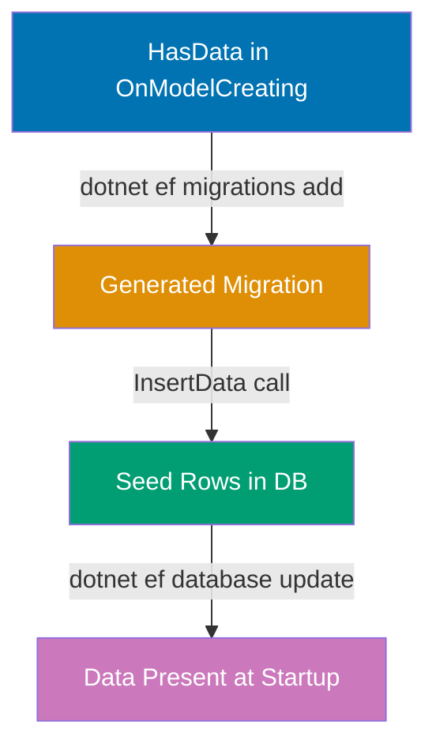
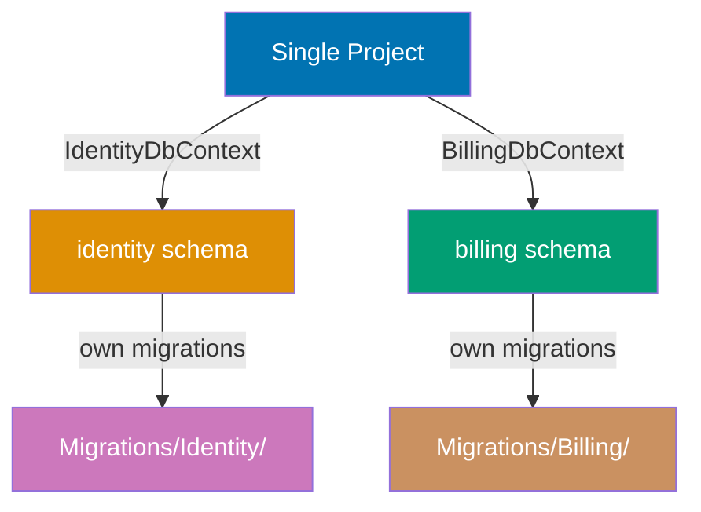
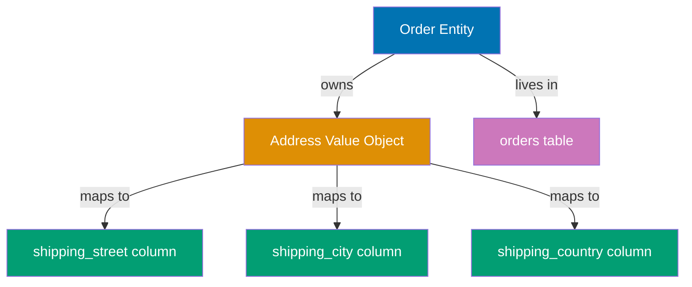
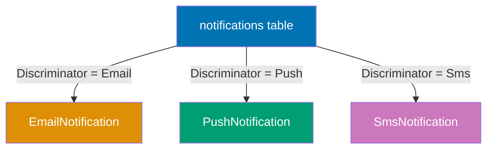
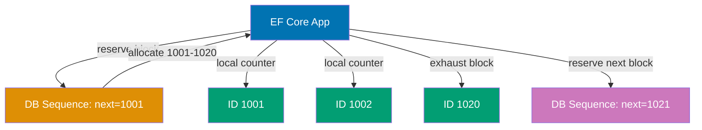

## Intermediate Examples (31-60)

**Coverage**: 40-75% of EF Core Migrations functionality

**Focus**: Data seeding, custom SQL execution, migration bundles, value converters, inheritance strategies, temporal tables, JSON columns, and migration testing patterns.

These examples assume you understand beginner concepts (DbContext setup, basic MigrationBuilder operations, CLI workflow). Each example is self-contained and targets real production patterns.

---

### Example 31: Data Seeding with HasData

`HasData` seeds static reference data directly into the migration pipeline. EF Core generates `INSERT` statements in the migration's `Up()` method and tracks the seeded rows by primary key, so re-running migrations does not duplicate rows.



```csharp
using Microsoft.EntityFrameworkCore;        // => EF Core namespace; provides DbContext, DbSet<T>

namespace MyApp.Infrastructure;

public class RoleModel
{
    public int Id { get; set; }             // => Primary key; int is common for small lookup tables
    public string Name { get; set; } = "";  // => Role name; non-nullable string
}

public class AppDbContext(DbContextOptions<AppDbContext> options) : DbContext(options)
{
    public DbSet<RoleModel> Roles => Set<RoleModel>();
    // => Maps to "Roles" table

    protected override void OnModelCreating(ModelBuilder modelBuilder)
    {
        modelBuilder.Entity<RoleModel>(entity =>
        {
            entity.HasKey(e => e.Id);
            // => Simple int PK; no auto-increment annotation needed (EF infers from int Id)

            entity.Property(e => e.Name).HasMaxLength(50).IsRequired();
            // => VARCHAR(50) NOT NULL

            entity.HasData(
                // => Seeds rows when migration runs; EF generates InsertData() in migration
                // => Rows are tracked by PK; applying migration twice does NOT duplicate
                new RoleModel { Id = 1, Name = "Admin" },
                // => Row: Id=1, Name='Admin'
                new RoleModel { Id = 2, Name = "User" },
                // => Row: Id=2, Name='User'
                new RoleModel { Id = 3, Name = "ReadOnly" }
                // => Row: Id=3, Name='ReadOnly'
            );
        });
    }
}
```

```csharp
// Generated migration contains:
// migrationBuilder.InsertData(
//     table: "Roles",
//     columns: new[] { "Id", "Name" },
//     values: new object[,]
//     {
//         { 1, "Admin" },
//         { 2, "User" },
//         { 3, "ReadOnly" }
//     });
// => SQL: INSERT INTO "Roles" ("Id", "Name") VALUES (1, 'Admin'), (2, 'User'), (3, 'ReadOnly')
// => Down() contains DeleteData() calls that remove these exact rows
```

**Key Takeaway**: Use `HasData` for stable reference data (roles, countries, currencies) that must exist before the application starts; EF tracks seed rows by PK so re-applying migrations is idempotent.

**Why It Matters**: Applications that rely on lookup tables fail at runtime if the seed data is missing. `HasData` ties seed data directly to the migration that creates the table, ensuring a freshly provisioned database is immediately usable without a separate data-loading step. However, `HasData` is unsuitable for large or frequently changing datasets because every change generates a new migration. Use it for stable reference data only.

---

### Example 32: Custom SQL in Migrations (migrationBuilder.Sql)

`migrationBuilder.Sql` executes arbitrary SQL that EF Core cannot express through its fluent API. This is the escape hatch for database-specific features: check constraints, partial indexes, custom functions, or any DDL beyond EF's abstraction.

```csharp
using Microsoft.EntityFrameworkCore.Migrations;  // => MigrationBuilder

namespace MyApp.Migrations;

public partial class AddCheckConstraints : Migration
{
    protected override void Up(MigrationBuilder migrationBuilder)
    {
        // => migrationBuilder.Sql() sends raw SQL to the database driver unchanged
        // => No parameter binding; use for DDL, not DML with user input

        migrationBuilder.Sql(@"
            ALTER TABLE expenses
            ADD CONSTRAINT chk_expenses_amount_positive
            CHECK (amount > 0);
        ");
        // => Adds database-enforced CHECK constraint; rejects amount <= 0 at INSERT/UPDATE time
        // => EF model validation cannot enforce this server-side without a constraint

        migrationBuilder.Sql(@"
            CREATE INDEX ix_expenses_user_category
            ON expenses (user_id, category)
            WHERE deleted_at IS NULL;
        ");
        // => Partial index: only indexes non-deleted rows
        // => Reduces index size; queries with WHERE deleted_at IS NULL use this index efficiently
        // => EF's HasIndex().HasFilter() generates the same SQL; direct SQL is clearer for complex filters
    }

    protected override void Down(MigrationBuilder migrationBuilder)
    {
        // => Down() must manually reverse every SQL statement in Up()
        // => EF cannot auto-generate Down() for raw SQL; you must write it yourself

        migrationBuilder.Sql(@"
            DROP INDEX IF EXISTS ix_expenses_user_category;
        ");
        // => Removes partial index; IF EXISTS prevents error if index was never created

        migrationBuilder.Sql(@"
            ALTER TABLE expenses
            DROP CONSTRAINT IF EXISTS chk_expenses_amount_positive;
        ");
        // => Removes CHECK constraint; IF EXISTS for safe rollback
    }
}
```

**Key Takeaway**: Use `migrationBuilder.Sql` for any database feature EF cannot express fluently; always write a matching `Down()` implementation because EF cannot reverse raw SQL automatically.

**Why It Matters**: Real production schemas use database-native features for performance and data integrity: partial indexes reduce index bloat for soft-delete patterns, check constraints enforce business rules at the storage layer where application-layer validation cannot reach. Without raw SQL access, these optimizations are unavailable. The tradeoff is that raw SQL breaks database portability, so use it intentionally on projects committed to a specific database engine.

---

### Example 33: Transaction Control in Migrations

By default EF Core wraps each migration in a transaction. Set `suppressTransaction: true` on `migrationBuilder.Sql` for PostgreSQL DDL operations that cannot run inside a transaction, such as `CREATE INDEX CONCURRENTLY`.

```csharp
using Microsoft.EntityFrameworkCore.Migrations;  // => MigrationBuilder

namespace MyApp.Migrations;

public partial class AddConcurrentIndex : Migration
{
    // => Override to signal EF Core this migration cannot use a transaction
    public override bool TransactionInvariantMigrations => false;
    // => false = EF will NOT wrap this migration in a transaction
    // => Required for PostgreSQL: CREATE INDEX CONCURRENTLY cannot run inside a transaction

    protected override void Up(MigrationBuilder migrationBuilder)
    {
        migrationBuilder.Sql(
            @"CREATE INDEX CONCURRENTLY IF NOT EXISTS ix_expenses_date
              ON expenses (date);",
            suppressTransaction: true
            // => suppressTransaction: true sends SQL outside any ambient transaction
            // => CONCURRENTLY builds the index without locking the table for writes
            // => Trade-off: takes longer; table remains writable during index creation
        );
        // => Ideal for production tables with heavy write traffic
        // => Regular CREATE INDEX locks the table exclusively; downtime on large tables
    }

    protected override void Down(MigrationBuilder migrationBuilder)
    {
        migrationBuilder.Sql(
            "DROP INDEX CONCURRENTLY IF EXISTS ix_expenses_date;",
            suppressTransaction: true
            // => DROP INDEX CONCURRENTLY also cannot run in a transaction
        );
    }
}
```

**Key Takeaway**: Set `suppressTransaction: true` and override `TransactionInvariantMigrations` to `false` for any PostgreSQL statement that is incompatible with transactions, particularly `CREATE INDEX CONCURRENTLY`.

**Why It Matters**: Applying a regular index migration on a high-traffic production table locks it for the duration of the build—potentially minutes or hours on large tables. `CONCURRENTLY` eliminates that lock but requires running outside a transaction. Missing this detail causes migration failures on production databases under load, often at the worst possible time. Understanding EF Core's transaction wrapping behavior lets you opt out safely.

---

### Example 34: Multiple DbContexts in One Project

Large applications use separate `DbContext` classes to enforce bounded context boundaries. Each context manages its own schema area and generates migrations independently using the `--context` flag.



```csharp
using Microsoft.EntityFrameworkCore;        // => DbContext

namespace MyApp.Infrastructure;

// First bounded context: identity management
public class IdentityDbContext(DbContextOptions<IdentityDbContext> options) : DbContext(options)
{
    // => Manages users and roles; separate from billing concerns
    public DbSet<UserModel> Users => Set<UserModel>();
    public DbSet<RoleModel> Roles => Set<RoleModel>();

    protected override void OnModelCreating(ModelBuilder modelBuilder)
    {
        // => Apply schema prefix to avoid table name collisions
        modelBuilder.HasDefaultSchema("identity");
        // => Tables become: identity.users, identity.roles
    }
}

// Second bounded context: billing domain
public class BillingDbContext(DbContextOptions<BillingDbContext> options) : DbContext(options)
{
    // => Manages invoices and payments; isolated from identity tables
    public DbSet<InvoiceModel> Invoices => Set<InvoiceModel>();

    protected override void OnModelCreating(ModelBuilder modelBuilder)
    {
        modelBuilder.HasDefaultSchema("billing");
        // => Tables become: billing.invoices
    }
}
```

```bash
# Generate migrations for each context separately
dotnet ef migrations add InitialCreate --context IdentityDbContext --output-dir Migrations/Identity
# => Generates Migrations/Identity/20260327_InitialCreate.cs
# => Only includes changes detected in IdentityDbContext model

dotnet ef migrations add InitialCreate --context BillingDbContext --output-dir Migrations/Billing
# => Generates Migrations/Billing/20260327_InitialCreate.cs
# => Only includes changes detected in BillingDbContext model

# Apply each context's migrations independently
dotnet ef database update --context IdentityDbContext
dotnet ef database update --context BillingDbContext
```

**Key Takeaway**: Use `--context` and `--output-dir` flags to manage multiple `DbContext` classes in one project; assign each context a separate schema with `HasDefaultSchema` to prevent table name collisions.

**Why It Matters**: Bounded context separation reduces coupling between domains and allows teams to evolve schema areas independently. Without explicit `--context` targeting, `dotnet ef` picks the first `DbContext` it finds, generating migrations against the wrong model. Schema prefixes (`HasDefaultSchema`) prevent naming conflicts when all contexts share the same PostgreSQL database, which is the common multi-tenant or module pattern in enterprise applications.

---

### Example 35: Migration Bundles (dotnet ef migrations bundle)

A migration bundle is a self-contained executable that applies pending migrations without requiring the .NET SDK or `dotnet ef` tools on the target machine. It bundles the runtime and migration logic into a single binary suitable for CI/CD pipelines and Docker containers.

```bash
# Build migration bundle from project directory
dotnet ef migrations bundle \
  --project src/MyApp \
  --startup-project src/MyApp \
  --output ./deploy/migrate \
  --self-contained \
  --runtime linux-x64
# => Compiles all pending migrations into a self-contained executable
# => --self-contained: includes .NET runtime; no SDK needed on target
# => --runtime linux-x64: target OS; use win-x64 for Windows containers
# => Output: ./deploy/migrate (or migrate.exe on Windows)

# Run bundle against production database
./deploy/migrate --connection "Host=prod-db;Database=myapp;Username=app;Password=secret"
# => Applies all pending migrations to the specified database
# => Same behavior as: dotnet ef database update
# => Exit code 0 = success; non-zero = failure; suitable for CI/CD pipeline checks

# Optional: generate idempotent bundle (safe to run multiple times)
dotnet ef migrations bundle --idempotent --output ./deploy/migrate
# => Wraps each migration in IF NOT EXISTS checks
# => Safe for blue/green deployments where bundle may run on already-migrated DB
```

```csharp
// Programmatic equivalent: applying migrations at startup (alternative pattern)
// In Program.cs or a startup service:

using Microsoft.EntityFrameworkCore;        // => Migrate() extension

// ...in your app startup:
using var scope = app.Services.CreateScope();
// => Creates a DI scope; necessary to resolve scoped services like DbContext
var db = scope.ServiceProvider.GetRequiredService<AppDbContext>();
// => Resolves DbContext from DI; uses connection string from configuration

await db.Database.MigrateAsync();
// => Applies all pending migrations at application startup
// => Equivalent to dotnet ef database update
// => Not recommended for high-availability apps (use migration bundles instead)
// => Suitable for development, single-instance deployments, and integration tests
```

**Key Takeaway**: Use migration bundles for production deployments where the .NET SDK is unavailable; they produce a standalone executable that applies migrations reliably in CI/CD pipelines and container environments.

**Why It Matters**: Container-based deployments typically minimize image size by excluding the .NET SDK. Migration bundles solve this by embedding the migration logic and runtime in a single binary that can run as a Kubernetes init container or Docker Compose dependency before the main application starts. This pattern decouples schema migration from application startup, allowing rollback of a failed deployment without touching the already-applied migrations.

---

### Example 36: Scaffold from Existing DB (dotnet ef dbcontext scaffold)

`dotnet ef dbcontext scaffold` reverse-engineers an existing database into C# entity classes and a `DbContext`. It is the starting point for adding EF Core to a database-first project or legacy system.

```bash
# Scaffold from existing PostgreSQL database
dotnet ef dbcontext scaffold \
  "Host=localhost;Database=legacydb;Username=dev;Password=dev" \
  Npgsql.EntityFrameworkCore.PostgreSQL \
  --output-dir Models/Generated \
  --context-dir Infrastructure \
  --context LegacyDbContext \
  --namespace MyApp.Models \
  --context-namespace MyApp.Infrastructure \
  --no-onconfiguring \
  --data-annotations
# => Connects to legacydb and generates:
# =>   Models/Generated/UsersModel.cs      (entity class per table)
# =>   Infrastructure/LegacyDbContext.cs   (DbContext with all tables)
# => --no-onconfiguring: omits hardcoded connection string from DbContext (security best practice)
# => --data-annotations: uses [Required], [MaxLength] annotations instead of fluent API
# => Without --data-annotations: fluent API in OnModelCreating (default; preferred for complex schemas)

# Re-scaffold to pick up schema changes (overwrites generated files)
dotnet ef dbcontext scaffold ... --force
# => --force: overwrites existing files; use when DB schema has changed
# => Custom code in generated files is LOST on re-scaffold; keep customizations in partial classes
```

```csharp
// Best practice: extend scaffolded entities in partial classes to preserve custom logic
// File: Models/UserModelExtensions.cs (NOT in Generated/ folder)

namespace MyApp.Models;

public partial class UsersModel
{
    // => Partial class extends scaffolded UsersModel without modifying generated file
    // => Generated file can be safely re-scaffolded; this file is untouched

    public string FullDisplayName =>
        string.IsNullOrEmpty(DisplayName) ? Username : DisplayName;
    // => Computed property: not a DB column; derived from scaffolded properties
    // => Survives re-scaffold because it lives in a separate file
}
```

**Key Takeaway**: Use `--no-onconfiguring` to avoid embedding credentials in scaffolded code, and place all customizations in separate partial class files so re-scaffolding does not overwrite them.

**Why It Matters**: Teams inheriting legacy databases need a quick path to EF Core without hand-writing dozens of entity classes. Scaffolding automates the tedious reverse-engineering step but produces files that will be overwritten on schema changes. The partial class pattern is the production-safe way to add domain logic without fighting the code generator. Projects that skip `--no-onconfiguring` accidentally commit database credentials to source control—a common security incident.

---

### Example 37: Column Rename vs Drop/Create (Safe Pattern)

Renaming a column with `RenameColumn` preserves all existing data. Dropping a column and adding a new one loses the data. Always use `RenameColumn` when the intent is a rename, not a schema change.

```csharp
using Microsoft.EntityFrameworkCore.Migrations;  // => MigrationBuilder

namespace MyApp.Migrations;

// CORRECT: rename preserves data
public partial class RenameFileNameColumn : Migration
{
    protected override void Up(MigrationBuilder migrationBuilder)
    {
        migrationBuilder.RenameColumn(
            name: "file_name",           // => Current column name in database
            table: "attachments",        // => Target table
            newName: "filename");        // => New column name
        // => SQL: ALTER TABLE attachments RENAME COLUMN file_name TO filename
        // => All existing data is preserved; only the column name changes
        // => Indexes referencing file_name are automatically updated to filename (PostgreSQL)
    }

    protected override void Down(MigrationBuilder migrationBuilder)
    {
        migrationBuilder.RenameColumn(
            name: "filename",            // => Reverse: new name becomes old
            table: "attachments",
            newName: "file_name");       // => Restores original name
    }
}
```

```csharp
// DANGEROUS ANTI-PATTERN (data loss):
public partial class BadRenameColumn : Migration
{
    protected override void Up(MigrationBuilder migrationBuilder)
    {
        // => DO NOT do this for a rename! This destroys the existing data.
        migrationBuilder.DropColumn(name: "file_name", table: "attachments");
        // => SQL: ALTER TABLE attachments DROP COLUMN file_name
        // => ALL data in file_name column is PERMANENTLY DELETED

        migrationBuilder.AddColumn<string>(
            name: "filename",
            table: "attachments",
            type: "character varying(500)",
            nullable: false,
            defaultValue: "");
        // => New empty column; all previously stored filenames are gone
    }
}
```

**Key Takeaway**: Always use `RenameColumn` for column renames; drop-and-add destroys data and is only appropriate when replacing a column with a fundamentally different type and no data migration path exists.

**Why It Matters**: Data loss from accidental drop-and-add is one of the most common migration mistakes. EF Core's diff engine sometimes generates drop-and-add when it detects both a rename and a type change simultaneously—always review generated migrations before applying. On production databases, dropped column data is unrecoverable unless a backup exists. The `RenameColumn` API makes the intent explicit and generates the correct, safe SQL.

---

### Example 38: Owned Types (Value Objects)

Owned types map a C# value object directly into the owning entity's table as flattened columns. No separate table or foreign key is needed. They represent the DDD Value Object pattern in EF Core.



```csharp
using Microsoft.EntityFrameworkCore;        // => DbContext, OwnsOne

namespace MyApp.Domain;

// Value object: no identity, defined by its values
public record Address(
    string Street,    // => Street line; immutable record property
    string City,      // => City; immutable
    string Country    // => ISO country code; immutable
);

public class OrderModel
{
    public Guid Id { get; set; }            // => Primary key
    public string CustomerName { get; set; } = "";
    public Address ShippingAddress { get; set; } = null!;
    // => Owned type; EF stores this as flattened columns in orders table
    // => Not a navigation property to a separate table; no foreign key
}

public class AppDbContext(DbContextOptions<AppDbContext> options) : DbContext(options)
{
    public DbSet<OrderModel> Orders => Set<OrderModel>();

    protected override void OnModelCreating(ModelBuilder modelBuilder)
    {
        modelBuilder.Entity<OrderModel>(entity =>
        {
            entity.HasKey(e => e.Id);

            entity.OwnsOne(e => e.ShippingAddress, address =>
            {
                // => Configures Address as owned type; flattened into orders table
                address.Property(a => a.Street)
                    .HasColumnName("shipping_street")       // => Column: shipping_street
                    .HasMaxLength(200)
                    .IsRequired();
                address.Property(a => a.City)
                    .HasColumnName("shipping_city")         // => Column: shipping_city
                    .HasMaxLength(100)
                    .IsRequired();
                address.Property(a => a.Country)
                    .HasColumnName("shipping_country")      // => Column: shipping_country
                    .HasMaxLength(3)
                    .IsRequired();
            });
            // => Generated columns: shipping_street, shipping_city, shipping_country
            // => All in the orders table; no join needed to read Address
        });
    }
}
```

**Key Takeaway**: Use `OwnsOne` to map DDD value objects as flattened columns in the owner's table, eliminating a join while keeping the C# model clean and expressive.

**Why It Matters**: Value objects in DDD have no identity—an address is just a group of related data. Storing them in a separate table adds an unnecessary join and artificial identity. Owned types store them inline with the owning entity, matching the conceptual model exactly. The query performance benefit is real: reading an order with its address requires one SELECT instead of two. EF Core handles the flattening automatically, and migrations accurately reflect the resulting column structure.

---

### Example 39: Value Converters

Value converters translate between CLR types and database column types. They allow storing enums as strings, custom structs as JSON, or domain primitives as plain SQL types, without changing the entity model.

```csharp
using Microsoft.EntityFrameworkCore;        // => DbContext
using Microsoft.EntityFrameworkCore.Storage.ValueConversion;  // => ValueConverter<TModel, TProvider>

namespace MyApp.Infrastructure;

// Domain enum: status of an expense
public enum ExpenseStatus { Draft, Submitted, Approved, Rejected }

public class ExpenseModel
{
    public Guid Id { get; set; }
    public ExpenseStatus Status { get; set; }
    // => CLR type: ExpenseStatus (enum)
    // => Database type: varchar(20) string after converter is applied
}

public class AppDbContext(DbContextOptions<AppDbContext> options) : DbContext(options)
{
    public DbSet<ExpenseModel> Expenses => Set<ExpenseModel>();

    protected override void OnModelCreating(ModelBuilder modelBuilder)
    {
        modelBuilder.Entity<ExpenseModel>(entity =>
        {
            entity.HasKey(e => e.Id);

            entity.Property(e => e.Status)
                .HasConversion(
                    v => v.ToString(),
                    // => Write converter: ExpenseStatus enum to string ("Draft", "Submitted", etc.)
                    // => Stored in DB as human-readable string; readable without code reference
                    v => Enum.Parse<ExpenseStatus>(v)
                    // => Read converter: string to ExpenseStatus enum
                    // => Throws InvalidOperationException if DB contains unknown value
                )
                .HasColumnType("character varying(20)")
                // => Explicit column type; without this EF uses TEXT
                .IsRequired();
                // => NOT NULL; every expense has a status
        });
    }
}
```

```csharp
// Alternative: built-in converter for enum-to-string
// More concise; EF Core 5+ built-in
modelBuilder.Entity<ExpenseModel>()
    .Property(e => e.Status)
    .HasConversion<string>()
    // => Shorthand for enum-to-string conversion; uses enum name automatically
    .HasMaxLength(20);
    // => Still need to set max length; HasConversion<string>() does not infer it
```

**Key Takeaway**: Use value converters to bridge the gap between your C# domain model and the database representation; prefer string storage for enums to make the database readable without referring to code.

**Why It Matters**: Storing enums as integers (the EF default) creates unreadable database columns—`status = 2` tells a DBA nothing without the source code. String storage makes the database self-documenting and prevents ordinal-shift bugs when enum values are reordered. Value converters also enable domain primitives (strongly-typed IDs, money amounts) to map to native SQL types, keeping both C# and SQL clean while avoiding magic numbers.

---

### Example 40: Table Splitting

Table splitting maps multiple entity types to the same database table. It models a one-to-one relationship where related data lives in one table but is loaded separately on demand, useful for separating a heavy blob column from the rest of an entity.

```csharp
using Microsoft.EntityFrameworkCore;        // => DbContext

namespace MyApp.Infrastructure;

// Main entity: lightweight, always loaded
public class AttachmentMetadata
{
    public Guid Id { get; set; }
    public string Filename { get; set; } = "";
    // => filename column; returned on list queries
    public string ContentType { get; set; } = "";
    // => content_type column
    public long SizeBytes { get; set; }
    // => size_bytes column; small, safe to load always

    public AttachmentContent? Content { get; set; }
    // => Navigation to the heavy part; null until explicitly loaded
}

// Split entity: heavy data, loaded only when needed
public class AttachmentContent
{
    public Guid Id { get; set; }
    // => Same PK as AttachmentMetadata; shared primary key = same table row
    public byte[] Data { get; set; } = Array.Empty<byte>();
    // => data column; potentially megabytes; not loaded on list queries

    public AttachmentMetadata? Metadata { get; set; }
    // => Navigation back to metadata half
}

public class AppDbContext(DbContextOptions<AppDbContext> options) : DbContext(options)
{
    public DbSet<AttachmentMetadata> Attachments => Set<AttachmentMetadata>();

    protected override void OnModelCreating(ModelBuilder modelBuilder)
    {
        modelBuilder.Entity<AttachmentMetadata>(entity =>
        {
            entity.ToTable("attachments");
            // => Map AttachmentMetadata to "attachments" table

            entity.HasOne(e => e.Content)
                .WithOne(c => c.Metadata)
                .HasForeignKey<AttachmentContent>(c => c.Id);
            // => One-to-one relationship; AttachmentContent uses same PK value
        });

        modelBuilder.Entity<AttachmentContent>(entity =>
        {
            entity.ToTable("attachments");
            // => Map AttachmentContent to the SAME "attachments" table
            // => Same table name = table splitting; one row, two C# objects
        });
    }
}
```

**Key Takeaway**: Use table splitting to keep expensive columns (BLOBs, large JSON) out of the default projection while mapping both entities to the same underlying table row.

**Why It Matters**: Fetching megabyte-sized binary columns on every list query causes severe performance degradation. Table splitting addresses this without denormalizing the schema: metadata queries retrieve the fast columns, and a separate explicit load retrieves the blob only when the caller needs it. This pattern appears frequently with file attachments, audit payloads, and document content stored in PostgreSQL `bytea` or `text` columns.

---

### Example 41: TPH Inheritance (Table Per Hierarchy)

Table Per Hierarchy (TPH) stores all derived types in one table with a discriminator column that identifies which type each row represents. It is the EF Core default inheritance strategy.



```csharp
using Microsoft.EntityFrameworkCore;        // => DbContext

namespace MyApp.Domain;

// Base type: shared columns in the single notifications table
public abstract class NotificationBase
{
    public Guid Id { get; set; }
    public string Recipient { get; set; } = "";
    // => recipient column; present in all notification types
    public string Message { get; set; } = "";
    // => message column; shared across all types
    public DateTimeOffset SentAt { get; set; }
    // => sent_at column; common audit field
}

// Derived type 1: email-specific columns
public class EmailNotification : NotificationBase
{
    public string Subject { get; set; } = "";
    // => subject column; NULL for non-email rows (TPH: all types share one table)
}

// Derived type 2: push-specific columns
public class PushNotification : NotificationBase
{
    public string DeviceToken { get; set; } = "";
    // => device_token column; NULL for non-push rows
}

public class AppDbContext(DbContextOptions<AppDbContext> options) : DbContext(options)
{
    public DbSet<NotificationBase> Notifications => Set<NotificationBase>();
    // => Single DbSet for the whole hierarchy; EF adds Discriminator column

    protected override void OnModelCreating(ModelBuilder modelBuilder)
    {
        modelBuilder.Entity<NotificationBase>(entity =>
        {
            entity.ToTable("notifications");
            // => Single table for entire hierarchy

            entity.HasDiscriminator<string>("notification_type")
            // => Adds notification_type VARCHAR column; EF writes "Email", "Push" per HasValue
            // => HasValue<T> maps each derived type to its discriminator string
                .HasValue<EmailNotification>("Email")
                // => notification_type = 'Email' for EmailNotification rows
                .HasValue<PushNotification>("Push");
                // => notification_type = 'Push' for PushNotification rows

            entity.Property<string>("notification_type").HasMaxLength(20);
            // => Bound discriminator column to VARCHAR(20); default is TEXT
        });
    }
}
```

**Key Takeaway**: TPH stores the entire class hierarchy in one table using a discriminator column; it is the fastest strategy for polymorphic queries but results in nullable columns for all subtype-specific properties.

**Why It Matters**: TPH excels when you query the base type frequently—`context.Notifications.Where(...)` scans one table without joins. The cost is nullable columns for derived-type fields and a wider table. For hierarchies with many subtype-specific columns or strict NOT NULL requirements on derived properties, TPT or TPC are better fits. TPH is the EF Core default precisely because it performs well for most common polymorphism patterns.

---

### Example 42: TPT Inheritance (Table Per Type)

Table Per Type (TPT) maps each entity in the hierarchy to its own table. Derived tables contain only their specific columns and share the primary key with the base table via a foreign key.

```csharp
using Microsoft.EntityFrameworkCore;        // => DbContext

namespace MyApp.Domain;

// Base type: maps to "payments" table
public abstract class PaymentBase
{
    public Guid Id { get; set; }
    public decimal Amount { get; set; }
    // => amount column in payments table; shared
    public DateTimeOffset PaidAt { get; set; }
    // => paid_at column in payments table; shared
}

// Derived type: maps to "card_payments" table (plus "payments" via FK)
public class CardPayment : PaymentBase
{
    public string CardLast4 { get; set; } = "";
    // => card_last4 column in card_payments table only
    public string CardBrand { get; set; } = "";
    // => card_brand column in card_payments table only
}

// Derived type: maps to "bank_transfers" table
public class BankTransfer : PaymentBase
{
    public string AccountNumber { get; set; } = "";
    // => account_number column in bank_transfers table only
    public string BankCode { get; set; } = "";
    // => bank_code column in bank_transfers table only
}

public class AppDbContext(DbContextOptions<AppDbContext> options) : DbContext(options)
{
    public DbSet<PaymentBase> Payments => Set<PaymentBase>();

    protected override void OnModelCreating(ModelBuilder modelBuilder)
    {
        modelBuilder.Entity<PaymentBase>().ToTable("payments");
        // => Base columns in "payments" table; Id, Amount, PaidAt

        modelBuilder.Entity<CardPayment>().ToTable("card_payments");
        // => CardPayment-specific columns in "card_payments"
        // => card_payments.Id is FK to payments.Id (shared PK pattern)

        modelBuilder.Entity<BankTransfer>().ToTable("bank_transfers");
        // => BankTransfer-specific columns in "bank_transfers"
        // => bank_transfers.Id is FK to payments.Id

        // => Loading a CardPayment: JOIN payments + card_payments on Id
        // => No nullable columns; each table has only its own columns (fully normalized)
    }
}
```

**Key Takeaway**: TPT normalizes the hierarchy across multiple tables—no nullable columns for derived properties—but requires a JOIN per level on every query, making it slower than TPH for large datasets.

**Why It Matters**: TPT is the right choice when derived types have many non-nullable columns that would be NULL for unrelated types in TPH, making the schema cleaner and enforcing NOT NULL constraints properly. The JOIN cost is acceptable for low-volume, strongly-typed domains like payment methods or document types. Avoid TPT for high-read-volume polymorphic tables where the extra join materializes into meaningful query time.

---

### Example 43: TPC Inheritance (Table Per Concrete Type)

Table Per Concrete Type (TPC) maps each concrete class to its own independent table with all inherited columns inlined. No base table exists, and no joins are needed to read a concrete type.

```csharp
using Microsoft.EntityFrameworkCore;        // => DbContext, UseTpcMappingStrategy

namespace MyApp.Domain;

public abstract class VehicleBase
{
    public Guid Id { get; set; }
    public string Make { get; set; } = "";   // => Duplicated in each concrete table
    public string Model { get; set; } = "";  // => Duplicated in each concrete table
    public int Year { get; set; }            // => Duplicated in each concrete table
}

public class Car : VehicleBase
{
    public int DoorCount { get; set; }
    // => door_count column; only in cars table
}

public class Truck : VehicleBase
{
    public decimal PayloadTonnes { get; set; }
    // => payload_tonnes column; only in trucks table
}

public class AppDbContext(DbContextOptions<AppDbContext> options) : DbContext(options)
{
    public DbSet<Car> Cars => Set<Car>();
    public DbSet<Truck> Trucks => Set<Truck>();

    protected override void OnModelCreating(ModelBuilder modelBuilder)
    {
        modelBuilder.Entity<VehicleBase>()
            .UseTpcMappingStrategy();
        // => Instructs EF to use TPC; no base table is created for VehicleBase
        // => Each concrete type gets its own table with ALL columns (inherited + own)

        modelBuilder.Entity<Car>().ToTable("cars");
        // => cars table: id, make, model, year, door_count
        // => No foreign key to a vehicle base table; fully self-contained

        modelBuilder.Entity<Truck>().ToTable("trucks");
        // => trucks table: id, make, model, year, payload_tonnes
        // => Completely independent from cars table

        // => TPC requires database-generated IDs to be globally unique across all concrete tables
        // => Use Guid PKs (random) or a HiLo sequence; do NOT use IDENTITY/SERIAL (overlapping ints)
        modelBuilder.Entity<VehicleBase>()
            .Property(v => v.Id)
            .HasDefaultValueSql("gen_random_uuid()");
        // => PostgreSQL function generates a UUID at INSERT time
        // => Prevents PK collisions across the cars and trucks tables
    }
}
```

**Key Takeaway**: TPC stores each concrete type in its own independent table with all columns inlined, delivering the fastest single-type queries and proper NOT NULL constraints, but requiring globally unique PKs and making cross-type polymorphic queries expensive.

**Why It Matters**: TPC is optimal when you almost never query the base type polymorphically—you always query `Cars` or `Trucks` directly. Reading a `Car` hits one table with no joins, and the table has no nullable columns. The constraint is cross-type queries: `SELECT * FROM vehicles` requires a `UNION ALL` across all concrete tables, which EF Core handles but can be slow. TPC also makes PK uniqueness a hard requirement, ruling out integer sequences that restart per table.

---

### Example 44: Migration Squashing

Migration squashing collapses a long chain of migrations into a single baseline migration. It reduces startup time, simplifies history, and removes obsolete `Up()`/`Down()` implementations that no longer matter.

```bash
# Step 1: ensure all migrations are applied to your reference database
dotnet ef database update
# => Reference DB is now at the latest migration

# Step 2: remove all existing migration files (after backing up!)
# => Only do this if every deployed environment is at the latest migration
# => Never squash if any environment is behind

# Step 3: generate a new baseline migration from the current model state
dotnet ef migrations add Baseline
# => Creates a single migration representing the ENTIRE current schema
# => Equivalent to all previous migrations applied in sequence
# => AppDbContextModelSnapshot.cs is regenerated from current model (unchanged semantically)

# Step 4: mark the baseline migration as already applied on existing databases
# => Manually insert the baseline migration into __EFMigrationsHistory
```

```csharp
// Mark an existing database as already at the baseline without running Up()
// Run this SQL on all existing environments before deploying the squashed codebase:
//
// INSERT INTO "__EFMigrationsHistory" ("MigrationId", "ProductVersion")
// VALUES ('20260327000000_Baseline', '9.0.0');
// => Tells EF Core this migration is already applied; Up() will not run
// => All prior migration rows should already be present (from the original history)
//
// After squashing: new environments run only the Baseline migration
// Existing environments: Baseline is pre-marked as applied; no SQL runs
```

**Key Takeaway**: Squash migrations by creating a single `Baseline` migration from the current model state, then manually inserting its `MigrationId` into `__EFMigrationsHistory` on existing databases to prevent re-applying already-applied schema changes.

**Why It Matters**: Projects accumulate dozens or hundreds of migrations over years. Applying all of them on a fresh database takes measurable time and risks failures from obsolete SQL. Squashing to a baseline reduces provisioning to a single migration while preserving the correct final schema. The critical constraint is that all environments must be at the latest migration before squashing; any environment behind the baseline has no migration path forward after the old files are deleted.

---

### Example 45: Idempotent Scripts

Idempotent migration scripts wrap each migration in a conditional check against `__EFMigrationsHistory`. Running the script multiple times is safe because already-applied migrations are skipped.

```bash
# Generate idempotent SQL script covering all migrations
dotnet ef migrations script \
  --idempotent \
  --output ./deploy/schema.sql
# => Generates SQL with IF NOT EXISTS guards around each migration
# => Safe to run on any database regardless of current migration level
# => --idempotent wraps each migration block:
# =>   IF NOT EXISTS (SELECT 1 FROM "__EFMigrationsHistory" WHERE "MigrationId" = '...')
# =>   BEGIN ... END

# Generate script from a specific migration to HEAD
dotnet ef migrations script FromMigration
# => Generates SQL starting from FromMigration (exclusive) to latest
# => Use after squashing: generate from Baseline to deploy only new migrations

# Apply script to production via psql (common in CI/CD pipelines)
psql "$DATABASE_URL" -f ./deploy/schema.sql
# => psql reads and executes the SQL file
# => Idempotent: running this command twice has the same effect as running once
```

```sql
-- Example of what idempotent script looks like for one migration:
DO $$
BEGIN
    IF NOT EXISTS (
        SELECT 1 FROM "__EFMigrationsHistory"
        WHERE "MigrationId" = '20260327000000_InitialCreate'
    ) THEN
        -- => Migration SQL runs only if MigrationId not yet in history table
        CREATE TABLE users (
            id UUID NOT NULL,
            email VARCHAR(255) NOT NULL,
            CONSTRAINT pk_users PRIMARY KEY (id)
        );

        INSERT INTO "__EFMigrationsHistory" ("MigrationId", "ProductVersion")
        VALUES ('20260327000000_InitialCreate', '9.0.0');
        -- => Records migration as applied; subsequent runs skip this block
    END IF;
END $$;
```

**Key Takeaway**: Generate idempotent scripts with `--idempotent` for deployment pipelines that may run the script on databases at any migration level; each migration block runs only if not already recorded in `__EFMigrationsHistory`.

**Why It Matters**: CI/CD pipelines often cannot guarantee a database's exact migration state at deploy time, especially in multi-region setups or after failed partial deployments. Idempotent scripts eliminate the need to track which migration to run from, making them safe to run as part of every deployment regardless of current state. This is the production-standard approach for PostgreSQL deployments with `psql` or flyway-style pipelines.

---

### Example 46: Connection Resiliency in Migrations

PostgreSQL connections can fail transiently during migrations on cloud-managed databases. EF Core's retry policy automatically retries failed operations with exponential back-off.

```csharp
using Microsoft.EntityFrameworkCore;        // => DbContext, UseNpgsql

namespace MyApp.Infrastructure;

public static class DbContextExtensions
{
    public static IServiceCollection AddAppDbContext(
        this IServiceCollection services,
        string connectionString)
    {
        services.AddDbContext<AppDbContext>(options =>
        {
            options.UseNpgsql(
                connectionString,
                npgsqlOptions =>
                {
                    npgsqlOptions.EnableRetryOnFailure(
                        maxRetryCount: 5,
                        // => Retry up to 5 times before giving up
                        // => Each retry doubles the wait time (exponential back-off)
                        maxRetryDelay: TimeSpan.FromSeconds(30),
                        // => Maximum wait between retries: 30 seconds
                        // => Prevents indefinite blocking on a hard failure
                        errorCodesToAdd: null
                        // => null: retry on default transient error codes
                        // => Pass custom Npgsql error codes to extend the retry set
                    );
                    // => Retry policy applies to all operations including migrations
                    // => Retries on: connection reset, timeout, server restart
                }
            );
        });
        return services;
    }
}
```

```csharp
// Applying migrations with retry at startup (e.g., in a migration init container)
public static async Task ApplyMigrationsWithRetryAsync(IServiceProvider services)
{
    var retryCount = 0;
    const int maxRetries = 10;
    // => Outer loop handles database not yet accepting connections (container startup race)

    while (retryCount < maxRetries)
    {
        try
        {
            using var scope = services.CreateScope();
            var db = scope.ServiceProvider.GetRequiredService<AppDbContext>();
            await db.Database.MigrateAsync();
            // => Applies pending migrations; uses the registered retry policy
            return; // => Success; exit loop
        }
        catch (Exception ex) when (retryCount < maxRetries - 1)
        {
            retryCount++;
            // => Log ex; wait before retry
            await Task.Delay(TimeSpan.FromSeconds(Math.Pow(2, retryCount)));
            // => Exponential back-off: 2s, 4s, 8s, 16s...
        }
    }
}
```

**Key Takeaway**: Configure `EnableRetryOnFailure` on the Npgsql provider to handle transient connection failures during migrations; add an outer retry loop in init containers where the database itself may not be ready yet.

**Why It Matters**: Cloud-managed PostgreSQL databases (AWS RDS, Azure Database, Google Cloud SQL) perform routine failovers, maintenance windows, and connection resets that appear as transient errors. Without a retry policy, a migration running during a brief failover fails permanently and leaves the schema partially applied. EF Core's built-in retry policy handles the most common cases; the outer loop in init containers handles the container-startup race condition where the database pod is not yet accepting connections.

---

### Example 47: Creating Views

Database views can be created in migrations using `migrationBuilder.Sql`. EF Core can then query views as if they were tables by mapping a keyless entity type to the view name.

```csharp
using Microsoft.EntityFrameworkCore.Migrations;  // => MigrationBuilder

namespace MyApp.Migrations;

public partial class AddExpenseSummaryView : Migration
{
    protected override void Up(MigrationBuilder migrationBuilder)
    {
        migrationBuilder.Sql(@"
            CREATE OR REPLACE VIEW expense_summary AS
            SELECT
                user_id,
                -- => Group expenses by user
                category,
                -- => And by category within each user
                SUM(amount) AS total_amount,
                -- => Aggregated total for the user+category combination
                COUNT(*) AS expense_count,
                -- => Number of expenses in this category
                MAX(date) AS latest_date
                -- => Most recent expense date; useful for sorting
            FROM expenses
            WHERE deleted_at IS NULL
            -- => Exclude soft-deleted records from the summary
            GROUP BY user_id, category;
        ");
        // => CREATE OR REPLACE VIEW: safe to re-run; replaces if view already exists
    }

    protected override void Down(MigrationBuilder migrationBuilder)
    {
        migrationBuilder.Sql("DROP VIEW IF EXISTS expense_summary;");
        // => IF EXISTS: safe rollback even if view was never created
    }
}
```

```csharp
// Keyless entity: maps to the view for read-only queries
public class ExpenseSummaryView
{
    public Guid UserId { get; set; }            // => user_id column from view
    public string Category { get; set; } = "";  // => category column
    public decimal TotalAmount { get; set; }    // => total_amount column
    public int ExpenseCount { get; set; }       // => expense_count column
    public DateOnly LatestDate { get; set; }    // => latest_date column
}

// Configure in OnModelCreating:
// modelBuilder.Entity<ExpenseSummaryView>(entity =>
// {
//     entity.HasNoKey();                    // => No primary key; read-only view
//     entity.ToView("expense_summary");     // => Maps to the view, not a table
// });
//
// Query: context.Set<ExpenseSummaryView>().Where(v => v.UserId == userId).ToListAsync()
// => SQL: SELECT * FROM expense_summary WHERE user_id = @p0
```

**Key Takeaway**: Create views in migrations with `migrationBuilder.Sql` and expose them in EF Core as keyless entities using `HasNoKey()` and `ToView()`—this provides compile-time safety for view column names without materializing a table.

**Why It Matters**: Views encapsulate complex aggregation logic at the database layer, eliminating the need to duplicate that logic in every application query. Mapping them as keyless entities gives C# type safety on the view's columns and lets EF Core compose LINQ predicates on top of the view (which PostgreSQL can often push down into the view query). Using `CREATE OR REPLACE VIEW` in migrations makes the definition auditable in source control alongside the schema it depends on.

---

### Example 48: Creating Materialized Views (raw SQL)

Materialized views pre-compute and store query results in PostgreSQL. They improve read performance for expensive aggregations but require explicit refresh. EF Core has no built-in API for materialized views; use `migrationBuilder.Sql` directly.

```csharp
using Microsoft.EntityFrameworkCore.Migrations;  // => MigrationBuilder

namespace MyApp.Migrations;

public partial class AddMaterializedExpenseView : Migration
{
    protected override void Up(MigrationBuilder migrationBuilder)
    {
        migrationBuilder.Sql(@"
            CREATE MATERIALIZED VIEW IF NOT EXISTS mv_expense_totals AS
            SELECT
                user_id,
                -- => Partition results by user
                DATE_TRUNC('month', date) AS month,
                -- => Truncate date to first of month; groups by calendar month
                SUM(amount) AS monthly_total,
                -- => Pre-computed sum; stored on disk, not recalculated on each query
                COUNT(*) AS expense_count
            FROM expenses
            WHERE deleted_at IS NULL
            GROUP BY user_id, DATE_TRUNC('month', date)
            WITH DATA;
            -- => WITH DATA: populate the view immediately on creation
            -- => WITHOUT DATA: create empty view; must REFRESH before querying
        ");
        // => Result set is stored as a physical table on disk
        // => Reads: instant (no aggregation at query time)
        // => Freshness: stale until REFRESH MATERIALIZED VIEW is called

        migrationBuilder.Sql(@"
            CREATE UNIQUE INDEX IF NOT EXISTS uidx_mv_expense_totals_user_month
            ON mv_expense_totals (user_id, month);
        ");
        // => Unique index on materialized view enables CONCURRENT refresh
        // => REFRESH MATERIALIZED VIEW CONCURRENTLY requires a unique index
        // => Without this index: CONCURRENTLY option is unavailable
    }

    protected override void Down(MigrationBuilder migrationBuilder)
    {
        migrationBuilder.Sql("DROP MATERIALIZED VIEW IF EXISTS mv_expense_totals;");
        // => Drops view and its index; IF EXISTS for safe rollback
    }
}
```

**Key Takeaway**: Use materialized views for expensive aggregations that tolerate some staleness; create a unique index on the materialized view to enable `REFRESH MATERIALIZED VIEW CONCURRENTLY`, which avoids locking readers during refresh.

**Why It Matters**: Monthly spending summaries, leaderboards, and analytics dashboards often re-aggregate millions of rows on every request. A materialized view moves that cost to a scheduled refresh (e.g., nightly or hourly), returning pre-computed results in milliseconds. The `CONCURRENTLY` refresh option is critical in production—without it, a lock prevents all reads during the refresh operation. The unique index is the prerequisite that enables concurrent refresh.

---

### Example 49: Trigger Functions (raw SQL)

PostgreSQL trigger functions execute automatically on `INSERT`, `UPDATE`, or `DELETE` events. They enforce audit trails, cascade updates, and business rules at the database layer. EF Core has no trigger API; use `migrationBuilder.Sql`.

```csharp
using Microsoft.EntityFrameworkCore.Migrations;  // => MigrationBuilder

namespace MyApp.Migrations;

public partial class AddAuditTrigger : Migration
{
    protected override void Up(MigrationBuilder migrationBuilder)
    {
        // Step 1: create the trigger function
        migrationBuilder.Sql(@"
            CREATE OR REPLACE FUNCTION fn_set_updated_at()
            RETURNS TRIGGER AS $$
            -- => RETURNS TRIGGER: mandatory return type for trigger functions
            BEGIN
                NEW.updated_at = NOW();
                -- => NEW: the row being inserted or updated
                -- => Sets updated_at to current timestamp on every update
                -- => NOW() returns TIMESTAMPTZ with session timezone
                RETURN NEW;
                -- => Return the modified row; trigger replaces the original with this value
            END;
            $$ LANGUAGE plpgsql;
            -- => plpgsql: PostgreSQL procedural language for trigger functions
        ");

        // Step 2: attach the trigger to the expenses table
        migrationBuilder.Sql(@"
            CREATE OR REPLACE TRIGGER trg_expenses_set_updated_at
            BEFORE UPDATE ON expenses
            -- => BEFORE UPDATE: fires before the UPDATE writes to disk
            -- => Allows modifying NEW before it is stored
            FOR EACH ROW
            -- => Fires once per updated row (not once per statement)
            EXECUTE FUNCTION fn_set_updated_at();
            -- => Calls the trigger function defined above
        ");
        // => Result: every UPDATE on expenses automatically sets updated_at = NOW()
        // => Application code does not need to set updated_at manually
    }

    protected override void Down(MigrationBuilder migrationBuilder)
    {
        migrationBuilder.Sql("DROP TRIGGER IF EXISTS trg_expenses_set_updated_at ON expenses;");
        // => Must drop trigger before dropping its function
        migrationBuilder.Sql("DROP FUNCTION IF EXISTS fn_set_updated_at();");
    }
}
```

**Key Takeaway**: Define trigger functions in migrations to automate audit columns and enforce invariants at the database layer; always drop triggers before their functions in `Down()` to avoid dependency errors during rollback.

**Why It Matters**: `updated_at` columns set at the application layer are unreliable—raw SQL updates, database tools, and concurrent transactions can all bypass the application. A `BEFORE UPDATE` trigger guarantees the column is always accurate regardless of how the row was modified. Triggers are powerful but opaque: their logic is invisible to EF Core's change tracker, so keep trigger logic simple and document it in the migration that creates it.

---

### Example 50: Stored Procedures (raw SQL)

Stored procedures encapsulate complex multi-step business logic in the database. EF Core can execute them via `ExecuteSqlRawAsync` for commands or map results to entities for queries.

```csharp
using Microsoft.EntityFrameworkCore.Migrations;  // => MigrationBuilder

namespace MyApp.Migrations;

public partial class AddArchiveExpensesProcedure : Migration
{
    protected override void Up(MigrationBuilder migrationBuilder)
    {
        migrationBuilder.Sql(@"
            CREATE OR REPLACE PROCEDURE archive_old_expenses(
                p_cutoff_date DATE,
                -- => Parameter: expenses older than this date are archived
                OUT p_archived_count INT
                -- => OUT parameter: returns the count of archived rows to caller
            )
            LANGUAGE plpgsql
            AS $$
            BEGIN
                WITH archived AS (
                    UPDATE expenses
                    SET deleted_at = NOW(),
                        deleted_by = 'archive_job'
                    -- => Soft-delete: set deleted_at instead of physical DELETE
                    WHERE date < p_cutoff_date
                      AND deleted_at IS NULL
                    -- => Only archive non-deleted expenses older than cutoff
                    RETURNING id
                    -- => RETURNING captures the affected row IDs
                )
                SELECT COUNT(*) INTO p_archived_count FROM archived;
                -- => Count archived rows; return via OUT parameter
                COMMIT;
                -- => Explicit COMMIT inside procedure; PostgreSQL procedures support transactions
            END;
            $$;
        ");
    }

    protected override void Down(MigrationBuilder migrationBuilder)
    {
        migrationBuilder.Sql("DROP PROCEDURE IF EXISTS archive_old_expenses(DATE, INOUT INT);");
        // => Include parameter types in DROP; PostgreSQL uses parameter types to identify overloads
    }
}
```

```csharp
// Call the stored procedure from EF Core
var archivedCount = new NpgsqlParameter("p_archived_count", NpgsqlTypes.NpgsqlDbType.Integer)
{
    Direction = System.Data.ParameterDirection.Output
    // => Mark as output parameter; value is populated after CALL
};

await context.Database.ExecuteSqlRawAsync(
    "CALL archive_old_expenses({0}, {1})",
    new DateOnly(2025, 1, 1),   // => p_cutoff_date: archive expenses before 2025
    archivedCount               // => p_archived_count: OUT parameter
);
// => Executes: CALL archive_old_expenses('2025-01-01', NULL)
// => After call: archivedCount.Value contains the number of archived rows

var count = (int)archivedCount.Value!;
// => count = number of rows soft-deleted by the procedure
```

**Key Takeaway**: Create stored procedures in migrations with `migrationBuilder.Sql` and invoke them from EF Core using `ExecuteSqlRawAsync` with appropriately typed `NpgsqlParameter` objects; include parameter types in `DROP PROCEDURE` to resolve overload ambiguity.

**Why It Matters**: Complex bulk operations (archiving, data migration, multi-table updates) benefit from stored procedures because they execute entirely within the database engine without round-tripping data to the application. Procedures with `COMMIT` can also manage their own transactions, independent of the EF Core unit of work. The tradeoff is that procedure logic lives outside version-controlled C# code—migrations address this by treating procedure DDL as a first-class schema artifact.

---

### Example 51: JSON Columns (ToJson)

EF Core 7+ maps a C# object to a PostgreSQL `jsonb` column using `OwnsOne(...).ToJson()`. The entire object graph serializes to a single column; EF Core generates SQL predicates directly against JSON paths.

```csharp
using Microsoft.EntityFrameworkCore;        // => DbContext, ToJson

namespace MyApp.Domain;

// The JSON-stored type; no separate table
public class NotificationPreferences
{
    public bool EmailEnabled { get; set; }       // => JSON key: EmailEnabled
    public bool PushEnabled { get; set; }        // => JSON key: PushEnabled
    public string Timezone { get; set; } = "";   // => JSON key: Timezone
    public List<string> Categories { get; set; } = [];
    // => JSON key: Categories; stored as JSON array
}

public class UserModel
{
    public Guid Id { get; set; }
    public string Email { get; set; } = "";
    public NotificationPreferences Preferences { get; set; } = new();
    // => Mapped to a single jsonb column; not a navigation to another table
}

public class AppDbContext(DbContextOptions<AppDbContext> options) : DbContext(options)
{
    public DbSet<UserModel> Users => Set<UserModel>();

    protected override void OnModelCreating(ModelBuilder modelBuilder)
    {
        modelBuilder.Entity<UserModel>(entity =>
        {
            entity.HasKey(e => e.Id);

            entity.OwnsOne(e => e.Preferences, prefs =>
            {
                prefs.ToJson();
                // => Stores NotificationPreferences as a jsonb column named "Preferences"
                // => Column type: jsonb (binary JSON; supports GIN indexing, JSON operators)
                // => EF serializes/deserializes automatically using System.Text.Json
            });
        });
    }
}
```

```csharp
// Query with JSON predicate (EF Core translates to jsonb operator)
var usersWithEmail = await context.Users
    .Where(u => u.Preferences.EmailEnabled)
    // => SQL: WHERE "Preferences"->>'EmailEnabled' = 'true'
    // => PostgreSQL evaluates this against the stored jsonb column
    .ToListAsync();

// Update nested JSON property
var user = await context.Users.FindAsync(userId);
user!.Preferences.Timezone = "Asia/Jakarta";
// => Change tracker detects modification of owned JSON object
await context.SaveChangesAsync();
// => SQL: UPDATE users SET "Preferences" = '{"EmailEnabled":...,"Timezone":"Asia/Jakarta",...}' WHERE id = @id
```

**Key Takeaway**: Use `OwnsOne(...).ToJson()` for document-like data (preferences, settings, address variants) that you need to query occasionally but do not warrant a separate normalized table.

**Why It Matters**: Some domain data is naturally document-shaped—user preferences, product metadata, configuration objects—and normalizing them into relational tables adds schema complexity without query benefit. JSON columns store them efficiently in PostgreSQL's binary `jsonb` format, which supports indexed queries and partial updates. EF Core's JSON column support provides type-safe access in C# and translates LINQ predicates to PostgreSQL JSON operators, avoiding raw string-based JSON manipulation.

---

### Example 52: Temporal Tables

EF Core 6+ supports SQL Server temporal tables natively. For PostgreSQL, the `temporal_tables` extension or a manual audit shadow table achieves a similar result. This example shows the manual approach using `migrationBuilder.Sql`.

```csharp
using Microsoft.EntityFrameworkCore.Migrations;  // => MigrationBuilder

namespace MyApp.Migrations;

public partial class AddExpenseAuditHistory : Migration
{
    protected override void Up(MigrationBuilder migrationBuilder)
    {
        // Create the audit (history) table mirroring the main table structure
        migrationBuilder.Sql(@"
            CREATE TABLE expenses_history (
                history_id      BIGSERIAL PRIMARY KEY,
                -- => Surrogate PK for the history table itself
                operation       CHAR(1) NOT NULL,
                -- => 'I' = Insert, 'U' = Update, 'D' = Delete
                changed_at      TIMESTAMPTZ NOT NULL DEFAULT NOW(),
                -- => Timestamp of the change; indexed for range queries
                changed_by      TEXT,
                -- => Application user who made the change

                -- Mirror of expenses columns (snapshot at time of change)
                id              UUID NOT NULL,
                user_id         UUID NOT NULL,
                amount          NUMERIC(19,4) NOT NULL,
                category        VARCHAR(100) NOT NULL,
                date            DATE NOT NULL,
                deleted_at      TIMESTAMPTZ
                -- => Capture soft-delete state in history
            );
        ");

        // Create trigger function to populate history table
        migrationBuilder.Sql(@"
            CREATE OR REPLACE FUNCTION fn_expenses_audit()
            RETURNS TRIGGER AS $$
            BEGIN
                INSERT INTO expenses_history
                    (operation, id, user_id, amount, category, date, deleted_at)
                VALUES (
                    CASE TG_OP
                        WHEN 'INSERT' THEN 'I'
                        WHEN 'UPDATE' THEN 'U'
                        WHEN 'DELETE' THEN 'D'
                    END,
                    -- => TG_OP: trigger operation name ('INSERT', 'UPDATE', 'DELETE')
                    COALESCE(NEW.id, OLD.id),
                    -- => NEW is NULL on DELETE; OLD is NULL on INSERT; COALESCE picks the non-null
                    COALESCE(NEW.user_id, OLD.user_id),
                    COALESCE(NEW.amount, OLD.amount),
                    COALESCE(NEW.category, OLD.category),
                    COALESCE(NEW.date, OLD.date),
                    COALESCE(NEW.deleted_at, OLD.deleted_at)
                );
                RETURN NULL;
                -- => AFTER trigger; return value ignored; NULL is conventional
            END;
            $$ LANGUAGE plpgsql;
        ");

        // Attach trigger to expenses table for all DML operations
        migrationBuilder.Sql(@"
            CREATE TRIGGER trg_expenses_audit
            AFTER INSERT OR UPDATE OR DELETE ON expenses
            -- => AFTER: fires after the change is written; avoids modifying NEW/OLD
            FOR EACH ROW
            EXECUTE FUNCTION fn_expenses_audit();
        ");
    }

    protected override void Down(MigrationBuilder migrationBuilder)
    {
        migrationBuilder.Sql("DROP TRIGGER IF EXISTS trg_expenses_audit ON expenses;");
        migrationBuilder.Sql("DROP FUNCTION IF EXISTS fn_expenses_audit();");
        migrationBuilder.Sql("DROP TABLE IF EXISTS expenses_history;");
    }
}
```

**Key Takeaway**: Implement audit history tables with `AFTER INSERT OR UPDATE OR DELETE` triggers; use `COALESCE(NEW.col, OLD.col)` to capture the row state regardless of operation type, and drop triggers before functions and tables during rollback.

**Why It Matters**: Regulatory compliance (financial systems, healthcare) and debugging production incidents both require answering what was the value of this field on this date. Temporal history tables capture every state transition automatically at the database layer, without relying on the application to track changes. The AFTER trigger approach avoids impacting the primary transaction latency; history inserts happen as a side effect, not in the critical path.

---

### Example 53: Full-Text Search Setup

PostgreSQL full-text search uses `tsvector` columns and `GIN` indexes to enable efficient keyword searches. The schema setup happens in a migration; EF Core queries use raw SQL or `EF.Functions`.

```csharp
using Microsoft.EntityFrameworkCore.Migrations;  // => MigrationBuilder

namespace MyApp.Migrations;

public partial class AddFullTextSearch : Migration
{
    protected override void Up(MigrationBuilder migrationBuilder)
    {
        // Add a tsvector column to store the pre-computed search index
        migrationBuilder.Sql(@"
            ALTER TABLE expenses
            ADD COLUMN search_vector tsvector
            GENERATED ALWAYS AS (
                to_tsvector('english',
                    COALESCE(description, '') || ' ' ||
                    COALESCE(category, '')
                )
            ) STORED;
            -- => GENERATED ALWAYS AS ... STORED: computed column
            -- => PostgreSQL recomputes search_vector on every INSERT/UPDATE automatically
            -- => to_tsvector('english', ...): tokenize + stem using English dictionary
            -- => Combines description and category into one searchable document
            -- => STORED: persisted to disk; no recomputation at query time
        ");

        // Create GIN index on the tsvector column for fast full-text queries
        migrationBuilder.Sql(@"
            CREATE INDEX ix_expenses_search_vector
            ON expenses USING GIN (search_vector);
            -- => GIN (Generalized Inverted Index): optimized for tsvector and jsonb
            -- => Enables fast @@ (match) operator queries
            -- => Without this index: full table scan on every text search
        ");
    }

    protected override void Down(MigrationBuilder migrationBuilder)
    {
        migrationBuilder.Sql("DROP INDEX IF EXISTS ix_expenses_search_vector;");
        migrationBuilder.Sql("ALTER TABLE expenses DROP COLUMN IF EXISTS search_vector;");
    }
}
```

```csharp
// Query using full-text search from EF Core
var results = await context.Set<ExpenseModel>()
    .Where(e => EF.Functions.ToTsVector("english",
            e.Description + " " + e.Category)
        .Matches("grocery OR food"))
    // => SQL: WHERE to_tsvector('english', description || ' ' || category) @@ to_tsquery('grocery | food')
    // => @@ operator: matches tsvector against tsquery; uses GIN index
    .ToListAsync();
```

**Key Takeaway**: Use PostgreSQL `GENERATED ALWAYS AS ... STORED` tsvector columns with GIN indexes to implement full-text search; the generated column removes the need for manual trigger maintenance.

**Why It Matters**: `LIKE '%keyword%'` queries scan the entire table and cannot use standard B-tree indexes. Full-text search with GIN indexes reduces search time from O(n) to O(log n) on large tables. The generated column approach is safer than a trigger-maintained column because PostgreSQL guarantees it is always current—no race conditions or missed updates. EF Core's Npgsql provider supports the `@@` operator through `EF.Functions`, keeping queries type-safe and composable.

---

### Example 54: Migration Testing with xUnit

Testing migrations verifies that `Up()` applies without error and `Down()` correctly reverses the change. Use an in-memory SQLite database for fast, isolated tests—though PostgreSQL-specific SQL requires a real PostgreSQL instance (see Example 55).

```csharp
using Microsoft.EntityFrameworkCore;        // => DbContext, UseSqlite
using Xunit;                               // => Fact, Assert

namespace MyApp.Tests.Migrations;

// Test fixture: sets up an in-memory SQLite database
public class MigrationTests : IDisposable
{
    private readonly AppDbContext _context;

    public MigrationTests()
    {
        var options = new DbContextOptionsBuilder<AppDbContext>()
            .UseSqlite("DataSource=:memory:")
            // => In-memory SQLite: fast, isolated, no setup required
            // => Note: only for tests using standard SQL; PostgreSQL-specific SQL fails here
            .Options;

        _context = new AppDbContext(options);
        _context.Database.OpenConnection();
        // => Must keep connection open for in-memory SQLite; closed connection = lost database
    }

    [Fact]
    public async Task Migrate_AppliesAllMigrations_WithoutError()
    {
        // Act
        await _context.Database.MigrateAsync();
        // => Applies all pending migrations to the in-memory SQLite database
        // => Throws on SQL errors in any migration's Up() method

        // Assert
        var appliedMigrations = await _context.Database.GetAppliedMigrationsAsync();
        // => Returns list of MigrationId strings from __EFMigrationsHistory
        Assert.NotEmpty(appliedMigrations);
        // => At least one migration was applied; confirms MigrateAsync ran successfully
    }

    [Fact]
    public async Task Schema_ContainsExpectedTables_AfterMigration()
    {
        await _context.Database.MigrateAsync();

        // Verify specific table exists by attempting a query
        var canQueryUsers = await _context.Database
            .ExecuteSqlRawAsync("SELECT COUNT(*) FROM users");
        // => No exception = table exists and is queryable
        Assert.Equal(0, canQueryUsers);
        // => ExecuteSqlRawAsync returns rows affected; SELECT returns 0 for this purpose
    }

    public void Dispose()
    {
        _context.Database.CloseConnection();
        // => Close connection; SQLite in-memory database is released
        _context.Dispose();
    }
}
```

**Key Takeaway**: Test migrations with an in-memory SQLite database for rapid feedback on standard SQL; use xUnit `IDisposable` to close the connection and release the in-memory database after each test.

**Why It Matters**: Undetected migration errors surface in production deployments when the cost of recovery is highest. Fast unit tests catch common mistakes—missing table names, incorrect column types, broken `Down()` methods—in seconds without a running database. The SQLite limitation (no PostgreSQL-specific SQL) means these tests cover the structural logic but not database-specific DDL. Example 55 shows how to test PostgreSQL-specific migrations with Testcontainers.

---

### Example 55: Test Database Setup with Testcontainers

Testcontainers spins up a real PostgreSQL Docker container for integration tests, enabling testing of PostgreSQL-specific migrations (views, GIN indexes, stored procedures) in an isolated, reproducible environment.

```csharp
using DotNet.Testcontainers.Builders;       // => ContainerBuilder
using Microsoft.EntityFrameworkCore;        // => DbContext, UseNpgsql
using Testcontainers.PostgreSql;            // => PostgreSqlBuilder
using Xunit;                               // => IAsyncLifetime, Fact

namespace MyApp.Tests.Migrations;

// Test collection: one PostgreSQL container shared across all tests in the class
public class PostgreSqlMigrationTests : IAsyncLifetime
{
    private PostgreSqlContainer _postgres = null!;
    // => Testcontainers container; null until InitializeAsync runs
    private AppDbContext _context = null!;

    public async Task InitializeAsync()
    {
        // Start a PostgreSQL container
        _postgres = new PostgreSqlBuilder()
            .WithImage("postgres:16-alpine")
            // => Use specific PostgreSQL version; alpine = smaller image
            .WithDatabase("testdb")
            // => Database name for this test run
            .WithUsername("test")
            .WithPassword("test")
            .Build();

        await _postgres.StartAsync();
        // => Pulls image if not cached; starts container; waits until port is open

        var options = new DbContextOptionsBuilder<AppDbContext>()
            .UseNpgsql(_postgres.GetConnectionString())
            // => GetConnectionString() returns connection string for the running container
            .Options;

        _context = new AppDbContext(options);

        await _context.Database.MigrateAsync();
        // => Applies ALL migrations to the fresh PostgreSQL container
        // => Tests PostgreSQL-specific SQL: stored procedures, GIN indexes, triggers
    }

    [Fact]
    public async Task View_ReturnsAggregatedExpenses_AfterInsert()
    {
        // Insert test data directly via DbContext
        _context.Set<ExpenseModel>().Add(new ExpenseModel
        {
            Id = Guid.NewGuid(),
            UserId = Guid.NewGuid(),
            Amount = 100m,
            Category = "Food",
            Date = DateOnly.FromDateTime(DateTime.UtcNow)
        });
        await _context.SaveChangesAsync();
        // => Inserts one row; triggers run (audit, updated_at)

        // Query the view created in Example 47
        var summaries = await _context.Set<ExpenseSummaryView>().ToListAsync();
        // => SQL: SELECT * FROM expense_summary
        Assert.Single(summaries);
        // => One summary row for the one expense inserted
    }

    public async Task DisposeAsync()
    {
        await _context.DisposeAsync();
        await _postgres.DisposeAsync();
        // => Stops and removes the Docker container; releases port
    }
}
```

**Key Takeaway**: Use Testcontainers to spin up a real PostgreSQL instance for migration integration tests, enabling validation of PostgreSQL-specific DDL (views, triggers, stored procedures) that in-memory SQLite cannot execute.

**Why It Matters**: PostgreSQL-specific migrations (GIN indexes, GENERATED columns, stored procedures) cannot be validated with SQLite. Testcontainers provides a real PostgreSQL instance that exactly matches production behavior, runs in Docker without manual setup, and is torn down after the test suite. This pattern catches PostgreSQL-specific errors before deployment, providing the same confidence as a staging environment with the convenience of a CI pipeline test.

---

### Example 56: Table Partitioning (raw SQL)

PostgreSQL declarative table partitioning splits a large table into physical child tables while presenting a unified interface. Migrations set up the partition parent and child tables using raw SQL.

```csharp
using Microsoft.EntityFrameworkCore.Migrations;  // => MigrationBuilder

namespace MyApp.Migrations;

public partial class AddExpensePartitioning : Migration
{
    protected override void Up(MigrationBuilder migrationBuilder)
    {
        // Create partitioned parent table
        migrationBuilder.Sql(@"
            CREATE TABLE expenses_partitioned (
                id          UUID NOT NULL,
                user_id     UUID NOT NULL,
                amount      NUMERIC(19,4) NOT NULL,
                category    VARCHAR(100) NOT NULL,
                date        DATE NOT NULL,
                created_at  TIMESTAMPTZ NOT NULL DEFAULT NOW()
            ) PARTITION BY RANGE (date);
            -- => PARTITION BY RANGE (date): hash rows into partitions by date range
            -- => Parent table holds no data itself; all rows go into child partitions
            -- => Queries with WHERE date = '...' scan only the matching partition
        ");

        // Create quarterly partitions for 2026
        migrationBuilder.Sql(@"
            CREATE TABLE expenses_2026_q1
            PARTITION OF expenses_partitioned
            FOR VALUES FROM ('2026-01-01') TO ('2026-04-01');
            -- => Q1 partition: January through March
            -- => TO is exclusive: 2026-04-01 belongs to Q2, not Q1

            CREATE TABLE expenses_2026_q2
            PARTITION OF expenses_partitioned
            FOR VALUES FROM ('2026-04-01') TO ('2026-07-01');
            -- => Q2 partition: April through June

            CREATE TABLE expenses_2026_q3
            PARTITION OF expenses_partitioned
            FOR VALUES FROM ('2026-07-01') TO ('2026-10-01');

            CREATE TABLE expenses_2026_q4
            PARTITION OF expenses_partitioned
            FOR VALUES FROM ('2026-10-01') TO ('2027-01-01');
        ");

        // Create index on each partition
        migrationBuilder.Sql(@"
            CREATE INDEX ON expenses_2026_q1 (user_id, date);
            CREATE INDEX ON expenses_2026_q2 (user_id, date);
            CREATE INDEX ON expenses_2026_q3 (user_id, date);
            CREATE INDEX ON expenses_2026_q4 (user_id, date);
            -- => PostgreSQL 15+: CREATE INDEX on parent table propagates to all partitions
            -- => For PostgreSQL < 15: create indexes on each partition individually
        ");
    }

    protected override void Down(MigrationBuilder migrationBuilder)
    {
        migrationBuilder.Sql("DROP TABLE IF EXISTS expenses_partitioned CASCADE;");
        // => CASCADE drops all child partition tables automatically
    }
}
```

**Key Takeaway**: Use range partitioning for time-series data by creating a parent table with `PARTITION BY RANGE` and quarterly child tables; queries with date predicates scan only the matching partition, dramatically reducing I/O on large historical tables.

**Why It Matters**: Expense and transaction tables grow without bound. A `WHERE date BETWEEN '2026-01-01' AND '2026-03-31'` query on an unpartitioned 100-million-row table scans the entire table. The same query on a partitioned table scans only the Q1 partition. Partition pruning is automatic when the query predicate matches the partition key. The tradeoff is migration complexity: new time periods require new partition migrations, which is typically handled by a scheduled job that creates next-year's partitions before the year begins.

---

### Example 57: GIN Index for JSONB (raw SQL)

A GIN (Generalized Inverted Index) on a `jsonb` column enables fast key existence checks, containment queries, and full-text searches within JSON documents. It is the primary index type for flexible schema data.

```csharp
using Microsoft.EntityFrameworkCore.Migrations;  // => MigrationBuilder

namespace MyApp.Migrations;

public partial class AddJsonbMetadataWithGinIndex : Migration
{
    protected override void Up(MigrationBuilder migrationBuilder)
    {
        // Add a jsonb column to store arbitrary key-value metadata
        migrationBuilder.Sql(@"
            ALTER TABLE expenses
            ADD COLUMN metadata jsonb;
            -- => jsonb: binary JSON; supports operators @>, ?, ?|, ?&
            -- => NULL by default: optional metadata; not all rows need it
        ");

        // Create GIN index for fast jsonb queries
        migrationBuilder.Sql(@"
            CREATE INDEX ix_expenses_metadata_gin
            ON expenses USING GIN (metadata);
            -- => GIN index on entire jsonb column
            -- => Enables fast: metadata @> '{""category"": ""travel""}'
            -- => Enables fast: metadata ? 'invoice_number'
            -- => Without GIN: full table scan for every JSON containment query
        ");

        // Create a more targeted jsonb_path_ops index (smaller, faster for @> only)
        migrationBuilder.Sql(@"
            CREATE INDEX ix_expenses_metadata_path_ops
            ON expenses USING GIN (metadata jsonb_path_ops);
            -- => jsonb_path_ops: optimized GIN opclass; only supports @> operator
            -- => Smaller index than default GIN; faster for containment queries
            -- => Trade-off: does NOT support ? (key exists) operator
        ");
    }

    protected override void Down(MigrationBuilder migrationBuilder)
    {
        migrationBuilder.Sql("DROP INDEX IF EXISTS ix_expenses_metadata_path_ops;");
        migrationBuilder.Sql("DROP INDEX IF EXISTS ix_expenses_metadata_gin;");
        migrationBuilder.Sql("ALTER TABLE expenses DROP COLUMN IF EXISTS metadata;");
    }
}
```

```csharp
// Query with GIN-accelerated jsonb containment operator
var travelExpenses = await context.Set<ExpenseModel>()
    .Where(e => EF.Functions.JsonContains(
        e.Metadata,
        @"{""tag"": ""travel""}"
    ))
    // => SQL: WHERE metadata @> '{"tag": "travel"}'
    // => Uses ix_expenses_metadata_gin; sub-millisecond on millions of rows
    .ToListAsync();
```

**Key Takeaway**: Create a GIN index on `jsonb` columns to enable fast containment (`@>`) and key-existence (`?`) queries; use `jsonb_path_ops` when only containment queries are needed to reduce index size.

**Why It Matters**: Storing arbitrary metadata in `jsonb` columns is a common pattern for extensible schemas, but without a GIN index, every JSON query performs a full table scan. GIN indexes invert the JSON structure, storing each key and value as an index entry that points to the rows containing it—making containment queries nearly as fast as indexed relational queries. The `jsonb_path_ops` variant is 10-40% smaller than the default GIN and faster for pure containment workloads, a worthwhile optimization for high-volume tables.

---

### Example 58: Composite Primary Keys

Composite primary keys use two or more columns together to uniquely identify a row. They appear in many-to-many join tables, time-series tables, and multi-tenant schemas.

```csharp
using Microsoft.EntityFrameworkCore;        // => DbContext

namespace MyApp.Domain;

// Join table: UserRole has no single-column PK
public class UserRoleModel
{
    public Guid UserId { get; set; }     // => Part 1 of composite PK; FK to users
    public Guid RoleId { get; set; }     // => Part 2 of composite PK; FK to roles
    public DateTimeOffset AssignedAt { get; set; }
    // => When the role was assigned; not part of PK
}

public class AppDbContext(DbContextOptions<AppDbContext> options) : DbContext(options)
{
    public DbSet<UserRoleModel> UserRoles => Set<UserRoleModel>();

    protected override void OnModelCreating(ModelBuilder modelBuilder)
    {
        modelBuilder.Entity<UserRoleModel>(entity =>
        {
            entity.HasKey(e => new { e.UserId, e.RoleId });
            // => Composite PK: (user_id, role_id) tuple must be unique
            // => SQL: PRIMARY KEY (user_id, role_id)
            // => Prevents assigning the same role to the same user twice

            entity.Property(e => e.UserId)
                .HasColumnName("user_id");
            entity.Property(e => e.RoleId)
                .HasColumnName("role_id");
            entity.Property(e => e.AssignedAt)
                .HasColumnName("assigned_at")
                .HasDefaultValueSql("NOW()");
            // => assigned_at defaults to current timestamp if not provided

            entity.HasIndex(e => e.RoleId);
            // => Index on role_id alone enables efficient "find all users with role X" queries
            // => The PK index covers (user_id, role_id); querying by role_id alone needs this extra index
        });
    }
}
```

```csharp
// Generated migration contains:
// migrationBuilder.CreateTable(
//     name: "UserRoles",
//     columns: table => new { ... },
//     constraints: table =>
//     {
//         table.PrimaryKey("PK_UserRoles", x => new { x.UserId, x.RoleId });
//         // => SQL: PRIMARY KEY (user_id, role_id)
//     });
```

**Key Takeaway**: Define composite primary keys with `HasKey(e => new { e.Col1, e.Col2 })`; add a separate index on the second column alone for efficient reverse-direction lookups.

**Why It Matters**: Many-to-many join tables are ubiquitous (user-role, product-category, order-item). A composite PK enforces the uniqueness constraint at the database level with no additional unique index needed. The key ordering matters for query performance: the PK index on `(user_id, role_id)` is efficient for "find roles for user X" but not for "find users with role Y"—the secondary index on `role_id` alone fills that gap. Understanding this explains why EF Core generates that extra index automatically for many-to-many configurations.

---

### Example 59: HiLo Sequence for ID Generation

A HiLo sequence pre-allocates blocks of IDs from a database sequence, reducing the number of database round trips needed to generate primary keys. Each application instance reserves a block and assigns IDs locally within that block.



```csharp
using Microsoft.EntityFrameworkCore;        // => DbContext

namespace MyApp.Domain;

public class InvoiceModel
{
    public long Id { get; set; }
    // => Long (BIGINT) PK; HiLo generates sequential longs
    // => Not Guid: HiLo produces ordered IDs suitable for clustered indexes
    public string InvoiceNumber { get; set; } = "";
    public decimal Total { get; set; }
}

public class AppDbContext(DbContextOptions<AppDbContext> options) : DbContext(options)
{
    public DbSet<InvoiceModel> Invoices => Set<InvoiceModel>();

    protected override void OnModelCreating(ModelBuilder modelBuilder)
    {
        modelBuilder.UseHiLo("invoice_id_seq", schema: null);
        // => Creates a PostgreSQL SEQUENCE named "invoice_id_seq"
        // => EF Core claims a block of IDs (default block size: 10) per reservation
        // => One round trip to DB allocates 10 IDs; then 9 more inserts need no round trip
        // => Block size is configurable: UseHiLo("seq", blockSize: 100)

        modelBuilder.Entity<InvoiceModel>(entity =>
        {
            entity.HasKey(e => e.Id);
            entity.Property(e => e.Id).UseHiLo("invoice_id_seq");
            // => Binds this entity's PK to the named sequence
            // => Generated migration: CREATE SEQUENCE invoice_id_seq START WITH 1 INCREMENT BY 10
        });
    }
}
```

**Key Takeaway**: Use HiLo sequences (`UseHiLo`) to reduce database round trips for ID generation when inserting large batches; HiLo generates ordered `long` IDs that cluster well in B-tree indexes, unlike random GUIDs.

**Why It Matters**: Each `NEXTVAL` call to a PostgreSQL sequence is a round trip to the database. Inserting 1,000 rows with `IDENTITY` columns requires 1,000 `NEXTVAL` calls; HiLo with a block size of 100 requires only 10. For bulk import scenarios, this difference is measurable. Additionally, sequential `long` IDs cause less B-tree page splitting than random GUIDs, reducing index fragmentation on high-insert tables. The tradeoff is that HiLo IDs have gaps when a block is partially used, which is acceptable for most domains.

---

### Example 60: IDesignTimeDbContextFactory

`IDesignTimeDbContextFactory<T>` tells the EF Core tooling (`dotnet ef`) how to instantiate a `DbContext` at design time (when running CLI commands), bypassing the application's dependency injection container.

```csharp
using Microsoft.EntityFrameworkCore;             // => DbContext, DbContextOptions
using Microsoft.EntityFrameworkCore.Design;      // => IDesignTimeDbContextFactory

namespace MyApp.Infrastructure;

// This class is discovered automatically by dotnet ef CLI; no registration needed
public class AppDbContextFactory : IDesignTimeDbContextFactory<AppDbContext>
{
    // => Called by dotnet ef when running: migrations add, database update, dbcontext scaffold
    // => NOT called at runtime; only used by CLI tooling
    public AppDbContext CreateDbContext(string[] args)
    {
        // => args: command-line arguments passed after -- in dotnet ef commands
        // => Example: dotnet ef migrations add X -- --env Production

        var optionsBuilder = new DbContextOptionsBuilder<AppDbContext>();

        // Read connection string from environment variable or appsettings
        var connectionString =
            Environment.GetEnvironmentVariable("DB_MIGRATE_CONNECTION_STRING")
            // => Prefer environment variable for CI/CD pipelines; avoids storing credentials in source
            ?? "Host=localhost;Database=myapp_dev;Username=dev;Password=dev";
            // => Fallback: local development connection string
            // => Never hardcode production credentials here; use env vars in CI

        optionsBuilder.UseNpgsql(
            connectionString,
            npgsqlOptions =>
            {
                npgsqlOptions.MigrationsAssembly("MyApp.Infrastructure");
                // => Tells EF Core which assembly contains the Migrations/ folder
                // => Required when DbContext is in a different project from the startup assembly
            }
        );

        return new AppDbContext(optionsBuilder.Build());
        // => Returns a configured DbContext for tooling use
        // => No DI; no IConfiguration; all configuration is inline here
    }
}
```

```bash
# How dotnet ef discovers and uses the factory:
dotnet ef migrations add AddNewTable --project src/MyApp.Infrastructure
# => dotnet ef looks for IDesignTimeDbContextFactory<AppDbContext> in the project
# => Finds AppDbContextFactory; calls CreateDbContext(args)
# => Uses the returned AppDbContext to compute the migration diff
# => No need for the application to be runnable during migration generation

# Override connection string via environment variable:
# DB_MIGRATE_CONNECTION_STRING="Host=staging-db;..." dotnet ef database update
# => Factory reads the env var; connects to staging database
```

**Key Takeaway**: Implement `IDesignTimeDbContextFactory<T>` when your `DbContext` requires constructor arguments that are unavailable during CLI tooling invocation; read connection strings from environment variables rather than hardcoding them to support multiple deployment environments.

**Why It Matters**: `dotnet ef` cannot run the application's full DI container at design time. Without `IDesignTimeDbContextFactory`, EF Core falls back to a public parameterless constructor or fails entirely if the `DbContext` requires injected options. The factory pattern makes migrations and scaffolding work reliably in any environment: local development uses the fallback connection string, CI/CD pipelines set `DB_MIGRATE_CONNECTION_STRING`, and no credentials are committed to source control. This is the standard pattern in all production EF Core projects using a hosted application model.

---
