## Advanced Examples (61-85)

**Coverage**: 75-95% of Ecto functionality

**Focus**: Dynamic queries, custom types, performance optimization, parameterized types, advanced patterns, and production best practices.

These examples assume you understand beginner and intermediate concepts. All examples are self-contained and production-ready.

---

### Example 61: Building Dynamic Queries

Dynamic queries allow you to build WHERE clauses conditionally based on runtime parameters, essential for search forms and flexible filtering.

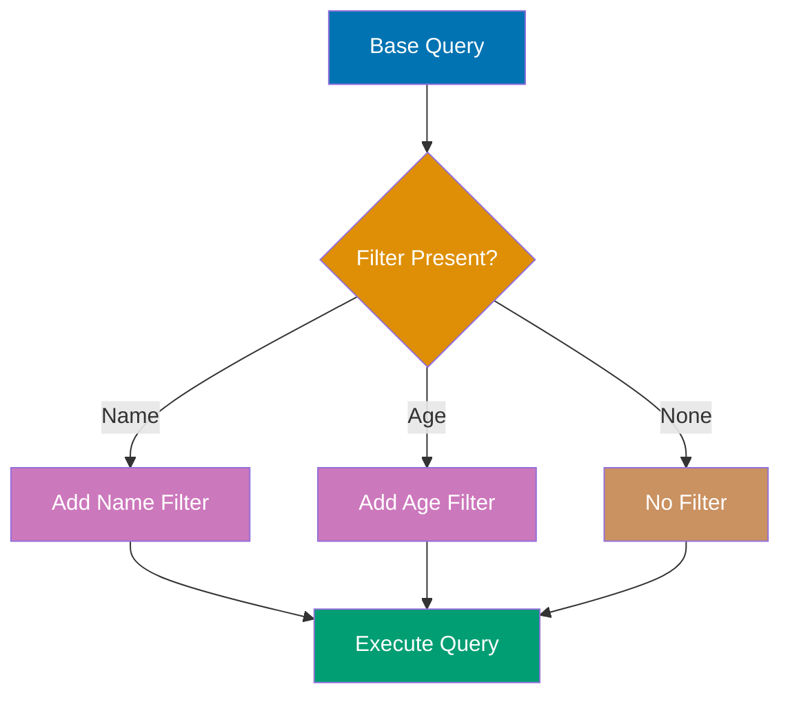

```elixir
defmodule User do
                                      # => Defines User module; Elixir module is just a named atom with function table
  use Ecto.Schema
                                        # => Injects schema/2, field/3, timestamps/1 macros into this module

  schema "users" do
                                        # => Maps to "users" table; Ecto auto-adds :id primary key (bigserial) unless @primary_key false
    field :name, :string
                                          # => VARCHAR column (no length limit unless size: N option added)
    field :age, :integer
                                          # => INTEGER column (4-byte signed; range -2,147,483,648 to 2,147,483,647)
    field :country, :string
                                          # => VARCHAR column (no length limit unless size: N option added)
    timestamps()
                                          # => Adds inserted_at, updated_at (naive_datetime; auto-set by Repo on write)
  end
                                        # => Closes the nearest open block (do...end)
end
                                      # => Closes the nearest open block (do...end)

defmodule UserQuery do
                                      # => Defines UserQuery module; Elixir module is just a named atom with function table
  import Ecto.Query
                                        # => Imports all public functions from Ecto.Query into scope (use alias for explicit control)
                                        # => Brings from/2, where/3, select/3, order_by/3, join/5 query macros into scope

  def build_query(filters) do
                                        # => Returns composed Ecto query struct; no DB call until Repo operation
                                        # => Public function build_query/N; callable from any module
    User
                                          # => Ecto queryable; equivalent to from(u in User)
    |> filter_by_name(filters[:name])
                                          # => Conditionally adds name filter; no-op if argument is nil
                                          # => Conditionally applies filter clause (no-op if argument is nil)
    |> filter_by_age_range(filters[:min_age], filters[:max_age])
                                          # => Conditionally adds age range WHERE clause
                                          # => Conditionally applies filter clause (no-op if argument is nil)
    |> filter_by_country(filters[:country])
                                          # => Conditionally applies filter clause (no-op if argument is nil)
  end
                                        # => Closes the nearest open block (do...end)

  defp filter_by_name(query, nil), do: query
  defp filter_by_name(query, name) do
                                        # => Private function filter_by_name; only callable within this module
                                        # => Private function filter_by_name/N; only callable within this module
    where(query, [u], ilike(u.name, ^"%#{name}%"))
                                      # => Case-insensitive LIKE search
  end
                                        # => Closes the nearest open block (do...end)

  defp filter_by_age_range(query, nil, nil), do: query
  defp filter_by_age_range(query, min_age, nil) do
                                        # => Private function filter_by_age_range; only callable within this module
                                        # => Private function filter_by_age_range/N; only callable within this module
    where(query, [u], u.age >= ^min_age)
  end
                                        # => Closes the nearest open block (do...end)
  defp filter_by_age_range(query, nil, max_age) do
                                        # => Private function filter_by_age_range; only callable within this module
                                        # => Private function filter_by_age_range/N; only callable within this module
    where(query, [u], u.age <= ^max_age)
  end
                                        # => Closes the nearest open block (do...end)
  defp filter_by_age_range(query, min_age, max_age) do
                                        # => Private function filter_by_age_range; only callable within this module
                                        # => Private function filter_by_age_range/N; only callable within this module
    where(query, [u], u.age >= ^min_age and u.age <= ^max_age)
  end
                                        # => Closes the nearest open block (do...end)

  defp filter_by_country(query, nil), do: query
  defp filter_by_country(query, country) do
                                        # => Private function filter_by_country; only callable within this module
                                        # => Private function filter_by_country/N; only callable within this module
    where(query, [u], u.country == ^country)
  end
                                        # => Closes the nearest open block (do...end)
end
                                      # => Closes the nearest open block (do...end)

# Insert test data
Repo.insert(%User{name: "Alice", age: 25, country: "USA"})
                                      # => SQL: INSERT INTO ... RETURNING *; result discarded (capture for id/timestamps)
Repo.insert(%User{name: "Bob", age: 30, country: "UK"})
                                      # => SQL: INSERT INTO ... RETURNING *; result discarded (capture for id/timestamps)
Repo.insert(%User{name: "Charlie", age: 35, country: "USA"})
                                      # => SQL: INSERT INTO ... RETURNING *; result discarded (capture for id/timestamps)

# Dynamic query with name filter only
query1 = UserQuery.build_query(%{name: "ali"})
results1 = Repo.all(query1)           # => results1 is [%User{name: "Alice"}]
                                      # => SQL: SELECT * FROM users WHERE name ILIKE '%ali%'

# Dynamic query with multiple filters
query2 = UserQuery.build_query(%{min_age: 28, country: "USA"})
results2 = Repo.all(query2)           # => results2 is [%User{name: "Charlie"}]
                                      # => SQL: SELECT * FROM users WHERE age >= 28 AND country = 'USA'

IO.inspect(length(results1))          # => Output: 1
IO.inspect(length(results2))          # => Output: 1
```

**Key Takeaway**: Build dynamic queries by chaining filter functions that only add WHERE clauses when parameters are present, and always use parameter binding (^var) to prevent SQL injection.

**Why It Matters**: Advanced search UIs with complex filter logic (AND/OR combinations, range filters, text search) require programmatic query construction. Production admin panels and reporting tools use query builder modules to compose filters from UI components, preventing massive controller if-else chains. This pattern enables building complex queries from external filter definitions (JSON APIs, saved searches) while maintaining type safety.

---

### Example 62: Dynamic Order By

Dynamic sorting allows users to control result ordering at runtime, common in table views with sortable columns.

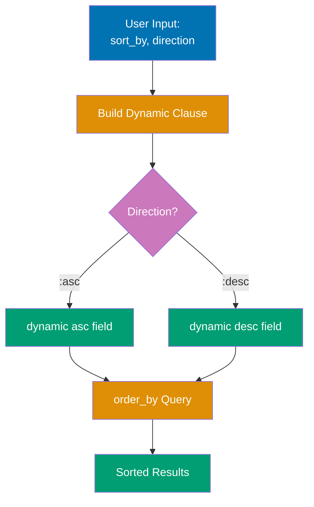

```elixir
defmodule User do
                                      # => Defines User module; Elixir module is just a named atom with function table
  use Ecto.Schema
                                        # => Injects schema/2, field/3, timestamps/1 macros into this module

  schema "users" do
                                        # => Maps to "users" table; Ecto auto-adds :id primary key (bigserial) unless @primary_key false
    field :name, :string
                                          # => VARCHAR column (no length limit unless size: N option added)
    field :age, :integer
                                          # => INTEGER column (4-byte signed; range -2,147,483,648 to 2,147,483,647)
    field :created_at, :naive_datetime
                                          # => TIMESTAMP WITHOUT TIME ZONE column (no timezone info stored)
    timestamps()
                                          # => Adds inserted_at, updated_at (naive_datetime; auto-set by Repo on write)
  end
                                        # => Closes the nearest open block (do...end)
end
                                      # => Closes the nearest open block (do...end)

defmodule UserQuery do
                                      # => Defines UserQuery module; Elixir module is just a named atom with function table
  import Ecto.Query
                                        # => Imports all public functions from Ecto.Query into scope (use alias for explicit control)
                                        # => Brings from/2, where/3, select/3, order_by/3, join/5 query macros into scope

  def list_users(opts \\ []) do
                                        # => Public function list_users/N; callable from any module
    sort_by = opts[:sort_by] || :name  # => Default sort by name
    direction = opts[:direction] || :asc
                                      # => Default ascending

    User
                                          # => Ecto queryable; equivalent to from(u in User)
    |> apply_sorting(sort_by, direction)
                                          # => Adds ORDER BY clause; field validated to prevent invalid column references
    |> Repo.all()
                                          # => Executes accumulated query against DB; returns list of structs (may be empty)
                                          # => Executes accumulated query against DB; returns list of structs (may be empty)
  end
                                        # => Closes the nearest open block (do...end)

  defp apply_sorting(query, field, :asc) do
                                        # => Private function apply_sorting; only callable within this module
                                        # => Private function apply_sorting/N; only callable within this module
    order_by(query, [u], asc: field(u, ^field))
                                      # => Dynamic field reference
  end
                                        # => Closes the nearest open block (do...end)

  defp apply_sorting(query, field, :desc) do
                                        # => Private function apply_sorting; only callable within this module
                                        # => Private function apply_sorting/N; only callable within this module
    order_by(query, [u], desc: field(u, ^field))
  end
                                        # => Closes the nearest open block (do...end)
end
                                      # => Closes the nearest open block (do...end)

# Insert test data
Repo.insert(%User{name: "Zara", age: 28})
                                      # => SQL: INSERT INTO ... RETURNING *; result discarded (capture for id/timestamps)
Repo.insert(%User{name: "Alice", age: 32})
                                      # => SQL: INSERT INTO ... RETURNING *; result discarded (capture for id/timestamps)
Repo.insert(%User{name: "Bob", age: 25})
                                      # => SQL: INSERT INTO ... RETURNING *; result discarded (capture for id/timestamps)

# Sort by name ascending (default)
users1 = UserQuery.list_users()       # => [%User{name: "Alice"}, %User{name: "Bob"}, %User{name: "Zara"}]
                                      # => SQL: SELECT * FROM users ORDER BY name ASC

# Sort by age descending
users2 = UserQuery.list_users(sort_by: :age, direction: :desc)
                                      # => [%User{age: 32}, %User{age: 28}, %User{age: 25}]
                                      # => SQL: SELECT * FROM users ORDER BY age DESC

IO.inspect(Enum.map(users1, & &1.name))
                                      # => Prints Enum.map(users1, & &1.name) to stdout and returns value (useful for debugging pipelines)
                                      # => Output: ["Alice", "Bob", "Zara"]
IO.inspect(Enum.map(users2, & &1.age))
                                      # => Prints Enum.map(users2, & &1.age) to stdout and returns value (useful for debugging pipelines)
                                      # => Output: [32, 28, 25]
```

**Key Takeaway**: Use field(binding, ^field_atom) for dynamic field references in order_by, and always validate field names against a whitelist to prevent invalid column references.

**Why It Matters**: Data tables, admin interfaces, and API endpoints commonly need user-controlled sorting. Hardcoding sort logic for every possible field creates unmaintainable code that cannot adapt to changing requirements. Dynamic ordering enables flexible UIs while the field whitelist prevents SQL injection through invalid column names, balancing user flexibility with security. This pattern is foundational for any sortable grid or table component.

---

### Example 63: Implementing Custom Ecto.Type

Custom types allow you to define how Elixir values are converted to/from database representations, useful for encrypting data, custom formats, or domain-specific types.

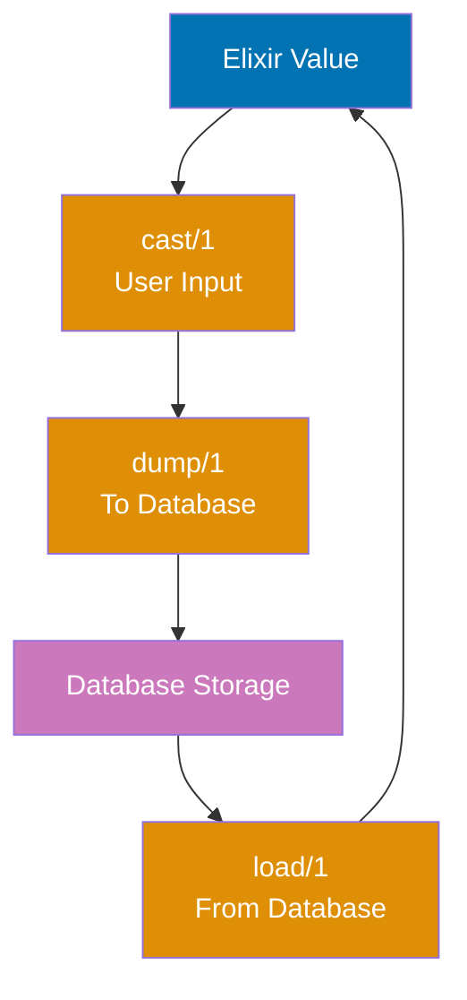

```elixir
defmodule EncryptedString do
                                      # => Defines EncryptedString module; Elixir module is just a named atom with function table
  use Ecto.Type
                                        # => Injects type behaviour; implement cast/1, load/1, dump/1, type/0

  def type, do: :string                # => Database type

  def cast(value) when is_binary(value) do
                                        # => Called when setting value from user input; return {:ok, value} or :error
                                        # => Public function cast/N; callable from any module
    {:ok, value}                       # => Accept strings
  end
                                        # => Closes the nearest open block (do...end)
  def cast(_), do: :error

  def load(value) when is_binary(value) do
                                        # => Called when reading from DB; convert raw DB value to Elixir type
                                        # => Public function load/N; callable from any module
    {:ok, decrypt(value)}              # => Decrypt when loading from database
  end
                                        # => Closes the nearest open block (do...end)

  def dump(value) when is_binary(value) do
                                        # => Called when writing to DB; convert Elixir type to DB-compatible value
                                        # => Public function dump/N; callable from any module
    {:ok, encrypt(value)}              # => Encrypt when saving to database
  end
                                        # => Closes the nearest open block (do...end)
  def dump(_), do: :error
                                        # => Reject invalid values (catch-all)

  # Simplified encryption (use real crypto in production)
  defp encrypt(value), do: Base.encode64(value)
                                        # => Simple Base64 encoding (use proper encryption library in production)
  defp decrypt(value), do: Base.decode64!(value)
                                        # => Decode Base64; bang version raises on invalid input
end
                                      # => Closes the nearest open block (do...end)

defmodule User do
                                      # => Defines User module; Elixir module is just a named atom with function table
  use Ecto.Schema
                                        # => Injects schema/2, field/3, timestamps/1 macros into this module

  schema "users" do
                                        # => Maps to "users" table; Ecto auto-adds :id primary key (bigserial) unless @primary_key false
    field :name, :string
                                          # => VARCHAR column (no length limit unless size: N option added)
    field :ssn, EncryptedString         # => Custom type for sensitive data
    timestamps()
                                          # => Adds inserted_at, updated_at (naive_datetime; auto-set by Repo on write)
  end
                                        # => Closes the nearest open block (do...end)
end
                                      # => Closes the nearest open block (do...end)

# Insert user with encrypted SSN
{:ok, user} = Repo.insert(%User{name: "Diana", ssn: "123-45-6789"})
                                      # => SQL: INSERT INTO ... RETURNING *; user has database-assigned id and timestamps
                                      # => user.ssn is "123-45-6789" (in memory)
                                      # => Database stores: "MTIzLTQ1LTY3ODk=" (encrypted)
                                      # => SQL: INSERT INTO users (name, ssn) VALUES ('Diana', 'MTIzLTQ1LTY3ODk=')

# Load user (automatic decryption)
loaded = Repo.get(User, user.id)      # => loaded.ssn is "123-45-6789" (decrypted)
                                      # => SQL: SELECT * FROM users WHERE id = 1

IO.inspect(loaded.ssn)                # => Output: "123-45-6789"
```

**Key Takeaway**: Custom types must implement type/0 (database type), cast/1 (validate input), load/1 (database → Elixir), and dump/1 (Elixir → database); use for encryption, JSON encoding, or custom serialization.

**Why It Matters**: Application-specific data types (encrypted fields, enums, URIs) require custom casting and storage logic. Production systems implement Ecto.Type for money values (precise decimal math), encrypted PII (automatic encryption/decryption), and domain types (email, phone) to enforce type safety at schema boundaries. Custom types centralize validation and transformation logic, preventing duplication across changesets.

---

### Example 64: Parameterized Types

Parameterized types accept compile-time parameters, allowing you to create configurable custom types for reusable logic.

```elixir
defmodule EnumType do
                                      # => Defines EnumType module; Elixir module is just a named atom with function table
  use Ecto.ParameterizedType
                                        # => Parameterized type; accepts options at field declaration time (e.g., values: list)

  def type(_params), do: :string      # => Database type

  def init(opts) do
                                        # => Called at compile time to validate and store type options
                                        # => Public function init/N; callable from any module
    values = Keyword.fetch!(opts, :values)
                                          # => Raises KeyError if :values not in opts (required option validation)
                                      # => Required parameter: list of valid values
    %{values: values}                 # => Return params map
  end
                                        # => Closes the nearest open block (do...end)

  def cast(value, %{values: values}) when value in values do
                                        # => Only accepts values in the allowed list; returns {:ok, value}
    {:ok, value}                      # => Value must be in allowed list
  end
                                        # => Closes the nearest open block (do...end)
  def cast(_, _), do: :error
                                        # => Reject all other types (catch-all clause returns :error)

  def load(value, _, _), do: {:ok, value}
                                        # => Pass-through load: DB value returned as-is (no transformation needed)
  def dump(value, _, _), do: {:ok, value}
                                        # => Pass-through dump: Elixir value stored in DB as-is
end
                                      # => Closes the nearest open block (do...end)

defmodule User do
                                      # => Defines User module; Elixir module is just a named atom with function table
  use Ecto.Schema
                                        # => Injects schema/2, field/3, timestamps/1 macros into this module

  schema "users" do
                                        # => Maps to "users" table; Ecto auto-adds :id primary key (bigserial) unless @primary_key false
    field :name, :string
                                          # => VARCHAR column (no length limit unless size: N option added)
    field :role, EnumType, values: ["admin", "user", "guest"]
                                      # => Parameterized enum with allowed values
    timestamps()
                                          # => Adds inserted_at, updated_at (naive_datetime; auto-set by Repo on write)
  end
                                        # => Closes the nearest open block (do...end)
end
                                      # => Closes the nearest open block (do...end)

# Valid role
{:ok, admin} = Repo.insert(%User{name: "Eve", role: "admin"})
                                      # => SQL: INSERT INTO ... RETURNING *; admin has database-assigned id and timestamps
                                      # => role is "admin" (valid)

# Invalid role would fail at changeset level
changeset = Ecto.Changeset.cast(%User{}, %{name: "Frank", role: "invalid"}, [:name, :role])
                                      # => changeset.valid? is false
                                      # => changeset.errors has role error

IO.inspect(admin.role)                # => Output: "admin"
IO.inspect(changeset.valid?)          # => Output: false
```

**Key Takeaway**: Parameterized types enable compile-time configuration of custom types, and init/1 receives schema-level options while cast/load/dump receive the params map.

**Why It Matters**: Reusable types with configuration (enum with allowed values, encrypted field with key) avoid code duplication across schemas. Production systems use parameterized types for enums (status field with specific allowed states) and configurable transformations (encrypted field with per-field keys) to enforce constraints centrally. This pattern enables type reuse while maintaining field-specific configuration.

---

### Example 65: Optimistic Locking with :version

Optimistic locking uses a version field to detect concurrent updates, raising on conflict. Prevents lost updates without database locks.

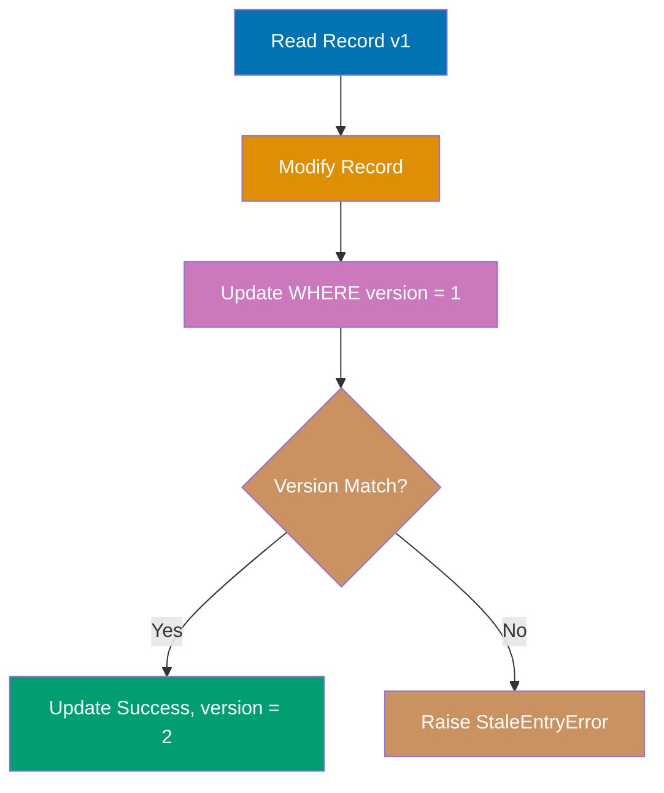

```elixir
defmodule Product do
                                      # => Defines Product module; Elixir module is just a named atom with function table
  use Ecto.Schema
                                        # => Injects schema/2, field/3, timestamps/1 macros into this module

  schema "products" do
                                        # => Maps to "products" table; Ecto auto-adds :id primary key (bigserial) unless @primary_key false
    field :name, :string
                                          # => VARCHAR column (no length limit unless size: N option added)
    field :stock, :integer
                                          # => INTEGER column (4-byte signed; range -2,147,483,648 to 2,147,483,647)
    field :version, :integer, default: 1
                                          # => INTEGER column with application-side default 1 (not a DB constraint)
                                      # => Optimistic lock version field
    timestamps()
                                          # => Adds inserted_at, updated_at (naive_datetime; auto-set by Repo on write)
  end
                                        # => Closes the nearest open block (do...end)
end
                                      # => Closes the nearest open block (do...end)

# Migration for version field
defmodule Repo.Migrations.AddVersionToProducts do
                                      # => AddVersionToProducts module under Repo.Migrations namespace (common pattern for Repo/Migrations)
                                      # => Defines Repo.Migrations.AddVersionToProducts module; Elixir module is just a named atom with function table
  use Ecto.Migration
                                        # => Provides create/2, alter/2, add/3, index/2 migration DSL (runs in transaction)

  def change do
                                        # => Zero-arity public function change/0
    alter table(:products) do
                                          # => SQL: ALTER TABLE products ...; add/remove/modify columns atomically
      add :version, :integer, default: 1, null: false
    end
                                          # => Closes the nearest open block (do...end)
  end
                                        # => Closes the nearest open block (do...end)
end
                                      # => Closes the nearest open block (do...end)

# Insert product
{:ok, product} = Repo.insert(%Product{name: "Widget", stock: 100, version: 1})
                                      # => SQL: INSERT INTO ... RETURNING *; product has database-assigned id and timestamps
                                      # => product.version is 1

# Concurrent update simulation
# Transaction 1: Read product
product_t1 = Repo.get(Product, product.id)
                                      # => SQL: SELECT * FROM table WHERE id = product.id; returns struct or nil
                                      # => product_t1.version is 1

# Transaction 2: Update stock
changeset_t2 = Ecto.Changeset.change(product, stock: 95)
                                      # => Builds changeset with forced change (bypasses cast/2; no type casting or validation)
{:ok, updated_t2} = Repo.update(changeset_t2)
                                      # => SQL: UPDATE ... SET ... WHERE id=N; updated_t2 reflects persisted state
                                      # => updated_t2.version is 2 (auto-incremented)
                                      # => SQL: UPDATE products SET stock = 95, version = 2
                                      # =>      WHERE id = 1 AND version = 1

# Transaction 1: Try to update with stale version
changeset_t1 = Ecto.Changeset.change(product_t1, stock: 90)
                                      # => Builds changeset with forced change (bypasses cast/2; no type casting or validation)
# {:error, _} = Repo.update(changeset_t1)
                                      # => Raises Ecto.StaleEntryError
                                      # => SQL: UPDATE products SET stock = 90, version = 2
                                      # =>      WHERE id = 1 AND version = 1
                                      # => No rows affected (version mismatch)

IO.inspect(updated_t2.version)        # => Output: 2
```

**Key Takeaway**: Add field :version, :integer to schemas for optimistic locking; Ecto automatically increments version on update and raises Ecto.StaleEntryError if version doesn't match.

**Why It Matters**: Most updates don't have concurrency conflicts, so pessimistic locks waste performance by serializing all access. Optimistic locking using version columns lets production systems attempt updates optimistically and retry on conflicts, maximizing throughput for low-contention resources. This pattern is essential for collaborative editing, configuration management, and any scenario where conflicts are rare but must be detected when they occur.

---

### Example 66: Association Preloading Strategies

Ecto supports multiple preloading strategies with different performance characteristics: separate queries (:all) vs joins (:join).

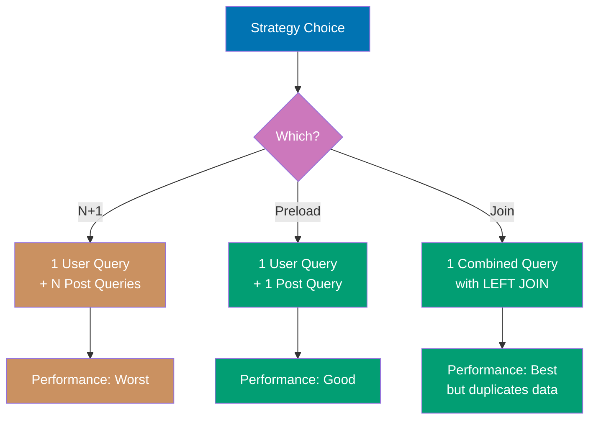

```elixir
defmodule User do
                                      # => Defines User module; Elixir module is just a named atom with function table
  use Ecto.Schema
                                        # => Injects schema/2, field/3, timestamps/1 macros into this module

  schema "users" do
                                        # => Maps to "users" table; Ecto auto-adds :id primary key (bigserial) unless @primary_key false
    field :name, :string
                                          # => VARCHAR column (no length limit unless size: N option added)
    has_many :posts, Post
                                          # => Virtual association field; no DB column added; loaded only via Repo.preload/3
    timestamps()
                                          # => Adds inserted_at, updated_at (naive_datetime; auto-set by Repo on write)
  end
                                        # => Closes the nearest open block (do...end)
end
                                      # => Closes the nearest open block (do...end)

defmodule Post do
                                      # => Post module mapping to posts table; declares schema and associations
                                      # => Defines Post module; Elixir module is just a named atom with function table
  use Ecto.Schema
                                        # => Injects schema/2, field/3, timestamps/1 macros into this module

  schema "posts" do
                                        # => Maps to "posts" table; Ecto auto-adds :id primary key (bigserial) unless @primary_key false
    field :title, :string
                                          # => VARCHAR column (no length limit unless size: N option added)
    belongs_to :user, User
                                          # => Adds :USER_id foreign key INTEGER column + :USER virtual field (not preloaded by default)
    timestamps()
                                          # => Adds inserted_at, updated_at (naive_datetime; auto-set by Repo on write)
  end
                                        # => Closes the nearest open block (do...end)
end
                                      # => Closes the nearest open block (do...end)

# Insert test data
{:ok, user1} = Repo.insert(%User{name: "Grace"})
                                      # => SQL: INSERT INTO ... RETURNING *; user1 has database-assigned id and timestamps
{:ok, user2} = Repo.insert(%User{name: "Henry"})
                                      # => SQL: INSERT INTO ... RETURNING *; user2 has database-assigned id and timestamps
Repo.insert(%Post{title: "Post 1", user_id: user1.id})
                                      # => SQL: INSERT INTO ... RETURNING *; result discarded (capture for id/timestamps)
Repo.insert(%Post{title: "Post 2", user_id: user1.id})
                                      # => SQL: INSERT INTO ... RETURNING *; result discarded (capture for id/timestamps)
Repo.insert(%Post{title: "Post 3", user_id: user2.id})
                                      # => SQL: INSERT INTO ... RETURNING *; result discarded (capture for id/timestamps)

# Preload with separate query (default)
users_separate = User |> Repo.all() |> Repo.preload(:posts)
                                      # => SQL 1: SELECT * FROM users
                                      # => SQL 2: SELECT * FROM posts WHERE user_id IN (1, 2)
                                      # => Two queries total

# Preload with join
import Ecto.Query
                                      # => Imports all public functions from Ecto.Query into scope (use alias for explicit control)
                                      # => Brings from/2, where/3, select/3, order_by/3, join/5 query macros into scope
users_join = User
  |> join(:left, [u], p in assoc(u, :posts))
  |> preload([u, p], posts: p)
  |> Repo.all()                       # => SQL: SELECT u.*, p.* FROM users u
                                      # =>      LEFT JOIN posts p ON p.user_id = u.id
                                      # => Single query with join

IO.inspect(length(users_separate))    # => Output: 2
IO.inspect(length(users_join))        # => Output: 2
```

**Key Takeaway**: Separate query preloading (:all, default) executes N+1 prevention with one additional query per association, while join preloading fetches everything in one query but may have duplicate rows for has_many.

**Why It Matters**: Choosing the right preload strategy impacts query count, memory usage, and response time. Separate queries scale better for has_many with many children (avoids row explosion), while join preloading reduces database round trips for belongs_to and small has_many associations. Production systems profile both strategies to choose optimal approaches based on actual data distribution and access patterns.

---

### Example 67: Preventing N+1 Queries with Dataloader

While not built-in to Ecto, understanding the N+1 problem is critical. Here's how to detect and prevent it.

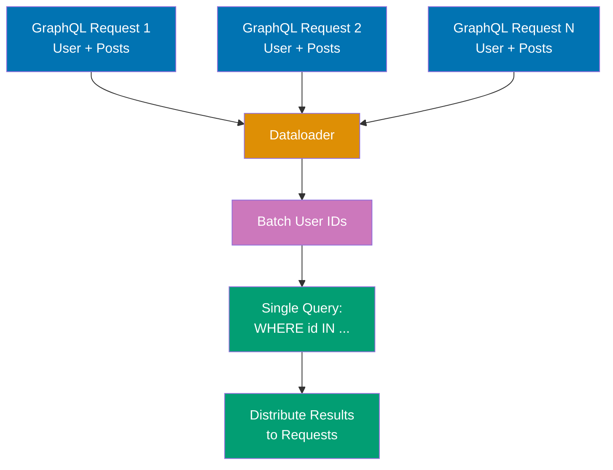

```elixir
defmodule User do
                                      # => Defines User module; Elixir module is just a named atom with function table
  use Ecto.Schema
                                        # => Injects schema/2, field/3, timestamps/1 macros into this module

  schema "users" do
                                        # => Maps to "users" table; Ecto auto-adds :id primary key (bigserial) unless @primary_key false
    field :name, :string
                                          # => VARCHAR column (no length limit unless size: N option added)
    has_many :posts, Post
                                          # => Virtual association field; no DB column added; loaded only via Repo.preload/3
    timestamps()
                                          # => Adds inserted_at, updated_at (naive_datetime; auto-set by Repo on write)
  end
                                        # => Closes the nearest open block (do...end)
end
                                      # => Closes the nearest open block (do...end)

defmodule Post do
                                      # => Post module mapping to posts table; declares schema and associations
                                      # => Defines Post module; Elixir module is just a named atom with function table
  use Ecto.Schema
                                        # => Injects schema/2, field/3, timestamps/1 macros into this module

  schema "posts" do
                                        # => Maps to "posts" table; Ecto auto-adds :id primary key (bigserial) unless @primary_key false
    field :title, :string
                                          # => VARCHAR column (no length limit unless size: N option added)
    belongs_to :user, User
                                          # => Adds :USER_id foreign key INTEGER column + :USER virtual field (not preloaded by default)
    timestamps()
                                          # => Adds inserted_at, updated_at (naive_datetime; auto-set by Repo on write)
  end
                                        # => Closes the nearest open block (do...end)
end
                                      # => Closes the nearest open block (do...end)

# Insert test data
{:ok, user1} = Repo.insert(%User{name: "Iris"})
                                      # => SQL: INSERT INTO ... RETURNING *; user1 has database-assigned id and timestamps
{:ok, user2} = Repo.insert(%User{name: "Jack"})
                                      # => SQL: INSERT INTO ... RETURNING *; user2 has database-assigned id and timestamps
Repo.insert(%Post{title: "Post 1", user_id: user1.id})
                                      # => SQL: INSERT INTO ... RETURNING *; result discarded (capture for id/timestamps)
Repo.insert(%Post{title: "Post 2", user_id: user2.id})
                                      # => SQL: INSERT INTO ... RETURNING *; result discarded (capture for id/timestamps)

# N+1 query problem (BAD)
users = Repo.all(User)                # => SQL 1: SELECT * FROM users
Enum.each(users, fn user ->
                                      # => Iterates collection for side effects; returns :ok (not a list)
  posts = Repo.preload(user, :posts).posts
                                      # => SQL 2: SELECT * FROM posts WHERE user_id = 1
                                      # => SQL 3: SELECT * FROM posts WHERE user_id = 2
                                      # => N additional queries (1 per user)
  IO.inspect({user.name, length(posts)})
                                        # => Prints {user.name, length(posts)} to stdout and returns value (useful for debugging pipelines)
end)
                                      # => Closes do...end block and the enclosing function call

# Fixed with preload (GOOD)
users_fixed = User |> Repo.all() |> Repo.preload(:posts)
                                      # => SQL 1: SELECT * FROM users
                                      # => SQL 2: SELECT * FROM posts WHERE user_id IN (1, 2)
                                      # => Only 2 queries total
Enum.each(users_fixed, fn user ->
                                      # => Iterates collection for side effects; returns :ok (not a list)
  IO.inspect({user.name, length(user.posts)})
                                        # => Prints {user.name, length(user.posts)} to stdout and returns value (useful for debugging pipelines)
end)
                                      # => Closes do...end block and the enclosing function call
```

**Key Takeaway**: Always preload associations before iterating over parent records to prevent N+1 queries; use Repo.preload/2 on the query result, not inside loops.

**Why It Matters**: GraphQL resolvers naively loading associations trigger N+1 queries for every nested field. Production GraphQL APIs use Dataloader to batch association loads across the entire request, reducing hundreds of queries to a few. Understanding batch loading is critical for performant GraphQL implementations and any scenario where associations are loaded within loops or recursive structures.

---

### Example 68: Lazy vs Eager Loading

Understanding when Ecto loads data helps optimize queries and avoid unnecessary database round trips.

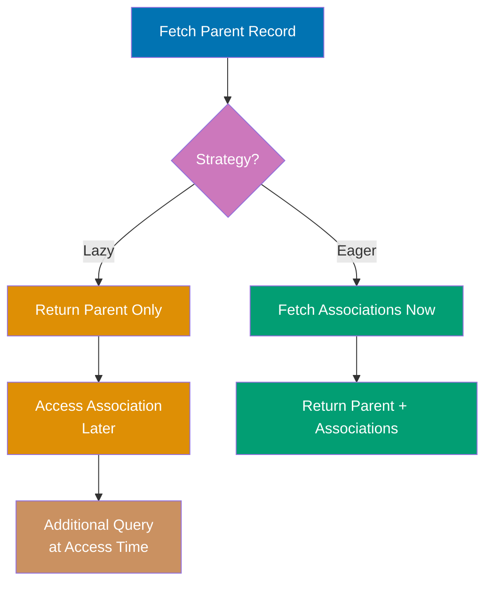

```elixir
defmodule User do
                                      # => Defines User module; Elixir module is just a named atom with function table
  use Ecto.Schema
                                        # => Injects schema/2, field/3, timestamps/1 macros into this module

  schema "users" do
                                        # => Maps to "users" table; Ecto auto-adds :id primary key (bigserial) unless @primary_key false
    field :name, :string
                                          # => VARCHAR column (no length limit unless size: N option added)
    has_many :posts, Post
                                          # => Virtual association field; no DB column added; loaded only via Repo.preload/3
    timestamps()
                                          # => Adds inserted_at, updated_at (naive_datetime; auto-set by Repo on write)
  end
                                        # => Closes the nearest open block (do...end)
end
                                      # => Closes the nearest open block (do...end)

defmodule Post do
                                      # => Post module mapping to posts table; declares schema and associations
                                      # => Defines Post module; Elixir module is just a named atom with function table
  use Ecto.Schema
                                        # => Injects schema/2, field/3, timestamps/1 macros into this module

  schema "posts" do
                                        # => Maps to "posts" table; Ecto auto-adds :id primary key (bigserial) unless @primary_key false
    field :title, :string
                                          # => VARCHAR column (no length limit unless size: N option added)
    belongs_to :user, User
                                          # => Adds :USER_id foreign key INTEGER column + :USER virtual field (not preloaded by default)
    timestamps()
                                          # => Adds inserted_at, updated_at (naive_datetime; auto-set by Repo on write)
  end
                                        # => Closes the nearest open block (do...end)
end
                                      # => Closes the nearest open block (do...end)

# Insert test data
{:ok, user} = Repo.insert(%User{name: "Kate"})
                                      # => SQL: INSERT INTO ... RETURNING *; user has database-assigned id and timestamps
Repo.insert(%Post{title: "Post 1", user_id: user.id})
                                      # => SQL: INSERT INTO ... RETURNING *; result discarded (capture for id/timestamps)

# Lazy loading (association not loaded)
user_lazy = Repo.get(User, user.id)   # => user_lazy.posts is %Ecto.Association.NotLoaded{}
                                      # => SQL: SELECT * FROM users WHERE id = 1
                                      # => Posts NOT loaded

# Accessing unloaded association raises
# user_lazy.posts                     # => Raises: association :posts is not loaded

# Eager loading (preload in query)
import Ecto.Query
                                      # => Imports all public functions from Ecto.Query into scope (use alias for explicit control)
                                      # => Brings from/2, where/3, select/3, order_by/3, join/5 query macros into scope
user_eager = User
  |> where([u], u.id == ^user.id)
                                        # => SQL: WHERE u.id == ^user.id (adds to any existing WHERE conditions)
  |> preload(:posts)
  |> Repo.one()                       # => user_eager.posts is [%Post{...}]
                                      # => SQL 1: SELECT * FROM users WHERE id = 1
                                      # => SQL 2: SELECT * FROM posts WHERE user_id IN (1)

# Lazy preload (load after fetching)
user_lazy_preload = user_lazy |> Repo.preload(:posts)
                                      # => user_lazy_preload.posts is [%Post{...}]
                                      # => SQL: SELECT * FROM posts WHERE user_id IN (1)

IO.inspect(user_eager.posts)          # => Output: [%Post{...}]
IO.inspect(user_lazy_preload.posts)   # => Output: [%Post{...}]
```

**Key Takeaway**: Associations are lazy by default (not loaded until preloaded), and accessing unloaded associations raises an error; preload eagerly when you know you'll need the data.

**Why It Matters**: Lazy loading prevents unnecessary database queries but creates runtime errors when associations are accessed without preloading. Production systems establish clear contracts about when associations are loaded, using compile-time warnings or runtime checks to prevent NotLoaded access. Understanding lazy semantics prevents subtle bugs where code works in tests (with preloaded data) but fails in production (missing preloads).

---

### Example 69: Repo.stream for Large Result Sets

Repo.stream/1 streams query results one at a time instead of loading all into memory, essential for processing large datasets.

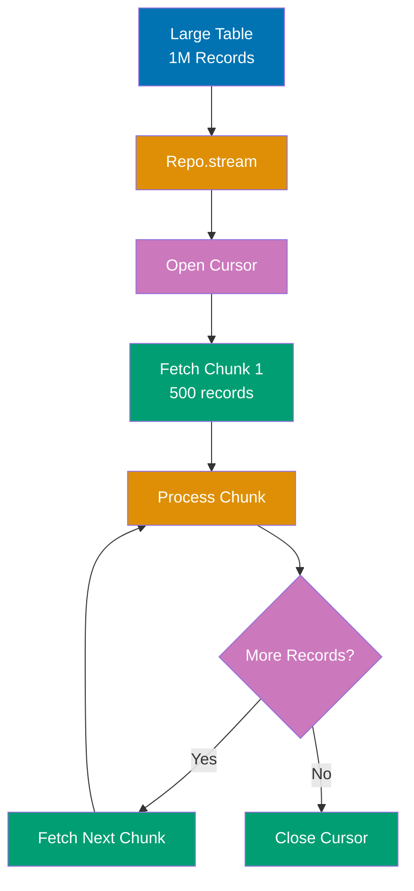

```elixir
defmodule User do
                                      # => Defines User module; Elixir module is just a named atom with function table
  use Ecto.Schema
                                        # => Injects schema/2, field/3, timestamps/1 macros into this module

  schema "users" do
                                        # => Maps to "users" table; Ecto auto-adds :id primary key (bigserial) unless @primary_key false
    field :name, :string
                                          # => VARCHAR column (no length limit unless size: N option added)
    field :age, :integer
                                          # => INTEGER column (4-byte signed; range -2,147,483,648 to 2,147,483,647)
    timestamps()
                                          # => Adds inserted_at, updated_at (naive_datetime; auto-set by Repo on write)
  end
                                        # => Closes the nearest open block (do...end)
end
                                      # => Closes the nearest open block (do...end)

import Ecto.Query
                                      # => Imports all public functions from Ecto.Query into scope (use alias for explicit control)
                                      # => Brings from/2, where/3, select/3, order_by/3, join/5 query macros into scope

# Insert large dataset
Enum.each(1..10000, fn i ->
                                      # => Iterates collection for side effects; returns :ok (not a list)
  Repo.insert(%User{name: "User #{i}", age: rem(i, 100)})
                                        # => SQL: INSERT INTO ... RETURNING *; result discarded (capture for id/timestamps)
end)
                                      # => Closes do...end block and the enclosing function call

# Process large result set with streaming
Repo.transaction(fn ->                # => Stream requires transaction
  User
                                        # => Ecto queryable; equivalent to from(u in User)
  |> where([u], u.age > 25)
                                        # => SQL: WHERE age > 25 (Elixir variable 25 pinned via ^ if needed)
  |> Repo.stream()                    # => Returns stream (lazy)
  |> Stream.map(fn user ->
                                        # => Lazy map: processes one element at a time (memory-efficient for large datasets)
    # Process each user (e.g., send email)
    {user.id, user.name}
  end)
                                        # => Closes do...end block and the enclosing function call
  |> Stream.take(5)                   # => Limit processing for example
  |> Enum.to_list()                   # => Triggers execution
                                      # => SQL: Cursor-based streaming
                                      # => Only loads chunk into memory at a time
end)
                                      # => Closes do...end block and the enclosing function call

IO.inspect("Processed users in streaming fashion")
                                      # => Prints "Processed users in streaming fashion" to stdout and returns value (useful for debugging pipelines)
```

**Key Takeaway**: Repo.stream/1 must be used inside a transaction and returns a lazy stream that fetches rows in batches, preventing memory issues when processing millions of records.

**Why It Matters**: Processing millions of records loads entire tables into memory, causing OOM crashes. Production batch jobs use Repo.stream to process records in chunks, maintaining constant memory usage regardless of table size. This pattern is essential for ETL jobs, bulk updates, and report generation over large datasets where streaming trades latency for memory efficiency.

---

### Example 70: Preparing Queries for Performance

Repo.prepare_query/2 compiles queries once and reuses the prepared statement, improving performance for frequently executed queries.

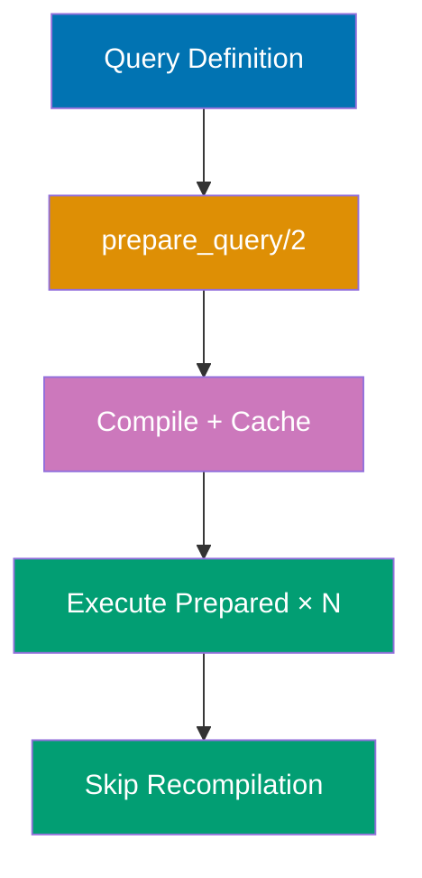

```elixir
defmodule User do
                                      # => Defines User module; Elixir module is just a named atom with function table
  use Ecto.Schema
                                        # => Injects schema/2, field/3, timestamps/1 macros into this module

  schema "users" do
                                        # => Maps to "users" table; Ecto auto-adds :id primary key (bigserial) unless @primary_key false
    field :name, :string
                                          # => VARCHAR column (no length limit unless size: N option added)
    field :age, :integer
                                          # => INTEGER column (4-byte signed; range -2,147,483,648 to 2,147,483,647)
    timestamps()
                                          # => Adds inserted_at, updated_at (naive_datetime; auto-set by Repo on write)
  end
                                        # => Closes the nearest open block (do...end)
end
                                      # => Closes the nearest open block (do...end)

import Ecto.Query
                                      # => Imports all public functions from Ecto.Query into scope (use alias for explicit control)
                                      # => Brings from/2, where/3, select/3, order_by/3, join/5 query macros into scope

# Define reusable query
get_user_by_age_query = fn age ->
  from u in User,
                                        # => Start Ecto query; u is the binding alias for User schema fields
                                        # => Begins Ecto query DSL; no SQL executed yet (lazy query construction)
    where: u.age == ^age,
                                          # => ^age, pins Elixir variable into query (prevents SQL injection via parameterized query)
    select: u
end
                                      # => Closes the nearest open block (do...end)

# Execute query multiple times (each is prepared)
users_25 = get_user_by_age_query.(25) |> Repo.all()
                                      # => SQL: Prepared statement cached
users_30 = get_user_by_age_query.(30) |> Repo.all()
                                      # => Reuses prepared statement

# Named prepared query (advanced)
defmodule UserQueries do
                                      # => Defines UserQueries module; Elixir module is just a named atom with function table
  import Ecto.Query
                                        # => Imports all public functions from Ecto.Query into scope (use alias for explicit control)
                                        # => Brings from/2, where/3, select/3, order_by/3, join/5 query macros into scope

  def by_age_prepared do
                                        # => Zero-arity public function by_age_prepared/0
    from u in User,
                                          # => Start Ecto query; u is the binding alias for User schema fields
                                          # => Begins Ecto query DSL; no SQL executed yet (lazy query construction)
      where: u.age == ^1                # => Positional parameter
  end
                                        # => Closes the nearest open block (do...end)
end
                                      # => Closes the nearest open block (do...end)

# Ecto automatically prepares and caches queries
result = UserQueries.by_age_prepared() |> Repo.all([25])
                                      # => Executes prepared statement with age = 25

IO.inspect(length(users_25))          # => Output: count of users aged 25
```

**Key Takeaway**: Ecto automatically prepares and caches queries with parameter bindings, but for maximum performance with frequently executed queries, use explicit prepared queries.

**Why It Matters**: Repeated queries with different parameters benefit from prepared statements that parse SQL once and reuse execution plans. Production high-throughput systems use prepared statements (automatic with Ecto) to reduce parsing overhead and improve query cache hit rates. Understanding prepared statements helps diagnose plan caching issues and optimize query performance for workloads with repeated query patterns.

---

### Example 71: Using Indexes Effectively

Understanding when and how to create indexes is crucial for query performance. Index on foreign keys, WHERE clauses, and ORDER BY fields.

```elixir
# Migration: Create strategic indexes
defmodule Repo.Migrations.AddPerformanceIndexes do
                                      # => AddPerformanceIndexes module under Repo.Migrations namespace (common pattern for Repo/Migrations)
                                      # => Defines Repo.Migrations.AddPerformanceIndexes module; Elixir module is just a named atom with function table
  use Ecto.Migration
                                        # => Provides create/2, alter/2, add/3, index/2 migration DSL (runs in transaction)

  def change do
                                        # => Zero-arity public function change/0
    # Index foreign key (for joins)
    create index(:posts, [:user_id])  # => Speeds up JOIN operations

    # Index frequently filtered field
    create index(:users, [:country])  # => WHERE country = ...

    # Composite index for multi-field queries
    create index(:posts, [:user_id, :published_at])
                                      # => WHERE user_id = ? AND published_at > ?

    # Partial index for specific condition
    create index(:posts, [:published_at], where: "status = 'published'")
                                      # => Only indexes published posts

    # Unique index for constraints
    create unique_index(:users, [:email])
                                          # => SQL: CREATE UNIQUE INDEX users_email_index ON users(email); enforces uniqueness at DB level
                                      # => Enforces uniqueness
  end
                                        # => Closes the nearest open block (do...end)
end
                                      # => Closes the nearest open block (do...end)

defmodule Post do
                                      # => Post module mapping to posts table; declares schema and associations
                                      # => Defines Post module; Elixir module is just a named atom with function table
  use Ecto.Schema
                                        # => Injects schema/2, field/3, timestamps/1 macros into this module

  schema "posts" do
                                        # => Maps to "posts" table; Ecto auto-adds :id primary key (bigserial) unless @primary_key false
    field :title, :string
                                          # => VARCHAR column (no length limit unless size: N option added)
    field :status, :string
                                          # => VARCHAR column for status enum (consider :atom type or Ecto.Enum in production)
                                          # => VARCHAR column (no length limit unless size: N option added)
    field :published_at, :naive_datetime
                                          # => TIMESTAMP WITHOUT TIME ZONE; nil when draft, set when published
                                          # => TIMESTAMP WITHOUT TIME ZONE column (no timezone info stored)
    belongs_to :user, User
                                          # => Adds :USER_id foreign key INTEGER column + :USER virtual field (not preloaded by default)
    timestamps()
                                          # => Adds inserted_at, updated_at (naive_datetime; auto-set by Repo on write)
  end
                                        # => Closes the nearest open block (do...end)
end
                                      # => Closes the nearest open block (do...end)

import Ecto.Query
                                      # => Imports all public functions from Ecto.Query into scope (use alias for explicit control)
                                      # => Brings from/2, where/3, select/3, order_by/3, join/5 query macros into scope

# Query benefits from user_id index
query1 = from p in Post,
                                      # => Builds Ecto query struct; lazy evaluation - no DB hit until Repo.all/one/etc.
  where: p.user_id == 1,              # => Uses posts_user_id_index
  select: p

# Query benefits from composite index
query2 = from p in Post,
                                      # => Builds Ecto query struct; lazy evaluation - no DB hit until Repo.all/one/etc.
  where: p.user_id == 1 and p.published_at > ^~N[2024-01-01 00:00:00],
                                      # => Uses posts_user_id_published_at_index
  select: p

# Query benefits from partial index
query3 = from p in Post,
                                      # => Builds Ecto query struct; lazy evaluation - no DB hit until Repo.all/one/etc.
  where: p.status == "published" and p.published_at > ^~N[2024-01-01 00:00:00],
                                      # => Uses partial index (smaller, faster)
  select: p
```

**Key Takeaway**: Index foreign keys for joins, frequently filtered fields for WHERE clauses, and consider composite indexes for multi-field queries; use partial indexes for queries with consistent WHERE conditions.

**Why It Matters**: Missing indexes cause production queries to scan entire tables, degrading exponentially as tables grow. Conversely, over-indexing slows writes and wastes storage. Production database tuning balances index coverage against write performance and maintenance costs, using query execution plans (EXPLAIN ANALYZE) to guide index decisions based on actual workload patterns rather than assumptions.

---

### Example 72: Analyzing Query Performance with EXPLAIN

Use Ecto.Adapters.SQL.explain/2 to analyze query execution plans and identify performance bottlenecks.

```elixir
defmodule User do
                                      # => Defines User module; Elixir module is just a named atom with function table
  use Ecto.Schema
                                        # => Injects schema/2, field/3, timestamps/1 macros into this module

  schema "users" do
                                        # => Maps to "users" table; Ecto auto-adds :id primary key (bigserial) unless @primary_key false
    field :name, :string
                                          # => VARCHAR column (no length limit unless size: N option added)
    field :age, :integer
                                          # => INTEGER column (4-byte signed; range -2,147,483,648 to 2,147,483,647)
    field :country, :string
                                          # => VARCHAR column (no length limit unless size: N option added)
    timestamps()
                                          # => Adds inserted_at, updated_at (naive_datetime; auto-set by Repo on write)
  end
                                        # => Closes the nearest open block (do...end)
end
                                      # => Closes the nearest open block (do...end)

import Ecto.Query
                                      # => Imports all public functions from Ecto.Query into scope (use alias for explicit control)
                                      # => Brings from/2, where/3, select/3, order_by/3, join/5 query macros into scope

# Build query
query = from u in User,
                                      # => Builds Ecto query struct for User; no SQL executed until Repo operation
  where: u.country == "USA" and u.age > 25,
  order_by: [desc: u.age],
  limit: 10
                                        # => SQL: LIMIT 10; prevents unbounded result sets in production

# Get EXPLAIN output
explain_result = Ecto.Adapters.SQL.explain(Repo, :all, query)
                                      # => Returns database EXPLAIN output
                                      # => Shows: query plan, indexes used, cost estimates

IO.puts(explain_result)               # => Output: EXPLAIN query plan
# Example output:
# Limit  (cost=0.00..1.23 rows=10)
#   ->  Index Scan using users_country_age_index on users
#       Filter: (country = 'USA' AND age > 25)

# Use explain: :analyze for actual execution stats
query_with_analyze = query |> Ecto.Query.plan(:all) |> Ecto.Adapters.SQL.explain(Repo, analyze: true)
                                      # => Shows actual vs estimated rows, execution time
```

**Key Takeaway**: Use EXPLAIN to verify indexes are being used, identify sequential scans on large tables, and measure actual query performance; analyze: true provides real execution metrics.

**Why It Matters**: Slow queries in production require understanding database execution plans to identify missing indexes and inefficient joins. Using EXPLAIN to analyze query plans before deploying reveals sequential scans that will degrade under load. Production engineers use explain plans to validate index usage, tune join order, and predict query performance at scale before hitting production traffic.

---

### Example 73: Transactions with Savepoints

Savepoints allow you to create nested transaction checkpoints, enabling partial rollbacks without abandoning the entire transaction.

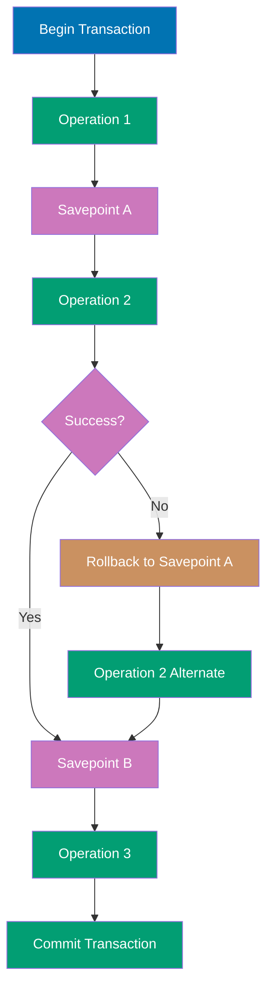

```elixir
defmodule User do
                                      # => Defines User module; Elixir module is just a named atom with function table
  use Ecto.Schema
                                        # => Injects schema/2, field/3, timestamps/1 macros into this module

  schema "users" do
                                        # => Maps to "users" table; Ecto auto-adds :id primary key (bigserial) unless @primary_key false
    field :name, :string
                                          # => VARCHAR column (no length limit unless size: N option added)
    field :balance, :decimal
                                          # => NUMERIC/DECIMAL column (exact arithmetic; prevents floating-point rounding errors)
    timestamps()
                                          # => Adds inserted_at, updated_at (naive_datetime; auto-set by Repo on write)
  end
                                        # => Closes the nearest open block (do...end)
end
                                      # => Closes the nearest open block (do...end)

# Insert test user
{:ok, user} = Repo.insert(%User{name: "Liam", balance: Decimal.new("100.00")})
                                      # => SQL: INSERT INTO ... RETURNING *; user has database-assigned id and timestamps

# Transaction with savepoints
Repo.transaction(fn ->
                                      # => Opens transaction; auto-commits on fn success, rolls back on exception
                                      # => Wraps fn block in BEGIN/COMMIT; auto-rollback on Repo.rollback/1 or exception
  # Update 1: Deduct 20
  changeset1 = Ecto.Changeset.change(user, balance: Decimal.sub(user.balance, Decimal.new("20.00")))
                                        # => Builds changeset with forced change (bypasses cast/2; no type casting or validation)
  {:ok, user_v1} = Repo.update(changeset1)
                                        # => SQL: UPDATE ... SET ... WHERE id=N; user_v1 reflects persisted state
                                      # => balance is 80.00

  # Savepoint
  Repo.transaction(fn ->
                                        # => Opens transaction; auto-commits on fn success, rolls back on exception
                                        # => Wraps fn block in BEGIN/COMMIT; auto-rollback on Repo.rollback/1 or exception
    # Update 2: Deduct another 30
    changeset2 = Ecto.Changeset.change(user_v1, balance: Decimal.sub(user_v1.balance, Decimal.new("30.00")))
                                          # => Builds changeset with forced change (bypasses cast/2; no type casting or validation)
    {:ok, user_v2} = Repo.update(changeset2)
                                          # => SQL: UPDATE ... SET ... WHERE id=N; user_v2 reflects persisted state
                                      # => balance is 50.00

    # Rollback to savepoint (balance back to 80)
    if Decimal.lt?(user_v2.balance, Decimal.new("60.00")) do
                                          # => Decimal.lt? compares exact decimal values (no floating-point rounding)
      Repo.rollback(:insufficient_funds)
                                      # => Rollback inner transaction only
    end
                                          # => Closes the nearest open block (do...end)
  end)
                                        # => Closes do...end block and the enclosing function call

  # Outer transaction continues
  # Balance is still 80.00 (savepoint rollback worked)
  final = Repo.get(User, user.id)     # => final.balance is 80.00
  final
end)
                                      # => Closes do...end block and the enclosing function call

loaded = Repo.get(User, user.id)
                                      # => SQL: SELECT * FROM table WHERE id = user.id; returns struct or nil
IO.inspect(loaded.balance)            # => Output: #Decimal<80.00>
```

**Key Takeaway**: Nested Repo.transaction/1 calls create savepoints automatically in PostgreSQL, allowing partial rollbacks while keeping outer transaction intact.

**Why It Matters**: Complex business operations sometimes need to attempt risky sub-operations that might fail without abandoning the entire transaction. Savepoints enable patterns like "try the fast path, fall back to slow path" within a single atomic transaction. Production financial systems use savepoints for multi-step transfers where individual steps can be retried without restarting the entire operation.

---

### Example 74: Schema-less Changesets for Validation

Changesets can validate data without schemas, useful for form validations or API input validation before persistence.

```elixir
import Ecto.Changeset
                                      # => Imports all public functions from Ecto.Changeset into scope (use alias for explicit control)
                                      # => Brings cast/3, validate_required/2, validate_length/3 into scope

# Schema-less changeset for registration form
def validate_registration(params) do
                                      # => Schemaless validation: validates params without a persistent schema module
                                      # => Public function validate_registration/N; callable from any module
  types = %{
                                        # => Type map for schemaless changeset (no schema module needed)
    email: :string,
                                          # => email field type for cast/4 (schemaless changeset)
    password: :string,
                                          # => password field type for cast/4 (schemaless changeset)
    age: :integer
                                          # => age field type for cast/4 (schemaless changeset)
  }                                   # => Define field types

  {%{}, types}                        # => Empty data, type spec
  |> cast(params, Map.keys(types))    # => Cast params
  |> validate_required([:email, :password])
                                        # => Adds error if :email, :password missing or blank; check changeset.errors before Repo operations
  |> validate_format(:email, ~r/@/)
                                        # => Adds error if :email doesn't match regex; regex run client-side, no DB query
  |> validate_length(:password, min: 8)
                                        # => Adds error if :password length violates constraints (checked against cast value)
  |> validate_number(:age, greater_than_or_equal_to: 18)
                                        # => Adds error if :age fails numeric constraints (greater_than, less_than, etc.)
end
                                      # => Closes the nearest open block (do...end)

# Valid registration
valid_params = %{email: "user@example.com", password: "secure123", age: 25}
changeset = validate_registration(valid_params)
                                      # => changeset.valid? is true; changes contain all valid fields
                                      # => changeset.valid? is true

# Invalid registration
invalid_params = %{email: "invalid", password: "short", age: 15}
invalid_changeset = validate_registration(invalid_params)
                                      # => invalid_changeset.valid? is false; errors populated for each violated rule
                                      # => invalid_changeset.valid? is false
                                      # => errors: [email: {"has invalid format"}, password: {"too short"}, age: {"must be >= 18"}]

IO.inspect(changeset.valid?)          # => Output: true
IO.inspect(invalid_changeset.valid?)  # => Output: false
IO.inspect(invalid_changeset.errors)  # => Output: [email: {...}, password: {...}, age: {...}]
```

**Key Takeaway**: Schema-less changesets validate arbitrary maps against type specs, useful for validating external input before deciding which schema to insert into or for multi-step forms.

**Why It Matters**: Not all validation requires database persistence—search forms, API request validation, and multi-step wizards need validation without schemas. Schema-less changesets enable reusing Ecto's validation ecosystem for any data structure, providing consistent error handling and i18n support. Production systems use this pattern for complex form flows where validation happens before determining which entities to create.

---

### Example 75: Custom Changeset Validators

Create reusable custom validators for domain-specific validation logic by defining functions that add errors to changesets.

```elixir
defmodule CustomValidators do
                                      # => Reusable validation module; imported into schemas that need custom rules
                                      # => Defines CustomValidators module; Elixir module is just a named atom with function table
  import Ecto.Changeset
                                        # => Imports all public functions from Ecto.Changeset into scope (use alias for explicit control)
                                        # => Brings cast/3, validate_required/2, validate_length/3 into scope

  def validate_url(changeset, field) do
                                        # => Reusable URL validator; add to any changeset with |> validate_url(:url)
                                        # => Public function validate_url/N; callable from any module
    validate_change(changeset, field, fn ^field, value ->
                                          # => Custom validation fn; called only when field has value; return [] or [{field, msg}]
      uri = URI.parse(value)
                                            # => Parses URL string into %URI{scheme: "https", host: "...", ...}
      if uri.scheme in ["http", "https"] and uri.host do
                                            # => Evaluates condition; Elixir if is an expression returning a value
        []                            # => Valid URL, no errors
      else
                                            # => Fallback clause in if/else expression
        [{field, "must be a valid HTTP/HTTPS URL"}]
                                              # => Returns error tuple list; Ecto appends to changeset.errors
                                      # => Add error
      end
                                            # => Closes the nearest open block (do...end)
    end)
                                          # => Closes do...end block and the enclosing function call
  end
                                        # => Closes the nearest open block (do...end)

  def validate_not_in_list(changeset, field, forbidden_values) do
                                        # => Reusable blocklist validator; prevents reserved names/emails
                                        # => Public function validate_not_in_list/N; callable from any module
    validate_change(changeset, field, fn ^field, value ->
                                          # => Custom validation fn; called only when field has value; return [] or [{field, msg}]
      if value in forbidden_values do
                                            # => Evaluates condition; Elixir if is an expression returning a value
        [{field, "is reserved and cannot be used"}]
                                              # => Returns error tuple; changeset.errors will contain [{:field, "is reserved..."}]
      else
                                            # => Fallback clause in if/else expression
        []
                                              # => Empty error list: validation passed for this field
      end
                                            # => Closes the nearest open block (do...end)
    end)
                                          # => Closes do...end block and the enclosing function call
  end
                                        # => Closes the nearest open block (do...end)
end
                                      # => Closes the nearest open block (do...end)

defmodule Website do
                                      # => Website schema with custom validators defined separately
                                      # => Defines Website module; Elixir module is just a named atom with function table
  use Ecto.Schema
                                        # => Injects schema/2, field/3, timestamps/1 macros into this module
  import Ecto.Changeset
                                        # => Imports all public functions from Ecto.Changeset into scope (use alias for explicit control)
                                        # => Brings cast/3, validate_required/2, validate_length/3 into scope
  import CustomValidators
                                        # => Brings validate_url/2, validate_not_in_list/3 into scope

  schema "websites" do
                                        # => Maps to "websites" table; Ecto auto-adds :id primary key (bigserial) unless @primary_key false
    field :name, :string
                                          # => VARCHAR column (no length limit unless size: N option added)
    field :url, :string
                                          # => VARCHAR column for URL storage (no format validation at schema level)
                                          # => VARCHAR column (no length limit unless size: N option added)
    timestamps()
                                          # => Adds inserted_at, updated_at (naive_datetime; auto-set by Repo on write)
  end
                                        # => Closes the nearest open block (do...end)

  def changeset(website, params \\ %{}) do
                                        # => Public function changeset/N; callable from any module
    website
    |> cast(params, [:name, :url])
    |> validate_required([:name, :url])
                                          # => Adds error if :name, :url missing or blank; check changeset.errors before Repo operations
    |> validate_url(:url)             # => Custom URL validator
    |> validate_not_in_list(:name, ["admin", "root", "system"])
                                          # => Checks :name against reserved list at changeset level (before DB)
                                      # => Custom forbidden names validator
  end
                                        # => Closes the nearest open block (do...end)
end
                                      # => Closes the nearest open block (do...end)

# Valid website
valid = Website.changeset(%Website{}, %{name: "myblog", url: "https://example.com"})
                                      # => valid.valid? is true; represents a passing validation scenario
                                      # => valid.valid? is true

# Invalid URL
invalid_url = Website.changeset(%Website{}, %{name: "test", url: "not-a-url"})
                                      # => invalid_url.valid? is false; errors on :url field
                                      # => invalid_url.valid? is false
                                      # => errors: [url: {"must be a valid HTTP/HTTPS URL"}]

# Forbidden name
invalid_name = Website.changeset(%Website{}, %{name: "admin", url: "https://example.com"})
                                      # => invalid_name.valid? is false; errors on :name field (reserved word)
                                      # => invalid_name.valid? is false
                                      # => errors: [name: {"is reserved and cannot be used"}]

IO.inspect(valid.valid?)              # => Output: true
IO.inspect(invalid_url.errors)        # => Output: [url: {"must be a valid HTTP/HTTPS URL", [...]}]
```

**Key Takeaway**: Use validate_change/3 to create custom validators that add field-specific errors, and extract common validators into modules for reusability across schemas.

**Why It Matters**: Complex validation (password confirmation, dependent fields, cross-field constraints) requires custom changeset functions beyond built-in validators. Production registration flows use custom changesets to validate password matches, conditional requirements (billing info when paid plan), and business rules spanning multiple fields. This pattern centralizes domain logic and enables testing validation rules independently from database operations.

---

### Example 76: Unsafe Fragments and SQL Injection Prevention

Understanding when fragments are safe vs unsafe is critical for security. Always use parameter binding for user input.

```elixir
defmodule User do
                                      # => Defines User module; Elixir module is just a named atom with function table
  use Ecto.Schema
                                        # => Injects schema/2, field/3, timestamps/1 macros into this module

  schema "users" do
                                        # => Maps to "users" table; Ecto auto-adds :id primary key (bigserial) unless @primary_key false
    field :name, :string
                                          # => VARCHAR column (no length limit unless size: N option added)
    field :email, :string
                                          # => VARCHAR column (no length limit unless size: N option added)
    timestamps()
                                          # => Adds inserted_at, updated_at (naive_datetime; auto-set by Repo on write)
  end
                                        # => Closes the nearest open block (do...end)
end
                                      # => Closes the nearest open block (do...end)

import Ecto.Query
                                      # => Imports all public functions from Ecto.Query into scope (use alias for explicit control)
                                      # => Brings from/2, where/3, select/3, order_by/3, join/5 query macros into scope

# UNSAFE: String interpolation in fragment (NEVER DO THIS)
# user_input = "admin' OR '1'='1"
# unsafe_query = from u in User,
#   where: fragment("email = '#{user_input}'")
                                      # => SQL INJECTION VULNERABILITY!
                                      # => Attacker can inject arbitrary SQL

# SAFE: Parameter binding in fragment
safe_user_input = "admin@example.com"
safe_query = from u in User,
                                      # => Builds Ecto query struct; lazy evaluation - no DB hit until Repo.all/one/etc.
  where: fragment("LOWER(email) = LOWER(?)", ^safe_user_input)
                                      # => SQL: WHERE LOWER(email) = LOWER($1)
                                      # => Database escapes parameter safely

users = Repo.all(safe_query)          # => Safe execution

# SAFE: Ecto DSL (preferred when possible)
safest_query = from u in User,
                                      # => Builds Ecto query struct; lazy evaluation - no DB hit until Repo.all/one/etc.
  where: ilike(u.email, ^safe_user_input)
                                        # => Case-insensitive LIKE search; uses DB-level ilike (index-unfriendly for large tables)
                                      # => Ecto handles escaping automatically

IO.inspect(length(users))             # => Output: count of matching users
```

**Key Takeaway**: Never interpolate user input into fragment strings; always use parameter placeholders (?) with pin operator (^variable) to prevent SQL injection, and prefer Ecto DSL over fragments when possible.

**Why It Matters**: SQL injection remains one of the most critical web vulnerabilities, enabling attackers to read, modify, or delete entire databases. Fragments bypass Ecto's automatic parameterization, making them the most dangerous part of query construction. Production code reviews must scrutinize every fragment for string interpolation, and teams should establish policies preferring Ecto DSL or requiring security review for any fragment usage.

---

### Example 77: Polymorphic Associations with Type Field

Polymorphic associations allow a record to belong to multiple parent types via a type discriminator field, common for comments, attachments, etc.

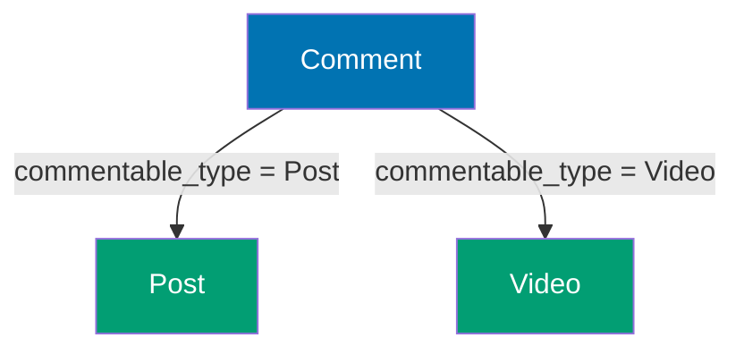

```elixir
defmodule Post do
                                      # => Post module mapping to posts table; declares schema and associations
                                      # => Defines Post module; Elixir module is just a named atom with function table
  use Ecto.Schema
                                        # => Injects schema/2, field/3, timestamps/1 macros into this module

  schema "posts" do
                                        # => Maps to "posts" table; Ecto auto-adds :id primary key (bigserial) unless @primary_key false
    field :title, :string
                                          # => VARCHAR column (no length limit unless size: N option added)
    timestamps()
                                          # => Adds inserted_at, updated_at (naive_datetime; auto-set by Repo on write)
  end
                                        # => Closes the nearest open block (do...end)
end
                                      # => Closes the nearest open block (do...end)

defmodule Video do
                                      # => Defines Video module; Elixir module is just a named atom with function table
  use Ecto.Schema
                                        # => Injects schema/2, field/3, timestamps/1 macros into this module

  schema "videos" do
                                        # => Maps to "videos" table; Ecto auto-adds :id primary key (bigserial) unless @primary_key false
    field :url, :string
                                          # => VARCHAR column for URL storage (no format validation at schema level)
                                          # => VARCHAR column (no length limit unless size: N option added)
    timestamps()
                                          # => Adds inserted_at, updated_at (naive_datetime; auto-set by Repo on write)
  end
                                        # => Closes the nearest open block (do...end)
end
                                      # => Closes the nearest open block (do...end)

defmodule Comment do
                                      # => Defines Comment module; Elixir module is just a named atom with function table
  use Ecto.Schema
                                        # => Injects schema/2, field/3, timestamps/1 macros into this module

  schema "comments" do
                                        # => Maps to "comments" table; Ecto auto-adds :id primary key (bigserial) unless @primary_key false
    field :content, :string
                                          # => VARCHAR column (no length limit unless size: N option added)
    field :commentable_id, :integer   # => Foreign key (polymorphic)
    field :commentable_type, :string  # => Type discriminator ("Post" or "Video")
    timestamps()
                                          # => Adds inserted_at, updated_at (naive_datetime; auto-set by Repo on write)
  end
                                        # => Closes the nearest open block (do...end)

  def for_commentable(query \\ __MODULE__, type, id) do
                                        # => Public function for_commentable/N; callable from any module
    import Ecto.Query
                                          # => Imports all public functions from Ecto.Query into scope (use alias for explicit control)
                                          # => Brings from/2, where/3, select/3, order_by/3, join/5 query macros into scope
    from c in query,
                                          # => Begins Ecto query DSL; no SQL executed yet (lazy query construction)
      where: c.commentable_type == ^type and c.commentable_id == ^id
                                            # => ^type and c.commentable_id == ^id pins Elixir variable into query (prevents SQL injection via parameterized query)
  end
                                        # => Closes the nearest open block (do...end)
end
                                      # => Closes the nearest open block (do...end)

# Create post and video
{:ok, post} = Repo.insert(%Post{title: "My Post"})
                                      # => SQL: INSERT INTO ... RETURNING *; post has database-assigned id and timestamps
{:ok, video} = Repo.insert(%Video{url: "https://example.com/video.mp4"})
                                      # => SQL: INSERT INTO ... RETURNING *; video has database-assigned id and timestamps

# Add comments to different types
{:ok, comment1} = Repo.insert(%Comment{content: "Great post!", commentable_type: "Post", commentable_id: post.id})
                                      # => SQL: INSERT INTO ... RETURNING *; comment1 has database-assigned id and timestamps
{:ok, comment2} = Repo.insert(%Comment{content: "Nice video!", commentable_type: "Video", commentable_id: video.id})
                                      # => SQL: INSERT INTO ... RETURNING *; comment2 has database-assigned id and timestamps

# Query comments for post
post_comments = Comment.for_commentable("Post", post.id) |> Repo.all()
                                      # => post_comments is [%Comment{content: "Great post!"}]

# Query comments for video
video_comments = Comment.for_commentable("Video", video.id) |> Repo.all()
                                      # => video_comments is [%Comment{content: "Nice video!"}]

IO.inspect(length(post_comments))     # => Output: 1
IO.inspect(length(video_comments))    # => Output: 1
```

**Key Takeaway**: Polymorphic associations use type + id fields to reference multiple parent types, but they sacrifice referential integrity (no foreign key constraint) and require manual type checking.

**Why It Matters**: Comments, attachments, and audit logs shared across multiple parent types (users, posts, products) benefit from polymorphic associations that avoid duplicate tables. Production CMS systems use polymorphic patterns for tagging, commenting, and activity tracking without creating comments_for_posts, comments_for_users tables. However, polymorphism sacrifices database foreign keys, so production systems must enforce referential integrity in application code.

---

### Example 78: Using Ecto.Query.API for Type Casting

Ecto.Query.API provides type-safe functions for queries, enabling explicit type casting when needed.

```elixir
defmodule User do
                                      # => Defines User module; Elixir module is just a named atom with function table
  use Ecto.Schema
                                        # => Injects schema/2, field/3, timestamps/1 macros into this module

  schema "users" do
                                        # => Maps to "users" table; Ecto auto-adds :id primary key (bigserial) unless @primary_key false
    field :name, :string
                                          # => VARCHAR column (no length limit unless size: N option added)
    field :data, :map                 # => JSONB field in PostgreSQL
    timestamps()
                                          # => Adds inserted_at, updated_at (naive_datetime; auto-set by Repo on write)
  end
                                        # => Closes the nearest open block (do...end)
end
                                      # => Closes the nearest open block (do...end)

import Ecto.Query
                                      # => Imports all public functions from Ecto.Query into scope (use alias for explicit control)
                                      # => Brings from/2, where/3, select/3, order_by/3, join/5 query macros into scope

# Insert test data with JSON field
Repo.insert(%User{name: "Mia", data: %{"age" => 30, "city" => "NYC"}})
                                      # => SQL: INSERT INTO ... RETURNING *; result discarded (capture for id/timestamps)

# Query JSON field with type casting
query = from u in User,
                                      # => Builds Ecto query struct for User; no SQL executed until Repo operation
  where: fragment("?->>'age' = ?", u.data, type(^"30", :string)),
                                      # => Cast parameter to string type
  select: u

users = Repo.all(query)               # => users is [%User{name: "Mia"}]
                                      # => SQL: WHERE data->>'age' = '30'

# Using Ecto.Query.API.type/2 for explicit casting
typed_query = from u in User,
                                      # => Builds Ecto query struct; lazy evaluation - no DB hit until Repo.all/one/etc.
  where: fragment("(?->>'age')::integer > ?", u.data, type(^25, :integer)),
                                      # => Cast age to integer for comparison
  select: u

typed_users = Repo.all(typed_query)   # => typed_users is [%User{name: "Mia"}]

IO.inspect(length(users))             # => Output: 1
IO.inspect(length(typed_users))       # => Output: 1
```

**Key Takeaway**: Use type/2 to explicitly cast values to specific Ecto types in queries, ensuring type safety when working with JSON fields or dynamic data.

**Why It Matters**: JSON fields and dynamic data don't have compile-time type checking, leading to runtime type coercion errors or incorrect comparisons. Explicit type casting prevents subtle bugs where string "30" doesn't equal integer 30 in database comparisons. Production systems querying JSON data use type/2 to ensure predictable behavior across different database backends and Ecto versions.

---

### Example 79: Repo.exists? for Existence Checks

Repo.exists?/1 checks if any records match a query without loading data, more efficient than counting or fetching records.

```elixir
defmodule User do
                                      # => Defines User module; Elixir module is just a named atom with function table
  use Ecto.Schema
                                        # => Injects schema/2, field/3, timestamps/1 macros into this module

  schema "users" do
                                        # => Maps to "users" table; Ecto auto-adds :id primary key (bigserial) unless @primary_key false
    field :email, :string
                                          # => VARCHAR column (no length limit unless size: N option added)
    field :active, :boolean
                                          # => BOOLEAN column (stored as true/false in PostgreSQL)
    timestamps()
                                          # => Adds inserted_at, updated_at (naive_datetime; auto-set by Repo on write)
  end
                                        # => Closes the nearest open block (do...end)
end
                                      # => Closes the nearest open block (do...end)

import Ecto.Query
                                      # => Imports all public functions from Ecto.Query into scope (use alias for explicit control)
                                      # => Brings from/2, where/3, select/3, order_by/3, join/5 query macros into scope

# Insert test data
Repo.insert(%User{email: "active@example.com", active: true})
                                      # => SQL: INSERT INTO ... RETURNING *; result discarded (capture for id/timestamps)
Repo.insert(%User{email: "inactive@example.com", active: false})
                                      # => SQL: INSERT INTO ... RETURNING *; result discarded (capture for id/timestamps)

# Check if any active users exist
query = from u in User, where: u.active == true

exists = Repo.exists?(query)          # => exists is true
                                      # => SQL: SELECT EXISTS(SELECT 1 FROM users WHERE active = TRUE)
                                      # => Much faster than COUNT or fetching

# Check if specific email exists
email_query = from u in User, where: u.email == "unknown@example.com"
email_exists = Repo.exists?(email_query)
                                      # => email_exists is false

IO.inspect(exists)                    # => Output: true
IO.inspect(email_exists)              # => Output: false
```

**Key Takeaway**: Repo.exists?/1 generates efficient EXISTS SQL queries that short-circuit as soon as one match is found, making it faster than counting for existence checks.

**Why It Matters**: Authorization checks, duplicate detection, and conditional UI rendering often need to know if ANY matching record exists, not the count. Using COUNT(\*) > 0 or Repo.all |> length > 0 wastes resources scanning entire result sets. Production systems use Repo.exists? for permission checks, unique validation previews, and any boolean condition that doesn't need the actual count.

---

### Example 80: Aggregates in Subqueries

Subqueries can compute aggregates that are used in outer query filters, enabling complex filtering based on aggregated data.

```elixir
defmodule User do
                                      # => Defines User module; Elixir module is just a named atom with function table
  use Ecto.Schema
                                        # => Injects schema/2, field/3, timestamps/1 macros into this module

  schema "users" do
                                        # => Maps to "users" table; Ecto auto-adds :id primary key (bigserial) unless @primary_key false
    field :name, :string
                                          # => VARCHAR column (no length limit unless size: N option added)
    has_many :posts, Post
                                          # => Virtual association field; no DB column added; loaded only via Repo.preload/3
    timestamps()
                                          # => Adds inserted_at, updated_at (naive_datetime; auto-set by Repo on write)
  end
                                        # => Closes the nearest open block (do...end)
end
                                      # => Closes the nearest open block (do...end)

defmodule Post do
                                      # => Post module mapping to posts table; declares schema and associations
                                      # => Defines Post module; Elixir module is just a named atom with function table
  use Ecto.Schema
                                        # => Injects schema/2, field/3, timestamps/1 macros into this module

  schema "posts" do
                                        # => Maps to "posts" table; Ecto auto-adds :id primary key (bigserial) unless @primary_key false
    field :title, :string
                                          # => VARCHAR column (no length limit unless size: N option added)
    belongs_to :user, User
                                          # => Adds :USER_id foreign key INTEGER column + :USER virtual field (not preloaded by default)
    timestamps()
                                          # => Adds inserted_at, updated_at (naive_datetime; auto-set by Repo on write)
  end
                                        # => Closes the nearest open block (do...end)
end
                                      # => Closes the nearest open block (do...end)

import Ecto.Query
                                      # => Imports all public functions from Ecto.Query into scope (use alias for explicit control)
                                      # => Brings from/2, where/3, select/3, order_by/3, join/5 query macros into scope

# Insert test data
{:ok, user1} = Repo.insert(%User{name: "Noah"})
                                      # => SQL: INSERT INTO ... RETURNING *; user1 has database-assigned id and timestamps
{:ok, user2} = Repo.insert(%User{name: "Olivia"})
                                      # => SQL: INSERT INTO ... RETURNING *; user2 has database-assigned id and timestamps
Repo.insert(%Post{title: "Post 1", user_id: user1.id})
                                      # => SQL: INSERT INTO ... RETURNING *; result discarded (capture for id/timestamps)
Repo.insert(%Post{title: "Post 2", user_id: user1.id})
                                      # => SQL: INSERT INTO ... RETURNING *; result discarded (capture for id/timestamps)
Repo.insert(%Post{title: "Post 3", user_id: user1.id})
                                      # => SQL: INSERT INTO ... RETURNING *; result discarded (capture for id/timestamps)
Repo.insert(%Post{title: "Post 4", user_id: user2.id})
                                      # => SQL: INSERT INTO ... RETURNING *; result discarded (capture for id/timestamps)

# Find users with more than 2 posts using subquery
post_count_subquery = from p in Post,
                                      # => Builds Ecto query struct; lazy evaluation - no DB hit until Repo.all/one/etc.
  group_by: p.user_id,
  select: %{user_id: p.user_id, count: count(p.id)}

query = from u in User,
                                      # => Builds Ecto query struct for User; no SQL executed until Repo operation
  join: pc in subquery(post_count_subquery), on: pc.user_id == u.id,
  where: pc.count > 2,
  select: u

users = Repo.all(query)               # => users is [%User{name: "Noah"}]
                                      # => SQL: SELECT u.* FROM users u
                                      # =>      JOIN (SELECT user_id, COUNT(id) as count
                                      # =>            FROM posts GROUP BY user_id) pc
                                      # =>      ON pc.user_id = u.id
                                      # =>      WHERE pc.count > 2

IO.inspect(length(users))             # => Output: 1
IO.inspect(hd(users).name)            # => Output: "Noah"
```

**Key Takeaway**: Subqueries with aggregates enable filtering parent records by aggregated child data, and you must join the subquery result to access aggregate values in WHERE clauses.

**Why It Matters**: Complex filters like "users with >10 posts" or "products with total sales >$1000" require aggregating child records and filtering parents by the result. Without subqueries, you'd fetch all parents with children and filter in memory, destroying performance for large datasets. Production analytics and reporting use aggregate subqueries for efficient data-driven filtering that scales to millions of records.

---

### Example 81: Using Repo.in_transaction? for Context Awareness

Repo.in_transaction?/0 checks if code is executing inside a transaction, useful for functions that behave differently in transactional contexts.

```elixir
defmodule UserService do
                                      # => Service module encapsulating complex multi-step business operations
                                      # => Defines UserService module; Elixir module is just a named atom with function table
  def create_user_with_posts(user_params, posts_params) do
                                        # => Public function create_user_with_posts/N; callable from any module
    if Repo.in_transaction?() do
                                          # => Evaluates condition; Elixir if is an expression returning a value
      # Already in transaction, just execute
      do_create_user_with_posts(user_params, posts_params)
                                            # => Calls private helper function; separates public API from transaction logic
    else
                                          # => Fallback clause in if/else expression
      # Not in transaction, wrap in one
      Repo.transaction(fn ->
                                            # => Opens transaction; auto-commits on fn success, rolls back on exception
                                            # => Wraps fn block in BEGIN/COMMIT; auto-rollback on Repo.rollback/1 or exception
        do_create_user_with_posts(user_params, posts_params)
                                              # => Calls private helper function; separates public API from transaction logic
      end)
                                            # => Closes do...end block and the enclosing function call
    end
                                          # => Closes the nearest open block (do...end)
  end
                                        # => Closes the nearest open block (do...end)

  defp do_create_user_with_posts(user_params, posts_params) do
                                        # => Private function do_create_user_with_posts; only callable within this module
                                        # => Private function do_create_user_with_posts/N; only callable within this module
    {:ok, user} = Repo.insert(%User{name: user_params.name})
                                          # => SQL: INSERT INTO ... RETURNING *; user has database-assigned id and timestamps
    posts = Enum.map(posts_params, fn p ->
                                          # => Maps posts_params list to new list; each p element processed by fn
      Repo.insert!(%Post{title: p.title, user_id: user.id})
                                            # => Raises Ecto.InvalidChangesetError on failure (no error tuple returned)
    end)
                                          # => Closes do...end block and the enclosing function call
    {user, posts}
  end
                                        # => Closes the nearest open block (do...end)
end
                                      # => Closes the nearest open block (do...end)

# Call from outside transaction
result1 = UserService.create_user_with_posts(%{name: "Paul"}, [%{title: "Post 1"}])
                                      # => Wrapped in transaction automatically
                                      # => SQL: BEGIN; INSERT users...; INSERT posts...; COMMIT;

# Call from inside transaction
Repo.transaction(fn ->
                                      # => Opens transaction; auto-commits on fn success, rolls back on exception
                                      # => Wraps fn block in BEGIN/COMMIT; auto-rollback on Repo.rollback/1 or exception
  result2 = UserService.create_user_with_posts(%{name: "Quinn"}, [%{title: "Post 2"}])
                                      # => Uses existing transaction (no nested BEGIN)
  result2
end)
                                      # => Closes do...end block and the enclosing function call

IO.inspect("UserService handles transaction context automatically")
                                      # => Prints "UserService handles transaction context automatically" to stdout and returns value (useful for debugging pipelines)
```

**Key Takeaway**: Use Repo.in_transaction?/0 to write functions that adapt to transactional context, avoiding nested transaction overhead when already inside a transaction.

**Why It Matters**: Library functions and service modules don't know their calling context—they might be called standalone or within an existing transaction. Blindly wrapping operations in transactions creates nested savepoints that add overhead and complexity. Production service layers use context detection to provide transactional guarantees when needed while avoiding unnecessary nesting when already protected.

---

### Example 82: Conditional Updates with Repo.update_all and Expressions

Repo.update_all/3 supports complex update expressions including conditionals, enabling atomic updates based on current values.

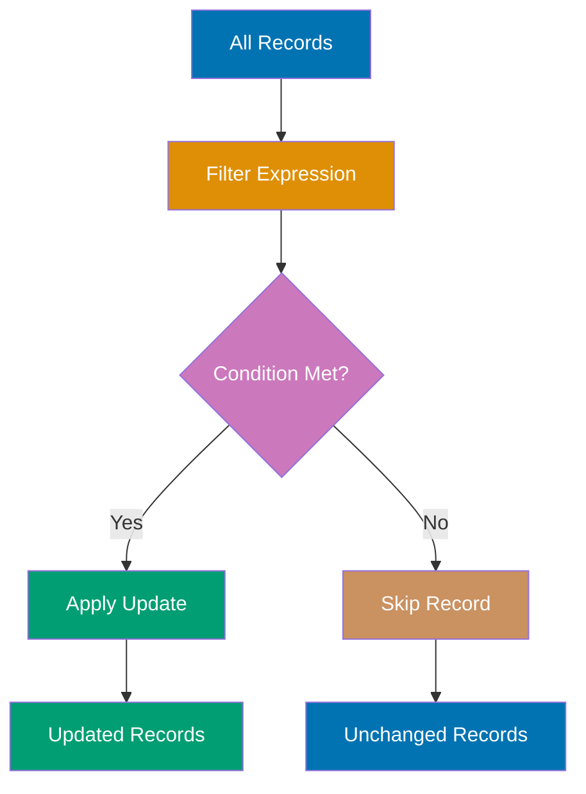

```elixir
defmodule Product do
                                      # => Defines Product module; Elixir module is just a named atom with function table
  use Ecto.Schema
                                        # => Injects schema/2, field/3, timestamps/1 macros into this module

  schema "products" do
                                        # => Maps to "products" table; Ecto auto-adds :id primary key (bigserial) unless @primary_key false
    field :name, :string
                                          # => VARCHAR column (no length limit unless size: N option added)
    field :price, :decimal
                                          # => NUMERIC/DECIMAL column (exact arithmetic; prevents floating-point rounding errors)
    field :discount_percent, :integer
                                          # => INTEGER column (4-byte signed; range -2,147,483,648 to 2,147,483,647)
    timestamps()
                                          # => Adds inserted_at, updated_at (naive_datetime; auto-set by Repo on write)
  end
                                        # => Closes the nearest open block (do...end)
end
                                      # => Closes the nearest open block (do...end)

import Ecto.Query
                                      # => Imports all public functions from Ecto.Query into scope (use alias for explicit control)
                                      # => Brings from/2, where/3, select/3, order_by/3, join/5 query macros into scope

# Insert test data
Repo.insert(%Product{name: "Widget", price: Decimal.new("100.00"), discount_percent: 0})
                                      # => SQL: INSERT INTO ... RETURNING *; result discarded (capture for id/timestamps)
Repo.insert(%Product{name: "Gadget", price: Decimal.new("200.00"), discount_percent: 10})
                                      # => SQL: INSERT INTO ... RETURNING *; result discarded (capture for id/timestamps)

# Apply 10% discount to all products (atomic calculation)
query = from p in Product
                                      # => Minimal query (SELECT * FROM Product); add where/select/order_by to refine

{count, _} = Repo.update_all(query,
  set: [price: dynamic([p], p.price * (1.0 - p.discount_percent / 100.0))]
)                                     # => count is 2
                                      # => SQL: UPDATE products
                                      # =>      SET price = price * (1.0 - discount_percent / 100.0)

# Verify updates
products = Repo.all(Product)
                                      # => SQL: SELECT * FROM table; loads all records into memory (use limit for large tables)
# Widget: 100 * (1.0 - 0/100) = 100.00
# Gadget: 200 * (1.0 - 10/100) = 180.00

IO.inspect(count)                     # => Output: 2
```

**Key Takeaway**: Use dynamic/2 in Repo.update_all/3 to create update expressions based on current field values, enabling atomic updates without read-then-write race conditions.

**Why It Matters**: Atomic updates eliminate race conditions in concurrent systems where multiple processes might read the same value and overwrite each other's changes. Production inventory systems use expressions like stock = stock - 1 instead of read-modify-write patterns that can oversell products. This pattern is essential for counters, balances, and any field where concurrent updates are expected.

---

### Example 83: Repo Callbacks with Ecto.Repo.Callbacks

While Ecto doesn't have built-in repository callbacks, you can implement them using wrapper functions or custom Repo modules.

```elixir
defmodule MyApp.Repo do
                                      # => Custom Repo module extending Ecto.Repo with logging and audit functions
                                      # => Defines MyApp.Repo module; Elixir module is just a named atom with function table
  use Ecto.Repo,
                                        # => Injects Repo functions (insert/2, get/3, all/2, transaction/2, etc.)
    otp_app: :my_app,
                                          # => Config key: looks up :my_app app config for database connection settings
    adapter: Ecto.Adapters.Postgres
                                          # => Postgres-specific driver; swap for MySQL (Myxql) or SQLite3 adapter

  # Wrapper for insert with logging
  def insert_with_logging(changeset_or_struct, opts \\ []) do
                                        # => Wraps Repo.insert with logging; opts forwarded to underlying Repo.insert/2
                                        # => Public function insert_with_logging/N; callable from any module
    result = insert(changeset_or_struct, opts)
                                          # => Calls superclass Repo.insert/2 (no module prefix since we're inside Repo module)

    case result do
                                          # => Pattern match result against clauses below (exhaustive - all cases must match)
      {:ok, struct} ->
                                            # => Successful case: struct is the persisted struct with id and timestamps
        IO.inspect("Inserted: #{inspect(struct)}")
                                              # => Logs success: inspect/1 renders struct as readable string (Elixir debug output)
                                              # => Prints "Inserted: #{inspect(struct)}" to stdout and returns value (useful for debugging pipelines)
        result
                                              # => Last expression in block (implicit return value in Elixir)
                                              # => Last expression in function body (implicit return in Elixir)
      {:error, changeset} ->
                                            # => Error case: changeset is changeset with errors populated
        IO.inspect("Insert failed: #{inspect(changeset.errors)}")
                                              # => Logs failure: changeset.errors shows which fields/rules failed
                                              # => Prints "Insert failed: #{inspect(changeset.errors)}" to stdout and returns value (useful for debugging pipelines)
        result
                                              # => Last expression in block (implicit return value in Elixir)
                                              # => Last expression in function body (implicit return in Elixir)
    end
                                          # => Closes the nearest open block (do...end)
  end
                                        # => Closes the nearest open block (do...end)

  # Wrapper for update with audit
  def update_with_audit(changeset, opts \\ []) do
                                        # => Wraps Repo.update with audit logging; pattern matches on {:ok/:error}
                                        # => Public function update_with_audit/N; callable from any module
    result = update(changeset, opts)
                                          # => Calls Repo.update/2 (self-call within custom Repo module)

    case result do
                                          # => Pattern match result against clauses below (exhaustive - all cases must match)
      {:ok, struct} ->
                                            # => Successful case: struct is the persisted struct with id and timestamps
        # Log audit trail
        IO.inspect("Updated #{struct.__struct__} id=#{struct.id}")
                                              # => Logs struct type and id for audit trail
                                              # => Prints "Updated #{struct.__struct__} id=#{struct.id}" to stdout and returns value (useful for debugging pipelines)
        result
                                              # => Last expression in block (implicit return value in Elixir)
                                              # => Last expression in function body (implicit return in Elixir)
      error ->
                                            # => Catch-all clause: any non-{:ok, _} result returned unchanged
        error
    end
                                          # => Closes the nearest open block (do...end)
  end
                                        # => Closes the nearest open block (do...end)
end
                                      # => Closes the nearest open block (do...end)

defmodule User do
                                      # => Defines User module; Elixir module is just a named atom with function table
  use Ecto.Schema
                                        # => Injects schema/2, field/3, timestamps/1 macros into this module

  schema "users" do
                                        # => Maps to "users" table; Ecto auto-adds :id primary key (bigserial) unless @primary_key false
    field :name, :string
                                          # => VARCHAR column (no length limit unless size: N option added)
    timestamps()
                                          # => Adds inserted_at, updated_at (naive_datetime; auto-set by Repo on write)
  end
                                        # => Closes the nearest open block (do...end)
end
                                      # => Closes the nearest open block (do...end)

# Use custom repo functions
{:ok, user} = MyApp.Repo.insert_with_logging(%User{name: "Ruby"})
                                      # => Uses custom Repo method; internally calls standard Repo.insert/2
                                      # => Output: Inserted: %User{id: 1, name: "Ruby"}

changeset = Ecto.Changeset.change(user, name: "Ruby Updated")
                                      # => Forced changeset (bypasses cast); trusted update for programmatic use
                                      # => Builds changeset with forced change (bypasses cast/2; no type casting or validation)
{:ok, updated} = MyApp.Repo.update_with_audit(changeset)
                                      # => Custom Repo.update with audit logging; returns {:ok, updated_struct}
                                      # => Output: Updated User id=1
```

**Key Takeaway**: Implement custom Repo functions that wrap standard operations to add logging, auditing, or other cross-cutting concerns without polluting business logic.

**Why It Matters**: Cross-cutting concerns like audit logging, metrics collection, and event publishing shouldn't clutter every insert/update call site. Custom repo wrappers centralize these concerns, ensuring consistent behavior across the application. Production systems use this pattern to capture who changed what when, enabling compliance reporting and debugging production issues without modifying business logic code.

---

### Example 84: Schema Reflection with **schema**

Ecto schemas expose metadata via **schema**/1, useful for metaprogramming and building generic functions.

```elixir
defmodule User do
                                      # => Defines User module; Elixir module is just a named atom with function table
  use Ecto.Schema
                                        # => Injects schema/2, field/3, timestamps/1 macros into this module

  schema "users" do
                                        # => Maps to "users" table; Ecto auto-adds :id primary key (bigserial) unless @primary_key false
    field :name, :string
                                          # => VARCHAR column (no length limit unless size: N option added)
    field :email, :string
                                          # => VARCHAR column (no length limit unless size: N option added)
    field :age, :integer
                                          # => INTEGER column (4-byte signed; range -2,147,483,648 to 2,147,483,647)
    has_many :posts, Post
                                          # => Virtual association field; no DB column added; loaded only via Repo.preload/3
    timestamps()
                                          # => Adds inserted_at, updated_at (naive_datetime; auto-set by Repo on write)
  end
                                        # => Closes the nearest open block (do...end)
end
                                      # => Closes the nearest open block (do...end)

# Introspect schema
table = User.__schema__(:source)      # => "users"
primary_key = User.__schema__(:primary_key)
                                      # => Returns [:id] (or custom primary key field name) as list of atoms
                                      # => [:id]
fields = User.__schema__(:fields)     # => [:id, :name, :email, :age, :inserted_at, :updated_at]
associations = User.__schema__(:associations)
                                      # => Returns list of association names (atoms) declared in schema
                                      # => [:posts]
field_type = User.__schema__(:type, :name)
                                      # => Returns Ecto type atom for :name field (e.g., :string, :integer)
                                      # => :string

# Generic function using schema reflection
defmodule SchemaInspector do
                                      # => Utility module using __schema__/1 metadata to inspect Ecto schemas at runtime
                                      # => Defines SchemaInspector module; Elixir module is just a named atom with function table
  def inspect_schema(schema_module) do
                                        # => Runtime schema introspection using __schema__/1 metadata
                                        # => Public function inspect_schema/N; callable from any module
    %{
                                          # => Map literal (key-value pairs for structured data)
      table: schema_module.__schema__(:source),
                                            # => Returns table name string (e.g., "users") from schema metadata
      fields: schema_module.__schema__(:fields),
                                            # => Returns list of field atoms defined in schema (not virtual fields)
      associations: schema_module.__schema__(:associations),
                                            # => Returns list of association names (belongs_to, has_many, etc.)
      primary_key: schema_module.__schema__(:primary_key)
                                            # => Returns primary key field name(s) as list of atoms
    }
                                          # => End of map literal
  end
                                        # => Closes the nearest open block (do...end)
end
                                      # => Closes the nearest open block (do...end)

info = SchemaInspector.inspect_schema(User)
                                      # => info is %{table: "users", fields: [:name, ...], associations: [:posts, ...], primary_key: [:id]}

IO.inspect(info.table)                # => Output: "users"
IO.inspect(info.fields)               # => Output: [:id, :name, :email, :age, :inserted_at, :updated_at]
IO.inspect(info.associations)         # => Output: [:posts]
```

**Key Takeaway**: Use **schema**/1 to introspect schema metadata at runtime, enabling generic functions that work across different schemas without hardcoding field names.

**Why It Matters**: Generic admin interfaces, API serializers, and audit systems need to work across all schemas without hardcoding field lists. Schema reflection enables building reusable components that adapt to any model—forms that render all fields, CSV exports that include every column, or diff views that show all changes. Production admin tooling leverages introspection for maintainability.

---

### Example 85: Production Best Practices Checklist

This example summarizes key patterns and best practices for production Ecto usage, tying together advanced concepts.

```elixir
# 1. ALWAYS use parameter binding (prevent SQL injection)
defmodule SafeQueries do
                                      # => Defines SafeQueries module; Elixir module is just a named atom with function table
  import Ecto.Query
                                        # => Imports all public functions from Ecto.Query into scope (use alias for explicit control)
                                        # => Brings from/2, where/3, select/3, order_by/3, join/5 query macros into scope

  def search_users(name_input) do
                                        # => Public function search_users/N; callable from any module
    from u in User,
                                          # => Start Ecto query; u is the binding alias for User schema fields
                                          # => Begins Ecto query DSL; no SQL executed yet (lazy query construction)
      where: ilike(u.name, ^"%#{name_input}%")
                                            # => Case-insensitive LIKE search; uses DB-level ilike (index-unfriendly for large tables)
                                      # => SAFE: Parameter binding with ^
  end
                                        # => Closes the nearest open block (do...end)
end
                                      # => Closes the nearest open block (do...end)

# 2. ALWAYS preload associations (prevent N+1)
defmodule UserController do
                                      # => Defines UserController module; Elixir module is just a named atom with function table
  def index do
                                        # => Zero-arity public function index/0
    users = User
      |> Repo.all()
                                            # => Executes accumulated query against DB; returns list of structs (may be empty)
                                            # => Executes accumulated query against DB; returns list of structs (may be empty)
      |> Repo.preload(:posts)         # => Load all associations upfront
  end
                                        # => Closes the nearest open block (do...end)
end
                                      # => Closes the nearest open block (do...end)

# 3. Use indexes on foreign keys and WHERE clauses
defmodule Repo.Migrations.AddProductionIndexes do
                                      # => AddProductionIndexes module under Repo.Migrations namespace (common pattern for Repo/Migrations)
                                      # => Defines Repo.Migrations.AddProductionIndexes module; Elixir module is just a named atom with function table
  use Ecto.Migration
                                        # => Provides create/2, alter/2, add/3, index/2 migration DSL (runs in transaction)

  def change do
                                        # => Zero-arity public function change/0
    create index(:posts, [:user_id]) # => Foreign key index
    create index(:users, [:email])   # => Frequently searched field
    create index(:posts, [:published_at], where: "status = 'published'")
                                      # => Partial index
  end
                                        # => Closes the nearest open block (do...end)
end
                                      # => Closes the nearest open block (do...end)

# 4. Use transactions for multi-step operations
defmodule TransferMoney do
                                      # => Defines TransferMoney module; Elixir module is just a named atom with function table
  def transfer(from_id, to_id, amount) do
                                        # => Public function transfer/N; callable from any module
    Repo.transaction(fn ->
                                          # => Opens transaction; auto-commits on fn success, rolls back on exception
                                          # => Wraps fn block in BEGIN/COMMIT; auto-rollback on Repo.rollback/1 or exception
      from_user = Repo.get!(User, from_id)
                                            # => SQL: SELECT * FROM table WHERE id = from_id; raises Ecto.NoResultsError if not found
      to_user = Repo.get!(User, to_id)
                                            # => SQL: SELECT * FROM table WHERE id = to_id; raises Ecto.NoResultsError if not found

      # Deduct from sender
      from_changeset = Ecto.Changeset.change(from_user, balance: Decimal.sub(from_user.balance, amount))
                                            # => Builds changeset with forced change (bypasses cast/2; no type casting or validation)
      {:ok, _} = Repo.update(from_changeset)
                                            # => SQL: UPDATE ... SET ... WHERE id=N; _ reflects persisted state

      # Add to receiver
      to_changeset = Ecto.Changeset.change(to_user, balance: Decimal.add(to_user.balance, amount))
                                            # => Builds changeset with forced change (bypasses cast/2; no type casting or validation)
      {:ok, _} = Repo.update(to_changeset)
                                            # => SQL: UPDATE ... SET ... WHERE id=N; _ reflects persisted state
    end)
                                          # => Closes do...end block and the enclosing function call
  end
                                        # => Closes the nearest open block (do...end)
end
                                      # => Closes the nearest open block (do...end)

# 5. Use Repo.stream for large datasets
defmodule DataExport do
                                      # => Defines DataExport module; Elixir module is just a named atom with function table
  import Ecto.Query
                                        # => Imports all public functions from Ecto.Query into scope (use alias for explicit control)
                                        # => Brings from/2, where/3, select/3, order_by/3, join/5 query macros into scope

  def export_users do
                                        # => Zero-arity public function export_users/0
    Repo.transaction(fn ->
                                          # => Opens transaction; auto-commits on fn success, rolls back on exception
                                          # => Wraps fn block in BEGIN/COMMIT; auto-rollback on Repo.rollback/1 or exception
      User
                                            # => Ecto queryable; equivalent to from(u in User)
      |> Repo.stream()                # => Stream instead of loading all
      |> Stream.map(&format_user/1)
      |> Enum.to_list()
                                            # => Materializes stream into List; loads all results into memory
    end)
                                          # => Closes do...end block and the enclosing function call
  end
                                        # => Closes the nearest open block (do...end)

  defp format_user(user), do: "#{user.name},#{user.email}"
end
                                      # => Closes the nearest open block (do...end)

# 6. Use unique constraints for data integrity
defmodule User do
                                      # => Defines User module; Elixir module is just a named atom with function table
  use Ecto.Schema
                                        # => Injects schema/2, field/3, timestamps/1 macros into this module
  import Ecto.Changeset
                                        # => Imports all public functions from Ecto.Changeset into scope (use alias for explicit control)
                                        # => Brings cast/3, validate_required/2, validate_length/3 into scope

  schema "users" do
                                        # => Maps to "users" table; Ecto auto-adds :id primary key (bigserial) unless @primary_key false
    field :email, :string
                                          # => VARCHAR column (no length limit unless size: N option added)
    timestamps()
                                          # => Adds inserted_at, updated_at (naive_datetime; auto-set by Repo on write)
  end
                                        # => Closes the nearest open block (do...end)

  def changeset(user, params) do
                                        # => Public function changeset/N; callable from any module
    user
                                          # => Last expression in block (implicit return value in Elixir)
                                          # => Existing struct passed to changeset (tracks original values for diffing)
    |> cast(params, [:email])
    |> validate_required([:email])
                                          # => Adds error if :email missing or blank; check changeset.errors before Repo operations
    |> unique_constraint(:email)      # => Enforce uniqueness
  end
                                        # => Closes the nearest open block (do...end)
end
                                      # => Closes the nearest open block (do...end)

# 7. Use Ecto.Multi for complex transactions
defmodule CreateUserWithPosts do
                                      # => Defines CreateUserWithPosts module; Elixir module is just a named atom with function table
  alias Ecto.Multi
                                        # => Creates local alias Multi for Ecto.Multi (reduces repetition in this module)
                                        # => Multi groups multiple Repo operations into a single atomic transaction

  def create(user_params, posts_params) do
                                        # => Public function create/N; callable from any module
    Multi.new()
                                          # => Creates empty Multi pipeline; operations added lazily, executed atomically
    |> Multi.insert(:user, %User{name: user_params.name})
                                          # => Adds named :user insert step to Multi pipeline (not executed yet)
                                          # => Adds named :user insert to transaction pipeline (not executed yet)
    |> Multi.insert_all(:posts, Post, fn %{user: user} ->
      Enum.map(posts_params, &Map.put(&1, :user_id, user.id))
    end)
                                          # => Closes do...end block and the enclosing function call
    |> Repo.transaction()
                                          # => Executes all Multi steps atomically; returns {:ok, results} or {:error, step, reason, changes}
  end
                                        # => Closes the nearest open block (do...end)
end
                                      # => Closes the nearest open block (do...end)

# 8. Use EXPLAIN to verify query plans
defmodule QueryAnalyzer do
                                      # => Defines QueryAnalyzer module; Elixir module is just a named atom with function table
  import Ecto.Query
                                        # => Imports all public functions from Ecto.Query into scope (use alias for explicit control)
                                        # => Brings from/2, where/3, select/3, order_by/3, join/5 query macros into scope

  def analyze_query do
                                        # => Zero-arity public function analyze_query/0
    query = from u in User,
                                          # => Builds Ecto query struct for User; no SQL executed until Repo operation
      join: p in assoc(u, :posts),
      where: p.published == true

    Ecto.Adapters.SQL.explain(Repo, :all, query)
                                      # => Check if indexes are used
  end
                                        # => Closes the nearest open block (do...end)
end
                                      # => Closes the nearest open block (do...end)

# 9. Use optimistic locking for concurrent updates
defmodule Product do
                                      # => Defines Product module; Elixir module is just a named atom with function table
  use Ecto.Schema
                                        # => Injects schema/2, field/3, timestamps/1 macros into this module

  schema "products" do
                                        # => Maps to "products" table; Ecto auto-adds :id primary key (bigserial) unless @primary_key false
    field :name, :string
                                          # => VARCHAR column (no length limit unless size: N option added)
    field :stock, :integer
                                          # => INTEGER column (4-byte signed; range -2,147,483,648 to 2,147,483,647)
    field :version, :integer, default: 1
                                          # => INTEGER column with application-side default 1 (not a DB constraint)
                                      # => Optimistic lock
    timestamps()
                                          # => Adds inserted_at, updated_at (naive_datetime; auto-set by Repo on write)
  end
                                        # => Closes the nearest open block (do...end)
end
                                      # => Closes the nearest open block (do...end)

# 10. Validate at changeset level, not database level
defmodule Order do
                                      # => Defines Order module; Elixir module is just a named atom with function table
  use Ecto.Schema
                                        # => Injects schema/2, field/3, timestamps/1 macros into this module
  import Ecto.Changeset
                                        # => Imports all public functions from Ecto.Changeset into scope (use alias for explicit control)
                                        # => Brings cast/3, validate_required/2, validate_length/3 into scope

  schema "orders" do
                                        # => Maps to "orders" table; Ecto auto-adds :id primary key (bigserial) unless @primary_key false
    field :total, :decimal
                                          # => NUMERIC/DECIMAL column (exact arithmetic; prevents floating-point rounding errors)
    field :status, :string
                                          # => VARCHAR column for status enum (consider :atom type or Ecto.Enum in production)
                                          # => VARCHAR column (no length limit unless size: N option added)
    timestamps()
                                          # => Adds inserted_at, updated_at (naive_datetime; auto-set by Repo on write)
  end
                                        # => Closes the nearest open block (do...end)

  def changeset(order, params) do
                                        # => Public function changeset/N; callable from any module
    order
    |> cast(params, [:total, :status])
    |> validate_required([:total, :status])
                                          # => Adds error if :total, :status missing or blank; check changeset.errors before Repo operations
    |> validate_number(:total, greater_than: 0)
                                          # => Adds error if :total fails numeric constraints (greater_than, less_than, etc.)
    |> validate_inclusion(:status, ["pending", "confirmed", "shipped"])
                                          # => Adds error if :status not in allowed values; prevents invalid enum states
                                      # => Validate before database
  end
                                        # => Closes the nearest open block (do...end)
end
                                      # => Closes the nearest open block (do...end)
```

**Key Takeaway**: Production Ecto requires: parameter binding for security, preloading for performance, indexes for speed, transactions for consistency, streaming for large data, constraints for integrity, Multi for complex operations, EXPLAIN for optimization, optimistic locking for concurrency, and changeset validation for data quality.

**Why It Matters**: Database code in production faces challenges absent in development—concurrent users, large datasets, network partitions, and security threats. These ten practices address the most common causes of production incidents: SQL injection, N+1 queries, missing indexes, data corruption, and memory exhaustion. Teams that internalize these patterns ship faster with fewer production bugs and performance emergencies.

---

## Summary

**Advanced Examples (61-85)** covered 75-95% of Ecto functionality:

- **Dynamic Queries**: Building WHERE and ORDER BY clauses programmatically based on runtime parameters
- **Custom Types**: Implementing Ecto.Type and parameterized types for encryption, enums, and custom serialization
- **Performance Optimization**: Indexes, EXPLAIN analysis, streaming large datasets, query preparation
- **Advanced Patterns**: Optimistic locking, polymorphic associations, schema reflection, subqueries with aggregates
- **Transactions**: Savepoints, Ecto.Multi, conditional updates, transaction context awareness
- **Security**: SQL injection prevention, parameter binding, safe fragments
- **Production Best Practices**: N+1 prevention, unique constraints, validation strategies, audit logging

**Congratulations!** You've completed all 85 Elixir Ecto by-example tutorials, achieving 95% coverage of production Ecto patterns. You now have the knowledge to build efficient, secure, and scalable data access layers with Ecto.

## Next Steps

- Practice building a full application using these patterns
- Explore Ecto's database-specific features (PostgreSQL arrays, JSON operators, etc.)
- Learn about testing Ecto code with sandbox mode and factories
- Study performance profiling with Ecto.Repo telemetry events
- Contribute to Ecto or build your own custom adapters

For questions or feedback, refer to the [Ecto documentation](https://hexdocs.pm/ecto/) and the vibrant Elixir community.
