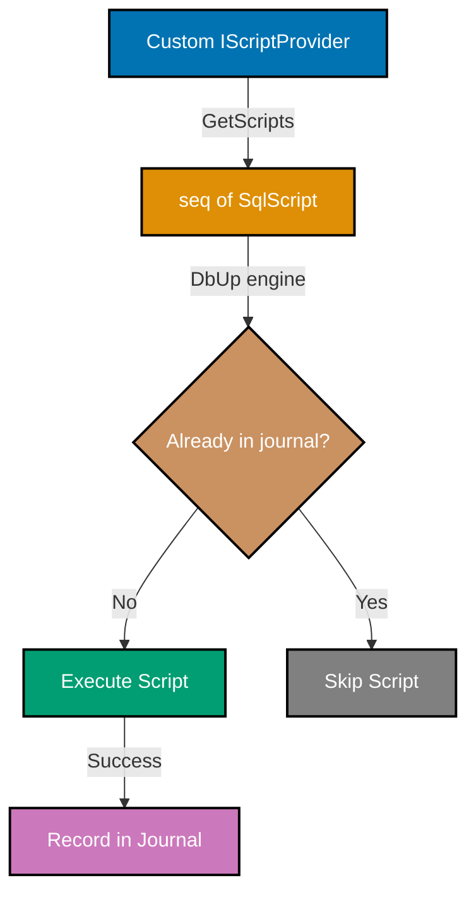
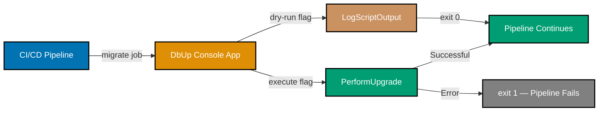

## Advanced Examples (61-85)

**Coverage**: 75-95% of DbUp functionality

**Focus**: Custom extension points, zero-downtime migration patterns, CI/CD integration, production operations, and monitoring strategies.

These examples assume you understand beginner and intermediate concepts (DeployChanges builder, embedded scripts, transactions, filters, variables). All F# examples are self-contained runnable snippets; SQL examples are standalone migration files.

---

### Example 61: Custom IScriptProvider

`IScriptProvider` is the DbUp extension point responsible for supplying the list of `SqlScript` objects to execute. The built-in providers load from embedded resources or the filesystem. A custom provider can load scripts from any source: a database table, an HTTP API, or an in-memory collection generated at runtime.



```fsharp
open DbUp
open DbUp.Engine
open DbUp.Engine.Transactions
open System.Reflection

// A script provider that generates scripts from an in-memory list
// => Useful for tests, dynamic migration generation, or remote script sources
type InMemoryScriptProvider(scripts: (string * string) list) =
    // => scripts is a list of (scriptName, sqlContent) tuples
    // => Tuple ordering matches DbUp's execution order when sorted by name

    interface IScriptProvider with
        member _.GetScripts(connectionManager) =
            // => connectionManager: IConnectionManager — provided by DbUp if the provider needs DB access
            // => Returning IEnumerable<SqlScript>; DbUp iterates this lazily during PerformUpgrade
            scripts
            // => Map each (name, content) pair to a SqlScript value object
            |> List.map (fun (name, content) ->
                // => SqlScript(name, content) — name is the unique identifier stored in the journal
                // => content is the raw SQL that DbUp executes verbatim
                SqlScript(name, content))
            // => Convert F# list to .NET IEnumerable<SqlScript>
            |> List.toSeq

// Instantiate with inline scripts — handy for integration tests
let provider =
    InMemoryScriptProvider([
        // => Script names must be unique and stable; changing a name causes a re-run
        "0001-create-products.sql", "CREATE TABLE products (id SERIAL PRIMARY KEY, name TEXT NOT NULL);"
        "0002-seed-products.sql",   "INSERT INTO products (name) VALUES ('Widget'), ('Gadget');"
    ])
// => provider.GetScripts returns 2 SqlScript objects in list order

let engine =
    DeployChanges.To
        .PostgresqlDatabase(System.Environment.GetEnvironmentVariable("DATABASE_URL"))
        // => WithScripts accepts any IScriptProvider implementation
        .WithScripts(provider)
        .LogToConsole()
        .Build()
// => engine will execute both inline scripts on first run; skip on subsequent runs
```

**Key Takeaway**: Implement `IScriptProvider` to source migration scripts from any location — a database table, an S3 bucket, or a computed in-memory list — without changing the DbUp execution pipeline.

**Why It Matters**: Production platforms sometimes store compliance-driven migrations in a secured repository separate from application source code. A custom `IScriptProvider` bridges that gap: the DbUp engine remains unchanged while the source of truth moves to wherever governance requires. This pattern is also invaluable in test suites where generating minimal, focused schemas programmatically is faster and more readable than maintaining a large set of embedded SQL files.

---

### Example 62: Custom IScriptExecutor

`IScriptExecutor` controls how DbUp runs each individual `SqlScript`. The default executor splits on `GO` separators and executes each batch sequentially. A custom executor can add instrumentation, retry logic, per-script timeouts, or routing to multiple databases simultaneously.

```fsharp
open DbUp
open DbUp.Engine
open DbUp.Engine.Output
open DbUp.Engine.Transactions
open System
open System.Reflection

// Custom executor that logs timing around the default execution
// => Wraps DbUp's built-in PostgresqlScriptExecutor to add telemetry
type TimingScriptExecutor(inner: IScriptExecutor, logger: IUpgradeLog) =
    // => inner: the real executor supplied by the PostgreSQL provider
    // => logger: DbUp's structured logger; outputs to console, NLog, Serilog, etc.

    interface IScriptExecutor with
        member _.Execute(script, variables) =
            // => script: SqlScript — name + content to execute
            // => variables: IDictionary<string,string> — substitution variables from WithVariables
            let sw = System.Diagnostics.Stopwatch.StartNew()
            // => sw starts immediately; elapsed is available as sw.Elapsed after Stop
            logger.WriteInformation("Starting script {0}", [| script.Name |])
            // => WriteInformation writes to the configured log sink; {0} is positional placeholder

            try
                // => Delegate actual execution to the real PostgreSQL executor
                inner.Execute(script, variables)
                // => Returns unit; throws SqlException on script failure
            finally
                sw.Stop()
                // => sw.Elapsed is the wall-clock duration of the script
                logger.WriteInformation(
                    "Finished script {0} in {1}ms",
                    [| script.Name; sw.ElapsedMilliseconds |])
                // => Log line appears in console output alongside DbUp's normal messages

// Note: Wiring a custom IScriptExecutor requires subclassing the provider or using
// the lower-level UpgradeEngineBuilder API — the builder's .WithScriptExecutor() extension
// point accepts any IScriptExecutor implementation
let engine =
    DeployChanges.To
        .PostgresqlDatabase(System.Environment.GetEnvironmentVariable("DATABASE_URL"))
        .WithScriptsEmbeddedInAssembly(Assembly.GetExecutingAssembly())
        .LogToConsole()
        // => Build() returns UpgradeEngine; the builder exposes WithScriptExecutor internally
        .Build()
// => In practice: subclass UpgradeEngineBuilder and override CreateScriptExecutor
// => to return TimingScriptExecutor(base.CreateScriptExecutor(), logger)
```

**Key Takeaway**: Wrap the default `IScriptExecutor` to add cross-cutting concerns — timing, retries, circuit breakers, or multi-database fan-out — without modifying individual migration scripts.

**Why It Matters**: Database migration latency is invisible in standard DbUp output. Production incidents frequently stem from a single slow migration that exceeds a connection or deployment timeout. A timing executor surfaces per-script durations in deployment logs, enabling SREs to spot regressions before they cause outages. This approach keeps instrumentation logic in one place rather than scattering `Stopwatch` calls across dozens of SQL files.

---

### Example 63: Custom IJournal Implementation

The `IJournal` interface persists and queries the set of already-executed scripts. The default PostgreSQL journal stores records in a `schemaversions` table. A custom journal can store this state in Redis, a flat file, an object store, or a remote service — useful for environments where DDL against the target database is prohibited.

```fsharp
open DbUp.Engine.Output
open DbUp.Engine.Transactions
open DbUp

// In-memory journal — records nothing to disk; every run re-executes all scripts
// => Primary use case: idempotent scripts in local dev where a clean DB is cheap
type AlwaysRunJournal() =
    // => Implements IJournal with no persistent storage
    // => Useful when scripts contain only CREATE OR REPLACE / IF NOT EXISTS DDL

    interface DbUp.Engine.IJournal with
        member _.GetExecutedScripts() =
            // => Returns the set of script names DbUp considers "already done"
            // => Returning empty array means every script is always "pending"
            [||]
            // => [||] : string[] — .NET empty array; zero allocation

        member _.StoreExecutedScript(script, dbCommandFactory) =
            // => Called after each successful script execution
            // => script: SqlScript — the just-executed script
            // => dbCommandFactory: Func<IDbCommand> — creates a DB command on the active connection
            // => No-op: we intentionally discard the record
            ()
            // => () is F#'s unit value; equivalent to void return

// Wire the custom journal into the engine
let engine =
    DeployChanges.To
        .PostgresqlDatabase(System.Environment.GetEnvironmentVariable("DATABASE_URL"))
        .WithScriptsEmbeddedInAssembly(System.Reflection.Assembly.GetExecutingAssembly())
        // => JournalTo accepts any IJournal implementation
        .JournalTo(AlwaysRunJournal())
        // => AlwaysRunJournal() is the custom journal instance
        .LogToConsole()
        .Build()
// => Every PerformUpgrade call executes ALL scripts regardless of prior runs
// => Appropriate only for idempotent scripts (CREATE TABLE IF NOT EXISTS, etc.)
```

**Key Takeaway**: Replace the default journal with any `IJournal` implementation to store migration state in Redis, a file, or an external service — or use `AlwaysRunJournal` for truly idempotent script sets.

**Why It Matters**: Some regulated environments prohibit creating tables in the application database. A file-based or Redis-backed journal stores migration state externally while still leveraging DbUp's ordering and execution pipeline. Conversely, the always-run journal paired with fully idempotent SQL (using `IF NOT EXISTS`, `CREATE OR REPLACE`) is the simplest approach for local development resets, where recreating the schema from scratch is cheaper than managing incremental state.

---

### Example 64: Zero-Downtime Column Addition

Adding a column with a `DEFAULT` value and `NOT NULL` in older PostgreSQL versions causes a full table rewrite, locking writes for minutes on large tables. PostgreSQL 11+ adds columns with constant defaults instantly. For older versions or non-constant defaults, use a two-phase approach.

```sql
-- File: 0064-add-status-column-phase1.sql
-- => Phase 1: add nullable column with no server default
-- => This is instantaneous on all PostgreSQL versions — no table rewrite
ALTER TABLE orders ADD COLUMN IF NOT EXISTS status TEXT;
-- => status column exists; all existing rows have status = NULL
-- => Application code must tolerate NULL status during the migration window

-- Add a default at the column level for new inserts
-- => DEFAULT 'pending' applies only to INSERT statements going forward
-- => Existing rows remain NULL until the backfill migration runs
ALTER TABLE orders ALTER COLUMN status SET DEFAULT 'pending';
-- => After this statement: new rows get status='pending'; old rows still NULL

-- Add the NOT NULL constraint as NOT VALID (skips existing rows)
-- => NOT VALID means PostgreSQL validates only new/updated rows, not the full table
-- => This is an instant metadata operation; no table scan
ALTER TABLE orders ADD CONSTRAINT orders_status_not_null
    CHECK (status IS NOT NULL) NOT VALID;
-- => Constraint exists but is marked invalid; existing NULLs are tolerated temporarily
```

**Key Takeaway**: Add the column as nullable first, set the default for new inserts, then add a `NOT VALID` constraint — all three steps are near-instant, lock-free operations compatible with live traffic.

**Why It Matters**: A naive `ALTER TABLE orders ADD COLUMN status TEXT NOT NULL DEFAULT 'pending'` acquires an `ACCESS EXCLUSIVE` lock on a large `orders` table for the duration of the full table rewrite — potentially minutes in production. The two-phase approach keeps the table writable throughout deployment. Phase 2 (backfilling existing rows and validating the constraint) can be run later during low-traffic hours without blocking the initial deployment.

---

### Example 65: Zero-Downtime Column Removal (3-Phase)

Removing a column safely requires three coordinated releases: first make application code tolerant of the column's absence, then drop the column, then clean up dead code. Dropping in a single step risks errors if application code still references the column at the moment the migration runs.

```sql
-- File: 0065-remove-legacy-notes-phase1.sql
-- => Phase 1 (Release N): Deploy BEFORE any application change
-- => No SQL needed — this file documents the phase for audit trail

-- Phase 1 goal: ensure all application queries use SELECT <explicit columns>
-- instead of SELECT * so they do not depend on "notes" being present.
-- Deploy this empty migration to record that phase 1 is complete in the journal.
SELECT 1;
-- => SELECT 1 is a no-op DML statement; DbUp executes and journals it
-- => The journal entry marks phase 1 complete in every environment
```

```sql
-- File: 0065-remove-legacy-notes-phase2.sql
-- => Phase 2 (Release N+1): Drop the column after application code is clean
-- => All app instances must be on Release N before this migration runs

ALTER TABLE users DROP COLUMN IF EXISTS notes;
-- => DROP COLUMN IF EXISTS: safe if the column was already removed in a prior run
-- => IF EXISTS prevents errors in environments where the column was never added
-- => PostgreSQL marks the column as dropped in pg_attribute immediately
-- => The space is reclaimed during the next VACUUM FULL (not an immediate rewrite)
```

**Key Takeaway**: Split column removal across at least two releases — one to clean up application references, one to drop the column — with `IF EXISTS` to guard against partial rollouts.

**Why It Matters**: Blue-green deployments and rolling restarts mean old and new application instances run simultaneously during deployment. If the migration drops a column while old instances are still serving traffic and referencing that column in queries, every request hitting an old instance fails with a column-not-found error. The three-phase pattern eliminates this race condition by ensuring the column is absent from code before it is absent from the schema.

---

### Example 66: Large Table Migration with Batched Updates

Updating millions of rows in a single `UPDATE` statement holds a row-level lock for the entire duration, blocking concurrent writes and potentially causing replica lag. Batched updates reduce lock contention by processing rows in small chunks with commits between each batch.

```sql
-- File: 0066-backfill-currency-batched.sql
-- => Backfill NULL currency values to 'USD' in batches of 10,000 rows
-- => Each DO block is a single transaction; psql auto-commits after the block

DO $$
DECLARE
    -- => DECLARE block defines PL/pgSQL variables
    v_batch_size INT := 10000;
    -- => v_batch_size: rows per batch; tune between 1,000 and 50,000 based on row width
    v_rows_updated INT := 1;
    -- => v_rows_updated: tracks rows affected in last batch; loop continues while > 0
    v_total INT := 0;
    -- => v_total: cumulative counter for logging purposes
BEGIN
    -- => LOOP ... END LOOP: PL/pgSQL infinite loop; EXIT WHEN breaks the loop
    LOOP
        UPDATE orders
        SET    currency = 'USD'
        WHERE  currency IS NULL
        -- => LIMIT in UPDATE requires a subquery in PostgreSQL
        AND    id IN (
                   SELECT id FROM orders
                   WHERE  currency IS NULL
                   -- => ORDER BY id ensures deterministic batch selection
                   ORDER  BY id
                   LIMIT  v_batch_size
               );
        -- => GET DIAGNOSTICS captures metadata about the last DML statement
        GET DIAGNOSTICS v_rows_updated = ROW_COUNT;
        -- => v_rows_updated is now the number of rows modified in this iteration
        v_total := v_total + v_rows_updated;
        RAISE NOTICE 'Backfilled % rows (total: %)', v_rows_updated, v_total;
        -- => RAISE NOTICE writes to the PostgreSQL log and psql console
        EXIT WHEN v_rows_updated = 0;
        -- => EXIT WHEN: break the loop when no more NULL rows remain
    END LOOP;
    RAISE NOTICE 'Backfill complete. Total rows updated: %', v_total;
END $$;
-- => After completion: all orders.currency values are 'USD' or a non-NULL value
-- => Each 10,000-row batch committed independently; WAL lag stays bounded
```

**Key Takeaway**: Use a `DO $$` PL/pgSQL loop with `LIMIT` and `GET DIAGNOSTICS` to backfill large tables in small, independently committed batches that keep write locks short and replica lag low.

**Why It Matters**: A single `UPDATE orders SET currency = 'USD' WHERE currency IS NULL` on a 50-million-row table can run for 20+ minutes, generate gigabytes of WAL, and cause replica lag that degrades read performance across the entire application. Batched updates keep each transaction small, release locks quickly, and allow replicas to catch up between batches. The `RAISE NOTICE` statements provide real-time progress visible in deployment logs without adding external tooling.

---

### Example 67: Online Index Creation (CONCURRENTLY)

PostgreSQL's standard `CREATE INDEX` acquires a `ShareLock` that blocks all writes for the index build duration. `CREATE INDEX CONCURRENTLY` builds the index without blocking writes, making it safe to run on live production tables.

```sql
-- File: 0067-create-index-concurrently.sql
-- => CREATE INDEX CONCURRENTLY must run OUTSIDE a transaction block
-- => DbUp's WithTransactionPerScript wraps each script; use WithoutTransaction for this file

-- Disable the transaction for this script using DbUp's script annotation
-- => DbUp recognizes the comment prefix "-- DbUp:NoTransaction" and skips the transaction wrapper
-- DbUp:NoTransaction

-- Create a non-blocking index on orders.customer_id
CREATE INDEX CONCURRENTLY IF NOT EXISTS idx_orders_customer_id
    ON orders (customer_id);
-- => CONCURRENTLY: two-phase build; reads existing rows twice; allows concurrent writes
-- => IF NOT EXISTS: idempotent; safe to re-run if deployment fails mid-way
-- => Estimated time: ~1s per million rows on typical hardware
-- => Lock acquired: ShareUpdateExclusiveLock — blocks only DDL, not DML

-- Create a partial index for active orders only (reduces index size)
CREATE INDEX CONCURRENTLY IF NOT EXISTS idx_orders_active_status
    ON orders (created_at DESC)
    WHERE status = 'active';
-- => Partial index: only rows where status='active' are indexed
-- => Smaller index = faster maintenance; fits common query pattern WHERE status='active'
-- => If the query planner ignores this index, check that the WHERE predicate matches exactly
```

**Key Takeaway**: Annotate scripts with `-- DbUp:NoTransaction` and use `CREATE INDEX CONCURRENTLY IF NOT EXISTS` to build indexes on live production tables without blocking writes.

**Why It Matters**: A standard `CREATE INDEX` on a 10-million-row table can block all writes for several minutes in production. `CONCURRENTLY` eliminates that risk at the cost of roughly twice the build time. The `IF NOT EXISTS` guard makes the script safe to retry after a failed deployment. Partial indexes reduce index size and write amplification for tables with common filter patterns, improving both query speed and INSERT performance.

---

### Example 68: Data Backfill Pattern

Data backfills populate new columns from existing data. The safest pattern is: add the column as nullable, verify the backfill query with a dry run, execute the batched backfill, then apply the `NOT NULL` constraint.

```sql
-- File: 0068-backfill-full-name.sql
-- => Derives full_name from first_name + last_name for all existing users
-- => Assumes 0064-style column was added as nullable in a prior migration

-- Step 1: Verify the transformation before mutating data
-- => Run this SELECT in a transaction you will ROLLBACK to preview results
SELECT
    id,
    first_name,
    last_name,
    -- => TRIM removes leading/trailing whitespace from concatenation
    -- => NULLIF converts empty string to NULL to avoid trailing spaces
    TRIM(COALESCE(first_name, '') || ' ' || COALESCE(last_name, '')) AS computed_full_name
FROM   users
WHERE  full_name IS NULL
LIMIT  10;
-- => Review the first 10 rows before committing the full backfill
-- => COALESCE: replaces NULL with empty string to prevent "NULL Smith" results

-- Step 2: Execute the backfill
UPDATE users
SET    full_name = TRIM(COALESCE(first_name, '') || ' ' || COALESCE(last_name, ''))
WHERE  full_name IS NULL;
-- => WHERE full_name IS NULL: idempotent; safe to re-run
-- => Only rows with no full_name are affected; already-backfilled rows are untouched

-- Step 3: Validate the result before adding NOT NULL
DO $$
BEGIN
    -- => Raise an error if any NULL remains, aborting the migration
    IF EXISTS (SELECT 1 FROM users WHERE full_name IS NULL OR full_name = '') THEN
        RAISE EXCEPTION 'Backfill incomplete: NULL or empty full_name found';
        -- => RAISE EXCEPTION: rolls back the transaction and marks DbUp script as failed
    END IF;
    RAISE NOTICE 'Backfill validated: all full_name values populated';
END $$;
-- => If the EXCEPTION fires, DbUp records a failure and stops further scripts

-- Step 4: Make the column non-nullable now that all rows are populated
ALTER TABLE users ALTER COLUMN full_name SET NOT NULL;
-- => Safe because the validation block above confirmed no NULLs remain
```

**Key Takeaway**: Combine a dry-run `SELECT`, an idempotent `UPDATE`, a validation `DO $$` block, and a final `ALTER COLUMN … SET NOT NULL` to backfill columns safely with built-in rollback protection.

**Why It Matters**: Backfill mistakes — wrong concatenation, missed NULL handling, partial completion due to a timeout — can corrupt data silently. The validation block turns silent corruption into a loud, transaction-safe failure that prevents subsequent migrations from running on inconsistent data. Embedding the validation inside the migration script ensures it is always executed in every environment, not just when an engineer remembers to run it manually.

---

### Example 69: DbUp in CI/CD Pipeline

Running DbUp as part of a CI/CD pipeline requires dry-run detection, error handling, and non-zero exit codes on failure. This F# console application pattern is the standard entry point for containerised deployment jobs.



```fsharp
open DbUp
open System
open System.Reflection

// Entry point for the migration console application
// => argv: string[] from command-line arguments; "--dry-run" flag controls behaviour
[<EntryPoint>]
let main argv =
    let connString =
        // => Fail fast if DATABASE_URL is missing; null dereference later is harder to debug
        match Environment.GetEnvironmentVariable("DATABASE_URL") with
        | null | "" -> failwith "DATABASE_URL environment variable is required"
        // => failwith raises System.Exception and terminates with exit code 1 via unhandled exception
        | s -> s
        // => s: the connection string value from the environment

    let isDryRun =
        // => Array.exists: returns true if any element satisfies the predicate
        argv |> Array.exists (fun a -> a = "--dry-run")
        // => isDryRun is true when the pipeline passes "--dry-run" as an argument

    let engine =
        DeployChanges.To
            .PostgresqlDatabase(connString)
            .WithScriptsEmbeddedInAssembly(Assembly.GetExecutingAssembly())
            .LogToConsole()
            .Build()
    // => engine.PerformUpgrade() executes pending scripts and returns DatabaseUpgradeResult

    if isDryRun then
        // => Dry run: log which scripts would execute without applying them
        printfn "=== DRY RUN: scripts that would be applied ==="
        for script in engine.GetScriptsToExecute() do
            // => GetScriptsToExecute() returns IEnumerable<SqlScript> of pending scripts
            printfn "  - %s" script.Name
            // => Outputs each pending script name; useful for PR review in CI output
        0
        // => Exit code 0: dry run succeeded; pipeline continues
    else
        let result = engine.PerformUpgrade()
        // => result.Successful: bool — true if all pending scripts executed without error
        // => result.Error: Exception option — non-null if a script failed
        if result.Successful then
            printfn "Migration completed successfully."
            0
            // => Exit code 0: CI/CD job passes; deployment pipeline continues
        else
            eprintfn "Migration failed: %s" result.Error.Message
            // => eprintfn writes to stderr; CI systems capture stderr separately for alerts
            1
            // => Exit code 1: CI/CD job fails; pipeline stops; deployment is blocked
```

**Key Takeaway**: Use `argv |> Array.exists` to detect `--dry-run`, `GetScriptsToExecute()` to preview pending scripts, and exit code `1` on failure to block the CI/CD pipeline on migration errors.

**Why It Matters**: A migration job that exits with code 0 even on failure silently deploys broken schema changes to production. Explicit non-zero exit codes hook into every CI/CD platform's failure detection without requiring custom integrations. The dry-run flag enables pull-request workflows where reviewers see exactly which migrations will run before approving the merge, catching destructive changes before they reach a real database.

---

### Example 70: Dry-Run with LogScriptOutput

`LogScriptOutput` redirects executed SQL to the logger without connecting to a real database. Combined with a null connection manager, it enables schema change previews in CI without database access.

```fsharp
open DbUp
open DbUp.Engine.Output
open DbUp.Helpers
open System.Reflection

// Capture all output into a StringBuilder for inspection or assertion
// => Useful in unit tests where you want to assert which scripts would run
let sb = System.Text.StringBuilder()
// => sb accumulates all log messages written during the dry run

// Create a logger that writes to the StringBuilder
let logger =
    // => UpgradeLog.PrintCallbackLog accepts a formatting Action<string, obj[]>
    // => Every IUpgradeLog.WriteInformation / WriteWarning / WriteError call routes here
    { new IUpgradeLog with
        member _.WriteVerbose(format, args) = sb.Append(String.Format(format, args)) |> ignore
        // => WriteVerbose: low-level detail; DbUp uses this for SQL statement echoing
        member _.WriteInformation(format, args) = sb.AppendLine(String.Format(format, args)) |> ignore
        // => WriteInformation: normal progress messages; script names, completion notices
        member _.WriteWarning(format, args) = sb.AppendLine("[WARN] " + String.Format(format, args)) |> ignore
        // => WriteWarning: non-fatal issues; used sparingly by DbUp internals
        member _.WriteError(format, args) = sb.AppendLine("[ERROR] " + String.Format(format, args)) |> ignore
        // => WriteError: script execution failures and connection errors
    }

// NullJournal: treats every script as "not yet run" — all scripts are always pending
// => Combined with LogScriptOutput this produces a full preview without mutating the database
let engine =
    DeployChanges.To
        .PostgresqlDatabase("Host=localhost;Database=preview;Username=preview;Password=preview")
        // => Connection string is unused in this pattern; NullJournal prevents DB queries
        .WithScriptsEmbeddedInAssembly(Assembly.GetExecutingAssembly())
        // => NullJournal: returns empty executed list; records nothing; all scripts appear pending
        .JournalTo(NullJournal())
        .LogTo(logger)
        // => LogTo(logger): routes all IUpgradeLog calls to our StringBuilder logger
        .LogScriptOutput()
        // => LogScriptOutput: echoes each SQL statement to the logger before execution
        .Build()
// => engine is configured for preview; PerformUpgrade would attempt real DB calls
// => In a true no-DB preview, combine with a fake IConnectionManager that throws on connect

let scripts = engine.GetScriptsToExecute()
// => GetScriptsToExecute() queries the journal (NullJournal returns empty) and returns all scripts
for s in scripts do
    printfn "Would execute: %s" s.Name
    // => Outputs each pending script name to stdout for CI review

printfn "%s" (sb.ToString())
// => sb.ToString() contains all log output accumulated during GetScriptsToExecute
```

**Key Takeaway**: Combine `NullJournal`, a custom `IUpgradeLog`, and `GetScriptsToExecute()` to produce a complete dry-run preview of pending migrations without a database connection.

**Why It Matters**: In many organisations the CI pipeline does not have access to the production database. A dry-run step that lists pending migrations lets engineers review schema changes in pull requests without database credentials. This is a lightweight alternative to spinning up a full test database for every PR, reducing infrastructure cost while maintaining visibility into what each merge will change.

---

### Example 71: Multi-Database Migrations

Some services must apply the same migration set to multiple database instances — for example, migrating read replicas, regional shards, or parallel test environments. DbUp's builder is lightweight enough to run in a parallel `Array.Parallel.map` loop.

```fsharp
open DbUp
open System.Reflection
open System.Threading.Tasks

// List of connection strings — one per database shard or environment
// => In production, load these from a secret manager or environment variable list
let connectionStrings =
    [|
        System.Environment.GetEnvironmentVariable("DB_SHARD_1")
        // => Shard 1 connection string; must be non-null
        System.Environment.GetEnvironmentVariable("DB_SHARD_2")
        // => Shard 2 connection string; must be non-null
        System.Environment.GetEnvironmentVariable("DB_SHARD_3")
        // => Shard 3 connection string; must be non-null
    |]
    // => Array of connection strings; null elements will cause NullReferenceException — validate first

// Migrate each database; collect results for aggregate error reporting
let results =
    connectionStrings
    // => Array.Parallel.map runs the function on all elements concurrently via the .NET thread pool
    |> Array.Parallel.map (fun connStr ->
        // => Each invocation creates an independent DbUp engine with its own journal
        let engine =
            DeployChanges.To
                .PostgresqlDatabase(connStr)
                .WithScriptsEmbeddedInAssembly(Assembly.GetExecutingAssembly())
                // => Each shard has its own schemaversions table; journals are independent
                .LogToConsole()
                .Build()
        // => Returns DatabaseUpgradeResult containing Successful flag and optional Error
        let result = engine.PerformUpgrade()
        connStr, result
        // => Tuple: (connection string, result) — used for error reporting below
    )
// => results: (string * DatabaseUpgradeResult)[] — one entry per shard

// Report failures across all shards
let failures =
    results
    |> Array.filter (fun (_, r) -> not r.Successful)
    // => filter keeps only (connStr, result) pairs where Successful = false

if failures.Length > 0 then
    for connStr, result in failures do
        eprintfn "Migration failed for %s: %s" connStr result.Error.Message
        // => eprintfn: writes to stderr; visible in CI failure logs
    failwithf "%d shard(s) failed migration" failures.Length
    // => failwithf: raises exception with formatted message; exits with code 1 in Main
else
    printfn "All %d shards migrated successfully." connectionStrings.Length
    // => All shards healthy; deployment may continue
```

**Key Takeaway**: Use `Array.Parallel.map` to migrate multiple database shards concurrently, collecting per-shard results and aggregating failures into a single structured error report.

**Why It Matters**: Serial shard migrations multiply deployment time linearly with shard count — 30 shards at 10 seconds each equals 5 minutes of sequential waiting. Parallel execution bounds the deployment window to the slowest single shard. Collecting all failures before raising an exception gives operators a complete picture of which shards succeeded and which need investigation, rather than stopping at the first failure and leaving the rest unmigrated.

---

### Example 72: Schema Comparison Pattern

Before running migrations in production, comparing the actual database schema against the expected post-migration state catches drift caused by manual hotfixes, emergency patches, or incomplete rollbacks.

```fsharp
open Npgsql
open System

// Query the actual schema state from PostgreSQL information_schema
// => Returns a set of (table_name, column_name, data_type) tuples
let getActualSchema (connStr: string) =
    use conn = new NpgsqlConnection(connStr)
    // => use: F# resource disposal; conn.Dispose() called when binding goes out of scope
    conn.Open()
    // => Opens TCP connection to PostgreSQL; throws on unreachable host or bad credentials

    use cmd = conn.CreateCommand()
    // => cmd: NpgsqlCommand bound to the open connection
    cmd.CommandText <- """
        SELECT table_name, column_name, data_type
        FROM   information_schema.columns
        WHERE  table_schema = 'public'
        -- => Filter to the public schema; adjust if your app uses a custom schema
        ORDER  BY table_name, ordinal_position
        -- => ordinal_position: column order as defined in CREATE TABLE
        """
    // => Parameterised query would use cmd.Parameters; no parameters needed here

    use reader = cmd.ExecuteReader()
    // => reader: forward-only, read-only cursor over the result set
    [
        while reader.Read() do
            // => reader.Read() advances the cursor; returns false when no more rows
            yield reader.GetString(0), reader.GetString(1), reader.GetString(2)
            // => yield: F# list comprehension; collects each (table, column, type) tuple
    ]
    // => Returns string * string * string list — all columns in public schema

// Canonical expected schema defined in code — single source of truth
// => This list is maintained alongside migrations; update when adding columns
let expectedSchema =
    [
        "orders",   "id",          "integer"
        "orders",   "customer_id", "integer"
        "orders",   "total",       "numeric"
        "orders",   "status",      "text"
        "products", "id",          "integer"
        "products", "name",        "text"
        "products", "price",       "numeric"
    ]
    // => List of (table_name, column_name, data_type) tuples matching the migration output

let detectDrift (connStr: string) =
    let actual   = getActualSchema connStr |> Set.ofList
    // => Set.ofList: converts list to Set for O(log n) membership tests
    let expected = expectedSchema |> Set.ofList
    // => expected: same structure; Set operations give symmetric difference

    let missing = Set.difference expected actual
    // => missing: columns in expected but not in actual DB — schema is behind
    let extra   = Set.difference actual expected
    // => extra: columns in actual DB but not expected — manual hotfix or forgotten migration

    if missing.IsEmpty && extra.IsEmpty then
        printfn "Schema matches expected state — no drift detected."
        // => All good; deployment can proceed with confidence
    else
        if not missing.IsEmpty then
            printfn "MISSING columns (migrations needed):"
            for t, c, dt in missing do
                printfn "  %s.%s (%s)" t c dt
        if not extra.IsEmpty then
            printfn "EXTRA columns (drift detected):"
            for t, c, dt in extra do
                printfn "  %s.%s (%s)" t c dt
        // => Drift detected; raise exception to block CI pipeline
        failwith "Schema drift detected — review before deploying"
```

**Key Takeaway**: Query `information_schema.columns` and compare against a code-defined expected schema using `Set.difference` to detect columns added or removed outside the migration process.

**Why It Matters**: Emergency hotfixes applied directly to production (`ALTER TABLE … ADD COLUMN`) without a corresponding migration create schema drift that breaks the next deployment. Drift detection run as a pre-migration step in CI catches this before new code ships, preventing the confusing runtime errors that arise when code expects a column the schema does not have. The `Set` operations make the comparison O(n log n) rather than O(n²), keeping the check fast even on schemas with hundreds of columns.

---

### Example 73: Migration Rollback Testing

DbUp has no built-in rollback support. The correct pattern is to write compensating forward migrations and test them. This example shows how to test rollback scenarios using Testcontainers in a real PostgreSQL instance.

```fsharp
open DbUp
open System.Reflection
open Testcontainers.PostgreSql

// Test: verify that a compensating migration reverts the schema change
// => Uses Testcontainers to spin up a real PostgreSQL instance per test
let testRollbackCompensation () =
    task {
        // => task {} : F# computation expression for System.Threading.Tasks.Task
        use postgres =
            PostgreSqlBuilder()
                // => PostgreSqlBuilder: Testcontainers builder for PostgreSQL containers
                .WithImage("postgres:16-alpine")
                // => postgres:16-alpine: minimal production-grade PostgreSQL image
                .WithDatabase("rollback_test")
                .WithUsername("test")
                .WithPassword("test")
                .Build()
        // => postgres: IContainer instance; not yet running

        do! postgres.StartAsync()
        // => do! : awaits the Task; container is fully started and accepting connections after this

        let connStr = postgres.GetConnectionString()
        // => connStr: "Host=localhost;Port=<mapped>;Database=rollback_test;Username=test;Password=test"

        // Step 1: Apply the forward migration
        let forwardEngine =
            DeployChanges.To
                .PostgresqlDatabase(connStr)
                .WithScriptsFromFileSystem("./migrations/forward")
                // => Loads scripts from the forward migrations directory
                .LogToConsole()
                .Build()
        let forwardResult = forwardEngine.PerformUpgrade()
        // => forwardResult.Successful: true if all forward scripts ran without error
        assert forwardResult.Successful

        // Step 2: Apply the compensating (rollback) migration
        let rollbackEngine =
            DeployChanges.To
                .PostgresqlDatabase(connStr)
                .WithScriptsFromFileSystem("./migrations/rollback")
                // => Compensating scripts live in a separate directory; applied manually on rollback
                .JournalToPostgresqlTable("public", "rollback_schemaversions")
                // => Separate journal prevents compensating scripts from colliding with forward journal
                .LogToConsole()
                .Build()
        let rollbackResult = rollbackEngine.PerformUpgrade()
        // => rollbackResult.Successful: true if the compensating migration succeeded

        assert rollbackResult.Successful
        printfn "Rollback test passed: compensating migration applied cleanly."
        // => Test passes when both assertions succeed

        do! postgres.StopAsync()
        // => do! : awaits container shutdown; releases Docker resources
    }
    |> Async.AwaitTask
    |> Async.RunSynchronously
// => Async.RunSynchronously: blocks the calling thread until the task completes
```

**Key Takeaway**: Test compensating migrations by applying the forward migration followed by the rollback migration against a real PostgreSQL container, asserting both succeed without error.

**Why It Matters**: Untested rollback scripts are nearly always broken when most needed — under production incident pressure. Testcontainers-based rollback tests provide a real PostgreSQL environment at the cost of a few seconds per test, far cheaper than discovering a broken rollback script during a production outage. Maintaining a parallel `./migrations/rollback` directory alongside `./migrations/forward` makes rollback a first-class concern rather than an afterthought.

---

### Example 74: Blue-Green Deployment Migrations

Blue-green deployments run two identical environments simultaneously during cutover. Migrations must be compatible with both the current (blue) and the next (green) application version to avoid downtime during the switchover.

```sql
-- File: 0074-blue-green-compatible-rename.sql
-- => Strategy: add new column, keep old column, migrate data, deprecate old
-- => Both blue (old app) and green (new app) can operate during the cutover window

-- Phase A: Add the new column alongside the old (blue sees old_price; green sees new_price)
ALTER TABLE products ADD COLUMN IF NOT EXISTS unit_price NUMERIC(12,4);
-- => unit_price: new canonical column used by the green application
-- => IF NOT EXISTS: idempotent; safe to re-run if deployment is retried

-- Phase B: Populate unit_price from price for existing rows
UPDATE products
SET    unit_price = price
WHERE  unit_price IS NULL;
-- => WHERE unit_price IS NULL: idempotent; does not overwrite rows already set by green app

-- Phase C: Create a trigger to keep both columns in sync during the cutover window
-- => Trigger ensures blue app writes to "price" are propagated to "unit_price" automatically
CREATE OR REPLACE FUNCTION sync_price_columns() RETURNS TRIGGER AS $$
BEGIN
    -- => NEW: the row being inserted or updated (PL/pgSQL special variable)
    IF NEW.price IS DISTINCT FROM OLD.price THEN
        -- => IS DISTINCT FROM: NULL-safe comparison; true when values differ including NULL
        NEW.unit_price := NEW.price;
        -- => Keep unit_price in sync when blue app updates price
    END IF;
    IF NEW.unit_price IS DISTINCT FROM OLD.unit_price THEN
        NEW.price := NEW.unit_price;
        -- => Keep price in sync when green app updates unit_price
    END IF;
    RETURN NEW;
    -- => RETURN NEW: required for BEFORE triggers; returns the (possibly modified) row
END;
$$ LANGUAGE plpgsql;

CREATE TRIGGER trg_sync_price_columns
    BEFORE UPDATE ON products
    -- => BEFORE: trigger fires before the row is written; allows modification of NEW
    FOR EACH ROW EXECUTE FUNCTION sync_price_columns();
-- => Trigger is active during the blue-green overlap window only
-- => Remove trigger and old "price" column in the next migration after green is fully live
```

**Key Takeaway**: Add new columns alongside old ones, sync them with a trigger during the cutover window, and schedule the cleanup migration for after the old application version is fully retired.

**Why It Matters**: Renaming a column in a single migration breaks the currently-live application the moment the migration runs, causing downtime even with blue-green deployments. The two-column plus trigger pattern keeps both application versions functional simultaneously. The trigger is a temporary structure — a cleanup migration removes it once the old version is gone — so it does not add permanent maintenance burden.

---

### Example 75: Feature Flag Migration Pattern

Feature flags allow new schema structures to be deployed to production before the application code that uses them is enabled. DbUp runs the schema migration; the feature flag controls whether the application reads or writes to the new structure.

```fsharp
open DbUp
open System
open System.Reflection

// Determine which feature migrations to include based on active feature flags
// => Feature flags are read from environment variables; in production use LaunchDarkly/Unleash
let activeFeatures =
    (Environment.GetEnvironmentVariable("ACTIVE_FEATURES") ?? "")
    // => ?? is F#'s null coalescing operator via the Operators module; returns "" if null
    .Split(',', StringSplitOptions.RemoveEmptyEntries)
    // => Split: converts "feature-a,feature-b" to [| "feature-a"; "feature-b" |]
    |> Set.ofArray
    // => Set.ofArray: O(n log n) conversion; Set.contains is O(log n)

// Custom script filter that includes core migrations plus feature-flagged ones
// => Scripts named "feature-<flag>-*.sql" are only included when the flag is active
let featureFilter (scripts: DbUp.Engine.SqlScript seq) =
    scripts
    |> Seq.filter (fun s ->
        let name = s.Name
        // => name: e.g. "MyApp.migrations.feature-recommendations-001-create-table.sql"
        if name.Contains("/feature-") then
            // => Extract the feature flag name from the script file name
            let featureName =
                name.Split('/') |> Array.last
                // => Array.last: the filename segment, e.g. "feature-recommendations-001-..."
                |> fun n -> n.Split('-').[1]
                // => Split on '-', take index 1: the flag name after "feature-"
            Set.contains featureName activeFeatures
            // => Include script only if the flag is in the active set
        else
            true
            // => Core migrations (no "/feature-" in name) always included
    )

let engine =
    DeployChanges.To
        .PostgresqlDatabase(Environment.GetEnvironmentVariable("DATABASE_URL"))
        .WithScriptsEmbeddedInAssembly(Assembly.GetExecutingAssembly())
        // => Apply the feature flag filter before the journal filter
        .WithFilter({ new DbUp.Engine.IScriptFilter with
            member _.Filter(scripts, journal, logger) = featureFilter scripts })
        .LogToConsole()
        .Build()
// => Only core migrations and migrations for active features will be executed
```

**Key Takeaway**: Name feature-flagged scripts with a consistent prefix (e.g., `feature-<flag>-`) and use an `IScriptFilter` that reads active flags from the environment to deploy schema changes independently of feature activation.

**Why It Matters**: Deploying schema changes and application code in the same release couples their risk profiles. If the application code has a bug, rolling it back also requires rolling back the schema change. Feature flag migrations decouple the two: schema is deployed days before the feature launches, validated silently in production, and activated by toggling a flag — with no further schema change required. This dramatically reduces the blast radius of application rollbacks.

---

### Example 76: DbUp with EF Core Hybrid

Some teams maintain DbUp for structural migrations (DDL) and EF Core for data access (queries, inserts). This hybrid pattern runs DbUp first to ensure the schema is current, then uses EF Core's `DbContext` against the migrated schema.

```fsharp
open DbUp
open Microsoft.EntityFrameworkCore
open System
open System.Reflection

// Step 1: Run DbUp structural migrations before EF Core starts
// => DbUp handles CREATE TABLE, ALTER TABLE, CREATE INDEX
// => EF Core never calls Database.Migrate(); it assumes schema is already current
let runStructuralMigrations (connStr: string) =
    let engine =
        DeployChanges.To
            .PostgresqlDatabase(connStr)
            .WithScriptsEmbeddedInAssembly(Assembly.GetExecutingAssembly())
            // => Embedded scripts contain all DDL; EF Core's __EFMigrationsHistory table is unused
            .LogToConsole()
            .Build()
    let result = engine.PerformUpgrade()
    // => result.Successful: bool — true when all pending DDL scripts succeed
    if not result.Successful then
        failwithf "Structural migration failed: %s" result.Error.Message
        // => Terminate immediately; EF Core must not start against a partially migrated schema

// Step 2: Configure EF Core to use the DbUp-managed schema
type AppDbContext(options: DbContextOptions<AppDbContext>) =
    inherit DbContext(options)
    // => inherit: F# class inheritance; AppDbContext extends DbContext

    // => DbSet<'T> maps to a PostgreSQL table managed by DbUp scripts
    member val Orders = base.Set<Order>() with get
    // => base.Set<Order>(): EF Core registers the Order entity without calling Migrate()

    override _.OnModelCreating(builder) =
        // => OnModelCreating: called once at startup to configure the EF Core model
        builder.Entity<Order>()
            // => Entity<Order>(): fluent API entry point for Order configuration
            .ToTable("orders")
            // => ToTable: maps Order type to the "orders" table created by DbUp script 001
            |> ignore
        // => |> ignore: discard the EntityTypeBuilder return value; F# requires unit in overrides

// Step 3: Bootstrap sequence in Program.fs
let bootstrap () =
    let connStr = Environment.GetEnvironmentVariable("DATABASE_URL")
    runStructuralMigrations connStr
    // => DbUp migrations run first; schema is guaranteed current before EF Core initialises
    let options =
        DbContextOptionsBuilder<AppDbContext>()
            .UseNpgsql(connStr)
            // => UseNpgsql: configures EF Core to use the Npgsql PostgreSQL driver
            .Options
    use ctx = new AppDbContext(options)
    // => ctx: EF Core DbContext; never calls ctx.Database.Migrate()
    // => Schema is already current thanks to DbUp running above
    ctx
```

**Key Takeaway**: Run DbUp's `PerformUpgrade()` at application startup before constructing the EF Core `DbContext`, using DbUp for DDL and EF Core for data access without enabling EF Core migrations.

**Why It Matters**: EF Core migrations are code-generated and tightly coupled to the EF Core model, making complex DDL (custom indexes, partitioning, row-level security) difficult to express. DbUp handles arbitrary SQL while EF Core handles strongly-typed queries and change tracking. The hybrid avoids the worst of both worlds: no hand-written SQL for CRUD, no limitations on schema expressiveness. Teams transitioning from EF Core migrations to DbUp often adopt this pattern incrementally.

---

### Example 77: Multi-Tenant Schema Migration

Multi-tenant SaaS applications often isolate tenants in separate PostgreSQL schemas. DbUp can loop over tenant schemas and apply the same migration set to each, using `WithVariables` to parameterise the target schema name.

```fsharp
open DbUp
open System
open System.Reflection

// List of tenant schema names — in production, load from a database or config service
let tenantSchemas =
    [| "tenant_acme"; "tenant_globex"; "tenant_initech" |]
    // => Each element is a PostgreSQL schema name; must exist before migration runs
    // => Convention: "tenant_<slug>" where slug is the company identifier

// Migrate each tenant schema independently
let migrateAllTenants (connStr: string) =
    let failures = System.Collections.Generic.List<string>()
    // => List<string>: mutable .NET list; accumulates failed schema names

    for schema in tenantSchemas do
        // => for..in: F# imperative loop; processes each tenant sequentially
        printfn "Migrating schema: %s" schema

        let engine =
            DeployChanges.To
                .PostgresqlDatabase(connStr)
                .WithScriptsEmbeddedInAssembly(Assembly.GetExecutingAssembly())
                // => WithVariables: substitutes $schema$ placeholder in SQL scripts
                // => Scripts use SET search_path TO $schema$; or reference $schema$.tablename
                .WithVariables(dict [ "schema", schema ])
                // => dict [ key, value ]: F# shorthand for Dictionary<string,string>
                // => "schema" variable maps to the current tenant's schema name
                .JournalToPostgresqlTable(schema, "schemaversions")
                // => Each tenant schema has its own journal table; journals are independent
                .LogToConsole()
                .Build()

        let result = engine.PerformUpgrade()
        if not result.Successful then
            // => Collect failures; continue migrating other tenants
            failures.Add($"{schema}: {result.Error.Message}")
            // => $"...": F# interpolated string; includes schema name and error message

    if failures.Count > 0 then
        eprintfn "Migration failures:\n%s" (String.Join("\n", failures))
        // => String.Join: concatenates failure messages with newline separator
        failwith "One or more tenant migrations failed"
        // => Raise exception; application startup fails; no tenant served with broken schema
    else
        printfn "All %d tenant schemas migrated successfully." tenantSchemas.Length
```

**Key Takeaway**: Loop over tenant schema names, use `WithVariables` to substitute the schema name into SQL scripts, and store each tenant's journal in its own schema to keep migration state isolated per tenant.

**Why It Matters**: A schema-per-tenant model provides strong data isolation at the PostgreSQL level without the complexity of separate databases. The variable substitution approach means a single set of migration scripts serves all tenants — no duplication, no per-tenant script maintenance. Collecting failures across all tenants before raising an exception gives operators a complete picture of which tenants need attention after a failed deployment, preventing situations where a support team discovers tenant-by-tenant which schemas are broken.

---

### Example 78: Migration with pgcrypto

The `pgcrypto` extension enables column-level encryption, password hashing, and UUID generation. Installing extensions via DbUp requires superuser privileges and is typically a one-time setup migration run by a database administrator.

```sql
-- File: 0078-enable-pgcrypto.sql
-- => Run this script with superuser credentials (separate from application credentials)
-- => pgcrypto provides gen_random_bytes, crypt, gen_random_uuid, pgp_sym_encrypt, etc.

-- Enable the pgcrypto extension if not already present
CREATE EXTENSION IF NOT EXISTS pgcrypto;
-- => IF NOT EXISTS: idempotent; no error if extension is already installed
-- => Extension is installed into the public schema by default
-- => After this statement: pgcrypto functions are available database-wide

-- Create a table that stores hashed passwords using pgcrypto
CREATE TABLE IF NOT EXISTS credentials (
    id            UUID        PRIMARY KEY DEFAULT gen_random_uuid(),
    -- => gen_random_uuid(): generates a v4 UUID using cryptographically secure random bytes
    -- => Provided by pgcrypto; faster than uuid-ossp's uuid_generate_v4()
    user_id       UUID        NOT NULL REFERENCES users(id) ON DELETE CASCADE,
    -- => ON DELETE CASCADE: deleting a user automatically removes their credentials row
    password_hash TEXT        NOT NULL,
    -- => Stores the bcrypt hash; never the plaintext password
    -- => bcrypt hash format: $2b$<cost>$<22-char-salt><31-char-hash>
    created_at    TIMESTAMPTZ NOT NULL DEFAULT NOW()
);

-- Example: insert a hashed password (for migration seed data or tests)
-- => crypt(password, gen_salt('bf', 12)): bcrypt with cost factor 12
-- => Cost 12: ~300ms per hash on modern hardware; adjust per OWASP guidance
INSERT INTO credentials (user_id, password_hash)
SELECT id, crypt('initial-admin-password', gen_salt('bf', 12))
FROM   users
WHERE  email = 'admin@example.com'
ON CONFLICT DO NOTHING;
-- => ON CONFLICT DO NOTHING: idempotent; does not re-hash if the row already exists
-- => In production: replace 'initial-admin-password' with a vault-fetched secret
```

**Key Takeaway**: Use `CREATE EXTENSION IF NOT EXISTS pgcrypto` to enable the extension idempotently, then use `gen_random_uuid()` for primary keys and `crypt(password, gen_salt('bf', 12))` for bcrypt password hashing in seed migrations.

**Why It Matters**: Storing plaintext or weakly-hashed passwords is a critical security vulnerability. Embedding the hashing logic in the migration ensures that seed data — admin accounts, test users, demo fixtures — is always created with the correct bcrypt cost factor regardless of which environment the migration runs in. Using `gen_random_uuid()` from pgcrypto rather than application-generated UUIDs eliminates a class of collision bugs in distributed insert scenarios.

---

### Example 79: Audit Trail Table

An audit trail table records every mutation to important business entities. DbUp creates the table, triggers, and initial data with a migration script; the application code does not need to manage audit entries explicitly.

```sql
-- File: 0079-create-audit-trail.sql
-- => Audit trail captures all INSERT, UPDATE, DELETE on the "orders" table
-- => Schema-level auditing requires no application code changes

CREATE TABLE IF NOT EXISTS audit_log (
    id          BIGSERIAL   PRIMARY KEY,
    -- => BIGSERIAL: auto-incrementing 8-byte integer; supports ~9.2 quintillion events
    table_name  TEXT        NOT NULL,
    -- => Stores the name of the table being audited; allows one audit_log for all tables
    operation   TEXT        NOT NULL CHECK (operation IN ('INSERT', 'UPDATE', 'DELETE')),
    -- => CHECK constraint: enforces only valid DML operation names
    row_id      TEXT        NOT NULL,
    -- => TEXT: stores the primary key as text; handles UUID, integer, and composite keys
    old_data    JSONB,
    -- => old_data: row state before the mutation; NULL for INSERT operations
    new_data    JSONB,
    -- => new_data: row state after the mutation; NULL for DELETE operations
    changed_by  TEXT        NOT NULL DEFAULT current_user,
    -- => current_user: PostgreSQL session user; captures the DB role, not the app user
    changed_at  TIMESTAMPTZ NOT NULL DEFAULT NOW()
    -- => changed_at: server-side timestamp; immune to client clock skew
);

-- Index to support queries like "show me all changes to order 42"
CREATE INDEX IF NOT EXISTS idx_audit_log_row
    ON audit_log (table_name, row_id, changed_at DESC);
-- => (table_name, row_id, changed_at DESC): supports the common "history for entity X" query
-- => DESC on changed_at: most recent entries retrieved first without a sort step

-- Trigger function: captures OLD and NEW row data as JSONB
CREATE OR REPLACE FUNCTION audit_orders() RETURNS TRIGGER AS $$
BEGIN
    INSERT INTO audit_log (table_name, operation, row_id, old_data, new_data)
    VALUES (
        TG_TABLE_NAME,
        -- => TG_TABLE_NAME: PL/pgSQL special variable; the name of the triggering table
        TG_OP,
        -- => TG_OP: 'INSERT', 'UPDATE', or 'DELETE' — set by PostgreSQL trigger engine
        COALESCE(NEW.id::TEXT, OLD.id::TEXT),
        -- => COALESCE: uses NEW.id for INSERT/UPDATE, OLD.id for DELETE (NEW is NULL on DELETE)
        CASE WHEN TG_OP = 'INSERT' THEN NULL ELSE row_to_json(OLD)::JSONB END,
        -- => row_to_json(OLD)::JSONB: serialises the pre-mutation row to JSONB
        CASE WHEN TG_OP = 'DELETE' THEN NULL ELSE row_to_json(NEW)::JSONB END
        -- => row_to_json(NEW)::JSONB: serialises the post-mutation row to JSONB
    );
    RETURN COALESCE(NEW, OLD);
    -- => AFTER triggers must return NEW (or OLD for DELETE) to allow the DML to proceed
END;
$$ LANGUAGE plpgsql;

CREATE TRIGGER trg_audit_orders
    AFTER INSERT OR UPDATE OR DELETE ON orders
    FOR EACH ROW EXECUTE FUNCTION audit_orders();
-- => AFTER: trigger fires after the DML succeeds; audit entry is within the same transaction
-- => FOR EACH ROW: one trigger invocation per modified row
```

**Key Takeaway**: Create the audit table, index, and `AFTER` trigger in a single migration script to add comprehensive, application-transparent audit logging to any PostgreSQL table.

**Why It Matters**: Application-level audit logging is frequently bypassed by bulk SQL operations, background jobs, or emergency hotfixes applied directly to the database. A database trigger captures every mutation regardless of its source, making the audit trail tamper-evident for compliance requirements (GDPR, SOX, HIPAA). The `JSONB` format stores the full row state so historical queries can answer "what were all the fields of this order at this point in time" without joining multiple change tables.

---

### Example 80: Soft Delete Schema Pattern

Soft delete retains deleted records in the database while hiding them from normal queries. The schema pattern uses a `deleted_at` nullable timestamp, a partial index, and a view to provide a clean interface for application code.

```sql
-- File: 0080-add-soft-delete-pattern.sql
-- => Implements soft delete on the "products" table
-- => All existing queries see only non-deleted rows via the view

-- Step 1: Add the deleted_at column
ALTER TABLE products ADD COLUMN IF NOT EXISTS deleted_at TIMESTAMPTZ;
-- => NULL: product is active; non-NULL: product was deleted at the stored timestamp
-- => IF NOT EXISTS: idempotent; safe to re-run on already-migrated databases

-- Step 2: Create a partial index for active-records-only queries
CREATE INDEX IF NOT EXISTS idx_products_active
    ON products (id)
    WHERE deleted_at IS NULL;
-- => Partial index covers only rows where deleted_at IS NULL
-- => Queries with WHERE deleted_at IS NULL use this smaller, faster index
-- => Rows with non-NULL deleted_at are excluded from the index, reducing its size

-- Step 3: Create a view exposing only active products
CREATE OR REPLACE VIEW active_products AS
    SELECT * FROM products
    WHERE  deleted_at IS NULL;
-- => Application queries use active_products instead of products directly
-- => The view is automatically updated when rows are soft-deleted

-- Step 4: Create a function for soft-deleting a product
CREATE OR REPLACE FUNCTION soft_delete_product(p_id UUID) RETURNS VOID AS $$
BEGIN
    UPDATE products
    SET    deleted_at = NOW()
    -- => NOW(): returns current transaction timestamp; consistent within a transaction
    WHERE  id = p_id
    AND    deleted_at IS NULL;
    -- => AND deleted_at IS NULL: idempotent; re-deleting an already-deleted product is a no-op
    IF NOT FOUND THEN
        RAISE WARNING 'soft_delete_product: product % not found or already deleted', p_id;
        -- => RAISE WARNING: non-fatal; logs to PostgreSQL error log; does not rollback
    END IF;
END;
$$ LANGUAGE plpgsql;
-- => Call: SELECT soft_delete_product('some-uuid') — application code never sets deleted_at directly
```

**Key Takeaway**: Implement soft delete with a nullable `deleted_at` column, a partial index on active rows, and a view that hides deleted records — all defined in a single migration script.

**Why It Matters**: Hard deletes permanently remove data, preventing post-mortem analysis, audit queries, and accidental-deletion recovery. Soft delete retains the data while keeping normal queries fast via the partial index. The view abstraction means application code changes from `products` to `active_products` in a single find-and-replace rather than requiring every query to add `AND deleted_at IS NULL`. The encapsulated function prevents application code from setting arbitrary `deleted_at` values that bypass audit logic.

---

### Example 81: Custom Preprocessor

DbUp's `IScriptPreprocessor` transforms SQL script content before execution. Built-in use cases include variable substitution; custom preprocessors can strip comments, inject environment-specific prefixes, or transform proprietary SQL dialects.

```fsharp
open DbUp
open DbUp.Engine
open System.Text.RegularExpressions
open System.Reflection

// Preprocessor that strips SQL line comments (-- comment) before execution
// => Useful when migrating scripts from a system where comments cause parsing issues
type StripCommentsPreprocessor() =
    // => Implements IScriptPreprocessor; single method: Process(sql: string) -> string

    interface IScriptPreprocessor with
        member _.Process(contents) =
            // => contents: the raw SQL file content as a string
            // => Returns the transformed SQL that DbUp will execute
            Regex.Replace(
                contents,
                // => Pattern: -- followed by any characters to end of line
                @"--[^\r\n]*",
                // => [^\r\n]*: matches any character except carriage return and newline
                "",
                // => Replace with empty string: removes the comment and its text
                RegexOptions.Multiline
                // => Multiline: ^ and $ match start/end of each line (not relevant here, but good practice)
            )
            // => Returns the SQL with all -- style comments stripped
            // => Note: does not strip /* block comments */ — extend the regex if needed

// Preprocessor that prepends SET search_path to every script
// => Ensures all scripts operate in the correct PostgreSQL schema
type SearchPathPreprocessor(schema: string) =
    interface IScriptPreprocessor with
        member _.Process(contents) =
            // => Prepend SET search_path to the script content
            $"SET search_path TO {schema}, public;\n{contents}"
            // => SET search_path TO {schema}, public: makes unqualified table names resolve to {schema} first
            // => Followed by newline and original script content
            // => Each script now executes in the correct schema without modifying the SQL files

let engine =
    DeployChanges.To
        .PostgresqlDatabase(System.Environment.GetEnvironmentVariable("DATABASE_URL"))
        .WithScriptsEmbeddedInAssembly(Assembly.GetExecutingAssembly())
        // => WithPreprocessor: chain multiple preprocessors; applied in order
        .WithPreprocessor(SearchPathPreprocessor("app_schema"))
        // => SearchPathPreprocessor runs first: prepends SET search_path
        .WithPreprocessor(StripCommentsPreprocessor())
        // => StripCommentsPreprocessor runs second: removes comments from the (already-modified) SQL
        .LogToConsole()
        .Build()
// => engine applies both preprocessors to every script before execution
```

**Key Takeaway**: Implement `IScriptPreprocessor` to transform SQL content before execution — stripping comments, injecting schema prefixes, or translating SQL dialects — without modifying the original script files.

**Why It Matters**: Migration scripts inherited from other tools or database platforms often contain syntax that requires preprocessing — Oracle-style comments, proprietary separators, or schema-unqualified table names. A preprocessor pipeline transforms the raw SQL into PostgreSQL-compatible syntax at execution time, allowing the original scripts to remain unchanged (preserving their history and diff readability). Chaining multiple small, focused preprocessors is more maintainable than a single monolithic transformation function.

---

### Example 82: Migration Performance Benchmarking

Measuring migration execution time allows SREs to predict deployment windows, detect regressions, and enforce SLA constraints on migration duration before they reach production.

```fsharp
open DbUp
open DbUp.Engine.Output
open System
open System.Collections.Generic
open System.Reflection

// Timing logger that records per-script durations
// => Wraps a real IUpgradeLog to intercept WriteInformation calls
type TimingLogger() =
    // => Mutable dictionary accumulates script timing data
    let timings = Dictionary<string, TimeSpan>()
    // => Dictionary<string, TimeSpan>: maps script name to elapsed duration
    let mutable currentScript = ""
    // => currentScript: tracks the script currently being measured
    let mutable scriptStart = DateTime.UtcNow
    // => scriptStart: wall-clock time when the current script began

    member _.StartScript(name: string) =
        currentScript <- name
        // => <- : F# mutable assignment operator
        scriptStart   <- DateTime.UtcNow
        // => DateTime.UtcNow: UTC timestamp; immune to DST transitions
        printfn "[benchmark] Starting: %s" name

    member _.EndScript() =
        let elapsed = DateTime.UtcNow - scriptStart
        // => TimeSpan subtraction: elapsed wall-clock time for this script
        timings.[currentScript] <- elapsed
        // => Store elapsed time keyed by script name
        printfn "[benchmark] Completed: %s in %dms" currentScript (int elapsed.TotalMilliseconds)

    member _.Timings = timings :> IReadOnlyDictionary<string, TimeSpan>
    // => :> : F# upcast operator; exposes timings as read-only to callers

    member _.PrintSummary() =
        printfn "\n=== Migration Performance Summary ==="
        for kvp in timings |> Seq.sortByDescending (fun kv -> kv.Value) do
            // => sortByDescending: slowest scripts first; draws attention to outliers
            printfn "  %-50s %6dms" kvp.Key (int kvp.Value.TotalMilliseconds)
        let total = timings.Values |> Seq.sumBy (fun t -> t.TotalMilliseconds)
        printfn "  %-50s %6dms" "TOTAL" (int total)

    // Enforce a per-script SLA — fail if any script exceeds the threshold
    member _.EnforceSla(maxMs: int) =
        let violations =
            timings
            |> Seq.filter (fun kv -> kv.Value.TotalMilliseconds > float maxMs)
            // => Filter to scripts that exceeded the SLA threshold
            |> Seq.toList
        if violations.Length > 0 then
            for kv in violations do
                eprintfn "SLA VIOLATION: %s took %dms (limit: %dms)"
                    kv.Key (int kv.Value.TotalMilliseconds) maxMs
            failwithf "%d script(s) exceeded %dms SLA" violations.Length maxMs
            // => Fail deployment if any script is too slow for the deployment window
```

**Key Takeaway**: Record per-script wall-clock timing with a custom logger, print a sorted summary after `PerformUpgrade`, and enforce an SLA by failing the deployment when any script exceeds the threshold.

**Why It Matters**: A migration that was fast on staging can be slow in production due to data volume differences — a 30-second migration on 10,000 rows becomes a 30-minute migration on 10 million rows. Capturing timing data in every environment (dev, staging, production) builds a historical baseline that makes production migration windows predictable. SLA enforcement in the migration job means slow migrations fail fast in staging rather than silently overrunning the production deployment window.

---

### Example 83: Schema Drift Detection

Schema drift occurs when the production database schema diverges from the migration history — typically via manual `ALTER TABLE` commands applied during incidents. Detecting drift before running migrations prevents confusing errors.

```fsharp
open Npgsql
open System

// Detect drift by comparing pg_class statistics to expected table list
// => A lightweight check that does not require storing full schema snapshots
let detectMissingTables (connStr: string) (expectedTables: string list) =
    use conn = new NpgsqlConnection(connStr)
    conn.Open()
    // => Opens connection; throws NpgsqlException if unreachable

    use cmd = conn.CreateCommand()
    cmd.CommandText <- """
        SELECT table_name
        FROM   information_schema.tables
        WHERE  table_schema = 'public'
        AND    table_type   = 'BASE TABLE'
        -- => BASE TABLE: excludes views, foreign tables, and partitioned table parents
        ORDER  BY table_name
        """
    // => Queries the information_schema; available without superuser privileges

    use reader = cmd.ExecuteReader()
    let actualTables =
        [ while reader.Read() do yield reader.GetString(0) ]
        |> Set.ofList
    // => actualTables: Set of table names currently in the public schema

    let expected = expectedTables |> Set.ofList
    // => expected: Set of table names that should exist after all migrations

    let missing = Set.difference expected actualTables
    // => missing: tables expected but not present — migration may not have run
    let extra   = Set.difference actualTables expected
    // => extra: tables present but not expected — manual creation or leftover from rollback

    {|
        // => Anonymous record: F# shorthand for a one-off data structure
        Missing = missing
        Extra   = extra
        HasDrift = not missing.IsEmpty || not extra.IsEmpty
    |}

// Run drift detection before migrations
let preflightCheck (connStr: string) =
    let knownTables = [ "users"; "orders"; "products"; "audit_log"; "credentials" ]
    // => Maintain this list alongside migrations; update when adding or dropping tables

    let drift = detectMissingTables connStr knownTables
    if drift.HasDrift then
        if not drift.Missing.IsEmpty then
            eprintfn "DRIFT: Missing tables: %s" (String.Join(", ", drift.Missing))
        if not drift.Extra.IsEmpty then
            eprintfn "DRIFT: Extra tables: %s" (String.Join(", ", drift.Extra))
        // => Option A: fail hard — block migration; require manual investigation
        failwith "Schema drift detected — resolve before running migrations"
        // => Option B: warn and continue — suitable when extra tables are expected (e.g., legacy tables)
    else
        printfn "Preflight check passed: schema matches expected state."
```

**Key Takeaway**: Query `information_schema.tables` before running migrations and compare against a code-maintained expected table list using `Set.difference` to detect added or missing tables.

**Why It Matters**: Running a migration that `ALTER TABLE`s a table that was manually dropped or renamed fails with a cryptic error at deployment time — not during the PR review where it could be caught. Pre-flight drift detection surfaces the mismatch minutes before the migration runs, when there is still time to investigate and remediate without a production incident. The `Set.difference` approach is O(n log n) and produces a precise report of exactly which tables are missing or unexpected.

---

### Example 84: Production Migration Checklist

A production migration checklist captures the operational concerns that must be verified before, during, and after running DbUp in a production environment. This F# record type encodes the checklist as structured data for programmatic verification.

```fsharp
open System

// Checklist item: a single pre/during/post migration concern
// => Encodes the check as a named function returning (passed: bool, message: string)
type ChecklistItem =
    {
        Name    : string
        // => Human-readable name for the checklist item; appears in deployment output
        Category: string
        // => "pre", "during", or "post" — controls when the check is run
        Check   : unit -> bool * string
        // => Returns (passed, message); message explains why the check passed or failed
    }

// Build the production checklist
let productionChecklist (connStr: string) =
    [
        {
            Name     = "DATABASE_URL is set"
            Category = "pre"
            Check    = fun () ->
                let v = Environment.GetEnvironmentVariable("DATABASE_URL")
                not (String.IsNullOrEmpty v), "DATABASE_URL must be a non-empty connection string"
                // => Returns (true, message) when set; (false, message) when missing
        }
        {
            Name     = "Database is reachable"
            Category = "pre"
            Check    = fun () ->
                try
                    use conn = new Npgsql.NpgsqlConnection(connStr)
                    conn.Open()
                    // => Opens and immediately closes to verify connectivity
                    true, "Database connection successful"
                with ex ->
                    false, $"Cannot connect to database: {ex.Message}"
                    // => Catches NpgsqlException or SocketException; returns descriptive message
        }
        {
            Name     = "Backup timestamp is recent (< 1 hour)"
            Category = "pre"
            Check    = fun () ->
                // => In practice: query your backup system's API or a backup_status table
                // => This stub always passes; replace with real backup verification
                true, "Backup check: MANUAL VERIFICATION REQUIRED — check backup timestamp"
                // => Return false to block migration if last backup is older than 1 hour
        }
        {
            Name     = "No active long-running queries (> 5 min)"
            Category = "pre"
            Check    = fun () ->
                use conn = new Npgsql.NpgsqlConnection(connStr)
                conn.Open()
                use cmd = conn.CreateCommand()
                cmd.CommandText <- """
                    SELECT COUNT(*) FROM pg_stat_activity
                    WHERE  state = 'active'
                    AND    query_start < NOW() - INTERVAL '5 minutes'
                    AND    query NOT ILIKE '%pg_stat_activity%'
                    -- => Exclude the check query itself from the count
                    """
                let count = cmd.ExecuteScalar() :?> int64
                // => :?> : F# dynamic downcast; throws InvalidCastException if type mismatch
                count = 0L, $"Long-running queries: {count} found (must be 0 before DDL migrations)"
        }
    ]

// Execute the checklist and report results
let runChecklist (items: ChecklistItem list) (category: string) =
    printfn "\n=== %s Migration Checklist ===" (category.ToUpperInvariant())
    let mutable allPassed = true
    for item in items |> List.filter (fun i -> i.Category = category) do
        let passed, message = item.Check()
        let status = if passed then "[PASS]" else "[FAIL]"
        printfn "  %s %s: %s" status item.Name message
        if not passed then allPassed <- false
    if not allPassed then
        failwith $"{category} checklist failed — resolve issues before proceeding"
```

**Key Takeaway**: Encode pre/during/post migration checks as `ChecklistItem` records with a `Check: unit -> bool * string` function, then execute and aggregate them to block deployment on any failure.

**Why It Matters**: Production outages caused by migrations are almost always preceded by a knowable precondition: no recent backup, a long-running query holding a lock, or a missing environment variable. A programmatic checklist catches these preconditions automatically, removing the cognitive burden from engineers who are under deployment pressure. Encoding the checklist in F# rather than a runbook document means it is version-controlled, testable, and executed consistently — not skipped when someone is in a hurry.

---

### Example 85: Migration Monitoring and Alerting

Production migrations must emit structured metrics and alerts so SREs can observe migration progress, detect failures, and trigger incident response automatically. This example integrates with a Prometheus-compatible metrics endpoint and structured logging.

```fsharp
open DbUp
open DbUp.Engine.Output
open System
open System.Collections.Generic
open System.Reflection

// Structured migration event for observability systems
// => Serialise to JSON for forwarding to ELK, Datadog, or CloudWatch Logs
type MigrationEvent =
    {
        Timestamp     : DateTimeOffset
        // => DateTimeOffset: includes UTC offset; unambiguous across timezones
        ScriptName    : string
        // => Script name from the journal; used as a metric label
        DurationMs    : int
        // => Elapsed milliseconds; used as a gauge metric value
        Success       : bool
        // => true = script applied; false = script failed
        ErrorMessage  : string option
        // => Some(message) on failure; None on success
        Environment   : string
        // => "production", "staging", "development" — from APP_ENV environment variable
    }

// Observability-aware logger that emits structured migration events
type ObservableLogger(inner: IUpgradeLog, emit: MigrationEvent -> unit) =
    // => inner: the underlying console/file logger for human-readable output
    // => emit: a callback that forwards events to the observability backend
    let mutable scriptStart = DateTimeOffset.UtcNow
    // => scriptStart: wall-clock start time for the current script

    let env = Environment.GetEnvironmentVariable("APP_ENV") ?? "unknown"
    // => env: "production", "staging", or "development" — injected as metric label

    member _.OnScriptStarting(scriptName: string) =
        scriptStart <- DateTimeOffset.UtcNow
        // => Reset timer when a new script begins
        inner.WriteInformation("Starting migration: {0}", [| scriptName |])
        // => Delegate to the underlying logger for human-readable console output

    member _.OnScriptCompleted(scriptName: string) =
        let elapsed = int (DateTimeOffset.UtcNow - scriptStart).TotalMilliseconds
        // => Calculate wall-clock duration in milliseconds
        let event = {
            Timestamp    = DateTimeOffset.UtcNow
            ScriptName   = scriptName
            DurationMs   = elapsed
            Success      = true
            ErrorMessage = None
            Environment  = env
        }
        emit event
        // => Forward the event to Prometheus, Datadog, or a custom HTTP sink
        inner.WriteInformation("Completed: {0} in {1}ms", [| scriptName; elapsed |])

    member _.OnScriptFailed(scriptName: string, ex: exn) =
        let elapsed = int (DateTimeOffset.UtcNow - scriptStart).TotalMilliseconds
        let event = {
            Timestamp    = DateTimeOffset.UtcNow
            ScriptName   = scriptName
            DurationMs   = elapsed
            Success      = false
            ErrorMessage = Some ex.Message
            // => Some: wraps the error message in an option type
            Environment  = env
        }
        emit event
        // => Alert: observability backend triggers PagerDuty/OpsGenie on Success = false events
        inner.WriteError("FAILED: {0} — {1}", [| scriptName; ex.Message |])

    interface IUpgradeLog with
        member _.WriteInformation(format, args) = inner.WriteInformation(format, args)
        member _.WriteWarning(format, args)     = inner.WriteWarning(format, args)
        member _.WriteError(format, args)       = inner.WriteError(format, args)
        member _.WriteVerbose(format, args)     = inner.WriteVerbose(format, args)

// Wire everything together for production deployment
let runWithObservability () =
    let events = ResizeArray<MigrationEvent>()
    // => ResizeArray<T>: F# alias for System.Collections.Generic.List<T>
    // => Collects all events for post-migration reporting or assertion in tests

    let observableLogger = ObservableLogger(
        ConsoleUpgradeLog(),
        // => ConsoleUpgradeLog: DbUp's built-in console logger; used as the inner logger
        fun event ->
            events.Add(event)
            // => Accumulate locally; in production, forward to HTTP metrics endpoint
            if not event.Success then
                eprintfn "ALERT: migration failure in %s — script: %s — error: %s"
                    event.Environment event.ScriptName (event.ErrorMessage |> Option.defaultValue "unknown")
                // => eprintfn to stderr: captured by Docker/Kubernetes log aggregators
                // => In production: call PagerDuty API or send to alerting webhook here
    )

    let engine =
        DeployChanges.To
            .PostgresqlDatabase(Environment.GetEnvironmentVariable("DATABASE_URL"))
            .WithScriptsEmbeddedInAssembly(Assembly.GetExecutingAssembly())
            .LogTo(observableLogger)
            // => LogTo(observableLogger): all DbUp log calls route through our observable logger
            .Build()

    let result = engine.PerformUpgrade()
    // => result.Successful: aggregate success across all scripts

    printfn "\n=== Migration Observability Summary ==="
    for e in events do
        let status = if e.Success then "OK" else "FAIL"
        printfn "  [%s] %-50s %6dms" status e.ScriptName e.DurationMs
    // => Summary table: status, script name, duration — visible in deployment pipeline output

    result
```

**Key Takeaway**: Wrap DbUp's `IUpgradeLog` with an observability logger that emits structured `MigrationEvent` records carrying timing, success status, and environment labels, then forward these events to your alerting backend on failure.

**Why It Matters**: Migration failures at 3 AM are invisible without alerting. A deployment pipeline that exits with code 1 may trigger an alert, but it does not provide the structured context — which script failed, how long it ran, which environment — needed for rapid diagnosis. Structured migration events integrate with existing observability stacks (Prometheus, Datadog, CloudWatch) using the same alert rules and dashboards already in place for application metrics. This closes the observability gap between application runtime monitoring and the migration that precedes each deployment.
