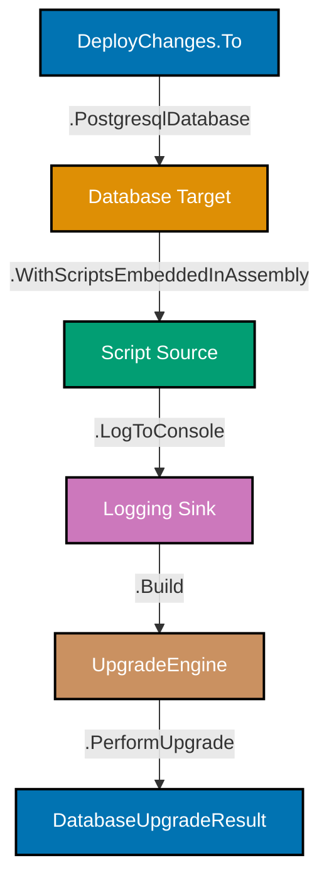
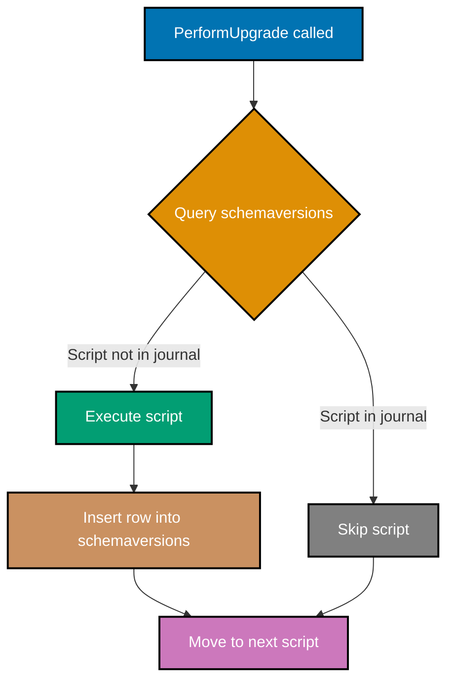

## Beginner Examples (1-30)

**Coverage**: 0-40% of DbUp functionality

**Focus**: SQL script authoring, DeployChanges builder, PostgreSQL connection setup, basic DDL operations, and migration tracking fundamentals.

These examples cover the foundations needed to manage database schema evolution in a production F# application. Each SQL example is a complete, standalone script; each F# example is a runnable snippet requiring only `dbup-postgresql` and `Npgsql`.

---

### Example 1: First DbUp Migration Script (SQL File)

A DbUp migration script is a plain SQL file containing DDL or DML statements executed exactly once against a target database. DbUp tracks each executed script in its journal table so the same script never runs twice, giving you a reproducible, append-only migration history.

```sql
-- File: 001-create-users.sql
-- => DbUp identifies scripts by filename; name must be unique across all scripts
-- => Sequential numeric prefix (001, 002, ...) controls execution order

-- Create the users table with essential audit columns
CREATE TABLE users (
    -- => UUID primary key avoids sequential integer exposure and supports distributed inserts
    id           UUID         PRIMARY KEY DEFAULT gen_random_uuid(),
    -- => VARCHAR without explicit length stores up to 1 GB; add CHECK for practical max
    username     VARCHAR      NOT NULL,
    email        VARCHAR      NOT NULL,
    -- => TIMESTAMPTZ stores UTC instant + timezone offset; safe across DST transitions
    created_at   TIMESTAMPTZ  NOT NULL DEFAULT NOW(),
    updated_at   TIMESTAMPTZ  NOT NULL DEFAULT NOW()
);
-- => After execution: table "users" exists; DbUp records "001-create-users.sql" in schemaversions
-- => Subsequent runs skip this script because the journal entry already exists
```

**Key Takeaway**: Each migration script is a plain `.sql` file executed exactly once; DbUp's journal table guarantees idempotency across all subsequent deployment runs.

**Why It Matters**: Without a migration tool, teams manually coordinate schema changes, leading to drift between environments. DbUp's journal-based tracking means every environment—development, staging, production—reaches identical schema state by replaying the same ordered script list. A missed manual step is the leading cause of "works on my machine" database bugs; DbUp eliminates that failure mode entirely.

---

### Example 2: DeployChanges Builder Setup

The `DeployChanges.To` static class is the entry point for DbUp's fluent configuration API. You chain builder methods to specify the database target, script source, logging behavior, and then call `Build()` to get an `UpgradeEngine` ready to execute pending scripts.



```fsharp
open DbUp
open System.Reflection

// Retrieve connection string from environment (never hardcode credentials)
let connStr =
    System.Environment.GetEnvironmentVariable("DATABASE_URL")
// => connStr is e.g. "Host=localhost;Database=myapp;Username=app;Password=secret"
// => Null if env var absent; validate before passing to builder

// Assemble the upgrade engine using the fluent builder
let upgradeEngine =
    DeployChanges.To
        // => Target PostgreSQL; DbUp uses Npgsql internally for all queries
        .PostgresqlDatabase(connStr)
        // => Discovers all *.sql files embedded in the calling assembly's resources
        .WithScriptsEmbeddedInAssembly(Assembly.GetExecutingAssembly())
        // => Attaches console logger; prints "Executing script: 001-create-users.sql" etc.
        .LogToConsole()
        // => Validates configuration and returns UpgradeEngine; no DB work yet
        .Build()
// => upgradeEngine is DbUp.Engine.UpgradeEngine; ready to call PerformUpgrade()

let result = upgradeEngine.PerformUpgrade()
// => Connects to DB, queries schemaversions, runs pending scripts in order
// => result.Successful is true when all pending scripts executed without error
// => result.Scripts contains the list of ScriptName strings that were executed this run
```

**Key Takeaway**: `DeployChanges.To` builds an immutable `UpgradeEngine` through method chaining; call `PerformUpgrade()` only after the full chain is configured to avoid partial state.

**Why It Matters**: The fluent builder separates configuration from execution, allowing tests and CI/CD pipelines to compose different configurations (different connection strings, different script sources) without duplicating execution logic. Separating the builder from `PerformUpgrade()` also makes it possible to call `IsUpgradeRequired()` as a pre-flight check before committing to an upgrade during deployment windows.

---

### Example 3: PostgresqlDatabase Target

`PostgresqlDatabase` accepts a connection string and tells DbUp to use the Npgsql driver for all database operations. The connection string must include `Host`, `Database`, `Username`, and `Password` at minimum; additional parameters like `SSL Mode` and `Pooling` are passed through to Npgsql unchanged.

```fsharp
open DbUp

// Option A: inline connection string (development only, never commit passwords)
let engineDev =
    DeployChanges.To
        // => Npgsql connection string; DbUp opens this connection when PerformUpgrade runs
        .PostgresqlDatabase("Host=localhost;Database=myapp_dev;Username=dev;Password=dev")
        .WithScriptsEmbeddedInAssembly(System.Reflection.Assembly.GetExecutingAssembly())
        .LogToConsole()
        .Build()
// => engineDev targets the local dev database; use for quick local testing

// Option B: environment variable (production pattern)
let connStr = System.Environment.GetEnvironmentVariable("DATABASE_URL")
// => Reads DATABASE_URL; typical in Docker, Kubernetes, Heroku, Vercel, and Fly.io
// => connStr is null if not set; handle null before passing to avoid NullReferenceException

let engineProd =
    DeployChanges.To
        // => Npgsql interprets "sslmode=require" for TLS-enforced managed PostgreSQL
        .PostgresqlDatabase(connStr + ";sslmode=require;Pooling=false")
        // => Pooling=false recommended for migration runs; migrations are one-shot not long-lived
        .WithScriptsEmbeddedInAssembly(System.Reflection.Assembly.GetExecutingAssembly())
        .LogToConsole()
        .Build()
// => engineProd targets the production database via environment-injected credentials
```

**Key Takeaway**: Always source connection strings from environment variables in production; pass Npgsql-specific parameters like `sslmode=require` and `Pooling=false` directly in the connection string.

**Why It Matters**: Hardcoded database credentials are the most common cause of credential leaks in version control history. Environment variable injection—standard in Docker, Kubernetes, and platform-as-a-service environments—keeps credentials out of source code and allows the same binary to target different databases without recompilation. Disabling connection pooling for migration runs avoids lingering connections that interfere with DDL locks on PostgreSQL.

---

### Example 4: Embedded Resource Scripts

Embedding SQL files as assembly resources ensures migration scripts are bundled inside the compiled binary and deployed atomically with the application. In F# projects, set `<EmbeddedResource>` in the `.fsproj` file and DbUp discovers them automatically via `WithScriptsEmbeddedInAssembly`.

```fsharp
// ─── In your .fsproj file ────────────────────────────────────────────────────
// <ItemGroup>
//   <!-- Embed all SQL files under db/migrations/ as assembly resources -->
//   <EmbeddedResource Include="db/migrations/**/*.sql" />
// </ItemGroup>
// => Build embeds each .sql file with resource name: "MyApp.db.migrations.001-create-users.sql"
// => DbUp uses the resource name as the script name stored in schemaversions

open DbUp
open System.Reflection

// Get reference to the assembly that contains the embedded SQL resources
let asm = Assembly.GetAssembly(typeof<MyApp.Program.Marker>)
// => Assembly.GetAssembly locates the assembly where Program.Marker type is defined
// => Use a dedicated Marker type to pin the assembly reference (avoids "executing assembly" ambiguity)
// => typeof<Program.Marker> is an F# type defined in your application project

let engine =
    DeployChanges.To
        .PostgresqlDatabase(System.Environment.GetEnvironmentVariable("DATABASE_URL"))
        // => Scans asm for all embedded resources ending in ".sql"
        // => Resources discovered: "MyApp.db.migrations.001-create-users.sql", "002-...", etc.
        .WithScriptsEmbeddedInAssembly(asm)
        .LogToConsole()
        .Build()
// => engine knows exactly which scripts are available; no filesystem paths involved
// => Assembly can be deployed as a single DLL and scripts travel with it
```

**Key Takeaway**: Embed SQL files as assembly resources with `<EmbeddedResource>` and use a `Marker` type to reliably reference the correct assembly, ensuring scripts always travel with the binary.

**Why It Matters**: Relying on filesystem paths for SQL scripts creates deployment fragility—scripts may be missing or at wrong relative paths in containerized or serverless environments. Embedding scripts in the assembly makes the binary self-contained: the same DLL deployed to any environment carries its complete migration history. This is the production-standard pattern for DbUp in .NET applications.

---

### Example 5: Script Naming Conventions (Sequential Numbering)

DbUp executes scripts in lexicographic order by default, so numeric prefixes must be zero-padded to ensure correct ordering. A three-digit prefix (001, 002, ... 999) is sufficient for most projects; use four digits (0001) for large-schema projects expecting hundreds of migrations.

```sql
-- File: 001-create-users.sql
-- => First migration; creates the foundational users table
-- => "001" prefix ensures this runs before "002"; lexicographic sort: "001" < "002" < "010"

CREATE TABLE users (
    id         UUID  PRIMARY KEY DEFAULT gen_random_uuid(),
    -- => username must be unique; constraint added in this script not a later one
    username   VARCHAR NOT NULL,
    created_at TIMESTAMPTZ NOT NULL DEFAULT NOW()
);
-- => After run: schemaversions contains row with ScriptName = "001-create-users.sql"
```

```sql
-- File: 002-create-expenses.sql
-- => Second migration; depends on users table created in 001
-- => Numeric prefix guarantees 001 runs first; without prefix, "create-expenses" sorts before "create-users"

CREATE TABLE expenses (
    id      UUID    PRIMARY KEY DEFAULT gen_random_uuid(),
    -- => Foreign key references users(id); DbUp must have run 001 first
    user_id UUID    NOT NULL REFERENCES users (id),
    amount  DECIMAL(18, 6) NOT NULL,
    -- => DATE stores calendar date without time; use for business dates (invoice date, expense date)
    date    DATE    NOT NULL,
    created_at TIMESTAMPTZ NOT NULL DEFAULT NOW()
);
-- => After run: expenses table exists; schemaversions has "002-create-expenses.sql"
```

**Key Takeaway**: Always zero-pad numeric prefixes (001 not 1) so lexicographic sort matches intended execution order; use a descriptive suffix to make the migration history self-documenting.

**Why It Matters**: A script named `10-add-index.sql` sorts before `9-create-table.sql` in lexicographic order, causing foreign key failures or missing table errors. Zero-padded prefixes eliminate this class of ordering bug entirely. Descriptive suffixes let teams audit migration history without opening each file—crucial when reviewing database changes during incident response.

---

### Example 6: SchemaVersions Journal Table

DbUp automatically creates and maintains a `schemaversions` table in the target database. Each row records a script that has been successfully applied—including its name, applied timestamp, and hash. Before each `PerformUpgrade()` call, DbUp queries this table to determine which scripts are pending.



```sql
-- After running 001-create-users.sql and 002-create-expenses.sql:
-- DbUp creates schemaversions automatically on first run if it does not exist

-- => Inspect the journal table to see migration history
SELECT scriptname, applied
FROM   schemaversions
ORDER  BY applied;
-- => Returns:
-- =>   scriptname                   | applied
-- =>   -----------------------------|------------------------------
-- =>   001-create-users.sql         | 2026-03-27 00:01:12.345+07
-- =>   002-create-expenses.sql      | 2026-03-27 00:01:12.389+07

-- => On second PerformUpgrade() call, DbUp reads these rows and skips both scripts
-- => Only scripts NOT in schemaversions will execute
```

```fsharp
// DbUp creates schemaversions before executing any user scripts
// No action needed; just call PerformUpgrade() and DbUp manages the journal
let result =
    DeployChanges.To
        .PostgresqlDatabase(connStr)
        .WithScriptsEmbeddedInAssembly(asm)
        .LogToConsole()
        .Build()
        .PerformUpgrade()
// => On first run: creates schemaversions table, then executes all scripts
// => On subsequent runs: reads schemaversions, skips applied scripts, runs only new ones
// => result.Scripts lists scripts executed THIS run (empty list when all are already applied)
```

**Key Takeaway**: DbUp manages the `schemaversions` journal automatically; never manually insert or delete rows from it, as doing so breaks the idempotency guarantee and may cause scripts to re-run or be skipped incorrectly.

**Why It Matters**: The journal table is the source of truth for what schema version each environment is at. Manual edits to `schemaversions` are the most common way teams accidentally re-run destructive migrations (DROP TABLE, DELETE FROM) in production. Treating the journal as read-only application infrastructure—just like the application tables themselves—prevents data loss incidents.

---

### Example 7: Console Logging with WithConsoleLogger

`WithConsoleLogger()` attaches DbUp's built-in console sink, which prints each script's execution status to standard output. In CI/CD pipelines and containerized deployments, console output is captured by the logging infrastructure and available in deployment logs for post-incident review.

```fsharp
open DbUp

let result =
    DeployChanges.To
        .PostgresqlDatabase(connStr)
        .WithScriptsEmbeddedInAssembly(asm)
        // => Registers ConsoleUpgradeLog; writes to Console.Write / Console.Error
        // => Output format: "DbUp: Executing script: 001-create-users.sql"
        // => Errors write to stderr with script name and exception message
        .WithConsoleLogger()
        .Build()
        .PerformUpgrade()
// => Console output during migration:
// =>   Beginning database upgrade
// =>   Checking whether journal table exists..
// =>   Journal table does not exist
// =>   Executing Database Server script '001-create-users.sql'..
// =>   Executing Database Server script '002-create-expenses.sql'..
// =>   Successfully upgraded database to version 002
// => result.Successful is true; result.Scripts has ["001-create-users.sql", "002-create-expenses.sql"]
```

**Key Takeaway**: Always attach at least one logger to the upgrade engine so migration execution is visible in deployment logs; `WithConsoleLogger()` is sufficient for most applications and requires no additional configuration.

**Why It Matters**: Silent migration failures—where DbUp returns an error but no output is captured—are among the hardest production incidents to diagnose. Console logging ensures that every CI/CD pipeline, every Docker container start, and every Kubernetes init container leaves a clear record of which scripts ran, in what order, and whether they succeeded. This visibility is the difference between a two-minute fix and a two-hour investigation.

---

### Example 8: Creating Tables

A `CREATE TABLE` script is the most fundamental DbUp migration. Define the table name, column names, data types, nullability constraints, and default values in a single atomic DDL statement that PostgreSQL either fully applies or fully rejects.

```sql
-- File: 003-create-attachments.sql
-- => Creates the attachments table; depends on expenses table from 002

CREATE TABLE attachments (
    -- => UUID primary key; no sequential integer leak, safe for distributed systems
    id           UUID    PRIMARY KEY DEFAULT gen_random_uuid(),

    -- => Foreign key to expenses; restricts orphan attachments at the DB level
    expense_id   UUID    NOT NULL REFERENCES expenses (id),

    -- => filename stores the original upload name; VARCHAR sufficient, no BYTEA needed
    filename     VARCHAR NOT NULL,

    -- => content_type stores MIME type e.g. "image/jpeg"; VARCHAR not ENUM for flexibility
    content_type VARCHAR NOT NULL,

    -- => BIGINT for file size in bytes; INT overflows at ~2 GB, BIGINT handles up to 9 EB
    file_size    BIGINT  NOT NULL,

    -- => BYTEA stores binary file content inline; consider object storage for files > 1 MB
    data         BYTEA   NOT NULL,

    -- => created_at only; attachments are immutable (upload once, never edit)
    created_at   TIMESTAMPTZ NOT NULL DEFAULT NOW()
);
-- => Table created; DbUp records "003-create-attachments.sql" in schemaversions
-- => Foreign key expense_id enforces referential integrity without application-level checks
```

**Key Takeaway**: Define nullability (`NOT NULL`) and defaults (`DEFAULT NOW()`) explicitly for every column at table creation time; retrofitting them later requires careful `ALTER TABLE` migrations that can lock large tables.

**Why It Matters**: Tables created without nullability constraints silently accept null values, leading to application NullReferenceExceptions and incorrect aggregations months later. Defining constraints at creation is always safer than adding them retroactively: adding `NOT NULL` to a populated column requires a table rewrite in older PostgreSQL versions and an explicit backfill step. Getting schema design right in the first migration is an investment that pays dividends across the entire lifetime of the application.

---

### Example 9: Adding Columns

`ALTER TABLE ... ADD COLUMN` extends an existing table with a new column. Adding a nullable column or a column with a default is a fast metadata-only operation in PostgreSQL 11+; adding a non-nullable column without a default requires a full table rewrite unless handled carefully.

```sql
-- File: 004-add-display-name-to-users.sql
-- => Adds display_name column to existing users table
-- => Pattern: add nullable first, then backfill, then add NOT NULL constraint

-- Step 1: Add column as nullable (fast metadata operation, no table lock)
ALTER TABLE users
    ADD COLUMN display_name VARCHAR;
-- => display_name is NULL for all existing rows immediately after this statement
-- => No table rewrite; PostgreSQL 11+ handles nullable ADD COLUMN in O(1)

-- Step 2: Backfill existing rows with a sensible default
UPDATE users
SET    display_name = username
WHERE  display_name IS NULL;
-- => Sets display_name to username for every existing row
-- => Runs as a full table scan; consider batching for tables > 1M rows

-- Step 3: Add NOT NULL constraint after backfill
ALTER TABLE users
    ALTER COLUMN display_name SET NOT NULL;
-- => Validates that no NULL values remain (fast CHECK scan, not full rewrite in PostgreSQL 12+)
-- => display_name is now NOT NULL for all existing and future rows
```

**Key Takeaway**: Add non-nullable columns in three steps—add nullable, backfill existing rows, then set `NOT NULL`—to avoid table rewrites and long locks on production tables.

**Why It Matters**: Adding a `NOT NULL` column without a default in a single `ALTER TABLE` statement causes PostgreSQL to rewrite the entire table, taking an exclusive lock for minutes or hours on large tables. This is a common source of production downtime during deployments. The three-step pattern—nullable addition, UPDATE backfill, NOT NULL constraint—completes each phase quickly without holding locks that block application traffic.

---

### Example 10: Adding Indexes

Indexes speed up query filtering and joins but add overhead to writes. Create indexes with `CREATE INDEX` after the table exists; in production, use `CREATE INDEX CONCURRENTLY` to avoid blocking reads and writes during index creation on large tables.

```sql
-- File: 005-add-indexes-to-users.sql
-- => Adds performance indexes to the users table
-- => Run after 001-create-users.sql; users table must already exist

-- Unique index on email: enforces uniqueness AND speeds up login lookups
CREATE UNIQUE INDEX ix_users_email
    ON users (email);
-- => Creates B-tree index; UNIQUE means duplicate emails fail at the DB level
-- => INSERT/UPDATE with duplicate email returns error code 23505 (unique_violation)
-- => Lookup by email: O(log n) instead of O(n) full scan

-- Unique index on username: login and mention lookups by username
CREATE UNIQUE INDEX ix_users_username
    ON users (username);
-- => Same structure; username lookups are now O(log n)
-- => Two unique indexes: any INSERT must pass both uniqueness checks

-- Non-unique index on created_at: speeds up date-range queries
CREATE INDEX ix_users_created_at
    ON users (created_at DESC);
-- => DESC order matches "ORDER BY created_at DESC" queries (newest first)
-- => Useful for admin dashboards showing recently registered users
-- => After this script: schemaversions records "005-add-indexes-to-users.sql"
```

**Key Takeaway**: Add unique indexes when the column must be unique (they enforce the constraint AND improve performance); use `CREATE INDEX CONCURRENTLY` in scripts targeting large production tables to avoid write locks.

**Why It Matters**: Missing indexes on frequently queried columns cause sequential scans that degrade from milliseconds to seconds as data grows—a silent performance cliff that appears only under production load. Unique indexes serve double duty: they enforce data integrity at the database level (preventing duplicates even if the application has a bug) and accelerate lookups. Planning indexes at table creation time is far easier than retrofitting them after a production performance incident.

---

### Example 11: Adding Foreign Keys

Foreign key constraints enforce referential integrity between tables at the database level, ensuring that child rows always reference a valid parent row. In DbUp migrations, add foreign keys as part of the table creation script or in a dedicated `ALTER TABLE` script after both tables exist.

```sql
-- File: 006-add-foreign-key-expenses-to-users.sql
-- => Adds foreign key from expenses.user_id to users.id
-- => Requires: users table (001) and expenses table (002) already applied

ALTER TABLE expenses
    ADD CONSTRAINT fk_expenses_user_id
    FOREIGN KEY (user_id)
    REFERENCES users (id);
-- => Validates: all existing expenses.user_id values exist in users.id
-- => If any orphan rows exist, this statement FAILS with error 23503 (foreign_key_violation)
-- => After constraint added: INSERT/UPDATE with non-existent user_id is rejected by DB

-- Verify the constraint exists
-- SELECT conname, contype
-- FROM   pg_constraint
-- WHERE  conrelid = 'expenses'::regclass;
-- => Returns: fk_expenses_user_id | f  (f = foreign key)
```

**Key Takeaway**: Name foreign key constraints explicitly (e.g., `fk_expenses_user_id`) so error messages identify the violated constraint clearly; unnamed constraints get PostgreSQL-generated names that are hard to decode in logs.

**Why It Matters**: Foreign key constraints are the last line of defense against orphaned rows—records that reference deleted parents, causing null-pointer errors and broken UI states. Application-level validation can be bypassed by direct SQL inserts, background jobs, or data imports. Database-level foreign keys enforce integrity regardless of how data enters the system. Named constraints make error messages actionable: `violates foreign key constraint "fk_expenses_user_id"` pinpoints the problem immediately, whereas `violates foreign key constraint "expenses_user_id_fkey"` requires context to interpret.

---

### Example 12: Adding Unique Constraints

Unique constraints prevent duplicate values in one or more columns without requiring application-level deduplication. In PostgreSQL, a unique constraint automatically creates a unique index, so you get both constraint enforcement and query performance from a single DDL statement.

```sql
-- File: 007-add-unique-constraint-revoked-tokens.sql
-- => Adds unique constraint on jti column of revoked_tokens table
-- => Prevents duplicate token revocations from being recorded

-- Add unique constraint on token jti (JWT ID)
ALTER TABLE revoked_tokens
    ADD CONSTRAINT uq_revoked_tokens_jti
    UNIQUE (jti);
-- => Creates unique B-tree index named uq_revoked_tokens_jti
-- => Duplicate INSERT with same jti fails with error 23505 (unique_violation)
-- => Application should catch 23505 and treat it as idempotent (token already revoked)

-- Multi-column unique constraint example: composite uniqueness
-- ALTER TABLE refresh_tokens
--     ADD CONSTRAINT uq_refresh_tokens_user_hash
--     UNIQUE (user_id, token_hash);
-- => Uniqueness enforced across the combination of user_id AND token_hash
-- => Same token_hash allowed for different user_id values (intended behavior)
-- => After script: schemaversions records "007-add-unique-constraint-revoked-tokens.sql"
```

**Key Takeaway**: Name unique constraints with a `uq_` prefix to distinguish them from foreign keys (`fk_`) and check constraints (`ck_`) in error messages and schema inspection queries.

**Why It Matters**: Duplicate data in columns that should be unique—email addresses, order numbers, token identifiers—causes authentication bypasses, double billing, and corrupted audit trails. Application-level uniqueness checks have a time-of-check-to-time-of-use (TOCTOU) race condition: two concurrent requests can both pass the check and then both insert. Database unique constraints eliminate the race by enforcing uniqueness atomically within the transaction. Named constraints with consistent prefixes make constraint violations self-documenting in production logs.

---

### Example 13: Adding NOT NULL with Defaults

Setting a column to `NOT NULL` after it already contains nulls requires a backfill step. The safe three-step pattern in Example 9 works for inline default-based backfills; this example shows the pattern for columns where the default is computed from other columns.

```sql
-- File: 008-add-not-null-created-by.sql
-- => Adds created_by and updated_by audit columns to users table
-- => Uses safe three-step pattern: add nullable, backfill, enforce NOT NULL

-- Step 1: Add columns as nullable with empty-string defaults for new rows
ALTER TABLE users
    ADD COLUMN IF NOT EXISTS created_by VARCHAR(255) NOT NULL DEFAULT 'system',
    ADD COLUMN IF NOT EXISTS updated_by VARCHAR(255) NOT NULL DEFAULT 'system';
-- => IF NOT EXISTS prevents error if column already exists (idempotent guard)
-- => DEFAULT 'system' fills existing rows immediately in PostgreSQL 11+
-- => New rows without explicit created_by/updated_by get 'system' automatically
-- => After this statement: all rows have created_by = 'system' and updated_by = 'system'

-- Step 2 (optional): Override default for specific rows if business logic requires
-- UPDATE users SET created_by = 'migration' WHERE created_at < '2026-01-01';
-- => Backfill can be scoped to date ranges or other predicates for partial overrides

-- No Step 3 needed: DEFAULT 'system' with NOT NULL added atomically in PostgreSQL 11+
-- => PostgreSQL 11+ handles NOT NULL + DEFAULT in ADD COLUMN as a metadata-only operation
-- => No table rewrite; no lock on existing rows
```

**Key Takeaway**: In PostgreSQL 11+, `ADD COLUMN ... NOT NULL DEFAULT 'value'` is a fast metadata-only operation that atomically fills existing rows with the default—no separate backfill step needed for literal string defaults.

**Why It Matters**: PostgreSQL 11 introduced a significant optimization: `ADD COLUMN` with a non-volatile default no longer rewrites the table. Before this, adding any `NOT NULL` column required a full table scan, exclusive lock, and often minutes of downtime. Understanding this version boundary prevents teams from over-engineering the three-step backfill pattern for cases where a single `ADD COLUMN` statement suffices. Always verify your PostgreSQL version before choosing the migration strategy.

---

### Example 14: Running Migrations with PerformUpgrade

`PerformUpgrade()` is the primary method that executes all pending migration scripts against the target database. It returns a `DatabaseUpgradeResult` value that the calling code must check before proceeding with application startup.

```fsharp
open DbUp

let runMigrations (connStr: string) (asm: System.Reflection.Assembly) =
    // Build the upgrade engine with all required configuration
    let engine =
        DeployChanges.To
            .PostgresqlDatabase(connStr)
            // => Discovers all embedded .sql resources from the provided assembly
            .WithScriptsEmbeddedInAssembly(asm)
            // => Console logger prints each script name and success/failure status
            .WithConsoleLogger()
            .Build()
    // => engine is configured but no DB work has happened yet

    // Execute pending scripts and capture the result
    let result = engine.PerformUpgrade()
    // => Opens Npgsql connection to PostgreSQL
    // => Queries schemaversions to find pending scripts
    // => Executes each pending script in order inside its own implicit transaction
    // => Inserts journal row on each successful script execution
    // => Returns immediately on first script failure (does not continue)

    result
// => Returns DatabaseUpgradeResult with:
// =>   .Successful: bool (true = all pending scripts ran without error)
// =>   .Scripts: seq<SqlScript> (scripts executed this run)
// =>   .Error: Exception (null when Successful; populated on failure)
// =>   .ErrorScript: SqlScript (the script that caused the failure; null when Successful)
```

**Key Takeaway**: `PerformUpgrade()` stops at the first failing script and returns an error result; always check `result.Successful` before continuing with application initialization to prevent starting with a partially migrated schema.

**Why It Matters**: Starting an application against a partially migrated database—where some scripts ran and a later one failed—is one of the most dangerous production scenarios. Tables or columns referenced in application code may be missing, causing cascading failures that are difficult to diagnose. Failing fast on migration errors, logging `result.ErrorScript.Name` and `result.Error.Message`, and refusing to start the application is far safer than attempting to run against an unknown schema state.

---

### Example 15: Checking Migration Results (Successful/ErrorScript)

The `DatabaseUpgradeResult` type returned by `PerformUpgrade()` contains everything needed to decide whether to proceed with application startup or abort with a meaningful error message.

```fsharp
open DbUp

let startWithMigrations (connStr: string) (asm: System.Reflection.Assembly) =
    let result =
        DeployChanges.To
            .PostgresqlDatabase(connStr)
            .WithScriptsEmbeddedInAssembly(asm)
            .WithConsoleLogger()
            .Build()
            .PerformUpgrade()
    // => result is DatabaseUpgradeResult; check .Successful before proceeding

    if result.Successful then
        // => All pending scripts ran successfully
        // => result.Scripts contains the SqlScript list executed this run
        let count = result.Scripts |> Seq.length
        // => count is 0 when database was already up to date (no pending scripts)
        // => count > 0 when new migrations were applied
        printfn "Migration complete. %d script(s) applied." count
        // => Application can now safely start; schema is at expected version
        true
    else
        // => At least one script failed; application should NOT start
        let scriptName =
            if result.ErrorScript <> null then result.ErrorScript.Name
            // => ErrorScript.Name is the filename e.g. "009-add-index.sql"
            else "unknown"
        // => result.Error is the Exception thrown during script execution
        eprintfn "Migration FAILED on script '%s': %s" scriptName result.Error.Message
        // => Log to stderr; captured by container orchestration and APM tools
        false
// => Returns true on success, false on failure; caller decides whether to exit(1) or retry
```

**Key Takeaway**: Pattern-match on `result.Successful` and always log `result.ErrorScript.Name` together with `result.Error.Message` on failure; this combination gives operators the exact script name and SQL error needed to diagnose and fix the migration.

**Why It Matters**: Migration failures are most often caused by SQL syntax errors in new scripts, missing dependencies between scripts, or data integrity violations. Without capturing `ErrorScript.Name`, operators face a wall of PostgreSQL error messages with no indication of which file caused the problem. Surfacing the script name and error together cuts mean-time-to-resolution dramatically—the operator can open the exact failing script, read the error, and apply the fix without guessing.

---

### Example 16: NpgsqlConnection Setup in F

While `PostgresqlDatabase(connStr)` handles the Npgsql connection internally, you sometimes need an explicit `NpgsqlConnection` for integration tests, connection validation, or scenarios where the connection is shared between DbUp and application code.

```fsharp
open Npgsql
open DbUp

// Build explicit NpgsqlConnection for scenarios requiring shared connection control
let buildConnection (connStr: string) =
    // => NpgsqlConnection wraps Npgsql driver; requires Npgsql NuGet package
    let conn = new NpgsqlConnection(connStr)
    // => Connection is closed at this point; Open() or OpenAsync() not called yet
    // => DbUp PostgresqlDatabase(NpgsqlConnection) overload opens/closes internally
    conn
// => Returns NpgsqlConnection instance; caller controls lifecycle

// Use explicit connection with DbUp
let runWithExplicitConnection (connStr: string) (asm: System.Reflection.Assembly) =
    use conn = buildConnection connStr
    // => use binding: F# disposes conn when this function exits (Dispose called automatically)

    let result =
        DeployChanges.To
            // => NpgsqlConnection overload; DbUp uses this exact connection object
            .PostgresqlDatabase(conn)
            .WithScriptsEmbeddedInAssembly(asm)
            .WithConsoleLogger()
            .Build()
            .PerformUpgrade()
    // => conn is managed by DbUp during PerformUpgrade; do not call conn.Open() manually
    // => After PerformUpgrade: conn is still open; use keyword disposes it on exit

    result.Successful
// => Returns bool; connection automatically disposed after function returns
```

**Key Takeaway**: Use the `NpgsqlConnection` overload of `PostgresqlDatabase` when you need explicit connection lifecycle control; use the `string` overload for the common case where DbUp manages the connection internally.

**Why It Matters**: Integration tests often need to share a database connection to control transaction boundaries and inspect intermediate state. The `NpgsqlConnection` overload allows tests to pass a pre-opened connection with a specific transaction context into DbUp, enabling migration setup within the same transaction as test data setup. This pattern is essential for fast, isolated integration tests that reset state between test cases.

---

### Example 17: Multiple Scripts in Sequence

DbUp executes scripts in the order determined by their names (lexicographic sort on the resource name). Understanding this ordering is critical when scripts have dependencies—a foreign key script must run after both referenced tables exist.

```sql
-- File: 001-create-users.sql
-- => First: foundation table; no dependencies
CREATE TABLE users (
    id         UUID        PRIMARY KEY DEFAULT gen_random_uuid(),
    username   VARCHAR     NOT NULL,
    created_at TIMESTAMPTZ NOT NULL DEFAULT NOW()
);
-- => Completes; schemaversions: ["001-create-users.sql"]
```

```sql
-- File: 002-create-expenses.sql
-- => Second: depends on users; runs after 001
CREATE TABLE expenses (
    id      UUID    PRIMARY KEY DEFAULT gen_random_uuid(),
    -- => Foreign key references users.id; 001 must have run first
    user_id UUID    NOT NULL REFERENCES users (id),
    amount  DECIMAL(18, 6) NOT NULL,
    created_at TIMESTAMPTZ NOT NULL DEFAULT NOW()
);
-- => Completes; schemaversions: ["001-create-users.sql", "002-create-expenses.sql"]
```

```sql
-- File: 003-create-attachments.sql
-- => Third: depends on expenses; runs after 002
CREATE TABLE attachments (
    id         UUID  PRIMARY KEY DEFAULT gen_random_uuid(),
    -- => Foreign key references expenses.id; 002 must have run first
    expense_id UUID  NOT NULL REFERENCES expenses (id),
    filename   VARCHAR NOT NULL,
    created_at TIMESTAMPTZ NOT NULL DEFAULT NOW()
);
-- => Completes; schemaversions: ["001...", "002...", "003-create-attachments.sql"]
-- => All three tables now exist; dependency chain satisfied by ordering guarantees
```

**Key Takeaway**: Structure scripts so each file is independent within its own DDL boundaries; cross-script dependencies are satisfied automatically by the numeric prefix ordering that DbUp uses for lexicographic execution.

**Why It Matters**: Execution ordering is the most common source of `ERROR: relation "users" does not exist` during migration. Teams that trust DbUp's ordering guarantees avoid building complex dependency graphs or manual pre/post conditions. The sequential numeric prefix is a simple contract: higher numbers run later, so any script can safely depend on all lower-numbered scripts having already completed. Violating this contract—by using non-padded numbers or skipping numbers—breaks the ordering invariant and causes cascading failures.

---

### Example 18: Dropping Columns Safely

Dropping a column removes it from the table schema permanently. The safe pattern is to first ensure the column is no longer referenced by application code, foreign keys, or indexes, then drop it with `IF EXISTS` to make the migration idempotent.

```sql
-- File: 010-drop-url-from-attachments.sql
-- => Removes the url column that was superseded by object storage URLs computed at runtime
-- => Safe to drop: application code no longer reads or writes attachments.url

-- Drop dependent index first (if any exist on this column)
DROP INDEX IF EXISTS ix_attachments_url;
-- => IF EXISTS prevents error if index was never created or was already dropped
-- => Must drop before column; column drop with dependent index fails

-- Drop the column
ALTER TABLE attachments
    DROP COLUMN IF EXISTS url;
-- => IF EXISTS: idempotent; no error if column was already dropped (re-run safe)
-- => Removes url column and any index referencing only url
-- => Existing rows are unaffected; row size decreases by one column
-- => After execution: SELECT url FROM attachments fails with "column does not exist"
```

**Key Takeaway**: Always use `DROP COLUMN IF EXISTS` for idempotency and drop dependent indexes explicitly before the column to avoid constraint violation errors.

**Why It Matters**: Column drops are irreversible DDL changes. The `IF EXISTS` guard makes the migration script safe to re-run (idempotent), which matters during failed deployments that partially applied scripts. Dropping dependent indexes first prevents `ERROR: column "url" of relation "attachments" is referenced by index "..."` which blocks the column drop. More importantly, never drop a column that application code still reads—coordinate the deployment order: deploy new application code that no longer references the column, verify in production, then deploy the column-drop migration.

---

### Example 19: Dropping Tables Safely

Dropping a table permanently removes it and all its data. Use `DROP TABLE IF EXISTS` with explicit dependency ordering—child tables (those with foreign keys referencing the target) must be dropped or have their foreign keys removed before the parent table can be dropped.

```sql
-- File: 011-drop-legacy-sessions.sql
-- => Drops the legacy sessions table replaced by refresh_tokens in migration 005
-- => Dependency check: no other table has a foreign key referencing sessions

-- Drop any indexes on the table first (CASCADE handles this, but explicit is clearer)
DROP INDEX IF EXISTS ix_sessions_user_id;
DROP INDEX IF EXISTS ix_sessions_token;
-- => Explicit index drops document what is being removed; CASCADE would handle them too

-- Drop the table itself
DROP TABLE IF EXISTS sessions;
-- => IF EXISTS: safe to run even if table was already dropped or never existed
-- => Removes table definition, all rows, all column constraints, all table-level grants
-- => Does NOT drop functions or triggers referencing this table (rare but possible)
-- => After execution: SELECT * FROM sessions fails with "relation does not exist"
-- => schemaversions records "011-drop-legacy-sessions.sql" as applied
```

**Key Takeaway**: Use `DROP TABLE IF EXISTS` rather than `DROP TABLE` so the migration is idempotent and can be re-run safely in case of deployment retry; verify no foreign keys from other tables reference the dropped table before running.

**Why It Matters**: `DROP TABLE` without `IF EXISTS` fails with an error if the table does not exist, turning a re-run of a partial migration into a migration failure that blocks recovery. The `IF EXISTS` variant succeeds silently when the table is already absent, making the script safely re-entrant. The irreversibility of `DROP TABLE` means it warrants an extra pre-deployment checklist step: confirm no application code references the table, no foreign keys point to it, and a backup is available.

---

### Example 20: UUID Primary Keys in PostgreSQL

UUID primary keys are the recommended choice for distributed systems, public-facing APIs, and multi-tenant architectures because they do not expose insertion counts and can be generated client-side without a database round-trip.

```sql
-- File: 001-create-users-uuid.sql
-- => Demonstrates UUID primary key configuration for PostgreSQL
-- => gen_random_uuid() is built-in since PostgreSQL 13; use pgcrypto extension for < 13

-- Enable pgcrypto for PostgreSQL < 13 (safe to run on 13+ too; no-op if already installed)
-- CREATE EXTENSION IF NOT EXISTS "pgcrypto";
-- => Uncomment if targeting PostgreSQL 12 or older
-- => gen_random_uuid() becomes available after extension load

CREATE TABLE users (
    -- => UUID type: 128-bit value stored as 16 bytes; displayed as 32 hex + 4 dashes
    -- => DEFAULT gen_random_uuid(): database generates version-4 UUID on INSERT
    -- => Version-4 UUID is cryptographically random; collision probability negligible
    id         UUID        PRIMARY KEY DEFAULT gen_random_uuid(),

    username   VARCHAR     NOT NULL,

    -- => UNIQUE ensures no two users share the same email
    email      VARCHAR     NOT NULL UNIQUE,

    created_at TIMESTAMPTZ NOT NULL DEFAULT NOW()
);
-- => After INSERT without explicit id: id is e.g. "550e8400-e29b-41d4-a716-446655440000"
-- => Query by id: WHERE id = '550e8400-e29b-41d4-a716-446655440000'::uuid
-- => PostgreSQL casts text literals to UUID automatically with ::uuid cast operator
```

**Key Takeaway**: Use `DEFAULT gen_random_uuid()` for UUID primary keys in PostgreSQL 13+; enable the `pgcrypto` extension on older versions; always cast UUID string literals with `::uuid` in queries for type-safe comparisons.

**Why It Matters**: Sequential integer primary keys leak business intelligence—the difference between two order IDs reveals how many orders were placed between them. UUID primary keys prevent this and also enable client-side ID generation, which eliminates a database round-trip on insert-heavy workloads. In distributed architectures where multiple services insert into the same table, UUIDs eliminate primary key collisions that sequential integers would cause without a coordinating sequence service.

---

### Example 21: Timestamp Columns with Defaults

Timestamp columns with server-side defaults ensure that audit trails are accurate regardless of client clock drift. `TIMESTAMPTZ` (timestamp with time zone) is the correct choice for all timestamps in distributed systems; `TIMESTAMP` (without time zone) is appropriate only for representing local calendar times.

```sql
-- File: 012-add-timestamps-to-expenses.sql
-- => Demonstrates TIMESTAMPTZ columns with server-side defaults
-- => Use NOW() for created_at; use triggers or application logic for updated_at

ALTER TABLE expenses
    -- => Add created_at as TIMESTAMPTZ with server-side default
    -- => IF NOT EXISTS: safe to run even if column was added in a prior migration
    ADD COLUMN IF NOT EXISTS created_at TIMESTAMPTZ NOT NULL DEFAULT NOW(),

    -- => updated_at starts equal to created_at; application must update it on writes
    -- => Some teams use a PostgreSQL trigger to auto-update; see intermediate examples
    ADD COLUMN IF NOT EXISTS updated_at TIMESTAMPTZ NOT NULL DEFAULT NOW();

-- => TIMESTAMPTZ stores the instant in UTC internally regardless of the session timezone
-- => Displays in local time when session timezone is set (e.g. Asia/Jakarta shows +07:00)
-- => TIMESTAMP (no TZ) stores the literal date-time string; dangerous across DST transitions
-- => Always prefer TIMESTAMPTZ for audit columns in server-side applications
```

**Key Takeaway**: Always use `TIMESTAMPTZ` for audit timestamps; use `DEFAULT NOW()` for `created_at` to ensure the database clock—not the application clock—records the insertion time.

**Why It Matters**: Applications running in multiple regions or time zones store incorrect audit times when they compute timestamps in application code and pass them to PostgreSQL as `TIMESTAMP`. Server-side `DEFAULT NOW()` eliminates this risk: the database records the exact moment of the INSERT using the database server clock, which is typically synchronized via NTP. `TIMESTAMPTZ` further ensures that the stored value is timezone-unambiguous—critical for applications that switch data center regions or for queries that span daylight saving time boundaries.

---

### Example 22: Enum Types via SQL

PostgreSQL supports native `ENUM` types, but they are difficult to modify (adding values requires `ALTER TYPE`, removing values requires a full type replacement). An alternative is using `VARCHAR` with a `CHECK` constraint, which is easier to evolve through migrations.

```sql
-- File: 013-add-status-to-users.sql
-- => Adds a status column using VARCHAR + CHECK constraint (preferred over ENUM type)
-- => CHECK constraint approach: easy to add new values in future migrations

ALTER TABLE users
    ADD COLUMN IF NOT EXISTS status VARCHAR(20) NOT NULL DEFAULT 'ACTIVE';
-- => VARCHAR(20) caps status values at 20 characters; prevents runaway string growth
-- => DEFAULT 'ACTIVE' means existing users are immediately active

-- Add CHECK constraint to enforce allowed values
ALTER TABLE users
    ADD CONSTRAINT ck_users_status
    CHECK (status IN ('ACTIVE', 'SUSPENDED', 'DELETED'));
-- => Any INSERT or UPDATE with status outside this list fails with error 23514 (check_violation)
-- => Error message: "new row for relation "users" violates check constraint "ck_users_status""
-- => Adding a new value later: ALTER TABLE users DROP CONSTRAINT ck_users_status;
-- =>                            ALTER TABLE users ADD CONSTRAINT ck_users_status CHECK (status IN ('ACTIVE', 'SUSPENDED', 'DELETED', 'PENDING'));
-- => One migration per change; name "ck_users_status" identifies the constraint in errors
```

**Key Takeaway**: Use `VARCHAR` with a named `CHECK` constraint instead of PostgreSQL `ENUM` types for status columns; the `CHECK` approach is easier to evolve through future `ALTER TABLE` migrations without requiring type replacement.

**Why It Matters**: PostgreSQL `ENUM` types require `ALTER TYPE ... ADD VALUE` to add new values—a DDL operation that is not transactional in older PostgreSQL versions and cannot be rolled back. The `VARCHAR` + `CHECK` approach allows adding new values through a simple `DROP CONSTRAINT / ADD CONSTRAINT` pair in a migration script, which is fully transactional. It also stores the value as a readable string in the column, making debugging and data exports straightforward.

---

### Example 23: CHECK Constraints

CHECK constraints enforce domain invariants at the database level, rejecting rows that violate the specified condition regardless of how the data is inserted (application, migration, direct SQL, data import).

```sql
-- File: 014-add-check-constraints-to-expenses.sql
-- => Adds business-rule constraints to the expenses table
-- => Constraints enforce domain invariants that application code cannot guarantee alone

-- Constraint 1: amount must be positive (no zero or negative expenses)
ALTER TABLE expenses
    ADD CONSTRAINT ck_expenses_amount_positive
    CHECK (amount > 0);
-- => Any INSERT/UPDATE with amount <= 0 fails with 23514 (check_violation)
-- => Existing rows with amount <= 0 will FAIL this migration; clean data first

-- Constraint 2: quantity must be positive when provided
ALTER TABLE expenses
    ADD CONSTRAINT ck_expenses_quantity_positive
    CHECK (quantity IS NULL OR quantity > 0);
-- => IS NULL OR: allows NULL (optional field) but rejects zero/negative when set
-- => Tip: check existing data with: SELECT count(*) FROM expenses WHERE quantity IS NOT NULL AND quantity <= 0

-- Constraint 3: date must not be in the future (no future-dated expenses)
ALTER TABLE expenses
    ADD CONSTRAINT ck_expenses_date_not_future
    CHECK (date <= CURRENT_DATE);
-- => CURRENT_DATE evaluates at INSERT/UPDATE time; not a static snapshot
-- => Existing rows with future dates FAIL; audit data before running this migration
```

**Key Takeaway**: Name all CHECK constraints with a descriptive `ck_` prefix so violation error messages identify the exact business rule that was broken; validate that existing data satisfies the constraint before adding it to avoid migration failures.

**Why It Matters**: CHECK constraints are the most efficient form of data validation—they run inside the database engine with no network round-trips. Application validation can be bypassed by background jobs, admin scripts, or data migrations; database CHECK constraints cannot. The pre-migration data audit step is critical: PostgreSQL validates all existing rows when `ADD CONSTRAINT` runs, and a single invalid row causes the entire migration to fail and roll back.

---

### Example 24: Composite Indexes

Composite (multi-column) indexes accelerate queries that filter or sort on multiple columns together. The column order within the index matters: the index benefits queries that filter on the leading columns and optionally filter on trailing columns.

```sql
-- File: 015-add-composite-indexes-to-expenses.sql
-- => Adds composite indexes to optimize common expense query patterns
-- => Index column order matches the most common WHERE clause column order

-- Composite index: user_id + date (supports "get expenses for user in date range")
CREATE INDEX ix_expenses_user_id_date
    ON expenses (user_id, date DESC);
-- => Covers: WHERE user_id = $1 AND date BETWEEN $2 AND $3 ORDER BY date DESC
-- => Also covers: WHERE user_id = $1 (uses leading column ix_expenses_user_id_date)
-- => Does NOT cover: WHERE date = $1 alone (date is trailing column; leading column missing)
-- => DESC on date: matches ORDER BY date DESC for newest-first expense listings

-- Composite index: user_id + category (supports "get expenses by category for user")
CREATE INDEX ix_expenses_user_id_category
    ON expenses (user_id, category);
-- => Covers: WHERE user_id = $1 AND category = $2
-- => Useful for expense summary reports grouped by category per user

-- After these indexes: schemaversions records "015-add-composite-indexes-to-expenses.sql"
-- => Query planner chooses between ix_expenses_user_id_date and ix_expenses_user_id_category
-- => based on query predicates; run EXPLAIN ANALYZE to verify index usage
```

**Key Takeaway**: Order composite index columns by selectivity (most selective/filtered column first); match the column order to your most common `WHERE` clause patterns to ensure the query planner uses the index.

**Why It Matters**: A composite index on `(user_id, date)` can accelerate queries filtering on `user_id` alone or `user_id + date` together, but not on `date` alone. Understanding this property—called "leftmost prefix rule"—prevents creating indexes that look correct but provide no benefit for actual query patterns. Wasted indexes add write overhead on every INSERT/UPDATE without providing read benefit. Always validate index usage with `EXPLAIN ANALYZE` after adding composite indexes in staging before deploying to production.

---

### Example 25: Junction Tables (Many-to-Many)

Junction tables (also called association tables or link tables) represent many-to-many relationships between two entities. The junction table has foreign keys to both parent tables and a composite primary key formed from those foreign keys.

```sql
-- File: 016-create-expense-tags.sql
-- => Creates the expense_tags junction table for many-to-many expense-to-tag relationship
-- => An expense can have many tags; a tag can apply to many expenses

-- First create the tags reference table
CREATE TABLE tags (
    id   UUID    PRIMARY KEY DEFAULT gen_random_uuid(),
    -- => name must be unique; two tags with same name would be duplicates
    name VARCHAR NOT NULL UNIQUE,
    created_at TIMESTAMPTZ NOT NULL DEFAULT NOW()
);
-- => Tags are shared across users; expenses link to tags via junction table

-- Create the junction table
CREATE TABLE expense_tags (
    -- => Composite primary key: each (expense_id, tag_id) pair is unique
    expense_id UUID NOT NULL REFERENCES expenses (id) ON DELETE CASCADE,
    -- => ON DELETE CASCADE: when expense is deleted, remove all its tag associations
    tag_id     UUID NOT NULL REFERENCES tags (id) ON DELETE CASCADE,
    -- => ON DELETE CASCADE: when tag is deleted, remove all expense associations
    created_at TIMESTAMPTZ NOT NULL DEFAULT NOW(),

    -- => Composite PK prevents duplicate (expense_id, tag_id) associations
    PRIMARY KEY (expense_id, tag_id)
);
-- => Query expenses with their tags: JOIN expense_tags ON expenses.id = expense_tags.expense_id
-- => Query tags for a specific expense: WHERE expense_tags.expense_id = $1
-- => After script: schemaversions records "016-create-expense-tags.sql"
```

**Key Takeaway**: Junction tables use a composite primary key formed from both foreign keys; add `ON DELETE CASCADE` on both foreign keys so removing either parent automatically cleans up the association rows.

**Why It Matters**: Many-to-many relationships implemented without a junction table—storing arrays or comma-separated lists in a column—cannot be queried efficiently, cannot enforce referential integrity, and cannot be joined with standard SQL. The junction table pattern is the relational normal form that enables efficient bidirectional queries, cascading deletes, and easy addition of metadata (like `created_at` on the association itself). Getting this right in the migration avoids complex data transformation later.

---

### Example 26: Seed Data in Migration Scripts

Seed data migrations insert reference data (lookup tables, default roles, initial configuration) that the application requires to function correctly. Like schema migrations, seed data migrations run once and are tracked in the journal.

```sql
-- File: 017-seed-default-roles.sql
-- => Inserts default user roles required for application authorization
-- => ON CONFLICT DO NOTHING: idempotent; safe to run even if roles already exist

CREATE TABLE IF NOT EXISTS roles (
    -- => IF NOT EXISTS: extra safety; role may have been created in a prior migration
    id   UUID    PRIMARY KEY DEFAULT gen_random_uuid(),
    name VARCHAR NOT NULL UNIQUE,
    description VARCHAR NOT NULL DEFAULT ''
);
-- => Creates roles table if it does not exist; no error if it does

-- Seed default roles using ON CONFLICT DO NOTHING for idempotency
INSERT INTO roles (name, description) VALUES
    -- => 'ADMIN' role: full access to all resources
    ('ADMIN',     'Full administrative access'),
    -- => 'USER' role: standard user access
    ('USER',      'Standard user access'),
    -- => 'READONLY' role: view-only access
    ('READONLY',  'Read-only access to all resources')
ON CONFLICT (name) DO NOTHING;
-- => ON CONFLICT (name): if a role with this name already exists, skip the INSERT
-- => DO NOTHING: no update, no error; idempotent upsert for seed data
-- => After execution: roles table has at least these three rows
-- => Re-running this migration adds no duplicate rows (safe for retries)
```

**Key Takeaway**: Use `ON CONFLICT DO NOTHING` for all seed data inserts to make the migration idempotent; if the seed data must be updated on re-run, use `ON CONFLICT ... DO UPDATE SET` instead.

**Why It Matters**: Seed data migrations that use plain `INSERT` fail on re-run with unique constraint violations. Since DbUp's journal prevents re-runs of the same script, this seems safe—but failed deployments, restored backups, and environment resets all cause migrations to run against databases that already have the seed data. `ON CONFLICT DO NOTHING` makes the migration script safe in all these scenarios without requiring the journal to be the sole safety net.

---

### Example 27: IF NOT EXISTS Guards

`IF NOT EXISTS` clauses make DDL statements idempotent by skipping the operation when the named object already exists. This is essential for migration scripts that may be retried after partial failures or applied against databases that were manually patched.

```sql
-- File: 018-add-password-reset-token.sql
-- => Adds password_reset_token column to users table
-- => IF NOT EXISTS guards make this script safe to run multiple times

-- Add column with IF NOT EXISTS guard
ALTER TABLE users
    ADD COLUMN IF NOT EXISTS password_reset_token VARCHAR(255);
-- => IF NOT EXISTS: no error if column already exists (e.g., added manually during incident)
-- => Without IF NOT EXISTS: "ERROR: column password_reset_token of relation users already exists"
-- => The column is nullable; NULL means no pending reset; non-NULL means reset in progress

-- Create index with IF NOT EXISTS guard
CREATE INDEX IF NOT EXISTS ix_users_password_reset_token
    ON users (password_reset_token)
    WHERE password_reset_token IS NOT NULL;
-- => IF NOT EXISTS: safe to re-run; existing index not recreated
-- => Partial index (WHERE IS NOT NULL): only indexes rows with a pending reset
-- => Partial index is smaller and faster for the common case where most rows have NULL

-- Add table-level guard for safe table creation
CREATE TABLE IF NOT EXISTS audit_log (
    id         UUID        PRIMARY KEY DEFAULT gen_random_uuid(),
    table_name VARCHAR     NOT NULL,
    operation  VARCHAR     NOT NULL,
    changed_at TIMESTAMPTZ NOT NULL DEFAULT NOW()
);
-- => IF NOT EXISTS: no error if audit_log was already created by another migration
```

**Key Takeaway**: Add `IF NOT EXISTS` to `CREATE TABLE`, `CREATE INDEX`, and `ALTER TABLE ... ADD COLUMN` statements in any migration script that might be retried; this single change makes the majority of migration scripts fully idempotent.

**Why It Matters**: Production deployments fail and retry. DbUp's journal records only successfully completed scripts, so a script that fails midway may be re-run against a database where the first half already executed. `IF NOT EXISTS` guards prevent the second attempt from failing on already-applied DDL, allowing the migration to complete successfully on retry. This is especially important for scripts that mix `CREATE TABLE`, `CREATE INDEX`, and `INSERT` statements where partial execution is possible.

---

### Example 28: Cascade Delete Foreign Keys

`ON DELETE CASCADE` tells PostgreSQL to automatically delete child rows when the parent row is deleted. This keeps the database consistent without requiring the application to manually delete dependent rows in the correct order.

```sql
-- File: 019-add-cascade-delete-to-attachments.sql
-- => Modifies attachments.expense_id foreign key to add ON DELETE CASCADE
-- => When an expense is deleted, all its attachments are automatically deleted

-- Step 1: Drop the existing foreign key constraint (no IF EXISTS for constraints)
ALTER TABLE attachments
    DROP CONSTRAINT IF EXISTS attachments_expense_id_fkey;
-- => IF EXISTS: safe even if constraint name differs from PostgreSQL's default naming
-- => PostgreSQL default name: <table>_<column>_fkey (e.g., attachments_expense_id_fkey)
-- => If constraint was named explicitly in a prior migration, use that name instead

-- Step 2: Re-add the foreign key with ON DELETE CASCADE
ALTER TABLE attachments
    ADD CONSTRAINT attachments_expense_id_fkey
    FOREIGN KEY (expense_id)
    REFERENCES expenses (id)
    ON DELETE CASCADE;
-- => ON DELETE CASCADE: DELETE FROM expenses WHERE id = $1 also deletes all matching attachments
-- => ON DELETE RESTRICT (default): DELETE FROM expenses fails if attachments reference it
-- => ON DELETE SET NULL: sets expense_id to NULL instead of deleting (only for nullable columns)
-- => After this migration: deleting an expense atomically removes its attachments
```

**Key Takeaway**: Use `ON DELETE CASCADE` for child tables that have no meaning without their parent (attachments belong to expenses); use `ON DELETE RESTRICT` (the default) for relationships where orphan deletion should be an explicit application decision.

**Why It Matters**: Without cascade deletes, application code must delete child rows before parent rows in the exact correct dependency order. This logic is often duplicated across different code paths (web requests, background jobs, admin tools) and frequently gets out of sync. Database-level cascade ensures consistent cleanup regardless of how the parent deletion is triggered. However, cascade should only be used when child rows truly have no value without their parent—using cascade on reference data that should be preserved for auditing is a common mistake that causes data loss.

---

### Example 29: Script Discovery from Assembly

`WithScriptsEmbeddedInAssembly` scans a .NET assembly for all embedded resources ending in `.sql` and presents them to DbUp as migration scripts. The assembly must have SQL files marked as `EmbeddedResource` in the project file for them to appear.

```fsharp
open DbUp
open System.Reflection

// ─── Marker type for assembly reference ─────────────────────────────────────
// Define a Marker type in the application project (not the test project)
// This provides a stable anchor for Assembly.GetAssembly() calls
// module Marker = type Marker = Marker   (define in Program.fs or similar)

// ─── Retrieve the assembly containing the embedded SQL scripts ───────────────
let migrationsAssembly =
    // => GetAssembly(Type): returns the assembly where the given type is defined
    // => Use Marker type from the app project; avoids coupling to string assembly names
    Assembly.GetAssembly(typeof<MyApp.Program.Marker>)
// => migrationsAssembly is the DLL that contains "db/migrations/*.sql" as embedded resources
// => Assembly.GetExecutingAssembly() is an alternative but fragile in test contexts

// ─── Build upgrade engine with discovered scripts ────────────────────────────
let engine =
    DeployChanges.To
        .PostgresqlDatabase(System.Environment.GetEnvironmentVariable("DATABASE_URL"))
        // => Discovers all .sql embedded resources from migrationsAssembly
        // => Resource names: "MyApp.db.migrations.001-create-users.sql", "002-...", etc.
        // => DbUp uses the full resource name as the script identifier in schemaversions
        .WithScriptsEmbeddedInAssembly(migrationsAssembly)
        .WithConsoleLogger()
        .Build()
// => engine.GetScriptsToExecute(): returns pending script list without running them
// => engine.GetExecutedScripts(): returns already-applied scripts from schemaversions
// => engine.IsUpgradeRequired(): returns bool; useful for health checks
```

**Key Takeaway**: Use a dedicated `Marker` type in the application project as the anchor for `Assembly.GetAssembly()` calls; this is more reliable than `Assembly.GetExecutingAssembly()` in test and hosted environments where the executing assembly may not be the application assembly.

**Why It Matters**: `Assembly.GetExecutingAssembly()` returns the assembly of the code that calls it at runtime. In unit tests, this is the test assembly—which typically does not contain the embedded SQL resources. Using `typeof<Program.Marker>` pins the reference to the application assembly regardless of where the migration-running code is called from, making the pattern work correctly in production startup, integration tests, and migration utilities without code changes.

---

### Example 30: Migration Execution Order

DbUp orders scripts by their full resource name (lexicographic sort). Understanding this ordering rule is essential for designing a migration file naming convention that scales across a long project lifetime.

```fsharp
open DbUp
open System.Reflection

// ─── Inspect script execution order before running ────────────────────────────
let inspectMigrationOrder (connStr: string) (asm: Assembly) =
    let engine =
        DeployChanges.To
            .PostgresqlDatabase(connStr)
            .WithScriptsEmbeddedInAssembly(asm)
            .WithConsoleLogger()
            .Build()

    // GetScriptsToExecute(): returns pending scripts in the order DbUp will execute them
    let pending = engine.GetScriptsToExecute()
    // => Returns IList<SqlScript>; each SqlScript has .Name (resource name) and .Contents (SQL text)
    // => Names are ordered lexicographically: "001-..." before "002-..." before "010-..."
    // => Zero-padded numbers ensure correct order: "009-..." < "010-..." (not "09..." < "1...")

    for script in pending do
        // => Prints each script name in execution order; useful for pre-deployment verification
        printfn "Pending: %s" script.Name
    // => Example output:
    // =>   Pending: MyApp.db.migrations.001-create-users.sql
    // =>   Pending: MyApp.db.migrations.002-create-expenses.sql
    // =>   Pending: MyApp.db.migrations.003-create-attachments.sql

    // GetExecutedScripts(): returns scripts already in schemaversions
    let applied = engine.GetExecutedScripts()
    // => Returns IList<string> of script names that DbUp will skip (already applied)
    for name in applied do
        printfn "Applied:  %s" name
    // => Empty list on first run; grows with each successful PerformUpgrade()

    // IsUpgradeRequired(): fast check without executing anything
    let upgradeNeeded = engine.IsUpgradeRequired()
    // => Returns true when GetScriptsToExecute() is non-empty
    // => Useful for health check endpoints: "database is at latest version"
    printfn "Upgrade required: %b" upgradeNeeded
```

**Key Takeaway**: Use `engine.GetScriptsToExecute()` to preview the execution order before running `PerformUpgrade()`; use `engine.IsUpgradeRequired()` in health check endpoints to surface schema staleness without triggering an upgrade.

**Why It Matters**: Being able to inspect pending migrations without executing them is essential for pre-deployment validation in CD pipelines. A pipeline can run `GetScriptsToExecute()` to confirm the expected scripts are present and in the expected order, then pass or fail the deployment based on that check before any DDL touches the production database. `IsUpgradeRequired()` in a health check endpoint enables Kubernetes readiness probes to hold traffic until the schema is fully migrated, preventing applications from serving requests against an incomplete schema.
