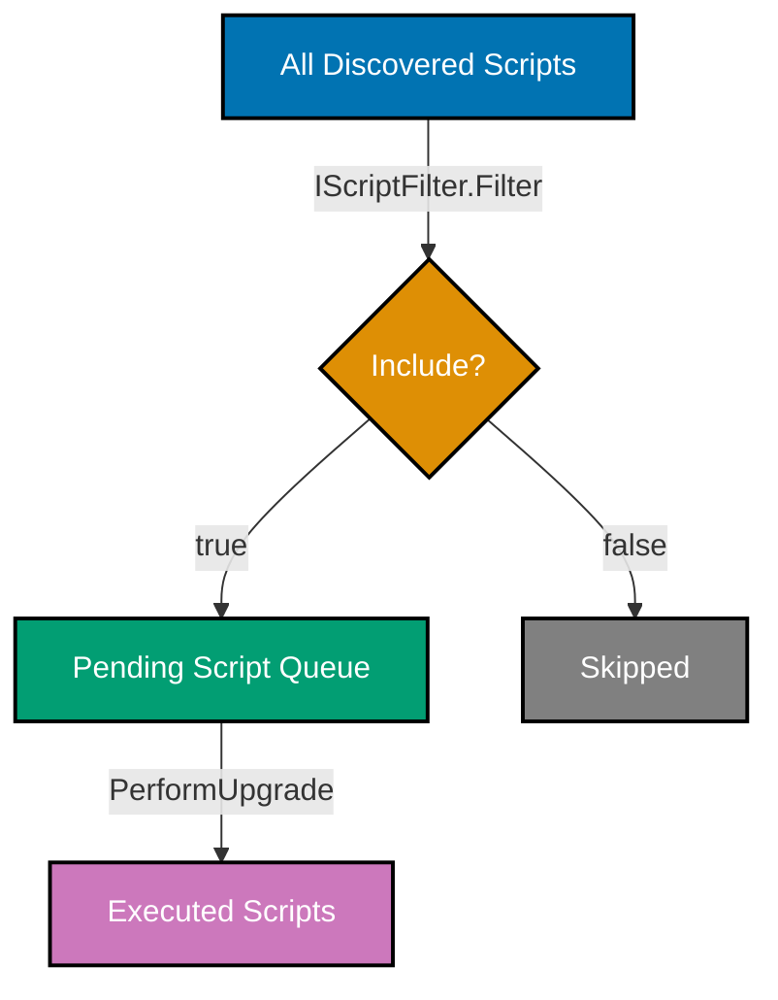

## Intermediate Examples (31-60)

**Coverage**: 40-75% of DbUp functionality

**Focus**: Script filtering, transaction strategies, variable substitution, advanced SQL patterns, data migrations, and integration testing with Testcontainers.

These examples assume you understand beginner concepts (DeployChanges builder, embedded scripts, basic DDL). All F# examples are self-contained runnable snippets; SQL examples are standalone migration files.

---

### Example 31: Script Filtering with IScriptFilter

`IScriptFilter` is a DbUp extension point that decides at runtime which scripts from the discovered set to execute. You implement the single `Filter` method to inspect each `SqlScript` and return `true` to include it or `false` to skip it. This is the correct mechanism for environment-specific migrations.



```fsharp
open DbUp
open DbUp.Engine
open DbUp.Engine.Filters
open System.Reflection

// IScriptFilter implementation: include only scripts matching an environment prefix
type EnvScriptFilter(env: string) =
    // => env is e.g. "prod", "staging", "dev"
    // => Constructor captures env name for use in the Filter predicate
    interface IScriptFilter with
        member _.Filter(scripts, journalEntries, logger) =
            // => scripts: seq<SqlScript> — full set discovered by the script provider
            // => journalEntries: seq<string> — already-executed script names from the journal
            // => logger: IUpgradeLog — write diagnostic messages here
            scripts
            // => Apply seq filter; lazy evaluation until PerformUpgrade iterates
            |> Seq.filter (fun s ->
                // => s.Name is the resource name, e.g. "MyApp.db.migrations.prod-001-enable-rls.sql"
                s.Name.Contains($"/{env}-") || not (s.Name.Contains("/prod-") || s.Name.Contains("/staging-")))
            // => Scripts without an environment prefix (shared migrations) always pass through
            // => Environment-specific scripts only pass when they match the current env

// Wire the filter into the DeployChanges builder
let engine =
    DeployChanges.To
        .PostgresqlDatabase(System.Environment.GetEnvironmentVariable("DATABASE_URL"))
        .WithScriptsEmbeddedInAssembly(Assembly.GetExecutingAssembly())
        // => Accepts any IScriptFilter implementation; replaces the default passthrough filter
        .WithFilter(EnvScriptFilter("prod"))
        .LogToConsole()
        .Build()
// => engine will only execute "prod-*" scripts and shared scripts when deployed to production
```

**Key Takeaway**: Implement `IScriptFilter` to include or exclude scripts based on naming conventions, environment variables, or any runtime predicate—without changing the embedded script set.

**Why It Matters**: Large applications often need environment-specific migrations: enabling row-level security in production, seeding demo data only in staging, or running destructive cleanup scripts only in CI. Storing all variants in one assembly and filtering at deploy time keeps the migration history unified while allowing environment-specific behaviour. The alternative—separate assemblies per environment—multiplies maintenance burden and creates drift risk.

---

### Example 32: Custom Journal Table Name

By default DbUp records executed scripts in a table named `schemaversions`. In multi-tenant or multi-service databases where several DbUp instances share one PostgreSQL schema, each instance needs its own journal table. `JournalTo` overrides the default table name.

```fsharp
open DbUp
open DbUp.Helpers
open System.Reflection

// Service A writes to its own journal to avoid conflicts with Service B
let engineServiceA =
    DeployChanges.To
        .PostgresqlDatabase(System.Environment.GetEnvironmentVariable("DATABASE_URL"))
        .WithScriptsEmbeddedInAssembly(Assembly.GetExecutingAssembly())
        // => JournalToPostgresqlTable(schema, tableName) creates the journal in the given schema
        // => "public" is the default PostgreSQL schema; change to your app's schema as needed
        .JournalToPostgresqlTable("public", "service_a_migrations")
        // => DbUp will CREATE TABLE IF NOT EXISTS public.service_a_migrations on first run
        // => Schema: id SERIAL, scriptname VARCHAR(255), applied TIMESTAMPTZ
        .LogToConsole()
        .Build()
// => engine tracks "service_a_migrations" independently from any other DbUp instance

// Service B uses a different table in the same database schema
let engineServiceB =
    DeployChanges.To
        .PostgresqlDatabase(System.Environment.GetEnvironmentVariable("DATABASE_URL"))
        .WithScriptsEmbeddedInAssembly(Assembly.GetExecutingAssembly())
        // => Separate journal prevents Service A scripts from appearing "already applied" to Service B
        .JournalToPostgresqlTable("public", "service_b_migrations")
        .LogToConsole()
        .Build()
// => service_a_migrations and service_b_migrations are independent journals in the same DB

let resultA = engineServiceA.PerformUpgrade()
// => Queries SELECT scriptname FROM public.service_a_migrations
// => Compares against discovered scripts; runs only those not yet recorded
let resultB = engineServiceB.PerformUpgrade()
// => Queries SELECT scriptname FROM public.service_b_migrations; independent of resultA
```

**Key Takeaway**: Use `JournalToPostgresqlTable(schema, tableName)` to give each DbUp engine its own tracking table when multiple migration contexts share a single database.

**Why It Matters**: Microservice architectures sometimes share one PostgreSQL instance across services to reduce infrastructure cost, especially in early stages. Without separate journal tables, service B would see service A's migrations as "already applied" and skip them. Custom journal names provide the logical isolation needed for independent deployability while sharing physical infrastructure. This also supports the strangler-fig migration pattern where old and new codebases co-exist in the same database.

---

### Example 33: Transaction Per Script Strategy

DbUp's default strategy wraps each script in its own transaction. If a script fails mid-execution, only that script's changes are rolled back; all previously successful scripts remain committed. This is the safest default for DDL-heavy migration sets.

```fsharp
open DbUp
open DbUp.Engine
open System.Reflection

let engine =
    DeployChanges.To
        .PostgresqlDatabase(System.Environment.GetEnvironmentVariable("DATABASE_URL"))
        .WithScriptsEmbeddedInAssembly(Assembly.GetExecutingAssembly())
        // => WithTransactionPerScript is the DEFAULT; calling it explicitly documents intent
        // => Each SQL script file executes inside BEGIN ... COMMIT
        // => On script error: ROLLBACK for that script only; prior scripts remain committed
        .WithTransactionPerScript()
        .LogToConsole()
        .Build()
// => engine wraps each script in an independent transaction

let result = engine.PerformUpgrade()
// => Script 001 runs: BEGIN; CREATE TABLE users; COMMIT; — recorded in journal
// => Script 002 runs: BEGIN; ALTER TABLE users ADD COLUMN ...; COMMIT; — recorded
// => If script 003 fails: BEGIN; ... error ...; ROLLBACK; — 003 NOT in journal
// => Next run: 001 and 002 skipped (in journal); 003 attempted again after fix
```

**Key Takeaway**: Transaction-per-script (the default) isolates failures to individual scripts and allows reruns after fixing the offending script, because the journal only records successful completions.

**Why It Matters**: PostgreSQL supports transactional DDL—`CREATE TABLE`, `ALTER TABLE`, `DROP INDEX` all participate in transactions. This is a major advantage over MySQL, where DDL auto-commits. Wrapping each migration script in a transaction means a typo in script 42 doesn't leave your schema in a half-applied state: the transaction rolls back cleanly, you fix the script, and rerun. Knowing the default behaviour prevents accidental use of no-transaction mode for DDL-heavy scripts.

---

### Example 34: Single Transaction Strategy

`WithTransaction()` wraps the entire upgrade run in one transaction: either all pending scripts succeed and commit together, or the entire batch rolls back. This provides all-or-nothing upgrade semantics but prevents resumability after failure.

```fsharp
open DbUp
open System.Reflection

let engine =
    DeployChanges.To
        .PostgresqlDatabase(System.Environment.GetEnvironmentVariable("DATABASE_URL"))
        .WithScriptsEmbeddedInAssembly(Assembly.GetExecutingAssembly())
        // => WithTransaction wraps ALL pending scripts in a single BEGIN ... COMMIT block
        // => If any script fails: ROLLBACK undoes every script in the batch
        // => The journal is also part of the transaction, so no partial entries survive
        .WithTransaction()
        .LogToConsole()
        .Build()
// => engine will attempt atomic apply of all pending scripts

let result = engine.PerformUpgrade()
// => BEGIN (single transaction starts)
// => Script 004 executes; INSERT into journal — not yet committed
// => Script 005 executes; INSERT into journal — not yet committed
// => Script 006 fails — ROLLBACK; journal entries for 004, 005 also rolled back
// => result.Successful is false; result.Error contains the exception from script 006
// => Next run: 004, 005, 006 all attempted again (none in journal)
```

**Key Takeaway**: `WithTransaction()` provides atomic all-or-nothing upgrades; use it when partial application is unacceptable, accepting that all scripts must be fixed before the batch succeeds.

**Why It Matters**: Some deployments require strict atomicity: a multi-script refactoring where applying scripts 1-3 without script 4 leaves the application in an unrunnable state. The single-transaction strategy enforces this invariant at the database level. The tradeoff is debuggability: after a failure, the entire batch must be retried, and very long migration sets may time out. Reserve this strategy for small, tightly coupled migration batches where partial application is genuinely harmful.

---

### Example 35: No Transaction Strategy

`WithoutTransaction()` disables DbUp's automatic transaction wrapping entirely. Each statement in each script commits immediately. Use this only when scripts contain commands that PostgreSQL prohibits inside transactions, such as `CREATE INDEX CONCURRENTLY`.

```fsharp
open DbUp
open System.Reflection

let engine =
    DeployChanges.To
        .PostgresqlDatabase(System.Environment.GetEnvironmentVariable("DATABASE_URL"))
        .WithScriptsEmbeddedInAssembly(Assembly.GetExecutingAssembly())
        // => WithoutTransaction disables BEGIN/COMMIT wrappers entirely
        // => Each statement auto-commits; no rollback possible on failure
        // => Required for: CREATE INDEX CONCURRENTLY, VACUUM, CLUSTER, REINDEX CONCURRENTLY
        .WithoutTransaction()
        .LogToConsole()
        .Build()
// => engine executes statements without any transaction wrapper

let result = engine.PerformUpgrade()
// => Script 007 runs: CREATE INDEX CONCURRENTLY ix_users_email ON users(email);
// => Index build proceeds in background; no exclusive lock on users table
// => If script fails mid-index-build: index may be in INVALID state; must be dropped manually
// => result.Successful is false on error; already-executed statements are NOT rolled back
```

**Key Takeaway**: Use `WithoutTransaction()` only for scripts containing commands that cannot run inside a transaction (`CREATE INDEX CONCURRENTLY`, `VACUUM`); document this explicitly in the script file with a comment.

**Why It Matters**: `CREATE INDEX CONCURRENTLY` is the production-safe way to build indexes on large tables without blocking reads and writes. PostgreSQL rejects it inside a transaction block with error `ERROR: CREATE INDEX CONCURRENTLY cannot run inside a transaction block`. Without the no-transaction strategy, DbUp's automatic `BEGIN` would trigger this error. Because no-transaction mode removes the safety net, it should be isolated to dedicated scripts that contain only non-transactional commands, never mixed with DDL that should be atomic.

---

### Example 36: Variables in SQL Scripts

DbUp's variable substitution replaces `$variable$` tokens in SQL scripts at execution time with values provided via `WithVariablesSubstitution`. This avoids hardcoding environment-specific values like schema names or configuration constants into migration scripts.

```fsharp
open DbUp
open System.Reflection
open System.Collections.Generic

// Define substitution variables as a dictionary
let variables =
    dict [
        // => "AppSchema" token in SQL scripts becomes "myapp" at runtime
        "AppSchema", "myapp"
        // => "AdminRole" token becomes "myapp_admin"
        "AdminRole", "myapp_admin"
        // => "ReadonlyRole" token becomes "myapp_readonly"
        "ReadonlyRole", "myapp_readonly"
    ]
// => variables is IDictionary<string, string>; DbUp scans script text for $key$ patterns

let engine =
    DeployChanges.To
        .PostgresqlDatabase(System.Environment.GetEnvironmentVariable("DATABASE_URL"))
        .WithScriptsEmbeddedInAssembly(Assembly.GetExecutingAssembly())
        // => WithVariablesSubstitution replaces $key$ tokens before sending SQL to PostgreSQL
        // => Token format is $VariableName$ (dollar signs, case-sensitive)
        .WithVariablesSubstitution(variables)
        .LogToConsole()
        .Build()
// => engine substitutes variables in every script before execution
```

**SQL script using variables**:

```sql
-- File: 010-create-schema-and-roles.sql
-- => $AppSchema$ and $AdminRole$ are substituted at deploy time; not literal SQL
-- => Substituted script sent to PostgreSQL: CREATE SCHEMA IF NOT EXISTS myapp;

CREATE SCHEMA IF NOT EXISTS $AppSchema$;
-- => Creates PostgreSQL schema named from the AppSchema variable
-- => IF NOT EXISTS makes script idempotent on re-run (safe with transaction-per-script)

GRANT USAGE ON SCHEMA $AppSchema$ TO $ReadonlyRole$;
-- => Grants schema visibility to the read-only role
-- => $ReadonlyRole$ substituted to "myapp_readonly" at deploy time

ALTER DEFAULT PRIVILEGES IN SCHEMA $AppSchema$
    GRANT SELECT ON TABLES TO $ReadonlyRole$;
-- => All future tables in the schema automatically grant SELECT to the readonly role
-- => $AppSchema$ and $ReadonlyRole$ both substituted before execution
```

**Key Takeaway**: Use `$VariableName$` tokens and `WithVariablesSubstitution` to parameterise environment-specific values in SQL scripts, keeping scripts free of hardcoded schema names, roles, or configuration strings.

**Why It Matters**: Migration scripts that hardcode environment-specific values—schema names, role names, S3 bucket ARNs—cannot be promoted unchanged from development to production. Variable substitution decouples the migration logic from its deployment context, enabling the same script to run correctly in all environments with different variable dictionaries injected by the CI/CD pipeline. This is the DbUp equivalent of templating configuration files.

---

### Example 37: Script Preprocessing

`IScriptPreprocessor` transforms the raw script text before DbUp executes it. Unlike variable substitution (which uses a fixed `$key$` syntax), a custom preprocessor can apply arbitrary text transformations—stripping comments, injecting SET statements, or normalising line endings across platforms.

```fsharp
open DbUp
open DbUp.Engine
open System.Reflection

// Custom preprocessor: inject SET search_path before every script
type SearchPathPreprocessor(schemaName: string) =
    // => schemaName is injected at construction; e.g. "myapp"
    interface IScriptPreprocessor with
        member _.Process(scriptContents) =
            // => scriptContents is the raw SQL text from the embedded resource
            // => Return value replaces scriptContents for execution
            let prefix = $"SET search_path TO {schemaName}, public;\n\n"
            // => Prepend SET search_path so all unqualified table references resolve to the app schema
            // => "\n\n" separates the injected statement from the script body for readability
            prefix + scriptContents
// => Every script now starts with: SET search_path TO myapp, public;

let engine =
    DeployChanges.To
        .PostgresqlDatabase(System.Environment.GetEnvironmentVariable("DATABASE_URL"))
        .WithScriptsEmbeddedInAssembly(Assembly.GetExecutingAssembly())
        // => WithPreprocessor accepts any IScriptPreprocessor implementation
        // => Multiple preprocessors can be chained; each receives the output of the previous
        .WithPreprocessor(SearchPathPreprocessor("myapp"))
        .LogToConsole()
        .Build()
// => engine preprocesses each script before sending SQL to PostgreSQL
```

**Key Takeaway**: Implement `IScriptPreprocessor` to inject, strip, or transform script text before execution—use it for cross-cutting concerns like schema search path, session variables, or comment removal.

**Why It Matters**: Repeating `SET search_path TO myapp, public;` at the top of every migration script is error-prone and adds noise. A preprocessor centralises this concern so individual scripts stay focused on their DDL purpose. More broadly, preprocessors enable separation between what a migration does and how it must be configured for a specific deployment environment, following the same principle as middleware in web frameworks.

---

### Example 38: Always-Run Scripts

`WithScriptsEmbeddedInAssembly` combined with `SqlScriptOptions(ScriptType.RunAlways, ...)` marks certain scripts to re-execute on every deployment regardless of the journal. Always-run scripts are suitable for views, functions, and stored procedures whose definitions you want to keep current without versioning each change.

```fsharp
open DbUp
open DbUp.Engine
open System.Reflection

// Separate script providers: one for versioned migrations, one for always-run objects
let engine =
    DeployChanges.To
        .PostgresqlDatabase(System.Environment.GetEnvironmentVariable("DATABASE_URL"))
        // => Primary source: versioned migration scripts (checked against journal)
        .WithScriptsEmbeddedInAssembly(
            Assembly.GetExecutingAssembly(),
            // => Filter: only include scripts under the "migrations/" path prefix
            fun name -> name.Contains(".migrations."))
        // => Secondary source: always-run scripts (never checked against journal)
        // => RunAlways scripts execute on EVERY deployment run unconditionally
        .WithScriptsEmbeddedInAssembly(
            Assembly.GetExecutingAssembly(),
            // => Filter: only include scripts under the "always_run/" path prefix
            (fun name -> name.Contains(".always_run.")),
            // => SqlScriptOptions with RunAlways type and run group order 1
            SqlScriptOptions(ScriptType.RunAlways, 1))
        .LogToConsole()
        .Build()
// => engine will: run pending versioned scripts once, then always-run scripts every time
```

**Always-run SQL script**:

```sql
-- File: always-run/create-or-replace-expense-totals-view.sql
-- => RunAlways script: re-executed on every deployment to keep view definition current
-- => No journal entry written; idempotent by design (CREATE OR REPLACE)

CREATE OR REPLACE VIEW expense_totals AS
-- => CREATE OR REPLACE atomically updates view definition without dropping dependent objects
SELECT
    user_id,
    -- => DATE_TRUNC groups timestamps to month boundary: 2026-03-15 becomes 2026-03-01
    DATE_TRUNC('month', date) AS month,
    SUM(amount)               AS total_amount,
    COUNT(*)                  AS transaction_count
FROM expenses
GROUP BY user_id, DATE_TRUNC('month', date);
-- => View definition updated on every deployment; no migration version bump required
```

**Key Takeaway**: Mark view and function definitions with `ScriptType.RunAlways` so they are refreshed on every deployment without requiring a new versioned migration file for each change.

**Why It Matters**: Views and stored procedures often change frequently during development—adding columns, adjusting calculations, fixing query plans. Versioning every minor view change creates migration file sprawl and makes rollback analysis noisy. Always-run scripts treat object definitions as idempotent code (`CREATE OR REPLACE`) rather than irreversible state changes, matching how application code is updated. This pattern cleanly separates structural migrations (versioned, append-only) from logical object definitions (always-run, replaceable).

---

### Example 39: Script Naming Groups and Ordering

DbUp executes scripts in lexicographic order by script name. Naming groups with consistent prefixes and run group numbers controls both the order within a group and the relative order across groups (versioned vs always-run vs seed data).

```fsharp
open DbUp
open DbUp.Engine
open System.Reflection

// Three-group migration strategy with explicit run group ordering
let engine =
    DeployChanges.To
        .PostgresqlDatabase(System.Environment.GetEnvironmentVariable("DATABASE_URL"))
        // => Group 0 (RunOnce, order 0): structural DDL migrations — run first, once each
        .WithScriptsEmbeddedInAssembly(
            Assembly.GetExecutingAssembly(),
            (fun n -> n.Contains(".schema.")),
            SqlScriptOptions(ScriptType.RunOnce, 0))
        // => Group 1 (RunOnce, order 1): seed/reference data — run after schema, once each
        .WithScriptsEmbeddedInAssembly(
            Assembly.GetExecutingAssembly(),
            (fun n -> n.Contains(".seed.")),
            SqlScriptOptions(ScriptType.RunOnce, 1))
        // => Group 2 (RunAlways, order 2): views and functions — run after seed, every time
        .WithScriptsEmbeddedInAssembly(
            Assembly.GetExecutingAssembly(),
            (fun n -> n.Contains(".views.")),
            SqlScriptOptions(ScriptType.RunAlways, 2))
        .LogToConsole()
        .Build()
// => Execution order: schema/* (lexicographic) -> seed/* (lexicographic) -> views/* (always, lexicographic)
```

**Script naming convention**:

```sql
-- schema/001-create-users.sql        -- RunOnce, group 0, runs first
-- schema/002-create-expenses.sql     -- RunOnce, group 0, runs second
-- seed/001-insert-currency-codes.sql -- RunOnce, group 1, runs after all schema scripts
-- seed/002-insert-categories.sql     -- RunOnce, group 1, runs after 001-insert-currency-codes
-- views/expense-totals-view.sql      -- RunAlways, group 2, runs last on every deployment
-- => Naming conventions make execution order explicit without needing documentation
```

**Key Takeaway**: Combine `SqlScriptOptions` run group numbers with consistent directory/path naming to produce a deterministic, self-documenting execution order across migration types.

**Why It Matters**: Without explicit group ordering, seed data scripts may run before the tables they insert into exist, causing foreign key violations on fresh database setups. Group ordering decouples the question of "what type of script is this" from "what number did I assign to it", allowing groups to grow independently. Teams new to the codebase can read the group assignments and immediately understand the deployment sequence without consulting a README.

---

### Example 40: F# Type-Safe Migration Wrapper

Encapsulating the DbUp engine in a typed F# module with a `Result`-returning function makes the migration outcome explicit in the type system. Callers handle both success and failure at compile time, preventing silent migration failures from being swallowed by unhandled exceptions.

```fsharp
open DbUp
open System.Reflection

// Discriminated union for migration outcome
type MigrationResult =
    // => Success case: carries the list of script names executed this run
    | MigrationSuccess of executedScripts: string list
    // => Failure case: carries the exception that caused the failure
    | MigrationFailure of error: exn
// => DU makes both cases first-class values; compiler enforces exhaustive handling

// Type-safe wrapper around DbUp engine
module Migrations =

    let run (connStr: string) (asm: Assembly) : MigrationResult =
        // => Returns MigrationResult; never throws — exceptions are converted to MigrationFailure
        let engine =
            DeployChanges.To
                .PostgresqlDatabase(connStr)
                // => Discovers all embedded .sql resources in the provided assembly
                .WithScriptsEmbeddedInAssembly(asm)
                .LogToConsole()
                .Build()
        // => engine is ready; no DB work done yet

        let result = engine.PerformUpgrade()
        // => result is DbUp.Engine.DatabaseUpgradeResult; check Successful before accessing Scripts

        if result.Successful then
            // => Extract script names from the result; convert to F# list
            let scripts = result.Scripts |> Seq.map (fun s -> s.Name) |> Seq.toList
            // => scripts is e.g. ["MyApp.db.migrations.003-add-index.sql"]
            MigrationSuccess scripts
        else
            // => result.Error is the exception that caused failure
            MigrationFailure result.Error

// Caller handles both cases exhaustively
let connStr = System.Environment.GetEnvironmentVariable("DATABASE_URL")
match Migrations.run connStr (Assembly.GetExecutingAssembly()) with
| MigrationSuccess scripts ->
    // => scripts is string list; log each applied script name
    scripts |> List.iter (fun s -> printfn "Applied: %s" s)
| MigrationFailure err ->
    // => err is exn; fail fast in startup to prevent running with stale schema
    failwithf "Migration failed: %s" err.Message
```

**Key Takeaway**: Wrap DbUp in a `Result`-style discriminated union so the compiler enforces handling of both migration success and failure at every call site.

**Why It Matters**: DbUp's `DatabaseUpgradeResult.Successful` is a runtime boolean that callers can ignore. In F# codebases committed to Railway-Oriented Programming, wrapping DbUp in a discriminated union brings migration outcomes into the type-safe flow. Startup code that pattern-matches on `MigrationSuccess` vs `MigrationFailure` is self-documenting and immune to the most common DbUp mistake: forgetting to check `result.Successful` before running the application against a partially migrated database.

---

### Example 41: Data Migration with INSERT...SELECT

Data migrations move or transform existing rows as part of schema evolution. The `INSERT ... SELECT` pattern is the most efficient way to populate a new table from an existing one in a single SQL statement, avoiding application-layer loops.

```sql
-- File: 011-migrate-expense-tags-to-junction-table.sql
-- => Assumes: new "tags" table and "expense_tags" junction table already created
-- => Goal: populate junction table from a legacy comma-separated "tags" text column

-- Step 1: Create the normalised tags reference table (idempotent)
CREATE TABLE IF NOT EXISTS tags (
    id   SERIAL       PRIMARY KEY,
    -- => UNIQUE prevents duplicate tag names; index created automatically by UNIQUE
    name VARCHAR(100) NOT NULL UNIQUE
);
-- => After: tags table exists (empty on first run)

-- Step 2: Populate tags from distinct values in the expenses.tags text column
INSERT INTO tags (name)
SELECT DISTINCT TRIM(tag)
-- => regexp_split_to_table splits "food,travel" into rows: "food", "travel"
-- => TRIM removes accidental whitespace around commas
FROM expenses, regexp_split_to_table(expenses.tags, ',') AS tag
-- => Filter: skip rows where tags column is null or empty string
WHERE expenses.tags IS NOT NULL AND expenses.tags <> ''
-- => ON CONFLICT DO NOTHING: idempotent — re-running script skips existing tag names
ON CONFLICT (name) DO NOTHING;
-- => After: tags table contains one row per unique tag name extracted from all expenses

-- Step 3: Populate junction table linking expenses to their normalised tag ids
INSERT INTO expense_tags (expense_id, tag_id)
SELECT e.id, t.id
FROM expenses e
JOIN tags t
    -- => Match normalised tag name to the tags table
    ON t.name = ANY(string_to_array(e.tags, ','))
-- => ON CONFLICT DO NOTHING: idempotent guard for reruns
ON CONFLICT (expense_id, tag_id) DO NOTHING;
-- => After: expense_tags junction table fully populated from legacy data
```

**Key Takeaway**: Use `INSERT ... SELECT` with `ON CONFLICT DO NOTHING` for idempotent data migrations that populate new tables from existing data in a single atomic SQL statement.

**Why It Matters**: Application-layer data migration loops are slow, brittle, and transaction-unsafe: a loop that inserts 100,000 rows individually has 100,000 round trips and fails non-atomically if interrupted. A single `INSERT ... SELECT` is one round trip, uses the database's optimised bulk insertion path, and runs inside DbUp's per-script transaction so either all rows migrate or none. `ON CONFLICT DO NOTHING` makes the script re-runnable after a partial failure without manual cleanup.

---

### Example 42: Seed Data Migration Pattern

Seed data (lookup tables, default configuration, reference currency codes) is inserted once during initial deployment. The correct pattern is `INSERT ... ON CONFLICT DO NOTHING` which makes the script idempotent: safe to re-run when deploying to a fresh environment after the table already has data from a prior partial run.

```sql
-- File: seed/001-insert-currency-codes.sql
-- => Seed data: ISO 4217 currency codes for the expenses module
-- => ON CONFLICT DO NOTHING makes this script idempotent across all environments

CREATE TABLE IF NOT EXISTS currencies (
    -- => code is the natural primary key for ISO 4217 (USD, EUR, IDR, etc.)
    code           CHAR(3)      PRIMARY KEY,
    name           VARCHAR(100) NOT NULL,
    -- => decimal_places is 0 for JPY, 2 for USD, 3 for KWD
    decimal_places INT          NOT NULL DEFAULT 2
);
-- => Table created if not exists; existing table and data are untouched

INSERT INTO currencies (code, name, decimal_places) VALUES
    -- => Most common currencies first; complete ISO 4217 list omitted for brevity
    ('USD', 'US Dollar',         2),
    ('EUR', 'Euro',              2),
    ('GBP', 'British Pound',     2),
    ('IDR', 'Indonesian Rupiah', 0),
    ('JPY', 'Japanese Yen',      0),
    ('SGD', 'Singapore Dollar',  2),
    ('MYR', 'Malaysian Ringgit', 2),
    ('SAR', 'Saudi Riyal',       2)
-- => ON CONFLICT (code) DO NOTHING: if row with same code exists, skip silently
-- => Prevents duplicate key errors when script runs on a database with existing seed data
ON CONFLICT (code) DO NOTHING;
-- => After: currencies table contains at least these 8 rows; may contain more from prior seeds
```

**Key Takeaway**: Use `INSERT ... ON CONFLICT (pk) DO NOTHING` for seed data to make scripts safe to re-run on any environment without manual pre-checks or cleanup.

**Why It Matters**: Seed scripts that fail with `duplicate key value` errors on non-empty databases block every subsequent deployment to environments that were previously initialised. `ON CONFLICT DO NOTHING` transforms seed scripts from single-use initialisation scripts into always-safe idempotent operations. This is especially important in team environments where multiple developers reset their local databases at different times and expect seeds to apply cleanly every time.

---

### Example 43: Foreign Key with ON UPDATE CASCADE

`ON UPDATE CASCADE` automatically propagates primary key changes to all referencing foreign key columns. For natural keys that can change (slugs, usernames, codes), cascade updates eliminate the need for multi-table application-layer updates.

```sql
-- File: 012-add-cascade-foreign-key.sql
-- => Adds ON DELETE CASCADE and ON UPDATE CASCADE to attachments.expense_id foreign key
-- => Safe migration: drop old constraint, add new one with cascade behaviour

-- Remove the existing non-cascading foreign key
ALTER TABLE attachments
    DROP CONSTRAINT IF EXISTS attachments_expense_id_fkey;
-- => IF NOT EXISTS prevents error if constraint was already dropped in a prior run

-- Re-add with both cascade behaviours
ALTER TABLE attachments
    ADD CONSTRAINT attachments_expense_id_fkey
        FOREIGN KEY (expense_id)
        REFERENCES expenses (id)
        -- => ON DELETE CASCADE: deleting an expense automatically deletes its attachments
        ON DELETE CASCADE
        -- => ON UPDATE CASCADE: if expense id changes, attachment's expense_id updates too
        ON UPDATE CASCADE;
-- => After: attachments.expense_id references expenses.id with full cascade semantics
-- => Attempting to insert an attachment with a non-existent expense_id still raises FK violation

-- Verify constraint exists after migration (informational; not executed by DbUp)
-- SELECT conname, confdeltype, confupdtype
-- FROM pg_constraint WHERE conname = 'attachments_expense_id_fkey';
-- => confdeltype = 'c' (cascade), confupdtype = 'c' (cascade)
```

**Key Takeaway**: Drop and re-add a foreign key constraint to change its cascade behaviour; use `ON DELETE CASCADE` to auto-delete dependent rows and `ON UPDATE CASCADE` for natural keys that may change.

**Why It Matters**: Omitting `ON DELETE CASCADE` on dependent tables means application code must delete children before parents, creating a rigid deletion order that is easy to break as the schema grows. Database-enforced cascade rules are atomic, happen inside the deleting transaction, and require no application code changes when new child tables are added (if they also use CASCADE). Understanding when to use CASCADE vs RESTRICT vs SET NULL is a fundamental schema design skill.

---

### Example 44: Composite Primary Keys

A composite primary key enforces uniqueness over multiple columns, modelling relationships where no single column is unique but the combination is. Junction tables, time-series event logs, and per-user configuration tables commonly use composite keys.

```sql
-- File: 013-create-user-settings.sql
-- => Per-user settings table: uniqueness is the (user_id, setting_key) combination
-- => No surrogate UUID primary key needed; the composite is the natural key

CREATE TABLE user_settings (
    user_id     UUID         NOT NULL REFERENCES users(id) ON DELETE CASCADE,
    -- => setting_key is a namespaced dotted string: "notifications.email.enabled"
    setting_key VARCHAR(255) NOT NULL,
    -- => value stored as TEXT; application parses to typed value (bool, int, JSON)
    value       TEXT,
    updated_at  TIMESTAMPTZ  NOT NULL DEFAULT NOW(),
    -- => Composite PRIMARY KEY: combination of user_id + setting_key must be unique
    -- => Prevents duplicate settings rows for the same user and key
    CONSTRAINT pk_user_settings PRIMARY KEY (user_id, setting_key)
);
-- => After: user_settings table with composite PK enforcing per-user key uniqueness

-- Index on user_id alone for "get all settings for user X" queries
CREATE INDEX ix_user_settings_user_id ON user_settings (user_id);
-- => The composite PK creates an index on (user_id, setting_key)
-- => This additional index on (user_id) only speeds up full-user-settings fetches
-- => Composite PK index already covers queries filtering by both columns
```

**Key Takeaway**: Use a named composite `PRIMARY KEY` constraint on junction and per-entity-attribute tables; the composite key naturally enforces domain invariants without needing a surrogate UUID.

**Why It Matters**: Adding a surrogate UUID to a table that has a natural composite key creates redundancy: you now have two unique identifiers for the same row, and application code must choose which to use for lookups. Composite keys on junction tables are idiomatic SQL—they document the uniqueness invariant directly in the schema definition and enable efficient upsert patterns using `ON CONFLICT (col1, col2)`. The composite index created by the primary key also serves common query patterns on the leftmost columns.

---

### Example 45: Partial Indexes

A partial index covers only the rows that satisfy a `WHERE` clause. It is smaller and faster than a full-column index when only a subset of rows is queried—for example, indexing only active users or only pending orders.

```sql
-- File: 014-add-partial-indexes.sql
-- => Partial indexes on expenses and users for common filtered queries

-- Index only active (non-deleted) expenses per user
CREATE INDEX IF NOT EXISTS ix_expenses_active_user
    ON expenses (user_id, date DESC)
    -- => WHERE clause: only rows with deleted_at IS NULL are indexed
    -- => Index is much smaller than a full (user_id, date) index on large tables
    WHERE deleted_at IS NULL;
-- => After: queries with WHERE deleted_at IS NULL can use this index efficiently
-- => Example: SELECT * FROM expenses WHERE user_id = $1 AND deleted_at IS NULL ORDER BY date DESC

-- Index only locked-out users (failed_login_attempts >= 5)
CREATE INDEX IF NOT EXISTS ix_users_locked_out
    ON users (failed_login_attempts)
    -- => Only rows with >= 5 failed attempts are indexed; typically a tiny fraction of users
    WHERE failed_login_attempts >= 5;
-- => After: admin query "find all locked-out users" uses this tiny index instead of full scan

-- Unique partial index: enforce uniqueness only for active rows
CREATE UNIQUE INDEX IF NOT EXISTS ix_users_active_email
    ON users (email)
    -- => Multiple soft-deleted users can share the same email; only active users must be unique
    WHERE deleted_at IS NULL;
-- => After: INSERT of duplicate email with deleted_at IS NULL fails; reuse of deleted email allowed
```

**Key Takeaway**: Partial indexes reduce index size and improve write performance by indexing only the rows a predicate selects; use them for soft-delete patterns, status-filtered queries, and conditional uniqueness.

**Why It Matters**: Full-column indexes on high-cardinality columns that are almost always queried with a constant predicate waste storage and slow down inserts. A partial index on `WHERE deleted_at IS NULL` for a soft-delete table may be 100x smaller than the full index if 99% of rows are deleted, and it remains in memory where a full index would not. The partial unique index pattern for soft-delete uniqueness is a standard technique that avoids the alternative: storing a sentinel value in `deleted_at` and compositing it into the unique constraint.

---

### Example 46: Full-Text Search Indexes (PostgreSQL)

PostgreSQL's built-in full-text search uses `tsvector` columns and `GIN` indexes to support fast keyword searches without an external search engine. A migration adds the `tsvector` column, populates it, and creates the GIN index.

```sql
-- File: 015-add-fulltext-search.sql
-- => Adds full-text search capability to expenses.description column
-- => Uses PostgreSQL tsvector + GIN index; no external search engine needed

-- Step 1: Add tsvector column for pre-computed search document
ALTER TABLE expenses
    ADD COLUMN IF NOT EXISTS description_tsv TSVECTOR;
-- => TSVECTOR stores a sorted list of normalised lexemes with position data
-- => description_tsv IS NULL for all existing rows until backfill in step 2

-- Step 2: Backfill tsvector from existing description values
UPDATE expenses
    SET description_tsv = to_tsvector('english', COALESCE(description, ''));
-- => to_tsvector('english', ...) normalises text using English stemming rules
-- => 'running' and 'runs' both index as 'run'; improves recall
-- => COALESCE guards against NULL description; tsvector of '' is empty but valid
-- => After: all existing rows have populated description_tsv

-- Step 3: Create GIN index on the tsvector column
CREATE INDEX IF NOT EXISTS ix_expenses_description_tsv
    ON expenses USING GIN (description_tsv);
-- => GIN (Generalized Inverted Index) is the correct index type for tsvector
-- => GIN supports the @@ (matches) operator used in full-text queries
-- => After: SELECT * FROM expenses WHERE description_tsv @@ to_tsquery('english', 'coffee') uses index

-- Step 4: Create trigger to keep tsvector current on INSERT/UPDATE
CREATE OR REPLACE FUNCTION update_description_tsv() RETURNS TRIGGER AS $$
BEGIN
    -- => Recalculates tsvector whenever description changes; keeps index current
    NEW.description_tsv := to_tsvector('english', COALESCE(NEW.description, ''));
    RETURN NEW;
    -- => RETURN NEW: use the modified row (with updated tsvector) for the actual write
END;
$$ LANGUAGE plpgsql;

CREATE TRIGGER trg_expenses_description_tsv
    BEFORE INSERT OR UPDATE OF description ON expenses
    -- => FOR EACH ROW: trigger fires once per row, not once per statement
    FOR EACH ROW EXECUTE FUNCTION update_description_tsv();
-- => Trigger fires before each INSERT or UPDATE that changes description
-- => Automatically keeps description_tsv synchronised without application changes
```

**Key Takeaway**: Add a `TSVECTOR` column, backfill with `to_tsvector`, create a `GIN` index, and attach a `BEFORE INSERT OR UPDATE` trigger to maintain the column automatically.

**Why It Matters**: Full-text search via `LIKE '%keyword%'` requires a sequential scan and cannot use B-tree indexes. PostgreSQL's built-in full-text search with GIN indexes runs keyword searches in logarithmic time and supports stemming, ranking, and phrase queries. For many applications, this eliminates the operational burden of Elasticsearch or OpenSearch. The trigger-maintained `tsvector` pattern ensures the search index is always consistent with source data without any application-layer bookkeeping.

---

### Example 47: Creating Views

A view is a named SQL query stored in the database. Views simplify complex joins and aggregations for application queries, enforce read access patterns, and decouple the application from the underlying table structure during refactoring.

```sql
-- File: always-run/001-create-expense-summary-view.sql
-- => RunAlways script; CREATE OR REPLACE updates view definition on every deployment
-- => View joins expenses and currencies to enrich expense rows with currency metadata

CREATE OR REPLACE VIEW expense_summary AS
SELECT
    e.id,
    e.user_id,
    e.amount,
    e.currency,
    -- => c.name and c.decimal_places joined from currencies reference table
    c.name             AS currency_name,
    c.decimal_places,
    e.category,
    e.description,
    e.date,
    e.type,
    -- => Computed column: amount formatted with correct decimal places using ROUND
    ROUND(e.amount, c.decimal_places) AS formatted_amount,
    e.created_at,
    e.updated_at,
    e.deleted_at
FROM expenses e
-- => LEFT JOIN: expenses without a matching currency row still appear (with NULL currency columns)
LEFT JOIN currencies c ON c.code = e.currency
-- => Filter: view shows only non-deleted expenses by default
WHERE e.deleted_at IS NULL;
-- => After: SELECT * FROM expense_summary returns enriched, non-deleted expense rows
-- => Application queries expense_summary instead of expenses to avoid join duplication
```

**Key Takeaway**: Use `CREATE OR REPLACE VIEW` in always-run scripts to give application queries a stable, named interface over joins and computed columns, independent of the underlying table structure.

**Why It Matters**: Without views, every application query that needs currency metadata must repeat the `JOIN currencies` clause. When the `currencies` table changes (new columns, renamed columns), every query site must be updated. Views encapsulate this logic in one place: update the view definition and all dependent queries inherit the change. Views also serve as a permission boundary—granting `SELECT` on a view without granting access to underlying tables is a clean way to enforce read access patterns for reporting roles.

---

### Example 48: Creating Materialized Views

A materialized view stores query results as a physical table. Queries against it are as fast as table scans because the data is precomputed. The tradeoff is that the data must be explicitly refreshed; it does not update automatically on source table changes.

```sql
-- File: always-run/002-create-monthly-summary-matview.sql
-- => Materialized view: precomputed monthly expense totals per user
-- => Much faster than re-running the aggregation query on every report request

DROP MATERIALIZED VIEW IF EXISTS monthly_expense_summary;
-- => Drop-then-recreate is the safest pattern for always-run materialized view scripts
-- => PostgreSQL does not support CREATE OR REPLACE for materialized views

CREATE MATERIALIZED VIEW monthly_expense_summary AS
SELECT
    user_id,
    -- => DATE_TRUNC('month', date) truncates date to first day of month: 2026-03-15 -> 2026-03-01
    DATE_TRUNC('month', date)  AS month,
    currency,
    SUM(amount)                AS total_amount,
    COUNT(*)                   AS transaction_count,
    -- => MIN/MAX give the date range of expenses in the period
    MIN(date)                  AS earliest_date,
    MAX(date)                  AS latest_date
FROM expenses
-- => Aggregate only non-deleted expenses
WHERE deleted_at IS NULL
GROUP BY user_id, DATE_TRUNC('month', date), currency
-- => ORDER BY improves sequential scan performance for time-ordered report queries
ORDER BY user_id, month DESC;
-- => After: materialized view contains one row per (user_id, month, currency) combination

-- Create index on the materialized view for fast user lookups
CREATE INDEX ix_monthly_expense_summary_user_month
    ON monthly_expense_summary (user_id, month DESC);
-- => Index on the matview itself; queries filtering by user_id and month use B-tree

-- Refresh command (run from application code or cron job):
-- REFRESH MATERIALIZED VIEW CONCURRENTLY monthly_expense_summary;
-- => CONCURRENTLY allows reads during refresh; requires a unique index on the matview
-- => Without CONCURRENTLY: exclusive lock blocks all reads during refresh
```

**Key Takeaway**: Use `DROP ... CREATE` for always-run materialized view scripts (PostgreSQL does not support `CREATE OR REPLACE`); schedule `REFRESH MATERIALIZED VIEW CONCURRENTLY` from application or cron to keep data current.

**Why It Matters**: Monthly summary reports over millions of expense rows can take seconds when run as live aggregations. A materialized view reduces report query time to milliseconds at the cost of data freshness. For reporting dashboards where 15-minute-old data is acceptable, this is an excellent tradeoff. `CONCURRENTLY` refresh is critical for production: without it, the matview is locked during refresh and every concurrent report query waits. Understanding this constraint—`CONCURRENTLY` requires a unique index—shapes how you design the matview.

---

### Example 49: Trigger Functions

Trigger functions execute automatically when rows are inserted, updated, or deleted. They enforce business rules at the database level, independent of which application or migration path modifies the data.

```sql
-- File: 016-add-audit-triggers.sql
-- => Adds updated_at auto-maintenance trigger to tables that have the column
-- => Ensures updated_at is always current regardless of which UPDATE path runs

-- Generic trigger function: sets updated_at to current timestamp on every UPDATE
CREATE OR REPLACE FUNCTION set_updated_at() RETURNS TRIGGER AS $$
BEGIN
    -- => NEW is the row being inserted or updated; available in BEFORE triggers
    -- => Overwrite whatever updated_at value the UPDATE statement provided
    NEW.updated_at := NOW();
    RETURN NEW;
    -- => Returning NEW instructs PostgreSQL to use the modified row for the actual write
END;
$$ LANGUAGE plpgsql;
-- => Function defined; attach to individual tables below

-- Attach trigger to users table
DROP TRIGGER IF EXISTS trg_users_set_updated_at ON users;
-- => Drop-then-create is idempotent; CREATE OR REPLACE TRIGGER available in PostgreSQL 14+
CREATE TRIGGER trg_users_set_updated_at
    BEFORE UPDATE ON users
    -- => FOR EACH ROW: trigger fires once per updated row (not once per statement)
    FOR EACH ROW
    EXECUTE FUNCTION set_updated_at();
-- => After: any UPDATE on users automatically refreshes updated_at to NOW()

-- Attach same trigger function to expenses table
DROP TRIGGER IF EXISTS trg_expenses_set_updated_at ON expenses;
CREATE TRIGGER trg_expenses_set_updated_at
    BEFORE UPDATE ON expenses
    FOR EACH ROW
    EXECUTE FUNCTION set_updated_at();
-- => One function, multiple triggers: function is shared; triggers are per-table
```

**Key Takeaway**: Create a shared `BEFORE UPDATE` trigger function for `updated_at` maintenance and attach it to each table; use `DROP TRIGGER IF EXISTS` before `CREATE TRIGGER` for idempotent always-run scripts.

**Why It Matters**: Application code that forgets to set `updated_at` on every update path—REST handlers, background jobs, direct SQL maintenance queries—produces stale audit timestamps. Database triggers enforce the invariant unconditionally: regardless of how a row is updated, `updated_at` reflects the actual modification time. This is the canonical approach for audit columns in applications where multiple update paths exist. The shared function pattern reduces code duplication across triggers.

---

### Example 50: Stored Procedures

PostgreSQL stored procedures (created with `CREATE PROCEDURE`) support transaction control within the procedure body, unlike functions (`CREATE FUNCTION`) which always run inside the caller's transaction. Procedures are appropriate for multi-step operations that need to commit intermediate results.

```sql
-- File: always-run/003-create-soft-delete-procedure.sql
-- => Stored procedure: soft-deletes an expense and its attachments atomically
-- => Uses PROCEDURE (not FUNCTION) to allow COMMIT inside the body if needed

CREATE OR REPLACE PROCEDURE soft_delete_expense(
    -- => p_expense_id: UUID of the expense to soft-delete
    p_expense_id UUID,
    -- => p_deleted_by: username or system identifier performing the deletion
    p_deleted_by VARCHAR(255)
)
LANGUAGE plpgsql
AS $$
DECLARE
    -- => v_now captures current timestamp once; consistent across all UPDATE statements
    v_now TIMESTAMPTZ := NOW();
BEGIN
    -- => Soft-delete the expense by setting deleted_at and deleted_by
    UPDATE expenses
        SET deleted_at = v_now,
            deleted_by = p_deleted_by,
            updated_at = v_now
    WHERE id = p_expense_id
      -- => Guard: only soft-delete rows that are not already deleted
      AND deleted_at IS NULL;
    -- => After: expense row has deleted_at set; excluded from most application queries

    -- => Soft-delete all attachments belonging to this expense
    UPDATE attachments
        SET deleted_at = v_now,
            updated_at = v_now
    WHERE expense_id = p_expense_id
      AND deleted_at IS NULL;
    -- => After: all attachment rows have deleted_at set

    -- => No explicit COMMIT here: runs inside caller's transaction by default
    -- => COMMIT inside a PROCEDURE body is allowed but not needed for this use case
END;
$$;
-- => Procedure defined; call with: CALL soft_delete_expense('uuid-here', 'user@example.com');
```

**Key Takeaway**: Use `CREATE OR REPLACE PROCEDURE` for multi-step database operations that benefit from encapsulation; prefer PROCEDURE over FUNCTION when transaction control (COMMIT/ROLLBACK within the body) may be needed.

**Why It Matters**: Encapsulating multi-step operations like soft-delete in a stored procedure ensures atomicity and removes the implementation burden from every application layer that needs the operation. Application code calls `CALL soft_delete_expense(...)` and gets consistent behaviour regardless of which language or framework is calling. The procedure also centralises the business rule ("always soft-delete children with the parent") in one database-resident location that cannot be bypassed by application code paths.

---

### Example 51: Conditional Migration Logic

Some migrations must check existing state before executing—for example, renaming a column only if it still has the old name. PL/pgSQL `DO` blocks inside SQL migration scripts provide conditional execution without a separate application-layer check.

```sql
-- File: 017-conditional-column-rename.sql
-- => Renames entry_type to type only if the old column name still exists
-- => Idempotent: running after rename already occurred is a no-op

DO $$
DECLARE
    -- => v_old_exists: TRUE if column 'entry_type' exists on expenses table
    v_old_exists BOOLEAN;
BEGIN
    SELECT EXISTS (
        SELECT 1
        FROM information_schema.columns
        -- => information_schema.columns is portable across PostgreSQL versions
        WHERE table_name  = 'expenses'
          AND column_name = 'entry_type'
    ) INTO v_old_exists;
    -- => v_old_exists is TRUE if column exists; FALSE if already renamed or never present

    IF v_old_exists THEN
        -- => Column exists with old name: rename it
        EXECUTE 'ALTER TABLE expenses RENAME COLUMN entry_type TO type';
        -- => EXECUTE runs dynamic SQL; avoids parser error when column doesn't exist
        RAISE NOTICE 'Renamed expenses.entry_type to expenses.type';
        -- => RAISE NOTICE writes a message to the PostgreSQL log and DbUp console
    ELSE
        -- => Column already renamed or never existed; no action needed
        RAISE NOTICE 'expenses.entry_type does not exist; skipping rename';
    END IF;
END;
$$;
-- => After: expenses.type exists regardless of whether rename was needed
-- => Script is idempotent: safe to re-run even after rename is complete
```

**Key Takeaway**: Use `DO $$ ... $$` PL/pgSQL anonymous blocks with `information_schema` checks to make migrations conditional and idempotent when the target state may already exist from a previous partial run.

**Why It Matters**: Production incidents often require re-running migration scripts after a partial failure. A non-idempotent `ALTER TABLE RENAME COLUMN` fails with `column "entry_type" does not exist` if the rename already succeeded. Conditional logic via `information_schema` lookups makes scripts self-healing: they detect current state and skip completed steps. This is especially important for complex multi-step migrations that may need to be re-run after a network timeout or database restart mid-execution.

---

### Example 52: Batch Data Migration Pattern

Migrating large tables in a single UPDATE statement locks all affected rows for the duration, causing contention. Batched updates with explicit size limits and logging are the production-safe approach for tables with millions of rows.

```sql
-- File: 018-backfill-expense-type-column.sql
-- => Backfills the new "type" column from the legacy "category" column
-- => Uses batched UPDATE to avoid long-running locks on large expense tables

DO $$
DECLARE
    -- => Batch size: how many rows to update per iteration
    v_batch_size INT    := 1000;
    -- => Counter: tracks total rows updated across all batches
    v_total      BIGINT := 0;
    -- => Rows updated in current batch; loop exits when 0
    v_updated    INT;
BEGIN
    LOOP
        -- => Update one batch: rows where type IS NULL and category IS NOT NULL
        UPDATE expenses
            SET type = CASE
                WHEN category IN ('food', 'groceries') THEN 'EXPENSE'
                WHEN category = 'salary'               THEN 'INCOME'
                -- => Default: unknown categories become EXPENSE
                ELSE 'EXPENSE'
            END
        -- => ctid-based batching: selects rows by physical page address for consistent batch size
        WHERE ctid IN (
            SELECT ctid FROM expenses
            WHERE type IS NULL
            -- => LIMIT controls rows per batch; prevents full-table lock
            LIMIT v_batch_size
        );

        GET DIAGNOSTICS v_updated = ROW_COUNT;
        -- => v_updated is the number of rows changed in this iteration
        v_total := v_total + v_updated;

        RAISE NOTICE 'Batch updated %; total so far: %', v_updated, v_total;
        -- => RAISE NOTICE output is visible in DbUp console during migration

        -- => Exit loop when no more rows need updating
        EXIT WHEN v_updated = 0;
    END LOOP;

    RAISE NOTICE 'Backfill complete. Total rows updated: %', v_total;
END;
$$;
-- => After: all expenses.type values populated from category column
```

**Key Takeaway**: Batch large data migrations using a `ctid IN (SELECT ctid ... LIMIT n)` loop with `GET DIAGNOSTICS` row counting to avoid long locks and provide progress visibility in the DbUp log.

**Why It Matters**: A `UPDATE expenses SET type = ...` without batching locks every row in the table for the entire duration. On a table with 10 million rows, this can mean minutes of exclusive locks that block all concurrent reads and writes. Batched updates release and re-acquire locks between iterations, allowing concurrent traffic to proceed. The `ctid`-based batching approach avoids cursor overhead and works efficiently with PostgreSQL's MVCC storage model. Progress logging via `RAISE NOTICE` is visible in DbUp's console output, making long migrations observable.

---

### Example 53: Migration Testing with xUnit

Testing DbUp migrations verifies that scripts apply cleanly to a fresh database and produce the expected schema state. F# xUnit tests can instantiate a DbUp engine against a test database and assert on the resulting schema.

```fsharp
open Xunit
open DbUp
open System.Reflection

// Test module: verifies DbUp migrations apply successfully
module MigrationTests =

    // Test: all embedded migration scripts apply to a fresh database without error
    [<Fact>]
    let ``all migrations apply successfully`` () =
        // => Arrange: use a dedicated test database (separate from production)
        let connStr =
            System.Environment.GetEnvironmentVariable("TEST_DATABASE_URL")
            // => Default to local test DB if env var not set
            |> Option.ofObj
            |> Option.defaultValue "Host=localhost;Database=myapp_test;Username=test;Password=test"
        // => connStr is the test database connection string; isolated from production

        // => Act: run all migrations against test database
        let result =
            DeployChanges.To
                .PostgresqlDatabase(connStr)
                // => Use the main application assembly; same scripts as production
                .WithScriptsEmbeddedInAssembly(Assembly.GetExecutingAssembly())
                // => LogToConsole gives test output visibility in the xUnit test runner
                .LogToConsole()
                .Build()
                .PerformUpgrade()
        // => result is DatabaseUpgradeResult; Successful=true when all scripts ran

        // => Assert: migration succeeded without errors
        Assert.True(result.Successful, sprintf "Migration failed: %A" result.Error)
        // => If false: xUnit fails the test and prints the exception message

    // Test: running migrations twice is idempotent (journal prevents re-execution)
    [<Fact>]
    let ``migrations are idempotent on second run`` () =
        let connStr =
            System.Environment.GetEnvironmentVariable("TEST_DATABASE_URL")
            |> Option.ofObj
            |> Option.defaultValue "Host=localhost;Database=myapp_test;Username=test;Password=test"
        // => connStr points to the same test database used in the first test (already migrated)

        let engine =
            DeployChanges.To
                .PostgresqlDatabase(connStr)
                .WithScriptsEmbeddedInAssembly(Assembly.GetExecutingAssembly())
                .LogToConsole()
                .Build()
        // => Second run: all scripts already in journal; should succeed with 0 scripts executed
        let result = engine.PerformUpgrade()
        // => result.Successful should be true even with no pending scripts
        Assert.True(result.Successful)
        // => result.Scripts is empty: no new scripts ran this time
        Assert.Empty(result.Scripts)
```

**Key Takeaway**: Write xUnit tests that run the DbUp engine against a test database to verify migration idempotency and correctness; assert `result.Successful` and `result.Scripts.Count`.

**Why It Matters**: Migration scripts are code that runs once in production and cannot be easily undone. Testing them in CI before they reach production catches syntax errors, dependency ordering mistakes, and non-idempotent scripts before they cause downtime. The idempotency test specifically guards against the class of bug where re-running migrations (a common disaster recovery step) causes failures on already-applied scripts. These tests are also the fastest way to verify the entire migration history applies cleanly to a fresh database.

---

### Example 54: Test Database Setup with Testcontainers

Testcontainers spins up a real PostgreSQL Docker container for integration tests. Combined with DbUp, this gives migration tests a real database without requiring a pre-configured test server—tests are fully self-contained and reproducible.

```fsharp
open Xunit
open DbUp
open System.Reflection
// => Testcontainers.PostgreSql NuGet package provides PostgreSqlBuilder
open Testcontainers.PostgreSql

// IAsyncLifetime: xUnit interface for async test fixture setup and teardown
type MigrationIntegrationTests() =
    // => Declare container at class level; shared across all tests in this class
    let container =
        PostgreSqlBuilder()
            // => Image: official PostgreSQL 16 Alpine (lightweight)
            .WithImage("postgres:16-alpine")
            // => Database, username, password for the test container
            .WithDatabase("testdb")
            .WithUsername("testuser")
            .WithPassword("testpass")
            .Build()
    // => container is not started yet; Start() is called in InitializeAsync

    interface IAsyncLifetime with
        member _.InitializeAsync() =
            // => Start the Docker container; blocks until PostgreSQL is ready to accept connections
            container.StartAsync()
            // => container.ConnectionString is available after StartAsync completes

        member _.DisposeAsync() =
            // => Stop and remove the container after all tests in the class complete
            container.StopAsync()

    [<Fact>]
    member _.``migrations apply to real PostgreSQL container`` () =
        task {
            // => Arrange: retrieve connection string from the running container
            let connStr = container.ConnectionString
            // => connStr points to the ephemeral test container; fresh DB, no prior migrations

            // => Act: run DbUp against the real PostgreSQL container
            let result =
                DeployChanges.To
                    // => Real PostgreSQL; not SQLite or in-memory
                    .PostgresqlDatabase(connStr)
                    .WithScriptsEmbeddedInAssembly(Assembly.GetExecutingAssembly())
                    .LogToConsole()
                    .Build()
                    .PerformUpgrade()
            // => result reflects actual PostgreSQL behaviour including type constraints

            // => Assert: all migrations applied successfully
            Assert.True(result.Successful, sprintf "Migration failed: %A" result.Error)
        }
```

**Key Takeaway**: Use `Testcontainers.PostgreSql` with `IAsyncLifetime` to run migration tests against a real ephemeral PostgreSQL container, giving CI the same database behaviour as production.

**Why It Matters**: Testing migrations against SQLite or an in-memory database misses PostgreSQL-specific behaviour: `UUID` type handling, `TIMESTAMPTZ` vs `TIMESTAMP`, `ON CONFLICT` syntax, GIN indexes, and trigger functions all behave differently or are unsupported in SQLite. Testcontainers eliminates this gap by providing a real PostgreSQL instance that is created fresh for each test run and destroyed afterwards. The container approach requires Docker in CI but is now standard in GitHub Actions, GitLab CI, and Jenkins environments.

---

### Example 55: JSON/JSONB Columns

PostgreSQL's `JSONB` type stores JSON data in a binary decomposed format that supports indexing and efficient querying. Use `JSONB` over `JSON` for columns that are queried; use `JSON` only to preserve exact original text (whitespace, key order).

```sql
-- File: 019-add-metadata-jsonb.sql
-- => Adds a JSONB metadata column to expenses for flexible key-value attributes
-- => JSONB chosen over JSON for query and index support

ALTER TABLE expenses
    ADD COLUMN IF NOT EXISTS metadata JSONB;
-- => JSONB column; accepts any valid JSON value: objects, arrays, strings, numbers, null
-- => IF NOT EXISTS: idempotent on re-run
-- => After: all existing expense rows have metadata = NULL

-- Set default metadata for existing rows that have none
UPDATE expenses
    SET metadata = '{}'::JSONB
WHERE metadata IS NULL;
-- => '{}' is an empty JSON object; cast to JSONB with ::JSONB
-- => Empty object preferred over NULL: application can safely use -> without null checks

-- Set NOT NULL default for future rows
ALTER TABLE expenses
    ALTER COLUMN metadata SET DEFAULT '{}'::JSONB,
    ALTER COLUMN metadata SET NOT NULL;
-- => Future INSERTs without explicit metadata receive empty object automatically
-- => After: metadata column is NOT NULL with default '{}'

-- Example of accessing JSONB data in queries (informational):
-- SELECT id, metadata->>'source' FROM expenses WHERE metadata @> '{"source":"mobile"}';
-- => ->> extracts text value for key 'source'
-- => @> is the "contains" operator: matches rows where metadata has the given key-value pair
```

**Key Takeaway**: Use `JSONB` with a `NOT NULL DEFAULT '{}'` pattern to store flexible attributes; `JSONB` supports the `->`, `->>`, `@>`, and `?` operators for structured queries.

**Why It Matters**: Adding a new typed column for every optional expense attribute (GPS coordinates, receipt OCR text, bank reference numbers) causes migration sprawl and schema rigidity. A `JSONB` column provides a flexible, schema-less extension point for attributes that are present on only a fraction of rows. Unlike `TEXT`-stored JSON, `JSONB` values are validated on insert, stored efficiently in binary format, and support GIN indexes for fast containment queries. The `NOT NULL DEFAULT '{}'` pattern prevents null-handling bugs throughout the application.

---

### Example 56: Array Columns (PostgreSQL)

PostgreSQL supports native array types for columns that must store a variable number of values of the same type. Array columns avoid junction tables for simple multi-value attributes while supporting index-accelerated containment queries.

```sql
-- File: 020-add-tags-array.sql
-- => Adds a TEXT[] (text array) column to expenses for tag storage
-- => Arrays avoid a separate tags junction table for simple tagging use cases

ALTER TABLE expenses
    ADD COLUMN IF NOT EXISTS tags TEXT[] NOT NULL DEFAULT '{}';
-- => TEXT[] is a variable-length array of text values: e.g. ARRAY['food', 'travel']
-- => DEFAULT '{}' is an empty array (PostgreSQL array literal syntax)
-- => NOT NULL: tags column always has an array value, never NULL

-- Populate tags from existing category column for rows without tags
UPDATE expenses
    SET tags = ARRAY[category]
WHERE array_length(tags, 1) IS NULL OR array_length(tags, 1) = 0;
-- => array_length(tags, 1) is NULL for empty arrays; populate with single-element arrays
-- => ARRAY[category] creates an array with one element equal to the category value

-- Create GIN index for fast array containment queries
CREATE INDEX IF NOT EXISTS ix_expenses_tags
    ON expenses USING GIN (tags);
-- => GIN index supports the @> (contains) and && (overlap) operators on arrays
-- => Without GIN: WHERE tags @> '{food}' requires sequential scan

-- Example queries using array operators (informational):
-- SELECT * FROM expenses WHERE tags @> ARRAY['food'];        -- contains 'food'
-- SELECT * FROM expenses WHERE tags && ARRAY['food', 'travel']; -- overlaps
-- SELECT * FROM expenses WHERE 'food' = ANY(tags);           -- element membership
-- => GIN index accelerates @> and && queries; ANY() uses sequential scan
```

**Key Takeaway**: Use `TEXT[] NOT NULL DEFAULT '{}'` for simple multi-value attributes and a `GIN` index to accelerate `@>` containment queries without a junction table.

**Why It Matters**: Junction tables for simple tagging add two joins to every tag-filtered query, require cascade delete handling, and add a separate migration for each new tag concept. For attributes where the set of values is small, not individually referenced, and queried primarily by containment (`WHERE tags @> '{food}'`), a native array column with a GIN index is both simpler to maintain and performs well. Array columns are a PostgreSQL-specific feature with no direct ANSI SQL equivalent; knowing when they are appropriate is part of PostgreSQL-native schema design.

---

### Example 57: GIN Index for JSONB

GIN (Generalised Inverted Index) indexes on `JSONB` columns enable fast key existence checks and containment queries. Without a GIN index, `JSONB` queries require a full table scan regardless of column selectivity.

```sql
-- File: 021-add-gin-index-metadata.sql
-- => Adds GIN index on expenses.metadata JSONB column for fast containment queries

-- GIN index on the entire JSONB document
CREATE INDEX IF NOT EXISTS ix_expenses_metadata_gin
    ON expenses USING GIN (metadata);
-- => GIN index covers all keys in the JSONB document
-- => Supports: @> (containment), ? (key exists), ?| (any key), ?& (all keys) operators
-- => After: WHERE metadata @> '{"source":"api"}' uses the GIN index

-- Alternative: jsonb_path_ops operator class (smaller index, fewer operators)
-- CREATE INDEX IF NOT EXISTS ix_expenses_metadata_path
--     ON expenses USING GIN (metadata jsonb_path_ops);
-- => jsonb_path_ops: smaller GIN index that supports only @> (not ? or ?|)
-- => Choose jsonb_path_ops when only containment queries are needed

-- Targeted index on a specific JSONB key (when one key dominates queries)
CREATE INDEX IF NOT EXISTS ix_expenses_metadata_source
    ON expenses ((metadata->>'source'));
-- => (metadata->>'source') extracts the 'source' key as text for a B-tree expression index
-- => More selective than GIN for single-key equality queries
-- => Smaller than full GIN index; faster for the targeted query pattern

-- Example queries and which index they use (informational):
-- ix_expenses_metadata_gin:    WHERE metadata @> '{"source":"api","version":2}'
-- ix_expenses_metadata_source: WHERE metadata->>'source' = 'api'
-- => Choose index type based on which query patterns appear in EXPLAIN ANALYZE output
```

**Key Takeaway**: Use `GIN` on the full `JSONB` column for versatile containment and key-existence queries; use a B-tree expression index on `(column->>'key')` for frequent single-key equality lookups.

**Why It Matters**: JSONB without indexing is a write-optimised schema escape hatch—flexible to insert but slow to query. Choosing the right index type for JSONB query patterns is a significant performance decision. `GIN` on the full document is the general-purpose choice but consumes more space and has higher write amplification. Expression indexes on frequently-queried keys are smaller, faster for point lookups, and have lower maintenance cost. Running `EXPLAIN ANALYZE` on representative queries is the only reliable way to choose between index strategies.

---

### Example 58: Table Partitioning

Table partitioning splits a large table's data across multiple physical child tables (partitions) based on a partitioning key. PostgreSQL's declarative partitioning routes queries to only the relevant partitions, dramatically reducing scan size for time-range and status-based queries.

```sql
-- File: 022-partition-expenses-by-year.sql
-- => Demonstrates the migration pattern for creating a partitioned expenses table
-- => Production migration would also include data movement from the original table

-- Step 1: Create the partitioned parent table
CREATE TABLE expenses_partitioned (
    id          UUID          NOT NULL DEFAULT gen_random_uuid(),
    user_id     UUID          NOT NULL,
    amount      DECIMAL(19,4) NOT NULL,
    currency    VARCHAR(10)   NOT NULL,
    category    VARCHAR(100)  NOT NULL,
    description VARCHAR       NOT NULL,
    -- => date is the partition key; range partitioning splits by year
    date        DATE          NOT NULL,
    type        VARCHAR(20)   NOT NULL,
    created_at  TIMESTAMPTZ   NOT NULL DEFAULT NOW(),
    updated_at  TIMESTAMPTZ   NOT NULL DEFAULT NOW()
-- => PARTITION BY RANGE: data routed to partitions based on date value ranges
) PARTITION BY RANGE (date);
-- => After: partitioned parent table exists but has no storage; child partitions hold data

-- Step 2: Create year partitions (add more as years pass)
CREATE TABLE expenses_2024
    PARTITION OF expenses_partitioned
    -- => FOR VALUES FROM ... TO ...: date >= '2024-01-01' AND date < '2025-01-01'
    FOR VALUES FROM ('2024-01-01') TO ('2025-01-01');
-- => 2024 partition created; holds all expenses with date in calendar year 2024

CREATE TABLE expenses_2025
    PARTITION OF expenses_partitioned
    FOR VALUES FROM ('2025-01-01') TO ('2026-01-01');
-- => 2025 partition holds calendar year 2025 data

CREATE TABLE expenses_2026
    PARTITION OF expenses_partitioned
    FOR VALUES FROM ('2026-01-01') TO ('2027-01-01');
-- => 2026 partition for current year data

-- Step 3: Create default partition for rows outside defined ranges
CREATE TABLE expenses_other
    PARTITION OF expenses_partitioned DEFAULT;
-- => Default partition: catches rows where date < 2024-01-01 or >= 2027-01-01
-- => Without default partition: INSERT outside defined ranges fails with error

-- Indexes on partitions are inherited from parent table index definitions
CREATE INDEX ON expenses_partitioned (user_id, date DESC);
-- => PostgreSQL automatically creates this index on all existing and future partitions
-- => Queries with WHERE user_id = $1 AND date BETWEEN $2 AND $3 use partition pruning + index
```

**Key Takeaway**: Use `PARTITION BY RANGE (date_column)` with annual child partitions and a default partition; create indexes on the parent table to auto-propagate to all partitions.

**Why It Matters**: A `SELECT` with a date range `WHERE` clause on a non-partitioned 100-million-row table scans all 100 million rows. With range partitioning by year, PostgreSQL's partition pruning eliminates partitions whose range doesn't overlap the query's date range—a 3-year query scans only 3 partitions. Historical partitions can be detached and archived to cold storage, reducing the active table size permanently. For append-heavy time-series data (expenses, logs, events), partitioning is the most impactful single schema change for long-term query performance.

---

### Example 59: Generated Columns

A generated column's value is always computed from other columns in the same row. PostgreSQL maintains the generated value automatically on insert and update; the column is read-only from the application's perspective.

```sql
-- File: 023-add-generated-columns.sql
-- => Adds generated columns to expenses for computed values maintained by PostgreSQL

ALTER TABLE expenses
    -- => amount_in_cents: integer representation of amount (eliminates floating-point in app)
    -- => GENERATED ALWAYS AS (...) STORED: value computed and physically stored in table
    ADD COLUMN IF NOT EXISTS amount_in_cents BIGINT
        GENERATED ALWAYS AS (ROUND(amount * 100)::BIGINT) STORED;
-- => amount_in_cents is always ROUND(amount * 100); cannot be set by INSERT or UPDATE
-- => STORED: value written to disk; queries read stored value without recomputation
-- => After: SELECT amount_in_cents FROM expenses returns ROUND(amount * 100) for every row

ALTER TABLE expenses
    -- => is_large_transaction: boolean flag for amounts >= 1,000,000 (reporting threshold)
    ADD COLUMN IF NOT EXISTS is_large_transaction BOOLEAN
        GENERATED ALWAYS AS (amount >= 1000000) STORED;
-- => is_large_transaction is TRUE when amount >= 1,000,000; FALSE otherwise
-- => Always consistent with amount; no application logic needed to maintain it
-- => After: WHERE is_large_transaction = TRUE efficiently finds high-value expenses

-- Index on generated column for fast filtering
CREATE INDEX IF NOT EXISTS ix_expenses_large_transactions
    ON expenses (user_id)
    WHERE is_large_transaction = TRUE;
-- => Partial index on generated column: only large transactions indexed
-- => Fast path for compliance reports: SELECT * FROM expenses WHERE is_large_transaction = TRUE
```

**Key Takeaway**: Use `GENERATED ALWAYS AS (...) STORED` to create read-only computed columns that PostgreSQL maintains automatically, eliminating application-layer synchronisation logic.

**Why It Matters**: Application code that maintains derived values (cents from dollars, boolean flags from numeric thresholds, normalised text from raw input) is fragile: every update path must remember to recalculate. A generated column centralises the derivation in the database schema definition, ensuring consistency regardless of update mechanism. The `STORED` keyword writes the value to disk, making it indexable and queryable without recomputation overhead. Generated columns are the correct solution for values that are pure functions of other columns in the same row.

---

### Example 60: Migration Error Handling and Recovery

When a DbUp migration fails in production, the recovery procedure depends on which transaction strategy was used and whether the journal recorded the failure. This example demonstrates idiomatic F# error handling for startup-time migration failures.

```fsharp
open DbUp
open DbUp.Engine
open System.Reflection

// Structured error type for migration failures
type MigrationError =
    // => Connection error: database unreachable; retry may succeed
    | ConnectionError of message: string
    // => ScriptError: specific script failed; fix required before retry
    | ScriptError of scriptName: string * message: string
    // => UnknownError: unexpected failure type
    | UnknownError of exn
// => DU enables exhaustive pattern matching on recovery strategies

// Run migrations and return structured error on failure
let runWithRecovery (connStr: string) (asm: Assembly) : Result<string list, MigrationError> =
    try
        let engine =
            DeployChanges.To
                .PostgresqlDatabase(connStr)
                .WithScriptsEmbeddedInAssembly(asm)
                // => LogToConsole provides visibility during startup migration
                .LogToConsole()
                .Build()
        // => IsUpgradeRequired: returns false when all scripts are already in the journal
        if not (engine.IsUpgradeRequired()) then
            // => Short-circuit: no pending scripts; skip PerformUpgrade entirely
            Result.Ok []
        else
            let result = engine.PerformUpgrade()
            if result.Successful then
                // => Extract names of scripts executed this run
                let applied = result.Scripts |> Seq.map (fun s -> s.Name) |> Seq.toList
                Result.Ok applied
            else
                // => result.Error is the exception from the failing script
                let scriptName =
                    // => result.ErrorScript may be null if error occurred before script execution
                    if result.ErrorScript <> null then result.ErrorScript.Name
                    else "unknown"
                Result.Error (ScriptError(scriptName, result.Error.Message))
    with
    // => Npgsql throws NpgsqlException for connection failures
    | :? Npgsql.NpgsqlException as ex when ex.Message.Contains("connection refused") ->
        Result.Error (ConnectionError ex.Message)
    | ex ->
        Result.Error (UnknownError ex)

// Application startup: handle migration result with recovery guidance
let connStr = System.Environment.GetEnvironmentVariable("DATABASE_URL")
match runWithRecovery connStr (Assembly.GetExecutingAssembly()) with
| Ok [] ->
    // => No pending scripts; schema already up to date
    printfn "Schema is current; no migrations applied"
| Ok scripts ->
    // => Scripts applied successfully this run
    scripts |> List.iter (fun s -> printfn "Applied: %s" s)
| Error (ConnectionError msg) ->
    // => Database unreachable: do not start application; let orchestrator restart the pod
    failwithf "Database unreachable: %s -- check DATABASE_URL and network" msg
| Error (ScriptError(name, msg)) ->
    // => Script failed: log script name for operator to identify and fix
    failwithf "Script '%s' failed: %s -- fix script and redeploy" name msg
| Error (UnknownError ex) ->
    // => Unexpected failure: re-raise with full stack trace for diagnosis
    raise ex
```

**Key Takeaway**: Use a `Result`-returning wrapper with a discriminated union error type to provide structured, actionable error information for each category of migration failure at application startup.

**Why It Matters**: A generic `failwith result.Error.Message` at startup provides an error message but no recovery guidance—operators must know DbUp internals to diagnose whether the issue is a network problem, a script syntax error, or a data constraint violation. Structured error types with domain-specific cases (`ConnectionError`, `ScriptError`) produce operator-actionable messages that identify the problem category and the specific failing script. `IsUpgradeRequired()` as a pre-flight check prevents unnecessary connection overhead when deployments involve no schema changes, which is the common case in production.

---
