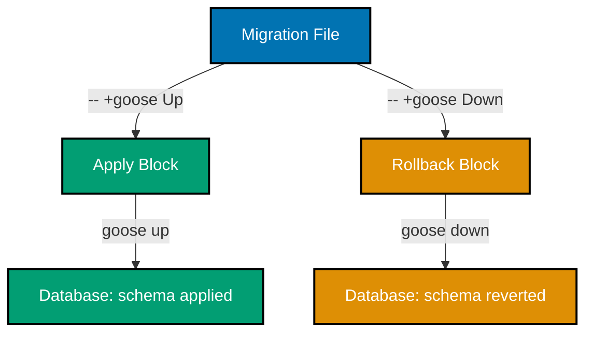
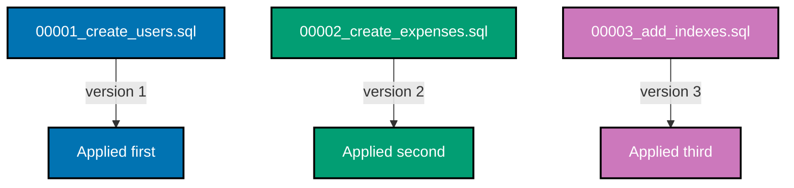
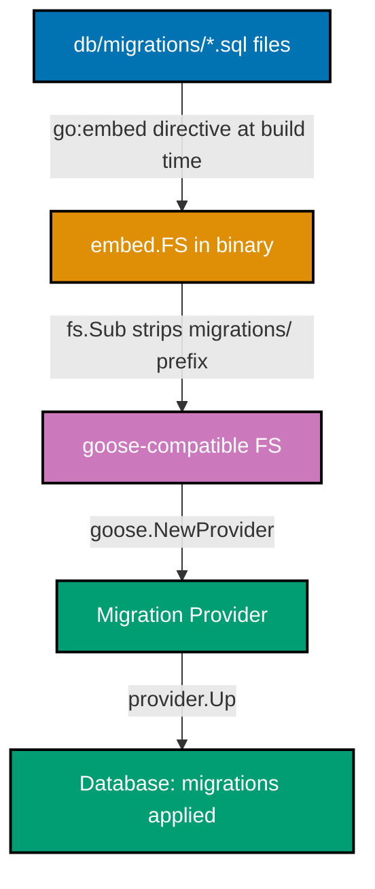

## Beginner Examples (1-30)

**Coverage**: 0-40% of Goose functionality

**Focus**: SQL migration files, CLI usage, basic schema operations, embedded migrations with Go embed.FS, and programmatic execution via goose.NewProvider().

These examples cover fundamentals needed for building a production migration pipeline. Each example is completely self-contained and runnable with the Goose CLI or standard Go tooling.

---

### Example 1: First SQL Migration File (goose Up/Down Directives)

A Goose SQL migration file uses special comment directives to separate the "apply" block from the "rollback" block. The `-- +goose Up` directive marks statements that run when migrating forward, and `-- +goose Down` marks statements that run when rolling back.



```sql
-- +goose Up
-- => Goose reads this directive to find the forward migration block
-- => All SQL statements between here and "-- +goose Down" run on "goose up"
CREATE TABLE products (
    id   SERIAL      NOT NULL PRIMARY KEY,
    -- => SERIAL auto-increments; equivalent to INTEGER with a sequence
    name VARCHAR(255) NOT NULL
    -- => Required product name; NOT NULL enforces non-empty value at DB level
);
-- => Creates "products" table with 2 columns

-- +goose Down
-- => Goose reads this directive to find the rollback block
-- => All SQL statements here run on "goose down"
DROP TABLE IF EXISTS products;
-- => Removes "products" table; IF EXISTS prevents error if table was never created
```

**Key Takeaway**: Every Goose migration file must contain both `-- +goose Up` and `-- +goose Down` sections — the Up block applies the change, the Down block reverses it exactly.

**Why It Matters**: In production systems, every schema change must be reversible. Without a well-defined Down block, a bad deployment can leave your database in an inconsistent state with no automated path back. Goose enforces this discipline by requiring both directives, making rollback a first-class operation rather than an afterthought.

---

### Example 2: Running Migrations with the Goose CLI

The Goose CLI is the primary interface for applying migrations during development and in CI pipelines. The `goose up` command applies all pending migrations in version order, while `goose status` shows which migrations have and have not been applied.

```sql
-- File: db/migrations/00001_create_settings.sql

-- +goose Up
-- => Forward migration: creates the settings table
CREATE TABLE settings (
    key   VARCHAR(255) NOT NULL PRIMARY KEY,
    -- => Natural primary key using the setting key string itself
    value TEXT         NOT NULL DEFAULT ''
    -- => TEXT allows unlimited length; DEFAULT '' prevents NULL values
);
-- => Creates settings table with 2 columns

-- +goose Down
-- => Rollback migration: removes the settings table
DROP TABLE IF EXISTS settings;
-- => IF EXISTS guard makes this safe to run even if Up never completed
```

```bash
# Apply all pending migrations
goose -dir ./db/migrations postgres \
  "host=localhost user=postgres dbname=myapp sslmode=disable" up
# => Output: OK   00001_create_settings.sql (12.34ms)
# => Goose scans ./db/migrations for .sql files not yet in goose_db_version
# => Applies them in ascending version order (1, 2, 3, ...)

# Check which migrations have run
goose -dir ./db/migrations postgres \
  "host=localhost user=postgres dbname=myapp sslmode=disable" status
# => Output:
# =>   Applied At                  Migration
# =>   =======================================
# =>   Thu Mar 27 00:00:01 2026 -- 00001_create_settings.sql
```

**Key Takeaway**: Use `goose status` before and after deployments to verify exactly which migrations have applied — this prevents "I thought it ran" debugging sessions in production.

**Why It Matters**: The Goose CLI provides a deterministic, auditable migration history. Every applied migration is recorded in the `goose_db_version` table with a timestamp, creating a permanent log of schema changes. In regulated industries or high-availability systems, this audit trail is essential for compliance, incident investigation, and coordinating deployments across multiple database replicas.

---

### Example 3: Creating a Users Table

A users table is the canonical first migration in most applications. This example demonstrates creating a production-grade users table with UUID primary key, audit columns, and appropriate constraints.

```sql
-- File: db/migrations/00001_create_users.sql

-- +goose Up
CREATE TABLE users (
    id                    UUID        NOT NULL PRIMARY KEY DEFAULT gen_random_uuid(),
    -- => UUID primary key; gen_random_uuid() generates v4 UUIDs (PostgreSQL 13+ built-in)
    -- => UUIDs prevent enumeration attacks (attacker can't guess id=2, id=3)
    username              VARCHAR(50)  NOT NULL UNIQUE,
    -- => Max 50 chars enforced at DB level; UNIQUE creates an implicit index
    email                 VARCHAR(255) NOT NULL UNIQUE,
    -- => RFC 5321 allows up to 254 chars; UNIQUE prevents duplicate registrations
    password_hash         VARCHAR(255) NOT NULL,
    -- => Store hashed passwords only (e.g., bcrypt output); never plaintext
    display_name          VARCHAR(255) NOT NULL DEFAULT '',
    -- => Optional display name; DEFAULT '' avoids NULL handling in application code
    role                  VARCHAR(20)  NOT NULL DEFAULT 'USER',
    -- => Role-based access control; DEFAULT 'USER' assigns least-privilege role
    status                VARCHAR(20)  NOT NULL DEFAULT 'ACTIVE',
    -- => Account lifecycle state; application enforces valid values
    failed_login_attempts INTEGER     NOT NULL DEFAULT 0,
    -- => Tracks brute-force attempts; application locks account after threshold
    created_at            TIMESTAMPTZ NOT NULL DEFAULT NOW(),
    -- => TIMESTAMPTZ stores with timezone offset; NOW() auto-populates on INSERT
    updated_at            TIMESTAMPTZ NOT NULL DEFAULT NOW()
    -- => Application must update this on each UPDATE (or use a trigger)
);
-- => Creates users table with 10 columns and a UUID primary key

-- +goose Down
DROP TABLE IF EXISTS users;
-- => IF EXISTS prevents error if migration was partially applied
```

**Key Takeaway**: Always use `TIMESTAMPTZ` (not `TIMESTAMP`) for audit columns and `UUID` (not `SERIAL`) for primary keys in distributed systems — timezone-awareness and non-guessable IDs are production requirements, not optional extras.

**Why It Matters**: The pattern in this example mirrors the actual users table in `apps/demo-be-golang-gin/db/migrations/001_create_users.sql`. UUID primary keys eliminate cross-environment ID conflicts when restoring data between staging and production. `TIMESTAMPTZ` ensures correct time math across daylight saving boundaries. These decisions are architectural: they're nearly impossible to change after the system has data.

---

### Example 4: Adding Columns with ALTER TABLE

Adding a column to an existing table is the most common schema migration after initial table creation. Goose's Down block must reverse the change precisely — in this case, dropping the column that was added.

```sql
-- File: db/migrations/00002_add_phone_to_users.sql

-- +goose Up
ALTER TABLE users
    ADD COLUMN phone VARCHAR(20);
-- => Adds nullable "phone" column to existing users table
-- => No DEFAULT means existing rows get NULL for this column
-- => Nullable is intentional: phone is optional data we're collecting going forward

-- +goose Down
ALTER TABLE users
    DROP COLUMN IF EXISTS phone;
-- => Removes "phone" column and all its data from users
-- => IF EXISTS prevents error if the column was never added (partial Up failure)
-- => WARNING: data in this column is permanently deleted on rollback
```

**Key Takeaway**: When adding a nullable column, no `DEFAULT` is required — PostgreSQL adds the column with `NULL` for all existing rows instantly without rewriting the table, making this migration fast even on large tables.

**Why It Matters**: Adding a `NOT NULL` column without a `DEFAULT` will fail if the table has existing rows. Adding a `NOT NULL` column with a `DEFAULT` rewrites the entire table in older PostgreSQL versions (pre-11), causing table locks. Understanding this distinction prevents production outages on tables with millions of rows. The nullable + backfill + add constraint pattern is the safe zero-downtime approach for large tables.

---

### Example 5: Adding Indexes

Indexes are separate from table creation and deserve their own migration. This example adds a single-column index to accelerate lookups by email address.

```sql
-- File: db/migrations/00003_add_email_index_to_users.sql

-- +goose Up
CREATE INDEX idx_users_email
    ON users (email);
-- => Creates B-tree index named "idx_users_email" on users.email
-- => Naming convention: idx_{table}_{column(s)} makes indexes identifiable in pg_indexes
-- => Index accelerates: SELECT * FROM users WHERE email = 'x@example.com'
-- => Index has overhead: each INSERT/UPDATE to email column updates the index

-- +goose Down
DROP INDEX IF EXISTS idx_users_email;
-- => Removes the index; IF EXISTS prevents error if index was never created
-- => Dropping index does NOT affect the data in the table
```

**Key Takeaway**: Name indexes with a consistent convention (`idx_{table}_{columns}`) so they're identifiable in `pg_indexes` and `EXPLAIN` output — unnamed or randomly named indexes make query optimization debugging painful.

**Why It Matters**: Missing indexes on frequently queried columns are among the most common causes of production performance degradation. A full table scan on a users table with 1 million rows takes 100x longer than an indexed lookup. Adding an index is a non-destructive change (no data loss on rollback), but creating it on a live table may briefly lock writes in older PostgreSQL — use `CREATE INDEX CONCURRENTLY` in separate migrations for zero-downtime index creation on large tables.

---

### Example 6: Adding Unique Constraints

A unique constraint enforces data integrity at the database level — no two rows can have the same value in the constrained column. This example adds a unique constraint to an existing column that was not declared unique at table creation.

```sql
-- File: db/migrations/00004_add_unique_username.sql

-- +goose Up
ALTER TABLE users
    ADD CONSTRAINT uq_users_username UNIQUE (username);
-- => Adds named unique constraint on users.username
-- => Naming convention: uq_{table}_{column} distinguishes constraints from indexes
-- => PostgreSQL creates a unique index automatically to enforce the constraint
-- => FAILS if duplicate usernames already exist in the table
-- => Run a deduplication query before applying if data exists

-- +goose Down
ALTER TABLE users
    DROP CONSTRAINT IF EXISTS uq_users_username;
-- => Removes the unique constraint (and its underlying index)
-- => IF EXISTS prevents error if constraint was never added
```

**Key Takeaway**: Name your constraints explicitly (`uq_users_username` rather than letting PostgreSQL auto-generate a name) — named constraints appear in error messages and can be dropped by name without hunting for the auto-generated identifier.

**Why It Matters**: Database-level uniqueness constraints are the last line of defense against duplicate data. Application-level "check before insert" logic has a race condition: two requests can both read "no duplicate exists" and then both insert. The database's unique constraint uses row-level locking to prevent this race. Always enforce uniqueness at both the application level (for user-friendly errors) and the database level (for correctness guarantees).

---

### Example 7: Dropping Columns Safely

Dropping a column deletes its data permanently. The safe pattern involves first removing application code that reads the column, then deploying the migration in a subsequent release.

```sql
-- File: db/migrations/00005_drop_legacy_bio_from_users.sql

-- +goose Up
ALTER TABLE users
    DROP COLUMN IF EXISTS bio;
-- => Removes "bio" column and all its data from every row
-- => IF EXISTS prevents error if column was already removed (idempotent)
-- => WARNING: This is irreversible data loss — backup before applying in production
-- => Deploy this AFTER removing all application code that reads/writes "bio"

-- +goose Down
ALTER TABLE users
    ADD COLUMN bio TEXT;
-- => Re-adds "bio" column as nullable TEXT
-- => Data that was in "bio" before the Up migration is GONE — cannot restore
-- => Down migration only restores the schema shape, not the data
```

**Key Takeaway**: Drop columns in a two-phase deployment: first deploy application code that stops reading the column (while keeping it in the database), then in a second deployment run the migration that drops the column — this prevents read errors during the deployment window.

**Why It Matters**: Dropping a column while application code still reads it causes immediate `ERROR: column "bio" does not exist` errors in production. The two-phase approach (code change first, then schema change) is the standard zero-downtime column removal pattern. In environments with multiple application instances running during a rolling deployment, both old and new application code must work with the same schema simultaneously.

---

### Example 8: Migration File Naming Convention

Goose uses the filename to determine migration version order. The standard convention uses a zero-padded sequential number prefix followed by a descriptive name.



```bash
# Correct naming: zero-padded 5-digit prefix + underscore + snake_case description
# db/migrations/
# ├── 00001_create_users.sql
# ├── 00002_create_refresh_tokens.sql
# ├── 00003_create_revoked_tokens.sql
# ├── 00004_create_expenses.sql
# └── 00005_create_attachments.sql

# Goose extracts the version number from the filename prefix
# Version 1  => 00001_create_users.sql
# Version 2  => 00002_create_refresh_tokens.sql
# Version 5  => 00005_create_attachments.sql

# WRONG: Do not use timestamps as version numbers in team environments
# 20260327000000_create_users.sql  -- Risk of collision when two devs create migrations simultaneously

# WRONG: Do not use non-sequential numbers with gaps
# 001_create_users.sql
# 005_create_tokens.sql  -- Gap between 1 and 5 causes confusion
```

```sql
-- File: db/migrations/00001_create_users.sql
-- => Version 1: first migration applied to a fresh database

-- +goose Up
CREATE TABLE users (id SERIAL PRIMARY KEY, name VARCHAR(255) NOT NULL);
-- => Minimal users table for demonstration

-- +goose Down
DROP TABLE IF EXISTS users;
```

**Key Takeaway**: Use zero-padded sequential integers (e.g., `00001`, `00002`) as migration version prefixes — this ensures lexicographic sort order matches execution order and prevents the team coordination problems that timestamp-based names create.

**Why It Matters**: In a team environment, two developers creating migrations simultaneously can generate the same timestamp prefix, causing version conflicts when both branches are merged. Sequential integers with a PR/merge workflow (assign the next number at merge time) avoid this entirely. The zero-padding (`00001` not `1`) ensures correct lexicographic ordering when filenames are sorted as strings, preventing version 10 from sorting before version 2.

---

### Example 9: Checking Migration Status

The `goose status` command shows which migrations have been applied and which are pending. It reads from the `goose_db_version` table that Goose creates automatically.

```bash
# Check status of all migrations
goose -dir ./db/migrations postgres \
  "host=localhost user=postgres dbname=myapp sslmode=disable" status
# => Output (3 applied, 1 pending):
# =>   Applied At                  Migration
# =>   =======================================
# =>   Thu Mar 27 00:01:15 2026 -- 00001_create_users.sql
# =>   Thu Mar 27 00:01:15 2026 -- 00002_create_expenses.sql
# =>   Thu Mar 27 00:01:16 2026 -- 00003_add_indexes.sql
# =>   Pending                  -- 00004_add_phone_to_users.sql
# => "Pending" means in migrations dir but NOT in goose_db_version table

# Check the version number Goose uses internally
goose -dir ./db/migrations postgres \
  "host=localhost user=postgres dbname=myapp sslmode=disable" version
# => Output: goose: version 3
# => "3" is the version number of the last applied migration (00003_add_indexes.sql)
```

```sql
-- Goose creates and manages this table automatically
-- You can query it directly to inspect migration history
SELECT version_id, is_applied, tstamp
FROM goose_db_version
ORDER BY version_id;
-- => version_id | is_applied | tstamp
-- => ----------+------------+----------------------------
-- =>          1 | true       | 2026-03-27 00:01:15+07
-- =>          2 | true       | 2026-03-27 00:01:15+07
-- =>          3 | true       | 2026-03-27 00:01:16+07
-- => version_id matches the number prefix in the migration filename
```

**Key Takeaway**: Run `goose status` as a pre-deployment health check to confirm exactly which migrations have run — never assume a migration applied just because a previous deployment succeeded.

**Why It Matters**: Production incidents frequently stem from migrations that failed silently or were skipped due to a deployment error. `goose status` provides an authoritative, database-sourced view of migration state that cannot be spoofed by build artifacts or deployment logs. Including `goose status` in your deployment runbook and post-deployment verification steps transforms migration management from guesswork into a reproducible, verifiable process.

---

### Example 10: Rolling Back a Migration

The `goose down` command rolls back the most recently applied migration by executing its `-- +goose Down` block. This is the emergency escape hatch when a bad migration reaches production.

```sql
-- File: db/migrations/00004_add_broken_column.sql

-- +goose Up
ALTER TABLE users
    ADD COLUMN broken_feature VARCHAR(50) NOT NULL DEFAULT 'bad_default';
-- => Adds a column that turns out to cause problems in production
-- => This is the migration we need to roll back

-- +goose Down
ALTER TABLE users
    DROP COLUMN IF EXISTS broken_feature;
-- => Removes the column; this is what "goose down" will execute
```

```bash
# Roll back the most recently applied migration
goose -dir ./db/migrations postgres \
  "host=localhost user=postgres dbname=myapp sslmode=disable" down
# => Output: OK   00004_add_broken_column.sql (8.21ms)
# => Executes the "-- +goose Down" block of migration 00004
# => Removes "broken_feature" column from users table
# => Updates goose_db_version: sets is_applied=false for version 4

# Verify rollback succeeded
goose -dir ./db/migrations postgres \
  "host=localhost user=postgres dbname=myapp sslmode=disable" status
# => Output:
# =>   Applied At                  Migration
# =>   =======================================
# =>   Thu Mar 27 00:01:15 2026 -- 00001_create_users.sql
# =>   Thu Mar 27 00:01:15 2026 -- 00002_create_expenses.sql
# =>   Thu Mar 27 00:01:16 2026 -- 00003_add_indexes.sql
# =>   Pending                  -- 00004_add_broken_column.sql
# => Version 4 is now "Pending" again — rollback confirmed
```

**Key Takeaway**: `goose down` rolls back exactly one migration at a time — it will not cascade through multiple migrations unless called repeatedly, giving you surgical control over rollback depth.

**Why It Matters**: The ability to roll back a single migration without affecting earlier ones is what makes Goose's version-based approach superior to hand-rolled migration scripts. In a production incident, you want to undo precisely the last deployment's schema change, not everything back to an empty database. Testing your Down blocks before deploying to production is mandatory — a Down block you've never executed is a Down block you cannot trust.

---

### Example 11: Rolling Back to a Specific Version

The `goose down-to` command rolls back all migrations applied after a specified version number. This is useful when multiple migrations in a deployment need to be undone.

```bash
# Assume current state: versions 1, 2, 3, 4, 5 are all applied

# Roll back to version 2 (removes versions 5, 4, 3 in reverse order)
goose -dir ./db/migrations postgres \
  "host=localhost user=postgres dbname=myapp sslmode=disable" down-to 2
# => Output:
# =>   OK   00005_create_attachments.sql (15.33ms)
# =>   OK   00004_add_phone_to_users.sql (9.44ms)
# =>   OK   00003_add_email_index.sql (7.21ms)
# => Executes Down blocks of 5, 4, 3 in descending order
# => Stops after reverting version 3 (leaves versions 1 and 2 applied)

# Verify: only versions 1 and 2 remain applied
goose -dir ./db/migrations postgres \
  "host=localhost user=postgres dbname=myapp sslmode=disable" status
# => Applied At                  Migration
# => =======================================
# => Thu Mar 27 00:01:15 2026 -- 00001_create_users.sql
# => Thu Mar 27 00:01:15 2026 -- 00002_create_expenses.sql
# => Pending                  -- 00003_add_email_index.sql
# => Pending                  -- 00004_add_phone_to_users.sql
# => Pending                  -- 00005_create_attachments.sql
```

**Key Takeaway**: `goose down-to N` rolls back in reverse order (newest first) down to — but not including — version N, making it the right tool when an entire feature branch's migrations need to be undone.

**Why It Matters**: When a feature branch contains multiple migrations (e.g., "add payment tables: migrations 8, 9, 10") and the feature is reverted, `goose down-to 7` cleanly removes all three in the correct reverse order. Doing this manually (three separate `goose down` calls) is error-prone — you might forget one. The targeted rollback command makes multi-migration reversions safe and auditable.

---

### Example 12: Redo the Last Migration

The `goose redo` command rolls back the most recently applied migration and immediately re-applies it. This is the primary development workflow tool for iterating on a migration without bumping the version number.

```bash
# During development: you've applied migration 5, but realize there's an issue

# First, check current state
goose -dir ./db/migrations postgres \
  "host=localhost user=postgres dbname=myapp sslmode=disable" status
# => Applied: 00005_create_attachments.sql (version 5)

# Edit the migration file to fix the issue
# (e.g., add a missing column, fix a constraint name)

# Redo: rolls back version 5, then re-applies it
goose -dir ./db/migrations postgres \
  "host=localhost user=postgres dbname=myapp sslmode=disable" redo
# => Output:
# =>   OK   00005_create_attachments.sql (rollback, 12.11ms)
# =>   OK   00005_create_attachments.sql (re-apply, 14.55ms)
# => Executes Down block, then immediately executes Up block for version 5

# Verify: version 5 is applied with updated schema
goose -dir ./db/migrations postgres \
  "host=localhost user=postgres dbname=myapp sslmode=disable" version
# => goose: version 5
```

**Key Takeaway**: Use `goose redo` only during local development — never on production databases, since it first destroys the schema (Down block) before re-creating it, causing a brief window where the table does not exist.

**Why It Matters**: `goose redo` is the fastest iteration loop when writing a new migration locally. Instead of manually running `goose down` then `goose up`, a single command handles the cycle. This encourages thorough testing of both the Up and Down blocks during development, catching issues before the migration reaches a shared environment where rolling back has higher cost.

---

### Example 13: Creating Tables with Foreign Keys

Foreign key constraints enforce referential integrity between tables — a row in a child table cannot reference a non-existent row in the parent table. Migration order matters: the parent table must be created before the child.

```sql
-- File: db/migrations/00002_create_refresh_tokens.sql
-- => Must run AFTER 00001_create_users.sql because it references users(id)

-- +goose Up
CREATE TABLE refresh_tokens (
    id         UUID         NOT NULL PRIMARY KEY DEFAULT gen_random_uuid(),
    -- => UUID primary key; consistent with users table convention
    user_id    UUID         NOT NULL REFERENCES users(id),
    -- => Foreign key to users.id; REFERENCES creates the FK constraint
    -- => NOT NULL means every token must belong to a user (no orphan tokens)
    -- => INSERT fails if user_id does not exist in users.id
    token_hash VARCHAR(512) NOT NULL UNIQUE,
    -- => Store hash of token (not plaintext); UNIQUE prevents hash collisions
    expires_at TIMESTAMPTZ  NOT NULL,
    -- => Token expiration time; application logic checks this on validation
    revoked    BOOLEAN      NOT NULL DEFAULT FALSE,
    -- => Explicit revocation flag; DEFAULT FALSE means tokens start valid
    created_at TIMESTAMPTZ  NOT NULL DEFAULT NOW()
    -- => Creation timestamp for audit and expiry calculation
);
-- => Creates refresh_tokens table with foreign key to users

CREATE INDEX idx_refresh_tokens_user_id ON refresh_tokens (user_id);
-- => Index on user_id accelerates: SELECT * FROM refresh_tokens WHERE user_id = $1
-- => Without this index, looking up tokens for a user requires a full table scan

-- +goose Down
DROP TABLE IF EXISTS refresh_tokens;
-- => Drops refresh_tokens first; users table still exists after this Down block
-- => Order matters: cannot drop users while refresh_tokens still references it
```

**Key Takeaway**: Migration files with foreign keys must run after the parent table migration — Goose's sequential version numbering enforces this order, so assign version numbers to reflect dependency order.

**Why It Matters**: Foreign key constraints are the database's guarantee of referential integrity. Without them, application bugs or direct database edits can create orphan records (tokens pointing to deleted users) that cause mysterious errors. The `REFERENCES` constraint turns referential integrity from a hope into a guarantee, at the cost of slightly slower inserts and a hard dependency on migration order.

---

### Example 14: Adding NOT NULL Constraints with Defaults

Adding a `NOT NULL` column to an existing table with rows requires a `DEFAULT` value to populate existing rows. Without a default, PostgreSQL rejects the migration because existing rows would violate the constraint.

```sql
-- File: db/migrations/00006_add_tier_to_users.sql

-- +goose Up
ALTER TABLE users
    ADD COLUMN tier VARCHAR(20) NOT NULL DEFAULT 'free';
-- => Adds "tier" column to existing users table
-- => NOT NULL requires a DEFAULT so existing rows get a value
-- => DEFAULT 'free' means: all existing users start on the free tier
-- => New inserts without specifying tier also get 'free'
-- => PostgreSQL sets 'free' for all existing rows atomically

-- +goose Down
ALTER TABLE users
    DROP COLUMN IF EXISTS tier;
-- => Removes tier column; all tier data is lost on rollback
```

**Key Takeaway**: When adding a `NOT NULL` column to a table with existing rows, you must provide a `DEFAULT` — PostgreSQL will reject the migration otherwise, and the default value is a business decision that must be intentional.

**Why It Matters**: The choice of default value is a data migration decision, not just a schema decision. Defaulting to `'free'` means all existing users get the free tier, which may be correct business logic or may cause billing errors if some users should be on paid tiers. Always think through what the default means for existing data. For complex defaults (different users get different values), use a two-step migration: add the nullable column, backfill data, then add the NOT NULL constraint.

---

### Example 15: Creating Enum Types in PostgreSQL

PostgreSQL supports custom ENUM types that restrict a column to a fixed set of values. This is stricter than a VARCHAR check constraint and more self-documenting.

```sql
-- File: db/migrations/00007_add_status_enum.sql

-- +goose Up
CREATE TYPE account_status AS ENUM (
    'active',
    -- => Valid value: user can log in and use the system
    'suspended',
    -- => Valid value: user temporarily blocked (e.g., payment failure)
    'deleted'
    -- => Valid value: soft-deleted user account
);
-- => Creates a custom PostgreSQL ENUM type named "account_status"
-- => Values are case-sensitive; 'Active' != 'active'

ALTER TABLE users
    ADD COLUMN account_status account_status NOT NULL DEFAULT 'active';
-- => Adds column using the custom ENUM type
-- => Only 'active', 'suspended', 'deleted' are valid values
-- => INSERT with account_status='banned' would raise: invalid input value for enum

-- +goose Down
ALTER TABLE users
    DROP COLUMN IF EXISTS account_status;
-- => Must drop the column before dropping the type it references
DROP TYPE IF EXISTS account_status;
-- => Removes the ENUM type definition from PostgreSQL catalog
-- => IF EXISTS prevents error if type was never created
```

**Key Takeaway**: The Down block for an ENUM migration must drop the column before dropping the type — PostgreSQL refuses to drop a type still referenced by a column constraint.

**Why It Matters**: ENUM types provide stronger data integrity than VARCHAR with a CHECK constraint: they're stored as integers internally (fast), enforce allowed values at the type level (not just per-column), and show up correctly in schema documentation tools. The trade-off is inflexibility — adding a new ENUM value requires `ALTER TYPE ... ADD VALUE`, which cannot be done inside a transaction in PostgreSQL, requiring the `-- +goose NO TRANSACTION` annotation (covered in advanced examples).

---

### Example 16: Seed Data in Migrations

Goose migrations can contain both DDL (schema changes) and DML (data changes). Seeding initial reference data in migrations ensures every environment starts with the same baseline data.

```sql
-- File: db/migrations/00008_seed_default_settings.sql

-- +goose Up
INSERT INTO settings (key, value) VALUES
    ('max_login_attempts', '5'),
    -- => Application reads this to enforce brute-force lockout threshold
    ('session_timeout_minutes', '60'),
    -- => Application reads this to expire user sessions after 60 minutes
    ('maintenance_mode', 'false');
-- => Seeds 3 default configuration values into settings table
-- => These values exist in every environment (dev, staging, prod) after migration

-- +goose Down
DELETE FROM settings
WHERE key IN ('max_login_attempts', 'session_timeout_minutes', 'maintenance_mode');
-- => Removes only the seeded rows; does not delete other settings
-- => Targeted DELETE is safer than TRUNCATE TABLE which removes all rows
```

**Key Takeaway**: Seed data in migrations should use `INSERT ... VALUES` with idempotent-friendly Down blocks that delete only the inserted rows — never `TRUNCATE TABLE`, which destroys data inserted by other means.

**Why It Matters**: Reference data (configuration values, status codes, default roles) must be consistent across all environments. Seeding this data in migrations rather than application startup code means the data is present before the application runs, preventing "setting not found" panics on first boot. It also means CI, staging, and production all have identical baseline data, eliminating "works in dev, broken in staging" bugs caused by missing reference rows.

---

### Example 17: Multiple Statements in One Migration

A single Goose migration file can contain multiple SQL statements separated by semicolons. This is the standard approach for logically related changes that must be atomic.

```sql
-- File: db/migrations/00009_create_audit_system.sql
-- => Creates the entire audit system (tables + indexes) in one migration

-- +goose Up
CREATE TABLE audit_logs (
    id         BIGSERIAL    NOT NULL PRIMARY KEY,
    -- => BIGSERIAL: auto-increment 64-bit integer (handles high-volume logs)
    user_id    UUID,
    -- => Nullable: system events may not have an associated user
    action     VARCHAR(100) NOT NULL,
    -- => Action performed: 'user.login', 'expense.create', 'admin.delete_user'
    resource   VARCHAR(255),
    -- => Affected resource: 'users/uuid-here', 'expenses/uuid-here'
    metadata   TEXT,
    -- => JSON string with additional context; TEXT avoids JSONB overhead for logs
    created_at TIMESTAMPTZ  NOT NULL DEFAULT NOW()
    -- => Log entry timestamp; indexed below for time-range queries
);
-- => Creates audit_logs table for comprehensive event tracking

CREATE INDEX idx_audit_logs_user_id   ON audit_logs (user_id);
-- => Accelerates: SELECT * FROM audit_logs WHERE user_id = $1
CREATE INDEX idx_audit_logs_action    ON audit_logs (action);
-- => Accelerates: SELECT * FROM audit_logs WHERE action = 'user.login'
CREATE INDEX idx_audit_logs_created_at ON audit_logs (created_at);
-- => Accelerates time-range queries: WHERE created_at > NOW() - INTERVAL '7 days'

-- +goose Down
DROP TABLE IF EXISTS audit_logs;
-- => Drops the table AND all its indexes (indexes are dropped with the table)
-- => Does NOT need separate DROP INDEX statements
```

**Key Takeaway**: Group logically related DDL statements (table + its indexes) into one migration file so they're applied and rolled back atomically — never split a table and its required indexes across separate migration files.

**Why It Matters**: If a table and its indexes are in separate migration files, a failed deployment could leave you with the table but without the indexes, causing query performance degradation that looks like an application bug. Keeping them in one migration ensures the database either has both or neither. The exception is indexes added later as performance improvements — those belong in their own migration with their own version number.

---

### Example 18: Embedding Migrations with Go embed.FS

Go's `embed` package allows SQL migration files to be bundled into the compiled binary at build time. This eliminates deployment dependencies on external file paths and makes your binary self-contained.



```go
// File: db/embed.go
// Package db provides the embedded SQL migration files for goose.
package db

import "embed"

// EmbedMigrations holds the SQL migration files embedded at compile time.
// The go:embed directive runs at build time, reading all .sql files
// from the migrations/ subdirectory into the EmbedMigrations variable.
//
//go:embed migrations/*.sql
var EmbedMigrations embed.FS
// => EmbedMigrations is an embed.FS containing all .sql files
// => Files are accessible as "migrations/00001_create_users.sql", etc.
// => The binary contains the file contents — no filesystem access at runtime
// => Adding or modifying .sql files requires recompiling the binary
```

**Key Takeaway**: Place the `embed.go` file in the same directory as the `migrations/` subdirectory — the `//go:embed` directive path is relative to the Go source file containing it.

**Why It Matters**: Embedded migrations are the production-grade pattern used in `apps/demo-be-golang-gin/db/embed.go`. Without embedding, deploying your application requires shipping both the binary and the migration files in the correct directory structure, creating deployment complexity and the risk of version mismatches between binary and migration files. With embedding, a single binary contains everything needed to migrate the database to the correct schema version.

---

### Example 19: goose.NewProvider() Setup

`goose.NewProvider()` creates a programmatic migration provider that wraps the embedded filesystem and database connection. This is the Go API equivalent of the Goose CLI.

```go
// File: internal/store/gorm_store.go (excerpt)
package store

import (
    "context"
    "fmt"
    "io/fs"

    "github.com/pressly/goose/v3"
    "gorm.io/gorm"

    dbmigrations "github.com/myapp/db"
    // => Import the package containing EmbedMigrations (our db/embed.go)
)

// Migrate runs all pending goose SQL migrations.
func (s *GORMStore) Migrate() error {
    sqlDB, err := s.db.DB()
    // => Extract *sql.DB from *gorm.DB for use with goose
    // => goose.NewProvider requires database/sql *sql.DB, not GORM's *gorm.DB
    if err != nil {
        return err
        // => Return error if GORM cannot provide underlying *sql.DB
    }

    // Strip the "migrations/" prefix from the embedded FS
    // so goose sees files as "00001_create_users.sql" not "migrations/00001_..."
    migrationsFS, err := fs.Sub(dbmigrations.EmbedMigrations, "migrations")
    // => fs.Sub creates a sub-FS rooted at the given path
    // => goose expects files at the root of the FS, not in a subdirectory
    if err != nil {
        return fmt.Errorf("failed to get migrations sub-FS: %w", err)
        // => Wraps error with context; %w enables errors.Is/As unwrapping
    }

    provider, err := goose.NewProvider(
        goose.DialectPostgres, // => Target PostgreSQL dialect
        sqlDB,                 // => *sql.DB connection for executing migrations
        migrationsFS,          // => embed.FS containing .sql migration files
        goose.WithVerbose(false),
        // => Suppresses per-migration log output; set true for debugging
    )
    // => provider is *goose.Provider; err is non-nil if setup fails
    if err != nil {
        return err
    }

    _, err = provider.Up(context.Background())
    // => Applies all pending migrations in version order
    // => Returns []MigrationResult (ignored here) and error
    return err
}
```

**Key Takeaway**: Call `fs.Sub(embeddedFS, "migrations")` before passing to `goose.NewProvider()` — Goose expects migration files at the root of the provided filesystem, but `embed.FS` preserves the directory structure including the `migrations/` prefix.

**Why It Matters**: The `fs.Sub` call is a subtle but critical step that trips up many developers implementing embedded Goose migrations for the first time. Without it, Goose cannot find any migration files and silently applies zero migrations — your database schema stays at version 0 with no error. This exact pattern is used in the production `apps/demo-be-golang-gin` codebase, making it a battle-tested reference implementation.

---

### Example 20: Running Embedded Migrations Programmatically

With the provider set up, `provider.Up()` applies all pending migrations. This is typically called at application startup, before the HTTP server begins accepting requests.

```go
// File: cmd/server/main.go (excerpt)
package main

import (
    "context"
    "database/sql"
    "fmt"
    "io/fs"
    "log"

    "github.com/pressly/goose/v3"
    _ "github.com/lib/pq" // => PostgreSQL driver; blank import registers the driver

    dbmigrations "github.com/myapp/db"
)

func runMigrations(dsn string) error {
    // Open a standard database/sql connection
    db, err := sql.Open("postgres", dsn)
    // => Opens connection pool; does NOT connect yet (lazy)
    if err != nil {
        return fmt.Errorf("sql.Open: %w", err)
    }
    defer db.Close()
    // => Ensure connection pool is released when function returns

    // Ping to verify the connection is actually reachable
    if err := db.Ping(); err != nil {
        return fmt.Errorf("db.Ping: %w", err)
        // => Fails fast if database is unreachable rather than silently hanging
    }

    // Strip directory prefix from embedded FS
    migrationsFS, err := fs.Sub(dbmigrations.EmbedMigrations, "migrations")
    if err != nil {
        return fmt.Errorf("fs.Sub: %w", err)
    }

    // Create the goose provider
    provider, err := goose.NewProvider(goose.DialectPostgres, db, migrationsFS)
    // => goose.NewProvider with no options (uses defaults)
    if err != nil {
        return fmt.Errorf("goose.NewProvider: %w", err)
    }

    // Apply all pending migrations
    results, err := provider.Up(context.Background())
    // => results is []goose.MigrationResult (one per migration applied)
    if err != nil {
        return fmt.Errorf("provider.Up: %w", err)
    }

    // Log which migrations ran
    for _, r := range results {
        log.Printf("migration applied: %s (%s)", r.Source.Path, r.Duration)
        // => r.Source.Path: "00001_create_users.sql"
        // => r.Duration: time.Duration the migration took to execute
    }
    // => If results is empty, all migrations were already applied (nothing to do)

    return nil
}

func main() {
    dsn := "host=localhost user=postgres dbname=myapp sslmode=disable"
    if err := runMigrations(dsn); err != nil {
        log.Fatalf("migrations failed: %v", err)
        // => log.Fatalf calls os.Exit(1) after logging; server does not start
    }
    // => All migrations applied; safe to start HTTP server
    log.Println("migrations complete, starting server")
}
```

**Key Takeaway**: Log the `[]MigrationResult` returned by `provider.Up()` — an empty results slice means all migrations were already applied (normal on subsequent startups), while a non-empty slice tells you exactly which migrations ran during this deployment.

**Why It Matters**: Running migrations at application startup is the self-healing deployment pattern: the binary contains both the application code and the migrations needed to support it. This eliminates the separate "run migrations" deployment step that can be forgotten or fail silently. The failure mode is safe: if migrations fail, the server does not start, preventing the application from running against an incompatible schema.

---

### Example 21: Context-Aware Migration Execution

Goose's provider methods accept a `context.Context`, enabling timeout control and cancellation for long-running migrations. This is essential in production environments with deployment time limits.

```go
package store

import (
    "context"
    "fmt"
    "io/fs"
    "time"

    "github.com/pressly/goose/v3"
    "gorm.io/gorm"

    dbmigrations "github.com/myapp/db"
)

// MigrateWithTimeout runs migrations with a configurable timeout.
func (s *GORMStore) MigrateWithTimeout(timeout time.Duration) error {
    sqlDB, err := s.db.DB()
    if err != nil {
        return err
    }

    migrationsFS, err := fs.Sub(dbmigrations.EmbedMigrations, "migrations")
    if err != nil {
        return fmt.Errorf("fs.Sub: %w", err)
    }

    provider, err := goose.NewProvider(goose.DialectPostgres, sqlDB, migrationsFS)
    if err != nil {
        return fmt.Errorf("goose.NewProvider: %w", err)
    }

    // Create context with timeout to prevent hanging migrations
    ctx, cancel := context.WithTimeout(context.Background(), timeout)
    // => ctx will be cancelled after 'timeout' duration
    // => cancel() must be called to release context resources
    defer cancel()
    // => cancel() is always called when MigrateWithTimeout returns

    results, err := provider.Up(ctx)
    // => provider.Up respects context cancellation
    // => If context times out, Up returns: context deadline exceeded
    if err != nil {
        return fmt.Errorf("provider.Up: %w", err)
        // => Wrapped error contains the original context error
        // => Caller can check: errors.Is(err, context.DeadlineExceeded)
    }

    for _, r := range results {
        if r.Error != nil {
            return fmt.Errorf("migration %s failed: %w", r.Source.Path, r.Error)
            // => Each MigrationResult has its own Error field
            // => Check per-result errors for partial failures
        }
    }

    return nil
}

// Usage example
func ExampleMigrateWithTimeout() {
    store := &GORMStore{} // => assume db is initialized
    err := store.MigrateWithTimeout(30 * time.Second)
    // => Migration must complete within 30 seconds
    // => Kubernetes/ECS deployment timeouts are typically 60-300 seconds
    if err != nil {
        panic(fmt.Sprintf("migration timeout: %v", err))
    }
}
```

**Key Takeaway**: Always pass a timeout context to `provider.Up()` in production — an infinite context means a stuck migration (e.g., waiting for a table lock) will hang your deployment indefinitely.

**Why It Matters**: Long-running migrations like adding an index to a 100-million-row table or adding a NOT NULL column can take minutes. In cloud deployments (Kubernetes, ECS, Cloud Run), container startup has a health check timeout. If migrations exceed this timeout, the deployment controller replaces the container, potentially leaving a partially-applied migration. Context timeouts let you fail fast, alert, and investigate rather than silently retrying in a broken state.

---

### Example 22: Single-Step Migration (Up by One)

`provider.UpByOne()` applies exactly one pending migration. This is useful for incremental rollout strategies where you want to test each migration in isolation before proceeding.

```go
package store

import (
    "context"
    "fmt"
    "io/fs"
    "log"

    "github.com/pressly/goose/v3"

    dbmigrations "github.com/myapp/db"
)

// MigrateOneStep applies exactly one pending migration.
// Returns (true, nil) if a migration was applied, (false, nil) if already at latest.
func MigrateOneStep(db interface{ DB() (*sql.DB, error) }) (bool, error) {
    sqlDB, err := db.DB()
    if err != nil {
        return false, err
    }

    migrationsFS, err := fs.Sub(dbmigrations.EmbedMigrations, "migrations")
    if err != nil {
        return false, fmt.Errorf("fs.Sub: %w", err)
    }

    provider, err := goose.NewProvider(goose.DialectPostgres, sqlDB, migrationsFS)
    if err != nil {
        return false, fmt.Errorf("goose.NewProvider: %w", err)
    }

    result, err := provider.UpByOne(context.Background())
    // => Applies exactly one pending migration (the lowest version not yet applied)
    // => Returns *MigrationResult (not a slice) — always one or nothing
    // => Returns goose.ErrNoNextVersion if already at the latest migration
    if err != nil {
        if errors.Is(err, goose.ErrNoNextVersion) {
            return false, nil
            // => No pending migrations; this is not an error condition
        }
        return false, fmt.Errorf("UpByOne: %w", err)
    }

    log.Printf("applied single migration: %s", result.Source.Path)
    // => result.Source.Path: "00004_add_phone_to_users.sql"
    return true, nil
    // => true signals that a migration was applied
}
```

**Key Takeaway**: `provider.UpByOne()` returns `goose.ErrNoNextVersion` (not nil, not a generic error) when no pending migrations exist — explicitly check for this sentinel error to distinguish "nothing to do" from "something failed".

**Why It Matters**: Single-step migration is the foundation of blue-green deployment strategies where schema changes are applied incrementally with application compatibility verified between each step. In large teams with frequent migrations, UpByOne enables migration canary deployments: apply one migration, verify the application works, then apply the next. This is also the right approach for emergency situations where you need to apply exactly one fix without risking side effects from running all pending migrations.

---

### Example 23: Creating Composite Indexes

A composite index covers multiple columns and accelerates queries that filter on combinations of those columns. Column order in the index definition matters significantly for query performance.

```sql
-- File: db/migrations/00010_add_composite_indexes_to_expenses.sql

-- +goose Up
CREATE INDEX idx_expenses_user_id_date
    ON expenses (user_id, date);
-- => Composite index on (user_id, date) columns
-- => Accelerates: WHERE user_id = $1 AND date BETWEEN $2 AND $3
-- => Also accelerates: WHERE user_id = $1 (uses leftmost column prefix rule)
-- => Does NOT accelerate: WHERE date = $1 (date is not the leftmost column)
-- => Column order rule: put the most selective / most frequently filtered column first

CREATE INDEX idx_expenses_user_id_category
    ON expenses (user_id, category);
-- => Second composite index for category-based filtering per user
-- => Accelerates: WHERE user_id = $1 AND category = $2
-- => Typical query: "show all food expenses for user X"

-- +goose Down
DROP INDEX IF EXISTS idx_expenses_user_id_date;
-- => Remove date composite index
DROP INDEX IF EXISTS idx_expenses_user_id_category;
-- => Remove category composite index
```

**Key Takeaway**: In a composite index `(user_id, date)`, PostgreSQL can use the index for queries filtering on `user_id` alone OR `(user_id, date)` together, but NOT for `date` alone — always put the most-commonly-filtered column first.

**Why It Matters**: Composite index column order is one of the most misunderstood aspects of database performance optimization. A composite index `(date, user_id)` and `(user_id, date)` look similar but have completely different query performance characteristics. Getting this wrong means your "optimized" index provides no benefit for your actual query patterns. Always design indexes around the `WHERE` clauses in your most frequent queries, with the highest-selectivity column first.

---

### Example 24: Adding CHECK Constraints

A `CHECK` constraint validates column values against a boolean expression at the database level. Unlike application-level validation, CHECK constraints cannot be bypassed by direct SQL inserts.

```sql
-- File: db/migrations/00011_add_check_constraints_to_expenses.sql

-- +goose Up
ALTER TABLE expenses
    ADD CONSTRAINT chk_expenses_amount_positive
        CHECK (amount > 0);
-- => Enforces: every expense amount must be positive
-- => INSERT with amount = -50 raises: ERROR: new row violates check constraint
-- => UPDATE that sets amount to 0 also raises the error
-- => Naming: chk_{table}_{rule} distinguishes CHECK constraints

ALTER TABLE expenses
    ADD CONSTRAINT chk_expenses_type_valid
        CHECK (type IN ('EXPENSE', 'INCOME'));
-- => Restricts "type" column to exactly two valid values
-- => Alternative to ENUM: VARCHAR with CHECK is easier to modify later
-- => Adding a new valid type only requires: ALTER TABLE expenses DROP CONSTRAINT + ADD CONSTRAINT

-- +goose Down
ALTER TABLE expenses
    DROP CONSTRAINT IF EXISTS chk_expenses_amount_positive;
-- => Remove amount check; amounts can be negative again
ALTER TABLE expenses
    DROP CONSTRAINT IF EXISTS chk_expenses_type_valid;
-- => Remove type check; any string can be stored in type column
```

**Key Takeaway**: `CHECK` constraints with `IN (...)` are easier to modify than ENUM types — you can drop and re-add the constraint in one transaction without the `ALTER TYPE` limitations that ENUMs impose.

**Why It Matters**: CHECK constraints are underused but powerful. They encode business rules directly in the schema, ensuring that data written by application code, migration scripts, and direct SQL all comply with the same rules. When a future developer adds a direct SQL INSERT for data migration purposes, the CHECK constraint prevents them from accidentally inserting invalid data. This is defense-in-depth for data integrity.

---

### Example 25: Creating Junction Tables for Many-to-Many

A junction table (also called a bridge, associative, or join table) implements a many-to-many relationship. Each row represents one association between two entities.

```sql
-- File: db/migrations/00012_create_expense_tags.sql

-- +goose Up
CREATE TABLE tags (
    id   UUID         NOT NULL PRIMARY KEY DEFAULT gen_random_uuid(),
    -- => UUID primary key for the tag entity
    name VARCHAR(100) NOT NULL UNIQUE,
    -- => Tag name must be unique across the system (e.g., 'food', 'transport')
    created_at TIMESTAMPTZ NOT NULL DEFAULT NOW()
);
-- => Tags reference table; tags exist independently of expenses

CREATE TABLE expense_tags (
    expense_id UUID NOT NULL REFERENCES expenses(id) ON DELETE CASCADE,
    -- => FK to expenses; ON DELETE CASCADE: removing an expense removes its tags
    tag_id     UUID NOT NULL REFERENCES tags(id) ON DELETE CASCADE,
    -- => FK to tags; ON DELETE CASCADE: removing a tag removes its expense associations
    created_at TIMESTAMPTZ NOT NULL DEFAULT NOW(),
    -- => When this expense-tag association was created
    PRIMARY KEY (expense_id, tag_id)
    -- => Composite primary key prevents duplicate associations
    -- => Same expense cannot be tagged with same tag twice
);
-- => Junction table implementing many-to-many: one expense has many tags, one tag has many expenses

CREATE INDEX idx_expense_tags_tag_id ON expense_tags (tag_id);
-- => Index on tag_id accelerates: SELECT * FROM expense_tags WHERE tag_id = $1
-- => (expense_id, tag_id) PRIMARY KEY already creates an index with expense_id first)
-- => This index covers tag_id-first lookups which the PK index doesn't

-- +goose Down
DROP TABLE IF EXISTS expense_tags;
-- => Drop junction table first (has FKs to both tags and expenses)
DROP TABLE IF EXISTS tags;
-- => Drop tags table after junction table is removed
```

**Key Takeaway**: Use `ON DELETE CASCADE` on junction table foreign keys so that deleting either parent entity automatically cleans up the association rows — without this, you get FK violation errors when trying to delete a tagged expense or a used tag.

**Why It Matters**: Junction tables are the relational model's solution to many-to-many relationships that would otherwise require storing arrays of IDs in a column (which breaks normalization and makes queries inefficient). The composite primary key `(expense_id, tag_id)` provides both uniqueness enforcement and an index for lookups by expense. The additional index on `tag_id` enables efficient reverse lookups (all expenses with a given tag), which the composite PK index cannot support since it's ordered by `expense_id` first.

---

### Example 26: Timestamp Columns with Defaults

Consistent timestamp column patterns across all tables enable time-based queries, auditing, and soft delete implementations. This example shows the standard four-timestamp pattern.

```sql
-- File: db/migrations/00013_create_documents.sql

-- +goose Up
CREATE TABLE documents (
    id         UUID        NOT NULL PRIMARY KEY DEFAULT gen_random_uuid(),
    title      VARCHAR(255) NOT NULL,
    body       TEXT         NOT NULL DEFAULT '',
    -- => TEXT stores unlimited length content; DEFAULT '' avoids NULL body

    created_at  TIMESTAMPTZ NOT NULL DEFAULT NOW(),
    -- => TIMESTAMPTZ: timezone-aware timestamp; stores UTC, displays in local TZ
    -- => DEFAULT NOW(): auto-populated on INSERT; no application code needed
    created_by  VARCHAR(255) NOT NULL DEFAULT 'system',
    -- => Who created this record; 'system' for migrations/seeds, user ID for app
    updated_at  TIMESTAMPTZ NOT NULL DEFAULT NOW(),
    -- => Must be updated by application on every UPDATE (no auto-trigger here)
    updated_by  VARCHAR(255) NOT NULL DEFAULT 'system',
    -- => Who last updated this record
    deleted_at  TIMESTAMPTZ,
    -- => NULL = not deleted; non-NULL = soft deleted at this timestamp
    -- => Nullable intentionally: NULL is the common case (not deleted)
    deleted_by  VARCHAR(255)
    -- => NULL = not deleted; non-NULL = user ID who deleted this record
);
-- => Creates documents table with full audit trail and soft delete support

CREATE INDEX idx_documents_deleted_at ON documents (deleted_at)
    WHERE deleted_at IS NULL;
-- => Partial index: only indexes non-deleted rows (WHERE deleted_at IS NULL)
-- => Most queries filter on active (non-deleted) documents
-- => Partial index is much smaller and faster than a full index on deleted_at

-- +goose Down
DROP TABLE IF EXISTS documents;
```

**Key Takeaway**: Use a partial index `WHERE deleted_at IS NULL` for soft-delete queries — it only indexes non-deleted rows, making it smaller and faster than a full index while still accelerating the most common query pattern.

**Why It Matters**: The six audit columns (`created_at`, `created_by`, `updated_at`, `updated_by`, `deleted_at`, `deleted_by`) are a production standard for any table where data lineage matters. They answer "when was this created?", "who changed it last?", and "has this been deleted?" without needing a separate audit_logs table for every entity. The partial index on `deleted_at IS NULL` is a critical optimization — standard queries only look at non-deleted rows, and without it, every query must scan the entire column including the null-indexed space.

---

### Example 27: UUID Primary Keys

UUID primary keys are the production standard for distributed systems. This example demonstrates the two UUID generation approaches available in PostgreSQL.

```sql
-- File: db/migrations/00014_create_api_keys.sql

-- +goose Up

-- Approach 1: gen_random_uuid() - PostgreSQL 13+ built-in, no extension needed
CREATE TABLE api_keys (
    id         UUID        NOT NULL PRIMARY KEY DEFAULT gen_random_uuid(),
    -- => gen_random_uuid(): generates v4 (random) UUID
    -- => Built into PostgreSQL 13+; no CREATE EXTENSION needed
    -- => Generates: 550e8400-e29b-41d4-a716-446655440000 (example format)
    user_id    UUID        NOT NULL REFERENCES users(id) ON DELETE CASCADE,
    -- => FK to users; cascade delete removes API keys when user is deleted
    key_hash   VARCHAR(512) NOT NULL UNIQUE,
    -- => Store hash of the API key, never the plaintext key
    name       VARCHAR(100) NOT NULL,
    -- => Human-readable key name: 'CI/CD Pipeline', 'Mobile App v2'
    expires_at TIMESTAMPTZ,
    -- => NULL = never expires; non-NULL = expires at this time
    created_at TIMESTAMPTZ NOT NULL DEFAULT NOW()
);
-- => Creates api_keys with PostgreSQL 13+ UUID generation

-- Approach 2: uuid-ossp extension (older PostgreSQL compatibility)
-- CREATE EXTENSION IF NOT EXISTS "uuid-ossp";  -- Run once per database
-- id UUID NOT NULL PRIMARY KEY DEFAULT uuid_generate_v4()
-- => uuid_generate_v4() requires the uuid-ossp extension
-- => Use gen_random_uuid() when targeting PostgreSQL 13+ (preferred)

CREATE INDEX idx_api_keys_user_id ON api_keys (user_id);
-- => Accelerates: SELECT * FROM api_keys WHERE user_id = $1

-- +goose Down
DROP TABLE IF EXISTS api_keys;
```

**Key Takeaway**: Prefer `gen_random_uuid()` over `uuid_generate_v4()` for new schemas targeting PostgreSQL 13+ — it requires no extension and performs equally well.

**Why It Matters**: UUID primary keys prevent several classes of production bugs. Sequential integers (SERIAL) reveal business metrics to external users (the 1000th user has id=1000), can be enumerated by attackers (try id=1, id=2...), and create conflicts when merging data from multiple database instances. UUIDs are random, opaque, and globally unique. The trade-off is slightly larger storage (16 bytes vs 4/8 bytes) and slightly lower sequential insert performance due to random B-tree insertions — acceptable trade-offs for the security and operational benefits.

---

### Example 28: Migration with IF NOT EXISTS Guards

Idempotent migrations can be applied multiple times without error. The `IF NOT EXISTS` and `IF EXISTS` guards make migrations safe to re-run after partial failures.

```sql
-- File: db/migrations/00015_create_notifications.sql

-- +goose Up
CREATE TABLE IF NOT EXISTS notifications (
    -- => IF NOT EXISTS: migration succeeds even if table already exists
    -- => Use when: recovering from a partial failure that left the table partially created
    -- => Normal Goose runs don't need this (goose_db_version tracks completion)
    -- => But IF NOT EXISTS adds robustness for disaster recovery scenarios
    id         UUID        NOT NULL PRIMARY KEY DEFAULT gen_random_uuid(),
    user_id    UUID        NOT NULL REFERENCES users(id) ON DELETE CASCADE,
    title      VARCHAR(255) NOT NULL,
    body       TEXT         NOT NULL,
    read_at    TIMESTAMPTZ,
    -- => NULL = unread; non-NULL = read at this timestamp
    created_at TIMESTAMPTZ NOT NULL DEFAULT NOW()
);

CREATE INDEX IF NOT EXISTS idx_notifications_user_id
    ON notifications (user_id);
-- => IF NOT EXISTS: index creation skipped if index already exists

CREATE INDEX IF NOT EXISTS idx_notifications_read_at
    ON notifications (read_at)
    WHERE read_at IS NULL;
-- => Partial index on unread notifications only
-- => IF NOT EXISTS makes this safe to re-run

-- +goose Down
DROP TABLE IF EXISTS notifications;
-- => IF EXISTS: safe even if table was already removed by prior partial rollback
```

**Key Takeaway**: `IF NOT EXISTS` guards are most valuable in disaster recovery migrations that might run against a partially-initialized database — in normal Goose operation, the `goose_db_version` table prevents re-running already-applied migrations.

**Why It Matters**: Production incidents sometimes require manually re-running migrations against databases in inconsistent states. A migration without `IF NOT EXISTS` fails with `ERROR: relation "notifications" already exists` if the table was created during a previous partial run. Guards make migrations recoverable without requiring manual SQL cleanup. The cost is minimal — Goose normally prevents double-application via its version table, so the guard is only a safety net.

---

### Example 29: Dropping Tables Safely

Dropping a table is a destructive, irreversible operation (without a backup). The safe procedure involves verifying data is migrated/no longer needed before dropping.

```sql
-- File: db/migrations/00016_drop_legacy_sessions.sql
-- => Context: replacing the "sessions" table with "refresh_tokens" (already created)
-- => Prerequisites before running this migration:
-- =>   1. All application code migrated to use refresh_tokens
-- =>   2. Data migration complete (sessions data no longer needed)
-- =>   3. Backup taken of sessions table data

-- +goose Up
-- Step 1: Remove foreign keys referencing this table (if any)
-- (No FKs to sessions in this example, but check before dropping)

-- Step 2: Drop the table
DROP TABLE IF EXISTS sessions;
-- => Removes sessions table and ALL its data permanently
-- => IF EXISTS prevents error if table was already dropped manually
-- => CASCADE would also drop dependent views/FKs: DROP TABLE IF EXISTS sessions CASCADE
-- => Do NOT use CASCADE unless you've verified what depends on this table

-- +goose Down
-- WARNING: Down migration cannot restore dropped data
-- This recreates the table schema only (data is lost permanently after Up)
CREATE TABLE sessions (
    id         UUID        NOT NULL PRIMARY KEY DEFAULT gen_random_uuid(),
    user_id    UUID        NOT NULL REFERENCES users(id) ON DELETE CASCADE,
    token_hash VARCHAR(512) NOT NULL UNIQUE,
    expires_at TIMESTAMPTZ NOT NULL,
    created_at TIMESTAMPTZ NOT NULL DEFAULT NOW()
);
-- => Restores table structure but NOT data
-- => Down migration is schema-only; data from before the Up is unrecoverable
```

**Key Takeaway**: The Down block for a DROP TABLE migration can only restore the schema shape — it cannot restore the data that was destroyed by the Up block, so treat DROP TABLE migrations as effectively irreversible and take a backup before applying.

**Why It Matters**: DROP TABLE is the most dangerous migration operation. Unlike adding columns (reversible), renaming columns (reversible), or adding indexes (reversible), dropping a table destroys data that can only be recovered from backups. The two-phase approach — stop writing to the table first, verify no reads, then drop — prevents data loss from premature drops. Always include the reconstructed schema in the Down block as documentation of what the table looked like, even knowing the data cannot be restored.

---

### Example 30: The goose_db_version Table

Goose creates and manages a `goose_db_version` table to track which migrations have been applied. Understanding this table is essential for debugging migration issues and scripting custom deployment logic.

```sql
-- Goose creates this table automatically on first run
-- You do NOT write this migration — Goose manages it
-- Inspect it to understand migration state:

SELECT version_id, is_applied, tstamp
FROM goose_db_version
ORDER BY version_id;
-- => version_id | is_applied | tstamp
-- => ----------+------------+------------------------------
-- =>          0 | true       | 2026-03-27 00:00:01.123+07
-- =>          1 | true       | 2026-03-27 00:01:15.456+07
-- =>          2 | true       | 2026-03-27 00:01:15.789+07
-- =>          3 | true       | 2026-03-27 00:01:16.012+07
-- => version_id 0 is the initial Goose bootstrap row (always present)
-- => version_id matches the number prefix in the migration filename
-- => is_applied=true: migration is currently applied to the schema
-- => is_applied=false: migration was applied then rolled back (Down was run)

-- Check the current database version (highest applied version)
SELECT MAX(version_id)
FROM goose_db_version
WHERE is_applied = true;
-- => Returns 3 (the current schema version)
-- => This is what "goose version" reads and displays

-- Goose APPENDS rows on rollback (is_applied=false) rather than deleting them
-- This preserves a complete history of all apply/rollback operations
SELECT version_id, is_applied, tstamp
FROM goose_db_version
WHERE version_id = 3
ORDER BY tstamp;
-- => version_id | is_applied | tstamp
-- => ----------+------------+----------------------------
-- =>          3 | true       | 2026-03-27 00:01:16+07
-- =>          3 | false      | 2026-03-27 00:05:22+07  (rolled back)
-- =>          3 | true       | 2026-03-27 00:07:44+07  (re-applied after redo)
-- => Full audit trail of every apply and rollback operation
```

**Key Takeaway**: Goose appends rows to `goose_db_version` with `is_applied` flags rather than updating or deleting them, creating an immutable audit log of every migration operation — use this table to diagnose issues when `goose status` output doesn't match expectations.

**Why It Matters**: Understanding `goose_db_version` is essential for production troubleshooting. When a team member reports "migration 5 ran but the table doesn't exist", you can query `goose_db_version` to see the exact apply/rollback history including timestamps. The immutable append-only design means you can see that version 5 was applied at 00:01, rolled back at 00:05 (Down block ran), and re-applied at 00:07. This history is invaluable for post-incident analysis and compliance audits.
