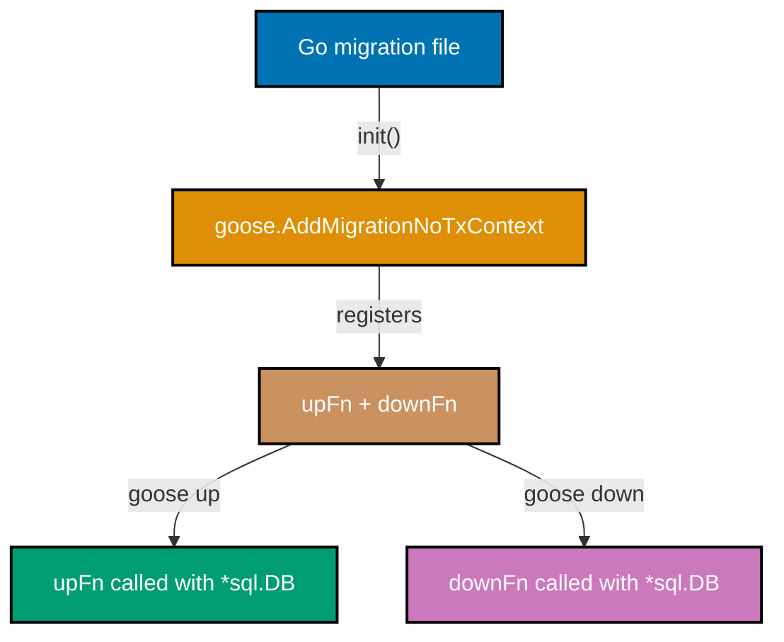
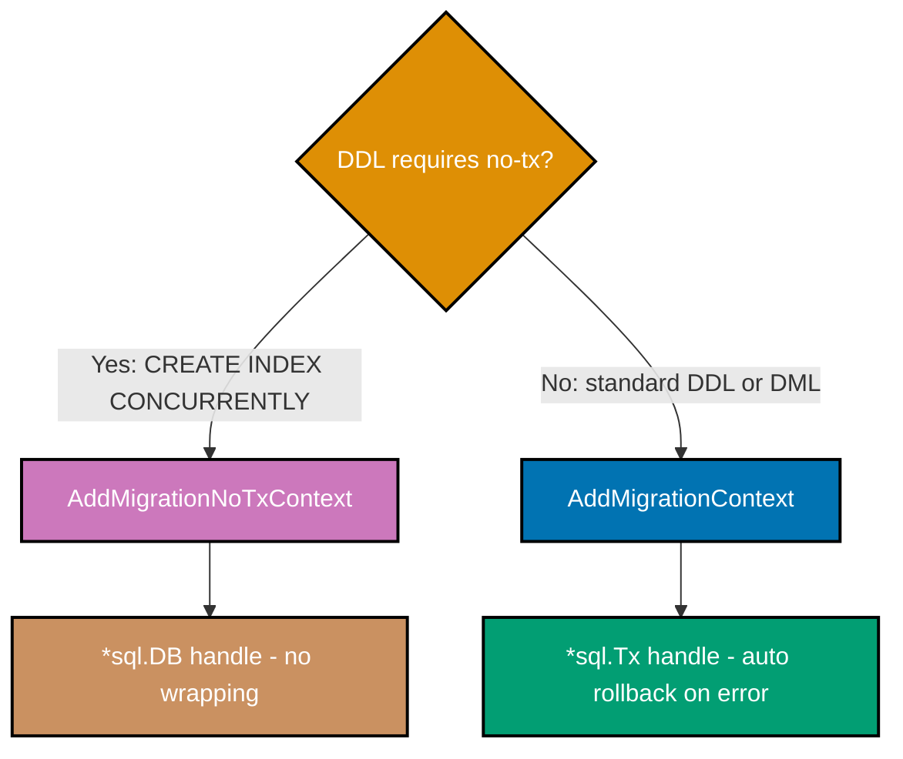
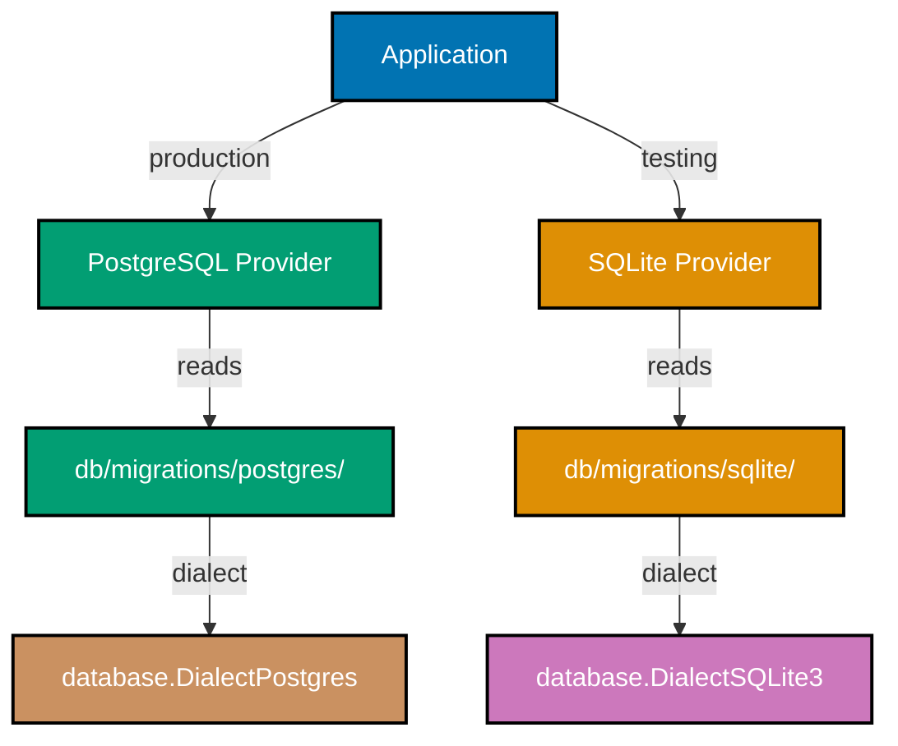

## Intermediate Examples (31-60)

**Coverage**: 40-75% of Goose functionality

**Focus**: Go-based migrations, transaction control, rollback strategies, multi-dialect support, advanced schema patterns, and migration testing.

These examples assume you understand beginner concepts (SQL migration files, CLI usage, `goose.NewProvider`, embedded migrations). All examples are self-contained and demonstrate production-grade patterns.

---

### Example 31: Go-Based Migrations (goose.AddMigrationNoTxContext)

Go-based migrations let you execute arbitrary Go code as part of a schema migration. `goose.AddMigrationNoTxContext` registers a migration function that runs outside a database transaction, giving you full control over connection management. This is the correct choice when your migration calls commands that cannot run inside a transaction (e.g., `CREATE INDEX CONCURRENTLY`).



```go
// File: db/migrations/00020_seed_roles.go
// => Go migration files must be in the same directory as SQL migration files
// => The filename version prefix (00020) determines execution order with SQL files

package migrations
// => Package name must match the directory package for embed.FS embedding

import (
 "context"
 "database/sql"

 "github.com/pressly/goose/v3"
 // => goose/v3 is the module path; always use v3 for current API
)

func init() {
 // => init() runs automatically when the package is imported
 // => Goose uses init() to register migration functions before provider runs
 goose.AddMigrationNoTxContext(upSeedRoles, downSeedRoles)
 // => Registers the Up and Down functions with goose's internal registry
 // => NoTx means goose will NOT wrap these calls in a transaction
}

func upSeedRoles(ctx context.Context, db *sql.DB) error {
 // => Receives the live *sql.DB connection (not a transaction handle)
 // => ctx carries deadline/cancellation from the calling provider
 _, err := db.ExecContext(ctx,
  // => ExecContext is preferred over Exec: it respects ctx cancellation
  `INSERT INTO roles (name) VALUES ('admin'), ('user'), ('viewer')
         ON CONFLICT (name) DO NOTHING`,
  // => ON CONFLICT DO NOTHING makes this idempotent: safe to re-run
 )
 return err
 // => Return nil on success; non-nil error aborts the migration
}

func downSeedRoles(ctx context.Context, db *sql.DB) error {
 // => Down function must reverse exactly what Up did
 _, err := db.ExecContext(ctx, `DELETE FROM roles WHERE name IN ('admin', 'user', 'viewer')`)
 // => Targeted DELETE rather than TRUNCATE to avoid removing user-created roles
 return err
}
```

**Key Takeaway**: Use `goose.AddMigrationNoTxContext` when your migration must run outside a transaction — for DDL commands like `CREATE INDEX CONCURRENTLY` or `VACUUM`, or for seed data operations that need explicit connection control.

**Why It Matters**: Not all database operations can run inside a transaction. PostgreSQL's `CREATE INDEX CONCURRENTLY` explicitly forbids transactional wrapping. Go-based migrations let you bypass Goose's default transaction wrapping for these cases, while still participating fully in the migration version system. The `init()` registration pattern ensures the migration is registered when its package is imported, which happens automatically when your embed.FS includes the directory.

---

### Example 32: Go Migration with Database Queries

Go migrations can query the database before making changes — for example, to check existing data before applying a schema change. This pattern enables conditional migrations that adapt to the current database state.

```go
// File: db/migrations/00021_backfill_user_slugs.go
// => Backfill migration: adds data derived from existing rows
// => This cannot be done in pure SQL without a complex UPDATE + function

package migrations

import (
 "context"
 "database/sql"
 "fmt"
 "strings"

 "github.com/pressly/goose/v3"
)

func init() {
 goose.AddMigrationNoTxContext(upBackfillSlugs, downBackfillSlugs)
 // => Registers this Go migration alongside any SQL migrations in the directory
}

func upBackfillSlugs(ctx context.Context, db *sql.DB) error {
 // => Step 1: query all users who have no slug yet
 rows, err := db.QueryContext(ctx,
  `SELECT id, username FROM users WHERE slug IS NULL OR slug = ''`,
  // => Targets only rows that need backfilling; safe to re-run (idempotent)
 )
 if err != nil {
  return fmt.Errorf("query users: %w", err)
  // => Wrap errors with context; %w enables errors.Is/As unwrapping
 }
 defer rows.Close()
 // => Always close rows to return the connection to the pool

 // => Step 2: generate and apply a slug for each user
 for rows.Next() {
  // => rows.Next() advances the cursor; returns false when exhausted
  var id, username string
  if err := rows.Scan(&id, &username); err != nil {
   // => Scan copies column values into Go variables
   return fmt.Errorf("scan user: %w", err)
  }

  slug := strings.ToLower(strings.ReplaceAll(username, " ", "-"))
  // => Simple slug: lowercase + replace spaces with hyphens
  // => Production code would use a proper slug library with unicode handling

  _, err = db.ExecContext(ctx,
   `UPDATE users SET slug = $1 WHERE id = $2`,
   slug, id,
   // => Parameterized query: $1, $2 prevent SQL injection
  )
  if err != nil {
   return fmt.Errorf("update user %s slug: %w", id, err)
  }
 }
 return rows.Err()
 // => rows.Err() surfaces any error that occurred during iteration
}

func downBackfillSlugs(ctx context.Context, db *sql.DB) error {
 _, err := db.ExecContext(ctx, `UPDATE users SET slug = '' WHERE slug != ''`)
 // => Clears slugs that were set by Up; cannot restore original nulls after overwrite
 return err
}
```

**Key Takeaway**: Go migrations can query the current database state before modifying it, enabling safe backfill operations that skip rows already processed — making the migration idempotent and safe to retry after partial failure.

**Why It Matters**: Pure SQL `UPDATE` statements are atomic but opaque — they cannot easily log progress or skip rows based on complex Go logic. Go migrations give you the full power of the Go standard library for data transformations: string processing, HTTP calls to external services, or complex business logic that maps old data formats to new ones. This is essential for migrations that transform data, not just schema.

---

### Example 33: Go Migration with Data Transformation

Data transformation migrations convert existing column values to a new format. This example converts a string-encoded status field into a normalized integer code, demonstrating a two-step "expand and contract" pattern.

```go
// File: db/migrations/00022_normalize_status_codes.go
// => Phase 2 of expand-and-contract: the new status_code column already exists
// => This Go migration copies data from status (string) to status_code (int)

package migrations

import (
 "context"
 "database/sql"
 "fmt"

 "github.com/pressly/goose/v3"
)

func init() {
 goose.AddMigrationNoTxContext(upNormalizeStatus, downNormalizeStatus)
}

// statusMap maps legacy string codes to normalized integer codes
var statusMap = map[string]int{
 // => Defined at package level: visible to both Up and Down functions
 "ACTIVE":    1,
 "INACTIVE":  2,
 "SUSPENDED": 3,
 "DELETED":   4,
}

func upNormalizeStatus(ctx context.Context, db *sql.DB) error {
 for strStatus, intCode := range statusMap {
  // => Iterate over the mapping; order is non-deterministic in Go maps
  // => This is fine because each UPDATE targets distinct rows
  result, err := db.ExecContext(ctx,
   `UPDATE users SET status_code = $1 WHERE status = $2 AND status_code IS NULL`,
   // => AND status_code IS NULL: idempotent guard — skip already-converted rows
   intCode, strStatus,
  )
  if err != nil {
   return fmt.Errorf("normalize status %s: %w", strStatus, err)
  }

  n, _ := result.RowsAffected()
  // => RowsAffected reports how many rows the UPDATE touched
  _ = n
  // => In production: log n for observability (e.g., slog.Info("normalized", "status", strStatus, "rows", n))
 }
 return nil
}

func downNormalizeStatus(ctx context.Context, db *sql.DB) error {
 // => Reverse: nullify the status_code values set by Up
 for _, intCode := range statusMap {
  _, err := db.ExecContext(ctx,
   `UPDATE users SET status_code = NULL WHERE status_code = $1`,
   // => Nullify the integer code; status string column remains unchanged
   intCode,
  )
  if err != nil {
   return fmt.Errorf("denormalize status %d: %w", intCode, err)
  }
 }
 return nil
}
```

**Key Takeaway**: Use Go migrations for data transformations that require application-level logic — map lookups, string parsing, or conditional branching that is awkward to express in SQL CASE expressions.

**Why It Matters**: The expand-and-contract pattern (add new column → backfill data → switch application → drop old column) is the standard zero-downtime approach for changing column types or formats in production. Go migrations handle the backfill phase cleanly, with explicit error context and per-row idempotency guards. Splitting this across multiple versioned migrations ensures each phase can be deployed and rolled back independently.

---

### Example 34: Transaction Control in SQL Migrations (+goose NO TRANSACTION)

By default, Goose wraps each SQL migration in a transaction. The `-- +goose NO TRANSACTION` directive disables this for a specific migration, which is required for DDL statements that PostgreSQL forbids inside transactions.

```sql
-- File: db/migrations/00023_concurrent_index.sql

-- +goose NO TRANSACTION
-- => Instructs Goose to NOT wrap this file in a BEGIN/COMMIT block
-- => Required because CREATE INDEX CONCURRENTLY cannot run inside a transaction
-- => Without this directive, you would get:
-- => ERROR: CREATE INDEX CONCURRENTLY cannot run inside a transaction block

-- +goose Up
CREATE INDEX CONCURRENTLY IF NOT EXISTS idx_expenses_category_date
    ON expenses (category, date DESC);
-- => CONCURRENTLY: builds index without locking the table against writes
-- => Table remains fully readable and writable during index creation
-- => Trade-off: takes longer to build than standard CREATE INDEX
-- => IF NOT EXISTS: makes this idempotent — safe to re-run after partial failure
-- => Composite index on (category, date DESC): optimizes queries like:
-- =>   SELECT * FROM expenses WHERE category = 'food' ORDER BY date DESC

-- +goose Down
DROP INDEX CONCURRENTLY IF EXISTS idx_expenses_category_date;
-- => CONCURRENTLY on DROP also avoids write locks during index removal
-- => IF EXISTS prevents error if the index was never fully created
```

**Key Takeaway**: Add `-- +goose NO TRANSACTION` to any migration that contains statements forbidden inside transactions — `CREATE INDEX CONCURRENTLY`, `VACUUM`, `REINDEX CONCURRENTLY`, or `ALTER TYPE` with existing column usage in PostgreSQL.

**Why It Matters**: `CREATE INDEX CONCURRENTLY` is the recommended approach for adding indexes to large production tables because it does not take an `ACCESS EXCLUSIVE` lock that blocks all reads and writes. The standard `CREATE INDEX` locks the table for the entire build duration, causing query timeouts during deployment. The `-- +goose NO TRANSACTION` directive is a small annotation with a large operational impact — it is the difference between a zero-downtime deployment and a production incident.

---

### Example 35: Explicit Transaction Wrapping in Go Migrations

Go migrations using `goose.AddMigrationContext` (with transaction) receive a `*sql.Tx` instead of `*sql.DB`. This allows Goose to roll back all changes atomically if the migration function returns an error.



```go
// File: db/migrations/00024_create_audit_log.go
// => Uses AddMigrationContext (with transaction) for atomic DDL + seed data

package migrations

import (
 "context"
 "database/sql"

 "github.com/pressly/goose/v3"
)

func init() {
 goose.AddMigrationContext(upAuditLog, downAuditLog)
 // => AddMigrationContext (no "NoTx"): Goose wraps calls in a transaction
 // => If upAuditLog returns an error, the entire transaction rolls back
 // => Both CREATE TABLE and INSERT below are atomic
}

func upAuditLog(ctx context.Context, tx *sql.Tx) error {
 // => tx is *sql.Tx, not *sql.DB — all queries participate in Goose's transaction
 _, err := tx.ExecContext(ctx, `
  CREATE TABLE audit_log (
   id         BIGSERIAL    NOT NULL PRIMARY KEY,
   table_name VARCHAR(100) NOT NULL,
   action     VARCHAR(10)  NOT NULL,
   row_id     UUID,
   changed_by VARCHAR(255) NOT NULL DEFAULT 'system',
   changed_at TIMESTAMPTZ  NOT NULL DEFAULT NOW()
  )`)
 // => BIGSERIAL for high-write tables (audit logs grow fast; UUID overhead adds up)
 if err != nil {
  return err
  // => Return error: Goose rolls back the CREATE TABLE automatically
 }

 _, err = tx.ExecContext(ctx,
  `INSERT INTO audit_log (table_name, action, changed_by)
         VALUES ('audit_log', 'CREATE', 'migration')`,
  // => Self-referential seed: records that this table was created by migration
  // => Atomic with the CREATE TABLE: both succeed or both roll back
 )
 return err
}

func downAuditLog(ctx context.Context, tx *sql.Tx) error {
 _, err := tx.ExecContext(ctx, `DROP TABLE IF EXISTS audit_log`)
 // => Single statement; transaction ensures it's either fully done or not at all
 return err
}
```

**Key Takeaway**: Use `goose.AddMigrationContext` (transactional) for Go migrations that combine DDL and DML — if any step fails, all changes within the migration roll back atomically, leaving the database in its pre-migration state.

**Why It Matters**: Transactional migrations are safer than non-transactional ones because partial failure leaves no trace. Without a transaction, a migration that creates a table and then fails to insert seed data would leave an empty table in the database — now re-running the migration fails because the table already exists. With `AddMigrationContext`, the entire migration is either committed or rolled back, so Goose can safely retry it.

---

### Example 36: Rollback Strategies for Complex Migrations

Complex migrations that drop columns, rename tables, or change data formats are not safely reversible through simple `DROP COLUMN` / `RENAME` in the Down block. The safe strategy keeps the old column and uses an explicit data-restore approach.

```sql
-- File: db/migrations/00025_rename_amount_to_total.sql
-- => Demonstrates "safe rename" using ADD COLUMN + backfill + DROP (3 migrations)
-- => This file is Phase 1 of 3: add the new column alongside the old one

-- +goose Up
ALTER TABLE expenses
    ADD COLUMN total DECIMAL(19,4);
-- => Adds "total" column as nullable (no DEFAULT, no NOT NULL yet)
-- => Existing rows get NULL for total — application must tolerate this during migration
-- => Phase 2 migration will backfill total = amount for all rows
-- => Phase 3 migration will add NOT NULL constraint and drop amount

-- +goose Down
ALTER TABLE expenses
    DROP COLUMN IF EXISTS total;
-- => Safe rollback: only removes the column we added in this migration
-- => amount column is untouched — no data loss possible
-- => IF EXISTS handles the case where Up partially failed before creating total
```

```sql
-- File: db/migrations/00026_backfill_total_from_amount.sql
-- => Phase 2 of 3: copy data from old column to new column

-- +goose Up
UPDATE expenses
    SET total = amount
    WHERE total IS NULL;
-- => Backfill: copy all existing amount values into total
-- => WHERE total IS NULL: idempotent — safe to re-run (won't overwrite manual data)
-- => After this migration: all rows have both amount and total set to same value

-- +goose Down
UPDATE expenses
    SET total = NULL
    WHERE total IS NOT NULL;
-- => Clears the backfill; restores total to NULL for all rows
-- => amount column still holds all original data — no data loss
```

**Key Takeaway**: Split destructive renames into three migrations: (1) add new column, (2) backfill data, (3) add constraint and drop old column — each phase is independently deployable and fully reversible.

**Why It Matters**: A single-migration rename (`ALTER TABLE RENAME COLUMN amount TO total`) is irreversible if something goes wrong: the Down block adds a new `amount` column but cannot restore the deleted data. The three-migration pattern keeps both columns live simultaneously, allowing the application to be deployed against the new schema while old replicas still reference the old column name. This is the standard zero-downtime rename strategy for production databases.

---

### Example 37: Version Pinning (goose up-to VERSION)

The `goose up-to` command applies migrations only up to a specific version number. This is essential for staged rollouts where you want to apply some migrations but hold others back until a dependent service upgrade completes.

```bash
# Scenario: migrations 1-10 are safe to apply, but 11+ require a new application binary
# Current DB version: 9
# Available migrations: 10, 11, 12, 13

# Apply only migration 10, stop before 11
goose -dir ./db/migrations postgres \
  "host=localhost user=postgres dbname=myapp sslmode=disable" up-to 10
# => Output: OK   00010_add_payment_method.sql (8.44ms)
# => Applies version 10 only; versions 11, 12, 13 remain pending
# => DB is now at version 10

# Check current state
goose -dir ./db/migrations postgres \
  "host=localhost user=postgres dbname=myapp sslmode=disable" version
# => goose: version 10
# => Confirms the exact version; useful in deployment scripts as a post-check

# Later: after deploying new application binary, apply remaining migrations
goose -dir ./db/migrations postgres \
  "host=localhost user=postgres dbname=myapp sslmode=disable" up
# => Output:
# =>   OK   00011_add_subscriptions.sql (15.23ms)
# =>   OK   00012_add_invoices.sql (12.88ms)
# =>   OK   00013_add_payments.sql (11.01ms)
# => Applies all remaining pending migrations
```

**Key Takeaway**: Use `goose up-to VERSION` in CI/CD pipelines when migrations must be applied in lockstep with specific application binary versions — deploy schema changes that the current binary can tolerate, then deploy the new binary, then apply the remaining schema changes.

**Why It Matters**: The "migration first, then code" deployment order works for additive changes (new columns with defaults, new tables). But column renames or type changes break the running application until the new code is deployed. `up-to` lets you sequence migrations and code deployments independently: migrate to the additive-safe point, deploy new code, then migrate further. This precision is critical in Kubernetes rolling deployments where old and new pods run simultaneously.

---

### Example 38: Migration Down-to Specific Version

`goose down-to` rolls back all migrations down to (but not below) a specified version. This is the clean way to revert a set of related migrations applied together.

```bash
# Current DB version: 15
# Scenario: migrations 13, 14, 15 introduced a buggy feature; need to roll back all three

# Verify current state before rollback
goose -dir ./db/migrations postgres \
  "host=localhost user=postgres dbname=myapp sslmode=disable" status
# => Output (excerpt):
# =>   Applied At                  Migration
# =>   =======================================
# =>   2026-03-27 10:00:01 UTC -- 00013_add_payments.sql
# =>   2026-03-27 10:00:02 UTC -- 00014_add_payment_indexes.sql
# =>   2026-03-27 10:00:03 UTC -- 00015_add_payment_webhooks.sql

# Roll back to version 12 (removes 15, 14, 13 in reverse order)
goose -dir ./db/migrations postgres \
  "host=localhost user=postgres dbname=myapp sslmode=disable" down-to 12
# => Output:
# =>   OK   00015_add_payment_webhooks.sql (rollback, 9.11ms)
# =>   OK   00014_add_payment_indexes.sql (rollback, 4.22ms)
# =>   OK   00013_add_payments.sql (rollback, 18.33ms)
# => Executes Down block for 15, 14, 13 in descending order
# => Version 12 is the new current version; version 12 itself was NOT rolled back

# Confirm rollback succeeded
goose -dir ./db/migrations postgres \
  "host=localhost user=postgres dbname=myapp sslmode=disable" version
# => goose: version 12
```

**Key Takeaway**: `goose down-to VERSION` is the canonical way to revert a feature branch's migrations in one command — it reverses all migrations above the target version in the correct descending order, without requiring manual tracking of how many `goose down` calls to make.

**Why It Matters**: Running `goose down` three times manually for a three-migration rollback is error-prone — you might stop one step too early or too late, leaving the schema in an unexpected state. `down-to` expresses intent declaratively: "the database should be at version 12." This is especially important in automated rollback scripts where a deployment pipeline must restore a known-good database state after detecting a failed health check.

---

### Example 39: Goose Provider with Custom Options

`goose.NewProvider` accepts functional options that control its behaviour: dialect selection, versioning table name, verbose logging, and migration exclusion. These options are set at construction time and apply to all operations the provider performs.

```go
// File: internal/database/migrate.go
// => Provider construction with custom options for production use

package database

import (
 "database/sql"
 "embed"
 "fmt"

 "github.com/pressly/goose/v3"
 "github.com/pressly/goose/v3/database"
)

func NewMigrationProvider(db *sql.DB, migrationsFS embed.FS) (*goose.Provider, error) {
 // => embed.FS is passed in; provider holds a reference but doesn't own the FS
 provider, err := goose.NewProvider(
  database.DialectPostgres,
  // => Tells Goose to use PostgreSQL dialect for version table DDL
  // => Other dialects: DialectSQLite3, DialectMySQL, DialectTurso
  db,
  // => The *sql.DB to run migrations against
  migrationsFS,
  // => The embed.FS containing migration files
  goose.WithTableName("schema_migrations"),
  // => Overrides default "goose_db_version" table name
  // => Use this when multiple migration tools share the same database
  goose.WithVerbose(true),
  // => Prints each migration name and duration to stdout
  // => Useful in CI logs; disable in tests to reduce noise
  goose.WithAllowMissing(),
  // => Allows migrations with versions lower than the current DB version
  // => Required in teams where developers add migrations on separate branches
  // => Without this, Goose errors if it finds an unapplied migration below current version
 )
 if err != nil {
  return nil, fmt.Errorf("create migration provider: %w", err)
  // => Wrap with context; caller can inspect with errors.Is/As
 }
 return provider, nil
}
```

**Key Takeaway**: Set `goose.WithAllowMissing()` in team environments where multiple developers create migrations on separate branches — without it, Goose rejects migrations that have a version lower than the current highest applied version, causing merge-order failures.

**Why It Matters**: In a team of five developers, two developers may each create a new migration on their branches. Developer A's migration gets version 10 and Developer B's gets version 11. If Developer B merges first and applies version 11 to staging, Developer A's version 10 migration would normally be rejected by Goose because the DB is already at 11. `WithAllowMissing` disables this check, allowing the "out-of-order" migration to be applied. This is a team workflow option — not recommended for solo projects where sequential ordering is always maintained.

---

### Example 40: Multi-Dialect Support (PostgreSQL + SQLite)

Goose supports multiple SQL dialects from the same codebase. You can create two migration directories — one for each dialect — or use a single directory with dialect-aware SQL. This example shows the two-directory approach for clean separation.



```go
// File: internal/database/provider.go
// => Factory function that returns the correct provider based on dialect

package database

import (
 "database/sql"
 "embed"
 "fmt"

 "github.com/pressly/goose/v3"
 "github.com/pressly/goose/v3/database"
)

//go:embed migrations/postgres
var postgresMigrations embed.FS
// => Embeds only the postgres subdirectory; SQLite migrations are separate

//go:embed migrations/sqlite
var sqliteMigrations embed.FS
// => Embeds the sqlite subdirectory; different syntax from postgres where needed

// Dialect is a typed constant to prevent passing arbitrary strings as dialect
type Dialect string

const (
 DialectPostgres Dialect = "postgres"
 // => Typed constant: prevents passing arbitrary strings as dialect
 DialectSQLite Dialect = "sqlite"
)

func NewDialectProvider(db *sql.DB, dialect Dialect) (*goose.Provider, error) {
 switch dialect {
 case DialectPostgres:
  return goose.NewProvider(database.DialectPostgres, db, postgresMigrations)
  // => Uses postgres embed.FS and PostgreSQL-specific dialect handling
 case DialectSQLite:
  return goose.NewProvider(database.DialectSQLite3, db, sqliteMigrations)
  // => Uses sqlite embed.FS and SQLite3 dialect; different SQL where types differ
 default:
  return nil, fmt.Errorf("unsupported dialect: %s", dialect)
  // => Explicit error for unknown dialects; prevents silent misconfiguration
 }
}
```

**Key Takeaway**: Maintain separate migration directories per dialect and use a factory function to select the correct provider — this keeps dialect-specific SQL isolated and prevents accidental cross-dialect contamination.

**Why It Matters**: SQLite and PostgreSQL differ significantly: SQLite has no `SERIAL`, uses `INTEGER PRIMARY KEY` for auto-increment, lacks `TIMESTAMPTZ`, and cannot `ADD CONSTRAINT` after table creation. Sharing a single migration directory between dialects forces you to write to the lowest common denominator or use complex conditionals. Separate directories allow each dialect's migrations to be idiomatic and tested independently.

---

### Example 41: Dialect-Specific SQL in Migrations

When using a single migration directory, a Go migration can dispatch dialect-specific SQL at runtime. This approach keeps the migration directory unified while supporting multiple databases.

```go
// File: db/migrations/00030_create_events.go
// => Go migration that executes dialect-specific DDL

package migrations

import (
 "context"
 "database/sql"
 "fmt"

 "github.com/pressly/goose/v3"
)

func init() {
 goose.AddMigrationNoTxContext(upCreateEvents, downCreateEvents)
}

// dialectSQL maps dialect names to their CREATE TABLE variants
var dialectSQL = map[string]string{
 // => PostgreSQL uses TIMESTAMPTZ for timezone-aware timestamps
 "postgres": `
        CREATE TABLE events (
            id          UUID         NOT NULL PRIMARY KEY DEFAULT gen_random_uuid(),
            type        VARCHAR(100) NOT NULL,
            payload     JSONB,
            occurred_at TIMESTAMPTZ  NOT NULL DEFAULT NOW()
        )`,
 // => SQLite uses TEXT for dates; no UUID type, no JSONB
 "sqlite3": `
        CREATE TABLE events (
            id          TEXT NOT NULL PRIMARY KEY,
            type        TEXT NOT NULL,
            payload     TEXT,
            occurred_at TEXT NOT NULL DEFAULT (datetime('now'))
        )`,
}

func upCreateEvents(ctx context.Context, db *sql.DB) error {
 dialect, err := detectDialect(ctx, db)
 // => detectDialect queries the database to identify its type
 if err != nil {
  return fmt.Errorf("detect dialect: %w", err)
 }

 sqlStmt, ok := dialectSQL[dialect]
 if !ok {
  return fmt.Errorf("no SQL for dialect %q", dialect)
  // => Explicit error: surfaces misconfiguration immediately
 }

 _, err = db.ExecContext(ctx, sqlStmt)
 return err
}

func downCreateEvents(ctx context.Context, db *sql.DB) error {
 _, err := db.ExecContext(ctx, `DROP TABLE IF EXISTS events`)
 // => DROP TABLE syntax is identical across PostgreSQL and SQLite
 return err
}

func detectDialect(ctx context.Context, db *sql.DB) (string, error) {
 // => Query version() to distinguish PostgreSQL from SQLite
 var version string
 err := db.QueryRowContext(ctx, `SELECT version()`).Scan(&version)
 // => PostgreSQL returns "PostgreSQL 15.x ..."; SQLite returns "3.x.x"
 if err != nil {
  return "", err
 }
 if len(version) > 10 && version[:10] == "PostgreSQL" {
  return "postgres", nil
  // => Confirmed PostgreSQL: use postgres DDL
 }
 return "sqlite3", nil
 // => Fallback: assume SQLite for non-PostgreSQL databases
}
```

**Key Takeaway**: Use a Go migration with a dialect map when a single migration directory must support multiple databases — the Go function dispatches to the correct SQL at runtime, keeping the migration directory unified.

**Why It Matters**: Projects that use PostgreSQL in production but SQLite in local development or testing face a recurring challenge: keeping two SQL dialects synchronized. A single Go migration function acting as a dialect dispatcher ensures both dialects evolve together, reducing the risk of tests passing locally against SQLite while failing in production against PostgreSQL due to schema divergence.

---

### Example 42: Migration Locking for Concurrent Safety

When multiple application instances start simultaneously (e.g., a Kubernetes deployment with 10 replicas), each instance might try to run migrations at startup. Goose's provider uses advisory locks to ensure only one instance runs migrations at a time.

```go
// File: internal/database/startup.go
// => Safe migration execution at application startup

package database

import (
 "context"
 "fmt"
 "log/slog"
 "time"

 "github.com/pressly/goose/v3"
)

func RunMigrationsAtStartup(ctx context.Context, provider *goose.Provider) error {
 // => Called by main() before starting the HTTP server
 // => Multiple instances may call this simultaneously during rolling deploy

 ctx, cancel := context.WithTimeout(ctx, 2*time.Minute)
 // => Timeout prevents startup from hanging indefinitely if DB is unavailable
 defer cancel()

 results, err := provider.Up(ctx)
 // => provider.Up() acquires a PostgreSQL advisory lock before running migrations
 // => Second instance to call Up() waits until first instance releases the lock
 // => After first instance completes, second instance finds no pending migrations
 if err != nil {
  return fmt.Errorf("run migrations: %w", err)
 }

 for _, r := range results {
  // => results contains one entry per migration that was applied in this call
  if r.Error != nil {
   return fmt.Errorf("migration %s failed: %w", r.Source.Path, r.Error)
  }
  slog.Info("migration applied",
   // => slog structured logging: queryable in log aggregation systems
   "migration", r.Source.Path,
   "duration", r.Duration,
   // => Duration is a time.Duration; slog formats it as e.g. "14.5ms"
  )
 }

 if len(results) == 0 {
  slog.Info("no pending migrations")
  // => Normal case for most startup calls after initial deployment
 }

 return nil
}
```

**Key Takeaway**: `provider.Up()` uses PostgreSQL advisory locks internally — multiple instances calling it simultaneously will serialize correctly, with the first instance applying migrations and subsequent instances finding nothing to do.

**Why It Matters**: Without advisory locking, two instances starting at the same moment could both detect the same pending migration and both attempt to run it simultaneously. The second instance would fail with a "table already exists" error and crash. PostgreSQL advisory locks (`pg_try_advisory_lock`) are the standard solution: they are fast, automatically released on connection drop, and require no external coordination service like Redis or ZooKeeper.

---

### Example 43: Creating Partial Indexes

A partial index indexes only the rows that match a WHERE condition. This dramatically reduces index size and maintenance overhead for tables with many rows in "inactive" states.

```sql
-- File: db/migrations/00031_partial_indexes_expenses.sql

-- +goose Up
CREATE INDEX idx_expenses_active_user
    ON expenses (user_id, date DESC)
    WHERE deleted_at IS NULL;
-- => Partial index: only indexes rows where deleted_at IS NULL (non-deleted expenses)
-- => If 80% of expenses are soft-deleted, this index is 5x smaller than a full index
-- => Optimizes: SELECT * FROM expenses WHERE user_id = $1 AND deleted_at IS NULL ORDER BY date DESC
-- => Query must include WHERE deleted_at IS NULL for PostgreSQL to use this partial index
-- => The predicate in the query must match the predicate in the index definition

CREATE INDEX idx_expenses_pending_category
    ON expenses (category)
    WHERE type = 'PENDING';
-- => Another partial index: only PENDING expenses (a minority of all rows)
-- => Accelerates: SELECT * FROM expenses WHERE category = 'food' AND type = 'PENDING'
-- => PostgreSQL query planner uses this when the WHERE clause matches the index predicate

-- +goose Down
DROP INDEX IF EXISTS idx_expenses_pending_category;
-- => Drop in reverse creation order (last created, first dropped)
DROP INDEX IF EXISTS idx_expenses_active_user;
-- => IF EXISTS guards prevent errors if Up migration partially failed
```

**Key Takeaway**: Use partial indexes when a WHERE clause in frequent queries filters to a predictable subset of rows — the index stays small and fast because it only covers the relevant data.

**Why It Matters**: A full index on a 100-million-row expenses table with 80% soft-deleted rows stores 100 million index entries. A partial index on `WHERE deleted_at IS NULL` stores only 20 million entries — 5x smaller, faster to build, faster to update on INSERT, and more likely to fit in PostgreSQL's shared buffer cache. Partial indexes are one of the highest-return performance optimizations available for tables with soft-delete patterns or status columns with skewed value distributions.

---

### Example 44: Full-Text Search Indexes (PostgreSQL)

PostgreSQL's full-text search uses `tsvector` and `tsquery` types with GIN indexes for efficient document search. A migration that adds a generated `tsvector` column with a GIN index enables full-text search without application-level indexing infrastructure.

```sql
-- File: db/migrations/00032_add_fulltext_search.sql

-- +goose NO TRANSACTION
-- => GIN index creation with CONCURRENTLY requires no transaction block

-- +goose Up
ALTER TABLE expenses
    ADD COLUMN search_vector tsvector
    GENERATED ALWAYS AS (
        to_tsvector('english', coalesce(description, '') || ' ' || coalesce(category, ''))
        -- => Concatenates description and category into a searchable tsvector
        -- => 'english' configures stemming (running -> run, searches -> search)
        -- => coalesce handles NULL values: NULL || ' text' would produce NULL without it
    ) STORED;
-- => GENERATED ALWAYS AS ... STORED: PostgreSQL computes and stores the value on INSERT/UPDATE
-- => The column is automatically kept in sync with description and category
-- => STORED is required for GIN indexes on generated columns (cannot index virtual columns)

CREATE INDEX CONCURRENTLY idx_expenses_search
    ON expenses USING GIN (search_vector);
-- => GIN (Generalized Inverted Index) is required for tsvector columns
-- => GIN indexes the individual lexemes (word stems) inside the tsvector
-- => CONCURRENTLY: non-blocking index creation on the live table

-- +goose Down
DROP INDEX CONCURRENTLY IF EXISTS idx_expenses_search;
-- => Drop index first before removing the column it indexes
ALTER TABLE expenses DROP COLUMN IF EXISTS search_vector;
-- => Removes generated column and its storage
```

**Key Takeaway**: Add a `GENERATED ALWAYS AS ... STORED` tsvector column to combine full-text indexing with automatic synchronization — the database maintains the search index as rows change, eliminating the need for external search indexing pipelines for moderate-scale search use cases.

**Why It Matters**: For applications with up to a few million documents, PostgreSQL's built-in full-text search avoids the operational complexity of Elasticsearch or Typesense. The generated column approach is superior to application-level indexing because it's transactional — a row's search vector is always consistent with its data columns, even after direct SQL updates. The GIN index makes `WHERE search_vector @@ to_tsquery('english', 'expense & food')` fast even on large tables.

---

### Example 45: Creating Views

A database view is a named SQL query stored in the database. Views simplify complex queries, enforce consistent aggregation logic, and can provide row-level security through filtering.

```sql
-- File: db/migrations/00033_create_expense_summary_view.sql

-- +goose Up
CREATE VIEW expense_summary AS
    SELECT
        user_id,
        -- => Group by user_id: one row per user in the result
        category,
        -- => Include category: gives per-user per-category breakdown
        DATE_TRUNC('month', date) AS month,
        -- => DATE_TRUNC rounds date down to the first of the month
        -- => Enables: GROUP BY user_id, category, month for monthly reports
        SUM(amount)   AS total_amount,
        -- => Aggregate: total spend per user per category per month
        COUNT(*)      AS transaction_count,
        -- => Count of individual transactions in this grouping
        AVG(amount)   AS average_amount
        -- => Average transaction size; useful for anomaly detection
    FROM expenses
    WHERE deleted_at IS NULL
    -- => Exclude soft-deleted rows from the view
    GROUP BY user_id, category, DATE_TRUNC('month', date);
-- => View stores the SELECT definition, not the result; runs fresh on every query

COMMENT ON VIEW expense_summary IS
    'Aggregated expense totals by user, category, and month. Excludes soft-deleted rows.';
-- => View comments appear in pg_description; visible in psql \d+ and pgAdmin

-- +goose Down
DROP VIEW IF EXISTS expense_summary;
-- => Drops the view definition; underlying expenses table is unaffected
```

**Key Takeaway**: Use views to encode frequently-used aggregation logic in the database — application code queries the view instead of duplicating the GROUP BY and WHERE logic across multiple endpoints.

**Why It Matters**: Views provide a stable query interface that can be updated independently of application code. If the underlying expenses table gains a new column or the aggregation logic needs adjustment, updating the view definition requires only a migration — not changes to every API endpoint that performs the same aggregation. Views also enable permission grants: you can grant `SELECT` on `expense_summary` to a read-only reporting user without exposing raw expense rows.

---

### Example 46: Creating Materialized Views

A materialized view stores the query result physically on disk, unlike a regular view which re-executes the query each time. This is appropriate for expensive aggregation queries that do not need real-time data.

```sql
-- File: db/migrations/00034_create_materialized_monthly_report.sql

-- +goose NO TRANSACTION
-- => CREATE INDEX CONCURRENTLY on materialized view requires no transaction

-- +goose Up
CREATE MATERIALIZED VIEW monthly_expense_report AS
    SELECT
        user_id,
        DATE_TRUNC('month', date) AS report_month,
        -- => Truncates to month; all dates in March 2026 become 2026-03-01
        SUM(amount)   AS total_amount,
        COUNT(*)      AS transaction_count,
        MIN(date)     AS earliest_date,
        MAX(date)     AS latest_date
        -- => MIN/MAX capture the actual date range within the month
    FROM expenses
    WHERE deleted_at IS NULL
    GROUP BY user_id, DATE_TRUNC('month', date)
    WITH DATA;
-- => WITH DATA: populates the materialized view immediately on creation
-- => WITHOUT DATA would create an empty view that must be refreshed manually

CREATE INDEX CONCURRENTLY idx_monthly_report_user_month
    ON monthly_expense_report (user_id, report_month DESC);
-- => Index on the materialized view: queries against it benefit from the index
-- => CONCURRENTLY: builds index without locking the materialized view

-- +goose Down
DROP MATERIALIZED VIEW IF EXISTS monthly_expense_report;
-- => Drops both the stored data and the index (index is attached to the view)
```

**Key Takeaway**: Use materialized views for expensive aggregation queries that tolerate stale data — refresh them on a schedule (`REFRESH MATERIALIZED VIEW CONCURRENTLY monthly_expense_report`) rather than re-computing on every request.

**Why It Matters**: A monthly expense summary over 10 million rows might take 2-3 seconds per query. With a materialized view, the result is pre-computed and stored — the same query takes milliseconds. The trade-off is staleness: the view shows data as of the last `REFRESH`. For monthly reports, this is acceptable. `REFRESH MATERIALIZED VIEW CONCURRENTLY` updates the view without locking reads, making it safe to run in production during business hours.

---

### Example 47: Trigger Functions

A trigger function executes automatically in response to INSERT, UPDATE, or DELETE operations. The canonical use case in migrations is maintaining an `updated_at` timestamp automatically.

```sql
-- File: db/migrations/00035_add_updated_at_trigger.sql

-- +goose Up
-- +goose StatementBegin
-- => StatementBegin/StatementEnd wraps multi-statement blocks
-- => Required for CREATE OR REPLACE FUNCTION because the function body contains semicolons
-- => Goose uses these directives to parse the migration as a single statement
CREATE OR REPLACE FUNCTION set_updated_at()
    RETURNS TRIGGER
    LANGUAGE plpgsql
    -- => plpgsql: PostgreSQL's procedural language; similar to PL/SQL
AS $$
BEGIN
    NEW.updated_at = NOW();
    -- => NEW is the row being inserted/updated; modify it before it's written
    -- => NOW() returns the transaction timestamp: consistent within a transaction
    RETURN NEW;
    -- => RETURN NEW is required for BEFORE triggers; the returned row is what gets stored
END;
$$;
-- +goose StatementEnd

CREATE TRIGGER trg_expenses_updated_at
    BEFORE UPDATE ON expenses
    -- => BEFORE UPDATE: fires before the row is written; NEW reflects the final stored value
    FOR EACH ROW
    -- => FOR EACH ROW: fires once per modified row (vs. FOR EACH STATEMENT: once per query)
    EXECUTE FUNCTION set_updated_at();
-- => Attaches the trigger function to the expenses table for UPDATE operations

-- +goose Down
DROP TRIGGER IF EXISTS trg_expenses_updated_at ON expenses;
-- => Removes the trigger; expenses table and set_updated_at function remain
DROP FUNCTION IF EXISTS set_updated_at();
-- => Remove the function only after removing all triggers that use it
```

**Key Takeaway**: Use `-- +goose StatementBegin` / `-- +goose StatementEnd` to wrap any SQL that contains a block body (PL/pgSQL functions, DO blocks, procedure definitions) — without these directives, Goose's semicolon-based statement splitter breaks the function body.

**Why It Matters**: Maintaining `updated_at` in application code is fragile — any direct database update (data migrations, admin scripts) bypasses the application and leaves `updated_at` stale. A database trigger enforces the invariant at the storage level: every UPDATE to expenses, regardless of source, correctly updates `updated_at`. This is especially valuable for audit logs, cache invalidation signals, and change data capture (CDC) pipelines that rely on `updated_at` for incremental syncs.

---

### Example 48: Stored Procedures in Migrations

Stored procedures encapsulate complex multi-step operations in the database layer. PostgreSQL's `CALL` statement executes procedures. Migrations are the correct place to create and version-control stored procedures.

```sql
-- File: db/migrations/00036_create_archive_procedure.sql

-- +goose Up
-- +goose StatementBegin
CREATE OR REPLACE PROCEDURE archive_old_expenses(cutoff_date DATE)
    LANGUAGE plpgsql
AS $$
DECLARE
    archived_count INTEGER;
    -- => DECLARE block: local variables for this procedure
BEGIN
    INSERT INTO expenses_archive
        SELECT * FROM expenses
        WHERE date < cutoff_date
          AND deleted_at IS NOT NULL;
    -- => Copies soft-deleted expenses older than cutoff_date to the archive table
    -- => expenses_archive must already exist (created in an earlier migration)

    GET DIAGNOSTICS archived_count = ROW_COUNT;
    -- => ROW_COUNT: number of rows affected by the most recent SQL statement
    -- => GET DIAGNOSTICS: plpgsql way to capture result metadata

    DELETE FROM expenses
        WHERE date < cutoff_date
          AND deleted_at IS NOT NULL;
    -- => Removes the archived rows from the main table
    -- => Both INSERT and DELETE are in the same transaction (CALL wraps them)

    RAISE NOTICE 'Archived % expenses older than %', archived_count, cutoff_date;
    -- => RAISE NOTICE: outputs to PostgreSQL log; visible in application logs
    -- => % is plpgsql's string interpolation placeholder
END;
$$;
-- +goose StatementEnd

-- +goose Down
DROP PROCEDURE IF EXISTS archive_old_expenses(DATE);
-- => Must specify parameter type when dropping overloaded procedures
```

**Key Takeaway**: Use `-- +goose StatementBegin` / `-- +goose StatementEnd` for all DDL that contains a block body — CREATE FUNCTION, CREATE PROCEDURE, DO blocks — because these contain semicolons that would otherwise cause Goose's statement parser to split the body incorrectly.

**Why It Matters**: Stored procedures execute entirely within the database server — they avoid network round-trips between the application and database for multi-step operations. An archival procedure that moves 10,000 rows involves one `CALL` from the application instead of 10,000 individual DELETE+INSERT cycles across the network. The procedure is also transactional: if the DELETE fails after the INSERT, the entire operation rolls back, preventing data loss. Migrations are the correct place to create and version-control stored procedures.

---

### Example 49: Conditional Migration Logic

Some migrations need to check the current state before acting — for example, adding a constraint only if it doesn't already exist. PostgreSQL's `DO` blocks enable this procedural logic in SQL migrations.

```sql
-- File: db/migrations/00037_conditional_constraint.sql

-- +goose Up
-- +goose StatementBegin
DO $$
BEGIN
    -- => DO block: anonymous plpgsql function; executes immediately
    -- => Used here to add a constraint conditionally

    IF NOT EXISTS (
        SELECT 1 FROM pg_constraint
        WHERE conname = 'chk_expenses_positive_amount'
          AND conrelid = 'expenses'::regclass
        -- => pg_constraint: system catalog of all constraints
        -- => conrelid matches table OID; ::regclass converts table name to OID
    ) THEN
        ALTER TABLE expenses
            ADD CONSTRAINT chk_expenses_positive_amount
            CHECK (amount > 0);
        -- => Adds CHECK constraint only if it doesn't exist
        -- => Idempotent: safe to run even if constraint was added by a previous migration
    END IF;
END;
$$;
-- +goose StatementEnd

-- +goose Down
ALTER TABLE expenses
    DROP CONSTRAINT IF EXISTS chk_expenses_positive_amount;
-- => Standard conditional drop; IF EXISTS handles the case where Up condition was false
```

**Key Takeaway**: Use `DO $$...$$` blocks with `pg_constraint` or `information_schema` queries to make migrations idempotent when the change depends on current database state — useful when migrations might run across environments that diverged from each other.

**Why It Matters**: In a team environment, the same migration might be applied to multiple databases (development, staging, production) that drifted from each other due to manual schema changes. A conditional migration handles this gracefully: it checks whether the constraint exists before adding it, rather than failing with "constraint already exists." This pattern trades simplicity for resilience — use it when strict sequential migration order cannot be guaranteed.

---

### Example 50: Batch Data Migration Pattern

Large data migrations that update millions of rows in a single `UPDATE` statement can lock the table and cause replication lag. The batch pattern processes rows in smaller chunks, allowing other queries to run between batches.

```go
// File: db/migrations/00038_batch_backfill_currency.go
// => Processes rows in batches of 1000 to avoid long-held locks

package migrations

import (
 "context"
 "database/sql"
 "fmt"
 "log/slog"

 "github.com/pressly/goose/v3"
)

func init() {
 goose.AddMigrationNoTxContext(upBatchBackfillCurrency, downBatchBackfillCurrency)
 // => NoTx: we manage transactions manually per batch (not the whole migration)
}

const batchSize = 1000
// => Process 1000 rows per batch; tune based on row size and lock tolerance

func upBatchBackfillCurrency(ctx context.Context, db *sql.DB) error {
 totalUpdated := 0

 for {
  // => Infinite loop: exits when no more rows need updating
  result, err := db.ExecContext(ctx, `
            UPDATE expenses
            SET currency = 'USD'
            WHERE currency IS NULL
              AND id IN (
                  SELECT id FROM expenses
                  WHERE currency IS NULL
                  ORDER BY created_at
                  LIMIT $1
              )`,
   // => Subquery selects a batch of rows to update
   // => ORDER BY created_at: processes oldest rows first (consistent ordering)
   // => LIMIT $1: caps the batch size
   batchSize,
  )
  if err != nil {
   return fmt.Errorf("batch update: %w", err)
  }

  n, _ := result.RowsAffected()
  // => n = 0 means no more rows to process; loop should exit
  totalUpdated += int(n)

  slog.Info("batch backfill progress",
   "updated", n,
   "total_so_far", totalUpdated,
  )

  if n == 0 {
   break
   // => All rows have been updated; exit the loop
  }
 }

 slog.Info("batch backfill complete", "total_updated", totalUpdated)
 return nil
}

func downBatchBackfillCurrency(ctx context.Context, db *sql.DB) error {
 _, err := db.ExecContext(ctx, `UPDATE expenses SET currency = NULL WHERE currency = 'USD'`)
 // => Single statement for rollback; acceptable since it only nullifies our change
 return err
}
```

**Key Takeaway**: Process large data migrations in batches using a loop with `LIMIT` — each batch acquires and releases its own lock, allowing other queries to run between batches and preventing replication lag on high-traffic tables.

**Why It Matters**: A single `UPDATE expenses SET currency = 'USD' WHERE currency IS NULL` on a 50-million-row table holds a row-level lock on all affected rows for the entire duration — potentially minutes. During that time, any concurrent INSERT or UPDATE that touches those rows must wait. The batch pattern trades migration speed for availability: each small update completes quickly, releases locks, and other transactions can proceed. This is the standard approach for backfill migrations on production tables that receive continuous writes.

---

### Example 51: Migration Testing with testcontainers-go

`testcontainers-go` starts a real PostgreSQL container during tests, allowing your migration suite to run against the actual database engine. This catches migration errors that SQLite in-memory databases would never detect.

```go
// File: internal/database/migrate_test.go
// => Integration test: requires Docker; NOT suitable for unit tests

package database_test

import (
 "context"
 "testing"

 "github.com/testcontainers/testcontainers-go"
 "github.com/testcontainers/testcontainers-go/modules/postgres"
 "github.com/testcontainers/testcontainers-go/wait"
)

func TestMigrationsApplyCleanly(t *testing.T) {
 ctx := context.Background()

 pgContainer, err := postgres.RunContainer(ctx,
  // => RunContainer: starts a postgres container, waits for it to be ready
  testcontainers.WithImage("postgres:16-alpine"),
  // => Pin to specific PostgreSQL version: matches production environment
  postgres.WithDatabase("testdb"),
  postgres.WithUsername("testuser"),
  postgres.WithPassword("testpass"),
  // => Minimal credentials; fine for ephemeral test containers
  testcontainers.WithWaitStrategy(
   wait.ForLog("database system is ready to accept connections").
    WithOccurrence(2),
   // => Wait for the second occurrence: PostgreSQL restarts once after init
   // => Without this wait, the test container may not be ready for connections
  ),
 )
 if err != nil {
  t.Fatalf("start postgres container: %v", err)
  // => Fatalf: logs and immediately stops the test; container cleanup still runs
 }
 defer pgContainer.Terminate(ctx)
 // => defer Terminate: ensures container stops even if test panics

 connStr, err := pgContainer.ConnectionString(ctx, "sslmode=disable")
 // => ConnectionString: returns the host:port connection URL for the container
 if err != nil {
  t.Fatalf("get connection string: %v", err)
 }

 db := openDB(t, connStr)
 // => openDB is a test helper that calls sql.Open and db.PingContext
 provider := newTestProvider(t, db)
 // => newTestProvider wraps goose.NewProvider with test-specific options

 results, err := provider.Up(ctx)
 if err != nil {
  t.Fatalf("apply migrations: %v", err)
 }

 t.Logf("applied %d migrations successfully", len(results))
 // => t.Logf: only visible with -v flag; doesn't fail the test
}
```

**Key Takeaway**: Use `testcontainers-go` with a pinned PostgreSQL version matching production — tests that validate migrations against the real database engine catch PostgreSQL-specific syntax errors, type incompatibilities, and constraint validation failures before deployment.

**Why It Matters**: SQLite-based migration tests pass for PostgreSQL-specific syntax that is valid SQLite but does nothing (e.g., `gen_random_uuid()` works differently, `JSONB` becomes `TEXT`). `testcontainers-go` provides a real PostgreSQL instance with no mocking, so `CONCURRENTLY` index creation, `tsvector` columns, and `pg_constraint` queries all behave exactly as they do in production. The container starts fresh for each test run, guaranteeing a clean state and deterministic results.

---

### Example 52: Migration Validation in Tests

After running migrations, tests should validate the resulting schema: table existence, column types, indexes, and constraints. This prevents "schema drift" where migrations succeed but create different structures than intended.

```go
// File: internal/database/schema_test.go
// => Validates schema shape after migration; runs against testcontainers-go instance

package database_test

import (
 "context"
 "database/sql"
 "testing"
)

func TestExpensesTableSchema(t *testing.T) {
 ctx := context.Background()
 db := startTestDB(t, ctx)
 // => startTestDB: starts a PostgreSQL container and runs all migrations

 t.Run("required columns exist", func(t *testing.T) {
  // => information_schema.columns: portable way to query column metadata
  rows, err := db.QueryContext(ctx, `
            SELECT column_name, data_type, is_nullable
            FROM information_schema.columns
            WHERE table_name = 'expenses'
            ORDER BY ordinal_position`)
  if err != nil {
   t.Fatalf("query columns: %v", err)
  }
  defer rows.Close()

  columns := map[string]struct{ dataType, nullable string }{}
  for rows.Next() {
   var name, dataType, nullable string
   rows.Scan(&name, &dataType, &nullable)
   // => Scan into local variables; build a map for easy assertion
   columns[name] = struct{ dataType, nullable string }{dataType, nullable}
  }

  // => Assert specific columns exist with correct types
  assertColumn(t, columns, "id", "uuid", "NO")
  assertColumn(t, columns, "user_id", "uuid", "NO")
  assertColumn(t, columns, "amount", "numeric", "NO")
  assertColumn(t, columns, "currency", "character varying", "YES")
  // => currency was added as nullable in a later migration; verify it's still nullable
 })

 t.Run("foreign key to users exists", func(t *testing.T) {
  var count int
  db.QueryRowContext(ctx, `
            SELECT COUNT(*) FROM information_schema.table_constraints tc
            JOIN information_schema.key_column_usage kcu
              ON tc.constraint_name = kcu.constraint_name
            WHERE tc.constraint_type = 'FOREIGN KEY'
              AND tc.table_name = 'expenses'
              AND kcu.column_name = 'user_id'`,
  ).Scan(&count)
  // => Queries information_schema to verify FK constraint exists
  if count == 0 {
   t.Error("expenses.user_id foreign key constraint not found")
  }
 })
}

func assertColumn(t *testing.T, cols map[string]struct{ dataType, nullable string }, name, wantType, wantNullable string) {
 t.Helper()
 // => t.Helper(): marks this as a helper; error reports point to the call site
 col, ok := cols[name]
 if !ok {
  t.Errorf("column %q not found in expenses table", name)
  return
 }
 if col.dataType != wantType {
  t.Errorf("column %q: got type %q, want %q", name, col.dataType, wantType)
 }
 if col.nullable != wantNullable {
  t.Errorf("column %q: got nullable %q, want %q", name, col.nullable, wantNullable)
 }
}
```

**Key Takeaway**: Query `information_schema.columns`, `information_schema.table_constraints`, and `pg_indexes` in tests to assert the exact schema shape after migrations — this catches "migration applied but wrong type" bugs that only runtime queries would otherwise surface.

**Why It Matters**: A migration that runs without error can still create the wrong schema — for example, creating `amount` as `INTEGER` instead of `DECIMAL(19,4)`. Schema validation tests make this failure explicit immediately after the migration suite runs, rather than when the application tries to insert a decimal value and receives a truncation error. These tests are the automated guard against schema drift between environments.

---

### Example 53: Foreign Key with ON UPDATE CASCADE

A foreign key with `ON UPDATE CASCADE` automatically updates the child table's foreign key column when the parent row's primary key changes. This is rare with UUID primary keys (which never change) but essential for natural-key relationships.

```sql
-- File: db/migrations/00039_create_categories.sql

-- +goose Up
CREATE TABLE expense_categories (
    code        VARCHAR(50)  NOT NULL PRIMARY KEY,
    -- => Natural primary key: category code (e.g., 'FOOD', 'TRANSPORT')
    -- => VARCHAR primary key: meaningful to humans; no separate id needed
    label       VARCHAR(255) NOT NULL,
    -- => Human-readable label for the category
    parent_code VARCHAR(50)  REFERENCES expense_categories(code)
        ON UPDATE CASCADE
        ON DELETE SET NULL,
    -- => Self-referential FK: supports category hierarchies (e.g., FOOD > FAST_FOOD)
    -- => ON UPDATE CASCADE: if 'FOOD' code changes to 'GROCERY', child rows update automatically
    -- => ON DELETE SET NULL: if a parent category is deleted, children become root categories
    created_at  TIMESTAMPTZ  NOT NULL DEFAULT NOW()
);

ALTER TABLE expenses
    ADD COLUMN category_code VARCHAR(50)
    REFERENCES expense_categories(code)
        ON UPDATE CASCADE
        ON DELETE RESTRICT;
-- => ON UPDATE CASCADE: if a category code is renamed, all expense rows update automatically
-- => ON DELETE RESTRICT: prevents deleting a category that has expenses; requires reassignment first
-- => This is the correct default for business data: do not cascade deletes to financial records

-- +goose Down
ALTER TABLE expenses DROP COLUMN IF EXISTS category_code;
-- => Remove the FK column before dropping the referenced table
DROP TABLE IF EXISTS expense_categories;
-- => Drop the categories table after removing all FK references to it
```

**Key Takeaway**: Use `ON UPDATE CASCADE` when child tables reference natural keys (non-UUID strings) that might be renamed — the database propagates key changes to all referencing rows automatically, eliminating the need for multi-table UPDATE transactions in application code.

**Why It Matters**: Natural primary keys (codes, slugs, usernames) are readable and meaningful, but they change. `ON UPDATE CASCADE` handles key changes atomically at the database level — a single `UPDATE expense_categories SET code = 'GROCERY' WHERE code = 'FOOD'` updates both the parent row and all expense rows that reference it. Without `CASCADE`, this requires a carefully ordered multi-table update in a transaction, with risk of constraint violations if the order is wrong.

---

### Example 54: Composite Primary Keys

A composite primary key uses two or more columns together as the unique identifier for a row. This is appropriate for join tables (many-to-many relationships) and time-series data keyed by (entity_id, timestamp).

```sql
-- File: db/migrations/00040_create_expense_tags.sql

-- +goose Up
CREATE TABLE expense_tags (
    expense_id UUID        NOT NULL REFERENCES expenses(id) ON DELETE CASCADE,
    -- => ON DELETE CASCADE: deleting an expense automatically removes its tags
    -- => This is correct: tags are not meaningful without their expense
    tag        VARCHAR(50) NOT NULL,
    -- => Short string tag: 'travel', 'reimbursable', 'recurring', etc.
    tagged_at  TIMESTAMPTZ NOT NULL DEFAULT NOW(),
    -- => When this tag was applied; useful for tag history queries
    tagged_by  VARCHAR(255) NOT NULL DEFAULT 'user',
    -- => Who applied the tag; supports audit queries

    PRIMARY KEY (expense_id, tag)
    -- => Composite PK: a given expense can have each tag at most once
    -- => Replaces the need for a separate id column on this join table
    -- => INSERT ... ON CONFLICT (expense_id, tag) DO NOTHING for idempotent tagging
);

CREATE INDEX idx_expense_tags_tag
    ON expense_tags (tag);
-- => Index on tag alone: accelerates "find all expenses with tag X" queries
-- => The PK index already covers (expense_id, tag); this covers (tag, expense_id)

-- +goose Down
DROP TABLE IF EXISTS expense_tags;
```

**Key Takeaway**: Use composite primary keys for join tables and many-to-many associations — they enforce uniqueness of the relationship itself and eliminate the need for a surrogate `id` column that adds no semantic value.

**Why It Matters**: A join table with a separate auto-increment `id` column can have multiple rows with the same `(expense_id, tag)` combination, silently allowing duplicate tags. A composite primary key prevents this at the database level, making the constraint explicit and enforced without application-level deduplication logic. The composite key also creates an implicit index on `(expense_id, tag)`, covering the most common query pattern for join tables.

---

### Example 55: Table Partitioning (PostgreSQL)

PostgreSQL's declarative partitioning splits a large table into smaller physical sub-tables based on a column value. Range partitioning by date is the standard approach for time-series data like expenses or audit logs.

```sql
-- File: db/migrations/00041_partition_expenses_by_year.sql
-- => Converts the expenses table to a partitioned table
-- => WARNING: requires migrating existing data; plan for maintenance window in production

-- +goose Up
-- Step 1: Create the new partitioned parent table
CREATE TABLE expenses_partitioned (
    LIKE expenses INCLUDING ALL
    -- => LIKE ... INCLUDING ALL: copies column definitions, constraints, indexes, defaults
    -- => Creates a structurally identical table; data is NOT copied
) PARTITION BY RANGE (date);
-- => PARTITION BY RANGE (date): partitions rows by the date column value
-- => PostgreSQL routes INSERT/SELECT to the correct partition automatically

-- Step 2: Create initial yearly partitions
CREATE TABLE expenses_2024
    PARTITION OF expenses_partitioned
    FOR VALUES FROM ('2024-01-01') TO ('2025-01-01');
-- => Covers all dates where date >= 2024-01-01 AND date < 2025-01-01
-- => Upper bound is exclusive; lower bound is inclusive

CREATE TABLE expenses_2025
    PARTITION OF expenses_partitioned
    FOR VALUES FROM ('2025-01-01') TO ('2026-01-01');

CREATE TABLE expenses_2026
    PARTITION OF expenses_partitioned
    FOR VALUES FROM ('2026-01-01') TO ('2027-01-01');
-- => Create one partition per year; add future partitions before they're needed

-- +goose Down
DROP TABLE IF EXISTS expenses_partitioned CASCADE;
-- => CASCADE drops all partitions (expenses_2024, expenses_2025, expenses_2026)
-- => The original expenses table is unaffected by this Down block
```

**Key Takeaway**: Create partitioned tables with initial partitions and a clear naming convention for future partitions — PostgreSQL routes writes to the correct partition automatically, but you must create new partitions before data in that range arrives.

**Why It Matters**: A single expenses table with 500 million rows has a large index on the `date` column. Queries for "expenses in January 2026" must scan that entire index. With yearly partitioning, PostgreSQL prunes all partitions except `expenses_2026` before executing the query — the index scanned is a fraction of the full size. `DROP TABLE expenses_2024` instantly frees disk space for old partitions, far faster than `DELETE FROM expenses WHERE date < '2025-01-01'` which must update indexes row by row.

---

### Example 56: Adding Generated Columns

A generated column derives its value from an expression over other columns in the same row. PostgreSQL stores the computed value on disk (`STORED`), so queries against the generated column use the stored value without recomputing.

```sql
-- File: db/migrations/00042_add_amount_in_usd.sql

-- +goose Up
ALTER TABLE expenses
    ADD COLUMN amount_usd DECIMAL(19,4)
    GENERATED ALWAYS AS (
        CASE currency
            WHEN 'USD' THEN amount
            -- => No conversion needed: amount is already in USD
            WHEN 'EUR' THEN amount * 1.08
            -- => Approximate conversion; real systems use a rates table
            WHEN 'IDR' THEN amount * 0.000064
            -- => Indonesian Rupiah to USD; approximate exchange rate
            ELSE amount
            -- => Unknown currencies: preserve original amount
        END
    ) STORED;
-- => GENERATED ALWAYS AS: value is computed from the expression, not from INSERT/UPDATE
-- => STORED: value is physically stored on disk; indexes can be built on it
-- => PostgreSQL recomputes and updates this column automatically when amount or currency changes
-- => Queries can use amount_usd directly without repeating the CASE expression

CREATE INDEX idx_expenses_amount_usd
    ON expenses (amount_usd);
-- => Index on generated column: enables efficient ORDER BY amount_usd, range filters

-- +goose Down
DROP INDEX IF EXISTS idx_expenses_amount_usd;
ALTER TABLE expenses DROP COLUMN IF EXISTS amount_usd;
```

**Key Takeaway**: Generated columns encode derived-value logic once in the database schema, preventing the duplication of CASE expressions or conversion formulas across every application query that needs the computed value.

**Why It Matters**: Without a generated column, every query that needs amounts in USD must include the full CASE expression or call a conversion function. This logic duplicates across Go, SQL queries, reporting tools, and analytics dashboards. A generated column centralizes the computation: the formula lives in the migration, the application queries `amount_usd` directly, and all consumers see consistent values. The STORED variant is indexable, making it useful for range queries (`WHERE amount_usd > 100`).

---

### Example 57: JSON/JSONB Columns

PostgreSQL's `JSONB` type stores JSON data in a binary format that supports indexing and query operators. Migrations can add JSONB columns for flexible schema extension without altering the table structure for each new attribute.

```sql
-- File: db/migrations/00043_add_metadata_jsonb.sql

-- +goose Up
ALTER TABLE expenses
    ADD COLUMN metadata JSONB NOT NULL DEFAULT '{}';
-- => JSONB: binary JSON; faster to query than JSON (text)
-- => NOT NULL DEFAULT '{}': every row starts with an empty object
-- => Avoids NULL checks in application code when reading metadata
-- => Use for: receipt OCR data, tags map, external IDs from payment processors

ALTER TABLE expenses
    ADD CONSTRAINT chk_expenses_metadata_is_object
    CHECK (jsonb_typeof(metadata) = 'object');
-- => jsonb_typeof returns 'object', 'array', 'string', 'number', 'boolean', 'null'
-- => Ensures metadata is always a JSON object, not an array like [1,2,3]
-- => This constraint fires on INSERT and UPDATE; prevents schema misuse

-- +goose Down
ALTER TABLE expenses DROP CONSTRAINT IF EXISTS chk_expenses_metadata_is_object;
-- => Drop constraint before column (constraint references the column)
ALTER TABLE expenses DROP COLUMN IF EXISTS metadata;
```

**Key Takeaway**: Use `JSONB NOT NULL DEFAULT '{}'` for flexible attribute storage, and add a `CHECK (jsonb_typeof(metadata) = 'object')` constraint to enforce that the column always contains a JSON object rather than an array or scalar.

**Why It Matters**: JSONB columns enable "schemaless extension" without migrations for each new attribute: payment processor IDs, receipt metadata, custom fields per expense category. The trade-off is query ergonomics — `metadata->>'receipt_url'` is more verbose than `receipt_url`. Add the CHECK constraint to prevent type bugs (accidentally storing an array in a column meant for objects) that would cause runtime errors when the application tries to merge or extend the JSON.

---

### Example 58: Array Columns (PostgreSQL)

PostgreSQL supports native array columns for storing ordered lists of values within a single row. This is appropriate for small, bounded sets of homogeneous values that do not need separate table queries.

```sql
-- File: db/migrations/00044_add_tags_array.sql

-- +goose Up
ALTER TABLE expenses
    ADD COLUMN tags TEXT[] NOT NULL DEFAULT '{}';
-- => TEXT[]: native PostgreSQL array of text values
-- => Default '{}': empty array, not NULL; simplifies application code
-- => Use for: user-defined tags, labels, categories stored as a denormalized list

ALTER TABLE expenses
    ADD CONSTRAINT chk_expenses_tags_limit
    CHECK (
        array_length(tags, 1) <= 20
        -- => Maximum 20 tags per expense; prevents unbounded growth
        -- => array_length(arr, 1): length of the first dimension (1-indexed)
        OR tags = '{}'
        -- => OR tags = '{}': allow empty array (array_length returns NULL for empty)
    );

-- +goose Down
ALTER TABLE expenses DROP CONSTRAINT IF EXISTS chk_expenses_tags_limit;
ALTER TABLE expenses DROP COLUMN IF EXISTS tags;
```

**Key Takeaway**: Use `TEXT[]` array columns for small, bounded collections that are always read and written together with their parent row — querying `WHERE 'food' = ANY(tags)` is efficient with a GIN index, avoiding a join to a tags table for simple set-membership checks.

**Why It Matters**: A separate `expense_tags` join table is the normalized approach and is correct for large, queryable tag sets. But for small, user-defined labels where the application always reads all tags for an expense, an array column avoids the JOIN and simplifies serialization. The trade-off is that array values cannot be foreign keys, sorted independently, or efficiently counted globally without unnesting. The `CHECK (array_length <= 20)` constraint prevents the row from growing unboundedly, which would degrade row-level lock performance.

---

### Example 59: GIN Index for JSONB

A GIN (Generalized Inverted Index) on a JSONB column enables efficient queries using the `@>` (contains) and `?` (key exists) operators. Without this index, every JSON query requires a sequential scan.

```sql
-- File: db/migrations/00045_gin_indexes_jsonb_tags.sql

-- +goose NO TRANSACTION
-- => Both GIN indexes below use CONCURRENTLY

-- +goose Up
CREATE INDEX CONCURRENTLY idx_expenses_metadata_gin
    ON expenses USING GIN (metadata);
-- => GIN on JSONB: indexes every key-value pair and nested path in metadata
-- => Enables fast: WHERE metadata @> '{"receipt_url": "https://..."}'
-- =>          and: WHERE metadata ? 'receipt_url'  (key exists check)
-- => Full GIN index is large; use jsonb_path_ops for smaller index if you only need @>

CREATE INDEX CONCURRENTLY idx_expenses_tags_gin
    ON expenses USING GIN (tags);
-- => GIN on TEXT[]: indexes each element in the array
-- => Enables fast: WHERE tags @> ARRAY['food', 'reimbursable']  (array contains)
-- =>          and: WHERE 'food' = ANY(tags)  (element membership)
-- => Without this index, ANY(tags) requires a sequential scan of the entire array per row

-- +goose Down
DROP INDEX CONCURRENTLY IF EXISTS idx_expenses_tags_gin;
DROP INDEX CONCURRENTLY IF EXISTS idx_expenses_metadata_gin;
```

**Key Takeaway**: Always create a GIN index on JSONB and array columns that will be queried with containment operators (`@>`, `?`, `ANY`) — without GIN, every containment query requires a full sequential scan of every row's JSON value.

**Why It Matters**: `SELECT * FROM expenses WHERE metadata @> '{"category": "food"}'` without a GIN index decompresses and scans the JSONB value for every row in the table — O(n) for every query. With a GIN index, PostgreSQL inverts the index: each JSON key points to the list of rows containing it, enabling O(log n) lookups. For JSONB-heavy schemas (document stores, EAV patterns, flexible attributes), GIN indexes are the difference between millisecond queries and second-long table scans.

---

### Example 60: Migration with Environment Variables

Some migrations need different behavior depending on the environment — for example, seeding different data in development versus production. Go migrations can read environment variables at runtime.

```go
// File: db/migrations/00046_seed_default_categories.go
// => Seeds different category data based on the APP_ENV environment variable

package migrations

import (
 "context"
 "database/sql"
 "fmt"
 "os"

 "github.com/pressly/goose/v3"
)

func init() {
 goose.AddMigrationContext(upSeedCategories, downSeedCategories)
 // => AddMigrationContext: uses a transaction; seed data rollback is safe
}

// categoryData holds environment-specific seed records
type categoryData struct {
 code  string
 label string
}

func categoriesForEnv() []categoryData {
 env := os.Getenv("APP_ENV")
 // => Read APP_ENV at migration runtime; not at import time
 // => This allows the same binary to seed different data per environment

 base := []categoryData{
  // => Base categories: seeded in all environments
  {"FOOD", "Food & Dining"},
  {"TRANSPORT", "Transportation"},
  {"HOUSING", "Housing & Utilities"},
 }

 if env == "development" || env == "test" {
  // => Development-only categories: extra data for UI testing
  base = append(base,
   categoryData{"DEMO_PURCHASE", "Demo Purchase"},
   categoryData{"DEMO_EXPENSE", "Demo Expense"},
   // => These categories make it obvious which data is synthetic
  )
 }

 return base
}

func upSeedCategories(ctx context.Context, tx *sql.Tx) error {
 for _, cat := range categoriesForEnv() {
  _, err := tx.ExecContext(ctx,
   `INSERT INTO expense_categories (code, label)
             VALUES ($1, $2)
             ON CONFLICT (code) DO NOTHING`,
   // => ON CONFLICT DO NOTHING: idempotent seed; safe to re-run
   cat.code, cat.label,
  )
  if err != nil {
   return fmt.Errorf("seed category %s: %w", cat.code, err)
  }
 }
 return nil
}

func downSeedCategories(ctx context.Context, tx *sql.Tx) error {
 _, err := tx.ExecContext(ctx,
  `DELETE FROM expense_categories
         WHERE code IN ('FOOD', 'TRANSPORT', 'HOUSING', 'DEMO_PURCHASE', 'DEMO_EXPENSE')`,
  // => Removes all categories seeded by this migration
  // => Does not affect categories added by users after migration ran
 )
 return err
}
```

**Key Takeaway**: Read environment variables inside the Go migration function (not at package init time) so that the same compiled binary can seed different data per environment — development seeds get synthetic data, production seeds get only the minimal required configuration.

**Why It Matters**: Environment-conditional seeding is the correct approach for data that is required for the application to run (reference data, default roles, lookup tables) but may differ by environment. Separating development-only seed data from production seed data prevents test data from appearing in production databases. Using `ON CONFLICT DO NOTHING` makes the seed idempotent: applying the migration twice, or restoring from a production backup to a development environment, does not cause errors or duplicate rows.
