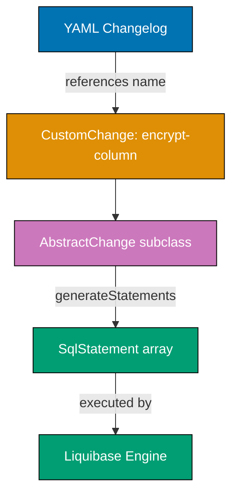
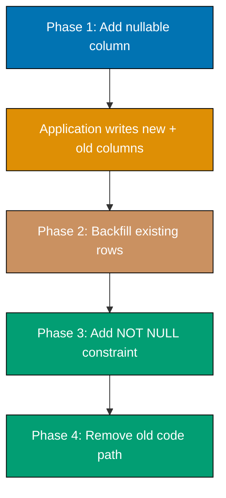
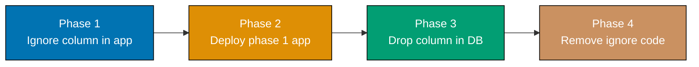
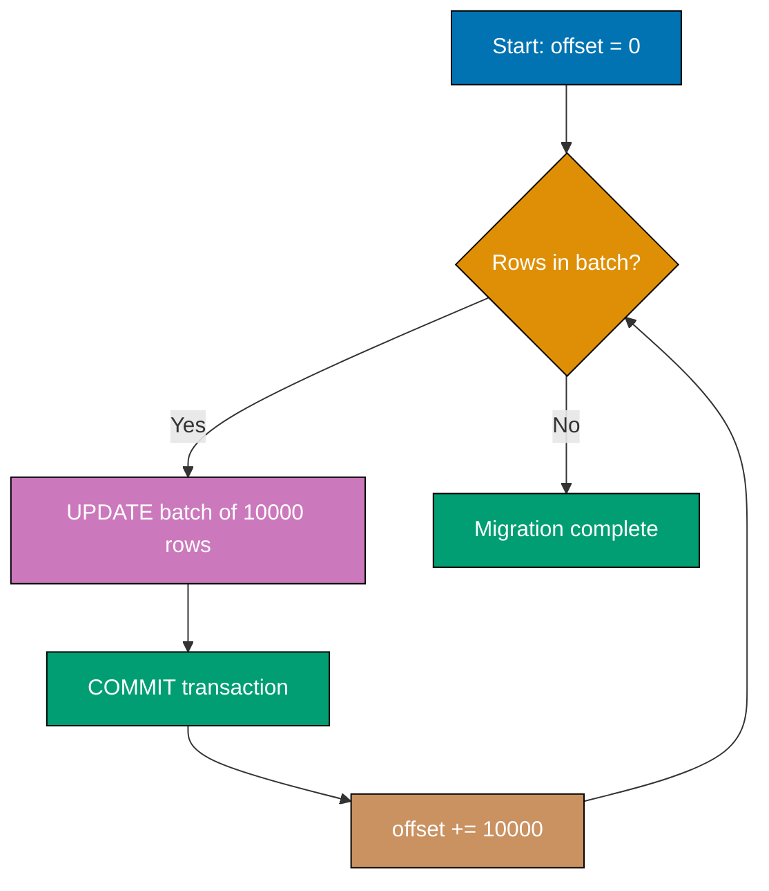
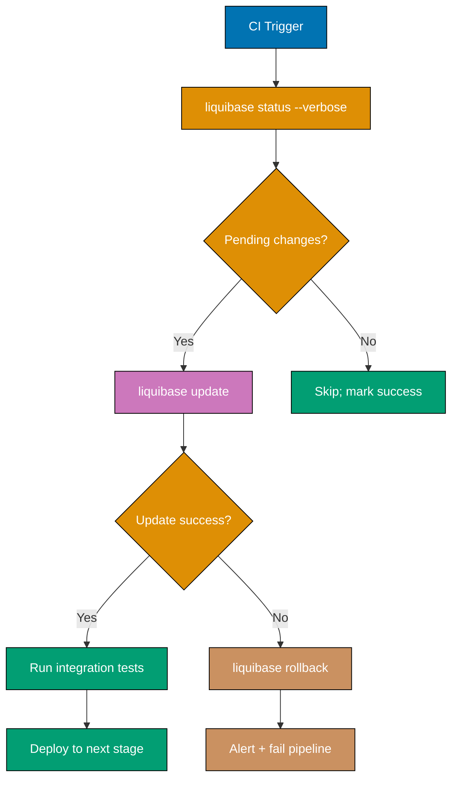
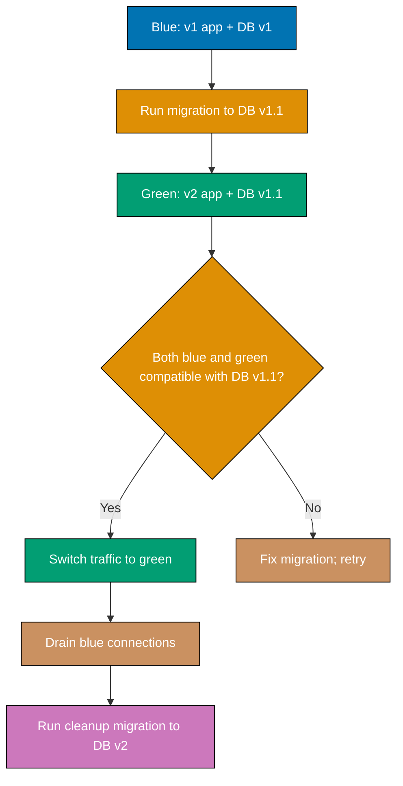
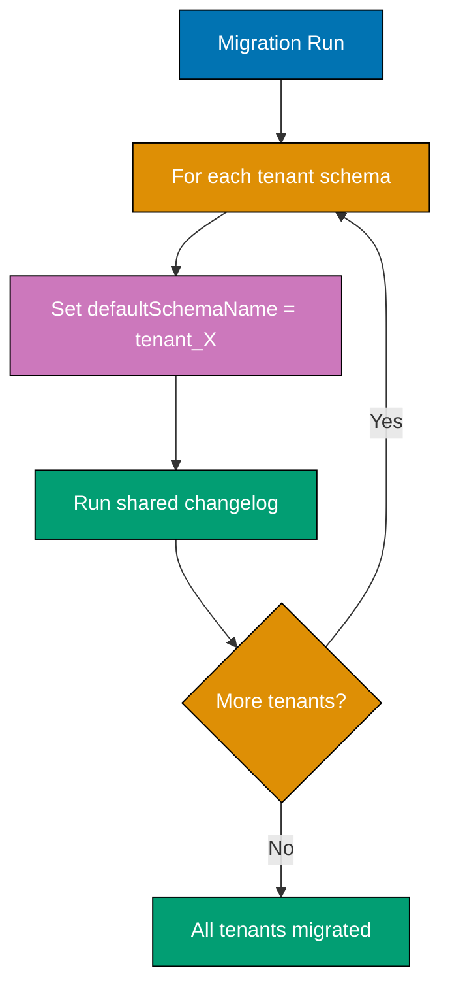
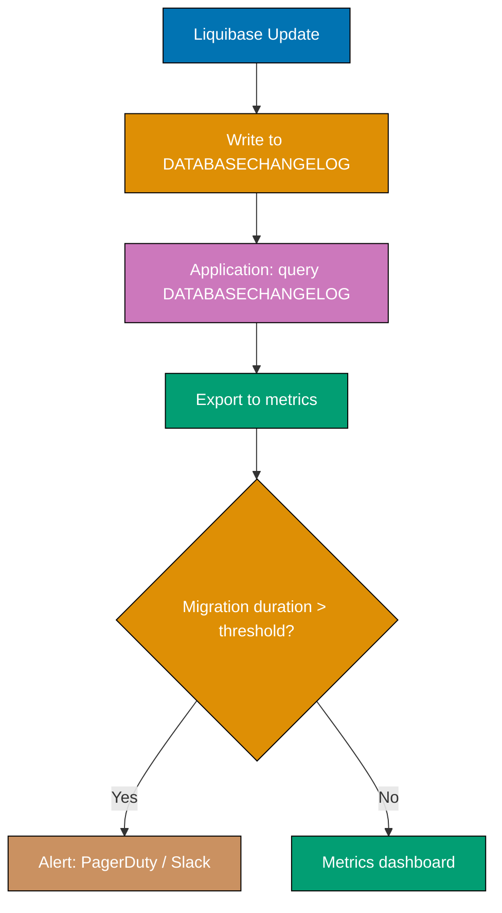

## Advanced Examples (61-85)

**Coverage**: 75-95% of Liquibase functionality

**Focus**: Custom change classes, zero-downtime migration patterns, CI/CD pipeline integration, multi-tenant schemas, encryption, audit trails, and production best practices.

These examples assume you understand beginner and intermediate concepts. All examples are self-contained, production-ready, and heavily annotated to expose execution semantics and tradeoffs.

---

## Group 10: Custom Extensions

### Example 61: Custom Change Class (AbstractChange)

A custom change class extends `AbstractChange` to implement migration logic that cannot be expressed with built-in Liquibase change types. The class is referenced in a YAML changelog using its `@DatabaseChange` name attribute. Liquibase discovers it via classpath scanning when the class is on the application classpath.



```java
// File: src/main/java/com/example/liquibase/EncryptColumnChange.java

import liquibase.change.AbstractChange;
import liquibase.change.DatabaseChange;
import liquibase.change.DatabaseChangeProperty;
import liquibase.database.Database;
import liquibase.statement.SqlStatement;
import liquibase.statement.core.RawSqlStatement;

@DatabaseChange(
    name = "encryptColumn",
    // => Registers this class under the name "encryptColumn"
    // => This name is used in YAML/XML changelogs as the change type key
    description = "Encrypts an existing plaintext column using pgcrypto",
    // => Description appears in Liquibase docs and --help output
    priority = 10
    // => Priority 10 overrides any built-in change with the same name
    // => Built-in changes use priority 1; custom changes should use >5
)
public class EncryptColumnChange extends AbstractChange {
    // => Extends AbstractChange, the base class for all Liquibase change types
    // => AbstractChange handles checksum generation, rollback stubs, and metadata

    private String tableName;
    // => Target table whose column will be encrypted

    private String columnName;
    // => Column containing plaintext data to encrypt

    private String keyEnvVar;
    // => Name of the environment variable holding the encryption key
    // => Avoids hardcoding secrets in the changelog file

    @DatabaseChangeProperty(description = "Table containing the column to encrypt")
    public String getTableName() { return tableName; }
    // => @DatabaseChangeProperty exposes this field in changelog YAML/XML
    // => Getter is required; Liquibase uses JavaBean reflection to map properties

    public void setTableName(String tableName) { this.tableName = tableName; }
    // => Setter required for Liquibase to inject the value from the changelog

    @DatabaseChangeProperty(description = "Column to encrypt")
    public String getColumnName() { return columnName; }
    public void setColumnName(String columnName) { this.columnName = columnName; }

    @DatabaseChangeProperty(description = "Environment variable name for encryption key")
    public String getKeyEnvVar() { return keyEnvVar; }
    public void setKeyEnvVar(String keyEnvVar) { this.keyEnvVar = keyEnvVar; }

    @Override
    public SqlStatement[] generateStatements(Database database) {
        // => Called by Liquibase to produce the actual SQL to execute
        // => Returns an array; multiple statements execute in order within one transaction
        String sql = String.format(
            "UPDATE %s SET %s = pgp_sym_encrypt(%s::text, current_setting('app.encryption_key'))",
            // => pgp_sym_encrypt: symmetric encryption from pgcrypto extension
            // => current_setting reads a runtime parameter set via SET app.encryption_key = '...'
            // => This avoids passing the key directly in SQL (would appear in pg_stat_statements)
            tableName, columnName, columnName
        );
        return new SqlStatement[]{ new RawSqlStatement(sql) };
        // => RawSqlStatement wraps arbitrary SQL strings
        // => Liquibase executes this SQL within the changeset transaction
    }

    @Override
    public String getConfirmationMessage() {
        return String.format("Encrypted column %s.%s", tableName, columnName);
        // => Printed to console after successful execution
        // => Also recorded in DATABASECHANGELOG DESCRIPTION column
    }
}
```

```yaml
# File: src/main/resources/db/changelog/changes/061-encrypt-email.yaml

databaseChangeLog:
  - changeSet:
      id: 061-encrypt-email-column
      # => Unique changeset id; combined with author+filename for global uniqueness
      author: demo-be
      changes:
        - encryptColumn:
            # => References the @DatabaseChange(name = "encryptColumn") class
            # => Liquibase resolves this via classpath scanning at startup
            tableName: users
            columnName: email
            # => Will run: UPDATE users SET email = pgp_sym_encrypt(email::text, ...)
            keyEnvVar: APP_ENCRYPTION_KEY
            # => The custom class reads this env var name to build the SQL
      rollback:
        - sql:
            sql: "-- Manual rollback required: decrypt column or restore from backup"
            # => Custom changes rarely have automatic rollback; document the manual process
```

**Key Takeaway**: Extend `AbstractChange` and annotate with `@DatabaseChange` to create reusable custom migration operations; Liquibase discovers them via classpath scanning and maps YAML properties to Java fields via JavaBean reflection.

**Why It Matters**: Production systems regularly need migration operations that Liquibase's 40+ built-in change types cannot express: encrypting columns with application-specific key management, calling stored procedures with complex logic, or seeding data through application service layers that enforce business rules. Custom change classes package this logic alongside your migrations, keeping it version-controlled and auditable in the same place as schema changes. The alternative—manual SQL scripts or one-off application startup jobs—breaks the migration atomicity guarantee and creates gaps in the DATABASECHANGELOG audit trail.

---

### Example 62: Liquibase Extensions

Liquibase extensions bundle custom change types, preconditions, and snapshot generators into a reusable JAR. The extension registers its components via `ServiceLoader` using files in `META-INF/services/`. Extensions are the distribution mechanism for sharing custom changes across multiple projects.

```java
// File: src/main/java/com/example/liquibase/OseExtension.java

import liquibase.servicelocator.LiquibaseService;

// Extensions register their classes via META-INF/services/ files
// META-INF/services/liquibase.change.Change contains:
//   com.example.liquibase.EncryptColumnChange
// => ServiceLoader discovers this class when the JAR is on the classpath
// => Liquibase scans this file at startup and registers all listed classes

// META-INF/services/liquibase.precondition.Precondition contains:
//   com.example.liquibase.ExtensionInstalledPrecondition
// => Custom preconditions follow the same ServiceLoader pattern

@LiquibaseService(skip = false)
// => @LiquibaseService(skip=false) marks this as an active service
// => skip=true disables the service without removing it from classpath (useful in tests)
public class OseExtension {
    // => Extension marker class; not required but useful for version documentation
    public static final String VERSION = "1.0.0";
    // => Extension version; log this at startup to aid debugging

    public static String getVersion() {
        return VERSION;
        // => Called from application startup to confirm extension is loaded
    }
}
```

```xml
<!-- File: pom.xml dependency for consuming the extension -->

<dependency>
    <groupId>com.example</groupId>
    <artifactId>ose-liquibase-extension</artifactId>
    <version>1.0.0</version>
    <!-- => Adding this JAR to classpath automatically registers all extension components -->
    <!-- => No additional configuration needed; ServiceLoader handles discovery -->
</dependency>
```

**Key Takeaway**: Package custom changes into an extension JAR with `META-INF/services/` registration files; any project that includes the JAR on its classpath gains the custom change types automatically via `ServiceLoader` discovery.

**Why It Matters**: Large organizations maintain a shared Liquibase extension library containing organization-specific change types: masking PII columns, enforcing naming conventions via custom preconditions, or integrating with internal secret management systems. Packaging as an extension rather than copying code across projects ensures all teams run the same encryption logic, naming validators, and compliance checks. When a security team updates the encryption algorithm, they release a new extension version and teams upgrade via a single dependency bump.

---

## Group 11: Zero-Downtime Migration Patterns

### Example 63: Zero-Downtime Column Addition

Adding a nullable column to a busy PostgreSQL table is safe and instant—Postgres adds the column metadata without rewriting the table. A NOT NULL column with a DEFAULT that can be evaluated cheaply is also instant in PostgreSQL 11+. The pattern below shows the safest approach that works across PostgreSQL versions.



```sql
-- liquibase formatted sql
-- => Zero-downtime column addition follows the expand-contract pattern
-- => Phase 1: Add nullable column (instant; no table lock)

-- changeset demo-be:063-add-display-name-nullable dbms:postgresql
-- => runOrder: first to ensure this column exists before backfill changesets
ALTER TABLE users ADD COLUMN IF NOT EXISTS display_name VARCHAR(100);
-- => ADD COLUMN is a metadata-only operation in PostgreSQL; no table rewrite
-- => IF NOT EXISTS prevents failure if migration is retried after partial success
-- => NULL is the default for all existing rows; application layer must handle NULL
-- => No DEFAULT required here because we will backfill in a separate step
-- rollback ALTER TABLE users DROP COLUMN IF EXISTS display_name;

-- changeset demo-be:063-backfill-display-name dbms:postgresql runOnChange:false
-- => Phase 2: Backfill existing rows in batches (see Example 66 for batch pattern)
-- => runOnChange:false (default) ensures this runs exactly once
UPDATE users SET display_name = username WHERE display_name IS NULL;
-- => Copies username to display_name for all pre-existing rows
-- => On large tables, replace this with a batched update (see Example 66)
-- => After this runs, no NULL display_name values exist in the table
-- rollback UPDATE users SET display_name = NULL WHERE display_name = username;

-- changeset demo-be:063-display-name-not-null dbms:postgresql
-- => Phase 3: Add NOT NULL constraint after backfill completes
-- => Only safe AFTER all rows have a value (Phase 2 completed)
ALTER TABLE users ALTER COLUMN display_name SET NOT NULL;
-- => In PostgreSQL 12+: uses a fast constraint validation (no full table scan)
-- => with VALIDATE CONSTRAINT pattern (see Example 64 for explicit validation)
-- rollback ALTER TABLE users ALTER COLUMN display_name DROP NOT NULL;
```

**Key Takeaway**: Follow the expand-contract pattern: add the nullable column first, backfill existing rows in a separate changeset, then enforce NOT NULL—three separate changesets that can deploy across three separate releases without downtime.

**Why It Matters**: Adding a NOT NULL column with a DEFAULT in a single migration locks the table while PostgreSQL rewrites every row to add the default value. On a 100-million-row table, this lock can last minutes, causing application timeouts during a production deployment. The three-phase expand-contract pattern avoids the lock entirely: each phase takes milliseconds, the application serves traffic normally throughout, and the whole operation spans multiple releases. This is the industry standard pattern at companies running zero-downtime deployments.

---

### Example 64: Zero-Downtime Column Removal (3-Phase)

Removing a column safely requires the application to stop reading and writing it before the database schema changes. Dropping a column while application code still references it causes `column does not exist` errors. The three-phase approach coordinates application and database changes across deployments.



```sql
-- liquibase formatted sql
-- => Phase 3 of column removal: database change runs AFTER application already ignores the column

-- changeset demo-be:064-drop-legacy-phone-column dbms:postgresql
-- => PREREQUISITE: All application code must already be deployed that does NOT read/write this column
-- => If any running application instance still selects 'phone', this will cause errors
-- => Use blue-green deployment (see Example 72) to ensure old instances are drained first
ALTER TABLE users DROP COLUMN IF EXISTS phone;
-- => DROP COLUMN acquires AccessExclusiveLock briefly (milliseconds for metadata update)
-- => IF EXISTS prevents failure if column was already dropped by a parallel process
-- => Dropped column's storage is reclaimed lazily by VACUUM, not immediately
-- rollback ALTER TABLE users ADD COLUMN phone VARCHAR(20);
-- => Rollback re-adds the column as nullable; application must also be rolled back
```

```yaml
# File: src/main/resources/db/changelog/changes/064-validate-constraint.yaml
# => Demonstrates NOT VALID + VALIDATE pattern for zero-downtime constraint enforcement

databaseChangeLog:
  - changeSet:
      id: 064-add-check-constraint-not-valid
      author: demo-be
      changes:
        - sql:
            sql: >
              ALTER TABLE users
              ADD CONSTRAINT chk_users_email_format
              CHECK (email ~* '^[^@]+@[^@]+\.[^@]+$')
              NOT VALID;
            # => NOT VALID: adds constraint to metadata without scanning existing rows
            # => New INSERT/UPDATE operations are validated immediately
            # => Existing rows are NOT checked yet; this avoids a full table scan + lock
            splitStatements: false
            # => splitStatements: false treats the entire string as one statement
            # => Required when SQL contains semicolons within the statement body
      rollback:
        - sql:
            sql: "ALTER TABLE users DROP CONSTRAINT IF EXISTS chk_users_email_format;"

  - changeSet:
      id: 064-validate-check-constraint
      author: demo-be
      changes:
        - sql:
            sql: "ALTER TABLE users VALIDATE CONSTRAINT chk_users_email_format;"
            # => VALIDATE CONSTRAINT: scans existing rows without holding AccessExclusiveLock
            # => Uses ShareUpdateExclusiveLock (allows concurrent reads AND writes during scan)
            # => Run this in a separate changeset so it can be a separate transaction
            # => Long-running scan does not block the application
      rollback:
        - sql:
            sql: "-- Constraint already valid; rollback is a no-op"
```

**Key Takeaway**: Remove columns in three deployment phases—stop writing/reading in the application, deploy that change, then drop the column in the database; and use `NOT VALID` + `VALIDATE CONSTRAINT` to enforce constraints on large tables without holding exclusive locks.

**Why It Matters**: Dropping a column while old application instances still query it is a leading cause of production incidents during deployments. Teams using rolling deployments have overlapping old and new application versions for seconds to minutes. The three-phase column removal ensures no application instance references the column when it is dropped. The `NOT VALID` + `VALIDATE CONSTRAINT` pattern is equally critical: validating a CHECK constraint on 100 million rows while holding an exclusive lock means no reads or writes for the duration—often minutes. `VALIDATE CONSTRAINT` uses a weaker lock that allows concurrent traffic.

---

### Example 65: Zero-Downtime Table Rename

Renaming a table breaks all existing queries referencing the old name. The safe approach creates a new table with the target name, migrates data, updates application code to use the new name, and drops the old table—all across separate deployments. A view provides backward compatibility during the transition period.

```sql
-- liquibase formatted sql
-- => Zero-downtime table rename via view shim

-- changeset demo-be:065-create-accounts-table dbms:postgresql
-- => Phase 1: Create the new table with the desired name
CREATE TABLE accounts (
    id            UUID         NOT NULL DEFAULT gen_random_uuid(),
    -- => New table uses identical schema to "users" table being renamed
    username      VARCHAR(50)  NOT NULL,
    email         VARCHAR(255) NOT NULL,
    created_at    TIMESTAMPTZ  NOT NULL DEFAULT NOW(),
    CONSTRAINT pk_accounts PRIMARY KEY (id)
);
-- rollback DROP TABLE IF EXISTS accounts;

-- changeset demo-be:065-create-users-compatibility-view dbms:postgresql
-- => Phase 2: Create view over new table so old queries still work
CREATE OR REPLACE VIEW users AS SELECT * FROM accounts;
-- => Any query to "users" now reads from "accounts"
-- => INSERT/UPDATE/DELETE through a view require rules or INSTEAD OF triggers
-- => For read-only compatibility, a simple view is sufficient
-- => Application should be updated to query "accounts" directly in parallel
-- rollback DROP VIEW IF EXISTS users;

-- changeset demo-be:065-drop-users-view dbms:postgresql
-- => Phase 3: Drop compatibility view AFTER all application code uses "accounts"
-- => Run this changeset in a separate deployment sprint
DROP VIEW IF EXISTS users;
-- => At this point, any remaining query to "users" will fail with "relation does not exist"
-- => Verify no application code references "users" before deploying this changeset
-- rollback CREATE OR REPLACE VIEW users AS SELECT * FROM accounts;
```

**Key Takeaway**: Rename tables safely by creating the new table, adding a view with the old name for backward compatibility, migrating application code to use the new name, and dropping the view in a subsequent deployment.

**Why It Matters**: Direct table renames (`ALTER TABLE users RENAME TO accounts`) are instant in PostgreSQL but immediately break all application code that references the old name. In a continuous deployment environment, old application pods running in parallel will fail with `relation "users" does not exist`. The view shim provides a transition period where both old and new application versions work correctly, making the rename a zero-downtime operation across multiple deployment cycles. This pattern also works for stored procedures and function renames.

---

## Group 12: Performance and Scale

### Example 66: Large Table Migration with Batched Updates

Updating every row in a 50-million-row table in a single transaction fills the WAL (Write-Ahead Log), bloats the table with dead tuples, and holds locks for the full duration. Batching processes rows in small chunks, committing each chunk independently to limit lock duration and WAL pressure.



```sql
-- liquibase formatted sql
-- => Batched update pattern using a DO block with PL/pgSQL loop

-- changeset demo-be:066-backfill-tier-column dbms:postgresql runInTransaction:false
-- => runInTransaction:false: each COMMIT inside the DO block is real
-- => Without this, Liquibase wraps everything in one transaction, defeating batching
DO $$
DECLARE
    batch_size INT := 10000;
    -- => Process 10,000 rows per batch
    -- => Tune based on: table row size, WAL disk space, tolerable lock duration
    -- => 10,000 rows at ~1KB each = ~10MB WAL per commit (safe for most systems)
    rows_updated INT;
    -- => Tracks rows affected in the last batch to detect completion
BEGIN
    LOOP
        UPDATE users
        SET tier = CASE
            WHEN total_spent >= 10000 THEN 'gold'
            -- => $10,000+ lifetime spend earns gold tier
            WHEN total_spent >= 1000 THEN 'silver'
            -- => $1,000+ lifetime spend earns silver tier
            ELSE 'bronze'
            -- => All other users start at bronze
        END
        WHERE tier IS NULL
        -- => Only update rows that have not been backfilled yet
        -- => This makes the loop idempotent: safe to re-run after interruption
        AND id IN (
            SELECT id FROM users WHERE tier IS NULL LIMIT batch_size
            -- => LIMIT batch_size caps the number of rows locked per iteration
            -- => Subquery uses index scan on (tier IS NULL) if partial index exists
        );
        GET DIAGNOSTICS rows_updated = ROW_COUNT;
        -- => GET DIAGNOSTICS captures the row count of the last DML statement
        EXIT WHEN rows_updated = 0;
        -- => Exit loop when no more NULL tier rows remain
        COMMIT;
        -- => Commit this batch: releases row locks, flushes WAL, reduces bloat
        -- => Each commit takes ~1-5ms; application reads are unblocked between batches
        PERFORM pg_sleep(0.01);
        -- => 10ms pause between batches to yield CPU and reduce I/O contention
        -- => Increase to 0.1 (100ms) during peak traffic hours
    END LOOP;
END $$;
-- rollback UPDATE users SET tier = NULL;
-- => Rollback resets all tier values; only safe if column was added in this migration
```

**Key Takeaway**: Use a PL/pgSQL `LOOP` with `LIMIT` + `COMMIT` to process large tables in fixed-size batches; set `runInTransaction:false` so Liquibase does not wrap the entire script in one transaction.

**Why It Matters**: Single-transaction bulk updates on large tables are the most common cause of unplanned production outages during migrations. A 50-million-row UPDATE holds a row-level lock on every affected row for the entire transaction duration—often 10-60 minutes. During that time, any query touching those rows waits, causing connection pool exhaustion and cascading timeouts. Batched updates with explicit COMMIT between chunks keep lock windows under one second per batch while still completing the migration safely. Adding `pg_sleep` between batches gives other processes an opportunity to run without contention.

---

### Example 67: Online Index Creation (CONCURRENTLY)

Standard `CREATE INDEX` holds a `ShareLock` that blocks all writes to the table during index build. `CREATE INDEX CONCURRENTLY` builds the index without blocking writes by doing multiple passes over the table. Liquibase requires `runInTransaction:false` because `CONCURRENTLY` cannot run inside a transaction.

```sql
-- liquibase formatted sql

-- changeset demo-be:067-create-index-concurrently dbms:postgresql runInTransaction:false
-- => runInTransaction:false is REQUIRED for CONCURRENTLY
-- => PostgreSQL raises "ERROR: CREATE INDEX CONCURRENTLY cannot run inside a transaction block"
-- => Without runInTransaction:false, Liquibase wraps this in BEGIN...COMMIT, causing the error
CREATE INDEX CONCURRENTLY IF NOT EXISTS idx_expenses_amount_date
    ON expenses (amount DESC, date DESC);
-- => CONCURRENTLY: two-phase build; first pass reads table, second pass catches up with changes
-- => Writes to the table proceed normally during both phases
-- => Build takes 2-5x longer than standard CREATE INDEX but does not block production traffic
-- => IF NOT EXISTS: idempotent; safe to retry if the migration is interrupted
-- => Partial failure leaves an INVALID index; detect with:
-- =>   SELECT indexname FROM pg_indexes WHERE indexname = 'idx_expenses_amount_date'
-- =>   INNER JOIN pg_class c ON c.relname = pg_indexes.indexname
-- =>   WHERE c.indisvalid = false;
-- rollback DROP INDEX CONCURRENTLY IF EXISTS idx_expenses_amount_date;
-- => Rollback also uses CONCURRENTLY to avoid blocking writes during index drop
```

**Key Takeaway**: Always use `CREATE INDEX CONCURRENTLY` on production tables and set `runInTransaction:false` in the changeset; a partial failure leaves an INVALID index that must be dropped and rebuilt manually.

**Why It Matters**: Creating a regular index on a 10-million-row table takes 30-120 seconds. During those seconds, no application can write to the table—every INSERT, UPDATE, and DELETE waits for the `ShareLock` to release. In production systems processing hundreds of writes per second, this causes an immediate backlog that takes minutes to drain after the migration completes. `CONCURRENTLY` builds the index in background while production traffic flows normally, at the cost of a slightly longer build time. Every DBA handbook recommends `CONCURRENTLY` for production index creation; Liquibase's `runInTransaction:false` makes this accessible from migration changelogs.

---

### Example 68: Data Backfill Pattern

Backfilling a new column from existing data requires a strategy that handles NULL values, avoids duplicates, is idempotent, and works correctly on both small and large tables. This example shows the canonical backfill pattern using a derived value from an expression.

```sql
-- liquibase formatted sql

-- changeset demo-be:068-add-email-domain-column dbms:postgresql
-- => Phase 1: Add the column as nullable (instant; no table rewrite)
ALTER TABLE users ADD COLUMN IF NOT EXISTS email_domain VARCHAR(100);
-- => email_domain will store the domain part of the email address
-- => NULL for all existing rows until the backfill changeset executes
-- rollback ALTER TABLE users DROP COLUMN IF EXISTS email_domain;

-- changeset demo-be:068-backfill-email-domain dbms:postgresql
-- => Phase 2: Derive email_domain from existing email column
UPDATE users
SET email_domain = LOWER(SPLIT_PART(email, '@', 2))
-- => SPLIT_PART(email, '@', 2): extracts text after '@' delimiter
-- => LOWER: normalizes to lowercase for consistent grouping in queries
-- => Example: 'Alice@Example.COM' -> 'example.com'
WHERE email_domain IS NULL
-- => Idempotency guard: only updates rows not yet backfilled
-- => Safe to re-run if migration is interrupted; re-running skips already-done rows
AND email IS NOT NULL
-- => Skip rows with NULL email (should not exist due to NOT NULL constraint, but defensive)
AND email LIKE '%@%';
-- => Skip malformed emails without '@'; avoids SPLIT_PART returning empty string
-- rollback UPDATE users SET email_domain = NULL;

-- changeset demo-be:068-index-email-domain dbms:postgresql runInTransaction:false
-- => Phase 3: Create supporting index after backfill to avoid index maintenance overhead during bulk update
CREATE INDEX CONCURRENTLY IF NOT EXISTS idx_users_email_domain
    ON users (email_domain)
    WHERE email_domain IS NOT NULL;
-- => Partial index: only indexes rows with non-null email_domain
-- => Partial index is smaller and faster to scan for filtered queries
-- rollback DROP INDEX CONCURRENTLY IF EXISTS idx_users_email_domain;
```

**Key Takeaway**: Structure data backfills as three-phase changesets: add nullable column, backfill with idempotency guard (`WHERE new_col IS NULL`), then create supporting indexes after the bulk update to avoid index maintenance overhead during the update.

**Why It Matters**: Creating an index before a bulk UPDATE doubles the cost: every row write must also update the B-tree index. Creating the index after the bulk UPDATE uses a single sequential index build pass—much faster. The `WHERE new_col IS NULL` idempotency guard is critical: if the migration server loses connectivity mid-backfill and retries, it picks up exactly where it left off instead of re-processing completed rows. This pattern also handles the gradual rollout case where some rows were populated by the application between the changeset running and the backfill completing.

---

## Group 13: CI/CD and Operations

### Example 69: Liquibase in CI/CD Pipeline

Integrating Liquibase into a CI/CD pipeline requires distinct stages: status check (detects pending migrations), update (applies pending migrations), and rollback (reverts on failure). The pipeline uses Liquibase's exit codes to determine whether to proceed or fail the build.



```yaml
# File: .github/workflows/db-migrate.yml

name: Database Migration
on:
  push:
    branches: [main]
    # => Trigger on every push to main; adjust for your branching strategy
    paths:
      - "src/main/resources/db/**"
      # => Only run when changelog files change; saves CI minutes on unrelated commits

jobs:
  migrate:
    runs-on: ubuntu-latest
    services:
      postgres:
        image: postgres:16
        # => Use same major version as production to catch version-specific SQL
        env:
          POSTGRES_DB: app_test
          POSTGRES_USER: app
          POSTGRES_PASSWORD: test_password
        options: >-
          --health-cmd pg_isready
          --health-interval 10s
          --health-timeout 5s
          --health-retries 5
        # => Health check ensures Postgres is ready before Liquibase runs
    steps:
      - uses: actions/checkout@v4
        # => Check out changelog files; required before liquibase can read them

      - name: Run Liquibase Status
        run: |
          mvn liquibase:status \
            -Dliquibase.url=jdbc:postgresql://localhost:5432/app_test \
            -Dliquibase.username=app \
            -Dliquibase.password=test_password \
            -Dliquibase.changeLogFile=src/main/resources/db/changelog/db.changelog-master.yaml
          # => liquibase:status lists all pending changesets without executing them
          # => Exit code 0 even if there are pending changes; informational only
          # => Add --verbose to see changeset ids in CI logs

      - name: Run Liquibase Update
        run: |
          mvn liquibase:update \
            -Dliquibase.url=jdbc:postgresql://localhost:5432/app_test \
            -Dliquibase.username=app \
            -Dliquibase.password=test_password \
            -Dliquibase.changeLogFile=src/main/resources/db/changelog/db.changelog-master.yaml
          # => liquibase:update applies all pending changesets in order
          # => Exit code 1 on failure; CI step fails and downstream steps are skipped
          # => All changesets run inside a transaction (unless runInTransaction:false)
          # => DATABASECHANGELOG updated on success; unchanged on failure

      - name: Rollback on Failure
        if: failure()
        # => Only runs if a previous step in this job failed
        run: |
          mvn liquibase:rollback \
            -Dliquibase.url=jdbc:postgresql://localhost:5432/app_test \
            -Dliquibase.username=app \
            -Dliquibase.password=test_password \
            -Dliquibase.rollbackCount=1
          # => rollbackCount=1: rolls back the most recent changeset
          # => Use rollbackTag or rollbackDate for more targeted rollback
          # => Only works if the changeset has a rollback block defined
```

**Key Takeaway**: Structure the CI/CD database stage as status → update → conditional rollback; use Maven property overrides for environment-specific connection strings and avoid hardcoding credentials in changelog files.

**Why It Matters**: Migrations that fail halfway through a deployment leave the database in an inconsistent state that may be worse than either the old or new state. Automated rollback in the CI pipeline catches these failures before they reach production, restoring the last known-good state without manual intervention. Running Liquibase against a real PostgreSQL container in CI (rather than an in-memory H2 database) catches PostgreSQL-specific syntax errors, missing extensions, and permission issues that H2 silently ignores. Teams that skip this step discover migration failures at 2 AM on production deployments.

---

### Example 70: Migration Rollback Testing

Rollback testing verifies that every changeset's `<rollback>` block correctly reverses the migration. Automating rollback tests in CI prevents the scenario where a rollback block was written but never tested and silently broke months ago.

```yaml
# File: .github/workflows/rollback-test.yml
# => Dedicated workflow to validate rollback correctness for every changeset

name: Rollback Test
on:
  pull_request:
    paths:
      - "src/main/resources/db/**"
      # => Run on every PR that changes changelogs

jobs:
  rollback-test:
    runs-on: ubuntu-latest
    services:
      postgres:
        image: postgres:16
        env:
          POSTGRES_DB: rollback_test
          POSTGRES_USER: app
          POSTGRES_PASSWORD: test_password
        options: >-
          --health-cmd pg_isready
          --health-interval 10s
          --health-timeout 5s
          --health-retries 5
    steps:
      - uses: actions/checkout@v4

      - name: Apply all migrations
        run: |
          mvn liquibase:update \
            -Dliquibase.url=jdbc:postgresql://localhost:5432/rollback_test \
            -Dliquibase.username=app \
            -Dliquibase.password=test_password
          # => Apply every changeset to reach the latest schema state
          # => This is the state we will attempt to roll back from

      - name: Rollback one changeset
        run: |
          mvn liquibase:rollback \
            -Dliquibase.url=jdbc:postgresql://localhost:5432/rollback_test \
            -Dliquibase.username=app \
            -Dliquibase.password=test_password \
            -Dliquibase.rollbackCount=1
          # => Roll back only the most recent changeset
          # => Fails if the changeset has no rollback block or if the rollback SQL errors

      - name: Re-apply and rollback all new changesets
        run: |
          mvn liquibase:update \
            -Dliquibase.url=jdbc:postgresql://localhost:5432/rollback_test \
            -Dliquibase.username=app \
            -Dliquibase.password=test_password
          # => Re-apply to verify idempotency: schema must be identical after re-run
          mvn liquibase:rollbackCount \
            -Dliquibase.url=jdbc:postgresql://localhost:5432/rollback_test \
            -Dliquibase.username=app \
            -Dliquibase.password=test_password \
            -Dliquibase.rollbackCount=5
          # => Roll back the last 5 changesets to test the full rollback chain
          # => Adjust count to match the number of changesets added in this PR
```

**Key Takeaway**: Run `liquibase:update` followed by `liquibase:rollbackCount` in every CI pipeline that touches changelogs; this validates rollback blocks are syntactically correct and logically reverse the migration before merging.

**Why It Matters**: Production incidents frequently end with the decision to roll back a failed deployment. If the Liquibase rollback block was never tested, the rollback itself fails—compounding the outage. Teams discover this at the worst possible moment: under pressure, with users reporting errors. Automated rollback testing in CI costs one extra minute per PR and eliminates this entire class of production incident. The test also catches cases where a developer wrote a rollback that drops the wrong table or forgets to restore a constraint, which would leave the database in a worse state after rollback than before the migration.

---

### Example 71: Changelog Locking Deep Dive

Liquibase uses the `DATABASECHANGELOGLOCK` table to prevent concurrent migration runs. Understanding the locking mechanism helps diagnose stuck deployments where a previous run crashed and left the lock acquired. Manual lock release and lock timeout configuration are essential operational knowledge.

```sql
-- SQL: Inspect lock state directly in PostgreSQL

SELECT
    id,
    -- => Lock row id; always 1 for the primary lock
    locked,
    -- => BOOLEAN: true means a migration is in progress (or crashed holding the lock)
    lockgranted,
    -- => TIMESTAMPTZ: when the lock was acquired; NULL if not locked
    lockedby
    -- => VARCHAR: hostname + PID of the process holding the lock
FROM databasechangeloglock;
-- => Example output when lock is stuck:
-- => id=1, locked=true, lockgranted='2026-03-27 02:15:00+07', lockedby='deploy-server-01/12345'
-- => If lockgranted is >5 minutes ago and no migration is running, the lock is stale
```

```yaml
# File: src/main/resources/db/changelog/db.changelog-master.yaml
# => Configure lock timeout to prevent indefinite blocking

databaseChangeLog:
  - property:
      name: lockWaitTimeInMinutes
      value: "5"
      # => Wait up to 5 minutes for the lock before failing
      # => Default is 5 minutes; reduce for fast CI pipelines

  - property:
      name: changeLogLockPollRate
      value: "10"
      # => Check for lock release every 10 seconds
      # => Default is 10 seconds; reduce to 5 for responsive CI failures

  - includeAll:
      path: db/changelog/changes/
```

```bash
# Release stuck lock via CLI (use when previous migration crashed)
mvn liquibase:releaseLocks \
  -Dliquibase.url=jdbc:postgresql://localhost:5432/mydb \
  -Dliquibase.username=app \
  -Dliquibase.password=secret
# => Sets DATABASECHANGELOGLOCK.LOCKED = false, LOCKGRANTED = NULL, LOCKEDBY = NULL
# => Only run after confirming no migration is currently in progress
# => Check pg_stat_activity for active queries from the migration user before releasing
```

**Key Takeaway**: When a deployment fails and leaves `DATABASECHANGELOGLOCK.LOCKED = true`, use `liquibase:releaseLocks` to unblock subsequent runs; configure `lockWaitTimeInMinutes` to fail fast in CI rather than waiting indefinitely.

**Why It Matters**: A common production scenario: a migration deployment is killed mid-run (server restart, timeout, OOM kill), leaving `DATABASECHANGELOGLOCK.LOCKED = true`. The next deployment attempt waits indefinitely for a lock that will never be released, appearing to hang. Without understanding the locking mechanism, operators restart services repeatedly without fixing the root cause. Knowing to run `liquibase:releaseLocks` (after confirming no active migration) resolves the issue in seconds. Setting `lockWaitTimeInMinutes=5` converts an indefinite hang into a fast, actionable failure that alerts on-call engineers immediately.

---

## Group 14: Advanced Deployment Patterns

### Example 72: Blue-Green Deployment Migrations

Blue-green deployments run two identical environments simultaneously—blue (current) and green (new). Database migrations must be compatible with both application versions during the switch. This requires backward-compatible migration design: additions before removals, nullable before NOT NULL, no destructive changes until old version is retired.



```sql
-- liquibase formatted sql
-- => Blue-green compatible migration: adds new column that both old and new app handle

-- changeset demo-be:072-add-status-v2-column dbms:postgresql
-- => COMPATIBLE with blue (v1) and green (v2) application simultaneously
-- => Blue app: ignores new column (no SELECT, INSERT, UPDATE references to it)
-- => Green app: reads and writes new column
-- => Column is nullable so blue app INSERTs without providing a value succeed
ALTER TABLE orders ADD COLUMN IF NOT EXISTS status_v2 VARCHAR(20);
-- => Nullable column addition is backward compatible: old app ignores it, new app uses it
-- rollback ALTER TABLE orders DROP COLUMN IF EXISTS status_v2;

-- changeset demo-be:072-cleanup-old-status dbms:postgresql
-- => CLEANUP: run AFTER blue environment is drained and all traffic is on green (v2)
-- => This changeset is NOT backward compatible; old app code would fail after this
-- => Tag this changeset: liquibase tag cleanup-072 (see Example 80)
ALTER TABLE orders DROP COLUMN IF EXISTS status;
-- => Safe now: no blue instances remain; only green (v2) app reads status_v2
-- rollback ALTER TABLE orders ADD COLUMN status VARCHAR(20);
```

**Key Takeaway**: Design blue-green migrations as two separate changesets: a backward-compatible expansion (safe during traffic switch) and a cleanup changeset (run after old environment is fully drained); never deploy breaking schema changes while both environments are live.

**Why It Matters**: Blue-green deployments are the industry standard for zero-downtime deploys but they require careful migration design. A single migration that renames a column or changes its type will work for green (new) but break blue (old). The result is a brief window where half of user requests succeed (green) and half fail (blue) until traffic switches—users see intermittent errors. The expand-then-contract pattern with two separate migration phases eliminates this window entirely, enabling true zero-downtime deployment with complete rollback capability.

---

### Example 73: Feature Flag Migration Pattern

Feature flag migrations decouple schema deployment from feature activation. The database change deploys first to all environments; the application code behind the feature flag activates the new schema once the flag is enabled. This enables dark launches and gradual rollouts without per-environment migration branches.

```sql
-- liquibase formatted sql
-- => Feature flag migration: schema deployed ahead of feature activation

-- changeset demo-be:073-create-feature-flags-table dbms:postgresql
CREATE TABLE feature_flags (
    name       VARCHAR(100) NOT NULL,
    -- => Feature flag identifier, e.g., 'recommendations-v2'
    enabled    BOOLEAN      NOT NULL DEFAULT false,
    -- => Default false: all features start disabled in every environment
    percentage INT          NOT NULL DEFAULT 0,
    -- => Rollout percentage: 0-100; enables gradual rollout to subset of users
    updated_at TIMESTAMPTZ  NOT NULL DEFAULT NOW(),
    -- => Track when flag was last changed for audit purposes
    CONSTRAINT pk_feature_flags PRIMARY KEY (name),
    CONSTRAINT chk_percentage CHECK (percentage BETWEEN 0 AND 100)
    -- => Constraint ensures percentage is always a valid 0-100 value
);
-- rollback DROP TABLE IF EXISTS feature_flags;

-- changeset demo-be:073-seed-initial-flags dbms:postgresql context:!prod
-- => context:!prod: runs in dev and staging but NOT production
-- => Production flag values are managed via admin UI or deployment scripts, not migrations
INSERT INTO feature_flags (name, enabled, percentage) VALUES
    ('recommendations-v2', false, 0),
    -- => New recommendation engine: disabled by default, activate via admin panel
    ('dark-mode', true, 100),
    -- => Dark mode: enabled for 100% of users in non-prod environments
    ('new-checkout-flow', false, 10);
    -- => Gradual checkout flow rollout: 10% in staging for initial testing
-- rollback DELETE FROM feature_flags WHERE name IN ('recommendations-v2','dark-mode','new-checkout-flow');
```

**Key Takeaway**: Deploy schema for feature flags as a Liquibase migration (ensuring it exists in all environments before activation) and seed initial flag values with `context:!prod` to prevent accidental production feature activation.

**Why It Matters**: Without a feature flag table, teams manage feature rollouts by deploying different application versions to different environments or using environment variables in application config. Both approaches create divergence: dev has features that prod does not, making the `works on my machine` problem worse. A feature flags table in the database is visible to all application instances, persisted across restarts, and manageable through admin tools. The `context:!prod` seed pattern ensures production starts with all features safely disabled while development and staging can test with features enabled.

---

### Example 74: Multi-Tenant Migrations

Multi-tenant systems isolate tenant data using separate schemas per tenant (schema-per-tenant pattern) or a shared schema with a `tenant_id` discriminator column. Liquibase supports schema-per-tenant by running the same changelog against multiple schemas, using the `defaultSchemaName` property to target each tenant's schema.



```java
// File: src/main/java/com/example/migration/MultiTenantMigrator.java

import liquibase.Liquibase;
import liquibase.database.DatabaseFactory;
import liquibase.database.jvm.JdbcConnection;
import liquibase.resource.ClassLoaderResourceAccessor;
import java.sql.Connection;
import java.sql.DriverManager;
import java.util.List;

public class MultiTenantMigrator {
    // => Runs the same changelog against every tenant schema in sequence

    private static final String CHANGELOG = "db/changelog/db.changelog-master.yaml";
    // => Single shared changelog; applied identically to each tenant schema

    public void migrateAllTenants(List<String> tenantSchemas, String jdbcUrl,
                                   String username, String password) throws Exception {
        // => tenantSchemas: list of schema names, e.g. ["tenant_acme", "tenant_globex"]
        for (String schema : tenantSchemas) {
            // => Iterate each tenant schema; run migrations sequentially
            migrateSchema(schema, jdbcUrl, username, password);
            // => Sequential (not parallel) to avoid lock contention on shared sequences
        }
    }

    private void migrateSchema(String schema, String jdbcUrl,
                                String username, String password) throws Exception {
        try (Connection conn = DriverManager.getConnection(jdbcUrl, username, password)) {
            // => One connection per tenant; connection closed by try-with-resources
            conn.createStatement().execute("SET search_path TO " + schema + ",public");
            // => Set search_path so unqualified table names resolve to this tenant's schema
            // => Appending ',public' allows access to shared public schema extensions
            var db = DatabaseFactory.getInstance()
                .findCorrectDatabaseImplementation(new JdbcConnection(conn));
            // => DatabaseFactory detects the database type (PostgreSQL) from the JDBC connection
            db.setDefaultSchemaName(schema);
            // => Sets the schema where Liquibase looks for DATABASECHANGELOG and DATABASECHANGELOGLOCK
            // => Each tenant gets its own DATABASECHANGELOG tracking table

            try (var liquibase = new Liquibase(CHANGELOG,
                    new ClassLoaderResourceAccessor(), db)) {
                liquibase.update("");
                // => Apply all pending changesets for this tenant schema
                // => DATABASECHANGELOG in this schema tracks which changesets have run
                // => A new tenant's DATABASECHANGELOG is empty; all changesets run
                // => An existing tenant's DATABASECHANGELOG prevents re-running completed changesets
            }
        }
    }
}
```

**Key Takeaway**: Run the same changelog against each tenant schema by setting `defaultSchemaName` per tenant connection; each schema maintains its own `DATABASECHANGELOG` table so tenant schemas can be at different migration versions independently.

**Why It Matters**: SaaS platforms onboarding new customers need to provision fully-migrated database schemas programmatically. The multi-tenant migrator pattern bootstraps new tenant schemas in seconds, runs them through every historical migration, and leaves them at the current schema version—identical to all other tenants. Maintaining separate `DATABASECHANGELOG` tables per tenant enables rolling upgrades: migrate 10% of tenants, verify, then migrate the rest. A bug in migration 074 can be caught and rolled back for remaining tenants before affecting all customers.

---

## Group 15: Security and Compliance

### Example 75: Migration with pgcrypto Encryption

`pgcrypto` provides PostgreSQL-native encryption functions for protecting PII. Liquibase manages both the extension installation and the column transformations as versioned changesets, ensuring encryption is applied consistently across all environments.

```sql
-- liquibase formatted sql

-- changeset demo-be:075-enable-pgcrypto dbms:postgresql
-- => Install pgcrypto extension; required before any encryption functions are available
CREATE EXTENSION IF NOT EXISTS pgcrypto;
-- => pgcrypto provides: pgp_sym_encrypt, pgp_sym_decrypt, crypt, gen_salt
-- => IF NOT EXISTS: idempotent; safe to re-run in any environment
-- => Requires superuser or pg_extension_owner membership
-- rollback DROP EXTENSION IF EXISTS pgcrypto;

-- changeset demo-be:075-add-ssn-encrypted-column dbms:postgresql
-- => Add an encrypted SSN column alongside the existing plaintext column
ALTER TABLE users ADD COLUMN IF NOT EXISTS ssn_encrypted BYTEA;
-- => BYTEA stores the raw bytes of the encrypted ciphertext
-- => pgp_sym_encrypt returns BYTEA; do not use VARCHAR for encrypted data
-- rollback ALTER TABLE users DROP COLUMN IF EXISTS ssn_encrypted;

-- changeset demo-be:075-encrypt-existing-ssn dbms:postgresql runInTransaction:false
-- => Backfill encrypted column from plaintext column
-- => runInTransaction:false required if using batch loop (see Example 66)
DO $$
BEGIN
    UPDATE users
    SET ssn_encrypted = pgp_sym_encrypt(
        ssn,
        -- => ssn: plaintext source column being encrypted
        current_setting('app.encryption_key')
        -- => app.encryption_key: set at session level by application startup code
        -- => Never pass the key as a literal string in SQL (appears in pg_stat_statements)
    )
    WHERE ssn IS NOT NULL
    -- => Only encrypt rows that have a plaintext SSN
    AND ssn_encrypted IS NULL;
    -- => Idempotency guard: skip already-encrypted rows
END $$;
-- rollback UPDATE users SET ssn_encrypted = NULL;

-- changeset demo-be:075-drop-plaintext-ssn dbms:postgresql
-- => Remove plaintext column AFTER all application code reads ssn_encrypted instead
ALTER TABLE users DROP COLUMN IF EXISTS ssn;
-- => This changeset is NOT backward compatible; deploy only after app upgrade
-- rollback ALTER TABLE users ADD COLUMN ssn VARCHAR(11);
-- => Rollback adds the column back as nullable; data recovery requires separate restore
```

**Key Takeaway**: Install `pgcrypto` and transform plaintext columns to `BYTEA` encrypted columns in separate ordered changesets; use `current_setting('app.encryption_key')` to avoid hardcoding keys in SQL that appears in query logs.

**Why It Matters**: Storing PII like SSNs, credit card numbers, or health records in plaintext is a compliance violation under GDPR, HIPAA, and PCI-DSS. Encryption-at-rest (full disk encryption) does not protect against SQL injection attacks or database credential leaks—application-level encryption with pgcrypto does. Putting the encryption migration in Liquibase ensures every environment (dev, staging, prod) has the same encryption applied and the same extension installed. The `current_setting` pattern for key injection prevents the encryption key from appearing in PostgreSQL's `pg_stat_statements` view, which is frequently exposed to developers who should not see production keys.

---

### Example 76: Audit Trail Table Migration

An audit trail records every change to sensitive tables: who changed what, when, and from what value to what value. Liquibase creates both the audit table and the trigger that populates it as a single migration, ensuring they are always deployed together.

```sql
-- liquibase formatted sql

-- changeset demo-be:076-create-users-audit-table dbms:postgresql
CREATE TABLE users_audit (
    audit_id      BIGSERIAL    NOT NULL,
    -- => Surrogate primary key for the audit table itself
    operation     CHAR(1)      NOT NULL,
    -- => 'I'=INSERT, 'U'=UPDATE, 'D'=DELETE; single character for compact storage
    changed_at    TIMESTAMPTZ  NOT NULL DEFAULT NOW(),
    -- => Timestamp of the change; uses server clock for consistency
    changed_by    VARCHAR(255) NOT NULL DEFAULT current_user,
    -- => PostgreSQL current_user: the database role executing the change
    -- => For application-level user tracking, pass via SET app.current_user = 'alice'
    old_data      JSONB,
    -- => Previous row values as JSON; NULL for INSERT operations
    new_data      JSONB,
    -- => New row values as JSON; NULL for DELETE operations
    CONSTRAINT pk_users_audit PRIMARY KEY (audit_id)
);
-- rollback DROP TABLE IF EXISTS users_audit;

-- changeset demo-be:076-create-users-audit-trigger dbms:postgresql splitStatements:false
-- => splitStatements:false treats entire block as one statement (required for PL/pgSQL)
CREATE OR REPLACE FUNCTION users_audit_trigger_fn()
RETURNS TRIGGER AS $$
BEGIN
    -- => RETURNS TRIGGER: required signature for trigger functions
    -- => NEW and OLD are implicit record variables available in trigger functions
    IF (TG_OP = 'INSERT') THEN
        -- => TG_OP: trigger operation name ('INSERT', 'UPDATE', or 'DELETE')
        INSERT INTO users_audit (operation, new_data)
        VALUES ('I', row_to_json(NEW)::jsonb);
        -- => row_to_json(NEW): converts entire new row to JSON object
        -- => ::jsonb casts to JSONB for indexing and querying support
        RETURN NEW;
        -- => AFTER trigger must return NEW (or OLD for DELETE); return value is ignored for AFTER
    ELSIF (TG_OP = 'UPDATE') THEN
        INSERT INTO users_audit (operation, old_data, new_data)
        VALUES ('U', row_to_json(OLD)::jsonb, row_to_json(NEW)::jsonb);
        -- => Records both before and after values for complete change tracking
        RETURN NEW;
    ELSIF (TG_OP = 'DELETE') THEN
        INSERT INTO users_audit (operation, old_data)
        VALUES ('D', row_to_json(OLD)::jsonb);
        -- => For DELETE: only old_data is available; NEW is NULL
        RETURN OLD;
        -- => AFTER DELETE trigger must return OLD
    END IF;
    RETURN NULL;
    -- => Unreachable; satisfies PL/pgSQL return requirement
END;
$$ LANGUAGE plpgsql;

CREATE TRIGGER users_audit_trigger
    AFTER INSERT OR UPDATE OR DELETE ON users
    -- => AFTER trigger: fires after the DML completes; row is already committed
    -- => BEFORE trigger: could modify NEW values; use AFTER for audit (no modification needed)
    FOR EACH ROW EXECUTE FUNCTION users_audit_trigger_fn();
    -- => FOR EACH ROW: fires once per affected row (not once per statement)
-- rollback DROP TRIGGER IF EXISTS users_audit_trigger ON users; DROP FUNCTION IF EXISTS users_audit_trigger_fn();
```

**Key Takeaway**: Create the audit table and its trigger in the same migration to ensure they are always deployed together; use `splitStatements:false` for PL/pgSQL function bodies and `row_to_json(NEW/OLD)::jsonb` to capture complete row snapshots.

**Why It Matters**: Compliance frameworks (SOX, HIPAA, PCI-DSS) require demonstrable audit trails for changes to sensitive data. Triggers at the database level are stronger than application-layer audit logging because they capture changes from every client: the application, admin tools, database migrations themselves, and any direct psql queries. Missing an audit entry due to a code path that bypassed the application audit middleware is a compliance violation. Database triggers are impossible to bypass without disabling them explicitly. Putting the trigger creation in Liquibase ensures the audit trail is established before any data is written in any environment.

---

### Example 77: Soft Delete Schema Pattern

Soft delete preserves records by marking them as deleted rather than removing them. The schema pattern adds a `deleted_at` nullable timestamp column, a partial index covering only active records, and a view that hides deleted rows for applications using the view.

```sql
-- liquibase formatted sql

-- changeset demo-be:077-add-soft-delete-to-products dbms:postgresql
ALTER TABLE products
    ADD COLUMN IF NOT EXISTS deleted_at TIMESTAMPTZ;
-- => NULL means the record is active
-- => Non-null timestamp means the record was soft-deleted at that time
-- => Application: UPDATE products SET deleted_at = NOW() WHERE id = $1 (instead of DELETE)
-- rollback ALTER TABLE products DROP COLUMN IF EXISTS deleted_at;

-- changeset demo-be:077-index-active-products dbms:postgresql runInTransaction:false
CREATE INDEX CONCURRENTLY IF NOT EXISTS idx_products_active
    ON products (created_at DESC)
    WHERE deleted_at IS NULL;
-- => Partial index: only indexes rows where deleted_at IS NULL (active records)
-- => Query: SELECT * FROM products WHERE deleted_at IS NULL ORDER BY created_at DESC
-- =>   Uses this index for fast active-record retrieval
-- => Deleted records are not indexed; reduces index size as records accumulate
-- rollback DROP INDEX CONCURRENTLY IF EXISTS idx_products_active;

-- changeset demo-be:077-create-active-products-view dbms:postgresql
CREATE OR REPLACE VIEW active_products AS
    SELECT * FROM products WHERE deleted_at IS NULL;
-- => View filters deleted records automatically
-- => Application code querying active_products never sees deleted records
-- => Simplifies queries: no WHERE deleted_at IS NULL needed in every query
-- rollback DROP VIEW IF EXISTS active_products;
```

**Key Takeaway**: Implement soft delete with a nullable `deleted_at` column, a partial index on `WHERE deleted_at IS NULL` for efficient active-record queries, and a view that pre-filters deleted rows so application queries remain clean.

**Why It Matters**: Hard deletes are irreversible and prevent historical reporting, undo functionality, and compliance audit trails. Soft deletes preserve data while logically hiding it from normal application operations. The partial index is critical for performance: without it, every `WHERE deleted_at IS NULL` query scans the full table including millions of deleted records. A partial index covering only active records remains small even as deleted records accumulate over years, keeping query performance consistent. The view eliminates the risk of application developers forgetting to add `WHERE deleted_at IS NULL` to a new query.

---

## Group 16: Production Operations

### Example 78: Migration Performance Benchmarking

Estimating migration duration before running in production prevents unplanned downtime windows. This example shows techniques for measuring migration time on representative data volumes using `EXPLAIN ANALYZE` and Liquibase's timing output.

```sql
-- SQL: Pre-migration analysis to estimate duration

-- Step 1: Check table size and row count
SELECT
    pg_size_pretty(pg_total_relation_size('expenses')) AS total_size,
    -- => pg_total_relation_size: includes table + indexes + TOAST
    reltuples::bigint AS estimated_row_count
    -- => reltuples: planner's row count estimate (updated by ANALYZE, not exact)
FROM pg_class WHERE relname = 'expenses';
-- => Example output: total_size='4500 MB', estimated_row_count=45000000
-- => A 45M-row table at 4.5GB requires ~2-3 minutes for a full sequential scan

-- Step 2: Estimate index creation time
EXPLAIN (ANALYZE, BUFFERS, FORMAT TEXT)
SELECT amount, date FROM expenses WHERE amount > 1000 ORDER BY date DESC;
-- => Run EXPLAIN ANALYZE on the query the new index will serve
-- => Look at "actual time" in the output to see current scan time
-- => Compare after index creation to verify improvement

-- Step 3: Dry-run UPDATE with EXPLAIN ANALYZE (does NOT actually update)
BEGIN;
    EXPLAIN (ANALYZE, BUFFERS)
    UPDATE expenses SET category = 'legacy' WHERE category IS NULL;
    -- => ANALYZE actually executes but inside a transaction we'll roll back
    -- => Shows actual rows, execution time, buffer hits for the UPDATE
ROLLBACK;
-- => Transaction rolled back: no data changed, but timing data collected
-- => Use "actual time" from EXPLAIN to estimate production migration duration
```

```yaml
# File: liquibase.properties
# => Enable timing output to measure migration duration

outputFile: liquibase-output.log
# => Capture all output to a file for post-migration review
# => Contains changeset ids, execution times, and SQL generated

logLevel: INFO
# => INFO level logs changeset start/end timestamps
# => Use DEBUG for full SQL logging during troubleshooting (verbose; avoid in prod)
```

**Key Takeaway**: Use `EXPLAIN ANALYZE` inside a rolled-back transaction to measure migration duration on real data without committing changes; combine with `pg_size_pretty` and `pg_total_relation_size` to size migrations before production deployment.

**Why It Matters**: Production migrations that run longer than expected cause extended maintenance windows, SLA violations, and emergency rollbacks. The pre-migration benchmarking workflow catches two categories of problems: migrations that work correctly but take 3x longer than estimated on production data volumes, and migrations that work on staging (1M rows) but fail on production (100M rows) due to lock timeout settings. Running `EXPLAIN ANALYZE` inside a rolled-back transaction on a production replica gives exact timing data with real production data distribution—far more accurate than extrapolating from staging measurements.

---

### Example 79: Schema Drift Detection

Schema drift occurs when the actual database schema diverges from what Liquibase's changelog describes—due to manual changes, emergency hotfixes, or out-of-band scripts. Liquibase's `diff` command detects drift by comparing the live database against a reference.

```bash
# Detect schema drift: compare live database against expected schema

# Method 1: Compare against changelog-generated schema
mvn liquibase:diff \
  -Dliquibase.referenceUrl=jdbc:postgresql://reference-db:5432/app \
  -Dliquibase.referenceUsername=app \
  -Dliquibase.referencePassword=secret \
  -Dliquibase.url=jdbc:postgresql://production-db:5432/app \
  -Dliquibase.username=app \
  -Dliquibase.password=secret \
  -Dliquibase.diffTypes=tables,columns,indexes,foreignKeys,sequences,views
# => Compares reference-db (known-good schema) against production-db (potentially drifted)
# => diffTypes: limit comparison to relevant object types; omit data by default
# => Output: list of objects present in one DB but not the other, or with different definitions
# => Example output: "Column 'users.phone' found in production but not in reference"
# =>   This indicates an out-of-band column was added to production directly
```

```bash
# Method 2: Generate changelog from live database and diff against tracked changelog
mvn liquibase:generateChangeLog \
  -Dliquibase.url=jdbc:postgresql://production-db:5432/app \
  -Dliquibase.username=app \
  -Dliquibase.password=secret \
  -Dliquibase.outputChangeLogFile=drift-detected.yaml
# => Generates a changelog representing the CURRENT production schema
# => Compare drift-detected.yaml against db.changelog-master.yaml using git diff
# => Any difference represents schema drift

# Integrate into CI: fail the build if drift is detected
mvn liquibase:diff \
  -Dliquibase.diffChangeLogFile=detected-drift.yaml ...
# => diffChangeLogFile: writes detected differences as a changelog file
# => Check: if detected-drift.yaml is non-empty, fail the CI pipeline
if [ -s detected-drift.yaml ]; then
  echo "Schema drift detected! See detected-drift.yaml for details"
  exit 1
fi
# => exit 1: fails the CI job; requires human review before proceeding
```

**Key Takeaway**: Run `liquibase:diff` regularly against production to detect out-of-band schema changes; generate a `diffChangeLogFile` and fail CI if the file is non-empty to enforce that all schema changes flow through Liquibase.

**Why It Matters**: Schema drift is the silent killer of migration-based deployments. It accumulates gradually: a DBA adds an emergency index during an incident, a developer applies a hotfix directly to production and forgets to add a changeset, a legacy script runs at deploy time outside Liquibase. Over months, production drifts significantly from what the changelog describes. The next migration fails mysteriously—`column already exists`, `index does not exist`—because the changelog assumes a state that production no longer matches. Automated drift detection catches these discrepancies before they become production incidents.

---

### Example 80: Migration Dependency Graph

Complex migration sets have implicit dependencies: a changeset that adds a foreign key must run after the changesets that create both referenced tables. Liquibase's `include` ordering and changeset `runAfter` property make dependencies explicit and prevent ordering failures.

```yaml
# File: src/main/resources/db/changelog/db.changelog-master.yaml
# => Explicit ordering via include sequence (not includeAll) for dependency clarity

databaseChangeLog:
  - include:
      file: db/changelog/changes/001-create-users.yaml
      # => Must execute first: users table has no foreign key dependencies
  - include:
      file: db/changelog/changes/002-create-products.yaml
      # => No dependency on users; safe to run in any order relative to 001
  - include:
      file: db/changelog/changes/003-create-orders.yaml
      # => Depends on 001 (users.id FK) and 002 (products.id FK)
      # => MUST run after both 001 and 002; explicit include order guarantees this
  - include:
      file: db/changelog/changes/004-create-order-items.yaml
      # => Depends on 003 (orders.id FK); explicit ordering guarantees correct sequence
  - include:
      file: db/changelog/changes/005-create-indexes.yaml
      # => Indexes: always run after table creation; explicit ordering ensures tables exist
```

```sql
-- liquibase formatted sql
-- => File: 003-create-orders.yaml - demonstrates FK dependency on users and products

-- changeset demo-be:003-create-orders-table dbms:postgresql
CREATE TABLE orders (
    id         UUID        NOT NULL DEFAULT gen_random_uuid(),
    user_id    UUID        NOT NULL,
    -- => References users(id); changeset 001 must have run before this
    created_at TIMESTAMPTZ NOT NULL DEFAULT NOW(),
    CONSTRAINT pk_orders PRIMARY KEY (id),
    CONSTRAINT fk_orders_user FOREIGN KEY (user_id) REFERENCES users(id)
        ON DELETE CASCADE
        -- => ON DELETE CASCADE: deleting a user also deletes all their orders
        -- => Only safe if cascade behavior matches business requirements
        ON UPDATE NO ACTION
);
-- rollback DROP TABLE IF EXISTS orders;
```

**Key Takeaway**: Use explicit `include` (not `includeAll`) when changelogs have dependencies between tables; document FK dependencies in changeset comments so future contributors understand ordering requirements.

**Why It Matters**: `includeAll` executes changelog files alphabetically. If file `003-create-orders.yaml` references `users(id)` but `001-create-users.yaml` sorts later (e.g., due to a naming mistake), Liquibase fails with `relation "users" does not exist`. Explicit `include` makes the dependency graph visible and enforced by declaration order. For teams using feature branches, explicit includes also prevent merge conflicts that introduce ordering bugs—two developers adding files in the same alphabetical range do not accidentally swap execution order. Documenting dependencies in comments enables future maintainers to safely insert new changesets into the sequence.

---

## Group 17: Framework Integration

### Example 81: Spring Boot Integration Patterns

Spring Boot auto-configures Liquibase when the dependency is present. The auto-configuration runs migrations before the application context finishes starting, ensuring the schema is ready before any repository or service bean is initialized. Advanced configuration options control timing, schema selection, and failure behavior.

```yaml
# File: src/main/resources/application.yaml
# => Spring Boot Liquibase auto-configuration properties

spring:
  liquibase:
    change-log: classpath:db/changelog/db.changelog-master.yaml
    # => Classpath location of the master changelog; Spring resolves classpath: prefix
    enabled: true
    # => Set to false to disable migrations in specific profiles (e.g., test)
    # => Override per profile: spring.liquibase.enabled=false in test profile
    contexts: ${SPRING_PROFILES_ACTIVE:dev}
    # => Activates contexts matching active Spring profiles
    # => Example: SPRING_PROFILES_ACTIVE=prod activates "prod" context in changesets
    label-filter: ""
    # => Empty string: no label filter (all label-less changesets run)
    # => Set to "sprint-45" to run only changesets tagged with that sprint label
    default-schema: public
    # => Target schema for all migrations; useful for multi-schema setups
    liquibase-schema: liquibase_meta
    # => Schema where DATABASECHANGELOG and DATABASECHANGELOGLOCK tables live
    # => Separating tracking tables from application tables reduces noise in pg_dump
    drop-first: false
    # => DANGER: true drops the entire schema before running migrations
    # => Only for development; never enable in production
    test-rollback-on-update: false
    # => true: applies then immediately rolls back all changesets (smoke test mode)
    # => Useful in CI to verify rollback blocks without keeping changes
```

```java
// File: src/main/java/com/example/config/LiquibaseConfig.java
// => Programmatic Spring Boot Liquibase configuration for advanced use cases

import liquibase.integration.spring.SpringLiquibase;
import org.springframework.context.annotation.Bean;
import org.springframework.context.annotation.Configuration;
import javax.sql.DataSource;

@Configuration
public class LiquibaseConfig {
    // => @Configuration: marks this as a source of @Bean definitions

    @Bean
    public SpringLiquibase liquibase(DataSource dataSource) {
        // => Spring injects the auto-configured DataSource (connection pool)
        SpringLiquibase liquibase = new SpringLiquibase();
        liquibase.setDataSource(dataSource);
        // => Reuses the application's connection pool; no separate migration connection needed
        liquibase.setChangeLog("classpath:db/changelog/db.changelog-master.yaml");
        liquibase.setContexts(System.getenv().getOrDefault("APP_ENV", "dev"));
        // => Context from environment variable; defaults to "dev" if not set
        liquibase.setShouldRun(!"false".equals(System.getenv("LIQUIBASE_ENABLED")));
        // => Allow disabling migrations via environment variable for emergency situations
        // => Set LIQUIBASE_ENABLED=false to start the application without running migrations
        return liquibase;
    }
}
```

**Key Takeaway**: Configure `liquibase-schema` to separate tracking tables from application tables, use `contexts` mapped from Spring profiles for environment-specific changesets, and expose `LIQUIBASE_ENABLED` as an environment variable for emergency migration bypass.

**Why It Matters**: Spring Boot's default Liquibase configuration runs migrations synchronously before the application starts, blocking application startup until all pending migrations complete. For large migration sets or slow networks (cloud databases), this significantly increases startup time. Understanding `liquibase-schema` prevents `DATABASECHANGELOG` from appearing alongside application tables in production monitoring tools and `pg_dump` operations. The `LIQUIBASE_ENABLED=false` escape hatch is critical for incident response: when a migration is causing startup failures, operators can start the application without migrations to restore service while investigating.

---

### Example 82: Vert.x Integration Pattern

Vert.x applications are non-blocking and event-driven. Liquibase is synchronous and blocking. Running Liquibase at startup requires executing it on the blocking worker thread pool to prevent blocking the event loop, which would stall all Vert.x operations.

```java
// File: src/main/java/com/example/MainVerticle.java

import io.vertx.core.AbstractVerticle;
import io.vertx.core.Promise;
import liquibase.Liquibase;
import liquibase.database.DatabaseFactory;
import liquibase.database.jvm.JdbcConnection;
import liquibase.resource.ClassLoaderResourceAccessor;
import java.sql.DriverManager;

public class MainVerticle extends AbstractVerticle {
    // => AbstractVerticle: base class for Vert.x verticles (units of deployment)

    @Override
    public void start(Promise<Void> startPromise) {
        // => start() is called by the Vert.x runtime; must not block
        vertx.executeBlocking(() -> {
            // => executeBlocking: runs the lambda on a worker thread (not the event loop)
            // => JDBC and Liquibase are blocking I/O; must run off the event loop
            runMigrations();
            // => Blocks the worker thread while migrations run; event loop is free
            return null;
            // => Return value unused; we use the Future for completion signaling
        }).onSuccess(v -> {
            // => onSuccess: called on the event loop when executeBlocking completes
            startServer();
            // => Start HTTP server only after migrations successfully complete
            startPromise.complete();
            // => Signal Vert.x that this verticle started successfully
        }).onFailure(err -> {
            // => onFailure: called if runMigrations() throws an exception
            startPromise.fail(err);
            // => Signal Vert.x that startup failed; Vert.x will stop the verticle
        });
    }

    private void runMigrations() throws Exception {
        // => Blocking method: called from worker thread via executeBlocking
        var url = config().getString("db.url");
        // => config(): returns the Vert.x configuration JSON passed at deployment
        var user = config().getString("db.user");
        var pass = config().getString("db.password");

        try (var conn = DriverManager.getConnection(url, user, pass)) {
            // => Direct JDBC connection for Liquibase; separate from the reactive PgPool
            var db = DatabaseFactory.getInstance()
                .findCorrectDatabaseImplementation(new JdbcConnection(conn));
            // => DatabaseFactory: detects PostgreSQL from JDBC connection metadata
            try (var liquibase = new Liquibase(
                    "db/changelog/db.changelog-master.yaml",
                    new ClassLoaderResourceAccessor(),
                    db)) {
                liquibase.update("");
                // => Apply all pending changesets synchronously
                // => Blocks the worker thread; that is intentional and safe here
            }
        }
    }

    private void startServer() {
        // => Called after migrations complete; sets up HTTP routes
        vertx.createHttpServer()
            .requestHandler(req -> req.response().end("OK"))
            // => Minimal handler for illustration; real app attaches Router here
            .listen(8080);
    }
}
```

**Key Takeaway**: Wrap Liquibase migration execution in `vertx.executeBlocking()` to run the blocking JDBC operations on the worker thread pool without stalling the Vert.x event loop; start the HTTP server only after the blocking future completes successfully.

**Why It Matters**: Running blocking I/O on the Vert.x event loop (the default thread) causes the entire application to freeze during migrations—no requests are processed, health checks fail, and the container orchestrator may restart the pod before migrations complete. `executeBlocking` moves the blocking Liquibase call to a dedicated thread pool sized for blocking operations, keeping the event loop free. The `onSuccess`/`onFailure` chain ensures the HTTP server only starts after migrations succeed, preventing the application from serving traffic against an incomplete schema.

---

## Group 18: Maintenance Patterns

### Example 83: Migration Squashing Pattern

Squashing combines many historical changesets into a single baseline changeset. This reduces migration startup time for new deployments that would otherwise replay 500+ changesets from scratch. The squash creates a new baseline that existing environments skip (they already have the data) while new environments apply only the baseline.

```sql
-- liquibase formatted sql
-- => File: 000-baseline-schema.sql
-- => Squashed baseline: represents the cumulative schema after changesets 001-060

-- changeset demo-be:000-baseline-schema dbms:postgresql
-- => IMPORTANT: This changeset is guarded to run ONLY on fresh databases
-- => Existing environments have DATABASECHANGELOG entries for 001-060; they skip this
-- => New environments have an empty DATABASECHANGELOG; this runs instead of 001-060
CREATE TABLE IF NOT EXISTS users (
    id            UUID         NOT NULL DEFAULT gen_random_uuid(),
    username      VARCHAR(50)  NOT NULL,
    email         VARCHAR(255) NOT NULL,
    display_name  VARCHAR(100) NOT NULL,
    -- => display_name added in changeset 063; baseline includes it directly
    tier          VARCHAR(10)  NOT NULL DEFAULT 'bronze',
    -- => tier added in changeset 066 backfill; baseline includes final state
    deleted_at    TIMESTAMPTZ,
    -- => soft delete column added in changeset 077
    created_at    TIMESTAMPTZ  NOT NULL DEFAULT NOW(),
    CONSTRAINT pk_users PRIMARY KEY (id),
    CONSTRAINT uq_users_username UNIQUE (username),
    CONSTRAINT uq_users_email UNIQUE (email),
    CONSTRAINT chk_users_tier CHECK (tier IN ('bronze','silver','gold'))
);
-- => IF NOT EXISTS: safe re-run guard; does nothing if table already exists
-- rollback DROP TABLE IF EXISTS users;
```

```yaml
# File: src/main/resources/db/changelog/db.changelog-master.yaml
# => Include squashed baseline before historical changesets

databaseChangeLog:
  - include:
      file: db/changelog/000-baseline-schema.sql
      # => Runs on new environments (empty DATABASECHANGELOG)
      # => Skipped on existing environments (already have 001-060 in DATABASECHANGELOG)
  - includeAll:
      path: db/changelog/changes/
      # => Includes 001-060 and all future changesets
      # => On new environments: 001-060 are redundant but guarded by IF NOT EXISTS
      # => On existing environments: 001-060 already in DATABASECHANGELOG; skipped
```

**Key Takeaway**: Squash historical changesets into a `IF NOT EXISTS` baseline file included before `includeAll`; existing environments skip it (already tracked in `DATABASECHANGELOG`) while new environments apply it and skip the redundant historical changesets.

**Why It Matters**: Applications that accumulate 500+ changesets over several years take 2-3 minutes to start fresh environments (new developer laptops, new CI runners, new container instances). Each changeset acquires the lock, executes, and records in `DATABASECHANGELOG`. Squashing to a baseline reduces this to a single changeset for the historical portion—milliseconds instead of minutes. The `IF NOT EXISTS` guards make the baseline idempotent: applying it to an environment that already has the schema is a safe no-op.

---

### Example 84: Production Migration Checklist

A production migration checklist captures the review steps that prevent the most common migration failures. This example formalizes the checklist as structured comments in the changeset file itself, making review requirements visible to every code reviewer.

```sql
-- liquibase formatted sql
-- Production Migration Review Checklist
-- =============================================
-- Before approving this PR, verify ALL items:
--
-- IMPACT ASSESSMENT:
-- [ ] Table name: orders | Estimated row count: 15M | Table size: 8GB
-- => Row count from: SELECT reltuples FROM pg_class WHERE relname = 'orders'
-- [ ] Lock type required: AccessShareLock (SELECT) | AccessExclusiveLock (DDL)
-- => Check: will this hold an exclusive lock? (ALTER TABLE, CREATE INDEX without CONCURRENTLY)
-- [ ] Estimated duration: 45 seconds on 15M rows (from EXPLAIN ANALYZE on replica)
-- => Benchmark using Example 78 technique before merging
--
-- BACKWARD COMPATIBILITY:
-- [ ] Old app version compatible with new schema? YES / NO
-- => If NO: requires blue-green deploy (see Example 72) or feature flag (see Example 73)
-- [ ] Column additions are nullable or have default? YES / N/A
-- [ ] No column renames (breaks existing queries)? YES / N/A
-- [ ] No column type changes (breaks existing type coercion)? YES / N/A
--
-- ROLLBACK VERIFICATION:
-- [ ] Rollback block tested in staging? YES / NO
-- => Must run: liquibase update then liquibase rollbackCount 1 in CI
-- [ ] Rollback is non-destructive (no data loss)? YES / NO
-- => If NO: document data recovery steps in rollback comment
--
-- MONITORING:
-- [ ] Alert exists for migration failure? YES / NO
-- [ ] Deployment runbook updated? YES / NO

-- changeset demo-be:084-add-shipping-address dbms:postgresql
ALTER TABLE orders ADD COLUMN IF NOT EXISTS shipping_address JSONB;
-- => JSONB stores structured address without schema rigidity
-- => Nullable: backward compatible; old app version does not write this column
-- rollback ALTER TABLE orders DROP COLUMN IF EXISTS shipping_address;
```

**Key Takeaway**: Embed the production migration review checklist as structured comments directly in the changeset file; this makes the checklist impossible to skip (reviewers see it during code review) and creates a permanent audit trail in version control.

**Why It Matters**: Production migration incidents share a common root cause: someone skipped a review step because the checklist lived in a wiki, a Confluence page, or tribal knowledge. Embedding the checklist in the changeset file changes the social contract: the checklist is visible to every code reviewer in the pull request diff. Teams that adopt this pattern report significantly fewer migration-related incidents because gaps are caught in code review rather than discovered on-call at 2 AM. The checklist also serves as a learning tool for junior engineers who can see exactly what experienced engineers consider before deploying schema changes.

---

### Example 85: Migration Monitoring and Alerting

Production monitoring for Liquibase migrations detects when a migration runs unexpectedly, takes longer than expected, or fails partway through. Integrating migration events with your observability stack enables proactive alerting and historical analysis.



```sql
-- SQL: Query DATABASECHANGELOG for monitoring and alerting

-- Recent migration history with execution timing
SELECT
    id,
    -- => Changeset id as defined in the changelog file
    author,
    -- => Author attribute from changeset declaration
    filename,
    -- => Source changelog file path
    dateexecuted,
    -- => TIMESTAMPTZ when the changeset completed successfully
    orderexecuted,
    -- => Sequence number; ORDER BY this for chronological migration history
    exectype,
    -- => 'EXECUTED': ran normally | 'MARK_RAN': skipped via precondition | 'RERAN': re-executed
    md5sum
    -- => Checksum of changeset content; changes if the changeset is modified after execution
    -- => Liquibase fails with "checksum mismatch" if a changeset is edited after execution
FROM databasechangelog
ORDER BY orderexecuted DESC
LIMIT 20;
-- => Shows the 20 most recently applied changesets; use for post-deploy verification
```

```java
// File: src/main/java/com/example/monitoring/LiquibaseMetrics.java
// => Export migration count and last run time to Micrometer metrics

import io.micrometer.core.instrument.MeterRegistry;
import org.springframework.jdbc.core.JdbcTemplate;
import org.springframework.scheduling.annotation.Scheduled;
import org.springframework.stereotype.Component;

@Component
public class LiquibaseMetrics {
    // => @Component: Spring registers this bean for automatic scheduling

    private final JdbcTemplate jdbc;
    private final MeterRegistry registry;
    // => MeterRegistry: Micrometer abstraction; exports to Prometheus, Datadog, CloudWatch

    public LiquibaseMetrics(JdbcTemplate jdbc, MeterRegistry registry) {
        this.jdbc = jdbc;
        this.registry = registry;
        // => Constructor injection; both beans are auto-configured by Spring Boot
    }

    @Scheduled(fixedDelay = 60000)
    // => @Scheduled: runs every 60 seconds on a background thread
    // => fixedDelay: 60 seconds after last execution completes (not fixed rate)
    public void exportMigrationMetrics() {
        var count = jdbc.queryForObject(
            "SELECT COUNT(*) FROM databasechangelog WHERE exectype = 'EXECUTED'",
            Long.class
        );
        // => Total count of successfully executed changesets
        registry.gauge("liquibase.changesets.executed", count);
        // => Gauge metric: tracks current value (total applied changesets)
        // => Alert rule: "if this value changes unexpectedly outside deploy window"

        var lastRun = jdbc.queryForObject(
            "SELECT EXTRACT(EPOCH FROM MAX(dateexecuted)) FROM databasechangelog",
            Double.class
        );
        // => Unix timestamp of the most recent migration execution
        // => EXTRACT(EPOCH FROM ...): converts TIMESTAMPTZ to seconds since 1970
        registry.gauge("liquibase.last_migration_unix_ts", lastRun);
        // => Alert rule: "if last_migration_unix_ts changes outside approved maintenance window"
        // => Catches unexpected migrations running in production (e.g., a developer ran update manually)
    }
}
```

**Key Takeaway**: Export `COUNT(*)` of executed changesets and `MAX(dateexecuted)` as metrics to your observability stack; alert when the changeset count increases outside approved maintenance windows to detect unauthorized or unexpected migrations.

**Why It Matters**: Migrations that run unexpectedly in production are one of the hardest classes of incidents to diagnose without proper instrumentation. A developer running `liquibase:update` manually against production, a mis-configured deployment pipeline triggering a double-run, or a migration that was supposed to run in staging hitting production due to a wrong connection string—all of these leave traces in `DATABASECHANGELOG` but cause no immediate application error. Monitoring `DATABASECHANGELOG` metrics creates an early warning system: an unexpected jump in the changeset count triggers an alert before any downstream impact is felt, enabling rapid investigation while the context is fresh.
